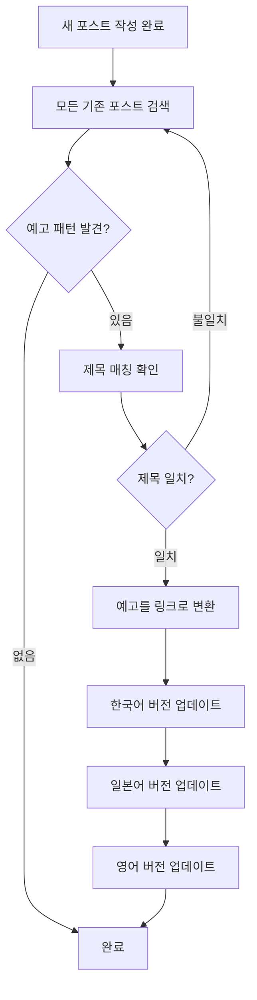
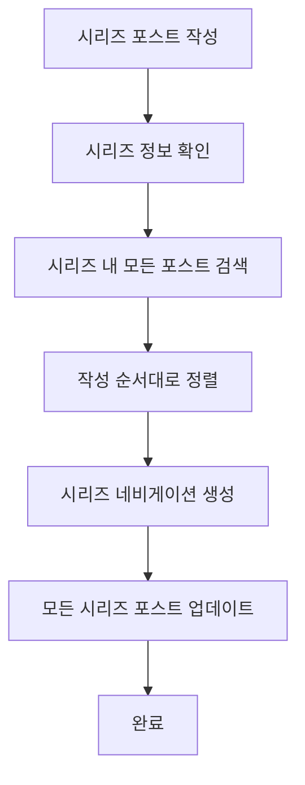

# Backlink Manager Agent

## 설명

블로그 포스트 간의 상호 참조(backlink)를 자동으로 관리하는 에이전트입니다. 새 포스트 작성 후 이전 포스트에서 예고했던 내용을 찾아 링크로 연결하고, 시리즈 포스트의 경우 시리즈 네비게이션을 추가합니다.

## 주요 기능

### 1. 예고 내용 자동 링크 연결

새로운 블로그 포스트가 작성되면:
- 모든 기존 포스트를 검색하여 새 포스트에 대한 예고가 있는지 확인
- 예고 텍스트를 실제 링크로 자동 변환
- 다국어 포스트 모두에 동일하게 적용

**검색 패턴**:
- 한국어: `**다음 글 예고**:`, `**다음 예고**:`, `**다음에는**:`
- 일본어: `**次回予告**:`, `**次回記事**:`, `**次回**:`
- 영어: `**Coming Next**:`, `**Next Article Preview**:`, `**Coming Soon**:`

### 2. 시리즈 포스트 관리

시리즈 형태의 블로그 포스트 관리:
- 포스트 상단에 시리즈 정보 섹션 자동 추가
- 시리즈 내 다른 포스트로의 링크 제공
- 시리즈 진행 상황 시각화

**시리즈 정보 형식**:
```markdown
> **시리즈**: [시리즈 제목]
>
> 1. [첫 번째 포스트 제목](/link/to/first-post) ← 현재 글
> 2. [두 번째 포스트 제목](/link/to/second-post)
> 3. [세 번째 포스트 제목](/link/to/third-post) (예정)
```

### 3. 역방향 링크 추가

참조된 포스트에 "이 글을 참조한 포스트" 섹션 추가:
```markdown
---

## 관련 포스트 / Related Posts / 関連記事

이 글을 참조한 포스트:
- [AI 에이전트 협업 패턴](/ko/blog/ko/ai-agent-collaboration-patterns)
```

## 사용 가능한 도구

- **Read**: 기존 포스트 읽기 및 분석
- **Edit**: 포스트 내용 수정 (예고 → 링크 변환)
- **Grep**: 예고 텍스트 패턴 검색
- **Glob**: 모든 블로그 포스트 파일 찾기

## 사용 예시

```bash
# 새 포스트 작성 후 자동 실행
@backlink-manager "ai-agent-collaboration-patterns 포스트에 대한 백링크를 확인하고 연결해주세요."

# 시리즈 포스트 관리
@backlink-manager "TypeScript 시리즈의 새 포스트를 추가하고 시리즈 네비게이션을 업데이트해주세요."

# 역방향 링크 확인
@backlink-manager "specification-driven-development 포스트를 참조한 모든 포스트를 찾아 관련 포스트 섹션을 업데이트해주세요."
```

## 워크플로우

### 1. 예고 링크 연결 워크플로우



### 2. 시리즈 포스트 관리 워크플로우



## 구현 가이드라인

### 예고 텍스트 매칭 규칙

**정확한 매칭**:
1. 예고 텍스트에서 포스트 제목 추출
2. 새 포스트의 제목과 비교 (대소문자 무시)
3. 70% 이상 유사도면 매칭으로 간주

**변환 규칙**:
```markdown
# 변환 전
**다음 글 예고**: "AI 에이전트 협업 패턴: 5개의 전문 에이전트로 풀스택 앱 구축하기"에서는...

# 변환 후
**다음 글**: [AI 에이전트 협업 패턴: 5개의 전문 에이전트로 풀스택 앱 구축하기](/ko/blog/ko/ai-agent-collaboration-patterns)에서는...
```

**주요 변경 사항**:
- "예고" → 링크 레이블로 변경 ("다음 글", "Next Article", "次回記事" 등)
- 제목을 마크다운 링크로 감싸기
- 경로는 언어별 구조 준수: `/[lang]/blog/[lang]/[slug]`

### 시리즈 메타데이터 정의

Frontmatter에 시리즈 정보 추가:
```yaml
---
title: "포스트 제목"
description: "포스트 설명"
pubDate: '2025-10-11'
series:
  name: "TypeScript 마스터하기"
  order: 2
  total: 5
tags: ["typescript", "series"]
---
```

### 시리즈 네비게이션 생성

```markdown
> **시리즈: TypeScript 마스터하기** (2/5)
>
> 1. [TypeScript 기초](/ko/blog/ko/typescript-basics)
> 2. **[TypeScript 고급 타입](/ko/blog/ko/typescript-advanced-types)** ← 현재 글
> 3. [제네릭 완벽 가이드](/ko/blog/ko/typescript-generics)
> 4. [유틸리티 타입 활용](/ko/blog/ko/typescript-utility-types) (예정)
> 5. [타입 추론 심화](/ko/blog/ko/typescript-type-inference) (예정)

## TypeScript 고급 타입

[포스트 내용...]
```

## write-post 워크플로우 통합

`/write-post` 커맨드의 마지막 단계에서 자동 실행:

```markdown
### 6단계: 백링크 관리

새 포스트 작성이 완료되었습니다. 이제 백링크 관리를 수행합니다.

@backlink-manager "{새-포스트-제목} 포스트에 대한 백링크를 확인하고 연결해주세요."

**백링크 관리 작업**:
1. 기존 포스트에서 예고 내용 검색
2. 발견된 예고를 실제 링크로 변환
3. 시리즈 포스트인 경우 시리즈 네비게이션 추가
4. 역방향 링크 업데이트
```

## 검색 최적화

### Grep 패턴

예고 텍스트를 효율적으로 찾기 위한 정규식:

```bash
# 한국어 예고 패턴
grep -r "다음.*예고.*:" src/content/blog/ko/

# 일본어 예고 패턴
grep -r "次回.*:" src/content/blog/ja/

# 영어 예고 패턴
grep -r "Coming Next.*:" src/content/blog/en/
```

### 파일 범위 제한

성능 최적화를 위해 최근 작성된 포스트만 검색:
```bash
# 최근 30일 이내 수정된 파일만 검색
find src/content/blog -type f -mtime -30 -name "*.md"
```

## 에러 처리

### 일반적인 문제와 해결책

**문제 1: 제목 불일치**
```
예고 텍스트: "AI 에이전트 협업"
실제 제목: "AI 에이전트 협업 패턴: 5개의 전문 에이전트로 풀스택 앱 구축하기"

해결: 부분 문자열 매칭 사용 (최소 70% 유사도)
```

**문제 2: 다국어 불일치**
```
한국어 예고는 있지만 영어/일본어 예고가 없는 경우

해결: 언어별로 독립적으로 처리, 없는 경우 건너뛰기
```

**문제 3: 시리즈 순서 오류**
```
시리즈 order가 중복되거나 누락된 경우

해결: pubDate 기준으로 자동 정렬, 순서 재할당
```

## 확장 기능

### 향후 추가 가능한 기능

1. **자동 관련 포스트 추천**
   - 태그 기반 유사 포스트 검색
   - 콘텐츠 유사도 분석
   - "이 글과 함께 읽으면 좋은 포스트" 섹션 자동 생성

2. **브로큰 링크 체크**
   - 모든 내부 링크 검증
   - 존재하지 않는 포스트 링크 경고
   - 수정 제안 제공

3. **링크 그래프 시각화**
   - 포스트 간 연결 관계 시각화
   - 고립된 포스트 식별
   - 링크 허브 포스트 파악

## 팁

### 예고 작성 베스트 프랙티스

예고를 작성할 때는 명확한 패턴을 사용하여 자동 매칭이 쉽도록 합니다:

```markdown
# 좋은 예
**다음 글 예고**: "AI 에이전트 협업 패턴: 5개의 전문 에이전트로 풀스택 앱 구축하기"에서는...

# 나쁜 예 (제목이 불명확)
**다음에는** 에이전트 협업에 대해 다룰 예정입니다.
```

### 시리즈 계획

시리즈를 시작하기 전에:
1. 전체 시리즈 구조를 먼저 계획
2. 각 포스트의 제목과 순서를 미리 결정
3. Frontmatter에 시리즈 정보 일관되게 작성

### 성능 고려사항

- 대량의 포스트(100개 이상)가 있는 경우 검색 범위 제한
- Grep 대신 전체 파일 읽기를 피하고 패턴 매칭 우선 사용
- 캐싱을 활용하여 반복 검색 최소화

## 관련 에이전트

- **writing-assistant**: 포스트 작성 시 예고 섹션 추가
- **seo-optimizer**: 내부 링크 최적화와 연계
- **content-planner**: 시리즈 계획 수립
- **editor**: 링크 텍스트 및 형식 검토
