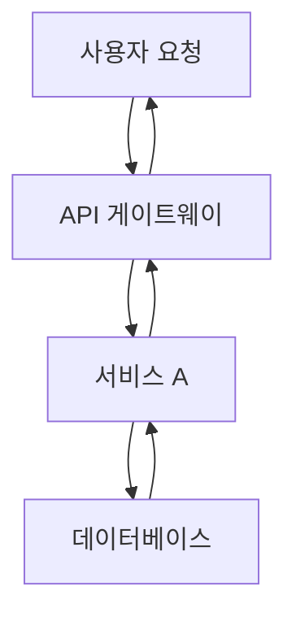

# 블로그 포스트 작성 명령어

## 설명

다국어 지원, SEO 최적화, 히어로 이미지 자동 생성 기능을 갖춘 블로그 포스트를 자동으로 생성합니다. 이 명령어는 Writing Assistant 에이전트를 조율하여 완전한 발행 준비 상태의 블로그 포스트를 만듭니다.

## 사용법

```bash
/write-post <주제> [옵션]
```

## 매개변수

### 필수

- `주제` (문자열): 블로그 포스트의 주제/제목

### 선택

- `--tags` (문자열): 쉼표로 구분된 태그 목록 (예: "nextjs,react,typescript")
- `--languages` (문자열): 쉼표로 구분된 언어 코드 (기본값: "ko,ja,en")
  - 사용 가능: ko (한국어), ja (일본어), en (영어)
- `--description` (문자열): SEO 최적화된 설명 (150-160자 권장)

## 예시

```bash
# 기본 사용법 (한국어, 일본어, 영어 버전 생성)
/write-post "Next.js 15의 새로운 기능"

# 태그 포함
/write-post "React 커스텀 훅 가이드" --tags react,hooks,javascript

# 특정 언어만 지정
/write-post "TypeScript 고급 타입 활용법" --tags typescript,types --languages ko,ja

# 커스텀 설명 포함
/write-post "Astro로 블로그 만들기" --tags astro,blog --description "Astro 프레임워크를 사용하여 고성능 블로그를 구축하는 완벽 가이드"

# 모든 옵션 결합
/write-post "Tailwind CSS 최적화 전략" --tags tailwind,css,performance --languages ko,ja,en --description "Tailwind CSS를 사용한 프로젝트에서 성능을 극대화하는 실전 최적화 기법"
```

## 워크플로우

### 1. 입력 파싱

- 주제 및 모든 선택적 매개변수 파싱
- 언어 코드 검증 (ko, ja, en)
- 태그 정리 (소문자, 영숫자, 하이픈만 허용)
- 설명이 제공되지 않은 경우 기본 설명 생성

### 2. Writing Assistant 에이전트 호출

명령어는 다음 작업을 수행하도록 Writing Assistant 에이전트에 위임합니다:

#### Phase 1: 리서치 및 계획

- 주제 분석 및 핵심 포인트 식별
- **Web Researcher 에이전트를 사용한 현재 정보 리서치**:
  - Brave Search MCP를 사용하여 최신 정보 수집
  - **중요: 요청 간 2초 지연 구현하여 Rate Limit 회피**
  - 공식 문서에서 기술적 정확성 검증
  - 트렌딩 논의 및 모범 사례 식별
  - 신뢰할 수 있는 출처에서 코드 예제 수집
- 리서치 결과를 기반으로 콘텐츠 구조 및 개요 작성
- 필요한 추가 코드 예제 및 기술적 세부사항 식별

#### Phase 2: 이미지 생성

- 주제를 기반으로 히어로 이미지 프롬프트 생성
- Image Generator 에이전트 호출하여 히어로 이미지 생성
- 적절한 경로에 이미지 저장: `src/assets/blog/[slug]-hero.[ext]`
- frontmatter용 이미지 메타데이터 저장

#### Phase 3: 콘텐츠 생성

**중요 - 발행 날짜**:

- 항상 `pubDate`를 **최신 블로그 포스트보다 하루 이후로** 설정
- `src/content/blog/` 전체 언어에서 가장 최근 포스트 찾기
- 해당 날짜에 1일 추가하여 새 포스트 날짜 설정
- 형식: 'YYYY-MM-DD' (작은따옴표 필수)

`--languages`의 각 언어에 대해:

- 대상 언어로 완전한 블로그 포스트 생성
- 적절한 Astro frontmatter 포함:
  ```yaml
  ---
  title: [생성된 제목]
  description: [SEO 설명]
  pubDate: "[최신 포스트 날짜 + 1일]" # 작은따옴표와 YYYY-MM-DD 형식 필수
  heroImage: ../../../assets/blog/[slug]-hero.[ext]
  tags: [tag1, tag2, ...]
  ---
  ```
- 언어별 톤과 스타일 적용
- 언어 간 기술 용어 일관성 유지
- 구문 강조가 포함된 코드 예제 추가
- 적절한 제목, 목록 및 서식 추가

#### Phase 4: 파일 작업

- 주제에서 URL 친화적인 slug 생성
- 적절한 경로에 파일 저장:
  - 한국어: `/src/content/blog/ko/[slug].md`
  - 일본어: `/src/content/blog/ja/[slug].md`
  - 영어: `/src/content/blog/en/[slug].md`
- Content Collections 스키마 준수 보장
- frontmatter 필수 필드 검증

### 3. 품질 검사

- 모든 파일이 성공적으로 생성되었는지 확인
- frontmatter 형식 확인 (title, description, pubDate 필수)
- 이미지 경로 참조 검증
- 적절한 Markdown 서식 확인

### 4. README.md 업데이트

모든 블로그 포스트 파일 생성 후:

- `README.md` 읽기
- "블로그 포스트 현황" 섹션 업데이트:
  - 총 포스트 수 증가
  - 목록 맨 위에 새 포스트 추가 (제목, 날짜, 설명 포함)
  - "최신 포스트 날짜"를 새 포스트의 pubDate로 업데이트
  - 하단의 "Last Updated" 타임스탬프 업데이트
- 새 포스트 주제가 "향후 콘텐츠 플랜"에 있었다면 해당 섹션에서 제거

### 5. 백링크 관리

포스트 생성 및 문서화 후 백링크 관리:

#### Phase 1: 미리보기 참조 찾기

- 새 포스트를 언급하는 미리보기/티저 텍스트를 모든 기존 블로그 포스트에서 검색
- Grep을 사용하여 일반적인 미리보기 패턴 검색:
  - 한국어: `다음.*예고`, `다음 글`, `다음에는`
  - 일본어: `次回.*予告`, `次回記事`, `次回`
  - 영어: `Coming Next`, `Next Article Preview`, `Coming Soon`

#### Phase 2: 미리보기를 링크로 변환

발견된 각 미리보기에 대해:

- 미리보기 텍스트가 새 포스트 제목과 일치하는지 확인 (70% 이상 유사성)
- 미리보기 텍스트를 실제 markdown 링크로 변환
- 모든 언어 버전에서 일관되게 업데이트
- 미리보기 레이블 변경 (예: "다음 글 예고" → "다음 글")

**변환 예시**:

```markdown
# 변경 전

**다음 글 예고**: "AI 에이전트 협업 패턴"에서는...

# 변경 후

**다음 글**: [AI 에이전트 협업 패턴](/ko/blog/ko/ai-agent-collaboration-patterns)에서는...
```

#### Phase 3: 시리즈 관리 (해당되는 경우)

새 포스트가 시리즈의 일부인 경우:

1. 포스트 상단에 시리즈 네비게이션 추가:

   ```markdown
   > **시리즈: [시리즈 이름]** (2/5)
   >
   > 1. [첫 번째 포스트](/link/to/first-post)
   > 2. **[현재 포스트](/link/to/current-post)** ← 현재 글
   > 3. [세 번째 포스트](/link/to/third-post)
   > 4. [네 번째 포스트](/link/to/fourth-post) (예정)
   > 5. [다섯 번째 포스트](/link/to/fifth-post) (예정)
   ```

2. 시리즈의 다른 모든 포스트에서 시리즈 네비게이션 업데이트
3. 모든 언어 버전에 적용

#### Backlink Manager 에이전트에 위임

```bash
@backlink-manager "[new-post-slug] 포스트에 대한 백링크를 확인하고 연결해주세요."
```

Backlink Manager 에이전트는:

- 자동으로 미리보기를 찾아 변환
- 시리즈 네비게이션 업데이트 처리
- 모든 언어 버전에서 일관성 보장
- 수행한 모든 변경사항 보고

### 6. 포스트 메타데이터 분석

블로그 포스트 생성 및 백링크 관리 후, 포스트의 메타데이터를 `post-metadata.json`에 추가합니다.

#### 메타데이터 구조 (V3)

**중요 변경사항**: V3에서는 메타데이터가 크게 경량화되어 **3개 필드만** 저장합니다:

```json
{
  "post-slug": {
    "pubDate": "2025-11-04",
    "difficulty": 3,
    "categoryScores": {
      "automation": 0.9,
      "web-development": 0.3,
      "ai-ml": 0.85,
      "devops": 0.5,
      "architecture": 0.75
    }
  }
}
```

**필드 설명**:

1. **pubDate** (문자열, 필수):
   - 형식: 'YYYY-MM-DD'
   - 시간 역행 방지 및 추천 필터링에 사용

2. **difficulty** (숫자 1-5, 필수):
   - 1-2: 초급 (Getting Started, 기본 개념)
   - 3: 중급 (실전 활용, 통합 가이드)
   - 4-5: 고급 (아키텍처, 최적화, 복잡한 시스템)

3. **categoryScores** (객체, 필수):
   - automation: 자동화, 워크플로우, CI/CD 관련도 (0.0-1.0)
   - web-development: 웹 개발, 프론트엔드, 백엔드 관련도 (0.0-1.0)
   - ai-ml: AI, 머신러닝, LLM 관련도 (0.0-1.0)
   - devops: 배포, 인프라, 모니터링 관련도 (0.0-1.0)
   - architecture: 시스템 설계, 아키텍처 패턴 관련도 (0.0-1.0)

**점수 가이드라인**:
- 0.0-0.3: 거의 관련 없음
- 0.4-0.6: 부분적으로 관련
- 0.7-0.8: 주요 주제
- 0.9-1.0: 핵심 주제

#### 메타데이터 추가 방법

`post-metadata.json` 파일을 직접 편집하여 새 포스트의 메타데이터를 추가합니다:

```json
{
  "existing-post-1": {
    "pubDate": "2025-11-01",
    "difficulty": 2,
    "categoryScores": { ... }
  },
  "new-post-slug": {
    "pubDate": "2025-11-04",
    "difficulty": 3,
    "categoryScores": {
      "automation": 0.9,
      "web-development": 0.3,
      "ai-ml": 0.85,
      "devops": 0.5,
      "architecture": 0.75
    }
  }
}
```

**주의사항**:
- slug는 언어 접두사 **제외** (예: "slack-mcp-team-communication", "ko/slack-mcp-team-communication" 아님)
- 모든 언어 버전이 동일한 메타데이터 공유
- pubDate는 반드시 최신 포스트 + 1일

### 7. 관련 포스트 추천 생성 (V3)

메타데이터 추가 후, V3 추천 시스템을 사용하여 관련 포스트를 생성합니다.

#### V3 시스템 개요

**핵심 변경사항**:
- ✅ `recommendations.json` 파일 **폐지** - 더 이상 외부 JSON 파일 불필요
- ✅ `post-metadata.json`에서 직접 읽기 (3개 필드만 사용)
- ✅ `relatedPosts` 배열을 **Frontmatter에 직접 저장**
- ✅ Content Collections 스키마에 통합
- ✅ 빌드 시 Astro가 자동으로 처리

**장점**:
- 파일 크기 62% 감소 (800줄 → 300줄)
- 빌드 시 I/O 작업 100% 제거
- 코드 복잡도 27% 감소
- 데이터 일관성 향상 (단일 진실 소스)

#### V3 추천 생성 실행

```bash
# 스크립트 실행
node scripts/generate-recommendations-v3.js

# 또는 npm script 사용 (있는 경우)
npm run generate-recommendations
```

**스크립트 동작**:

1. `post-metadata.json` 읽기
2. 각 포스트에 대해 유사도 계산:
   - **난이도 유사도** (20%): 비슷한 난이도 우선
   - **카테고리 유사도** (80%): 코사인 유사도 기반
3. 상위 5개 추천 선택 (점수 0.3 이상)
4. 각 포스트의 **3개 언어 버전 frontmatter에 직접 작성**:

```yaml
---
title: "포스트 제목"
description: "설명"
pubDate: "2025-11-04"
relatedPosts:
  - slug: ai-agent-notion-mcp-automation
    score: 0.92
    reason:
      ko: "두 포스트 모두 MCP 서버를 활용한 자동화를 다룹니다."
      ja: "両記事ともMCPサーバーを活用した自動化を扱います。"
      en: "Both posts cover MCP server-based automation."
  - slug: google-analytics-mcp-automation
    score: 0.85
    reason:
      ko: "MCP 통합과 데이터 분석 자동화에서 유사합니다."
      ja: "MCP統合とデータ分析自動化で類似しています。"
      en: "Similar in MCP integration and data analysis automation."
---
```

**주의사항**:
- 스크립트는 **모든 포스트의 3개 언어 파일을 수정**합니다
- Git에 자동 커밋되지 않으므로 수동으로 커밋 필요
- 실행 전 백업 권장 (`git stash` 또는 `git commit`)

### 8. 출력 요약

생성 결과 표시:

```
✓ 블로그 포스트 생성 완료!

생성된 파일:
  - /src/content/blog/ko/[slug].md (한국어)
  - /src/content/blog/ja/[slug].md (일본어)
  - /src/content/blog/en/[slug].md (영어)

히어로 이미지:
  - src/assets/blog/[slug]-hero.[ext]

메타데이터:
  - 제목: [생성된 제목]
  - 태그: [tag1, tag2, ...]
  - 발행 날짜: [YYYY-MM-DD]

README.md 업데이트:
  ✓ 포스트 수 업데이트
  ✓ 목록에 새 포스트 추가
  ✓ 최신 포스트 날짜 업데이트

백링크 업데이트:
  ✓ [N]개 미리보기 참조 발견
  ✓ 활성 링크로 변환
  ✓ 시리즈 네비게이션 업데이트 (해당되는 경우)

메타데이터 추가:
  ✓ post-metadata.json에 추가
  ✓ pubDate: [날짜]
  ✓ difficulty: [1-5]
  ✓ categoryScores: 설정 완료

관련 포스트 생성 (V3):
  ✓ [N]개 관련 포스트 식별
  ✓ frontmatter에 직접 저장
  ✓ 3개 언어 추론 생성
  ✓ 유사도 점수 계산 완료

다음 단계:
  1. 생성된 콘텐츠 검토
  2. 실행: npm run astro check
  3. 미리보기: npm run dev
```

## Writing Assistant 에이전트 위임

### 에이전트에 제공되는 컨텍스트

```markdown
작업: 블로그 포스트 생성
주제: [사용자 제공 주제]
태그: [tag1, tag2, ...]
언어: [언어 코드]
설명: [SEO 설명 또는 "적절한 설명 생성"]

요구사항:

1. **발행 날짜 결정**:

   - src/content/blog/ 모든 언어 폴더에서 가장 최근 블로그 포스트 찾기
   - 최신 pubDate 추출
   - 1일 추가하여 새 포스트의 pubDate 얻기
   - 형식: 'YYYY-MM-DD' (작은따옴표)

2. Web Researcher 에이전트를 사용한 주제 리서치:

   - 포괄적인 리서치를 위해 Web Researcher에 위임
   - **중요: 검색 요청 간 2초 지연 보장**
   - 최신 정보, 공식 문서, 예제 수집
   - 기술적 정확성 및 현재 모범 사례 검증
   - 리서치 결과를 기반으로 상세한 개요 작성

3. 히어로 이미지 생성:

   - 설명적인 이미지 프롬프트 생성
   - Image Generator 에이전트 호출
   - src/assets/blog/[slug]-hero.[ext]에 저장
   - frontmatter에서 ../../../assets/blog/[slug]-hero.[ext] 경로 사용

4. 각 언어에 대해 완전한 블로그 포스트 작성 **병렬로**:

   **중요 - 병렬 실행**:
   - 3개의 별도 general-purpose 에이전트 생성 (언어당 하나)
   - **단일 메시지에서** 여러 Task 도구 호출로 세 에이전트 모두에 위임
   - 각 에이전트는 동일한 리서치 결과, 개요, 메타데이터 받음
   - 각 에이전트는 대상 언어에 대해 독립적으로 작성
   - 모든 에이전트가 동시에 실행되어 효율성 극대화

   **에이전트 위임 패턴**:
   ```
   3개 Task 호출이 포함된 단일 메시지:
   - Task 1: 한국어 작성 에이전트
   - Task 2: 일본어 작성 에이전트
   - Task 3: 영어 작성 에이전트
   ```

   **각 언어 에이전트는 반드시**:
   - Astro Content Collections 스키마 준수
   - frontmatter 포함 (title, description, pubDate, heroImage, tags)
   - **1단계에서 계산된 pubDate 사용**
   - 기술 블로그 톤과 스타일 사용
   - 적절한 경우 코드 예제 포함
   - 적절한 제목 및 구조 추가
   - 언어별 SEO 최적화 적용
   - 완료 시 올바른 언어 폴더에 저장

5. 언어별 폴더에 파일 저장:

   - 한국어: /src/content/blog/ko/[slug].md
   - 일본어: /src/content/blog/ja/[slug].md
   - 영어: /src/content/blog/en/[slug].md

6. README.md 업데이트:

   - 현재 README.md 읽기
   - "블로그 포스트 현황" 섹션 업데이트
   - 포스트 수 증가
   - 목록 맨 위에 새 포스트 추가
   - "최신 포스트 날짜" 업데이트
   - "Last Updated" 타임스탬프 업데이트
   - 있는 경우 "향후 콘텐츠 플랜"에서 주제 제거

7. 백링크 관리:

   - Backlink Manager 에이전트에 위임
   - 기존 포스트에서 미리보기/티저 참조 검색
   - 발견된 미리보기를 활성 링크로 변환
   - 포스트가 시리즈의 일부인 경우 시리즈 네비게이션 업데이트
   - 수행한 모든 변경사항 보고

8. 포스트 메타데이터 추가 (V3):

   - post-metadata.json 파일 열기
   - 새 포스트에 대한 메타데이터 추가:
     ```json
     {
       "new-post-slug": {
         "pubDate": "2025-11-04",
         "difficulty": 3,
         "categoryScores": {
           "automation": 0.9,
           "web-development": 0.3,
           "ai-ml": 0.85,
           "devops": 0.5,
           "architecture": 0.75
         }
       }
     }
     ```
   - 콘텐츠 분석을 기반으로 difficulty 및 categoryScores 결정
   - 파일 저장

9. 관련 포스트 추천 생성 (V3):

   - `node scripts/generate-recommendations-v3.js` 실행
   - 스크립트는 다음을 수행:
     - post-metadata.json에서 메타데이터 읽기
     - 유사도 점수 계산 (난이도 20% + 카테고리 80%)
     - 상위 5개 관련 포스트 선택
     - 3개 언어 버전 frontmatter에 relatedPosts 배열 작성
   - 결과 확인 및 보고

10. 주제에서 URL 친화적인 slug 생성
11. 파일 경로 및 메타데이터 반환
```

### 예상 에이전트 응답 형식

```json
{
  "success": true,
  "files": [
    {
      "language": "ko",
      "path": "/src/content/blog/ko/[slug].md",
      "title": "[한국어 제목]"
    },
    {
      "language": "ja",
      "path": "/src/content/blog/ja/[slug].md",
      "title": "[일본어 제목]"
    },
    {
      "language": "en",
      "path": "/src/content/blog/en/[slug].md",
      "title": "[영어 제목]"
    }
  ],
  "heroImage": "../../../assets/blog/[slug]-hero.[ext]",
  "slug": "[생성된-slug]",
  "tags": ["tag1", "tag2"],
  "pubDate": "[YYYY-MM-DD]",
  "metadata": {
    "difficulty": 3,
    "categoryScores": {
      "automation": 0.9,
      "web-development": 0.3,
      "ai-ml": 0.85,
      "devops": 0.5,
      "architecture": 0.75
    }
  }
}
```

## 콘텐츠 가이드라인

### Frontmatter 스키마 (필수 준수)

```yaml
---
title: string (필수, SEO 가이드라인 참조)
description: string (필수, SEO 가이드라인 참조)
pubDate: string (필수, 형식: 'YYYY-MM-DD', 작은따옴표)
heroImage: string (선택, 콘텐츠 파일에서 상대 경로: ../../../assets/blog/[image])
tags: array (선택, 소문자, 영숫자 + 하이픈)
updatedDate: string (선택, 형식: 'YYYY-MM-DD', 작은따옴표)
relatedPosts: array (V3에서 자동 생성, 수동 편집 불필요)
---
```

**SEO 최적화 가이드라인**: `.claude/guidelines/seo-title-description-guidelines.md` 참조

**제목 권장 길이**:

- 한국어: 25-30자
- 영어: 50-60자
- 일본어: 30-35자

**설명 권장 길이**:

- 한국어: 70-80자
- 영어: 150-160자
- 일본어: 80-90자

### 콘텐츠 구조

````markdown
## 개요 / Overview / 概要

[소개 단락 - 컨텍스트 및 문제 설명]

## 핵심 내용 / Key Concepts / 主要内容

### [하위 주제 1]

[상세 설명]

### [하위 주제 2]

[상세 설명]

## 코드 예제 / Code Examples / コード例

```language
[작동하는 코드 예제]
```
````

## 실전 활용 / Practical Application / 実践活用

[실제 사용 사례]

## 결론 / Conclusion / 結論

[요약 및 핵심 요점]

## 참고 자료 / References / 参考資料

- [링크 1]
- [링크 2]

`````

### 스타일 가이드라인

- 명확하고 전문적인 기술 글쓰기 사용
- 처음 사용 시 기술 용어 설명
- 작동하는 코드 예제 포함
- 능동태 사용
- 단락을 간결하게 유지 (2-4문장)
- 목록에 글머리 기호 사용
- 대상 언어로 코드 주석 추가

### Markdown 서식 가이드라인

**중요 - 중첩된 코드 블록**:
삼중 백틱(```)을 포함하는 markdown 코드 블록을 표시해야 할 때는 **외부 블록에 사중 백틱(````)을 사용**해야 합니다. 이렇게 하면 렌더링 문제를 방지할 수 있습니다.

**예시**:

❌ **잘못됨** (렌더링 깨짐):
````markdown
```markdown
## 예제
```javascript
const code = 'nested';
`````

```

```

✅ **올바름** (사중 백틱 사용):

`````markdown
````markdown
## 예제

```javascript
const code = "nested";
```
````
`````

**사중 백틱을 사용해야 하는 경우**:

- markdown 구문을 문서화할 때 코드 블록 포함
- frontmatter와 코드가 포함된 블로그 포스트 예제 표시
- 문서 작성 방법 시연
- 내부에 삼중 백틱(```)이 포함된 모든 경우

**따라야 할 패턴**:

1. 내부에 삼중 백틱이 **없으면** → 삼중 백틱(```) 사용
2. 내부에 삼중 백틱이 **있으면** → 사중 백틱(````) 사용
3. 항상 열린 것과 동일한 수의 백틱으로 닫기

### Mermaid 다이어그램 가이드라인

**중요 - 모든 플로우 다이어그램에 Mermaid 사용**:
모든 유형의 플로우 다이어그램, 아키텍처 다이어그램, 시퀀스 다이어그램 또는 프로세스 플로우를 생성할 때는 일반 텍스트 다이어그램 대신 **반드시 Mermaid 구문을 사용**해야 합니다.

**Mermaid를 사용해야 하는 경우**:

- 워크플로우 및 프로세스 플로우
- 시스템 아키텍처 다이어그램
- 계층 구조 (조직도, 컴포넌트 트리)
- 시퀀스 다이어그램 (컴포넌트 간 상호작용)
- 상태 다이어그램
- 데이터 플로우 다이어그램
- 관계 또는 플로우의 모든 시각적 표현

**일반적인 Mermaid 다이어그램 유형**:

1. **플로우차트** - 워크플로우 및 프로세스 플로우용:

   ```mermaid
   graph TD
       A[시작] --> B{결정}
       B -->|예| C[프로세스 A]
       B -->|아니오| D[프로세스 B]
       C --> E[종료]
       D --> E
   ```

   - `graph TD` (하향식) 또는 `graph LR` (좌우) 사용
   - 상하 플로우에는 `graph TB` 사용

2. **시퀀스 다이어그램** - 상호작용 및 이벤트 플로우용:

   ```mermaid
   sequenceDiagram
       participant 사용자
       participant API
       participant DB

       사용자->>API: 요청
       API->>DB: 쿼리
       DB->>API: 응답
       API->>사용자: 결과
   ```

3. **계층적 다이어그램** - 트리 구조용:

   ```mermaid
   graph TD
       Manager[관리자 에이전트] --> A[에이전트 A]
       Manager --> B[에이전트 B]
       Manager --> C[에이전트 C]
   ```

4. **병렬 실행 플로우**:
   ```mermaid
   graph TB
       Start[시작] --> A[작업 A]
       Start --> B[작업 B]
       A --> End[병합]
       B --> End
   ```

**Mermaid 모범 사례**:

- 항상 설명적인 노드 레이블 사용
- 노드 레이블에서 줄바꿈에 `<br/>` 사용 (예: `Node[줄 1<br/>줄 2]`)
- 다이어그램을 단순하고 읽기 쉽게 유지
- 적절한 화살표 유형 사용:
  - `-->` 표준 플로우용
  - `->>` 시퀀스 다이어그램 메시지용
  - `-.->` 선택적/조건부 경로용
- 필요시 엣지에 텍스트 추가: `A -->|레이블| B`

**예시 - 변경 전 vs 후**:

❌ **잘못됨** (일반 텍스트):

```
사용자 요청
    ↓
API 게이트웨이 → 서비스 A → 데이터베이스
    ↓
응답
```

✅ **올바름** (Mermaid):



**다국어 고려사항**:

- 노드 레이블 및 텍스트에 대상 언어 사용
- 적절한 경우 기술 용어는 영어로 유지 (예: "API", "Database")
- 동일한 다이어그램의 모든 언어 버전에서 일관성 보장

### 언어별 참고사항

- **한국어**: 존댓말 (격식 있는 공손한 말투) 사용, 한국어와 영어 기술 용어 자연스럽게 혼합
- **일본어**: です/ます체 (공손한 형태) 사용, 기술 용어에 가타카나 사용
- **영어**: 미국 영어 철자 사용, 표준 기술 문서 스타일

## 이미지 생성 통합

### 히어로 이미지 요구사항

- 크기: 1020x510px (2:1 비율) 권장
- 형식: WebP, AVIF 또는 JPG
- 파일 이름: `[slug]-hero.[ext]`
- 위치: `src/assets/blog/`
- Frontmatter 경로: `../../../assets/blog/[slug]-hero.[ext]` (콘텐츠 파일에서 상대 경로)

### 이미지 프롬프트 가이드라인

**중요**: Writing Assistant는 블로그 포스트의 특정 콘텐츠와 테마를 반영하는 컨텍스트 인식, 상세한 이미지 프롬프트를 생성해야 하며, 일반적인 템플릿이 **아닙니다**.

#### 프롬프트 생성 프로세스:

1. **블로그 포스트 콘텐츠를 분석**하여 다음을 식별:

   - 주요 테마 및 핵심 개념
   - 기술 도메인 (예: 웹 개발, AI, 데이터 과학, DevOps)
   - 분위기/톤 (예: 혁신적, 문제 해결, 교육적)
   - 콘텐츠를 나타내는 특정 시각적 은유

2. **상세하고 독특한 프롬프트 생성**에 다음 포함:
   - **주제**: 주요 개념의 특정 시각적 표현
   - **스타일**: 콘텐츠와 일치하는 아트 스타일 (예: 아키텍처용 아이소메트릭, 프로세스용 다이어그램 스타일, AI용 미래지향적, 성능용 미니멀)
   - **구성**: 레이아웃 및 관점
   - **색상**: 콘텐츠 분위기와 일치하는 팔레트
   - **세부사항**: 핵심 개념을 상징하는 특정 요소
   - **분위기**: 전체적인 느낌 (전문적, 역동적, 깔끔한, 혁신적)

#### 좋은 프롬프트 vs 나쁜 프롬프트 예시:

**❌ 나쁨 (일반적)**:

```
TypeScript를 나타내는 현대적이고 전문적인 일러스트레이션.
스타일: 깔끔하고 기술적이며 개발자 중심.
```

**✅ 좋음 (컨텍스트 인식)**:

```
강력한 타입 안전 아키텍처를 형성하는 상호 연결된 TypeScript 코드 블록의 아이소메트릭 일러스트레이션.
스타일: 기하학적 모양의 현대적인 기술 일러스트레이션, 청사진 미학.
구성: 중앙의 TypeScript "T" 로고가 주변 코드 모듈로 타입 정의를 방사.
색상: 주 색상으로 TypeScript 파란색(#3178C6), 코드 블록에 흰색 및 연한 회색, 미묘한 그래디언트.
요소: 레이블로 떠 있는 타입 주석, 타입 플로우를 보여주는 연결된 노드, 타입 안전성의 방패 심볼.
분위기: 구조화되고 신뢰할 수 있으며 전문적.
텍스트 오버레이 없음.
```

#### 도메인별 프롬프트 템플릿:

**AI/ML 주제의 경우**:

- 신경망 시각화, 뇌-컴퓨터 인터페이스, 데이터 스트림
- 네온 악센트가 있는 미래지향적이고 하이테크한 미학
- 학습/지능의 추상적 표현

**성능/최적화 주제의 경우**:

- 속도 은유 (로켓, 번개, 유선형 모양)
- 이전/이후 비교, 최적화 그래프
- 효율성을 강조하는 미니멀하고 깔끔한 디자인

**아키텍처/시스템 설계 주제의 경우**:

- 아이소메트릭 빌딩 블록, 청사진 스타일
- 연결된 시스템, 데이터 플로우 다이어그램
- 전문적인 청사진 또는 기술 도면 미학

**프로세스/워크플로우 주제의 경우**:

- 타임라인 또는 플로우차트 표현
- 단계별 시각적 진행
- 명확한 계층 구조를 가진 조직화되고 구조화된 레이아웃

**보안 주제의 경우**:

- 자물쇠, 방패, 요새 은유
- 계층화된 보호 시각화
- 신뢰 구축 요소가 있는 다크 테마

**웹 개발 주제의 경우**:

- 브라우저 창, 반응형 레이아웃
- HTML/CSS/JS 시각적 표현
- 화려하고 현대적인 웹 디자인 미학

#### 추가 요구사항:

- **이미지에 텍스트를 항상 피하기** (코드 스니펫 없음, 레이블 없음)
- **블로그 포스트의 복잡도 수준과 일치** (초급 콘텐츠는 단순하게, 고급은 정교하게)
- **다국어 포스트의 문화적 컨텍스트 고려** (보편적인 시각 언어 사용)
- **브랜드 일관성 보장**하면서도 창의적
- **썸네일 어필 고려** (작은 크기에서도 보기 좋은가?)

## 에러 처리

### 일반적인 문제

1. **유효하지 않은 언어 코드**: 사용 가능한 옵션 표시 (ko, ja, en)
2. **주제 누락**: 사용 지침 표시
3. **파일 쓰기 실패**: 디렉토리 권한 확인
4. **스키마 검증 오류**: frontmatter 형식 확인
5. **이미지 생성 실패**: 기본 플레이스홀더로 대체

### 검증 검사

- 주제가 비어 있지 않음
- 언어 코드가 유효함
- 태그에 영숫자 및 하이픈만 포함
- 생성된 slug가 URL 안전함
- 모든 필수 frontmatter 필드 존재

## 포스트 생성 후 작업

### 권장 다음 단계

1. **콘텐츠 검토**:

   ```bash
   # 에디터에서 생성된 파일 열기
   code src/content/blog/ko/[slug].md
   ```

2. **타입 체크**:

   ```bash
   npm run astro check
   ```

3. **로컬에서 미리보기**:

   ```bash
   npm run dev
   # http://localhost:4321/blog/ko/[slug] 방문
   ```

4. **필요시 편집**:

   - 기술적 세부사항 개선
   - 코드 예제 조정
   - SEO 설명 업데이트
   - 히어로 이미지 자르기/교체

5. **빌드 및 배포**:
   ```bash
   npm run build
   npm run preview
   ```

## 다른 에이전트와의 통합

### Web Researcher

- 콘텐츠 정확성을 위한 **주요 리서치 실행자**
- Brave Search MCP를 사용하여 최신 정보 수집
- 공식 출처에서 기술적 세부사항 검증
- Writing Assistant에 구조화된 리서치 보고서 제공
- 트렌딩 주제 및 모범 사례 식별

### Writing Assistant

- 콘텐츠 생성의 주요 실행자
- Web Researcher 에이전트에 리서치 위임
- 리서치 결과를 기반으로 작성 및 다국어 번역 처리

### Image Generator

- Writing Assistant가 히어로 이미지 생성을 위해 호출
- 프롬프트를 받아 이미지 경로 반환

### SEO Optimizer

- 포스트 생성 후 추가 최적화를 위해 호출 가능
- 메타데이터, 내부 링크 및 키워드 사용 검토

### Editor

- 포스트 생성 후 검토에 사용 가능
- 문법, 스타일 및 서식 확인

## 고급 사용법

### 명령어 체이닝

```bash
# 포스트 생성 후 SEO 최적화
/write-post "GraphQL 최적화 기법" --tags graphql,api
# 그런 다음 실행:
/optimize-seo src/content/blog/ko/graphql-optimization.md
```

### 일괄 처리

```bash
# 관련 포스트 여러 개 생성
/write-post "React 훅 시리즈 1: useState" --tags react,hooks
/write-post "React 훅 시리즈 2: useEffect" --tags react,hooks
/write-post "React 훅 시리즈 3: useContext" --tags react,hooks
```

## 설정

### 기본 설정 (향후 커스터마이징 가능)

- 기본 언어: ko, ja, en
- 기본 이미지 스타일: 기술적/개발자 중심
- 기본 톤: 전문적이지만 친근함
- 기본 구조: 개요 → 콘텐츠 → 예제 → 결론

### 커스터마이징 옵션

향후 개선 사항에 포함될 수 있음:

- 커스텀 템플릿
- 브랜드 보이스 프로필
- 키워드 밀도 목표
- 가독성 수준 설정

## 참고사항

- **모든 날짜는 작은따옴표와 함께 'YYYY-MM-DD' 형식을 사용해야 함** (예: '2025-10-07')
- Slug 생성 시 특수 문자 제거 및 하이픈 사용
- 태그는 자동으로 소문자로 변환되고 정리됨
- src/assets/의 이미지는 Astro에 의해 자동으로 최적화됨 (WebP 변환, 반응형 크기 등)
- 생성된 콘텐츠는 발행 전 검토 권장
- 이 명령어는 `src/content.config.ts`에 정의된 Astro Content Collections 스키마를 준수

## 문제 해결

### 포스트가 표시되지 않음

- frontmatter 구문 확인 (YAML 형식)
- 필수 필드 확인 (title, description, pubDate)
- 검증 오류를 위해 `npm run astro check` 실행
- 파일이 올바른 디렉토리에 있는지 확인 (`src/content/blog/`)

### 이미지가 로드되지 않음

- 이미지 경로가 상대 경로인지 확인: `../../../assets/blog/[image]`
- 파일이 `src/assets/blog/`에 존재하는지 확인
- 올바른 파일 확장자 확인
- Astro는 src/assets/의 이미지를 자동으로 최적화

### 빌드 오류

- Content Collections 스키마 준수 검증
- frontmatter의 TypeScript 오류 확인
- 모든 import 및 파일 참조 확인

## 관련 파일

### 에이전트
- Writing Assistant: `.claude/agents/writing-assistant.md`
- Web Researcher: `.claude/agents/web-researcher.md`
- Image Generator: `.claude/agents/image-generator.md`
- Backlink Manager: `.claude/agents/backlink-manager.md`

### 가이드라인
- SEO 최적화: `.claude/guidelines/seo-title-description-guidelines.md`

### 스크립트
- V3 추천 생성: `scripts/generate-recommendations-v3.js`
- 유사도 계산: `scripts/similarity.js`

### 데이터 파일
- 메타데이터: `post-metadata.json` (V3: pubDate, difficulty, categoryScores만)

### 컴포넌트
- 관련 포스트: `src/components/RelatedPosts.astro`
- 레이아웃: `src/layouts/BlogPost.astro`

### 설정
- Content Collections: `src/content.config.ts`
- Astro 설정: `astro.config.mjs`

### 리서치 문서
- V3 시스템 개요: `research/post-recommendation-v3/README.md`
- 구현 가이드: `research/post-recommendation-v3/01-implementation-guide.md`
