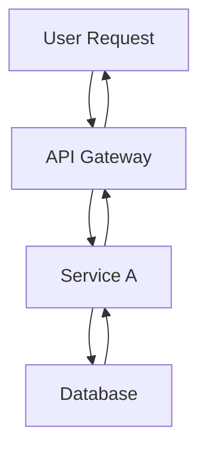

# Write Post Command

## Description

Automatically generates blog posts with multi-language support, SEO optimization, and hero image generation. This command orchestrates the Writing Assistant agent to create complete, publication-ready blog posts.

## Usage

```bash
/write-post <topic> [options]
```

## Parameters

### Required

- `topic` (string): The main topic/subject of the blog post

### Optional

- `--tags` (string): Comma-separated list of tags (e.g., "nextjs,react,typescript")
- `--languages` (string): Comma-separated language codes (default: "ko,ja,en,zh")
  - Available: ko (Korean), ja (Japanese), en (English), zh (Simplified Chinese)
  - **All 4 languages must be generated for every post**
- `--description` (string): SEO-optimized description (150-160 characters recommended)

## Examples

```bash
# Basic usage (generates Korean, Japanese, English, and Chinese versions)
/write-post "Next.js 15의 새로운 기능"

# With tags
/write-post "React 커스텀 훅 가이드" --tags react,hooks,javascript

# With specific languages
/write-post "TypeScript 고급 타입 활용법" --tags typescript,types --languages ko,ja,zh

# With custom description
/write-post "Astro로 블로그 만들기" --tags astro,blog --description "Astro 프레임워크를 사용하여 고성능 블로그를 구축하는 완벽 가이드"

# All options combined
/write-post "Tailwind CSS 최적화 전략" --tags tailwind,css,performance --languages ko,ja,en,zh --description "Tailwind CSS를 사용한 프로젝트에서 성능을 극대화하는 실전 최적화 기법"
```

## Workflow

### 1. Input Parsing

- Parse topic and all optional parameters
- Validate language codes (ko, ja, en, zh)
- Sanitize tags (lowercase, alphanumeric, hyphens only)
- Generate default description if not provided

### 2. Writing Assistant Invocation

The command delegates to the Writing Assistant agent with the following tasks:

#### Phase 1: Research & Planning

- Analyze the topic and identify key points
- **Research current information using Web Researcher agent**:
  - Use Brave Search MCP to gather latest information
  - **IMPORTANT: Implement 2-second delay between search requests to avoid rate limiting**
  - Verify technical accuracy from official documentation
  - Identify trending discussions and best practices
  - Collect code examples from reliable sources
- Create content structure and outline based on research findings
- Identify additional code examples and technical details needed

#### Phase 2: Image Generation

- Generate hero image prompt based on topic
- Call Image Generator agent to create hero image
- Save image to appropriate path: `src/assets/blog/[slug]-hero.[ext]`
- Store image metadata for frontmatter

#### Phase 3: Content Generation (Korean-First Approach)

**IMPORTANT - Publication Date**:

- Always set `pubDate` to **one day after the latest existing blog post**
- Find the most recent post in `src/content/blog/` across all languages
- Add 1 day to that date for the new post
- Format: 'YYYY-MM-DD' (single quotes required)

**IMPORTANT - Korean-First Workflow**:

The content generation follows a **two-stage process**:

**Stage 1: Write Korean Post First**

- Generate the complete Korean blog post with full content
- Include proper Astro frontmatter:
  ```yaml
  ---
  title: [Korean Title]
  description: [Korean SEO Description]
  pubDate: "[Latest Post Date + 1 day]" # Must use single quotes and YYYY-MM-DD format
  heroImage: ../../../assets/blog/[slug]-hero.[ext]
  tags: [tag1, tag2, ...]
  ---
  ```
- This becomes the **source of truth** for all translations
- Apply Korean technical writing style (존댓말, mix of Korean/English terms)
- Include all code examples with Korean comments

**Stage 2: Natural Translation to Other Languages**

Based on the completed Korean post:

- **Japanese (ja)**: Naturally translate to Japanese
  - Use です/ます体 (polite form)
  - Convert to katakana for technical terms
  - Maintain code structure, translate comments

- **English (en)**: Naturally translate to English
  - Use American English spelling
  - Standard technical documentation style
  - Professional but accessible tone

- **Chinese (zh)**: Naturally translate to Chinese
  - Use simplified Chinese (简体中文)
  - Mix Chinese and English technical terms appropriately
  - Professional technical writing style

- Preserve all code examples and formatting
- Maintain technical term consistency across languages
- Keep Mermaid diagrams but translate labels

#### Phase 4: File Operations

- Generate URL-friendly slug from topic
- Save files to appropriate paths:
  - Korean: `/src/content/blog/ko/[slug].md`
  - Japanese: `/src/content/blog/ja/[slug].md`
  - English: `/src/content/blog/en/[slug].md`
  - Chinese: `/src/content/blog/zh/[slug].md`
- Ensure Content Collections schema compliance
- Validate frontmatter required fields

### 3. Quality Checks

- Verify all files created successfully
- Check frontmatter format (title, description, pubDate required)
- Validate image path references
- Ensure proper Markdown formatting

### 4. Update README.md

After successfully creating all blog post files:

- Read `README.md`
- Update the "블로그 포스트 현황" section:
  - Increment total post count
  - Add new post to the top of the list with title, date, and description
  - Update "최신 포스트 날짜" to the new post's pubDate
  - Update "Last Updated" timestamp at the bottom
- If the new post topic was in "향후 콘텐츠 플랜", remove it from that section

### 5. Backlink Management

After successfully creating and documenting the new post, manage backlinks:

#### Phase 1: Find Preview References

- Search all existing blog posts for preview/teaser text mentioning the new post
- Use Grep to search for common preview patterns:
  - Korean: `다음.*예고`, `다음 글`, `다음에는`
  - Japanese: `次回.*予告`, `次回記事`, `次回`
  - English: `Coming Next`, `Next Article Preview`, `Coming Soon`

#### Phase 2: Convert Previews to Links

For each found preview:

- Verify the preview text matches the new post title (70%+ similarity)
- Convert preview text to actual markdown link
- Update all language versions consistently
- Change preview label (e.g., "다음 글 예고" → "다음 글")

**Example conversion**:

```markdown
# Before

**다음 글 예고**: "AI 에이전트 협업 패턴"에서는...

# After

**다음 글**: [AI 에이전트 협업 패턴](/ko/blog/ko/ai-agent-collaboration-patterns)에서는...
```

#### Phase 3: Series Management (if applicable)

If the new post is part of a series:

1. Add series navigation to the top of the post:

   ```markdown
   > **시리즈: [Series Name]** (2/5)
   >
   > 1. [First Post](/link/to/first-post)
   > 2. **[Current Post](/link/to/current-post)** ← 현재 글
   > 3. [Third Post](/link/to/third-post)
   > 4. [Fourth Post](/link/to/fourth-post) (예정)
   > 5. [Fifth Post](/link/to/fifth-post) (예정)
   ```

2. Update series navigation in all other posts in the series
3. Apply to all language versions

#### Delegation to Backlink Manager Agent

```bash
@backlink-manager "[new-post-slug] 포스트에 대한 백링크를 확인하고 연결해주세요."
```

The Backlink Manager agent will:

- Automatically find and convert previews
- Handle series navigation updates
- Ensure consistency across all language versions
- Report all changes made

### 6. Post Metadata Addition (V3)

After successfully creating the blog post and managing backlinks, add post metadata to `post-metadata.json`.

#### Metadata Structure (V3)

**IMPORTANT CHANGE**: In V3, metadata is significantly streamlined to store **only 3 fields**:

```json
{
  "post-slug": {
    "pubDate": "2025-11-04",
    "difficulty": 3,
    "categoryScores": {
      "automation": 0.9,
      "web-development": 0.3,
      "ai-ml": 0.85,
      "devops": 0.5,
      "architecture": 0.75
    }
  }
}
```

**Field Descriptions**:

1. **pubDate** (string, required):

   - Format: 'YYYY-MM-DD'
   - Used for temporal filtering and preventing time-travel in recommendations

2. **difficulty** (number 1-5, required):

   - 1-2: Beginner (Getting Started, basic concepts)
   - 3: Intermediate (practical usage, integration guides)
   - 4-5: Advanced (architecture, optimization, complex systems)

3. **categoryScores** (object, required):
   - automation: Relevance to automation, workflows, CI/CD (0.0-1.0)
   - web-development: Relevance to web dev, frontend, backend (0.0-1.0)
   - ai-ml: Relevance to AI, machine learning, LLMs (0.0-1.0)
   - devops: Relevance to deployment, infrastructure, monitoring (0.0-1.0)
   - architecture: Relevance to system design, architectural patterns (0.0-1.0)

**Score Guidelines**:

- 0.0-0.3: Barely related
- 0.4-0.6: Partially related
- 0.7-0.8: Major topic
- 0.9-1.0: Core topic

#### How to Add Metadata

Manually edit the `post-metadata.json` file to add metadata for the new post:

```json
{
  "existing-post-1": {
    "pubDate": "2025-11-01",
    "difficulty": 2,
    "categoryScores": { ... }
  },
  "new-post-slug": {
    "pubDate": "2025-11-04",
    "difficulty": 3,
    "categoryScores": {
      "automation": 0.9,
      "web-development": 0.3,
      "ai-ml": 0.85,
      "devops": 0.5,
      "architecture": 0.75
    }
  }
}
```

**Important Notes**:

- Use base slug WITHOUT language prefix (e.g., "slack-mcp-team-communication", not "ko/slack-mcp-team-communication")
- All language versions share the same metadata
- pubDate must be latest post + 1 day

### 7. Generate Related Post Recommendations (V3)

After adding metadata, use the V3 recommendation system to generate related posts.

#### V3 System Overview

**Key Changes**:

- ✅ `recommendations.json` file **DEPRECATED** - No more external JSON file needed
- ✅ Read directly from `post-metadata.json` (uses only 3 fields)
- ✅ Store `relatedPosts` array **directly in Frontmatter**
- ✅ Integrated with Content Collections schema
- ✅ Automatically processed by Astro at build time

**Benefits**:

- 62% file size reduction (800 lines → 300 lines)
- 100% elimination of build-time file I/O operations
- 27% code complexity reduction
- Improved data consistency (single source of truth)

#### Running V3 Recommendation Generation

```bash
# Run the script
node scripts/generate-recommendations-v3.js

# Or use npm script (if available)
npm run generate-recommendations
```

**Script Behavior**:

1. Read `post-metadata.json`
2. Calculate similarity for each post:
   - **Difficulty Similarity** (20%): Prefer similar difficulty levels
   - **Category Similarity** (80%): Cosine similarity-based
3. Select top 5 recommendations (score >= 0.3)
4. Write directly to **Frontmatter of all 3 language versions** of each post:

```yaml
---
title: "Post Title"
description: "Description"
pubDate: "2025-11-04"
relatedPosts:
  - slug: ai-agent-notion-mcp-automation
    score: 0.92
    reason:
      ko: "두 포스트 모두 MCP 서버를 활용한 자동화를 다룹니다."
      ja: "両記事ともMCPサーバーを活用した自動化を扱います。"
      en: "Both posts cover MCP server-based automation."
  - slug: google-analytics-mcp-automation
    score: 0.85
    reason:
      ko: "MCP 통합과 데이터 분석 자동화에서 유사합니다."
      ja: "MCP統合とデータ分析自動化で類似しています。"
      en: "Similar in MCP integration and data analysis automation."
---
```

**Important Notes**:

- Script modifies **all 3 language files for every post**
- Not automatically committed to Git - manual commit required
- Backup recommended before running (`git stash` or `git commit`)

### 8. Output Summary

Display creation results:

```
✓ Blog post created successfully!

Generated Files (ALL 4 languages):
  - /src/content/blog/ko/[slug].md (Korean) ✓
  - /src/content/blog/ja/[slug].md (Japanese) ✓
  - /src/content/blog/en/[slug].md (English) ✓
  - /src/content/blog/zh/[slug].md (Chinese) ✓

Language Count Verification:
  ✓ ko: 25 posts
  ✓ ja: 25 posts
  ✓ en: 25 posts
  ✓ zh: 25 posts
  ✓ All folders have equal counts

Hero Image:
  - src/assets/blog/[slug]-hero.[ext]

Metadata:
  - Title: [Generated Title]
  - Tags: [tag1, tag2, ...]
  - Publish Date: [YYYY-MM-DD]

README.md Updated:
  ✓ Post count updated
  ✓ New post added to list
  ✓ Latest post date updated

Backlinks Updated:
  ✓ Found [N] preview references
  ✓ Converted to active links
  ✓ Series navigation updated (if applicable)

Post Metadata Added (V3):
  ✓ Added to post-metadata.json
  ✓ pubDate: [YYYY-MM-DD]
  ✓ difficulty: [1-5]
  ✓ categoryScores: Configured

Related Posts Generated (V3):
  ✓ [N] related posts identified
  ✓ Saved directly to frontmatter
  ✓ Multi-language reasoning created
  ✓ Similarity scores computed

Next Steps:
  1. Review generated content
  2. Run: npm run astro check
  3. Preview: npm run dev
  4. Run: node scripts/generate-recommendations-v3.js (if not auto-run)
```

## Writing Assistant Delegation

### Context Provided to Agent

```markdown
Task: Generate blog post
Topic: [user-provided topic]
Tags: [tag1, tag2, ...]
Languages: [language codes]
Description: [SEO description or "Generate appropriate description"]

Requirements:

1. **Determine publication date**:

   - Find the most recent blog post across all language folders in src/content/blog/
   - Extract the latest pubDate
   - Add 1 day to get the new post's pubDate
   - Format as 'YYYY-MM-DD' (single quotes)

2. Research topic using Web Researcher agent:

   - Delegate to Web Researcher for comprehensive research
   - **CRITICAL: Ensure 2-second delay between search requests**
   - Gather latest information, official documentation, and examples
   - Verify technical accuracy and current best practices
   - Create detailed outline based on research findings

3. Generate hero image:

   - Create descriptive image prompt
   - Call Image Generator agent
   - Save to src/assets/blog/[slug]-hero.[ext]
   - Use path ../../../assets/blog/[slug]-hero.[ext] in frontmatter

4. Write complete blog post using **KOREAN-FIRST APPROACH**:

   **CRITICAL - Two-Stage Process**:

   The Korean-First approach ensures consistency and natural translation:

   **Stage 1: Write Korean Post First**

   - Write the complete Korean blog post
   - This is the **source of truth** for all translations
   - Include full content, code examples, Mermaid diagrams
   - Save to `/src/content/blog/ko/[slug].md`
   - Verify the Korean post is complete before proceeding

   **Stage 2: Natural Translation to Other Languages (IN PARALLEL)**

   After Korean post is complete:
   - Create 3 separate agents for translation (ja, en, zh)
   - Delegate to **ALL 3 agents** in a single message with 3 Task tool calls
   - Each agent receives the completed Korean post as source
   - Each agent naturally translates to their target language

   **Agent Delegation Pattern**:
```

Stage 1 (Sequential):
- Task: Korean writing agent (ko) - FIRST, write complete post

Stage 2 (Parallel, after Stage 1 completes):
- Task 1: Japanese translation agent (ja) - translate from Korean
- Task 2: English translation agent (en) - translate from Korean
- Task 3: Chinese translation agent (zh) - translate from Korean

````

**Each translation agent must**:
- Receive the complete Korean post as input
- Naturally translate content (NOT machine-translate)
- Follow Astro Content Collections schema
- Include frontmatter (title, description, pubDate, heroImage, tags)
- **Use the same pubDate as Korean version**
- Preserve code examples (translate comments only)
- Translate Mermaid diagram labels
- Apply language-specific SEO optimization
- Save to correct language folder upon completion

5. Save files to **ALL 4 language-specific folders**:

- Korean: /src/content/blog/ko/[slug].md
- Japanese: /src/content/blog/ja/[slug].md
- English: /src/content/blog/en/[slug].md
- Chinese: /src/content/blog/zh/[slug].md

6. **CRITICAL - Verify language count**:
   - Count files in each language folder
   - ALL 4 folders must have equal number of posts
   - If mismatch detected, generate missing language versions

7. Update README.md:

- Read current README.md
- Update "블로그 포스트 현황" section
- Increment post count
- Add new post to top of list
- Update "최신 포스트 날짜"
- Update "Last Updated" timestamp
- Remove topic from "향후 콘텐츠 플랜" if present

8. Manage backlinks:

- Delegate to Backlink Manager agent
- Search existing posts for preview/teaser references
- Convert found previews to active links
- Update series navigation if post is part of a series
- Report all changes made

9. Add post metadata (V3):

- Open post-metadata.json file
- Add metadata for new post:
  ```json
  {
    "new-post-slug": {
      "pubDate": "2025-11-04",
      "difficulty": 3,
      "categoryScores": {
        "automation": 0.9,
        "web-development": 0.3,
        "ai-ml": 0.85,
        "devops": 0.5,
        "architecture": 0.75
      }
    }
  }
  ```
- Determine difficulty and categoryScores based on content analysis
- Save file

10. Generate related post recommendations (V3):

- Run `node scripts/generate-recommendations-v3.js`
- Script will:
  - Read metadata from post-metadata.json
  - Calculate similarity scores (difficulty 20% + categories 80%)
  - Select top 5 related posts
  - Write relatedPosts array to frontmatter of all 3 language versions
- Verify results and report

11. Generate URL-friendly slug from topic
12. Return file paths and metadata for ALL 4 languages
````

### Expected Agent Response Format

```json
{
  "success": true,
  "files": [
    {
      "language": "ko",
      "path": "/src/content/blog/ko/[slug].md",
      "title": "[Korean Title]"
    },
    {
      "language": "ja",
      "path": "/src/content/blog/ja/[slug].md",
      "title": "[Japanese Title]"
    },
    {
      "language": "en",
      "path": "/src/content/blog/en/[slug].md",
      "title": "[English Title]"
    },
    {
      "language": "zh",
      "path": "/src/content/blog/zh/[slug].md",
      "title": "[Chinese Title]"
    }
  ],
  "heroImage": "../../../assets/blog/[slug]-hero.[ext]",
  "slug": "[generated-slug]",
  "tags": ["tag1", "tag2"],
  "pubDate": "[YYYY-MM-DD]",
  "metadata": {
    "difficulty": 3,
    "categoryScores": {
      "automation": 0.9,
      "web-development": 0.3,
      "ai-ml": 0.85,
      "devops": 0.5,
      "architecture": 0.75
    }
  }
}
```

## Content Guidelines

### Frontmatter Schema (Must Follow)

```yaml
---
title: string (required, see SEO guidelines for optimal length)
description: string (required, see SEO guidelines for optimal length)
pubDate: string (required, format: 'YYYY-MM-DD' only, single quotes)
heroImage: string (optional, relative path from content file: ../../../assets/blog/[image])
tags: array (optional, lowercase, alphanumeric + hyphens)
updatedDate: string (optional, format: 'YYYY-MM-DD' only, single quotes)
---
```

**SEO 최적화 가이드라인**: `.claude/guidelines/seo-title-description-guidelines.md` 참조

**Title 권장 길이**:

- 한국어: 25-30자
- 영어: 50-60자
- 일본어: 30-35자
- 중국어: 25-30자

**Description 권장 길이**:

- 한국어: 70-80자
- 영어: 150-160자
- 일본어: 80-90자
- 중국어: 70-80자

### Content Structure

````markdown
## 개요 / Overview / 概要 / 概述

[Introduction paragraph - context and problem statement]

## 핵심 내용 / Key Concepts / 主要内容 / 核心内容

### [Subtopic 1]

[Detailed explanation]

### [Subtopic 2]

[Detailed explanation]

## 코드 예제 / Code Examples / コード例 / 代码示例

```language
[Working code example]
```
````

## 실전 활용 / Practical Application / 実践活用 / 实践应用

[Real-world use cases]

## 결론 / Conclusion / 結論 / 结论

[Summary and key takeaways]

## 참고 자료 / References / 参考資料 / 参考资料

- [Link 1]
- [Link 2]

`````

### Style Guidelines
- Use clear, professional technical writing
- Explain technical terms on first use
- Include working code examples
- Use active voice
- Keep paragraphs concise (2-4 sentences)
- Use bullet points for lists
- Add code comments in target language

### Markdown Formatting Guidelines

**CRITICAL - Nested Code Blocks**:
When you need to show markdown code blocks that contain triple backticks (```), you MUST use **quadruple backticks (````) for the outer block**. This prevents rendering issues.

**Example**:

❌ **WRONG** (will break rendering):
````markdown
```markdown
## Example
```javascript
const code = 'nested';
`````

```

```

✅ **CORRECT** (use quadruple backticks):

`````markdown
````markdown
## Example

```javascript
const code = "nested";
```
````
`````

**When to Use Quadruple Backticks**:

- When documenting markdown syntax that includes code blocks
- When showing examples of blog post frontmatter with code
- When demonstrating how to write documentation
- Any time the content inside contains triple backticks (```)

**Pattern to Follow**:

1. If your content has NO triple backticks inside → use triple backticks (```)
2. If your content HAS triple backticks inside → use quadruple backticks (````)
3. Always close with the same number of backticks you opened with

### Mermaid Diagram Guidelines

**CRITICAL - Use Mermaid for All Flow Diagrams**:
When creating any type of flow diagram, architecture diagram, sequence diagram, or process flow, you MUST use Mermaid syntax instead of plain text diagrams.

**When to Use Mermaid**:

- Workflows and process flows
- System architecture diagrams
- Hierarchical structures (org charts, component trees)
- Sequence diagrams (interactions between components)
- State diagrams
- Data flow diagrams
- Any visual representation of relationships or flows

**Common Mermaid Diagram Types**:

1. **Flowcharts** - For workflows and process flows:

   ```mermaid
   graph TD
       A[Start] --> B{Decision}
       B -->|Yes| C[Process A]
       B -->|No| D[Process B]
       C --> E[End]
       D --> E
   ```

   - Use `graph TD` (top-down) or `graph LR` (left-right)
   - Use `graph TB` for top-bottom flows

2. **Sequence Diagrams** - For interactions and event flows:

   ```mermaid
   sequenceDiagram
       participant User
       participant API
       participant DB

       User->>API: Request
       API->>DB: Query
       DB->>API: Response
       API->>User: Result
   ```

3. **Hierarchical Diagrams** - For tree structures:

   ```mermaid
   graph TD
       Manager[Manager Agent] --> A[Agent A]
       Manager --> B[Agent B]
       Manager --> C[Agent C]
   ```

4. **Parallel Execution Flows**:
   ```mermaid
   graph TB
       Start[Start] --> A[Task A]
       Start --> B[Task B]
       A --> End[Merge]
       B --> End
   ```

**Mermaid Best Practices**:

- Always use descriptive node labels
- Use `<br/>` for line breaks in node labels (e.g., `Node[Line 1<br/>Line 2]`)
- Keep diagrams simple and readable
- Use appropriate arrow types:
  - `-->` for standard flow
  - `->>` for sequence diagram messages
  - `-.->` for optional/conditional paths
- Add text to edges when needed: `A -->|label| B`

**Example - Before vs After**:

❌ **WRONG** (plain text):

```
User Request
    ↓
API Gateway → Service A → Database
    ↓
Response
```

✅ **CORRECT** (Mermaid):



**Multi-language Considerations**:

- Use the target language for node labels and text
- Keep technical terms in English when appropriate (e.g., "API", "Database")
- Ensure consistency across all language versions of the same diagram

### Language-Specific Notes

- **Korean**: Use 존댓말 (formal polite), mix Korean and English technical terms naturally
- **Japanese**: Use です/ます体 (polite form), use katakana for technical terms
- **English**: Use American English spelling, standard technical documentation style
- **Chinese**: Use simplified Chinese (简体中文), professional technical writing style, mix Chinese and English technical terms appropriately

## Image Generation Integration

### Hero Image Requirements

- Dimensions: 1020x510px (2:1 ratio) recommended
- Format: WebP, AVIF, or JPG
- File naming: `[slug]-hero.[ext]`
- Location: `src/assets/blog/`
- Frontmatter path: `../../../assets/blog/[slug]-hero.[ext]` (relative to content file)

### Image Prompt Guidelines

**IMPORTANT**: The Writing Assistant MUST generate context-aware, detailed image prompts that reflect the specific content and theme of the blog post, NOT generic templates.

#### Prompt Generation Process:

1. **Analyze the blog post content** to identify:

   - Main theme and key concepts
   - Technical domain (e.g., web dev, AI, data science, DevOps)
   - Mood/tone (e.g., innovative, problem-solving, educational)
   - Specific visual metaphors that represent the content

2. **Create a detailed, unique prompt** that includes:
   - **Subject**: Specific visual representation of the main concept
   - **Style**: Art style matching the content (e.g., isometric for architecture, diagram-style for processes, futuristic for AI, minimal for performance)
   - **Composition**: Layout and perspective
   - **Colors**: Palette that matches the content mood
   - **Details**: Specific elements that symbolize key concepts
   - **Atmosphere**: Overall feeling (professional, dynamic, clean, innovative)

#### Examples of Good vs. Bad Prompts:

**❌ BAD (Generic)**:

```
A modern, professional illustration representing TypeScript.
Style: Clean, technical, developer-focused.
```

**✅ GOOD (Context-Aware)**:

```
An isometric illustration of interconnected TypeScript code blocks forming a strong type-safe architecture.
Style: Modern tech illustration with geometric shapes, blueprint aesthetic.
Composition: Central TypeScript "T" logo radiating type definitions to surrounding code modules.
Colors: TypeScript blue (#3178C6) as primary, white and light gray for code blocks, subtle gradients.
Elements: Type annotations floating as labels, connected nodes showing type flow, shield symbols for type safety.
Atmosphere: Structured, reliable, professional.
No text overlay.
```

#### Domain-Specific Prompt Templates:

**For AI/ML topics**:

- Neural network visualizations, brain-computer interfaces, data streams
- Futuristic, high-tech aesthetic with neon accents
- Abstract representations of learning/intelligence

**For Performance/Optimization topics**:

- Speed metaphors (rockets, lightning, streamlined shapes)
- Before/after comparisons, optimization graphs
- Minimal, clean design emphasizing efficiency

**For Architecture/System Design topics**:

- Isometric building blocks, blueprint style
- Connected systems, data flow diagrams
- Professional blueprint or technical drawing aesthetic

**For Process/Workflow topics**:

- Timeline or flowchart representations
- Step-by-step visual progression
- Organized, structured layout with clear hierarchy

**For Security topics**:

- Lock, shield, fortress metaphors
- Layered protection visualization
- Dark theme with trust-building elements

**For Web Development topics**:

- Browser windows, responsive layouts
- HTML/CSS/JS visual representations
- Colorful, modern web design aesthetic

#### Additional Requirements:

- **Always avoid text in the image** (no code snippets, no labels)
- **Match the blog post's complexity level** (simple for beginner content, sophisticated for advanced)
- **Consider cultural context** for multi-language posts (use universal visual language)
- **Ensure brand consistency** while being creative
- **Think about thumbnail appeal** (will it look good at small sizes?)

## Error Handling

### Common Issues

1. **Invalid language code**: Show available options (ko, ja, en, zh)
2. **Missing topic**: Display usage instructions
3. **File write failure**: Check directory permissions
4. **Schema validation error**: Verify frontmatter format
5. **Image generation failure**: Fall back to default placeholder

### Validation Checks

- Topic is not empty
- Language codes are valid (ko, ja, en, zh)
- Tags contain only alphanumeric and hyphens
- Generated slug is URL-safe
- All required frontmatter fields present

## Post-Generation Tasks

### Recommended Next Steps

1. **Review Content**:

   ```bash
   # Open generated files in editor
   code src/content/blog/[slug].md
   ```

2. **Type Check**:

   ```bash
   npm run astro check
   ```

3. **Preview Locally**:

   ```bash
   npm run dev
   # Visit http://localhost:4321/blog/[slug]
   ```

4. **Edit if Needed**:

   - Refine technical details
   - Adjust code examples
   - Update SEO description
   - Crop/replace hero image

5. **Build & Deploy**:
   ```bash
   npm run build
   npm run preview
   ```

## Integration with Other Agents

### Web Researcher

- **Primary research executor** for content accuracy
- Uses Brave Search MCP to gather latest information
- Verifies technical details from official sources
- Provides structured research report to Writing Assistant
- Identifies trending topics and best practices

### Writing Assistant

- Primary executor of content generation
- Delegates research to Web Researcher agent
- Handles writing and multi-language translation based on research findings

### Image Generator

- Called by Writing Assistant for hero image creation
- Receives prompt and returns image path

### SEO Optimizer

- Can be called after post creation for additional optimization
- Reviews metadata, internal links, and keyword usage

### Editor

- Can be used for post-creation review
- Checks grammar, style, and formatting

## Advanced Usage

### Chaining Commands

```bash
# Create post, then optimize SEO
/write-post "GraphQL 최적화 기법" --tags graphql,api
# Then run:
/optimize-seo src/content/blog/graphql-optimization.md
```

### Batch Processing

```bash
# Generate multiple related posts
/write-post "React 훅 시리즈 1: useState" --tags react,hooks
/write-post "React 훅 시리즈 2: useEffect" --tags react,hooks
/write-post "React 훅 시리즈 3: useContext" --tags react,hooks
```

## Configuration

### Default Settings (can be customized in future)

- Default languages: ko, ja, en
- Default image style: Technical/Developer-focused
- Default tone: Professional but friendly
- Default structure: Overview → Content → Examples → Conclusion

### Customization Options

Future enhancements may include:

- Custom templates
- Brand voice profiles
- Keyword density targets
- Readability level settings

## Notes

- **All dates MUST use 'YYYY-MM-DD' format with single quotes** (e.g., '2025-10-07')
- Slug generation removes special characters and uses hyphens
- Tags are automatically lowercased and sanitized
- Images in src/assets/ are automatically optimized by Astro (WebP conversion, responsive sizes, etc.)
- Generated content should be reviewed before publishing
- The command respects Astro Content Collections schema defined in `src/content.config.ts`

## Troubleshooting

### Post Not Appearing

- Check frontmatter syntax (YAML format)
- Verify required fields (title, description, pubDate)
- Run `npm run astro check` for validation errors
- Ensure file is in correct directory (`src/content/blog/`)

### Image Not Loading

- Verify image path is relative: `../../../assets/blog/[image]`
- Check file exists in `src/assets/blog/`
- Ensure correct file extension
- Astro will optimize images from src/assets/ automatically

### Build Errors

- Validate Content Collections schema compliance
- Check for TypeScript errors in frontmatter
- Verify all imports and file references

## Related Files

### Agents

- Writing Assistant: `.claude/agents/writing-assistant.md`
- Web Researcher: `.claude/agents/web-researcher.md`
- Image Generator: `.claude/agents/image-generator.md`
- Backlink Manager: `.claude/agents/backlink-manager.md`

### Guidelines

- SEO Optimization: `.claude/guidelines/seo-title-description-guidelines.md`

### Scripts

- V3 Recommendation Generation: `scripts/generate-recommendations-v3.js`
- Similarity Calculation: `scripts/similarity.js`

### Data Files

- Metadata: `post-metadata.json` (V3: pubDate, difficulty, categoryScores only)

### Components

- Related Posts: `src/components/RelatedPosts.astro`
- Layout: `src/layouts/BlogPost.astro`

### Configuration

- Content Collections: `src/content.config.ts`
- Astro Config: `astro.config.mjs`

### Research Documentation

- V3 System Overview: `research/post-recommendation-v3/README.md`
- Implementation Guide: `research/post-recommendation-v3/01-implementation-guide.md`
