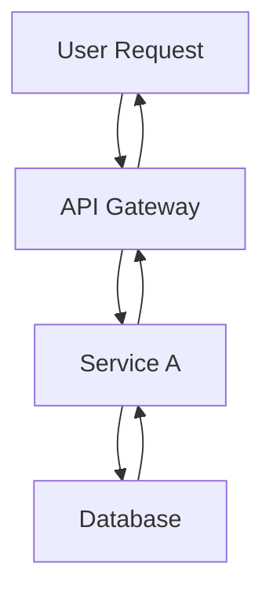

# Write Post Command

## Description

Automatically generates blog posts with multi-language support, SEO optimization, and hero image generation. This command orchestrates the Writing Assistant agent to create complete, publication-ready blog posts.

## Usage

```bash
/write-post <topic> [options]
```

## Parameters

### Required

- `topic` (string): The main topic/subject of the blog post

### Optional

- `--tags` (string): Comma-separated list of tags (e.g., "nextjs,react,typescript")
- `--languages` (string): Comma-separated language codes (default: "ko,ja,en")
  - Available: ko (Korean), ja (Japanese), en (English)
- `--description` (string): SEO-optimized description (150-160 characters recommended)

## Examples

```bash
# Basic usage (generates Korean, Japanese, and English versions)
/write-post "Next.js 15의 새로운 기능"

# With tags
/write-post "React 커스텀 훅 가이드" --tags react,hooks,javascript

# With specific languages
/write-post "TypeScript 고급 타입 활용법" --tags typescript,types --languages ko,ja

# With custom description
/write-post "Astro로 블로그 만들기" --tags astro,blog --description "Astro 프레임워크를 사용하여 고성능 블로그를 구축하는 완벽 가이드"

# All options combined
/write-post "Tailwind CSS 최적화 전략" --tags tailwind,css,performance --languages ko,ja,en --description "Tailwind CSS를 사용한 프로젝트에서 성능을 극대화하는 실전 최적화 기법"
```

## Workflow

### 1. Input Parsing

- Parse topic and all optional parameters
- Validate language codes (ko, ja, en)
- Sanitize tags (lowercase, alphanumeric, hyphens only)
- Generate default description if not provided

### 2. Writing Assistant Invocation

The command delegates to the Writing Assistant agent with the following tasks:

#### Phase 1: Research & Planning

- Analyze the topic and identify key points
- **Research current information using Web Researcher agent**:
  - Use Brave Search MCP to gather latest information
  - **IMPORTANT: Implement 2-second delay between search requests to avoid rate limiting**
  - Verify technical accuracy from official documentation
  - Identify trending discussions and best practices
  - Collect code examples from reliable sources
- Create content structure and outline based on research findings
- Identify additional code examples and technical details needed

#### Phase 2: Image Generation

- Generate hero image prompt based on topic
- Call Image Generator agent to create hero image
- Save image to appropriate path: `src/assets/blog/[slug]-hero.[ext]`
- Store image metadata for frontmatter

#### Phase 3: Content Generation

**IMPORTANT - Publication Date**:

- Always set `pubDate` to **one day after the latest existing blog post**
- Find the most recent post in `src/content/blog/` across all languages
- Add 1 day to that date for the new post
- Format: 'YYYY-MM-DD' (single quotes required)

For each language in `--languages`:

- Generate complete blog post in target language
- Include proper Astro frontmatter:
  ```yaml
  ---
  title: [Generated Title]
  description: [SEO Description]
  pubDate: "[Latest Post Date + 1 day]" # Must use single quotes and YYYY-MM-DD format
  heroImage: ../../../assets/blog/[slug]-hero.[ext]
  tags: [tag1, tag2, ...]
  ---
  ```
- Apply language-specific tone and style
- Maintain technical term consistency across languages
- Include code examples with syntax highlighting
- Add proper headings, lists, and formatting

#### Phase 4: File Operations

- Generate URL-friendly slug from topic
- Save files to appropriate paths:
  - Korean: `/src/content/blog/[slug].md`
  - Japanese: `/src/content/blog/[slug].ja.md`
  - English: `/src/content/blog/[slug].en.md`
- Ensure Content Collections schema compliance
- Validate frontmatter required fields

### 3. Quality Checks

- Verify all files created successfully
- Check frontmatter format (title, description, pubDate required)
- Validate image path references
- Ensure proper Markdown formatting

### 4. Update README.md

After successfully creating all blog post files:

- Read `README.md`
- Update the "블로그 포스트 현황" section:
  - Increment total post count
  - Add new post to the top of the list with title, date, and description
  - Update "최신 포스트 날짜" to the new post's pubDate
  - Update "Last Updated" timestamp at the bottom
- If the new post topic was in "향후 콘텐츠 플랜", remove it from that section

### 5. Backlink Management

After successfully creating and documenting the new post, manage backlinks:

#### Phase 1: Find Preview References

- Search all existing blog posts for preview/teaser text mentioning the new post
- Use Grep to search for common preview patterns:
  - Korean: `다음.*예고`, `다음 글`, `다음에는`
  - Japanese: `次回.*予告`, `次回記事`, `次回`
  - English: `Coming Next`, `Next Article Preview`, `Coming Soon`

#### Phase 2: Convert Previews to Links

For each found preview:

- Verify the preview text matches the new post title (70%+ similarity)
- Convert preview text to actual markdown link
- Update all language versions consistently
- Change preview label (e.g., "다음 글 예고" → "다음 글")

**Example conversion**:

```markdown
# Before

**다음 글 예고**: "AI 에이전트 협업 패턴"에서는...

# After

**다음 글**: [AI 에이전트 협업 패턴](/ko/blog/ko/ai-agent-collaboration-patterns)에서는...
```

#### Phase 3: Series Management (if applicable)

If the new post is part of a series:

1. Add series navigation to the top of the post:

   ```markdown
   > **시리즈: [Series Name]** (2/5)
   >
   > 1. [First Post](/link/to/first-post)
   > 2. **[Current Post](/link/to/current-post)** ← 현재 글
   > 3. [Third Post](/link/to/third-post)
   > 4. [Fourth Post](/link/to/fourth-post) (예정)
   > 5. [Fifth Post](/link/to/fifth-post) (예정)
   ```

2. Update series navigation in all other posts in the series
3. Apply to all language versions

#### Delegation to Backlink Manager Agent

```bash
@backlink-manager "[new-post-slug] 포스트에 대한 백링크를 확인하고 연결해주세요."
```

The Backlink Manager agent will:

- Automatically find and convert previews
- Handle series navigation updates
- Ensure consistency across all language versions
- Report all changes made

### 6. Post Metadata Analysis

After successfully creating the blog post and managing backlinks, analyze the new post to generate structured metadata:

#### Delegation to Content Analyzer

Run the `/analyze-posts` command to generate metadata for the new post:

- Extract content summary (100-150 characters)
- Identify main topics (5 key themes)
- Detect tech stack mentioned
- Calculate difficulty level (1-5)
- Generate category scores (automation, web-dev, ai-ml, devops, architecture)
- Compute content hash for change tracking

The metadata is saved to `post-metadata.json` and used for:
- Token-efficient content recommendations (60-70% reduction)
- Faster semantic analysis
- Change detection for incremental updates

### 7. Generate Content Recommendations

After metadata analysis, generate semantic recommendations for the new post:

#### Delegation to Recommendation Generator

Run the `/generate-recommendations` command to create contextual recommendations:

- Analyze semantic similarity with existing posts
- Identify prerequisite posts (foundational knowledge)
- Find related concept posts (similar topics)
- Suggest next-step posts (advanced applications)
- Generate multi-language reasoning (ko, ja, en)

The recommendations are saved to `recommendations.json` and displayed in the `RelatedPosts` component on each blog post page.

### 8. Output Summary

Display creation results:

```
✓ Blog post created successfully!

Generated Files:
  - /src/content/blog/[slug].md (Korean)
  - /src/content/blog/[slug].ja.md (Japanese)
  - /src/content/blog/[slug].en.md (English)

Hero Image:
  - src/assets/blog/[slug]-hero.[ext]

Metadata:
  - Title: [Generated Title]
  - Tags: [tag1, tag2, ...]
  - Publish Date: [YYYY-MM-DD]

README.md Updated:
  ✓ Post count updated
  ✓ New post added to list
  ✓ Latest post date updated

Backlinks Updated:
  ✓ Found [N] preview references
  ✓ Converted to active links
  ✓ Series navigation updated (if applicable)

Post Analysis Completed:
  ✓ Metadata extracted and saved
  ✓ Content hash generated
  ✓ Category scores calculated
  ✓ Tech stack identified

Recommendations Generated:
  ✓ [N] related posts identified
  ✓ Multi-language reasoning created
  ✓ Semantic similarity scores computed
  ✓ Saved to recommendations.json

Next Steps:
  1. Review generated content
  2. Run: npm run astro check
  3. Preview: npm run dev
```

## Writing Assistant Delegation

### Context Provided to Agent

```markdown
Task: Generate blog post
Topic: [user-provided topic]
Tags: [tag1, tag2, ...]
Languages: [language codes]
Description: [SEO description or "Generate appropriate description"]

Requirements:

1. **Determine publication date**:

   - Find the most recent blog post across all language folders in src/content/blog/
   - Extract the latest pubDate
   - Add 1 day to get the new post's pubDate
   - Format as 'YYYY-MM-DD' (single quotes)

2. Research topic using Web Researcher agent:

   - Delegate to Web Researcher for comprehensive research
   - **CRITICAL: Ensure 2-second delay between search requests**
   - Gather latest information, official documentation, and examples
   - Verify technical accuracy and current best practices
   - Create detailed outline based on research findings

3. Generate hero image:

   - Create descriptive image prompt
   - Call Image Generator agent
   - Save to src/assets/blog/[slug]-hero.[ext]
   - Use path ../../../assets/blog/[slug]-hero.[ext] in frontmatter

4. Write complete blog post for each language:

   - Follow Astro Content Collections schema
   - Include frontmatter (title, description, pubDate, heroImage, tags)
   - **Use the calculated pubDate from step 1**
   - Use technical blog tone and style
   - Include code examples where appropriate
   - Add proper headings and structure
   - Create separate agents for three languages and delegate to them to write posts in parallel

5. Save files to language-specific folders:

   - Korean: /src/content/blog/ko/[slug].md
   - Japanese: /src/content/blog/ja/[slug].md
   - English: /src/content/blog/en/[slug].md

6. Update README.md:

   - Read current README.md
   - Update "블로그 포스트 현황" section
   - Increment post count
   - Add new post to top of list
   - Update "최신 포스트 날짜"
   - Update "Last Updated" timestamp
   - Remove topic from "향후 콘텐츠 플랜" if present

7. Manage backlinks:

   - Delegate to Backlink Manager agent
   - Search existing posts for preview/teaser references
   - Convert found previews to active links
   - Update series navigation if post is part of a series
   - Report all changes made

8. Analyze post metadata:

   - Run `/analyze-posts` command
   - Extract content summary, main topics, tech stack
   - Calculate difficulty level and category scores
   - Generate content hash for change tracking
   - Save to post-metadata.json

9. Generate content recommendations:

   - Run `/generate-recommendations` command
   - Analyze semantic similarity with existing posts
   - Identify prerequisite, related, and next-step posts
   - Generate multi-language reasoning (ko, ja, en)
   - Save to recommendations.json

10. Generate URL-friendly slug from topic
11. Return file paths and metadata
```

### Expected Agent Response Format

```json
{
  "success": true,
  "files": [
    {
      "language": "ko",
      "path": "/src/content/blog/[slug].md",
      "title": "[Korean Title]"
    },
    {
      "language": "ja",
      "path": "/src/content/blog/[slug].ja.md",
      "title": "[Japanese Title]"
    },
    {
      "language": "en",
      "path": "/src/content/blog/[slug].en.md",
      "title": "[English Title]"
    }
  ],
  "heroImage": "../../../assets/blog/[slug]-hero.[ext]",
  "slug": "[generated-slug]",
  "tags": ["tag1", "tag2"],
  "pubDate": "[YYYY-MM-DD]"
}
```

## Content Guidelines

### Frontmatter Schema (Must Follow)

```yaml
---
title: string (required, see SEO guidelines for optimal length)
description: string (required, see SEO guidelines for optimal length)
pubDate: string (required, format: 'YYYY-MM-DD' only, single quotes)
heroImage: string (optional, relative path from content file: ../../../assets/blog/[image])
tags: array (optional, lowercase, alphanumeric + hyphens)
updatedDate: string (optional, format: 'YYYY-MM-DD' only, single quotes)
---
```

**SEO 최적화 가이드라인**: `.claude/guidelines/seo-title-description-guidelines.md` 참조

**Title 권장 길이**:

- 한국어: 25-30자
- 영어: 50-60자
- 일본어: 30-35자

**Description 권장 길이**:

- 한국어: 70-80자
- 영어: 150-160자
- 일본어: 80-90자

### Content Structure

````markdown
## 개요 / Overview / 概要

[Introduction paragraph - context and problem statement]

## 핵심 내용 / Key Concepts / 主要内容

### [Subtopic 1]

[Detailed explanation]

### [Subtopic 2]

[Detailed explanation]

## 코드 예제 / Code Examples / コード例

```language
[Working code example]
```
````

## 실전 활용 / Practical Application / 実践活用

[Real-world use cases]

## 결론 / Conclusion / 結論

[Summary and key takeaways]

## 참고 자료 / References / 参考資料

- [Link 1]
- [Link 2]

`````

### Style Guidelines
- Use clear, professional technical writing
- Explain technical terms on first use
- Include working code examples
- Use active voice
- Keep paragraphs concise (2-4 sentences)
- Use bullet points for lists
- Add code comments in target language

### Markdown Formatting Guidelines

**CRITICAL - Nested Code Blocks**:
When you need to show markdown code blocks that contain triple backticks (```), you MUST use **quadruple backticks (````) for the outer block**. This prevents rendering issues.

**Example**:

❌ **WRONG** (will break rendering):
````markdown
```markdown
## Example
```javascript
const code = 'nested';
`````

```

```

✅ **CORRECT** (use quadruple backticks):

`````markdown
````markdown
## Example

```javascript
const code = "nested";
```
````
`````

**When to Use Quadruple Backticks**:

- When documenting markdown syntax that includes code blocks
- When showing examples of blog post frontmatter with code
- When demonstrating how to write documentation
- Any time the content inside contains triple backticks (```)

**Pattern to Follow**:

1. If your content has NO triple backticks inside → use triple backticks (```)
2. If your content HAS triple backticks inside → use quadruple backticks (````)
3. Always close with the same number of backticks you opened with

### Mermaid Diagram Guidelines

**CRITICAL - Use Mermaid for All Flow Diagrams**:
When creating any type of flow diagram, architecture diagram, sequence diagram, or process flow, you MUST use Mermaid syntax instead of plain text diagrams.

**When to Use Mermaid**:

- Workflows and process flows
- System architecture diagrams
- Hierarchical structures (org charts, component trees)
- Sequence diagrams (interactions between components)
- State diagrams
- Data flow diagrams
- Any visual representation of relationships or flows

**Common Mermaid Diagram Types**:

1. **Flowcharts** - For workflows and process flows:

   ```mermaid
   graph TD
       A[Start] --> B{Decision}
       B -->|Yes| C[Process A]
       B -->|No| D[Process B]
       C --> E[End]
       D --> E
   ```

   - Use `graph TD` (top-down) or `graph LR` (left-right)
   - Use `graph TB` for top-bottom flows

2. **Sequence Diagrams** - For interactions and event flows:

   ```mermaid
   sequenceDiagram
       participant User
       participant API
       participant DB

       User->>API: Request
       API->>DB: Query
       DB->>API: Response
       API->>User: Result
   ```

3. **Hierarchical Diagrams** - For tree structures:

   ```mermaid
   graph TD
       Manager[Manager Agent] --> A[Agent A]
       Manager --> B[Agent B]
       Manager --> C[Agent C]
   ```

4. **Parallel Execution Flows**:
   ```mermaid
   graph TB
       Start[Start] --> A[Task A]
       Start --> B[Task B]
       A --> End[Merge]
       B --> End
   ```

**Mermaid Best Practices**:

- Always use descriptive node labels
- Use `<br/>` for line breaks in node labels (e.g., `Node[Line 1<br/>Line 2]`)
- Keep diagrams simple and readable
- Use appropriate arrow types:
  - `-->` for standard flow
  - `->>` for sequence diagram messages
  - `-.->` for optional/conditional paths
- Add text to edges when needed: `A -->|label| B`

**Example - Before vs After**:

❌ **WRONG** (plain text):

```
User Request
    ↓
API Gateway → Service A → Database
    ↓
Response
```

✅ **CORRECT** (Mermaid):



**Multi-language Considerations**:

- Use the target language for node labels and text
- Keep technical terms in English when appropriate (e.g., "API", "Database")
- Ensure consistency across all language versions of the same diagram

### Language-Specific Notes

- **Korean**: Use 존댓말 (formal polite), mix Korean and English technical terms naturally
- **Japanese**: Use です/ます体 (polite form), use katakana for technical terms
- **English**: Use American English spelling, standard technical documentation style

## Image Generation Integration

### Hero Image Requirements

- Dimensions: 1020x510px (2:1 ratio) recommended
- Format: WebP, AVIF, or JPG
- File naming: `[slug]-hero.[ext]`
- Location: `src/assets/blog/`
- Frontmatter path: `../../../assets/blog/[slug]-hero.[ext]` (relative to content file)

### Image Prompt Guidelines

**IMPORTANT**: The Writing Assistant MUST generate context-aware, detailed image prompts that reflect the specific content and theme of the blog post, NOT generic templates.

#### Prompt Generation Process:

1. **Analyze the blog post content** to identify:

   - Main theme and key concepts
   - Technical domain (e.g., web dev, AI, data science, DevOps)
   - Mood/tone (e.g., innovative, problem-solving, educational)
   - Specific visual metaphors that represent the content

2. **Create a detailed, unique prompt** that includes:
   - **Subject**: Specific visual representation of the main concept
   - **Style**: Art style matching the content (e.g., isometric for architecture, diagram-style for processes, futuristic for AI, minimal for performance)
   - **Composition**: Layout and perspective
   - **Colors**: Palette that matches the content mood
   - **Details**: Specific elements that symbolize key concepts
   - **Atmosphere**: Overall feeling (professional, dynamic, clean, innovative)

#### Examples of Good vs. Bad Prompts:

**❌ BAD (Generic)**:

```
A modern, professional illustration representing TypeScript.
Style: Clean, technical, developer-focused.
```

**✅ GOOD (Context-Aware)**:

```
An isometric illustration of interconnected TypeScript code blocks forming a strong type-safe architecture.
Style: Modern tech illustration with geometric shapes, blueprint aesthetic.
Composition: Central TypeScript "T" logo radiating type definitions to surrounding code modules.
Colors: TypeScript blue (#3178C6) as primary, white and light gray for code blocks, subtle gradients.
Elements: Type annotations floating as labels, connected nodes showing type flow, shield symbols for type safety.
Atmosphere: Structured, reliable, professional.
No text overlay.
```

#### Domain-Specific Prompt Templates:

**For AI/ML topics**:

- Neural network visualizations, brain-computer interfaces, data streams
- Futuristic, high-tech aesthetic with neon accents
- Abstract representations of learning/intelligence

**For Performance/Optimization topics**:

- Speed metaphors (rockets, lightning, streamlined shapes)
- Before/after comparisons, optimization graphs
- Minimal, clean design emphasizing efficiency

**For Architecture/System Design topics**:

- Isometric building blocks, blueprint style
- Connected systems, data flow diagrams
- Professional blueprint or technical drawing aesthetic

**For Process/Workflow topics**:

- Timeline or flowchart representations
- Step-by-step visual progression
- Organized, structured layout with clear hierarchy

**For Security topics**:

- Lock, shield, fortress metaphors
- Layered protection visualization
- Dark theme with trust-building elements

**For Web Development topics**:

- Browser windows, responsive layouts
- HTML/CSS/JS visual representations
- Colorful, modern web design aesthetic

#### Additional Requirements:

- **Always avoid text in the image** (no code snippets, no labels)
- **Match the blog post's complexity level** (simple for beginner content, sophisticated for advanced)
- **Consider cultural context** for multi-language posts (use universal visual language)
- **Ensure brand consistency** while being creative
- **Think about thumbnail appeal** (will it look good at small sizes?)

## Error Handling

### Common Issues

1. **Invalid language code**: Show available options (ko, ja, en)
2. **Missing topic**: Display usage instructions
3. **File write failure**: Check directory permissions
4. **Schema validation error**: Verify frontmatter format
5. **Image generation failure**: Fall back to default placeholder

### Validation Checks

- Topic is not empty
- Language codes are valid
- Tags contain only alphanumeric and hyphens
- Generated slug is URL-safe
- All required frontmatter fields present

## Post-Generation Tasks

### Recommended Next Steps

1. **Review Content**:

   ```bash
   # Open generated files in editor
   code src/content/blog/[slug].md
   ```

2. **Type Check**:

   ```bash
   npm run astro check
   ```

3. **Preview Locally**:

   ```bash
   npm run dev
   # Visit http://localhost:4321/blog/[slug]
   ```

4. **Edit if Needed**:

   - Refine technical details
   - Adjust code examples
   - Update SEO description
   - Crop/replace hero image

5. **Build & Deploy**:
   ```bash
   npm run build
   npm run preview
   ```

## Integration with Other Agents

### Web Researcher

- **Primary research executor** for content accuracy
- Uses Brave Search MCP to gather latest information
- Verifies technical details from official sources
- Provides structured research report to Writing Assistant
- Identifies trending topics and best practices

### Writing Assistant

- Primary executor of content generation
- Delegates research to Web Researcher agent
- Handles writing and multi-language translation based on research findings

### Image Generator

- Called by Writing Assistant for hero image creation
- Receives prompt and returns image path

### SEO Optimizer

- Can be called after post creation for additional optimization
- Reviews metadata, internal links, and keyword usage

### Editor

- Can be used for post-creation review
- Checks grammar, style, and formatting

## Advanced Usage

### Chaining Commands

```bash
# Create post, then optimize SEO
/write-post "GraphQL 최적화 기법" --tags graphql,api
# Then run:
/optimize-seo src/content/blog/graphql-optimization.md
```

### Batch Processing

```bash
# Generate multiple related posts
/write-post "React 훅 시리즈 1: useState" --tags react,hooks
/write-post "React 훅 시리즈 2: useEffect" --tags react,hooks
/write-post "React 훅 시리즈 3: useContext" --tags react,hooks
```

## Configuration

### Default Settings (can be customized in future)

- Default languages: ko, ja, en
- Default image style: Technical/Developer-focused
- Default tone: Professional but friendly
- Default structure: Overview → Content → Examples → Conclusion

### Customization Options

Future enhancements may include:

- Custom templates
- Brand voice profiles
- Keyword density targets
- Readability level settings

## Notes

- **All dates MUST use 'YYYY-MM-DD' format with single quotes** (e.g., '2025-10-07')
- Slug generation removes special characters and uses hyphens
- Tags are automatically lowercased and sanitized
- Images in src/assets/ are automatically optimized by Astro (WebP conversion, responsive sizes, etc.)
- Generated content should be reviewed before publishing
- The command respects Astro Content Collections schema defined in `src/content.config.ts`

## Troubleshooting

### Post Not Appearing

- Check frontmatter syntax (YAML format)
- Verify required fields (title, description, pubDate)
- Run `npm run astro check` for validation errors
- Ensure file is in correct directory (`src/content/blog/`)

### Image Not Loading

- Verify image path is relative: `../../../assets/blog/[image]`
- Check file exists in `src/assets/blog/`
- Ensure correct file extension
- Astro will optimize images from src/assets/ automatically

### Build Errors

- Validate Content Collections schema compliance
- Check for TypeScript errors in frontmatter
- Verify all imports and file references
