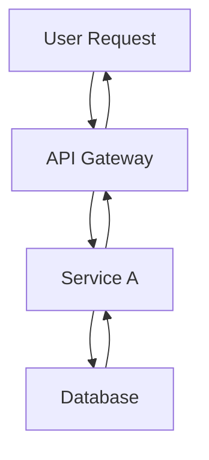

# Write Post Command

## Description

Automatically generates blog posts with multi-language support, SEO optimization, and hero image generation. This command orchestrates the Writing Assistant agent to create complete, publication-ready blog posts.

## Usage

```bash
/write-post <topic> [options]
```

## Parameters

### Required

- `topic` (string): The main topic/subject of the blog post

### Optional

- `--tags` (string): Comma-separated list of tags (e.g., "nextjs,react,typescript")
- `--languages` (string): Comma-separated language codes (default: "ko,ja,en,zh")
  - Available: ko (Korean), ja (Japanese), en (English), zh (Simplified Chinese)
  - **All 4 languages must be generated for every post**
- `--description` (string): SEO-optimized description (150-160 characters recommended)

## Examples

```bash
# Basic usage (generates Korean, Japanese, English, and Chinese versions)
/write-post "Next.js 15의 새로운 기능"

# With tags
/write-post "React 커스텀 훅 가이드" --tags react,hooks,javascript

# With specific languages
/write-post "TypeScript 고급 타입 활용법" --tags typescript,types --languages ko,ja,zh

# With custom description
/write-post "Astro로 블로그 만들기" --tags astro,blog --description "Astro 프레임워크를 사용하여 고성능 블로그를 구축하는 완벽 가이드"

# All options combined
/write-post "Tailwind CSS 최적화 전략" --tags tailwind,css,performance --languages ko,ja,en,zh --description "Tailwind CSS를 사용한 프로젝트에서 성능을 극대화하는 실전 최적화 기법"
```

## Workflow

### 1. Input Parsing

- Parse topic and all optional parameters
- Validate language codes (ko, ja, en, zh)
- Sanitize tags (lowercase, alphanumeric, hyphens only)
- Generate default description if not provided

### 2. Writing Assistant Invocation

The command delegates to the Writing Assistant agent with the following tasks:

#### Phase 1: Research & Planning

- Analyze the topic and identify key points
- **Research current information using web search**:
  - Use built-in WebSearch tool or Chrome browser extension to gather latest information
  - Verify technical accuracy from official documentation
  - Identify trending discussions and best practices
  - Collect code examples from reliable sources
- Create content structure and outline based on research findings
- Identify additional code examples and technical details needed

#### Phase 2: Hands-on Testing (설치 가능한 도구/서비스인 경우 필수)

> **판단 기준**: 포스트 주제가 설치·실행 가능한 도구, 라이브러리, 서비스, CLI, 웹 앱이면 이 Phase는 **MANDATORY**이다.
> 순수 개념/뉴스/비교 분석 글이면 SKIP하고 Phase 3으로 넘어간다.

**목적**: 실제로 설치하고 돌려본 경험이 글의 신뢰도를 결정한다. 이 단계를 건너뛰면 "AI가 문서만 읽고 쓴 글"이 된다.

##### Step 1: 환경 준비

```bash
mkdir -p _sandbox/screenshots
cd _sandbox
```

- `_sandbox/` 폴더는 gitignore됨 — 자유롭게 설치/삭제 가능
- 도구에 필요한 런타임(Node, Python, Docker 등) 확인

##### Step 2: 설치 & 실행

```bash
# 예시: GitHub 프로젝트 클론 후 실행
git clone <repo-url> _sandbox/<project-name>
cd _sandbox/<project-name>
# 프로젝트 문서의 Quickstart 따라 실행
```

- README/공식 문서의 Quickstart를 **그대로** 따른다
- 설치 중 발생한 문제(에러, 누락 의존성 등)를 메모 — 블로그 본문에 활용
- 설치가 실패해도 그 자체가 콘텐츠가 된다 ("설치해봤는데 X에서 막혔다")

##### Step 3: 탐색 & 체험

- UI가 있으면 주요 화면 탐색 (대시보드, 설정, 핵심 기능)
- CLI라면 주요 명령어 실행
- API라면 curl/httpie로 호출
- **최소 3개 이상의 기능/화면**을 직접 확인
- 인상적이거나 불편한 점을 메모

##### Step 4: 스크린샷 촬영

촬영한 스크린샷이 블로그의 In-Content 이미지가 되고, **가장 좋은 스크린샷이 히어로 이미지**가 된다.

**웹 페이지 스크린샷**:
- Chrome DevTools MCP `take_screenshot` 사용
- 또는 Chrome 브라우저 확장에서 직접 캡처

**터미널 출력 스크린샷**:
```bash
screencapture -x _sandbox/screenshots/[name]-raw.png          # 전체 화면
screencapture -ix _sandbox/screenshots/[name]-raw.png         # 특정 영역 (드래그)
```

**촬영 대상 (최소 2~3장)**:
- 메인 대시보드/랜딩 화면
- 핵심 기능 동작 화면
- 설정/아키텍처 화면
- 터미널에서의 설치/실행 과정 (선택)

##### Step 5: 스크린샷 후처리

```bash
python3 scripts/process-screenshot.py \
  _sandbox/screenshots/[name]-raw.png \
  src/assets/blog/[slug]-[name].png \
  --blur x,y,w,h \          # API 키, 비밀번호 등 블러
  --blackout x,y,w,h \      # 완전 가림
  --highlight x,y,w,h \     # 빨간 강조 박스
  --highlight-green x,y,w,h \  # 초록 강조 박스
  --label x,y "설명 텍스트" \  # 라벨 추가
  --arrow x1,y1,x2,y2 \     # 화살표
  --crop x,y,w,h \          # 영역 잘라내기
  --resize 1020x510 \       # 히어로 이미지용 리사이즈
  --border                  # 외곽선 추가
```

##### Step 6: 민감 정보 체크 (필수)

스크린샷에 다음이 포함되지 않았는지 **반드시** 확인:
- API 키, 토큰, 비밀번호
- 이메일 주소, 사용자 이름
- 파일 시스템 경로에 포함된 사용자명 (예: `/Users/jangwook/`)
- 내부 URL, IP 주소

##### Step 7: 경험 노트 정리

Phase 4 (글쓰기)에서 사용할 **1인칭 경험** 소재 정리:
- 설치 과정에서 겪은 일 (성공/실패 모두)
- UI/기능에 대한 첫인상
- 예상과 달랐던 점
- 비판적 의견 소재 (부족한 점, 개선 필요 사항)

> **이 노트가 Anti-AI Writing의 핵심 재료가 된다.** 실제 경험 없이는 "~해봤는데", "직접 돌려보니" 같은 1인칭 서술을 쓸 수 없다.

#### Phase 3: Image Selection (Hero + In-Content)

**히어로 이미지 선택 — 비용 절감 우선순위**:

1. **스크린샷 활용 (비용: 0)** — Phase 2에서 촬영한 스크린샷 중 가장 대표적인 화면을 히어로로 사용
   - `process-screenshot.py`로 2:1 비율(1020x510)에 맞게 crop/resize
   - 저장: `src/assets/blog/[slug]-hero.png`
   - **Phase 2를 수행했다면 이 방법을 기본으로 사용**

2. **공식 소스 다운로드 (비용: 0)** — 프로젝트 공식 이미지(README 헤더, 공식 스크린샷 등)
   - `curl`로 다운로드 후 resize
   - 출처 표기 필수

3. **AI 이미지 생성 (비용: API 호출)** — 위 두 방법이 모두 불가할 때만 사용
   - 순수 개념/뉴스 글로 스크린샷이 없는 경우
   - Image Prompt Guidelines의 YAML 7-Part Structure 따르기
   - `generate_image.js` 호출

**In-Content 이미지**:
- Phase 2의 스크린샷을 본문에 배치: ``
- 추가로 공식 소스 이미지나 AI 생성 이미지 보충 가능
- **Goal**: 히어로 포함 최소 2~3장의 이미지

#### Phase 4: Content Generation (Korean-First Approach)

**IMPORTANT - Publication Date**:

- Set `pubDate` to **today's date** (the day the post is written)
- Format: 'YYYY-MM-DD' (single quotes required)

**IMPORTANT - Korean-First Workflow**:

The content generation follows a **two-stage process**:

**Stage 1: Write Korean Post First**

- Generate the complete Korean blog post with full content
- Include proper Astro frontmatter:
  ```yaml
  ---
  title: [Korean Title]
  description: [Korean SEO Description]
  pubDate: "[Today's Date]" # Must use single quotes and YYYY-MM-DD format
  heroImage: ../../../assets/blog/[slug]-hero.[ext]
  tags: [tag1, tag2, ...]
  ---
  ```
- This becomes the **source of truth** for all translations
- Apply Korean technical writing style (존댓말, mix of Korean/English terms)
- Include all code examples with Korean comments
- **글쓰기 톤 가이드 (필수 준수)** — 아래 규칙을 반드시 따른다:

#### 사람다운 글쓰기 규칙 (Anti-AI Writing Guide)

> **핵심 원칙**: 인간은 제약(시간, 지식, 경험) 안에서 글을 쓴다. AI는 제약 없이 쓰려 한다. 제약을 드러내라 — 그게 사람다움이다.

##### 1. 금지 어휘 & 패턴 (감지 즉시 삭제)

**AI 냄새 나는 단어 목록** (한국어):
- 혁신적, 패러다임, 게임체인저, 핵심적인, 강력한, 획기적인, 뛰어난
- "X를 넘어", "단순한 X가 아닙니다", "새로운 지평", "무한한 가능성"
- "~의 세계로", "~의 시대가 열리다", "~를 재정의하다"
- 심층 분석, 종합 가이드, 완벽 가이드, 실전 가이드

**AI 냄새 나는 문장 구조**:
- "이것은 단순한 X가 아니라 Y입니다" (contrast-reframe)
- "~뿐만 아니라 ~까지" 반복 사용
- 모든 섹션이 "~합니다", "~입니다"로 끝나는 균일한 어미
- "결론적으로", "요약하자면", "정리하면" — 결론 시작 클리셰
- "~해보겠습니다", "~살펴보겠습니다" — 안내자 톤 반복

**AI 냄새 나는 구조 패턴**:
- 매 포스트에 CTO/EM 액션 아이템, 단기/중기/장기 로드맵 삽입
- 결론이 항상 긍정적 ("지금 준비해야 합니다", "미래를 선도하세요")
- 전부 "~이다", "~한다" 객관적 서술로만 채우기
- "가짜 균형" — "문제라고 보는 시각" vs "괜찮다고 보는 시각"을 나란히 놓고 어느 쪽도 선택 안 하는 것
- 3의 법칙 남용 — 항상 3개씩 나열 (2개, 4개, 5개도 써라)

**과용 금지 단어** (포스트당 최대 1회):
- "솔직히" — 인간미 마커로 남용됨. 1회 이하
- "결국" — 마무리 클리셰. 1회 이하
- "사실" — 권위적 톤 강화 장치. 1회 이하

##### 2. 지식 정직성 (Knowledge Honesty) — 가장 중요

> **작성자는 수학, 과학, 학술 분야의 전문가가 아니다.** 이 사실을 글에 반영해야 한다.

**지식 수준별 화법 구분**:

| 지식 수준 | 사용할 화법 | 예시 |
|-----------|------------|------|
| 직접 경험 | "직접 써봤는데", "내 프로젝트에서" | "이 API를 실제로 붙여봤는데 응답이 2초 걸렸다" |
| 리서치 기반 | "찾아본 바로는", "공식 문서에 따르면" | "OpenAI 블로그에 따르면 처리량이 30% 개선됐다고 한다" |
| 간접 지식 | "내가 이해하기로는", "~라고 들었다" | "트랜스포머 아키텍처가 정확히 어떻게 작동하는지는 내 전문 분야가 아니지만, 핵심은 어텐션 메커니즘이다" |
| 모르는 영역 | "이 부분은 잘 모르겠다", "전문가 의견이 필요하다" | "수학적 증명은 내 영역 밖이니 원논문을 직접 확인하는 걸 추천한다" |

**금지**: 수학 공식이나 과학 원리를 마치 깊이 이해한 것처럼 설명하는 것
**필수**: 출처 링크를 달고, 자신의 이해 수준을 명시하는 것

**Before (나쁜 예)**:
```
트랜스포머의 셀프 어텐션 메커니즘은 Query, Key, Value 행렬의 내적을 통해
문맥 의존적 가중치를 계산하며, 이를 통해 장거리 의존성을 효과적으로 포착합니다.
```

**After (좋은 예)**:
```
트랜스포머가 왜 잘 작동하는지에 대한 수학적 설명은 내 전문 분야가 아니다.
다만 실무적으로 중요한 건, 입력 텍스트의 어떤 부분에 "주목"할지를 모델이
스스로 학습한다는 점이다. 자세한 메커니즘이 궁금하면 Jay Alammar의
"The Illustrated Transformer"를 추천한다.
```

##### 3. 문장 리듬 & 구조 변주 (필수)

**문장 길이 변주**:
- 한 문단 안에서 짧은 문장(10자 이하)과 긴 문장(40자 이상)을 섞는다
- 메트로놈처럼 균일한 길이는 AI의 가장 큰 특징

**Before (AI)**:
```
이 도구는 여러 데이터 소스를 통합합니다. 통합된 데이터는 대시보드에 표시됩니다.
팀은 패턴을 발견할 수 있습니다. 이를 통해 빠른 의사결정이 가능합니다.
```

**After (사람)**:
```
데이터 소스를 한 곳에 모은다. 여기까진 어디서나 하는 이야기다.
차이는 이 데이터들이 실제로 서로 "대화"한다는 점인데, 예를 들어 매출이
떨어지는 타이밍과 고객 불만 접수가 늘어나는 타이밍이 겹치는 걸 자동으로 잡아낸다.
그 전엔 이걸 엑셀에서 수동으로 했다.
```

**전환어 사용 금지**:
- "그러나", "또한", "더불어", "나아가" — 기계적 전환어. 사용 최소화
- 대신: 다음 문장을 바로 시작하거나, 질문을 던지거나, 반례를 들어라
- "그런데 이게 실제로 되나?" > "그러나 실제 효과는 검증이 필요합니다"

**섹션 구조 변주**:
- 매 포스트의 섹션 수와 길이를 달리한다 (어떤 섹션은 3줄, 어떤 섹션은 20줄)
- 모든 포스트가 "개요 → 핵심 내용 → 코드 예제 → 결론" 구조를 따르면 안 된다
- 때로는 코드로 시작하고, 때로는 일화로 시작하고, 때로는 뉴스 한 줄로 시작한다

##### 4. 구체성 & 진짜 경험 (필수)

**1인칭 경험 최소 3회**:
- "API를 호출해보니", "코드를 돌려보니" 등 실제 사용 흔적
- "내 블로그에서 이걸 적용했을 때" 같은 구체적 맥락
- 추상적 "많은 개발자들이"가 아니라 구체적 상황 서술

**Before (AI)**:
```
많은 조직에서 데이터 사일로 문제를 겪고 있습니다. 이러한 문제를 해결하기 위해
통합 플랫폼이 필요합니다.
```

**After (사람)**:
```
마케팅은 HubSpot, 개발은 Jira, 영업은 엑셀. 화요일에 "이탈 위험 고객이 누구야?"
라고 물으면, 답은 세 시스템에 흩어져 있고 관리자 권한도 제각각이다.
당연한 해결책은 전부 연결하는 플랫폼 도입인데, 진짜 어려운 건 마이그레이션과
재교육과 아무것도 안 되는 그 일주일이다.
```

**예시의 구체성**:
- "한 회사에서" → 실제 도구명, 실제 수치, 실제 시나리오
- "성능이 향상됐다" → "빌드 시간이 47초에서 12초로 줄었다"
- "많은 사용자가" → "GitHub에서 별 2.3k개를 받았고" 또는 "내 주변에서 3명이 쓰고 있다"

##### 5. 진짜 비판 & 의견 표명 (필수)

**비판적 시각 최소 2개**:
- 한계, 리스크, 과대평가 가능성
- "이 접근법의 약점은", "여기서 빠진 게 있다면"
- 양비론이 아닌 명확한 입장: "나는 이게 과대평가됐다고 본다"

**의견 표명**:
- 포스트에서 한 가지 이상 명확한 입장을 취한다
- "이건 아직 프로덕션에 쓰기엔 이르다", "이 도구는 가격 대비 별로다"
- 읽는 사람이 "이 글쓴이는 이렇게 생각하는구나"를 알 수 있어야 한다

**금지**: 가짜 균형 (양쪽 입장을 나열만 하고 결론 없이 "각자 판단할 문제다"로 마무리)

##### 6. 구조 장치 제한

- **비교 표, mermaid, 코드 예제, 체크리스트 중 최대 2개만 선택**
- 모든 포스트에 표 + 다이어그램 + 코드가 다 들어가면 AI 템플릿처럼 보인다
- 어떤 포스트는 코드만, 어떤 포스트는 다이어그램만, 어떤 포스트는 아무것도 없이 산문만

##### 7. 도입부 & 결론 변주

**도입부** — 아래 방식 중 하나를 포스트마다 다르게 선택:
- 코드 스니펫으로 시작 ("이 코드를 보자")
- 뉴스 한 줄로 시작 ("어제 OpenAI가 X를 발표했다")
- 개인 일화로 시작 ("지난주 배포하다가 X를 발견했다")
- 질문으로 시작 ("왜 아무도 이 문제를 이야기하지 않을까?")
- 반직관적 주장으로 시작 ("이 기술은 실패할 거라고 본다")
- **금지**: 매번 "## 개요"로 시작

**결론** — 아래를 피한다:
- "~를 정리해보았습니다" (요약 반복)
- "앞으로 ~가 기대됩니다" (공허한 미래 전망)
- 체크리스트로 마무리 (할 일 목록 = AI 패턴)
- 대신: 해결되지 않은 질문, 자신의 다음 실험 계획, 또는 독자에게 구체적 제안

##### 8. 언어별 자연스러움

**한국어 특유의 자연스러움**:
- "~거든요" (설명 톤), "~더라고요" (경험 서술), "~같다" (추측) 등 구어체 혼합
- 모든 문장이 "~입니다", "~합니다"로 끝나면 보고서다, 블로그가 아니다
- 때로 반말과 존댓말을 섞는 것도 자연스럽다: "이건 좀 아닌 것 같다. 이유는 이렇습니다."

##### 9. 셀프 체크 (작성 완료 후 필수)

포스트 작성 후 아래 항목을 반드시 검증:

- [ ] 금지 어휘가 사용되지 않았는가? (혁신적, 패러다임 등)
- [ ] "솔직히", "결국", "사실"이 각각 1회 이하인가?
- [ ] 전문 분야 밖의 내용에 대해 전문가처럼 서술하지 않았는가?
- [ ] 1인칭 경험/시도가 3회 이상 포함되었는가?
- [ ] 비판적 의견이 2개 이상인가?
- [ ] 명확한 입장 표명이 1개 이상인가?
- [ ] 구조 장치(표, 다이어그램, 코드, 체크리스트)가 2개 이하인가?
- [ ] 도입부가 직전 포스트와 다른 방식인가?
- [ ] 문장 길이에 변주가 있는가? (메트로놈 아닌가?)
- [ ] "이 글을 AI가 쓴 것 같다"고 느껴지는 부분이 있는가? → 있으면 재작성

**Stage 2: Natural Translation to Other Languages**

Based on the completed Korean post:

- **Japanese (ja)**: Naturally translate to Japanese
  - Use です/ます体 (polite form)
  - Convert to katakana for technical terms
  - Maintain code structure, translate comments

- **English (en)**: Naturally translate to English
  - Use American English spelling
  - Standard technical documentation style
  - Professional but accessible tone

- **Chinese (zh)**: Naturally translate to Chinese
  - Use simplified Chinese (简体中文)
  - Mix Chinese and English technical terms appropriately
  - Professional technical writing style

- Preserve all code examples and formatting
- Maintain technical term consistency across languages
- Keep Mermaid diagrams but translate labels

#### Phase 5: File Operations

- Generate URL-friendly slug from topic
- Save files to appropriate paths:
  - Korean: `/src/content/blog/ko/[slug].md`
  - Japanese: `/src/content/blog/ja/[slug].md`
  - English: `/src/content/blog/en/[slug].md`
  - Chinese: `/src/content/blog/zh/[slug].md`
- Ensure Content Collections schema compliance
- Validate frontmatter required fields

### 3. Quality Checks

- Verify all files created successfully
- Check frontmatter format (title, description, pubDate required)
- Validate image path references
- Ensure proper Markdown formatting
- **Verify `relatedPosts` is present in ALL language versions**:
  - Each file MUST have `relatedPosts` array with 3-5 entries
  - Each entry must have: `slug`, `score` (0-1), `reason` (with ko, ja, en, zh)
  - If missing after recommendation generation, manually add based on `post-metadata.json` analysis
  - **NEVER skip this check** — relatedPosts is mandatory for all posts
- **Verify in-content images exist** (at least 1 besides hero image):
  - Check that `src/assets/blog/[slug]-*` files exist
  - Check that image references in markdown point to valid files

### 4. Update README.md

After successfully creating all blog post files:

- Read `README.md`
- Update the "블로그 포스트 현황" section:
  - Increment total post count
  - Add new post to the top of the list with title, date, and description
  - Update "최신 포스트 날짜" to the new post's pubDate
  - Update "Last Updated" timestamp at the bottom
- If the new post topic was in "향후 콘텐츠 플랜", remove it from that section

### 5. Backlink Management

After successfully creating and documenting the new post, manage backlinks:

#### Phase 1: Find Preview References

- Search all existing blog posts for preview/teaser text mentioning the new post
- Use Grep to search for common preview patterns:
  - Korean: `다음.*예고`, `다음 글`, `다음에는`
  - Japanese: `次回.*予告`, `次回記事`, `次回`
  - English: `Coming Next`, `Next Article Preview`, `Coming Soon`

#### Phase 2: Convert Previews to Links

For each found preview:

- Verify the preview text matches the new post title (70%+ similarity)
- Convert preview text to actual markdown link
- Update all language versions consistently
- Change preview label (e.g., "다음 글 예고" → "다음 글")

**Example conversion**:

```markdown
# Before

**다음 글 예고**: "AI 에이전트 협업 패턴"에서는...

# After

**다음 글**: [AI 에이전트 협업 패턴](/ko/blog/ko/ai-agent-collaboration-patterns)에서는...
```

#### Phase 3: Series Management (if applicable)

If the new post is part of a series:

1. Add series navigation to the top of the post:

   ```markdown
   > **시리즈: [Series Name]** (2/5)
   >
   > 1. [First Post](/link/to/first-post)
   > 2. **[Current Post](/link/to/current-post)** ← 현재 글
   > 3. [Third Post](/link/to/third-post)
   > 4. [Fourth Post](/link/to/fourth-post) (예정)
   > 5. [Fifth Post](/link/to/fifth-post) (예정)
   ```

2. Update series navigation in all other posts in the series
3. Apply to all language versions

#### Delegation to Backlink Manager Agent

```bash
@backlink-manager "[new-post-slug] 포스트에 대한 백링크를 확인하고 연결해주세요."
```

The Backlink Manager agent will:

- Automatically find and convert previews
- Handle series navigation updates
- Ensure consistency across all language versions
- Report all changes made

### 6. Post Metadata Addition (V3)

After successfully creating the blog post and managing backlinks, add post metadata to `post-metadata.json`.

#### Metadata Structure (V3)

**IMPORTANT CHANGE**: In V3, metadata is significantly streamlined to store **only 3 fields**:

```json
{
  "post-slug": {
    "pubDate": "2025-11-04",
    "difficulty": 3,
    "categoryScores": {
      "automation": 0.9,
      "web-development": 0.3,
      "ai-ml": 0.85,
      "devops": 0.5,
      "architecture": 0.75
    }
  }
}
```

**Field Descriptions**:

1. **pubDate** (string, required):

   - Format: 'YYYY-MM-DD'
   - Used for temporal filtering and preventing time-travel in recommendations

2. **difficulty** (number 1-5, required):

   - 1-2: Beginner (Getting Started, basic concepts)
   - 3: Intermediate (practical usage, integration guides)
   - 4-5: Advanced (architecture, optimization, complex systems)

3. **categoryScores** (object, required):
   - automation: Relevance to automation, workflows, CI/CD (0.0-1.0)
   - web-development: Relevance to web dev, frontend, backend (0.0-1.0)
   - ai-ml: Relevance to AI, machine learning, LLMs (0.0-1.0)
   - devops: Relevance to deployment, infrastructure, monitoring (0.0-1.0)
   - architecture: Relevance to system design, architectural patterns (0.0-1.0)

**Score Guidelines**:

- 0.0-0.3: Barely related
- 0.4-0.6: Partially related
- 0.7-0.8: Major topic
- 0.9-1.0: Core topic

#### How to Add Metadata

Manually edit the `post-metadata.json` file to add metadata for the new post:

```json
{
  "existing-post-1": {
    "pubDate": "2025-11-01",
    "difficulty": 2,
    "categoryScores": { ... }
  },
  "new-post-slug": {
    "pubDate": "2025-11-04",
    "difficulty": 3,
    "categoryScores": {
      "automation": 0.9,
      "web-development": 0.3,
      "ai-ml": 0.85,
      "devops": 0.5,
      "architecture": 0.75
    }
  }
}
```

**Important Notes**:

- Use base slug WITHOUT language prefix (e.g., "slack-mcp-team-communication", not "ko/slack-mcp-team-communication")
- All language versions share the same metadata
- pubDate is today's date (the day the post is written)

### 7. Generate Related Post Recommendations (V3)

After adding metadata, use the V3 recommendation system to generate related posts.

#### V3 System Overview

**Key Changes**:

- ✅ `recommendations.json` file **DEPRECATED** - No more external JSON file needed
- ✅ Read directly from `post-metadata.json` (uses only 3 fields)
- ✅ Store `relatedPosts` array **directly in Frontmatter**
- ✅ Integrated with Content Collections schema
- ✅ Automatically processed by Astro at build time

**Benefits**:

- 62% file size reduction (800 lines → 300 lines)
- 100% elimination of build-time file I/O operations
- 27% code complexity reduction
- Improved data consistency (single source of truth)

#### Running V3 Recommendation Generation

```bash
# Run the script
node scripts/generate-recommendations-v3.js

# Or use npm script (if available)
npm run generate-recommendations
```

**Script Behavior**:

1. Read `post-metadata.json`
2. Calculate similarity for each post:
   - **Difficulty Similarity** (20%): Prefer similar difficulty levels
   - **Category Similarity** (80%): Cosine similarity-based
3. Select top 5 recommendations (score >= 0.3)
4. Write directly to **Frontmatter of all 3 language versions** of each post:

```yaml
---
title: "Post Title"
description: "Description"
pubDate: "2025-11-04"
relatedPosts:
  - slug: ai-agent-notion-mcp-automation
    score: 0.92
    reason:
      ko: "두 포스트 모두 MCP 서버를 활용한 자동화를 다룹니다."
      ja: "両記事ともMCPサーバーを活用した自動化を扱います。"
      en: "Both posts cover MCP server-based automation."
  - slug: google-analytics-mcp-automation
    score: 0.85
    reason:
      ko: "MCP 통합과 데이터 분석 자동화에서 유사합니다."
      ja: "MCP統合とデータ分析自動化で類似しています。"
      en: "Similar in MCP integration and data analysis automation."
---
```

**Important Notes**:

- Script modifies **all 3 language files for every post**
- Not automatically committed to Git - manual commit required
- Backup recommended before running (`git stash` or `git commit`)

### 8. Output Summary

Display creation results:

```
✓ Blog post created successfully!

Generated Files (ALL 4 languages):
  - /src/content/blog/ko/[slug].md (Korean) ✓
  - /src/content/blog/ja/[slug].md (Japanese) ✓
  - /src/content/blog/en/[slug].md (English) ✓
  - /src/content/blog/zh/[slug].md (Chinese) ✓

Language Count Verification:
  ✓ ko: 25 posts
  ✓ ja: 25 posts
  ✓ en: 25 posts
  ✓ zh: 25 posts
  ✓ All folders have equal counts

Hero Image:
  - src/assets/blog/[slug]-hero.[ext]

Metadata:
  - Title: [Generated Title]
  - Tags: [tag1, tag2, ...]
  - Publish Date: [YYYY-MM-DD]

README.md Updated:
  ✓ Post count updated
  ✓ New post added to list
  ✓ Latest post date updated

Backlinks Updated:
  ✓ Found [N] preview references
  ✓ Converted to active links
  ✓ Series navigation updated (if applicable)

Post Metadata Added (V3):
  ✓ Added to post-metadata.json
  ✓ pubDate: [YYYY-MM-DD]
  ✓ difficulty: [1-5]
  ✓ categoryScores: Configured

Related Posts Generated (V3):
  ✓ [N] related posts identified
  ✓ Saved directly to frontmatter
  ✓ Multi-language reasoning created
  ✓ Similarity scores computed

Next Steps:
  1. Review generated content
  2. Run: npm run astro check
  3. Preview: npm run dev
  4. Run: node scripts/generate-recommendations-v3.js (if not auto-run)

Sandbox Cleanup:
  [아래 cleanup 단계 참조]
```

### 9. Sandbox Cleanup (필수)

블로그 작성 중 `_sandbox/`에서 설치하거나 생성한 모든 것을 정리한다.
이 폴더는 gitignore되어 커밋되지 않지만, 방치하면 디스크를 차지하고 다음 작업 시 혼동을 줄 수 있다.

#### Cleanup 절차

```bash
# 1. _sandbox 내부에 설치한 npm 패키지 삭제 (가장 큰 용량)
rm -rf _sandbox/node_modules

# 2. 스크린샷 원본 삭제 (민감 정보가 포함된 원본은 반드시 삭제)
rm -rf _sandbox/screenshots/*

# 3. 테스트용 소스 코드, 설정 파일 등 삭제
rm -rf _sandbox/*

# 4. 폴더 구조만 유지 (다음 작업을 위해)
mkdir -p _sandbox/screenshots
```

#### 반드시 삭제해야 하는 것

| 대상 | 이유 |
|------|------|
| `_sandbox/node_modules/` | 수백 MB 이상 차지 가능 |
| `_sandbox/screenshots/*-raw.png` | 후처리 전 원본 = 민감 정보 포함 가능 |
| `_sandbox/.env`, `_sandbox/credentials*` | 테스트용 API 키, 토큰 |
| `_sandbox/package-lock.json` | 불필요한 락 파일 |
| Docker 컨테이너/이미지 (사용 시) | `docker rm`, `docker rmi`로 정리 |

#### 삭제하면 안 되는 것

| 대상 | 이유 |
|------|------|
| `src/assets/blog/[slug]-*.png` | 이미 후처리 완료된 블로그용 이미지 — 커밋 대상 |
| `_sandbox/` 폴더 자체 | 다음 작업을 위해 빈 폴더 유지 |

#### 자동 Cleanup 명령

포스트 작성 완료 후 아래 명령을 실행하거나 실행 여부를 사용자에게 확인:

```bash
# 전체 cleanup (확인 후 실행)
find _sandbox -mindepth 1 ! -path '_sandbox/screenshots' -delete 2>/dev/null
mkdir -p _sandbox/screenshots
echo "✓ _sandbox cleaned up"
```

**주의**: cleanup 전에 `src/assets/blog/`에 후처리된 이미지가 모두 저장되었는지 반드시 확인한다.

## Writing Assistant Delegation

### Context Provided to Agent

```markdown
Task: Generate blog post
Topic: [user-provided topic]
Tags: [tag1, tag2, ...]
Languages: [language codes]
Description: [SEO description or "Generate appropriate description"]

Requirements:

1. **Determine publication date**:

   - Set `pubDate` to **today's date** (the day the post is written)
   - Format as 'YYYY-MM-DD' (single quotes)

2. Research topic using web search:

   - Use built-in WebSearch tool or Chrome browser extension for research
   - Gather latest information, official documentation, and examples
   - Verify technical accuracy and current best practices
   - Create detailed outline based on research findings

3. Generate images (hero + in-content):

   - **Hero image**: Create a detailed, content-specific image prompt (use 6-part structure: Subject, Style, Composition, Colors, Elements, Constraints). Call Image Generator agent. Save to src/assets/blog/[slug]-hero.[ext]. Use path ../../../assets/blog/[slug]-hero.[ext] in frontmatter.
   - **In-content images**: Identify 1-3 sections that benefit from visual explanation. For each:
     - If conceptual/illustrative → Generate via Image Generator, save as src/assets/blog/[slug]-[section].[ext]
     - If official docs screenshot/diagram → Download directly from source URL using curl/node, save as src/assets/blog/[slug]-[name].[ext], add source attribution
   - Reference in-content images in markdown: ``
   - **Minimum**: Every post must have hero image + at least 1 in-content image

4. Write complete blog post using **KOREAN-FIRST APPROACH**:

   **CRITICAL - Two-Stage Process**:

   The Korean-First approach ensures consistency and natural translation:

   **Stage 1: Write Korean Post First**

   - Write the complete Korean blog post
   - This is the **source of truth** for all translations
   - Include full content, code examples, Mermaid diagrams
   - Save to `/src/content/blog/ko/[slug].md`
   - Verify the Korean post is complete before proceeding

   **Stage 2: Natural Translation to Other Languages (IN PARALLEL)**

   After Korean post is complete:
   - Create 3 separate agents for translation (ja, en, zh)
   - Delegate to **ALL 3 agents** in a single message with 3 Task tool calls
   - Each agent receives the completed Korean post as source
   - Each agent naturally translates to their target language

   **Agent Delegation Pattern**:
```

Stage 1 (Sequential):
- Task: Korean writing agent (ko) - FIRST, write complete post

Stage 2 (Parallel, after Stage 1 completes):
- Task 1: Japanese translation agent (ja) - translate from Korean
- Task 2: English translation agent (en) - translate from Korean
- Task 3: Chinese translation agent (zh) - translate from Korean

````

**Each translation agent must**:
- Receive the complete Korean post as input
- Naturally translate content (NOT machine-translate)
- Follow Astro Content Collections schema
- Include frontmatter (title, description, pubDate, heroImage, tags)
- **Use the same pubDate as Korean version**
- Preserve code examples (translate comments only)
- Translate Mermaid diagram labels
- Apply language-specific SEO optimization
- Save to correct language folder upon completion

5. Save files to **ALL 4 language-specific folders**:

- Korean: /src/content/blog/ko/[slug].md
- Japanese: /src/content/blog/ja/[slug].md
- English: /src/content/blog/en/[slug].md
- Chinese: /src/content/blog/zh/[slug].md

6. **CRITICAL - Verify language count**:
   - Count files in each language folder
   - ALL 4 folders must have equal number of posts
   - If mismatch detected, generate missing language versions

7. Update README.md:

- Read current README.md
- Update "블로그 포스트 현황" section
- Increment post count
- Add new post to top of list
- Update "최신 포스트 날짜"
- Update "Last Updated" timestamp
- Remove topic from "향후 콘텐츠 플랜" if present

8. Manage backlinks:

- Delegate to Backlink Manager agent
- Search existing posts for preview/teaser references
- Convert found previews to active links
- Update series navigation if post is part of a series
- Report all changes made

9. Add post metadata (V3):

- Open post-metadata.json file
- Add metadata for new post:
  ```json
  {
    "new-post-slug": {
      "pubDate": "2025-11-04",
      "difficulty": 3,
      "categoryScores": {
        "automation": 0.9,
        "web-development": 0.3,
        "ai-ml": 0.85,
        "devops": 0.5,
        "architecture": 0.75
      }
    }
  }
  ```
- Determine difficulty and categoryScores based on content analysis
- Save file

10. Generate related post recommendations (V3):

- Run `node scripts/generate-recommendations-v3.js`
- Script will:
  - Read metadata from post-metadata.json
  - Calculate similarity scores (difficulty 20% + categories 80%)
  - Select top 5 related posts
  - Write relatedPosts array to frontmatter of all language versions
- **CRITICAL VERIFICATION after running the script**:
  - Open each generated language file (ko, ja, en, zh) and check that `relatedPosts` exists in frontmatter
  - If `relatedPosts` is missing or empty in ANY file:
    1. Manually analyze post-metadata.json to find the 3-5 most similar posts
    2. Add relatedPosts array directly to the frontmatter with proper slug, score, and multilingual reason
    3. Ensure all 4 language versions have identical relatedPosts entries
  - **This step is NOT optional** — every published post MUST have relatedPosts

11. Generate URL-friendly slug from topic
12. Return file paths and metadata for ALL 4 languages
````

### Expected Agent Response Format

```json
{
  "success": true,
  "files": [
    {
      "language": "ko",
      "path": "/src/content/blog/ko/[slug].md",
      "title": "[Korean Title]"
    },
    {
      "language": "ja",
      "path": "/src/content/blog/ja/[slug].md",
      "title": "[Japanese Title]"
    },
    {
      "language": "en",
      "path": "/src/content/blog/en/[slug].md",
      "title": "[English Title]"
    },
    {
      "language": "zh",
      "path": "/src/content/blog/zh/[slug].md",
      "title": "[Chinese Title]"
    }
  ],
  "heroImage": "../../../assets/blog/[slug]-hero.[ext]",
  "slug": "[generated-slug]",
  "tags": ["tag1", "tag2"],
  "pubDate": "[YYYY-MM-DD]",
  "metadata": {
    "difficulty": 3,
    "categoryScores": {
      "automation": 0.9,
      "web-development": 0.3,
      "ai-ml": 0.85,
      "devops": 0.5,
      "architecture": 0.75
    }
  }
}
```

## Content Guidelines

### Frontmatter Schema (Must Follow)

```yaml
---
title: string (required, see SEO guidelines for optimal length)
description: string (required, see SEO guidelines for optimal length)
pubDate: string (required, format: 'YYYY-MM-DD' only, single quotes)
heroImage: string (optional, relative path from content file: ../../../assets/blog/[image])
tags: array (optional, lowercase, alphanumeric + hyphens)
updatedDate: string (optional, format: 'YYYY-MM-DD' only, single quotes)
---
```

**SEO 최적화 가이드라인**: `.claude/guidelines/seo-title-description-guidelines.md` 참조

**Title 권장 길이**:

- 한국어: 25-30자
- 영어: 50-60자
- 일본어: 30-35자
- 중국어: 25-30자

**Description 권장 길이**:

- 한국어: 70-80자
- 영어: 150-160자
- 일본어: 80-90자
- 중국어: 70-80자

### Content Structure

> **고정 템플릿 사용 금지**. content-structure.md의 "유연한 가이드"를 따른다.
> 매 포스트마다 다른 구조 패턴(A~E)을 선택하고, 도입부와 결론 방식을 변주한다.
> 자세한 내용은 `.claude/skills/blog-writing/content-structure.md` 참조.

### Style Guidelines
- **Anti-AI Writing 규칙을 최우선으로 적용** (위 "사람다운 글쓰기 규칙" 섹션 참조)
- 기술 용어는 처음 사용 시 설명하되, 독자가 아는 용어까지 설명하지 않는다
- 코드 예제는 실제 동작하는 것만 포함
- 능동태 선호, 하지만 모든 문장이 같은 어미로 끝나면 안 된다
- 문단 길이 불균일하게 (1문장 문단도 OK, 5문장 문단도 OK)
- 코드 주석은 해당 언어로 작성
- **전문 분야 밖 내용은 반드시 지식 수준 명시** ("내가 이해하기로는", "찾아본 바로는")
- **블로그 본문에서 볼드 텍스트는 마크다운 `**text**` 대신 HTML `<strong>text</strong>` 태그를 사용할 것. 이는 특수문자와의 충돌을 방지하기 위함.**

### Markdown Formatting Guidelines

**CRITICAL - Nested Code Blocks**:
When you need to show markdown code blocks that contain triple backticks (```), you MUST use **quadruple backticks (````) for the outer block**. This prevents rendering issues.

**Example**:

❌ **WRONG** (will break rendering):
````markdown
```markdown
## Example
```javascript
const code = 'nested';
`````

```

```

✅ **CORRECT** (use quadruple backticks):

`````markdown
````markdown
## Example

```javascript
const code = "nested";
```
````
`````

**When to Use Quadruple Backticks**:

- When documenting markdown syntax that includes code blocks
- When showing examples of blog post frontmatter with code
- When demonstrating how to write documentation
- Any time the content inside contains triple backticks (```)

**Pattern to Follow**:

1. If your content has NO triple backticks inside → use triple backticks (```)
2. If your content HAS triple backticks inside → use quadruple backticks (````)
3. Always close with the same number of backticks you opened with

### Mermaid Diagram Guidelines

**CRITICAL - Use Mermaid for All Flow Diagrams**:
When creating any type of flow diagram, architecture diagram, sequence diagram, or process flow, you MUST use Mermaid syntax instead of plain text diagrams.

**When to Use Mermaid**:

- Workflows and process flows
- System architecture diagrams
- Hierarchical structures (org charts, component trees)
- Sequence diagrams (interactions between components)
- State diagrams
- Data flow diagrams
- Any visual representation of relationships or flows

**Common Mermaid Diagram Types**:

1. **Flowcharts** - For workflows and process flows:

   ```mermaid
   graph TD
       A[Start] --> B{Decision}
       B -->|Yes| C[Process A]
       B -->|No| D[Process B]
       C --> E[End]
       D --> E
   ```

   - Use `graph TD` (top-down) or `graph LR` (left-right)
   - Use `graph TB` for top-bottom flows

2. **Sequence Diagrams** - For interactions and event flows:

   ```mermaid
   sequenceDiagram
       participant User
       participant API
       participant DB

       User->>API: Request
       API->>DB: Query
       DB->>API: Response
       API->>User: Result
   ```

3. **Hierarchical Diagrams** - For tree structures:

   ```mermaid
   graph TD
       Manager[Manager Agent] --> A[Agent A]
       Manager --> B[Agent B]
       Manager --> C[Agent C]
   ```

4. **Parallel Execution Flows**:
   ```mermaid
   graph TB
       Start[Start] --> A[Task A]
       Start --> B[Task B]
       A --> End[Merge]
       B --> End
   ```

**Mermaid Best Practices**:

- Always use descriptive node labels
- Use `<br/>` for line breaks in node labels (e.g., `Node[Line 1<br/>Line 2]`)
- Keep diagrams simple and readable
- Use appropriate arrow types:
  - `-->` for standard flow
  - `->>` for sequence diagram messages
  - `-.->` for optional/conditional paths
- Add text to edges when needed: `A -->|label| B`

**Example - Before vs After**:

❌ **WRONG** (plain text):

```
User Request
    ↓
API Gateway → Service A → Database
    ↓
Response
```

✅ **CORRECT** (Mermaid):


```mermaid
graph TD
    User[User Request] --> API[API Gateway]
    API --> Service[Service A]
    Service --> DB[Database]
    DB --> Service
    Service --> API
    API --> User
```

**Multi-language Considerations**:

- Use the target language for node labels and text
- Keep technical terms in English when appropriate (e.g., "API", "Database")
- Ensure consistency across all language versions of the same diagram

### Language-Specific Notes

- **Korean**: Use 존댓말 (formal polite), mix Korean and English technical terms naturally
- **Japanese**: Use です/ます体 (polite form), use katakana for technical terms
- **English**: Use American English spelling, standard technical documentation style
- **Chinese**: Use simplified Chinese (简体中文), professional technical writing style, mix Chinese and English technical terms appropriately

## Image Generation Integration

### Hero Image Requirements

- Dimensions: 1020x510px (2:1 ratio) recommended
- Format: WebP, AVIF, or JPG
- File naming: `[slug]-hero.[ext]`
- Location: `src/assets/blog/`
- Frontmatter path: `../../../assets/blog/[slug]-hero.[ext]` (relative to content file)

### Image Prompt Guidelines

**IMPORTANT**: The Writing Assistant MUST generate context-aware, detailed image prompts following the **YAML 7-Part Structure** defined in `.claude/guidelines/image-prompt-guidelines.md`. Every prompt must be unique to the specific post content.

**📋 MANDATORY**: Before writing any image prompt, read `.claude/guidelines/image-prompt-guidelines.md` for the full YAML structure, domain-specific templates, high-scoring patterns, and the self-check process.

#### Prompt Generation Process (YAML 7-Part Structure):

1. **Design in YAML first** with all 7 parts:
   - **Tone**: 5 mood keywords (e.g., `"知的, 計画的, 精密, エンジニアリング, 設計図"`)
   - **Visual Identity**: Background/Text/Accent colors with HEX codes + names
   - **Image Style**: Features, Shapes, Texture, Composition, Effects
   - **Typography**: Heading style + application method
   - **Content Connection**: Core Concept, Visual Metaphor, Key Elements from the post
   - **Constraints**: No text overlay, no watermarks, 2:1 ratio
   - **Self-Check**: 3-point verification (uniqueness, specificity, consistency)

2. **Convert YAML to English prompt** for `generate_image.js`:
   ```
   A [Tone keywords] illustration of [Features description].
   [Shapes] arranged in [Composition]. [Texture] with [Effects].
   Color palette: [Background], [Accent colors].
   [Content Connection: Visual Metaphor].
   No text overlay. No watermarks. 2:1 aspect ratio.
   ```

3. **Self-check before generating** (must pass all 3):
   - "Could this prompt be used for a completely different blog post?" → If yes, Content Connection is missing. Rewrite.
   - "Can two people read this prompt and produce similar images?" → If no, Shapes/Texture/Composition is too vague. Add detail.
   - "Do the Tone keywords align with the Color Palette and Image Style?" → If contradiction exists, fix it.

#### Examples:

**❌ BAD (No YAML structure, generic)**:
```
A modern, professional illustration representing TypeScript.
```

**✅ GOOD (Full YAML design → converted to English prompt)**:

YAML Design:
```yaml
Tone: "構築的, 型安全, 堅牢, 精密, アーキテクチャ"
Visual Identity:
  Background: "#FFFFFF (White)"
  Text Color: "#3178C6 (TypeScript Blue)"
  Accent Colors:
    - "#E8E8E8 (Light Gray) — コードブロック"
    - "#00C853 (Green) — 型安全を示す盾"
Image Style:
  Features: "TypeScriptの型定義がビルディングブロックとして積み重なる設計図"
  Shapes: "接続されたノード, <T>のジェネリック型パラメータ, 盾のシンボル"
  Texture: "方眼グリッドの背景, クリーンなベクター"
  Composition: "中央のTSロゴから放射状に型定義が広がり、左から右へ推論フローが流れる"
Content Connection:
  Core Concept: "TypeScript型システムによるコンパイル時エラー防止"
  Visual Metaphor: "壊れた鎖(ランタイムエラー)が堅固なリンク(コンパイル時チェック)に置き換わる"
  Key Elements: "ジェネリック型<T>, 型ガード, 型推論の矢印"
```

English Prompt:
```
A structured, type-safe, architectural blueprint illustration of TypeScript type definitions stacking as building blocks. Connected nodes with generic type parameter "<T>" symbols radiating from a central TypeScript logo, with arrows showing type inference flow left to right. Shield symbols representing type safety, broken chains being replaced by solid links. Grid paper background in white, TypeScript blue (#3178C6) as primary, light gray (#E8E8E8) for code blocks, green (#00C853) for safety shields. Clean vector texture. No text overlay. No watermarks. 2:1 aspect ratio blog hero image.
```

#### Domain-Specific Prompt Templates:

**For AI/ML topics**:

- Neural network visualizations, brain-computer interfaces, data streams
- Futuristic, high-tech aesthetic with neon accents
- Abstract representations of learning/intelligence

**For Performance/Optimization topics**:

- Speed metaphors (rockets, lightning, streamlined shapes)
- Before/after comparisons, optimization graphs
- Minimal, clean design emphasizing efficiency

**For Architecture/System Design topics**:

- Isometric building blocks, blueprint style
- Connected systems, data flow diagrams
- Professional blueprint or technical drawing aesthetic

**For Process/Workflow topics**:

- Timeline or flowchart representations
- Step-by-step visual progression
- Organized, structured layout with clear hierarchy

**For Security topics**:

- Lock, shield, fortress metaphors
- Layered protection visualization
- Dark theme with trust-building elements

**For Web Development topics**:

- Browser windows, responsive layouts
- HTML/CSS/JS visual representations
- Colorful, modern web design aesthetic

#### Additional Requirements:

- **Always avoid text in the image** (no code snippets, no labels)
- **Match the blog post's complexity level** (simple for beginner content, sophisticated for advanced)
- **Consider cultural context** for multi-language posts (use universal visual language)
- **Ensure brand consistency** while being creative
- **Think about thumbnail appeal** (will it look good at small sizes?)

## Error Handling

### Common Issues

1. **Invalid language code**: Show available options (ko, ja, en, zh)
2. **Missing topic**: Display usage instructions
3. **File write failure**: Check directory permissions
4. **Schema validation error**: Verify frontmatter format
5. **Image generation failure**: Fall back to default placeholder

### Validation Checks

- Topic is not empty
- Language codes are valid (ko, ja, en, zh)
- Tags contain only alphanumeric and hyphens
- Generated slug is URL-safe
- All required frontmatter fields present

## Post-Generation Tasks

### Recommended Next Steps

1. **Review Content**:

   ```bash
   # Open generated files in editor
   code src/content/blog/[slug].md
   ```

2. **Type Check**:

   ```bash
   npm run astro check
   ```

3. **Preview Locally**:

   ```bash
   npm run dev
   # Visit http://localhost:4321/blog/[slug]
   ```

4. **Edit if Needed**:

   - Refine technical details
   - Adjust code examples
   - Update SEO description
   - Crop/replace hero image

5. **Build & Deploy**:
   ```bash
   npm run build
   npm run preview
   ```

## Integration with Other Agents

### Writing Assistant

- Primary executor of content generation
- Uses built-in WebSearch tool or Chrome browser extension for research
- Handles writing and multi-language translation based on research findings

### Image Generator

- Called by Writing Assistant for hero image creation
- Receives prompt and returns image path

### SEO Optimizer

- Can be called after post creation for additional optimization
- Reviews metadata, internal links, and keyword usage

### Editor

- Can be used for post-creation review
- Checks grammar, style, and formatting

## Advanced Usage

### Chaining Commands

```bash
# Create post, then optimize SEO
/write-post "GraphQL 최적화 기법" --tags graphql,api
# Then run:
/optimize-seo src/content/blog/graphql-optimization.md
```

### Batch Processing

```bash
# Generate multiple related posts
/write-post "React 훅 시리즈 1: useState" --tags react,hooks
/write-post "React 훅 시리즈 2: useEffect" --tags react,hooks
/write-post "React 훅 시리즈 3: useContext" --tags react,hooks
```

## Configuration

### Default Settings (can be customized in future)

- Default languages: ko, ja, en
- Default image style: Technical/Developer-focused
- Default tone: Professional but friendly
- Default structure: Overview → Content → Examples → Conclusion

### Customization Options

Future enhancements may include:

- Custom templates
- Brand voice profiles
- Keyword density targets
- Readability level settings

## Notes

- **All dates MUST use 'YYYY-MM-DD' format with single quotes** (e.g., '2025-10-07')
- Slug generation removes special characters and uses hyphens
- Tags are automatically lowercased and sanitized
- Images in src/assets/ are automatically optimized by Astro (WebP conversion, responsive sizes, etc.)
- Generated content should be reviewed before publishing
- The command respects Astro Content Collections schema defined in `src/content.config.ts`

## Troubleshooting

### Post Not Appearing

- Check frontmatter syntax (YAML format)
- Verify required fields (title, description, pubDate)
- Run `npm run astro check` for validation errors
- Ensure file is in correct directory (`src/content/blog/`)

### Image Not Loading

- Verify image path is relative: `../../../assets/blog/[image]`
- Check file exists in `src/assets/blog/`
- Ensure correct file extension
- Astro will optimize images from src/assets/ automatically

### Build Errors

- Validate Content Collections schema compliance
- Check for TypeScript errors in frontmatter
- Verify all imports and file references

## Related Files

### Agents

- Writing Assistant: `.claude/agents/writing-assistant.md`
- Image Generator: `.claude/agents/image-generator.md`
- Backlink Manager: `.claude/agents/backlink-manager.md`

### Guidelines

- SEO Optimization: `.claude/guidelines/seo-title-description-guidelines.md`
- **Image Prompt Guidelines**: `.claude/guidelines/image-prompt-guidelines.md` ← YAML 7-Part Structure, domain templates, high-scoring patterns

### Scripts

- V3 Recommendation Generation: `scripts/generate-recommendations-v3.js`
- Similarity Calculation: `scripts/similarity.js`

### Data Files

- Metadata: `post-metadata.json` (V3: pubDate, difficulty, categoryScores only)

### Components

- Related Posts: `src/components/RelatedPosts.astro`
- Layout: `src/layouts/BlogPost.astro`

### Configuration

- Content Collections: `src/content.config.ts`
- Astro Config: `astro.config.mjs`

### Research Documentation

- V3 System Overview: `research/post-recommendation-v3/README.md`
- Implementation Guide: `research/post-recommendation-v3/01-implementation-guide.md`
