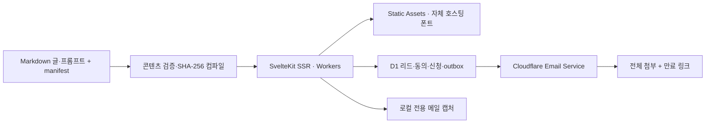

# Web for AI · Business · Everyone — 시스템 설계 정본

2026-10-01. 주제를 직접 선정하는 한국어 정본에 영어·일본어·중국어 간체를 제공하는 교육·컨설팅 플랫폼입니다. 긴 시리즈의 누적과 근거 있는 업데이트로 다시 방문할 이유를 만듭니다. 지속 유입 자체를 보장한다고 약속하지 않습니다. SEO/GEO/AIO는 후속 시리즈입니다.

## 정보 구조

홈 → 시리즈 학습 → 항목별 프롬프트 활용 → 전체 모음집 신청 → 리드·자료 전달 → 선택적 업데이트 구독 → 서비스 이용으로 연결합니다.

| 경로 | 역할 |
|---|---|
| / | 브랜드와 첫 시리즈 |
| /series, /series/accessibility | 시리즈·수준별 목차 |
| /series/accessibility/[slug] | 본문·목차·프롬프트·이전/다음 글 |
| /prompts | 항목별 검색 |
| /archive | 기존 글 언어별 검색·페이지 이동 |
| /{lang}/blog/{lang}/{slug}/ | 원래 URL의 보관 글·본문·번역 링크 |
| /resources/accessibility | 이메일 자료 신청 |
| /confirm/[token], /downloads/[token] | 자료 받기·별도 구독 확인 |
| /unsubscribe/[token] | GET 확인·POST 해지 |
| /services, /about, /privacy, /updates | 서비스 구조·페르소나·개인정보·변경 내역 |
| /dev/inbox | 개발 서버 loopback 전용 메일 캡처 |

## 런타임과 정본

본문과 프롬프트는 content/series/accessibility의 Markdown 정본을 수정합니다. 빌드는 편집된 Markdown을 컴파일하며 최초 prose 생성기를 실행하지 않습니다. src/lib/content/catalog.json은 생성 파일, manifest.json은 순서·버전·승인 정본입니다. 모음집도 같은 콘텐츠에서 생성합니다.

wrangler.jsonc가 운영 설정 정본입니다. svelte.config.js는 어댑터용 wrangler.svelte.jsonc를 파생 생성하여 앱 진입점을 .svelte-kit에 작성하게 합니다. 운영 worker/index.ts는 덮어쓰지 않으며 앱의 fetch와 scheduled 정리 작업을 함께 export합니다.

Static Assets가 정적 파일을 제공하고 SvelteKit이 서버 렌더링과 점진적 향상을 맡습니다. D1·이메일은 자료 신청에 사용합니다. 현재 런타임에는 브라우저 진단·멀티모달 모델 호출을 넣지 않았습니다. Workers Paid 월 기본액 $5는 전체 비용 상한이 아닙니다. [Workers 요금](https://developers.cloudflare.com/workers/platform/pricing/), [D1 요금](https://developers.cloudflare.com/d1/platform/pricing/), [이메일 요금](https://developers.cloudflare.com/email-service/platform/pricing/)을 각각 확인합니다.

## 리드와 자료 전달

이메일·개인정보 안내 확인은 필수, 역할·업데이트 구독은 선택입니다. D1에서 leads, lead_consents, consent_events, material_requests, mail_outbox, management_tokens, request_limits를 분리합니다. 이메일+시리즈+버전 중복 방지와 D1 batch, 조건부 outbox claim으로 병렬 신청에서도 한 번만 발송을 시작합니다. 만료 후 재신청하면 새 요청·토큰을 만듭니다.

토큰은 DB에 해시로 저장하며 실제 링크를 포함한 메일 본문은 비공개 데이터입니다. 전체 모음집 신청은 전체 시리즈 승인 이후 활성화합니다. Markdown 전체 첨부와 7일 링크를 제공하고, 다른 버전의 오래된 링크는 재신청을 안내합니다. GET이나 다운로드로 구독을 활성화하지 않으며, 선택한 구독은 명시적 POST 이메일 확인 이후에 적용합니다.

captured·accepted·sending·failed를 구분합니다. accepted는 메일 서비스 접수이며 배달 완료가 아닙니다. provider receipt 후 DB 저장 실패는 claim을 유지해 자동 재발송하지 않습니다. 원격 실패의 재처리는 로그 확인을 거치는 운영 작업입니다. 자동 캠페인/재발송은 현재 제품 범위에 포함하지 않습니다.

IP 원문을 저장하지 않고 시간별 해시로 시간당 5회 제한합니다. 입력 검증·honeypot·동일 출처 폼·비공개 경로 no-store/noindex를 적용합니다. Worker scheduled handler가 매일 마지막 활동으로부터 12개월 지난 리드와 만료 제한 버킷을 삭제합니다. 구독 해지는 개인정보 삭제와 구분합니다.

## 공개와 이전 사이트 전환

초안 본문은 Vite 개발 서버의 loopback에서 reviewReady=true인 문서만 검토합니다. 배포용 Worker와 Vite preview는 미승인 본문을 숨기고 해당 주소에 준비 중 안내를 제공합니다. CONTENT_PREVIEW 변수는 사용하지 않습니다. 공개에는 본문·프롬프트·주요 metadata의 SHA-256과 동일한 approvalHash, 유효한 reviewedAt·publishedAt을 요구합니다. 변경 시 다시 승인합니다. RSS·sitemap 글 항목·자료 번들은 승인 범위를 따릅니다. 목차·이전/다음·언어 전환은 준비 중 페이지까지 연결합니다.

기존 글·미커밋 변경 원본은 archive/legacy-site-20261001에 보존합니다. 사용자의 2026-10-01 URL 보존 지시에 따라 공개된 기존 글은 원래 /{lang}/blog/{lang}/{slug}/ 주소에서 200 응답으로 제공합니다. /archive에서만 사이트 내부 탐색으로 연결하고 새 추천·시리즈·RSS에서 제외합니다. 본문은 빌드 시 sanitize하여 Static Assets에 저장하고 SSR에서 해당 글 하나를 읽습니다. 공개 sitemap과 원본 Git snapshot을 대조하며 미발행 로컬 원본 16개는 제외합니다. snapshot에 빠진 공개 글 4개는 content/archive-supplement-20261001에 Git 정본과 provenance를 보관합니다. 언어별 홈은 실제 SSR 페이지이며 200입니다. 루트 /는 선택 언어와 브라우저 언어에 따라 302 이동합니다. 기존 자동 발행 wrapper는 로컬 exit 78입니다. 수동 workflow와 검토한 커밋 승인 절차를 사용합니다. 초기 로컬 작업에서는 공개 사이트를 변경하지 않았습니다. 이후 2026-10-02 사용자 배포 승인에 따라 운영 Worker를 전환했습니다. 원격 계정 설정과 Life Manager daemon은 변경하지 않았습니다.

## 후속 진단 제품

범위 정의 → DOM·화면·접근성 트리·조작 기록 수집 → 규칙 검사와 기준별 멀티모달 평가 → 근거·영향·우선순위 보고 → 개선 후 재검증으로 설계합니다. 정상·실패·경계 사례에서 오탐·누락·판단 유보·반복 일관성·비용을 검증한 뒤 실제 제공 범위를 공개합니다. 현재 진단 실행·가격·결제는 연결하지 않았습니다.

## 공식 자료

- [SvelteKit Cloudflare adapter](https://svelte.dev/docs/kit/adapter-cloudflare)
- [Cloudflare Workers Email API](https://developers.cloudflare.com/email-service/api/send-emails/workers-api/)
- [WCAG 2.2](https://www.w3.org/TR/WCAG22/)

## SSR·SEO·A11y·GEO

루트 +layout.server.ts는 ssr=true, prerender=false, trailingSlash=ignore를 명시합니다. 모든 주요 페이지와 원래 URL의 보관 글은 Worker에서 요청마다 HTML을 생성합니다. canonical은 보관 글의 원래 trailing slash 주소를 유지하고 목록 페이지는 현재 페이지를 가리킵니다. HTML lang, 본문·목차, 작성자·발행/수정일, 실제 내용과 일치하는 BlogPosting·BreadcrumbList, 번역 hreflang, Open Graph를 서버 렌더링합니다. sitemap에는 승인된 새 글과 기존 보관 글의 원래 주소만 넣습니다. 초안과 비공개 토큰 경로는 noindex/no-store를 유지합니다.

GEO는 별도의 인용 보장이 아닙니다. Google의 AI 검색 공식 가이드에 맞춰 크롤링 가능한 본문, 명확한 기준·근거·저자·날짜, 내부 링크와 구조화 데이터의 내용 일치를 적용합니다. 키보드·스크린 리더를 위한 의미 있는 HTML, 건너뛰기, visible focus, native 검색·폼과 점진적 향상을 사용합니다. 자동 axe 점검 결과와 수동 조작 검증은 전체 WCAG 준수 인증과 구분합니다.

- https://svelte.dev/docs/kit/page-options
- https://developers.google.com/search/docs/appearance/ai-features
- https://developers.google.com/search/docs/crawling-indexing/javascript/javascript-seo-basics

## 네 언어 시리즈와 준비 페이지

한국어는 기존 /series/accessibility/[slug]를 유지한다. 영어·일본어·중국어는 /en, /ja, /zh 접두어를 사용한다. /ko/series...는 기존 한국어 주소로 308하며 보관 글 URL은 변경하지 않는다. 시리즈 목록·목차·프롬프트 목록·RSS도 같은 언어 경로를 제공한다.

content/series/accessibility/translations/{en,ja,zh}/manifest.json, posts, prompts가 번역 정본이다. compile-content는 번역을 별도 translations.json으로 컴파일하고 한국어 sourceHash와 translationSourceHash를 비교한다. 준비 파일이 있어도 hasContent=false이면 실제 본문으로 읽지 않는다. 한국어 자동 대체는 없다. 승인과 공개 날짜는 언어별로 관리한다.

모든 352개 문서 경로가 존재하며, 준비 페이지는 noindex,follow와 HTTP 200, 해당 언어 제목·요약·원문 링크·이전/다음·네 언어 선택을 SSR로 반환한다. 준비 화면에는 미승인 본문·프롬프트를 직렬화하지 않으며 BlogPosting이나 공개 sitemap/RSS의 글 항목을 만들지 않는다. 전체 제목·요약과 경로만 미리 연결하여 집필 후 URL을 교체할 필요가 없다.

첫 개요의 네 언어 전체 본문·프롬프트와 언어별 SVG 도식 4개는 로컬 검토 가능하다. 후속 87편은 준비 상태다. 자료 신청·메일 전달은 현재 한국어 기존 흐름이며 비한국어 화면에 이를 명시한다. 모델 호출은 로컬 작성 과정에서만 이루어지고 Worker 런타임에는 추가하지 않는다.

## 2026-10-02 공개 및 UI 정책

루트 `/`는 선택 언어 쿠키(`site_language`, 180일)를 우선하고 브라우저 `Accept-Language`를 참고해 `/ko/`, `/en/`, `/ja/`, `/zh/` 홈으로 302 이동합니다. 응답은 `private, no-store`, `Vary: Accept-Language, Cookie`입니다. 홈은 실제 승인·공개된 최신 글을 발행 시각 내림차순으로 최대 5편 표시하고, 시리즈와 메뉴 링크만 제공합니다. 현재 공개 글은 접근성 개요 한 편이므로 준비 중 글을 채워 넣지 않습니다. 네 언어 홈은 SSR·고유 canonical·상호 hreflang·x-default와 언어 선택기를 제공합니다. 한국어 시리즈의 기존 무접두 경로와 아카이브 URL은 유지합니다.

개인 이름은 `/about` 소개 페이지에서만 표시합니다. 공통 작성자 표시, 푸터 이름, 홈 소개, 도구 메뉴, 자료받기 CTA와 독립 신청 폼은 제거합니다. 기존 `/resources/accessibility` 주소는 선택 언어의 마지막 글 `/series/accessibility/agentic-accessibility`로 308 이동합니다. 신청 폼은 마지막 글이 완성되고 모음집이 승인될 때 그 글 안에 추가할 예정입니다. 현재 마지막 글은 준비 중이며 폼과 메일 전송을 제공하지 않습니다. 이전 독립 폼 기반 브라우저 검증 기록은 이전 버전의 이력입니다.

접근성 개요의 네 언어 본문·평가 프롬프트·도식 4개를 사용자 지시로 공개합니다. 정확한 sourceHash 승인과 번역 원본 일치 검증을 유지하고, RSS·sitemap·BlogPosting에 공개 글만 포함합니다. 나머지 87편 × 4언어는 본문 없는 준비 중 문서이며 noindex,follow입니다.

모든 문서에 ‘초판 공개일’(`firstPublishedAt`)과 ‘최종 수정일’(`updatedAt`)을 표시합니다. 초판 공개일은 첫 실제 발행 때만 기록하며 수정 후에도 유지합니다. 준비 중 문서는 공개일을 만들지 않고 ‘공개 예정’이라고 표시합니다. 수정일은 보존된 본문·프롬프트·참조 도식 파일의 수정 기록에서 복원했습니다. compiler는 내용 해시가 변경되면 최종 수정일을 Asia/Tokyo 날짜로 갱신하며 초판 공개일은 덮어쓰지 않습니다. 내용 변경 시 기존 해시 승인은 자동으로 무효화됩니다. 최종 수정일은 공개 글의 dateModified, article:modified_time, sitemap lastmod에도 동일하게 제공합니다. 초판 공개일은 datePublished와 article:published_time에 사용합니다. 날짜 표기를 위한 메타데이터는 본문 승인 해시를 변경하지 않습니다.

## 시리즈 상세 페이지 원칙 — 2026-10-02

사용자가 전체 학습 목록 토글, 학습 성과를 설명하는 제목 아래 요약, 글과 시리즈의 JSON-LD 연결을 승인하고 향후 작성 원칙으로 저장하도록 요청했습니다. 상세 페이지 작업 전에 [article-detail-guidelines.md](article-detail-guidelines.md)를 읽고 적용합니다. 기본 접힘, 현재 글 순서와 강조, 공개/준비 상태, 네 언어 SSR 링크, PC 사이드바/모바일 요약 아래 배치, 키보드·no-JS 동작을 유지합니다. 준비 중 글에는 BlogPosting이나 발행 날짜를 만들어 넣지 않습니다.
