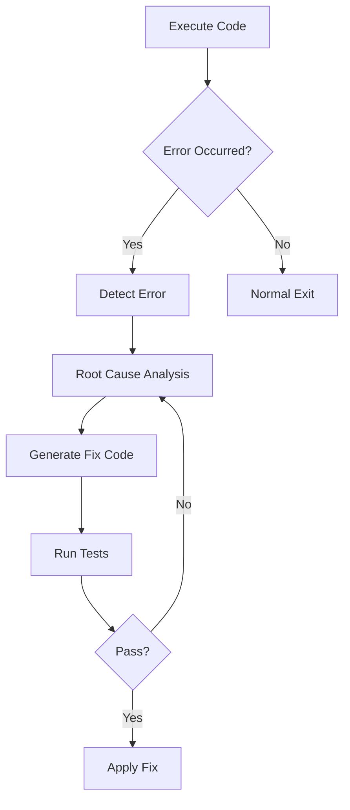

# Appendix C: Frequently Asked Questions (FAQ)

This section provides frequently asked questions and answers during Claude Code usage. Each question is categorized, and you can refer to related chapters as needed.

---

## C.1 Installation and Environment Setup FAQ

### Q1: What are the requirements to use Claude Code?

<strong>A:</strong> The basic requirements for using Claude Code are as follows.

<strong>Required</strong>:
- <strong>Anthropic API key</strong>: API key for Claude AI model access
- <strong>Node.js</strong>: Version 18.0.0 or higher (for MCP servers and script execution)
- <strong>Operating System</strong>: macOS, Linux, Windows (WSL recommended)
- <strong>Terminal</strong>: Command-line interface access

<strong>Recommended</strong>:
- Git installation (for version control)
- VSCode or your preferred text editor
- 16GB+ RAM (for large-scale projects)

<strong>Reference</strong>: Chapter 2 - Environment Setup

---

### Q2: What's the difference between Claude Code and general IDE plugins (e.g., GitHub Copilot)?

<strong>A:</strong> Claude Code is a comprehensive AI assistant that goes beyond simple code autocomplete.

<strong>Key Differences</strong>:

| Aspect | General IDE Plugins | Claude Code |
|------|---------------------|-------------|
| <strong>Scope</strong> | Code autocomplete focus | Full project context understanding |
| <strong>File Access</strong> | Currently editing file | Entire project file system |
| <strong>Work Unit</strong> | Line/block level | Multi-file, task level |
| <strong>Context</strong> | Limited (surrounding code only) | Includes project docs, Git history |
| <strong>Autonomy</strong> | Suggestions only | Can perform independent work |
| <strong>Agent System</strong> | None | Multi-agent orchestration |

<strong>Example</strong>:
- <strong>Copilot</strong>: "To write this function..." → Code suggestion
- <strong>Claude Code</strong>: "Write blog post in 4 languages, generate images, optimize SEO, commit to Git" → Full workflow automation

<strong>Reference</strong>: Chapter 1 - Claude Code Introduction

---

### Q3: Can I use Claude Code offline?

<strong>A:</strong> <strong>No</strong>, Claude Code requires an internet connection.

<strong>Reason</strong>:
- Claude AI models run on Anthropic's cloud servers
- Receives real-time responses through API calls
- MCP server integration features also require network access

<strong>Alternatives</strong>:
- Can use local LLM solutions (e.g., Ollama, LM Studio), but won't support all Claude Code features
- Prepare work in advance and batch process when online

<strong>Note</strong>: Some caching features can reduce token usage for repetitive tasks.

---

## C.2 Usage and Operations FAQ

### Q8: Claude Code doesn't seem to understand my codebase. What should I do?

<strong>A:</strong> You need to optimize context provision. Writing a CLAUDE.md file is most effective.

<strong>Solution</strong>:

<strong>1. Write CLAUDE.md</strong>:
```markdown
# Project Overview
This project is a React-based e-commerce platform.

## Architecture
- Frontend: React 18, TypeScript, Tailwind CSS
- Backend: Node.js, Express, PostgreSQL
- State Management: Redux Toolkit

## Directory Structure
```
src/
├── components/     # Reusable React components
├── pages/         # Page components
├── hooks/         # Custom React Hooks
└── utils/         # Utility functions
```

## Coding Rules
- Use only functional components
- Define Props with TypeScript interface
- Use Tailwind utility classes for CSS
```

<strong>2. Provide Explicit Context</strong>:
```
"Create a Modal component similar in style to src/components/Button.tsx."
```

<strong>3. Explain Project Structure First</strong>:
```
"This project uses a Monorepo structure. There are packages/frontend and packages/backend, with shared types defined in packages/shared."
```

<strong>Reference</strong>: Chapter 4 - Mastering CLAUDE.md, Chapter 6 - Effective Prompt Writing

---

### Q9: The agent modified the wrong file. How do I revert it?

<strong>A:</strong> If you're using Git, you can easily revert it.

<strong>Step-by-Step Recovery</strong>:

<strong>1. Check Changes</strong>:
```bash
git status        # Check modified files
git diff          # Check changes
```

<strong>2. Restore Specific File</strong>:
```bash
# Restore single file
git checkout -- src/components/Button.tsx

# Restore multiple files
git checkout -- src/components/*.tsx
```

<strong>3. Revert All Changes</strong>:
```bash
git reset --hard HEAD
```

<strong>4. If Discovered After Commit</strong>:
```bash
# Cancel last commit (keep changes)
git reset --soft HEAD~1

# Completely cancel last commit
git reset --hard HEAD~1
```

<strong>Prevention Methods</strong>:
- Create branch before work: `git checkout -b feature/new-component`
- Commit frequently: Ask Claude to "commit changes"
- Protect important files with `.claude/hooks/pre-file-write` hook

<strong>Reference</strong>: Chapter 10 - Hook-based Automation

---

### Q12: How do I validate the quality of code generated by Claude Code?

<strong>A:</strong> You should use a multi-layered validation strategy.

<strong>1. Automated Tests</strong>:
```bash
# Run unit tests
npm test

# Type checking
npm run typecheck

# Lint checks
npm run lint
```

<strong>2. Hook-based Validation</strong>:
```bash
# .claude/hooks/post-file-write
#!/bin/bash

# Validate generated file
if [[ $FILE_PATH == *.ts ]]; then
  npx tsc --noEmit $FILE_PATH
  npx eslint $FILE_PATH
fi
```

<strong>3. Agent Checklist</strong>:
```markdown
# .claude/agents/code-reviewer.md

## Quality Checklist
- [ ] Type safety
- [ ] Error handling
- [ ] Performance considerations
- [ ] Security vulnerabilities
- [ ] Test coverage
```

<strong>4. Code Review Agent</strong>:
```
"@code-reviewer Review src/utils/api.ts and suggest improvements"
```

<strong>5. Manual Review Points</strong>:
- Business logic accuracy
- Security-sensitive code (authentication, authorization)
- External API integration
- Database migrations

<strong>Reference</strong>: Chapter 10 - Hook-based Automation, Chapter 17 - Code Review Automation

---

## C.3 License and Policy FAQ

### Q18: How much does it cost to use Claude Code?

<strong>A:</strong> Claude Code uses the Anthropic API, so billing is based on API usage.

<strong>Pricing Structure (as of January 2025)</strong>:

| Model | Input (1M tokens) | Output (1M tokens) | Use Case |
|------|------------------|-------------------|----------|
| Claude Sonnet 4 | $3 | $15 | General tasks |
| Claude Sonnet 4.5 | $5 | $25 | Code generation (recommended) |
| Claude Opus 4.5 | $15 | $75 | Complex reasoning |

<strong>Real-world Cost Example</strong>:

<strong>Blog Post Writing (4 languages)</strong>:
- Input: ~10,000 tokens (context, instructions)
- Output: ~12,000 tokens (4 languages × 3,000 tokens)
- Model: Claude Sonnet 4.5
- Cost: (10K × $5/1M) + (12K × $25/1M) = $0.35

<strong>Monthly Estimated Cost (Blog Automation)</strong>:
- 2 posts per week: 8/month
- $0.35 per post
- Agent collaboration overhead: 20%
- <strong>Total cost: ~$3.36/month</strong>

<strong>Cost Reduction Tips</strong>:
- Use prompt caching (50% discount on repeated context)
- Choose appropriate model (simple tasks use Sonnet 4)
- Reuse metadata (post-metadata.json pattern)
- Batch processing (multiple tasks at once)

<strong>Reference</strong>: Appendix B - Performance Optimization Tips, Chapter 15 - Enterprise Scaling

---

### Q19: Are my code and data safe? Does Anthropic use them for training?

<strong>A:</strong> User data is protected according to Anthropic's data policy.

<strong>Anthropic Data Policy Summary</strong>:

<strong>✓ Safe Parts</strong>:
- Conversations via API are <strong>not used for model training</strong>
- User data encrypted during transmission and storage
- Complies with GDPR, CCPA, and other privacy laws
- Conversation logs automatically deleted after 30 days (configurable)

<strong>⚠️ Important Notes</strong>:
- Limited use possible for "Trust & Safety" purposes (abuse prevention)
- Sampling possible for quality improvement with explicit consent
- Public repository code is already public information

<strong>Methods to Protect Sensitive Information</strong>:

<strong>1. API Keys and Secrets</strong>:
```bash
# .gitignore
.env
.env.local
*.pem
*.key
credentials.json
```

<strong>2. Exclude Sensitive Files</strong>:
```json
// .claude/settings.local.json
{
  "excludePatterns": [
    "**/.env*",
    "**/secrets/*",
    "**/credentials/**"
  ]
}
```

<strong>3. Validate with Hooks</strong>:
```bash
# .claude/hooks/pre-file-write
#!/bin/bash

# Check for sensitive information
if grep -qE "(api_key|password|secret)" "$FILE_PATH"; then
  echo "WARNING: Sensitive information detected. File review needed"
  exit 1
fi
```

<strong>4. Consider Local LLM</strong>:
- For very sensitive codebases, use local models like Ollama, LM Studio
- However, all Claude Code features will be limited

<strong>References</strong>:
- [Anthropic Privacy Policy](https://www.anthropic.com/privacy)
- [API Data Usage Policy](https://www.anthropic.com/legal/api-data-usage)

<strong>Reference</strong>: Chapter 15 - Enterprise Scaling

---

## C.4 Advanced Usage FAQ

### Q22: What is a Self-Healing AI system and when should it be used?

<strong>A:</strong> Self-Healing AI is a system that automatically detects and fixes errors.

<strong>Core Concept</strong>:


<strong>Application Scenarios</strong>:

<strong>1. CI/CD Pipeline</strong>:
```yaml
# .github/workflows/self-healing.yml
name: Self-Healing CI

on: [push]

jobs:
  test-and-heal:
    runs-on: ubuntu-latest
    steps:
      - uses: actions/checkout@v2
      - name: Run Tests
        id: test
        run: npm test || echo "FAILED=true" >> $GITHUB_ENV

      - name: Self-Heal
        if: env.FAILED == 'true'
        run: |
          claude-code "Analyze test failure cause and fix it"
          npm test
```

<strong>2. Runtime Error Handling</strong>:
```typescript
// src/utils/self-healing-fetch.ts
async function selfHealingFetch(url: string, maxRetries = 3) {
  for (let i = 0; i < maxRetries; i++) {
    try {
      return await fetch(url);
    } catch (error) {
      if (i === maxRetries - 1) throw error;

      // Request error analysis and fix from Claude
      const fix = await claude.analyze({
        error: error.message,
        context: { url, attempt: i + 1 }
      });

      // Apply fix
      url = fix.correctedUrl;
    }
  }
}
```

<strong>Usage Considerations</strong>:
- ✓ Validate first in dev/staging environment
- ✓ Apply to non-critical services first
- ⚠️ Production requires caution (manual approval process needed)

<strong>Reference</strong>: Chapter 13 - Self-Healing AI Systems

---

## Conclusion

This FAQ section provides frequently asked questions and answers during Claude Code usage. For additional questions or deeper content, please refer to each chapter.

<strong>Additional Resources</strong>:
- [Anthropic Official Documentation](https://docs.anthropic.com)
- [Claude Code GitHub](https://github.com/anthropics/claude-code)
- [Community Forum](https://community.anthropic.com)
- [Discord Channel](https://discord.gg/anthropic)

<strong>Continuous Learning</strong>:
- Check for new model and feature updates monthly
- Share community best practices
- Discover your own patterns through experimentation

---

<strong>This document's information is based on January 2025 and is continuously updated.</strong>