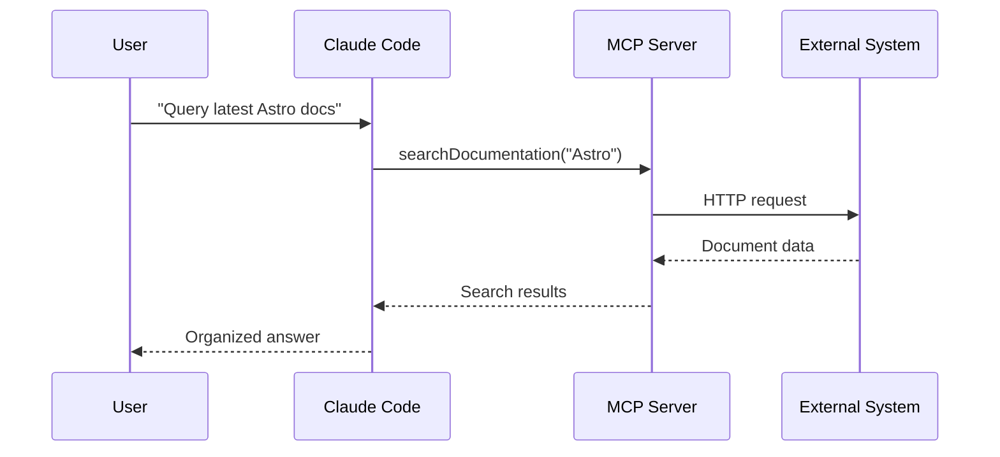
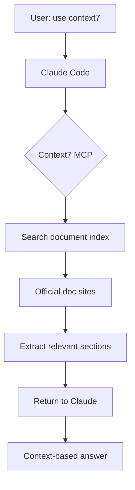
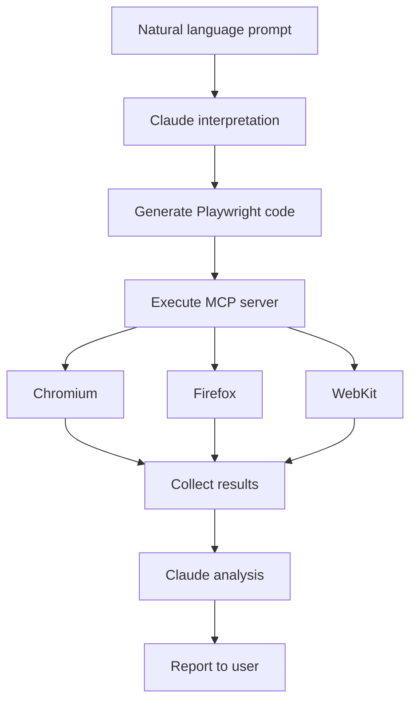
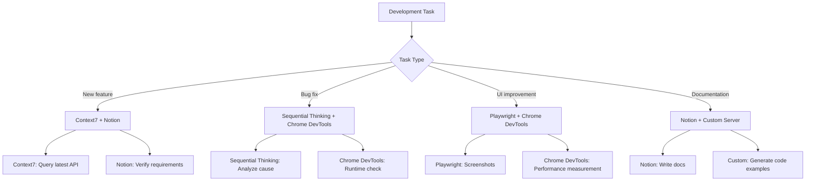

# Chapter 5: MCP Server Integration

Model Context Protocol (MCP) is an innovative protocol that extends AI agent capabilities. This chapter teaches you how to extend Claude Code's context with real-time data, external systems, and specialized tools using MCP servers.

## Recipe 5.1: What is an MCP Server

### Problem

LLMs (Large Language Models) are trapped in the timeframe of their training data. Claude's knowledge is limited to January 2025, unable to access library updates or new technical information released afterward. Additionally, interactions with external systems like file system access, database queries, and browser control are limited.

Developers often face situations like:

- "I want to use new features in Astro 5.0, but Claude says it doesn't know about them"
- "I wish Claude could look at the real-time database schema and generate code"
- "I want to automatically test web pages and take screenshots"
- "I want to automatically create and manage GitHub issues"

### Solution

Model Context Protocol (MCP) is a standard protocol for AI agents to communicate with external tools and data sources. Announced by Anthropic in November 2024, this protocol extends LLM context to enable real-time information access and external system control.

**Core MCP Concepts**:

1. **Server**: External process providing specific functionality (e.g., database server, browser automation server)
2. **Client**: AI agent communicating with MCP server (Claude Code)
3. **Resources**: Data or functionality provided by the server (e.g., document search, code analysis)
4. **Tools**: Specific functions Claude can call

**MCP Server Configuration**:

Claude Code configures MCP servers in the `~/.claude/settings.json` file.

```json
{
  "mcpServers": {
    "server-name": {
      "command": "execution-command",
      "args": ["arg1", "arg2"],
      "env": {
        "ENV_VAR": "value"
      }
    }
  }
}
```

### Code/Example

Let's look at the simplest MCP server configuration example. Context7 server searches for the latest library documentation.

```json
{
  "mcpServers": {
    "context7": {
      "command": "npx",
      "args": ["-y", "@upstash/context7-mcp"]
    }
  }
}
```

This configuration means:
- **Server name**: `context7` (Claude identifies the server by this name)
- **Execution command**: `npx` (Node.js package execution tool)
- **Arguments**: `-y @upstash/context7-mcp` (automatic installation and execution)

After configuration, restart Claude Code to automatically load the server. Now you can use it like this:

```
Prompt: "Tell me how to configure Content Collections in Astro 5.0. use context7"
```

Claude automatically calls the Context7 server to search the latest Astro documentation and provides accurate information.

### Explanation

**Problems MCP Solves**:

1. **Hallucination Prevention**: Queries actual data sources instead of guessing unknown information
2. **Context Extension**: Accesses real-time information beyond training data constraints
3. **Tool Integration**: Controls external systems like browsers, databases, APIs
4. **Standardization**: Connects various tools with the same protocol to maintain consistency

**How MCP Works**:



When Claude calls an MCP server, the server communicates with external systems (APIs, databases, browsers, etc.) and returns results to Claude. Claude uses these results as context to provide accurate answers to users.

**MCP vs Traditional Plugin Systems**:

| Feature | MCP | Traditional Plugins |
|---------|-----|-------------------|
| Standardization | Single protocol | Platform-specific |
| Security | Sandbox isolation | Direct integration risks |
| Scalability | Unlimited server additions | Platform-limited |
| Reusability | Shareable across AI clients | Platform-dependent |

### Variations

**Local vs Remote Servers**:

Most MCP servers run locally, but remote servers are also possible.

```json
{
  "mcpServers": {
    "remote-server": {
      "command": "node",
      "args": ["mcp-client.js"],
      "env": {
        "SERVER_URL": "https://api.example.com/mcp"
      }
    }
  }
}
```

**Docker-based Server**:

Servers with complex dependencies can run with Docker.

```json
{
  "mcpServers": {
    "sequentialthinking": {
      "command": "docker",
      "args": [
        "run",
        "-i",
        "--rm",
        "mcp/sequentialthinking"
      ]
    }
  }
}
```

**Conditional Server Activation**:

To activate different servers per project, use `.claude/settings.local.json`.

```json
{
  "mcpServers": {
    "project-specific-server": {
      "command": "npx",
      "args": ["-y", "my-custom-mcp-server"]
    }
  }
}
```

---

## Recipe 5.2: Querying Latest Documentation with Context7

### Problem

Developers live in a constantly changing technology ecosystem. Libraries update monthly, new features are added, and existing APIs change. Since Claude's training data is up to January 2025, it doesn't know about updates or new libraries released afterward.

For example:
- If Astro 5.0 was released in February 2025, Claude doesn't know about it
- Using new hooks from React 19 requires accurate API knowledge Claude lacks
- Changes to Next.js 15's App Router are unknown

In these cases, Claude can only guess (hallucinate) or respond "This is not in my training data."

### Solution

Context7 is an MCP server that searches the latest library official documentation in real-time. This server provided by Upstash indexes major framework and library official documentation and enables Claude to search when needed.

**Context7 Installation and Configuration**:

1. Open `~/.claude/settings.json`
2. Add Context7 to `mcpServers` section

```json
{
  "mcpServers": {
    "context7": {
      "command": "npx",
      "args": ["-y", "@upstash/context7-mcp"]
    }
  }
}
```

3. Restart Claude Code
4. Verify Context7 server loads automatically

### Code/Example

**Basic Usage**:

Including "use context7" in your prompt makes Claude automatically call Context7.

```
Prompt 1: "Tell me how to configure Content Collections in Astro 5.0. use context7"

Claude's Actions:
1. Request "Astro Content Collections" search from Context7 server
2. Extract relevant information from latest Astro official docs
3. Generate accurate answer using search results as context
```

**Real Usage Example 1: Learning New Libraries**:

```
Prompt: "Tell me how to implement streaming responses in Vercel AI SDK 3.0. use context7"

Example Answer:
"I queried Vercel AI SDK official documentation from Context7.

AI SDK 3.0 uses the `streamText()` function:

\`\`\`typescript
import { streamText } from 'ai';

const result = await streamText({
  model: openai('gpt-4'),
  prompt: 'Write a poem',
});

for await (const chunk of result.textStream) {
  console.log(chunk);
}
\`\`\`

Key changes:
- v2's `stream: true` option is removed
- `streamText()` returns an async iterator
- Access real-time text chunks through `textStream` property"
```

**Real Usage Example 2: API Migration**:

```
Prompt: "Tell me the main App Router changes when migrating from Next.js 14 to 15. use context7"

Claude's Tasks:
1. Query Next.js 15 migration guide from Context7
2. Extract App Router-related Breaking Changes
3. Organize with code examples

Example Answer:
"I verified the Next.js 15 official docs from Context7.

Key changes:

1. **`fetch()` Default Behavior Change**
   - Previous: Automatic caching (force-cache)
   - Current: Default no-store

\`\`\`typescript
// Next.js 14
fetch('https://api.example.com/data')  // Auto-caching

// Next.js 15
fetch('https://api.example.com/data', { cache: 'force-cache' })  // Explicit caching
\`\`\`

2. **`cookies()` and `headers()` Async**
   - Now return Promises

\`\`\`typescript
// Next.js 14
const cookieStore = cookies()

// Next.js 15
const cookieStore = await cookies()
\`\`\`

Migration checklist:
- [ ] Specify caching strategy for all fetch() calls
- [ ] Add await to cookies(), headers() calls
- [ ] Review dynamic rendering strategy"
```

### Explanation

**Value Context7 Provides**:

1. **Hallucination Prevention**: Queries actual documents instead of Claude guessing
2. **Latest Information Guaranteed**: Official docs always maintain current state
3. **Accurate Code Examples**: Uses validated examples from official docs
4. **Version Management**: Can explicitly query specific version docs

**Major Supported Libraries**:

Context7 indexes official documentation for these libraries:

- **Frameworks**: React, Vue, Svelte, Angular, Astro, Next.js, Nuxt, SvelteKit
- **Backend**: Express, Fastify, NestJS, Hono
- **Databases**: Prisma, Drizzle, TypeORM
- **Utilities**: Lodash, date-fns, Zod
- **AI/ML**: LangChain, Vercel AI SDK, OpenAI SDK

**How It Works**:



Context7 regularly crawls official documentation sites to update the index. When search requests arrive, it extracts the most relevant document sections through vector similarity search.

### Variations

**Querying Specific Versions**:

```
Prompt: "Tell me how to use React 18's useTransition hook. use context7"
```

Claude automatically identifies version information and queries the corresponding version's docs.

**Multi-library Comparison**:

```
Prompt: "Compare Prisma and Drizzle's transaction handling approaches. use context7"
```

Context7 queries both libraries' docs simultaneously to provide comparative analysis.

**Framework Integration Pattern Queries**:

```
Prompt: "Tell me the official way to integrate Tailwind CSS into an Astro project. use context7"
```

Cross-references both libraries' integration guides to provide accurate configuration methods.

**Troubleshooting**:

If Context7 isn't working:

```bash
# 1. Clear npx cache
rm -rf ~/.npm/_npx

# 2. Manually install package
npm install -g @upstash/context7-mcp

# 3. Use global package in settings.json
{
  "context7": {
    "command": "context7-mcp"
  }
}
```

---

## Recipe 5.3: Web Automation with Playwright

### Problem

Web application development involves many repetitive manual tasks:

- Manual browser testing for every new feature
- Repeatedly resizing to check layouts at various resolutions
- Opening developer tools and saving to capture screenshots
- Verifying compatibility across different browsers (Chrome, Firefox, Safari)

These tasks are time-consuming and error-prone. Also, writing E2E tests requires learning tools like Playwright or Cypress.

### Solution

Using Playwright MCP server allows Claude to directly control browsers. Describe test scenarios in natural language and Claude automatically generates and executes Playwright code.

**Playwright MCP Installation**:

```json
{
  "mcpServers": {
    "playwright": {
      "command": "npx",
      "args": ["@anthropic-ai/mcp-server-playwright@latest"]
    }
  }
}
```

### Code/Example

**Example 1: Automatic Page Screenshot Capture**:

```
Prompt: "Open localhost:4321 page and capture full page screenshot. Save as homepage.png"

Claude's Tasks:
1. Launch Playwright browser
2. Navigate to specified URL
3. Wait for page load completion
4. Save full page screenshot
```

Generated Playwright code:

```typescript
import { chromium } from 'playwright';

async function captureScreenshot() {
  const browser = await chromium.launch();
  const page = await browser.newPage();

  await page.goto('http://localhost:4321');
  await page.waitForLoadState('networkidle');

  await page.screenshot({
    path: 'homepage.png',
    fullPage: true
  });

  await browser.close();
}

captureScreenshot();
```

**Example 2: Responsive Layout Testing**:

```
Prompt: "Capture blog page screenshots at mobile(375x667), tablet(768x1024), desktop(1920x1080) resolutions"

Claude's Tasks:
1. Open page at three viewport sizes
2. Save screenshots at each resolution
3. Include resolution info in filenames
```

Generated code:

```typescript
import { chromium } from 'playwright';

const viewports = [
  { name: 'mobile', width: 375, height: 667 },
  { name: 'tablet', width: 768, height: 1024 },
  { name: 'desktop', width: 1920, height: 1080 }
];

async function testResponsive() {
  const browser = await chromium.launch();

  for (const viewport of viewports) {
    const page = await browser.newPage({
      viewport: { width: viewport.width, height: viewport.height }
    });

    await page.goto('http://localhost:4321/blog');
    await page.waitForLoadState('networkidle');

    await page.screenshot({
      path: `blog-${viewport.name}.png`,
      fullPage: true
    });

    await page.close();
  }

  await browser.close();
}

testResponsive();
```

**Example 3: E2E User Scenario Testing**:

```
Prompt: "Write E2E test for blog search functionality:
1. Access homepage
2. Enter 'MCP' in search box
3. Verify 3+ search results appear
4. Click first result
5. Verify page title contains 'MCP'"

Claude's Tasks:
1. Analyze user scenario step-by-step
2. Map Playwright actions for each step
3. Generate test code including assertions
```

Generated code:

```typescript
import { test, expect } from '@playwright/test';

test('Blog search functionality test', async ({ page }) => {
  // 1. Access homepage
  await page.goto('http://localhost:4321');

  // 2. Enter 'MCP' in search box
  await page.fill('input[type="search"]', 'MCP');
  await page.press('input[type="search"]', 'Enter');

  // 3. Verify 3+ search results
  await page.waitForSelector('.search-result');
  const results = await page.locator('.search-result').count();
  expect(results).toBeGreaterThanOrEqual(3);

  // 4. Click first result
  await page.locator('.search-result').first().click();

  // 5. Verify page title contains 'MCP'
  await expect(page).toHaveTitle(/MCP/);
});
```

### Explanation

**Core Playwright MCP Features**:

1. **Browser Control**: Supports three browser engines - Chromium, Firefox, WebKit
2. **Automatic Waiting**: Automatically waits until elements appear
3. **Screenshots**: Captures full page or specific element screenshots
4. **Network Monitoring**: Tracks API calls and resource loading
5. **Cross-browser Testing**: Runs same tests across multiple browsers

**Difference from Chrome DevTools MCP**:

| Feature | Playwright MCP | Chrome DevTools MCP |
|---------|----------------|---------------------|
| Main Use | Automation, E2E testing | Performance analysis, debugging |
| Browsers | Chromium, Firefox, WebKit | Chrome only |
| Screenshots | Full page, per-element | Viewport only |
| Network | Can intercept requests | Monitoring only |
| Execution Mode | Headless/Headed | Headed (debug port) |

**How It Works**:



### Variations

**Dark Mode Screenshot**:

```
Prompt: "Switch page to dark mode and capture screenshot"

Generated code:
await page.emulateMedia({ colorScheme: 'dark' });
await page.screenshot({ path: 'dark-mode.png' });
```

**Network Speed Simulation**:

```
Prompt: "Test page loading in 3G network environment and measure completion time"

Generated code:
const context = await browser.newContext({
  ...devices['Slow 3G']
});
const page = await context.newPage();
const start = Date.now();
await page.goto('http://localhost:4321');
await page.waitForLoadState('networkidle');
const duration = Date.now() - start;
console.log(`Loading time: ${duration}ms`);
```

**PDF Generation**:

```
Prompt: "Save blog post as PDF"

Generated code:
await page.goto('http://localhost:4321/blog/post-title');
await page.pdf({
  path: 'blog-post.pdf',
  format: 'A4',
  printBackground: true
});
```

**Specific Element Screenshot**:

```
Prompt: "Capture only the .hero-section element from the page"

Generated code:
const element = await page.locator('.hero-section');
await element.screenshot({ path: 'hero.png' });
```

---

## Recipe 5.4: Notion API Integration

### Problem

Many developers use Notion for idea management, project planning, and documentation. However, Notion and development environments are separated:

- Recording blog ideas in Notion and later copying them to code
- Managing project TODOs in Notion but no sync with code work
- Writing technical docs in Notion but having to copy-paste to code comments or README

These manual synchronizations are time-consuming and error-prone.

### Solution

Using Notion MCP server allows Claude to directly read and write Notion databases. This enables automatic synchronization between Notion and codebase.

**Notion MCP Configuration**:

1. Issue Notion API key:
   - Visit [https://www.notion.so/my-integrations](https://www.notion.so/my-integrations)
   - Click "New integration"
   - Enter name (e.g., "Claude Code Integration")
   - Click "Submit"
   - Copy "Internal Integration Token"

2. Connect integration to Notion database:
   - Open database page in Notion
   - Click "..." menu in upper right
   - Select "Connections" → "Claude Code Integration"

3. MCP server configuration:

```json
{
  "mcpServers": {
    "notion": {
      "command": "npx",
      "args": ["-y", "@anthropic-ai/mcp-server-notion"],
      "env": {
        "NOTION_API_KEY": "secret_your_api_key_here"
      }
    }
  }
}
```

### Code/Example

**Example 1: Query Blog Ideas**:

Assume there's a "Blog Ideas" database in Notion:

| Title | Status | Tags | Created |
|-------|--------|------|---------|
| How to use MCP servers | Draft | claude-code, productivity | 2025-11-20 |
| Playwright automation | To Write | testing, automation | 2025-11-21 |

```
Prompt: "Get items from Notion's 'Blog Ideas' database where Status is 'To Write'"

Claude's Tasks:
1. Query database via Notion API
2. Apply Status filter
3. Display organized results
```

Claude's response:

```markdown
Queried blog ideas pending writing from Notion:

1. **Playwright automation**
   - Tags: testing, automation
   - Created: 2025-11-21

Should I write a blog post on this topic?
```

**Example 2: Auto-register Blog Post in Notion**:

```
Prompt: "Add the just-written 'MCP Server Integration' blog post to Notion's 'Published Posts' database.
Set status to 'Published', date to today"

Claude's Tasks:
1. Parse current blog metadata (title, description, tags)
2. Create new page via Notion API
3. Set property values (Status, Published Date, Tags)
```

Generated Notion API call:

```typescript
import { Client } from '@notionhq/client';

const notion = new Client({ auth: process.env.NOTION_API_KEY });

await notion.pages.create({
  parent: { database_id: 'your_database_id' },
  properties: {
    Title: {
      title: [
        {
          text: { content: 'MCP Server Integration' }
        }
      ]
    },
    Status: {
      select: { name: 'Published' }
    },
    'Published Date': {
      date: { start: '2025-11-23' }
    },
    Tags: {
      multi_select: [
        { name: 'mcp' },
        { name: 'claude-code' },
        { name: 'productivity' }
      ]
    }
  }
});
```

**Example 3: TODO Synchronization**:

```
Prompt: "Get incomplete tasks from 'MCP Integration' project in Notion's 'Development Tasks' database
and add them as markdown checklist to project's TODO.md file"

Claude's Tasks:
1. Query tasks via Notion API (project filter + incomplete filter)
2. Convert to markdown checklist format
3. Add to TODO.md file
```

Generated TODO.md:

```markdown
# Development Tasks

## MCP Integration

- [ ] Write Context7 server configuration docs
- [ ] Add Playwright examples
- [ ] Test Notion API integration
- [ ] Review security settings
```

### Explanation

**Core Notion MCP Features**:

1. **Database Queries**: Supports filters, sorting, pagination
2. **Page Create/Update**: Add new items or modify existing ones
3. **Property Management**: Supports all property types - Title, Select, Multi-select, Date, Number, etc.
4. **Block Reading**: Query content blocks within pages
5. **Search**: Workspace-wide search

**Permission Management**:

Notion MCP enables granular permission control in `.claude/settings.local.json`:

```json
{
  "toolAllowlist": {
    "notion": {
      "API-post-search": "allow",        // Allow search
      "API-get-self": "allow",           // Allow user info query
      "API-get-block-children": "allow", // Allow block reading
      "API-post-pages": "ask",           // Request confirmation for page creation
      "API-patch-pages": "ask"           // Request confirmation for page modification
    }
  }
}
```

**Security Considerations**:

1. **API Key Management**: Use environment variables, don't hardcode in settings.json
2. **Least Privilege Principle**: Connect integration only to necessary databases
3. **Read-only Mode**: Allow only reading if write permission unnecessary
4. **Local Settings**: Store sensitive settings in `.claude/settings.local.json` (exclude from version control)

### Variations

**Auto-update Project Metadata**:

```
Prompt: "Read current project's package.json version and
update the Version field for this project in Notion's 'Projects' database"

Claude's Tasks:
1. Read package.json
2. Extract version field
3. Search for project page in Notion
4. Update Version property
```

**Auto-generate Learning Notes**:

```
Prompt: "Analyze today's code changes and
add them as 'What I Learned Today' item to Notion's 'Learning Log' database"

Claude's Tasks:
1. Analyze changes with git diff
2. Extract key learning points
3. Create new page in Notion
4. Organize with code snippets included
```

**Release Notes Sync**:

```
Prompt: "Sync latest version content from CHANGELOG.md
to Notion's 'Release Notes' database"

Claude's Tasks:
1. Parse CHANGELOG.md
2. Extract latest version section
3. Create new release page in Notion
4. Convert changes to Notion blocks
```

---

## Recipe 5.5: Building Custom MCP Servers

### Problem

Existing MCP servers cover general use cases, but each project has unique requirements:

- Accessing internal APIs or databases
- Handling specific file formats or protocols
- Needing new functionality not in existing servers

For example, connecting Claude to company JIRA, Slack, or internal databases requires building custom MCP servers.

### Solution

You can create custom servers using the MCP SDK. Anthropic provides SDKs for TypeScript and Python, simplifying server development.

**Simple MCP Server Structure**:

```typescript
import { Server } from '@modelcontextprotocol/sdk/server/index.js';
import { StdioServerTransport } from '@modelcontextprotocol/sdk/server/stdio.js';

const server = new Server({
  name: 'my-custom-server',
  version: '1.0.0',
});

// Register Tool
server.setRequestHandler(ListToolsRequestSchema, async () => {
  return {
    tools: [
      {
        name: 'my_tool',
        description: 'My custom tool',
        inputSchema: {
          type: 'object',
          properties: {
            query: { type: 'string' }
          }
        }
      }
    ]
  };
});

// Execute Tool
server.setRequestHandler(CallToolRequestSchema, async (request) => {
  if (request.params.name === 'my_tool') {
    const result = await myCustomLogic(request.params.arguments.query);
    return { content: [{ type: 'text', text: result }] };
  }
});

// Start server
const transport = new StdioServerTransport();
await server.connect(transport);
```

### Code/Example

**Example 1: Markdown Link Validation Server**:

Let's build an MCP server to verify all links in blog posts are valid.

**Project Structure**:

```
markdown-link-checker/
├── package.json
├── src/
│   └── index.ts
└── README.md
```

**package.json**:

```json
{
  "name": "markdown-link-checker-mcp",
  "version": "1.0.0",
  "type": "module",
  "bin": {
    "markdown-link-checker-mcp": "./dist/index.js"
  },
  "dependencies": {
    "@modelcontextprotocol/sdk": "^0.5.0",
    "markdown-link-check": "^3.12.1"
  },
  "devDependencies": {
    "@types/node": "^20.0.0",
    "typescript": "^5.0.0"
  },
  "scripts": {
    "build": "tsc",
    "start": "node dist/index.js"
  }
}
```

**src/index.ts**:

```typescript
import { Server } from '@modelcontextprotocol/sdk/server/index.js';
import { StdioServerTransport } from '@modelcontextprotocol/sdk/server/stdio.js';
import {
  CallToolRequestSchema,
  ListToolsRequestSchema,
} from '@modelcontextprotocol/sdk/types.js';
import markdownLinkCheck from 'markdown-link-check';
import { readFile } from 'fs/promises';

const server = new Server({
  name: 'markdown-link-checker',
  version: '1.0.0',
});

server.setRequestHandler(ListToolsRequestSchema, async () => {
  return {
    tools: [
      {
        name: 'check_markdown_links',
        description: 'Validate all links in Markdown file',
        inputSchema: {
          type: 'object',
          properties: {
            filePath: {
              type: 'string',
              description: 'Markdown file path to check'
            }
          },
          required: ['filePath']
        }
      }
    ]
  };
});

server.setRequestHandler(CallToolRequestSchema, async (request) => {
  if (request.params.name === 'check_markdown_links') {
    const { filePath } = request.params.arguments as { filePath: string };

    try {
      const content = await readFile(filePath, 'utf-8');

      return new Promise((resolve) => {
        markdownLinkCheck(content, (err, results) => {
          if (err) {
            resolve({
              content: [{
                type: 'text',
                text: `Error: ${err.message}`
              }]
            });
            return;
          }

          const deadLinks = results.filter(r => r.status === 'dead');
          const aliveLinks = results.filter(r => r.status === 'alive');

          const report = `
Link check complete: ${filePath}

✅ Valid links: ${aliveLinks.length}
❌ Broken links: ${deadLinks.length}

${deadLinks.length > 0 ? 'Broken link list:\n' + deadLinks.map(l =>
  `- ${l.link} (${l.statusCode})`
).join('\n') : 'All links are valid.'}
          `.trim();

          resolve({
            content: [{ type: 'text', text: report }]
          });
        });
      });
    } catch (error) {
      return {
        content: [{
          type: 'text',
          text: `File read failed: ${error.message}`
        }]
      };
    }
  }

  throw new Error(`Unknown tool: ${request.params.name}`);
});

async function main() {
  const transport = new StdioServerTransport();
  await server.connect(transport);
  console.error('Markdown Link Checker MCP server started');
}

main().catch((error) => {
  console.error('Server error:', error);
  process.exit(1);
});
```

**Build and Install**:

```bash
# 1. Build project
npm install
npm run build

# 2. Global install
npm link

# 3. Claude Code configuration (~/.claude/settings.json)
{
  "mcpServers": {
    "markdown-link-checker": {
      "command": "markdown-link-checker-mcp"
    }
  }
}
```

**Usage**:

```
Prompt: "Check if all links in src/content/blog/ko/mcp-servers-toolkit-introduction.md file are valid"

Claude's Response:
"Checked with Markdown Link Checker server:

✅ Valid links: 12
❌ Broken links: 2

Broken link list:
- https://docs.example.com/old-page (404)
- https://api.deprecated.com (500)

Should I update these links?"
```

**Example 2: Database Query Server**:

MCP server for safe PostgreSQL database queries:

```typescript
import { Server } from '@modelcontextprotocol/sdk/server/index.js';
import { StdioServerTransport } from '@modelcontextprotocol/sdk/server/stdio.js';
import {
  CallToolRequestSchema,
  ListToolsRequestSchema,
} from '@modelcontextprotocol/sdk/types.js';
import pg from 'pg';

const { Pool } = pg;

const pool = new Pool({
  host: process.env.DB_HOST,
  database: process.env.DB_NAME,
  user: process.env.DB_USER,
  password: process.env.DB_PASSWORD,
  port: parseInt(process.env.DB_PORT || '5432'),
});

const server = new Server({
  name: 'postgres-query',
  version: '1.0.0',
});

// Allow only read-only query patterns
const ALLOWED_QUERIES = /^SELECT\s+/i;

server.setRequestHandler(ListToolsRequestSchema, async () => {
  return {
    tools: [
      {
        name: 'query_database',
        description: 'Execute read-only query on PostgreSQL database',
        inputSchema: {
          type: 'object',
          properties: {
            query: {
              type: 'string',
              description: 'SQL SELECT query'
            },
            limit: {
              type: 'number',
              description: 'Result row limit (default: 100)',
              default: 100
            }
          },
          required: ['query']
        }
      }
    ]
  };
});

server.setRequestHandler(CallToolRequestSchema, async (request) => {
  if (request.params.name === 'query_database') {
    const { query, limit = 100 } = request.params.arguments as {
      query: string;
      limit?: number;
    };

    // Security: Allow SELECT queries only
    if (!ALLOWED_QUERIES.test(query)) {
      return {
        content: [{
          type: 'text',
          text: 'Error: Only SELECT queries allowed.'
        }]
      };
    }

    // Add LIMIT
    const safeQuery = query.trim().replace(/;$/, '') + ` LIMIT ${limit}`;

    try {
      const result = await pool.query(safeQuery);

      // Format results as markdown table
      const headers = Object.keys(result.rows[0] || {});
      const table = `
| ${headers.join(' | ')} |
| ${headers.map(() => '---').join(' | ')} |
${result.rows.map(row =>
  `| ${headers.map(h => row[h]).join(' | ')} |`
).join('\n')}

Total ${result.rowCount} rows
      `.trim();

      return {
        content: [{ type: 'text', text: table }]
      };
    } catch (error) {
      return {
        content: [{
          type: 'text',
          text: `Query error: ${error.message}`
        }]
      };
    }
  }

  throw new Error(`Unknown tool: ${request.params.name}`);
});

async function main() {
  const transport = new StdioServerTransport();
  await server.connect(transport);
  console.error('PostgreSQL Query MCP server started');
}

main().catch((error) => {
  console.error('Server error:', error);
  process.exit(1);
});
```

**Configuration File (~/.claude/settings.json)**:

```json
{
  "mcpServers": {
    "postgres-query": {
      "command": "node",
      "args": ["/path/to/postgres-query-mcp/dist/index.js"],
      "env": {
        "DB_HOST": "localhost",
        "DB_NAME": "myapp",
        "DB_USER": "readonly_user",
        "DB_PASSWORD": "secure_password",
        "DB_PORT": "5432"
      }
    }
  }
}
```

**Usage Example**:

```
Prompt: "Query number of users who signed up in the last 7 days from users table"

Claude's Tasks:
1. Convert prompt to SQL query
2. Call PostgreSQL Query MCP server
3. Summarize results in natural language

Generated Query:
SELECT COUNT(*) as new_users
FROM users
WHERE created_at >= NOW() - INTERVAL '7 days'

Result:
"247 new users signed up in the last 7 days."
```

### Explanation

**Core MCP Server Components**:

1. **Server**: Main object implementing MCP protocol
2. **Transport**: Communication method (mainly stdio, SSE also possible)
3. **Tools**: List of functions Claude can call
4. **Resources**: Data sources the server provides (optional)
5. **Request Handlers**: Tool execution logic

**Security Considerations**:

1. **Input Validation**: Don't trust user input, always validate
2. **Permission Restrictions**: Separate read-only and write operations
3. **Rate Limiting**: Prevent excessive requests
4. **Environment Variables**: Manage API keys, DB passwords as environment variables
5. **Error Handling**: Be careful not to include sensitive info in error messages

**MCP SDK Main Types**:

```typescript
// Tool definition
interface Tool {
  name: string;
  description: string;
  inputSchema: {
    type: 'object';
    properties: Record<string, any>;
    required?: string[];
  };
}

// Tool execution result
interface CallToolResult {
  content: Array<{
    type: 'text' | 'image' | 'resource';
    text?: string;
    data?: string;
    mimeType?: string;
  }>;
}

// Server metadata
interface ServerInfo {
  name: string;
  version: string;
}
```

### Variations

**Resource Provider (Read-only Data)**:

Can provide static data as Resources instead of Tools.

```typescript
import { ListResourcesRequestSchema, ReadResourceRequestSchema } from '@modelcontextprotocol/sdk/types.js';

// List available resources
server.setRequestHandler(ListResourcesRequestSchema, async () => {
  return {
    resources: [
      {
        uri: 'config://app-settings',
        name: 'Application settings',
        mimeType: 'application/json'
      }
    ]
  };
});

// Read resource
server.setRequestHandler(ReadResourceRequestSchema, async (request) => {
  if (request.params.uri === 'config://app-settings') {
    const config = await loadAppSettings();
    return {
      contents: [{
        uri: request.params.uri,
        mimeType: 'application/json',
        text: JSON.stringify(config, null, 2)
      }]
    };
  }
});
```

**SSE Transport (Web Server)**:

Deploy as remote server using HTTP SSE instead of stdio:

```typescript
import { Server } from '@modelcontextprotocol/sdk/server/index.js';
import { SSEServerTransport } from '@modelcontextprotocol/sdk/server/sse.js';
import express from 'express';

const app = express();
const server = new Server({ name: 'remote-mcp', version: '1.0.0' });

// ... Register Tools ...

app.get('/sse', async (req, res) => {
  const transport = new SSEServerTransport('/message', res);
  await server.connect(transport);
});

app.post('/message', async (req, res) => {
  // Handle message
});

app.listen(3000, () => {
  console.log('MCP server started: http://localhost:3000');
});
```

**Async Processing and Streaming**:

Streaming responses for large data processing:

```typescript
server.setRequestHandler(CallToolRequestSchema, async (request) => {
  if (request.params.name === 'analyze_large_file') {
    const { filePath } = request.params.arguments as { filePath: string };

    // Return progress incrementally
    const chunks: string[] = [];

    for await (const line of readFileByLines(filePath)) {
      const analysis = await analyzeLine(line);
      chunks.push(analysis);

      // Send intermediate results every 100 lines (actually use MCP's notification mechanism)
      if (chunks.length % 100 === 0) {
        // Progress notification
      }
    }

    return {
      content: [{
        type: 'text',
        text: chunks.join('\n')
      }]
    };
  }
});
```

---

## Summary and Next Steps

This chapter taught you how to extend Claude Code's capabilities using MCP servers:

1. **MCP Basics**: Protocol extending LLM context with real-time data
2. **Context7**: Prevent hallucination by querying latest library docs
3. **Playwright**: Browser automation, E2E testing, screenshot capture
4. **Notion API**: Sync idea management with codebase
5. **Custom Servers**: Develop MCP servers for project-specific requirements

### Recommended Learning Path

**Beginner**:
1. Configure and use Context7 (quickest impact)
2. Simple screenshot capture with Playwright
3. Read-only Notion integration

**Intermediate**:
1. Write Playwright E2E tests
2. Use Notion write features (TODO sync)
3. Combined workflows with multiple MCP servers

**Advanced**:
1. Develop custom MCP servers
2. Integrate internal systems (DB, API)
3. Implement Resource Provider

### Practical Application Tips

**MCP Server Selection Criteria**:

| Situation | Recommended Server | Reason |
|-----------|-------------------|---------|
| Using latest libraries | Context7 | Accurate info based on official docs |
| Web UI development | Playwright | Responsive testing, screenshots |
| Performance optimization | Chrome DevTools | Core Web Vitals measurement |
| Idea management | Notion | Sync with codebase |
| Complex problem solving | Sequential Thinking | Structure step-by-step thinking |

**Combined Usage Patterns**:



### Next Chapter Preview

Chapter 6 covers using Claude Code in team environments:
- Building sub-agent systems
- Code review automation
- Team knowledge base management
- CI/CD pipeline integration

MCP servers form the foundation for all these automations. Share latest technical info with Context7, sync team docs with Notion, and integrate internal tools with custom servers.

---

**Practice Exercises**:

1. Configure Context7 and query the latest documentation for major libraries used in your current project.

2. Use Playwright MCP to request Claude to capture screenshots of 3 key pages in your web application under development.

3. (Optional) Create a Notion database and record blog ideas, then query through Claude.

4. (Challenge) Build a simple custom MCP server. Example: A server that analyzes package.json dependencies and finds outdated packages.

**References**:
- MCP Official Documentation: https://modelcontextprotocol.io
- Anthropic MCP GitHub: https://github.com/anthropics/anthropic-mcp
- MCP SDK Reference: https://github.com/anthropics/anthropic-mcp/tree/main/sdk
- Community MCP Servers: https://github.com/anthropics/anthropic-mcp/tree/main/servers
