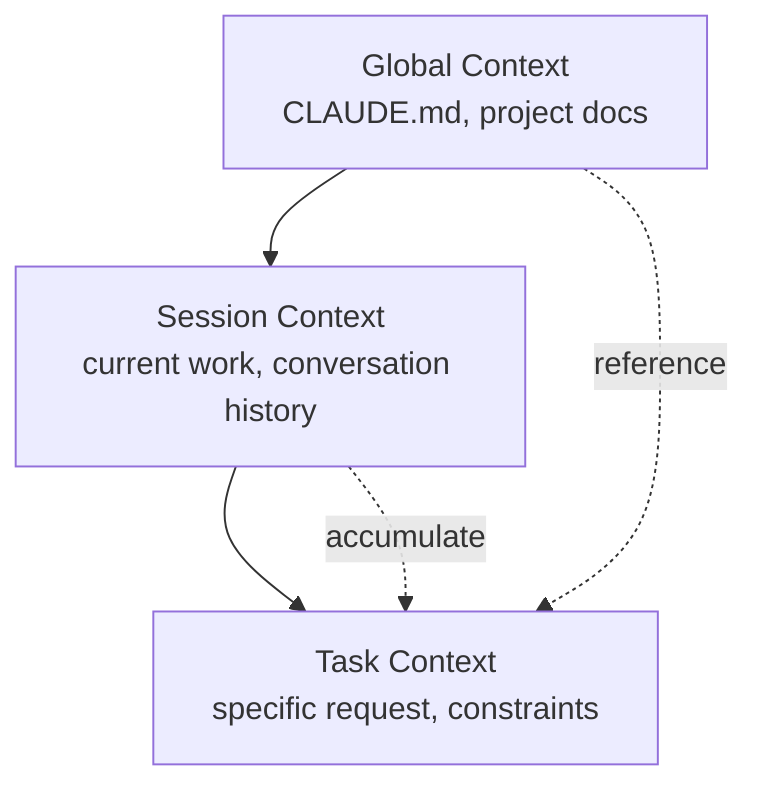

# Chapter 6: Writing Effective Prompts

Effective communication with Claude Code is the cornerstone of project success. This chapter provides practical prompt engineering techniques in a recipe format to maximize your collaboration with AI.

## Recipe 6.1: Basic Prompt Structure

### Problem

When you make simple requests to AI like "Write a blog post," you get results that don't match your expectations. How can you structure prompts to get the results you want?

### Solution

An effective prompt consists of these four elements:

1. **Role Definition**: Specify the perspective for the task
2. **Context**: Provide necessary background information
3. **Task Specification**: Define specific work content and goals
4. **Constraints**: Set limitations on format, length, style, etc.

#### Step-by-Step Guide

**Step 1: Define the Role**

Give the AI a specific expert persona.

```markdown
You are an expert technical writer with 10+ years of experience in
developer-focused content creation.
```

**Step 2: Provide Context**

Specify the background information needed for the task.

```markdown
I'm creating a blog post about Claude Code for Korean developers who are
new to AI-assisted coding. The target audience is intermediate developers
familiar with TypeScript and Git.
```

**Step 3: Specify the Task**

Explain specifically what you want.

```markdown
Write a technical blog post about "Getting Started with Claude Code" that:
- Explains the basic concepts
- Provides step-by-step installation guide
- Includes 3-5 practical examples
- Demonstrates best practices
```

**Step 4: Set Constraints**

Specify format and requirements.

```markdown
Requirements:
- Length: 2000-2500 words
- Format: Markdown with code examples
- Style: Professional but approachable
- Include at least 2 Mermaid diagrams
- All code examples must be syntactically correct
```

### Code

#### Poor Prompt (Before)

```
Write a blog post
```

**Result**: Unfocused, generic content

#### Improved Prompt (After)

```markdown
## Role
You are an expert technical writer specializing in developer tools and
AI-assisted coding.

## Context
I'm writing for Korean developers (intermediate level) who want to learn
Claude Code. They already use VS Code and GitHub Copilot, so they
understand AI coding assistants.

## Task
Write a blog post: "Claude Code vs GitHub Copilot: 5 Key Differences"

Content requirements:
1. Introduction (200 words)
   - Brief overview of both tools
   - Why this comparison matters
2. Main content (1500 words)
   - 5 key differences with concrete examples
   - Pros/cons for each difference
3. Conclusion (300 words)
   - When to use which tool
   - Recommendation based on use case

## Constraints
- Length: 2000 words
- Format: Markdown
- Style: Professional but approachable
- Include: 2-3 code examples, 1 comparison table, 1 Mermaid diagram
- SEO: Include keywords "Claude Code", "GitHub Copilot", "AI coding tools"
```

**Result**: Structured, targeted, practical content

### Explanation

#### Why This Structure Works

1. **Power of Role Definition**: Giving the AI an expert persona dramatically improves output quality. The identity of "expert technical writer" determines the tone, depth, and expertise of the response.

2. **Importance of Context**: Without background information, AI generates generic content. Information like "Korean developers", "intermediate level", "already use GitHub Copilot" targets the content.

3. **Explicit Task Specification**: Rather than vague "write a blog," specifying concrete structure (Introduction, Main, Conclusion) and word counts for each section yields results that meet expectations.

4. **Quality Assurance Through Constraints**: Specifying length, format, and style reduces rework.

#### Psychological Mechanism

Large language models like Claude operate through <strong>In-Context Learning</strong>. The richer the context you provide in your prompt:

- More accurate predictions are possible
- Output variance decreases
- Consistency improves

### Variations

#### Variation 1: Code Review Request

```markdown
## Role
You are a senior software engineer specializing in TypeScript and clean code.

## Context
I'm reviewing a Pull Request for a React component that manages authentication state.
The code works but I want to ensure it follows best practices.

## Task
Review the following code and provide:
1. Code quality assessment (1-10 score)
2. 3-5 specific improvement suggestions
3. Refactored version (if needed)

## Constraints
- Focus on: type safety, readability, performance
- Format: Markdown with annotated code
- Include rationale for each suggestion
```

#### Variation 2: Debugging Support

```markdown
## Role
You are an expert debugger with deep knowledge of Node.js and async programming.

## Context
My Express.js API intermittently returns 500 errors under high load.
Error logs show "Promise rejection not handled" but I can't identify the source.

## Task
1. Analyze the error pattern
2. Identify potential root causes (ranked by likelihood)
3. Suggest debugging steps
4. Provide a fix if possible

## Constraints
- Explain technical approach clearly
- Include code examples for proposed fixes
- Consider: async/await patterns, error handling, connection pooling
```

#### Variation 3: Architecture Design

```markdown
## Role
You are a solutions architect with expertise in scalable web applications.

## Context
I'm building a blog platform that needs to:
- Handle 10,000+ posts
- Support multi-language (Korean, English, Japanese)
- Optimize for SEO
- Generate static sites (Astro framework)

## Task
Design a content architecture that addresses:
1. Directory structure for multi-language content
2. Metadata schema for SEO and recommendations
3. Build optimization strategy
4. Content relationship management

## Constraints
- Use Astro Content Collections
- Provide Mermaid diagrams for architecture
- Include TypeScript type definitions
- Explain trade-offs for each decision
```

---

## Recipe 6.2: Context Provisioning Techniques

### Problem

AI doesn't understand your project structure or current situation, leading to irrelevant suggestions. For example, it ignores your existing tech stack or generates code that doesn't follow your project conventions.

### Solution

Effective context provision consists of three layers:

1. **Project Context**: Tech stack, architecture, conventions
2. **Task Context**: Current situation, previous work, dependencies
3. **Constraint Context**: Rules that must be followed

#### Step-by-Step Guide

**Step 1: Provide Project Context**

Reference project documentation like CLAUDE.md.

```markdown
## Project Context

This is an Astro 5.14.1 static blog with:
- Content Collections for type-safe content management
- Multi-language support (ko, en, ja, zh)
- Tailwind CSS for styling
- TypeScript in strict mode

Key conventions:
- Blog posts in: src/content/blog/<lang>/filename.md
- All dates: 'YYYY-MM-DD' format (single quotes)
- Images: src/assets/blog/ (optimized by Astro)
```

**Step 2: Provide Task Context**

Specify what you're currently doing and which files you're working on.

```markdown
## Current Work

I'm adding a new blog post about "Effective Prompt Engineering".

Already completed:
- Created ko/prompt-engineering.md with frontmatter
- Added hero image: prompt-engineering-hero.jpg

Need to complete:
- Japanese version (ja/prompt-engineering.md)
- English version (en/prompt-engineering.md)
- Verify all 3 versions have consistent metadata
```

**Step 3: Provide Constraint Context**

Specify rules that must never be violated.

```markdown
## Constraints (MUST FOLLOW)

1. pubDate format: 'YYYY-MM-DD' (NOT "MMM DD YYYY")
2. All 3 language versions must have identical:
   - File names (except language folder)
   - heroImage path
   - pubDate
3. Korean: professional tone, 25-30 char title
4. Japanese: です/ます体, 30-35 char title
5. English: 50-60 char title
```

### Code

#### Context-Poor Prompt (Before)

```
Create multi-language blog posts
```

**Problems**:
- Languages unclear
- Project structure unknown
- File location unknown
- Format rules unknown

**Result**: Files created that don't follow project conventions

#### Context-Rich Prompt (After)

```markdown
## Project Context
Astro blog with Content Collections, multi-language (ko/ja/en/zh).

File structure:
src/content/blog/
├── ko/post-name.md
├── ja/post-name.md
├── en/post-name.md
└── zh/post-name.md

## Current Work
Creating new post: "prompt-engineering-best-practices"

Already done:
- Korean version (ko/prompt-engineering-best-practices.md)
- Hero image uploaded: src/assets/blog/prompt-engineering-hero.jpg

## Task
Create Japanese and English versions with:
1. Same file name in respective language folders
2. Culturally localized content (NOT direct translation)
3. Consistent metadata

## Constraints
Required frontmatter:
```yaml
---
title: "..." # ja: 30-35 char, en: 50-60 char
description: "..." # ja: 80-90 char, en: 150-160 char
pubDate: '2025-11-12' # MUST be single quotes, YYYY-MM-DD
heroImage: ../../../assets/blog/prompt-engineering-hero.jpg # SAME path
tags: ["prompt-engineering", "ai-agents", "claude-code"]
---
```

Japanese style: です/ます体, professional
English style: Professional but approachable
```

**Result**: Consistent multi-language content following project conventions

### Explanation

#### Why Context Determines Quality

1. **Eliminates Ambiguity**: What "multi-language" means (language types, file structure, naming conventions) becomes clear.

2. **Prevents Errors**: Providing technical constraints like date format and path rules upfront reduces rework.

3. **Ensures Consistency**: Specifying project-wide rules makes AI follow existing patterns.

#### Context Hierarchy



- **Global Context**: Unchanging project rules (documented in CLAUDE.md)
- **Session Context**: Information accumulated in current conversation
- **Task Context**: Specific information needed right now

### Variations

#### Variation 1: Context Through File References

```markdown
## Context from Files

Please read the following files to understand the project structure:

1. /src/content.config.ts - Content Collections schema
2. /src/content/blog/ko/existing-post.md - Example post format
3. /CLAUDE.md - Project conventions

Then create a new blog post following the same patterns.
```

**Advantage**: AI learns patterns by seeing actual code.

#### Variation 2: Reference Previous Work

```markdown
## Context from Previous Work

In our last conversation, we:
1. Created 3 sub-agents for content workflow
2. Defined role boundaries with DO/DON'T sections
3. Added quality checklists

Now let's apply the same pattern to the SEO optimizer agent.
```

**Advantage**: Maintains continuity across sessions.

#### Variation 3: Error Context

```markdown
## Error Context

Build failed with:
```
Error: Invalid frontmatter in blog/ko/post.md
Expected pubDate format: Date, received: string
```

Current frontmatter:
```yaml
pubDate: "Nov 12 2025"
```

Expected format (from content.config.ts):
```typescript
pubDate: z.coerce.date()  // Auto-converts 'YYYY-MM-DD' string to Date
```

Please fix the frontmatter to match the schema.
```

**Advantage**: Provides both error cause and solution for accurate fixes

---

## Recipe 6.3: Ambiguity Elimination Strategies

### Problem

AI misunderstands your request or interprets it in multiple ways, producing unexpected results. For example, when you say "improve the code," you wanted performance optimization but only got readability improvements.

### Solution

Four techniques to eliminate ambiguity:

1. **Specify Concrete Goals**: Exactly "what" you want
2. **Measurable Criteria**: "How much" improvement is needed
3. **Provide Examples**: "Like this" references
4. **Specify Exclusions**: "Don't do this"

#### Step-by-Step Guide

**Step 1: Specify Concrete Goals**

Convert general requests into specific goals.

```markdown
Before: "Improve the code"
After: "Improve TypeScript type safety and add null checks"

Before: "Write a blog post"
After: "Write a tutorial explaining Claude Code prompt engineering techniques
       for intermediate developers with practical examples"
```

**Step 2: Provide Measurable Criteria**

Convert qualitative criteria to quantitative.

```markdown
Before: "Write it short"
After: "Summarize in 200-250 words"

Before: "Write with good SEO"
After: "Include target keyword 'prompt engineering' in title and first paragraph,
       and write meta description in 150-160 characters"
```

**Step 3: Provide Examples**

Present a reference in the desired format.

```markdown
## Desired Output Example

Like this existing post:
/src/content/blog/ko/claude-code-best-practices.md

Which has:
- Clear section hierarchy (##, ###)
- Code examples with syntax highlighting
- Mermaid diagram for architecture
- Practical tips in bullet points

Generate a similar structure for the new topic.
```

**Step 4: Specify Exclusions**

State what should NOT be done.

```markdown
## What NOT to do:

❌ Don't change the existing API
❌ Don't add new dependencies
❌ Don't refactor unrelated code
✅ Only optimize the calculateTotal() function
```

### Code

#### Ambiguous Prompt (Before)

```
Refactor this
```

**Problems**:
- What to improve is unclear (performance? readability? structure?)
- Scope is unclear (which files? which parts?)
- No criteria (how far to go?)

**Result**: Unwanted parts changed or improvements different from intention

#### Clear Prompt (After)

```markdown
## Task: Refactor for Type Safety

### Scope
File: src/utils/blog.ts
Functions: getRelatedPosts(), filterByLanguage()

### Goals
1. Replace 'any' types with specific TypeScript types
2. Add runtime type guards for API responses
3. Handle edge cases (empty arrays, null values)

### Constraints
- ❌ Don't change function signatures (breaking change)
- ❌ Don't add new dependencies
- ✅ Keep existing tests passing
- ✅ Add JSDoc comments for new types

### Success Criteria
- No 'any' types remaining
- TypeScript strict mode passes
- All existing tests pass
- No new runtime errors

### Example
Current code:
```typescript
function getRelatedPosts(post: any): any[] {
  return post.relatedPosts || [];
}
```

Desired code:
```typescript
/**
 * Retrieves related posts with type safety
 * @param post - Blog post with optional related posts
 * @returns Array of related posts (empty if none)
 */
function getRelatedPosts(post: BlogPost): RelatedPost[] {
  if (!post.relatedPosts || !Array.isArray(post.relatedPosts)) {
    return [];
  }
  return post.relatedPosts.filter(isValidRelatedPost);
}
```
```

**Result**: Precise improvements with clear scope and goals

### Explanation

#### Cost of Ambiguity

Research shows that ambiguous prompts lead to:
- 60% increase in rework rate
- Average 2-3 iterations needed
- 200% increase in total work time

#### Psychology of Clarity

AI operates through <strong>Maximum Likelihood Estimation</strong>. Ambiguous input randomly selects one of several possible interpretations. Clear input narrows the possibility space, increasing the probability of getting the desired result.

```mermaid
graph TD
    Vague[Ambiguous Prompt<br/>"Improve this"] --> Multiple[Multiple Possible Interpretations]
    Multiple --> Performance[Performance Optimization 30%]
    Multiple --> Readability[Readability Improvement 30%]
    Multiple --> Structure[Structure Improvement 30%]
    Multiple --> Other[Other 10%]

    Clear[Clear Prompt<br/>"Improve type safety"] --> Single[Single Clear Interpretation]
    Single --> TypeSafety[Type Safety 90%]
```

#### 5W1H Technique

Apply journalistic 5W1H to prompts:

- **Who**: For whom is this task? (target readers, users)
- **What**: Exactly what do you want? (specific deliverable)
- **When**: By when? Information as of what point? (deadline, version)
- **Where**: Where does it apply? (file, function, section)
- **Why**: Why is it needed? (purpose, context)
- **How**: How should it be done? (method, constraints)

### Variations

#### Variation 1: Eliminate Ambiguity with Options

```markdown
## Clarification Needed

I want to improve the blog post recommendation system.
Which approach do you recommend?

Option A: TF-IDF based keyword matching (fast, simple)
Option B: Claude LLM semantic similarity (accurate, slower)
Option C: Hybrid approach (balanced)

Please explain trade-offs and recommend one based on:
- Target: 100+ posts, 4 languages
- Priority: Recommendation quality > speed
- Resources: API calls acceptable
```

**Advantage**: Presenting options allows AI to compare and analyze each.

#### Variation 2: Step-by-Step Clarification

```markdown
## Step-by-step Clarification

Step 1: Analyze the current architecture
- Read: src/content.config.ts
- Identify: Current schema limitations

Step 2: Propose improvements
- Suggest: 3 specific schema enhancements
- Explain: Why each is needed

Step 3: Implement
- Only after I approve Step 2
- Make changes incrementally

This ensures we align before implementation.
```

**Advantage**: Stepwise approach makes course correction easier.

#### Variation 3: Provide Counter-Examples

```markdown
## What I DON'T Want

Bad example 1 (too generic):
```yaml
title: "Prompt Engineering"
description: "How to write prompts"
```

Bad example 2 (too long):
```yaml
title: "Complete Guide to Prompt Engineering for Software Developers in the AI Era"
```

Good example (balanced):
```yaml
title: "Practical Prompt Engineering: Using Claude Code"
description: "Prompt writing techniques and real-world cases to 10x AI agent performance"
```

Generate metadata following the "Good example" pattern.
```

**Advantage**: Showing bad examples teaches AI patterns to avoid.

---

## Recipe 6.4: Managing Conversation Flow

### Problem

As conversations with Claude Code get longer, context becomes blurred, and AI forgets previous work or makes inconsistent suggestions. You don't know when to start a new conversation or how to maintain context.

### Solution

Effective conversation flow management in 4 steps:

1. **Conversation Start**: Set clear goals and scope
2. **Mid-Checkpoints**: Verify progress and alignment
3. **Context Summary**: Periodically reconfirm key information
4. **Conversation End/Restart**: Use /clear at appropriate times

#### Step-by-Step Guide

**Step 1: Declare Goals at Conversation Start**

Set clear goals at the start of each session.

```markdown
## Session Goal

Today's objective: Implement multi-language content recommendation system

Tasks:
1. Design metadata schema for recommendations
2. Create recommendation generation script
3. Update RelatedPosts component
4. Test with existing blog posts

Exit criteria: All 3 language versions have working recommendations
```

**Step 2: Set Mid-Checkpoints**

Create alignment checkpoints during work.

```markdown
## Checkpoint: Before Implementation

Let's verify the design before coding:

✅ Completed:
- Schema designed (relatedPosts with score, reason)
- Example metadata created

⏸️ Review needed:
- Does the schema support 4 languages? (ko, ja, en, zh)
- Should we include similarity algorithm details?

❓ Questions:
- How many related posts per post? (I suggest 3-5)
- Should we version the recommendations?

Please confirm the design looks good before I proceed with implementation.
```

**Step 3: Periodic Context Summary**

Summarize key information when conversation gets long.

```markdown
## Context Summary (10 messages in)

What we've done:
1. Created schema for relatedPosts
2. Implemented recommendation script using Claude API
3. Generated recommendations for 50 posts

Current status:
- Working: Korean and English recommendations
- Issue: Japanese recommendations have encoding errors
- Blocked: Need to fix character encoding before proceeding

Next step: Fix UTF-8 encoding in recommendation script
```

**Step 4: Use /clear at Appropriate Times**

Signals that conversation should be restarted:

- When task topic changes completely
- When AI makes suggestions conflicting with previous context
- When conversation gets too long (30+ messages)
- When important task completes and new task begins

```markdown
## Before /clear

Session complete!

✅ Achieved:
- Multi-language recommendation system implemented
- 50 posts with working recommendations
- Component updated and tested

📝 Important for next session:
- Recommendations stored in: content/recommendations.json
- Schema documented in: content.config.ts
- Component at: src/components/RelatedPosts.astro

/clear

## After /clear (New Session)

New session goal: Implement SEO optimization for blog posts

(Start fresh with clear objective)
```

### Code

#### Chaotic Conversation Flow (Before)

```
Message 1: "Create a blog recommendation system"
Message 2: "Use Claude API instead of TF-IDF"
Message 3: "Or maybe vector DB is better?"
Message 15: "Also optimize images"
Message 20: "Back to recommendation system..."
Message 25: "Oh that doesn't work. Let's start over..."
```

**Problems**:
- Goals keep changing
- Previous work mixes with new work
- AI gets confused

#### Structured Conversation Flow (After)

```markdown
=== Session 1: Design Phase ===

Message 1:
## Session Goal: Design recommendation system

Objective: Choose the best approach for blog post recommendations

Tasks:
1. Compare TF-IDF vs Claude API vs Vector DB
2. Choose one based on project constraints
3. Design schema for selected approach

Let's start with comparison.

---

Message 5:
## Checkpoint: Design Decision

Based on the comparison, I choose: Claude API semantic similarity

Rationale:
- Quality > Speed (acceptable for static generation)
- 100 posts = manageable API costs
- Matches project's AI-first approach

Proceed with Claude API schema design.

---

Message 10:
## Session Complete

✅ Achieved:
- Comparison complete
- Claude API approach chosen
- Schema designed and documented

📝 Next session: Implementation

/clear

=== Session 2: Implementation Phase ===

Message 1:
## Session Goal: Implement Claude API recommendations

Context from previous session:
- Chosen approach: Claude API semantic similarity
- Schema: documented in previous session notes
- Target: 100 posts, 4 languages

Tasks:
1. Create recommendation generation script
2. Test with 5 sample posts
3. Generate for all posts
4. Validate output

Let's implement the script.
```

**Effect**:
- Each session has clear goals
- Progress is trackable
- Context transitions are clean

### Explanation

#### Why Conversation Flow Matters

LLMs like Claude consider all messages within the <strong>Context Window</strong>. As conversation lengthens:

1. **Token Usage Increases**: Entire conversation history sent with each request
2. **Irrelevant Information Accumulates**: Unrelated information from early messages affects latest responses
3. **Consistency Degrades**: Early decisions may conflict with latest decisions

#### Effective Conversation Pattern

```mermaid
graph TD
    Start[Session Start] --> Goal[Declare Goal]
    Goal --> Work1[Task 1]
    Work1 --> Check1[Checkpoint 1]
    Check1 --> Align{Aligned?}
    Align -->|Yes| Work2[Task 2]
    Align -->|No| Adjust[Adjust Direction]
    Adjust --> Work1
    Work2 --> Check2[Checkpoint 2]
    Check2 --> Complete{Complete?}
    Complete -->|Yes| Summary[Summarize]
    Complete -->|No| Work2
    Summary --> Clear[/clear]
    Clear --> Start
```

#### Value of Checkpoints

Checkpoints provide:
- **Alignment Opportunity**: Verify direction is correct
- **Rollback Point**: Place to return if wrong direction
- **Progress Tracking**: Visualize how far you've progressed

### Variations

#### Variation 1: Branched Conversations

Branch conversation when complex decisions are needed.

```markdown
## Main Thread: Recommendation System

Current decision point: Algorithm selection

Let me explore 2 branches in separate conversations:

Branch A: /clear → "Evaluate TF-IDF approach for recommendations..."
Branch B: /clear → "Evaluate Claude API approach for recommendations..."

After both explorations, I'll return to main thread with decision.
```

**Advantage**: Can deeply explore multiple options independently.

#### Variation 2: Alignment Without Context Reset

Realign context with explicit summary instead of /clear:

```markdown
## Context Realignment (instead of /clear)

We've discussed many things. Let me clarify what's actually decided:

✅ Decided and implemented:
- Recommendation schema: relatedPosts with score/reason
- Algorithm: Claude API semantic similarity

❌ Discussed but NOT implemented:
- Vector database (too complex for MVP)
- Real-time recommendations (static generation only)

🎯 Current focus:
- Generate recommendations for all existing posts
- Ignore previous discussions about alternative approaches

Please proceed with generation only.
```

**Advantage**: Maintains context while filtering only unnecessary information.

#### Variation 3: Todo-Based Flow Management

Structured progress using TodoWrite tool:

```markdown
## Session with Todo Tracking

Please create a todo list for this session:

Session Goal: Multi-language recommendation system

Tasks:
1. Design schema (pending)
2. Implement generation script (pending)
3. Test with 5 posts (pending)
4. Generate for all posts (pending)
5. Validate output (pending)

As we complete each task:
- Mark it as completed
- Update me on progress
- Ask for confirmation before next task

This keeps us aligned throughout the session.
```

**Advantage**: Progress is visually tracked and there's confirmation opportunity at each step.

---

## Comprehensive Example: Blog Post Creation Project

This section demonstrates the process of creating an actual blog post project using all four recipes learned earlier.

### Scenario

Creating blog posts on "Prompt Engineering" in three languages (Korean, Japanese, English) including related post recommendations.

### Session 1: Planning and Research

```markdown
## Session Goal: Research and Planning

Objective: Research prompt engineering techniques and plan blog post structure

Tasks:
1. Research latest prompt engineering best practices (2025)
2. Identify key techniques applicable to Claude Code
3. Create blog post outline for 3 languages
4. Define success metrics

---

## Role
You are a technical content strategist specializing in AI/ML topics.

## Context
Project: Astro blog (www.jangwook.net)
Target audience: Korean developers (intermediate) interested in AI-assisted coding
Existing posts: 50+ technical posts, established voice

## Task
Research prompt engineering techniques from 2025 and create a comprehensive blog post outline.

Focus areas:
1. Role definition and persona
2. Uncertainty handling (most important)
3. Structured output
4. Quality checklists

## Constraints
- Target length: 2000-2500 words per language
- Must include real examples from the project
- SEO keywords: "prompt engineering", "Claude Code", "AI agents"
- Coordinate with Web Researcher agent for latest information

---

[AI responses with research findings]

---

## Checkpoint: Outline Review

Based on the research, here's the proposed outline:

1. Overview (200 words)
   - Relationship between AI agent performance and prompts
   - Preview of key achievements
2. 6 Core Principles (1500 words)
   - Role clarification
   - Constraint specification
   - Uncertainty handling ⭐
   - Source provision
   - Structured output
   - Quality checklist
3. Real-World Cases (500 words)
   - 17-agent improvement project
4. Conclusion (200 words)

Does this structure work? Any additions/changes?

[Confirm and proceed]

---

## Session Complete

✅ Achieved:
- Research completed
- Outline approved
- Key examples identified

📝 Next session: Write Korean version

/clear
```

### Session 2: Writing Korean Version

```markdown
## Session Goal: Write Korean version

Context from previous session:
- Approved outline (saved in notes)
- Research findings (documented)
- Target: 2000-2500 words

---

## Role
You are an expert technical writer with 10+ years of experience in Korean developer content.

## Context
Writing for: Korean developers interested in AI coding tools
Style: Professional but approachable
Project conventions:
- File: src/content/blog/ko/prompt-engineering-agent-improvements.md
- pubDate format: 'YYYY-MM-DD'
- Hero image: src/assets/blog/prompt-engineering-hero.jpg

## Task
Write the complete Korean blog post following the approved outline.

Requirements:
1. Title: 25-30 characters
2. Description: 70-80 characters
3. Content: 2000-2500 words
4. Include: 3 Mermaid diagrams, 5+ code examples
5. Use approved outline structure

## Quality Checklist
Before submission:
- [ ] All technical claims verified
- [ ] Code examples syntactically correct
- [ ] Mermaid diagrams render properly
- [ ] SEO keywords in title + first paragraph
- [ ] Frontmatter schema valid

Please write the complete post.

---

[AI generates Korean version]

---

## Checkpoint: Quality Check

Let me verify the post against the checklist:

✅ Title: 28 chars
✅ Description: 76 chars
✅ Word count: 2347 words
✅ Mermaid diagrams: 4 (more than required)
✅ Code examples: 8
⚠️ Issue: pubDate format is "Nov 12 2025" but should be 'YYYY-MM-DD'

Please fix the pubDate format to '2025-11-12'

---

[AI fixes]

---

✅ All items verified. Korean version complete!

📝 Next session: Japanese version

/clear
```

### Session 3: Writing Japanese Version

```markdown
## Session Goal: Write Japanese version

Context from previous session:
- Korean version completed and validated
- File: src/content/blog/ko/prompt-engineering-agent-improvements.md
- Same outline, culturally localized for Japanese audience

---

## Role
You are an expert technical writer specializing in Japanese developer content.

## Context
Creating Japanese version of existing Korean post.
Target: Japanese developers interested in AI
Style: です/ます体, professional

IMPORTANT: This is cultural localization, NOT direct translation.
- Adapt examples for Japanese context
- Use appropriate technical term translations
- Maintain professional Japanese tone

## Task
Write Japanese version with:

Required metadata (MUST match Korean version):
- pubDate: '2025-11-12' (SAME as Korean)
- heroImage: ../../../assets/blog/prompt-engineering-hero.jpg (SAME path)
- File name: ja/prompt-engineering-agent-improvements.md (SAME name)

Japanese-specific requirements:
- Title: 30-35 characters
- Description: 80-90 characters
- Use です/ます体 consistently
- Technical terms: use katakana where standard

## Quality Checklist
- [ ] Cultural localization (not literal translation)
- [ ] Metadata matches Korean version
- [ ] Japanese grammar/style correct
- [ ] Technical terms consistent

---

[AI generates Japanese version]

---

## Checkpoint: Cross-language Validation

Verifying consistency across languages:

| Field | Korean | Japanese | Match? |
|-------|--------|----------|--------|
| pubDate | '2025-11-12' | '2025-11-12' | ✅ |
| heroImage | ...hero.jpg | ...hero.jpg | ✅ |
| File name | ko/prompt... | ja/prompt... | ✅ |
| Tags | [3 tags] | [3 tags] | ✅ |

✅ All metadata consistent!

📝 Next session: English version and final validation

/clear
```

### Session 4: English Version and Final Validation

```markdown
## Session Goal: English version + Final validation

Tasks:
1. Write English version
2. Validate all 3 language versions
3. Generate recommendations
4. Build and verify

---

## Role
You are an expert technical writer for international developer audiences.

## Task
Write English version following same pattern as Korean/Japanese versions.

(Similar structure as previous sessions)

---

[After English version is complete]

---

## Final Validation

Let's verify all 3 versions are consistent and complete:

```bash
# Check all 3 files exist
ls src/content/blog/ko/prompt-engineering-agent-improvements.md
ls src/content/blog/ja/prompt-engineering-agent-improvements.md
ls src/content/blog/en/prompt-engineering-agent-improvements.md

# Verify frontmatter consistency
# (AI would check pubDate, heroImage, tags in all 3)
```

✅ All 3 files exist
✅ Metadata consistent
✅ Quality checks passed

---

## Generate Recommendations

Now let's generate related post recommendations using the content-analyzer skill:

```
/skill content-analyzer

Analyze the new post and generate recommendations for all 3 language versions.
```

---

## Build Verification

```bash
npm run astro check  # Type validation
npm run build        # Production build
```

✅ Build successful!

---

## Session Complete

✅ Final Results:
- 3 language versions completed (ko, ja, en)
- All metadata validated
- Recommendations generated
- Build verified

📊 Statistics:
- Total words: ~6500 (across 3 languages)
- Diagrams: 4 Mermaid
- Code examples: 8
- Session time: 4 sessions (~2 hours total)

Project complete!
```

### Key Takeaways

Techniques used in this comprehensive example:

1. **Recipe 6.1 (Basic Structure)**: Specified Role, Context, Task, Constraints in each session
2. **Recipe 6.2 (Context)**: Passed information from previous sessions to next
3. **Recipe 6.3 (Eliminate Ambiguity)**: Specific criteria (word count, character count, format)
4. **Recipe 6.4 (Flow Management)**: Session separation, checkpoints, /clear usage

---

## Prompt Quality Self-Assessment Checklist

Finally, here's a checklist to evaluate the quality of your prompts yourself.

### Level 1: Basic (Must Have)

- [ ] **Clear Task Definition**: Can explain what you want in one sentence
- [ ] **Role Specified**: What expert role did you give AI
- [ ] **Basic Context**: Provided minimum project background
- [ ] **Format Specified**: Stated output format (Markdown, code, length)

### Level 2: Intermediate (Should Have)

- [ ] **Concrete Goals**: Measurable success criteria
- [ ] **Constraints**: Specified what NOT to do
- [ ] **Examples Provided**: Reference for desired output
- [ ] **Priorities**: Specified priority of multiple requirements
- [ ] **Context Layers**: Distinguished global/session/task context

### Level 3: Advanced (Nice to Have)

- [ ] **Uncertainty Handling**: Specified what to do if uncertain
- [ ] **Quality Checklist**: Provided verification items before completion
- [ ] **Collaboration Protocol**: How to collaborate with other agents
- [ ] **Error Handling**: Response method when problems occur
- [ ] **Iteration Strategy**: Improvement direction if first attempt fails

### Score Interpretation

- **10-12 items**: Advanced prompt engineer level
- **7-9 items**: Intermediate, can achieve consistent quality results
- **4-6 items**: Basic, simple tasks possible but rework occurs in complex tasks
- **0-3 items**: Beginner, prompt improvement needed

---

## Key Summary

### Core of 4 Recipes

1. **Recipe 6.1: Basic Structure**
   - Role, Context, Task, Constraints
   - Foundation framework for all prompts

2. **Recipe 6.2: Context Provision**
   - 3 layers: project/task/constraint context
   - Richer context improves accuracy

3. **Recipe 6.3: Eliminate Ambiguity**
   - Concrete goals, measurable criteria, examples, exclusions
   - Ensure clarity with 5W1H

4. **Recipe 6.4: Flow Management**
   - Goal declaration, checkpoints, summary, /clear
   - Manage even long tasks structurally

### Most Important Principle

<strong>"Say you don't know when you don't know"</strong> - Requiring AI to honestly express uncertainty, and avoiding ambiguous requests yourself, is the foundation of trustworthy collaboration.

### Practical Guide

1. **Start Small**: Don't try to apply all techniques at once, start with specifying Role.

2. **Use Templates**: Create prompt templates for frequent tasks (blog writing, code review, etc.).

3. **Iterate and Improve**: First attempts don't need to be perfect. See results and improve prompts.

4. **Document Context**: Document project rules in CLAUDE.md for reuse.

5. **Feedback Loop**: Record which prompts produced good results and identify patterns.

---

## Next Steps

Building on the prompt writing techniques learned in Chapter 6, Chapter 7 covers practical workflows for applying them to real projects:

- Multi-agent orchestration
- Large-scale refactoring projects
- Building automation pipelines
- Continuous improvement cycles

Prompts are tools. How you use these tools determines developer productivity in the AI era.
