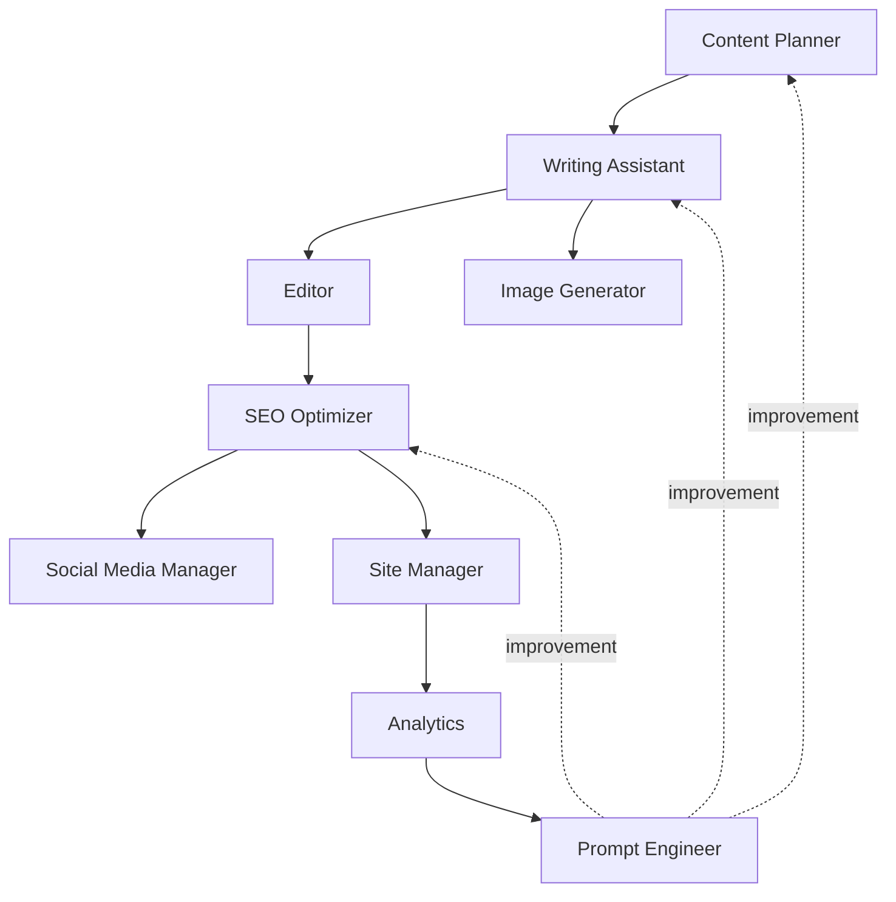
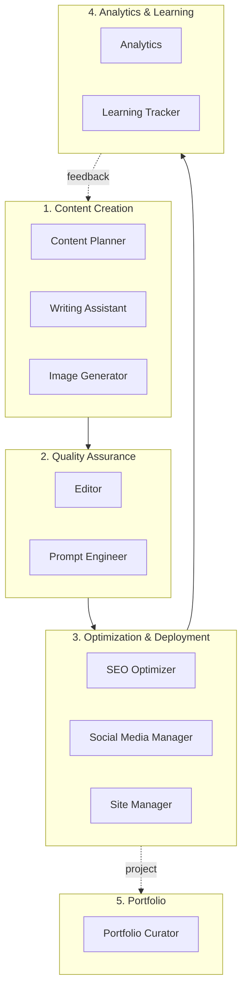

# Chapter 7: Overview of the 11-Agent Architecture

## What You'll Learn in This Chapter

You'll understand the overall structure of a multi-agent system and why multiple specialized agents are needed instead of a single AI. You'll learn how 11 agents collaborate to complete blog automation and how to leverage the 5-cluster architecture in practice.

## Recipe 7.1: Why Multi-Agent?

### Problem

When trying to handle all tasks with a single general-purpose AI, the following issues occur:

1. **Context Overload**: When one prompt contains too many instructions, the AI becomes confused
2. **Lack of Consistency**: Different quality results are produced each time
3. **Lack of Expertise**: Writing and SEO optimization are different specialized domains
4. **Difficult Debugging**: It's hard to identify where problems occur
5. **Non-Reusable**: Difficult to apply prompts written once to other tasks

Let's look at a real example:

```
❌ Bad Approach: One Giant Prompt

"Write a blog post. The topic is AI. Also do SEO optimization.
Create images, write social media sharing text.
Also review grammar and check links."

Result: The AI doesn't know where to start,
and the quality of each task suffers.
```

### Solution

Build a **specialized agent system**. Each agent performs only one clear role and collaborates with others to complete the entire workflow.

#### Step-by-Step Implementation

**Step 1: Define Role Separation Principle**

Apply the Unix philosophy of "Do One Thing Well":

```markdown
Each agent:
1. Has only one clear responsibility
2. Has clear inputs and outputs
3. Can be tested independently
4. Is loosely coupled with other agents
```

**Step 2: Define Inter-Agent Communication Interface**

```typescript
// Agent interface example
interface Agent {
  name: string;
  role: string;
  input: AgentInput;
  output: AgentOutput;
  dependencies?: string[]; // Other agents it depends on
}

interface AgentInput {
  type: string;
  schema: object;
  example: any;
}

interface AgentOutput {
  type: string;
  schema: object;
  example: any;
}
```

**Step 3: Workflow Orchestration**

```typescript
// Multi-agent workflow
async function createBlogPost(topic: string) {
  // 1. Content planning
  const outline = await contentPlanner.plan(topic);

  // 2. Draft writing (receives outline as input)
  const draft = await writingAssistant.write(outline);

  // 3. Image generation (receives draft title as input)
  const image = await imageGenerator.generate(draft.title);

  // 4. Editing and review (receives draft as input)
  const edited = await editor.review(draft);

  // 5. SEO optimization (receives edited as input)
  const optimized = await seoOptimizer.optimize(edited);

  // 6. Final publication
  return {
    content: optimized,
    image: image,
    metadata: optimized.metadata
  };
}
```

### Code

Actual agent file structure:

```bash
.claude/agents/
├── content-planner.md        # 1. Content strategy
├── writing-assistant.md       # 2. Writing
├── image-generator.md         # 3. Image generation
├── editor.md                  # 4. Editing
├── seo-optimizer.md           # 5. SEO optimization
├── social-media-manager.md    # 6. Social media
├── site-manager.md            # 7. Site management
├── analytics.md               # 8. Analytics
├── portfolio-curator.md       # 9. Portfolio
├── learning-tracker.md        # 10. Learning tracking
└── prompt-engineer.md         # 11. Prompt optimization
```

Basic structure of each agent:

```markdown
<!-- .claude/agents/writing-assistant.md -->
# Writing Assistant Agent

## Role
Write high-quality blog posts as a professional technical blogger.

## Input
- topic: string
- outline: Outline object
- audience: string
- length: number (word count)

## Output
- title: string (within 60 characters)
- content: markdown
- metadata: object

## Workflow
1. Analyze outline
2. Write introduction (problem statement)
3. Write body (solution + examples)
4. Write conclusion (Call-to-Action)
5. Generate metadata

## Quality Standards
- Capture reader interest in first paragraph
- Actionable tips in each section
- Comments included in code examples
- Clear Call-to-Action
```

### Explanation

#### Why Are Multi-Agents More Effective?

**1. Reduced Cognitive Load**

Each agent focuses on only one task, making prompts simple and clear:

```
❌ Complex prompt (1,000 tokens):
"Write a blog post, optimize SEO, generate images..."

✅ Simple prompts (200 tokens):
Writing Assistant: "Write a 2,500-word blog with this outline"
SEO Optimizer: "Optimize meta tags for this post"
```

**2. Improved Specialization**

Each agent uses domain-specific knowledge and techniques:

```markdown
Writing Assistant:
- Storytelling techniques
- Sentence structure optimization
- Reader engagement strategies

SEO Optimizer:
- Keyword density calculation
- Meta tag optimization
- Internal linking strategy
```

**3. Reusability**

Once created, agents can be reused in various workflows:

```typescript
// Workflow 1: Regular blog post
await contentPlanner.plan();
await writingAssistant.write();
await editor.review();

// Workflow 2: Urgent news post (skip planning)
await writingAssistant.write({ urgency: "high" });
await editor.review({ quick: true });

// Workflow 3: SEO update only
await seoOptimizer.optimize();
```

**4. Parallel Processing**

Independent tasks can run simultaneously:

```typescript
// Sequential execution (slow): 6 minutes
await imageGenerator.generate();  // 2 minutes
await seoOptimizer.optimize();    // 2 minutes
await socialMedia.schedule();     // 2 minutes

// Parallel execution (fast): 2 minutes
await Promise.all([
  imageGenerator.generate(),
  seoOptimizer.optimize(),
  socialMedia.schedule()
]);
```

### Variations

#### Variation 1: Micro-Agents (More Granular)

Split into smaller units:

```
Subdividing Writing Assistant:
├── IntroWriter: Introduction specialist
├── BodyWriter: Body specialist
├── ConclusionWriter: Conclusion specialist
└── CodeExampleGenerator: Code example specialist
```

**Pros**: Higher quality
**Cons**: Increased complexity, difficult orchestration

#### Variation 2: Hybrid Approach (Partial Integration)

Integrate related tasks into one agent:

```
ContentCreator (integrated agent):
├── Planning
├── Writing
└── Editing
```

**Pros**: Simple structure
**Cons**: Potential quality degradation for each task

#### Variation 3: Dynamic Agents (Created as Needed)

Dynamically create agents based on tasks:

```typescript
// Only core agents always run
const coreAgents = [contentPlanner, writingAssistant];

// Create additional agents when needed
if (needsTranslation) {
  agents.push(new TranslationAgent());
}

if (needsVideo) {
  agents.push(new VideoGeneratorAgent());
}
```

**Pros**: Resource efficient
**Cons**: Increased implementation complexity

---

## Recipe 7.2: Overview of 11 Agent Roles

### Problem

With 11 agents, you need to clearly understand what each does and when to use them. Otherwise:

- Wasting time calling the wrong agent
- Confusion due to overlapping agent roles
- Quality degradation by missing necessary agents

### Solution

Clearly define each agent's **role, input, output, and usage scenarios**.

### Code

#### 1. Content Planner

```markdown
**Role**: Establish content strategy and discover topics

**Input**:
- Topic keywords or trend areas

**Output**:
- Blog outline (table of contents structure)
- Target keyword list
- Expected audience profile

**Usage Scenarios**:
- Planning new blog posts
- Creating content calendar
- Trend analysis

**Real Example**:
```

```bash
# Call
/agent content-planner "2025 AI Trends"

# Output
## Recommended Topics
1. "3x Developer Productivity with Claude Code"
   - Target: Junior to Senior Developers
   - Search volume: Medium, Competition: Low
   - Keywords: claude code, ai coding, productivity

2. "AI Workflow Automation with MCP"
   - Target: DevOps, Automation-interested developers
   - Search volume: Low, Competition: Very Low (Opportunity!)
   - Keywords: mcp, model context protocol, automation

## Outline (First Topic)
1. Introduction: Developer's repetitive task problem
2. Claude Code introduction and core features
3. 5 practical examples
4. Productivity measurement methods
5. Conclusion and getting started guide
```

#### 2. Writing Assistant

```markdown
**Role**: Write high-quality blog posts

**Input**:
- Topic or outline
- Target length (word count)
- Tone & Style (e.g., professional, friendly)

**Output**:
- Completed blog post (Markdown)
- Frontmatter (title, description, date, tags)

**Usage Scenarios**:
- Writing new posts
- Rewriting existing posts
- Multilingual translation (localization)

**Real Example**:
```

```bash
/agent writing-assistant --topic "Claude Code Practical Guide" --length 2500 --tone professional-friendly

# Output: src/content/blog/en/claude-code-guide.md
---
title: "3x Developer Productivity with Claude Code"
description: "The new standard in AI pair programming, practical Claude Code usage"
pubDate: "2025-12-19"
tags: ["claude-code", "ai", "productivity", "tutorial"]
---

# 3x Developer Productivity with Claude Code

## AI Tool That Changes a Developer's Day

How many hours do you spend coding each day?
And how many of those hours are actually "creative" work?

[2,500-word body...]
```

#### 3. Image Generator

```markdown
**Role**: Generate blog hero images

**Input**:
- Blog title or topic
- Image style (optional)

**Output**:
- Optimized hero image (1920x1080)
- File path

**Usage Scenarios**:
- Hero image for new posts
- Social media sharing image (OG image)

**Real Example**:
```

```typescript
// Call .claude/agents/image-generator.md
const image = await imageGenerator.generate({
  topic: "Claude Code Practical Guide",
  style: "modern-tech"
});

// Output
{
  path: "src/assets/blog/2025-12-19-claude-code-guide.png",
  dimensions: { width: 1920, height: 1080 },
  prompt: "Modern tech illustration featuring Claude AI and code editor,
           flat design, blue and green color palette, high contrast"
}
```

#### 4. Editor

```markdown
**Role**: Review grammar, style, and technical accuracy

**Input**:
- Written blog post (Markdown)

**Output**:
- Review report (error list, improvement suggestions)
- Corrected version (optional)

**Usage Scenarios**:
- Final review before publishing
- Improving existing post quality

**Real Example**:
```

```markdown
# Editor Review Report

## Grammar Errors (2)
1. Line 45: "developers " → "developers" (spacing)
2. Line 120: "Claude code" → "Claude Code" (capitalization)

## Style Suggestions (3)
1. Line 30: Paragraph too long (8 sentences) → Recommend splitting into 2
2. Line 89: Add full name for technical term "MCP" on first appearance
3. Line 200: Add specific Call-to-Action in conclusion

## Technical Accuracy (1)
1. Line 150: Need to update Claude Code version info
   - Current: "Claude Code 1.0"
   - Corrected: "Claude Code 1.5"

## Metadata Review
✅ Title: 58 characters (recommended: under 60)
✅ Description: 152 characters (recommended: 150-160)
⚠️ Tags: 4 (recommended: 5-8) - Recommend adding 2 more
```

#### 5. SEO Optimizer

```markdown
**Role**: Search engine optimization

**Input**:
- Blog post
- Target keywords (optional)

**Output**:
- Optimized meta tags
- Internal link suggestions
- SEO score report

**Usage Scenarios**:
- Before publishing new posts
- Improving SEO of existing posts
- Sitemap updates

**Real Example**:
```

```yaml
# SEO Optimization Results

## Meta Tags
title: "Claude Code Practical Guide - 5 Ways to Triple Developer Productivity"
  # Includes keywords "Claude Code", "productivity", 59 characters

description: "Practical usage of AI pair programming tool Claude Code. From installation to advanced techniques, 5 tips and example code for immediate use in production."
  # Includes call-to-action ("for immediate use in production"), 154 characters

keywords:
  - claude code
  - ai coding assistant
  - developer productivity
  - ai pair programming
  - anthropic

## Internal Link Suggestions (3)
1. "What is an AI Agent?" → /blog/ai-agent-basics (Relevance: High)
2. "Prompt Engineering Basics" → /blog/prompt-engineering-101 (Relevance: Medium)
3. "MCP Integration Guide" → /blog/mcp-integration (Relevance: High)

## SEO Score: 92/100
✅ Title optimization
✅ Description optimization
✅ Heading structure (H1-H6 hierarchy)
✅ Image alt text
✅ Internal links (3)
⚠️ Insufficient external links (1, recommended: 3 or more)
```

#### 6. Social Media Manager

```markdown
**Role**: Social media sharing automation

**Input**:
- Blog post URL
- Target platform (Twitter, LinkedIn, etc.)

**Output**:
- Platform-specific sharing text
- Hashtag suggestions
- Optimal posting time

**Usage Scenarios**:
- Auto-share when publishing new posts
- Re-share popular posts
```

```markdown
# Social Media Sharing Plan

## Twitter
📝 "3x Developer Productivity with AI 👨‍💻

Wrote a practical Claude Code guide:
✅ 5 key tips
✅ Real example code
✅ Before/After comparison

Developers must see this 👇
[link]

#ClaudeCode #AI #DevProductivity"

Hashtags: #ClaudeCode #AI #DevTools #Productivity
Optimal posting time: 10 AM (developer activity hours)

## LinkedIn
📝 "The New Standard in AI Pair Programming: Claude Code

Summarized my 3-month experience applying Claude Code in production.

Key points:
• Save 2 hours daily by automating repetitive tasks
• 30% improvement in code quality
• 5 practical usage patterns

Hope this helps those interested in developer productivity.

[Read full post: link]

#SoftwareDevelopment #AI #Productivity #ClaudeCode"
```

#### 7. Site Manager

```markdown
**Role**: Astro build, deployment, performance optimization

**Input**:
- Build command (build, preview, deploy)

**Output**:
- Build success/failure report
- Performance metrics
- Deployment URL

**Usage Scenarios**:
- Publishing new posts
- Site updates
- Performance monitoring
```

```bash
# Site Manager Execution Log

[1/6] Type checking...
✅ TypeScript validation passed

[2/6] Content Collections validation...
✅ All blog posts conform to schema

[3/6] Building...
✅ 127 pages generated (3.2 seconds)

[4/6] Image optimization...
✅ 43 images → WebP conversion (2.1MB → 456KB, 78% reduction)

[5/6] Sitemap generation...
✅ sitemap-index.xml generated

[6/6] Deployment...
✅ Vercel deployment complete

Results:
📊 Lighthouse score: 98/100
⚡ First Contentful Paint: 0.8s
🎨 Largest Contentful Paint: 1.2s
🔗 Deployment URL: https://jangwook.net/blog/claude-code-guide
```

#### 8. Analytics

```markdown
**Role**: Real-time traffic analysis and instant insights

**Input**:
- Analysis period
- Analysis target (specific post or all)

**Output**:
- Informal analysis results (conversational)
- Immediate insights

**Usage Scenarios**:
- "What's the most viewed post today?"
- "What's the traffic trend for the past week?"
- Quick answers to ad-hoc questions
```

```markdown
# Analytics Instant Analysis (Informal)

Q: "What's the post with the highest views today?"

A: Top 3 as of today (2025-12-19):

1. "Claude Code Practical Guide" - 347 views
   - Up 215% from yesterday
   - Main sources: Twitter (60%), Search (30%)

2. "AI Agent Architecture" - 203 views
   - Stable (average 200 daily)

3. "Prompt Engineering 101" - 156 views
   - Down 15% from yesterday
```

#### 9. Portfolio Curator

```markdown
**Role**: Project portfolio management

**Input**:
- New project information

**Output**:
- Portfolio page update
- Auto-generated project description

**Usage Scenarios**:
- Adding new projects
- Updating existing projects
- Portfolio optimization
```

#### 10. Learning Tracker

```markdown
**Role**: Track learning goals and tech trends

**Input**:
- Learning topic or goal

**Output**:
- Learning roadmap
- Progress tracking
- Recommended resources

**Usage Scenarios**:
- Planning to learn new technology
- Checking progress
- Discovering blog topics (learned content → blog)
```

#### 11. Prompt Engineer

```markdown
**Role**: Improve prompts for all other agents

**Input**:
- Agent name to improve
- Current prompt
- Issues

**Output**:
- Improved prompt
- A/B test results
- Performance comparison

**Usage Scenarios**:
- When agent quality degrades
- When adding new use cases
- Regular optimization (monthly)

**Real Example**:
```

```markdown
# Prompt Engineer: Writing Assistant Improvement

## Before (Original Prompt)
"Write a blog post. Professional and friendly."

Issues:
- Too vague
- Output format unclear
- No quality criteria

## After (Improved Prompt)
```

````markdown
You are a technical blogger with 10 years of experience.

**Topic**: {topic}
**Target Audience**: Junior to Senior Developers
**Length**: 2,500-3,000 words

**Structure**:

1. Introduction (200 words)
   - Start with problem-raising question
   - Evoke reader empathy
2. Body (2,000 words)
   - Explain core concepts
   - At least 5 Before/After examples
   - Code must include comments and be executable
3. Conclusion (300 words)
   - 3 key takeaways
   - Actionable action items

**Tone**: Respectful, professional yet friendly
**Style**: Practical, example-focused

**Output Format**:

```yaml
---
title: [Under 60 characters, include main keywords]
description: [150-160 characters, include call-to-action]
pubDate: [YYYY-MM-DD]
tags: [5-8 items]
---

[Body in Markdown]
```
````

```

## A/B Test Results
- Quality score: 65/100 → 92/100 (+27 points)
- Revisions needed: Average 3 times → 0.5 times (-83%)
- Output consistency: 60% → 95% (+35%p)
```

### Explanation

#### Agent Selection Guide

**Situation-to-Agent Mapping**:

| Situation | Agents to Use | Combination |
|-----------|--------------|-------------|
| Write new blog | Content Planner → Writing Assistant → Editor → SEO Optimizer | 4 |
| Improve SEO of existing post | SEO Optimizer | 1 |
| Social media sharing | Social Media Manager | 1 |
| Site deployment | Site Manager | 1 |
| Performance analysis | Analytics | 1 |
| Prompt improvement | Prompt Engineer | 1 |

#### Inter-Agent Dependencies



- **Solid arrows**: Data flow (output becomes next input)
- **Dashed arrows**: Feedback loop (performance improvement)

### Variations

#### Variation 1: Minimal Agent Set (3)

If there are budget or complexity constraints:

```
1. Content Creator (planning + writing integrated)
2. Quality Checker (editing + SEO integrated)
3. Publisher (deployment + social media integrated)
```

#### Variation 2: Extended Agent Set (15+)

If more specialization is needed:

```
Existing 11 +
12. Translation Agent (professional translation)
13. Video Generator (video content)
14. Newsletter Composer (newsletter)
15. Community Manager (comment management)
16. Backlink Hunter (backlink discovery)
```

---

## Recipe 7.3: Inter-Agent Communication Structure

### Problem

If it's unclear how 11 agents communicate and exchange data:

- Data gets lost or transformed
- Agent calling order gets mixed up
- Debugging becomes impossible when errors occur
- Workflow expansion becomes difficult

### Solution

Define a **standardized communication protocol**. All agents follow the same input/output format.

#### Step-by-Step Implementation

**Step 1: Define Data Schema**

```typescript
// Common interface
interface AgentMessage {
  id: string;              // Unique message ID
  timestamp: Date;         // Creation time
  sender: string;          // Sending agent
  receiver: string;        // Receiving agent
  type: MessageType;       // Message type
  payload: any;            // Actual data
  metadata?: {             // Optional metadata
    priority?: 'low' | 'normal' | 'high';
    retry?: number;
    timeout?: number;
  };
}

enum MessageType {
  REQUEST = 'request',     // Task request
  RESPONSE = 'response',   // Task result
  ERROR = 'error',         // Error report
  NOTIFICATION = 'notification' // Notification
}
```

**Step 2: Implement Message Bus**

```typescript
// Central message bus
class AgentMessageBus {
  private subscribers: Map<string, Function[]> = new Map();

  // Publish message
  publish(message: AgentMessage): void {
    const receivers = this.subscribers.get(message.receiver) || [];
    receivers.forEach(handler => handler(message));
  }

  // Register subscription
  subscribe(agentName: string, handler: Function): void {
    const handlers = this.subscribers.get(agentName) || [];
    handlers.push(handler);
    this.subscribers.set(agentName, handlers);
  }

  // Request-response pattern
  async request(sender: string, receiver: string, payload: any): Promise<any> {
    return new Promise((resolve, reject) => {
      const messageId = generateId();

      // Wait for response
      const responseHandler = (msg: AgentMessage) => {
        if (msg.id === messageId) {
          if (msg.type === MessageType.RESPONSE) {
            resolve(msg.payload);
          } else if (msg.type === MessageType.ERROR) {
            reject(msg.payload);
          }
        }
      };

      this.subscribe(sender, responseHandler);

      // Publish request
      this.publish({
        id: messageId,
        timestamp: new Date(),
        sender,
        receiver,
        type: MessageType.REQUEST,
        payload
      });
    });
  }
}
```

**Step 3: Agent Base Class**

```typescript
abstract class BaseAgent {
  constructor(
    protected name: string,
    protected bus: AgentMessageBus
  ) {
    // Subscribe to messages
    bus.subscribe(name, (msg) => this.handleMessage(msg));
  }

  // Message processing (implemented by subclass)
  protected abstract async process(payload: any): Promise<any>;

  // Handle received messages
  private async handleMessage(message: AgentMessage): Promise<void> {
    try {
      const result = await this.process(message.payload);

      // Publish response
      this.bus.publish({
        id: message.id,
        timestamp: new Date(),
        sender: this.name,
        receiver: message.sender,
        type: MessageType.RESPONSE,
        payload: result
      });
    } catch (error) {
      // Publish error
      this.bus.publish({
        id: message.id,
        timestamp: new Date(),
        sender: this.name,
        receiver: message.sender,
        type: MessageType.ERROR,
        payload: { error: error.message }
      });
    }
  }

  // Call other agents
  protected async call(receiver: string, payload: any): Promise<any> {
    return this.bus.request(this.name, receiver, payload);
  }
}
```

### Code

#### Real Agent Implementation Example

```typescript
// Writing Assistant agent
class WritingAssistant extends BaseAgent {
  constructor(bus: AgentMessageBus) {
    super('writing-assistant', bus);
  }

  protected async process(payload: any): Promise<any> {
    const { topic, outline, length } = payload;

    // 1. Generate content
    const content = await this.generateContent(topic, outline, length);

    // 2. Request image (call Image Generator)
    const image = await this.call('image-generator', {
      topic: content.title
    });

    // 3. Return result
    return {
      title: content.title,
      content: content.body,
      metadata: content.metadata,
      heroImage: image.path
    };
  }

  private async generateContent(topic: string, outline: any, length: number) {
    // Actual LLM call logic
    // ...
  }
}
```

#### Workflow Execution Example

```typescript
// Create message bus
const bus = new AgentMessageBus();

// Initialize agents
const contentPlanner = new ContentPlanner(bus);
const writingAssistant = new WritingAssistant(bus);
const editor = new Editor(bus);
const seoOptimizer = new SEOOptimizer(bus);

// Blog post creation workflow
async function createBlogPost(topic: string) {
  // 1. Content planning
  const outline = await bus.request('orchestrator', 'content-planner', {
    topic
  });

  // 2. Draft writing
  const draft = await bus.request('orchestrator', 'writing-assistant', {
    topic,
    outline,
    length: 2500
  });

  // 3. Editing
  const edited = await bus.request('orchestrator', 'editor', {
    content: draft.content
  });

  // 4. SEO optimization
  const optimized = await bus.request('orchestrator', 'seo-optimizer', {
    content: edited.content,
    metadata: draft.metadata
  });

  return optimized;
}

// Execute
const result = await createBlogPost("Claude Code Practical Guide");
console.log(result);
```

#### Message Flow Example

```json
// 1. Request to Content Planner
{
  "id": "msg-001",
  "timestamp": "2025-12-19T10:00:00Z",
  "sender": "orchestrator",
  "receiver": "content-planner",
  "type": "request",
  "payload": {
    "topic": "Claude Code Practical Guide"
  }
}

// 2. Content Planner response
{
  "id": "msg-001",
  "timestamp": "2025-12-19T10:00:15Z",
  "sender": "content-planner",
  "receiver": "orchestrator",
  "type": "response",
  "payload": {
    "outline": {
      "title": "Claude Code Practical Guide",
      "sections": [
        { "heading": "Introduction", "points": [...] },
        { "heading": "Core Features", "points": [...] },
        { "heading": "Practical Examples", "points": [...] }
      ],
      "targetKeywords": ["claude code", "ai coding", "productivity"]
    }
  }
}

// 3. Request to Writing Assistant (previous response as input)
{
  "id": "msg-002",
  "timestamp": "2025-12-19T10:00:16Z",
  "sender": "orchestrator",
  "receiver": "writing-assistant",
  "type": "request",
  "payload": {
    "topic": "Claude Code Practical Guide",
    "outline": { /* above response data */ },
    "length": 2500
  }
}
```

### Explanation

#### Communication Patterns

**1. Synchronous Request-Response**

Most common pattern:

```typescript
// Caller waits for response
const result = await bus.request('caller', 'worker', { data });
```

**Pros**:
- Simple and intuitive
- Clear data flow

**Cons**:
- Can be slow due to sequential execution

**2. Asynchronous Publish-Subscribe**

Pattern for loose coupling:

```typescript
// Publisher: doesn't wait for response
bus.publish({
  sender: 'publisher',
  receiver: '*', // All subscribers
  type: MessageType.NOTIFICATION,
  payload: { event: 'post-published', postId: '123' }
});

// Subscribers
bus.subscribe('social-media-manager', handlePostPublished);
bus.subscribe('analytics', handlePostPublished);
```

**Pros**:
- Parallel processing possible
- Good scalability

**Cons**:
- Difficult to track data flow

**3. Pipeline**

Sequential data transformation:

```typescript
const pipeline = [
  'content-planner',
  'writing-assistant',
  'editor',
  'seo-optimizer'
];

let data = { topic: "topic" };

for (const agent of pipeline) {
  data = await bus.request('orchestrator', agent, data);
}
```

**Pros**:
- Clear data transformation process
- Each step can be tested independently

**Cons**:
- Slow due to sequential execution

#### Error Handling

```typescript
class RobustAgent extends BaseAgent {
  protected async process(payload: any): Promise<any> {
    const maxRetries = 3;
    let attempt = 0;

    while (attempt < maxRetries) {
      try {
        return await this.doWork(payload);
      } catch (error) {
        attempt++;

        if (attempt >= maxRetries) {
          // Final failure: propagate error
          throw error;
        }

        // Wait before retry (exponential backoff)
        await sleep(Math.pow(2, attempt) * 1000);
      }
    }
  }

  private async doWork(payload: any): Promise<any> {
    // Actual work logic
  }
}
```

### Variations

#### Variation 1: Event Sourcing

Store all messages for reproducibility:

```typescript
class EventSourcingBus extends AgentMessageBus {
  private events: AgentMessage[] = [];

  publish(message: AgentMessage): void {
    // Store event
    this.events.push(message);

    // Existing logic
    super.publish(message);
  }

  // Roll back to specific point in time
  replay(fromTimestamp: Date): void {
    const replayEvents = this.events.filter(e => e.timestamp >= fromTimestamp);
    replayEvents.forEach(e => super.publish(e));
  }
}
```

#### Variation 2: Priority Queue

Process important messages first:

```typescript
class PriorityBus extends AgentMessageBus {
  private queues: {
    high: AgentMessage[],
    normal: AgentMessage[],
    low: AgentMessage[]
  } = { high: [], normal: [], low: [] };

  publish(message: AgentMessage): void {
    const priority = message.metadata?.priority || 'normal';
    this.queues[priority].push(message);
    this.processNext();
  }

  private processNext(): void {
    const message =
      this.queues.high.shift() ||
      this.queues.normal.shift() ||
      this.queues.low.shift();

    if (message) {
      super.publish(message);
    }
  }
}
```

---

## Recipe 7.4: 5-Cluster Structure

### Problem

Managing 11 agents in a flat structure causes:

- Confusion about which agent to call first
- Difficulty finding related agents
- Complex workflow design
- Unclear role distribution during team collaboration

### Solution

Group agents into **5 logical clusters**. Each cluster is responsible for a specific phase.

### Code

#### Cluster 1: Content Creation

**Purpose**: Idea → Completed article

**Agents**:

1. Content Planner
2. Writing Assistant
3. Image Generator

**Workflow**:

```typescript
async function contentCreationCluster(topic: string) {
  // 1. Planning
  const outline = await contentPlanner.plan(topic);

  // 2. Writing & Image generation (parallel)
  const [draft, heroImage] = await Promise.all([
    writingAssistant.write(outline),
    imageGenerator.generate(outline.title)
  ]);

  return {
    content: draft,
    image: heroImage,
    outline
  };
}
```

**Input**: Topic (string)
**Output**: Draft + Image + Outline

---

#### Cluster 2: Quality Assurance

**Purpose**: Draft → Verified high-quality content

**Agents**:

1. Editor
2. Prompt Engineer (agent quality management)

**Workflow**:

```typescript
async function qualityAssuranceCluster(draft: BlogPost) {
  // 1. Editorial review
  const reviewed = await editor.review(draft);

  // 2. Check quality score
  if (reviewed.qualityScore < 80) {
    // Quality below threshold: need prompt improvement
    const improvedPrompt = await promptEngineer.improve({
      agent: 'writing-assistant',
      currentPrompt: writingAssistant.getPrompt(),
      issue: reviewed.issues
    });

    // Update Writing Assistant prompt
    writingAssistant.updatePrompt(improvedPrompt);

    // Rewrite (optional)
    // return writingAssistant.write(...);
  }

  return reviewed;
}
```

**Input**: Draft
**Output**: Reviewed content + Quality report

---

#### Cluster 3: Optimization & Deployment

**Purpose**: Verified content → Publication

**Agents**:

1. SEO Optimizer
2. Social Media Manager
3. Site Manager

**Workflow**:

```typescript
async function optimizationDeploymentCluster(content: BlogPost) {
  // 1. SEO optimization
  const optimized = await seoOptimizer.optimize(content);

  // 2. Build & Deploy
  const deployment = await siteManager.deploy(optimized);

  // 3. Social media sharing (after deployment)
  await socialMediaManager.share({
    url: deployment.url,
    title: optimized.title,
    description: optimized.description
  });

  return {
    url: deployment.url,
    seoScore: optimized.seoScore,
    socialPosts: socialMediaManager.getScheduledPosts()
  };
}
```

**Input**: Verified content
**Output**: Deployment URL + SEO score + Social media plan

---

#### Cluster 4: Analytics & Learning

**Purpose**: Performance measurement → Improvement insights

**Agents**:

1. Analytics
2. Learning Tracker

**Workflow**:

```typescript
async function analyticsLearningCluster(postUrl: string) {
  // 1. Track performance (7 days after publication)
  await sleep(7 * 24 * 60 * 60 * 1000); // Wait 7 days

  const metrics = await analytics.analyze(postUrl);

  // 2. Extract learning points
  const learnings = await learningTracker.extract({
    topic: metrics.topic,
    performance: metrics,
    insights: [
      `Views: ${metrics.views}`,
      `Avg time on page: ${metrics.avgTimeOnPage}s`,
      `Bounce rate: ${metrics.bounceRate}%`
    ]
  });

  // 3. Update future content strategy
  if (metrics.views > 1000) {
    await contentPlanner.addToStrategy({
      topic: metrics.topic,
      reason: 'High view count achieved',
      suggestedFollowUps: learnings.nextTopics
    });
  }

  return {
    metrics,
    learnings,
    recommendations: learnings.recommendations
  };
}
```

**Input**: Post URL
**Output**: Performance metrics + Learnings + Recommendations

---

#### Cluster 5: Portfolio Management

**Purpose**: Build personal brand

**Agents**:

1. Portfolio Curator

**Workflow**:

```typescript
async function portfolioManagementCluster(project: Project) {
  // 1. Add project
  const portfolio = await portfolioCurator.add(project);

  // 2. Auto-generate description
  const description = await portfolioCurator.generateDescription(project);

  // 3. Create blog post (optional)
  if (project.isBlogWorthy) {
    await contentPlanner.plan({
      topic: `${project.name} Project Retrospective`,
      type: 'case-study'
    });
  }

  return portfolio;
}
```

**Input**: Project information
**Output**: Updated portfolio

---

### Inter-Cluster Relationships



### Explanation

#### Cluster Design Principles

**1. Single Responsibility**

Each cluster has one clear goal:

```
Cluster 1: Create
Cluster 2: Verify
Cluster 3: Publish
Cluster 4: Learn
Cluster 5: Build
```

**2. Sequential Execution**

Most workflows follow 1 → 2 → 3 → 4 order:

```typescript
const result = await pipe(
  contentCreationCluster,
  qualityAssuranceCluster,
  optimizationDeploymentCluster,
  analyticsLearningCluster
)(topic);
```

**3. Loose Coupling**

Only interfaces are promised between clusters:

```typescript
interface ClusterOutput {
  data: any;
  metadata: {
    cluster: string;
    timestamp: Date;
    quality: number;
  };
}
```

#### Cluster Usage Patterns

**Pattern 1: Full Pipeline**

```typescript
async function fullBlogWorkflow(topic: string) {
  // 1. Content creation
  const created = await contentCreationCluster(topic);

  // 2. Quality assurance
  const verified = await qualityAssuranceCluster(created.content);

  // 3. Optimization & deployment
  const deployed = await optimizationDeploymentCluster(verified);

  // 4. Analytics (async - after 7 days)
  analyticsLearningCluster(deployed.url); // No await

  return deployed;
}
```

**Pattern 2: Partial Pipeline**

SEO improvement only for existing posts:

```typescript
async function seoOnlyWorkflow(existingPost: BlogPost) {
  // Execute cluster 3 only
  return optimizationDeploymentCluster(existingPost);
}
```

**Pattern 3: Parallel Clusters**

Execute independent tasks simultaneously:

```typescript
async function parallelWorkflow(topic: string) {
  const created = await contentCreationCluster(topic);

  // Quality assurance and portfolio update in parallel
  const [verified, portfolio] = await Promise.all([
    qualityAssuranceCluster(created.content),
    portfolioManagementCluster({ name: topic, type: 'blog' })
  ]);

  return { verified, portfolio };
}
```

### Variations

#### Variation 1: Micro-Clusters (More Granular)

Subdivide cluster 1:

```
Cluster 1A: Idea Discovery
  - Content Planner

Cluster 1B: Content Generation
  - Writing Assistant
  - Image Generator
```

#### Variation 2: Mega Clusters (Integration)

Integrate clusters 1+2:

```
Cluster A: Content Completion
  - Content Planner
  - Writing Assistant
  - Image Generator
  - Editor
```

#### Variation 3: Dynamic Clusters (Conditional)

Change cluster composition based on conditions:

```typescript
async function dynamicWorkflow(topic: string, options: WorkflowOptions) {
  const clusters = [contentCreationCluster];

  if (options.needsQA) {
    clusters.push(qualityAssuranceCluster);
  }

  if (options.publish) {
    clusters.push(optimizationDeploymentCluster);
  }

  // Execute dynamically composed pipeline
  return executePipeline(clusters, topic);
}
```

---

## Chapter Summary

### Core Concepts

1. **Need for Multi-Agent**
   - Quality improvement through specialization
   - Reusability through modularization
   - Speed improvement through parallel processing

2. **11 Agent Roles**
   - Each agent has one clear responsibility
   - Standardized input/output interfaces
   - Independent testing and improvement possible

3. **Inter-Agent Communication**
   - Standard message protocol
   - Request-response, publish-subscribe patterns
   - Error handling and retry mechanisms

4. **5-Cluster Structure**
   - Complexity management through logical grouping
   - Sequential workflow design
   - Loose coupling between clusters

### Practical Application Guide

**Phase 1: Minimal System (3 Agents)**

```
- Content Creator (planning + writing)
- Quality Checker (editing)
- Publisher (deployment)
```

**Phase 2: Standard System (7 Agents)**

```
+ Writing Assistant (separated)
+ SEO Optimizer
+ Image Generator
+ Analytics
```

**Phase 3: Complete System (11 Agents)**

```
+ Social Media Manager
+ Portfolio Curator
+ Learning Tracker
+ Prompt Engineer
```

### Next Chapter Preview

In **Chapter 8: Detailed Implementation of Core Agents**, you'll learn the actual prompts and implementation methods for the 5 most important agents (Content Planner, Writing Assistant, Editor, SEO Optimizer, Prompt Engineer).

---

**Closing Tip**

A multi-agent system may seem complex at first, but anyone can build one through **incremental construction**:

1. **Start with one agent**: Writing Assistant only first
2. **Gradually add**: Add agents as needed
3. **Continuous improvement**: Quality enhancement with Prompt Engineer

You can start today. Create your first agent!
