# Chapter 8: Content Agent Implementation

> "AI blog automation is not quality degradation, but an innovation in consistency and efficiency"

In this chapter, you'll build four core agents that fully automate blog content creation. You'll learn the complete workflow: strategizing with Content Planner, drafting with Writing Assistant, generating visuals with Image Generator, and ensuring quality with Editor.

## Recipe 8.1: Content Planner Implementation

### Problem

The hardest challenge when running a blog is "what to write about." Missing trends loses readers, and covering topics already saturated by competitors pushes you down in search rankings. Manual keyword research and content calendar management takes 2-3 hours per week, and even then, it's difficult to establish a consistent strategy.

**Real-world challenges**:
- Trend tracking: Topics hot yesterday are cold today
- Keyword competition: High search volume but fierce competition
- Content gaps: Unable to identify missing topics in our blog
- Publishing schedule: Irregular publishing causes reader churn

### Solution

<strong>The Content Planner agent</strong> automates web search, trend analysis, and keyword research to instantly generate a 3-month content roadmap. It leverages Verbalized Sampling techniques to discover niche topics competitors haven't covered.

**Core features**:
1. Automatic latest trend monitoring (WebSearch MCP)
2. SEO-friendly keyword recommendations
3. Content gap analysis
4. Monthly/quarterly content calendar generation

### Code

#### Agent Definition File

Create `.claude/agents/content-planner.md`:

```markdown
# Content Planner Agent

## Role

You are a content strategist specializing in technical blog content planning and editorial calendar management.

Your expertise includes:
- Content topic ideation and validation
- Editorial calendar planning
- Audience analysis and targeting
- Content gap analysis
- Competitive content research

You combine data-driven insights with creative thinking to develop compelling content strategies.

## Core Principles

1. <strong>Audience-Centric</strong>: Plan content based on reader needs
2. <strong>Data-Informed</strong>: Use analytics and trends to guide decisions
3. <strong>Strategic Consistency</strong>: Maintain coherent content themes
4. <strong>Balanced Portfolio</strong>: Mix evergreen content with timely topics
5. <strong>Sustainable Cadence</strong>: Plan realistic publishing schedules

## Key Functions

### 1. Trend Analysis and Keyword Research
- Technology trend monitoring
- Search keyword analysis
- Competitive content analysis
- Target reader interest identification

### 2. Content Calendar Creation and Management
- Monthly/quarterly content scheduling
- Topic-wise content balancing
- Seasonal event integration
- Publishing schedule optimization

### 3. SEO-Optimized Topic Suggestions
- Search intent-based topic discovery
- Long-tail keyword utilization
- Content gap analysis
- Topic clustering strategy

## Available Tools

- **WebSearch**: Latest trend and keyword research
- **WebFetch**: Competitive content analysis
- **Read/Write**: Content calendar file management
- **Grep**: Existing content topic search

## Output Format

### Content Suggestion
```markdown
## Suggested Topic: [Topic Name]
- **Keywords**: [Main Keywords]
- **Search Intent**: [Informational/Commercial/Navigational]
- **Expected Target**: [Target Audience]
- **SEO Difficulty**: [High/Medium/Low]
- **Recommended Publish Date**: [Date]
```

### Content Calendar
```markdown
## [Month] Content Calendar

| Date | Topic | Category | Keywords | Priority |
|------|-------|----------|----------|----------|
| MM/DD | ... | ... | ... | ... |
```

## Verbalized Sampling Utilization

### Diversity Enhancement Strategy

When suggesting content topics, utilize **Verbalized Sampling** techniques to discover diverse and creative ideas.

#### Prompt Template

```
<instructions>
Generate 8 blog topics for the following category.
Wrap each topic in <response> tags and include:
- <title>: Topic title
- <keywords>: Main keywords (3-5)
- <seo_difficulty>: SEO difficulty (High/Medium/Low)
- <target_audience>: Target audience
- <search_intent>: Search intent (Informational/Commercial/Navigational)
- <probability>: Selection probability (set below 0.12)

Sample from the tail of the distribution to discover unconventional yet valuable topics.
Avoid generic topics and present original angles.
</instructions>

Category: [Topic Area]
Keywords of Interest: [Keyword List]
Target Audience: [Audience]
```

#### Parameter Settings

| Parameter | Recommended Value | Reason |
|-----------|------------------|---------|
| k | 8 | Explore more options |
| tau | 0.12 | Maintain practicality with slightly higher threshold |
| temperature | 0.9 | High creativity |
```

#### Usage Example

**Traditional Method vs Verbalized Sampling**:

```bash
# Before: Only generic topics emerge
"Suggest 5 blog topics about web development trends."

→ Output:
1. "TOP 10 Web Development Trends 2025"
2. "React vs Vue: Which to Choose?"
3. "Introducing Latest JavaScript Features"
4. "Full-Stack Developer Roadmap"
5. "Web Performance Optimization Techniques"
```

```bash
# After: Discover original topics
<instructions>
Generate 8 blog topics about web development trends.
Wrap each topic in <response> tags:
- <title>: Topic title
- <keywords>: Main keywords (3-5)
- <seo_difficulty>: SEO difficulty
- <target_audience>: Target audience
- <probability>: Selection probability (below 0.12)

Instead of generic "2025 Web Trends" topics,
discover unique angles or niche subjects.
</instructions>

Category: Web Development
Keywords: React, TypeScript, Performance Optimization
Target: Intermediate Developers

→ Output:
<response>
<title>The Dark Side of Micro-Frontend Architecture: Failure Case Analysis</title>
<keywords>Micro-Frontend, Failure Cases, Architecture Anti-Patterns</keywords>
<seo_difficulty>Medium</seo_difficulty>
<target_audience>Senior Developers, Architects</target_audience>
<probability>0.09</probability>
</response>

<response>
<title>Deprecated Features After TypeScript 5.0: Backward Compatibility Guide</title>
<keywords>TypeScript, Version Migration, Backward Compatibility</keywords>
<seo_difficulty>Low</seo_difficulty>
<target_audience>Intermediate TypeScript Developers</target_audience>
<probability>0.11</probability>
</response>
```

**Effects**:
- <strong>1.8x Diversity Increase</strong>: Differentiate from competitor blogs
- <strong>Niche Keyword Discovery</strong>: Topics with low SEO competition
- <strong>Increased Reader Engagement</strong>: Fresh perspectives provided

### Explanation

#### How Content Planner Works


**Core Mechanisms**:

1. <strong>Trend Collection</strong>: Collect latest tech trends with WebSearch MCP
   - Search queries: "web development trends 2025", "React ecosystem updates"
   - Result parsing: Extract title, keywords, publication date

2. <strong>Keyword Analysis</strong>: Evaluate search volume and competition
   - High search volume + low competition = opportunity keywords
   - Prioritize long-tail keywords

3. <strong>Verbalized Sampling</strong>: Discover unconventional topics
   - Set k=8 to generate 8 candidates
   - Maintain practicality with tau=0.12
   - Select only topics with probability below 0.12 (exclude generic topics)

4. <strong>Content Gap Analysis</strong>: Search existing posts with Grep
   ```bash
   grep -r "React Hooks" src/content/blog/
   # No results → Content gap discovered
   ```

5. <strong>Calendar Generation</strong>: Schedule weekly publications
   - Timely topics: Quick publication (within 1 week)
   - Evergreen topics: More flexible placement (2-4 weeks)

#### Mathematical Background of Verbalized Sampling

**Traditional Sampling Problem**:
- LLMs focus on high-probability responses (mode collapse)
- Only repetitive, obvious topics like "2025 Web Trends"

**Verbalized Sampling Solution**:
```
P(Topic Selected | Probability < tau)
= Sample from tail of distribution
= Unconventional yet valuable topics
```

**Parameter Impact**:
- <strong>tau = 0.12</strong>: Exclude top 12% → Original topics
- <strong>k = 8</strong>: 8 sampling attempts → Increased diversity
- <strong>temperature = 0.9</strong>: High randomness → Creativity

### Variations

#### Variation 1: Monthly Content Report Generation

```markdown
# .claude/commands/monthly-content-report.md

**Usage**: `/monthly-content-report`

**Process**:
1. Content Planner: Analyze last month's trends
2. Analytics: Collect popular post view counts
3. Content Planner: Generate next month's recommended topics

**Output**:
- Last month's performance summary
- Trend change analysis
- 10 recommended topics for next month
```

**Execution Example**:
```bash
/monthly-content-report

# Output:
## October 2025 Content Report

### Last Month's Performance
- Total views: 15,234 (+23% MoM)
- Popular post: "LLM Prompt Engineering" (3,421 views)
- Average time on page: 4 min 12 sec

### Trend Changes
- AI Content Automation: +45% search volume
- Claude Code: +67% search volume (surge)
- Next.js 15: Release scheduled for Oct 17

### November Recommended Topics
1. "Blog Automation with Claude Code" (High search, low competition)
2. "Complete Guide to Next.js 15 Server Actions" (Timely)
3. "Building AI Workflows with MCP" (Niche topic)
...
```

#### Variation 2: Automated Competitor Analysis

Analyze competitor blogs using Playwright MCP:

```typescript
// Competitor content strategy analysis
const analyzeCompetitor = async (url: string) => {
  await browser.navigate(url);

  // Analyze blog structure
  const structure = await browser.evaluate(`
    ({
      postCount: document.querySelectorAll('article').length,
      categories: Array.from(document.querySelectorAll('.category'))
        .map(el => el.textContent),
      avgWordCount: Array.from(document.querySelectorAll('article'))
        .reduce((sum, el) => sum + el.textContent.split(' ').length, 0) /
        document.querySelectorAll('article').length,
      publishFrequency: "Twice weekly" // Heuristic
    })
  `);

  return structure;
};

// Derive insights
const insights = await analyzeCompetitor("https://competitor.com/blog");
console.log(`Competitor publishes posts averaging ${insights.avgWordCount} words twice weekly.`);
```

**Applications**:
- Discover topics competitors haven't covered
- Benchmark publication frequency
- Analyze popular categories

#### Variation 3: Seasonal Content Strategy

```markdown
## Seasonal Topic Clusters

### Q1 (Jan-Mar): New Year Planning and Learning
- "2025 Developer Roadmap"
- "TOP 5 Frameworks to Learn This Year"
- "Developer Productivity Enhancement Tools"

### Q2 (Apr-Jun): Projects and Practice
- "Side Project Ideas"
- "Building Portfolio Projects"
- "Getting Started with Open Source Contributions"

### Q3 (Jul-Sep): Trends and Conferences
- "Summer Developer Conference Summaries"
- "H2 Technology Trends"
- "New Technology Experiment Reports"

### Q4 (Oct-Dec): Retrospectives and Summaries
- "Best Development Tools of the Year"
- "2025 Development Retrospective"
- "Technology Outlook for Next Year"
```

---

## Recipe 8.2: Writing Assistant Implementation

### Problem

Drafting a blog post takes an average of 2-3 hours. Moreover, when multilingual support is needed, writing in Korean and then translating to English and Japanese requires an additional 1-2 hours. Translation quality is also problematic. Simple translation feels awkward, and localization is costly and time-consuming.

**Specific challenges**:
- Writing time: Korean draft 2 hours + translation 2 hours = 4 hours
- Quality imbalance: Korean is well-written but English feels awkward
- Lack of consistency: Technical term notation varies
- SEO optimization: Difficult to write language-specific metadata

### Solution

<strong>The Writing Assistant agent</strong> generates blog posts in 4 languages (Korean, English, Japanese, Simplified Chinese) with a single command. Rather than simple translation, it creates content localized for each language audience.

**Key differentiators**:
1. **Simultaneous Generation**: Independent creation in each language instead of translation
2. **Cultural Localization**: Adjust examples and metaphors for each language region
3. **SEO Optimization**: Automatically comply with language-specific metadata length constraints
4. **Collaborative System**: Automatic integration with Web Researcher and Image Generator

### Code

#### Agent Definition File

`.claude/agents/writing-assistant.md` (key excerpts):

```markdown
# Writing Assistant Agent

## Role

You are an expert technical writer and content strategist with 10+ years of experience in developer-focused content creation.

Your expertise includes:
- Multi-language technical blogging (Korean, Japanese, English, Simplified Chinese)
- SEO optimization for developer audiences
- Technical accuracy and code example verification
- Cultural localization (not just translation)
- Collaborative workflows with research and image generation agents

## Core Principles

1. <strong>Accuracy First</strong>: Never fabricate technical details or code examples
2. <strong>Research-Backed</strong>: Always verify technical claims through Web Researcher
3. <strong>Cultural Localization</strong>: Each language version is crafted for its audience, not machine-translated
4. <strong>Collaborative Excellence</strong>: Leverage specialized agents (Web Researcher, Image Generator)
5. <strong>SEO & Readability</strong>: Balance search optimization with human-friendly writing

## What You DO:

- ✅ Generate well-researched, accurate blog posts across 4 languages (ko, ja, en, zh)
- ✅ Coordinate with Web Researcher for technical fact-checking and latest information
- ✅ Create culturally localized content with appropriate tone and examples for each language
- ✅ Generate descriptive, context-aware hero image prompts for Image Generator
- ✅ Ensure SEO optimization (titles, descriptions, metadata per language guidelines)
- ✅ Apply Verbalized Sampling for creative diversity when appropriate
- ✅ Use Mermaid diagrams for all flowcharts and architecture diagrams
- ✅ Verify code examples are syntactically correct before inclusion

## What You DON'T DO:

- ❌ Fabricate code examples without verification - always test or verify first
- ❌ Make technical claims without sources - cite or delegate to Web Researcher
- ❌ Directly execute web searches - always delegate to Web Researcher agent
- ❌ Generate images yourself - always delegate to Image Generator agent
- ❌ Commit code or make git operations - that's the user's or site-manager's role
- ❌ Translate blindly word-for-word - always localize with cultural context
- ❌ Use plain text diagrams - always use Mermaid syntax for flows and diagrams
- ❌ Guess technical details - admit uncertainty and delegate research

## Multi-Language File Structure

Create files matching the project's multi-language content structure:

```
src/content/blog/
├── ko/
│   └── post-title.md (Korean)
├── en/
│   └── post-title.md (English)
├── ja/
│   └── post-title.md (Japanese)
└── zh/
    └── post-title.md (Simplified Chinese)
```

**Important**:
- Save with identical filenames in each language folder (`ko/`, `en/`, `ja/`, `zh/`)
- Language is automatically identified from file path (e.g., `ko/post-title.md` → Korean)

## Mermaid Diagram Usage

**Mandatory Rule**: All flow diagrams, architecture diagrams, and process flows must be written using **Mermaid syntax**.

**Main Mermaid Diagram Types**:

1. **Flowchart** - Workflows and process flows:
   ```mermaid
   graph TD
       A[Start] --> B{Decision}
       B -->|Yes| C[Process A]
       B -->|No| D[Process B]
       C --> E[End]
       D --> E
   ```

2. **Sequence Diagram** - Interactions and event flows:
   ```mermaid
   sequenceDiagram
       participant User
       participant API
       participant DB

       User->>API: Request
       API->>DB: Query
       DB->>API: Response
       API->>User: Result
   ```

## Enhancing Writing Diversity with Verbalized Sampling

### When to Use?

✅ <strong>Recommended Use</strong>:
- Creative writing (poetry, storytelling, essays)
- Technical documentation from varied perspectives
- Brainstorming and drafting
- Content for diverse audiences

❌ <strong>Discouraged Use</strong>:
- Official and legal documentation
- When brand tone and manner are strict
- Series where consistent style is important

### Prompt Template

```
<instructions>
Suggest 5 different writing approaches for the following blog topic.

Wrap each approach in <response> tags and include:
- <approach_name>: Approach name
- <style>: Writing style (e.g., tutorial, storytelling, comparative analysis, interview)
- <structure>: Suggested structure (section outline)
- <tone>: Tone and manner (professional, friendly, technical, conversational, etc.)
- <target_reader>: Primary audience (beginner, intermediate, advanced)
- <unique_angle>: Unique approach angle
- <probability>: Selection probability (below 0.10)

Include unconventional yet effective approaches.
Go beyond the generic "Introduction → Explanation → Examples → Conclusion" structure.
</instructions>

Topic: [Blog Topic]
Keywords: [Core Keywords]
Target: [Audience]
```

## Pre-Submission Quality Checklist

Before marking any blog post as complete, I verify the following:

### Content Accuracy & Quality

- [ ] ✅ All code examples are syntactically correct and tested
- [ ] ✅ All technical claims verified by Web Researcher or cited with sources
- [ ] ✅ No speculative statements without explicit "speculation" disclaimer
- [ ] ✅ All factual information has sources cited in references section with URLs
- [ ] ✅ Code comments written in target language (Korean for ko, Japanese for ja, English for en)

### Multi-Language Quality

- [ ] ✅ <strong>Korean version</strong>: Title 25-30 characters, Description 70-80 characters, respectful tone
- [ ] ✅ <strong>Japanese version</strong>: Title 30-35 characters, Description 80-90 characters, desu/masu form
- [ ] ✅ <strong>English version</strong>: Title 50-60 characters, Description 150-160 characters, professional tone
- [ ] ✅ <strong>Chinese version</strong>: Title 25-30 characters, Description 70-80 characters, professional tone
- [ ] ✅ All versions culturally localized (not direct word-for-word translation)
- [ ] ✅ Technical terms consistent across languages (e.g., "TypeScript" not "타입스크립트")

### Technical Compliance

- [ ] ✅ Frontmatter schema valid: title, description, pubDate, heroImage (optional), tags (optional)
- [ ] ✅ pubDate format: <strong>'YYYY-MM-DD'</strong> with single quotes (e.g., '2025-11-08')
- [ ] ✅ Hero image path correct: `../../../assets/blog/[slug]-hero.[ext]` (relative from content file)
- [ ] ✅ Tags lowercase, alphanumeric + hyphens only (e.g., "next-js", "typescript")
- [ ] ✅ All Mermaid diagrams used for flows (not plain text diagrams)
```

#### Real Usage Example

**Simultaneous 4-Language Generation Command**:

```bash
# Execute in Claude Code
@writing-assistant "Write a blog post about TypeScript 5.0 decorators in 4 languages.
Request Web Researcher to investigate the latest information,
and request Image Generator to create a hero image."
```

**Workflow**:


### Explanation

#### Localization vs Translation: The Difference

**Simple Translation (Wrong Approach)**:
```markdown
# Korean Original
TypeScript의 데코레이터는 클래스와 메서드를 장식하는 강력한 도구입니다.

# Machine Translation (English)
TypeScript's decorators are powerful tools for decorating classes and methods.

# Problems:
- Literal translation of "장식하는" to "decorating" (awkward)
- No cultural context
- Reader level not considered
```

**Localization (Correct Approach)**:
```markdown
# Korean (Tailored for Korean Readers)
TypeScript 데코레이터는 Java의 어노테이션(@Override)이나
Python의 데코레이터(@property)와 유사한 메타프로그래밍 기법입니다.
Spring 프레임워크를 사용해보신 분이라면 @Autowired, @Component와
같은 어노테이션을 떠올리시면 이해가 쉽습니다.

# English (Tailored for Global Readers)
TypeScript decorators are a metaprogramming feature similar to
Java annotations (@Override) or Python decorators (@property).
If you've used frameworks like Spring (@Autowired) or
Flask (@app.route), the concept will feel familiar.

# Differences:
- Korean: Mentions Spring Framework (familiar to Korean developers)
- English: Adds Flask (global audience diversity)
- Considers each language audience's background knowledge
```

#### Language-Specific SEO Metadata Optimization

Writing Assistant automatically complies with different length constraints for each language:

| Language | Title Length | Description Length | Reason |
|----------|-------------|-------------------|---------|
| Korean | 25-30 chars | 70-80 chars | Hangul has higher information density than English |
| English | 50-60 chars | 150-160 chars | Google-recommended length for alphabet-based text |
| Japanese | 30-35 chars | 80-90 chars | Mixed kanji/hiragana is intermediate |
| Chinese | 25-30 chars | 70-80 chars | Chinese characters have high information density |

**Real Example**:

```yaml
# Korean (ko/typescript-decorators.md)
title: 'TypeScript 5.0 데코레이터 완벽 가이드'  # 19 characters
description: 'TypeScript 5.0의 새로운 데코레이터 문법을 실전 예제와 함께 살펴봅니다. 클래스, 메서드, 프로퍼티 데코레이터 활용법.'  # 74 characters

# English (en/typescript-decorators.md)
title: 'Complete Guide to TypeScript 5.0 Decorators'  # 46 characters
description: 'Learn TypeScript 5.0 decorators with practical examples. Master class, method, and property decorators for cleaner, more maintainable code.'  # 157 characters

# Japanese (ja/typescript-decorators.md)
title: 'TypeScript 5.0 デコレーター完全ガイド'  # 29 characters
description: 'TypeScript 5.0の新しいデコレーター構文を実践例とともに解説。クラス、メソッド、プロパティデコレーターの活用法を学びます。'  # 87 characters

# Chinese (zh/typescript-decorators.md)
title: 'TypeScript 5.0 装饰器完整指南'  # 24 characters
description: 'TypeScript 5.0 装饰器的实用指南。通过实例学习类、方法和属性装饰器的使用方法。'  # 72 characters
```

### Variations

#### Variation 1: Creative Writing with Verbalized Sampling

**Request**: "Blog explaining Rust ownership system to beginners"

**Verbalized Sampling Prompt**:
```
<instructions>
To write a blog post about Rust's ownership system,
suggest 5 different writing approaches.

Wrap each approach in <response> tags:
- <approach_name>: Approach name
- <style>: Writing style
- <structure>: Suggested structure
- <tone>: Tone and manner
- <target_reader>: Primary audience
- <unique_angle>: Unique approach angle
- <probability>: Selection probability (below 0.10)

Beyond the typical "concept introduction → syntax explanation" style,
present original methods that can capture reader interest.
</instructions>

Topic: Rust Ownership System
Keywords: Ownership, Borrowing, Lifetimes, Memory Safety
Target: Rust Beginners (with experience in other languages)
```

**Expected Output**:
```xml
<response>
<approach_name>Storytelling: Library Metaphor</approach_name>
<style>Metaphor and story-focused</style>
<structure>
1. Introduction: Borrowing books from a library
2. Ownership: Only one owner per book
3. Borrowing: Others can read temporarily
4. Lifetimes: How long can you borrow the book
5. Practice: Implement library system in code
</structure>
<tone>Friendly and relatable, storytelling</tone>
<target_reader>Rust Beginners</target_reader>
<unique_angle>Explain abstract concepts with everyday metaphors</unique_angle>
<probability>0.08</probability>
</response>

<response>
<approach_name>Debugging Journey: Learning from Error Messages</approach_name>
<style>Track problem-solving process</style>
<structure>
1. Attempt to write code
2. Compiler error occurs
3. Interpret error message
4. Apply solution
5. Realize why this rule is needed
</structure>
<tone>Empathetic learning together, failure-friendly</tone>
<target_reader>Junior Developers</target_reader>
<unique_angle>Failure and learning process instead of success stories</unique_angle>
<probability>0.09</probability>
</response>
```

**Effects**:
- <strong>Increased Engagement</strong>: Storytelling makes difficult concepts accessible
- <strong>Differentiation</strong>: Distinguished from competitors' "concept listing" posts
- <strong>Improved Retention</strong>: Metaphors and stories are more memorable

#### Variation 2: Optimized Collaboration Workflow

**Collaboration with Web Researcher**:
```markdown
# Writing Assistant Internal Logic

## Step 1: When Latest Information Needed
if topic.requires_latest_info:
    @web-researcher "Research latest Next.js 15 Server Actions documentation.
    Allow 2-second intervals between search requests."

    wait for web_researcher_response
    context = web_researcher_response

## Step 2: Draft Based on Context
draft = generate_blog_post(topic, context)

## Step 3: Verify Code Examples
for code_block in draft.code_examples:
    if not verify_syntax(code_block):
        @web-researcher "Verify this code syntax is correct:
        ```
        {code_block}
        ```"
```

**Collaboration with Image Generator**:
```markdown
## Step 4: Generate Hero Image
image_prompt = generate_hero_image_prompt(topic)

@image-generator "Generate hero image for blog post '{title}'.
Prompt: {image_prompt}
Filename: {date}-{slug}-hero.png"

wait for image_path
draft.frontmatter.heroImage = image_path
```

---

## Recipe 8.3: Image Generator Integration

### Problem

Blog hero images determine readers' first impressions. However, producing high-quality images without a designer is difficult. Free stock images have copyright issues, and designing yourself takes a lot of time.

**Real-world challenges**:
- Lack of design skills: Developers are weak at visual work
- Time consumption: Designing in Figma takes 1+ hours
- Lack of consistency: Style varies from post to post
- Copyright risk: Even free image sites have conditional licenses

### Solution

<strong>The Image Generator agent</strong> uses Gemini 2.5 Flash Image API to create blog-appropriate hero images in 30 seconds. Writing Assistant automatically generates prompts, and Image Generator creates images and saves them to the Astro project.

**Core features**:
1. Automatic image prompt generation based on blog topic
2. High-quality image generation with Gemini API (15 requests/min free tier)
3. Automatic saving to Astro-optimized path (`src/assets/blog/`)
4. Automatic image path insertion in frontmatter

### Code

#### Agent Definition File

`.claude/agents/image-generator.md` (key excerpts):

```markdown
# Image Generator Agent

## Role

You are a visual content creator specializing in hero images for technical blog posts using AI image generation.

## Core Workflow

### 3-Step Image Generation

1. **Receive Image Prompt**: Receive image prompt and filename from Writing Assistant or user
2. **Execute generate_image.js**: Run script using Bash tool
   ```bash
   node generate_image.js "src/assets/blog/[date]-[title].png" "<prompt>"
   ```
3. **Return Path**: Return relative path of generated image for frontmatter insertion
   ```
   ../../assets/blog/[date]-[title].png
   ```

### Mandatory Compliance

- **Use Script**: Always use `generate_image.js` instead of calling API directly
- **Save Path**: All images must be saved only in `src/assets/blog/` directory
- **Environment Variable**: `GEMINI_API_KEY` must be set in `.env` file

## Verbalized Sampling for Visual Diversity

Explore various visual styles using **Verbalized Sampling** techniques when generating hero images.

#### Prompt Generation Template

```
<instructions>
Generate 5 hero image prompts for the following blog topic.

Wrap each prompt in <response> tags:
- <prompt>: English image generation prompt (for Gemini API)
- <style>: Visual style (minimalist, abstract, illustrative, photorealistic, etc.)
- <color_scheme>: Color combination
- <mood>: Atmosphere (professional, playful, futuristic, elegant, etc.)
- <probability>: Selection probability (below 0.12)

Include unconventional yet attractive visual approaches.
Go beyond generic "tech stock photo" styles.
</instructions>

Blog Topic: [Topic]
Core Concepts: [Concepts]
Target Audience: [Audience]
```
```

#### Image Generation Script

`generate_image.js` (project root):

```javascript
#!/usr/bin/env node

/**
 * Generate blog hero images using Gemini 2.5 Flash Image API
 *
 * Usage:
 *   node generate_image.js <output_path> "<prompt>"
 *
 * Example:
 *   node generate_image.js "src/assets/blog/2025-10-04-typescript-guide.png" \
 *     "Modern tech illustration about TypeScript, minimalist design, blue color scheme"
 */

import fs from 'fs';
import path from 'path';
import { config } from 'dotenv';

// Load .env file
config();

const GEMINI_API_KEY = process.env.GEMINI_API_KEY;
const API_URL = 'https://generativelanguage.googleapis.com/v1beta/models/gemini-2.0-flash-exp:generateContent';

if (!GEMINI_API_KEY) {
  console.error('Error: GEMINI_API_KEY not set in .env file');
  process.exit(1);
}

const [,, outputPath, prompt] = process.argv;

if (!outputPath || !prompt) {
  console.error('Usage: node generate_image.js <output_path> "<prompt>"');
  process.exit(1);
}

async function generateImage(prompt, outputPath) {
  const requestBody = {
    contents: [{
      parts: [{
        text: prompt
      }]
    }],
    generationConfig: {
      response_modalities: ["image"],
      response_mime_type: "image/png"
    }
  };

  try {
    const response = await fetch(`${API_URL}?key=${GEMINI_API_KEY}`, {
      method: 'POST',
      headers: {
        'Content-Type': 'application/json'
      },
      body: JSON.stringify(requestBody)
    });

    if (!response.ok) {
      const error = await response.text();
      throw new Error(`API Error (${response.status}): ${error}`);
    }

    const data = await response.json();

    // Extract base64 image data
    const imageData = data.candidates[0].content.parts[0].inline_data.data;
    const buffer = Buffer.from(imageData, 'base64');

    // Create directory (if doesn't exist)
    const dir = path.dirname(outputPath);
    if (!fs.existsSync(dir)) {
      fs.mkdirSync(dir, { recursive: true });
    }

    // Save image
    fs.writeFileSync(outputPath, buffer);
    console.log(`Image saved as ${outputPath}`);
  } catch (error) {
    console.error('Error generating image:', error.message);
    process.exit(1);
  }
}

generateImage(prompt, outputPath);
```

#### Collaboration Workflow

**Writing Assistant → Image Generator**:

```markdown
# Writing Assistant Internal Logic

## Step 3: Generate Hero Image
image_prompt = f"""
Modern tech illustration about {topic},
featuring {key_concepts},
{style} design with {color_scheme},
no text overlays, clean and professional
"""

@image-generator "Generate hero image for blog post '{title}'.

Prompt: {image_prompt}
Filename: {date}-{slug}-hero.png
Save path: src/assets/blog/"

# Wait for Image Generator response
wait for image_path

# Update Frontmatter
frontmatter.heroImage = '../../../assets/blog/{filename}'
```

### Explanation

#### Gemini API vs DALL-E vs Midjourney

| Feature | Gemini 2.5 Flash | DALL-E 3 | Midjourney |
|---------|------------------|----------|------------|
| Price | Free (15/min) | $0.04/image | $10/month (subscription) |
| Quality | High | Highest | Highest |
| Speed | 5-10s | 10-15s | 20-30s |
| API | ✅ Official REST API | ✅ OpenAI API | ❌ Unofficial API only |
| Prompts | English-optimized | English-optimized | Strong natural language |

**Why Choose Gemini 2.5 Flash**:
- <strong>Free Tier</strong>: Suitable for small blogs
- <strong>Official API</strong>: Stable and well-documented
- <strong>Fast Speed</strong>: 5-10 seconds for generation
- <strong>Sufficient Quality</strong>: Good enough for blog hero images

#### Effective Image Prompt Structure

```
[Topic] + [Style] + [Components] + [Color/Mood] + [Constraints]

Example:
"Modern tech blog hero image about React hooks,
minimalist design with code snippets,
blue and white color scheme,
professional and clean look,
no text overlays"
```

**Each Element Explained**:
1. <strong>Topic</strong>: "React hooks" (blog content)
2. <strong>Style</strong>: "minimalist design" (visual approach)
3. <strong>Components</strong>: "code snippets" (elements to include)
4. <strong>Color/Mood</strong>: "blue and white, professional" (brand consistency)
5. <strong>Constraints</strong>: "no text overlays" (prevent text blur)

**Prompt Quality Comparison**:

```bash
# ❌ Bad Prompt
"Make a blog image"

# ⚠️ Average Prompt
"Modern tech blog hero image"

# ✅ Good Prompt
"Modern tech illustration about React hooks, clean minimalist design,
featuring useState and useEffect icons, blue (#3B82F6) and white color scheme,
professional look, no text overlays, 4K quality"
```

### Variations

#### Variation 1: Visual Diversity with Verbalized Sampling

**Request**: "TypeScript type system blog image"

**Verbalized Sampling Prompt**:
```
<instructions>
Generate 5 hero image prompts for a blog about TypeScript's type system.

Wrap each prompt in <response> tags:
- <prompt>: English image generation prompt
- <style>: Visual style
- <color_scheme>: Color combination
- <mood>: Atmosphere
- <probability>: Selection probability (below 0.12)

Avoid generic code screenshot styles and
use original visual metaphors.
</instructions>

Blog Topic: TypeScript Type System
Core Concepts: Type Safety, Type Inference, Generics
Target Audience: Intermediate Developers
```

**Expected Output**:
```xml
<response>
<prompt>Abstract geometric shapes interlocking precisely like puzzle pieces, representing type safety, modern gradient colors from deep blue to cyan, clean minimalist composition, 3D rendered style, no text overlays</prompt>
<style>abstract 3D geometric</style>
<color_scheme>blue-cyan gradient</color_scheme>
<mood>precise and modern</mood>
<probability>0.09</probability>
</response>

<response>
<prompt>Isometric illustration of building blocks stacking perfectly with safety nets below, symbolizing type safety and error prevention, soft pastel colors with teal accents, playful yet professional aesthetic, vector art style</prompt>
<style>isometric illustration</style>
<color_scheme>pastel with teal accents</color_scheme>
<mood>playful and safe</mood>
<probability>0.11</probability>
</response>
```

**Effects**:
- <strong>1.5x Visual Diversity</strong>: Various metaphors like puzzles, blocks, networks
- <strong>Brand Differentiation</strong>: Unique style distinguished from competitor blogs
- <strong>Improved Click-Through Rate</strong>: Eye-catching images increase social shares

#### Variation 2: Batch Image Generation

**Generate images for multiple posts at once**:

```bash
# .claude/commands/batch-image-generation.md

**Usage**: `/batch-images <topic list>`

**Example**:
```bash
/batch-images "React Hooks, Next.js 15, TypeScript 5.0"

# Execution process:
1. Content Planner: Extract key concepts per topic
2. Image Generator: Generate prompts for each topic
3. Verbalized Sampling: Select optimal from 5 styles
4. generate_image.js: Sequential execution (considering rate limit)
5. Result: 3 images saved to src/assets/blog/
```

**Output**:
```
✅ src/assets/blog/2025-10-04-react-hooks-hero.png
✅ src/assets/blog/2025-10-04-nextjs-15-hero.png
✅ src/assets/blog/2025-10-04-typescript-50-hero.png
```

---

## Recipe 8.4: Editor Automated Review System

### Problem

After writing blog posts, editing and proofreading are essential. However, manual review is time-consuming and errors are often missed. Especially for multilingual blogs, maintaining consistency is difficult with different grammar rules and SEO constraints for each language.

**Specific challenges**:
- Spell checking: Need to review Korean, English, Japanese separately
- Terminology unification: "React" vs "react", "web development" vs "webdevelopment"
- SEO metadata: Compliance with language-specific length constraints
- Code syntax: Missing language specification in code blocks
- Link validity: Checking broken links

### Solution

<strong>The Editor agent</strong> automatically reviews blog posts to ensure quality. When Writing Assistant completes a draft, it's immediately invoked to verify grammar, consistency, and metadata. When issues are found, it generates a detailed report and auto-fixes minor errors.

**Core features**:
1. Multilingual grammar and spelling check
2. Technical terminology consistency verification
3. SEO metadata optimization
4. Code block and link validation
5. Quality gate (mandatory review before deployment)

### Code

#### Agent Definition File

`.claude/agents/editor.md` (key excerpts):

```markdown
# Editor Agent

## Role

You are a professional content editor specializing in technical documentation and developer-focused blog posts.

## Core Principles

1. <strong>Clarity First</strong>: Prioritize readability and comprehension over verbosity
2. <strong>Consistency Matters</strong>: Maintain uniform terminology, style, and formatting
3. <strong>Respect Author's Voice</strong>: Improve without changing the author's intent
4. <strong>Technical Accuracy</strong>: Preserve technical correctness while improving language
5. <strong>Multi-Language Sensitivity</strong>: Respect cultural and linguistic nuances

## What You DO:

- ✅ Review grammar, spelling, and punctuation across all languages
- ✅ Improve sentence structure and readability
- ✅ Ensure terminology consistency within and across posts
- ✅ Optimize SEO metadata (titles, descriptions) per language
- ✅ Verify formatting and markdown syntax
- ✅ Check code examples for proper syntax highlighting
- ✅ Suggest improvements while respecting author's voice

## What You DON'T DO:

- ❌ Change technical content without verification
- ❌ Rewrite author's unique voice or style completely
- ❌ Add or remove technical details (ask author first)
- ❌ Translate content (that's Writing Assistant's role)
- ❌ Create new content from scratch (only edit existing)
- ❌ Make subjective technical judgments (defer to Web Researcher)

## Review Checklist

### Content Quality
- [ ] No spelling and grammar errors
- [ ] Appropriate sentence length (15-25 words)
- [ ] Clear paragraph divisions
- [ ] Technical term explanations included
- [ ] Active voice prioritized

### Structure and Format
- [ ] Correct heading hierarchy (H1 → H2 → H3)
- [ ] Code blocks with language specification
- [ ] Images include alt text
- [ ] Link validity confirmed
- [ ] Consistent list formatting

### Metadata
- [ ] Title length: 50-60 characters
- [ ] Description length: 150-160 characters
- [ ] 3-7 tags selected
- [ ] Unified date format
- [ ] Appropriately categorized

### Terminology Consistency
```markdown
✅ Recommended Notation
- React (capital R)
- TypeScript (camelCase)
- JavaScript (camelCase)
- API (uppercase)
- Web Development (with space)

❌ Discouraged Notation
- react (lowercase)
- Typescript, typescript
- Javascript, javascript
- api (lowercase)
- WebDevelopment (no space)
```

## Workflow Integration

### Review Loop Process


### Quality Gates

Editor acts as a **blocker** in these scenarios (must pass before proceeding):

1. **New Post Publication**: Cannot deploy until editor approves
2. **Metadata Changes**: SEO updates require editor validation
3. **Multi-language Sync**: All versions must pass consistency check

### Example Integration Scenarios

**Scenario 1: Blog Post Creation Workflow**
```
1. User: "Write an AI ethics post"
2. Orchestrator: Plans workflow
3. Writing Assistant: Creates 4 language versions
4. Writing Assistant → Editor: "Request review"
5. Editor: Reviews all versions
6. Editor → Writing Assistant: "Korean description too short, Japanese terminology needs unification"
7. Writing Assistant: Fixes issues
8. Writing Assistant → Editor: "Revisions complete, request re-review"
9. Editor: Quick re-review
10. Editor → Orchestrator: "All versions approved ✅"
11. Orchestrator → Site Manager: "Proceed with build and deployment"
```
```

#### Review Report Example

**Auto-Generated Report**:

```markdown
## Editorial Review Report

**File**: src/content/blog/ko/typescript-decorators.md
**Status**: ⚠️ Needs Revision (Major Issues: 2)

### 1. Grammar and Style (3 Found)
- **[Line 15]** "되어진다" → "된다" (unnecessary passive form)
  ```diff
  - 데코레이터를 사용하면 코드가 더 깔끔하게 되어진다.
  + 데코레이터를 사용하면 코드가 더 깔끔해진다.
  ```

- **[Line 23]** Sentence too long (45 words)
  ```
  TypeScript 5.0에서는 기존의 실험적 데코레이터 문법 대신
  ECMAScript 표준 데코레이터를 지원하며 이는 JavaScript의
  Stage 3 제안과 동일한 문법을 사용하므로 앞으로의 표준과
  호환성이 보장되어 더 안전하게 사용할 수 있습니다.

  → Recommend splitting into two sentences
  ```

- **[Line 31]** "할수있다" → "할 수 있다" (spacing)

### 2. Consistency (2 Found)
- **Terminology Unification Needed**
  - [Line 10] "typescript" → "TypeScript"
  - [Line 45] "react" → "React"
  - [Line 72] "웹개발" → "웹 개발"

### 3. Metadata (1 Found)
- **Title**: ✅ Appropriate (27 characters)
- **Description**: ⚠️ **Too Short** (62 chars, minimum 70 recommended)
  ```yaml
  Current: "TypeScript 5.0 데코레이터를 실전 예제와 함께 살펴봅니다."
  Recommended: "TypeScript 5.0의 새로운 데코레이터 문법을 실전 예제와 함께 살펴봅니다. 클래스, 메서드, 프로퍼티 데코레이터 활용법."
  ```
- **Tags**: ✅ Appropriate (5)

### 4. Structure and Format (1 Found)
- **[Line 89]** Code block missing language specification
  ````diff
  - ```
  + ```typescript
    function logged(target: any, key: string) {
      // ...
    }
  - ```
  + ```
  ````

### Recommendations
1. Write description more specifically (currently 62 chars → recommended 70-80 chars)
2. Add language specification to code blocks (2 places)
3. Fix section heading hierarchy (H2 → H3)

### Next Steps
- **Auto-fixable**: 3 items (spelling, terminology unification)
- **Author revision needed**: 2 items (metadata, sentence splitting)

Approval: ⚠️ Re-review after revision
```

### Explanation

#### How Editor Works

```mermaid
sequenceDiagram
    participant WA as Writing Assistant
    participant Editor
    participant Grep
    participant User

    WA->>Editor: Request review of 4-language posts
    Editor->>Grep: Search "TypeScript" notation consistency
    Grep->>Editor: Found "typescript" in 5 places
    Editor->>Editor: Spell check (Korean)
    Editor->>Editor: Check SEO metadata length
    Editor->>Editor: Verify code block language specification
    Editor->>WA: Send review report
    WA->>User: Notify revisions needed
    User->>WA: Complete revisions
    WA->>Editor: Request re-review
    Editor->>WA: Approved ✅
```



**Core Mechanisms**:

1. <strong>Multilingual Grammar Check</strong>:
   - Korean: Spelling, spacing, respectful tone consistency
   - English: Grammar, spelling, excessive passive voice
   - Japanese: Honorific consistency (desu/masu form), kanji usage
   - Chinese: Traditional/simplified mixing, punctuation marks

2. <strong>Terminology Consistency Verification</strong>:
   ```bash
   # Search all posts with Grep tool
   grep -r "react" src/content/blog/  # Search lowercase "react"
   grep -r "React" src/content/blog/  # Search uppercase "React"

   # Add to report if mismatch found
   ```

3. <strong>SEO Metadata Verification</strong>:
   ```typescript
   // Check language-specific length constraints
   const seoConstraints = {
     ko: { title: [25, 30], description: [70, 80] },
     en: { title: [50, 60], description: [150, 160] },
     ja: { title: [30, 35], description: [80, 90] },
     zh: { title: [25, 30], description: [70, 80] }
   };

   for (const [lang, post] of posts) {
     const titleLen = post.frontmatter.title.length;
     const descLen = post.frontmatter.description.length;

     if (titleLen < seoConstraints[lang].title[0] ||
         titleLen > seoConstraints[lang].title[1]) {
       issues.push(`${lang}: Inappropriate title length (${titleLen} chars)`);
     }
   }
   ```

4. <strong>Code Block Verification</strong>:
   ```typescript
   // Check code blocks have language specification
   const codeBlocks = content.match(/```[\s\S]*?```/g);

   for (const block of codeBlocks) {
     if (!block.match(/```(\w+)\n/)) {
       issues.push(`Code block missing language specification: ${block.slice(0, 50)}...`);
     }
   }
   ```

### Variations

#### Variation 1: Auto-Fix Mode

**Auto-fix minor errors**:

```markdown
# Editor Internal Logic

## Auto-Fixable Items
auto_fixable_issues = [
  "Spelling errors",
  "Spacing",
  "Terminology unification (react → React)",
  "Code block language specification"
]

## Manual Review Required Items
manual_review_required = [
  "Sentence structure improvement",
  "Metadata writing",
  "Content addition/deletion"
]

## Workflow
if all_issues in auto_fixable_issues:
    ask_user("Would you like to auto-fix the following items?")
    if user_approves:
        apply_auto_fixes()
        generate_review_report("Auto-fix complete")
else:
    generate_review_report("Author revision needed")
```

**Execution Example**:
```bash
Editor: "Would you like to auto-fix these 3 items?
1. 'react' → 'React' (5 places)
2. '웹개발' → '웹 개발' (3 places)
3. Add code block language specification (2 places)

[Approve] / [Reject]"

User: "Approve"

Editor: "Auto-fix complete ✅
src/content/blog/ko/typescript-decorators.md
src/content/blog/en/typescript-decorators.md
src/content/blog/ja/typescript-decorators.md

Re-review result: All versions approved ✅"
```

#### Variation 2: Pre-Deployment Quality Gate

**Integrate with Site Manager to block deployment**:

```bash
# .claude/commands/deploy.md

**Usage**: `/deploy`

**Process**:
1. Site Manager: Collect changed file list
2. Site Manager → Editor: Final quality review
3. Editor: Review all changed files
4. IF critical_issues_found:
     Editor → User: "Deployment blocked ❌ - Required metadata missing"
     STOP
   ELSE IF major_issues_found:
     Editor → User: "Warning ⚠️ - Recommendations exist. Continue?"
     IF user_confirms:
       CONTINUE
     ELSE:
       STOP
   ELSE:
     Editor → Site Manager: "Approved ✅"
5. Site Manager: npm run build
6. Site Manager: Execute deployment
```

**Execution Example**:
```bash
User: "/deploy"

Site Manager: "Preparing deployment... Found 3 changed files
- src/content/blog/ko/ai-ethics.md
- src/content/blog/en/ai-ethics.md
- src/content/blog/ja/ai-ethics.md

@editor Request final review"

Editor: "Reviewing...

❌ Critical Issue Found:
- ko/ai-ethics.md: pubDate missing (required field)

Deployment blocked ❌
Please add pubDate first and retry."

User: [Add pubDate]

User: "/deploy"

Editor: "Re-review complete ✅
All quality criteria met

Deployment approved ✅"

Site Manager: "Build executing...
✅ Build successful (3min 12sec)
🚀 Deployment complete: https://jangwook.net"
```

---

## Real Integration: Complete Workflow

Now let's look at the complete workflow integrating all 4 agents.

### Command Definition: `/write-post`

`.claude/commands/write-post.md`:

```markdown
# /write-post Command

**Usage**: `/write-post "topic" [options]`

**Process**:

1. Content Planner: Topic analysis and outline generation
2. Writing Assistant: 4-language draft creation
3. Image Generator: Hero image generation
4. Editor: Grammar/style review
5. User confirmation and revision
6. Editor: Final approval

**Options**:

- `--lang`: Language (ko, en, ja, zh, or all)
- `--length`: Length (short: 1500, medium: 2500, long: 4000)
- `--style`: Style (tutorial, opinion, analysis)

**Example**:
```bash
/write-post "Practical Claude Code Usage" --lang all --length long --style tutorial
```
```

### Execution Process

```mermaid
sequenceDiagram
    participant User
    participant CP as Content Planner
    participant WA as Writing Assistant
    participant WR as Web Researcher
    participant IG as Image Generator
    participant Editor

    User->>CP: Write "Practical Claude Code Usage" post
    CP->>CP: Trend analysis and outline generation
    CP->>WA: Pass outline
    WA->>WR: Research Claude Code latest information
    WR->>WA: Return official docs and best practices
    WA->>IG: Pass hero image prompt
    IG->>IG: Execute generate_image.js
    IG->>WA: Return image path
    WA->>WA: Write 4-language posts
    WA->>Editor: Request review
    Editor->>Editor: Verify grammar, consistency, metadata
    Editor->>WA: Feedback revisions needed
    WA->>User: Draft complete + notify revisions
    User->>WA: Complete revisions
    WA->>Editor: Request re-review
    Editor->>User: Final approval ✅
```



**Timeline**:

| Phase | Time Required | Cumulative |
|-------|--------------|------------|
| 1. Content Planner: Generate outline | 30s | 0:30 |
| 2. Writing Assistant: Write draft | 2min | 2:30 |
| 3. Image Generator: Generate image | 30s | 3:00 |
| 4. Editor: Initial review | 1min | 4:00 |
| 5. User revisions | 5min | 9:00 |
| 6. Editor: Final approval | 30s | 9:30 |

**Total Time: 9 minutes 30 seconds** ⏱️

**Traditional Method Comparison**:
- Manual writing: 6-8 hours
- <strong>Automation savings: 97.5%</strong>

---

## Key Summary

The 4-agent content system built in this chapter:

1. <strong>Content Planner</strong>: Discover original topics with Verbalized Sampling
2. <strong>Writing Assistant</strong>: Simultaneous 4-language localization, Web Researcher collaboration
3. <strong>Image Generator</strong>: Create hero images in 30 seconds with Gemini API
4. <strong>Editor</strong>: Ensure consistency with quality gate

**Achievements**:
- Writing time: 6 hours → 10 minutes (97% reduction)
- Quality: 1.8x consistency improvement (automated verification)
- Multilingual: Simultaneous 4-language localization
- Cost: Free (Gemini API free tier)

**Next Chapter Preview**:
In Chapter 9, we integrate these agents with an **Orchestrator** to build a fully automated blog system. A single command `/write-post "topic"` automatically executes from planning to deployment.
