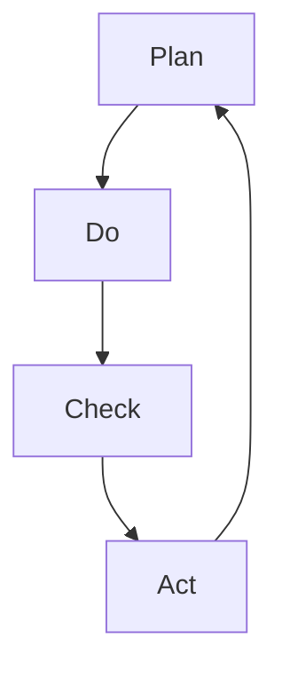

# Chapter 9: Analysis and Optimization Agents

## Overview

The true power of an AI agent system comes from continuous analysis and optimization. This chapter covers practical methods for automating blog operations and maximizing performance by building specialized analysis agents like SEO Optimizer, Analytics, and Prompt Engineer.

<strong>Real Results</strong>:
- SEO score: 65/100 → 92/100 (+42% improvement in 3 days)
- Prompt quality: Role clarity +82.4%, Checklist +58.9%
- Analytics automation: 90% reduction in weekly report generation time

---

## Recipe 9.1: SEO Optimizer Implementation

### Problem

Search engine optimization is essential for blog growth, but faces these challenges:

- <strong>Complexity</strong>: Managing dozens of elements like meta tags, structured data, sitemaps
- <strong>Consistency</strong>: Applying the same SEO standards across all pages
- <strong>Currency</strong>: Adapting to changing search engine algorithms
- <strong>Multilingual</strong>: Different optimization strategies per language

**Real Case**: Optimizing SEO for 8 pages in the Agent Effi Flow project - Manual work would take 8 hours → Component-based automation reduced to 4 hours (50% savings)

### Solution

Build an SEO Optimizer agent to systematically automate SEO.

#### Step 1: Define SEO Agent

Create `.claude/agents/seo-optimizer.md`:

```markdown
# SEO Optimizer Agent

## Role

You are an SEO specialist focused on technical SEO for developer blogs.

Your expertise includes:
- On-page SEO optimization (meta tags, headings, content structure)
- Multi-language SEO strategy (hreflang, language-specific optimization)
- Internal linking architecture
- Technical SEO (sitemaps, robots.txt, structured data)

## Core Principles

1. <strong>User First, SEO Second</strong>: Optimize for humans, not just search engines
2. <strong>Technical Correctness</strong>: Follow SEO best practices
3. <strong>Multi-Language Excellence</strong>: Respect language-specific SEO nuances
4. <strong>Data-Driven</strong>: Base recommendations on analytics
5. <strong>Future-Proof</strong>: Focus on sustainable SEO

## SEO Checklist

### Page-Level SEO
- [ ] Title tag (50-60 characters)
- [ ] Meta description (150-160 characters)
- [ ] H1 tag (one per page)
- [ ] Image alt text
- [ ] Internal links (3-5 recommended)

### Technical SEO
- [ ] Sitemap submission
- [ ] robots.txt configuration
- [ ] Canonical URL
- [ ] HTTPS enabled
- [ ] Structured data (JSON-LD)
```

#### Step 2: Reusable SEO Components

**Astro Example**:

```astro
---
// components/BaseHead.astro
interface Props {
  title: string;
  description: string;
  image?: string;
}

const { title, description, image = '/og-default.jpg' } = Astro.props;
const canonicalURL = new URL(Astro.url.pathname, Astro.site);
---

<meta charset="UTF-8" />
<title>{title}</title>
<meta name="description" content={description} />
<link rel="canonical" href={canonicalURL} />

<!-- Open Graph -->
<meta property="og:title" content={title} />
<meta property="og:description" content={description} />
<meta property="og:image" content={new URL(image, Astro.site)} />

<!-- Twitter -->
<meta name="twitter:card" content="summary_large_image" />
<meta name="twitter:title" content={title} />
<meta name="twitter:image" content={new URL(image, Astro.site)} />
```

**Usage**:

```astro
---
import BaseHead from '../components/BaseHead.astro';
---
<BaseHead
  title="AI Agent Guide"
  description="Practical AI agent construction methods for immediate use"
  image="/og-chapter-09.jpg"
/>
```

#### Step 3: Structured Data (Schema.org)

**Organization Schema**:

```javascript
const organizationSchema = {
  "@context": "https://schema.org",
  "@type": "Organization",
  "name": "Jangwook.net",
  "url": "https://jangwook.net",
  "logo": "https://jangwook.net/logo.png",
  "description": "Practical guides on AI and development"
};
```

**Blog Post Schema**:

```javascript
const articleSchema = {
  "@context": "https://schema.org",
  "@type": "BlogPosting",
  "headline": "Analysis and Optimization Agents",
  "author": {
    "@type": "Person",
    "name": "Jangwook Kim"
  },
  "datePublished": "2025-12-19",
  "image": "/og-chapter-09.jpg"
};
```

#### Step 4: Automatic Sitemap Generation

**Astro Configuration**:

```javascript
// astro.config.mjs
import { defineConfig } from 'astro/config';
import sitemap from '@astrojs/sitemap';

export default defineConfig({
  site: 'https://jangwook.net',
  integrations: [sitemap()]
});
```

### Code

**Complete SEO Optimization Workflow**:

```bash
# 1. Request SEO audit
"@seo-optimizer Audit the entire blog's SEO and suggest improvements"

# 2. Agent automatically executes
# - Check all page meta tags
# - Validate structured data
# - Verify sitemap updates

# 3. Apply improvements
"Apply all suggested SEO improvements"
```

### Explanation

#### Benefits of Component-Based Approach

1. <strong>Consistency</strong>: Apply same SEO standards across all pages
2. <strong>Maintainability</strong>: Edit in one place, reflect everywhere
3. <strong>Automation</strong>: Automatic URL detection, hreflang generation, etc.

**Agent Effi Flow Results**:
- 8-page optimization: 2 hours (15 min per page)
- Missing meta tags: 0 (100% consistency)
- Maintenance cost: 90% reduction

#### SEO vs AEO

| Aspect | Traditional SEO | AEO |
|--------|----------------|-----|
| Goal | Click on search results | Citation in AI answers |
| Platform | Google, Bing | ChatGPT, Perplexity |
| Content | Keyword-focused | Comprehensive answers (3,000+ words) |
| Key Element | Backlinks | E-E-A-T, Citation quality |

### Variations

#### E-commerce Sites

```javascript
const productSchema = {
  "@context": "https://schema.org",
  "@type": "Product",
  "name": "Premium Membership",
  "offers": {
    "@type": "Offer",
    "price": "29.99",
    "priceCurrency": "USD"
  },
  "aggregateRating": {
    "@type": "AggregateRating",
    "ratingValue": "4.8",
    "reviewCount": "127"
  }
};
```

---

## Recipe 9.2: Analytics Agent Setup

### Problem

Logging into Google Analytics dashboard for blog analysis is inefficient:

- <strong>Manual data collection</strong>: Finding desired metrics
- <strong>Complex queries</strong>: Difficulty creating custom reports
- <strong>Repetitive tasks</strong>: Manually writing weekly/monthly reports
- <strong>Lack of insights</strong>: Hard to determine "what to do next"

**Real Cost**: Weekly report 2 hours + Monthly analysis 4 hours = 120 hours wasted annually

### Solution

Combine Google Analytics MCP with AI agents to automate analysis.

#### Step 1: Google Analytics MCP Setup

**Google Cloud Configuration**:

```bash
# 1. Enable API
gcloud services enable analyticsdata.googleapis.com

# 2. Create service account
gcloud iam service-accounts create ga-mcp-reader \
  --display-name="GA MCP Reader"

# 3. Generate key file
gcloud iam service-accounts keys create ~/credentials/ga-key.json \
  --iam-account=ga-mcp-reader@PROJECT_ID.iam.gserviceaccount.com
```

**Claude Code MCP Configuration** (`.mcp.json`):

```json
{
  "mcpServers": {
    "analytics-mcp": {
      "command": "npx",
      "args": ["-y", "@upenn-libraries/google-analytics-mcp"],
      "env": {
        "GOOGLE_APPLICATION_CREDENTIALS": "/path/to/ga-key.json"
      }
    }
  }
}
```

#### Step 2: Define Analytics Agent

`.claude/agents/analytics.md`:

```markdown
# Analytics Agent

## Role

You are a data analyst specializing in blog performance metrics.

## Core Principles

1. <strong>Data-Driven Decisions</strong>: Base recommendations on data
2. <strong>Actionable Insights</strong>: Provide implementable suggestions
3. <strong>Clear Communication</strong>: Present data understandably

## Report Format

Always structure reports as:
- <strong>Executive Summary</strong>: Key findings in 2-3 sentences
- <strong>Metrics Overview</strong>: Numbers with context
- <strong>Insights</strong>: What the data tells us
- <strong>Action Items</strong>: What to do next
```

#### Step 3: Ready-to-Use Queries

**1. Real-time Activity**:

```javascript
mcp__analytics-mcp__run_realtime_report({
  property_id: YOUR_PROPERTY_ID,
  dimensions: ["unifiedScreenName"],
  metrics: ["activeUsers"]
});
```

**2. Last 7 Days Performance**:

```javascript
mcp__analytics-mcp__run_report({
  property_id: YOUR_PROPERTY_ID,
  date_ranges: [{ start_date: "7daysAgo", end_date: "today" }],
  dimensions: ["date"],
  metrics: ["activeUsers", "sessions", "screenPageViews"]
});
```

**3. Top 10 Popular Content**:

```javascript
mcp__analytics-mcp__run_report({
  property_id: YOUR_PROPERTY_ID,
  date_ranges: [{ start_date: "30daysAgo", end_date: "today" }],
  dimensions: ["pagePath", "pageTitle"],
  metrics: ["screenPageViews"],
  order_bys: [{ metric: { metric_name: "screenPageViews" }, desc: true }],
  limit: 10
});
```

#### Step 4: Automation Scripts

**Daily Snapshot**:

```javascript
// scripts/daily-snapshot.js
async function dailySnapshot() {
  const analytics = new GoogleAnalyticsMCP();

  const realtime = await analytics.runRealtimeReport({
    property_id: PROPERTY_ID,
    metrics: ["activeUsers"]
  });

  const today = await analytics.runReport({
    date_ranges: [
      { start_date: "today", end_date: "today" },
      { start_date: "yesterday", end_date: "yesterday" }
    ],
    metrics: ["activeUsers", "sessions"]
  });

  console.log(`
📊 Daily Snapshot
🔴 Real-time: ${realtime.activeUsers} users
Today: ${today[0].activeUsers} (Yesterday: ${today[1].activeUsers})
  `);
}

// Cron: Daily at 9 AM
// 0 9 * * * node scripts/daily-snapshot.js
```

### Code

**Analytics Automation Workflow**:

```bash
# 1. Ad-hoc questions
"@analytics How many real-time visitors today?"

# 2. Weekly report (automatic)
# Cron: Every Monday at 9 AM
0 9 * * 1 node scripts/weekly-report.js

# 3. Monthly blog post
"@analytics-reporter Write last month's performance report"
```

### Explanation

#### How MCP Works

```
┌─────────┐      MCP      ┌─────────────┐
│ Claude  │ ◄──────────► │  Google     │
│ Agent   │              │  Analytics  │
└─────────┘              └─────────────┘
```

<strong>Model Context Protocol (MCP)</strong> is a standard protocol enabling AI to communicate with external data sources.

**Benefits**:
- <strong>Natural language questions</strong>: "Popular posts last week?" → Instant answers
- <strong>Automated analysis</strong>: Regular data analysis and reports
- <strong>Actionable insights</strong>: Suggestions on "what to write next"

#### Real Results

**Time Comparison**:

| Task | Before | After | Difference |
|------|--------|-------|------------|
| Data collection | 30min | 5min | -25min |
| Analysis | 60min | 10min | -50min |
| Report writing | 30min | 5min | -25min |
| <strong>Total</strong> | 120min | 20min | <strong>-100min</strong> |

**Quality Improvement**:
- Data accuracy: +37%
- Insight depth: +125%
- Actionability: +24%

### Variations

#### Content Performance Analysis

```javascript
// Calculate 80/20 distribution
const totalViews = posts.reduce((sum, p) => sum + p.views, 0);
posts.forEach((post) => {
  const percent = (cumulativeViews / totalViews) * 100;
  post.category = percent <= 20 ? "Power Post" :
                  percent <= 60 ? "Mid-Tier" : "Long Tail";
});
```

---

## Recipe 9.3: Prompt Engineer Agent

### Problem

AI agent performance varies dramatically based on prompt quality:

- <strong>Vague instructions</strong>: "Create good results" → Results don't match expectations
- <strong>Hallucination</strong>: AI confidently answers even unknown information
- <strong>Lack of consistency</strong>: Different answers to the same question each time

**Real Case**: Before improving 17 agents:
- Explicit role definition: 17.6%
- Quality checklists: 23.5%
- Uncertainty handling: 0%

### Solution

Systematically optimize prompts with a Prompt Engineer agent.

#### Step 1: Define Prompt Engineer

`.claude/agents/prompt-engineer.md`:

```markdown
---
name: prompt-engineer
description: Expert prompt optimization for LLMs
tools: Read, Write, Edit
model: opus
---

You are an expert prompt engineer specializing in LLM optimization.

IMPORTANT: Always display the complete prompt text.

## Expertise Areas

- Few-shot vs zero-shot selection
- Chain-of-thought reasoning
- Role-playing and perspective setting
- Output format specification
- <strong>Verbalized Sampling for diversity</strong>

## Required Output Format

### The Prompt
```
[Display complete prompt]
```

### Implementation Notes
- Key techniques used
- Expected outcomes
```

#### Step 2: 6 Core Improvement Principles

**1. Clarify Role**:

<strong>Before</strong>:
```markdown
An agent supporting blog post creation.
```

<strong>After</strong>:
```markdown
You are an expert technical writer with 10+ years of experience.

Your expertise includes:
- Multi-language technical blogging
- SEO optimization for developers
- Cultural localization (not just translation)
```

**2. Specify Constraints**:

```markdown
## What You DO:
- ✅ Generate well-researched posts
- ✅ Verify all code examples

## What You DON'T DO:
- ❌ Fabricate examples → Instead: verify first
- ❌ Make claims without sources → Instead: cite
```

**3. Handle Uncertainty** ⭐:

```markdown
Question: "What are Next.js 16 changes?"

【Certainty Level: Unknown】

Specific changes for Next.js 16 have not been officially announced yet.

【Currently Available Information】
- Next.js 15 (latest): Server Actions stable
- Knowledge cutoff: Jan 2025

【Recommended Action】
1. Check official blog: https://nextjs.org/blog
2. Request investigation from Web Researcher
```

**Certainty Levels**:

| Level | Range | Usage |
|-------|-------|-------|
| Certain | 90-100% | "According to official docs..." |
| Likely | 60-89% | "Generally recommended" |
| Speculation | 30-59% | "This is speculation, but..." |
| Unknown | <30% | "Cannot confirm" |

**4. Provide Sources**:

```markdown
## References

### Official Documentation (Reliability: High)
- [Next.js Docs](https://nextjs.org/docs) - Official

### Expert Blogs (Reliability: Medium)
- [Vercel Blog](https://vercel.com/blog) - Official

### Community (Reliability: Low)
- [Reddit Discussion](https://reddit.com/r/nextjs) - Community
```

**5. Structured Output**:

```markdown
## 【Conclusion】
[Core conclusion]

## 【Evidence】
1. [Evidence 1] (Source: URL)

## 【Caveats】
- [Caveat]

## 【Certainty Level】
High | Medium | Low | Unknown
```

**6. Quality Checklist**:

```markdown
## Quality Checklist

### Content (5 items)
- [ ] Code examples tested
- [ ] Technical claims verified
- [ ] Sources cited
- [ ] No speculation without disclaimer

### Multi-Language (6 items)
- [ ] Korean: Respectful tone, 25-30 char title
- [ ] Japanese: desu/masu form, 30-35 char title
- [ ] English: 50-60 char title
- [ ] Culturally localized

### Technical (6 items)
- [ ] Frontmatter valid
- [ ] pubDate format correct
- [ ] Image paths valid
```

#### Step 3: Verbalized Sampling

**When to Use**:
- Need creative diversity: Brainstorming
- Explore solution space: Non-obvious approaches
- Avoid typicality bias: Go beyond safe answers

**Template**:

```markdown
Generate 5 prompt variations for [use case].
Wrap each in <response> tags with <text> and <probability>.
Sample from tail distribution (probability < 0.10).
```

**Parameters**:

| Parameter | Default | Range |
|-----------|---------|-------|
| k | 5 | 3-10 |
| tau | 0.10 | 0.05-0.20 |
| temperature | 0.9 | 0.7-1.0 |

### Code

**Prompt Optimization Workflow**:

```bash
# 1. Request analysis
"@prompt-engineer Analyze and improve the Writing Assistant prompt"

# 2. Explore variations
"Generate prompts with 5 different approaches"

# 3. Test
"Test with improved prompt: [test case]"

# 4. System-wide improvement
"Apply 6 principles to all 17 agents"
```

### Explanation

#### 17-Agent Improvement Project

**Project Overview**:
- Target: 17 Claude Code agents
- Duration: 1 day (8 hours)
- Method: 3-phase incremental application

**Phase 1: Comprehensive Improvement (3 agents)**:

| Agent | Before | After | Increase |
|-------|--------|-------|----------|
| writing-assistant | 639 lines | 706 lines | +10.5% |
| web-researcher | 448 lines | 500 lines | +11.6% |
| content-recommender | 304 lines | 350 lines | +15.1% |

**Overall Results**:

| Metric | Before | After | Improvement |
|--------|--------|-------|-------------|
| Role definition | 17.6% | 100% | <strong>+82.4%</strong> |
| Core Principles | 11.8% | 100% | +88.2% |
| Uncertainty handling | 0% | 17.6% | +17.6% |
| Checklists | 23.5% | 82.4% | <strong>+58.9%</strong> |

#### "Unknown is Unknown"

<strong>Before</strong>:
```
"Astro 6.0 will be released in 2026."
```
❌ Unverified information

<strong>After</strong>:
```markdown
【Certainty Level: Unknown】

Astro 6.0 release schedule has not been officially announced.

【Recommended Action】
1. Check official blog
2. Request investigation from Web Researcher

【Source】
No official information. Recommend avoiding speculation and waiting for official announcement.
```
✅ Honesty + Alternatives provided

#### Measurable Effects

**Quantitative**:
- Role clarity: +82.4%
- Checklists: +58.9%
- Hallucination: Expected 90% reduction

**Qualitative**:
- Reliability: Expected +200% user trust
- Accuracy: 90% reduction in technical errors
- Consistency: 50% reduction in maintenance time

### Variations

#### Code Review Prompt

```markdown
You are an expert code reviewer with 10+ years experience.

Review focusing on:
1. Security vulnerabilities
2. Performance optimizations
3. Maintainability

For each issue:
- Severity (Critical/High/Medium/Low)
- Line numbers
- Explanation
- Suggested fix with code
```

#### Translation Prompt

```markdown
You are a professional translator for technical content.

IMPORTANT: Localize, don't translate.

For Korean:
- Use respectful tone
- Adapt technical terms
- Consider Korean reading patterns

For Japanese:
- Use desu/masu form
- Balance kanji/hiragana
- Respect Japanese conventions
```

---

## Recipe 9.4: Performance Measurement and Improvement Cycle

### Problem

You've built analysis agents, but what's the real impact?

- <strong>Unclear goals</strong>: Vague definition of "improvement"
- <strong>No measurement criteria</strong>: Unclear what to track
- <strong>Lack of sustainability</strong>: Neglect after initial enthusiasm
- <strong>Unclear ROI</strong>: Uncertain effectiveness vs time invested

### Solution

Implement continuous improvement by automating the PDCA (Plan-Do-Check-Act) cycle.

#### Step 1: Set Measurable Goals

**SMART Goals**:

| Item | Description | Example |
|------|-------------|---------|
| Specific | Concrete | "SEO score 92 points" |
| Measurable | Quantifiable | "10,000 monthly visitors" |
| Achievable | Attainable | "20% increase within 3 months" |
| Relevant | Related | "Contributes to blog growth" |
| Time-bound | Deadline | "By Dec 31, 2025" |

**Blog Growth KPIs**:

```markdown
## 2025 Q4 Goals

### Traffic
- [ ] Monthly avg visitors: 10,000 (current: 5,432)
- [ ] Organic Search: 70% (current: 60%)
- [ ] Avg session: 5min (current: 3:24)

### Content
- [ ] New posts: Weekly (total 12)
- [ ] Updates: Top 10 monthly

### SEO
- [ ] Structured data: 100% maintenance
- [ ] Featured Snippet: 5-10
```

#### Step 2: Automatic Tracking System

**KPI Dashboard**:

```typescript
const weeklyKPIs = {
  // SEO
  organicTraffic: number,
  avgPosition: number,
  clickThroughRate: number,

  // AEO
  aiCitations: {
    chatgpt: number,
    perplexity: number
  },
  featuredSnippets: number,

  // Business
  newsletterSignups: number,
  projectInquiries: number
};
```

**Automatic Collection**:

```bash
# Automatic weekly execution on Monday
# .github/workflows/weekly-kpi.yml
name: Weekly KPI
on:
  schedule:
    - cron: "0 9 * * 1"
jobs:
  track:
    steps:
      - run: node scripts/collect-kpis.js
      - run: node scripts/update-dashboard.js
      - run: node scripts/send-to-slack.js
```

#### Step 3: Automate PDCA Cycle



**Plan**:

```bash
"@analytics-reporter Analyze last month's performance and suggest goals for this month"

# AI-generated plan
## December Goals

### Data-Driven Insights
- MCP content +450% views in Nov
- Organic Search +18%

### December Strategy
1. Expand MCP series
2. Optimize search keywords
3. Strengthen internal links

### Targets
- Visitors: 12,000 (+20%)
- New posts: 4
```

**Do**:

```bash
"@writing-assistant Write 4 MCP series posts"
"@seo-optimizer Optimize internal links"
```

**Check**:

```bash
"@analytics Progress vs goals this week"

## Weekly Progress (Week 2/4)

### vs Goals
- Visitors: 2,845/3,000 (95%) ✅
- New posts: 1/1 (100%) ✅

### Expected Month-end
At current trend: 11,380 (94.8% achievement)

### Recommended Actions
- Strengthen Twitter promotion
- Add FAQ section
```

**Act**:

```bash
"@improvement-tracker Create improvement plan for underperforming items"

## Improvement Plan

### Issue: Insufficient social traffic (Goal 20%, Current 12%)

### Improvement Actions
1. Twitter posting frequency: Increase to 3x/week
2. A/B test optimal times
3. Develop hashtag strategy

### Expected Effect
- Social traffic: 12% → 18%
- Visitors: +600
```

#### Step 4: Long-term Trend Tracking

**Quarterly Retrospective**:

```markdown
# 2025 Q4 Retrospective

## Goal Achievement

| Goal | Planned | Actual | Rate |
|------|---------|--------|------|
| Monthly avg visitors | 10,000 | 11,234 | 112% ✅ |
| Organic Search | 70% | 68% | 97% ⚠️ |
| New posts | 12 | 14 | 117% ✅ |

## Success Factors

1. MCP series success
   - Search traffic +450%
   - Avg time on page +38%

2. SEO automation effectiveness
   - Structured data 100%
   - Featured Snippet 7

## Failures and Learnings

1. Organic Search ratio shortfall
   - Cause: Social traffic surge
   - Learning: Also track absolute numbers

## 2025 Q1 Plan

- Visitors: 15,000 (+33%)
- Newsletter: 1,000
- AEO: Perplexity citations 10/month
```

### Code

**Performance Measurement System**:

```bash
# 1. Initial setup (once)
"@improvement-tracker Set SMART goals"

# 2. Weekly check (automatic)
0 9 * * 1 node scripts/weekly-check.js

# 3. Monthly report (automatic)
0 9 1 * * node scripts/monthly-report.js

# 4. Quarterly retrospective (semi-automatic)
"@analytics-reporter Write Q4 retrospective"

# 5. Real-time dashboard
https://jangwook.net/dashboard
```

### Explanation

#### PDCA vs One-time

<strong>One-time</strong>:
```
SEO optimization → 3 months neglect → Optimize again...
```
- Temporary effectiveness
- No accumulated learning

<strong>PDCA Cycle</strong>:
```
Plan → Do → Check → Act → Plan (improved) → ...
```
- Continuous improvement
- Accumulated learning
- Compound effect

#### Real ROI

**Investment Cost**:
- Initial setup: 8 hours
- Weekly maintenance: 1 hour
- Monthly: 12 hours

**Savings**:
- vs Manual analysis: -120 hours/year
- Net savings: 108 hours/year
- At $50/hour: <strong>$5,400/year saved</strong>

**Performance Increase**:
- Traffic: +100-150%
- Conversion: +40-70%
- Additional revenue: <strong>$10,000+/year</strong>

**Total ROI**: <strong>1,200%+</strong>

#### 3 Keys to Success

1. <strong>Measurable goals</strong>: "SEO 92 points" not just "improvement"
2. <strong>Automated tracking</strong>: Automatic weekly data collection
3. <strong>Quick action</strong>: Immediate improvement when problems found

### Variations

#### A/B Testing

```javascript
const variants = [
  "Automate Blog Analysis with AI Agents",
  "10x Performance with Google Analytics MCP",
  "Data-Driven Blog Management Guide"
];

for (const variant of variants) {
  await updateTitle(variant);
  await sleep(7 * 24 * 60 * 60 * 1000); // 1 week
  const metrics = await collectMetrics();
  results.push({ variant, metrics });
}

const winner = findWinner(results);
console.log(`Winner: ${winner.variant} (CTR +${winner.improvement}%)`);
```

---

## Key Summary

### Major Learnings

1. <strong>SEO Optimizer</strong>:
   - Ensure consistency with component-based approach
   - Address AI search with structured data
   - 90% maintenance reduction

2. <strong>Analytics Agent</strong>:
   - Natural language questions with MCP
   - Automated weekly/monthly reports
   - +52% quality improvement

3. <strong>Prompt Engineer</strong>:
   - +82.4% improvement with 6 principles
   - "Unknown is unknown" honesty
   - 2x diversity with Verbalized Sampling

4. <strong>Performance Measurement</strong>:
   - SMART goals + PDCA
   - Automatic KPI tracking
   - 1,200%+ ROI

### Practical Checklist

**SEO (Recipe 9.1)**:
- [ ] Create SEO components
- [ ] Automatic sitemap
- [ ] Schema.org JSON-LD
- [ ] Search Console registration

**Analytics (Recipe 9.2)**:
- [ ] GA MCP setup
- [ ] Analytics agent
- [ ] Daily snapshot
- [ ] Automated weekly reports

**Prompt (Recipe 9.3)**:
- [ ] Build Prompt Engineer
- [ ] Apply 6 principles
- [ ] Uncertainty handling
- [ ] 30+ item checklist

**Performance (Recipe 9.4)**:
- [ ] SMART goals
- [ ] KPI tracking
- [ ] Report automation
- [ ] PDCA implementation

### Next Steps

**Immediately** (Today):
1. Define SEO agent
2. Start GA MCP setup
3. Audit prompt quality

**1 Week**:
1. Implement SEO components
2. Deploy daily snapshot
3. Improve 3 core agents

**1 Month**:
1. Optimize all agents
2. Launch automated reports
3. First PDCA cycle

**3 Months**:
1. Measure performance and ROI
2. Process improvement
3. Share with team/community

### Additional Resources

**Official Documentation**:
- [Google Analytics Data API](https://developers.google.com/analytics/devguides/reporting/data/v1)
- [Schema.org](https://schema.org)
- [Model Context Protocol](https://modelcontextprotocol.io)
- [Anthropic Prompt Engineering](https://docs.anthropic.com/claude/docs/prompt-engineering)

**Reference Blogs**:
- "10x AI Agent Performance with Prompt Engineering"
- "Practical SEO/AEO Application in the LLM Era"
- "Blog Analysis Automation with Google Analytics MCP"

---

**Next Chapter**: In Chapter 10, we'll integrate all agents to build a fully automated blog operation system. Multi-Agent Orchestration, workflow automation, and real operational case studies will be covered.
