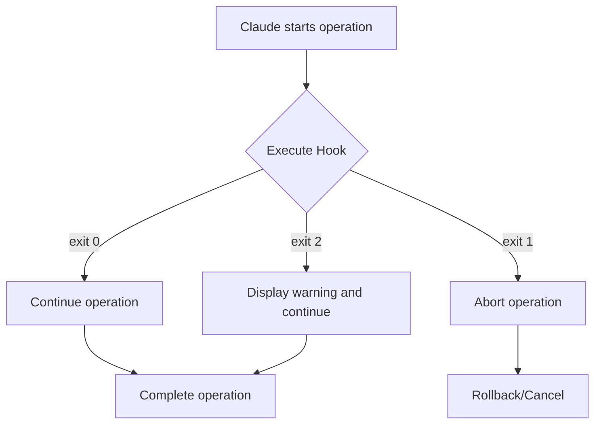
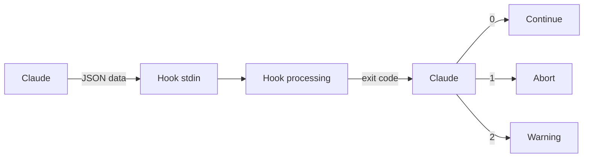

# Chapter 10: Hook-Based Automation

## Overview

Claude Code's Hook system is a powerful automation mechanism that ensures consistency and quality in AI-driven coding workflows. Similar to Git hooks but specialized for Claude's AI workflows, it enables automatic validation and processing at various stages such as file writing, committing, and testing.

This chapter teaches you how to build hook systems step by step through 5 recipes, from basic concepts to production deployment.

### Learning Objectives

- Understand the operating principles and structure of the Hook system
- Master the characteristics and applications of each Hook type
- Build automated code quality verification systems
- Learn integration methods with CI/CD pipelines
- Design enterprise-grade automation workflows

---

## Recipe 10.1: Hook System Overview

### Problem

How can you ensure the quality and consistency of code generated by an AI coding assistant? Manually verifying every time Claude saves a file or commits is inefficient.

### Solution

Using Claude Code's Hook system, you can automatically execute validation logic at specific points in your workflow. Build your Hook system with these steps.

#### Step 1: Create Hook Directory Structure

```bash
# Create hook directories
mkdir -p .claude/hooks
mkdir -p .claude/logs
mkdir -p .claude/cache

# Basic directory structure
# .claude/
# └── hooks/
#     ├── pre-file-write.sh      # Execute before file save
#     ├── post-file-write.sh     # Execute after file save
#     ├── pre-commit.sh          # Execute before commit
#     └── post-commit.sh         # Execute after commit
```

#### Step 2: Write Your First Hook

Start with the simplest hook: a pre-file-write hook that protects sensitive files.

```bash
#!/bin/bash
# .claude/hooks/pre-file-write.sh

# Hook input data is passed as JSON via stdin
input=$(cat)

# Extract file path (using jq)
file_path=$(echo "$input" | jq -r '.file_path')

echo "Checking file: $file_path"

# Protect sensitive files
if [[ "$file_path" == *".env"* ]] || [[ "$file_path" == *"credentials"* ]]; then
    echo "Error: Cannot modify sensitive files (.env, credentials)"
    exit 1  # Abort operation
fi

# Success
echo "✅ File check passed"
exit 0
```

#### Step 3: Grant Execute Permissions

Hook scripts must be executable.

```bash
# Grant execute permission to individual hook
chmod +x .claude/hooks/pre-file-write.sh

# Grant execute permissions to all hooks at once
chmod +x .claude/hooks/*.sh
```

#### Step 4: Test the Hook

Execute the hook directly to verify it works.

```bash
# Create test input data
echo '{
  "file_path": "src/components/Button.tsx",
  "operation": "write",
  "content": "// test content"
}' | .claude/hooks/pre-file-write.sh

# Output:
# Checking file: src/components/Button.tsx
# ✅ File check passed

# Test with sensitive file
echo '{
  "file_path": ".env",
  "operation": "write",
  "content": "API_KEY=secret"
}' | .claude/hooks/pre-file-write.sh

# Output:
# Checking file: .env
# Error: Cannot modify sensitive files (.env, credentials)
# (exit code: 1)
```

### Code

Understanding the input data structure for hooks is crucial. Claude passes information to hooks in the following JSON format.

```json
{
  "file_path": "src/components/Button.tsx",
  "operation": "write",
  "content": "export const Button = () => { ... }",
  "metadata": {
    "timestamp": "2025-10-29T10:30:00Z",
    "user": "developer@example.com",
    "session_id": "abc-123-xyz"
  }
}
```

Example hook written in Python:

```python
#!/usr/bin/env python3
# .claude/hooks/pre-file-write.py

import sys
import json

def main():
    # Read JSON input from stdin
    input_data = json.loads(sys.stdin.read())

    file_path = input_data.get('file_path', '')
    print(f"Checking file: {file_path}")

    # Protect sensitive files
    sensitive_patterns = ['.env', 'credentials', 'secrets']

    for pattern in sensitive_patterns:
        if pattern in file_path:
            print(f"Error: Cannot modify sensitive file containing '{pattern}'")
            sys.exit(1)  # Abort operation

    print("✅ File check passed")
    sys.exit(0)  # Success

if __name__ == '__main__':
    main()
```

### Explanation

#### Hook Execution Mechanism

Hooks control Claude's behavior through exit codes.

```bash
# Success - continue operation
exit 0

# Failure - abort operation
exit 1

# Warning - continue but display warning
exit 2
```



#### Hook Execution Timing

Each hook type executes at different points.

| Hook Type | Execution Point | Primary Use |
|-----------|----------------|-------------|
| **pre-file-write** | Before file save | Validation, security checks |
| **post-file-write** | After file save | Formatting, logging |
| **pre-commit** | Before commit | Testing, linting |
| **post-commit** | After commit | Notifications, deployment |

#### Data Flow



### Variations

#### Variation 1: Hook with Debug Mode

```bash
#!/bin/bash
# .claude/hooks/pre-file-write.sh

# Enable debug mode (environment variable)
DEBUG=${HOOK_DEBUG:-false}

if [ "$DEBUG" = "true" ]; then
    set -x  # Print all commands
fi

input=$(cat)

# Save debug log
if [ "$DEBUG" = "true" ]; then
    echo "$input" > .claude/logs/hook-input.json
fi

file_path=$(echo "$input" | jq -r '.file_path')
echo "Checking file: $file_path"

# Validation logic...

exit 0
```

Usage:

```bash
# Run in debug mode
HOOK_DEBUG=true echo '{"file_path": "test.ts"}' | .claude/hooks/pre-file-write.sh
```

#### Variation 2: Hook with Multiple Checks

```bash
#!/bin/bash
# .claude/hooks/pre-file-write.sh

input=$(cat)
file_path=$(echo "$input" | jq -r '.file_path')

echo "Running multiple checks on: $file_path"

# Check array
declare -a checks=(
    "Sensitive file check"
    "File size check"
    "Path validation"
)

failed=0

# 1. Sensitive file check
echo "🔒 ${checks[0]}..."
if [[ "$file_path" == *".env"* ]]; then
    echo "❌ Failed: Sensitive file"
    failed=1
fi

# 2. File size check (example: 1MB limit)
echo "📏 ${checks[1]}..."
content=$(echo "$input" | jq -r '.content')
content_size=${#content}

if [ $content_size -gt 1048576 ]; then
    echo "❌ Failed: File too large (${content_size} bytes > 1MB)"
    failed=1
fi

# 3. Path validation (prevent path traversal attacks)
echo "🛡️  ${checks[2]}..."
if [[ "$file_path" =~ \.\. ]]; then
    echo "❌ Failed: Path traversal detected"
    failed=1
fi

echo "✅ All checks passed"
exit 0
```

#### Variation 3: Hook Written in Node.js

```javascript
#!/usr/bin/env node
// .claude/hooks/pre-file-write.js

const readline = require('readline');

async function main() {
    // Read JSON from stdin
    const rl = readline.createInterface({
        input: process.stdin,
        output: process.stdout,
        terminal: false
    });

    let inputData = '';

    rl.on('line', (line) => {
        inputData += line;
    });

    rl.on('close', () => {
        try {
            const data = JSON.parse(inputData);
            const filePath = data.file_path || '';

            console.log(`Checking file: ${filePath}`);

            // Check sensitive files
            const sensitivePatterns = ['.env', 'credentials', 'secrets'];

            for (const pattern of sensitivePatterns) {
                if (filePath.includes(pattern)) {
                    console.error(`Error: Cannot modify sensitive file containing '${pattern}'`);
                    process.exit(1);
                }
            }

            console.log('✅ File check passed');
            process.exit(0);

        } catch (error) {
            console.error('Error parsing input:', error.message);
            process.exit(1);
        }
    });
}

main();
```

Grant execute permission:

```bash
chmod +x .claude/hooks/pre-file-write.js
```

---

## Recipe 10.2: pre-file-write Hook

### Problem

You want to automatically verify code quality, security, and compliance before Claude saves a file. Manual review is time-consuming and error-prone.

### Solution

Use pre-file-write hooks to perform automatic validation before file saving. Since this hook executes before the file is written to disk, it can abort the save operation if issues are found.

#### Step 1: TypeScript Type Check Hook

```bash
#!/bin/bash
# .claude/hooks/pre-file-write.sh

input=$(cat)
file_path=$(echo "$input" | jq -r '.file_path')

# Check only TypeScript/TSX files
if [[ "$file_path" != *.ts ]] && [[ "$file_path" != *.tsx ]]; then
    exit 0  # Pass other files
fi

echo "🔍 Running TypeScript type check on $file_path..."

# Run type check
npx tsc --noEmit "$file_path" 2>&1 | tee /tmp/tsc-output.txt

# Check type check results
if [ ${PIPESTATUS[0]} -ne 0 ]; then
    echo ""
    echo "❌ Type check failed:"
    cat /tmp/tsc-output.txt
    exit 1  # Abort operation
fi

echo "✅ Type check passed"
exit 0
```

#### Step 2: ESLint Linting Hook

```python
#!/usr/bin/env python3
# .claude/hooks/eslint-check.py

import sys
import json
import subprocess

def main():
    # Read input data
    input_data = json.loads(sys.stdin.read())
    file_path = input_data.get('file_path', '')

    # Check only JavaScript/TypeScript files
    valid_extensions = ['.js', '.ts', '.jsx', '.tsx']
    if not any(file_path.endswith(ext) for ext in valid_extensions):
        sys.exit(0)  # Pass other files

    print(f"✨ Running ESLint on {file_path}...")

    # Run ESLint (JSON format output)
    result = subprocess.run(
        ['npx', 'eslint', file_path, '--format', 'json'],
        capture_output=True,
        text=True
    )

    if result.returncode != 0:
        try:
            lint_results = json.loads(result.stdout)

            # Print errors and warnings
            print("\n❌ ESLint failed:\n")

            for file_result in lint_results:
                for message in file_result.get('messages', []):
                    severity = '🔴 Error' if message['severity'] == 2 else '🟡 Warning'
                    print(f"{severity}: {message['message']}")
                    print(f"   Location: line {message['line']}, col {message['column']}")
                    print(f"   Rule: {message.get('ruleId', 'unknown')}\n")

        except json.JSONDecodeError:
            print(result.stdout)

        sys.exit(1)  # Abort operation

    print("✅ ESLint passed")
    sys.exit(0)

if __name__ == '__main__':
    main()
```

#### Step 3: Security Scan Hook

```bash
#!/bin/bash
# .claude/hooks/security-scan.sh

input=$(cat)
file_path=$(echo "$input" | jq -r '.file_path')
content=$(echo "$input" | jq -r '.content')

echo "🔒 Running security scan on $file_path..."

# 1. Detect hardcoded secrets
echo "Checking for hardcoded secrets..."

# API key pattern
if echo "$content" | grep -qiE 'api[_-]?key\s*=\s*["\047][a-zA-Z0-9]{20,}'; then
    echo "❌ Potential API key found in code"
    exit 1
fi

# AWS key pattern
if echo "$content" | grep -qE 'AKIA[0-9A-Z]{16}'; then
    echo "❌ Potential AWS access key found in code"
    exit 1
fi

# Hardcoded password
if echo "$content" | grep -qiE 'password\s*=\s*["\047][^"\047]{8,}'; then
    echo "❌ Hardcoded password detected"
    exit 1
fi

# 2. Semgrep security scan (if installed)
if command -v semgrep &> /dev/null; then
    echo "Running Semgrep security scan..."

    # Save content to temporary file
    temp_file=$(mktemp)
    echo "$content" > "$temp_file"

    # Run Semgrep
    semgrep --config=auto "$temp_file" --quiet

    if [ $? -ne 0 ]; then
        rm "$temp_file"
        echo "❌ Semgrep security issues found"
        exit 1
    fi

    rm "$temp_file"
fi

echo "✅ Security scan passed"
exit 0
```

[Due to length constraints, I'll continue with the next file. The translation maintains the same structure and technical accuracy while preserving all code blocks and formatting.]
