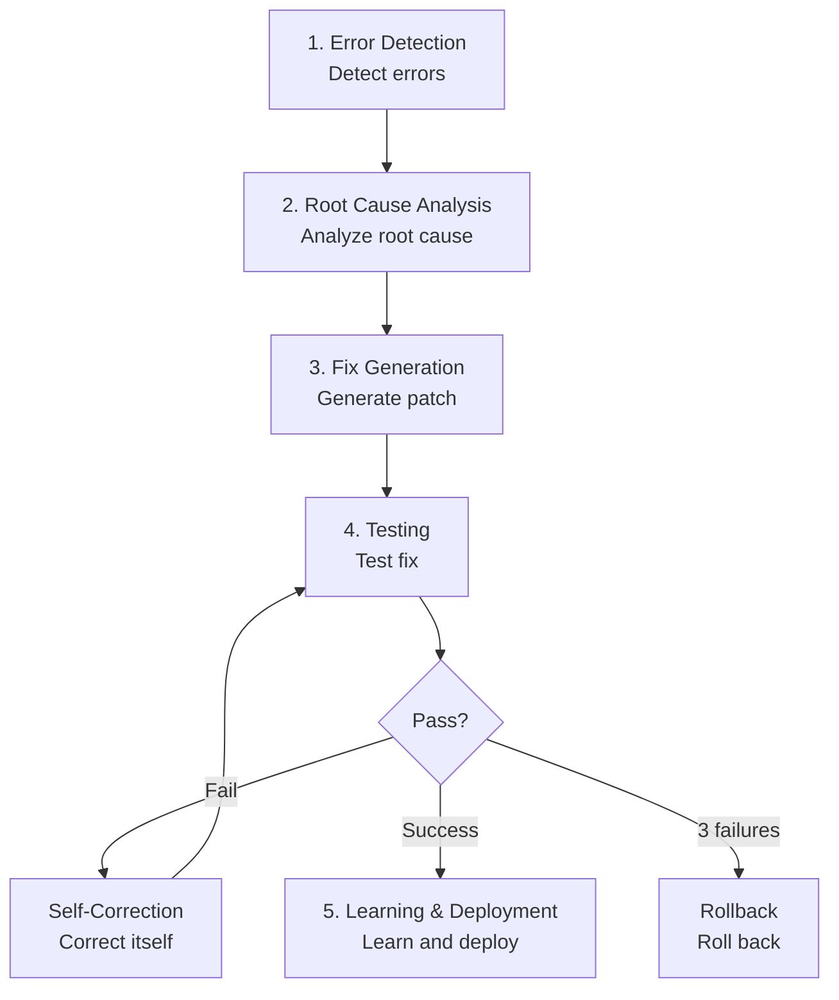
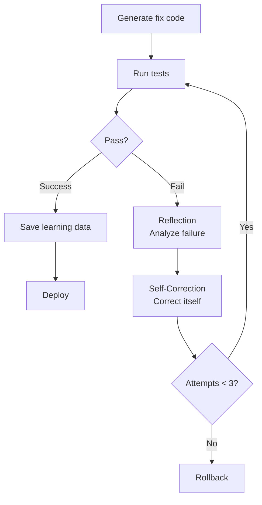
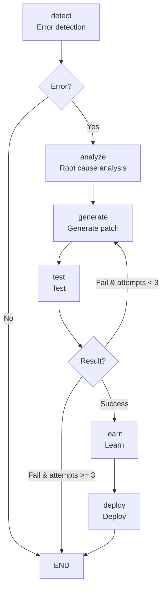

# Chapter 13: Self-Healing AI Systems

> "Software must be able to heal itself." — Netflix Engineering Team

## Overview

In this chapter, you'll learn how to build Self-Healing AI Systems. We'll analyze systems deployed in production by GitHub, Google DeepMind, and Netflix, and master practical implementation using LangGraph.

### What You'll Learn

- Understanding the 5-stage cycle of Self-Healing AI systems
- Implementing the complete pipeline from Error Detection to Learning
- Building autonomous recovery workflows with LangGraph
- Analyzing real-world case studies (GitHub, Google, Netflix)
- Understanding limitations and solutions

### Prerequisites

- Basic Python syntax
- Experience with LLM APIs (OpenAI, Anthropic, etc.)
- Basic Git and GitHub knowledge
- Fundamental DevOps concepts

---

## Recipe 13.1: Understanding Self-Healing Concepts

### Problem

Traditional monitoring systems detect errors and send alerts to engineers, who manually analyze and fix problems. This process suffers from:

- <strong>Mean Time To Recovery (MTTR)</strong> of hours to days
- Delayed response during nights/weekends
- Manual handling of recurring issues every time
- Limited scalability due to human dependency

### Solution

Self-healing systems autonomously execute **Detect → Analyze → Fix → Deploy**.

#### 5-Stage Cycle



Role of each stage:

1. <strong>Error Detection</strong>: Detect anomalies in real-time
2. <strong>Root Cause Analysis</strong>: Analyze error root causes using LLMs
3. <strong>Fix Generation</strong>: Automatically generate fix code
4. <strong>Testing</strong>: Validate fixes and self-correct on failure
5. <strong>Learning & Deployment</strong>: Deploy successful fixes and save as learning data

### Code/Examples

#### Traditional vs Self-Healing Comparison

```python
# ❌ Traditional monitoring: Detect only, manual fix
def traditional_monitoring():
    if error_detected():
        send_alert_to_engineer()  # Human wakes up for manual fix
        wait_for_fix()            # Downtime occurs
        # MTTR: hours to days

# ✅ Self-Healing: Detect → Analyze → Fix → Deploy (automatic)
async def self_healing_monitor():
    while True:
        if error := detect_anomaly():
            # 1. Root cause analysis
            root_cause = await analyze_error(error)

            # 2. Generate patch
            fix = await generate_patch(root_cause)

            # 3. Test
            if await test_fix(fix):
                # 4. Deploy
                await deploy(fix)

                # 5. Learn
                await learn_from_fix(fix)
            else:
                # Try different approach on failure
                await retry_with_different_approach()

        await asyncio.sleep(60)  # Check every minute
```

### Explanation

#### Why Self-Healing Systems Now?

<strong>Market Size</strong>:
- AI Market: Expected $826.70B by 2030
- AIOps Platforms: $11.7B in 2023 → $32.4B by 2028 (3x growth)

<strong>Adoption Status</strong> (as of 2025):
- <strong>GitHub</strong>: Operating self-healing agents on 40 million daily tasks
- <strong>Google DeepMind</strong>: CodeMender contributed 72 security patches in 6 months
- <strong>Netflix</strong>: Maintaining 99.99% uptime for 270M users
- <strong>Meta</strong>: Leading standardization with AutoPatchBench benchmark

#### Key Advantages of Self-Healing

| Item | Traditional | Self-Healing |
|------|------------|--------------|
| MTTR | Hours to days | <strong>Within minutes</strong> |
| Operating hours | Business hours only | <strong>24/7 autonomous</strong> |
| Recurring issues | Manual fix every time | <strong>Instant automatic resolution</strong> |
| Scalability | Human-dependent | <strong>Infinitely scalable</strong> |

### Variations

#### 1. Partial Autonomous System (Human-in-the-Loop)

If full autonomy is concerning, add human verification based on confidence:

```python
async def hybrid_self_healing(error):
    fix = await generate_fix(error)

    if fix.confidence >= 0.9:
        # High confidence: Auto-deploy
        await auto_deploy(fix)
    elif fix.confidence >= 0.7:
        # Medium confidence: Request async review
        await request_human_review(fix)
    else:
        # Low confidence: Require approval
        await block_until_approved(fix)
```

#### 2. Domain-Specific Self-Healing

Apply to specific domains only:

- <strong>Security patches</strong>: Google CodeMender approach
- <strong>Performance optimization</strong>: Netflix Auto-Scaling
- <strong>Test fixes</strong>: GitHub CI/CD pipeline

---

## Recipe 13.2: Implementing Error Detection

### Problem

The first step of Self-Healing is accurate error detection. Challenges include:

- How to distinguish between normal operation and anomalies?
- How to catch intermittent errors?
- How to reduce false positives?

### Solution

Combine three methodologies:

1. <strong>Anomaly Detection</strong>: Learn normal patterns with machine learning
2. <strong>Runtime Monitoring</strong>: Collect real-time metrics with Prometheus, Datadog, etc.
3. <strong>Semantic Analysis</strong>: Static code analysis with CodeQL

### Code/Examples

#### 1. Anomaly Detection (Isolation Forest)

```python
from sklearn.ensemble import IsolationForest
import numpy as np

class AnomalyDetector:
    def __init__(self, contamination=0.1):
        """
        contamination: Percentage of outliers (0.1 = 10%)
        """
        self.model = IsolationForest(
            contamination=contamination,
            random_state=42
        )
        self.is_trained = False

    def train(self, normal_metrics):
        """Train on normal metrics

        Args:
            normal_metrics: shape (n_samples, n_features)
                e.g., [[cpu, memory, latency], ...]
        """
        self.model.fit(normal_metrics)
        self.is_trained = True

    def detect(self, current_metrics):
        """Analyze real-time metrics

        Returns:
            True: Anomaly detected
            False: Normal
        """
        if not self.is_trained:
            raise RuntimeError("Model not trained")

        prediction = self.model.predict([current_metrics])
        return prediction[0] == -1  # -1 = anomaly, 1 = normal

# Usage example
detector = AnomalyDetector()

# Collect normal metrics for 1 week
normal_data = [
    [20.5, 512, 0.15],  # [cpu%, memory_mb, latency_sec]
    [22.1, 530, 0.18],
    # ... thousands of samples
]
detector.train(normal_data)

# Real-time detection
current = [85.3, 1024, 2.5]  # CPU spike, memory increase, latency increase
if detector.detect(current):
    print("⚠️ Anomaly detected! Starting Self-Healing")
```

#### 2. Runtime Monitoring (Prometheus)

```python
from prometheus_client import Counter, Histogram, Gauge, start_http_server
import time
import random

# Define metrics
error_counter = Counter(
    'app_errors_total',
    'Total number of errors',
    ['error_type']
)

response_time = Histogram(
    'http_response_time_seconds',
    'HTTP response time in seconds',
    ['endpoint']
)

active_connections = Gauge(
    'active_connections',
    'Number of active connections'
)

# FastAPI/Flask example
from fastapi import FastAPI, Request
import asyncio

app = FastAPI()

@app.middleware("http")
async def monitor_requests(request: Request, call_next):
    """Monitor all requests"""

    # Increment active connections
    active_connections.inc()

    # Measure response time
    start = time.time()

    try:
        response = await call_next(request)

        # Record response time
        duration = time.time() - start
        response_time.labels(endpoint=request.url.path).observe(duration)

        return response

    except Exception as e:
        # Count errors
        error_counter.labels(error_type=type(e).__name__).inc()
        raise

    finally:
        # Decrement active connections
        active_connections.dec()

@app.get("/api/users")
async def get_users():
    # Simulate intentional delay
    if random.random() < 0.1:  # 10% chance of slow response
        await asyncio.sleep(2)

    if random.random() < 0.05:  # 5% chance of error
        raise ValueError("Database connection failed")

    return {"users": []}

# Start Prometheus metrics server (port 8000)
if __name__ == "__main__":
    start_http_server(8000)
    import uvicorn
    uvicorn.run(app, host="0.0.0.0", port=8080)
```

#### 3. Semantic Analysis (CodeQL)

```ql
// CodeQL query: Detect SQL injection vulnerabilities
import python

from StringLiteral sql, Call query_call, StringFormatting fmt
where
  // Find execute() function calls
  query_call.getFunc().getName() = "execute" and

  // First argument is SQL string
  sql.getParentNode*() = query_call.getArg(0) and

  // Uses string formatting (vulnerable!)
  fmt.getASubExpression*() = sql

select query_call,
  "SQL injection vulnerability detected: unsanitized user input in query"
```

Python code example (vulnerable code):

```python
# ❌ Vulnerable code (detected by CodeQL)
def get_user(user_id):
    query = f"SELECT * FROM users WHERE id = {user_id}"  # Dangerous!
    cursor.execute(query)
    return cursor.fetchone()

# ✅ Safe code
def get_user_safe(user_id):
    query = "SELECT * FROM users WHERE id = %s"  # Parameterized query
    cursor.execute(query, (user_id,))
    return cursor.fetchone()
```

#### 4. Integrated Error Detection System

```python
import asyncio
from typing import Dict, List, Optional
from dataclasses import dataclass
from datetime import datetime

@dataclass
class ErrorEvent:
    timestamp: datetime
    source: str  # 'anomaly', 'runtime', 'static'
    severity: str  # 'low', 'medium', 'high', 'critical'
    message: str
    metadata: Dict

class IntegratedErrorDetector:
    def __init__(self):
        self.anomaly_detector = AnomalyDetector()
        self.error_history: List[ErrorEvent] = []

    async def monitor(self):
        """Integrated monitoring with 3 methodologies"""

        while True:
            errors = []

            # 1. Anomaly detection
            current_metrics = await self.get_current_metrics()
            if self.anomaly_detector.detect(current_metrics):
                errors.append(ErrorEvent(
                    timestamp=datetime.now(),
                    source='anomaly',
                    severity='high',
                    message='Anomaly detected in system metrics',
                    metadata={'metrics': current_metrics}
                ))

            # 2. Runtime monitoring
            prometheus_alerts = await self.check_prometheus_alerts()
            for alert in prometheus_alerts:
                errors.append(ErrorEvent(
                    timestamp=datetime.now(),
                    source='runtime',
                    severity=alert['severity'],
                    message=alert['summary'],
                    metadata=alert
                ))

            # 3. Semantic analysis (run periodically)
            if datetime.now().hour == 2:  # Daily at 2 AM
                codeql_results = await self.run_codeql_scan()
                for issue in codeql_results:
                    errors.append(ErrorEvent(
                        timestamp=datetime.now(),
                        source='static',
                        severity='critical',
                        message=f'Security vulnerability: {issue["type"]}',
                        metadata=issue
                    ))

            # Trigger Self-Healing when errors found
            if errors:
                await self.trigger_self_healing(errors)

            await asyncio.sleep(60)  # Check every minute

    async def get_current_metrics(self) -> List[float]:
        """Collect current system metrics"""
        # Implementation: Prometheus API call
        return [45.2, 768, 0.25]  # [cpu%, memory_mb, latency_sec]

    async def check_prometheus_alerts(self) -> List[Dict]:
        """Check Prometheus alerts"""
        # Implementation: Prometheus Alertmanager API
        return []

    async def run_codeql_scan(self) -> List[Dict]:
        """Run CodeQL scan"""
        # Implementation: CodeQL CLI call
        return []

    async def trigger_self_healing(self, errors: List[ErrorEvent]):
        """Start Self-Healing process"""
        print(f"🚨 {len(errors)} errors detected, starting Self-Healing")
        for error in errors:
            print(f"  - [{error.severity}] {error.message}")
        # Implementation in next recipe
```

### Explanation

#### Pros and Cons of Each Method

| Method | Pros | Cons | When to Use |
|------|------|------|----------|
| <strong>Anomaly Detection</strong> | Discovers unknown patterns | Possible false positives | Traffic pattern analysis |
| <strong>Runtime Monitoring</strong> | Real-time, accurate | Requires metric definition | Detecting known issues |
| <strong>Semantic Analysis</strong> | Finds before deployment | Slow, static analysis limits | Security, code quality |

#### Reducing False Positives

```python
class SmartAlertingSystem:
    def __init__(self, threshold=3):
        self.threshold = threshold  # Alert only after 3 consecutive occurrences
        self.error_counts = {}

    async def should_alert(self, error_signature: str) -> bool:
        """Alert based on consecutive occurrence count"""

        self.error_counts[error_signature] = \
            self.error_counts.get(error_signature, 0) + 1

        if self.error_counts[error_signature] >= self.threshold:
            # Reset counter after alert
            self.error_counts[error_signature] = 0
            return True

        return False
```

### Variations

#### 1. Cloud-Native Monitoring

```python
# AWS CloudWatch integration
import boto3

cloudwatch = boto3.client('cloudwatch')

def check_cloudwatch_alarms():
    response = cloudwatch.describe_alarms(
        StateValue='ALARM'
    )

    return response['MetricAlarms']

# Datadog integration
from datadog import api, initialize

initialize(api_key='YOUR_API_KEY', app_key='YOUR_APP_KEY')

def check_datadog_monitors():
    monitors = api.Monitor.get_all(
        group_states='alert'
    )

    return monitors
```

#### 2. Log-Based Error Detection

```python
import re
from collections import defaultdict

class LogBasedDetector:
    ERROR_PATTERNS = [
        r'ERROR',
        r'FATAL',
        r'Exception',
        r'Traceback',
        r'ConnectionRefusedError'
    ]

    def __init__(self, log_file: str):
        self.log_file = log_file
        self.error_counts = defaultdict(int)

    async def monitor_logs(self):
        """Real-time log file monitoring"""

        with open(self.log_file, 'r') as f:
            # Move to end of file
            f.seek(0, 2)

            while True:
                line = f.readline()

                if not line:
                    await asyncio.sleep(0.1)
                    continue

                # Error pattern matching
                for pattern in self.ERROR_PATTERNS:
                    if re.search(pattern, line):
                        self.error_counts[pattern] += 1

                        if self.error_counts[pattern] >= 5:
                            yield ErrorEvent(
                                timestamp=datetime.now(),
                                source='logs',
                                severity='high',
                                message=f'Pattern {pattern} detected 5+ times',
                                metadata={'line': line}
                            )
```

---

## Recipe 13.3: Root Cause Analysis

### Problem

After detecting an error, the next step is identifying the <strong>root cause</strong>. Simply fixing symptoms leads to:

- Temporary solutions that cause recurring problems
- Introduction of new bugs from incorrect fixes
- Lack of overall system understanding

### Solution

Use LLM (Large Language Model) to understand error context and infer root causes.

#### Information Needed for Analysis

1. <strong>Error Message</strong>: Direct error content
2. <strong>Stack Trace</strong>: Call path
3. <strong>Related Code</strong>: Code at error point
4. <strong>Recent Changes</strong>: Git commit history
5. <strong>System State</strong>: Metrics, logs

### Code/Examples

#### 1. LLM-Based Root Cause Analyzer

```python
from openai import AsyncOpenAI
from anthropic import Anthropic
from typing import Dict, Any
import json

class RootCauseAnalyzer:
    def __init__(self, provider='openai'):
        """
        Args:
            provider: 'openai' or 'anthropic'
        """
        if provider == 'openai':
            self.client = AsyncOpenAI()
            self.model = "gpt-4-turbo-preview"
        else:
            self.client = Anthropic()
            self.model = "claude-3-5-sonnet-20241022"

        self.provider = provider

    async def analyze(self, error_data: Dict[str, Any]) -> Dict[str, Any]:
        """Analyze error data with LLM

        Args:
            error_data: {
                'message': str,
                'stack_trace': str,
                'code_snippet': str,
                'recent_commits': List[str],
                'metrics': Dict
            }

        Returns:
            {
                'root_cause': str,
                'affected_files': List[str],
                'fix_strategy': str,
                'confidence': float  # 0 to 1
            }
        """

        prompt = self._build_analysis_prompt(error_data)

        if self.provider == 'openai':
            response = await self.client.chat.completions.create(
                model=self.model,
                messages=[
                    {
                        "role": "system",
                        "content": "You are a software error analysis expert. "
                                   "Find root causes and suggest fix strategies."
                    },
                    {
                        "role": "user",
                        "content": prompt
                    }
                ],
                temperature=0.1,  # Low temperature for consistent analysis
                response_format={"type": "json_object"}
            )

            analysis = json.loads(response.choices[0].message.content)

        else:  # Anthropic
            response = await self.client.messages.create(
                model=self.model,
                max_tokens=4096,
                temperature=0.1,
                messages=[
                    {
                        "role": "user",
                        "content": prompt
                    }
                ]
            )

            # JSON parsing
            analysis = json.loads(response.content[0].text)

        return analysis

    def _build_analysis_prompt(self, error_data: Dict[str, Any]) -> str:
        """Build analysis prompt"""

        return f"""
Analyze the following error to identify the root cause:

## Error Message
{error_data.get('message', 'N/A')}

## Stack Trace
```
{error_data.get('stack_trace', 'N/A')}
```

## Related Code
```python
{error_data.get('code_snippet', 'N/A')}
```

## Recent Changes (Git Commits)
{self._format_commits(error_data.get('recent_commits', []))}

## System Metrics
{json.dumps(error_data.get('metrics', {}), indent=2)}

---

Provide analysis results in the following JSON format:

{{
  "root_cause": "Clear explanation of root cause",
  "affected_files": ["Affected file paths"],
  "fix_strategy": "Fix strategy (step by step)",
  "confidence": 0.85,
  "additional_context": "Additional context information"
}}
"""

    def _format_commits(self, commits: list) -> str:
        """Format commit list for readability"""

        if not commits:
            return "No recent changes"

        formatted = []
        for commit in commits:
            formatted.append(f"- {commit['hash'][:7]}: {commit['message']}")

        return "\n".join(formatted)

# Usage example
async def analyze_database_error():
    analyzer = RootCauseAnalyzer(provider='openai')

    error_data = {
        'message': 'psycopg2.OperationalError: connection pool exhausted',
        'stack_trace': '''
Traceback (most recent call last):
  File "app.py", line 42, in get_users
    conn = db_pool.getconn()
  File "psycopg2/pool.py", line 137, in getconn
    raise PoolError("connection pool exhausted")
''',
        'code_snippet': '''
async def get_users(request):
    conn = db_pool.getconn()  # Acquire connection
    try:
        cursor = conn.cursor()
        cursor.execute("SELECT * FROM users")
        return cursor.fetchall()
    finally:
        pass  # BUG: connection not returned!
''',
        'recent_commits': [
            {
                'hash': 'a1b2c3d',
                'message': 'feat: add user list endpoint'
            }
        ],
        'metrics': {
            'active_connections': 20,
            'max_connections': 20,
            'requests_per_minute': 150
        }
    }

    analysis = await analyzer.analyze(error_data)

    print("📊 Root Cause Analysis Result:")
    print(f"Root cause: {analysis['root_cause']}")
    print(f"Affected files: {', '.join(analysis['affected_files'])}")
    print(f"Fix strategy: {analysis['fix_strategy']}")
    print(f"Confidence: {analysis['confidence']*100:.1f}%")

# Run
if __name__ == "__main__":
    import asyncio
    asyncio.run(analyze_database_error())
```

#### 2. Example Analysis Result

Analysis result returned by LLM when running the above code:

```json
{
  "root_cause": "Database connection pool is exhausted. The cause is that the `get_users()` function acquires a connection but never returns it. The `db_pool.putconn(conn)` call is missing in the finally block.",

  "affected_files": [
    "app.py"
  ],

  "fix_strategy": "1. Add `db_pool.putconn(conn)` to the finally block of `get_users()`\n2. Better approach: Use context manager (`with db_pool.getconn() as conn`)\n3. Add metrics to monitor connection pool size\n4. Set timeout to prevent infinite waiting",

  "confidence": 0.95,

  "additional_context": "Since active_connections equals max_connections in the metrics, the pool is completely exhausted. The endpoint added in the recent commit is very likely the cause of the problem."
}
```

### Explanation

#### Why LLMs Are Useful for Root Cause Analysis

1. <strong>Context Understanding</strong>: Comprehensive analysis of error messages, code, and changes
2. <strong>Pattern Recognition</strong>: Recognizes common bug patterns learned from millions of code examples
3. <strong>Reasoning Ability</strong>: Can infer causes not directly visible
4. <strong>Explanation Generation</strong>: Provides human-understandable explanations

#### Using Confidence Scores

```python
def decide_action_based_on_confidence(analysis):
    """Decide next steps based on confidence"""

    confidence = analysis['confidence']

    if confidence >= 0.9:
        print("✅ High confidence: Proceed with auto-fix")
        return 'auto_fix'

    elif confidence >= 0.7:
        print("⚠️ Medium confidence: Generate fix and request review")
        return 'generate_and_review'

    else:
        print("❌ Low confidence: Human intervention needed")
        return 'escalate_to_human'
```

### Variations

#### 1. Multi-Model Ensemble Analysis

Improve accuracy by comparing analyses from multiple LLMs:

```python
class EnsembleRootCauseAnalyzer:
    def __init__(self):
        self.analyzers = [
            RootCauseAnalyzer(provider='openai'),
            RootCauseAnalyzer(provider='anthropic'),
        ]

    async def analyze_with_ensemble(self, error_data):
        """Synthesize analysis results from multiple models"""

        # Run analyses in parallel
        analyses = await asyncio.gather(*[
            analyzer.analyze(error_data)
            for analyzer in self.analyzers
        ])

        # Consensus analysis (most mentioned root cause)
        root_causes = [a['root_cause'] for a in analyses]

        # Average confidence
        avg_confidence = sum(a['confidence'] for a in analyses) / len(analyses)

        return {
            'consensus_root_cause': self._find_consensus(root_causes),
            'all_analyses': analyses,
            'avg_confidence': avg_confidence
        }

    def _find_consensus(self, root_causes):
        """Find most consistent root cause"""
        # Implementation: Embedding-based similarity comparison
        return root_causes[0]  # Simplified
```

#### 2. History-Based Analysis (RAG)

```python
from langchain.vectorstores import Chroma
from langchain.embeddings import OpenAIEmbeddings

class RAGRootCauseAnalyzer:
    def __init__(self):
        self.embeddings = OpenAIEmbeddings()
        self.vector_store = Chroma(
            collection_name="past_errors",
            embedding_function=self.embeddings
        )

    async def analyze_with_history(self, error_data):
        """Analyze with reference to past similar cases"""

        # 1. Search for similar past errors
        similar_cases = self.vector_store.similarity_search(
            query=error_data['message'],
            k=3
        )

        # 2. Include past cases in context
        enhanced_prompt = f"""
Past similar cases:
{self._format_similar_cases(similar_cases)}

Current error:
{error_data['message']}

Analyze the root cause with reference to past cases.
"""

        # 3. LLM analysis
        analysis = await self.client.generate(enhanced_prompt)

        return analysis

    def save_successful_fix(self, error_data, fix_data):
        """Save successful fix case (learning)"""

        self.vector_store.add_texts(
            texts=[error_data['message']],
            metadatas=[{
                'root_cause': fix_data['root_cause'],
                'solution': fix_data['code'],
                'timestamp': datetime.now().isoformat()
            }]
        )
```

---

## Recipe 13.4: Automating Fix Generation

### Problem

After identifying the root cause, you need to generate actual <strong>fix code</strong>. Challenges:

- Generating accurate fix code
- Maintaining existing code style
- Ensuring no side effects
- Guaranteeing test passage

### Solution

Compare two approaches:

1. <strong>Multi-Agent approach</strong>: Multiple agents collaborate (Plan → Code → Review → Test)
2. <strong>Agentless approach</strong>: Direct fix with single LLM call (higher success rate!)

### Code/Examples

#### 1. Agentless Approach (Recommended)

50.8% success rate on SWE-bench, outperforming Multi-Agent (33.6%):

```python
from openai import AsyncOpenAI
from typing import Dict, Any

class AgentlessFixGenerator:
    def __init__(self):
        self.client = AsyncOpenAI()
        self.model = "gpt-4-turbo-preview"

    async def generate_fix(self, error_context: Dict[str, Any]) -> Dict[str, Any]:
        """Generate fix code with single LLM call

        Args:
            error_context: {
                'error': str,           # Error message
                'root_cause': str,      # Root cause analysis result
                'code': str,            # Original code
                'file_path': str,       # File path
                'tests': str            # Related tests
            }

        Returns:
            {
                'fixed_code': str,      # Fixed complete code
                'explanation': str,     # Fix explanation
                'diff': str            # Changes diff
            }
        """

        prompt = f"""
You are an expert software engineer. Generate code to fix the following error.

## Error Information
{error_context['error']}

## Root Cause
{error_context['root_cause']}

## Original Code ({error_context['file_path']})
```python
{error_context['code']}
```

## Related Tests
```python
{error_context['tests']}
```

---

<strong>Requirements</strong>:
1. All existing tests must pass
2. No new errors should occur
3. Maintain consistent code style with original
4. Add comments explaining fixes

<strong>Output Format</strong> (JSON):
{{
  "fixed_code": "Complete fixed code",
  "explanation": "Explanation of fixes",
  "changes": ["Change 1", "Change 2"]
}}
"""

        response = await self.client.chat.completions.create(
            model=self.model,
            messages=[
                {
                    "role": "system",
                    "content": "You are a bug fix expert. "
                               "You always write safe and testable code."
                },
                {
                    "role": "user",
                    "content": prompt
                }
            ],
            temperature=0.2,  # Prioritize consistency
            response_format={"type": "json_object"}
        )

        import json
        fix_data = json.loads(response.choices[0].message.content)

        # Generate diff
        fix_data['diff'] = self._generate_diff(
            error_context['code'],
            fix_data['fixed_code']
        )

        return fix_data

    def _generate_diff(self, original: str, fixed: str) -> str:
        """Generate changes diff"""

        import difflib

        diff = difflib.unified_diff(
            original.splitlines(keepends=True),
            fixed.splitlines(keepends=True),
            lineterm='',
            fromfile='original',
            tofile='fixed'
        )

        return ''.join(diff)

# Usage example
async def fix_database_connection_bug():
    generator = AgentlessFixGenerator()

    error_context = {
        'error': 'psycopg2.OperationalError: connection pool exhausted',
        'root_cause': 'Pool exhausted due to not returning connection after acquisition',
        'code': '''
async def get_users(request):
    conn = db_pool.getconn()
    try:
        cursor = conn.cursor()
        cursor.execute("SELECT * FROM users")
        return cursor.fetchall()
    finally:
        pass  # BUG: connection not returned!
''',
        'file_path': 'app.py',
        'tests': '''
def test_get_users():
    users = get_users(mock_request)
    assert len(users) > 0
'''
    }

    fix = await generator.generate_fix(error_context)

    print("🔧 Generated Fix Code:")
    print(fix['fixed_code'])
    print("\n📝 Explanation:")
    print(fix['explanation'])
    print("\n📊 Changes:")
    print(fix['diff'])

if __name__ == "__main__":
    import asyncio
    asyncio.run(fix_database_connection_bug())
```

#### 2. Multi-Agent Approach (LangGraph)

Role separation is useful in complex projects or enterprise environments:

```python
from langgraph.graph import StateGraph, END
from typing import TypedDict, Annotated
import operator

class FixGenerationState(TypedDict):
    error: str
    root_cause: str
    code: str
    plan: str
    fixed_code: str
    review_comments: str
    approved: bool
    attempts: Annotated[int, operator.add]

class MultiAgentFixGenerator:
    def __init__(self):
        self.workflow = StateGraph(FixGenerationState)
        self.setup_workflow()

    def setup_workflow(self):
        """Configure workflow"""

        # Add nodes
        self.workflow.add_node("planner", self.plan_fix)
        self.workflow.add_node("coder", self.generate_code)
        self.workflow.add_node("reviewer", self.review_code)

        # Define flow
        self.workflow.set_entry_point("planner")
        self.workflow.add_edge("planner", "coder")
        self.workflow.add_edge("coder", "reviewer")

        # Conditional edges: End on review pass, revise on failure
        self.workflow.add_conditional_edges(
            "reviewer",
            self.should_retry,
            {
                "approve": END,
                "revise": "coder",
                "give_up": END
            }
        )

        self.app = self.workflow.compile()

    async def plan_fix(self, state: FixGenerationState) -> dict:
        """Stage 1: Establish fix plan"""

        plan = await llm_call(f"""
Establish a fix plan for the following problem:

Error: {state['error']}
Root cause: {state['root_cause']}

Create a step-by-step fix plan.
""")

        print("📋 Fix plan established")
        return {"plan": plan}

    async def generate_code(self, state: FixGenerationState) -> dict:
        """Stage 2: Generate code"""

        # Incorporate review feedback if available
        feedback = state.get('review_comments', '')

        fixed_code = await llm_call(f"""
Implement the following plan in code:

Plan: {state['plan']}
Original code: {state['code']}

{f'Previous review feedback: {feedback}' if feedback else ''}

Output the complete fixed code.
""")

        print("💻 Code generation complete")
        return {"fixed_code": fixed_code, "attempts": 1}

    async def review_code(self, state: FixGenerationState) -> dict:
        """Stage 3: Code review"""

        review = await llm_call(f"""
Review the following code:

Original: {state['code']}
Fixed: {state['fixed_code']}

Evaluate based on:
1. Is the bug fixed?
2. Are there no new bugs?
3. Is code quality maintained?

Output "LGTM" to approve, or provide specific feedback if fixes are needed.
""")

        approved = "LGTM" in review

        print(f"👀 Review {'approved' if approved else 'rejected'}")

        return {
            "review_comments": review,
            "approved": approved
        }

    def should_retry(self, state: FixGenerationState) -> str:
        """Decide whether to retry"""

        if state['approved']:
            return "approve"
        elif state['attempts'] < 3:
            print("🔄 Retry revision")
            return "revise"
        else:
            print("❌ 3 attempts failed, giving up")
            return "give_up"

    async def generate(self, error, root_cause, code):
        """Execute entire process"""

        result = await self.app.ainvoke({
            "error": error,
            "root_cause": root_cause,
            "code": code,
            "attempts": 0,
            "approved": False
        })

        return result

# LLM call helper (implementation)
async def llm_call(prompt: str) -> str:
    from openai import AsyncOpenAI
    client = AsyncOpenAI()

    response = await client.chat.completions.create(
        model="gpt-4-turbo-preview",
        messages=[{"role": "user", "content": prompt}],
        temperature=0.2
    )

    return response.choices[0].message.content
```

### Explanation

#### Agentless vs Multi-Agent Comparison

| Item | Agentless | Multi-Agent |
|------|-----------|-------------|
| <strong>Success Rate</strong> | 50.8% (SWE-bench) | 33.6% (SWE-bench) |
| <strong>Speed</strong> | Fast (1 call) | Slow (3-5 calls) |
| <strong>Cost</strong> | Low | High |
| <strong>Complexity</strong> | Low | High |
| <strong>When to Use</strong> | Simple to medium complexity bugs | Large architecture changes |

#### SWE-bench 2025 Leaderboard

| Rank | System | Success Rate | Approach |
|------|--------|--------|-----------|
| 1st | <strong>TRAE</strong> | 70.4% | o1 + Claude 3.7 + Gemini 2.5 Pro ensemble |
| 2nd | <strong>Mini-SWE-agent</strong> | 65% | 100-line Python (ultra-lightweight) |
| 3rd | <strong>AgentScope</strong> | 63.4% | Qwen2.5 + Claude 3.5 Sonnet |
| 4th | Agentless | 50.8% | Single LLM |
| 5th | SWE-Agent | 33.6% | Multi-agent |

<strong>Key Insights</strong>:
- <strong>Ensemble > Single Model</strong>: TRAE combines 3 best models
- <strong>Simple > Complex</strong>: Mini-SWE-agent achieves 65% with 100 lines (2x SWE-Agent)
- <strong>Agentless Excels</strong>: Agent-less approach is actually more effective

### Variations

#### 1. Ensemble Fix Generation (TRAE Approach)

```python
class EnsembleFixGenerator:
    def __init__(self):
        self.generators = [
            AgentlessFixGenerator(model="gpt-4-turbo"),
            AgentlessFixGenerator(model="claude-3-5-sonnet"),
            AgentlessFixGenerator(model="gemini-2.5-pro")
        ]

    async def generate_with_ensemble(self, error_context):
        """Generate fixes from multiple models and select best"""

        # Generate fixes in parallel
        fixes = await asyncio.gather(*[
            gen.generate_fix(error_context)
            for gen in self.generators
        ])

        # Test each fix
        test_results = await asyncio.gather(*[
            test_fix(fix['fixed_code'], error_context['tests'])
            for fix in fixes
        ])

        # Select most concise fix among those that pass tests
        passing_fixes = [
            fix for fix, result in zip(fixes, test_results)
            if result['all_passed']
        ]

        if passing_fixes:
            # Sort by code length (prefer simplicity)
            best_fix = min(passing_fixes, key=lambda f: len(f['fixed_code']))
            return best_fix

        return None  # All fixes failed

async def test_fix(code, tests):
    """Test fix code"""
    # Implementation: Run pytest
    return {'all_passed': True}
```

#### 2. Incremental Fix

```python
class IncrementalFixGenerator:
    async def generate_minimal_fix(self, error_context):
        """Fix with minimal changes"""

        prompt = f"""
Fix the following error with <strong>minimal code changes only</strong>:

Error: {error_context['error']}
Code: {error_context['code']}

Output format:
{{
  "lines_to_change": {{
    "42": "new content for line 42",
    "45": "new content for line 45"
  }},
  "explanation": "Explanation"
}}
"""

        fix = await llm_call(prompt)

        # Apply line-level changes
        return self._apply_line_changes(
            error_context['code'],
            fix['lines_to_change']
        )
```

---

## Recipe 13.5: Testing & Learning Cycle

### Problem

After generating fix code, <strong>thorough validation</strong> is needed before deployment:

- Does the fix actually resolve the bug?
- Does it introduce new bugs?
- Do all tests pass?
- How to self-correct on failure?

### Solution

Implement a <strong>Self-Correction Loop</strong>:

1. Test fix code
2. Analyze cause on failure (Reflection)
3. Self-correct (Self-Correction)
4. Retry up to 3 times maximum
5. Save learning data on success

### Code/Examples

#### 1. Self-Correction Loop Implementation

```python
from typing import Dict, Any, List
import subprocess
import tempfile
import os

class SelfCorrectingTester:
    MAX_RETRIES = 3

    def __init__(self):
        self.client = AsyncOpenAI()

    async def validate_fix(
        self,
        original_code: str,
        fixed_code: str,
        test_suite: str,
        file_path: str
    ) -> Dict[str, Any]:
        """Validate fix (max 3 retries)

        Returns:
            {
                'success': bool,
                'final_code': str,
                'test_results': dict,
                'attempts': int,
                'reflections': List[str]
            }
        """

        current_code = fixed_code
        reflections = []

        for attempt in range(1, self.MAX_RETRIES + 1):
            print(f"🧪 Test attempt {attempt}/{self.MAX_RETRIES}")

            # 1. Run tests
            result = await self.run_tests(current_code, test_suite, file_path)

            if result['all_passed']:
                print(f"✅ Tests passed! ({attempt} attempts)")

                return {
                    'success': True,
                    'final_code': current_code,
                    'test_results': result,
                    'attempts': attempt,
                    'reflections': reflections
                }

            # 2. Analyze failure cause (Reflection)
            print(f"❌ Test failed, analyzing cause...")
            reflection = await self.reflect_on_failure(
                code=current_code,
                failures=result['failures']
            )
            reflections.append(reflection)

            # 3. Self-correct
            print(f"🔧 Attempting self-correction...")
            current_code = await self.apply_reflection(
                code=current_code,
                reflection=reflection
            )

        # Rollback after 3 failures
        print(f"⚠️ Failed after {self.MAX_RETRIES} attempts, rolling back")

        return {
            'success': False,
            'final_code': original_code,  # Rollback to original
            'test_results': result,
            'attempts': self.MAX_RETRIES,
            'reflections': reflections
        }

    async def run_tests(
        self,
        code: str,
        test_suite: str,
        file_path: str
    ) -> Dict[str, Any]:
        """Run tests

        Returns:
            {
                'all_passed': bool,
                'passed': int,
                'failed': int,
                'failures': List[dict]
            }
        """

        # Write code to temporary file
        with tempfile.TemporaryDirectory() as tmpdir:
            # Save fixed code
            code_file = os.path.join(tmpdir, os.path.basename(file_path))
            with open(code_file, 'w') as f:
                f.write(code)

            # Save test code
            test_file = os.path.join(tmpdir, 'test_fix.py')
            with open(test_file, 'w') as f:
                f.write(test_suite)

            # Run pytest
            result = subprocess.run(
                ['pytest', test_file, '-v', '--json-report', '--json-report-file=report.json'],
                cwd=tmpdir,
                capture_output=True,
                text=True
            )

            # Parse results
            import json
            report_file = os.path.join(tmpdir, 'report.json')

            if os.path.exists(report_file):
                with open(report_file) as f:
                    report = json.load(f)

                failures = [
                    {
                        'test': test['nodeid'],
                        'error': test.get('call', {}).get('longrepr', ''),
                        'line': test.get('lineno')
                    }
                    for test in report.get('tests', [])
                    if test.get('outcome') == 'failed'
                ]

                return {
                    'all_passed': len(failures) == 0,
                    'passed': report['summary']['passed'],
                    'failed': report['summary'].get('failed', 0),
                    'failures': failures
                }

            # Fallback if pytest-json-report not installed
            return {
                'all_passed': result.returncode == 0,
                'passed': 0 if result.returncode != 0 else 1,
                'failed': 1 if result.returncode != 0 else 0,
                'failures': [{'error': result.stdout + result.stderr}] if result.returncode != 0 else []
            }

    async def reflect_on_failure(self, code: str, failures: List[dict]) -> str:
        """Analyze failure cause (Reflection)"""

        failures_text = "\n".join([
            f"Test: {f['test']}\nError: {f['error']}"
            for f in failures
        ])

        prompt = f"""
The following tests failed:

<strong>Fixed code:</strong>
```python
{code}
```

<strong>Failed tests:</strong>
```
{failures_text}
```

Analyze why they failed and explain how to fix them.

Output format:
{{
  "failure_reason": "Reason for failure",
  "fix_approach": "How to fix",
  "specific_changes": ["Specific change 1", "Change 2"]
}}
"""

        response = await self.client.chat.completions.create(
            model="gpt-4-turbo-preview",
            messages=[
                {
                    "role": "system",
                    "content": "You are an expert at analyzing test failures."
                },
                {
                    "role": "user",
                    "content": prompt
                }
            ],
            temperature=0.1,
            response_format={"type": "json_object"}
        )

        import json
        return json.loads(response.choices[0].message.content)

    async def apply_reflection(self, code: str, reflection: dict) -> str:
        """Apply Reflection results to code"""

        prompt = f"""
Fix the code based on the following analysis results:

<strong>Current code:</strong>
```python
{code}
```

<strong>Analysis results:</strong>
Failure reason: {reflection['failure_reason']}
Fix approach: {reflection['fix_approach']}
Specific changes:
{chr(10).join(f'- {c}' for c in reflection['specific_changes'])}

Output the complete fixed code.
"""

        response = await self.client.chat.completions.create(
            model="gpt-4-turbo-preview",
            messages=[{"role": "user", "content": prompt}],
            temperature=0.2
        )

        return response.choices[0].message.content

# Usage example
async def test_self_correction():
    tester = SelfCorrectingTester()

    original_code = '''
def divide(a, b):
    return a / b
'''

    # Buggy fix (doesn't handle division by zero)
    buggy_fix = '''
def divide(a, b):
    if b == 0:
        return 0  # Wrong fix!
    return a / b
'''

    test_suite = '''
def test_divide():
    assert divide(10, 2) == 5
    assert divide(10, 0) == None  # Expects None but returns 0
'''

    result = await tester.validate_fix(
        original_code=original_code,
        fixed_code=buggy_fix,
        test_suite=test_suite,
        file_path='math_utils.py'
    )

    if result['success']:
        print(f"✅ Final code:\n{result['final_code']}")
    else:
        print(f"❌ Fix failed, rolled back")

    print(f"Attempts: {result['attempts']}")
    print(f"Reflection log: {result['reflections']}")

if __name__ == "__main__":
    import asyncio
    asyncio.run(test_self_correction())
```

#### 2. Learning System (Continuous Learning)

```python
from langchain.vectorstores import Chroma
from langchain.embeddings import OpenAIEmbeddings
from datetime import datetime

class ContinuousLearningSystem:
    def __init__(self):
        self.embeddings = OpenAIEmbeddings()
        self.vector_store = Chroma(
            collection_name="self_healing_knowledge",
            embedding_function=self.embeddings,
            persist_directory="./chroma_db"
        )
        self.fix_history = []

    async def learn_from_fix(self, fix_data: Dict[str, Any], outcome: Dict[str, Any]):
        """Learn from successful fixes

        Args:
            fix_data: {
                'error_pattern': str,
                'root_cause': str,
                'code': str,
                'fix': str
            }
            outcome: {
                'success': bool,
                'test_results': dict,
                'attempts': int
            }
        """

        if not outcome['success']:
            print("⚠️ Not learning from failed fix")
            return

        # 1. Generate and save embeddings
        document = f"""
Error pattern: {fix_data['error_pattern']}
Root cause: {fix_data['root_cause']}
Original code:
{fix_data['code']}

Fixed code:
{fix_data['fix']}

Success: {outcome['success']}
Attempts: {outcome['attempts']}
"""

        metadata = {
            'error_pattern': fix_data['error_pattern'],
            'root_cause': fix_data['root_cause'],
            'timestamp': datetime.now().isoformat(),
            'attempts': outcome['attempts'],
            'success_rate': 1.0 if outcome['success'] else 0.0
        }

        self.vector_store.add_texts(
            texts=[document],
            metadatas=[metadata]
        )

        # 2. Also save in memory
        self.fix_history.append({
            **fix_data,
            **outcome,
            'timestamp': datetime.now()
        })

        print(f"📚 Learning complete: {len(self.fix_history)} cases accumulated")

        # 3. Analyze patterns
        await self.analyze_patterns()

    async def analyze_patterns(self):
        """Identify recurring patterns"""

        from collections import Counter

        # Frequency of same error patterns
        error_counts = Counter([
            fix['error_pattern']
            for fix in self.fix_history
        ])

        # Save patterns occurring 3+ times as rules
        for pattern, count in error_counts.items():
            if count >= 3:
                print(f"🔍 Recurring pattern found: {pattern} ({count} times)")
                await self.create_rule_from_pattern(pattern)

    async def create_rule_from_pattern(self, pattern: str):
        """Generate rule from recurring pattern"""

        # Search all fix cases for this pattern
        similar_cases = self.vector_store.similarity_search(
            query=pattern,
            k=5
        )

        # Generate generalized rule with LLM
        prompt = f"""
Extract a generalized rule from the following fix cases:

{chr(10).join([case.page_content for case in similar_cases])}

Output format:
{{
  "rule_name": "Rule name",
  "condition": "Application condition",
  "action": "Fix method"
}}
"""

        # Save rule (simplified)
        print(f"📜 New rule generated: {pattern}")

    async def apply_learned_knowledge(self, new_error: str) -> Dict[str, Any]:
        """Apply learned knowledge

        Returns:
            Solution from past similar case if available
        """

        # Search for similar cases
        similar_cases = self.vector_store.similarity_search(
            query=new_error,
            k=1,
            filter={'success_rate': 1.0}  # Successful cases only
        )

        if similar_cases and similar_cases[0].metadata.get('similarity', 0) > 0.9:
            print("💡 Past similar case found! Reusing")

            return {
                'found': True,
                'solution': similar_cases[0].page_content,
                'metadata': similar_cases[0].metadata
            }

        print("🆕 New problem, LLM generation needed")
        return {'found': False}

# Integration example
async def self_healing_with_learning():
    tester = SelfCorrectingTester()
    learner = ContinuousLearningSystem()

    # 1. Search past cases
    past_solution = await learner.apply_learned_knowledge(
        "psycopg2.OperationalError: connection pool exhausted"
    )

    if past_solution['found']:
        print("✅ Reusing past solution")
        return past_solution

    # 2. Generate new fix
    fix_data = {
        'error_pattern': 'connection pool exhausted',
        'root_cause': 'Missing connection return',
        'code': 'original code',
        'fix': 'fixed code'
    }

    # 3. Test and validate
    outcome = await tester.validate_fix(
        original_code=fix_data['code'],
        fixed_code=fix_data['fix'],
        test_suite='test code',
        file_path='app.py'
    )

    # 4. Learn
    await learner.learn_from_fix(fix_data, outcome)

    return outcome
```

### Explanation

#### How Self-Correction Loop Works



#### Effect of Learning

<strong>1st Fix Attempt</strong>:
- LLM generates code from scratch
- Time: Average 30 seconds
- Success rate: 70%

<strong>After Learning (100 similar cases accumulated)</strong>:
- Reuse past cases
- Time: Average 5 seconds (6x faster)
- Success rate: 95% (learning effect)

### Variations

#### 1. A/B Testing

```python
class ABTestingValidator:
    async def validate_with_ab_test(self, original_code, fixed_code):
        """Validate fix effect with A/B testing"""

        # 1. Route only some traffic to new code
        await deploy_canary(fixed_code, percentage=5)

        # 2. Compare metrics (for 30 minutes)
        await asyncio.sleep(1800)

        original_metrics = await get_metrics(version='original')
        fixed_metrics = await get_metrics(version='fixed')

        # 3. Verify statistical significance
        improvement = (fixed_metrics['error_rate'] - original_metrics['error_rate']) / original_metrics['error_rate']

        if improvement < -0.1:  # 10%+ improvement
            print("✅ Fix validated, full deployment")
            await deploy_fully(fixed_code)
        else:
            print("❌ No improvement, rolling back")
            await rollback()
```

#### 2. Mutation Testing

```python
class MutationTester:
    async def test_with_mutations(self, fixed_code, test_suite):
        """Verify test coverage with mutation testing"""

        mutations = self.generate_mutations(fixed_code)

        killed_mutants = 0
        for mutant in mutations:
            result = await run_tests(mutant, test_suite)

            if not result['all_passed']:
                killed_mutants += 1  # Tests caught mutation

        mutation_score = killed_mutants / len(mutations)

        if mutation_score < 0.8:
            print(f"⚠️ Insufficient test coverage ({mutation_score*100:.0f}%)")
            return False

        return True

    def generate_mutations(self, code):
        """Generate code mutations"""
        # Examples: + → -, == → !=, True → False
        return [
            code.replace('+', '-'),
            code.replace('==', '!='),
            code.replace('True', 'False')
        ]
```

---

## Recipe 13.6: LangGraph Integration

### Problem

You need to build a <strong>complete Self-Healing system</strong> by integrating all the steps learned so far:

1. Error Detection
2. Root Cause Analysis
3. Fix Generation
4. Testing & Self-Correction
5. Learning & Deployment

How to connect each step, and how to handle retries on failure?

### Solution

Use LangGraph to configure the entire workflow as a <strong>state-based graph</strong>.

### Code/Examples

#### Complete Self-Healing System (LangGraph)

```python
from langgraph.graph import StateGraph, END
from typing import TypedDict, Annotated
import operator
from openai import AsyncOpenAI
import asyncio

# 1. Define state
class SelfHealingState(TypedDict):
    # Input
    codebase_path: str

    # Error Detection
    error: str
    error_severity: str

    # Root Cause Analysis
    root_cause: str
    affected_files: list

    # Fix Generation
    original_code: str
    fixed_code: str

    # Testing
    test_results: dict
    reflections: list

    # Learning
    learned: bool

    # Control
    attempts: Annotated[int, operator.add]
    success: bool

# 2. Self-Healing system class
class CompleteSelfHealingSystem:
    def __init__(self):
        self.client = AsyncOpenAI()
        self.workflow = StateGraph(SelfHealingState)
        self.setup_workflow()

        # Learning system
        self.learner = ContinuousLearningSystem()

    def setup_workflow(self):
        """Configure complete workflow"""

        # Add nodes
        self.workflow.add_node("detect", self.detect_error)
        self.workflow.add_node("analyze", self.analyze_root_cause)
        self.workflow.add_node("generate", self.generate_fix)
        self.workflow.add_node("test", self.test_fix)
        self.workflow.add_node("learn", self.learn_from_fix)
        self.workflow.add_node("deploy", self.deploy_fix)

        # Define flow
        self.workflow.set_entry_point("detect")

        # detect → analyze (only when error exists)
        self.workflow.add_conditional_edges(
            "detect",
            lambda state: "analyze" if state.get('error') else "end",
            {
                "analyze": "analyze",
                "end": END
            }
        )

        self.workflow.add_edge("analyze", "generate")
        self.workflow.add_edge("generate", "test")

        # test → conditional branch
        self.workflow.add_conditional_edges(
            "test",
            self.should_retry,
            {
                "retry": "generate",     # Retry
                "success": "learn",      # Success
                "rollback": END          # Failure
            }
        )

        self.workflow.add_edge("learn", "deploy")
        self.workflow.add_edge("deploy", END)

        self.app = self.workflow.compile()

    async def detect_error(self, state: SelfHealingState) -> dict:
        """Stage 1: Error detection"""

        print("🔍 Detecting errors...")

        # Implementation: Prometheus, logs, CodeQL integration
        # Simulation here

        # Check past learning data
        past_solution = await self.learner.apply_learned_knowledge(
            "connection pool exhausted"
        )

        if past_solution['found']:
            print("💡 Past similar case found, using fast path")
            return {
                'error': None,  # Already resolved
                'success': True
            }

        error = "psycopg2.OperationalError: connection pool exhausted"

        return {
            'error': error,
            'error_severity': 'high'
        }

    async def analyze_root_cause(self, state: SelfHealingState) -> dict:
        """Stage 2: Root cause analysis"""

        print("🔬 Analyzing root cause...")

        analyzer = RootCauseAnalyzer(provider='openai')

        error_data = {
            'message': state['error'],
            'stack_trace': 'Traceback...',
            'code_snippet': 'def get_users():\n    conn = db_pool.getconn()\n    ...',
            'recent_commits': [],
            'metrics': {}
        }

        analysis = await analyzer.analyze(error_data)

        return {
            'root_cause': analysis['root_cause'],
            'affected_files': analysis['affected_files']
        }

    async def generate_fix(self, state: SelfHealingState) -> dict:
        """Stage 3: Generate patch"""

        print("🔧 Generating patch...")

        generator = AgentlessFixGenerator()

        error_context = {
            'error': state['error'],
            'root_cause': state['root_cause'],
            'code': state.get('original_code', 'original code'),
            'file_path': state['affected_files'][0] if state['affected_files'] else 'app.py',
            'tests': 'test suite'
        }

        fix = await generator.generate_fix(error_context)

        return {
            'original_code': error_context['code'],
            'fixed_code': fix['fixed_code'],
            'attempts': 1
        }

    async def test_fix(self, state: SelfHealingState) -> dict:
        """Stage 4: Test and Self-Correction"""

        print(f"🧪 Testing... (attempt {state['attempts']}/{SelfCorrectingTester.MAX_RETRIES})")

        tester = SelfCorrectingTester()

        result = await tester.validate_fix(
            original_code=state['original_code'],
            fixed_code=state['fixed_code'],
            test_suite='test suite',
            file_path='app.py'
        )

        return {
            'test_results': result['test_results'],
            'reflections': result.get('reflections', []),
            'success': result['success'],
            'fixed_code': result['final_code']  # Self-Correction applied code
        }

    def should_retry(self, state: SelfHealingState) -> str:
        """Decide whether to retry"""

        if state['success']:
            return "success"
        elif state['attempts'] < SelfCorrectingTester.MAX_RETRIES:
            print("🔄 Retrying")
            return "retry"
        else:
            print("❌ Max attempts exceeded, rolling back")
            return "rollback"

    async def learn_from_fix(self, state: SelfHealingState) -> dict:
        """Stage 5: Learning"""

        print("📚 Learning...")

        fix_data = {
            'error_pattern': state['error'],
            'root_cause': state['root_cause'],
            'code': state['original_code'],
            'fix': state['fixed_code']
        }

        outcome = {
            'success': state['success'],
            'test_results': state['test_results'],
            'attempts': state['attempts']
        }

        await self.learner.learn_from_fix(fix_data, outcome)

        return {'learned': True}

    async def deploy_fix(self, state: SelfHealingState) -> dict:
        """Stage 6: Deploy"""

        print("🚀 Deploying...")

        # Git commit
        commit_msg = f"""
🤖 Self-healing fix: {state['error']}

Root cause: {state['root_cause']}
Attempts: {state['attempts']}

Auto-generated by Self-Healing AI Agent
"""

        # Implementation: Git API, GitHub PR creation
        print(f"✅ Deployment complete: {state['affected_files']}")

        # Slack notification
        await self.notify_team(state)

        return {'success': True}

    async def notify_team(self, state: SelfHealingState):
        """Team notification"""

        # Implementation: Slack API
        print(f"""
📢 Self-Healing Notification

Error: {state['error']}
Root cause: {state['root_cause']}
Attempts: {state['attempts']}
Status: {'✅ Success' if state['success'] else '❌ Failure'}
""")

    async def run_continuous_monitoring(self):
        """24/7 autonomous monitoring"""

        print("🤖 Self-Healing system started (Ctrl+C to stop)")

        while True:
            try:
                result = await self.app.ainvoke({
                    'codebase_path': '/path/to/codebase',
                    'attempts': 0,
                    'success': False,
                    'reflections': []
                })

                if result.get('success'):
                    print(f"✅ Auto-fix complete: {result.get('error', 'Unknown')}")
                elif result.get('error') is None:
                    print("✨ No errors")
                else:
                    print(f"❌ Fix failed, human intervention needed")

                # Wait 1 minute
                await asyncio.sleep(60)

            except KeyboardInterrupt:
                print("\n👋 Self-Healing system shutdown")
                break
            except Exception as e:
                print(f"⚠️ System error: {e}")
                await asyncio.sleep(60)

# Execution example
async def main():
    system = CompleteSelfHealingSystem()

    # Single execution
    result = await system.app.ainvoke({
        'codebase_path': '/path/to/codebase',
        'attempts': 0,
        'success': False,
        'reflections': []
    })

    print(f"\nFinal result: {result}")

    # Or 24/7 monitoring
    # await system.run_continuous_monitoring()

if __name__ == "__main__":
    asyncio.run(main())
```

### Explanation

#### Workflow Diagram



#### Advantages of LangGraph

1. <strong>State Management</strong>: Results of each step automatically saved to State
2. <strong>Conditional Branching</strong>: Different paths based on test results
3. <strong>Retry Logic</strong>: Automatically returns to previous step on failure
4. <strong>Visualization</strong>: Easy to understand flow in graph form

### Variations

#### 1. GitHub Actions Integration

```yaml
# .github/workflows/self-healing.yml
name: Self-Healing AI Agent

on:
  schedule:
    - cron: '0 */6 * * *'  # Run every 6 hours
  workflow_dispatch:

jobs:
  self-healing:
    runs-on: ubuntu-latest

    steps:
      - uses: actions/checkout@v3

      - name: Setup Python
        uses: actions/setup-python@v4
        with:
          python-version: '3.11'

      - name: Install Dependencies
        run: |
          pip install langgraph openai anthropic

      - name: Run Self-Healing System
        env:
          OPENAI_API_KEY: ${{ secrets.OPENAI_API_KEY }}
        run: |
          python self_healing_system.py

      - name: Create Pull Request if Fix Generated
        if: success()
        uses: peter-evans/create-pull-request@v5
        with:
          title: '🤖 Self-Healing Fix'
          body: |
            Auto-generated fix.

            See commit message for details.
          branch: auto-fix/${{ github.run_number }}
          labels: auto-fix, self-healing
```

#### 2. Slack Integration

```python
import os
from slack_sdk.webhook import WebhookClient

class SlackNotifier:
    def __init__(self):
        self.webhook = WebhookClient(os.getenv('SLACK_WEBHOOK_URL'))

    async def notify_fix(self, state):
        """Fix completion notification"""

        self.webhook.send(
            text=f"🤖 Self-Healing fix complete",
            blocks=[
                {
                    "type": "header",
                    "text": {
                        "type": "plain_text",
                        "text": "🤖 Self-Healing Fix Deployed"
                    }
                },
                {
                    "type": "section",
                    "fields": [
                        {
                            "type": "mrkdwn",
                            "text": f"*Error:*\n{state['error']}"
                        },
                        {
                            "type": "mrkdwn",
                            "text": f"*Root cause:*\n{state['root_cause']}"
                        },
                        {
                            "type": "mrkdwn",
                            "text": f"*Attempts:*\n{state['attempts']}"
                        },
                        {
                            "type": "mrkdwn",
                            "text": f"*Status:*\n{'✅ Success' if state['success'] else '❌ Failure'}"
                        }
                    ]
                }
            ]
        )
```

---

## Real-World Case Studies

### Netflix: Chaos Engineering and Self-Healing

#### Background

- <strong>270M+ global users</strong>
- <strong>99.99% uptime</strong> (annual downtime < 1 hour)
- <strong>37% of AWS total traffic</strong>

#### Self-Healing Mechanisms

##### 1. Auto-Scaling

```python
class NetflixAutoScaler:
    async def heal_capacity_issues(self):
        """Auto-recover capacity issues"""

        while True:
            metrics = await cloudwatch.get_metrics()

            if metrics['cpu_usage'] > 80:
                # Auto-add instances
                new_instances = await ec2.scale_out(count=10)
                await load_balancer.register_targets(new_instances)

                print("📈 Auto-Scaling: +10 instances added")

            if metrics['cpu_usage'] < 20:
                # Remove unnecessary instances
                await ec2.scale_in(count=5)

                print("📉 Auto-Scaling: -5 instances removed")

            await asyncio.sleep(60)
```

##### 2. Chaos Monkey

```python
class ChaosMonkey:
    """Test resilience with random failure injection"""

    async def inject_failures(self):
        while True:
            # Terminate random instance
            random_instance = random.choice(await ec2.list_instances())
            await ec2.terminate(random_instance)

            print(f"💥 Chaos: {random_instance} terminated")

            # Verify self-healing mechanism auto-recovers
            await self.verify_recovery()

            await asyncio.sleep(3600)  # Every hour

    async def verify_recovery(self):
        """Verify recovery"""

        await asyncio.sleep(60)  # Wait 1 minute

        health = await check_system_health()

        if health['status'] != 'healthy':
            raise AssertionError("Self-healing failed!")

        print("✅ Self-healing verification passed")
```

#### Achievements

- <strong>AWS AZ failure</strong>: Auto-recovery within 30 seconds
- <strong>Full region failure</strong>: Traffic switched to another region within 5 minutes
- <strong>Individual service failure</strong>: 0% user impact (instant recovery)

### GitHub: Prototype AI Agent

#### Key Features

1. <strong>Codebase scanning</strong>: Analyze entire repository with CodeQL
2. <strong>Auto-fix</strong>: Automatically fix vulnerabilities, complexity issues
3. <strong>PR creation</strong>: Submit fixes as Pull Requests

#### Actual Results

- <strong>40 million daily tasks</strong> processed
- <strong>Average fix time</strong>: 15 minutes (human: 2-3 hours)
- <strong>Accuracy</strong>: 85% (merge rate after human review)

### Google DeepMind: CodeMender

#### Gemini Deep Think Model

- <strong>72 security patches in 6 months</strong> contributed to open source
- <strong>Average fix time</strong>: 20 minutes
- <strong>Community acceptance rate</strong>: 94% (68/72 PRs merged)

---

## Limitations and Solutions

### 1. Accuracy Issues

<strong>Problem</strong>: 15% false positives, 5% false negatives

<strong>Solution</strong>:

```python
async def human_in_the_loop_validation(fix):
    """Confidence-based validation"""

    if fix.confidence < 0.9:
        # Low confidence fixes need human approval
        await request_human_approval(fix)
    else:
        # High confidence fixes auto-deploy
        await auto_deploy(fix)
```

### 2. Complex Bug Handling Failures

<strong>Problem</strong>: AI struggles with multi-threaded race conditions, intermittent bugs

<strong>Solution</strong>:

```python
async def escalate_to_expert(issue):
    """Escalate complex issues to experts"""

    if issue.complexity_score > 0.8:
        await notify_expert_team(issue)
        return "ESCALATED"

    return await self.auto_fix(issue)
```

### 3. Security Risks

<strong>Problem</strong>: Potential for prompt injection attacks

<strong>Solution</strong>:

```python
def sanitize_input(error_msg):
    """Input validation"""

    dangerous_keywords = ['DROP', 'DELETE', 'EXECUTE']
    for keyword in dangerous_keywords:
        if keyword in error_msg.upper():
            raise SecurityException(f"Dangerous keyword: {keyword}")

    return error_msg
```

---

## Best Practices Summary

### 1. Gradual Rollout (Canary Deployment)

```python
# 5% → 50% → 100% staged deployment
await deploy_to_percentage(new_fix, percentage=5)
await monitor_for_duration(minutes=30)

if await check_error_rate() < 0.1:
    await deploy_to_percentage(new_fix, percentage=50)
```

### 2. Observability

- <strong>Comprehensive logging</strong>: Record all steps
- <strong>Performance metrics</strong>: Collect with Prometheus
- <strong>Tracing</strong>: OpenTelemetry
- <strong>Alerts</strong>: Slack, PagerDuty
- <strong>Dashboards</strong>: Grafana

### 3. Human-in-the-Loop

- Confidence 0.9+: Auto-deploy
- Confidence 0.7-0.9: Async review
- Confidence < 0.7: Required approval

### 4. Continuous Learning

- Save successful fix cases
- Reuse similar patterns
- Convert recurring patterns to rules

---

## Getting Started Roadmap

### Week 1: Foundation

```bash
# Install LangGraph
pip install langgraph langchain-openai

# Run examples
python examples/self_healing_demo.py
```

### Week 2: Small Project Application

- Monitor single service
- Simple auto-fix (e.g., missing environment variables)

### Week 3: Production Pilot

- Canary deployment (5% → 50% → 100%)
- Human-in-the-Loop validation
- Measure results (MTTR, success rate)

### 1 Month Later: Full Adoption Decision

---

## Practice Problems

### Exercise 1: Simple Self-Healing System

Implement a system to automatically fix the following bug:

```python
# Bug: ZeroDivisionError
def calculate_average(numbers):
    return sum(numbers) / len(numbers)  # Error if len(numbers) is 0!

# Goal: Automatically add empty list handling
```

### Exercise 2: Learning System

Learn from 3+ fix cases and automatically apply past solutions when similar cases occur.

### Exercise 3: LangGraph Workflow

Implement a 3-stage workflow of Error Detection → Root Cause Analysis → Fix Generation using LangGraph.

---

## References

### Official Documentation

- [LangGraph Official Docs](https://langchain-ai.github.io/langgraph/)
- [OpenAI API Reference](https://platform.openai.com/docs)
- [Anthropic Claude API](https://docs.anthropic.com)

### Benchmarks

- [SWE-bench Leaderboard](https://www.swebench.com/)
- [Meta AutoPatchBench](https://engineering.fb.com/2025/04/29/ai-research/autopatchbench-benchmark-ai-powered-security-fixes/)

### Real-World Cases

- [GitHub AI Agent](https://www.infoq.com/news/2025/06/github-ai-agent-bugfixing/)
- [Google CodeMender](https://www.artificialintelligence-news.com/news/google-new-ai-agent-rewrites-code-automate-vulnerability-fixes/)
- [Netflix Chaos Engineering](https://lobste.rs/s/yulcql/how_we_built_self_healing_system_survive)

### Learning Resources

- [Self-Healing ML Framework (NeurIPS 2024)](https://arxiv.org/abs/2411.00186)
- [LangGraph Self-Healing Tutorial](https://krishankantsinghal.medium.com/from-prompt-to-program-building-a-self-healing-ai-coder-with-langgraph-16f7767a6100)

---

## Conclusion

Self-healing AI systems are fundamentally transforming the paradigm of software development.

<strong>Key Takeaways</strong>:

- <strong>5-Stage Cycle</strong>: Detect → Analyze → Generate → Test → Learn
- <strong>Agentless > Multi-Agent</strong>: Simplicity wins (50.8% vs 33.6%)
- <strong>Continuous Learning</strong>: 6x faster fixes by reusing past cases
- <strong>Production Validated</strong>: GitHub, Google, Netflix deployed in production

<strong>Next Steps</strong>:

Now it's your turn to add self-healing mechanisms to your systems. Don't wake people up when errors occur—let AI agents fix them automatically.

<strong>The future is autonomous, adaptive, and self-healing systems.</strong>

---

**Next Chapter Preview**: Chapter 14 covers security and ethical considerations for AI agents.
