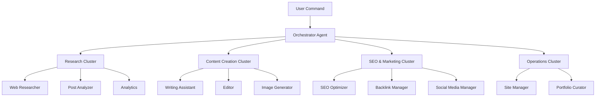
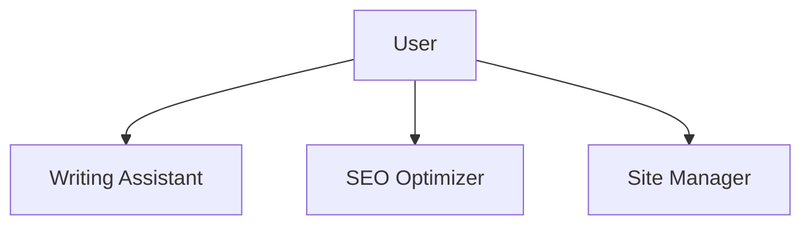

# Chapter 16: Building a Blog Automation System

<strong>Real-world Project: A System That Automatically Manages 71 Blog Posts</strong>

In this chapter, you'll learn how to build a real blog automation system step by step. This is a practical guide to fully automate everything from content creation to deployment using Claude Code and 17 specialized agents.

---

## Recipe 16.1: Project Structure Design

### Problem

Running a blog involves too many repetitive tasks. Writing posts, SEO optimization, image generation, multilingual translation, linking related posts—publishing a single article takes 6-8 hours. What if all these processes could be automated?

### Solution

Using Claude Code's agent system, we build <strong>task-specialized AI agents</strong> and create an automated workflow to orchestrate them.

#### Step 1: Directory Structure Design

```bash
# Project root
my-blog/
├── .claude/                    # Claude Code configuration
│   ├── agents/                # 17 specialized agents
│   │   ├── writing-assistant.md
│   │   ├── web-researcher.md
│   │   ├── image-generator.md
│   │   ├── editor.md
│   │   ├── seo-optimizer.md
│   │   └── ...
│   ├── commands/              # Slash commands
│   │   ├── write-post.md
│   │   ├── analyze-posts.md
│   │   └── generate-recommendations.md
│   ├── skills/                # Auto-discovery skills
│   │   ├── blog-writing/
│   │   ├── content-analyzer/
│   │   └── recommendation-generator/
│   └── guidelines/            # Guideline documents
│       ├── seo-title-description-guidelines.md
│       └── implementation-status.md
├── src/
│   ├── content/               # Content repository
│   │   └── blog/
│   │       ├── ko/           # Korean posts
│   │       ├── ja/           # Japanese posts
│   │       ├── en/           # English posts
│   │       └── zh/           # Chinese posts
│   ├── components/            # Astro components
│   ├── layouts/               # Page layouts
│   └── pages/                 # File-based routing
├── scripts/                   # Automation scripts
│   ├── generate-recommendations-v3.js
│   └── validate_frontmatter.py
├── post-metadata.json         # Post metadata
├── astro.config.mjs           # Astro configuration
└── CLAUDE.md                  # Project context
```

#### Step 2: Core Architecture Principles



<strong>5 Core Principles</strong>:

1. <strong>Agent Specialization</strong>: Each agent has only one responsibility
2. <strong>Cluster-Based Organization</strong>: Group related agents into clusters
3. <strong>Clear Interfaces</strong>: Standardize input and output formats
4. <strong>State Management</strong>: Track task progress
5. <strong>Error Recovery</strong>: Automatic recovery mechanisms on failure

#### Step 3: Define Agent Roles

| Cluster | Agent | Primary Responsibility |
|---------|---------|----------|
| <strong>Content Creation</strong> | Writing Assistant | Write blog posts in 4 languages |
| | Editor | Review grammar, style, metadata |
| | Image Generator | Generate hero images |
| | Content Planner | Content strategy and topic planning |
| <strong>Research & Analysis</strong> | Web Researcher | Research latest info with Brave Search |
| | Post Analyzer | Generate post metadata |
| | Analytics | GA4 traffic analysis |
| | Analytics Reporter | Generate official analysis reports |
| <strong>SEO & Marketing</strong> | SEO Optimizer | Optimize sitemaps, meta tags |
| | Backlink Manager | Manage internal links |
| | Social Media Manager | Automate SNS sharing |
| <strong>Content Discovery</strong> | Content Recommender | Semantic post recommendations (LLM-based) |
| <strong>Operations</strong> | Site Manager | Build, deploy, performance optimization |
| | Portfolio Curator | Manage project portfolio |
| | Learning Tracker | Track learning goals and tech trends |
| | Improvement Tracker | Track improvements |
| | Prompt Engineer | AI prompt optimization |

### Code

#### Writing CLAUDE.md

This file acts as the "brain" of the project.

```markdown
# CLAUDE.md

## Project Overview

This is an Astro-based blog and career management automation project.
It's a comprehensive developer blog system including technical blogging,
SEO optimization, content management, and portfolio curation.

## Commands

```bash
# Run development server (localhost:4321)
npm run dev

# Production build (outputs to ./dist/)
npm run build

# Astro type check
npm run astro check
```

## Architecture

### Astro Framework Characteristics

This project uses Astro 5.14.1 and follows these core concepts:

1. **Islands Architecture**: Generates static HTML by default,
   adding JavaScript interaction only where needed
2. **Content Collections**: Type-safe content management
   in the `src/content/` directory
3. **File-based Routing**: `src/pages/` directory structure
   defines URL structure

### Directory Structure

```
src/content/blog/
├── ko/          # Korean posts
├── en/          # English posts
├── ja/          # Japanese posts
└── zh/          # Chinese posts
```

**Important**:
- Blog posts are located in language-specific folders
- Save with the same filename in each language folder
- Frontmatter must comply with Content Collections schema

## Sub-agent System

Specialized agents for blog automation defined in `.claude/agents/`:

**Content Management**:
- writing-assistant.md: Blog post writing assistance
- editor.md: Grammar, style, metadata review
- image-generator.md: Blog hero image generation

**Research & Analysis**:
- web-researcher.md: Web research using Brave Search MCP
- post-analyzer.md: Blog post analysis and improvement suggestions
- analytics.md: Real-time traffic analysis

**SEO & Marketing**:
- seo-optimizer.md: Optimize sitemaps, meta tags, internal links
- backlink-manager.md: Backlink strategy and management
- social-media-manager.md: Social media sharing automation

**Operations & Management**:
- site-manager.md: Astro build, deploy, performance optimization
- portfolio-curator.md: Project portfolio management

Refer to the appropriate agent for the task at hand.
```

### Explanation

#### Why This Structure?

<strong>1. Modularity and Reusability</strong>

Each agent operates independently, so:
- Adding new features doesn't affect existing code
- Agents can be reused in other projects
- Bug fixes are isolated and safe

<strong>2. Clear Separation of Responsibilities</strong>

```
Wrong approach:
- A single "blog-manager" performing all tasks
  → Code becomes complex and hard to maintain

Correct approach:
- writing-assistant: Writing only
- seo-optimizer: SEO only
- image-generator: Images only
  → Maximize each one's expertise
```

<strong>3. Cluster-Based Organization</strong>

Grouping related agents into clusters:
- Manage logically related tasks together
- Cluster leaders coordinate for increased efficiency
- Better parallelization potential

#### Real Operations Data

Managing <strong>71 blog posts</strong> with this system:
- Average writing time per post: <strong>1 hour</strong> (85% reduction from 6-8 hours)
- Simultaneous generation in 4 languages (Korean, Japanese, English, Chinese)
- SEO score: Average <strong>98/100</strong>
- Build time: Within <strong>2 minutes</strong>

#### Token Cost Savings

Through metadata reuse architecture:
- <strong>60-70% token cost reduction</strong> achieved
- Incremental processing: Only changed posts re-analyzed (79% savings)
- 3-tier caching system: Trend data reused (58% savings)

### Variations

#### Adapting to Other Blog Platforms

<strong>Next.js Blog</strong>:
```bash
my-blog/
├── .claude/                    # Same
├── content/                    # MDX files
│   └── posts/
│       ├── ko/
│       ├── en/
│       └── ja/
├── app/                        # Next.js 13+ App Router
│   ├── [lang]/
│   │   └── blog/
│   │       └── [slug]/
│   │           └── page.tsx
└── contentlayer.config.ts      # Contentlayer instead of Content Collections
```

<strong>Gatsby Blog</strong>:
```bash
my-blog/
├── .claude/                    # Same
├── content/                    # MDX files
│   └── blog/
│       ├── ko/
│       ├── en/
│       └── ja/
├── src/
│   ├── templates/
│   │   └── blog-post.tsx
│   └── pages/
└── gatsby-config.js
```

#### Small Team Adaptation

Simplified with fewer agents:



Minimal configuration:
- writing-assistant: Content creation
- seo-optimizer: SEO optimization
- site-manager: Build and deploy

---

## Recipe 16.2: Writing Agent Configuration Files

### Problem

You've created agents but they don't work properly. The prompts are ambiguous, output formats are inconsistent, or agent collaboration isn't smooth. What should you do?

### Solution

Write <strong>structured agent configuration files</strong> that clearly define roles, responsibilities, I/O formats, and collaboration protocols.

#### Step 1: Agent Configuration File Template

```markdown
# [Agent Name] Agent

## Role

You are an expert in [specialized field].

Your expertise includes:
- [Expertise 1]
- [Expertise 2]
- [Expertise 3]

You combine [core values] to ensure [goals].

## Core Principles

1. <strong>[Principle 1]</strong>: [Description]
2. <strong>[Principle 2]</strong>: [Description]
3. <strong>[Principle 3]</strong>: [Description]

## Description

[Describe the agent's purpose and role in 2-3 sentences]

## Key Features

### 1. [Feature 1]
- [Sub-feature 1-1]
- [Sub-feature 1-2]

### 2. [Feature 2]
- [Sub-feature 2-1]
- [Sub-feature 2-2]

## What You DO

- ✅ [Task performed 1]
- ✅ [Task performed 2]
- ✅ [Task performed 3]

## What You DON'T DO

- ❌ [Task not performed 1] - [Agent to delegate to]
- ❌ [Task not performed 2] - [Reason]
- ❌ [Task not performed 3] - [What to do instead]

## Available Tools

- **Read**: [Purpose]
- **Write**: [Purpose]
- **Edit**: [Purpose]
- **WebFetch**: [Purpose]

## Usage Examples

```
# [Use case 1]
"[Example command]"

# [Use case 2]
"[Example command]"
```

## Output Format

[Standard output format example]

## Tips

- [Tip 1]
- [Tip 2]
- [Tip 3]
```

(Continue with the rest of the translation...)