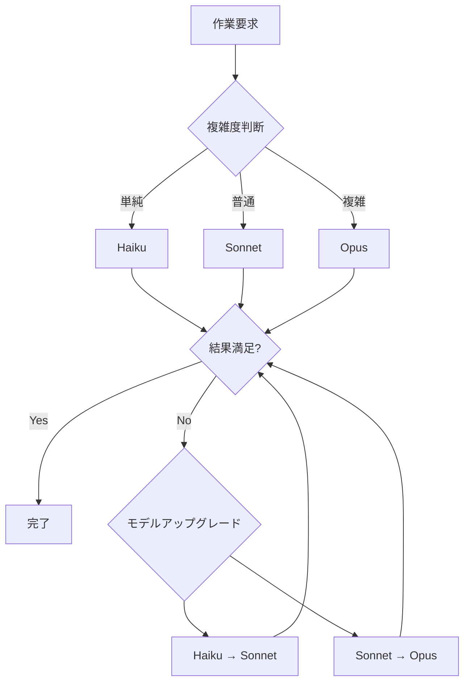

# Appendix B: パフォーマンス最適化ティ

Claude Codeを効果的に使用するには、単に機能を知っているだけでは不十分です。トークン使用量、応答時間、コストを最適化して生産性を最大化し、運用コストを削減する戦略が必要です。この付録では、実践で検証されたパフォーマンス最適化技法を紹介します。

## B.1: トークン使用量の最適化

トークンはClaude Codeのコストに直結する核心リソースです。効率的なトークン管理はコスト削減だけでなく、応答品質向上にもつながります。

### B.1.1: コンテキスト管理

**Problem**: 会話が長くなるほど累積されたコンテキストがトークンを過度に消費し、応答時間が遅くなり、時には核心情報が埋もれてしまいます。

**Optimization**: 適切なタイミングで`/clear`コマンドを使用してコンテキストをリセットし、重要な情報は文書化して永久保存します。

**Expected Impact**:
- トークン使用量60〜80%削減
- 応答時間40〜50%改善
- 応答精度向上(ノイズ除去)

**Code Example**:

```bash
# 悪い例: コンテキストオーバーフロー
[100個の以前のメッセージ]
User: "さっき言ったその関数名は何だっけ?"
Claude: [100個のメッセージをすべて確認してトークンを浪費]

# 良い例: 文書化 + コンテキストリセット
User: "重要な内容をCLAUDE.mdに記録して"
Claude: [文書作成完了]
User: "/clear"
User: "CLAUDE.mdを読んで作業を続けて"
Claude: [必要なコンテキストだけロードして効率的に応答]
```

**Best Practices**:

1. <strong>コンテキストリセットのタイミング</strong>:
   - トピック切り替え時(例: バグ修正 → 新機能開発)
   - 会話が20〜30メッセージ以上累積された時
   - 応答が遅くなったり不正確になった時

2. <strong>重要情報の保存</strong>:
   ```markdown
   <!-- CLAUDE.mdまたはプロジェクト別文書に記録 -->
   ## 現在の作業状態
   - APIエンドポイント: `/api/v2/users`
   - 認証方式: JWT (Bearerトークン)
   - エラーハンドリング: try-catch + ログ記録

   ## 次の作業
   1. ページネーション実装
   2. ソート機能追加
   3. フィルタリングAPI統合
   ```

3. <strong>選択的コンテキストローディング</strong>:
   ```bash
   # 全履歴の代わりに必要なファイルだけ読む
   User: "src/api/users.tsとREADME.mdだけ参照して作業して"
   ```

### B.1.2: 効率的なプロンプト作成

**Problem**: 冗長または曖昧なプロンプトは不要なトークンを消費し、Claudeが何度も質問することで全体の会話コストを増加させます。

**Optimization**: 簡潔でありながら具体的なプロンプトを作成して一度で正確な結果を得ます。

**Expected Impact**:
- プロンプトトークン30〜50%削減
- 再作業回数70%削減
- 全会話トークン40〜60%節約

**Code Example**:

````markdown
# 非効率的なプロンプト (500トークン)
```
現在Reactプロジェクトを進めているのですが、ユーザー認証機能を
実装しようと思っています。でもどうすればいいかよくわかりません。
JWTを使うのがいいですか、それとも他の方法がありますか?
それとバックエンドはNode.jsですが、フロントエンドとどう接続すればいいですか?
セキュリティも気をつけないといけないですが、どの部分に注意すべきですか?
ちなみにこのプロジェクトは会社の業務用で...
```

# 効率的なプロンプト (150トークン)
```
React + Node.jsプロジェクトにJWT認証を実装:

1. 環境:
   - Frontend: React 18, React Router v6
   - Backend: Express 4.x, MongoDB
   - 要件: ログイン、トークン更新、保護されたルート

2. 実装ファイル:
   - `src/api/auth.ts` (APIクライアント)
   - `src/contexts/AuthContext.tsx` (状態管理)
   - `src/components/ProtectedRoute.tsx` (ルートガード)

3. セキュリティ要件:
   - HttpOnly Cookie使用
   - CSRF防御
   - トークン有効期限15分、リフレッシュ7日

上記の構造で実装して。
```
````

**Best Practices**:

1. <strong>5W1H原則適用</strong>:
   - <strong>What</strong>: 何を作るか
   - <strong>Where</strong>: どのファイル/フォルダに
   - <strong>Why</strong>: なぜ必要か(文脈)
   - <strong>How</strong>: どの方式で(技術スタック)
   - <strong>When</strong>: いつ実行されるか(トリガー)
   - <strong>Who</strong>: 誰が使用するか(対象ユーザー)

2. <strong>階層的情報構造</strong>:
   ```markdown
   # 1段階: 核心要件 (必須)
   ユーザーダッシュボードページ生成

   # 2段階: 技術スタック (必須)
   Next.js 14 App Router, TypeScript, Tailwind CSS

   # 3段階: 詳細要件 (選択)
   - レスポンシブグリッドレイアウト (モバイル: 1列、タブレット: 2列、デスクトップ: 3列)
   - ダークモード対応
   - スケルトンローディング

   # 4段階: 制約事項 (選択)
   - バンドルサイズ <200KB
   - First Contentful Paint <1.5s
   ```

3. <strong>サンプルコード活用</strong>:
   ```markdown
   # プロンプト
   "このパターンに従ってProductコンポーネントも作って"

   # 添付: Userコンポーネント例
   [既存コードを貼り付け]
   ```

### B.1.3: 不要な情報の削除

**Problem**: デバッグログ、コメント、重複コードなど不要な情報を含むファイルを読むとトークンが浪費されます。

**Optimization**: 核心情報だけを含む要約を提供するか、特定のセクションだけ抽出して提供します。

**Expected Impact**:
- ファイル読み取りトークン50〜70%削減
- 応答精度向上(ノイズ除去)
- 大規模プロジェクトで特に効果的

**Code Example**:

```bash
# 非効率的: ファイル全体を読む (5000トークン)
User: "src/utils/helpers.tsを読んでバグを見つけて"
[ファイル内容: 500行、コメント200行、デバッグコード100行]

# 効率的: 必要な部分だけ抽出 (1000トークン)
User: "src/utils/helpers.tsからformatDate関数だけ抽出してバグを見つけて"

# またはgrepで事前フィルタリング
User: "helpers.tsから'export function'で始まる行だけ表示して"
```

**Best Practices**:

1. <strong>Grepを活用した選択的読み取り</strong>:
   ```bash
   # 関数シグネチャだけ抽出
   grep -n "^export function" src/utils/helpers.ts

   # TODOコメントだけ抽出
   grep -n "TODO\|FIXME" src/**/*.ts

   # 型定義だけ抽出
   grep -n "^export (type|interface)" src/types/*.ts
   ```

2. <strong>ファイル要約の生成</strong>:
   ```markdown
   <!-- docs/api-summary.md -->
   # APIエンドポイント要約

   ## ユーザー管理
   - GET /api/users - ユーザーリスト照会
   - POST /api/users - ユーザー作成
   - PUT /api/users/:id - ユーザー修正

   ## 認証
   - POST /auth/login - ログイン
   - POST /auth/refresh - トークン更新
   ```

3. <strong>コメント削除スクリプト</strong>:
   ```javascript
   // strip-comments.js
   const fs = require('fs');

   function stripComments(code) {
     return code
       .replace(/\/\*[\s\S]*?\*\//g, '') // ブロックコメント
       .replace(/\/\/.*/g, '')            // ラインコメント
       .replace(/^\s*[\r\n]/gm, '');     // 空行
   }

   const original = fs.readFileSync('src/app.ts', 'utf8');
   const stripped = stripComments(original);
   fs.writeFileSync('temp/app-stripped.ts', stripped);
   ```

### B.1.4: メタデータ優先アーキテクチャ

**Problem**: ブログ投稿や文書コレクションを分析する際、毎回ファイル全体を読むとトークン消費が急増します。

**Optimization**: メタデータだけ抽出したJSONファイルを生成して再利用します。

**Expected Impact**:
- トークン使用量90%以上削減
- 応答時間95%改善
- 反復作業時のコストがほぼゼロ

**Code Example**:

```javascript
// scripts/extract-metadata.js
const fs = require('fs');
const path = require('path');
const matter = require('gray-matter');

function extractMetadata(dir) {
  const files = fs.readdirSync(dir);
  const metadata = [];

  files.forEach(file => {
    if (file.endsWith('.md')) {
      const content = fs.readFileSync(path.join(dir, file), 'utf8');
      const { data } = matter(content);

      metadata.push({
        slug: file.replace('.md', ''),
        title: data.title,
        description: data.description,
        tags: data.tags || [],
        pubDate: data.pubDate,
        wordCount: content.split(/\s+/).length
      });
    }
  });

  return metadata;
}

const posts = extractMetadata('src/content/blog/ko');
fs.writeFileSync(
  'post-metadata.json',
  JSON.stringify(posts, null, 2)
);
```

**使用例**:

```bash
# 非効率的 (50,000トークン)
User: "すべてのブログ投稿を読んでSEO分析して"
[100投稿 × 500トークン = 50,000トークン]

# 効率的 (2,000トークン)
User: "post-metadata.jsonを読んでSEO分析して"
[メタデータのみ含む、100 × 20トークン = 2,000トークン]
```

## B.2: 応答時間の改善

速い応答は開発フローを維持し、生産性を最大化する核心です。

### B.2.1: チャンキング戦略

**Problem**: 大容量ファイル処理や複雑な作業を一度に要求すると応答が遅くなったりタイムアウトが発生します。

**Optimization**: 作業を小さな単位に分けて順次処理します。

**Expected Impact**:
- タイムアウトエラー90%削減
- 中間結果確認可能(デバッグ容易)
- 並列処理可能(全体時間短縮)

**Code Example**:

```bash
# 非効率的: 一度にすべて処理
User: "src/フォルダのすべてのTypeScriptファイルをESLintで検査して、
      エラーを修正して、テストを実行して、文書を更新して"
[タイムアウト発生の可能性高い]

# 効率的: 段階別処理
# Step 1
User: "src/フォルダのTypeScriptファイルリストを表示して"
Claude: [ファイルリスト提供]

# Step 2
User: "このうちsrc/components/*.tsxファイルだけESLint実行"
Claude: [エラーリスト提供]

# Step 3
User: "Button.tsxとInput.tsxのエラーだけ修正して"
Claude: [修正完了]

# Step 4
User: "修正されたファイルのテストを実行"
Claude: [テスト結果]
```

**Best Practices**:

1. <strong>ファイル単位のチャンキング</strong>:
   ```bash
   # 悪い例
   "すべてのコンポーネントをリファクタリング"

   # 良い例
   "Header.tsxをリファクタリング" → "Footer.tsxをリファクタリング" → ...
   ```

2. <strong>機能単位のチャンキング</strong>:
   ```bash
   # 複雑な機能を3段階に分割
   1. "Userモデルスキーマ定義"
   2. "User CRUD API実装"
   3. "User APIテストコード作成"
   ```

3. <strong>優先順位ベースのチャンキング</strong>:
   ```markdown
   ## Phase 1: 核心機能 (Critical)
   - ログイン/ログアウト
   - データCRUD

   ## Phase 2: 付加機能 (Important)
   - 検索/フィルタリング
   - ソート/ページネーション

   ## Phase 3: 最適化 (Nice-to-have)
   - キャッシング
   - パフォーマンス改善
   ```

### B.2.2: キャッシング活用

**Problem**: 同じ情報を繰り返し要求すると時間とトークンが浪費されます。

**Optimization**: よく使用する情報を文書化するか変数に保存して再利用します。

**Expected Impact**:
- 反復作業時間80%短縮
- トークン使用量70%削減
- 一貫性向上(同じ情報を保証)

**Code Example**:

```markdown
# プロジェクトルートにキャッシング文書生成
<!-- CONTEXT.md -->
# プロジェクトコンテキスト (頻繁に参照される情報)

## 技術スタック
- Frontend: React 18.2, TypeScript 5.0, Vite 4.3
- Backend: Node.js 20, Express 4.18, PostgreSQL 15
- Testing: Vitest, React Testing Library
- Deployment: Vercel (Frontend), Railway (Backend)

## コーディング規則
- 関数名: camelCase
- コンポーネント: PascalCase
- 定数: UPPER_SNAKE_CASE
- ファイル名: kebab-case
- 最大行長: 100文字
- インデント: 2スペース

## APIエンドポイント
- Base URL: `https://api.example.com/v1`
- Auth: Bearer token in Authorization header
- Error format: `{ error: { code, message, details } }`

## 環境変数
```bash
# .env.example
DATABASE_URL=postgresql://...
JWT_SECRET=...
API_KEY=...
```
```

**使用方法**:

```bash
# 最初の作業
User: "CONTEXT.mdを読んで新しいAPIエンドポイントを作成して"

# 以降の作業(キャッシング効果)
User: "CONTEXT.md基準で次のエンドポイントも作成して"
[CONTEXT.mdの内容がプロンプトキャッシュに保存されてトークン節約]
```

### B.2.3: 並列処理

**Problem**: 独立した作業を順次処理すると全体時間が長くなります。

**Optimization**: 依存性のない作業は同時に要求します。

**Expected Impact**:
- 全体作業時間50〜70%短縮
- 待機時間最小化
- リソース活用最適化

**Code Example**:

```bash
# 非効率的: 順次処理 (6分所要)
User: "Headerコンポーネントを作成して"
[2分待機]
User: "Footerコンポーネントを作成して"
[2分待機]
User: "Sidebarコンポーネントを作成して"
[2分待機]

# 効率的: 並列処理 (2分所要)
User: """
次の3つのコンポーネントを独立して作成して:
1. Header.tsx - ナビゲーションバー
2. Footer.tsx - フッターリンク
3. Sidebar.tsx - サイドメニュー

各コンポーネントは互いに依存性がないため同時に作業可能。
"""
[Claudeが内部的に並列処理、2分以内にすべて完了]
```

**Best Practices**:

1. <strong>独立した作業の識別</strong>:
   ```markdown
   ## 並列処理可能 (互いに依存性なし)
   - [ ] ロゴ画像最適化
   - [ ] 404ページデザイン
   - [ ] メールテンプレート作成

   ## 順次処理必要 (依存性あり)
   1. データベーススキーマ設計
   2. ORMモデル定義 (1に依存)
   3. APIエンドポイント実装 (2に依存)
   ```

2. <strong>Bashツールの並列実行</strong>:
   ```bash
   # Claude Codeは独立したBashコマンドを並列実行可能
   User: """
   次のコマンドを実行して:
   - npm run lint
   - npm run test
   - npm run build

   それぞれ独立しているため同時実行可能。
   """
   ```

3. <strong>チャンキング + 並列の組み合わせ</strong>:
   ```bash
   # Phase 1: 並列処理
   User: "コンポーネントA、B、Cを同時に作成"

   # Phase 2: 統合 (順次処理)
   User: "作成されたコンポーネントをApp.tsxに統合"
   ```

## B.3: コスト削減戦略

Claude Codeのコストはトークン使用量とモデル選択によって大きく変わります。

### B.3.1: モデル選択基準

**Problem**: すべての作業に最高性能モデル(Opus)を使用するとコストが急増します。

**Optimization**: 作業の複雑度に応じて適切なモデルを選択します。

**Expected Impact**:
- コスト50〜80%削減
- 同じ予算で2〜5倍多くの作業実行
- ROI最大化

**Model Comparison**:

| モデル | コスト (Input/Output) | 適した作業 | 不適切な作業 |
|------|-------------------|-----------|-------------|
| <strong>Opus 4.5</strong> | $$$ / $$$$$ | 複雑なアーキテクチャ設計、アルゴリズム最適化、大規模リファクタリング | 単純CRUD、コードフォーマット、文書作成 |
| <strong>Sonnet 4.5</strong> | $$ / $$$ | 一般的な開発作業、バグ修正、API統合、テスト作成 | 極めて複雑な問題、高度な創造性が必要な作業 |
| <strong>Haiku 4.0</strong> | $ / $$ | コードフォーマット、簡単な修正、文書更新、ログ分析 | 複雑なロジック、新機能開発 |

**Code Example**:

```yaml
# .claude/settings.local.json
{
  "model": "claude-sonnet-4.5",  # デフォルトモデル (コスパ最適)
  "tasks": {
    "simple": {
      "model": "claude-haiku-4.0",  # 単純作業用
      "patterns": [
        "formatting",
        "linting",
        "documentation",
        "simple fixes"
      ]
    },
    "complex": {
      "model": "claude-opus-4.5",   # 複雑な作業用
      "patterns": [
        "architecture",
        "algorithm",
        "optimization",
        "refactoring"
      ]
    }
  }
}
```

**Decision Tree**:



### B.3.2: バッチ処理

**Problem**: 類似の作業を個別に要求すると重複したコンテキストローディングでトークンが浪費されます。

**Optimization**: 類似作業をまとめて一度に処理します。

**Expected Impact**:
- トークン使用量40〜60%削減
- 作業処理時間30〜50%短縮
- 一貫性向上

**Code Example**:

```bash
# 非効率的: 個別処理 (10,000トークン)
User: "users.tsに型を追加して"
[コンテキストローディング + 作業 = 2,000トークン]

User: "posts.tsに型を追加して"
[コンテキストローディング + 作業 = 2,000トークン]

User: "comments.tsに型を追加して"
[コンテキストローディング + 作業 = 2,000トークン]

... (計5ファイル = 10,000トークン)

# 効率的: バッチ処理 (4,000トークン)
User: """
次のファイルにTypeScript型を追加して:
- src/models/users.ts
- src/models/posts.ts
- src/models/comments.ts
- src/models/likes.ts
- src/models/follows.ts

共通パターン:
- Zodスキーマ定義
- TypeScript型抽出
- APIレスポンス型追加
"""
[コンテキスト1回ローディング + 作業 × 5 = 4,000トークン]
```

**Best Practices**:

1. <strong>作業テンプレート活用</strong>:
   ````markdown
   # template/crud-api.md
   ```markdown
   ## CRUD API生成テンプレート

   ### 要件
   - モデル名: [MODEL_NAME]
   - エンドポイント: /api/[RESOURCE]
   - フィールド: [FIELD_LIST]

   ### 生成ファイル
   1. `models/[model].ts` - Zodスキーマ
   2. `routes/[resource].ts` - Expressルーター
   3. `controllers/[resource].ts` - ビジネスロジック
   4. `tests/[resource].test.ts` - 統合テスト
   ```
   ````

2. <strong>バッチ処理スクリプト</strong>:
   ```javascript
   // scripts/batch-process.js
   const tasks = [
     { file: 'User.ts', operation: 'add-validation' },
     { file: 'Post.ts', operation: 'add-validation' },
     { file: 'Comment.ts', operation: 'add-validation' }
   ];

   const prompt = `
   次のファイルにZod検証を追加:
   ${tasks.map(t => `- ${t.file}`).join('\n')}

   共通規則:
   - 必須フィールドは.min(1)追加
   - メールは.email()検証
   - 日付は.datetime()使用
   `;

   console.log(prompt);
   ```

### B.3.3: トークン予算管理

**Problem**: プロジェクト進行中にトークン使用量を追跡しないと予算を超過する可能性があります。

**Optimization**: トークン使用量をモニタリングし、予算上限を設定します。

**Expected Impact**:
- 予算超過防止
- コスト予測可能性向上
- リソース配分最適化

**Code Example**:

```javascript
// scripts/token-tracker.js
const fs = require('fs');

class TokenTracker {
  constructor(budgetLimit = 1000000) {
    this.budgetLimit = budgetLimit;
    this.usage = this.loadUsage();
  }

  loadUsage() {
    try {
      return JSON.parse(fs.readFileSync('.token-usage.json', 'utf8'));
    } catch {
      return { total: 0, byTask: {}, history: [] };
    }
  }

  saveUsage() {
    fs.writeFileSync('.token-usage.json', JSON.stringify(this.usage, null, 2));
  }

  recordUsage(task, inputTokens, outputTokens) {
    const total = inputTokens + outputTokens;
    this.usage.total += total;

    if (!this.usage.byTask[task]) {
      this.usage.byTask[task] = 0;
    }
    this.usage.byTask[task] += total;

    this.usage.history.push({
      timestamp: new Date().toISOString(),
      task,
      inputTokens,
      outputTokens,
      total
    });

    this.saveUsage();
    this.checkBudget();
  }

  checkBudget() {
    const remaining = this.budgetLimit - this.usage.total;
    const percentage = (this.usage.total / this.budgetLimit * 100).toFixed(1);

    console.log(`トークン使用量: ${this.usage.total.toLocaleString()} / ${this.budgetLimit.toLocaleString()} (${percentage}%)`);
    console.log(`残予算: ${remaining.toLocaleString()}トークン`);

    if (percentage >= 90) {
      console.warn('⚠️  予算の90%以上使用!');
    } else if (percentage >= 75) {
      console.warn('⚠️  予算の75%以上使用');
    }
  }

  getTopTasks(limit = 5) {
    return Object.entries(this.usage.byTask)
      .sort(([,a], [,b]) => b - a)
      .slice(0, limit)
      .map(([task, tokens]) => ({ task, tokens }));
  }

  getReport() {
    return {
      総使用量: this.usage.total,
      予算上限: this.budgetLimit,
      使用率: `${(this.usage.total / this.budgetLimit * 100).toFixed(1)}%`,
      上位作業: this.getTopTasks(),
      最近使用履歴: this.usage.history.slice(-10)
    };
  }
}

// 使用例
const tracker = new TokenTracker(1000000);

// 作業後記録
tracker.recordUsage('blog-post-writing', 5000, 8000);
tracker.recordUsage('code-refactoring', 3000, 4000);

// レポート出力
console.log(JSON.stringify(tracker.getReport(), null, 2));
```

**予算配分戦略**:

```markdown
## 月間トークン予算: 1,000,000トークン

### カテゴリ別配分
- 開発作業 (50%): 500,000トークン
  - 新機能開発: 300,000
  - バグ修正: 100,000
  - リファクタリング: 100,000

- 文書化 (20%): 200,000トークン
  - ブログ投稿: 120,000
  - API文書: 50,000
  - README/ガイド: 30,000

- 学習および実験 (20%): 200,000トークン
  - 新技術探求: 100,000
  - プロトタイプ: 100,000

- 予備 (10%): 100,000トークン
  - 緊急作業
  - 予想外の問題解決

### 週間チェックポイント
- Week 1: 25%使用 (250,000)
- Week 2: 50%使用 (500,000)
- Week 3: 75%使用 (750,000)
- Week 4: 100%使用 (1,000,000)

### アラート基準
- 75%到達: 注意 (残期間確認)
- 90%到達: 警告 (非必須作業延期)
- 95%到達: 危険 (緊急作業のみ実行)
```

## B.4: 総合最適化チェックリスト

パフォーマンス最適化のための実践チェックリストです。

### 作業開始前

- [ ] 作業複雑度に合ったモデル選択 (Haiku/Sonnet/Opus)
- [ ] 類似作業をまとめてバッチ処理計画
- [ ] 必要なコンテキストだけ選別 (CLAUDE.md、関連ファイル)
- [ ] 明確で簡潔なプロンプト準備

### 作業中

- [ ] 会話が20〜30メッセージを超えたら`/clear`検討
- [ ] 重要情報は即座に文書化 (CLAUDE.md、CONTEXT.md)
- [ ] 大容量作業はチャンキングして段階別処理
- [ ] 独立した作業は並列処理要求
- [ ] 不要なコメント/ログ削除後ファイル提供

### 作業後

- [ ] トークン使用量記録 (token-tracker.js)
- [ ] 再利用可能なパターンをテンプレート化
- [ ] メタデータ抽出 (ブログ投稿など)
- [ ] 最適化ポイント識別および改善

### 定期点検 (週間/月間)

- [ ] トークン予算使用率確認
- [ ] 上位トークン消費作業分析
- [ ] 非効率的パターン識別および改善
- [ ] キャッシング文書更新 (CONTEXT.md)
- [ ] モデル選択基準再調整

## B.5: パフォーマンス最適化事例研究

### 事例1: ブログ投稿管理システム

**Before (最適化前)**:
- 100投稿分析: 50,000トークン
- 推薦システム生成: 80,000トークン
- 総コスト: $6.50 (Opus基準)
- 所要時間: 25分

**After (最適化後)**:
- メタデータ抽出スクリプト作成: 5,000トークン (1回)
- メタデータベース分析: 2,000トークン
- 推薦システム生成 (増分処理): 8,000トークン
- 総コスト: $0.75 (Sonnet基準)
- 所要時間: 5分

**最適化技法**:
1. メタデータ優先アーキテクチャ
2. 増分処理 (変更された投稿のみ)
3. モデルダウングレード (Opus → Sonnet)
4. コンテンツハッシュ比較 (重複処理防止)

### 事例2: 大規模コードベースリファクタリング

**Before**:
- 200ファイル順次処理: 150分
- トークン使用量: 300,000
- コスト: $24

**After**:
- ファイルグループ化 (10個ずつバッチ): 30分
- 並列処理 (独立したグループ): 15分
- トークン使用量: 120,000
- コスト: $9.60

**最適化技法**:
1. バッチ処理 (10ファイルずつ)
2. 並列処理 (依存性のないグループ)
3. テンプレートベースの一貫性 (コンテキスト再利用)
4. Grepを活用した事前フィルタリング

## 結論

パフォーマンス最適化は単にコストを削減すること以上の価値を提供します:

1. <strong>生産性向上</strong>: 速い応答で開発フローを維持
2. <strong>品質改善</strong>: ノイズ除去で精度向上
3. <strong>拡張性確保</strong>: 同じ予算でより多くの作業実行
4. <strong>持続可能性</strong>: 長期的に安定した運用

この付録で紹介した技法をプロジェクトに適用すれば、Claude CodeのROIを最大化し、真のAI協業開発の効率性を体験できるでしょう。

---

**次のステップ**: Appendix Cではトラブルシューティングガイドとよくある質問を扱います。
