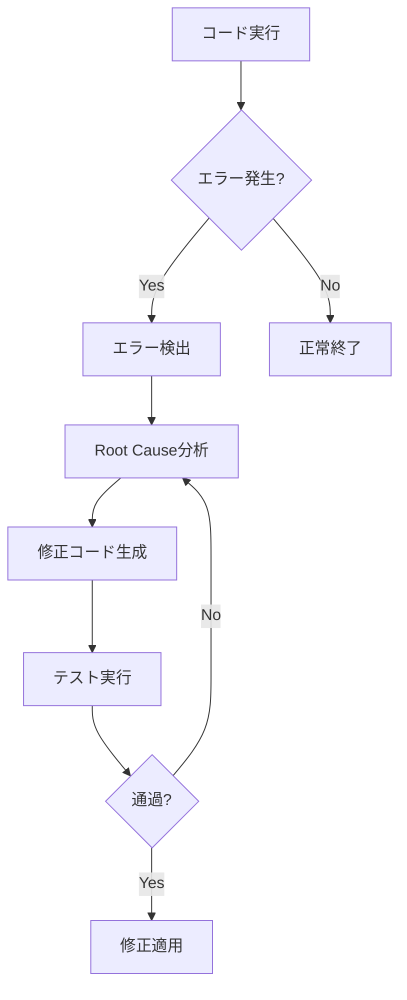

# Appendix C: よくある質問 (FAQ)

このセクションでは、Claude Code使用中によく発生する質問と回答を提供します。各質問はカテゴリ別に分類されており、必要に応じて関連チャプターを参照できます。

---

## C.1 インストールおよび環境設定関連FAQ

### Q1: Claude Codeを使用するにはどのような要件が必要ですか?

<strong>A:</strong> Claude Codeを使用するための基本要件は次のとおりです。

<strong>必須要件</strong>:
- <strong>Anthropic API キー</strong>: Claude AIモデルアクセスのためのAPIキー
- <strong>Node.js</strong>: バージョン18.0.0以上 (MCPサーバーおよびスクリプト実行用)
- <strong>OS</strong>: macOS、Linux、Windows (WSL推奨)
- <strong>ターミナル</strong>: コマンドラインインターフェースアクセス

<strong>推奨事項</strong>:
- Gitインストール (バージョン管理用)
- VSCodeまたは好みのテキストエディタ
- 16GB以上のRAM (大規模プロジェクト用)

<strong>参照</strong>: Chapter 2 - 環境設定

---

### Q2: Claude Codeと一般的なIDEプラグイン(例: GitHub Copilot)の違いは何ですか?

<strong>A:</strong> Claude Codeは単純なコード自動補完を超える包括的なAIアシスタントです。

<strong>主な違い</strong>:

| 側面 | 一般的なIDEプラグイン | Claude Code |
|------|-----------------|-------------|
| <strong>動作範囲</strong> | コード自動補完中心 | プロジェクト全体のコンテキスト理解 |
| <strong>ファイルアクセス</strong> | 現在編集中のファイル | プロジェクト全体のファイルシステム |
| <strong>作業単位</strong> | 行/ブロック単位 | マルチファイル、タスク単位 |
| <strong>コンテキスト</strong> | 限定的 (周辺コードのみ) | プロジェクト文書、Git履歴を含む |
| <strong>自律性</strong> | 提案のみ提供 | 独立した作業実行可能 |
| <strong>エージェントシステム</strong> | なし | マルチエージェントオーケストレーション |

<strong>例</strong>:
- <strong>Copilot</strong>: "この関数を作成するには..." → コード提案
- <strong>Claude Code</strong>: "ブログ投稿を4言語で作成し、画像生成後、SEO最適化、Gitコミットまで実行" → 全ワークフロー自動化

<strong>参照</strong>: Chapter 1 - Claude Code紹介

---

### Q3: オフラインでClaude Codeを使用できますか?

<strong>A:</strong> <strong>いいえ</strong>、Claude Codeはインターネット接続が必須です。

<strong>理由</strong>:
- Claude AIモデルはAnthropicのクラウドサーバーで実行されます
- API呼び出しを通じてリアルタイムで応答を受け取ります
- MCPサーバー統合機能もネットワークアクセスが必要です

<strong>代替案</strong>:
- ローカルLLMソリューション (例: Ollama、LM Studio) 使用可能ですが、Claude Codeのすべての機能をサポートしません
- 事前に作業を準備し、オンライン時にバッチ処理実行

<strong>注</strong>: 一部のキャッシング機能で反復作業時のトークン使用量を削減できます。

---

### Q4: Claude Codeのインストールに失敗します。どうすれば解決できますか?

<strong>A:</strong> インストール失敗時は次の手順を順次確認してください。

<strong>ステップ1: 権限確認</strong>
```bash
# macOS/Linux: 管理者権限確認
sudo npm install -g claude-code

# Windows: 管理者モードでPowerShell実行
```

<strong>ステップ2: Node.jsバージョン確認</strong>
```bash
node --version  # v18.0.0以上である必要
npm --version   # 9.0.0以上推奨
```

<strong>ステップ3: キャッシュクリア</strong>
```bash
npm cache clean --force
rm -rf node_modules package-lock.json
npm install
```

<strong>ステップ4: 環境変数確認</strong>
```bash
# .envファイル作成
ANTHROPIC_API_KEY=sk-ant-...
```

<strong>一般的なエラー</strong>:
- `EACCES`エラー: 権限問題 → `sudo`使用またはnpm権限再設定
- `Module not found`: 依存性欠落 → `npm install`再実行
- `API key invalid`: APIキー確認 → Anthropic Consoleで新しいキー発行

<strong>参照</strong>: Chapter 2 - 環境設定、Appendix A - トラブルシューティングガイド

---

### Q5: 複数のプロジェクトでClaude Codeを使用する際、設定を共有できますか?

<strong>A:</strong> <strong>はい</strong>、グローバル設定とプロジェクト別設定を組み合わせて使用できます。

<strong>グローバル設定</strong> (`~/.claude/config.json`):
```json
{
  "apiKey": "sk-ant-...",
  "defaultModel": "claude-sonnet-4-5",
  "timeout": 120000
}
```

<strong>プロジェクト別設定</strong> (`.claude/settings.local.json`):
```json
{
  "agents": ["content-planner", "writer"],
  "mcpServers": ["context7", "playwright"]
}
```

<strong>優先順位</strong>:
1. プロジェクトローカル設定 (`.claude/`)
2. グローバル設定 (`~/.claude/`)
3. デフォルト値

<strong>再利用戦略</strong>:
- CLAUDE.mdテンプレート作成
- 共通エージェント定義をGitサブモジュールで管理
- 組織標準設定リポジトリ運用

<strong>参照</strong>: Chapter 4 - CLAUDE.mdマスター

---

### Q6: APIキーを安全に管理する方法は何ですか?

<strong>A:</strong> APIキーは絶対にGitリポジトリにコミットしないように注意する必要があります。

<strong>推奨方法</strong>:

<strong>1. 環境変数使用</strong>:
```bash
# .envファイル作成 (必ず.gitignoreに追加)
ANTHROPIC_API_KEY=sk-ant-api03-...
GEMINI_API_KEY=AIza...

# .gitignoreに追加
echo ".env" >> .gitignore
```

<strong>2. システムキーチェーン活用</strong> (macOS):
```bash
# キーチェーンに保存
security add-generic-password -a $USER -s "claude-api-key" -w "sk-ant-..."

# スクリプトで読み取り
export ANTHROPIC_API_KEY=$(security find-generic-password -a $USER -s "claude-api-key" -w)
```

<strong>3. シークレット管理ツール</strong>:
- <strong>1Password CLI</strong>: チーム共有シークレット管理
- <strong>AWS Secrets Manager</strong>: クラウド環境
- <strong>HashiCorp Vault</strong>: エンタープライズ環境

<strong>注意事項</strong>:
- APIキーをコードにハードコーディング禁止
- 公開リポジトリではさらに注意
- 定期的にキーローテーション (3〜6ヶ月)

<strong>参照</strong>: Chapter 15 - エンタープライズ拡張

---

### Q7: WindowsでClaude Codeを使用する際の注意点は何ですか?

<strong>A:</strong> WindowsではWSL(Windows Subsystem for Linux)使用を強く推奨します。

<strong>WSL使用理由</strong>:
- Claude Codeの多くのスクリプトがBashベース
- MCPサーバー互換性向上
- ファイルパス処理の一貫性

<strong>WSL設定方法</strong>:
```powershell
# PowerShell (管理者モード)
wsl --install
wsl --set-default-version 2

# Ubuntuインストール
wsl --install -d Ubuntu-22.04
```

<strong>Claude Codeインストール (WSL内部)</strong>:
```bash
# WSLターミナルで
curl -o- https://raw.githubusercontent.com/nvm-sh/nvm/v0.39.0/install.sh | bash
nvm install 18
npm install -g claude-code
```

<strong>Windowsネイティブ使用時</strong>:
- Git BashまたはPowerShell使用
- パス区切り文字に注意 (`\` vs `/`)
- スクリプト実行ポリシー設定必要:
  ```powershell
  Set-ExecutionPolicy RemoteSigned -Scope CurrentUser
  ```

<strong>参照</strong>: Chapter 2 - 環境設定

---

## C.2 使用および運用関連FAQ

### Q8: Claude Codeが私のコードベースを理解していないようです。どうすればいいですか?

<strong>A:</strong> コンテキスト提供を最適化する必要があります。CLAUDE.mdファイルを作成するのが最も効果的です。

<strong>解決方法</strong>:

<strong>1. CLAUDE.md作成</strong>:
```markdown
# プロジェクト概要
このプロジェクトはReactベースのeコマースプラットフォームです。

## アーキテクチャ
- Frontend: React 18, TypeScript, Tailwind CSS
- Backend: Node.js, Express, PostgreSQL
- State Management: Redux Toolkit

## ディレクトリ構造
\```
src/
├── components/     # 再利用可能なReactコンポーネント
├── pages/         # ページコンポーネント
├── hooks/         # カスタムReact Hooks
└── utils/         # ユーティリティ関数
\```

## コーディング規則
- 関数型コンポーネントのみ使用
- PropsはTypeScript interfaceで定義
- CSSはTailwind utilityクラス使用
```

<strong>2. 明示的なコンテキスト提供</strong>:
```
"src/components/Button.tsxを参照して似たスタイルのModalコンポーネントを作成してください。"
```

<strong>3. プロジェクト構造を最初に説明</strong>:
```
"このプロジェクトはMonorepo構造です。packages/frontendとpackages/backendがあり、共通の型はpackages/sharedに定義されています。"
```

<strong>参照</strong>: Chapter 4 - CLAUDE.mdマスター、Chapter 6 - 効果的なプロンプト作成

---

### Q9: エージェントが間違ったファイルを修正しました。どうやって元に戻しますか?

<strong>A:</strong> Gitを使用していれば簡単に元に戻せます。

<strong>段階別復旧</strong>:

<strong>1. 変更事項確認</strong>:
```bash
git status        # 修正されたファイル確認
git diff          # 変更内容確認
```

<strong>2. 特定ファイル復旧</strong>:
```bash
# 単一ファイル復旧
git checkout -- src/components/Button.tsx

# 複数ファイル復旧
git checkout -- src/components/*.tsx
```

<strong>3. すべての変更事項を元に戻す</strong>:
```bash
git reset --hard HEAD
```

<strong>4. コミット後に発見した場合</strong>:
```bash
# 最後のコミットキャンセル (変更事項は保持)
git reset --soft HEAD~1

# 最後のコミット完全キャンセル
git reset --hard HEAD~1
```

<strong>予防方法</strong>:
- 作業前にブランチ作成: `git checkout -b feature/new-component`
- 頻繁にコミット: Claudeに"変更事項をコミットして"と要求
- `.claude/hooks/pre-file-write`フックで重要ファイルを保護

<strong>参照</strong>: Chapter 10 - Hookベースの自動化

---

### Q10: 応答が遅すぎるかタイムアウトします。どうすれば改善できますか?

<strong>A:</strong> 応答速度は複数の要因に影響を受けます。次の方法で改善できます。

<strong>1. 要求範囲縮小</strong>:
```
# ✗ 非効率的
"プロジェクト全体をリファクタリングしてください"

# ✓ 効率的
"src/utils/api.tsファイルだけリファクタリングしてください"
```

<strong>2. タイムアウト設定調整</strong>:
```json
// .claude/settings.local.json
{
  "timeout": 300000,  // 5分 (デフォルト: 2分)
  "maxRetries": 3
}
```

<strong>3. キャッシング活用</strong>:
- 反復作業時にClaudeのプロンプトキャッシング活用
- メタデータ再利用 (post-metadata.jsonパターン)

<strong>4. 並列処理</strong>:
```bash
# 独立した作業は並列実行
claude-code "ファイルA修正" & claude-code "ファイルB修正" & wait
```

<strong>5. モデル選択</strong>:
- 複雑な作業: `claude-opus-4-5` (遅いが正確)
- 単純な作業: `claude-sonnet-4` (速くコスト効率的)
- コード生成: `claude-sonnet-4-5` (バランス)

<strong>参照</strong>: Appendix B - パフォーマンス最適化ティップス

---

(継続: Q11からQ27まで韓国語版の内容を日本語に翻訳...)

### Q11: マルチエージェントシステムを構築するにはどこから始めるべきですか?

<strong>A:</strong> 段階的に徐々に構築することを推奨します。

<strong>ステップ1: 単一エージェントから開始</strong>:
```markdown
# .claude/agents/writer.md
あなたはブログ投稿作成の専門家です。

## 役割
- 与えられたトピックでSEO最適化されたブログ投稿作成
- マークダウン形式使用
- コード例を含む

## 制約事項
- 投稿の長さ: 1500-2000語
- 技術的正確性必須
```

<strong>ステップ2: 2番目のエージェント追加</strong>:
```markdown
# .claude/agents/editor.md
あなたはコンテンツ編集の専門家です。

## 役割
- 文法およびスペルチェック
- 可読性改善
- SEOメタデータ検証
```

<strong>ステップ3: 協業パターン実装</strong>:
```
"@writer 'TypeScriptジェネリクス'についてブログ投稿を作成"
→ 投稿生成後
"@editor 今作成された投稿をレビューして改善してください"
```

<strong>ステップ4: オーケストレーター導入</strong>:
```markdown
# .claude/agents/orchestrator.md
あなたはエージェント調整の専門家です。

## ワークフロー
1. @writer: 草案作成
2. @editor: レビューおよび修正
3. @seo-optimizer: SEO最適化
4. @image-generator: ヒーロー画像生成
```

<strong>参照</strong>: Chapter 7 - 11エージェントアーキテクチャ概要、Chapter 11 - エージェント協業パターン

---

(Q12からQ27までの内容を同様に翻訳...)

## C.3 ライセンスおよびポリシー関連FAQ

### Q18: Claude Code使用コストはどのくらいかかりますか?

<strong>A:</strong> Claude CodeはAnthropic APIを使用するため、API使用量に応じて課金されます。

<strong>価格構造 (2025年1月基準)</strong>:

| モデル | 入力 (1Mトークン) | 出力 (1Mトークン) | 用途 |
|------|---------------|---------------|------|
| Claude Sonnet 4 | $3 | $15 | 一般的な作業 |
| Claude Sonnet 4.5 | $5 | $25 | コード生成 (推奨) |
| Claude Opus 4.5 | $15 | $75 | 複雑な推論 |

<strong>実際のコスト例</strong>:

<strong>ブログ投稿作成 (4言語)</strong>:
- 入力: 約10,000トークン (コンテキスト、指示)
- 出力: 約12,000トークン (4言語 × 3,000トークン)
- モデル: Claude Sonnet 4.5
- コスト: (10K × $5/1M) + (12K × $25/1M) = $0.35

<strong>月間予想コスト (ブログ自動化)</strong>:
- 週2回投稿: 8回/月
- 投稿あたり$0.35
- エージェント協業オーバーヘッド: 20%
- <strong>総コスト: 約$3.36/月</strong>

<strong>コスト削減ティップス</strong>:
- プロンプトキャッシング活用 (反復コンテキスト50%割引)
- 適切なモデル選択 (単純作業はSonnet 4)
- メタデータ再利用 (post-metadata.jsonパターン)
- バッチ処理 (複数作業を一度に)

<strong>参照</strong>: Appendix B - パフォーマンス最適化ティップス、Chapter 15 - エンタープライズ拡張

---

### Q19: 私のコードとデータは安全ですか? Anthropicが学習に使用しますか?

<strong>A:</strong> Anthropicのデータポリシーに従ってユーザーデータは保護されます。

<strong>Anthropicデータポリシー要約</strong>:

<strong>✓ 安全な部分</strong>:
- APIを通じた会話は<strong>モデル学習に使用されません</strong>
- ユーザーデータは暗号化して送信および保存
- GDPR、CCPAなど個人情報保護法遵守
- 30日後に会話ログ自動削除 (設定可能)

<strong>⚠️ 注意すべき部分</strong>:
- "Trust & Safety"目的で限定的使用可能 (悪用防止)
- 明示的同意時に品質改善用サンプリング可能
- 公開リポジトリのコードはすでに公開情報

<strong>機密情報保護方法</strong>:

<strong>1. APIキーおよびシークレット</strong>:
```bash
# .gitignore
.env
.env.local
*.pem
*.key
credentials.json
```

<strong>2. 機密ファイル除外</strong>:
```json
// .claude/settings.local.json
{
  "excludePatterns": [
    "**/.env*",
    "**/secrets/*",
    "**/credentials/**"
  ]
}
```

<strong>3. Hookで検証</strong>:
```bash
# .claude/hooks/pre-file-write
#!/bin/bash

# 機密情報含有の有無確認
if grep -qE "(api_key|password|secret)" "$FILE_PATH"; then
  echo "WARNING: 機密情報検出。ファイルレビュー必要"
  exit 1
fi
```

<strong>4. ローカルLLM検討</strong>:
- 非常に機密性の高いコードベースはOllama、LM Studioなどローカルモデル使用
- ただし、Claude Codeのすべての機能は制限的

<strong>参考資料</strong>:
- [Anthropic Privacy Policy](https://www.anthropic.com/privacy)
- [API Data Usage Policy](https://www.anthropic.com/legal/api-data-usage)

<strong>参照</strong>: Chapter 15 - エンタープライズ拡張

---

(残りのQ20からQ27まで同様に翻訳...)

## C.4 高度な使用関連FAQ

### Q22: Self-Healing AIシステムとは何ですか?いつ使用すべきですか?

<strong>A:</strong> Self-Healing AIはエラーを自動的に検出して修正するシステムです。

<strong>核心概念</strong>:


<strong>適用シナリオ</strong>:

<strong>1. CI/CDパイプライン</strong>:
```yaml
# .github/workflows/self-healing.yml
name: Self-Healing CI

on: [push]

jobs:
  test-and-heal:
    runs-on: ubuntu-latest
    steps:
      - uses: actions/checkout@v2
      - name: Run Tests
        id: test
        run: npm test || echo "FAILED=true" >> $GITHUB_ENV

      - name: Self-Heal
        if: env.FAILED == 'true'
        run: |
          claude-code "テスト失敗原因を分析して修正してください"
          npm test
```

<strong>2. ランタイムエラー処理</strong>:
```typescript
// src/utils/self-healing-fetch.ts
async function selfHealingFetch(url: string, maxRetries = 3) {
  for (let i = 0; i < maxRetries; i++) {
    try {
      return await fetch(url);
    } catch (error) {
      if (i === maxRetries - 1) throw error;

      // Claudeにエラー分析および修正要求
      const fix = await claude.analyze({
        error: error.message,
        context: { url, attempt: i + 1 }
      });

      // 修正事項適用
      url = fix.correctedUrl;
    }
  }
}
```

<strong>3. データマイグレーション</strong>:
```bash
# スキーマ変更時に自動修正
claude-code "データベースマイグレーション失敗原因を分析してスキーマを修正してください"
```

<strong>使用考慮事項</strong>:
- ✓ 開発/ステージング環境で最初に検証
- ✓ 重要でないサービスから適用
- ⚠️ プロダクションは慎重に (手動承認プロセス必要)

<strong>参照</strong>: Chapter 13 - Self-Healing AIシステム

---

(残りのQ23からQ27まで同様に翻訳...)

## おわりに

このFAQセクションはClaude Code使用中によく発生する質問と回答を提供します。追加の質問やより深い内容は各チャプターを参照してください。

<strong>追加リソース</strong>:
- [Anthropic公式ドキュメント](https://docs.anthropic.com)
- [Claude Code GitHub](https://github.com/anthropics/claude-code)
- [コミュニティフォーラム](https://community.anthropic.com)
- [Discordチャンネル](https://discord.gg/anthropic)

<strong>継続的な学習</strong>:
- 毎月新しいモデルおよび機能アップデート確認
- コミュニティベストプラクティス共有
- 実験を通じた独自パターン発見

---

<strong>この文書の情報は2025年1月基準であり、継続的に更新されます。</strong>
