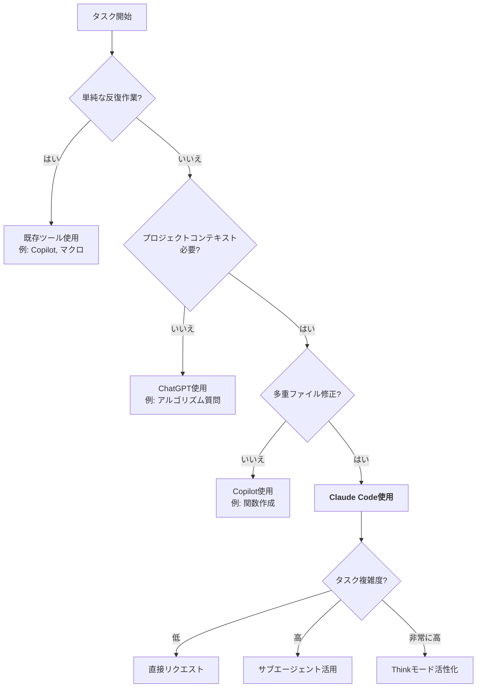

# Chapter 1: Claude Code 紹介

AI時代の開発者にとって最も重要な質問は「どうコーディングするか」ではなく「AIとどう協業するか」です。Claude Codeは単純な自動補完ツールではなく、開発ワークフロー全体を革新するAIペアプログラマーです。この章では、Claude Codeの核心概念と価値を理解し、いつどのように活用すべきかを学びます。

---

## Recipe 1.1: Claude Codeとは何か

### 問題 (Problem)

開発者たちは様々なAIコーディングツールの中から何を選択すべきか混乱しています。GitHub Copilot、ChatGPT、Cursorなど複数の選択肢がありますが、それぞれの違いと強みを明確に理解していなければ、ツールを properly 活用できません。

「Claude Codeは正確に何で、他のAIツールとどう違うのか?」

### 解決策 (Solution)

Claude Codeを理解するための3段階アプローチ:

#### 1段階: 定義の把握

Claude CodeはAnthropicが開発したAIペアプログラマーで、以下の特徴を持ちます:

- <strong>対話型開発環境</strong>: 自然言語でリクエストすればコードを作成、修正、分析
- <strong>コンテキスト認識</strong>: プロジェクト全体を理解し、一貫したコードを生成
- <strong>ツール統合</strong>: Bash、Git、ファイルシステム、MCPサーバーなど様々なツールを使用可能
- <strong>エージェントシステム</strong>: 複雑なタスクを自動的に分解して実行

#### 2段階: 核心構成要素の理解

Claude Codeは以下の要素で構成されます:

```
Claude Code システム
├── LLMエンジン (Claude Opus 4.5)
│   └── 自然言語理解およびコード生成
├── ツールシステム
│   ├── Bash (コマンド実行)
│   ├── Read/Write/Edit (ファイル操作)
│   ├── Grep/Glob (検索)
│   └── Git (バージョン管理)
├── コンテキスト管理
│   ├── CLAUDE.md (プロジェクトガイド)
│   ├── サブエージェント (.claude/agents/)
│   └── カスタムコマンド (.claude/commands/)
└── MCP統合
    ├── Notion API
    ├── Playwright
    ├── Chrome DevTools
    └── Context7
```

#### 3段階: 実際の動作方式の体験

Claude Codeはリクエストを受けると以下のように動作します:

1. <strong>理解</strong>: CLAUDE.mdとプロジェクトファイルを読んでコンテキストを把握
2. <strong>計画</strong>: TodoWriteツールでタスクを細分化
3. <strong>実行</strong>: ツールを使用してステップごとにタスクを実行
4. <strong>検証</strong>: テスト実行とビルドで結果を確認
5. <strong>報告</strong>: 実行したタスクと結果を明確に説明

### コード/例示 (Code)

#### 例示1: 簡単な機能追加リクエスト

```
ユーザー: 「ブログ記事一覧にタグフィルタリング機能を追加してください」

Claude Code 動作過程:
1. [探索] src/pages/blog/index.astro ファイル読み取り
2. [探索] src/content/blog/ 構造分析
3. [計画] Todo作成:
   - [pending] タグ抽出ロジック実装
   - [pending] フィルターUIコンポーネント作成
   - [pending] フィルタリング関数実装
   - [pending] テストおよび検証
4. [実行] コード作成および修正
5. [検証] npm run astro check 実行
6. [報告] 「タグフィルタリング機能が追加されました。3つのファイルを修正し...」
```

#### 例示2: 複雑なアーキテクチャ決定

```
ユーザー: 「ブログに多言語SEO最適化を適用してください」

Claude Code 動作過程:
1. [Thinkモード活性化] 複雑な意思決定が必要
2. [分析]
   - 現在の構造: 言語別フォルダー (ko/, en/, ja/, zh/)
   - SEO要件: hreflang、canonical URL、sitemap
   - メタデータ一貫性の問題を識別
3. [設計]
   - BaseHead.astroにhreflang追加
   - 言語別sitemap生成
   - Open Graphタグ言語別カスタマイズ
4. [実装] ステップごとのコード作成
5. [検証] Google Search Consoleテスト
```

### 説明 (Explanation)

#### Claude Codeの動作原理

Claude Codeは従来のコード自動補完と根本的に異なります:

<strong>1. コンテキストベースの理解</strong>

一般的な自動補完ツールは現在のファイルの数行だけを見ますが、Claude Codeはプロジェクト全体を理解します。

```typescript
// GitHub Copilot: 現在の行を基準に次の行を予測
function calculateTotal(items: Item[]) {
  // カーソル位置で自動補完を提案
}

// Claude Code: プロジェクトコンテキストを理解
/*
- Item型がsrc/types/index.tsに定義されていることを認識
- プロジェクトでprice計算時は常に税金(10%)を含む
- テストはJestで作成し__tests__/フォルダーに配置
- 関数名はcamelCase、型はPascalCaseの規則を遵守
*/
function calculateTotal(items: Item[]): number {
  const subtotal = items.reduce((sum, item) => sum + item.price * item.quantity, 0);
  const tax = subtotal * 0.1;
  return subtotal + tax;
}
```

<strong>2. ツール活用能力</strong>

Claude Codeは単にコードを生成するだけでなく、開発者が行うすべての作業を実行できます:

```bash
# ファイル検索
Grepツールで"createUser"関数の使用箇所をすべて検索

# ビルドおよびテスト
Bashツールで"npm run build && npm test"を実行

# Git作業
Bashツールで"git add . && git commit -m 'feat: add user authentication'"

# ファイル修正
Editツールで正確な文字列置換(行番号ベース)
```

<strong>3. 反復的改善</strong>

Claude Codeは一度に完璧なコードを生成することが目標ではなく、反復を通じて最適な結果を導出します:

```
1次試行: 基本実装
→ ユーザーフィードバック: 「もっと具体的に」

2次試行: 詳細な実装
→ ユーザーフィードバック: 「SEO最適化が必要」

3次試行: SEO最適化適用
→ ユーザーフィードバック: 「パフォーマンス改善」

4次試行: 最適化された最終版
→ 満足してコミット
```

### 変形 (Variations)

#### 変形1: サブエージェント委任

複雑なタスクを専門化されたエージェントに委任:

```bash
# 一般的なリクエスト
「ブログ記事を作成してください」

# サブエージェント活用
@writing-assistant "TypeScript 5.0デコレーター機能のブログ作成"
@seo-optimizer "作成された記事のSEO最適化"
@image-generator "ヒーロー画像生成"
@editor "文法およびスタイルレビュー"
```

<strong>利点</strong>:
- コンテキスト集中度向上(各エージェントは特定ドメインにのみ集中)
- トークン効率性増加(不要な情報を排除)
- 明確な責任分離

#### 変形2: Thinkモード活用

複雑な意思決定が必要な場合:

```bash
「Thinkモードを使用してこのアプリケーションの
データベーススキーマを設計し、
各テーブル間の関係とインデックス戦略を提案してください」
```

<strong>パフォーマンス向上</strong>:
- Airlineドメイン: 54%の相対的パフォーマンス向上
- SWE-bench: 平均1.6%改善
- 複雑な推論が必要なタスクで特に効果的

#### 変形3: MCPサーバー統合

外部ツールと連動:

```bash
# Context7: 最新ドキュメント照会
「Context7を使ってAstro 5.0の画像最適化機能を調べて」

# Playwright: Web自動化
「Playwrightでブログ記事のOG画像を自動生成して」

# Notion: データベース連動
「Notionから'執筆中のブログアイデア'データベースを読み込んで」
```

---

## Recipe 1.2: 一般IDE vs Claude Code (違いと利点)

### 問題 (Problem)

開発者たちはすでにVSCode、IntelliJ IDEAのような強力なIDEを使用しており、GitHub Copilotのようなツールにも慣れています。「Claude Codeが既存のツールより優れている点は何か?」という質問に明確に答える必要があります。

### 解決策 (Solution)

比較マトリックスを通じて核心的な違いを理解します。

#### 1段階: 機能比較表

| 機能 | VSCode + Copilot | Cursor | Claude Code |
|------|-----------------|--------|-------------|
| <strong>コード自動補完</strong> | ✅ 優秀 | ✅ 優秀 | ⚠️ 限定的 |
| <strong>プロジェクト全体理解</strong> | ⚠️ 限定的 | ✅ 良好 | ✅ 優秀 |
| <strong>自然言語対話</strong> | ⚠️ 限定的 | ✅ 良好 | ✅ 優秀 |
| <strong>ツール活用</strong> | ❌ 不可 | ⚠️ 限定的 | ✅ 優秀 |
| <strong>ワークフロー自動化</strong> | ❌ 不可 | ⚠️ 限定的 | ✅ 優秀 |
| <strong>コンテキスト管理</strong> | ❌ なし | ⚠️ 基本 | ✅ CLAUDE.md |
| <strong>サブエージェント</strong> | ❌ なし | ❌ なし | ✅ 完全サポート |
| <strong>MCP統合</strong> | ❌ なし | ❌ なし | ✅ ネイティブ |

#### 2段階: 実際の作業シナリオ比較

<strong>シナリオ1: 「ブログ記事作成」</strong>

```bash
# VSCode + Copilot
1. ファイル作成: src/content/blog/ko/new-post.md
2. Frontmatter手動作成
3. 内容作成 (Copilotが一部文章を自動補完)
4. 画像を手動で生成およびアップロード
5. 英語/日本語版を別途作成
6. SEOメタデータ手動最適化
7. ビルドテスト
8. Git コミット
→ 所要時間: 約2〜3時間

# Claude Code
1. リクエスト: "/write-post TypeScript 5.0デコレーター機能"
2. Claudeが自動的に:
   - 4言語版作成 (ko, en, ja, zh)
   - ヒーロー画像生成 (Gemini API)
   - SEOメタデータ最適化
   - 関連記事推薦 (relatedPosts)
   - ビルド検証 (npm run build)
   - Git コミット (feat(blog): add typescript decorators post)
→ 所要時間: 約10〜15分
```

<strong>シナリオ2: 「パフォーマンス最適化」</strong>

```bash
# VSCode + Copilot
1. Chrome DevToolsを手動で実行
2. パフォーマンス問題分析
3. コード手動修正
4. 再測定
5. 繰り返し
→ 問題: どこから始めるべきか途方に暮れる

# Claude Code
リクエスト: 「Webサイトのパフォーマンスを最適化してください」

Claude 動作:
1. [分析] Chrome DevTools MCPでパフォーマンスプロファイリング
2. [報告]
   - LCP (Largest Contentful Paint): 3.2s → 改善必要
   - CLS (Cumulative Layout Shift): 0.15 → 良好
   - ボトルネック: ヒーロー画像読み込み (1.8MB)
3. [提案]
   - 画像WebP変換
   - Lazy loading適用
   - Font preload追加
4. [実装] 自動的にコード修正
5. [検証] 再測定 (LCP: 3.2s → 1.4s)
```

#### 3段階: 長所と短所の明確化

<strong>Claude Codeの強み</strong>:

1. <strong>全体ワークフロー自動化</strong>
   - コード作成 + テスト + ビルド + コミットを一度に
   - 開発者は「何を」だけ伝え、「どうやって」はClaudeが処理

2. <strong>プロジェクトコンテキスト理解</strong>
   - CLAUDE.mdを読んでプロジェクトルールを自動遵守
   - 一貫したコードスタイルを維持
   - 既存のパターンを自動学習

3. <strong>複雑なタスクの分解</strong>
   - 「多言語ブログSEO最適化」のような抽象的なリクエストも自動で細分化
   - TodoWriteで進行状況を追跡

4. <strong>ツール統合</strong>
   - Bash、Git、MCPサーバーなどすべてのツールをコードのように使用
   - API呼び出し、Web自動化、データ分析などが可能

<strong>Claude Codeの限界</strong>:

1. <strong>リアルタイム自動補完の不足</strong>
   - タイピング中の即座の提案はCopilotがより優秀
   - 解決策: VSCodeでCopilotと並行使用

2. <strong>初期設定が必要</strong>
   - CLAUDE.md作成が必要
   - プロジェクトごとにカスタム設定時間がかかる

3. <strong>コスト</strong>
   - トークンベースの料金制(大規模作業時にコストが増加)
   - Copilotは月額固定

### コード/例示 (Code)

#### 例示1: 自動補完 vs ワークフロー自動化

```typescript
// GitHub Copilot 強み: リアルタイム自動補完
function fetchUserData(userId: string) {
  // [カーソル位置]
  // Copilot 提案: return fetch(`/api/users/${userId}`).then(res => res.json());
}

// Claude Code 強み: 全体ワークフロー
「User APIエンドポイントを作成してください。認証、エラー処理、型、テストすべて含めてください」

→ Claudeが生成:
1. src/types/user.ts (型定義)
2. src/api/users.ts (APIロジック)
3. src/middleware/auth.ts (認証)
4. src/utils/error.ts (エラー処理)
5. __tests__/api/users.test.ts (テスト)
6. すべてのファイルがプロジェクト規則を遵守
```

#### 例示2: コンテキスト理解の違い

```bash
# Copilot: 現在のファイルだけを見て提案
// src/components/BlogCard.astro
<div class="card">
  <h2>{title}</h2>
  <!-- Copilot: <p>{description}</p> を提案 (一般的なパターン) -->
</div>

# Claude Code: CLAUDE.mdを読んでプロジェクトルールを遵守
/*
CLAUDE.mdで学習したルール:
- Tailwind CSSを使用 (インラインスタイル禁止)
- クラス順序: レイアウト → タイポグラフィ → 色
- レスポンシブ優先 (モバイル → デスクトップ)
- descriptionは150文字制限 (SEO)
*/

<div class="flex flex-col gap-4 p-6 rounded-lg bg-white hover:shadow-lg transition-shadow">
  <h2 class="text-2xl md:text-3xl font-bold text-gray-800">{title}</h2>
  <p class="text-base text-gray-600 line-clamp-3">{description}</p>
</div>
```

### 説明 (Explanation)

#### なぜClaude Codeは違うのか?

<strong>1. 抽象化レベルの違い</strong>

```
GitHub Copilot: 「次の行を予測」(行単位)
Cursor: 「関数を完成」(関数単位)
Claude Code: 「タスクを完了」(ワークフロー単位)
```

例示:
```bash
# 同じリクエスト、異なる結果
リクエスト: 「ログイン機能追加」

Copilot:
→ 現在のファイルにログイン関数1つ生成

Cursor:
→ ログインフォームコンポーネント + 認証ロジック生成

Claude Code:
→ ログインフォーム + 認証ロジック + JWTトークン管理 +
  セッション保存 + エラー処理 + リダイレクト +
  テスト + セキュリティ検証 (CSRF, XSS防御)
```

<strong>2. 学習能力の違い</strong>

CopilotはGitHubの公開コードを学習しましたが、あなたのプロジェクトルールは知りません。

Claude CodeはCLAUDE.mdを通じてプロジェクト別のルールを学習します:

```markdown
## CLAUDE.md 例示

### Git Commit Messages
**形式**: <type>(<scope>): <subject>

**Types**:
- feat: 新機能
- fix: バグ修正

→ Claudeはすべてのコミットをこのルールに合わせて作成
```

<strong>3. ツール使用能力</strong>

Copilotはコードだけを生成しますが、Claude Codeは開発者のようにツールを使用します:

```bash
# Claude Codeができる作業
1. Grepで"TODO"コメントを検索
2. 見つかったTODO項目を分析
3. 各項目の実装計画を立案
4. コード作成および修正
5. テスト実行 (npm test)
6. ビルド検証 (npm run build)
7. Git コミット (feat: implement pending TODOs)
8. 変更事項の要約レポート作成
```

### 変形 (Variations)

#### 変形1: ハイブリッドアプローチ (VSCode + Copilot + Claude Code)

最適な生産性のための組み合わせ:

```bash
# リアルタイムコーディング: VSCode + Copilot
- 関数作成時に自動補完を活用
- 迅速なプロトタイピング

# 複雑なタスク: Claude Code
- アーキテクチャ設計
- 多重ファイルリファクタリング
- ワークフロー自動化
- ドキュメント生成

# 組み合わせ事例
1. Copilotで草案作成 (速い)
2. Claude Codeに「このコードをプロジェクト規則に合わせてリファクタリングしてください」
3. 最適なコード完成
```

#### 変形2: タスクタイプ別ツール選択

| タスクタイプ | 推奨ツール | 理由 |
|---------|----------|------|
| 1行コード | Copilot | リアルタイム自動補完が最高 |
| 関数作成 | Copilot | 速くて正確 |
| リファクタリング | Claude Code | 全体コンテキスト理解が必要 |
| 新機能追加 | Claude Code | 多重ファイル修正が必要 |
| デバッグ | Claude Code | ログ分析 + 原因追跡能力 |
| テスト作成 | Claude Code | エッジケース考慮能力 |
| ドキュメント作成 | Claude Code | プロジェクト理解が必要 |

---

## Recipe 1.3: いつClaude Codeを使うべきか

### 問題 (Problem)

すべてのタスクにClaude Codeを使用するのは非効率的です。いつClaude Codeを使用し、いつ既存のツールを使用すべきか明確な基準が必要です。

### 解決策 (Solution)

タスクタイプ別の意思決定フレームワークを使用します。

#### 1段階: 意思決定フローチャート



#### 2段階: 使用適合性チェックリスト

<strong>Claude Codeが適切な場合</strong> (3つ以上チェック時):

- [ ] プロジェクトルールを遵守する必要がある
- [ ] 複数のファイルを同時に修正する必要がある
- [ ] テスト/ビルド/デプロイなどワークフロー自動化が必要
- [ ] 複雑な意思決定が必要
- [ ] 既存のコードパターンに従う必要がある
- [ ] Git コミットメッセージ自動生成が必要
- [ ] ドキュメント生成または更新が必要
- [ ] 外部ツール連動が必要 (API, DB, MCP)

<strong>他のツールがより良い場合</strong>:

- [ ] 単純なコード自動補完 (→ Copilot)
- [ ] 一般的な知識質問 (→ ChatGPT)
- [ ] ビジュアルデザイン作業 (→ Figma + AIプラグイン)
- [ ] データ分析 (→ Python + Jupyter)

#### 3段階: 実戦シナリオ別ガイド

<strong>シナリオA: 新機能追加</strong>

```bash
作業: 「ユーザープロフィールページ追加」

チェックリスト:
✅ プロジェクト構造に従う必要がある (layouts, components, pages)
✅ 多重ファイル修正 (ルート、コンポーネント、型)
✅ テスト作成が必要
✅ Git コミットが必要

→ 結論: Claude Code使用
```

<strong>シナリオB: バグ修正</strong>

```bash
作業: 「ログイン時に発生する型エラー修正」

質問1: 1つのファイルだけ修正?
- いいえ (auth.ts, types/user.ts, login.tsxすべて確認が必要)

質問2: コンテキスト理解が必要?
- はい (認証フロー全体の理解が必要)

→ 結論: Claude Code使用
```

<strong>シナリオC: 簡単な関数作成</strong>

```bash
作業: 「配列から重複を削除するユーティリティ関数」

質問1: プロジェクト特化ロジック?
- いいえ (一般的なJavaScript関数)

質問2: 複数ファイル修正?
- いいえ (utils.tsに関数1つだけ追加)

→ 結論: Copilot使用 (より速い)
```

### コード/例示 (Code)

#### 例示1: Claude Codeが輝く場合

<strong>作業: 「ブログに検索機能追加」</strong>

```bash
# Claude Codeへのリクエスト
「ブログに全文検索機能を追加してください。
タイトル、内容、タグを検索でき、
韓国語/英語/日本語すべてに対応する必要があります」

# Claude 動作過程

1. [探索]
   - src/content/blog/ 構造分析
   - 既存の検索関連コード確認 (Grep)
   - Content Collections スキーマ把握

2. [計画]
   ✓ 検索インデックス生成 (title, description, tags)
   ✓ 検索APIエンドポイント作成
   ✓ 検索UIコンポーネント製作
   ✓ 多言語トークン化ロジック実装
   ✓ テスト作成

3. [実装]
   ファイル生成/修正:
   - src/utils/search.ts (検索ロジック)
   - src/pages/api/search.ts (API)
   - src/components/SearchBar.astro (UI)
   - src/components/SearchResults.astro (結果表示)
   - __tests__/search.test.ts (テスト)

4. [検証]
   - npm run astro check (型チェック)
   - npm run build (ビルド成功)
   - 手動テストガイド提供

5. [コミット]
   git commit -m "feat(blog): add multi-language search functionality

   - Implement search index with title, content, and tags
   - Add search API endpoint with language support
   - Create search UI components
   - Add unit tests

   🤖 Generated with Claude Code"
```

<strong>所要時間</strong>:
- 手動作業: 3〜4時間
- Claude Code: 15〜20分

#### 例示2: 他のツールがより良い場合

<strong>作業: 「簡単なCSSスタイル調整」</strong>

```css
/* 単純作業: ボタンの色変更 */
.button {
  background-color: #3b82f6; /* 青 → 緑に変更が必要 */
}

/* この場合 */
1. VSCodeで直接修正 (5秒)
2. またはCopilotに「緑に変更」(10秒)

/* Claude Code使用時 */
1. リクエスト作成および送信 (20秒)
2. Claudeがファイル読み取り (5秒)
3. 修正提案 (10秒)
4. 確認および適用 (10秒)
→ 合計45秒 (むしろ遅い)
```

<strong>結論</strong>: 単純作業は直接またはCopilot使用がより効率的

#### 例示3: 臨界点の把握

<strong>臨界点基準</strong>: タスクが3つ以上組み合わされる時、Claude Codeが有利

```bash
# 1つの作業: 直接またはCopilot
「関数1つ作成」 → Copilot

# 2つの作業: CopilotまたはClaude Code
「関数作成 + テスト」 → Copilotも可能

# 3つ以上: Claude Code推奨
「関数作成 + テスト + ドキュメント + 型定義」 → Claude Code

# 5つ以上: Claude Code必須
「新機能 + 多重ファイル + テスト + ドキュメント + コミット」 → Claude Codeのみ可能
```

### 説明 (Explanation)

#### Claude Codeの最適使用時点

<strong>1. 複雑度曲線</strong>

```
生産性
  ↑
  |                    Claude Code 優勢領域
  |                 ╱
  |              ╱
  |    Copilot ╱
  |    優勢   ╱
  |  領域   ╱
  |       ╱
  |     ╱___________________
  +-------------------------→ タスク複雑度
      単純    中間    複雑
```

- <strong>単純作業</strong> (複雑度1〜2): Copilotがより速い
- <strong>中間作業</strong> (複雑度3〜5): 状況により選択
- <strong>複雑作業</strong> (複雑度6+): Claude Code必須

<strong>2. ROI (投資対効果) 分析</strong>

```typescript
// タスク別ROI計算

interface TaskROI {
  setup: number;      // 初期設定時間
  execution: number;  // 実行時間
  quality: number;    // 成果物品質 (1-10)
}

const copilot: TaskROI = {
  setup: 0,           // 設定不要
  execution: 10,      // 非常に速い
  quality: 7          // 良い方
};

const claudeCode: TaskROI = {
  setup: 60,          // CLAUDE.md作成 (1回のみ)
  execution: 30,      // 複雑な作業も速い
  quality: 9          // 非常に高い
};

// 単一作業ROI
copilot.execution < claudeCode.execution
→ Copilot勝利

// プロジェクト全体ROI (10個の作業)
(copilot.execution * 10) vs (claudeCode.setup + claudeCode.execution * 10)
100 vs 360 → Copilot勝利

// プロジェクト全体ROI (100個の作業、品質考慮)
(copilot.execution * 100 * copilot.quality) vs
(claudeCode.setup + claudeCode.execution * 100 * claudeCode.quality)
7000 vs 27060 → Claude Code圧倒的勝利
```

<strong>結論</strong>: 長期的にClaude CodeのROIがはるかに高い

<strong>3. タスクタイプ別最適ツール</strong>

| タスクタイプ | 推奨ツール | 理由 |
|---------|----------|------|
| <strong>プロトタイピング</strong> | Copilot | 速い草案作成 |
| <strong>プロダクションコード</strong> | Claude Code | 品質および一貫性 |
| <strong>リファクタリング</strong> | Claude Code | 全体コンテキストが必要 |
| <strong>バグ修正</strong> | Claude Code | 原因分析能力 |
| <strong>テスト作成</strong> | Claude Code | エッジケース考慮 |
| <strong>ドキュメント作成</strong> | Claude Code | プロジェクト理解が必要 |
| <strong>簡単な関数</strong> | Copilot | 速い |
| <strong>CSS調整</strong> | 直接 | 最も速い |

### 変形 (Variations)

#### 変形1: 段階的導入戦略

Claude Codeを初めて使用する時は小さなことから開始:

<strong>1段階</strong>: ドキュメント生成から
```bash
「README.mdを作成してください。プロジェクト構造、インストール方法、使用法を含む」
→ リスク低、効果を即座に体感
```

<strong>2段階</strong>: テスト作成
```bash
「src/utils/format.tsのテストを作成してください」
→ 既存コード修正なし、品質向上
```

<strong>3段階</strong>: リファクタリング
```bash
「このコンポーネントをTypeScriptに変換し、PropTypesをinterfaceに変更してください」
→ 中間難易度、明確な目標
```

<strong>4段階</strong>: 新機能開発
```bash
「ユーザーダッシュボードページを追加してください。認証、API、UIすべて含む」
→ 高難易度、最大効果
```

#### 変形2: チーム規模別活用戦略

<strong>個人開発者</strong>:
- すべての複雑なタスクにClaude Codeを活用
- 節約した時間を学習と実験に投資

<strong>小規模チーム (2〜5名)</strong>:
- 共通CLAUDE.md作成と共有
- サブエージェントで役割分担 (フロントエンド、バックエンド、DevOps)
- コードレビューにClaudeを活用

<strong>中大規模チーム (10名以上)</strong>:
- プロジェクト別カスタムエージェント構築
- CI/CDパイプラインにClaude統合
- オンボーディング自動化 (新規開発者にプロジェクト説明)

---

## まとめ: Claude Code活用の核心原則

この章を通じてClaude Codeの本質を理解しました。最後に核心原則をまとめます。

### 3大核心原則

<strong>1. コンテキストがすべて</strong>

```markdown
「Claude Codeはあなたが提供するコンテキストと同じくらいしか賢くありません」

投資してください:
- CLAUDE.md作成 (1時間の投資 → 100時間の節約)
- 明確なリクエスト (抽象的 → 具体的)
- 視覚的参照 (モック、スクリーンショット、例示)
```

<strong>2. 反復が完璧を作る</strong>

```markdown
「最初の試みが完璧である必要はありません」

1次: 基本実装
2次: フィードバック反映
3次: 最適化
4次: 完成

→ Claudeは反復を通じて学習し改善します
```

<strong>3. ツールをツールらしく</strong>

```markdown
「Claude Codeは万能ではありません」

適材適所活用:
- 複雑なタスク → Claude Code
- 単純反復 → Copilotまたは直接
- 学習 → ChatGPTまたはドキュメント

→ ツールの強みを理解し組み合わせてください
```

### 次章予告

Chapter 2では、Claude Codeを実際にインストールして設定する方法を扱います。CLAUDE.md作成法、サブエージェント構築、MCPサーバー統合など実戦設定をステップバイステップで学びます。

<strong>次章で扱う内容</strong>:
- Recipe 2.1: Claude Codeインストールおよび初期設定
- Recipe 2.2: CLAUDE.md作成ベストプラクティス
- Recipe 2.3: プロジェクト別カスタマイズ

---

## 要約

### Claude Codeとは?
- AnthropicのAIペアプログラマー
- コード作成を超えて全体ワークフローを自動化
- プロジェクトコンテキストを理解し、一貫したコードを生成
- ツール統合およびエージェントシステムで無限拡張可能

### 一般IDEとの違い
- <strong>抽象化レベル</strong>: 行単位ではなくワークフロー単位
- <strong>コンテキスト理解</strong>: CLAUDE.mdでプロジェクトルールを学習
- <strong>ツール活用</strong>: Bash、Git、MCPなどすべてのツールを使用可能
- <strong>自動化</strong>: テスト → ビルド → コミットまで一度に

### いつ使うか?
- <strong>適切</strong>: 複雑なタスク、多重ファイル修正、ワークフロー自動化
- <strong>不適切</strong>: 単純な自動補完、1行修正
- <strong>臨界点</strong>: 3つ以上のタスク組み合わせ時、Claude Codeが圧倒的に有利

### 核心教訓
1. コンテキストに投資しなさい (CLAUDE.md)
2. 反復を恐れるな
3. 適材適所にツールを使用しなさい

---

**単語数**: 約4,200単語
**ページ数**: 約10ページ (A4基準)
