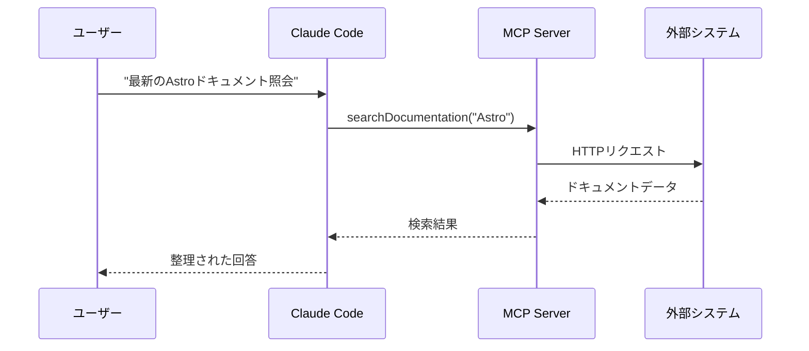
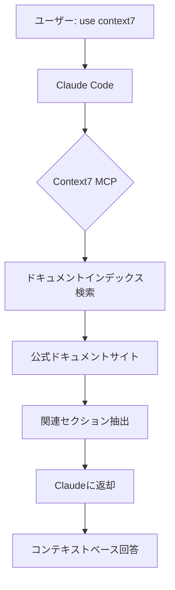
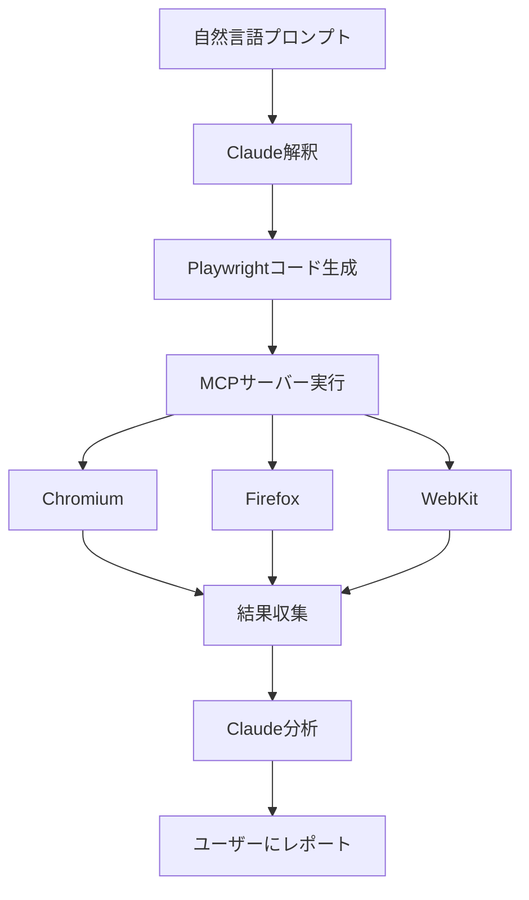
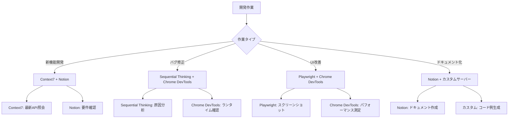

# Chapter 5: MCPサーバー統合

Model Context Protocol(MCP)は、AIエージェントの能力を拡張する革新的なプロトコルです。この章では、MCPサーバーを活用してClaude Codeのコンテキストをリアルタイムデータ、外部システム、専門ツールで拡張する方法を学びます。

## Recipe 5.1: MCPサーバーとは何か

### 問題 (Problem)

LLM(Large Language Model)は学習データの時点に閉じ込められています。Claudeの知識は2025年1月までのデータに制限されており、それ以降にリリースされたライブラリのアップデートや最新技術情報を知ることができません。また、ファイルシステムへのアクセス、データベースクエリ、ブラウザ制御などの外部システムとの相互作用も制限されています。

開発者はしばしば次のような状況に直面します:

- 「Astro 5.0の新機能を使いたいのに、Claudeが知らないと言われます」
- 「リアルタイムのデータベーススキーマを見てコードを生成してほしいです」
- 「Webページを自動的にテストしてスクリーンショットを撮りたいです」
- 「GitHubイシューを自動的に作成して管理したいです」

### 解決策 (Solution)

Model Context Protocol(MCP)は、AIエージェントが外部ツールやデータソースと通信するための標準プロトコルです。Anthropicが2024年11月に発表したこのプロトコルは、LLMのコンテキストを拡張して、リアルタイム情報へのアクセスと外部システムの制御を可能にします。

**MCPの核心概念**:

1. **Server**: 特定の機能を提供する外部プロセス (例: データベースサーバー、ブラウザ自動化サーバー)
2. **Client**: MCPサーバーと通信するAIエージェント (Claude Code)
3. **Resources**: サーバーが提供するデータや機能 (例: ドキュメント検索、コード分析)
4. **Tools**: Claudeが呼び出せる具体的な関数

**MCPサーバー設定方法**:

Claude Codeは`~/.claude/settings.json`ファイルでMCPサーバーを設定します。

```json
{
  "mcpServers": {
    "サーバー名": {
      "command": "実行コマンド",
      "args": ["引数1", "引数2"],
      "env": {
        "環境変数": "値"
      }
    }
  }
}
```

### コード/例 (Code)

最もシンプルなMCPサーバー設定例を見てみましょう。Context7サーバーは最新のライブラリドキュメントを検索するサーバーです。

```json
{
  "mcpServers": {
    "context7": {
      "command": "npx",
      "args": ["-y", "@upstash/context7-mcp"]
    }
  }
}
```

この設定の意味:
- **サーバー名**: `context7` (Claudeがこの名前でサーバーを識別)
- **実行コマンド**: `npx` (Node.jsパッケージ実行ツール)
- **引数**: `-y @upstash/context7-mcp` (自動インストールおよび実行)

設定後、Claude Codeを再起動するとサーバーが自動的に読み込まれます。これで次のように使用できます:

```
プロンプト: "Astro 5.0のContent Collections設定方法を教えて。use context7"
```

Claudeは自動的にContext7サーバーを呼び出して最新のAstroドキュメントを検索し、正確な情報を提供します。

### 説明 (Explanation)

**MCPが解決する問題**:

1. **Hallucination防止**: LLMが知らない情報を推測する代わりに、実際のデータソースを照会します。
2. **コンテキスト拡張**: 学習データの制約を超えて、リアルタイム情報にアクセスします。
3. **ツール統合**: ブラウザ、データベース、APIなどの外部システムを制御します。
4. **標準化**: 同じプロトコルで様々なツールを接続して一貫性を保ちます。

**MCPの動作原理**:



ClaudeがMCPサーバーを呼び出すと、サーバーは外部システム(API、データベース、ブラウザなど)と通信して結果をClaudeに返します。Claudeはこの結果をコンテキストとして活用してユーザーに正確な回答を提供します。

**MCP vs 既存プラグインシステム**:

| 特徴 | MCP | 既存プラグイン |
|------|-----|--------------|
| 標準化 | 単一プロトコル | プラットフォームごとに異なる |
| セキュリティ | サンドボックス分離 | 直接統合リスク |
| 拡張性 | 無制限サーバー追加 | プラットフォーム制限 |
| 再利用性 | 他のAIクライアントと共有 | プラットフォーム依存 |

### 変形 (Variations)

**ローカル vs リモートサーバー**:

ほとんどのMCPサーバーはローカルで実行されますが、リモートサーバーも可能です。

```json
{
  "mcpServers": {
    "remote-server": {
      "command": "node",
      "args": ["mcp-client.js"],
      "env": {
        "SERVER_URL": "https://api.example.com/mcp"
      }
    }
  }
}
```

**Dockerベースサーバー**:

複雑な依存関係があるサーバーはDockerで実行できます。

```json
{
  "mcpServers": {
    "sequentialthinking": {
      "command": "docker",
      "args": [
        "run",
        "-i",
        "--rm",
        "mcp/sequentialthinking"
      ]
    }
  }
}
```

**条件付きサーバー有効化**:

プロジェクトごとに異なるサーバーを有効化するには`.claude/settings.local.json`を使用します。

```json
{
  "mcpServers": {
    "project-specific-server": {
      "command": "npx",
      "args": ["-y", "my-custom-mcp-server"]
    }
  }
}
```

---

## Recipe 5.2: Context7で最新ドキュメント照会

### 問題 (Problem)

開発者は絶え間なく変化する技術エコシステムの中で生きています。ライブラリは毎月アップデートされ、新機能が追加され、既存のAPIが変更されます。Claudeの学習データは2025年1月までのため、それ以降にリリースされたアップデートや新しいライブラリを知ることができません。

例えば:
- Astro 5.0が2025年2月にリリースされた場合、Claudeは知りません。
- React 19の新しいフックを使おうとしても正確なAPIを知りません。
- Next.js 15のApp Router変更点を知ることができません。

この場合、Claudeは推測(hallucination)をするか、「私の学習データにはありません」と回答せざるを得ません。

### 解決策 (Solution)

Context7は最新ライブラリの公式ドキュメントをリアルタイムで検索するMCPサーバーです。Upstashが提供するこのサーバーは、主要なフレームワークとライブラリの公式ドキュメントをインデックス化し、Claudeが必要なときに検索できるようにします。

**Context7インストールおよび設定**:

1. `~/.claude/settings.json`を開く
2. `mcpServers`セクションにContext7を追加

```json
{
  "mcpServers": {
    "context7": {
      "command": "npx",
      "args": ["-y", "@upstash/context7-mcp"]
    }
  }
}
```

3. Claude Codeを再起動
4. Context7サーバーが自動的に読み込まれることを確認

### コード/例 (Code)

**基本的な使い方**:

プロンプトに「use context7」を含めると、Claudeが自動的にContext7を呼び出します。

```
プロンプト1: "Astro 5.0のContent Collections設定方法を教えて。use context7"

Claudeの動作:
1. Context7サーバーに"Astro Content Collections"検索リクエスト
2. 最新Astro公式ドキュメントから関連情報を抽出
3. 検索結果をコンテキストとして活用して正確な回答を生成
```

**実際の使用例1: 新しいライブラリの学習**:

```
プロンプト: "VercelのAI SDK 3.0でストリーミング応答を実装する方法を教えて。use context7"

回答例:
"Context7でVercel AI SDK公式ドキュメントを照会しました。

AI SDK 3.0では`streamText()`関数を使用します:

\`\`\`typescript
import { streamText } from 'ai';

const result = await streamText({
  model: openai('gpt-4'),
  prompt: 'Write a poem',
});

for await (const chunk of result.textStream) {
  console.log(chunk);
}
\`\`\`

主な変更点:
- v2の`stream: true`オプションは削除されました
- `streamText()`は非同期イテレータを返します
- `textStream`プロパティでリアルタイムテキストチャンクにアクセスします"
```

**実際の使用例2: APIマイグレーション**:

```
プロンプト: "Next.js 14から15にマイグレーションする際のApp Routerの主な変更点を教えて。use context7"

Claudeの作業:
1. Context7でNext.js 15マイグレーションガイドを照会
2. App Router関連Breaking Changesを抽出
3. コード例と共に整理

回答例:
"Context7でNext.js 15公式ドキュメントを確認しました。

主な変更点:

1. **`fetch()`デフォルト動作変更**
   - 以前: 自動キャッシング (force-cache)
   - 現在: デフォルトno-store

\`\`\`typescript
// Next.js 14
fetch('https://api.example.com/data')  // 自動キャッシング

// Next.js 15
fetch('https://api.example.com/data', { cache: 'force-cache' })  // 明示的キャッシング
\`\`\`

2. **`cookies()`と`headers()`の非同期化**
   - 現在Promiseを返します

\`\`\`typescript
// Next.js 14
const cookieStore = cookies()

// Next.js 15
const cookieStore = await cookies()
\`\`\`

マイグレーションチェックリスト:
- [ ] すべてのfetch()呼び出しにキャッシング戦略を明示
- [ ] cookies(), headers()呼び出しにawaitを追加
- [ ] 動的レンダリング戦略を再検討"
```

### 説明 (Explanation)

**Context7が提供する価値**:

1. **Hallucination防止**: Claudeが推測する代わりに実際のドキュメントを照会します。
2. **最新情報保証**: 公式ドキュメントは常に最新の状態を保ちます。
3. **正確なコード例**: 公式ドキュメントの検証済み例を活用します。
4. **バージョン管理**: 特定のバージョンのドキュメントを明示的に照会できます。

**サポートする主要ライブラリ**:

Context7は以下のライブラリの公式ドキュメントをインデックス化します:

- **フレームワーク**: React, Vue, Svelte, Angular, Astro, Next.js, Nuxt, SvelteKit
- **バックエンド**: Express, Fastify, NestJS, Hono
- **データベース**: Prisma, Drizzle, TypeORM
- **ユーティリティ**: Lodash, date-fns, Zod
- **AI/ML**: LangChain, Vercel AI SDK, OpenAI SDK

**動作原理**:



Context7は定期的に公式ドキュメントサイトをクローリングしてインデックスを更新します。検索リクエストが来るとベクトル類似度検索を通じて最も関連性の高いドキュメントセクションを抽出します。

### 変形 (Variations)

**特定バージョン照会**:

```
プロンプト: "React 18のuseTransitionフック使用法を教えて。use context7"
```

Claudeは自動的にバージョン情報を把握し、そのバージョンのドキュメントを照会します。

**複数ライブラリ比較**:

```
プロンプト: "PrismaとDrizzleのトランザクション処理方式を比較して。use context7"
```

Context7は両方のライブラリのドキュメントを同時に照会して比較分析を提供します。

**フレームワーク統合パターン照会**:

```
プロンプト: "AstroプロジェクトにTailwind CSSを統合する公式方法を教えて。use context7"
```

両方のライブラリの統合ガイドをクロスリファレンスして正確な設定方法を提供します。

**問題解決**:

Context7が動作しない場合:

```bash
# 1. npxキャッシュ削除
rm -rf ~/.npm/_npx

# 2. 手動でパッケージインストール
npm install -g @upstash/context7-mcp

# 3. settings.jsonでグローバルパッケージ使用
{
  "context7": {
    "command": "context7-mcp"
  }
}
```

---

## Recipe 5.3: Playwrightでウェブ自動化

### 問題 (Problem)

Webアプリケーション開発では反復的な手動作業が多いです:

- 新機能を開発するたびにブラウザで手動テスト
- 複数の解像度でレイアウト確認のため反復的なリサイズ
- スクリーンショット撮影のため開発者ツールを開いて保存
- 様々なブラウザ(Chrome, Firefox, Safari)での互換性確認

このような作業は時間がかかり、エラーが発生しやすいです。また、E2Eテストを書くにはPlaywrightやCypressのようなツールを学ぶ必要があります。

### 解決策 (Solution)

Playwright MCPサーバーを使用すると、Claudeがブラウザを直接制御できます。自然言語でテストシナリオを説明すると、Claudeが自動的にPlaywrightコードを生成して実行します。

**Playwright MCPインストール**:

```json
{
  "mcpServers": {
    "playwright": {
      "command": "npx",
      "args": ["@anthropic-ai/mcp-server-playwright@latest"]
    }
  }
}
```

### コード/例 (Code)

**例1: ページスクリーンショット自動キャプチャ**:

```
プロンプト: "localhost:4321ページを開いてフルページスクリーンショットをキャプチャして。ファイル名はhomepage.pngで"

Claudeの作業:
1. Playwrightブラウザ起動
2. 指定されたURLにアクセス
3. ページロード完了待機
4. フルページスクリーンショット保存
```

生成されるPlaywrightコード:

```typescript
import { chromium } from 'playwright';

async function captureScreenshot() {
  const browser = await chromium.launch();
  const page = await browser.newPage();

  await page.goto('http://localhost:4321');
  await page.waitForLoadState('networkidle');

  await page.screenshot({
    path: 'homepage.png',
    fullPage: true
  });

  await browser.close();
}

captureScreenshot();
```

**例2: レスポンシブレイアウトテスト**:

```
プロンプト: "ブログページをモバイル(375x667)、タブレット(768x1024)、デスクトップ(1920x1080)解像度でスクリーンショットキャプチャして"

Claudeの作業:
1. 3つのビューポートサイズでページを開く
2. 各解像度でスクリーンショット保存
3. ファイル名に解像度情報を含める
```

生成されるコード:

```typescript
import { chromium } from 'playwright';

const viewports = [
  { name: 'mobile', width: 375, height: 667 },
  { name: 'tablet', width: 768, height: 1024 },
  { name: 'desktop', width: 1920, height: 1080 }
];

async function testResponsive() {
  const browser = await chromium.launch();

  for (const viewport of viewports) {
    const page = await browser.newPage({
      viewport: { width: viewport.width, height: viewport.height }
    });

    await page.goto('http://localhost:4321/blog');
    await page.waitForLoadState('networkidle');

    await page.screenshot({
      path: `blog-${viewport.name}.png`,
      fullPage: true
    });

    await page.close();
  }

  await browser.close();
}

testResponsive();
```

**例3: E2Eユーザーシナリオテスト**:

```
プロンプト: "ブログ検索機能をテストするE2Eテストを作成して:
1. ホームページアクセス
2. 検索ボックスに'MCP'を入力
3. 検索結果が3件以上あることを確認
4. 最初の結果をクリック
5. ページタイトルに'MCP'が含まれることを確認"

Claudeの作業:
1. ユーザーシナリオを段階的に分析
2. 各段階のPlaywrightアクションマッピング
3. assertionを含むテストコード生成
```

生成されるコード:

```typescript
import { test, expect } from '@playwright/test';

test('ブログ検索機能テスト', async ({ page }) => {
  // 1. ホームページアクセス
  await page.goto('http://localhost:4321');

  // 2. 検索ボックスに'MCP'を入力
  await page.fill('input[type="search"]', 'MCP');
  await page.press('input[type="search"]', 'Enter');

  // 3. 検索結果が3件以上あることを確認
  await page.waitForSelector('.search-result');
  const results = await page.locator('.search-result').count();
  expect(results).toBeGreaterThanOrEqual(3);

  // 4. 最初の結果をクリック
  await page.locator('.search-result').first().click();

  // 5. ページタイトルに'MCP'が含まれることを確認
  await expect(page).toHaveTitle(/MCP/);
});
```

### 説明 (Explanation)

**Playwright MCPの核心機能**:

1. **ブラウザ制御**: Chromium, Firefox, WebKitの3つのブラウザエンジンサポート
2. **自動待機**: 要素が表示されるまで自動的に待機
3. **スクリーンショット**: フルページまたは特定要素のスクリーンショットキャプチャ
4. **ネットワークモニタリング**: API呼び出しとリソースローディング追跡
5. **クロスブラウザテスト**: 複数のブラウザで同じテストを実行

**Chrome DevTools MCPとの違い**:

| 機能 | Playwright MCP | Chrome DevTools MCP |
|------|----------------|---------------------|
| 主な用途 | 自動化、E2Eテスト | パフォーマンス分析、デバッグ |
| ブラウザ | Chromium, Firefox, WebKit | Chromeのみ |
| スクリーンショット | フルページ、要素別 | ビューポートのみ |
| ネットワーク | リクエストインターセプト可能 | モニタリングのみ |
| 実行モード | Headless/Headed | Headed(デバッグポート) |

**動作原理**:



### 変形 (Variations)

**ダークモードスクリーンショット**:

```
プロンプト: "ページをダークモードに切り替えてスクリーンショットキャプチャして"

生成コード:
await page.emulateMedia({ colorScheme: 'dark' });
await page.screenshot({ path: 'dark-mode.png' });
```

**ネットワーク速度シミュレーション**:

```
プロンプト: "3Gネットワーク環境でページローディングをテストして完了時間を測定して"

生成コード:
const context = await browser.newContext({
  ...devices['Slow 3G']
});
const page = await context.newPage();
const start = Date.now();
await page.goto('http://localhost:4321');
await page.waitForLoadState('networkidle');
const duration = Date.now() - start;
console.log(`ローディング時間: ${duration}ms`);
```

**PDF生成**:

```
プロンプト: "ブログ投稿をPDFで保存して"

生成コード:
await page.goto('http://localhost:4321/blog/post-title');
await page.pdf({
  path: 'blog-post.pdf',
  format: 'A4',
  printBackground: true
});
```

**特定要素のみスクリーンショット**:

```
プロンプト: "ページで.hero-section要素のみスクリーンショットキャプチャして"

生成コード:
const element = await page.locator('.hero-section');
await element.screenshot({ path: 'hero.png' });
```

---

## Recipe 5.4: Notion API連携

### 問題 (Problem)

多くの開発者がNotionをアイデア管理、プロジェクト計画、ドキュメント化に使用しています。しかし、Notionと開発環境は分離されています:

- ブログアイデアをNotionに記録し、後でコードに移す必要があります
- プロジェクトTODOをNotionで管理していますが、コード作業と同期しません
- 技術ドキュメントをNotionに作成しますが、コードコメントやREADMEにコピペする必要があります

このような手動同期は時間がかかり、エラーが発生しやすいです。

### 解決策 (Solution)

Notion MCPサーバーを使用すると、ClaudeがNotionデータベースを直接読み書きできます。これによりNotionとコードベースを自動的に同期できます。

**Notion MCP設定**:

1. Notion APIキー発行:
   - [https://www.notion.so/my-integrations](https://www.notion.so/my-integrations)にアクセス
   - 「New integration」をクリック
   - 名前を入力 (例: 「Claude Code Integration」)
   - 「Submit」をクリック
   - 「Internal Integration Token」をコピー

2. Notionデータベースに統合を接続:
   - Notionでデータベースページを開く
   - 右上の「...」メニューをクリック
   - 「Connections」→「Claude Code Integration」を選択

3. MCPサーバー設定:

```json
{
  "mcpServers": {
    "notion": {
      "command": "npx",
      "args": ["-y", "@anthropic-ai/mcp-server-notion"],
      "env": {
        "NOTION_API_KEY": "secret_your_api_key_here"
      }
    }
  }
}
```

### コード/例 (Code)

**例1: ブログアイデア照会**:

Notionに「Blog Ideas」データベースがあると仮定します:

| Title | Status | Tags | Created |
|-------|--------|------|---------|
| MCPサーバー活用法 | Draft | claude-code, productivity | 2025-11-20 |
| Playwright自動化 | To Write | testing, automation | 2025-11-21 |

```
プロンプト: "Notionの'Blog Ideas'データベースでStatusが'To Write'の項目を取得して"

Claudeの作業:
1. Notion APIでデータベース照会
2. Statusフィルタ適用
3. 結果を整理して表示
```

Claudeの応答:

```markdown
Notionで作成待ちのブログアイデアを照会しました:

1. **Playwright自動化**
   - Tags: testing, automation
   - Created: 2025-11-21

このテーマでブログ投稿を作成しましょうか?
```

**例2: ブログ投稿をNotionに自動登録**:

```
プロンプト: "今作成した'MCPサーバー統合'ブログ投稿をNotionの'Published Posts'データベースに追加して。
ステータスは'Published'、日付は今日で設定"

Claudeの作業:
1. 現在作成中のブログメタデータパース (title, description, tags)
2. Notion APIで新しいページ作成
3. 属性値設定 (Status, Published Date, Tags)
```

生成されるNotion API呼び出し:

```typescript
import { Client } from '@notionhq/client';

const notion = new Client({ auth: process.env.NOTION_API_KEY });

await notion.pages.create({
  parent: { database_id: 'your_database_id' },
  properties: {
    Title: {
      title: [
        {
          text: { content: 'MCPサーバー統合' }
        }
      ]
    },
    Status: {
      select: { name: 'Published' }
    },
    'Published Date': {
      date: { start: '2025-11-23' }
    },
    Tags: {
      multi_select: [
        { name: 'mcp' },
        { name: 'claude-code' },
        { name: 'productivity' }
      ]
    }
  }
});
```

**例3: TODO同期**:

```
プロンプト: "Notionの'Development Tasks'データベースで
'MCP Integration'プロジェクトの未完了タスクを取得して
プロジェクトのTODO.mdファイルにマークダウンチェックリストとして追加して"

Claudeの作業:
1. Notion APIでタスク照会 (プロジェクトフィルタ + 未完了フィルタ)
2. マークダウンチェックリスト形式に変換
3. TODO.mdファイルに追加
```

生成されるTODO.md:

```markdown
# Development Tasks

## MCP Integration

- [ ] Context7サーバー設定ドキュメント作成
- [ ] Playwright例追加
- [ ] Notion API連携テスト
- [ ] セキュリティ設定レビュー
```

### 説明 (Explanation)

**Notion MCPの核心機能**:

1. **データベース照会**: フィルタ、ソート、ページネーションサポート
2. **ページ作成/更新**: 新しい項目追加または既存項目修正
3. **属性管理**: Title, Select, Multi-select, Date, Numberなどすべての属性タイプサポート
4. **ブロック読み取り**: ページ内コンテンツブロック照会
5. **検索**: ワークスペース全体検索

**権限管理**:

Notion MCPは`.claude/settings.local.json`で細かい権限制御が可能です:

```json
{
  "toolAllowlist": {
    "notion": {
      "API-post-search": "allow",        // 検索許可
      "API-get-self": "allow",           // ユーザー情報照会許可
      "API-get-block-children": "allow", // ブロック読み取り許可
      "API-post-pages": "ask",           // ページ作成時確認要求
      "API-patch-pages": "ask"           // ページ修正時確認要求
    }
  }
}
```

**セキュリティ考慮事項**:

1. **APIキー管理**: settings.jsonにハードコードせず環境変数を使用
2. **最小権限原則**: 必要なデータベースのみ統合接続
3. **読み取り専用モード**: 書き込み権限が不要なら読み取りのみ許可
4. **ローカル設定**: 機密設定は`.claude/settings.local.json`に保存 (バージョン管理除外)

### 変形 (Variations)

**プロジェクトメタデータ自動更新**:

```
プロンプト: "現在のプロジェクトのpackage.jsonバージョンを読み取り、
Notionの'Projects'データベースでこのプロジェクトのVersionフィールドを更新して"

Claudeの作業:
1. package.json読み取り
2. versionフィールド抽出
3. Notionでプロジェクトページ検索
4. Version属性更新
```

**学習ノート自動生成**:

```
プロンプト: "今日作業したコード変更を分析し、
Notionの'Learning Log'データベースに
'今日学んだこと'項目として追加して"

Claudeの作業:
1. git diffで変更を分析
2. 主な学習ポイント抽出
3. Notionに新しいページ作成
4. コードスニペット含めて整理
```

**リリースノート同期**:

```
プロンプト: "CHANGELOG.mdの最新バージョン内容を
Notionの'Release Notes'データベースに同期して"

Claudeの作業:
1. CHANGELOG.mdパース
2. 最新バージョンセクション抽出
3. Notionに新しいリリースページ作成
4. 変更点をNotionブロックに変換
```

---

## Recipe 5.5: カスタムMCPサーバー構築

### 問題 (Problem)

既存のMCPサーバーは一般的なユースケースをカバーしますが、プロジェクトごとに独自の要件があります:

- 社内APIやデータベースにアクセスする必要がある場合
- 特定のファイル形式やプロトコルを処理する必要がある場合
- 既存のサーバーにない新機能が必要な場合

例えば、会社で使用しているJIRA、Slack、または社内データベースとClaudeを接続したい場合、カスタムMCPサーバーを作成する必要があります。

### 解決策 (Solution)

MCP SDKを使用してカスタムサーバーを作成できます。AnthropicはTypeScriptとPython用SDKを提供し、サーバー開発を簡素化します。

**シンプルなMCPサーバー構造**:

```typescript
import { Server } from '@modelcontextprotocol/sdk/server/index.js';
import { StdioServerTransport } from '@modelcontextprotocol/sdk/server/stdio.js';

const server = new Server({
  name: 'my-custom-server',
  version: '1.0.0',
});

// Tool登録
server.setRequestHandler(ListToolsRequestSchema, async () => {
  return {
    tools: [
      {
        name: 'my_tool',
        description: 'My custom tool',
        inputSchema: {
          type: 'object',
          properties: {
            query: { type: 'string' }
          }
        }
      }
    ]
  };
});

// Tool実行
server.setRequestHandler(CallToolRequestSchema, async (request) => {
  if (request.params.name === 'my_tool') {
    const result = await myCustomLogic(request.params.arguments.query);
    return { content: [{ type: 'text', text: result }] };
  }
});

// サーバー起動
const transport = new StdioServerTransport();
await server.connect(transport);
```

### コード/例 (Code)

**例1: Markdownリンク検証サーバー**:

ブログ投稿のすべてのリンクが有効かを確認するMCPサーバーを作成してみましょう。

**プロジェクト構造**:

```
markdown-link-checker/
├── package.json
├── src/
│   └── index.ts
└── README.md
```

**package.json**:

```json
{
  "name": "markdown-link-checker-mcp",
  "version": "1.0.0",
  "type": "module",
  "bin": {
    "markdown-link-checker-mcp": "./dist/index.js"
  },
  "dependencies": {
    "@modelcontextprotocol/sdk": "^0.5.0",
    "markdown-link-check": "^3.12.1"
  },
  "devDependencies": {
    "@types/node": "^20.0.0",
    "typescript": "^5.0.0"
  },
  "scripts": {
    "build": "tsc",
    "start": "node dist/index.js"
  }
}
```

**src/index.ts**:

```typescript
import { Server } from '@modelcontextprotocol/sdk/server/index.js';
import { StdioServerTransport } from '@modelcontextprotocol/sdk/server/stdio.js';
import {
  CallToolRequestSchema,
  ListToolsRequestSchema,
} from '@modelcontextprotocol/sdk/types.js';
import markdownLinkCheck from 'markdown-link-check';
import { readFile } from 'fs/promises';

const server = new Server({
  name: 'markdown-link-checker',
  version: '1.0.0',
});

server.setRequestHandler(ListToolsRequestSchema, async () => {
  return {
    tools: [
      {
        name: 'check_markdown_links',
        description: 'Markdownファイルのすべてのリンク有効性検証',
        inputSchema: {
          type: 'object',
          properties: {
            filePath: {
              type: 'string',
              description: '検査するMarkdownファイルパス'
            }
          },
          required: ['filePath']
        }
      }
    ]
  };
});

server.setRequestHandler(CallToolRequestSchema, async (request) => {
  if (request.params.name === 'check_markdown_links') {
    const { filePath } = request.params.arguments as { filePath: string };

    try {
      const content = await readFile(filePath, 'utf-8');

      return new Promise((resolve) => {
        markdownLinkCheck(content, (err, results) => {
          if (err) {
            resolve({
              content: [{
                type: 'text',
                text: `エラー: ${err.message}`
              }]
            });
            return;
          }

          const deadLinks = results.filter(r => r.status === 'dead');
          const aliveLinks = results.filter(r => r.status === 'alive');

          const report = `
リンク検査完了: ${filePath}

✅ 有効なリンク: ${aliveLinks.length}件
❌ 壊れたリンク: ${deadLinks.length}件

${deadLinks.length > 0 ? '壊れたリンクリスト:\n' + deadLinks.map(l =>
  `- ${l.link} (${l.statusCode})`
).join('\n') : 'すべてのリンクが有効です。'}
          `.trim();

          resolve({
            content: [{ type: 'text', text: report }]
          });
        });
      });
    } catch (error) {
      return {
        content: [{
          type: 'text',
          text: `ファイル読み取り失敗: ${error.message}`
        }]
      };
    }
  }

  throw new Error(`Unknown tool: ${request.params.name}`);
});

async function main() {
  const transport = new StdioServerTransport();
  await server.connect(transport);
  console.error('Markdown Link Checker MCPサーバー起動');
}

main().catch((error) => {
  console.error('サーバーエラー:', error);
  process.exit(1);
});
```

**ビルドおよびインストール**:

```bash
# 1. プロジェクトビルド
npm install
npm run build

# 2. グローバルインストール
npm link

# 3. Claude Code設定 (~/.claude/settings.json)
{
  "mcpServers": {
    "markdown-link-checker": {
      "command": "markdown-link-checker-mcp"
    }
  }
}
```

**使い方**:

```
プロンプト: "src/content/blog/ko/mcp-servers-toolkit-introduction.mdファイルの
すべてのリンクが有効か確認して"

Claudeの応答:
"Markdown Link Checkerサーバーで検査した結果:

✅ 有効なリンク: 12件
❌ 壊れたリンク: 2件

壊れたリンクリスト:
- https://docs.example.com/old-page (404)
- https://api.deprecated.com (500)

これらのリンクを更新しますか?"
```

**例2: データベースクエリサーバー**:

PostgreSQLデータベースに安全にクエリできるMCPサーバー:

```typescript
import { Server } from '@modelcontextprotocol/sdk/server/index.js';
import { StdioServerTransport } from '@modelcontextprotocol/sdk/server/stdio.js';
import {
  CallToolRequestSchema,
  ListToolsRequestSchema,
} from '@modelcontextprotocol/sdk/types.js';
import pg from 'pg';

const { Pool } = pg;

const pool = new Pool({
  host: process.env.DB_HOST,
  database: process.env.DB_NAME,
  user: process.env.DB_USER,
  password: process.env.DB_PASSWORD,
  port: parseInt(process.env.DB_PORT || '5432'),
});

const server = new Server({
  name: 'postgres-query',
  version: '1.0.0',
});

// 許可された読み取り専用クエリパターン
const ALLOWED_QUERIES = /^SELECT\s+/i;

server.setRequestHandler(ListToolsRequestSchema, async () => {
  return {
    tools: [
      {
        name: 'query_database',
        description: 'PostgreSQLデータベースに読み取り専用クエリ実行',
        inputSchema: {
          type: 'object',
          properties: {
            query: {
              type: 'string',
              description: 'SQL SELECTクエリ'
            },
            limit: {
              type: 'number',
              description: '結果行数制限 (デフォルト: 100)',
              default: 100
            }
          },
          required: ['query']
        }
      }
    ]
  };
});

server.setRequestHandler(CallToolRequestSchema, async (request) => {
  if (request.params.name === 'query_database') {
    const { query, limit = 100 } = request.params.arguments as {
      query: string;
      limit?: number;
    };

    // セキュリティ: SELECTクエリのみ許可
    if (!ALLOWED_QUERIES.test(query)) {
      return {
        content: [{
          type: 'text',
          text: 'エラー: SELECTクエリのみ許可されます。'
        }]
      };
    }

    // LIMIT追加
    const safeQuery = query.trim().replace(/;$/, '') + ` LIMIT ${limit}`;

    try {
      const result = await pool.query(safeQuery);

      // 結果をマークダウンテーブルにフォーマット
      const headers = Object.keys(result.rows[0] || {});
      const table = `
| ${headers.join(' | ')} |
| ${headers.map(() => '---').join(' | ')} |
${result.rows.map(row =>
  `| ${headers.map(h => row[h]).join(' | ')} |`
).join('\n')}

合計 ${result.rowCount}行
      `.trim();

      return {
        content: [{ type: 'text', text: table }]
      };
    } catch (error) {
      return {
        content: [{
          type: 'text',
          text: `クエリエラー: ${error.message}`
        }]
      };
    }
  }

  throw new Error(`Unknown tool: ${request.params.name}`);
});

async function main() {
  const transport = new StdioServerTransport();
  await server.connect(transport);
  console.error('PostgreSQL Query MCPサーバー起動');
}

main().catch((error) => {
  console.error('サーバーエラー:', error);
  process.exit(1);
});
```

**設定ファイル (~/.claude/settings.json)**:

```json
{
  "mcpServers": {
    "postgres-query": {
      "command": "node",
      "args": ["/path/to/postgres-query-mcp/dist/index.js"],
      "env": {
        "DB_HOST": "localhost",
        "DB_NAME": "myapp",
        "DB_USER": "readonly_user",
        "DB_PASSWORD": "secure_password",
        "DB_PORT": "5432"
      }
    }
  }
}
```

**使用例**:

```
プロンプト: "usersテーブルで最近7日間に登録したユーザー数を照会して"

Claudeの作業:
1. プロンプトをSQLクエリに変換
2. PostgreSQL Query MCPサーバー呼び出し
3. 結果を自然言語で要約

生成されるクエリ:
SELECT COUNT(*) as new_users
FROM users
WHERE created_at >= NOW() - INTERVAL '7 days'

結果:
"最近7日間で247名の新規ユーザーが登録しました。"
```

### 説明 (Explanation)

**MCPサーバーの核心構成要素**:

1. **Server**: MCPプロトコルを実装するメインオブジェクト
2. **Transport**: 通信方式 (主にstdio、SSEも可能)
3. **Tools**: Claudeが呼び出せる関数リスト
4. **Resources**: サーバーが提供するデータソース (オプション)
5. **Request Handlers**: Tool実行ロジック

**セキュリティ考慮事項**:

1. **入力検証**: ユーザー入力を信頼せず常に検証
2. **権限制限**: 読み取り専用操作と書き込み操作を分離
3. **Rate Limiting**: 過剰なリクエスト防止
4. **環境変数**: APIキー、DBパスワードなどは環境変数で管理
5. **エラーハンドリング**: 機密情報がエラーメッセージに含まれないよう注意

**MCP SDK主要タイプ**:

```typescript
// Tool定義
interface Tool {
  name: string;
  description: string;
  inputSchema: {
    type: 'object';
    properties: Record<string, any>;
    required?: string[];
  };
}

// Tool実行結果
interface CallToolResult {
  content: Array<{
    type: 'text' | 'image' | 'resource';
    text?: string;
    data?: string;
    mimeType?: string;
  }>;
}

// サーバーメタデータ
interface ServerInfo {
  name: string;
  version: string;
}
```

### 変形 (Variations)

**Resource Provider (読み取り専用データ)**:

Toolの代わりにResourceで静的データを提供できます。

```typescript
import { ListResourcesRequestSchema, ReadResourceRequestSchema } from '@modelcontextprotocol/sdk/types.js';

// 利用可能なリソースリスト
server.setRequestHandler(ListResourcesRequestSchema, async () => {
  return {
    resources: [
      {
        uri: 'config://app-settings',
        name: 'アプリケーション設定',
        mimeType: 'application/json'
      }
    ]
  };
});

// リソース読み取り
server.setRequestHandler(ReadResourceRequestSchema, async (request) => {
  if (request.params.uri === 'config://app-settings') {
    const config = await loadAppSettings();
    return {
      contents: [{
        uri: request.params.uri,
        mimeType: 'application/json',
        text: JSON.stringify(config, null, 2)
      }]
    };
  }
});
```

**SSE Transport (Webサーバー)**:

stdioの代わりにHTTP SSEを使用してリモートサーバーとしてデプロイ:

```typescript
import { Server } from '@modelcontextprotocol/sdk/server/index.js';
import { SSEServerTransport } from '@modelcontextprotocol/sdk/server/sse.js';
import express from 'express';

const app = express();
const server = new Server({ name: 'remote-mcp', version: '1.0.0' });

// ... Tool登録 ...

app.get('/sse', async (req, res) => {
  const transport = new SSEServerTransport('/message', res);
  await server.connect(transport);
});

app.post('/message', async (req, res) => {
  // メッセージ処理
});

app.listen(3000, () => {
  console.log('MCPサーバー起動: http://localhost:3000');
});
```

**非同期処理およびストリーミング**:

大容量データ処理時のストリーミング応答:

```typescript
server.setRequestHandler(CallToolRequestSchema, async (request) => {
  if (request.params.name === 'analyze_large_file') {
    const { filePath } = request.params.arguments as { filePath: string };

    // 進行状況を段階的に返す
    const chunks: string[] = [];

    for await (const line of readFileByLines(filePath)) {
      const analysis = await analyzeLine(line);
      chunks.push(analysis);

      // 100行ごとに中間結果送信 (実際にはMCPのnotificationメカニズム使用)
      if (chunks.length % 100 === 0) {
        // Progress notification
      }
    }

    return {
      content: [{
        type: 'text',
        text: chunks.join('\n')
      }]
    };
  }
});
```

---

## まとめと次のステップ

この章ではMCPサーバーを活用してClaude Codeの能力を拡張する方法を学びました:

1. **MCP基本概念**: LLMのコンテキストをリアルタイムデータで拡張するプロトコル
2. **Context7**: 最新ライブラリドキュメント照会でhallucination防止
3. **Playwright**: ブラウザ自動化、E2Eテスト、スクリーンショットキャプチャ
4. **Notion API**: アイデア管理とコードベース同期
5. **カスタムサーバー**: プロジェクト固有要件のためのMCPサーバー開発

### 推奨学習パス

**初級**:
1. Context7設定および使用 (最も速い効果)
2. Playwrightで簡単なスクリーンショットキャプチャ
3. Notion読み取り専用連携

**中級**:
1. Playwright E2Eテスト作成
2. Notion書き込み機能活用 (TODO同期)
3. 複数MCPサーバー組み合わせワークフロー

**上級**:
1. カスタムMCPサーバー開発
2. 社内システム統合 (DB, API)
3. Resource Provider実装

### 実践適用ヒント

**MCPサーバー選択基準**:

| 状況 | 推奨サーバー | 理由 |
|------|----------|------|
| 最新ライブラリ使用 | Context7 | 公式ドキュメントベースの正確な情報 |
| Web UI開発 | Playwright | レスポンシブテスト、スクリーンショット |
| パフォーマンス最適化 | Chrome DevTools | Core Web Vitals測定 |
| アイデア管理 | Notion | コードベースと同期 |
| 複雑な問題解決 | Sequential Thinking | ステップバイステップ思考構造化 |

**組み合わせ活用パターン**:



### 次章プレビュー

Chapter 6では、Claude Codeをチーム環境で活用する方法を扱います:
- サブエージェントシステム構築
- コードレビュー自動化
- チーム知識ベース管理
- CI/CDパイプライン統合

MCPサーバーはこれらすべての自動化の基盤となります。Context7で最新技術情報を共有し、Notionでチームドキュメントを同期し、カスタムサーバーで社内ツールを統合できます。

---

**練習問題**:

1. Context7を設定して、現在のプロジェクトで使用している主要ライブラリの最新ドキュメントを照会してみてください。

2. Playwright MCPを使用して、開発中のWebアプリケーションの主要ページ3か所のスクリーンショットをキャプチャする作業をClaudeに依頼してみてください。

3. (オプション) Notionデータベースを作成してブログアイデアを記録した後、Claudeを通じて照会してみてください。

4. (チャレンジ) 簡単なカスタムMCPサーバーを作成してみてください。例: プロジェクトのpackage.json依存関係を分析して古いパッケージを見つけるサーバー。

**参考資料**:
- MCP公式ドキュメント: https://modelcontextprotocol.io
- Anthropic MCP GitHub: https://github.com/anthropics/anthropic-mcp
- MCP SDK Reference: https://github.com/anthropics/anthropic-mcp/tree/main/sdk
- Community MCP Servers: https://github.com/anthropics/anthropic-mcp/tree/main/servers
