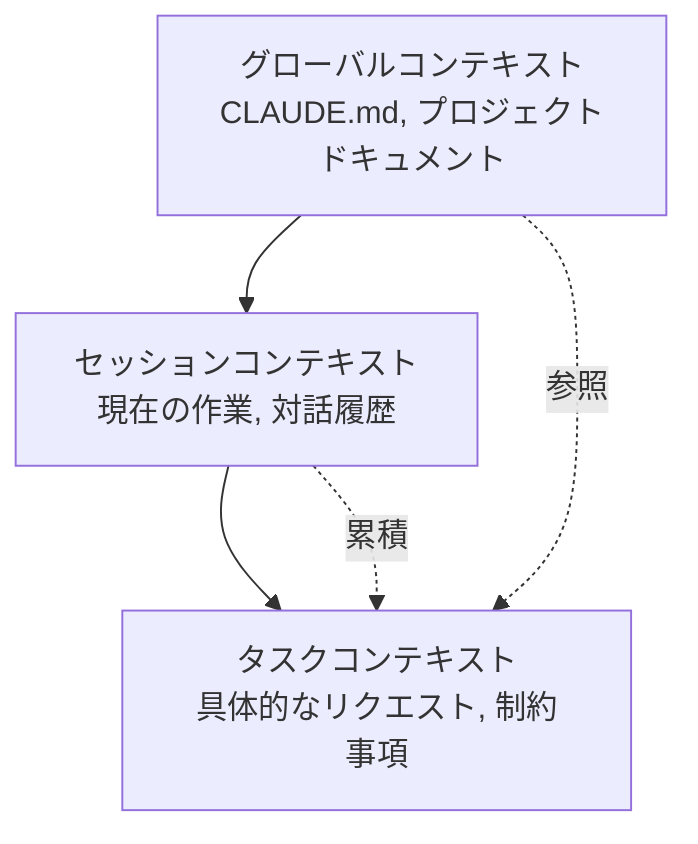

# Chapter 6: 効果的なプロンプトの作成

Claude Codeとの効果的なコミュニケーションは、プロジェクト成功の鍵です。この章では、AIとの協業を最大化するプロンプト作成技法を実践レシピ形式で提供します。

## Recipe 6.1: プロンプトの基本構造

### 問題 (Problem)

AIにリクエストする際、「ブログ記事を書いて」のような単純な要求をしたところ、期待とは異なる結果になりました。どのように構造化されたプロンプトを作成すれば、望む結果を得られるでしょうか?

### 解決策 (Solution)

効果的なプロンプトは、次の4つの要素で構成されます:

1. **役割定義 (Role)**: どの視点から作業するかを明示
2. **コンテキスト (Context)**: 作業に必要な背景情報を提供
3. **タスク仕様 (Task)**: 具体的な作業内容と目標
4. **制約条件 (Constraints)**: 形式、分量、スタイルなどの制限

#### ステップバイステップガイド

**Step 1: 役割定義**

AIに特定の専門家のペルソナを付与します。

```markdown
You are an expert technical writer with 10+ years of experience in
developer-focused content creation.
```

**Step 2: コンテキスト提供**

作業に必要な背景情報を明示します。

```markdown
I'm creating a blog post about Claude Code for Korean developers who are
new to AI-assisted coding. The target audience is intermediate developers
familiar with TypeScript and Git.
```

**Step 3: タスク仕様**

具体的に何を望むかを説明します。

```markdown
Write a technical blog post about "Getting Started with Claude Code" that:
- Explains the basic concepts
- Provides step-by-step installation guide
- Includes 3-5 practical examples
- Demonstrates best practices
```

**Step 4: 制約条件**

形式と要件を明示します。

```markdown
Requirements:
- Length: 2000-2500 words
- Format: Markdown with code examples
- Style: Professional but approachable (use です/ます体 in Japanese)
- Include at least 2 Mermaid diagrams
- All code examples must be syntactically correct
```

### コード/例 (Code)

#### 不適切なプロンプト (Before)

```
ブログ記事を書いて
```

**結果**: 方向性のない、一般的な内容

#### 改善されたプロンプト (After)

```markdown
## Role
You are an expert technical writer specializing in developer tools and
AI-assisted coding.

## Context
I'm writing for Korean developers (intermediate level) who want to learn
Claude Code. They already use VS Code and GitHub Copilot, so they
understand AI coding assistants.

## Task
Write a blog post: "Claude Code vs GitHub Copilot: 5 Key Differences"

Content requirements:
1. Introduction (200 words)
   - Brief overview of both tools
   - Why this comparison matters
2. Main content (1500 words)
   - 5 key differences with concrete examples
   - Pros/cons for each difference
3. Conclusion (300 words)
   - When to use which tool
   - Recommendation based on use case

## Constraints
- Length: 2000 words (Korean)
- Format: Markdown
- Style: です/ます体, professional
- Include: 2-3 code examples, 1 comparison table, 1 Mermaid diagram
- SEO: Include keywords "Claude Code", "GitHub Copilot", "AI コーディングツール"
```

**結果**: 構造化された、ターゲットに合った、実用的なコンテンツ

### 説明 (Explanation)

#### なぜこの構造が効果的なのか?

1. **役割定義の力**: AIに専門家のペルソナを付与すると、出力品質が劇的に向上します。「expert technical writer」というアイデンティティが、レスポンスのトーン、深さ、専門性を決定します。

2. **コンテキストの重要性**: 背景情報がなければ、AIは一般的な内容を生成します。「Korean developers」、「intermediate level」、「already use GitHub Copilot」といった情報が、コンテンツをターゲットに合わせます。

3. **明示的なタスク仕様**: 曖昧な「ブログ作成」よりも、具体的な構造(Introduction, Main, Conclusion)と各セクションの分量を明示すれば、期待に沿う結果を得られます。

4. **制約条件で品質保証**: 分量、形式、スタイルを明示すれば、手戻りが減ります。

#### 心理学的メカニズム

Claudeのような大規模言語モデルは、**文脈内学習(In-Context Learning)**を通じて動作します。プロンプトに豊富なコンテキストを提供するほど:

- より正確な予測が可能
- 出力の分散(variance)が減少
- 一貫性が向上

### バリエーション (Variations)

#### Variation 1: コードレビューリクエスト

```markdown
## Role
You are a senior software engineer specializing in TypeScript and clean code.

## Context
I'm reviewing a Pull Request for a React component that manages authentication state.
The code works but I want to ensure it follows best practices.

## Task
Review the following code and provide:
1. Code quality assessment (1-10 score)
2. 3-5 specific improvement suggestions
3. Refactored version (if needed)

## Constraints
- Focus on: type safety, readability, performance
- Format: Markdown with annotated code
- Include rationale for each suggestion
```

#### Variation 2: デバッグ支援

```markdown
## Role
You are an expert debugger with deep knowledge of Node.js and async programming.

## Context
My Express.js API intermittently returns 500 errors under high load.
Error logs show "Promise rejection not handled" but I can't identify the source.

## Task
1. Analyze the error pattern
2. Identify potential root causes (ranked by likelihood)
3. Suggest debugging steps
4. Provide a fix if possible

## Constraints
- Explain in Japanese (technical terms can be English)
- Include code examples for proposed fixes
- Consider: async/await patterns, error handling, connection pooling
```

#### Variation 3: アーキテクチャ設計

```markdown
## Role
You are a solutions architect with expertise in scalable web applications.

## Context
I'm building a blog platform that needs to:
- Handle 10,000+ posts
- Support multi-language (Korean, English, Japanese)
- Optimize for SEO
- Generate static sites (Astro framework)

## Task
Design a content architecture that addresses:
1. Directory structure for multi-language content
2. Metadata schema for SEO and recommendations
3. Build optimization strategy
4. Content relationship management

## Constraints
- Use Astro Content Collections
- Provide Mermaid diagrams for architecture
- Include TypeScript type definitions
- Explain trade-offs for each decision
```

---

## Recipe 6.2: コンテキスト提供技法

### 問題 (Problem)

AIがプロジェクトの構造や現在の状況を理解せず、見当違いの提案をします。例えば、すでに使用している技術スタックを無視したり、プロジェクト規約に合わないコードを生成したりします。

### 解決策 (Solution)

効果的なコンテキスト提供は3段階で構成されます:

1. **プロジェクトコンテキスト**: 技術スタック、アーキテクチャ、規約
2. **作業コンテキスト**: 現在の状況、以前の作業、依存関係
3. **制約コンテキスト**: 必ず守るべき規則

#### ステップバイステップガイド

**Step 1: プロジェクトコンテキストを提供**

CLAUDE.mdのようなプロジェクトドキュメントを参照させます。

```markdown
## Project Context

This is an Astro 5.14.1 static blog with:
- Content Collections for type-safe content management
- Multi-language support (ko, en, ja, zh)
- Tailwind CSS for styling
- TypeScript in strict mode

Key conventions:
- Blog posts in: src/content/blog/<lang>/filename.md
- All dates: 'YYYY-MM-DD' format (single quotes)
- Images: src/assets/blog/ (optimized by Astro)
```

**Step 2: 作業コンテキストを提供**

現在何をしているか、どのファイルを作業中かを明示します。

```markdown
## Current Work

I'm adding a new blog post about "Effective Prompt Engineering".

Already completed:
- Created ko/prompt-engineering.md with frontmatter
- Added hero image: prompt-engineering-hero.jpg

Need to complete:
- Japanese version (ja/prompt-engineering.md)
- English version (en/prompt-engineering.md)
- Verify all 3 versions have consistent metadata
```

**Step 3: 制約コンテキストを提供**

絶対に違反してはならない規則を明示します。

```markdown
## Constraints (MUST FOLLOW)

1. pubDate format: 'YYYY-MM-DD' (NOT "MMM DD YYYY")
2. All 3 language versions must have identical:
   - File names (except language folder)
   - heroImage path
   - pubDate
3. Korean: 존댓말, 25-30 char title
4. Japanese: です/ます体, 30-35 char title
5. English: 50-60 char title
```

### コード/例 (Code)

#### コンテキスト不足のプロンプト (Before)

```
多言語ブログ記事を作って
```

**問題点**:
- どの言語かが不明確
- プロジェクト構造が不明
- ファイル配置が不明
- 形式規則が不明

**結果**: プロジェクト規約に合わないファイル生成

#### 豊富なコンテキストのプロンプト (After)

```markdown
## Project Context
Astro blog with Content Collections, multi-language (ko/ja/en/zh).

File structure:
src/content/blog/
├── ko/post-name.md
├── ja/post-name.md
├── en/post-name.md
└── zh/post-name.md

## Current Work
Creating new post: "prompt-engineering-best-practices"

Already done:
- Korean version (ko/prompt-engineering-best-practices.md)
- Hero image uploaded: src/assets/blog/prompt-engineering-hero.jpg

## Task
Create Japanese and English versions with:
1. Same file name in respective language folders
2. Culturally localized content (NOT direct translation)
3. Consistent metadata

## Constraints
Required frontmatter:
```yaml
---
title: "..." # ja: 30-35 char, en: 50-60 char
description: "..." # ja: 80-90 char, en: 150-160 char
pubDate: '2025-11-12' # MUST be single quotes, YYYY-MM-DD
heroImage: ../../../assets/blog/prompt-engineering-hero.jpg # SAME path
tags: ["prompt-engineering", "ai-agents", "claude-code"]
---
```

Japanese style: です/ます体, professional
English style: Professional but approachable
```

**結果**: プロジェクト規約を遵守した、一貫性のある多言語コンテンツ

### 説明 (Explanation)

#### コンテキストが品質を決定する理由

1. **曖昧性の除去**: 「多言語」が何を意味するか(言語の種類、ファイル構造、命名規則)が明確になります。

2. **エラー防止**: 日付形式、パス規則などの技術的制約を事前に提供すれば、手戻りが減ります。

3. **一貫性の保証**: プロジェクト全体の規則を明示すれば、AIが既存のパターンに従います。

#### コンテキストの階層構造



- **グローバルコンテキスト**: 変わらないプロジェクト規則 (CLAUDE.mdに文書化)
- **セッションコンテキスト**: 現在の対話で累積された情報
- **タスクコンテキスト**: 今すぐ必要な具体的情報

### バリエーション (Variations)

#### Variation 1: ファイル参照によるコンテキスト提供

```markdown
## Context from Files

Please read the following files to understand the project structure:

1. /src/content.config.ts - Content Collections schema
2. /src/content/blog/ko/existing-post.md - Example post format
3. /CLAUDE.md - Project conventions

Then create a new blog post following the same patterns.
```

**利点**: AIが実際のコードを見てパターンを学習します。

#### Variation 2: 以前の作業参照

```markdown
## Context from Previous Work

In our last conversation, we:
1. Created 3 sub-agents for content workflow
2. Defined role boundaries with DO/DON'T sections
3. Added quality checklists

Now let's apply the same pattern to the SEO optimizer agent.
```

**利点**: セッション間の連続性を維持します。

#### Variation 3: エラーコンテキスト提供

```markdown
## Error Context

Build failed with:
```
Error: Invalid frontmatter in blog/ko/post.md
Expected pubDate format: Date, received: string
```

Current frontmatter:
```yaml
pubDate: "Nov 12 2025"
```

Expected format (from content.config.ts):
```typescript
pubDate: z.coerce.date()  // Auto-converts 'YYYY-MM-DD' string to Date
```

Please fix the frontmatter to match the schema.
```

**利点**: エラーの原因と解決策の両方を提供し、正確な修正が可能

---

## Recipe 6.3: 曖昧さの除去戦略

### 問題 (Problem)

AIがリクエストを誤解したり、複数の方法で解釈したりして、予想とは異なる結果を作ります。例えば「コードを改善して」と言ったとき、パフォーマンス最適化を望んだのに、可読性改善だけを受け取りました。

### 解決策 (Solution)

曖昧さを除去する4つの技法:

1. **具体的な目標明示**: 「何を」望むかを正確に
2. **測定可能な基準**: 「どのくらい」良くすべきかを
3. **例示提供**: 「このように」望むという参照
4. **除外事項明示**: 「これはしないで」

#### ステップバイステップガイド

**Step 1: 具体的な目標明示**

一般的なリクエストを具体的な目標に変換します。

```markdown
Before: "コードを改善して"
After: "TypeScriptの型安全性を高め、nullチェックを追加して"

Before: "ブログ記事を書いて"
After: "中級開発者を対象に、Claude Codeのプロンプトエンジニアリング技法を
       実践例とともに説明するチュートリアルを作成して"
```

**Step 2: 測定可能な基準提供**

定性的基準を定量的に変換します。

```markdown
Before: "短く書いて"
After: "200〜250語で要約して"

Before: "良いSEOで書いて"
After: "ターゲットキーワード『プロンプトエンジニアリング』を
       タイトルと最初の段落に含め、メタdescriptionは150〜160字で作成して"
```

**Step 3: 例示提供**

望む形式の参照を提示します。

```markdown
## Desired Output Example

Like this existing post:
/src/content/blog/ko/claude-code-best-practices.md

Which has:
- Clear section hierarchy (##, ###)
- Code examples with syntax highlighting
- Mermaid diagram for architecture
- Practical tips in bullet points

Generate a similar structure for the new topic.
```

**Step 4: 除外事項明示**

してはいけないことを明示します。

```markdown
## What NOT to do:

❌ Don't change the existing API
❌ Don't add new dependencies
❌ Don't refactor unrelated code
✅ Only optimize the calculateTotal() function
```

### コード/例 (Code)

#### 曖昧なプロンプト (Before)

```
リファクタリングして
```

**問題点**:
- 何を改善するか不明確 (パフォーマンス? 可読性? 構造?)
- 範囲が不明確 (どのファイル? どの部分?)
- 基準がない (どの程度まで?)

**結果**: 望まない部分まで変更されたり、意図と異なる改善

#### 明確なプロンプト (After)

```markdown
## Task: Refactor for Type Safety

### Scope
File: src/utils/blog.ts
Functions: getRelatedPosts(), filterByLanguage()

### Goals
1. Replace 'any' types with specific TypeScript types
2. Add runtime type guards for API responses
3. Handle edge cases (empty arrays, null values)

### Constraints
- ❌ Don't change function signatures (breaking change)
- ❌ Don't add new dependencies
- ✅ Keep existing tests passing
- ✅ Add JSDoc comments for new types

### Success Criteria
- No 'any' types remaining
- TypeScript strict mode passes
- All existing tests pass
- No new runtime errors

### Example
Current code:
```typescript
function getRelatedPosts(post: any): any[] {
  return post.relatedPosts || [];
}
```

Desired code:
```typescript
/**
 * Retrieves related posts with type safety
 * @param post - Blog post with optional related posts
 * @returns Array of related posts (empty if none)
 */
function getRelatedPosts(post: BlogPost): RelatedPost[] {
  if (!post.relatedPosts || !Array.isArray(post.relatedPosts)) {
    return [];
  }
  return post.relatedPosts.filter(isValidRelatedPost);
}
```
```

**結果**: 明確な範囲と目標で正確な改善

### 説明 (Explanation)

#### 曖昧さのコスト

研究によると、曖昧なプロンプトは:
- 手戻り率60%増加
- 平均2〜3回の繰り返しが必要
- 総作業時間200%増加

#### 明確性の心理学

AIは**最尤推定(Maximum Likelihood Estimation)**で動作します。曖昧な入力は、複数の可能な解釈の中から1つをランダムに選択します。明確な入力は、可能性空間を狭め、望む結果を得る確率を高めます。

```mermaid
graph TD
    Vague[曖昧なプロンプト<br/>"改善して"] --> Multiple[複数の可能な解釈]
    Multiple --> Performance[パフォーマンス最適化 30%]
    Multiple --> Readability[可読性改善 30%]
    Multiple --> Structure[構造改善 30%]
    Multiple --> Other[その他 10%]

    Clear[明確なプロンプト<br/>"型安全性を改善"] --> Single[単一の明確な解釈]
    Single --> TypeSafety[型安全性 90%]
```

#### 5W1H技法

ジャーナリズムの5W1Hをプロンプトに適用:

- **Who**: 誰のための作業か? (対象読者、ユーザー)
- **What**: 正確に何を望むか? (具体的な成果物)
- **When**: いつまで? どの時点の情報? (期限、バージョン)
- **Where**: どこに適用されるか? (ファイル、関数、セクション)
- **Why**: なぜ必要か? (目的、文脈)
- **How**: どのようにすべきか? (方法、制約)

### バリエーション (Variations)

#### Variation 1: 選択肢提示で曖昧さ除去

```markdown
## Clarification Needed

I want to improve the blog post recommendation system.
Which approach do you recommend?

Option A: TF-IDF based keyword matching (fast, simple)
Option B: Claude LLM semantic similarity (accurate, slower)
Option C: Hybrid approach (balanced)

Please explain trade-offs and recommend one based on:
- Target: 100+ posts, 4 languages
- Priority: Recommendation quality > speed
- Resources: API calls acceptable
```

**利点**: 選択肢を提示すれば、AIが各オプションを比較分析します。

#### Variation 2: 段階的明確化

```markdown
## Step-by-step Clarification

Step 1: Analyze the current architecture
- Read: src/content.config.ts
- Identify: Current schema limitations

Step 2: Propose improvements
- Suggest: 3 specific schema enhancements
- Explain: Why each is needed

Step 3: Implement
- Only after I approve Step 2
- Make changes incrementally

This ensures we align before implementation.
```

**利点**: 段階的アプローチで方向修正が容易になります。

#### Variation 3: 反例提示

```markdown
## What I DON'T Want

Bad example 1 (too generic):
```yaml
title: "プロンプトエンジニアリング"
description: "プロンプトの書き方"
```

Bad example 2 (too long):
```yaml
title: "AI時代のソフトウェア開発者のためのプロンプトエンジニアリング完全ガイド"
```

Good example (balanced):
```yaml
title: "実践プロンプトエンジニアリング: Claude Code活用法"
description: "AIエージェントのパフォーマンスを10倍向上させるプロンプト作成技法と実際の適用事例"
```

Generate metadata following the "Good example" pattern.
```

**利点**: 悪い例を示せば、AIが避けるべきパターンを学習します。

---

## Recipe 6.4: 対話フロー管理

### 問題 (Problem)

Claude Codeとの対話が長くなるにつれて文脈が曖昧になり、AIが以前の作業を忘れたり、一貫性のない提案をしたりします。いつ新しい対話を始めるべきか、どのようにコンテキストを維持すべきかがわかりません。

### 解決策 (Solution)

効果的な対話フロー管理の4段階:

1. **対話開始**: 明確な目標と範囲設定
2. **中間チェックポイント**: 進捗確認と調整
3. **コンテキスト要約**: 重要情報の定期的な再確認
4. **対話終了/再開**: 適切なタイミングで/clearを使用

#### ステップバイステップガイド

**Step 1: 対話開始時に目標宣言**

各セッション開始時に明確な目標を設定します。

```markdown
## Session Goal

Today's objective: Implement multi-language content recommendation system

Tasks:
1. Design metadata schema for recommendations
2. Create recommendation generation script
3. Update RelatedPosts component
4. Test with existing blog posts

Exit criteria: All 3 language versions have working recommendations
```

**Step 2: 中間チェックポイント設定**

作業中に調整チェックポイントを作ります。

```markdown
## Checkpoint: Before Implementation

Let's verify the design before coding:

✅ Completed:
- Schema designed (relatedPosts with score, reason)
- Example metadata created

⏸️ Review needed:
- Does the schema support 4 languages? (ko, ja, en, zh)
- Should we include similarity algorithm details?

❓ Questions:
- How many related posts per post? (I suggest 3-5)
- Should we version the recommendations?

Please confirm the design looks good before I proceed with implementation.
```

**Step 3: 定期的なコンテキスト要約**

対話が長くなったら重要情報を要約します。

```markdown
## Context Summary (10 messages in)

What we've done:
1. Created schema for relatedPosts
2. Implemented recommendation script using Claude API
3. Generated recommendations for 50 posts

Current status:
- Working: Korean and English recommendations
- Issue: Japanese recommendations have encoding errors
- Blocked: Need to fix character encoding before proceeding

Next step: Fix UTF-8 encoding in recommendation script
```

**Step 4: 適切なタイミングで/clearを使用**

対話を再開すべきサイン:

- 作業テーマが完全に変更されるとき
- AIが以前のコンテキストと矛盾する提案をするとき
- 対話が30+メッセージで長くなりすぎたとき
- 重要な作業が完了し、新しい作業を始めるとき

```markdown
## Before /clear

Session complete!

✅ Achieved:
- Multi-language recommendation system implemented
- 50 posts with working recommendations
- Component updated and tested

📝 Important for next session:
- Recommendations stored in: content/recommendations.json
- Schema documented in: content.config.ts
- Component at: src/components/RelatedPosts.astro

/clear

## After /clear (New Session)

New session goal: Implement SEO optimization for blog posts

(Start fresh with clear objective)
```

### コード/例 (Code)

#### 混乱した対話フロー (Before)

```
Message 1: "ブログ推薦システムを作って"
Message 2: "TF-IDFじゃなくてClaude APIを使おう"
Message 3: "それともベクターDBの方がいいかな?"
Message 15: "画像も最適化して"
Message 20: "また推薦システムに戻って..."
Message 25: "あ、それはできないんだ。最初からやり直し..."
```

**問題点**:
- 目標が継続的に変わる
- 以前の作業と新しい作業が混在
- AIが混乱する

#### 構造化された対話フロー (After)

```markdown
=== Session 1: Design Phase ===

Message 1:
## Session Goal: Design recommendation system

Objective: Choose the best approach for blog post recommendations

Tasks:
1. Compare TF-IDF vs Claude API vs Vector DB
2. Choose one based on project constraints
3. Design schema for selected approach

Let's start with comparison.

---

Message 5:
## Checkpoint: Design Decision

Based on the comparison, I choose: Claude API semantic similarity

Rationale:
- Quality > Speed (acceptable for static generation)
- 100 posts = manageable API costs
- Matches project's AI-first approach

Proceed with Claude API schema design.

---

Message 10:
## Session Complete

✅ Achieved:
- Comparison complete
- Claude API approach chosen
- Schema designed and documented

📝 Next session: Implementation

/clear

=== Session 2: Implementation Phase ===

Message 1:
## Session Goal: Implement Claude API recommendations

Context from previous session:
- Chosen approach: Claude API semantic similarity
- Schema: documented in previous session notes
- Target: 100 posts, 4 languages

Tasks:
1. Create recommendation generation script
2. Test with 5 sample posts
3. Generate for all posts
4. Validate output

Let's implement the script.
```

**効果**:
- 各セッションが明確な目標を持つ
- 進捗を追跡可能
- コンテキスト切り替えがスムーズ

### 説明 (Explanation)

#### 対話フローが重要な理由

Claudeのような大規模言語モデルは、**コンテキストウィンドウ(Context Window)**内のすべてのメッセージを考慮します。対話が長くなるほど:

1. **トークン使用量増加**: 各リクエストごとに全対話履歴を送信
2. **無関係な情報の累積**: 初期メッセージの無関係な情報が最新レスポンスに影響
3. **一貫性の低下**: 初期の決定と最新の決定が衝突する可能性

#### 効果的な対話パターン

```mermaid
graph TD
    Start[セッション開始] --> Goal[目標宣言]
    Goal --> Work1[タスク 1]
    Work1 --> Check1[チェックポイント 1]
    Check1 --> Align{調整完了?}
    Align -->|Yes| Work2[タスク 2]
    Align -->|No| Adjust[方向調整]
    Adjust --> Work1
    Work2 --> Check2[チェックポイント 2]
    Check2 --> Complete{完了?}
    Complete -->|Yes| Summary[要約]
    Complete -->|No| Work2
    Summary --> Clear[/clear]
    Clear --> Start
```

#### チェックポイントの価値

チェックポイントは次のものを提供します:
- **調整機会**: 方向が正しいか確認
- **ロールバックポイント**: 間違った方向なら戻る場所
- **進捗追跡**: どれだけ進んだか可視化

### バリエーション (Variations)

#### Variation 1: ブランチ対話

複雑な決定が必要なときは対話をブランチします。

```markdown
## Main Thread: Recommendation System

Current decision point: Algorithm selection

Let me explore 2 branches in separate conversations:

Branch A: /clear → "Evaluate TF-IDF approach for recommendations..."
Branch B: /clear → "Evaluate Claude API approach for recommendations..."

After both explorations, I'll return to main thread with decision.
```

**利点**: 複数のオプションを独立して深く探索できます。

#### Variation 2: コンテキストリセットなしで調整

/clearの代わりに明示的要約でコンテキストを再調整:

```markdown
## Context Realignment (instead of /clear)

We've discussed many things. Let me clarify what's actually decided:

✅ Decided and implemented:
- Recommendation schema: relatedPosts with score/reason
- Algorithm: Claude API semantic similarity

❌ Discussed but NOT implemented:
- Vector database (too complex for MVP)
- Real-time recommendations (static generation only)

🎯 Current focus:
- Generate recommendations for all existing posts
- Ignore previous discussions about alternative approaches

Please proceed with generation only.
```

**利点**: コンテキストを維持しながら不要な情報のみをフィルタリングします。

#### Variation 3: Todo基盤のフロー管理

TodoWriteツールを活用した構造的進行:

```markdown
## Session with Todo Tracking

Please create a todo list for this session:

Session Goal: Multi-language recommendation system

Tasks:
1. Design schema (pending)
2. Implement generation script (pending)
3. Test with 5 posts (pending)
4. Generate for all posts (pending)
5. Validate output (pending)

As we complete each task:
- Mark it as completed
- Update me on progress
- Ask for confirmation before next task

This keeps us aligned throughout the session.
```

**利点**: 進捗状況が視覚的に追跡され、各ステップごとに確認の機会があります。

---

## 実践総合例: ブログ記事作成プロジェクト

このセクションでは、これまで学んだ4つのレシピをすべて活用して、実際のブログ記事作成プロジェクトを進める過程を示します。

### シナリオ

「プロンプトエンジニアリング」というテーマで、韓国語、日本語、英語の3言語のブログ記事を作成し、関連記事推薦まで実装します。

### Session 1: 企画とリサーチ

```markdown
## Session Goal: Research and Planning

Objective: Research prompt engineering techniques and plan blog post structure

Tasks:
1. Research latest prompt engineering best practices (2025)
2. Identify key techniques applicable to Claude Code
3. Create blog post outline for 3 languages
4. Define success metrics

---

## Role
You are a technical content strategist specializing in AI/ML topics.

## Context
Project: Astro blog (www.jangwook.net)
Target audience: Korean developers (intermediate) interested in AI-assisted coding
Existing posts: 50+ technical posts, established voice

## Task
Research prompt engineering techniques from 2025 and create a comprehensive blog post outline.

Focus areas:
1. Role definition and persona
2. Uncertainty handling (most important)
3. Structured output
4. Quality checklists

## Constraints
- Target length: 2000-2500 words per language
- Must include real examples from the project
- SEO keywords: "プロンプトエンジニアリング", "Claude Code", "AIエージェント"
- Coordinate with Web Researcher agent for latest information

---

[AI responses with research findings]

---

## Checkpoint: Outline Review

Based on the research, here's the proposed outline:

1. 概要 (200 words)
   - AIエージェントのパフォーマンスとプロンプトの関係
   - 主要成果のプレビュー
2. 6つの核心原則 (1500 words)
   - 役割の明確化
   - 制約条件の明示
   - 不確実性の処理 ⭐
   - 出典の提供
   - 構造化された出力
   - 品質チェックリスト
3. 実践事例 (500 words)
   - 17個のエージェント改善プロジェクト
4. 結論 (200 words)

Does this structure work? Any additions/changes?

[Confirm and proceed]

---

## Session Complete

✅ Achieved:
- Research completed
- Outline approved
- Key examples identified

📝 Next session: Write Korean version

/clear
```

### Session 2: 韓国語版作成

```markdown
## Session Goal: Write Korean version

Context from previous session:
- Approved outline (saved in notes)
- Research findings (documented)
- Target: 2000-2500 words

---

## Role
You are an expert technical writer with 10+ years of experience in Korean developer content.

## Context
Writing for: Korean developers interested in AI coding tools
Style: 존댓말, professional but approachable
Project conventions:
- File: src/content/blog/ko/prompt-engineering-agent-improvements.md
- pubDate format: 'YYYY-MM-DD'
- Hero image: src/assets/blog/prompt-engineering-hero.jpg

## Task
Write the complete Korean blog post following the approved outline.

Requirements:
1. Title: 25-30 characters
2. Description: 70-80 characters
3. Content: 2000-2500 words
4. Include: 3 Mermaid diagrams, 5+ code examples
5. Use approved outline structure

## Quality Checklist
Before submission:
- [ ] All technical claims verified
- [ ] Code examples syntactically correct
- [ ] Mermaid diagrams render properly
- [ ] SEO keywords in title + first paragraph
- [ ] Frontmatter schema valid

Please write the complete post.

---

[AI generates Korean version]

---

## Checkpoint: Quality Check

Let me verify the post against the checklist:

✅ Title: 28 chars (AI 에이전트 성능을 10배 향상시키는...)
✅ Description: 76 chars
✅ Word count: 2347 words
✅ Mermaid diagrams: 4 (more than required)
✅ Code examples: 8
⚠️ Issue: pubDate format is "Nov 12 2025" but should be 'YYYY-MM-DD'

Please fix the pubDate format to '2025-11-12'

---

[AI fixes]

---

✅ All items verified. Korean version complete!

📝 Next session: Japanese version

/clear
```

### Session 3: 日本語版作成

```markdown
## Session Goal: Write Japanese version

Context from previous session:
- Korean version completed and validated
- File: src/content/blog/ko/prompt-engineering-agent-improvements.md
- Same outline, culturally localized for Japanese audience

---

## Role
You are an expert technical writer specializing in Japanese developer content.

## Context
Creating Japanese version of existing Korean post.
Target: Japanese developers interested in AI
Style: です/ます体, professional

IMPORTANT: This is cultural localization, NOT direct translation.
- Adapt examples for Japanese context
- Use appropriate technical term translations
- Maintain professional Japanese tone

## Task
Write Japanese version with:

Required metadata (MUST match Korean version):
- pubDate: '2025-11-12' (SAME as Korean)
- heroImage: ../../../assets/blog/prompt-engineering-hero.jpg (SAME path)
- File name: ja/prompt-engineering-agent-improvements.md (SAME name)

Japanese-specific requirements:
- Title: 30-35 characters
- Description: 80-90 characters
- Use です/ます体 consistently
- Technical terms: use katakana where standard (例: プロンプト, コンテキスト)

## Quality Checklist
- [ ] Cultural localization (not literal translation)
- [ ] Metadata matches Korean version
- [ ] Japanese grammar/style correct
- [ ] Technical terms consistent

---

[AI generates Japanese version]

---

## Checkpoint: Cross-language Validation

Verifying consistency across languages:

| Field | Korean | Japanese | Match? |
|-------|--------|----------|--------|
| pubDate | '2025-11-12' | '2025-11-12' | ✅ |
| heroImage | ...hero.jpg | ...hero.jpg | ✅ |
| File name | ko/prompt... | ja/prompt... | ✅ |
| Tags | [3 tags] | [3 tags] | ✅ |

✅ All metadata consistent!

📝 Next session: English version and final validation

/clear
```

### Session 4: 英語版と最終検証

```markdown
## Session Goal: English version + Final validation

Tasks:
1. Write English version
2. Validate all 3 language versions
3. Generate recommendations
4. Build and verify

---

## Role
You are an expert technical writer for international developer audiences.

## Task
Write English version following same pattern as Korean/Japanese versions.

(Similar structure as previous sessions)

---

[After English version is complete]

---

## Final Validation

Let's verify all 3 versions are consistent and complete:

```bash
# Check all 3 files exist
ls src/content/blog/ko/prompt-engineering-agent-improvements.md
ls src/content/blog/ja/prompt-engineering-agent-improvements.md
ls src/content/blog/en/prompt-engineering-agent-improvements.md

# Verify frontmatter consistency
# (AI would check pubDate, heroImage, tags in all 3)
```

✅ All 3 files exist
✅ Metadata consistent
✅ Quality checks passed

---

## Generate Recommendations

Now let's generate related post recommendations using the content-analyzer skill:

```
/skill content-analyzer

Analyze the new post and generate recommendations for all 3 language versions.
```

---

## Build Verification

```bash
npm run astro check  # Type validation
npm run build        # Production build
```

✅ Build successful!

---

## Session Complete

✅ Final Results:
- 3 language versions completed (ko, ja, en)
- All metadata validated
- Recommendations generated
- Build verified

📊 Statistics:
- Total words: ~6500 (across 3 languages)
- Diagrams: 4 Mermaid
- Code examples: 8
- Session time: 4 sessions (~2 hours total)

Project complete! 🎉
```

### 学習ポイント

この総合例で活用された技法:

1. **Recipe 6.1 (基本構造)**: 各セッションでRole, Context, Task, Constraintsを明示
2. **Recipe 6.2 (コンテキスト)**: 前回のセッション情報を次のセッションに伝達
3. **Recipe 6.3 (曖昧さ除去)**: 具体的基準 (語数、文字数、形式)
4. **Recipe 6.4 (フロー管理)**: セッション分離、チェックポイント、/clear活用

---

## プロンプト品質自己診断チェックリスト

最後に、作成したプロンプトの品質を自己評価できるチェックリストを提供します。

### Level 1: 基本 (Must Have)

- [ ] **明確なタスク定義**: 何を望むかを一文で説明可能
- [ ] **役割明示**: AIにどの専門家役割を付与したか
- [ ] **基本コンテキスト**: プロジェクト背景を最低限提供
- [ ] **形式指定**: 出力形式を明示 (Markdown, code, 分量)

### Level 2: 中級 (Should Have)

- [ ] **具体的目標**: 測定可能な成功基準
- [ ] **制約条件**: してはいけないことを明示
- [ ] **例示提供**: 望む出力の参照例
- [ ] **優先順位**: 複数の要件の優先順位を明示
- [ ] **コンテキスト階層**: グローバル/セッション/タスクコンテキストを区分

### Level 3: 上級 (Nice to Have)

- [ ] **不確実性処理**: わからない場合の対応を明示
- [ ] **品質チェックリスト**: 完了前の検証項目を提供
- [ ] **協業プロトコル**: 他のエージェントとの協業方法
- [ ] **エラー処理**: 問題発生時の対応方法
- [ ] **反復戦略**: 最初の試行が失敗した場合の改善方向

### スコア解釈

- **10〜12個**: 上級プロンプトエンジニアレベル
- **7〜9個**: 中級、一貫した品質の結果が可能
- **4〜6個**: 基本、簡単なタスクは可能だが複雑なタスクで手戻り発生
- **0〜3個**: 初級、プロンプトの改善が必要

---

## 核心要約

### 4つのレシピの核心

1. **Recipe 6.1: 基本構造**
   - Role, Context, Task, Constraints
   - すべてのプロンプトの基礎フレームワーク

2. **Recipe 6.2: コンテキスト提供**
   - プロジェクト/作業/制約コンテキストの3階層
   - コンテキストが豊富なほど精度向上

3. **Recipe 6.3: 曖昧さ除去**
   - 具体的目標、測定可能基準、例示、除外事項
   - 5W1Hで明確性を保証

4. **Recipe 6.4: フロー管理**
   - 目標宣言、チェックポイント、要約、/clear
   - 長いタスクも構造的に管理

### 最も重要な原則

<strong>「わからないことはわからない」</strong> - AIに不確実性を正直に表現させ、自分も曖昧なリクエストを避けることが、信頼できる協業の基礎です。

### 実践ガイド

1. **小さなことから始める**: すべての技法を一度に適用しようとせず、Role明示から始めてください。

2. **テンプレート活用**: よく使うタスク(ブログ作成、コードレビューなど)のプロンプトテンプレートを作ってください。

3. **反復と改善**: 最初の試みが完璧でなくても構いません。結果を見てプロンプトを改善してください。

4. **コンテキストの文書化**: プロジェクト規則はCLAUDE.mdに文書化して再利用してください。

5. **フィードバックループ**: どのプロンプトが良い結果を出したかを記録し、パターン化してください。

---

## 次のステップ

Chapter 6で学んだプロンプト作成技法を基に、Chapter 7では実際のプロジェクトに適用する実践ワークフローを扱います:

- マルチエージェントオーケストレーション
- 大規模リファクタリングプロジェクト
- 自動化パイプライン構築
- 継続的改善サイクル

プロンプトはツールです。このツールをどう使うかが、AI時代の開発者の生産性を決定します。
