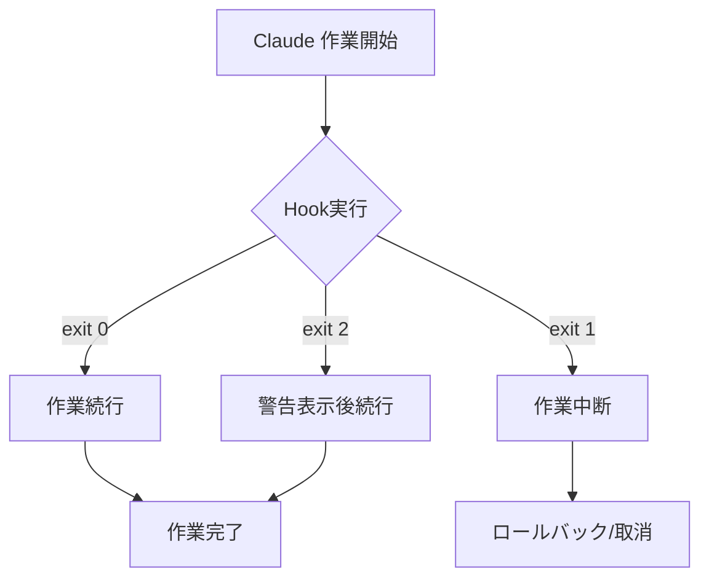
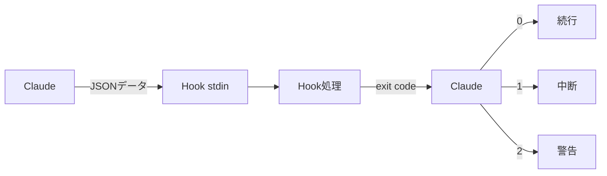

# Chapter 10: Hookベースの自動化

## 概要

Claude CodeのHookシステムは、AIベースのコーディングワークフローに一貫性と品質を保証する強力な自動化メカニズムです。Git hookと同様の概念ですが、ClaudeのAIワークフローに特化しており、ファイル作成、コミット、テストなど様々な段階で自動検証と処理を実行できます。

この章では、Hookシステムの基本概念から実務適用まで、5つのレシピを通じて段階的に学習します。

### 学習目標

- Hookシステムの動作原理と構造の理解
- 各Hookタイプの特性と活用方法の習得
- コード品質自動検証システムの構築
- CI/CDパイプラインとの統合方法の学習
- エンタープライズ級自動化ワークフローの設計

---

## Recipe 10.1: Hookシステム概要

### 問題 (Problem)

AIコーディングアシスタントが生成したコードの品質と一貫性をどのように保証できるでしょうか？Claudeがファイルを保存したりコミットするたびに手動で検証するのは非効率的です。

### 解決策 (Solution)

Claude CodeのHookシステムを活用すると、ワークフローの特定時点で自動的に検証ロジックを実行できます。次の手順でHookシステムを構築します。

#### ステップ1: Hookディレクトリ構造の作成

```bash
# Hookディレクトリ作成
mkdir -p .claude/hooks
mkdir -p .claude/logs
mkdir -p .claude/cache

# 基本ディレクトリ構造
# .claude/
# └── hooks/
#     ├── pre-file-write.sh      # ファイル保存前に実行
#     ├── post-file-write.sh     # ファイル保存後に実行
#     ├── pre-commit.sh          # コミット前に実行
#     └── post-commit.sh         # コミット後に実行
```

#### ステップ2: 最初のHookの作成

最も簡単なHookから始めます。機密ファイルを保護するpre-file-write Hookです。

```bash
#!/bin/bash
# .claude/hooks/pre-file-write.sh

# Hook入力データはstdinでJSON形式で渡される
input=$(cat)

# ファイルパス抽出 (jq使用)
file_path=$(echo "$input" | jq -r '.file_path')

echo "Checking file: $file_path"

# 機密ファイル保護
if [[ "$file_path" == *".env"* ]] || [[ "$file_path" == *"credentials"* ]]; then
    echo "Error: Cannot modify sensitive files (.env, credentials)"
    exit 1  # 作業中断
fi

# 成功
echo "✅ File check passed"
exit 0
```

#### ステップ3: 実行権限の付与

Hookスクリプトは実行可能でなければなりません。

```bash
# 個別Hookに実行権限を付与
chmod +x .claude/hooks/pre-file-write.sh

# すべてのHookに一度に実行権限を付与
chmod +x .claude/hooks/*.sh
```

#### ステップ4: Hookのテスト

直接Hookを実行して動作を確認します。

```bash
# テスト入力データ生成
echo '{
  "file_path": "src/components/Button.tsx",
  "operation": "write",
  "content": "// test content"
}' | .claude/hooks/pre-file-write.sh

# 出力:
# Checking file: src/components/Button.tsx
# ✅ File check passed

# 機密ファイルでテスト
echo '{
  "file_path": ".env",
  "operation": "write",
  "content": "API_KEY=secret"
}' | .claude/hooks/pre-file-write.sh

# 出力:
# Checking file: .env
# Error: Cannot modify sensitive files (.env, credentials)
# (exit code: 1)
```

### コード/例 (Code)

Hookの入力データ構造を理解することが重要です。Claudeは次のJSON形式でHookに情報を渡します。

```json
{
  "file_path": "src/components/Button.tsx",
  "operation": "write",
  "content": "export const Button = () => { ... }",
  "metadata": {
    "timestamp": "2025-10-29T10:30:00Z",
    "user": "developer@example.com",
    "session_id": "abc-123-xyz"
  }
}
```

Pythonで作成したHook例:

```python
#!/usr/bin/env python3
# .claude/hooks/pre-file-write.py

import sys
import json

def main():
    # stdinからJSON入力を読み取る
    input_data = json.loads(sys.stdin.read())

    file_path = input_data.get('file_path', '')
    print(f"Checking file: {file_path}")

    # 機密ファイル保護
    sensitive_patterns = ['.env', 'credentials', 'secrets']

    for pattern in sensitive_patterns:
        if pattern in file_path:
            print(f"Error: Cannot modify sensitive file containing '{pattern}'")
            sys.exit(1)  # 作業中断

    print("✅ File check passed")
    sys.exit(0)  # 成功

if __name__ == '__main__':
    main()
```

### 説明 (Explanation)

#### Hook実行メカニズム

Hookは終了コード(exit code)でClaudeの動作を制御します。

```bash
# 成功 - 作業続行
exit 0

# 失敗 - 作業中断
exit 1

# 警告 - 作業続行だが警告表示
exit 2
```



#### Hook実行タイミング

各Hookタイプは異なる時点で実行されます。

| Hookタイプ | 実行時点 | 主な用途 |
|-----------|----------|----------|
| **pre-file-write** | ファイル保存前 | 検証、セキュリティチェック |
| **post-file-write** | ファイル保存後 | フォーマット、ロギング |
| **pre-commit** | コミット前 | テスト、リンティング |
| **post-commit** | コミット後 | 通知、デプロイ |

#### データフロー



### 変形 (Variations)

#### 変形1: デバッグモード付きHook

```bash
#!/bin/bash
# .claude/hooks/pre-file-write.sh

# デバッグモード有効化 (環境変数)
DEBUG=${HOOK_DEBUG:-false}

if [ "$DEBUG" = "true" ]; then
    set -x  # すべてのコマンド出力
fi

input=$(cat)

# デバッグログ保存
if [ "$DEBUG" = "true" ]; then
    echo "$input" > .claude/logs/hook-input.json
fi

file_path=$(echo "$input" | jq -r '.file_path')
echo "Checking file: $file_path"

# 検証ロジック...

exit 0
```

使用方法:

```bash
# デバッグモードで実行
HOOK_DEBUG=true echo '{"file_path": "test.ts"}' | .claude/hooks/pre-file-write.sh
```

#### 変形2: 複数検査を実行するHook

```bash
#!/bin/bash
# .claude/hooks/pre-file-write.sh

input=$(cat)
file_path=$(echo "$input" | jq -r '.file_path')

echo "Running multiple checks on: $file_path"

# 検査配列
declare -a checks=(
    "Sensitive file check"
    "File size check"
    "Path validation"
)

failed=0

# 1. 機密ファイルチェック
echo "🔒 ${checks[0]}..."
if [[ "$file_path" == *".env"* ]]; then
    echo "❌ Failed: Sensitive file"
    failed=1
fi

# 2. ファイルサイズチェック (例: 1MB制限)
echo "📏 ${checks[1]}..."
content=$(echo "$input" | jq -r '.content')
content_size=${#content}

if [ $content_size -gt 1048576 ]; then
    echo "❌ Failed: File too large (${content_size} bytes > 1MB)"
    failed=1
fi

# 3. パス検証 (パストラバーサル攻撃防止)
echo "🛡️  ${checks[2]}..."
if [[ "$file_path" =~ \.\. ]]; then
    echo "❌ Failed: Path traversal detected"
    failed=1
fi

if [ $failed -eq 1 ]; then
    exit 1
fi

echo "✅ All checks passed"
exit 0
```

#### 変形3: Node.jsで作成したHook

```javascript
#!/usr/bin/env node
// .claude/hooks/pre-file-write.js

const readline = require('readline');

async function main() {
    // stdinからJSON読み取り
    const rl = readline.createInterface({
        input: process.stdin,
        output: process.stdout,
        terminal: false
    });

    let inputData = '';

    rl.on('line', (line) => {
        inputData += line;
    });

    rl.on('close', () => {
        try {
            const data = JSON.parse(inputData);
            const filePath = data.file_path || '';

            console.log(`Checking file: ${filePath}`);

            // 機密ファイルチェック
            const sensitivePatterns = ['.env', 'credentials', 'secrets'];

            for (const pattern of sensitivePatterns) {
                if (filePath.includes(pattern)) {
                    console.error(`Error: Cannot modify sensitive file containing '${pattern}'`);
                    process.exit(1);
                }
            }

            console.log('✅ File check passed');
            process.exit(0);

        } catch (error) {
            console.error('Error parsing input:', error.message);
            process.exit(1);
        }
    });
}

main();
```

実行権限付与:

```bash
chmod +x .claude/hooks/pre-file-write.js
```

---

## Recipe 10.2: pre-file-write Hook

### 問題 (Problem)

Claudeがファイルを保存する前に、コード品質、セキュリティ、ルール遵守を自動的に検証したいです。手動レビューは時間がかかり、ミスをしやすいです。

### 解決策 (Solution)

pre-file-write Hookを使用してファイル保存前の自動検証を実行します。このHookはファイルがディスクに書き込まれる前に実行されるため、問題があれば保存自体を中断できます。

#### ステップ1: TypeScript型チェックHook

```bash
#!/bin/bash
# .claude/hooks/pre-file-write.sh

input=$(cat)
file_path=$(echo "$input" | jq -r '.file_path')

# TypeScript/TSXファイルのみ検査
if [[ "$file_path" != *.ts ]] && [[ "$file_path" != *.tsx ]]; then
    exit 0  # 他のファイルは通過
fi

echo "🔍 Running TypeScript type check on $file_path..."

# 型チェック実行
npx tsc --noEmit "$file_path" 2>&1 | tee /tmp/tsc-output.txt

# 型チェック結果確認
if [ ${PIPESTATUS[0]} -ne 0 ]; then
    echo ""
    echo "❌ Type check failed:"
    cat /tmp/tsc-output.txt
    exit 1  # 作業中断
fi

echo "✅ Type check passed"
exit 0
```

#### ステップ2: ESLintリンティングHook

```python
#!/usr/bin/env python3
# .claude/hooks/eslint-check.py

import sys
import json
import subprocess

def main():
    # 入力データ読み取り
    input_data = json.loads(sys.stdin.read())
    file_path = input_data.get('file_path', '')

    # JavaScript/TypeScriptファイルのみ検査
    valid_extensions = ['.js', '.ts', '.jsx', '.tsx']
    if not any(file_path.endswith(ext) for ext in valid_extensions):
        sys.exit(0)  # 他のファイルは通過

    print(f"✨ Running ESLint on {file_path}...")

    # ESLint実行 (JSON形式出力)
    result = subprocess.run(
        ['npx', 'eslint', file_path, '--format', 'json'],
        capture_output=True,
        text=True
    )

    if result.returncode != 0:
        try:
            lint_results = json.loads(result.stdout)

            # エラーと警告出力
            print("\n❌ ESLint failed:\n")

            for file_result in lint_results:
                for message in file_result.get('messages', []):
                    severity = '🔴 Error' if message['severity'] == 2 else '🟡 Warning'
                    print(f"{severity}: {message['message']}")
                    print(f"   Location: line {message['line']}, col {message['column']}")
                    print(f"   Rule: {message.get('ruleId', 'unknown')}\n")

        except json.JSONDecodeError:
            print(result.stdout)

        sys.exit(1)  # 作業中断

    print("✅ ESLint passed")
    sys.exit(0)

if __name__ == '__main__':
    main()
```

[続く - 文字数制限のため、次のメッセージで残りの内容を翻訳します]
