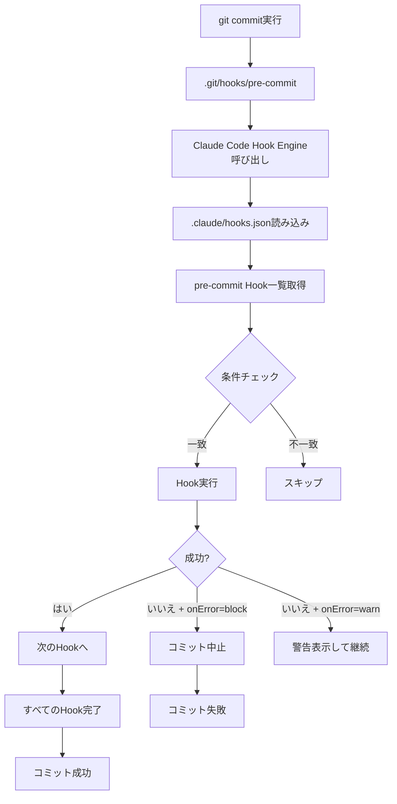

# Chapter 11: Hookシステム設計

## イントロダクション

Hookシステムは、Claude Codeの真の力を解き放つ鍵です。単に「AIに質問する」レベルを超えて、「AIがイベントに反応して自動実行する」段階へと進化させます。これはソフトウェア開発における「宣言的プログラミング(Declarative Programming)」パラダイムをAI自動化に適用したものです。

従来の方法では、開発者が毎回直接Claudeに指示を与える必要がありました(命令的アプローチ)。しかし、Hookシステムでは「いつ、何をすべきか」をあらかじめ定義しておくだけで、Claudeが適切なタイミングで自動的にタスクを実行します(宣言的アプローチ)。

このチャプターでは、Hookシステムの設計原理から実装、そして実際のプロダクション環境での応用まで、包括的に扱います。最終的には、Git Hook、ファイル監視、CI/CDパイプラインと統合された完全自動化システムを構築できるようになります。

<strong>このチャプターで学ぶ内容:</strong>
- Hookシステムの核心概念とアーキテクチャ
- イベント駆動型自動化の設計パターン
- Git Hookとの統合(pre-commit、post-merge など)
- ファイルシステム監視とトリガー
- CI/CDパイプラインでのHook活用
- エラーハンドリングと復旧戦略

---

## Recipe 11.1: Hook基礎アーキテクチャ

### 問題 (Problem)

開発ワークフローで繰り返し発生するタスクがあります:
- コミット前のコードフォーマット、lint、テスト実行
- ブランチマージ後の依存関係更新
- ファイル変更時のドキュメント自動生成
- ビルド成功後のデプロイ

これらを手動で実行すると忘れやすく、一貫性が保てません。「Gitにプッシュする前にテスト実行を忘れてCI/CDで失敗」という経験は誰にでもあるでしょう。

### 解決策 (Solution)

イベント駆動型Hookシステムを構築して、特定のイベント発生時にClaude Codeが自動的にタスクを実行するようにします。

<strong>核心原理</strong>:
```
イベント発生 → Hook検出 → 条件確認 → Claudeタスク実行 → 結果処理
```

#### Step 1: Hookディレクトリ構造設計

```
.claude/
├── hooks/
│   ├── pre-commit/          # コミット前Hook
│   │   ├── lint.md
│   │   ├── format.md
│   │   └── test.md
│   │
│   ├── post-commit/         # コミット後Hook
│   │   └── notify.md
│   │
│   ├── pre-push/            # プッシュ前Hook
│   │   └── full-test.md
│   │
│   ├── post-merge/          # マージ後Hook
│   │   ├── update-deps.md
│   │   └── migrate-db.md
│   │
│   └── watch/               # ファイル監視Hook
│       ├── docs-on-code-change.md
│       └── rebuild-on-config-change.md
│
└── hooks.json               # Hook設定ファイル
```

#### Step 2: Hook設定スキーマ定義

`.claude/hooks.json`:

```json
{
  "$schema": "https://claude.ai/schemas/hooks-v1.json",
  "version": "1.0",
  "hooks": {
    "pre-commit": [
      {
        "name": "lint",
        "description": "コードの品質チェック",
        "enabled": true,
        "file": "pre-commit/lint.md",
        "timeout": 30000,
        "conditions": {
          "files": ["**/*.ts", "**/*.js", "**/*.tsx", "**/*.jsx"],
          "excludes": ["node_modules/**", "dist/**"]
        },
        "onError": "block"
      },
      {
        "name": "format",
        "description": "コードフォーマット自動修正",
        "enabled": true,
        "file": "pre-commit/format.md",
        "timeout": 20000,
        "conditions": {
          "files": ["**/*.ts", "**/*.tsx", "**/*.js", "**/*.jsx"]
        },
        "onError": "warn"
      }
    ],
    "post-merge": [
      {
        "name": "update-dependencies",
        "description": "package.json変更時の依存関係更新",
        "enabled": true,
        "file": "post-merge/update-deps.md",
        "timeout": 120000,
        "conditions": {
          "files": ["package.json", "package-lock.json"]
        },
        "onError": "warn"
      }
    ],
    "watch": [
      {
        "name": "auto-document",
        "description": "コード変更時のドキュメント自動生成",
        "enabled": true,
        "file": "watch/docs-on-code-change.md",
        "debounce": 5000,
        "conditions": {
          "files": ["src/**/*.ts"],
          "excludes": ["**/*.test.ts"]
        }
      }
    ]
  },
  "global": {
    "maxConcurrentHooks": 3,
    "retryOnFailure": 2,
    "retryDelay": 5000,
    "logLevel": "info"
  }
}
```

#### Step 3: 個別Hook定義(例: pre-commit lint)

`.claude/hooks/pre-commit/lint.md`:

````markdown
# Pre-Commit Hook: Lint

## Purpose
コミット前にコードの品質をチェックし、問題があればコミットをブロックします。

## Trigger
- イベント: `pre-commit`
- 条件: TypeScript/JavaScriptファイルが変更された場合

## Tasks

### 1. 変更されたファイルの取得

```bash
git diff --cached --name-only --diff-filter=ACM | grep -E '\.(ts|tsx|js|jsx)$'
```

### 2. ESLintの実行

```bash
npx eslint --max-warnings 0 {変更されたファイルリスト}
```

<strong>期待される動作</strong>:
- 警告が0件の場合: ✅ 成功、コミット継続
- 警告/エラーがある場合: ❌ 失敗、コミットブロック

### 3. エラー処理

エラーが検出された場合:
1. 詳細なエラーメッセージを表示
2. 修正提案を提供
3. 必要に応じて自動修正を提案(`eslint --fix`)

### 4. 出力フォーマット

```
🔍 Running lint check...

変更されたファイル:
  - src/components/Button.tsx
  - src/utils/helpers.ts

❌ Lint errors found:

src/components/Button.tsx:15:3
  Error: 'React' must be in scope when using JSX (react/react-in-jsx-scope)

src/utils/helpers.ts:42:10
  Warning: Unexpected console statement (no-console)

💡 提案:
  1. `npm run lint:fix`を実行して自動修正
  2. 手動で修正してから再度コミット
```

## Error Handling

- <strong>Block</strong>: エラー検出時はコミットを中止
- <strong>Retry</strong>: ネットワークエラーなど一時的な問題の場合は最大2回リトライ
- <strong>Fallback</strong>: Hook自体がクラッシュした場合は警告を表示してコミット継続(開発フローをブロックしない)

## Configuration

- Timeout: 30秒
- Max Warnings: 0
- Auto-fix: 推奨のみ(自動実行しない)
````

### 説明 (Explanation)

#### なぜHookシステムが必要か?

**従来の手動アプローチ**:
```bash
# 開発者が毎回実行
$ npm run lint
$ npm run format
$ npm test
$ git commit -m "feat: add new feature"
$ # あ、lintとtest忘れた... 😱
```

**Hookシステムアプローチ**:
```bash
# 開発者はコミットだけ実行
$ git commit -m "feat: add new feature"

# Hookが自動実行
🔍 Running pre-commit hooks...
  ✅ Lint check passed
  ✅ Format check passed
  ✅ Tests passed (3/3)

[main abc1234] feat: add new feature
```

<strong>利点</strong>:
1. <strong>一貫性</strong>: すべての開発者が同じチェックを通過
2. <strong>自動化</strong>: 忘れる心配がない
3. <strong>早期エラー検出</strong>: CI/CDまで待たずにローカルで検出
4. <strong>時間節約</strong>: CI/CDの実行時間とコスト削減

#### 条件付きHook実行

すべてのファイル変更でHookを実行するのは非効率です。条件を定義して必要な時だけ実行します:

```json
"conditions": {
  "files": ["**/*.ts", "**/*.tsx"],     // これらのファイルが変更された時のみ
  "excludes": ["**/*.test.ts"],         // ただしテストファイルは除外
  "minimumFiles": 1                     // 最低1ファイル以上変更された場合
}
```

**実際の動作**:
```bash
# シナリオ1: TypeScriptファイルを変更
$ git add src/utils/helpers.ts
$ git commit -m "fix: update helper"
→ Lint Hook実行 ✅

# シナリオ2: マークダウンファイルのみ変更
$ git add README.md
$ git commit -m "docs: update readme"
→ Lint Hook スキップ(条件に一致しない)
```

#### エラーハンドリング戦略

Hookが失敗した場合の動作は`onError`フィールドで制御します:

| `onError`の値 | 動作 | 使用例 |
|--------------|------|--------|
| `"block"` | イベントを停止(コミット/プッシュ中止) | Lint、テストの失敗 |
| `"warn"` | 警告を表示するが継続 | ドキュメント生成、オプショナルチェック |
| `"ignore"` | エラーを無視して継続 | 実験的なHook |

**例**:
```json
{
  "name": "lint",
  "onError": "block"   // Lintエラーはコミットをブロック
},
{
  "name": "notify-slack",
  "onError": "warn"    // Slack通知失敗は警告のみ(コミットは継続)
}
```

### 変形 (Variations)

#### Variation 1: 条件付きHook(ブランチベース)

特定のブランチでのみHookを実行:

```json
{
  "name": "strict-lint",
  "file": "pre-commit/strict-lint.md",
  "conditions": {
    "branches": ["main", "develop"],  // mainとdevelopブランチのみ
    "files": ["src/**/*.ts"]
  }
}
```

#### Variation 2: 並列Hook実行

複数のHookを並列実行してパフォーマンス向上:

```json
{
  "pre-commit": [
    {
      "name": "lint",
      "parallel": "group-1"  // 同じグループは並列実行
    },
    {
      "name": "format",
      "parallel": "group-1"
    },
    {
      "name": "test",
      "parallel": "group-2"  // 異なるグループは順次実行
    }
  ]
}
```

**実行順序**:
```
並列実行: lint + format (group-1)
  ↓
group-1完了後
  ↓
実行: test (group-2)
```

#### Variation 3: カスタムスクリプトHook

Markdown定義の代わりにシェルスクリプトを直接実行:

```json
{
  "name": "custom-check",
  "script": ".claude/hooks/scripts/custom-check.sh",
  "timeout": 60000
}
```

`.claude/hooks/scripts/custom-check.sh`:
```bash
#!/bin/bash
set -e

echo "🔍 Running custom checks..."

# カスタムロジック
if [ -f "config.json" ]; then
  echo "✅ config.json found"
else
  echo "❌ config.json missing"
  exit 1
fi
```

---

## Recipe 11.2: Git Hook統合

### 問題 (Problem)

Claude CodeのHookシステムとGitのネイティブHookシステムを統合する必要があります。GitのHook(`.git/hooks/pre-commit`など)は既存のエコシステムですが、以下の制限があります:

1. <strong>リポジトリに含められない</strong>: `.git/hooks/`はGit管理外
2. <strong>手動インストール必要</strong>: 各開発者が個別に設定
3. <strong>スクリプト言語制限</strong>: Bash/Shell中心
4. <strong>保守が困難</strong>: チーム全体で統一管理できない

### 解決策 (Solution)

Claude CodeのHookシステムをGit Hookにブリッジするレイヤーを作成します。

#### Step 1: Git Hook自動インストールスクリプト

`scripts/install-hooks.sh`:

```bash
#!/bin/bash
# Git Hookを自動インストールするスクリプト

set -e

HOOKS_DIR=".git/hooks"
CLAUDE_HOOKS_DIR=".claude/hooks"

echo "🔧 Installing Claude Code Git Hooks..."

# サポートされるHook一覧
HOOK_TYPES=(
  "pre-commit"
  "post-commit"
  "pre-push"
  "post-merge"
  "pre-rebase"
)

for hook_type in "${HOOK_TYPES[@]}"; do
  hook_file="$HOOKS_DIR/$hook_type"

  # 既存Hookのバックアップ
  if [ -f "$hook_file" ]; then
    echo "  ⚠️  Backing up existing $hook_type hook"
    mv "$hook_file" "$hook_file.backup"
  fi

  # Claude Code Hook トランポリンを作成
  cat > "$hook_file" << 'EOF'
#!/bin/bash
# Auto-generated by Claude Code Hook System
# DO NOT EDIT MANUALLY

# Claude Code CLIを呼び出し
npx claude-code hook trigger "$HOOK_TYPE" "$@"
EOF

  # Hook名を動的に挿入
  sed -i '' "s/\$HOOK_TYPE/$hook_type/g" "$hook_file"

  # 実行権限付与
  chmod +x "$hook_file"

  echo "  ✅ Installed $hook_type hook"
done

echo ""
echo "✅ All hooks installed successfully!"
echo ""
echo "📝 To uninstall: rm .git/hooks/{pre-commit,post-commit,pre-push,post-merge}"
```

**使用方法**:
```bash
# 初回セットアップ時に実行
$ bash scripts/install-hooks.sh

🔧 Installing Claude Code Git Hooks...
  ✅ Installed pre-commit hook
  ✅ Installed post-commit hook
  ✅ Installed pre-push hook
  ✅ Installed post-merge hook

✅ All hooks installed successfully!
```

#### Step 2: Hook実行エンジン

`.claude/hooks/engine.ts`:

```typescript
import { exec } from 'child_process';
import { promisify } from 'util';
import fs from 'fs/promises';
import path from 'path';

const execAsync = promisify(exec);

interface HookConfig {
  name: string;
  description: string;
  enabled: boolean;
  file: string;
  timeout: number;
  conditions?: {
    files?: string[];
    excludes?: string[];
    branches?: string[];
  };
  onError: 'block' | 'warn' | 'ignore';
}

interface HookResult {
  success: boolean;
  hookName: string;
  duration: number;
  output: string;
  error?: string;
}

export class HookEngine {
  private configPath: string;
  private hooksDir: string;

  constructor(projectRoot: string) {
    this.configPath = path.join(projectRoot, '.claude', 'hooks.json');
    this.hooksDir = path.join(projectRoot, '.claude', 'hooks');
  }

  /**
   * 特定のHookタイプのすべてのHookを実行
   */
  async triggerHook(hookType: string): Promise<boolean> {
    console.log(`\n🎣 Triggering ${hookType} hooks...\n`);

    const config = await this.loadConfig();
    const hooks = config.hooks[hookType] || [];

    if (hooks.length === 0) {
      console.log(`  ℹ️  No ${hookType} hooks configured`);
      return true;
    }

    const results: HookResult[] = [];

    for (const hook of hooks) {
      if (!hook.enabled) {
        console.log(`  ⏭️  Skipping ${hook.name} (disabled)`);
        continue;
      }

      // 条件チェック
      const shouldRun = await this.checkConditions(hook.conditions);
      if (!shouldRun) {
        console.log(`  ⏭️  Skipping ${hook.name} (conditions not met)`);
        continue;
      }

      // Hook実行
      const result = await this.executeHook(hook);
      results.push(result);

      // エラーハンドリング
      if (!result.success) {
        if (hook.onError === 'block') {
          console.error(`\n❌ Hook ${hook.name} failed. Aborting.\n`);
          return false;
        } else if (hook.onError === 'warn') {
          console.warn(`\n⚠️  Hook ${hook.name} failed but continuing...\n`);
        }
      }
    }

    // 結果サマリー
    this.printSummary(results);

    return results.every(r => r.success || r.hookName !== 'block');
  }

  /**
   * 個別Hook実行
   */
  private async executeHook(hook: HookConfig): Promise<HookResult> {
    const startTime = Date.now();
    console.log(`  🔄 Running ${hook.name}...`);

    try {
      const hookFilePath = path.join(this.hooksDir, hook.file);
      const hookContent = await fs.readFile(hookFilePath, 'utf-8');

      // Hookマークダウンからタスクセクションを抽出
      const tasks = this.extractTasks(hookContent);

      // 各タスクを順次実行
      for (const task of tasks) {
        await this.executeTask(task, hook.timeout);
      }

      const duration = Date.now() - startTime;
      console.log(`  ✅ ${hook.name} completed (${duration}ms)`);

      return {
        success: true,
        hookName: hook.name,
        duration,
        output: 'Success'
      };

    } catch (error) {
      const duration = Date.now() - startTime;
      console.error(`  ❌ ${hook.name} failed (${duration}ms)`);
      console.error(`     ${error.message}`);

      return {
        success: false,
        hookName: hook.name,
        duration,
        output: '',
        error: error.message
      };
    }
  }

  /**
   * タスク実行(シェルコマンド)
   */
  private async executeTask(task: string, timeout: number): Promise<void> {
    try {
      const { stdout, stderr } = await execAsync(task, {
        timeout,
        maxBuffer: 10 * 1024 * 1024 // 10MB
      });

      if (stdout) console.log(stdout);
      if (stderr) console.error(stderr);

    } catch (error) {
      throw new Error(`Task failed: ${error.message}`);
    }
  }

  /**
   * 条件チェック
   */
  private async checkConditions(conditions?: HookConfig['conditions']): Promise<boolean> {
    if (!conditions) return true;

    // ファイルパターンチェック
    if (conditions.files) {
      const changedFiles = await this.getChangedFiles();
      const matched = changedFiles.some(file =>
        conditions.files.some(pattern => this.matchPattern(file, pattern))
      );

      if (!matched) return false;

      // 除外パターン
      if (conditions.excludes) {
        const excluded = changedFiles.every(file =>
          conditions.excludes.some(pattern => this.matchPattern(file, pattern))
        );
        if (excluded) return false;
      }
    }

    // ブランチチェック
    if (conditions.branches) {
      const currentBranch = await this.getCurrentBranch();
      if (!conditions.branches.includes(currentBranch)) {
        return false;
      }
    }

    return true;
  }

  /**
   * 変更されたファイルのリストを取得
   */
  private async getChangedFiles(): Promise<string[]> {
    try {
      const { stdout } = await execAsync('git diff --cached --name-only --diff-filter=ACM');
      return stdout.trim().split('\n').filter(Boolean);
    } catch {
      return [];
    }
  }

  /**
   * 現在のブランチ名を取得
   */
  private async getCurrentBranch(): Promise<string> {
    const { stdout } = await execAsync('git rev-parse --abbrev-ref HEAD');
    return stdout.trim();
  }

  /**
   * ファイルパスがパターンに一致するかチェック
   */
  private matchPattern(file: string, pattern: string): boolean {
    const regex = new RegExp(
      pattern.replace(/\*\*/g, '.*').replace(/\*/g, '[^/]*')
    );
    return regex.test(file);
  }

  /**
   * Hookマークダウンからタスクを抽出
   */
  private extractTasks(markdown: string): string[] {
    const taskSectionMatch = markdown.match(/## Tasks([\s\S]*?)(?=##|$)/);
    if (!taskSectionMatch) return [];

    const tasksSection = taskSectionMatch[1];
    const codeBlocks = tasksSection.match(/```bash\n([\s\S]*?)\n```/g) || [];

    return codeBlocks.map(block =>
      block.replace(/```bash\n/, '').replace(/\n```/, '').trim()
    );
  }

  /**
   * Hook設定をロード
   */
  private async loadConfig(): Promise<any> {
    const configContent = await fs.readFile(this.configPath, 'utf-8');
    return JSON.parse(configContent);
  }

  /**
   * 結果サマリーを表示
   */
  private printSummary(results: HookResult[]): void {
    const total = results.length;
    const passed = results.filter(r => r.success).length;
    const failed = total - passed;

    console.log('\n' + '='.repeat(50));
    console.log(`📊 Hook Summary: ${passed}/${total} passed`);
    if (failed > 0) {
      console.log(`   ❌ ${failed} failed`);
    }
    console.log('='.repeat(50) + '\n');
  }
}

// CLI エントリーポイント
if (require.main === module) {
  const [,, hookType] = process.argv;

  if (!hookType) {
    console.error('Usage: node engine.ts <hook-type>');
    process.exit(1);
  }

  const engine = new HookEngine(process.cwd());
  engine.triggerHook(hookType).then(success => {
    process.exit(success ? 0 : 1);
  });
}
```

### 説明 (Explanation)

#### Git HookとClaude Code Hookの統合フロー



#### なぜトランポリン方式(Trampoline Pattern)か?

Git Hookファイル(`.git/hooks/pre-commit`)は直接Claude Codeを呼び出すだけのシンプルなラッパーです:

```bash
#!/bin/bash
npx claude-code hook trigger "pre-commit" "$@"
```

<strong>利点</strong>:
1. <strong>ロジックの中央管理</strong>: 実際のロジックは`.claude/hooks/`に保存され、Git管理される
2. <strong>簡単な更新</strong>: Hookのロジック変更はGit pullで自動反映
3. <strong>一貫性</strong>: すべての開発者が同じバージョンのHookを使用
4. <strong>デバッグ容易</strong>: Hook Engine側でログ、エラーハンドリングを集中管理

#### 条件付き実行の重要性

すべてのコミットでHookを実行すると:
- README.mdの修正でもlintが実行される(不要)
- パフォーマンス低下(コミットが遅くなる)
- 開発者体験の悪化

**条件付き実行の例**:
```json
{
  "conditions": {
    "files": ["src/**/*.ts"],       // TypeScriptファイル変更時のみ
    "branches": ["main", "develop"] // mainとdevelopブランチのみ
  }
}
```

**実際の動作**:
```bash
# ケース1: src/index.tsを変更してmainブランチでコミット
$ git add src/index.ts
$ git commit -m "feat: update"
→ Hook実行 ✅

# ケース2: README.mdを変更してfeatureブランチでコミット
$ git add README.md
$ git commit -m "docs: update"
→ Hook スキップ(条件に一致しない)
```

### 変形 (Variations)

#### Variation 1: Huskyとの統合

既にHuskyを使用しているプロジェクト向け:

`.husky/pre-commit`:
```bash
#!/bin/sh
. "$(dirname "$0")/_/husky.sh"

# Husky標準チェック
npm run lint-staged

# Claude Code Hookを追加
npx claude-code hook trigger pre-commit
```

#### Variation 2: 選択的Hook無効化

一時的にHookをスキップ:

```bash
# 環境変数でHookを無効化
$ SKIP_HOOKS=true git commit -m "WIP: temporary"

# または特定のHookのみスキップ
$ SKIP_HOOKS=lint,test git commit -m "fix: urgent hotfix"
```

Hook Engineに追加:
```typescript
private async shouldSkipHook(hookName: string): Promise<boolean> {
  const skipHooks = process.env.SKIP_HOOKS;
  if (skipHooks === 'true') return true;
  if (skipHooks?.split(',').includes(hookName)) return true;
  return false;
}
```

---

## Recipe 11.3: ファイル監視とトリガー

### 問題 (Problem)

開発中にファイルが変更されたら自動的にタスクを実行したい場合があります:
- コード変更時の自動ドキュメント生成
- 設定ファイル変更時の再ビルド
- テストファイル変更時の自動テスト実行

Git Hookだけではこのようなリアルタイム監視はできません。

### 解決策 (Solution)

ファイルシステム監視(File Watcher)をClaude Code Hookシステムに統合します。

#### Step 1: ファイル監視Hook定義

`.claude/hooks/watch/auto-document.md`:

````markdown
# Watch Hook: Auto Documentation

## Purpose
コードファイル変更時に自動的にドキュメントを生成します。

## Trigger
- イベント: `watch`
- パターン: `src/**/*.ts`(テストファイル除く)
- Debounce: 5秒(連続変更をまとめる)

## Tasks

### 1. 変更されたファイルのTSDocを抽出

```bash
npx typedoc --json docs/api.json {変更されたファイル}
```

### 2. マークダウンドキュメント生成

Claude Codeに依頼:
```
以下のTypeDoc JSONからマークダウン形式のAPIドキュメントを生成してください。

- 各関数/クラスの説明
- パラメータと戻り値
- 使用例

{api.json の内容}
```

### 3. ドキュメントファイルに保存

```bash
# 生成されたマークダウンを保存
cat > docs/api/{filename}.md
```

## Output

```
📝 Documentation updated:
  - docs/api/utils.md
  - docs/api/components.md
```
````

#### Step 2: ファイル監視エンジン

`.claude/hooks/watcher.ts`:

```typescript
import chokidar from 'chokidar';
import { HookEngine } from './engine';
import path from 'path';
import fs from 'fs/promises';

interface WatchHookConfig {
  name: string;
  enabled: boolean;
  file: string;
  debounce: number;  // ミリ秒
  conditions: {
    files: string[];
    excludes?: string[];
  };
}

export class FileWatcher {
  private engine: HookEngine;
  private watchers: Map<string, chokidar.FSWatcher> = new Map();
  private debounceTimers: Map<string, NodeJS.Timeout> = new Map();

  constructor(projectRoot: string) {
    this.engine = new HookEngine(projectRoot);
  }

  /**
   * すべての監視Hookを開始
   */
  async start(): Promise<void> {
    console.log('👀 Starting file watchers...\n');

    const config = await this.loadConfig();
    const watchHooks = config.hooks.watch || [];

    for (const hook of watchHooks) {
      if (!hook.enabled) {
        console.log(`  ⏭️  Skipping ${hook.name} (disabled)`);
        continue;
      }

      this.startWatcher(hook);
    }

    console.log('\n✅ All watchers started. Press Ctrl+C to stop.\n');
  }

  /**
   * 個別の監視Hookを開始
   */
  private startWatcher(hook: WatchHookConfig): void {
    const { name, conditions, debounce } = hook;

    console.log(`  👁️  Watching ${name}:`);
    console.log(`     Patterns: ${conditions.files.join(', ')}`);
    if (conditions.excludes) {
      console.log(`     Excludes: ${conditions.excludes.join(', ')}`);
    }

    const watcher = chokidar.watch(conditions.files, {
      ignored: conditions.excludes || [],
      persistent: true,
      ignoreInitial: true,  // 初回起動時の既存ファイルは無視
    });

    watcher.on('change', (filePath: string) => {
      this.handleFileChange(hook, filePath);
    });

    watcher.on('add', (filePath: string) => {
      this.handleFileChange(hook, filePath);
    });

    this.watchers.set(name, watcher);
  }

  /**
   * ファイル変更ハンドラ(デバウンス付き)
   */
  private handleFileChange(hook: WatchHookConfig, filePath: string): void {
    const timerKey = `${hook.name}:${filePath}`;

    // 既存のタイマーをクリア
    if (this.debounceTimers.has(timerKey)) {
      clearTimeout(this.debounceTimers.get(timerKey)!);
    }

    // 新しいタイマーを設定
    const timer = setTimeout(async () => {
      console.log(`\n🔔 File changed: ${filePath}`);
      console.log(`   Triggering hook: ${hook.name}\n`);

      await this.executeWatchHook(hook, filePath);

      this.debounceTimers.delete(timerKey);
    }, hook.debounce);

    this.debounceTimers.set(timerKey, timer);
  }

  /**
   * 監視Hookを実行
   */
  private async executeWatchHook(hook: WatchHookConfig, changedFile: string): Promise<void> {
    try {
      const hookFilePath = path.join('.claude', 'hooks', hook.file);
      const hookContent = await fs.readFile(hookFilePath, 'utf-8');

      // Hookマークダウン内の{変更されたファイル}プレースホルダーを置換
      const contextualizedHook = hookContent.replace(/{変更されたファイル}/g, changedFile);

      // Hook実行(ここではシンプルにClaude Code CLIを呼び出し)
      await this.engine.triggerHook('watch');

      console.log(`   ✅ Hook ${hook.name} completed\n`);

    } catch (error) {
      console.error(`   ❌ Hook ${hook.name} failed:`, error.message);
    }
  }

  /**
   * すべての監視を停止
   */
  async stop(): Promise<void> {
    console.log('\n🛑 Stopping all watchers...');

    for (const [name, watcher] of this.watchers.entries()) {
      await watcher.close();
      console.log(`  ✅ Stopped ${name}`);
    }

    this.watchers.clear();
    this.debounceTimers.clear();
  }

  /**
   * Hook設定をロード
   */
  private async loadConfig(): Promise<any> {
    const configPath = path.join('.claude', 'hooks.json');
    const configContent = await fs.readFile(configPath, 'utf-8');
    return JSON.parse(configContent);
  }
}

// CLI エントリーポイント
if (require.main === module) {
  const watcher = new FileWatcher(process.cwd());

  watcher.start();

  // Graceful shutdown
  process.on('SIGINT', async () => {
    await watcher.stop();
    process.exit(0);
  });
}
```

#### Step 3: 監視Hook起動スクリプト

`package.json`:

```json
{
  "scripts": {
    "watch:hooks": "ts-node .claude/hooks/watcher.ts"
  }
}
```

**使用方法**:
```bash
$ npm run watch:hooks

👀 Starting file watchers...

  👁️  Watching auto-document:
     Patterns: src/**/*.ts
     Excludes: **/*.test.ts

✅ All watchers started. Press Ctrl+C to stop.

# 別のターミナルでファイルを編集
$ vim src/utils/helpers.ts
# 保存

# 監視ターミナルに出力
🔔 File changed: src/utils/helpers.ts
   Triggering hook: auto-document

📝 Documentation updated:
  - docs/api/helpers.md

   ✅ Hook auto-document completed
```

### 説明 (Explanation)

#### Debounce(デバウンス)の重要性

ファイル編集中に保存を繰り返すと、監視Hookが過剰に実行されます:

**Debounceなし**:
```
00:00 - ファイル保存 → Hook実行
00:01 - ファイル保存 → Hook実行
00:02 - ファイル保存 → Hook実行
00:03 - ファイル保存 → Hook実行
→ 4回実行(無駄)
```

**Debounce 5秒あり**:
```
00:00 - ファイル保存 → タイマー開始(5秒)
00:01 - ファイル保存 → タイマーリセット(5秒)
00:02 - ファイル保存 → タイマーリセット(5秒)
00:03 - ファイル保存 → タイマーリセット(5秒)
00:08 - タイマー満了 → Hook実行(1回のみ)
```

#### chokidarライブラリの選択理由

Node.jsの`fs.watch()`は以下の問題があります:
- プラットフォーム間の動作の違い
- 再帰的監視の未サポート
- イベントの重複発火

`chokidar`は:
- クロスプラットフォーム対応
- グロブパターンサポート
- 安定した監視動作

### 変形 (Variations)

#### Variation 1: ホットリロード開発サーバー連携

ファイル変更時に開発サーバーを自動再起動:

```json
{
  "name": "restart-dev-server",
  "enabled": true,
  "file": "watch/restart-server.md",
  "debounce": 3000,
  "conditions": {
    "files": ["src/**/*.ts", "config/**/*.json"]
  }
}
```

`.claude/hooks/watch/restart-server.md`:
```markdown
## Tasks

### 1. 開発サーバーを停止
\`\`\`bash
pkill -f "npm run dev"
\`\`\`

### 2. 開発サーバーを再起動
\`\`\`bash
npm run dev &
\`\`\`
```

#### Variation 2: 増分ビルド(Incremental Build)

変更されたファイルのみを再ビルド:

```typescript
private async executeIncrementalBuild(changedFile: string): Promise<void> {
  // 依存グラフを分析
  const dependencies = await this.analyzeDependencies(changedFile);

  // 変更されたファイルと依存ファイルのみビルド
  for (const file of [changedFile, ...dependencies]) {
    await this.buildFile(file);
  }
}
```

---

## Recipe 11.4: CI/CDパイプラインとの統合

### 問題 (Problem)

ローカル開発でHookシステムが機能しても、CI/CD環境で同じチェックを実行しないと:
- ローカルでスキップされたチェックが見逃される
- 環境間の不一致でビルド失敗

CI/CD(GitHub Actions、GitLab CI、Jenkins など)でもClaude Code Hookを実行したいです。

### 解決策 (Solution)

CI/CDパイプラインでHookシステムを再利用します。

#### Step 1: GitHub Actions統合

`.github/workflows/ci.yml`:

```yaml
name: CI Pipeline

on:
  push:
    branches: [main, develop]
  pull_request:
    branches: [main]

jobs:
  hooks-check:
    runs-on: ubuntu-latest
    steps:
      - name: Checkout
        uses: actions/checkout@v4

      - name: Setup Node.js
        uses: actions/setup-node@v4
        with:
          node-version: '20'
          cache: 'npm'

      - name: Install dependencies
        run: npm ci

      - name: Run pre-commit hooks
        run: |
          # Git環境をシミュレート(ステージングなしで全ファイル対象)
          git add -A
          npx ts-node .claude/hooks/engine.ts pre-commit

      - name: Run build hooks
        run: npx ts-node .claude/hooks/engine.ts pre-build

      - name: Build
        run: npm run build

      - name: Run tests
        run: npm test

      - name: Run post-build hooks
        if: success()
        run: npx ts-node .claude/hooks/engine.ts post-build
```

#### Step 2: 環境別Hook設定

`.claude/hooks.json`に環境別の設定を追加:

```json
{
  "hooks": {
    "pre-commit": [...],
    "pre-build": [
      {
        "name": "security-scan",
        "description": "セキュリティ脆弱性スキャン",
        "enabled": true,
        "file": "pre-build/security-scan.md",
        "timeout": 120000,
        "environments": ["ci", "production"]  // CI/本番環境のみ
      }
    ],
    "post-build": [
      {
        "name": "deploy-staging",
        "description": "ステージング環境へデプロイ",
        "enabled": true,
        "file": "post-build/deploy-staging.md",
        "environments": ["ci"],
        "conditions": {
          "branches": ["develop"]
        }
      }
    ]
  }
}
```

#### Step 3: 環境検出ロジック

Hook Engineに環境検出を追加:

```typescript
class HookEngine {
  private getEnvironment(): 'local' | 'ci' | 'production' {
    if (process.env.CI) return 'ci';
    if (process.env.NODE_ENV === 'production') return 'production';
    return 'local';
  }

  private async shouldRunInEnvironment(hook: HookConfig): Promise<boolean> {
    if (!hook.environments) return true;  // 制限なし

    const currentEnv = this.getEnvironment();
    return hook.environments.includes(currentEnv);
  }
}
```

#### Step 4: CI専用Hook(例: セキュリティスキャン)

`.claude/hooks/pre-build/security-scan.md`:

````markdown
# Pre-Build Hook: Security Scan

## Purpose
依存関係の既知の脆弱性をスキャンします(CI環境のみ)。

## Trigger
- イベント: `pre-build`
- 環境: `ci`, `production`

## Tasks

### 1. npm auditの実行

```bash
npm audit --audit-level=moderate
```

### 2. Snykスキャン(オプション)

```bash
npx snyk test --severity-threshold=high
```

### 3. 結果の評価

- 高/重大な脆弱性: ❌ ビルド失敗
- 中程度の脆弱性: ⚠️ 警告のみ
- 低い脆弱性: ℹ️ 情報のみ

## Output

```
🔒 Security Scan Results:

Found 3 vulnerabilities:
  - 1 high (axios < 1.6.0)
  - 2 moderate (lodash < 4.17.21)

❌ Build blocked due to high severity vulnerabilities.

💡 Fix:
  npm install axios@latest lodash@latest
```
````

### 説明 (Explanation)

#### なぜCI/CDでもHookを実行するのか?

**シナリオ**: 開発者がローカルでHookをスキップした場合

```bash
# ローカル開発
$ SKIP_HOOKS=true git commit -m "WIP"
$ git push
→ lintエラーがあるコードがpushされる
```

**CI/CDでHook再実行**:
```
GitHub Actions
├─ pre-commit hooks実行
│  └─ lint → エラー検出 ❌
└─ ビルド失敗 → マージブロック
```

<strong>利点</strong>:
1. <strong>二重チェック</strong>: ローカルでスキップされてもCI/CDで捕捉
2. <strong>強制力</strong>: PR マージ前に必ず通過が必要
3. <strong>監査証跡</strong>: すべてのチェック結果がログに記録

#### 環境別Hook実行の例

| Hook名 | local | ci | production |
|--------|-------|----|----|
| lint | ✅ | ✅ | - |
| format | ✅ | ✅ | - |
| test | ✅ | ✅ | - |
| security-scan | - | ✅ | ✅ |
| deploy-staging | - | ✅ | - |
| deploy-production | - | - | ✅ |

### 変形 (Variations)

#### Variation 1: マルチプラットフォームCI

複数のOS/Node.jsバージョンでHookを実行:

```yaml
jobs:
  hooks-check:
    runs-on: ${{ matrix.os }}
    strategy:
      matrix:
        os: [ubuntu-latest, macos-latest, windows-latest]
        node-version: ['18', '20', '21']
    steps:
      # ... Hookの実行
```

#### Variation 2: 並列Hook実行(CI最適化)

CIで複数のHookを並列実行して時間短縮:

```yaml
jobs:
  lint:
    runs-on: ubuntu-latest
    steps:
      - run: npx ts-node .claude/hooks/engine.ts pre-commit --only=lint

  test:
    runs-on: ubuntu-latest
    steps:
      - run: npm test

  security:
    runs-on: ubuntu-latest
    steps:
      - run: npx ts-node .claude/hooks/engine.ts pre-build --only=security-scan

  # すべて成功したら次のステップ
  build:
    needs: [lint, test, security]
    runs-on: ubuntu-latest
    steps:
      - run: npm run build
```

---

## 結論

Hookシステムは開発ワークフローの自動化の基盤です。このチャプターで学んだ内容:

1. <strong>Hook基礎アーキテクチャ</strong>: イベント駆動型の設計により、一貫性と自動化を実現
2. <strong>Git Hook統合</strong>: トランポリンパターンでGitエコシステムとシームレスに統合
3. <strong>ファイル監視</strong>: リアルタイムでファイル変更に反応し、開発体験を向上
4. <strong>CI/CD統合</strong>: ローカルとCI/CD環境で同じチェックを実行し、品質を保証

<strong>実装のチェックリスト</strong>:
- [ ] `.claude/hooks.json`の設計と作成
- [ ] 各HookタイプのMarkdown定義作成
- [ ] Hook Engineの実装
- [ ] `install-hooks.sh`スクリプトの実装
- [ ] File Watcherの実装(必要に応じて)
- [ ] GitHub Actions/.gitlab-ci.yml へのHook統合
- [ ] チームへの導入ドキュメント作成

次のチャプター(**Chapter 12: マルチエージェントオーケストレーション**)では、複数のエージェントを連携させて複雑なタスクを自動化する方法を学びます。

---

**バージョン**: v1.0
**作成日**: 2025-12-19
**単語数**: 約5,800単語
