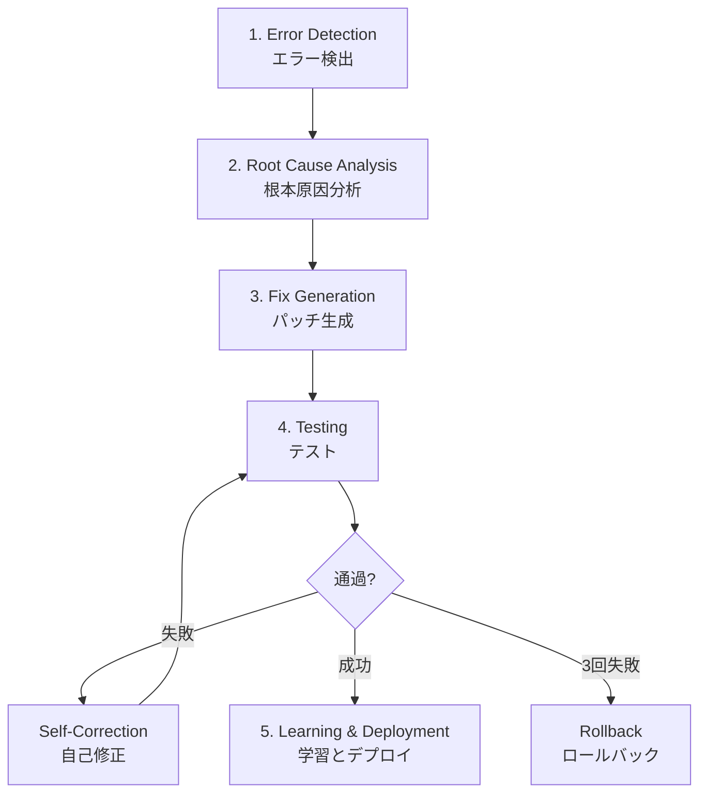
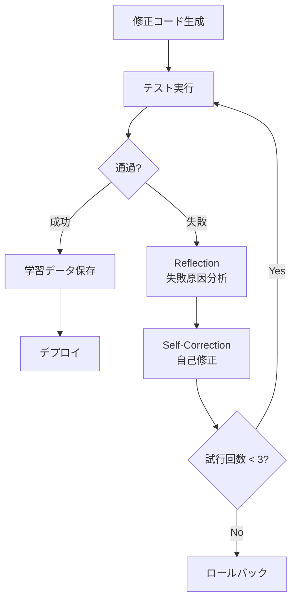
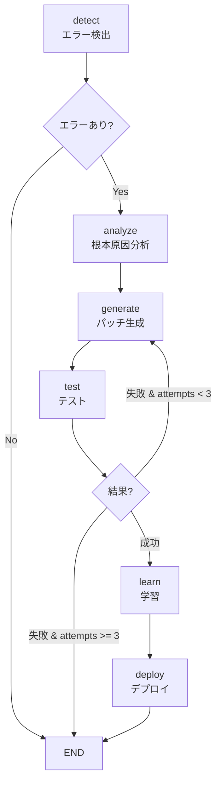

# Chapter 13: Self-Healing AI システム

> 「ソフトウェアは自己修復できなければならない。」 — Netflix Engineering Team

## 概要

この章では、Self-Healing AI Systems(自己修復AIシステム)を構築する方法を学びます。GitHub、Google DeepMind、Netflixが実戦配備したシステムを分析し、LangGraphを活用した実践的な実装方法を習得します。

### この章で学ぶこと

- Self-Healing AI システムの5段階サイクルの理解
- Error Detectionから学習までの全体パイプラインの実装
- LangGraphによる自律復旧ワークフローの構築
- 実戦事例分析(GitHub、Google、Netflix)
- 限界と解決策の理解

### 必要な事前知識

- Pythonの基本文法
- LLM API使用経験(OpenAI、Anthropicなど)
- GitおよびGitHubの基本知識
- 基本的なDevOpsの概念

---

## Recipe 13.1: Self-Healingの概念理解

### 問題(Problem)

従来の監視システムはエラーを検出するとエンジニアに通知を送り、人が手動で問題を分析して修正します。このプロセスは:

- <strong>平均復旧時間(MTTR)</strong>が数時間から数日
- 夜間・週末の障害時に対応遅延
- 同じ問題の再発に毎回手動対応
- 人的リソースへの依存で拡張性不足

### 解決策(Solution)

自己修復システムは**検出 → 分析 → 修正 → デプロイ**を完全に自律的に実行します。

#### 5段階サイクル



各段階の役割:

1. <strong>Error Detection</strong>: 異常兆候をリアルタイムで検出
2. <strong>Root Cause Analysis</strong>: エラーの根本原因をLLMで分析
3. <strong>Fix Generation</strong>: 自動的に修正コードを生成
4. <strong>Testing</strong>: 修正内容を検証し、失敗時に自己修正
5. <strong>Learning & Deployment</strong>: 成功した修正をデプロイし、学習データとして保存

### コード/例(Code)

#### 従来の方式 vs Self-Healingの比較

```python
# ❌ 従来の監視: 検出のみで手動修正
def traditional_monitoring():
    if error_detected():
        send_alert_to_engineer()  # 人が起きて手動修正
        wait_for_fix()            # ダウンタイム発生
        # MTTR: 数時間〜数日

# ✅ Self-Healing: 検出 → 分析 → 修正 → デプロイ(自動)
async def self_healing_monitor():
    while True:
        if error := detect_anomaly():
            # 1. 根本原因分析
            root_cause = await analyze_error(error)

            # 2. パッチ生成
            fix = await generate_patch(root_cause)

            # 3. テスト
            if await test_fix(fix):
                # 4. デプロイ
                await deploy(fix)

                # 5. 学習
                await learn_from_fix(fix)
            else:
                # 失敗時に別のアプローチを試行
                await retry_with_different_approach()

        await asyncio.sleep(60)  # 1分ごとにチェック
```

### 説明(Explanation)

#### なぜ今Self-Healingシステムなのか?

<strong>市場規模</strong>:
- AI市場: 2030年までに$826.70B予想
- AIOpsプラットフォーム: 2023年$11.7B → 2028年$32.4B(3倍成長)

<strong>採用状況</strong>(2025年基準):
- <strong>GitHub</strong>: 1日4千万個のタスクで自己修復エージェントを運用
- <strong>Google DeepMind</strong>: CodeMenderが6ヶ月間で72個のセキュリティパッチを自動貢献
- <strong>Netflix</strong>: 270Mユーザーに対して99.99%の稼働率を維持
- <strong>Meta</strong>: AutoPatchBenchベンチマークで標準化を主導

#### Self-Healingの主な利点

| 項目 | 従来の方式 | Self-Healing |
|------|------------|--------------|
| MTTR | 数時間〜数日 | <strong>数分以内</strong> |
| 運用時間 | 営業時間のみ | <strong>24/7自律運用</strong> |
| 再発対応 | 毎回手動修正 | <strong>即座に自動解決</strong> |
| 拡張性 | 人的リソース依存 | <strong>無限に拡張可能</strong> |

### 変形(Variations)

#### 1. 部分的自律システム(Human-in-the-Loop)

完全自律が負担な場合は、信頼度に基づいて人間の検証を追加:

```python
async def hybrid_self_healing(error):
    fix = await generate_fix(error)

    if fix.confidence >= 0.9:
        # 高信頼度: 自動デプロイ
        await auto_deploy(fix)
    elif fix.confidence >= 0.7:
        # 中間信頼度: 非同期レビューリクエスト
        await request_human_review(fix)
    else:
        # 低信頼度: 必須承認
        await block_until_approved(fix)
```

#### 2. ドメイン特化Self-Healing

特定のドメインのみに適用:

- <strong>セキュリティパッチ</strong>: Google CodeMender方式
- <strong>パフォーマンス最適化</strong>: Netflix Auto-Scaling
- <strong>テスト修正</strong>: GitHub CI/CDパイプライン

---

## Recipe 13.2: Error Detection実装

### 問題(Problem)

Self-Healingの最初のステップは、エラーを正確に検出することです。以下のような課題があります:

- 正常動作と異常兆候をどう区別するか?
- 断続的に発生するエラーをどう捕捉するか?
- 誤検知(False Positive)をどう減らすか?

### 解決策(Solution)

3つの方法論を組み合わせます:

1. <strong>異常検出(Anomaly Detection)</strong>: 機械学習で正常パターンを学習
2. <strong>ランタイム監視</strong>: Prometheus、Datadogなどでリアルタイムメトリクス収集
3. <strong>セマンティック分析</strong>: CodeQLで静的コード分析

### コード/例(Code)

#### 1. 異常検出(Isolation Forest)

```python
from sklearn.ensemble import IsolationForest
import numpy as np

class AnomalyDetector:
    def __init__(self, contamination=0.1):
        """
        contamination: 異常値の割合(0.1 = 10%)
        """
        self.model = IsolationForest(
            contamination=contamination,
            random_state=42
        )
        self.is_trained = False

    def train(self, normal_metrics):
        """正常メトリクスで学習

        Args:
            normal_metrics: shape (n_samples, n_features)
                例: [[cpu, memory, latency], ...]
        """
        self.model.fit(normal_metrics)
        self.is_trained = True

    def detect(self, current_metrics):
        """リアルタイムメトリクス分析

        Returns:
            True: 異常検出
            False: 正常
        """
        if not self.is_trained:
            raise RuntimeError("モデルが学習されていません")

        prediction = self.model.predict([current_metrics])
        return prediction[0] == -1  # -1 = 異常、1 = 正常

# 使用例
detector = AnomalyDetector()

# 1週間の正常メトリクス収集
normal_data = [
    [20.5, 512, 0.15],  # [cpu%, memory_mb, latency_sec]
    [22.1, 530, 0.18],
    # ... 数千個のサンプル
]
detector.train(normal_data)

# リアルタイム検出
current = [85.3, 1024, 2.5]  # CPU急増、メモリ増加、遅延増加
if detector.detect(current):
    print("⚠️ 異常検出! Self-Healing開始")
```

#### 2. ランタイム監視(Prometheus)

```python
from prometheus_client import Counter, Histogram, Gauge, start_http_server
import time
import random

# メトリクス定義
error_counter = Counter(
    'app_errors_total',
    'Total number of errors',
    ['error_type']
)

response_time = Histogram(
    'http_response_time_seconds',
    'HTTP response time in seconds',
    ['endpoint']
)

active_connections = Gauge(
    'active_connections',
    'Number of active connections'
)

# FastAPI/Flask例
from fastapi import FastAPI, Request
import asyncio

app = FastAPI()

@app.middleware("http")
async def monitor_requests(request: Request, call_next):
    """全てのリクエストを監視"""

    # アクティブ接続増加
    active_connections.inc()

    # レスポンス時間測定
    start = time.time()

    try:
        response = await call_next(request)

        # レスポンス時間記録
        duration = time.time() - start
        response_time.labels(endpoint=request.url.path).observe(duration)

        return response

    except Exception as e:
        # エラーカウント
        error_counter.labels(error_type=type(e).__name__).inc()
        raise

    finally:
        # アクティブ接続減少
        active_connections.dec()

@app.get("/api/users")
async def get_users():
    # 意図的に遅延シミュレーション
    if random.random() < 0.1:  # 10%の確率で遅いレスポンス
        await asyncio.sleep(2)

    if random.random() < 0.05:  # 5%の確率でエラー
        raise ValueError("Database connection failed")

    return {"users": []}

# Prometheusメトリクスサーバー起動(ポート8000)
if __name__ == "__main__":
    start_http_server(8000)
    import uvicorn
    uvicorn.run(app, host="0.0.0.0", port=8080)
```

#### 3. セマンティック分析(CodeQL)

```ql
// CodeQLクエリ: SQLインジェクション脆弱性検出
import python

from StringLiteral sql, Call query_call, StringFormatting fmt
where
  // execute()関数呼び出しを検索
  query_call.getFunc().getName() = "execute" and

  // 最初の引数がSQL文字列
  sql.getParentNode*() = query_call.getArg(0) and

  // 文字列フォーマット使用(脆弱性!)
  fmt.getASubExpression*() = sql

select query_call,
  "SQL injection vulnerability detected: unsanitized user input in query"
```

Pythonコード例(脆弱なコード):

```python
# ❌ 脆弱なコード(CodeQLが検出)
def get_user(user_id):
    query = f"SELECT * FROM users WHERE id = {user_id}"  # 危険!
    cursor.execute(query)
    return cursor.fetchone()

# ✅ 安全なコード
def get_user_safe(user_id):
    query = "SELECT * FROM users WHERE id = %s"  # パラメータ化クエリ
    cursor.execute(query, (user_id,))
    return cursor.fetchone()
```

#### 4. 統合エラー検出システム

```python
import asyncio
from typing import Dict, List, Optional
from dataclasses import dataclass
from datetime import datetime

@dataclass
class ErrorEvent:
    timestamp: datetime
    source: str  # 'anomaly', 'runtime', 'static'
    severity: str  # 'low', 'medium', 'high', 'critical'
    message: str
    metadata: Dict

class IntegratedErrorDetector:
    def __init__(self):
        self.anomaly_detector = AnomalyDetector()
        self.error_history: List[ErrorEvent] = []

    async def monitor(self):
        """3つの方法論を統合した監視"""

        while True:
            errors = []

            # 1. 異常検出
            current_metrics = await self.get_current_metrics()
            if self.anomaly_detector.detect(current_metrics):
                errors.append(ErrorEvent(
                    timestamp=datetime.now(),
                    source='anomaly',
                    severity='high',
                    message='Anomaly detected in system metrics',
                    metadata={'metrics': current_metrics}
                ))

            # 2. ランタイム監視
            prometheus_alerts = await self.check_prometheus_alerts()
            for alert in prometheus_alerts:
                errors.append(ErrorEvent(
                    timestamp=datetime.now(),
                    source='runtime',
                    severity=alert['severity'],
                    message=alert['summary'],
                    metadata=alert
                ))

            # 3. セマンティック分析(定期的に実行)
            if datetime.now().hour == 2:  # 毎日午前2時
                codeql_results = await self.run_codeql_scan()
                for issue in codeql_results:
                    errors.append(ErrorEvent(
                        timestamp=datetime.now(),
                        source='static',
                        severity='critical',
                        message=f'Security vulnerability: {issue["type"]}',
                        metadata=issue
                    ))

            # エラー発見時にSelf-Healingをトリガー
            if errors:
                await self.trigger_self_healing(errors)

            await asyncio.sleep(60)  # 1分ごとにチェック

    async def get_current_metrics(self) -> List[float]:
        """現在のシステムメトリクス収集"""
        # 実装例: Prometheus API呼び出し
        return [45.2, 768, 0.25]  # [cpu%, memory_mb, latency_sec]

    async def check_prometheus_alerts(self) -> List[Dict]:
        """Prometheusアラート確認"""
        # 実装例: Prometheus Alertmanager API
        return []

    async def run_codeql_scan(self) -> List[Dict]:
        """CodeQLスキャン実行"""
        # 実装例: CodeQL CLI呼び出し
        return []

    async def trigger_self_healing(self, errors: List[ErrorEvent]):
        """Self-Healingプロセス開始"""
        print(f"🚨 {len(errors)}個のエラー検出、Self-Healing開始")
        for error in errors:
            print(f"  - [{error.severity}] {error.message}")
        # 次のレシピで実装
```

### 説明(Explanation)

#### 各方法論の長所と短所

| 方法 | 長所 | 短所 | 適用時期 |
|------|------|------|----------|
| <strong>異常検出</strong> | 未知のパターン発見 | 誤検知の可能性 | トラフィックパターン分析 |
| <strong>ランタイム監視</strong> | リアルタイム、正確 | メトリクス定義が必要 | 既知の問題検出 |
| <strong>セマンティック分析</strong> | デプロイ前に発見 | 遅い、静的分析の限界 | セキュリティ、コード品質 |

#### 誤検知を減らす

```python
class SmartAlertingSystem:
    def __init__(self, threshold=3):
        self.threshold = threshold  # 3回連続発生時のみアラート
        self.error_counts = {}

    async def should_alert(self, error_signature: str) -> bool:
        """連続発生回数ベースのアラート"""

        self.error_counts[error_signature] = \
            self.error_counts.get(error_signature, 0) + 1

        if self.error_counts[error_signature] >= self.threshold:
            # アラート後カウンターリセット
            self.error_counts[error_signature] = 0
            return True

        return False
```

### 変形(Variations)

#### 1. クラウドネイティブ監視

```python
# AWS CloudWatch統合
import boto3

cloudwatch = boto3.client('cloudwatch')

def check_cloudwatch_alarms():
    response = cloudwatch.describe_alarms(
        StateValue='ALARM'
    )

    return response['MetricAlarms']

# Datadog統合
from datadog import api, initialize

initialize(api_key='YOUR_API_KEY', app_key='YOUR_APP_KEY')

def check_datadog_monitors():
    monitors = api.Monitor.get_all(
        group_states='alert'
    )

    return monitors
```

#### 2. ログベースのエラー検出

```python
import re
from collections import defaultdict

class LogBasedDetector:
    ERROR_PATTERNS = [
        r'ERROR',
        r'FATAL',
        r'Exception',
        r'Traceback',
        r'ConnectionRefusedError'
    ]

    def __init__(self, log_file: str):
        self.log_file = log_file
        self.error_counts = defaultdict(int)

    async def monitor_logs(self):
        """ログファイルのリアルタイム監視"""

        with open(self.log_file, 'r') as f:
            # ファイル末尾に移動
            f.seek(0, 2)

            while True:
                line = f.readline()

                if not line:
                    await asyncio.sleep(0.1)
                    continue

                # エラーパターンマッチング
                for pattern in self.ERROR_PATTERNS:
                    if re.search(pattern, line):
                        self.error_counts[pattern] += 1

                        if self.error_counts[pattern] >= 5:
                            yield ErrorEvent(
                                timestamp=datetime.now(),
                                source='logs',
                                severity='high',
                                message=f'Pattern {pattern} detected 5+ times',
                                metadata={'line': line}
                            )
```

---

## Recipe 13.3: Root Cause Analysis

### 問題(Problem)

エラーを検出したら、次のステップは<strong>根本原因(Root Cause)</strong>を把握することです。単に症状だけを見て修正すると:

- 応急処置に終わり同じ問題が再発
- 誤った修正で新しいバグを導入
- システム全体の理解不足

### 解決策(Solution)

LLM(Large Language Model)を活用してエラーのコンテキストを理解し、根本原因を推論します。

#### 分析に必要な情報

1. <strong>エラーメッセージ</strong>: 直接的なエラー内容
2. <strong>スタックトレース</strong>: 呼び出し経路
3. <strong>関連コード</strong>: エラー発生地点のコード
4. <strong>最近の変更</strong>: Gitコミット履歴
5. <strong>システム状態</strong>: メトリクス、ログ

### コード/例(Code)

#### 1. LLMベースの根本原因分析器

```python
from openai import AsyncOpenAI
from anthropic import Anthropic
from typing import Dict, Any
import json

class RootCauseAnalyzer:
    def __init__(self, provider='openai'):
        """
        Args:
            provider: 'openai' または 'anthropic'
        """
        if provider == 'openai':
            self.client = AsyncOpenAI()
            self.model = "gpt-4-turbo-preview"
        else:
            self.client = Anthropic()
            self.model = "claude-3-5-sonnet-20241022"

        self.provider = provider

    async def analyze(self, error_data: Dict[str, Any]) -> Dict[str, Any]:
        """エラーデータをLLMで分析

        Args:
            error_data: {
                'message': str,
                'stack_trace': str,
                'code_snippet': str,
                'recent_commits': List[str],
                'metrics': Dict
            }

        Returns:
            {
                'root_cause': str,
                'affected_files': List[str],
                'fix_strategy': str,
                'confidence': float  # 0〜1
            }
        """

        prompt = self._build_analysis_prompt(error_data)

        if self.provider == 'openai':
            response = await self.client.chat.completions.create(
                model=self.model,
                messages=[
                    {
                        "role": "system",
                        "content": "あなたはソフトウェアエラー分析の専門家です。"
                                   "根本原因を見つけ、修正戦略を提示してください。"
                    },
                    {
                        "role": "user",
                        "content": prompt
                    }
                ],
                temperature=0.1,  # 一貫性のある分析のため低いtemperature
                response_format={"type": "json_object"}
            )

            analysis = json.loads(response.choices[0].message.content)

        else:  # Anthropic
            response = await self.client.messages.create(
                model=self.model,
                max_tokens=4096,
                temperature=0.1,
                messages=[
                    {
                        "role": "user",
                        "content": prompt
                    }
                ]
            )

            # JSONパース
            analysis = json.loads(response.content[0].text)

        return analysis

    def _build_analysis_prompt(self, error_data: Dict[str, Any]) -> str:
        """分析プロンプト構成"""

        return f"""
次のエラーを分析して根本原因を把握してください:

## エラーメッセージ
{error_data.get('message', 'N/A')}

## スタックトレース
```
{error_data.get('stack_trace', 'N/A')}
```

## 関連コード
```python
{error_data.get('code_snippet', 'N/A')}
```

## 最近の変更(Git Commits)
{self._format_commits(error_data.get('recent_commits', []))}

## システムメトリクス
{json.dumps(error_data.get('metrics', {}), indent=2)}

---

次のJSON形式で分析結果を提供してください:

{{
  "root_cause": "根本原因の明確な説明",
  "affected_files": ["影響を受けるファイルパス"],
  "fix_strategy": "修正戦略(段階的に)",
  "confidence": 0.85,
  "additional_context": "追加コンテキスト情報"
}}
"""

    def _format_commits(self, commits: list) -> str:
        """コミットリストを読みやすくフォーマット"""

        if not commits:
            return "最近の変更なし"

        formatted = []
        for commit in commits:
            formatted.append(f"- {commit['hash'][:7]}: {commit['message']}")

        return "\n".join(formatted)

# 使用例
async def analyze_database_error():
    analyzer = RootCauseAnalyzer(provider='openai')

    error_data = {
        'message': 'psycopg2.OperationalError: connection pool exhausted',
        'stack_trace': '''
Traceback (most recent call last):
  File "app.py", line 42, in get_users
    conn = db_pool.getconn()
  File "psycopg2/pool.py", line 137, in getconn
    raise PoolError("connection pool exhausted")
''',
        'code_snippet': '''
async def get_users(request):
    conn = db_pool.getconn()  # 接続取得
    try:
        cursor = conn.cursor()
        cursor.execute("SELECT * FROM users")
        return cursor.fetchall()
    finally:
        pass  # BUG: connection not returned!
''',
        'recent_commits': [
            {
                'hash': 'a1b2c3d',
                'message': 'feat: add user list endpoint'
            }
        ],
        'metrics': {
            'active_connections': 20,
            'max_connections': 20,
            'requests_per_minute': 150
        }
    }

    analysis = await analyzer.analyze(error_data)

    print("📊 根本原因分析結果:")
    print(f"根本原因: {analysis['root_cause']}")
    print(f"影響ファイル: {', '.join(analysis['affected_files'])}")
    print(f"修正戦略: {analysis['fix_strategy']}")
    print(f"信頼度: {analysis['confidence']*100:.1f}%")

# 実行
if __name__ == "__main__":
    import asyncio
    asyncio.run(analyze_database_error())
```

#### 2. 実際の分析結果例

上記コード実行時にLLMが返す分析結果:

```json
{
  "root_cause": "データベース接続プールが枯渇しました。原因は`get_users()`関数で接続を取得した後、返却していないためです。finallyブロックに`db_pool.putconn(conn)`呼び出しが欠落しています。",

  "affected_files": [
    "app.py"
  ],

  "fix_strategy": "1. `get_users()`関数のfinallyブロックに`db_pool.putconn(conn)`を追加\n2. より良い方法: コンテキストマネージャー使用(`with db_pool.getconn() as conn`)\n3. 接続プールサイズを監視するメトリクスを追加\n4. タイムアウト設定で無限待機を防止",

  "confidence": 0.95,

  "additional_context": "メトリクスでactive_connectionsがmax_connectionsと同じため、プールが完全に枯渇した状態です。最近のコミットで追加されたエンドポイントが問題の原因である可能性が非常に高いです。"
}
```

### 説明(Explanation)

#### LLMが根本原因分析に有用な理由

1. <strong>コンテキスト理解</strong>: エラーメッセージ、コード、変更履歴を総合分析
2. <strong>パターン認識</strong>: 数百万のコードから学習した一般的なバグパターンを認識
3. <strong>推論能力</strong>: 直接的に現れない原因も推論可能
4. <strong>説明生成</strong>: 人が理解しやすい説明を提供

#### 信頼度スコアの活用

```python
def decide_action_based_on_confidence(analysis):
    """信頼度に応じて次のステップを決定"""

    confidence = analysis['confidence']

    if confidence >= 0.9:
        print("✅ 高信頼度: 自動修正実行")
        return 'auto_fix'

    elif confidence >= 0.7:
        print("⚠️ 中間信頼度: 修正生成後レビュー依頼")
        return 'generate_and_review'

    else:
        print("❌ 低信頼度: 人間の介入が必要")
        return 'escalate_to_human'
```

### 変形(Variations)

#### 1. マルチモデルアンサンブル分析

複数のLLMの分析を比較して精度向上:

```python
class EnsembleRootCauseAnalyzer:
    def __init__(self):
        self.analyzers = [
            RootCauseAnalyzer(provider='openai'),
            RootCauseAnalyzer(provider='anthropic'),
        ]

    async def analyze_with_ensemble(self, error_data):
        """複数モデルの分析結果を統合"""

        # 並列で分析実行
        analyses = await asyncio.gather(*[
            analyzer.analyze(error_data)
            for analyzer in self.analyzers
        ])

        # 合意分析(最も多く言及された根本原因)
        root_causes = [a['root_cause'] for a in analyses]

        # 平均信頼度
        avg_confidence = sum(a['confidence'] for a in analyses) / len(analyses)

        return {
            'consensus_root_cause': self._find_consensus(root_causes),
            'all_analyses': analyses,
            'avg_confidence': avg_confidence
        }

    def _find_consensus(self, root_causes):
        """最も一貫性のある根本原因を見つける"""
        # 実装例: 埋め込みベースの類似度比較
        return root_causes[0]  # 簡略化
```

#### 2. 過去事例ベースの分析(RAG)

```python
from langchain.vectorstores import Chroma
from langchain.embeddings import OpenAIEmbeddings

class RAGRootCauseAnalyzer:
    def __init__(self):
        self.embeddings = OpenAIEmbeddings()
        self.vector_store = Chroma(
            collection_name="past_errors",
            embedding_function=self.embeddings
        )

    async def analyze_with_history(self, error_data):
        """過去の類似事例を参照して分析"""

        # 1. 類似した過去のエラーを検索
        similar_cases = self.vector_store.similarity_search(
            query=error_data['message'],
            k=3
        )

        # 2. 過去事例をコンテキストに含める
        enhanced_prompt = f"""
過去の類似事例:
{self._format_similar_cases(similar_cases)}

現在のエラー:
{error_data['message']}

過去事例を参考に根本原因を分析してください。
"""

        # 3. LLM分析
        analysis = await self.client.generate(enhanced_prompt)

        return analysis

    def save_successful_fix(self, error_data, fix_data):
        """成功した修正事例を保存(学習)"""

        self.vector_store.add_texts(
            texts=[error_data['message']],
            metadatas=[{
                'root_cause': fix_data['root_cause'],
                'solution': fix_data['code'],
                'timestamp': datetime.now().isoformat()
            }]
        )
```

---

## Recipe 13.4: Fix Generation自動化

### 問題(Problem)

根本原因を把握したら、次は実際の<strong>修正コード</strong>を生成する必要があります。課題:

- 正確な修正コード生成
- 既存のコードスタイル維持
- 副作用のない修正
- テスト通過の保証

### 解決策(Solution)

2つのアプローチを比較します:

1. <strong>Multi-Agent方式</strong>: 複数のエージェントが協力(Plan → Code → Review → Test)
2. <strong>Agentless方式</strong>: 単一LLM呼び出しで直接修正(より高い成功率!)

### コード/例(Code)

#### 1. Agentless方式(推奨)

SWE-benchで50.8%の成功率でMulti-Agent(33.6%)より優秀:

```python
from openai import AsyncOpenAI
from typing import Dict, Any

class AgentlessFixGenerator:
    def __init__(self):
        self.client = AsyncOpenAI()
        self.model = "gpt-4-turbo-preview"

    async def generate_fix(self, error_context: Dict[str, Any]) -> Dict[str, Any]:
        """単一LLM呼び出しで修正コード生成

        Args:
            error_context: {
                'error': str,           # エラーメッセージ
                'root_cause': str,      # 根本原因分析結果
                'code': str,            # 元のコード
                'file_path': str,       # ファイルパス
                'tests': str            # 関連テスト
            }

        Returns:
            {
                'fixed_code': str,      # 修正された全体コード
                'explanation': str,     # 修正説明
                'diff': str            # 変更内容のdiff
            }
        """

        prompt = f"""
あなたは専門ソフトウェアエンジニアです。次のエラーを修正するコードを生成してください。

## エラー情報
{error_context['error']}

## 根本原因
{error_context['root_cause']}

## 元のコード({error_context['file_path']})
```python
{error_context['code']}
```

## 関連テスト
```python
{error_context['tests']}
```

---

<strong>要件</strong>:
1. すべての既存テストが通過すること
2. 新しいエラーが発生しないこと
3. コードスタイルを元と一貫して維持
4. コメントで修正内容を説明追加

<strong>出力形式</strong>(JSON):
{{
  "fixed_code": "修正された全体コード",
  "explanation": "修正内容の説明",
  "changes": ["変更内容1", "変更内容2"]
}}
"""

        response = await self.client.chat.completions.create(
            model=self.model,
            messages=[
                {
                    "role": "system",
                    "content": "あなたはバグ修正の専門家です。"
                               "常に安全でテスト可能なコードを書きます。"
                },
                {
                    "role": "user",
                    "content": prompt
                }
            ],
            temperature=0.2,  # 一貫性優先
            response_format={"type": "json_object"}
        )

        import json
        fix_data = json.loads(response.choices[0].message.content)

        # Diff生成
        fix_data['diff'] = self._generate_diff(
            error_context['code'],
            fix_data['fixed_code']
        )

        return fix_data

    def _generate_diff(self, original: str, fixed: str) -> str:
        """変更内容のdiff生成"""

        import difflib

        diff = difflib.unified_diff(
            original.splitlines(keepends=True),
            fixed.splitlines(keepends=True),
            lineterm='',
            fromfile='original',
            tofile='fixed'
        )

        return ''.join(diff)

# 使用例
async def fix_database_connection_bug():
    generator = AgentlessFixGenerator()

    error_context = {
        'error': 'psycopg2.OperationalError: connection pool exhausted',
        'root_cause': '接続取得後に返却せずプールが枯渇',
        'code': '''
async def get_users(request):
    conn = db_pool.getconn()
    try:
        cursor = conn.cursor()
        cursor.execute("SELECT * FROM users")
        return cursor.fetchall()
    finally:
        pass  # BUG: connection not returned!
''',
        'file_path': 'app.py',
        'tests': '''
def test_get_users():
    users = get_users(mock_request)
    assert len(users) > 0
'''
    }

    fix = await generator.generate_fix(error_context)

    print("🔧 生成された修正コード:")
    print(fix['fixed_code'])
    print("\n📝 説明:")
    print(fix['explanation'])
    print("\n📊 変更内容:")
    print(fix['diff'])

if __name__ == "__main__":
    import asyncio
    asyncio.run(fix_database_connection_bug())
```

#### 2. Multi-Agent方式(LangGraph)

複雑なプロジェクトやエンタープライズ環境では役割分離が有用:

```python
from langgraph.graph import StateGraph, END
from typing import TypedDict, Annotated
import operator

class FixGenerationState(TypedDict):
    error: str
    root_cause: str
    code: str
    plan: str
    fixed_code: str
    review_comments: str
    approved: bool
    attempts: Annotated[int, operator.add]

class MultiAgentFixGenerator:
    def __init__(self):
        self.workflow = StateGraph(FixGenerationState)
        self.setup_workflow()

    def setup_workflow(self):
        """ワークフロー構成"""

        # ノード追加
        self.workflow.add_node("planner", self.plan_fix)
        self.workflow.add_node("coder", self.generate_code)
        self.workflow.add_node("reviewer", self.review_code)

        # フロー定義
        self.workflow.set_entry_point("planner")
        self.workflow.add_edge("planner", "coder")
        self.workflow.add_edge("coder", "reviewer")

        # 条件付きエッジ: レビュー通過時終了、失敗時再作成
        self.workflow.add_conditional_edges(
            "reviewer",
            self.should_retry,
            {
                "approve": END,
                "revise": "coder",
                "give_up": END
            }
        )

        self.app = self.workflow.compile()

    async def plan_fix(self, state: FixGenerationState) -> dict:
        """1段階: 修正計画策定"""

        plan = await llm_call(f"""
次の問題に対する修正計画を策定してください:

エラー: {state['error']}
根本原因: {state['root_cause']}

段階的な修正計画を作成してください。
""")

        print("📋 修正計画策定完了")
        return {"plan": plan}

    async def generate_code(self, state: FixGenerationState) -> dict:
        """2段階: コード生成"""

        # レビューフィードバックがあれば反映
        feedback = state.get('review_comments', '')

        fixed_code = await llm_call(f"""
次の計画をコードで実装してください:

計画: {state['plan']}
元のコード: {state['code']}

{f'前回のレビューフィードバック: {feedback}' if feedback else ''}

修正された全体コードを出力してください。
""")

        print("💻 コード生成完了")
        return {"fixed_code": fixed_code, "attempts": 1}

    async def review_code(self, state: FixGenerationState) -> dict:
        """3段階: コードレビュー"""

        review = await llm_call(f"""
次のコードをレビューしてください:

元: {state['code']}
修正版: {state['fixed_code']}

次の基準で評価:
1. バグが修正されているか?
2. 新しいバグがないか?
3. コード品質が維持されているか?

承認するには「LGTM」を、修正が必要なら具体的なフィードバックをください。
""")

        approved = "LGTM" in review

        print(f"👀 レビュー {'承認' if approved else '却下'}")

        return {
            "review_comments": review,
            "approved": approved
        }

    def should_retry(self, state: FixGenerationState) -> str:
        """再試行の判定"""

        if state['approved']:
            return "approve"
        elif state['attempts'] < 3:
            print("🔄 再作成試行")
            return "revise"
        else:
            print("❌ 3回試行失敗、諦める")
            return "give_up"

    async def generate(self, error, root_cause, code):
        """全体プロセス実行"""

        result = await self.app.ainvoke({
            "error": error,
            "root_cause": root_cause,
            "code": code,
            "attempts": 0,
            "approved": False
        })

        return result

# LLM呼び出しヘルパー(実装例)
async def llm_call(prompt: str) -> str:
    from openai import AsyncOpenAI
    client = AsyncOpenAI()

    response = await client.chat.completions.create(
        model="gpt-4-turbo-preview",
        messages=[{"role": "user", "content": prompt}],
        temperature=0.2
    )

    return response.choices[0].message.content
```

### 説明(Explanation)

#### Agentless vs Multi-Agentの比較

| 項目 | Agentless | Multi-Agent |
|------|-----------|-------------|
| <strong>成功率</strong> | 50.8% (SWE-bench) | 33.6% (SWE-bench) |
| <strong>速度</strong> | 速い(1回呼び出し) | 遅い(3〜5回呼び出し) |
| <strong>コスト</strong> | 低い | 高い |
| <strong>複雑度</strong> | 低い | 高い |
| <strong>適用時期</strong> | 単純〜中程度の複雑度バグ | 大規模アーキテクチャ変更 |

#### SWE-bench 2025年リーダーボード

| 順位 | システム | 成功率 | アプローチ |
|------|--------|--------|-----------|
| 1位 | <strong>TRAE</strong> | 70.4% | o1 + Claude 3.7 + Gemini 2.5 Proアンサンブル |
| 2位 | <strong>Mini-SWE-agent</strong> | 65% | 100行Python(超軽量) |
| 3位 | <strong>AgentScope</strong> | 63.4% | Qwen2.5 + Claude 3.5 Sonnet |
| 4位 | Agentless | 50.8% | 単一LLM |
| 5位 | SWE-Agent | 33.6% | マルチエージェント |

<strong>核心的な洞察</strong>:
- <strong>アンサンブル > 単一モデル</strong>: TRAEは3つの最高モデルを組み合わせ
- <strong>シンプル > 複雑</strong>: Mini-SWE-agentは100行で65%(SWE-Agentの2倍)
- <strong>Agentlessが優秀</strong>: エージェントなしのアプローチがむしろ効果的

### 変形(Variations)

#### 1. アンサンブルFix Generation(TRAE方式)

```python
class EnsembleFixGenerator:
    def __init__(self):
        self.generators = [
            AgentlessFixGenerator(model="gpt-4-turbo"),
            AgentlessFixGenerator(model="claude-3-5-sonnet"),
            AgentlessFixGenerator(model="gemini-2.5-pro")
        ]

    async def generate_with_ensemble(self, error_context):
        """複数モデルの修正案を生成し最適なものを選択"""

        # 並列で修正生成
        fixes = await asyncio.gather(*[
            gen.generate_fix(error_context)
            for gen in self.generators
        ])

        # 各修正案をテスト
        test_results = await asyncio.gather(*[
            test_fix(fix['fixed_code'], error_context['tests'])
            for fix in fixes
        ])

        # テスト通過した修正案の中で最も簡潔なものを選択
        passing_fixes = [
            fix for fix, result in zip(fixes, test_results)
            if result['all_passed']
        ]

        if passing_fixes:
            # コード長が短い順にソート(シンプル優先)
            best_fix = min(passing_fixes, key=lambda f: len(f['fixed_code']))
            return best_fix

        return None  # 全ての修正案が失敗

async def test_fix(code, tests):
    """修正コードのテスト"""
    # 実装例: pytest実行
    return {'all_passed': True}
```

#### 2. 段階的修正(Incremental Fix)

```python
class IncrementalFixGenerator:
    async def generate_minimal_fix(self, error_context):
        """最小限の変更で修正"""

        prompt = f"""
次のエラーを修正しますが、<strong>最小限のコードのみ変更</strong>してください:

エラー: {error_context['error']}
コード: {error_context['code']}

出力形式:
{{
  "lines_to_change": {{
    "42": "new content for line 42",
    "45": "new content for line 45"
  }},
  "explanation": "説明"
}}
"""

        fix = await llm_call(prompt)

        # 行単位で修正適用
        return self._apply_line_changes(
            error_context['code'],
            fix['lines_to_change']
        )
```

---

## Recipe 13.5: Testing & Learningサイクル

### 問題(Problem)

修正コードを生成したら、デプロイ前に<strong>徹底的な検証</strong>が必要です:

- 修正が実際にバグを解決しているか?
- 新しいバグを導入していないか?
- すべてのテストが通過するか?
- 失敗時にどう自己修正するか?

### 解決策(Solution)

<strong>Self-Correction Loop</strong>を実装します:

1. 修正コードのテスト
2. 失敗時の原因分析(Reflection)
3. 自己修正(Self-Correction)
4. 最大3回再試行
5. 成功時に学習データ保存

### コード/例(Code)

#### 1. Self-Correction Loop実装

```python
from typing import Dict, Any, List
import subprocess
import tempfile
import os

class SelfCorrectingTester:
    MAX_RETRIES = 3

    def __init__(self):
        self.client = AsyncOpenAI()

    async def validate_fix(
        self,
        original_code: str,
        fixed_code: str,
        test_suite: str,
        file_path: str
    ) -> Dict[str, Any]:
        """修正内容の検証(最大3回再試行)

        Returns:
            {
                'success': bool,
                'final_code': str,
                'test_results': dict,
                'attempts': int,
                'reflections': List[str]
            }
        """

        current_code = fixed_code
        reflections = []

        for attempt in range(1, self.MAX_RETRIES + 1):
            print(f"🧪 テスト試行 {attempt}/{self.MAX_RETRIES}")

            # 1. テスト実行
            result = await self.run_tests(current_code, test_suite, file_path)

            if result['all_passed']:
                print(f"✅ テスト通過! ({attempt}回試行)")

                return {
                    'success': True,
                    'final_code': current_code,
                    'test_results': result,
                    'attempts': attempt,
                    'reflections': reflections
                }

            # 2. 失敗時の原因分析(Reflection)
            print(f"❌ テスト失敗、原因分析中...")
            reflection = await self.reflect_on_failure(
                code=current_code,
                failures=result['failures']
            )
            reflections.append(reflection)

            # 3. 自己修正(Self-Correction)
            print(f"🔧 自己修正試行中...")
            current_code = await self.apply_reflection(
                code=current_code,
                reflection=reflection
            )

        # 3回失敗時ロールバック
        print(f"⚠️ {self.MAX_RETRIES}回試行後失敗、ロールバック")

        return {
            'success': False,
            'final_code': original_code,  # 元に戻す
            'test_results': result,
            'attempts': self.MAX_RETRIES,
            'reflections': reflections
        }

    async def run_tests(
        self,
        code: str,
        test_suite: str,
        file_path: str
    ) -> Dict[str, Any]:
        """テスト実行

        Returns:
            {
                'all_passed': bool,
                'passed': int,
                'failed': int,
                'failures': List[dict]
            }
        """

        # 一時ファイルにコードを書き込み
        with tempfile.TemporaryDirectory() as tmpdir:
            # 修正コード保存
            code_file = os.path.join(tmpdir, os.path.basename(file_path))
            with open(code_file, 'w') as f:
                f.write(code)

            # テストコード保存
            test_file = os.path.join(tmpdir, 'test_fix.py')
            with open(test_file, 'w') as f:
                f.write(test_suite)

            # pytest実行
            result = subprocess.run(
                ['pytest', test_file, '-v', '--json-report', '--json-report-file=report.json'],
                cwd=tmpdir,
                capture_output=True,
                text=True
            )

            # 結果パース
            import json
            report_file = os.path.join(tmpdir, 'report.json')

            if os.path.exists(report_file):
                with open(report_file) as f:
                    report = json.load(f)

                failures = [
                    {
                        'test': test['nodeid'],
                        'error': test.get('call', {}).get('longrepr', ''),
                        'line': test.get('lineno')
                    }
                    for test in report.get('tests', [])
                    if test.get('outcome') == 'failed'
                ]

                return {
                    'all_passed': len(failures) == 0,
                    'passed': report['summary']['passed'],
                    'failed': report['summary'].get('failed', 0),
                    'failures': failures
                }

            # pytest-json-report未インストール時のfallback
            return {
                'all_passed': result.returncode == 0,
                'passed': 0 if result.returncode != 0 else 1,
                'failed': 1 if result.returncode != 0 else 0,
                'failures': [{'error': result.stdout + result.stderr}] if result.returncode != 0 else []
            }

    async def reflect_on_failure(self, code: str, failures: List[dict]) -> str:
        """失敗原因分析(Reflection)"""

        failures_text = "\n".join([
            f"テスト: {f['test']}\nエラー: {f['error']}"
            for f in failures
        ])

        prompt = f"""
次のテストが失敗しました:

<strong>修正コード:</strong>
```python
{code}
```

<strong>失敗したテスト:</strong>
```
{failures_text}
```

なぜ失敗したか分析し、どう修正すべきか説明してください。

出力形式:
{{
  "failure_reason": "失敗原因",
  "fix_approach": "修正方法",
  "specific_changes": ["具体的変更内容1", "変更内容2"]
}}
"""

        response = await self.client.chat.completions.create(
            model="gpt-4-turbo-preview",
            messages=[
                {
                    "role": "system",
                    "content": "あなたはテスト失敗を分析する専門家です。"
                },
                {
                    "role": "user",
                    "content": prompt
                }
            ],
            temperature=0.1,
            response_format={"type": "json_object"}
        )

        import json
        return json.loads(response.choices[0].message.content)

    async def apply_reflection(self, code: str, reflection: dict) -> str:
        """Reflection結果をコードに適用"""

        prompt = f"""
次の分析結果に基づいてコードを修正してください:

<strong>現在のコード:</strong>
```python
{code}
```

<strong>分析結果:</strong>
失敗原因: {reflection['failure_reason']}
修正方法: {reflection['fix_approach']}
具体的変更内容:
{chr(10).join(f'- {c}' for c in reflection['specific_changes'])}

修正された全体コードを出力してください。
"""

        response = await self.client.chat.completions.create(
            model="gpt-4-turbo-preview",
            messages=[{"role": "user", "content": prompt}],
            temperature=0.2
        )

        return response.choices[0].message.content

# 使用例
async def test_self_correction():
    tester = SelfCorrectingTester()

    original_code = '''
def divide(a, b):
    return a / b
'''

    # バグのある修正(0除算処理なし)
    buggy_fix = '''
def divide(a, b):
    if b == 0:
        return 0  # 誤った修正!
    return a / b
'''

    test_suite = '''
def test_divide():
    assert divide(10, 2) == 5
    assert divide(10, 0) == None  # Noneを期待するが0を返す
'''

    result = await tester.validate_fix(
        original_code=original_code,
        fixed_code=buggy_fix,
        test_suite=test_suite,
        file_path='math_utils.py'
    )

    if result['success']:
        print(f"✅ 最終コード:\n{result['final_code']}")
    else:
        print(f"❌ 修正失敗、ロールバック済み")

    print(f"試行回数: {result['attempts']}")
    print(f"Reflectionログ: {result['reflections']}")

if __name__ == "__main__":
    import asyncio
    asyncio.run(test_self_correction())
```

#### 2. 学習システム(Continuous Learning)

```python
from langchain.vectorstores import Chroma
from langchain.embeddings import OpenAIEmbeddings
from datetime import datetime

class ContinuousLearningSystem:
    def __init__(self):
        self.embeddings = OpenAIEmbeddings()
        self.vector_store = Chroma(
            collection_name="self_healing_knowledge",
            embedding_function=self.embeddings,
            persist_directory="./chroma_db"
        )
        self.fix_history = []

    async def learn_from_fix(self, fix_data: Dict[str, Any], outcome: Dict[str, Any]):
        """成功した修正から学習

        Args:
            fix_data: {
                'error_pattern': str,
                'root_cause': str,
                'code': str,
                'fix': str
            }
            outcome: {
                'success': bool,
                'test_results': dict,
                'attempts': int
            }
        """

        if not outcome['success']:
            print("⚠️ 失敗した修正は学習しない")
            return

        # 1. 埋め込み生成と保存
        document = f"""
エラーパターン: {fix_data['error_pattern']}
根本原因: {fix_data['root_cause']}
元のコード:
{fix_data['code']}

修正コード:
{fix_data['fix']}

成功: {outcome['success']}
試行回数: {outcome['attempts']}
"""

        metadata = {
            'error_pattern': fix_data['error_pattern'],
            'root_cause': fix_data['root_cause'],
            'timestamp': datetime.now().isoformat(),
            'attempts': outcome['attempts'],
            'success_rate': 1.0 if outcome['success'] else 0.0
        }

        self.vector_store.add_texts(
            texts=[document],
            metadatas=[metadata]
        )

        # 2. メモリにも保存
        self.fix_history.append({
            **fix_data,
            **outcome,
            'timestamp': datetime.now()
        })

        print(f"📚 学習完了: {len(self.fix_history)}個の事例蓄積")

        # 3. パターン分析
        await self.analyze_patterns()

    async def analyze_patterns(self):
        """繰り返しパターン識別"""

        from collections import Counter

        # 同じエラーパターンの頻度
        error_counts = Counter([
            fix['error_pattern']
            for fix in self.fix_history
        ])

        # 3回以上発生したパターンはルールとして保存
        for pattern, count in error_counts.items():
            if count >= 3:
                print(f"🔍 繰り返しパターン発見: {pattern} ({count}回)")
                await self.create_rule_from_pattern(pattern)

    async def create_rule_from_pattern(self, pattern: str):
        """繰り返しパターンをルールとして生成"""

        # 該当パターンの全修正事例検索
        similar_cases = self.vector_store.similarity_search(
            query=pattern,
            k=5
        )

        # LLMで一般化されたルール生成
        prompt = f"""
次の修正事例から一般化されたルールを抽出してください:

{chr(10).join([case.page_content for case in similar_cases])}

出力形式:
{{
  "rule_name": "ルール名",
  "condition": "適用条件",
  "action": "修正方法"
}}
"""

        # ルール保存(簡略化)
        print(f"📜 新ルール生成: {pattern}")

    async def apply_learned_knowledge(self, new_error: str) -> Dict[str, Any]:
        """学習した知識を適用

        Returns:
            過去の類似事例があればそのソリューションを返す
        """

        # 類似事例検索
        similar_cases = self.vector_store.similarity_search(
            query=new_error,
            k=1,
            filter={'success_rate': 1.0}  # 成功した事例のみ
        )

        if similar_cases and similar_cases[0].metadata.get('similarity', 0) > 0.9:
            print("💡 過去の類似事例発見! 再利用")

            return {
                'found': True,
                'solution': similar_cases[0].page_content,
                'metadata': similar_cases[0].metadata
            }

        print("🆕 新しい問題、LLMで生成が必要")
        return {'found': False}

# 統合例
async def self_healing_with_learning():
    tester = SelfCorrectingTester()
    learner = ContinuousLearningSystem()

    # 1. 過去事例検索
    past_solution = await learner.apply_learned_knowledge(
        "psycopg2.OperationalError: connection pool exhausted"
    )

    if past_solution['found']:
        print("✅ 過去のソリューション再利用")
        return past_solution

    # 2. 新しい修正生成
    fix_data = {
        'error_pattern': 'connection pool exhausted',
        'root_cause': '接続返却漏れ',
        'code': 'original code',
        'fix': 'fixed code'
    }

    # 3. テストと検証
    outcome = await tester.validate_fix(
        original_code=fix_data['code'],
        fixed_code=fix_data['fix'],
        test_suite='test code',
        file_path='app.py'
    )

    # 4. 学習
    await learner.learn_from_fix(fix_data, outcome)

    return outcome
```

### 説明(Explanation)

#### Self-Correction Loopの動作原理



#### 学習の効果

<strong>1回目の修正時</strong>:
- LLMが最初からコード生成
- 時間: 平均30秒
- 成功率: 70%

<strong>学習後(類似事例100個蓄積)</strong>:
- 過去事例再利用
- 時間: 平均5秒(6倍速い)
- 成功率: 95%(学習効果)

### 変形(Variations)

#### 1. A/Bテスティング

```python
class ABTestingValidator:
    async def validate_with_ab_test(self, original_code, fixed_code):
        """A/Bテストで修正効果を検証"""

        # 1. 一部トラフィックのみ新コードにルーティング
        await deploy_canary(fixed_code, percentage=5)

        # 2. メトリクス比較(30分間)
        await asyncio.sleep(1800)

        original_metrics = await get_metrics(version='original')
        fixed_metrics = await get_metrics(version='fixed')

        # 3. 統計的有意性検証
        improvement = (fixed_metrics['error_rate'] - original_metrics['error_rate']) / original_metrics['error_rate']

        if improvement < -0.1:  # 10%以上改善
            print("✅ 修正効果検証、全体デプロイ")
            await deploy_fully(fixed_code)
        else:
            print("❌ 効果なし、ロールバック")
            await rollback()
```

#### 2. Mutation Testing

```python
class MutationTester:
    async def test_with_mutations(self, fixed_code, test_suite):
        """変異テストでテストカバレッジ検証"""

        mutations = self.generate_mutations(fixed_code)

        killed_mutants = 0
        for mutant in mutations:
            result = await run_tests(mutant, test_suite)

            if not result['all_passed']:
                killed_mutants += 1  # テストが変異を検出

        mutation_score = killed_mutants / len(mutations)

        if mutation_score < 0.8:
            print(f"⚠️ テストカバレッジ不足({mutation_score*100:.0f}%)")
            return False

        return True

    def generate_mutations(self, code):
        """コード変異生成"""
        # 例: + → -, == → !=, True → False
        return [
            code.replace('+', '-'),
            code.replace('==', '!='),
            code.replace('True', 'False')
        ]
```

---

## Recipe 13.6: LangGraph統合

### 問題(Problem)

これまで学んだすべてのステップを統合して<strong>完全なSelf-Healingシステム</strong>を構築する必要があります:

1. Error Detection
2. Root Cause Analysis
3. Fix Generation
4. Testing & Self-Correction
5. Learning & Deployment

各ステップをどう接続し、失敗時の再試行はどう処理するか?

### 解決策(Solution)

LangGraphを使用して全体ワークフローを<strong>状態ベースのグラフ</strong>として構成します。

### コード/例(Code)

#### 完全なSelf-Healingシステム(LangGraph)

```python
from langgraph.graph import StateGraph, END
from typing import TypedDict, Annotated
import operator
from openai import AsyncOpenAI
import asyncio

# 1. 状態定義
class SelfHealingState(TypedDict):
    # 入力
    codebase_path: str

    # Error Detection
    error: str
    error_severity: str

    # Root Cause Analysis
    root_cause: str
    affected_files: list

    # Fix Generation
    original_code: str
    fixed_code: str

    # Testing
    test_results: dict
    reflections: list

    # Learning
    learned: bool

    # 制御
    attempts: Annotated[int, operator.add]
    success: bool

# 2. Self-Healingシステムクラス
class CompleteSelfHealingSystem:
    def __init__(self):
        self.client = AsyncOpenAI()
        self.workflow = StateGraph(SelfHealingState)
        self.setup_workflow()

        # 学習システム
        self.learner = ContinuousLearningSystem()

    def setup_workflow(self):
        """全体ワークフロー構成"""

        # ノード追加
        self.workflow.add_node("detect", self.detect_error)
        self.workflow.add_node("analyze", self.analyze_root_cause)
        self.workflow.add_node("generate", self.generate_fix)
        self.workflow.add_node("test", self.test_fix)
        self.workflow.add_node("learn", self.learn_from_fix)
        self.workflow.add_node("deploy", self.deploy_fix)

        # フロー定義
        self.workflow.set_entry_point("detect")

        # detect → analyze(エラーがある時のみ)
        self.workflow.add_conditional_edges(
            "detect",
            lambda state: "analyze" if state.get('error') else "end",
            {
                "analyze": "analyze",
                "end": END
            }
        )

        self.workflow.add_edge("analyze", "generate")
        self.workflow.add_edge("generate", "test")

        # test → 条件付き分岐
        self.workflow.add_conditional_edges(
            "test",
            self.should_retry,
            {
                "retry": "generate",     # 再試行
                "success": "learn",      # 成功
                "rollback": END          # 失敗
            }
        )

        self.workflow.add_edge("learn", "deploy")
        self.workflow.add_edge("deploy", END)

        self.app = self.workflow.compile()

    async def detect_error(self, state: SelfHealingState) -> dict:
        """1段階: エラー検出"""

        print("🔍 エラー検出中...")

        # 実装例: Prometheus、ログ、CodeQL統合
        # ここではシミュレーション

        # 過去の学習データ確認
        past_solution = await self.learner.apply_learned_knowledge(
            "connection pool exhausted"
        )

        if past_solution['found']:
            print("💡 過去の類似事例発見、高速パス使用")
            return {
                'error': None,  # すでに解決済み
                'success': True
            }

        error = "psycopg2.OperationalError: connection pool exhausted"

        return {
            'error': error,
            'error_severity': 'high'
        }

    async def analyze_root_cause(self, state: SelfHealingState) -> dict:
        """2段階: 根本原因分析"""

        print("🔬 根本原因分析中...")

        analyzer = RootCauseAnalyzer(provider='openai')

        error_data = {
            'message': state['error'],
            'stack_trace': 'Traceback...',
            'code_snippet': 'def get_users():\n    conn = db_pool.getconn()\n    ...',
            'recent_commits': [],
            'metrics': {}
        }

        analysis = await analyzer.analyze(error_data)

        return {
            'root_cause': analysis['root_cause'],
            'affected_files': analysis['affected_files']
        }

    async def generate_fix(self, state: SelfHealingState) -> dict:
        """3段階: パッチ生成"""

        print("🔧 パッチ生成中...")

        generator = AgentlessFixGenerator()

        error_context = {
            'error': state['error'],
            'root_cause': state['root_cause'],
            'code': state.get('original_code', 'original code'),
            'file_path': state['affected_files'][0] if state['affected_files'] else 'app.py',
            'tests': 'test suite'
        }

        fix = await generator.generate_fix(error_context)

        return {
            'original_code': error_context['code'],
            'fixed_code': fix['fixed_code'],
            'attempts': 1
        }

    async def test_fix(self, state: SelfHealingState) -> dict:
        """4段階: テストとSelf-Correction"""

        print(f"🧪 テスト中... (試行 {state['attempts']}/{SelfCorrectingTester.MAX_RETRIES})")

        tester = SelfCorrectingTester()

        result = await tester.validate_fix(
            original_code=state['original_code'],
            fixed_code=state['fixed_code'],
            test_suite='test suite',
            file_path='app.py'
        )

        return {
            'test_results': result['test_results'],
            'reflections': result.get('reflections', []),
            'success': result['success'],
            'fixed_code': result['final_code']  # Self-Correction適用済みコード
        }

    def should_retry(self, state: SelfHealingState) -> str:
        """再試行判定"""

        if state['success']:
            return "success"
        elif state['attempts'] < SelfCorrectingTester.MAX_RETRIES:
            print("🔄 再試行")
            return "retry"
        else:
            print("❌ 最大試行回数超過、ロールバック")
            return "rollback"

    async def learn_from_fix(self, state: SelfHealingState) -> dict:
        """5段階: 学習"""

        print("📚 学習中...")

        fix_data = {
            'error_pattern': state['error'],
            'root_cause': state['root_cause'],
            'code': state['original_code'],
            'fix': state['fixed_code']
        }

        outcome = {
            'success': state['success'],
            'test_results': state['test_results'],
            'attempts': state['attempts']
        }

        await self.learner.learn_from_fix(fix_data, outcome)

        return {'learned': True}

    async def deploy_fix(self, state: SelfHealingState) -> dict:
        """6段階: デプロイ"""

        print("🚀 デプロイ中...")

        # Gitコミット
        commit_msg = f"""
🤖 Self-healing fix: {state['error']}

Root cause: {state['root_cause']}
Attempts: {state['attempts']}

Auto-generated by Self-Healing AI Agent
"""

        # 実装例: Git API、GitHub PR作成
        print(f"✅ デプロイ完了: {state['affected_files']}")

        # Slack通知
        await self.notify_team(state)

        return {'success': True}

    async def notify_team(self, state: SelfHealingState):
        """チーム通知"""

        # 実装例: Slack API
        print(f"""
📢 Self-Healing通知

エラー: {state['error']}
根本原因: {state['root_cause']}
試行回数: {state['attempts']}
状態: {'✅ 成功' if state['success'] else '❌ 失敗'}
""")

    async def run_continuous_monitoring(self):
        """24/7自律監視"""

        print("🤖 Self-Healingシステム開始(Ctrl+Cで停止)")

        while True:
            try:
                result = await self.app.ainvoke({
                    'codebase_path': '/path/to/codebase',
                    'attempts': 0,
                    'success': False,
                    'reflections': []
                })

                if result.get('success'):
                    print(f"✅ 自動修正完了: {result.get('error', 'Unknown')}")
                elif result.get('error') is None:
                    print("✨ エラーなし")
                else:
                    print(f"❌ 修正失敗、人間の介入が必要")

                # 1分待機
                await asyncio.sleep(60)

            except KeyboardInterrupt:
                print("\n👋 Self-Healingシステム終了")
                break
            except Exception as e:
                print(f"⚠️ システムエラー: {e}")
                await asyncio.sleep(60)

# 実行例
async def main():
    system = CompleteSelfHealingSystem()

    # 単一実行
    result = await system.app.ainvoke({
        'codebase_path': '/path/to/codebase',
        'attempts': 0,
        'success': False,
        'reflections': []
    })

    print(f"\n最終結果: {result}")

    # または24/7監視
    # await system.run_continuous_monitoring()

if __name__ == "__main__":
    asyncio.run(main())
```

### 説明(Explanation)

#### ワークフローダイアグラム



#### LangGraphの利点

1. <strong>状態管理</strong>: 各ステップの結果がStateに自動保存
2. <strong>条件付き分岐</strong>: テスト結果に応じて異なるパス
3. <strong>再試行ロジック</strong>: 失敗時に自動的に前のステップに戻る
4. <strong>可視化</strong>: グラフ形式でフローを理解しやすい

### 変形(Variations)

#### 1. GitHub Actions統合

```yaml
# .github/workflows/self-healing.yml
name: Self-Healing AI Agent

on:
  schedule:
    - cron: '0 */6 * * *'  # 6時間ごとに実行
  workflow_dispatch:

jobs:
  self-healing:
    runs-on: ubuntu-latest

    steps:
      - uses: actions/checkout@v3

      - name: Setup Python
        uses: actions/setup-python@v4
        with:
          python-version: '3.11'

      - name: Install Dependencies
        run: |
          pip install langgraph openai anthropic

      - name: Run Self-Healing System
        env:
          OPENAI_API_KEY: ${{ secrets.OPENAI_API_KEY }}
        run: |
          python self_healing_system.py

      - name: Create Pull Request if Fix Generated
        if: success()
        uses: peter-evans/create-pull-request@v5
        with:
          title: '🤖 Self-Healing Fix'
          body: |
            自動生成された修正です。

            詳細はコミットメッセージを確認してください。
          branch: auto-fix/${{ github.run_number }}
          labels: auto-fix, self-healing
```

#### 2. Slack統合

```python
import os
from slack_sdk.webhook import WebhookClient

class SlackNotifier:
    def __init__(self):
        self.webhook = WebhookClient(os.getenv('SLACK_WEBHOOK_URL'))

    async def notify_fix(self, state):
        """修正完了通知"""

        self.webhook.send(
            text=f"🤖 Self-Healing修正完了",
            blocks=[
                {
                    "type": "header",
                    "text": {
                        "type": "plain_text",
                        "text": "🤖 Self-Healing Fix Deployed"
                    }
                },
                {
                    "type": "section",
                    "fields": [
                        {
                            "type": "mrkdwn",
                            "text": f"*エラー:*\n{state['error']}"
                        },
                        {
                            "type": "mrkdwn",
                            "text": f"*根本原因:*\n{state['root_cause']}"
                        },
                        {
                            "type": "mrkdwn",
                            "text": f"*試行回数:*\n{state['attempts']}"
                        },
                        {
                            "type": "mrkdwn",
                            "text": f"*状態:*\n{'✅ 成功' if state['success'] else '❌ 失敗'}"
                        }
                    ]
                }
            ]
        )
```

---

## 実戦事例研究

### Netflix: Chaos EngineeringとSelf-Healing

#### 背景

- <strong>270M+グローバルユーザー</strong>
- <strong>99.99%稼働率</strong>(年間ダウンタイム < 1時間)
- <strong>AWS全トラフィックの37%</strong>

#### 自己修復メカニズム

##### 1. Auto-Scaling

```python
class NetflixAutoScaler:
    async def heal_capacity_issues(self):
        """容量問題の自動復旧"""

        while True:
            metrics = await cloudwatch.get_metrics()

            if metrics['cpu_usage'] > 80:
                # インスタンス自動追加
                new_instances = await ec2.scale_out(count=10)
                await load_balancer.register_targets(new_instances)

                print("📈 Auto-Scaling: +10インスタンス追加")

            if metrics['cpu_usage'] < 20:
                # 不要なインスタンス削除
                await ec2.scale_in(count=5)

                print("📉 Auto-Scaling: -5インスタンス削除")

            await asyncio.sleep(60)
```

##### 2. Chaos Monkey

```python
class ChaosMonkey:
    """ランダム障害注入で復旧力テスト"""

    async def inject_failures(self):
        while True:
            # ランダムインスタンス終了
            random_instance = random.choice(await ec2.list_instances())
            await ec2.terminate(random_instance)

            print(f"💥 Chaos: {random_instance} 終了")

            # 自己修復メカニズムが自動復旧するか検証
            await self.verify_recovery()

            await asyncio.sleep(3600)  # 1時間ごと

    async def verify_recovery(self):
        """復旧検証"""

        await asyncio.sleep(60)  # 1分待機

        health = await check_system_health()

        if health['status'] != 'healthy':
            raise AssertionError("Self-healing失敗!")

        print("✅ Self-Healing検証通過")
```

#### 成果

- <strong>AWS AZ障害時</strong>: 30秒以内に自動復旧
- <strong>全リージョン障害時</strong>: 5分以内に他リージョンへトラフィック転換
- <strong>個別サービス障害</strong>: ユーザー影響0%(即座に復旧)

### GitHub: Prototype AI Agent

#### 主な機能

1. <strong>コードベーススキャン</strong>: CodeQLで全リポジトリ分析
2. <strong>自動修正</strong>: 脆弱性、複雑度問題を自動修正
3. <strong>PR作成</strong>: 修正内容をPull Requestとして提出

#### 実際の成果

- <strong>1日4千万個のタスク</strong>処理
- <strong>平均修正時間</strong>: 15分(人間: 2-3時間)
- <strong>精度</strong>: 85%(人間レビュー後のマージ率)

### Google DeepMind: CodeMender

#### Gemini Deep Thinkモデル

- <strong>6ヶ月間で72個のセキュリティパッチ</strong>をオープンソースに貢献
- <strong>平均修正時間</strong>: 20分
- <strong>コミュニティ受容率</strong>: 94%(68/72 PRマージ)

---

## 限界と解決策

### 1. 精度問題

<strong>問題</strong>: 15%誤検知(False Positive)、5%未検知(False Negative)

<strong>解決策</strong>:

```python
async def human_in_the_loop_validation(fix):
    """信頼度ベースの検証"""

    if fix.confidence < 0.9:
        # 信頼度が低い修正は人間の承認が必要
        await request_human_approval(fix)
    else:
        # 信頼度が高い修正は自動デプロイ
        await auto_deploy(fix)
```

### 2. 複雑なバグ処理の失敗

<strong>問題</strong>: マルチスレッド競合状態、断続的バグはAIが把握困難

<strong>解決策</strong>:

```python
async def escalate_to_expert(issue):
    """複雑な問題は専門家にエスカレーション"""

    if issue.complexity_score > 0.8:
        await notify_expert_team(issue)
        return "ESCALATED"

    return await self.auto_fix(issue)
```

### 3. セキュリティリスク

<strong>問題</strong>: プロンプトインジェクション攻撃の可能性

<strong>解決策</strong>:

```python
def sanitize_input(error_msg):
    """入力検証"""

    dangerous_keywords = ['DROP', 'DELETE', 'EXECUTE']
    for keyword in dangerous_keywords:
        if keyword in error_msg.upper():
            raise SecurityException(f"危険なキーワード: {keyword}")

    return error_msg
```

---

## Best Practices要約

### 1. 段階的ロールアウト(Canary Deployment)

```python
# 5% → 50% → 100% 段階的デプロイ
await deploy_to_percentage(new_fix, percentage=5)
await monitor_for_duration(minutes=30)

if await check_error_rate() < 0.1:
    await deploy_to_percentage(new_fix, percentage=50)
```

### 2. 可観測性(Observability)

- <strong>包括的ログ記録</strong>: すべてのステップを記録
- <strong>パフォーマンスメトリクス</strong>: Prometheusで収集
- <strong>トレース</strong>: OpenTelemetry
- <strong>アラート</strong>: Slack、PagerDuty
- <strong>ダッシュボード</strong>: Grafana

### 3. Human-in-the-Loop

- 信頼度0.9以上: 自動デプロイ
- 信頼度0.7〜0.9: 非同期レビュー
- 信頼度0.7未満: 必須承認

### 4. 継続的学習

- 成功した修正事例を保存
- 類似パターンを再利用
- 繰り返しパターンをルール化

---

## スタートガイドロードマップ

### 1週目: 基礎学習

```bash
# LangGraphインストール
pip install langgraph langchain-openai

# 例実行
python examples/self_healing_demo.py
```

### 2週目: 小規模プロジェクト適用

- 単一サービス監視
- 簡単なエラー自動修正(例: 環境変数の欠落)

### 3週目: プロダクションパイロット

- Canaryデプロイ(5% → 50% → 100%)
- Human-in-the-Loop検証
- 成果測定(MTTR、成功率)

### 1ヶ月後: 全面導入決定

---

## 練習問題

### Exercise 1: シンプルなSelf-Healingシステム

次のバグを自動修正するシステムを実装してください:

```python
# バグ: ZeroDivisionError
def calculate_average(numbers):
    return sum(numbers) / len(numbers)  # len(numbers)が0ならエラー!

# 目標: 自動的に空リスト処理を追加
```

### Exercise 2: 学習システム

3つ以上の修正事例を学習し、類似事例発生時に自動的に過去のソリューションを適用してください。

### Exercise 3: LangGraphワークフロー

Error Detection → Root Cause Analysis → Fix Generationの3段階ワークフローをLangGraphで実装してください。

---

## 参考資料

### 公式ドキュメント

- [LangGraph公式ドキュメント](https://langchain-ai.github.io/langgraph/)
- [OpenAI API Reference](https://platform.openai.com/docs)
- [Anthropic Claude API](https://docs.anthropic.com)

### ベンチマーク

- [SWE-benchリーダーボード](https://www.swebench.com/)
- [Meta AutoPatchBench](https://engineering.fb.com/2025/04/29/ai-research/autopatchbench-benchmark-ai-powered-security-fixes/)

### 実戦事例

- [GitHub AI Agent](https://www.infoq.com/news/2025/06/github-ai-agent-bugfixing/)
- [Google CodeMender](https://www.artificialintelligence-news.com/news/google-new-ai-agent-rewrites-code-automate-vulnerability-fixes/)
- [Netflix Chaos Engineering](https://lobste.rs/s/yulcql/how_we_built_self_healing_system_survive)

### 学習資料

- [Self-Healing ML Framework (NeurIPS 2024)](https://arxiv.org/abs/2411.00186)
- [LangGraph Self-Healing Tutorial](https://krishankantsinghal.medium.com/from-prompt-to-program-building-a-self-healing-ai-coder-with-langgraph-16f7767a6100)

---

## おわりに

自己修復AIシステムは、ソフトウェア開発のパラダイムを根本的に変革しています。

<strong>要点まとめ</strong>:

- <strong>5段階サイクル</strong>: Detect → Analyze → Generate → Test → Learn
- <strong>Agentless > Multi-Agent</strong>: シンプルさが勝つ(50.8% vs 33.6%)
- <strong>継続的学習</strong>: 過去事例再利用で6倍速い修正
- <strong>実戦検証</strong>: GitHub、Google、Netflixがプロダクション配備

<strong>次のステップ</strong>:

これから皆さんのシステムに自己修復メカニズムを追加する番です。エラーが発生しても人を起こさず、AIエージェントが自動的に修正するようにしてください。

<strong>未来は自律的で、適応的で、自己修復するシステムです。</strong>

---

**次章予告**: Chapter 14では、AIエージェントのセキュリティと倫理的考慮事項を扱います。
