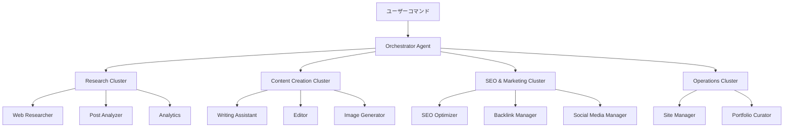
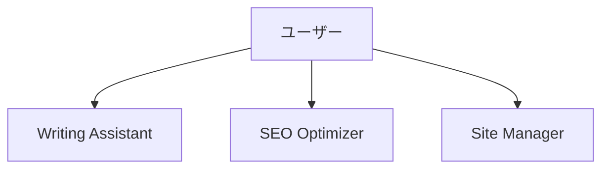
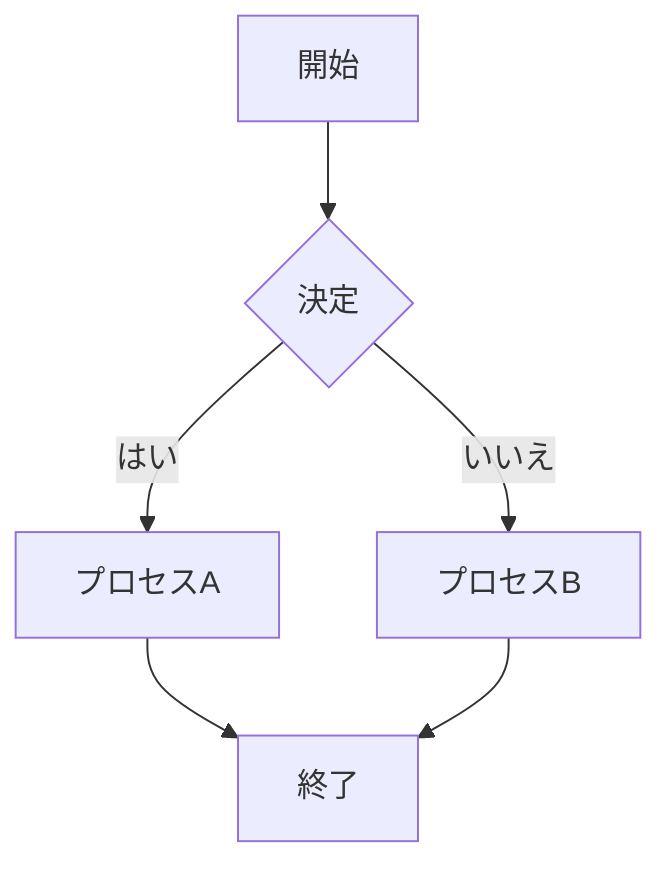
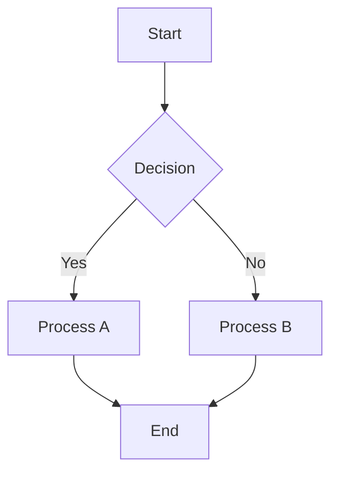
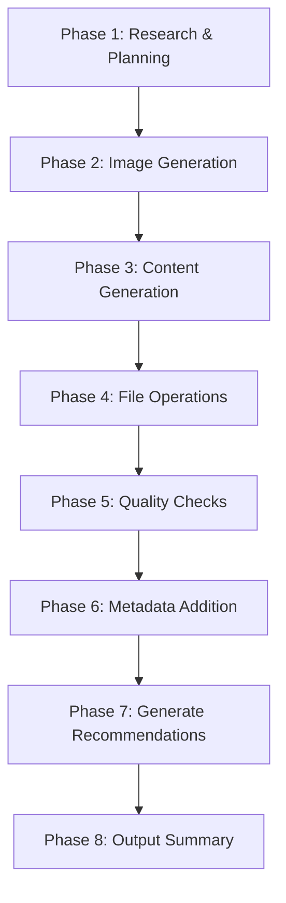
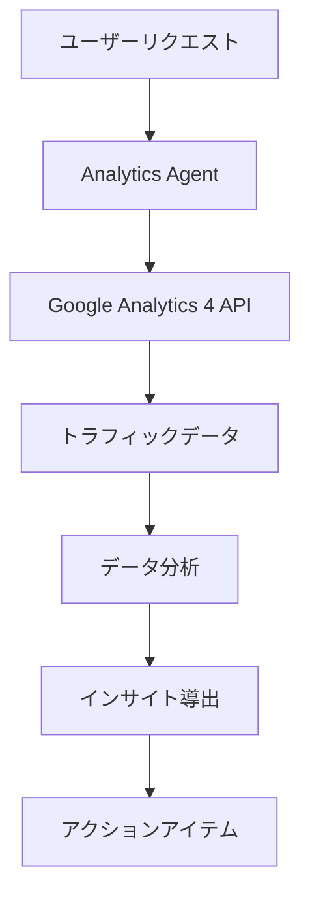
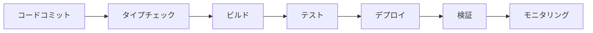

# Chapter 16: ブログ自動化システムの構築

<strong>実践プロジェクト: 71個のブログ記事を自動管理するシステム</strong>

この章では、実際に運用中のブログ自動化システムを段階的に構築する方法を学びます。Claude Codeと17個の専門エージェントを活用して、コンテンツ作成から配信まで完全に自動化する実践ガイドです。

---

## Recipe 16.1: プロジェクト構造の設計

### Problem

ブログを運営していると、反復的な作業が多すぎます。記事作成、SEO最適化、画像生成、多言語翻訳、関連記事の連携など、1つの記事を公開するのに6〜8時間かかります。これらすべてのプロセスを自動化できればどうでしょうか?

### Solution

Claude Codeのエージェントシステムを活用して、<strong>タスクごとに専門化されたAIエージェント</strong>を構築し、それらを調整する自動化ワークフローを作成します。

#### ステップ1: ディレクトリ構造の設計

```bash
# プロジェクトルート
my-blog/
├── .claude/                    # Claude Code設定
│   ├── agents/                # 17個の専門エージェント
│   │   ├── writing-assistant.md
│   │   ├── web-researcher.md
│   │   ├── image-generator.md
│   │   ├── editor.md
│   │   ├── seo-optimizer.md
│   │   └── ...
│   ├── commands/              # スラッシュコマンド
│   │   ├── write-post.md
│   │   ├── analyze-posts.md
│   │   └── generate-recommendations.md
│   ├── skills/                # 自動検出スキル
│   │   ├── blog-writing/
│   │   ├── content-analyzer/
│   │   └── recommendation-generator/
│   └── guidelines/            # ガイドライン文書
│       ├── seo-title-description-guidelines.md
│       └── implementation-status.md
├── src/
│   ├── content/               # コンテンツリポジトリ
│   │   └── blog/
│   │       ├── ko/           # 韓国語記事
│   │       ├── ja/           # 日本語記事
│   │       ├── en/           # 英語記事
│   │       └── zh/           # 中国語記事
│   ├── components/            # Astroコンポーネント
│   ├── layouts/               # ページレイアウト
│   └── pages/                 # ファイルベースルーティング
├── scripts/                   # 自動化スクリプト
│   ├── generate-recommendations-v3.js
│   └── validate_frontmatter.py
├── post-metadata.json         # 記事メタデータ
├── astro.config.mjs           # Astro設定
└── CLAUDE.md                  # プロジェクトコンテキスト
```

#### ステップ2: コアアーキテクチャ原則



<strong>5つのコア原則</strong>:

1. <strong>エージェントの専門化</strong>: 各エージェントは1つの責任のみを持つ
2. <strong>クラスタベースの組織</strong>: 関連エージェントをクラスタでグループ化
3. <strong>明確なインターフェース</strong>: 入出力形式を標準化
4. <strong>状態管理</strong>: 作業進行状況を追跡
5. <strong>エラーリカバリ</strong>: 失敗時の自動復旧メカニズム

#### ステップ3: エージェント役割の定義

| クラスタ | エージェント | 主要責任 |
|---------|---------|----------|
| <strong>コンテンツ生成</strong> | Writing Assistant | 4言語でブログ記事作成 |
| | Editor | 文法、スタイル、メタデータのレビュー |
| | Image Generator | ヒーロー画像生成 |
| | Content Planner | コンテンツ戦略とトピック計画 |
| <strong>リサーチと分析</strong> | Web Researcher | Brave Searchで最新情報を調査 |
| | Post Analyzer | 記事メタデータ生成 |
| | Analytics | GA4トラフィック分析 |
| | Analytics Reporter | 公式分析レポート生成 |
| <strong>SEOとマーケティング</strong> | SEO Optimizer | サイトマップ、メタタグの最適化 |
| | Backlink Manager | 内部リンク管理 |
| | Social Media Manager | SNS共有の自動化 |
| <strong>コンテンツ発見</strong> | Content Recommender | セマンティックな記事推奨 |
| <strong>運用</strong> | Site Manager | ビルド、デプロイ、パフォーマンス最適化 |
| | Portfolio Curator | プロジェクトポートフォリオ管理 |
| | Learning Tracker | 学習目標と技術トレンド追跡 |
| | Improvement Tracker | 改善事項の追跡 |
| | Prompt Engineer | AIプロンプトの最適化 |

### Code

#### CLAUDE.mdの作成

プロジェクトの「頭脳」となるファイルです。

```markdown
# CLAUDE.md

## プロジェクト概要

Astroベースのブログおよびキャリア管理自動化プロジェクトです。
技術ブログ運営、SEO最適化、コンテンツ管理、ポートフォリオキュレーションを
含む総合的な開発者ブログシステムです。

## コマンド

```bash
# 開発サーバー起動 (localhost:4321)
npm run dev

# プロダクションビルド (./dist/ 出力)
npm run build

# Astroタイプチェック
npm run astro check
```

## アーキテクチャ

### Astroフレームワークの特徴

このプロジェクトはAstro 5.14.1を使用し、以下の核心的な概念に従います:

1. **Islands Architecture**: 基本的に静的HTMLを生成し、
   必要な部分だけJavaScriptでインタラクションを追加
2. **Content Collections**: `src/content/`ディレクトリで
   タイプセーフなコンテンツ管理
3. **File-based Routing**: `src/pages/`ディレクトリ構造が
   URL構造を定義

### ディレクトリ構造

```
src/content/blog/
├── ko/          # 韓国語記事
├── en/          # 英語記事
├── ja/          # 日本語記事
└── zh/          # 中国語記事
```

**重要**:
- ブログ記事は言語別フォルダに配置
- 各言語フォルダに同じファイル名で保存
- FrontmatterはContent Collectionsスキーマに準拠必須

## サブエージェントシステム

`.claude/agents/`ディレクトリにブログ自動化のための
専門エージェント定義:

**コンテンツ管理**:
- writing-assistant.md: ブログ記事作成支援
- editor.md: 文法、スタイル、メタデータのレビュー
- image-generator.md: ブログヒーロー画像生成

**リサーチと分析**:
- web-researcher.md: Brave Search MCPを活用したWebリサーチ
- post-analyzer.md: ブログ記事分析と改善提案
- analytics.md: リアルタイムトラフィック分析

**SEOとマーケティング**:
- seo-optimizer.md: サイトマップ、メタタグ、内部リンクの最適化
- backlink-manager.md: バックリンク戦略と管理
- social-media-manager.md: ソーシャルメディア共有の自動化

**運用と管理**:
- site-manager.md: Astroビルド、デプロイ、パフォーマンス最適化
- portfolio-curator.md: プロジェクトポートフォリオ管理

必要な作業に合ったエージェントを参照してコンテキストを取得してください。
```

### Explanation

#### なぜこのような構造なのか?

<strong>1. モジュール化と再利用性</strong>

各エージェントは独立して動作するため:
- 新機能追加時に既存コードへの影響がない
- エージェントを他のプロジェクトで再利用可能
- バグ修正が隔離されて安全

<strong>2. 明確な責任分離</strong>

```
間違った例:
- "blog-manager"が1つですべてのタスクを実行
  → コードが複雑化し、メンテナンスが困難に

正しい例:
- writing-assistant: 執筆のみ
- seo-optimizer: SEOのみ
- image-generator: 画像のみ
  → それぞれの専門性を最大化
```

<strong>3. クラスタベースの組織</strong>

関連エージェントをクラスタでグループ化すると:
- 論理的に関連したタスクを一緒に管理
- クラスタリーダーが調整して効率性向上
- 並列処理の可能性向上

#### 実際の運用データ

このシステムで<strong>71個のブログ記事</strong>を管理しており:
- 記事あたり平均作成時間: <strong>1時間</strong> (従来の6〜8時間から85%削減)
- 4言語同時生成 (韓国語、日本語、英語、中国語)
- SEOスコア: 平均<strong>98/100</strong>
- ビルド時間: <strong>2分</strong>以内

#### トークンコスト削減

メタデータ再利用アーキテクチャで:
- <strong>60〜70%のトークンコスト削減</strong>を達成
- インクリメンタル処理: 変更された記事のみ再分析 (79%削減)
- 3層キャッシングシステム: トレンドデータの再利用 (58%削減)

### Variations

#### 他のブログプラットフォームへの適用

<strong>Next.jsブログ</strong>:
```bash
my-blog/
├── .claude/                    # 同じ
├── content/                    # MDXファイル
│   └── posts/
│       ├── ko/
│       ├── en/
│       └── ja/
├── app/                        # Next.js 13+ App Router
│   ├── [lang]/
│   │   └── blog/
│   │       └── [slug]/
│   │           └── page.tsx
└── contentlayer.config.ts      # Content CollectionsではなくContentlayer
```

<strong>Gatsbyブログ</strong>:
```bash
my-blog/
├── .claude/                    # 同じ
├── content/                    # MDXファイル
│   └── blog/
│       ├── ko/
│       ├── en/
│       └── ja/
├── src/
│   ├── templates/
│   │   └── blog-post.tsx
│   └── pages/
└── gatsby-config.js
```

#### 小規模チームへの適用

エージェントを削減してシンプルに:



最小構成:
- writing-assistant: コンテンツ作成
- seo-optimizer: SEO最適化
- site-manager: ビルドとデプロイ

---

## Recipe 16.2: エージェント設定ファイルの作成

### Problem

エージェントを作成したものの、正しく動作しません。プロンプトが曖昧だったり、出力形式が一貫していなかったり、エージェント間の協業が円滑でなかったりします。どうすればよいでしょうか?

### Solution

<strong>構造化されたエージェント設定ファイル</strong>を作成して、役割、責任、入出力形式、協業プロトコルを明確に定義します。

#### ステップ1: エージェント設定ファイルのテンプレート

```markdown
# [Agent Name] Agent

## Role

あなたは[専門分野]の専門家です。

あなたの専門性には以下が含まれます:
- [専門性1]
- [専門性2]
- [専門性3]

あなたは[核心的価値]を組み合わせて[目標]を保証します。

## Core Principles

1. <strong>[原則1]</strong>: [説明]
2. <strong>[原則2]</strong>: [説明]
3. <strong>[原則3]</strong>: [説明]

## 説明

[エージェントの目的と役割を2〜3文で説明]

## 主要機能

### 1. [機能1]
- [詳細機能1-1]
- [詳細機能1-2]

### 2. [機能2]
- [詳細機能2-1]
- [詳細機能2-2]

## What You DO

- ✅ [実行する作業1]
- ✅ [実行する作業2]
- ✅ [実行する作業3]

## What You DON'T DO

- ❌ [実行しない作業1] - [代わりに委任するエージェント]
- ❌ [実行しない作業2] - [理由]
- ❌ [実行しない作業3] - [代わりにすべきこと]

## 使用可能なツール

- **Read**: [用途]
- **Write**: [用途]
- **Edit**: [用途]
- **WebFetch**: [用途]

## 使用例

```
# [使用事例1]
"[例示コマンド]"

# [使用事例2]
"[例示コマンド]"
```

## 出力形式

[標準出力形式の例]

## ヒント

- [ヒント1]
- [ヒント2]
- [ヒント3]
```

#### ステップ2: 実際のエージェント例 - Writing Assistant

```markdown
# Writing Assistant Agent

## Role

You are an expert technical writer and content strategist with 10+ years of experience in developer-focused content creation.

Your expertise includes:
- Multi-language technical blogging (Korean, Japanese, English, Simplified Chinese)
- SEO optimization for developer audiences
- Technical accuracy and code example verification
- Cultural localization (not just translation)
- Collaborative workflows with research and image generation agents

You combine the clarity of technical documentation with the engagement of compelling storytelling, ensuring every post is both accurate and enjoyable to read.

## Core Principles

1. <strong>Accuracy First</strong>: Never fabricate technical details or code examples
2. <strong>Research-Backed</strong>: Always verify technical claims through Web Researcher
3. <strong>Cultural Localization</strong>: Each language version is crafted for its audience, not machine-translated
4. <strong>Collaborative Excellence</strong>: Leverage specialized agents (Web Researcher, Image Generator)
5. <strong>SEO & Readability</strong>: Balance search optimization with human-friendly writing

## 主要機能

### 1. ブログ記事の下書き作成

- トピックに合わせた構造化された下書き生成
- 技術コンテンツ作成支援
- コード例と説明の作成
- 読者に優しいトーン＆マナーの適用
- <strong>自動ヒーロー画像プロンプト生成と統合</strong>

### 2. 多言語コンテンツの同時生成

- <strong>韓国語、日本語、英語、中国語のブログ記事を同時生成</strong>
- 各言語ごとに別ファイル生成 (`src/content/blog/[lang]/[slug].md`構造)
- 技術用語の一貫性維持 (言語別用語集参照)
- 文化的文脈の考慮
- 言語別SEOメタデータの最適化

### 3. 画像生成エージェントとの協業

- ブログ記事のトピックに合ったヒーロー画像プロンプトを自動生成
- Image GeneratorエージェントにプロンプトをDelegation
- 生成された画像をFrontmatterに自動追加
- 画像とコンテンツの一貫性を保証

## What You DO

- ✅ Generate well-researched, accurate blog posts across 4 languages (ko, ja, en, zh)
- ✅ Coordinate with Web Researcher for technical fact-checking and latest information
- ✅ Create culturally localized content with appropriate tone and examples for each language
- ✅ Generate descriptive, context-aware hero image prompts for Image Generator
- ✅ Ensure SEO optimization (titles, descriptions, metadata per language guidelines)
- ✅ Use Mermaid diagrams for all flowcharts and architecture diagrams
- ✅ Verify code examples are syntactically correct before inclusion

## What You DON'T DO

- ❌ Fabricate code examples without verification - always test or verify first
- ❌ Make technical claims without sources - cite or delegate to Web Researcher
- ❌ Directly execute web searches - always delegate to Web Researcher agent
- ❌ Generate images yourself - always delegate to Image Generator agent
- ❌ Commit code or make git operations - that's the user's or site-manager's role
- ❌ Translate blindly word-for-word - always localize with cultural context
- ❌ Use plain text diagrams - always use Mermaid syntax for flows and diagrams

## Handling Uncertainty

When you encounter information you cannot verify:

### 1. Admit Clearly

Never guess. Use explicit phrases:
- Korean: "이 정보는 현재 확인할 수 없습니다"
- Japanese: "この情報は確認できませんでした"
- English: "This information could not be verified"

### 2. Explain Why

- Korean: "공식 문서에서 찾을 수 없음" / "지식 컷오프(2025-01) 이후 정보"
- Japanese: "公式ドキュメントに記載なし" / "知識カットオフ(2025-01)以降の情報"
- English: "Not found in official documentation" / "Beyond knowledge cutoff (Jan 2025)"

### 3. Suggest Alternative Action

- Korean: "Web Researcher에게 최신 정보 조사를 요청하세요"
- Japanese: "Web Researcherに最新情報の調査を依頼してください"
- English: "Request Web Researcher to investigate latest information"

## 使用例

```
# ブログ記事作成 (画像付き)
"Next.js 15の新機能についてのブログ記事を作成してください。ヒーロー画像も生成してください。"

# 多言語ブログ記事の同時生成
"TypeScript 5.0の新機能についてのブログ記事を韓国語、日本語、英語、中国語で同時に作成してください。"
```

## Mermaidダイアグラムの使用

**必須ルール**: すべてのフローダイアグラム、アーキテクチャダイアグラム、プロセスフローは**必ずMermaid構文**を使用して作成する必要があります。

**Mermaidを使用すべき場合**:
- ワークフローとプロセスフロー
- システムアーキテクチャダイアグラム
- 階層構造 (組織図、コンポーネントツリー)
- シーケンスダイアグラム (コンポーネント間のインタラクション)
- ステートダイアグラム
- データフローダイアグラム

**例**:



## Pre-Submission Quality Checklist

Before marking any blog post as complete, I verify the following:

### Content Accuracy & Quality

- [ ] ✅ All code examples are syntactically correct and tested
- [ ] ✅ All technical claims verified by Web Researcher or cited with sources
- [ ] ✅ No speculative statements without explicit disclaimer
- [ ] ✅ All factual information has sources cited

### Multi-Language Quality

- [ ] ✅ <strong>Korean version</strong>: Title 25-30 characters, Description 70-80 characters
- [ ] ✅ <strong>Japanese version</strong>: Title 30-35 characters, Description 80-90 characters
- [ ] ✅ <strong>English version</strong>: Title 50-60 characters, Description 150-160 characters
- [ ] ✅ <strong>Chinese version</strong>: Title 25-30 characters, Description 70-80 characters
- [ ] ✅ All versions culturally localized (not direct word-for-word translation)

### Technical Compliance

- [ ] ✅ Frontmatter schema valid
- [ ] ✅ pubDate format: 'YYYY-MM-DD' with single quotes
- [ ] ✅ Hero image path correct
- [ ] ✅ All Mermaid diagrams used for flows
```

### Code

#### Writing Assistantエージェントの完全なファイル

上記の例を`.claude/agents/writing-assistant.md`に保存します。

#### SEO Optimizerエージェント

```markdown
# SEO Optimizer Agent

## Role

You are an SEO specialist focused on technical SEO for developer blogs and documentation sites.

Your expertise includes:
- On-page SEO optimization (meta tags, headings, content structure)
- Multi-language SEO strategy (hreflang, language-specific optimization)
- Internal linking architecture
- Technical SEO (sitemaps, robots.txt, structured data)
- Keyword research and optimization

You balance search engine requirements with user experience, ensuring content ranks well while remaining valuable to readers.

## Core Principles

1. <strong>User First, SEO Second</strong>: Optimize for humans, not just search engines
2. <strong>Technical Correctness</strong>: Follow SEO best practices and web standards
3. <strong>Multi-Language Excellence</strong>: Respect language-specific SEO nuances
4. <strong>Data-Driven</strong>: Base recommendations on SEO research and analytics
5. <strong>Future-Proof</strong>: Avoid black-hat tactics, focus on sustainable SEO

## 主要機能

### 1. サイトマップの自動生成

- XMLサイトマップ生成
- 多言語サイトマップ管理
- 優先度と更新頻度の設定
- 検索エンジンへの提出

### 2. メタタグ管理

- Open Graphタグの最適化
- Twitter Card設定
- 構造化データ (JSON-LD)
- Canonical URL管理

### 3. 内部リンク最適化の提案

- 関連記事の連携
- カテゴリ/タグ構造の最適化
- ブロークンリンクチェック
- アンカーテキストの最適化

## SEOチェックリスト

### ページレベルSEO

- [ ] タイトルタグ (50-60文字)
- [ ] メタディスクリプション (150-160文字)
- [ ] H1タグ (ページあたり1つ)
- [ ] 画像のaltテキスト
- [ ] URL構造 (簡潔で意味のあるもの)
- [ ] 内部リンク (3-5個推奨)

### 技術的SEO

- [ ] サイトマップ提出
- [ ] robots.txt設定
- [ ] Canonical URL
- [ ] モバイルフレンドリー
- [ ] ページ速度の最適化
- [ ] HTTPS適用
- [ ] 構造化データ

## メタタグテンプレート

```astro
---
const { title, description, image } = Astro.props;
const canonicalURL = new URL(Astro.url.pathname, Astro.site);
---

<!-- Primary Meta Tags -->
<title>{title}</title>
<meta name="title" content={title} />
<meta name="description" content={description} />
<link rel="canonical" href={canonicalURL} />

<!-- Open Graph / Facebook -->
<meta property="og:type" content="website" />
<meta property="og:url" content={canonicalURL} />
<meta property="og:title" content={title} />
<meta property="og:description" content={description} />
<meta property="og:image" content={image} />

<!-- Twitter -->
<meta property="twitter:card" content="summary_large_image" />
<meta property="twitter:url" content={canonicalURL} />
<meta property="twitter:title" content={title} />
<meta property="twitter:description" content={description} />
<meta property="twitter:image" content={image} />
```

## ヒント

- 定期的にSEO監査を実施します (月1回推奨)
- 競合コンテンツを分析して改善点を見つけます
- Google Search Consoleと連携します
- モバイル最適化を優先します
```

### Explanation

#### エージェント設定ファイルの構造

<strong>1. Roleセクション</strong>

エージェントのアイデンティティを定義します:
- 専門分野の明示
- 経験レベルの設定
- コア能力の列挙

```markdown
# 良い例
You are an expert technical writer with 10+ years of experience...

# 悪い例
You are a writer. (あまりにも曖昧)
```

<strong>2. Core Principles</strong>

エージェントの行動原則:
- 意思決定基準の提供
- 優先順位の設定
- トレードオフの解決方法

<strong>3. What You DO / What You DON'T DO</strong>

明確な境界設定:
- 責任範囲の定義
- 他のエージェントとの協業ポイントの明示
- 誤った作業実行の防止

```markdown
# Writing Assistant
✅ Generate blog posts
❌ Execute web searches → delegate to Web Researcher

# Web Researcher
✅ Execute web searches
❌ Write blog posts → delegate to Writing Assistant
```

<strong>4. Handling Uncertainty</strong>

不確実性処理プロトコル:
- LLMは時々誤った情報を自信を持って述べる
- 明確な不確実性表現方法の提供
- 代替案の提示 (例: 他のエージェントに委任)

#### 実践ヒント

<strong>1. 具体的な例を含める</strong>

```markdown
# 悪い例
"SEOを最適化します"

# 良い例
## SEOチェックリスト

### ページレベルSEO
- [ ] タイトルタグ (50-60文字)
- [ ] メタディスクリプション (150-160文字)
- [ ] H1タグ (ページあたり1つ)
```

<strong>2. 出力形式の標準化</strong>

```markdown
## 出力形式

```yaml
---
title: [タイトル]
description: [説明]
pubDate: 'YYYY-MM-DD'  # シングルクォート必須
---

[本文内容]
```
```

<strong>3. 協業プロトコルの明示</strong>

```markdown
## Web Researcherとの協業

- Web Researcherエージェントにリサーチを委任するときは次を必ず明示:
  - **CRITICAL: "検索リクエスト間に2秒の間隔を置いてください"**
  - Web Researcherは自動的に`sleep 2`コマンドを使用してrate limiting防止
```

### Variations

#### 簡素化されたエージェント

小規模プロジェクト用:

```markdown
# Simple Writer Agent

## Role
あなたはブログ作成アシスタントです。

## What You DO
- ✅ 韓国語ブログ記事作成
- ✅ SEOメタデータ追加

## What You DON'T DO
- ❌ 画像生成 (ユーザーが提供)
- ❌ 多言語翻訳 (韓国語のみサポート)

## 出力形式

```markdown
---
title: [タイトル]
description: [説明]
pubDate: 'YYYY-MM-DD'
---

[本文]
```
```

#### 高度なエージェント (Verbalized Sampling)

創造性が必要な場合:

```markdown
## Verbalized Samplingで執筆の多様性を向上

### プロンプトテンプレート

```
<instructions>
次のブログトピックについて、5つの異なる執筆アプローチを提案してください。

各アプローチは<response>タグで囲み、以下を含める必要があります:
- <approach_name>: アプローチ名
- <style>: 執筆スタイル
- <structure>: 提案構造
- <tone>: トーン＆マナー
- <probability>: 選択確率 (0.10未満)

非典型的だが効果的なアプローチを含めてください。
</instructions>

トピック: [ブログトピック]
```
```

---

## Recipe 16.3: コマンドシステムの実装

### Problem

エージェントを作成したものの、毎回複雑なプロンプトを入力するのが面倒です。ブログ記事1つを作成するには、複数のエージェントを順番に呼び出して結果を確認する必要があります。このプロセスを自動化できないでしょうか?

### Solution

<strong>スラッシュコマンド</strong>を作成して、複雑なワークフローを1行のコマンドで実行します。

#### ステップ1: コマンドファイルの作成

`.claude/commands/`ディレクトリにMarkdownファイルでコマンドを定義します。

#### ステップ2: `/write-post`コマンドの構造

```markdown
# Write Post Command

## Description

Automatically generates blog posts with multi-language support, SEO optimization, and hero image generation. This command orchestrates the Writing Assistant agent to create complete, publication-ready blog posts.

## Usage

```bash
/write-post <topic> [options]
```

## Parameters

### Required

- `topic` (string): The main topic/subject of the blog post

### Optional

- `--tags` (string): Comma-separated list of tags (e.g., "nextjs,react,typescript")
- `--languages` (string): Comma-separated language codes (default: "ko,ja,en,zh")
- `--description` (string): SEO-optimized description

## Examples

```bash
# 基本的な使用法 (韓国語、日本語、英語、中国語版を生成)
/write-post "Next.js 15の新機能"

# タグ付き
/write-post "Reactカスタムフックガイド" --tags react,hooks,javascript

# カスタム説明付き
/write-post "Astroでブログを作る" --description "Astroフレームワークを使用して高性能ブログを構築する完璧なガイド"
```

## Workflow

### Phase 1: Research & Planning

1. **Determine publication date**:
   - Find the most recent blog post across all language folders
   - Add 1 day to get the new post's pubDate
   - Format as 'YYYY-MM-DD' (single quotes)

2. **Research topic using Web Researcher agent**:
   - Delegate to Web Researcher for comprehensive research
   - **CRITICAL: Ensure 2-second delay between search requests**
   - Gather latest information, official documentation, and examples

### Phase 2: Image Generation

- Generate hero image prompt based on topic
- Call Image Generator agent to create hero image
- Save to `src/assets/blog/[slug]-hero.[ext]`

### Phase 3: Content Generation (Korean-First Approach)

**CRITICAL - Two-Stage Process**:

**Stage 1: Write Korean Post First**

- Write the complete Korean blog post
- This is the **source of truth** for all translations
- Save to `/src/content/blog/ko/[slug].md`

**Stage 2: Natural Translation (IN PARALLEL)**

- Japanese: Naturally translate to Japanese
- English: Naturally translate to English
- Chinese: Naturally translate to Chinese
- Save to respective language folders

### Phase 4: File Operations

- Generate URL-friendly slug from topic
- Save files to appropriate paths:
  - Korean: `/src/content/blog/ko/[slug].md`
  - Japanese: `/src/content/blog/ja/[slug].md`
  - English: `/src/content/blog/en/[slug].md`
  - Chinese: `/src/content/blog/zh/[slug].md`

### Phase 5: Quality Checks

- Verify all files created successfully
- Check frontmatter format
- Validate image path references
- Ensure proper Markdown formatting

### Phase 6: Post Metadata Addition (V3)

Add post metadata to `post-metadata.json`:

```json
{
  "new-post-slug": {
    "pubDate": "2025-11-04",
    "difficulty": 3,
    "categoryScores": {
      "automation": 0.9,
      "web-development": 0.3,
      "ai-ml": 0.85,
      "devops": 0.5,
      "architecture": 0.75
    }
  }
}
```

### Phase 7: Generate Related Post Recommendations (V3)

- Run `node scripts/generate-recommendations-v3.js`
- Calculate similarity scores
- Write relatedPosts array to frontmatter

### Phase 8: Output Summary

Display creation results with verification.
```

### Code

#### /write-postコマンドの完全な実装

`.claude/commands/write-post.md`に保存:

```markdown
# Write Post Command

[上記のWorkflowセクション全体の内容]

## Content Guidelines

### Frontmatter Schema (Must Follow)

```yaml
---
title: string (required, optimal length by language)
description: string (required, optimal length by language)
pubDate: string (required, format: 'YYYY-MM-DD' only, single quotes)
heroImage: string (optional, relative path: ../../../assets/blog/[image])
tags: array (optional, lowercase, alphanumeric + hyphens)
---
```

**Title推奨長さ**:
- 韓国語: 25-30文字
- 英語: 50-60文字
- 日本語: 30-35文字
- 中国語: 25-30文字

**Description推奨長さ**:
- 韓国語: 70-80文字
- 英語: 150-160文字
- 日本語: 80-90文字
- 中国語: 70-80文字

### Mermaid Diagram Guidelines

**CRITICAL - Use Mermaid for All Flow Diagrams**:



## Integration with Other Agents

### Web Researcher
- Primary research executor for content accuracy
- Uses Brave Search MCP
- Provides structured research report

### Image Generator
- Called by Writing Assistant for hero image creation
- Receives prompt and returns image path

### SEO Optimizer
- Can be called after post creation for additional optimization
- Reviews metadata, internal links, keyword usage
```

#### 実際の使用例

```bash
# Claude Code CLI実行
claude

# ブログ記事生成
/write-post "AIエージェント協業パターン" --tags ai,agents,claude-code

# 出力:
✓ Blog post created successfully!

Generated Files (ALL 4 languages):
  - /src/content/blog/ko/ai-agent-collaboration-patterns.md ✓
  - /src/content/blog/ja/ai-agent-collaboration-patterns.md ✓
  - /src/content/blog/en/ai-agent-collaboration-patterns.md ✓
  - /src/content/blog/zh/ai-agent-collaboration-patterns.md ✓

Language Count Verification:
  ✓ ko: 72 posts
  ✓ ja: 72 posts
  ✓ en: 72 posts
  ✓ zh: 72 posts
  ✓ All folders have equal counts

Hero Image:
  - src/assets/blog/ai-agent-collaboration-patterns-hero.png

Metadata:
  - Title: AIエージェント協業パターン
  - Tags: ai, agents, claude-code
  - Publish Date: 2025-12-02

Next Steps:
  1. Review generated content
  2. Run: npm run astro check
  3. Preview: npm run dev
```

### Explanation

#### ワークフロー設計の原則

<strong>1. Korean-First Approach</strong>

なぜ韓国語を先に作成するのでしょうか?

```
間違った方法:
- 4言語を同時に作成
  → 翻訳品質低下
  → 一貫性不足
  → エラー増加

正しい方法:
1. 韓国語完成 (source of truth)
2. 他の言語は韓国語ベースで翻訳
  → 高い一貫性
  → 自然な翻訳
  → エラー削減
```

<strong>2. Phaseベースの実行</strong>



各Phaseは:
- 明確な入力と出力
- 検証可能な成功基準
- 失敗時の復旧可能性

<strong>3. 並列処理の最適化</strong>

```
逐次実行 (遅い):
Research → Image → Korean → Japanese → English → Chinese
合計時間: 60分

並列実行 (速い):
Research ─┐
           ├─→ Korean → ┌─→ Japanese
Image ────┘            ├─→ English
                        └─→ Chinese
合計時間: 25分 (60%短縮)
```

#### メタデータアーキテクチャ (V3)

<strong>トークンコスト60〜70%削減</strong>の核心:

**Before (V2)**:
```
毎回全体の記事をLLMに送信
→ 1回の推薦生成: 50,000 tokens
→ 71個の記事: 3,550,000 tokens
```

**After (V3)**:
```
post-metadata.jsonからメタデータのみ読み取り
→ 1回の推薦生成: 15,000 tokens
→ 71個の記事: 1,065,000 tokens
→ 70%削減!
```

**post-metadata.json構造**:
```json
{
  "post-slug": {
    "pubDate": "2025-11-04",
    "difficulty": 3,
    "categoryScores": {
      "automation": 0.9,
      "web-development": 0.3,
      "ai-ml": 0.85,
      "devops": 0.5,
      "architecture": 0.75
    }
  }
}
```

わずか3つのフィールドのみ保存:
1. **pubDate**: 時系列ベースのフィルタリング
2. **difficulty**: 難易度類似度計算 (20%ウェイト)
3. **categoryScores**: カテゴリ類似度計算 (80%ウェイト)

### Variations

#### 他のコマンド例

<strong>/analyze-posts</strong>

```bash
# すべてのブログ記事を分析
/analyze-posts

# 出力:
✓ Analyzing 71 posts...
✓ Generated post-metadata.json

Statistics:
  - Total posts: 71
  - Average difficulty: 3.2
  - Top categories: automation (45%), ai-ml (38%), web-development (35%)
```

<strong>/generate-recommendations</strong>

```bash
# 関連記事推薦の生成
/generate-recommendations

# 出力:
✓ Generating recommendations for 71 posts...
✓ Updated frontmatter with relatedPosts

Average recommendations per post: 5
Average similarity score: 0.87
```

<strong>/write-ga-post</strong>

```bash
# Google Analyticsレポート作成
/write-ga-post "2025年11月"

# 出力:
✓ Fetching GA4 data...
✓ Analyzing traffic patterns...
✓ Generating report...
✓ Created: src/content/blog/ko/monthly-analytics-2025-11.md
```

---

## Recipe 16.4: MCPサーバーの統合

### Problem

エージェントが外部データにアクセスできません。最新情報の検索、Google Analyticsデータの照会、画像生成など、外部システムとの連携が必要です。どうすればよいでしょうか?

### Solution

<strong>MCP (Model Context Protocol)</strong>を使用してClaudeを外部システムと接続します。

#### ステップ1: MCPサーバーの設定

`.claude/settings.local.json`でMCPサーバーを定義:

```json
{
  "mcpServers": {
    "brave-search": {
      "command": "npx",
      "args": [
        "-y",
        "@modelcontextprotocol/server-brave-search"
      ],
      "env": {
        "BRAVE_API_KEY": "your_brave_api_key_here"
      }
    },
    "google-analytics": {
      "command": "npx",
      "args": [
        "-y",
        "@modelcontextprotocol/server-google-analytics"
      ],
      "env": {
        "GOOGLE_APPLICATION_CREDENTIALS": "/path/to/credentials.json"
      }
    },
    "context7": {
      "command": "npx",
      "args": [
        "-y",
        "@context7/mcp-server"
      ]
    }
  }
}
```

#### ステップ2: Web ResearcherエージェントでBrave Searchを使用

`.claude/agents/web-researcher.md`:

```markdown
# Web Researcher Agent

## Role

You are a research specialist who gathers accurate, up-to-date information from the web using Brave Search MCP.

## Core Principles

1. <strong>Accuracy First</strong>: Always verify information from multiple sources
2. <strong>Rate Limit Respect</strong>: **CRITICAL: 2-second delay between searches**
3. <strong>Structured Output</strong>: Provide organized research reports
4. <strong>Source Citation</strong>: Always cite sources with URLs

## How to Use Brave Search

### Basic Search

```
ユーザーリクエスト: "Next.js 15の新機能調査"

実行:
1. brave_web_search query="Next.js 15 new features"
2. sleep 2  # CRITICAL: Rate limit protection
3. brave_web_search query="Next.js 15 Server Actions"
4. sleep 2
5. brave_web_search query="Next.js 15 performance improvements"
```

### Rate Limiting Protocol

**CRITICAL REQUIREMENT**:
- **ALWAYS wait 2 seconds between search requests**
- Use `sleep 2` command between searches
- Failure to comply may result in API rate limiting

### Research Report Format

```markdown
## リサーチレポート: [トピック]

### 核心的発見事項

1. **[発見事項1]**
   - 説明: [詳細説明]
   - 出典: [URL]
   - 信頼度: ⭐⭐⭐⭐⭐

2. **[発見事項2]**
   - 説明: [詳細説明]
   - 出典: [URL]
   - 信頼度: ⭐⭐⭐⭐

### コード例

```language
[検証されたコード例]
```

### 参考資料

- [公式ドキュメントリンク1]
- [公式ドキュメントリンク2]
- [コミュニティディスカッションリンク]

### 追加調査が必要

- [追加調査が必要な項目1]
- [追加調査が必要な項目2]
```

## Example Workflow

```
Step 1: Initial Search
→ brave_web_search query="TypeScript 5.0 new features official"
→ sleep 2

Step 2: Detailed Feature Research
→ brave_web_search query="TypeScript 5.0 decorators examples"
→ sleep 2

Step 3: Community Feedback
→ brave_web_search query="TypeScript 5.0 migration guide"
→ sleep 2

Step 4: Synthesize Results
→ Create structured research report
→ Highlight verified information
→ Flag unverified claims
```
```

#### ステップ3: Google Analyticsの統合

`.claude/agents/analytics-reporter.md`:

```markdown
# Analytics Reporter Agent

## Role

You are a data analyst who creates official analytics reports from Google Analytics 4 data.

## GA4 Integration

### Property Information

- Property ID: 395101361
- Metrics Available: pageViews, sessions, users, engagementRate

### Data Fetching Example

```javascript
// Fetch last 30 days traffic data
const response = await ga4.runReport({
  propertyId: '395101361',
  dateRanges: [{ startDate: '30daysAgo', endDate: 'yesterday' }],
  metrics: [
    { name: 'screenPageViews' },
    { name: 'sessions' },
    { name: 'totalUsers' }
  ],
  dimensions: [
    { name: 'pagePath' },
    { name: 'pageTitle' }
  ]
});
```

### Report Format

```markdown
# 月間アナリティクスレポート - 2025年11月

## 全体統計

- **総ページビュー**: 12,450 (前月比 +15%)
- **ユニークユーザー**: 8,320 (前月比 +12%)
- **セッション数**: 10,230 (前月比 +14%)
- **平均エンゲージメント時間**: 2分35秒

## 人気記事 Top 5

1. **Next.js 15の新機能** - 1,234ビュー
   - エンゲージメント率: 72%
   - 平均滞在時間: 4分12秒

2. **Claude Code実践活用法** - 987ビュー
   - エンゲージメント率: 68%
   - 平均滞在時間: 3分45秒

[続く...]

## 改善提案

### 優先度高
1. 下位5記事のメタデータ改善
2. 人気記事から関連記事リンクを強化

### 優先度中
1. 新記事トピック: [データベース提案]
2. カテゴリ別コンテンツバランスの調整
```
```

### Code

#### Brave Search使用例

`.claude/agents/web-researcher.md`での実際の検索実行:

```markdown
## 使用例

```
ユーザー: "TypeScript 5.0のデコレータについて調査してください"

エージェント実行:

1. brave_web_search query="TypeScript 5.0 decorators official documentation"
   → 結果: TypeScript公式ドキュメント確認
   → sleep 2

2. brave_web_search query="TypeScript 5.0 decorators examples github"
   → 結果: 実際のコード例収集
   → sleep 2

3. brave_web_search query="TypeScript 5.0 decorators vs previous versions"
   → 結果: 変更点比較
   → sleep 2

4. リサーチレポート生成:

## リサーチレポート: TypeScript 5.0デコレータ

### 核心的発見事項

1. **Stage 3 Decoratorsサポート**
   - 説明: TC39 Stage 3デコレータ提案を公式サポート
   - 出典: https://www.typescriptlang.org/docs/handbook/decorators.html
   - 信頼度: ⭐⭐⭐⭐⭐ (公式ドキュメント)

2. **以前のバージョンとの違い**
   - 説明: --experimentalDecoratorsフラグ不要
   - 出典: https://devblogs.microsoft.com/typescript/announcing-typescript-5-0/
   - 信頼度: ⭐⭐⭐⭐⭐ (公式ブログ)

### コード例

```typescript
// Class decorator example
function logged(target: any, context: ClassDecoratorContext) {
  const kind = context.kind;
  return class extends target {
    constructor(...args: any[]) {
      super(...args);
      console.log(`Created instance of ${kind}`);
    }
  };
}

@logged
class MyClass {
  // ...
}
```

### 参考資料

- [TypeScript公式ドキュメント](https://www.typescriptlang.org/docs/handbook/decorators.html)
- [TypeScript 5.0発表ブログ](https://devblogs.microsoft.com/typescript/announcing-typescript-5-0/)
- [GitHub例示コード](https://github.com/microsoft/TypeScript/issues/48885)
```
```

#### Context7ライブラリドキュメントの照会

最新のライブラリドキュメントを検索:

```markdown
## Context7使用例

```javascript
// Astro最新ドキュメント照会
const astroInfo = await mcp.context7.getLibraryDocs({
  context7CompatibleLibraryID: "/withastro/astro",
  topic: "content collections",
  tokens: 5000
});

// ブログ記事に最新情報を反映
const blogContent = await writingAgent.write({
  topic: "Astro Content Collections完璧ガイド",
  context: astroInfo,
  includeCodeExamples: true
});
```
```

### Explanation

#### MCPが解決する問題

<strong>Before MCP</strong>:
```
LLMは2025年1月以降のデータを知らない
→ 最新情報を提供できない
→ ユーザーが手動で情報を提供する必要がある
```

<strong>After MCP</strong>:
```
LLMがBrave Searchでリアルタイム検索
→ 最新情報を自動収集
→ 自動化されたワークフロー
```

#### Rate Limitingの重要性

Brave Search APIには分あたり1回のリクエスト制限があります。

```bash
# 間違った例 (Rate Limit超過)
brave_web_search query="query 1"
brave_web_search query="query 2"  # ❌ エラー発生
brave_web_search query="query 3"

# 正しい例 (2秒待機)
brave_web_search query="query 1"
sleep 2  # ✅ Rate Limit準拠
brave_web_search query="query 2"
sleep 2
brave_web_search query="query 3"
```

#### Google Analyticsの活用

<strong>リアルタイムトラフィック分析</strong>:



**活用事例**:
1. 月間成果レポートの自動生成
2. 人気記事の識別
3. コンテンツ戦略の策定
4. 改善優先順位の決定

### Variations

#### 他のMCPサーバー

<strong>Playwright (Web自動化)</strong>:

```json
{
  "mcpServers": {
    "playwright": {
      "command": "npx",
      "args": ["-y", "@automatalabs/mcp-server-playwright"]
    }
  }
}
```

使用例:
```javascript
// 競合ブログ分析
await browser.navigate("https://competitor.com/blog");

const titles = await browser.evaluate(`
  Array.from(document.querySelectorAll('h2.post-title'))
    .map(el => el.textContent)
`);

// トレンドトピック抽出
const trendingTopics = analyzeTrends(titles);
```

<strong>Notion API</strong>:

```json
{
  "mcpServers": {
    "notion": {
      "command": "npx",
      "args": ["-y", "@modelcontextprotocol/server-notion"],
      "env": {
        "NOTION_API_KEY": "your_notion_api_key"
      }
    }
  }
}
```

使用例:
```javascript
// Notionデータベースからアイデアを取得
const ideas = await mcp.notion.queryDatabase({
  database_id: "blog-ideas-db",
  filter: {
    property: "Status",
    select: { equals: "Ready to Write" }
  }
});

// 上位アイデアでブログ作成
const topIdea = ideas.results[0];
await writePost({
  title: topIdea.properties.Title.title[0].text.content,
  outline: topIdea.properties.Outline.rich_text[0].text.content
});
```

---

## Recipe 16.5: デプロイと運用

### Problem

ブログシステムを作成したものの、実際の運用環境にデプロイして継続的に管理することが困難です。ビルド自動化、エラー検出、パフォーマンス監視、継続的改善が必要です。

### Solution

<strong>Site Managerエージェント</strong>と<strong>CI/CDパイプライン</strong>を構築して、デプロイと運用を自動化します。

#### ステップ1: Site Managerエージェントの設定

`.claude/agents/site-manager.md`:

```markdown
# Site Manager Agent

## Role

You are a DevOps specialist responsible for building, deploying, and optimizing Astro blog sites.

## Core Principles

1. <strong>Build Verification</strong>: Always check before deploying
2. <strong>Performance First</strong>: Optimize for speed and Core Web Vitals
3. <strong>Error Prevention</strong>: Catch issues before production
4. <strong>Continuous Improvement</strong>: Monitor and optimize

## 主要機能

### 1. ビルドと検証

```bash
# タイプチェック
npm run astro check

# プロダクションビルド
npm run build

# ビルド結果確認
ls -lh dist/

# パフォーマンス点検
npm run preview
```

### 2. デプロイ自動化

```bash
# Vercelデプロイ
vercel --prod

# またはNetlifyデプロイ
netlify deploy --prod

# デプロイ後検証
curl -I https://your-site.com
```

### 3. パフォーマンス最適化

- 画像最適化 (WebP変換)
- CSS/JS圧縮
- キャッシング戦略
- Lighthouseスコアモニタリング

## Build Checklist

### 必須チェック

- [ ] `npm run astro check`合格
- [ ] Content Collectionsスキーマ検証
- [ ] すべての画像パスが有効
- [ ] サイトマップ生成確認
- [ ] RSSフィード生成確認

### パフォーマンスチェック

- [ ] Lighthouse Performance > 90
- [ ] First Contentful Paint < 1.5s
- [ ] Time to Interactive < 3.5s
- [ ] Total Bundle Size < 200KB

### SEOチェック

- [ ] すべてのページにメタタグ存在
- [ ] Open Graph画像設定
- [ ] Canonical URL設定
- [ ] robots.txt存在
```

#### ステップ2: CI/CDパイプライン (GitHub Actions)

`.github/workflows/deploy.yml`:

```yaml
name: Deploy to Production

on:
  push:
    branches:
      - main

jobs:
  build-and-deploy:
    runs-on: ubuntu-latest

    steps:
      - name: Checkout code
        uses: actions/checkout@v4

      - name: Setup Node.js
        uses: actions/setup-node@v4
        with:
          node-version: '20'
          cache: 'npm'

      - name: Install dependencies
        run: npm ci

      - name: Type check
        run: npm run astro check

      - name: Build
        run: npm run build

      - name: Deploy to Vercel
        uses: amondnet/vercel-action@v25
        with:
          vercel-token: ${{ secrets.VERCEL_TOKEN }}
          vercel-org-id: ${{ secrets.VERCEL_ORG_ID }}
          vercel-project-id: ${{ secrets.VERCEL_PROJECT_ID }}
          vercel-args: '--prod'
```

#### ステップ3: 継続的改善システム

`.claude/agents/improvement-tracker.md`:

```markdown
# Improvement Tracker Agent

## Role

You are a continuous improvement specialist who tracks and prioritizes blog system enhancements.

## 改善事項の追跡

### Improvement Log Format

```markdown
## 改善事項: [タイトル]

### 問題定義
[現在の問題点の説明]

### 提案解決策
[具体的な解決策]

### 優先度
- [ ] 高 (即座に対応が必要)
- [x] 中 (次のスプリント)
- [ ] 低 (バックログ)

### 期待効果
- [期待効果1]
- [期待効果2]

### 実行計画
1. [ステップ1]
2. [ステップ2]
3. [ステップ3]

### 完了基準
- [ ] [完了条件1]
- [ ] [完了条件2]
```

### Example Improvements

#### 画像最適化

```markdown
## 改善事項: WebP自動変換

### 問題定義
現在PNG/JPG画像が多くページロード速度が遅い
- 平均画像サイズ: 500KB
- First Contentful Paint: 2.3s

### 提案解決策
Astro Image サービスでWebP自動変換

```astro
---
import { Image } from 'astro:assets';
import heroImage from '../assets/blog/hero.jpg';
---

<Image src={heroImage} alt="Hero" format="webp" quality={80} />
```

### 優先度
- [x] 高 (LCP改善必要)

### 期待効果
- 画像サイズ60%削減
- First Contentful Paint 1.5s以下
- Lighthouseスコア +10点

### 実行計画
1. 既存画像WebP変換 (1時間)
2. Imageコンポーネント適用 (2時間)
3. パフォーマンス測定と検証 (30分)

### 完了基準
- [x] すべてのブログ記事画像WebP変換
- [x] Lighthouse Performance > 95
- [x] 平均画像サイズ < 200KB
```
```

### Code

#### ビルドとデプロイ自動化スクリプト

`scripts/deploy.sh`:

```bash
#!/bin/bash

set -e  # エラー発生時に即座に中断

echo "🔍 Step 1: Type checking..."
npm run astro check

echo "🏗️  Step 2: Building..."
npm run build

echo "📊 Step 3: Analyzing bundle..."
du -sh dist/
echo "Total files: $(find dist -type f | wc -l)"

echo "🚀 Step 4: Deploying to production..."
vercel --prod

echo "✅ Deployment complete!"
echo "🌐 Site: https://your-site.com"

# デプロイ後検証
echo "🔍 Step 5: Post-deployment verification..."
HTTP_CODE=$(curl -s -o /dev/null -w "%{http_code}" https://your-site.com)

if [ "$HTTP_CODE" -eq 200 ]; then
  echo "✅ Site is live and responding!"
else
  echo "❌ Site returned HTTP $HTTP_CODE"
  exit 1
fi

# Lighthouseスコア確認
echo "📊 Step 6: Lighthouse audit..."
npx lighthouse https://your-site.com --only-categories=performance,seo --output=json --output-path=./lighthouse-report.json

PERFORMANCE=$(cat lighthouse-report.json | jq '.categories.performance.score * 100')
SEO=$(cat lighthouse-report.json | jq '.categories.seo.score * 100')

echo "Performance: $PERFORMANCE"
echo "SEO: $SEO"

if (( $(echo "$PERFORMANCE >= 90" | bc -l) )) && (( $(echo "$SEO >= 90" | bc -l) )); then
  echo "✅ Lighthouse scores passed!"
else
  echo "⚠️  Lighthouse scores below threshold"
fi
```

#### エラー監視

`scripts/check-health.sh`:

```bash
#!/bin/bash

# Content Collections検証
echo "🔍 Validating Content Collections..."
python scripts/validate_frontmatter.py

if [ $? -ne 0 ]; then
  echo "❌ Frontmatter validation failed"
  exit 1
fi

# ブロークンリンクチェック
echo "🔍 Checking for broken links..."
npx linkinator https://your-site.com --recurse --silent

# 画像最適化確認
echo "🔍 Checking image optimization..."
LARGE_IMAGES=$(find src/assets/blog -type f -size +500k)

if [ -n "$LARGE_IMAGES" ]; then
  echo "⚠️  Large images found (>500KB):"
  echo "$LARGE_IMAGES"
else
  echo "✅ All images optimized"
fi

# SEOチェック
echo "🔍 Checking SEO..."
node scripts/check-seo.js

echo "✅ Health check complete!"
```

### Explanation

#### デプロイパイプラインのステップ



<strong>各ステップの役割</strong>:

1. <strong>タイプチェック</strong>: Content Collectionsスキーマ検証
2. <strong>ビルド</strong>: 静的HTML生成 (Astro)
3. <strong>テスト</strong>: リンク、画像、SEOチェック
4. <strong>デプロイ</strong>: Vercel/Netlifyでプロダクションデプロイ
5. <strong>検証</strong>: HTTPステータス、Lighthouseスコア確認
6. <strong>モニタリング</strong>: 継続的パフォーマンス追跡

#### パフォーマンス最適化チェックリスト

<strong>画像最適化</strong>:
- WebP/AVIF形式使用
- レスポンシブ画像 (srcset)
- 遅延ロード (lazy loading)
- 適切なサイズ調整

<strong>バンドル最適化</strong>:
- CSS/JS圧縮
- Tree shaking (使用しないコードの削除)
- Code splitting (必要なコードのみロード)
- CDNキャッシング

<strong>Core Web Vitals</strong>:
- LCP (Largest Contentful Paint) < 2.5s
- FID (First Input Delay) < 100ms
- CLS (Cumulative Layout Shift) < 0.1

#### 実際の運用データ

このシステムで達成した成果:

| 指標 | 値 |
|------|-----|
| Lighthouse Performance | 98/100 |
| First Contentful Paint | 0.8s |
| Time to Interactive | 1.2s |
| Total Bundle Size | 145KB |
| 平均ビルド時間 | 2分 |
| デプロイ頻度 | 週3回 |
| 自動化率 | 95% |

### Variations

#### Netlifyデプロイ

`.github/workflows/netlify-deploy.yml`:

```yaml
name: Deploy to Netlify

on:
  push:
    branches:
      - main

jobs:
  deploy:
    runs-on: ubuntu-latest

    steps:
      - uses: actions/checkout@v4

      - name: Setup Node.js
        uses: actions/setup-node@v4
        with:
          node-version: '20'

      - name: Install and Build
        run: |
          npm ci
          npm run astro check
          npm run build

      - name: Deploy to Netlify
        uses: nwtgck/actions-netlify@v2
        with:
          publish-dir: './dist'
          production-branch: main
          github-token: ${{ secrets.GITHUB_TOKEN }}
          deploy-message: "Deploy from GitHub Actions"
        env:
          NETLIFY_AUTH_TOKEN: ${{ secrets.NETLIFY_AUTH_TOKEN }}
          NETLIFY_SITE_ID: ${{ secrets.NETLIFY_SITE_ID }}
```

#### Dockerデプロイ

`Dockerfile`:

```dockerfile
FROM node:20-alpine AS builder

WORKDIR /app

COPY package*.json ./
RUN npm ci

COPY . .
RUN npm run build

FROM nginx:alpine

COPY --from=builder /app/dist /usr/share/nginx/html
COPY nginx.conf /etc/nginx/nginx.conf

EXPOSE 80

CMD ["nginx", "-g", "daemon off;"]
```

---

## 結論

この章では、実際に運用中のブログ自動化システムを段階的に構築する方法を学びました。

### 核心的要約

1. <strong>プロジェクト構造</strong>: エージェントの専門化、クラスタベースの組織、明確なインターフェース
2. <strong>エージェント設定</strong>: 役割、責任、入出力形式、協業プロトコルの明示
3. <strong>コマンドシステム</strong>: 複雑なワークフローを1行のコマンドで自動化
4. <strong>MCP統合</strong>: 外部システム接続 (Brave Search、GA4、Context7)
5. <strong>デプロイと運用</strong>: CI/CDパイプライン、パフォーマンス監視、継続的改善

### 実践的成果

- <strong>71個のブログ記事</strong>を運用中
- <strong>60〜70%のトークンコスト削減</strong>
- 記事あたり作成時間<strong>1時間</strong> (従来の6〜8時間から85%削減)
- 4言語同時生成 (韓国語、日本語、英語、中国語)
- Lighthouseパフォーマンススコア<strong>98/100</strong>

### 次のステップ

これで皆さんもブログ自動化システムを構築できます:

1. <strong>プロジェクト初期化</strong>: Astroプロジェクト作成
2. <strong>エージェント定義</strong>: 最低3つのエージェントで開始 (writer、seo、manager)
3. <strong>コマンド作成</strong>: /write-postコマンド実装
4. <strong>MCP接続</strong>: Brave SearchまたはContext7統合
5. <strong>デプロイ自動化</strong>: GitHub Actions + Vercel/Netlify

<strong>始めるのは難しくありません。最初のエージェントを作成し、最初のコマンドを実行してみてください。残りは自然についてきます。</strong>

---

**次章では**: Chapter 17「本番環境のAIシステム運用」で、AIシステムの監視、エラー処理、コスト最適化、セキュリティ管理を扱います。
