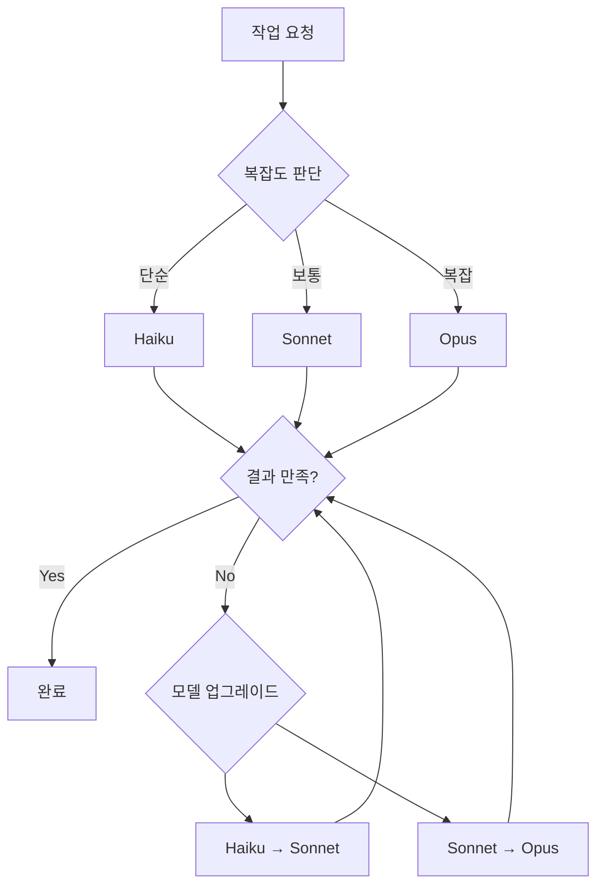

# Appendix B: 성능 최적화 팁

Claude Code를 효과적으로 사용하려면 단순히 기능을 아는 것만으로는 부족합니다. 토큰 사용량, 응답 시간, 비용을 최적화하여 생산성을 극대화하고 운영 비용을 절감하는 전략이 필요합니다. 이 부록에서는 실전에서 검증된 성능 최적화 기법을 소개합니다.

## B.1: 토큰 사용량 최적화

토큰은 Claude Code의 비용과 직결되는 핵심 리소스입니다. 효율적인 토큰 관리는 비용 절감뿐만 아니라 응답 품질 향상으로도 이어집니다.

### B.1.1: 컨텍스트 관리

**Problem**: 대화가 길어질수록 누적된 컨텍스트가 토큰을 과도하게 소비하고, 응답 시간이 느려지며, 때로는 핵심 정보가 묻혀버립니다.

**Optimization**: 적절한 타이밍에 `/clear` 명령어를 사용하여 컨텍스트를 리셋하고, 중요한 정보는 문서화하여 영구 보존합니다.

**Expected Impact**:
- 토큰 사용량 60〜80% 감소
- 응답 시간 40〜50% 개선
- 응답 정확도 향상 (노이즈 제거)

**Code Example**:

```bash
# 잘못된 예: 컨텍스트 오버플로우
[100개의 이전 메시지]
User: "앞에서 말한 그 함수 이름이 뭐였지?"
Claude: [100개 메시지를 모두 검토하며 토큰 낭비]

# 올바른 예: 문서화 + 컨텍스트 리셋
User: "중요한 내용 CLAUDE.md에 기록해줘"
Claude: [문서 작성 완료]
User: "/clear"
User: "CLAUDE.md 읽고 작업 계속해줘"
Claude: [필요한 컨텍스트만 로드하여 효율적으로 응답]
```

**Best Practices**:

1. <strong>컨텍스트 리셋 타이밍</strong>:
   - 주제 전환 시 (예: 버그 수정 → 새 기능 개발)
   - 대화가 20〜30 메시지 이상 누적되었을 때
   - 응답이 느려지거나 부정확해질 때

2. <strong>중요 정보 보존</strong>:
   ```markdown
   <!-- CLAUDE.md 또는 프로젝트별 문서에 기록 -->
   ## 현재 작업 상태
   - API 엔드포인트: `/api/v2/users`
   - 인증 방식: JWT (Bearer 토큰)
   - 에러 핸들링: try-catch + 로깅

   ## 다음 작업
   1. 페이지네이션 구현
   2. 정렬 기능 추가
   3. 필터링 API 통합
   ```

3. <strong>선택적 컨텍스트 로딩</strong>:
   ```bash
   # 전체 히스토리 대신 필요한 파일만 읽기
   User: "src/api/users.ts와 README.md만 참고해서 작업해줘"
   ```

### B.1.2: 효율적인 프롬프트 작성

**Problem**: 장황하거나 모호한 프롬프트는 불필요한 토큰을 소비하고, Claude가 여러 번 질문하게 만들어 전체 대화 비용을 증가시킵니다.

**Optimization**: 간결하면서도 구체적인 프롬프트를 작성하여 한 번에 정확한 결과를 얻습니다.

**Expected Impact**:
- 프롬프트 토큰 30〜50% 감소
- 재작업 횟수 70% 감소
- 전체 대화 토큰 40〜60% 절감

**Code Example**:

````markdown
# 비효율적인 프롬프트 (500 토큰)
```
저는 현재 React 프로젝트를 진행하고 있는데요, 사용자 인증 기능을
구현하려고 합니다. 그런데 어떻게 해야 할지 잘 모르겠어요.
JWT를 사용하는 게 좋을까요 아니면 다른 방법이 있을까요?
그리고 백엔드는 Node.js인데, 프론트엔드와 어떻게 연결해야 하나요?
보안도 신경 써야 하는데 어떤 부분을 조심해야 할까요?
참고로 이 프로젝트는 회사 업무용이고...
```

# 효율적인 프롬프트 (150 토큰)
```
React + Node.js 프로젝트에 JWT 기반 인증 구현:

1. 환경:
   - Frontend: React 18, React Router v6
   - Backend: Express 4.x, MongoDB
   - 요구사항: 로그인, 토큰 갱신, 보호된 라우트

2. 구현 파일:
   - `src/api/auth.ts` (API 클라이언트)
   - `src/contexts/AuthContext.tsx` (상태 관리)
   - `src/components/ProtectedRoute.tsx` (라우트 가드)

3. 보안 요구사항:
   - HttpOnly 쿠키 사용
   - CSRF 방어
   - 토큰 만료 15분, 리프레시 7일

위 구조로 구현해줘.
```
````

**Best Practices**:

1. <strong>5W1H 원칙 적용</strong>:
   - <strong>What</strong>: 무엇을 만들 것인가
   - <strong>Where</strong>: 어느 파일/폴더에
   - <strong>Why</strong>: 왜 필요한가 (맥락)
   - <strong>How</strong>: 어떤 방식으로 (기술 스택)
   - <strong>When</strong>: 언제 실행되는가 (트리거)
   - <strong>Who</strong>: 누가 사용하는가 (대상 사용자)

2. <strong>계층적 정보 구조</strong>:
   ```markdown
   # 1단계: 핵심 요구사항 (필수)
   사용자 대시보드 페이지 생성

   # 2단계: 기술 스택 (필수)
   Next.js 14 App Router, TypeScript, Tailwind CSS

   # 3단계: 세부 요구사항 (선택)
   - 반응형 그리드 레이아웃 (모바일: 1열, 태블릿: 2열, 데스크톱: 3열)
   - 다크 모드 지원
   - 스켈레톤 로딩

   # 4단계: 제약사항 (선택)
   - 번들 크기 <200KB
   - First Contentful Paint <1.5s
   ```

3. <strong>예시 코드 활용</strong>:
   ```markdown
   # 프롬프트
   "이 패턴을 따라서 Product 컴포넌트도 만들어줘"

   # 첨부: User 컴포넌트 예시
   [기존 코드 붙여넣기]
   ```

### B.1.3: 불필요한 정보 제거

**Problem**: 디버그 로그, 주석, 중복 코드 등 불필요한 정보가 포함된 파일을 읽으면 토큰이 낭비됩니다.

**Optimization**: 핵심 정보만 포함된 요약본을 제공하거나, 특정 섹션만 추출하여 제공합니다.

**Expected Impact**:
- 파일 읽기 토큰 50〜70% 감소
- 응답 정확도 향상 (노이즈 제거)
- 대규모 프로젝트에서 특히 효과적

**Code Example**:

```bash
# 비효율적: 전체 파일 읽기 (5000 토큰)
User: "src/utils/helpers.ts 읽고 버그 찾아줘"
[파일 내용: 500줄, 주석 200줄, 디버그 코드 100줄]

# 효율적: 필요한 부분만 추출 (1000 토큰)
User: "src/utils/helpers.ts에서 formatDate 함수만 추출해서 버그 찾아줘"

# 또는 grep으로 미리 필터링
User: "helpers.ts에서 'export function'으로 시작하는 줄만 보여줘"
```

**Best Practices**:

1. <strong>Grep을 활용한 선택적 읽기</strong>:
   ```bash
   # 함수 시그니처만 추출
   grep -n "^export function" src/utils/helpers.ts

   # TODO 주석만 추출
   grep -n "TODO\|FIXME" src/**/*.ts

   # 타입 정의만 추출
   grep -n "^export (type|interface)" src/types/*.ts
   ```

2. <strong>파일 요약본 생성</strong>:
   ```markdown
   <!-- docs/api-summary.md -->
   # API 엔드포인트 요약

   ## 사용자 관리
   - GET /api/users - 사용자 목록 조회
   - POST /api/users - 사용자 생성
   - PUT /api/users/:id - 사용자 수정

   ## 인증
   - POST /auth/login - 로그인
   - POST /auth/refresh - 토큰 갱신
   ```

3. <strong>주석 제거 스크립트</strong>:
   ```javascript
   // strip-comments.js
   const fs = require('fs');

   function stripComments(code) {
     return code
       .replace(/\/\*[\s\S]*?\*\//g, '') // 블록 주석
       .replace(/\/\/.*/g, '')            // 라인 주석
       .replace(/^\s*[\r\n]/gm, '');     // 빈 줄
   }

   const original = fs.readFileSync('src/app.ts', 'utf8');
   const stripped = stripComments(original);
   fs.writeFileSync('temp/app-stripped.ts', stripped);
   ```

### B.1.4: 메타데이터 우선 아키텍처

**Problem**: 블로그 포스트나 문서 컬렉션을 분석할 때 매번 전체 파일을 읽으면 토큰 소비가 급증합니다.

**Optimization**: 메타데이터만 추출한 JSON 파일을 생성하여 재사용합니다.

**Expected Impact**:
- 토큰 사용량 90% 이상 감소
- 응답 시간 95% 개선
- 반복 작업 시 비용 거의 제로

**Code Example**:

```javascript
// scripts/extract-metadata.js
const fs = require('fs');
const path = require('path');
const matter = require('gray-matter');

function extractMetadata(dir) {
  const files = fs.readdirSync(dir);
  const metadata = [];

  files.forEach(file => {
    if (file.endsWith('.md')) {
      const content = fs.readFileSync(path.join(dir, file), 'utf8');
      const { data } = matter(content);

      metadata.push({
        slug: file.replace('.md', ''),
        title: data.title,
        description: data.description,
        tags: data.tags || [],
        pubDate: data.pubDate,
        wordCount: content.split(/\s+/).length
      });
    }
  });

  return metadata;
}

const posts = extractMetadata('src/content/blog/ko');
fs.writeFileSync(
  'post-metadata.json',
  JSON.stringify(posts, null, 2)
);
```

**사용 예시**:

```bash
# 비효율적 (50,000 토큰)
User: "모든 블로그 포스트 읽고 SEO 분석해줘"
[100개 포스트 × 500 토큰 = 50,000 토큰]

# 효율적 (2,000 토큰)
User: "post-metadata.json 읽고 SEO 분석해줘"
[메타데이터만 포함, 100개 × 20 토큰 = 2,000 토큰]
```

## B.2: 응답 시간 개선

빠른 응답은 개발 흐름을 유지하고 생산성을 극대화하는 핵심입니다.

### B.2.1: 청킹 전략

**Problem**: 대용량 파일 처리나 복잡한 작업을 한 번에 요청하면 응답이 느리거나 타임아웃이 발생합니다.

**Optimization**: 작업을 작은 단위로 나누어 순차적으로 처리합니다.

**Expected Impact**:
- 타임아웃 오류 90% 감소
- 중간 결과 확인 가능 (디버깅 용이)
- 병렬 처리 가능 (전체 시간 단축)

**Code Example**:

```bash
# 비효율적: 한 번에 모두 처리
User: "src/ 폴더의 모든 TypeScript 파일을 ESLint로 검사하고,
      오류를 수정하고, 테스트를 실행하고, 문서를 업데이트해줘"
[타임아웃 발생 가능성 높음]

# 효율적: 단계별 처리
# Step 1
User: "src/ 폴더의 TypeScript 파일 목록 보여줘"
Claude: [파일 목록 제공]

# Step 2
User: "이 중 src/components/*.tsx 파일들만 ESLint 실행"
Claude: [오류 목록 제공]

# Step 3
User: "Button.tsx와 Input.tsx의 오류만 수정해줘"
Claude: [수정 완료]

# Step 4
User: "수정된 파일들 테스트 실행"
Claude: [테스트 결과]
```

**Best Practices**:

1. <strong>파일 단위 청킹</strong>:
   ```bash
   # 잘못된 예
   "모든 컴포넌트 리팩토링"

   # 올바른 예
   "Header.tsx 리팩토링" → "Footer.tsx 리팩토링" → ...
   ```

2. <strong>기능 단위 청킹</strong>:
   ```bash
   # 복잡한 기능을 3단계로 분할
   1. "User 모델 스키마 정의"
   2. "User CRUD API 구현"
   3. "User API 테스트 코드 작성"
   ```

3. <strong>우선순위 기반 청킹</strong>:
   ```markdown
   ## Phase 1: 핵심 기능 (Critical)
   - 로그인/로그아웃
   - 데이터 CRUD

   ## Phase 2: 부가 기능 (Important)
   - 검색/필터링
   - 정렬/페이지네이션

   ## Phase 3: 최적화 (Nice-to-have)
   - 캐싱
   - 성능 개선
   ```

### B.2.2: 캐싱 활용

**Problem**: 동일한 정보를 반복적으로 요청하면 시간과 토큰이 낭비됩니다.

**Optimization**: 자주 사용하는 정보를 문서화하거나 변수에 저장하여 재사용합니다.

**Expected Impact**:
- 반복 작업 시간 80% 단축
- 토큰 사용량 70% 감소
- 일관성 향상 (동일한 정보 보장)

**Code Example**:

```markdown
# 프로젝트 루트에 캐싱 문서 생성
<!-- CONTEXT.md -->
# 프로젝트 컨텍스트 (자주 참조되는 정보)

## 기술 스택
- Frontend: React 18.2, TypeScript 5.0, Vite 4.3
- Backend: Node.js 20, Express 4.18, PostgreSQL 15
- Testing: Vitest, React Testing Library
- Deployment: Vercel (Frontend), Railway (Backend)

## 코딩 규칙
- 함수명: camelCase
- 컴포넌트: PascalCase
- 상수: UPPER_SNAKE_CASE
- 파일명: kebab-case
- 최대 줄 길이: 100자
- 들여쓰기: 2 spaces

## API 엔드포인트
- Base URL: `https://api.example.com/v1`
- Auth: Bearer token in Authorization header
- Error format: `{ error: { code, message, details } }`

## 환경 변수
```bash
# .env.example
DATABASE_URL=postgresql://...
JWT_SECRET=...
API_KEY=...
```
```

**사용 방법**:

```bash
# 첫 작업
User: "CONTEXT.md 읽고 새 API 엔드포인트 작성해줘"

# 이후 작업들 (캐싱 효과)
User: "CONTEXT.md 기준으로 다음 엔드포인트도 작성해줘"
[CONTEXT.md 내용이 프롬프트 캐시에 저장되어 토큰 절약]
```

### B.2.3: 병렬 처리

**Problem**: 독립적인 작업들을 순차적으로 처리하면 전체 시간이 늘어납니다.

**Optimization**: 의존성이 없는 작업은 동시에 요청합니다.

**Expected Impact**:
- 전체 작업 시간 50〜70% 단축
- 대기 시간 최소화
- 리소스 활용 최적화

**Code Example**:

```bash
# 비효율적: 순차 처리 (6분 소요)
User: "Header 컴포넌트 작성해줘"
[2분 대기]
User: "Footer 컴포넌트 작성해줘"
[2분 대기]
User: "Sidebar 컴포넌트 작성해줘"
[2분 대기]

# 효율적: 병렬 처리 (2분 소요)
User: """
다음 3개 컴포넌트를 독립적으로 작성해줘:
1. Header.tsx - 네비게이션 바
2. Footer.tsx - 푸터 링크
3. Sidebar.tsx - 사이드 메뉴

각 컴포넌트는 서로 의존성이 없으므로 동시에 작업 가능.
"""
[Claude가 내부적으로 병렬 처리, 2분 안에 모두 완료]
```

**Best Practices**:

1. <strong>독립적 작업 식별</strong>:
   ```markdown
   ## 병렬 처리 가능 (서로 의존성 없음)
   - [ ] 로고 이미지 최적화
   - [ ] 404 페이지 디자인
   - [ ] 이메일 템플릿 작성

   ## 순차 처리 필요 (의존성 있음)
   1. 데이터베이스 스키마 설계
   2. ORM 모델 정의 (1에 의존)
   3. API 엔드포인트 구현 (2에 의존)
   ```

2. <strong>Bash 도구의 병렬 실행</strong>:
   ```bash
   # Claude Code는 독립적인 Bash 명령을 병렬 실행 가능
   User: """
   다음 명령어들을 실행해줘:
   - npm run lint
   - npm run test
   - npm run build

   각각 독립적이므로 동시 실행 가능.
   """
   ```

3. <strong>청킹 + 병렬 조합</strong>:
   ```bash
   # Phase 1: 병렬 처리
   User: "컴포넌트 A, B, C 동시 작성"

   # Phase 2: 통합 (순차 처리)
   User: "작성된 컴포넌트들을 App.tsx에 통합"
   ```

## B.3: 비용 절감 전략

Claude Code의 비용은 토큰 사용량과 모델 선택에 따라 크게 달라집니다.

### B.3.1: 모델 선택 기준

**Problem**: 모든 작업에 최고 성능 모델(Opus)을 사용하면 비용이 급증합니다.

**Optimization**: 작업 복잡도에 따라 적절한 모델을 선택합니다.

**Expected Impact**:
- 비용 50〜80% 절감
- 동일한 예산으로 2〜5배 더 많은 작업 수행
- ROI 극대화

**Model Comparison**:

| 모델 | 비용 (Input/Output) | 적합한 작업 | 부적합한 작업 |
|------|-------------------|-----------|-------------|
| <strong>Opus 4.5</strong> | $$$ / $$$$$ | 복잡한 아키텍처 설계, 알고리즘 최적화, 대규모 리팩토링 | 단순 CRUD, 코드 포맷팅, 문서 작성 |
| <strong>Sonnet 4.5</strong> | $$ / $$$ | 일반 개발 작업, 버그 수정, API 통합, 테스트 작성 | 극도로 복잡한 문제, 고도의 창의성 필요 작업 |
| <strong>Haiku 4.0</strong> | $ / $$ | 코드 포맷팅, 간단한 수정, 문서 업데이트, 로그 분석 | 복잡한 로직, 새로운 기능 개발 |

**Code Example**:

```yaml
# .claude/settings.local.json
{
  "model": "claude-sonnet-4.5",  # 기본 모델 (가성비 최적)
  "tasks": {
    "simple": {
      "model": "claude-haiku-4.0",  # 단순 작업용
      "patterns": [
        "formatting",
        "linting",
        "documentation",
        "simple fixes"
      ]
    },
    "complex": {
      "model": "claude-opus-4.5",   # 복잡한 작업용
      "patterns": [
        "architecture",
        "algorithm",
        "optimization",
        "refactoring"
      ]
    }
  }
}
```

**Decision Tree**:



### B.3.2: 배치 처리

**Problem**: 유사한 작업을 개별적으로 요청하면 중복된 컨텍스트 로딩으로 토큰이 낭비됩니다.

**Optimization**: 유사 작업을 묶어서 한 번에 처리합니다.

**Expected Impact**:
- 토큰 사용량 40〜60% 감소
- 작업 처리 시간 30〜50% 단축
- 일관성 향상

**Code Example**:

```bash
# 비효율적: 개별 처리 (10,000 토큰)
User: "users.ts에 타입 추가해줘"
[컨텍스트 로딩 + 작업 = 2,000 토큰]

User: "posts.ts에 타입 추가해줘"
[컨텍스트 로딩 + 작업 = 2,000 토큰]

User: "comments.ts에 타입 추가해줘"
[컨텍스트 로딩 + 작업 = 2,000 토큰]

... (총 5개 파일 = 10,000 토큰)

# 효율적: 배치 처리 (4,000 토큰)
User: """
다음 파일들에 TypeScript 타입을 추가해줘:
- src/models/users.ts
- src/models/posts.ts
- src/models/comments.ts
- src/models/likes.ts
- src/models/follows.ts

공통 패턴:
- Zod 스키마 정의
- TypeScript 타입 추출
- API 응답 타입 추가
"""
[컨텍스트 1회 로딩 + 작업 × 5 = 4,000 토큰]
```

**Best Practices**:

1. <strong>작업 템플릿 활용</strong>:
   ````markdown
   # template/crud-api.md
   ```markdown
   ## CRUD API 생성 템플릿

   ### 요구사항
   - 모델명: [MODEL_NAME]
   - 엔드포인트: /api/[RESOURCE]
   - 필드: [FIELD_LIST]

   ### 생성 파일
   1. `models/[model].ts` - Zod 스키마
   2. `routes/[resource].ts` - Express 라우터
   3. `controllers/[resource].ts` - 비즈니스 로직
   4. `tests/[resource].test.ts` - 통합 테스트
   ```
   ````

2. <strong>배치 처리 스크립트</strong>:
   ```javascript
   // scripts/batch-process.js
   const tasks = [
     { file: 'User.ts', operation: 'add-validation' },
     { file: 'Post.ts', operation: 'add-validation' },
     { file: 'Comment.ts', operation: 'add-validation' }
   ];

   const prompt = `
   다음 파일들에 Zod 검증 추가:
   ${tasks.map(t => `- ${t.file}`).join('\n')}

   공통 규칙:
   - 필수 필드는 .min(1) 추가
   - 이메일은 .email() 검증
   - 날짜는 .datetime() 사용
   `;

   console.log(prompt);
   ```

### B.3.3: 토큰 예산 관리

**Problem**: 프로젝트 진행 중 토큰 사용량을 추적하지 않으면 예산을 초과할 수 있습니다.

**Optimization**: 토큰 사용량을 모니터링하고 예산 한도를 설정합니다.

**Expected Impact**:
- 예산 초과 방지
- 비용 예측 가능성 향상
- 리소스 배분 최적화

**Code Example**:

```javascript
// scripts/token-tracker.js
const fs = require('fs');

class TokenTracker {
  constructor(budgetLimit = 1000000) {
    this.budgetLimit = budgetLimit;
    this.usage = this.loadUsage();
  }

  loadUsage() {
    try {
      return JSON.parse(fs.readFileSync('.token-usage.json', 'utf8'));
    } catch {
      return { total: 0, byTask: {}, history: [] };
    }
  }

  saveUsage() {
    fs.writeFileSync('.token-usage.json', JSON.stringify(this.usage, null, 2));
  }

  recordUsage(task, inputTokens, outputTokens) {
    const total = inputTokens + outputTokens;
    this.usage.total += total;

    if (!this.usage.byTask[task]) {
      this.usage.byTask[task] = 0;
    }
    this.usage.byTask[task] += total;

    this.usage.history.push({
      timestamp: new Date().toISOString(),
      task,
      inputTokens,
      outputTokens,
      total
    });

    this.saveUsage();
    this.checkBudget();
  }

  checkBudget() {
    const remaining = this.budgetLimit - this.usage.total;
    const percentage = (this.usage.total / this.budgetLimit * 100).toFixed(1);

    console.log(`토큰 사용량: ${this.usage.total.toLocaleString()} / ${this.budgetLimit.toLocaleString()} (${percentage}%)`);
    console.log(`남은 예산: ${remaining.toLocaleString()} 토큰`);

    if (percentage >= 90) {
      console.warn('⚠️  예산의 90% 이상 사용됨!');
    } else if (percentage >= 75) {
      console.warn('⚠️  예산의 75% 이상 사용됨');
    }
  }

  getTopTasks(limit = 5) {
    return Object.entries(this.usage.byTask)
      .sort(([,a], [,b]) => b - a)
      .slice(0, limit)
      .map(([task, tokens]) => ({ task, tokens }));
  }

  getReport() {
    return {
      총사용량: this.usage.total,
      예산한도: this.budgetLimit,
      사용률: `${(this.usage.total / this.budgetLimit * 100).toFixed(1)}%`,
      상위작업: this.getTopTasks(),
      최근사용내역: this.usage.history.slice(-10)
    };
  }
}

// 사용 예시
const tracker = new TokenTracker(1000000);

// 작업 후 기록
tracker.recordUsage('blog-post-writing', 5000, 8000);
tracker.recordUsage('code-refactoring', 3000, 4000);

// 리포트 출력
console.log(JSON.stringify(tracker.getReport(), null, 2));
```

**예산 배분 전략**:

```markdown
## 월간 토큰 예산: 1,000,000 토큰

### 카테고리별 배분
- 개발 작업 (50%): 500,000 토큰
  - 새 기능 개발: 300,000
  - 버그 수정: 100,000
  - 리팩토링: 100,000

- 문서화 (20%): 200,000 토큰
  - 블로그 포스트: 120,000
  - API 문서: 50,000
  - README/가이드: 30,000

- 학습 및 실험 (20%): 200,000 토큰
  - 새 기술 탐구: 100,000
  - 프로토타입: 100,000

- 예비 (10%): 100,000 토큰
  - 긴급 작업
  - 예상치 못한 문제 해결

### 주간 체크포인트
- Week 1: 25% 사용 (250,000)
- Week 2: 50% 사용 (500,000)
- Week 3: 75% 사용 (750,000)
- Week 4: 100% 사용 (1,000,000)

### 알림 기준
- 75% 도달: 주의 (남은 기간 확인)
- 90% 도달: 경고 (비필수 작업 연기)
- 95% 도달: 위험 (긴급 작업만 수행)
```

## B.4: 종합 최적화 체크리스트

성능 최적화를 위한 실전 체크리스트입니다.

### 작업 시작 전

- [ ] 작업 복잡도에 맞는 모델 선택 (Haiku/Sonnet/Opus)
- [ ] 유사 작업 묶어서 배치 처리 계획
- [ ] 필요한 컨텍스트만 선별 (CLAUDE.md, 관련 파일)
- [ ] 명확하고 간결한 프롬프트 준비

### 작업 중

- [ ] 대화가 20〜30 메시지 넘으면 `/clear` 고려
- [ ] 중요 정보는 즉시 문서화 (CLAUDE.md, CONTEXT.md)
- [ ] 대용량 작업은 청킹하여 단계별 처리
- [ ] 독립적 작업은 병렬 처리 요청
- [ ] 불필요한 주석/로그 제거 후 파일 제공

### 작업 후

- [ ] 토큰 사용량 기록 (token-tracker.js)
- [ ] 재사용 가능한 패턴 템플릿화
- [ ] 메타데이터 추출 (블로그 포스트 등)
- [ ] 최적화 포인트 식별 및 개선

### 정기 점검 (주간/월간)

- [ ] 토큰 예산 사용률 확인
- [ ] 상위 토큰 소비 작업 분석
- [ ] 비효율적 패턴 식별 및 개선
- [ ] 캐싱 문서 업데이트 (CONTEXT.md)
- [ ] 모델 선택 기준 재조정

## B.5: 성능 최적화 사례 연구

### 사례 1: 블로그 포스트 관리 시스템

**Before (최적화 전)**:
- 100개 포스트 분석: 50,000 토큰
- 추천 시스템 생성: 80,000 토큰
- 총 비용: $6.50 (Opus 기준)
- 소요 시간: 25분

**After (최적화 후)**:
- 메타데이터 추출 스크립트 작성: 5,000 토큰 (1회)
- 메타데이터 기반 분석: 2,000 토큰
- 추천 시스템 생성 (증분 처리): 8,000 토큰
- 총 비용: $0.75 (Sonnet 기준)
- 소요 시간: 5분

**최적화 기법**:
1. 메타데이터 우선 아키텍처
2. 증분 처리 (변경된 포스트만)
3. 모델 다운그레이드 (Opus → Sonnet)
4. 콘텐츠 해시 비교 (중복 처리 방지)

### 사례 2: 대규모 코드베이스 리팩토링

**Before**:
- 200개 파일 순차 처리: 150분
- 토큰 사용량: 300,000
- 비용: $24

**After**:
- 파일 그룹화 (10개씩 배치): 30분
- 병렬 처리 (독립적 그룹): 15분
- 토큰 사용량: 120,000
- 비용: $9.60

**최적화 기법**:
1. 배치 처리 (10개 파일씩)
2. 병렬 처리 (의존성 없는 그룹)
3. 템플릿 기반 일관성 (컨텍스트 재사용)
4. Grep을 활용한 사전 필터링

## 결론

성능 최적화는 단순히 비용을 절감하는 것 이상의 가치를 제공합니다:

1. <strong>생산성 향상</strong>: 빠른 응답으로 개발 흐름 유지
2. <strong>품질 개선</strong>: 노이즈 제거로 정확도 향상
3. <strong>확장성 확보</strong>: 동일 예산으로 더 많은 작업 수행
4. <strong>지속 가능성</strong>: 장기적으로 안정적인 운영

이 부록에서 소개한 기법들을 프로젝트에 적용하면 Claude Code의 ROI를 극대화하고, 진정한 AI 협업 개발의 효율성을 경험할 수 있을 것입니다.

---

**다음 단계**: Appendix C에서는 트러블슈팅 가이드와 FAQ를 다룹니다.
