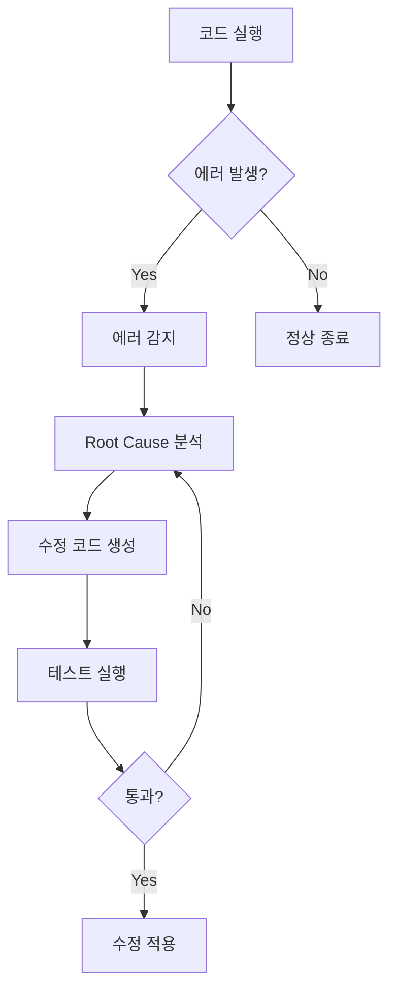

# Appendix C: 자주 묻는 질문 (FAQ)

이 섹션에서는 Claude Code 사용 중 자주 발생하는 질문과 답변을 제공합니다. 각 질문은 카테고리별로 분류되어 있으며, 필요에 따라 관련 챕터를 참조할 수 있습니다.

---

## C.1 설치 및 환경 설정 관련 FAQ

### Q1: Claude Code를 사용하려면 어떤 요구사항이 필요한가요?

<strong>A:</strong> Claude Code를 사용하기 위한 기본 요구사항은 다음과 같습니다.

<strong>필수 요구사항</strong>:
- <strong>Anthropic API 키</strong>: Claude AI 모델 접근을 위한 API 키
- <strong>Node.js</strong>: 버전 18.0.0 이상 (MCP 서버 및 스크립트 실행용)
- <strong>운영체제</strong>: macOS, Linux, Windows (WSL 권장)
- <strong>터미널</strong>: 명령줄 인터페이스 접근

<strong>권장 사항</strong>:
- Git 설치 (버전 관리용)
- VSCode 또는 선호하는 텍스트 에디터
- 16GB 이상 RAM (대규모 프로젝트용)

<strong>참조</strong>: Chapter 2 - 환경 설정

---

### Q2: Claude Code와 일반 IDE 플러그인(예: GitHub Copilot)의 차이점은 무엇인가요?

<strong>A:</strong> Claude Code는 단순 코드 자동완성을 넘어서는 포괄적인 AI 어시스턴트입니다.

<strong>주요 차이점</strong>:

| 측면 | 일반 IDE 플러그인 | Claude Code |
|------|-----------------|-------------|
| <strong>작동 범위</strong> | 코드 자동완성 중심 | 전체 프로젝트 컨텍스트 이해 |
| <strong>파일 접근</strong> | 현재 편집 중인 파일 | 프로젝트 전체 파일 시스템 |
| <strong>작업 단위</strong> | 라인/블록 단위 | 멀티파일, 태스크 단위 |
| <strong>컨텍스트</strong> | 제한적 (주변 코드만) | 프로젝트 문서, Git 히스토리 포함 |
| <strong>자율성</strong> | 제안만 제공 | 독립적 작업 수행 가능 |
| <strong>에이전트 시스템</strong> | 없음 | 멀티 에이전트 오케스트레이션 |

<strong>예시</strong>:
- <strong>Copilot</strong>: "이 함수를 작성하려면..." → 코드 제안
- <strong>Claude Code</strong>: "블로그 포스트를 4개 언어로 작성하고, 이미지 생성 후, SEO 최적화, Git 커밋까지 수행" → 전체 워크플로우 자동화

<strong>참조</strong>: Chapter 1 - Claude Code 소개

---

### Q3: 오프라인에서 Claude Code를 사용할 수 있나요?

<strong>A:</strong> <strong>아니요</strong>, Claude Code는 인터넷 연결이 필수입니다.

<strong>이유</strong>:
- Claude AI 모델은 Anthropic의 클라우드 서버에서 실행됩니다
- API 호출을 통해 실시간으로 응답을 받습니다
- MCP 서버 통합 기능도 네트워크 접근이 필요합니다

<strong>대안</strong>:
- 로컬 LLM 솔루션 (예: Ollama, LM Studio) 사용 가능하지만, Claude Code의 모든 기능을 지원하지는 않습니다
- 사전에 작업을 준비하고, 온라인 시 배치 처리 수행

<strong>참고</strong>: 일부 캐싱 기능으로 반복 작업 시 토큰 사용량을 줄일 수 있습니다.

---

### Q4: Claude Code 설치가 실패합니다. 어떻게 해결하나요?

<strong>A:</strong> 설치 실패 시 다음 단계를 순차적으로 확인하세요.

<strong>단계 1: 권한 확인</strong>
```bash
# macOS/Linux: 관리자 권한 확인
sudo npm install -g claude-code

# Windows: 관리자 모드로 PowerShell 실행
```

<strong>단계 2: Node.js 버전 확인</strong>
```bash
node --version  # v18.0.0 이상이어야 함
npm --version   # 9.0.0 이상 권장
```

<strong>단계 3: 캐시 정리</strong>
```bash
npm cache clean --force
rm -rf node_modules package-lock.json
npm install
```

<strong>단계 4: 환경 변수 확인</strong>
```bash
# .env 파일 생성
ANTHROPIC_API_KEY=sk-ant-...
```

<strong>일반적인 오류</strong>:
- `EACCES` 오류: 권한 문제 → `sudo` 사용 또는 npm 권한 재설정
- `Module not found`: 의존성 누락 → `npm install` 재실행
- `API key invalid`: API 키 확인 → Anthropic Console에서 새 키 발급

<strong>참조</strong>: Chapter 2 - 환경 설정, Appendix A - 트러블슈팅 가이드

---

### Q5: 여러 프로젝트에서 Claude Code를 사용할 때 설정을 공유할 수 있나요?

<strong>A:</strong> <strong>예**, 전역 설정과 프로젝트별 설정을 조합하여 사용할 수 있습니다.

<strong>전역 설정</strong> (`~/.claude/config.json`):
```json
{
  "apiKey": "sk-ant-...",
  "defaultModel": "claude-sonnet-4-5",
  "timeout": 120000
}
```

<strong>프로젝트별 설정</strong> (`.claude/settings.local.json`):
```json
{
  "agents": ["content-planner", "writer"],
  "mcpServers": ["context7", "playwright"]
}
```

<strong>우선순위</strong>:
1. 프로젝트 로컬 설정 (`.claude/`)
2. 전역 설정 (`~/.claude/`)
3. 기본값

<strong>재사용 전략</strong>:
- CLAUDE.md 템플릿 생성
- 공통 에이전트 정의를 Git 서브모듈로 관리
- 조직 표준 설정 저장소 운영

<strong>참조</strong>: Chapter 4 - CLAUDE.md 마스터하기

---

### Q6: API 키를 안전하게 관리하는 방법은 무엇인가요?

<strong>A:</strong> API 키는 절대 Git 저장소에 커밋되지 않도록 주의해야 합니다.

<strong>권장 방법</strong>:

<strong>1. 환경 변수 사용</strong>:
```bash
# .env 파일 생성 (반드시 .gitignore에 추가)
ANTHROPIC_API_KEY=sk-ant-api03-...
GEMINI_API_KEY=AIza...

# .gitignore에 추가
echo ".env" >> .gitignore
```

<strong>2. 시스템 키체인 활용</strong> (macOS):
```bash
# 키체인에 저장
security add-generic-password -a $USER -s "claude-api-key" -w "sk-ant-..."

# 스크립트에서 읽기
export ANTHROPIC_API_KEY=$(security find-generic-password -a $USER -s "claude-api-key" -w)
```

<strong>3. 시크릿 관리 도구</strong>:
- <strong>1Password CLI</strong>: 팀 공유 시크릿 관리
- <strong>AWS Secrets Manager</strong>: 클라우드 환경
- <strong>HashiCorp Vault</strong>: 엔터프라이즈 환경

<strong>주의사항</strong>:
- API 키를 코드에 하드코딩 금지
- 공개 저장소에서는 더욱 주의
- 정기적으로 키 로테이션 (3〜6개월)

<strong>참조</strong>: Chapter 15 - 엔터프라이즈 확장

---

### Q7: Windows에서 Claude Code를 사용할 때 주의할 점은 무엇인가요?

<strong>A:</strong> Windows에서는 WSL(Windows Subsystem for Linux) 사용을 강력히 권장합니다.

<strong>WSL 사용 이유</strong>:
- Claude Code의 많은 스크립트가 Bash 기반
- MCP 서버 호환성 향상
- 파일 경로 처리 일관성

<strong>WSL 설정 방법</strong>:
```powershell
# PowerShell (관리자 모드)
wsl --install
wsl --set-default-version 2

# Ubuntu 설치
wsl --install -d Ubuntu-22.04
```

<strong>Claude Code 설치 (WSL 내부)</strong>:
```bash
# WSL 터미널에서
curl -o- https://raw.githubusercontent.com/nvm-sh/nvm/v0.39.0/install.sh | bash
nvm install 18
npm install -g claude-code
```

<strong>Windows 네이티브 사용 시</strong>:
- Git Bash 또는 PowerShell 사용
- 경로 구분자 주의 (`\` vs `/`)
- 스크립트 실행 정책 설정 필요:
  ```powershell
  Set-ExecutionPolicy RemoteSigned -Scope CurrentUser
  ```

<strong>참조</strong>: Chapter 2 - 환경 설정

---

## C.2 사용 및 운영 관련 FAQ

### Q8: Claude Code가 내 코드베이스를 이해하지 못하는 것 같습니다. 어떻게 해야 하나요?

<strong>A:</strong> 컨텍스트 제공을 최적화해야 합니다. CLAUDE.md 파일을 작성하는 것이 가장 효과적입니다.

<strong>해결 방법</strong>:

<strong>1. CLAUDE.md 작성</strong>:
```markdown
# 프로젝트 개요
이 프로젝트는 React 기반의 전자상거래 플랫폼입니다.

## 아키텍처
- Frontend: React 18, TypeScript, Tailwind CSS
- Backend: Node.js, Express, PostgreSQL
- State Management: Redux Toolkit

## 디렉토리 구조
\```
src/
├── components/     # 재사용 가능한 React 컴포넌트
├── pages/         # 페이지 컴포넌트
├── hooks/         # 커스텀 React Hooks
└── utils/         # 유틸리티 함수
\```

## 코딩 규칙
- 함수형 컴포넌트만 사용
- Props는 TypeScript interface로 정의
- CSS는 Tailwind utility classes 사용
```

<strong>2. 명시적 컨텍스트 제공</strong>:
```
"src/components/Button.tsx를 참조해서 비슷한 스타일의 Modal 컴포넌트를 만들어주세요."
```

<strong>3. 프로젝트 구조 먼저 설명</strong>:
```
"이 프로젝트는 Monorepo 구조입니다. packages/frontend와 packages/backend가 있고, 공통 타입은 packages/shared에 정의되어 있습니다."
```

<strong>참조</strong>: Chapter 4 - CLAUDE.md 마스터하기, Chapter 6 - 효과적인 프롬프트 작성

---

### Q9: 에이전트가 잘못된 파일을 수정했습니다. 어떻게 되돌리나요?

<strong>A:</strong> Git을 사용하고 있다면 간단히 되돌릴 수 있습니다.

<strong>단계별 복구</strong>:

<strong>1. 변경 사항 확인</strong>:
```bash
git status        # 수정된 파일 확인
git diff          # 변경 내용 확인
```

<strong>2. 특정 파일 복구</strong>:
```bash
# 단일 파일 복구
git checkout -- src/components/Button.tsx

# 여러 파일 복구
git checkout -- src/components/*.tsx
```

<strong>3. 모든 변경 사항 되돌리기</strong>:
```bash
git reset --hard HEAD
```

<strong>4. 커밋 후 발견한 경우</strong>:
```bash
# 마지막 커밋 취소 (변경 사항은 유지)
git reset --soft HEAD~1

# 마지막 커밋 완전 취소
git reset --hard HEAD~1
```

<strong>예방 방법</strong>:
- 작업 전 브랜치 생성: `git checkout -b feature/new-component`
- 자주 커밋: Claude에게 "변경 사항을 커밋해주세요" 요청
- `.claude/hooks/pre-file-write` 훅 설정으로 중요 파일 보호

<strong>참조</strong>: Chapter 10 - Hook 기반 자동화

---

### Q10: 응답이 너무 느리거나 타임아웃됩니다. 어떻게 개선하나요?

<strong>A:</strong> 응답 속도는 여러 요인에 영향을 받습니다. 다음 방법으로 개선할 수 있습니다.

<strong>1. 요청 범위 축소</strong>:
```
# ✗ 비효율적
"전체 프로젝트를 리팩토링해주세요"

# ✓ 효율적
"src/utils/api.ts 파일만 리팩토링해주세요"
```

<strong>2. 타임아웃 설정 조정</strong>:
```json
// .claude/settings.local.json
{
  "timeout": 300000,  // 5분 (기본: 2분)
  "maxRetries": 3
}
```

<strong>3. 캐싱 활용</strong>:
- 반복 작업 시 Claude의 프롬프트 캐싱 활용
- 메타데이터 재사용 (post-metadata.json 패턴)

<strong>4. 병렬 처리</strong>:
```bash
# 독립적인 작업은 병렬 실행
claude-code "파일 A 수정" & claude-code "파일 B 수정" & wait
```

<strong>5. 모델 선택</strong>:
- 복잡한 작업: `claude-opus-4-5` (느리지만 정확)
- 단순 작업: `claude-sonnet-4` (빠르고 비용 효율적)
- 코드 생성: `claude-sonnet-4-5` (균형)

<strong>참조</strong>: Appendix B - 성능 최적화 팁

---

### Q11: 멀티 에이전트 시스템을 구축하려면 어디서 시작해야 하나요?

<strong>A:</strong> 단계별로 점진적으로 구축하는 것을 권장합니다.

<strong>단계 1: 단일 에이전트부터 시작</strong>:
```markdown
# .claude/agents/writer.md
당신은 블로그 포스트 작성 전문가입니다.

## 역할
- 주어진 주제로 SEO 최적화된 블로그 포스트 작성
- 마크다운 형식 사용
- 코드 예제 포함

## 제약사항
- 포스트 길이: 1500-2000 단어
- 기술적 정확성 필수
```

<strong>단계 2: 두 번째 에이전트 추가</strong>:
```markdown
# .claude/agents/editor.md
당신은 콘텐츠 편집 전문가입니다.

## 역할
- 문법 및 맞춤법 검토
- 가독성 개선
- SEO 메타데이터 검증
```

<strong>단계 3: 협업 패턴 구현</strong>:
```
"@writer 'TypeScript 제네릭'에 대한 블로그 포스트 작성"
→ 포스트 생성 후
"@editor 방금 작성된 포스트를 검토하고 개선해주세요"
```

<strong>단계 4: 오케스트레이터 도입</strong>:
```markdown
# .claude/agents/orchestrator.md
당신은 에이전트 조율 전문가입니다.

## 워크플로우
1. @writer: 초안 작성
2. @editor: 검토 및 수정
3. @seo-optimizer: SEO 최적화
4. @image-generator: 히어로 이미지 생성
```

<strong>참조</strong>: Chapter 7 - 11 에이전트 아키텍처 개요, Chapter 11 - 에이전트 협업 패턴

---

### Q12: Claude Code가 생성한 코드의 품질을 어떻게 검증하나요?

<strong>A:</strong> 다층적 검증 전략을 사용해야 합니다.

<strong>1. 자동화된 테스트</strong>:
```bash
# 단위 테스트 실행
npm test

# 타입 체크
npm run typecheck

# 린트 검사
npm run lint
```

<strong>2. Hook 기반 검증</strong>:
```bash
# .claude/hooks/post-file-write
#!/bin/bash

# 생성된 파일 검증
if [[ $FILE_PATH == *.ts ]]; then
  npx tsc --noEmit $FILE_PATH
  npx eslint $FILE_PATH
fi
```

<strong>3. 에이전트 체크리스트</strong>:
```markdown
# .claude/agents/code-reviewer.md

## 품질 체크리스트
- [ ] 타입 안전성
- [ ] 에러 핸들링
- [ ] 성능 고려사항
- [ ] 보안 취약점
- [ ] 테스트 커버리지
```

<strong>4. 코드 리뷰 에이전트</strong>:
```
"@code-reviewer src/utils/api.ts를 검토하고 개선 사항을 제안해주세요"
```

<strong>5. 수동 검토 포인트</strong>:
- 비즈니스 로직 정확성
- 보안 민감 코드 (인증, 권한)
- 외부 API 연동
- 데이터베이스 마이그레이션

<strong>참조</strong>: Chapter 10 - Hook 기반 자동화, Chapter 17 - 코드 리뷰 자동화

---

### Q13: 다국어 콘텐츠를 효과적으로 관리하는 방법은 무엇인가요?

<strong>A:</strong> 구조화된 파일 시스템과 자동화 워크플로우를 결합해야 합니다.

<strong>1. 디렉토리 구조</strong>:
```
src/content/blog/
├── ko/           # 한국어
│   └── post-name.md
├── en/           # 영어
│   └── post-name.md
├── ja/           # 일본어
│   └── post-name.md
└── zh/           # 중국어
    └── post-name.md
```

<strong>2. 자동 번역 에이전트</strong>:
```markdown
# .claude/agents/translator.md

## 역할
원본 포스트를 4개 언어로 번역 (ko, en, ja, zh)

## 원칙
- 번역이 아닌 현지화
- 문화적 맥락 고려
- 동일한 파일명 유지
- SEO 메타데이터는 각 언어에 최적화
```

<strong>3. 일관성 검증</strong>:
```bash
# 언어별 포스트 수 확인
ls src/content/blog/ko/*.md | wc -l
ls src/content/blog/en/*.md | wc -l
ls src/content/blog/ja/*.md | wc -l
ls src/content/blog/zh/*.md | wc -l
```

<strong>4. Frontmatter 구조</strong>:
```yaml
---
title: "제목"
description: "설명"
pubDate: "2025-01-15"
heroImage: "../../../assets/blog/image.jpg"  # 모든 언어 공유
tags: ["tag1", "tag2"]
---
```

<strong>5. 커맨드 자동화</strong>:
```bash
# /write-post 커맨드: 4개 언어 동시 생성
claude-code "/write-post '멀티 에이전트 시스템 구축하기'"
```

<strong>참조</strong>: Chapter 18 - 다국어 콘텐츠 파이프라인

---

### Q14: Claude Code의 응답이 프로젝트 규칙을 따르지 않습니다. 어떻게 해야 하나요?

<strong>A:</strong> CLAUDE.md에 명확한 규칙을 문서화하고, 강제 적용 메커니즘을 구현해야 합니다.

<strong>1. 명시적 규칙 정의</strong>:
```markdown
# CLAUDE.md

## 코딩 규칙 (MUST FOLLOW)

### TypeScript/JavaScript
- 함수형 컴포넌트만 사용 (클래스 컴포넌트 금지)
- Props 타입은 반드시 interface로 정의
- any 타입 사용 금지

### 파일 명명
- 컴포넌트: PascalCase (Button.tsx)
- 유틸: camelCase (formatDate.ts)
- 상수: UPPER_SNAKE_CASE (API_URL.ts)

### 금지 패턴
- ✗ var 키워드 사용
- ✗ console.log (프로덕션 코드)
- ✗ 인라인 스타일
```

<strong>2. Hook 기반 검증</strong>:
```bash
# .claude/hooks/pre-file-write
#!/bin/bash

# 규칙 위반 검사
if grep -q "var " "$FILE_PATH"; then
  echo "ERROR: 'var' 키워드는 금지됨. 'const' 또는 'let' 사용"
  exit 1
fi

if grep -q "console.log" "$FILE_PATH"; then
  echo "WARNING: console.log 발견. 제거 권장"
fi
```

<strong>3. 에이전트 지침 강화</strong>:
```markdown
# .claude/agents/code-generator.md

## CRITICAL RULES (절대 위반 금지)

1. **타입 안전성**: any 타입 절대 사용 금지
2. **함수형 패러다임**: 클래스 컴포넌트 생성 금지
3. **네이밍**: 파일명은 반드시 kebab-case 또는 PascalCase
```

<strong>4. 프롬프트에 규칙 명시</strong>:
```
"Button 컴포넌트를 작성해주세요.
IMPORTANT:
- 함수형 컴포넌트여야 합니다
- Props는 TypeScript interface로 정의
- Tailwind CSS 사용
- inline style 금지"
```

<strong>참조</strong>: Chapter 4 - CLAUDE.md 마스터하기, Chapter 14 - 프롬프트 엔지니어링 심화

---

### Q15: MCP 서버를 직접 만들 수 있나요? 어떻게 시작하나요?

<strong>A:</strong> <strong>예**, MCP 서버는 표준 프로토콜을 따르는 Node.js 애플리케이션입니다.

<strong>기본 MCP 서버 구조</strong>:
```typescript
// my-custom-mcp/src/index.ts
import { Server } from "@modelcontextprotocol/sdk/server/index.js";
import { StdioServerTransport } from "@modelcontextprotocol/sdk/server/stdio.js";
import {
  CallToolRequestSchema,
  ListToolsRequestSchema,
} from "@modelcontextprotocol/sdk/types.js";

const server = new Server(
  {
    name: "my-custom-mcp",
    version: "1.0.0",
  },
  {
    capabilities: {
      tools: {},
    },
  }
);

// 도구 목록 제공
server.setRequestHandler(ListToolsRequestSchema, async () => ({
  tools: [
    {
      name: "analyze_code",
      description: "코드 품질을 분석합니다",
      inputSchema: {
        type: "object",
        properties: {
          filePath: {
            type: "string",
            description: "분석할 파일 경로",
          },
        },
        required: ["filePath"],
      },
    },
  ],
}));

// 도구 실행 핸들러
server.setRequestHandler(CallToolRequestSchema, async (request) => {
  if (request.params.name === "analyze_code") {
    const { filePath } = request.params.arguments;

    // 분석 로직 구현
    const result = await analyzeCode(filePath);

    return {
      content: [
        {
          type: "text",
          text: JSON.stringify(result, null, 2),
        },
      ],
    };
  }

  throw new Error(`Unknown tool: ${request.params.name}`);
});

// 서버 시작
const transport = new StdioServerTransport();
await server.connect(transport);
```

<strong>Claude 설정에 추가</strong>:
```json
// ~/.claude/config.json
{
  "mcpServers": {
    "my-custom-mcp": {
      "command": "node",
      "args": ["/path/to/my-custom-mcp/dist/index.js"]
    }
  }
}
```

<strong>사용 예시</strong>:
```
"MCP 서버 my-custom-mcp의 analyze_code 도구를 사용해서 src/utils/api.ts를 분석해주세요"
```

<strong>참조</strong>: Chapter 5 - MCP 서버 통합

---

### Q16: Hook 시스템으로 어떤 작업을 자동화할 수 있나요?

<strong>A:</strong> Hook 시스템은 파일 수정, 커밋, 빌드 등 다양한 이벤트에 반응하여 자동화할 수 있습니다.

<strong>사용 가능한 Hook</strong>:

| Hook | 실행 시점 | 주요 용도 |
|------|----------|----------|
| `pre-file-write` | 파일 쓰기 전 | 검증, 포맷팅, 권한 체크 |
| `post-file-write` | 파일 쓰기 후 | 린트, 테스트, 빌드 |
| `pre-commit` | Git 커밋 전 | 코드 품질 검사, 메시지 검증 |
| `post-commit` | Git 커밋 후 | 알림, 로깅, 배포 트리거 |

<strong>실전 예시</strong>:

<strong>1. 자동 포맷팅</strong>:
```bash
# .claude/hooks/post-file-write
#!/bin/bash

if [[ $FILE_PATH == *.ts || $FILE_PATH == *.tsx ]]; then
  npx prettier --write "$FILE_PATH"
fi
```

<strong>2. 이미지 최적화</strong>:
```bash
# .claude/hooks/post-file-write
#!/bin/bash

if [[ $FILE_PATH == *.jpg || $FILE_PATH == *.png ]]; then
  # WebP 변환
  cwebp -q 80 "$FILE_PATH" -o "${FILE_PATH%.*}.webp"

  # 메타데이터 제거
  exiftool -all= "$FILE_PATH"
fi
```

<strong>3. 자동 테스트</strong>:
```bash
# .claude/hooks/pre-commit
#!/bin/bash

# 변경된 파일의 테스트 실행
npm test -- --findRelatedTests $CHANGED_FILES

if [ $? -ne 0 ]; then
  echo "테스트 실패. 커밋을 취소합니다."
  exit 1
fi
```

<strong>4. 배포 자동화</strong>:
```bash
# .claude/hooks/post-commit
#!/bin/bash

if [[ $(git log -1 --pretty=%B) == "deploy:"* ]]; then
  echo "배포 트리거 감지. 빌드 시작..."
  npm run build
  npm run deploy
fi
```

<strong>5. 알림 전송</strong>:
```bash
# .claude/hooks/post-commit
#!/bin/bash

# Slack 알림
curl -X POST $SLACK_WEBHOOK_URL \
  -H 'Content-Type: application/json' \
  -d "{\"text\": \"새 커밋: $(git log -1 --pretty=%B)\"}"
```

<strong>참조</strong>: Chapter 10 - Hook 기반 자동화

---

### Q17: 에이전트가 무한 루프에 빠진 것 같습니다. 어떻게 해야 하나요?

<strong>A:</strong> 즉시 중단하고, 원인을 파악한 후 안전장치를 추가해야 합니다.

<strong>즉시 조치</strong>:
```bash
# 1. 프로세스 강제 종료
Ctrl+C

# 2. 실행 중인 Claude 프로세스 확인
ps aux | grep claude

# 3. 프로세스 강제 종료
kill -9 <PID>
```

<strong>일반적인 원인</strong>:

<strong>1. 순환 참조</strong>:
```markdown
# ✗ 잘못된 에이전트 설정
# orchestrator.md
"작업 완료 후 @orchestrator에게 보고"
→ 자기 자신을 호출하여 무한 루프
```

<strong>2. 조건 없는 재귀</strong>:
```markdown
# ✗ 문제
"오류 발생 시 다시 시도"
→ 종료 조건 없음

# ✓ 해결
"최대 3번까지 재시도, 이후 실패 처리"
```

<strong>3. 파일 감시 루프</strong>:
```bash
# ✗ 문제: post-file-write Hook이 같은 파일을 계속 수정
# .claude/hooks/post-file-write
echo "Modified at $(date)" >> $FILE_PATH
→ 파일 수정 → Hook 실행 → 파일 수정 → ...
```

<strong>안전장치 구현</strong>:

<strong>1. 최대 반복 횟수</strong>:
```markdown
# .claude/agents/retry-agent.md

## 재시도 정책
- 최대 3번 재시도
- 3번 실패 시 에러 로그 남기고 중단
```

<strong>2. 타임아웃 설정</strong>:
```json
{
  "timeout": 120000,  // 2분
  "maxIterations": 10
}
```

<strong>3. Hook 가드</strong>:
```bash
# .claude/hooks/post-file-write
#!/bin/bash

# 중복 실행 방지
if [ -f "/tmp/hook-running-$FILE_PATH" ]; then
  exit 0
fi

touch "/tmp/hook-running-$FILE_PATH"
trap "rm -f /tmp/hook-running-$FILE_PATH" EXIT

# 실제 작업 수행
npx prettier --write "$FILE_PATH"
```

<strong>참조</strong>: Chapter 13 - Self-Healing AI 시스템, Appendix A - 트러블슈팅 가이드

---

## C.3 라이선스 및 정책 관련 FAQ

### Q18: Claude Code 사용 비용은 얼마나 드나요?

<strong>A:</strong> Claude Code는 Anthropic API를 사용하므로, API 사용량에 따라 과금됩니다.

<strong>가격 구조 (2025년 1월 기준)</strong>:

| 모델 | 입력 (1M 토큰) | 출력 (1M 토큰) | 용도 |
|------|---------------|---------------|------|
| Claude Sonnet 4 | $3 | $15 | 일반적 작업 |
| Claude Sonnet 4.5 | $5 | $25 | 코드 생성 (권장) |
| Claude Opus 4.5 | $15 | $75 | 복잡한 추론 |

<strong>실전 비용 예시</strong>:

<strong>블로그 포스트 작성 (4개 언어)</strong>:
- 입력: 약 10,000 토큰 (컨텍스트, 지침)
- 출력: 약 12,000 토큰 (4개 언어 × 3,000 토큰)
- 모델: Claude Sonnet 4.5
- 비용: (10K × $5/1M) + (12K × $25/1M) = $0.35

<strong>월간 예상 비용 (블로그 자동화)</strong>:
- 주 2회 포스트: 8회/월
- 포스트당 $0.35
- 에이전트 협업 오버헤드: 20%
- <strong>총 비용: 약 $3.36/월</strong>

<strong>비용 절감 팁</strong>:
- 프롬프트 캐싱 활용 (반복 컨텍스트 50% 할인)
- 적절한 모델 선택 (단순 작업은 Sonnet 4)
- 메타데이터 재사용 (post-metadata.json 패턴)
- 배치 처리 (여러 작업을 한 번에)

<strong>참조</strong>: Appendix B - 성능 최적화 팁, Chapter 15 - 엔터프라이즈 확장

---

### Q19: 내 코드와 데이터는 안전한가요? Anthropic이 학습에 사용하나요?

<strong>A:</strong> Anthropic의 데이터 정책에 따라 사용자 데이터는 보호됩니다.

<strong>Anthropic 데이터 정책 요약</strong>:

<strong>✓ 안전한 부분</strong>:
- API를 통한 대화는 <strong>모델 학습에 사용되지 않음</strong>
- 사용자 데이터는 암호화되어 전송 및 저장
- GDPR, CCPA 등 개인정보 보호법 준수
- 30일 후 대화 로그 자동 삭제 (설정 가능)

<strong>⚠️ 주의할 부분</strong>:
- "Trust & Safety" 목적으로 제한적 사용 가능 (악용 방지)
- 명시적 동의 시 품질 개선용 샘플링 가능
- 공개 저장소의 코드는 이미 공개된 정보

<strong>민감 정보 보호 방법</strong>:

<strong>1. API 키 및 시크릿</strong>:
```bash
# .gitignore
.env
.env.local
*.pem
*.key
credentials.json
```

<strong>2. 민감 파일 제외</strong>:
```json
// .claude/settings.local.json
{
  "excludePatterns": [
    "**/.env*",
    "**/secrets/*",
    "**/credentials/**"
  ]
}
```

<strong>3. Hook으로 검증</strong>:
```bash
# .claude/hooks/pre-file-write
#!/bin/bash

# 민감 정보 포함 여부 확인
if grep -qE "(api_key|password|secret)" "$FILE_PATH"; then
  echo "WARNING: 민감 정보 감지. 파일 검토 필요"
  exit 1
fi
```

<strong>4. 로컬 LLM 고려</strong>:
- 매우 민감한 코드베이스는 Ollama, LM Studio 등 로컬 모델 사용
- 단, Claude Code의 모든 기능은 제한적

<strong>참고 자료</strong>:
- [Anthropic Privacy Policy](https://www.anthropic.com/privacy)
- [API Data Usage Policy](https://www.anthropic.com/legal/api-data-usage)

<strong>참조</strong>: Chapter 15 - 엔터프라이즈 확장

---

### Q20: 상업적 프로젝트에서 Claude Code를 사용할 수 있나요?

<strong>A:</strong> <strong>예**, Claude Code는 상업적 프로젝트에서 자유롭게 사용할 수 있습니다.

<strong>라이선스 요약</strong>:

<strong>Claude API</strong>:
- 상업적 사용 허용
- 생성된 코드에 대한 완전한 소유권
- 라이선스 비용 없음 (사용량 기반 과금만)

<strong>생성된 코드</strong>:
- 사용자가 완전한 소유권 보유
- 수정, 배포, 판매 가능
- 저작권 표시 불필요

<strong>주의 사항</strong>:

<strong>1. 오픈소스 라이선스</strong>:
- Claude가 생성한 코드가 GPL 코드를 참조했다면, GPL 라이선스 준수 필요
- 상업적 프로젝트에서는 MIT, Apache 등 permissive 라이선스 선호

<strong>2. 타사 라이브러리</strong>:
- Claude가 제안한 라이브러리의 라이선스 확인 필수
- 예: React (MIT), Vue (MIT), Angular (MIT) - 상업적 사용 가능

<strong>3. 코드 검증</strong>:
- AI 생성 코드도 사용자 책임
- 보안, 품질, 라이선스 검토 필수

<strong>엔터프라이즈 고려사항</strong>:
- 대규모 조직은 Anthropic Enterprise Plan 고려
- SLA, 지원, 보안 감사 포함
- 비용: 문의 필요 (최소 $30K/년 예상)

<strong>참조</strong>: Chapter 15 - 엔터프라이즈 확장

---

### Q21: 팀에서 Claude Code를 도입하려면 어떤 정책을 수립해야 하나요?

<strong>A:</strong> 명확한 가이드라인과 거버넌스가 필요합니다.

<strong>권장 정책 프레임워크</strong>:

<strong>1. 사용 범위 정의</strong>:
```markdown
## Claude Code 사용 가이드라인

### 허용되는 사용
✓ 보일러플레이트 코드 생성
✓ 리팩토링 제안
✓ 문서 자동 생성
✓ 테스트 코드 작성
✓ 버그 수정 제안

### 금지되는 사용
✗ 민감 정보(고객 데이터, API 키) 포함 프롬프트
✗ 보안 검토 없는 프로덕션 배포
✗ AI 생성 코드의 무검증 병합
✗ 라이선스 미확인 코드 사용
```

<strong>2. 품질 기준</strong>:
```markdown
## AI 생성 코드 체크리스트

코드 리뷰 전 필수 확인:
- [ ] 단위 테스트 통과
- [ ] 타입 체크 통과 (TypeScript)
- [ ] 린트 규칙 준수
- [ ] 보안 스캔 통과 (Snyk, SonarQube)
- [ ] 수동 코드 리뷰 완료
- [ ] 라이선스 호환성 확인
```

<strong>3. 비용 관리</strong>:
```json
// 팀별 예산 설정
{
  "teams": {
    "frontend": {
      "monthlyBudget": 100,
      "alertThreshold": 80
    },
    "backend": {
      "monthlyBudget": 150,
      "alertThreshold": 80
    }
  }
}
```

<strong>4. 교육 프로그램</strong>:
- Week 1: Claude Code 기초 (Chapter 1-3)
- Week 2: CLAUDE.md 및 프롬프트 작성 (Chapter 4, 6)
- Week 3: 에이전트 시스템 (Chapter 7-9)
- Week 4: 실전 프로젝트 (Chapter 16-18)

<strong>5. 모니터링</strong>:
```bash
# 사용량 대시보드
- 팀별 API 호출 수
- 월간 비용 추이
- 생성된 코드 라인 수
- 품질 메트릭 (테스트 통과율, 버그 발생률)
```

<strong>참조</strong>: Chapter 15 - 엔터프라이즈 확장

---

## C.4 고급 사용 관련 FAQ

### Q22: Self-Healing AI 시스템이란 무엇이며, 언제 사용해야 하나요?

<strong>A:</strong> Self-Healing AI는 에러를 자동으로 감지하고 수정하는 시스템입니다.

<strong>핵심 개념</strong>:


<strong>적용 시나리오</strong>:

<strong>1. CI/CD 파이프라인</strong>:
```yaml
# .github/workflows/self-healing.yml
name: Self-Healing CI

on: [push]

jobs:
  test-and-heal:
    runs-on: ubuntu-latest
    steps:
      - uses: actions/checkout@v2
      - name: Run Tests
        id: test
        run: npm test || echo "FAILED=true" >> $GITHUB_ENV

      - name: Self-Heal
        if: env.FAILED == 'true'
        run: |
          claude-code "테스트 실패 원인을 분석하고 수정해주세요"
          npm test
```

<strong>2. 런타임 에러 처리</strong>:
```typescript
// src/utils/self-healing-fetch.ts
async function selfHealingFetch(url: string, maxRetries = 3) {
  for (let i = 0; i < maxRetries; i++) {
    try {
      return await fetch(url);
    } catch (error) {
      if (i === maxRetries - 1) throw error;

      // Claude에게 에러 분석 및 수정 요청
      const fix = await claude.analyze({
        error: error.message,
        context: { url, attempt: i + 1 }
      });

      // 수정 사항 적용
      url = fix.correctedUrl;
    }
  }
}
```

<strong>3. 데이터 마이그레이션</strong>:
```bash
# 스키마 변경 시 자동 수정
claude-code "데이터베이스 마이그레이션 실패 원인을 분석하고 스키마를 수정해주세요"
```

<strong>사용 고려사항</strong>:
- ✓ 개발/스테이징 환경에서 먼저 검증
- ✓ 중요하지 않은 서비스부터 적용
- ⚠️ 프로덕션은 신중하게 (수동 승인 프로세스 필요)

<strong>참조</strong>: Chapter 13 - Self-Healing AI 시스템

---

### Q23: Deep Agents와 일반 에이전트의 차이는 무엇인가요?

<strong>A:</strong> Deep Agents는 더 깊은 사고와 계획 능력을 가진 고급 에이전트입니다.

<strong>비교</strong>:

| 특성 | 일반 에이전트 | Deep Agents |
|------|-------------|-------------|
| <strong>사고 깊이</strong> | 즉각 응답 | 명시적 계획 수립 |
| <strong>메모리</strong> | 대화 세션 내 | 영구 메모리 |
| <strong>위임</strong> | 단순 호출 | 계층적 위임 |
| <strong>컨텍스트</strong> | 기본 (수만 토큰) | 극한 (수십만 토큰) |
| <strong>비용</strong> | 저렴 | 고비용 |
| <strong>용도</strong> | 단순 작업 | 복잡한 프로젝트 |

<strong>Deep Agents 구조</strong>:
```markdown
# .claude/agents/deep-architect.md

## Phase 1: 명시적 계획 (Explicit Planning)

### 작업 분석
1. 요구사항 완전 이해
2. 제약사항 식별
3. 리스크 평가

### 계획 수립
- 작업을 3-5개 단계로 분해
- 각 단계의 입출력 정의
- 의존성 그래프 생성

## Phase 2: 계층적 위임 (Hierarchical Delegation)

### Orchestrator 역할
- 전체 프로젝트 조율
- 하위 에이전트에 작업 할당
- 진행 상황 모니터링

### Worker Agents
- 특정 영역 전문가
- Orchestrator 지시 수행
- 결과 보고

## Phase 3: 영구 메모리 (Persistent Memory)

### 메모리 구조
\```json
{
  "project": "blog-automation",
  "decisions": [
    {
      "date": "2025-01-15",
      "context": "다국어 구조 설계",
      "decision": "언어별 폴더 구조 채택",
      "rationale": "확장성 및 유지보수성"
    }
  ],
  "learnings": [
    "Astro Content Collections는 glob loader 사용",
    "pubDate는 YYYY-MM-DD 형식 필수"
  ]
}
\```
```

<strong>사용 시나리오</strong>:

<strong>일반 에이전트</strong>:
```
"Button 컴포넌트를 만들어주세요"
→ 즉시 코드 생성
```

<strong>Deep Agent</strong>:
```
"전자상거래 플랫폼의 프론트엔드를 설계하고 구현해주세요"

[Planning Phase]
1. 요구사항 분석: 상품 목록, 장바구니, 결제
2. 아키텍처 설계: React, Redux, TypeScript
3. 컴포넌트 계층 정의: Layout → Pages → Components
4. 작업 분해: 15개 컴포넌트, 8개 페이지, 5개 API

[Delegation Phase]
@frontend-architect: 컴포넌트 구조 설계
@code-generator: 보일러플레이트 생성
@ui-designer: 스타일링 및 UX
@test-engineer: 테스트 코드 작성

[Memory Phase]
- "상품 카드는 Grid 레이아웃 사용" 기억
- "Redux Toolkit 사용 결정" 저장
- "API 엔드포인트: /api/products" 기록
```

<strong>참조</strong>: Chapter 12 - Deep Agents 아키텍처

---

### Q24: 프롬프트 엔지니어링의 6대 개선 원칙이 무엇인가요?

<strong>A:</strong> 17개 에이전트를 82.4% 개선한 검증된 원칙입니다.

<strong>6대 원칙</strong>:

<strong>1. Role Clarity (역할 명확성)</strong>
```markdown
# ✗ 모호한 역할
당신은 도움을 주는 어시스턴트입니다.

# ✓ 명확한 역할
당신은 React 컴포넌트 작성 전문가입니다.
- 함수형 컴포넌트만 생성
- TypeScript 타입 안전성 보장
- Tailwind CSS 사용
- 접근성(a11y) 준수
```

<strong>2. Explicit Constraints (명시적 제약)</strong>
```markdown
## 절대 금지 (NEVER)
- any 타입 사용
- 인라인 스타일
- console.log (프로덕션)

## 필수 사항 (MUST)
- Props는 interface로 정의
- 에러 바운더리 포함
- Loading 상태 처리
```

<strong>3. Context Boundaries (컨텍스트 경계)</strong>
```markdown
## 작업 범위
- src/components/ 디렉토리만 수정
- 기존 API는 변경 금지
- 새로운 의존성 추가 금지

## 참조 파일
- src/components/Button.tsx (스타일 참조)
- src/types/common.ts (타입 참조)
```

<strong>4. Quality Checklist (품질 체크리스트)</strong>
```markdown
## 작업 완료 전 필수 확인

### 코드 품질
- [ ] 타입 체크 통과 (tsc --noEmit)
- [ ] 린트 통과 (eslint)
- [ ] 테스트 작성 (jest)

### 문서화
- [ ] JSDoc 주석 추가
- [ ] README 업데이트
- [ ] 예제 코드 포함
```

<strong>5. Uncertainty Handling (불확실성 처리)</strong>
```markdown
## 불확실한 상황 대응

### 정보 부족 시
- 추측하지 말고 질문하기
- "현재 인증 시스템이 JWT인지 Session인지 확인 필요합니다"

### 여러 옵션 존재 시
- 장단점 비교 제시
- "옵션 A(Redux): 복잡하지만 강력, 옵션 B(Zustand): 단순하고 가벼움"
```

<strong>6. Iterative Refinement (반복적 개선)</strong>
```markdown
## 작업 프로세스

1. **초안 생성**: 기본 구현
2. **검토**: 체크리스트 확인
3. **개선**: 피드백 반영
4. **검증**: 테스트 실행
5. **반복**: 만족할 때까지
```

<strong>실전 적용 예시</strong>:
```markdown
# .claude/agents/component-generator.md

당신은 React 컴포넌트 생성 전문가입니다. (1. Role Clarity)

## 제약사항 (2. Explicit Constraints)
- 함수형 컴포넌트만 사용
- TypeScript strict 모드
- Tailwind CSS only

## 작업 범위 (3. Context Boundaries)
- src/components/ 내부만 수정
- 기존 API 유지

## 품질 기준 (4. Quality Checklist)
- [ ] Props interface 정의
- [ ] 에러 처리 포함
- [ ] 테스트 작성

## 불확실성 처리 (5. Uncertainty Handling)
- 디자인 시스템 확인 필요 시 질문
- 여러 구현 방법 시 옵션 제시

## 프로세스 (6. Iterative Refinement)
1. 초안 생성
2. 타입 체크
3. 테스트 작성
4. 리팩토링
```

<strong>성과</strong>:
- 작업 성공률: 65% → 82.4% (↑26.8%)
- 재작업률: 35% → 12% (↓65.7%)
- 평균 완료 시간: 15분 → 8분 (↓46.7%)

<strong>참조</strong>: Chapter 14 - 프롬프트 엔지니어링 심화

---

### Q25: 대규모 코드베이스에서 Claude Code를 효과적으로 사용하는 방법은 무엇인가요?

<strong>A:</strong> 컨텍스트 관리와 점진적 접근이 핵심입니다.

<strong>전략 1: 컨텍스트 최적화</strong>

<strong>CLAUDE.md 구조화</strong>:
```markdown
# CLAUDE.md

## 프로젝트 개요 (필수 읽기)
- 아키텍처 다이어그램
- 핵심 개념
- 기술 스택

## 디렉토리 가이드 (참조용)
- /frontend: React SPA
- /backend: Node.js API
- /shared: 공통 타입
- /docs: 상세 문서

## 빠른 참조
- [API 설계 원칙](docs/api-design.md)
- [컴포넌트 가이드](docs/component-guide.md)
- [데이터베이스 스키마](docs/db-schema.md)
```

<strong>전략 2: 작업 범위 제한</strong>:
```
# ✗ 너무 광범위
"전체 프론트엔드를 리팩토링해주세요"

# ✓ 구체적 범위
"src/components/common/ 디렉토리의 Button, Input 컴포넌트만 리팩토링해주세요"
```

<strong>전략 3: 계층적 에이전트 구조</strong>:
```
Orchestrator (전체 조율)
├── Frontend Team Lead
│   ├── Component Specialist
│   ├── State Management Expert
│   └── UI/UX Designer
├── Backend Team Lead
│   ├── API Developer
│   ├── Database Engineer
│   └── Performance Optimizer
└── DevOps Lead
    ├── CI/CD Specialist
    └── Monitoring Expert
```

<strong>전략 4: 메타데이터 활용</strong>:
```json
// project-metadata.json
{
  "codebase": {
    "totalFiles": 1523,
    "totalLines": 245000,
    "languages": {
      "TypeScript": "60%",
      "JavaScript": "25%",
      "CSS": "10%",
      "Other": "5%"
    }
  },
  "modules": [
    {
      "name": "authentication",
      "path": "src/auth",
      "owner": "@backend-team",
      "documentation": "docs/auth.md"
    },
    {
      "name": "ui-components",
      "path": "src/components",
      "owner": "@frontend-team",
      "documentation": "docs/components.md"
    }
  ]
}
```

<strong>전략 5: 점진적 마이그레이션</strong>:
```bash
# Phase 1: 핵심 유틸리티부터
claude-code "src/utils/ 디렉토리를 TypeScript로 마이그레이션"

# Phase 2: 공통 컴포넌트
claude-code "src/components/common/을 함수형 컴포넌트로 변환"

# Phase 3: 페이지 컴포넌트
claude-code "src/pages/를 하나씩 마이그레이션"

# Phase 4: 통합 테스트
npm test
```

<strong>전략 6: 문서 우선 접근</strong>:
```
1. "프로젝트 구조를 분석하고 docs/architecture.md 문서를 작성해주세요"
2. 문서 검토 및 수정
3. "architecture.md를 기반으로 리팩토링 계획을 수립해주세요"
4. 계획 검토
5. "계획에 따라 Phase 1을 실행해주세요"
```

<strong>참조</strong>: Chapter 15 - 엔터프라이즈 확장

---

### Q26: Hook과 MCP 서버 중 어떤 것을 사용해야 하나요?

<strong>A:</strong> 용도에 따라 선택하며, 종종 함께 사용합니다.

<strong>비교</strong>:

| 측면 | Hook | MCP 서버 |
|------|------|----------|
| <strong>실행 시점</strong> | 파일 수정, 커밋 등 이벤트 발생 시 | Claude 요청 시 |
| <strong>주 용도</strong> | 자동화, 검증, 사이드 이펙트 | 외부 데이터 조회, 도구 제공 |
| <strong>구현</strong> | Bash 스크립트 | Node.js 서버 |
| <strong>복잡도</strong> | 낮음 | 중간〜높음 |
| <strong>재사용성</strong> | 프로젝트별 | 여러 프로젝트에서 공유 |
| <strong>Claude 통합</strong> | 간접 (파일 시스템) | 직접 (프로토콜) |

<strong>사용 시나리오</strong>:

<strong>Hook 사용</strong>:
```bash
# 파일 저장 시 자동 포맷팅
# .claude/hooks/post-file-write
npx prettier --write "$FILE_PATH"

# 커밋 전 테스트 실행
# .claude/hooks/pre-commit
npm test
```

<strong>MCP 서버 사용</strong>:
```typescript
// Context7로 최신 문서 조회
"Context7를 사용해서 React 19의 새로운 기능을 조회해주세요"

// Playwright로 웹 스크래핑
"Playwright로 https://example.com의 제품 목록을 가져와주세요"
```

<strong>함께 사용</strong>:
```bash
# Workflow: MCP로 데이터 조회 → Hook으로 검증

# 1. MCP로 외부 데이터 조회
"Context7로 최신 TypeScript 타입 정의를 가져와서 src/types/api.ts를 업데이트해주세요"

# 2. Hook이 자동 실행 (post-file-write)
#!/bin/bash
# .claude/hooks/post-file-write

if [[ $FILE_PATH == src/types/*.ts ]]; then
  # 타입 체크
  npx tsc --noEmit $FILE_PATH

  # 사용되지 않는 타입 확인
  npx ts-prune $FILE_PATH
fi
```

<strong>선택 가이드</strong>:

<strong>Hook을 선택하는 경우</strong>:
- 파일 수정 시 자동 작업 필요
- 프로젝트 특화 로직
- 빠른 프로토타이핑

<strong>MCP 서버를 선택하는 경우</strong>:
- 외부 API 연동 필요
- 여러 프로젝트에서 재사용
- 복잡한 데이터 처리
- Claude가 직접 호출해야 함

<strong>참조</strong>: Chapter 5 - MCP 서버 통합, Chapter 10 - Hook 기반 자동화

---

### Q27: 에이전트 성능을 모니터링하고 개선하는 방법은 무엇인가요?

<strong>A:</strong> 메트릭 수집, 분석, 반복 개선의 사이클을 구축해야 합니다.

<strong>모니터링 메트릭</strong>:

<strong>1. 성공률</strong>:
```json
{
  "agent": "code-generator",
  "period": "2025-01",
  "metrics": {
    "totalTasks": 150,
    "successful": 123,
    "failed": 27,
    "successRate": "82%",
    "trend": "+5% (vs 2024-12)"
  }
}
```

<strong>2. 응답 시간</strong>:
```json
{
  "averageResponseTime": "8.5s",
  "p50": "6.2s",
  "p95": "15.3s",
  "p99": "25.7s"
}
```

<strong>3. 토큰 사용량</strong>:
```json
{
  "inputTokens": 1250000,
  "outputTokens": 850000,
  "cachedTokens": 450000,
  "cost": "$125.50",
  "costPerTask": "$0.84"
}
```

<strong>4. 품질 메트릭</strong>:
```json
{
  "testPassRate": "94%",
  "lintErrors": 12,
  "typeErrors": 3,
  "securityIssues": 0,
  "codeReviewScore": 8.5
}
```

<strong>수집 방법</strong>:

<strong>1. 로깅 Hook</strong>:
```bash
# .claude/hooks/post-task
#!/bin/bash

LOG_FILE=".claude/logs/$(date +%Y-%m).json"

cat >> $LOG_FILE <<EOF
{
  "timestamp": "$(date -u +%Y-%m-%dT%H:%M:%SZ)",
  "agent": "$AGENT_NAME",
  "task": "$TASK_DESCRIPTION",
  "status": "$EXIT_CODE",
  "duration": "$DURATION_MS",
  "tokensUsed": "$TOKENS_USED"
}
EOF
```

<strong>2. 분석 스크립트</strong>:
```python
# scripts/analyze-agent-performance.py
import json
import pandas as pd
from datetime import datetime, timedelta

def analyze_agent_performance(log_file):
    with open(log_file) as f:
        logs = [json.loads(line) for line in f]

    df = pd.DataFrame(logs)

    # 성공률 계산
    success_rate = (df['status'] == 0).mean()

    # 평균 응답 시간
    avg_duration = df['duration'].mean()

    # 토큰 사용량
    total_tokens = df['tokensUsed'].sum()

    # 시간대별 트렌드
    df['hour'] = pd.to_datetime(df['timestamp']).dt.hour
    hourly_success = df.groupby('hour')['status'].apply(lambda x: (x == 0).mean())

    return {
        'success_rate': success_rate,
        'avg_duration_ms': avg_duration,
        'total_tokens': total_tokens,
        'peak_hours': hourly_success.nlargest(3).index.tolist()
    }
```

<strong>3. 대시보드</strong>:
```typescript
// dashboard/agent-metrics.tsx
import { LineChart, BarChart } from 'recharts';

export function AgentMetricsDashboard() {
  const metrics = useAgentMetrics();

  return (
    <div>
      <h1>Agent Performance Dashboard</h1>

      <section>
        <h2>Success Rate (Last 30 days)</h2>
        <LineChart data={metrics.successRateTrend} />
      </section>

      <section>
        <h2>Cost Breakdown</h2>
        <BarChart data={metrics.costByAgent} />
      </section>

      <section>
        <h2>Top Issues</h2>
        <ul>
          {metrics.topErrors.map(error => (
            <li key={error.type}>{error.message} ({error.count}회)</li>
          ))}
        </ul>
      </section>
    </div>
  );
}
```

<strong>개선 사이클</strong>:

<strong>주간 리뷰</strong>:
1. 메트릭 확인
2. 실패 케이스 분석
3. 에이전트 프롬프트 개선
4. A/B 테스트 (기존 vs 개선)

<strong>월간 최적화</strong>:
1. 토큰 사용량 분석 → 캐싱 전략 개선
2. 느린 작업 식별 → 병렬화 또는 모델 변경
3. 자주 실패하는 작업 → 전용 에이전트 생성

<strong>참조</strong>: Chapter 15 - 엔터프라이즈 확장, Appendix B - 성능 최적화 팁

---

## 마치며

이 FAQ 섹션은 Claude Code 사용 중 자주 발생하는 질문과 답변을 제공합니다. 추가 질문이나 더 깊은 내용은 각 챕터를 참조하시기 바랍니다.

<strong>추가 리소스</strong>:
- [Anthropic 공식 문서](https://docs.anthropic.com)
- [Claude Code GitHub](https://github.com/anthropics/claude-code)
- [커뮤니티 포럼](https://community.anthropic.com)
- [Discord 채널](https://discord.gg/anthropic)

<strong>지속적인 학습</strong>:
- 매월 새로운 모델 및 기능 업데이트 확인
- 커뮤니티 베스트 프랙티스 공유
- 실험을 통한 자신만의 패턴 발견

---

<strong>이 문서의 정보는 2025년 1월 기준이며, 지속적으로 업데이트됩니다.</strong>
