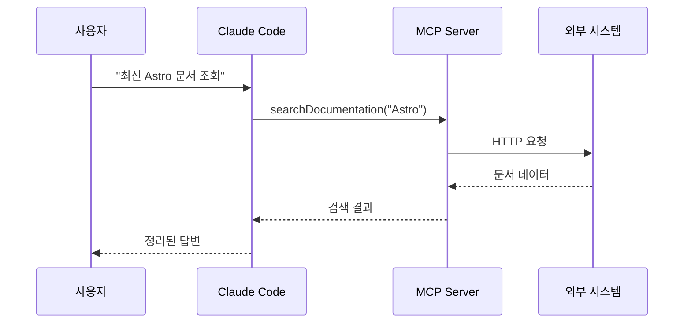
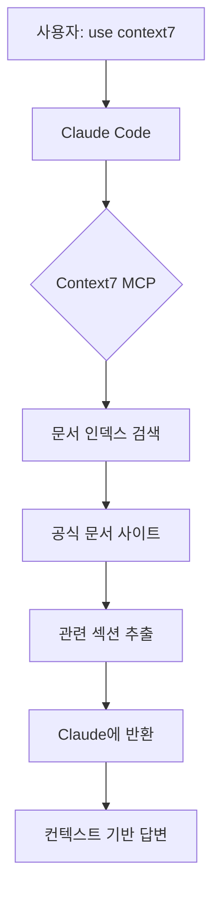
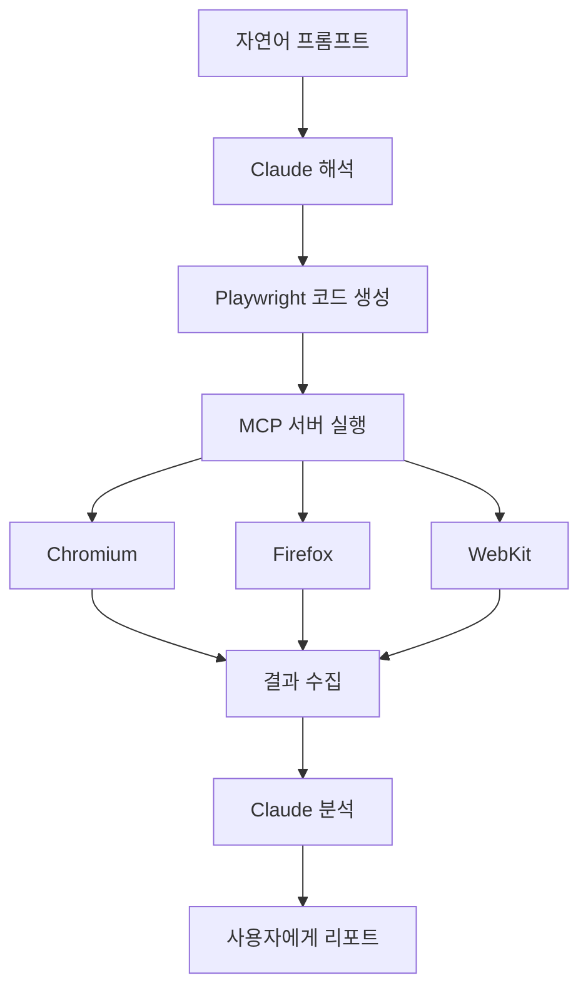
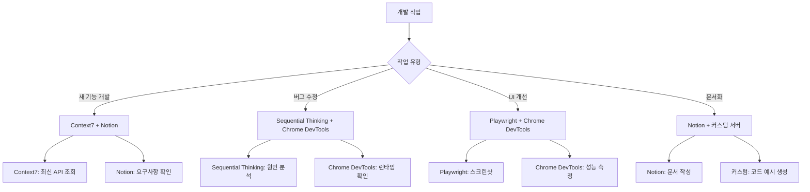

# Chapter 5: MCP 서버 통합

Model Context Protocol(MCP)은 AI 에이전트의 능력을 확장하는 혁신적인 프로토콜입니다. 이 장에서는 MCP 서버를 활용하여 Claude Code의 컨텍스트를 실시간 데이터, 외부 시스템, 전문 도구로 확장하는 방법을 배웁니다.

## Recipe 5.1: MCP 서버란 무엇인가

### 문제 (Problem)

LLM(Large Language Model)은 학습 데이터의 시점에 갇혀 있습니다. Claude의 지식은 2025년 1월까지의 데이터로 제한되며, 그 이후 출시된 라이브러리 업데이트나 최신 기술 정보를 알 수 없습니다. 또한 파일 시스템 접근, 데이터베이스 조회, 브라우저 제어 같은 외부 시스템과의 상호작용도 제한적입니다.

개발자는 종종 다음과 같은 상황에 직면합니다:

- "Astro 5.0의 새로운 기능을 사용하고 싶은데, Claude가 모른다고 해요"
- "실시간 데이터베이스 스키마를 보고 코드를 생성했으면 좋겠어요"
- "웹 페이지를 자동으로 테스트하고 스크린샷을 찍고 싶어요"
- "GitHub 이슈를 자동으로 생성하고 관리하고 싶어요"

### 해결책 (Solution)

Model Context Protocol(MCP)은 AI 에이전트가 외부 도구 및 데이터 소스와 통신하기 위한 표준 프로토콜입니다. Anthropic이 2024년 11월에 발표한 이 프로토콜은 LLM의 컨텍스트를 확장하여 실시간 정보 접근과 외부 시스템 제어를 가능하게 합니다.

**MCP의 핵심 개념**:

1. **Server**: 특정 기능을 제공하는 외부 프로세스 (예: 데이터베이스 서버, 브라우저 자동화 서버)
2. **Client**: MCP 서버와 통신하는 AI 에이전트 (Claude Code)
3. **Resources**: 서버가 제공하는 데이터나 기능 (예: 문서 검색, 코드 분석)
4. **Tools**: Claude가 호출할 수 있는 구체적인 함수

**MCP 서버 설정 방법**:

Claude Code는 `~/.claude/settings.json` 파일에서 MCP 서버를 설정합니다.

```json
{
  "mcpServers": {
    "서버이름": {
      "command": "실행명령",
      "args": ["인자1", "인자2"],
      "env": {
        "환경변수": "값"
      }
    }
  }
}
```

### 코드/예시 (Code)

가장 간단한 MCP 서버 설정 예시를 살펴보겠습니다. Context7 서버는 최신 라이브러리 문서를 검색하는 서버입니다.

```json
{
  "mcpServers": {
    "context7": {
      "command": "npx",
      "args": ["-y", "@upstash/context7-mcp"]
    }
  }
}
```

이 설정의 의미:
- **서버 이름**: `context7` (Claude가 이 이름으로 서버를 식별)
- **실행 명령**: `npx` (Node.js 패키지 실행 도구)
- **인자**: `-y @upstash/context7-mcp` (자동 설치 및 실행)

설정 후 Claude Code를 재시작하면 서버가 자동으로 로드됩니다. 이제 다음과 같이 사용할 수 있습니다:

```
프롬프트: "Astro 5.0의 Content Collections 설정 방법을 알려줘. use context7"
```

Claude는 자동으로 Context7 서버를 호출하여 최신 Astro 문서를 검색하고, 정확한 정보를 제공합니다.

### 설명 (Explanation)

**MCP가 해결하는 문제**:

1. **Hallucination 방지**: LLM이 모르는 정보를 추측하는 대신, 실제 데이터 소스를 조회합니다.
2. **컨텍스트 확장**: 학습 데이터의 제약을 벗어나 실시간 정보에 접근합니다.
3. **도구 통합**: 브라우저, 데이터베이스, API 등 외부 시스템을 제어합니다.
4. **표준화**: 동일한 프로토콜로 다양한 도구를 연결하여 일관성을 유지합니다.

**MCP의 작동 원리**:



Claude가 MCP 서버를 호출하면, 서버는 외부 시스템(API, 데이터베이스, 브라우저 등)과 통신하여 결과를 Claude에게 반환합니다. Claude는 이 결과를 컨텍스트로 활용하여 사용자에게 정확한 답변을 제공합니다.

**MCP vs 기존 플러그인 시스템**:

| 특징 | MCP | 기존 플러그인 |
|------|-----|--------------|
| 표준화 | 단일 프로토콜 | 플랫폼마다 상이 |
| 보안 | 샌드박스 격리 | 직접 통합 위험 |
| 확장성 | 무제한 서버 추가 | 플랫폼 제한 |
| 재사용성 | 다른 AI 클라이언트 공유 | 플랫폼 종속 |

### 변형 (Variations)

**로컬 vs 원격 서버**:

대부분의 MCP 서버는 로컬에서 실행되지만, 원격 서버도 가능합니다.

```json
{
  "mcpServers": {
    "remote-server": {
      "command": "node",
      "args": ["mcp-client.js"],
      "env": {
        "SERVER_URL": "https://api.example.com/mcp"
      }
    }
  }
}
```

**Docker 기반 서버**:

복잡한 의존성이 있는 서버는 Docker로 실행할 수 있습니다.

```json
{
  "mcpServers": {
    "sequentialthinking": {
      "command": "docker",
      "args": [
        "run",
        "-i",
        "--rm",
        "mcp/sequentialthinking"
      ]
    }
  }
}
```

**조건부 서버 활성화**:

프로젝트별로 다른 서버를 활성화하려면 `.claude/settings.local.json`을 사용합니다.

```json
{
  "mcpServers": {
    "project-specific-server": {
      "command": "npx",
      "args": ["-y", "my-custom-mcp-server"]
    }
  }
}
```

---

## Recipe 5.2: Context7으로 최신 문서 조회

### 문제 (Problem)

개발자는 끊임없이 변화하는 기술 생태계에서 살아갑니다. 라이브러리는 매달 업데이트되고, 새로운 기능이 추가되며, 기존 API가 변경됩니다. Claude의 학습 데이터는 2025년 1월까지이므로, 그 이후 출시된 업데이트나 새로운 라이브러리를 알 수 없습니다.

예를 들어:
- Astro 5.0이 2025년 2월에 출시되었다면 Claude는 모릅니다.
- React 19의 새로운 훅을 사용하려 해도 정확한 API를 모릅니다.
- Next.js 15의 App Router 변경사항을 알 수 없습니다.

이 경우 Claude는 추측(hallucination)을 하거나 "제 학습 데이터에 없습니다"라고 답변할 수밖에 없습니다.

### 해결책 (Solution)

Context7은 최신 라이브러리 공식 문서를 실시간으로 검색하는 MCP 서버입니다. Upstash가 제공하는 이 서버는 주요 프레임워크와 라이브러리의 공식 문서를 인덱싱하고, Claude가 필요할 때 검색할 수 있게 합니다.

**Context7 설치 및 설정**:

1. `~/.claude/settings.json` 열기
2. `mcpServers` 섹션에 Context7 추가

```json
{
  "mcpServers": {
    "context7": {
      "command": "npx",
      "args": ["-y", "@upstash/context7-mcp"]
    }
  }
}
```

3. Claude Code 재시작
4. Context7 서버가 자동으로 로드되는지 확인

### 코드/예시 (Code)

**기본 사용법**:

프롬프트에 "use context7"을 포함하면 Claude가 자동으로 Context7를 호출합니다.

```
프롬프트 1: "Astro 5.0의 Content Collections 설정 방법을 알려줘. use context7"

Claude의 동작:
1. Context7 서버에 "Astro Content Collections" 검색 요청
2. 최신 Astro 공식 문서에서 관련 정보 추출
3. 검색 결과를 컨텍스트로 활용하여 정확한 답변 생성
```

**실제 사용 예시 1: 새로운 라이브러리 학습**:

```
프롬프트: "Vercel의 AI SDK 3.0에서 스트리밍 응답을 구현하는 방법을 알려줘. use context7"

답변 예시:
"Context7에서 Vercel AI SDK 공식 문서를 조회했습니다.

AI SDK 3.0에서는 `streamText()` 함수를 사용합니다:

\`\`\`typescript
import { streamText } from 'ai';

const result = await streamText({
  model: openai('gpt-4'),
  prompt: 'Write a poem',
});

for await (const chunk of result.textStream) {
  console.log(chunk);
}
\`\`\`

주요 변경사항:
- v2의 `stream: true` 옵션은 제거되었습니다
- `streamText()`는 비동기 이터레이터를 반환합니다
- `textStream` 프로퍼티로 실시간 텍스트 청크에 접근합니다"
```

**실제 사용 예시 2: API 마이그레이션**:

```
프롬프트: "Next.js 14에서 15로 마이그레이션할 때 App Router의 주요 변경사항을 알려줘. use context7"

Claude의 작업:
1. Context7에서 Next.js 15 마이그레이션 가이드 조회
2. App Router 관련 Breaking Changes 추출
3. 코드 예시와 함께 정리

답변 예시:
"Context7에서 Next.js 15 공식 문서를 확인했습니다.

주요 변경사항:

1. **`fetch()` 기본 동작 변경**
   - 이전: 자동 캐싱 (force-cache)
   - 현재: 기본 no-store

\`\`\`typescript
// Next.js 14
fetch('https://api.example.com/data')  // 자동 캐싱

// Next.js 15
fetch('https://api.example.com/data', { cache: 'force-cache' })  // 명시적 캐싱
\`\`\`

2. **`cookies()`와 `headers()` 비동기화**
   - 이제 Promise를 반환합니다

\`\`\`typescript
// Next.js 14
const cookieStore = cookies()

// Next.js 15
const cookieStore = await cookies()
\`\`\`

마이그레이션 체크리스트:
- [ ] 모든 fetch() 호출에 캐싱 전략 명시
- [ ] cookies(), headers() 호출에 await 추가
- [ ] 동적 렌더링 전략 재검토"
```

### 설명 (Explanation)

**Context7이 제공하는 가치**:

1. **Hallucination 방지**: Claude가 추측하는 대신 실제 문서를 조회합니다.
2. **최신 정보 보장**: 공식 문서는 항상 최신 상태를 유지합니다.
3. **정확한 코드 예시**: 공식 문서의 검증된 예제를 활용합니다.
4. **버전 관리**: 특정 버전의 문서를 명시적으로 조회할 수 있습니다.

**지원하는 주요 라이브러리**:

Context7은 다음 라이브러리의 공식 문서를 인덱싱합니다:

- **프레임워크**: React, Vue, Svelte, Angular, Astro, Next.js, Nuxt, SvelteKit
- **백엔드**: Express, Fastify, NestJS, Hono
- **데이터베이스**: Prisma, Drizzle, TypeORM
- **유틸리티**: Lodash, date-fns, Zod
- **AI/ML**: LangChain, Vercel AI SDK, OpenAI SDK

**작동 원리**:



Context7은 정기적으로 공식 문서 사이트를 크롤링하여 인덱스를 업데이트합니다. 검색 요청이 들어오면 벡터 유사도 검색을 통해 가장 관련성 높은 문서 섹션을 추출합니다.

### 변형 (Variations)

**특정 버전 조회**:

```
프롬프트: "React 18의 useTransition 훅 사용법을 알려줘. use context7"
```

Claude는 자동으로 버전 정보를 파악하고 해당 버전의 문서를 조회합니다.

**다중 라이브러리 비교**:

```
프롬프트: "Prisma와 Drizzle의 트랜잭션 처리 방식을 비교해줘. use context7"
```

Context7은 두 라이브러리의 문서를 동시에 조회하여 비교 분석을 제공합니다.

**프레임워크 통합 패턴 조회**:

```
프롬프트: "Astro 프로젝트에 Tailwind CSS를 통합하는 공식 방법을 알려줘. use context7"
```

두 라이브러리의 통합 가이드를 교차 참조하여 정확한 설정 방법을 제공합니다.

**문제 해결**:

Context7이 작동하지 않는 경우:

```bash
# 1. npx 캐시 제거
rm -rf ~/.npm/_npx

# 2. 수동으로 패키지 설치
npm install -g @upstash/context7-mcp

# 3. settings.json에서 전역 패키지 사용
{
  "context7": {
    "command": "context7-mcp"
  }
}
```

---

## Recipe 5.3: Playwright로 웹 자동화

### 문제 (Problem)

웹 애플리케이션 개발에서 반복적인 수동 작업이 많습니다:

- 새로운 기능을 개발할 때마다 브라우저에서 수동 테스트
- 여러 해상도에서 레이아웃 확인을 위해 반복적인 리사이징
- 스크린샷 캡처를 위해 개발자 도구를 열고 저장
- 다양한 브라우저(Chrome, Firefox, Safari)에서 호환성 확인

이런 작업들은 시간이 많이 걸리고 오류가 발생하기 쉽습니다. 또한 E2E 테스트를 작성하려면 Playwright나 Cypress 같은 도구를 배워야 합니다.

### 해결책 (Solution)

Playwright MCP 서버를 사용하면 Claude가 브라우저를 직접 제어할 수 있습니다. 자연어로 테스트 시나리오를 설명하면 Claude가 자동으로 Playwright 코드를 생성하고 실행합니다.

**Playwright MCP 설치**:

```json
{
  "mcpServers": {
    "playwright": {
      "command": "npx",
      "args": ["@anthropic-ai/mcp-server-playwright@latest"]
    }
  }
}
```

### 코드/예시 (Code)

**예시 1: 페이지 스크린샷 자동 캡처**:

```
프롬프트: "localhost:4321 페이지를 열고 전체 페이지 스크린샷을 캡처해줘. 파일명은 homepage.png로"

Claude의 작업:
1. Playwright 브라우저 실행
2. 지정된 URL 접속
3. 페이지 로딩 완료 대기
4. 전체 페이지 스크린샷 저장
```

생성되는 Playwright 코드:

```typescript
import { chromium } from 'playwright';

async function captureScreenshot() {
  const browser = await chromium.launch();
  const page = await browser.newPage();

  await page.goto('http://localhost:4321');
  await page.waitForLoadState('networkidle');

  await page.screenshot({
    path: 'homepage.png',
    fullPage: true
  });

  await browser.close();
}

captureScreenshot();
```

**예시 2: 반응형 레이아웃 테스트**:

```
프롬프트: "블로그 페이지를 모바일(375x667), 태블릿(768x1024), 데스크톱(1920x1080) 해상도에서 스크린샷 캡처해줘"

Claude의 작업:
1. 세 가지 뷰포트 크기로 페이지 열기
2. 각 해상도에서 스크린샷 저장
3. 파일명에 해상도 정보 포함
```

생성되는 코드:

```typescript
import { chromium } from 'playwright';

const viewports = [
  { name: 'mobile', width: 375, height: 667 },
  { name: 'tablet', width: 768, height: 1024 },
  { name: 'desktop', width: 1920, height: 1080 }
];

async function testResponsive() {
  const browser = await chromium.launch();

  for (const viewport of viewports) {
    const page = await browser.newPage({
      viewport: { width: viewport.width, height: viewport.height }
    });

    await page.goto('http://localhost:4321/blog');
    await page.waitForLoadState('networkidle');

    await page.screenshot({
      path: `blog-${viewport.name}.png`,
      fullPage: true
    });

    await page.close();
  }

  await browser.close();
}

testResponsive();
```

**예시 3: E2E 사용자 시나리오 테스트**:

```
프롬프트: "블로그 검색 기능을 테스트하는 E2E 테스트를 작성해줘:
1. 홈페이지 접속
2. 검색창에 'MCP' 입력
3. 검색 결과가 3개 이상 나오는지 확인
4. 첫 번째 결과 클릭
5. 페이지 제목에 'MCP'가 포함되는지 확인"

Claude의 작업:
1. 사용자 시나리오를 단계별로 분석
2. 각 단계에 대한 Playwright 액션 매핑
3. assertion을 포함한 테스트 코드 생성
```

생성되는 코드:

```typescript
import { test, expect } from '@playwright/test';

test('블로그 검색 기능 테스트', async ({ page }) => {
  // 1. 홈페이지 접속
  await page.goto('http://localhost:4321');

  // 2. 검색창에 'MCP' 입력
  await page.fill('input[type="search"]', 'MCP');
  await page.press('input[type="search"]', 'Enter');

  // 3. 검색 결과가 3개 이상 나오는지 확인
  await page.waitForSelector('.search-result');
  const results = await page.locator('.search-result').count();
  expect(results).toBeGreaterThanOrEqual(3);

  // 4. 첫 번째 결과 클릭
  await page.locator('.search-result').first().click();

  // 5. 페이지 제목에 'MCP'가 포함되는지 확인
  await expect(page).toHaveTitle(/MCP/);
});
```

### 설명 (Explanation)

**Playwright MCP의 핵심 기능**:

1. **브라우저 제어**: Chromium, Firefox, WebKit 세 가지 브라우저 엔진 지원
2. **자동 대기**: 요소가 나타날 때까지 자동으로 대기
3. **스크린샷**: 전체 페이지 또는 특정 요소의 스크린샷 캡처
4. **네트워크 모니터링**: API 호출 및 리소스 로딩 추적
5. **크로스 브라우저 테스트**: 여러 브라우저에서 동일한 테스트 실행

**Chrome DevTools MCP와의 차이**:

| 기능 | Playwright MCP | Chrome DevTools MCP |
|------|----------------|---------------------|
| 주 용도 | 자동화, E2E 테스트 | 성능 분석, 디버깅 |
| 브라우저 | Chromium, Firefox, WebKit | Chrome만 |
| 스크린샷 | 전체 페이지, 요소별 | 뷰포트만 |
| 네트워크 | 요청 가로채기 가능 | 모니터링만 |
| 실행 모드 | Headless/Headed | Headed(디버깅 포트) |

**작동 원리**:



### 변형 (Variations)

**다크 모드 스크린샷**:

```
프롬프트: "페이지를 다크 모드로 전환하고 스크린샷 캡처해줘"

생성 코드:
await page.emulateMedia({ colorScheme: 'dark' });
await page.screenshot({ path: 'dark-mode.png' });
```

**네트워크 속도 시뮬레이션**:

```
프롬프트: "3G 네트워크 환경에서 페이지 로딩을 테스트하고 완료 시간을 측정해줘"

생성 코드:
const context = await browser.newContext({
  ...devices['Slow 3G']
});
const page = await context.newPage();
const start = Date.now();
await page.goto('http://localhost:4321');
await page.waitForLoadState('networkidle');
const duration = Date.now() - start;
console.log(`로딩 시간: ${duration}ms`);
```

**PDF 생성**:

```
프롬프트: "블로그 포스트를 PDF로 저장해줘"

생성 코드:
await page.goto('http://localhost:4321/blog/post-title');
await page.pdf({
  path: 'blog-post.pdf',
  format: 'A4',
  printBackground: true
});
```

**특정 요소만 스크린샷**:

```
프롬프트: "페이지에서 .hero-section 요소만 스크린샷 캡처해줘"

생성 코드:
const element = await page.locator('.hero-section');
await element.screenshot({ path: 'hero.png' });
```

---

## Recipe 5.4: Notion API 연동

### 문제 (Problem)

많은 개발자가 Notion을 아이디어 관리, 프로젝트 계획, 문서화에 사용합니다. 하지만 Notion과 개발 환경은 분리되어 있습니다:

- 블로그 아이디어를 Notion에 기록하고, 나중에 코드로 옮겨야 합니다
- 프로젝트 TODO를 Notion에서 관리하지만, 코드 작업과 동기화가 안 됩니다
- 기술 문서를 Notion에 작성하지만, 코드 주석이나 README에 복붙해야 합니다

이런 수동 동기화는 시간이 많이 걸리고 오류가 발생하기 쉽습니다.

### 해결책 (Solution)

Notion MCP 서버를 사용하면 Claude가 Notion 데이터베이스를 직접 읽고 쓸 수 있습니다. 이를 통해 Notion과 코드베이스를 자동으로 동기화할 수 있습니다.

**Notion MCP 설정**:

1. Notion API 키 발급:
   - [https://www.notion.so/my-integrations](https://www.notion.so/my-integrations) 접속
   - "New integration" 클릭
   - 이름 입력 (예: "Claude Code Integration")
   - "Submit" 클릭
   - "Internal Integration Token" 복사

2. Notion 데이터베이스에 통합 연결:
   - Notion에서 데이터베이스 페이지 열기
   - 우측 상단 "..." 메뉴 클릭
   - "Connections" → "Claude Code Integration" 선택

3. MCP 서버 설정:

```json
{
  "mcpServers": {
    "notion": {
      "command": "npx",
      "args": ["-y", "@anthropic-ai/mcp-server-notion"],
      "env": {
        "NOTION_API_KEY": "secret_your_api_key_here"
      }
    }
  }
}
```

### 코드/예시 (Code)

**예시 1: 블로그 아이디어 조회**:

Notion에 "Blog Ideas" 데이터베이스가 있다고 가정합니다:

| Title | Status | Tags | Created |
|-------|--------|------|---------|
| MCP 서버 활용법 | Draft | claude-code, productivity | 2025-11-20 |
| Playwright 자동화 | To Write | testing, automation | 2025-11-21 |

```
프롬프트: "Notion의 'Blog Ideas' 데이터베이스에서 Status가 'To Write'인 항목을 가져와줘"

Claude의 작업:
1. Notion API로 데이터베이스 조회
2. Status 필터 적용
3. 결과를 정리하여 표시
```

Claude의 응답:

```markdown
Notion에서 작성 대기 중인 블로그 아이디어를 조회했습니다:

1. **Playwright 자동화**
   - Tags: testing, automation
   - Created: 2025-11-21

이 주제로 블로그 포스트를 작성할까요?
```

**예시 2: 블로그 포스트를 Notion에 자동 등록**:

```
프롬프트: "방금 작성한 'MCP 서버 통합' 블로그 포스트를 Notion의 'Published Posts' 데이터베이스에 추가해줘.
상태는 'Published', 날짜는 오늘로 설정"

Claude의 작업:
1. 현재 작성 중인 블로그 메타데이터 파싱 (title, description, tags)
2. Notion API로 새 페이지 생성
3. 속성 값 설정 (Status, Published Date, Tags)
```

생성되는 Notion API 호출:

```typescript
import { Client } from '@notionhq/client';

const notion = new Client({ auth: process.env.NOTION_API_KEY });

await notion.pages.create({
  parent: { database_id: 'your_database_id' },
  properties: {
    Title: {
      title: [
        {
          text: { content: 'MCP 서버 통합' }
        }
      ]
    },
    Status: {
      select: { name: 'Published' }
    },
    'Published Date': {
      date: { start: '2025-11-23' }
    },
    Tags: {
      multi_select: [
        { name: 'mcp' },
        { name: 'claude-code' },
        { name: 'productivity' }
      ]
    }
  }
});
```

**예시 3: TODO 동기화**:

```
프롬프트: "Notion의 'Development Tasks' 데이터베이스에서
'MCP Integration' 프로젝트의 미완료 태스크를 가져와서
프로젝트의 TODO.md 파일에 마크다운 체크리스트로 추가해줘"

Claude의 작업:
1. Notion API로 태스크 조회 (프로젝트 필터 + 미완료 필터)
2. 마크다운 체크리스트 형식으로 변환
3. TODO.md 파일에 추가
```

생성되는 TODO.md:

```markdown
# Development Tasks

## MCP Integration

- [ ] Context7 서버 설정 문서 작성
- [ ] Playwright 예제 추가
- [ ] Notion API 연동 테스트
- [ ] 보안 설정 검토
```

### 설명 (Explanation)

**Notion MCP의 핵심 기능**:

1. **데이터베이스 조회**: 필터, 정렬, 페이지네이션 지원
2. **페이지 생성/업데이트**: 새 항목 추가 또는 기존 항목 수정
3. **속성 관리**: Title, Select, Multi-select, Date, Number 등 모든 속성 타입 지원
4. **블록 읽기**: 페이지 내 콘텐츠 블록 조회
5. **검색**: 전체 워크스페이스 검색

**권한 관리**:

Notion MCP는 `.claude/settings.local.json`에서 세밀한 권한 제어가 가능합니다:

```json
{
  "toolAllowlist": {
    "notion": {
      "API-post-search": "allow",        // 검색 허용
      "API-get-self": "allow",           // 사용자 정보 조회 허용
      "API-get-block-children": "allow", // 블록 읽기 허용
      "API-post-pages": "ask",           // 페이지 생성 시 확인 요청
      "API-patch-pages": "ask"           // 페이지 수정 시 확인 요청
    }
  }
}
```

**보안 고려사항**:

1. **API 키 관리**: settings.json에 하드코딩하지 말고 환경 변수 사용
2. **최소 권한 원칙**: 필요한 데이터베이스만 통합 연결
3. **읽기 전용 모드**: 쓰기 권한이 필요 없다면 읽기만 허용
4. **로컬 설정**: 민감한 설정은 `.claude/settings.local.json`에 저장 (버전 관리 제외)

### 변형 (Variations)

**프로젝트 메타데이터 자동 업데이트**:

```
프롬프트: "현재 프로젝트의 package.json 버전을 읽고,
Notion의 'Projects' 데이터베이스에서 이 프로젝트의 Version 필드를 업데이트해줘"

Claude의 작업:
1. package.json 읽기
2. version 필드 추출
3. Notion에서 프로젝트 페이지 검색
4. Version 속성 업데이트
```

**학습 노트 자동 생성**:

```
프롬프트: "오늘 작업한 코드 변경사항을 분석하고,
Notion의 'Learning Log' 데이터베이스에
'오늘 배운 것' 항목으로 추가해줘"

Claude의 작업:
1. git diff로 변경사항 분석
2. 주요 학습 포인트 추출
3. Notion에 새 페이지 생성
4. 코드 스니펫 포함하여 정리
```

**릴리스 노트 동기화**:

```
프롬프트: "CHANGELOG.md의 최신 버전 내용을
Notion의 'Release Notes' 데이터베이스에 동기화해줘"

Claude의 작업:
1. CHANGELOG.md 파싱
2. 최신 버전 섹션 추출
3. Notion에 새 릴리스 페이지 생성
4. 변경사항을 Notion 블록으로 변환
```

---

## Recipe 5.5: 커스텀 MCP 서버 구축

### 문제 (Problem)

기존 MCP 서버들은 일반적인 사용 사례를 다루지만, 프로젝트마다 고유한 요구사항이 있습니다:

- 사내 API나 데이터베이스에 접근해야 하는 경우
- 특정 파일 형식이나 프로토콜을 처리해야 하는 경우
- 기존 서버에 없는 새로운 기능이 필요한 경우

예를 들어, 회사에서 사용하는 JIRA, Slack, 또는 내부 데이터베이스와 Claude를 연결하고 싶다면 커스텀 MCP 서버를 만들어야 합니다.

### 해결책 (Solution)

MCP SDK를 사용하여 커스텀 서버를 만들 수 있습니다. Anthropic은 TypeScript와 Python용 SDK를 제공하며, 서버 개발을 단순화합니다.

**간단한 MCP 서버 구조**:

```typescript
import { Server } from '@modelcontextprotocol/sdk/server/index.js';
import { StdioServerTransport } from '@modelcontextprotocol/sdk/server/stdio.js';

const server = new Server({
  name: 'my-custom-server',
  version: '1.0.0',
});

// Tool 등록
server.setRequestHandler(ListToolsRequestSchema, async () => {
  return {
    tools: [
      {
        name: 'my_tool',
        description: 'My custom tool',
        inputSchema: {
          type: 'object',
          properties: {
            query: { type: 'string' }
          }
        }
      }
    ]
  };
});

// Tool 실행
server.setRequestHandler(CallToolRequestSchema, async (request) => {
  if (request.params.name === 'my_tool') {
    const result = await myCustomLogic(request.params.arguments.query);
    return { content: [{ type: 'text', text: result }] };
  }
});

// 서버 시작
const transport = new StdioServerTransport();
await server.connect(transport);
```

### 코드/예시 (Code)

**예시 1: Markdown 링크 검증 서버**:

블로그 포스트의 모든 링크가 유효한지 확인하는 MCP 서버를 만들어 보겠습니다.

**프로젝트 구조**:

```
markdown-link-checker/
├── package.json
├── src/
│   └── index.ts
└── README.md
```

**package.json**:

```json
{
  "name": "markdown-link-checker-mcp",
  "version": "1.0.0",
  "type": "module",
  "bin": {
    "markdown-link-checker-mcp": "./dist/index.js"
  },
  "dependencies": {
    "@modelcontextprotocol/sdk": "^0.5.0",
    "markdown-link-check": "^3.12.1"
  },
  "devDependencies": {
    "@types/node": "^20.0.0",
    "typescript": "^5.0.0"
  },
  "scripts": {
    "build": "tsc",
    "start": "node dist/index.js"
  }
}
```

**src/index.ts**:

```typescript
import { Server } from '@modelcontextprotocol/sdk/server/index.js';
import { StdioServerTransport } from '@modelcontextprotocol/sdk/server/stdio.js';
import {
  CallToolRequestSchema,
  ListToolsRequestSchema,
} from '@modelcontextprotocol/sdk/types.js';
import markdownLinkCheck from 'markdown-link-check';
import { readFile } from 'fs/promises';

const server = new Server({
  name: 'markdown-link-checker',
  version: '1.0.0',
});

server.setRequestHandler(ListToolsRequestSchema, async () => {
  return {
    tools: [
      {
        name: 'check_markdown_links',
        description: 'Markdown 파일의 모든 링크 유효성 검증',
        inputSchema: {
          type: 'object',
          properties: {
            filePath: {
              type: 'string',
              description: '검사할 Markdown 파일 경로'
            }
          },
          required: ['filePath']
        }
      }
    ]
  };
});

server.setRequestHandler(CallToolRequestSchema, async (request) => {
  if (request.params.name === 'check_markdown_links') {
    const { filePath } = request.params.arguments as { filePath: string };

    try {
      const content = await readFile(filePath, 'utf-8');

      return new Promise((resolve) => {
        markdownLinkCheck(content, (err, results) => {
          if (err) {
            resolve({
              content: [{
                type: 'text',
                text: `오류: ${err.message}`
              }]
            });
            return;
          }

          const deadLinks = results.filter(r => r.status === 'dead');
          const aliveLinks = results.filter(r => r.status === 'alive');

          const report = `
링크 검사 완료: ${filePath}

✅ 유효한 링크: ${aliveLinks.length}개
❌ 깨진 링크: ${deadLinks.length}개

${deadLinks.length > 0 ? '깨진 링크 목록:\n' + deadLinks.map(l =>
  `- ${l.link} (${l.statusCode})`
).join('\n') : '모든 링크가 유효합니다.'}
          `.trim();

          resolve({
            content: [{ type: 'text', text: report }]
          });
        });
      });
    } catch (error) {
      return {
        content: [{
          type: 'text',
          text: `파일 읽기 실패: ${error.message}`
        }]
      };
    }
  }

  throw new Error(`Unknown tool: ${request.params.name}`);
});

async function main() {
  const transport = new StdioServerTransport();
  await server.connect(transport);
  console.error('Markdown Link Checker MCP 서버 시작');
}

main().catch((error) => {
  console.error('서버 오류:', error);
  process.exit(1);
});
```

**빌드 및 설치**:

```bash
# 1. 프로젝트 빌드
npm install
npm run build

# 2. 전역 설치
npm link

# 3. Claude Code 설정 (~/.claude/settings.json)
{
  "mcpServers": {
    "markdown-link-checker": {
      "command": "markdown-link-checker-mcp"
    }
  }
}
```

**사용법**:

```
프롬프트: "src/content/blog/ko/mcp-servers-toolkit-introduction.md 파일의
모든 링크가 유효한지 확인해줘"

Claude의 응답:
"Markdown Link Checker 서버로 검사한 결과:

✅ 유효한 링크: 12개
❌ 깨진 링크: 2개

깨진 링크 목록:
- https://docs.example.com/old-page (404)
- https://api.deprecated.com (500)

이 링크들을 업데이트할까요?"
```

**예시 2: 데이터베이스 쿼리 서버**:

PostgreSQL 데이터베이스에 안전하게 쿼리할 수 있는 MCP 서버:

```typescript
import { Server } from '@modelcontextprotocol/sdk/server/index.js';
import { StdioServerTransport } from '@modelcontextprotocol/sdk/server/stdio.js';
import {
  CallToolRequestSchema,
  ListToolsRequestSchema,
} from '@modelcontextprotocol/sdk/types.js';
import pg from 'pg';

const { Pool } = pg;

const pool = new Pool({
  host: process.env.DB_HOST,
  database: process.env.DB_NAME,
  user: process.env.DB_USER,
  password: process.env.DB_PASSWORD,
  port: parseInt(process.env.DB_PORT || '5432'),
});

const server = new Server({
  name: 'postgres-query',
  version: '1.0.0',
});

// 허용된 읽기 전용 쿼리 패턴
const ALLOWED_QUERIES = /^SELECT\s+/i;

server.setRequestHandler(ListToolsRequestSchema, async () => {
  return {
    tools: [
      {
        name: 'query_database',
        description: 'PostgreSQL 데이터베이스에 읽기 전용 쿼리 실행',
        inputSchema: {
          type: 'object',
          properties: {
            query: {
              type: 'string',
              description: 'SQL SELECT 쿼리'
            },
            limit: {
              type: 'number',
              description: '결과 행 수 제한 (기본: 100)',
              default: 100
            }
          },
          required: ['query']
        }
      }
    ]
  };
});

server.setRequestHandler(CallToolRequestSchema, async (request) => {
  if (request.params.name === 'query_database') {
    const { query, limit = 100 } = request.params.arguments as {
      query: string;
      limit?: number;
    };

    // 보안: SELECT 쿼리만 허용
    if (!ALLOWED_QUERIES.test(query)) {
      return {
        content: [{
          type: 'text',
          text: '오류: SELECT 쿼리만 허용됩니다.'
        }]
      };
    }

    // LIMIT 추가
    const safeQuery = query.trim().replace(/;$/, '') + ` LIMIT ${limit}`;

    try {
      const result = await pool.query(safeQuery);

      // 결과를 마크다운 테이블로 포맷
      const headers = Object.keys(result.rows[0] || {});
      const table = `
| ${headers.join(' | ')} |
| ${headers.map(() => '---').join(' | ')} |
${result.rows.map(row =>
  `| ${headers.map(h => row[h]).join(' | ')} |`
).join('\n')}

총 ${result.rowCount}행
      `.trim();

      return {
        content: [{ type: 'text', text: table }]
      };
    } catch (error) {
      return {
        content: [{
          type: 'text',
          text: `쿼리 오류: ${error.message}`
        }]
      };
    }
  }

  throw new Error(`Unknown tool: ${request.params.name}`);
});

async function main() {
  const transport = new StdioServerTransport();
  await server.connect(transport);
  console.error('PostgreSQL Query MCP 서버 시작');
}

main().catch((error) => {
  console.error('서버 오류:', error);
  process.exit(1);
});
```

**설정 파일 (~/.claude/settings.json)**:

```json
{
  "mcpServers": {
    "postgres-query": {
      "command": "node",
      "args": ["/path/to/postgres-query-mcp/dist/index.js"],
      "env": {
        "DB_HOST": "localhost",
        "DB_NAME": "myapp",
        "DB_USER": "readonly_user",
        "DB_PASSWORD": "secure_password",
        "DB_PORT": "5432"
      }
    }
  }
}
```

**사용 예시**:

```
프롬프트: "users 테이블에서 최근 7일간 가입한 사용자 수를 조회해줘"

Claude의 작업:
1. 프롬프트를 SQL 쿼리로 변환
2. PostgreSQL Query MCP 서버 호출
3. 결과를 자연어로 요약

생성되는 쿼리:
SELECT COUNT(*) as new_users
FROM users
WHERE created_at >= NOW() - INTERVAL '7 days'

결과:
"최근 7일간 247명의 신규 사용자가 가입했습니다."
```

### 설명 (Explanation)

**MCP 서버의 핵심 구성 요소**:

1. **Server**: MCP 프로토콜을 구현하는 메인 객체
2. **Transport**: 통신 방식 (주로 stdio, SSE도 가능)
3. **Tools**: Claude가 호출할 수 있는 함수 목록
4. **Resources**: 서버가 제공하는 데이터 소스 (선택사항)
5. **Request Handlers**: Tool 실행 로직

**보안 고려사항**:

1. **입력 검증**: 사용자 입력을 신뢰하지 말고 항상 검증
2. **권한 제한**: 읽기 전용 작업과 쓰기 작업 분리
3. **Rate Limiting**: 과도한 요청 방지
4. **환경 변수**: API 키, DB 비밀번호 등은 환경 변수로 관리
5. **에러 핸들링**: 민감한 정보가 에러 메시지에 포함되지 않도록 주의

**MCP SDK 주요 타입**:

```typescript
// Tool 정의
interface Tool {
  name: string;
  description: string;
  inputSchema: {
    type: 'object';
    properties: Record<string, any>;
    required?: string[];
  };
}

// Tool 실행 결과
interface CallToolResult {
  content: Array<{
    type: 'text' | 'image' | 'resource';
    text?: string;
    data?: string;
    mimeType?: string;
  }>;
}

// 서버 메타데이터
interface ServerInfo {
  name: string;
  version: string;
}
```

### 변형 (Variations)

**Resource Provider (읽기 전용 데이터)**:

Tool 대신 Resource로 정적 데이터를 제공할 수 있습니다.

```typescript
import { ListResourcesRequestSchema, ReadResourceRequestSchema } from '@modelcontextprotocol/sdk/types.js';

// 사용 가능한 리소스 목록
server.setRequestHandler(ListResourcesRequestSchema, async () => {
  return {
    resources: [
      {
        uri: 'config://app-settings',
        name: '애플리케이션 설정',
        mimeType: 'application/json'
      }
    ]
  };
});

// 리소스 읽기
server.setRequestHandler(ReadResourceRequestSchema, async (request) => {
  if (request.params.uri === 'config://app-settings') {
    const config = await loadAppSettings();
    return {
      contents: [{
        uri: request.params.uri,
        mimeType: 'application/json',
        text: JSON.stringify(config, null, 2)
      }]
    };
  }
});
```

**SSE Transport (웹 서버)**:

stdio 대신 HTTP SSE를 사용하여 원격 서버로 배포:

```typescript
import { Server } from '@modelcontextprotocol/sdk/server/index.js';
import { SSEServerTransport } from '@modelcontextprotocol/sdk/server/sse.js';
import express from 'express';

const app = express();
const server = new Server({ name: 'remote-mcp', version: '1.0.0' });

// ... Tool 등록 ...

app.get('/sse', async (req, res) => {
  const transport = new SSEServerTransport('/message', res);
  await server.connect(transport);
});

app.post('/message', async (req, res) => {
  // 메시지 처리
});

app.listen(3000, () => {
  console.log('MCP 서버 시작: http://localhost:3000');
});
```

**비동기 처리 및 스트리밍**:

대용량 데이터 처리 시 스트리밍 응답:

```typescript
server.setRequestHandler(CallToolRequestSchema, async (request) => {
  if (request.params.name === 'analyze_large_file') {
    const { filePath } = request.params.arguments as { filePath: string };

    // 진행 상황을 점진적으로 반환
    const chunks: string[] = [];

    for await (const line of readFileByLines(filePath)) {
      const analysis = await analyzeLine(line);
      chunks.push(analysis);

      // 100줄마다 중간 결과 전송 (실제로는 MCP의 notification 메커니즘 사용)
      if (chunks.length % 100 === 0) {
        // Progress notification
      }
    }

    return {
      content: [{
        type: 'text',
        text: chunks.join('\n')
      }]
    };
  }
});
```

---

## 정리 및 다음 단계

이 장에서는 MCP 서버를 활용하여 Claude Code의 능력을 확장하는 방법을 배웠습니다:

1. **MCP 기본 개념**: LLM의 컨텍스트를 실시간 데이터로 확장하는 프로토콜
2. **Context7**: 최신 라이브러리 문서 조회로 hallucination 방지
3. **Playwright**: 브라우저 자동화, E2E 테스트, 스크린샷 캡처
4. **Notion API**: 아이디어 관리와 코드베이스 동기화
5. **커스텀 서버**: 프로젝트 고유 요구사항을 위한 MCP 서버 개발

### 추천 학습 경로

**초급**:
1. Context7 설정 및 사용 (가장 빠른 효과)
2. Playwright로 간단한 스크린샷 캡처
3. Notion 읽기 전용 연동

**중급**:
1. Playwright E2E 테스트 작성
2. Notion 쓰기 기능 활용 (TODO 동기화)
3. 여러 MCP 서버 조합 워크플로우

**고급**:
1. 커스텀 MCP 서버 개발
2. 사내 시스템 통합 (DB, API)
3. Resource Provider 구현

### 실전 적용 팁

**MCP 서버 선택 기준**:

| 상황 | 추천 서버 | 이유 |
|------|----------|------|
| 최신 라이브러리 사용 | Context7 | 공식 문서 기반 정확한 정보 |
| 웹 UI 개발 | Playwright | 반응형 테스트, 스크린샷 |
| 성능 최적화 | Chrome DevTools | Core Web Vitals 측정 |
| 아이디어 관리 | Notion | 코드베이스와 동기화 |
| 복잡한 문제 해결 | Sequential Thinking | 단계별 사고 구조화 |

**조합 활용 패턴**:



### 다음 장 미리보기

Chapter 6에서는 Claude Code를 팀 환경에서 활용하는 방법을 다룹니다:
- 서브에이전트 시스템 구축
- 코드 리뷰 자동화
- 팀 지식 베이스 관리
- CI/CD 파이프라인 통합

MCP 서버는 이 모든 자동화의 기반이 됩니다. Context7로 최신 기술 정보를 공유하고, Notion으로 팀 문서를 동기화하며, 커스텀 서버로 사내 도구를 통합할 수 있습니다.

---

**연습 문제**:

1. Context7을 설정하고 현재 프로젝트에서 사용하는 주요 라이브러리의 최신 문서를 조회해보세요.

2. Playwright MCP를 사용하여 개발 중인 웹 애플리케이션의 주요 페이지 3곳의 스크린샷을 캡처하는 작업을 Claude에게 요청해보세요.

3. (선택) Notion 데이터베이스를 만들고 블로그 아이디어를 기록한 후, Claude를 통해 조회해보세요.

4. (도전) 간단한 커스텀 MCP 서버를 만들어보세요. 예: 프로젝트의 package.json 의존성을 분석하여 오래된 패키지를 찾아주는 서버.

**참고 자료**:
- MCP 공식 문서: https://modelcontextprotocol.io
- Anthropic MCP GitHub: https://github.com/anthropics/anthropic-mcp
- MCP SDK Reference: https://github.com/anthropics/anthropic-mcp/tree/main/sdk
- Community MCP Servers: https://github.com/anthropics/anthropic-mcp/tree/main/servers
