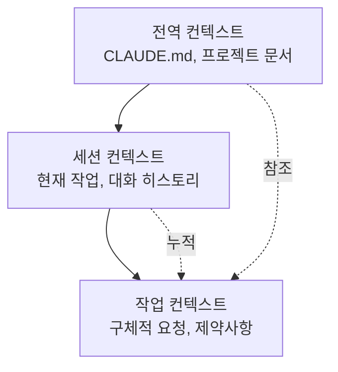

# Chapter 6: 효과적인 프롬프트 작성

Claude Code와의 효과적인 소통은 프로젝트 성공의 핵심입니다. 이 장에서는 AI와의 협업을 극대화하는 프롬프트 작성 기법을 실전 레시피 형식으로 제공합니다.

## Recipe 6.1: 프롬프트 기본 구조

### 문제 (Problem)

AI에게 요청할 때 "블로그 포스트 작성해줘"처럼 단순한 요청을 했더니 기대와 다른 결과가 나옵니다. 어떻게 구조화된 프롬프트를 작성해야 원하는 결과를 얻을 수 있을까요?

### 해결책 (Solution)

효과적인 프롬프트는 다음 4가지 요소로 구성합니다:

1. **역할 정의 (Role)**: 누구의 관점에서 작업할지 명시
2. **컨텍스트 (Context)**: 작업에 필요한 배경 정보 제공
3. **작업 명세 (Task)**: 구체적인 작업 내용과 목표
4. **제약 조건 (Constraints)**: 형식, 분량, 스타일 등의 제한

#### 단계별 가이드

**Step 1: 역할 정의**

AI에게 특정 전문가의 페르소나를 부여합니다.

```markdown
You are an expert technical writer with 10+ years of experience in
developer-focused content creation.
```

**Step 2: 컨텍스트 제공**

작업에 필요한 배경 정보를 명시합니다.

```markdown
I'm creating a blog post about Claude Code for Korean developers who are
new to AI-assisted coding. The target audience is intermediate developers
familiar with TypeScript and Git.
```

**Step 3: 작업 명세**

구체적으로 무엇을 원하는지 설명합니다.

```markdown
Write a technical blog post about "Getting Started with Claude Code" that:
- Explains the basic concepts
- Provides step-by-step installation guide
- Includes 3-5 practical examples
- Demonstrates best practices
```

**Step 4: 제약 조건**

형식과 요구사항을 명시합니다.

```markdown
Requirements:
- Length: 2000-2500 words
- Format: Markdown with code examples
- Style: Professional but approachable (use 존댓말 in Korean)
- Include at least 2 Mermaid diagrams
- All code examples must be syntactically correct
```

### 코드/예시 (Code)

#### 잘못된 프롬프트 (Before)

```
블로그 포스트 작성해줘
```

**결과**: 방향성 없는, 일반적인 내용

#### 개선된 프롬프트 (After)

```markdown
## Role
You are an expert technical writer specializing in developer tools and
AI-assisted coding.

## Context
I'm writing for Korean developers (intermediate level) who want to learn
Claude Code. They already use VS Code and GitHub Copilot, so they
understand AI coding assistants.

## Task
Write a blog post: "Claude Code vs GitHub Copilot: 5 Key Differences"

Content requirements:
1. Introduction (200 words)
   - Brief overview of both tools
   - Why this comparison matters
2. Main content (1500 words)
   - 5 key differences with concrete examples
   - Pros/cons for each difference
3. Conclusion (300 words)
   - When to use which tool
   - Recommendation based on use case

## Constraints
- Length: 2000 words (Korean)
- Format: Markdown
- Style: 존댓말, professional
- Include: 2-3 code examples, 1 comparison table, 1 Mermaid diagram
- SEO: Include keywords "Claude Code", "GitHub Copilot", "AI 코딩 도구"
```

**결과**: 구조화되고, 타겟팅된, 실용적인 콘텐츠

### 설명 (Explanation)

#### 왜 이 구조가 효과적인가?

1. **역할 정의의 힘**: AI에게 전문가 페르소나를 부여하면 출력 품질이 극적으로 향상됩니다. "expert technical writer"라는 정체성이 응답의 톤, 깊이, 전문성을 결정합니다.

2. **컨텍스트의 중요성**: 배경 정보가 없으면 AI는 일반적인 내용을 생성합니다. "Korean developers", "intermediate level", "already use GitHub Copilot" 같은 정보가 콘텐츠를 타겟팅합니다.

3. **명시적 작업 명세**: 모호한 "블로그 작성"보다 구체적인 구조(Introduction, Main, Conclusion)와 각 섹션의 분량을 명시하면 기대에 부합하는 결과를 얻습니다.

4. **제약 조건으로 품질 보증**: 분량, 형식, 스타일을 명시하면 재작업이 줄어듭니다.

#### 심리학적 메커니즘

Claude 같은 대형 언어 모델은 **맥락 학습(In-Context Learning)**을 통해 작동합니다. 프롬프트에 풍부한 컨텍스트를 제공할수록:

- 더 정확한 예측이 가능
- 출력 분산(variance)이 감소
- 일관성이 향상

### 변형 (Variations)

#### Variation 1: 코드 리뷰 요청

```markdown
## Role
You are a senior software engineer specializing in TypeScript and clean code.

## Context
I'm reviewing a Pull Request for a React component that manages authentication state.
The code works but I want to ensure it follows best practices.

## Task
Review the following code and provide:
1. Code quality assessment (1-10 score)
2. 3-5 specific improvement suggestions
3. Refactored version (if needed)

## Constraints
- Focus on: type safety, readability, performance
- Format: Markdown with annotated code
- Include rationale for each suggestion
```

#### Variation 2: 디버깅 지원

```markdown
## Role
You are an expert debugger with deep knowledge of Node.js and async programming.

## Context
My Express.js API intermittently returns 500 errors under high load.
Error logs show "Promise rejection not handled" but I can't identify the source.

## Task
1. Analyze the error pattern
2. Identify potential root causes (ranked by likelihood)
3. Suggest debugging steps
4. Provide a fix if possible

## Constraints
- Explain in Korean (technical terms can be English)
- Include code examples for proposed fixes
- Consider: async/await patterns, error handling, connection pooling
```

#### Variation 3: 아키텍처 설계

```markdown
## Role
You are a solutions architect with expertise in scalable web applications.

## Context
I'm building a blog platform that needs to:
- Handle 10,000+ posts
- Support multi-language (Korean, English, Japanese)
- Optimize for SEO
- Generate static sites (Astro framework)

## Task
Design a content architecture that addresses:
1. Directory structure for multi-language content
2. Metadata schema for SEO and recommendations
3. Build optimization strategy
4. Content relationship management

## Constraints
- Use Astro Content Collections
- Provide Mermaid diagrams for architecture
- Include TypeScript type definitions
- Explain trade-offs for each decision
```

---

## Recipe 6.2: 컨텍스트 제공 기법

### 문제 (Problem)

AI가 프로젝트의 구조나 현재 상황을 이해하지 못해 엉뚱한 제안을 합니다. 예를 들어, 이미 사용 중인 기술 스택을 무시하거나, 프로젝트 규칙에 맞지 않는 코드를 생성합니다.

### 해결책 (Solution)

효과적인 컨텍스트 제공은 3단계로 구성됩니다:

1. **프로젝트 컨텍스트**: 기술 스택, 아키텍처, 규칙
2. **작업 컨텍스트**: 현재 상황, 이전 작업, 의존성
3. **제약 컨텍스트**: 반드시 지켜야 할 규칙

#### 단계별 가이드

**Step 1: 프로젝트 컨텍스트 제공**

CLAUDE.md 같은 프로젝트 문서를 참조하게 합니다.

```markdown
## Project Context

This is an Astro 5.14.1 static blog with:
- Content Collections for type-safe content management
- Multi-language support (ko, en, ja, zh)
- Tailwind CSS for styling
- TypeScript in strict mode

Key conventions:
- Blog posts in: src/content/blog/<lang>/filename.md
- All dates: 'YYYY-MM-DD' format (single quotes)
- Images: src/assets/blog/ (optimized by Astro)
```

**Step 2: 작업 컨텍스트 제공**

현재 무엇을 하고 있는지, 어떤 파일을 작업 중인지 명시합니다.

```markdown
## Current Work

I'm adding a new blog post about "Effective Prompt Engineering".

Already completed:
- Created ko/prompt-engineering.md with frontmatter
- Added hero image: prompt-engineering-hero.jpg

Need to complete:
- Japanese version (ja/prompt-engineering.md)
- English version (en/prompt-engineering.md)
- Verify all 3 versions have consistent metadata
```

**Step 3: 제약 컨텍스트 제공**

절대 위반하면 안 되는 규칙을 명시합니다.

```markdown
## Constraints (MUST FOLLOW)

1. pubDate format: 'YYYY-MM-DD' (NOT "MMM DD YYYY")
2. All 3 language versions must have identical:
   - File names (except language folder)
   - heroImage path
   - pubDate
3. Korean: 존댓말, 25-30 char title
4. Japanese: です/ます体, 30-35 char title
5. English: 50-60 char title
```

### 코드/예시 (Code)

#### 컨텍스트 부족한 프롬프트 (Before)

```
다국어 블로그 포스트 만들어줘
```

**문제점**:
- 어떤 언어들인지 불명확
- 프로젝트 구조 모름
- 파일 위치 모름
- 형식 규칙 모름

**결과**: 프로젝트 규칙에 맞지 않는 파일 생성

#### 풍부한 컨텍스트 프롬프트 (After)

```markdown
## Project Context
Astro blog with Content Collections, multi-language (ko/ja/en/zh).

File structure:
src/content/blog/
├── ko/post-name.md
├── ja/post-name.md
├── en/post-name.md
└── zh/post-name.md

## Current Work
Creating new post: "prompt-engineering-best-practices"

Already done:
- Korean version (ko/prompt-engineering-best-practices.md)
- Hero image uploaded: src/assets/blog/prompt-engineering-hero.jpg

## Task
Create Japanese and English versions with:
1. Same file name in respective language folders
2. Culturally localized content (NOT direct translation)
3. Consistent metadata

## Constraints
Required frontmatter:
```yaml
---
title: "..." # ja: 30-35 char, en: 50-60 char
description: "..." # ja: 80-90 char, en: 150-160 char
pubDate: '2025-11-12' # MUST be single quotes, YYYY-MM-DD
heroImage: ../../../assets/blog/prompt-engineering-hero.jpg # SAME path
tags: ["prompt-engineering", "ai-agents", "claude-code"]
---
```

Japanese style: です/ます体, professional
English style: Professional but approachable
```

**결과**: 프로젝트 규칙을 준수하는, 일관된 다국어 콘텐츠

### 설명 (Explanation)

#### 컨텍스트가 품질을 결정하는 이유

1. **모호성 제거**: "다국어"가 무엇을 의미하는지(언어 종류, 파일 구조, 명명 규칙) 명확해집니다.

2. **오류 방지**: 날짜 형식, 경로 규칙 같은 기술적 제약을 미리 제공하면 재작업이 줄어듭니다.

3. **일관성 보장**: 프로젝트 전체의 규칙을 명시하면 AI가 기존 패턴을 따릅니다.

#### 컨텍스트의 계층 구조



- **전역 컨텍스트**: 변하지 않는 프로젝트 규칙 (CLAUDE.md에 문서화)
- **세션 컨텍스트**: 현재 대화에서 누적된 정보
- **작업 컨텍스트**: 지금 당장 필요한 구체적 정보

### 변형 (Variations)

#### Variation 1: 파일 참조를 통한 컨텍스트 제공

```markdown
## Context from Files

Please read the following files to understand the project structure:

1. /src/content.config.ts - Content Collections schema
2. /src/content/blog/ko/existing-post.md - Example post format
3. /CLAUDE.md - Project conventions

Then create a new blog post following the same patterns.
```

**장점**: AI가 실제 코드를 보고 패턴을 학습합니다.

#### Variation 2: 이전 작업 참조

```markdown
## Context from Previous Work

In our last conversation, we:
1. Created 3 sub-agents for content workflow
2. Defined role boundaries with DO/DON'T sections
3. Added quality checklists

Now let's apply the same pattern to the SEO optimizer agent.
```

**장점**: 세션 간 연속성을 유지합니다.

#### Variation 3: 에러 컨텍스트 제공

```markdown
## Error Context

Build failed with:
```
Error: Invalid frontmatter in blog/ko/post.md
Expected pubDate format: Date, received: string
```

Current frontmatter:
```yaml
pubDate: "Nov 12 2025"
```

Expected format (from content.config.ts):
```typescript
pubDate: z.coerce.date()  // Auto-converts 'YYYY-MM-DD' string to Date
```

Please fix the frontmatter to match the schema.
```

**장점**: 에러의 원인과 해결책을 모두 제공하여 정확한 수정 가능

---

## Recipe 6.3: 모호함 제거 전략

### 문제 (Problem)

AI가 요청을 잘못 이해하거나 여러 가지 방식으로 해석하여 예상과 다른 결과를 만듭니다. 예를 들어 "코드 개선해줘"라고 했을 때 성능 최적화를 원했는데 가독성 개선만 받았습니다.

### 해결책 (Solution)

모호함을 제거하는 4가지 기법:

1. **구체적 목표 명시**: "무엇을" 원하는지 정확히
2. **측정 가능한 기준**: "얼마나" 좋아야 하는지
3. **예시 제공**: "이런 식으로" 원한다는 참조
4. **제외 사항 명시**: "이것은 하지 마"

#### 단계별 가이드

**Step 1: 구체적 목표 명시**

일반적인 요청을 구체적 목표로 변환합니다.

```markdown
Before: "코드 개선해줘"
After: "TypeScript 타입 안전성을 높이고 null 체크를 추가해줘"

Before: "블로그 포스트 작성해줘"
After: "중급 개발자를 대상으로 Claude Code의 프롬프트 엔지니어링 기법을
       실전 예제와 함께 설명하는 튜토리얼 작성해줘"
```

**Step 2: 측정 가능한 기준 제공**

정성적 기준을 정량적으로 변환합니다.

```markdown
Before: "짧게 작성해줘"
After: "200-250 단어로 요약해줘"

Before: "좋은 SEO로 작성해줘"
After: "타겟 키워드 '프롬프트 엔지니어링'을 제목과 첫 단락에 포함하고,
       메타 description은 150-160자로 작성해줘"
```

**Step 3: 예시 제공**

원하는 형식의 참조를 제시합니다.

```markdown
## Desired Output Example

Like this existing post:
/src/content/blog/ko/claude-code-best-practices.md

Which has:
- Clear section hierarchy (##, ###)
- Code examples with syntax highlighting
- Mermaid diagram for architecture
- Practical tips in bullet points

Generate a similar structure for the new topic.
```

**Step 4: 제외 사항 명시**

하지 말아야 할 것을 명시합니다.

```markdown
## What NOT to do:

❌ Don't change the existing API
❌ Don't add new dependencies
❌ Don't refactor unrelated code
✅ Only optimize the calculateTotal() function
```

### 코드/예시 (Code)

#### 모호한 프롬프트 (Before)

```
리팩토링 해줘
```

**문제점**:
- 무엇을 개선할지 불명확 (성능? 가독성? 구조?)
- 범위가 불명확 (어떤 파일? 어느 부분?)
- 기준이 없음 (어느 정도까지?)

**결과**: 원하지 않는 부분까지 변경되거나, 의도와 다른 개선

#### 명확한 프롬프트 (After)

```markdown
## Task: Refactor for Type Safety

### Scope
File: src/utils/blog.ts
Functions: getRelatedPosts(), filterByLanguage()

### Goals
1. Replace 'any' types with specific TypeScript types
2. Add runtime type guards for API responses
3. Handle edge cases (empty arrays, null values)

### Constraints
- ❌ Don't change function signatures (breaking change)
- ❌ Don't add new dependencies
- ✅ Keep existing tests passing
- ✅ Add JSDoc comments for new types

### Success Criteria
- No 'any' types remaining
- TypeScript strict mode passes
- All existing tests pass
- No new runtime errors

### Example
Current code:
```typescript
function getRelatedPosts(post: any): any[] {
  return post.relatedPosts || [];
}
```

Desired code:
```typescript
/**
 * Retrieves related posts with type safety
 * @param post - Blog post with optional related posts
 * @returns Array of related posts (empty if none)
 */
function getRelatedPosts(post: BlogPost): RelatedPost[] {
  if (!post.relatedPosts || !Array.isArray(post.relatedPosts)) {
    return [];
  }
  return post.relatedPosts.filter(isValidRelatedPost);
}
```
```

**결과**: 명확한 범위와 목표로 정확한 개선

### 설명 (Explanation)

#### 모호함의 비용

연구에 따르면 모호한 프롬프트는:
- 재작업률 60% 증가
- 평균 2-3회 반복 필요
- 총 작업 시간 200% 증가

#### 명확성의 심리학

AI는 **최대 우도 추정(Maximum Likelihood Estimation)**으로 작동합니다. 모호한 입력은 여러 가능한 해석 중 하나를 임의로 선택합니다. 명확한 입력은 가능성 공간을 좁혀 원하는 결과를 얻을 확률을 높입니다.

```mermaid
graph TD
    Vague[모호한 프롬프트<br/>"개선해줘"] --> Multiple[여러 가능한 해석]
    Multiple --> Performance[성능 최적화 30%]
    Multiple --> Readability[가독성 개선 30%]
    Multiple --> Structure[구조 개선 30%]
    Multiple --> Other[기타 10%]

    Clear[명확한 프롬프트<br/>"타입 안전성 개선"] --> Single[단일 명확한 해석]
    Single --> TypeSafety[타입 안전성 90%]
```

#### 5W1H 기법

저널리즘의 5W1H를 프롬프트에 적용:

- **Who**: 누구를 위한 작업인가? (대상 독자, 사용자)
- **What**: 정확히 무엇을 원하는가? (구체적 산출물)
- **When**: 언제까지? 어떤 시점의 정보? (기한, 버전)
- **Where**: 어디에 적용되는가? (파일, 함수, 섹션)
- **Why**: 왜 필요한가? (목적, 맥락)
- **How**: 어떻게 해야 하는가? (방법, 제약)

### 변형 (Variations)

#### Variation 1: 선택지 제시로 모호함 제거

```markdown
## Clarification Needed

I want to improve the blog post recommendation system.
Which approach do you recommend?

Option A: TF-IDF based keyword matching (fast, simple)
Option B: Claude LLM semantic similarity (accurate, slower)
Option C: Hybrid approach (balanced)

Please explain trade-offs and recommend one based on:
- Target: 100+ posts, 4 languages
- Priority: Recommendation quality > speed
- Resources: API calls acceptable
```

**장점**: 선택지를 제시하면 AI가 각 옵션을 비교 분석합니다.

#### Variation 2: 단계별 명확화

```markdown
## Step-by-step Clarification

Step 1: Analyze the current architecture
- Read: src/content.config.ts
- Identify: Current schema limitations

Step 2: Propose improvements
- Suggest: 3 specific schema enhancements
- Explain: Why each is needed

Step 3: Implement
- Only after I approve Step 2
- Make changes incrementally

This ensures we align before implementation.
```

**장점**: 단계적 접근으로 방향 수정이 쉬워집니다.

#### Variation 3: 반례 제시

```markdown
## What I DON'T Want

Bad example 1 (too generic):
```yaml
title: "프롬프트 엔지니어링"
description: "프롬프트 작성 방법"
```

Bad example 2 (too long):
```yaml
title: "AI 시대의 소프트웨어 개발자를 위한 프롬프트 엔지니어링 완벽 가이드"
```

Good example (balanced):
```yaml
title: "실전 프롬프트 엔지니어링: Claude Code 활용법"
description: "AI 에이전트 성능을 10배 향상시키는 프롬프트 작성 기법과 실제 적용 사례"
```

Generate metadata following the "Good example" pattern.
```

**장점**: 잘못된 예시를 보여주면 AI가 피해야 할 패턴을 학습합니다.

---

## Recipe 6.4: 대화 흐름 관리

### 문제 (Problem)

Claude Code와의 대화가 길어지면서 맥락이 흐려지고, AI가 이전 작업을 잊어버리거나 일관성 없는 제안을 합니다. 언제 새로운 대화를 시작해야 할지, 어떻게 컨텍스트를 유지해야 할지 모릅니다.

### 해결책 (Solution)

효과적인 대화 흐름 관리 4단계:

1. **대화 시작**: 명확한 목표와 범위 설정
2. **중간 체크포인트**: 진행 상황 확인 및 정렬
3. **컨텍스트 요약**: 핵심 정보 주기적 재확인
4. **대화 종료/재시작**: 적절한 시점에 /clear 사용

#### 단계별 가이드

**Step 1: 대화 시작 시 목표 선언**

각 세션 시작 시 명확한 목표를 설정합니다.

```markdown
## Session Goal

Today's objective: Implement multi-language content recommendation system

Tasks:
1. Design metadata schema for recommendations
2. Create recommendation generation script
3. Update RelatedPosts component
4. Test with existing blog posts

Exit criteria: All 3 language versions have working recommendations
```

**Step 2: 중간 체크포인트 설정**

작업 중간에 정렬 체크포인트를 만듭니다.

```markdown
## Checkpoint: Before Implementation

Let's verify the design before coding:

✅ Completed:
- Schema designed (relatedPosts with score, reason)
- Example metadata created

⏸️ Review needed:
- Does the schema support 4 languages? (ko, ja, en, zh)
- Should we include similarity algorithm details?

❓ Questions:
- How many related posts per post? (I suggest 3-5)
- Should we version the recommendations?

Please confirm the design looks good before I proceed with implementation.
```

**Step 3: 주기적 컨텍스트 요약**

대화가 길어지면 핵심 정보를 요약합니다.

```markdown
## Context Summary (10 messages in)

What we've done:
1. Created schema for relatedPosts
2. Implemented recommendation script using Claude API
3. Generated recommendations for 50 posts

Current status:
- Working: Korean and English recommendations
- Issue: Japanese recommendations have encoding errors
- Blocked: Need to fix character encoding before proceeding

Next step: Fix UTF-8 encoding in recommendation script
```

**Step 4: 적절한 시점에 /clear 사용**

대화를 재시작해야 하는 신호:

- 작업 주제가 완전히 변경될 때
- AI가 이전 컨텍스트와 충돌하는 제안을 할 때
- 대화가 30+ 메시지로 너무 길어질 때
- 중요한 작업이 완료되고 새로운 작업을 시작할 때

```markdown
## Before /clear

Session complete!

✅ Achieved:
- Multi-language recommendation system implemented
- 50 posts with working recommendations
- Component updated and tested

📝 Important for next session:
- Recommendations stored in: content/recommendations.json
- Schema documented in: content.config.ts
- Component at: src/components/RelatedPosts.astro

/clear

## After /clear (New Session)

New session goal: Implement SEO optimization for blog posts

(Start fresh with clear objective)
```

### 코드/예시 (Code)

#### 혼란스러운 대화 흐름 (Before)

```
Message 1: "블로그 추천 시스템 만들어줘"
Message 2: "TF-IDF 말고 Claude API 쓰자"
Message 3: "아니면 벡터 DB가 나을까?"
Message 15: "이미지도 최적화해줘"
Message 20: "다시 추천 시스템으로 돌아가서..."
Message 25: "아 그건 안 되는구나. 처음부터 다시..."
```

**문제점**:
- 목표가 계속 바뀜
- 이전 작업과 새 작업이 섞임
- AI가 혼란스러워함

#### 구조화된 대화 흐름 (After)

```markdown
=== Session 1: Design Phase ===

Message 1:
## Session Goal: Design recommendation system

Objective: Choose the best approach for blog post recommendations

Tasks:
1. Compare TF-IDF vs Claude API vs Vector DB
2. Choose one based on project constraints
3. Design schema for selected approach

Let's start with comparison.

---

Message 5:
## Checkpoint: Design Decision

Based on the comparison, I choose: Claude API semantic similarity

Rationale:
- Quality > Speed (acceptable for static generation)
- 100 posts = manageable API costs
- Matches project's AI-first approach

Proceed with Claude API schema design.

---

Message 10:
## Session Complete

✅ Achieved:
- Comparison complete
- Claude API approach chosen
- Schema designed and documented

📝 Next session: Implementation

/clear

=== Session 2: Implementation Phase ===

Message 1:
## Session Goal: Implement Claude API recommendations

Context from previous session:
- Chosen approach: Claude API semantic similarity
- Schema: documented in previous session notes
- Target: 100 posts, 4 languages

Tasks:
1. Create recommendation generation script
2. Test with 5 sample posts
3. Generate for all posts
4. Validate output

Let's implement the script.
```

**효과**:
- 각 세션이 명확한 목표를 가짐
- 진행 상황을 추적 가능
- 컨텍스트 전환이 깔끔함

### 설명 (Explanation)

#### 대화 흐름이 중요한 이유

Claude 같은 LLM은 **컨텍스트 윈도우(Context Window)** 내의 모든 메시지를 고려합니다. 대화가 길어질수록:

1. **토큰 사용 증가**: 각 요청마다 전체 대화 히스토리를 전송
2. **관련 없는 정보 누적**: 초기 메시지의 무관한 정보가 최신 응답에 영향
3. **일관성 저하**: 초기 결정과 최신 결정이 충돌 가능

#### 효과적인 대화 패턴

```mermaid
graph TD
    Start[세션 시작] --> Goal[목표 선언]
    Goal --> Work1[작업 1]
    Work1 --> Check1[체크포인트 1]
    Check1 --> Align{정렬됨?}
    Align -->|Yes| Work2[작업 2]
    Align -->|No| Adjust[방향 조정]
    Adjust --> Work1
    Work2 --> Check2[체크포인트 2]
    Check2 --> Complete{완료?}
    Complete -->|Yes| Summary[요약]
    Complete -->|No| Work2
    Summary --> Clear[/clear]
    Clear --> Start
```

#### 체크포인트의 가치

체크포인트는 다음을 제공합니다:
- **정렬 기회**: 방향이 맞는지 확인
- **롤백 포인트**: 잘못된 방향이면 되돌아갈 곳
- **진행 추적**: 얼마나 진행되었는지 가시화

### 변형 (Variations)

#### Variation 1: 브랜치 대화

복잡한 결정이 필요할 때 대화를 브랜치합니다.

```markdown
## Main Thread: Recommendation System

Current decision point: Algorithm selection

Let me explore 2 branches in separate conversations:

Branch A: /clear → "Evaluate TF-IDF approach for recommendations..."
Branch B: /clear → "Evaluate Claude API approach for recommendations..."

After both explorations, I'll return to main thread with decision.
```

**장점**: 여러 옵션을 독립적으로 깊이 탐색할 수 있습니다.

#### Variation 2: 컨텍스트 리셋 없이 정렬

/clear 대신 명시적 요약으로 컨텍스트 재정렬:

```markdown
## Context Realignment (instead of /clear)

We've discussed many things. Let me clarify what's actually decided:

✅ Decided and implemented:
- Recommendation schema: relatedPosts with score/reason
- Algorithm: Claude API semantic similarity

❌ Discussed but NOT implemented:
- Vector database (too complex for MVP)
- Real-time recommendations (static generation only)

🎯 Current focus:
- Generate recommendations for all existing posts
- Ignore previous discussions about alternative approaches

Please proceed with generation only.
```

**장점**: 컨텍스트를 유지하면서 불필요한 정보만 필터링합니다.

#### Variation 3: Todo 기반 흐름 관리

TodoWrite 도구를 활용한 구조적 진행:

```markdown
## Session with Todo Tracking

Please create a todo list for this session:

Session Goal: Multi-language recommendation system

Tasks:
1. Design schema (pending)
2. Implement generation script (pending)
3. Test with 5 posts (pending)
4. Generate for all posts (pending)
5. Validate output (pending)

As we complete each task:
- Mark it as completed
- Update me on progress
- Ask for confirmation before next task

This keeps us aligned throughout the session.
```

**장점**: 진행 상황이 시각적으로 추적되고, 각 단계마다 확인 기회가 있습니다.

---

## 실전 종합 예제: 블로그 포스트 작성 프로젝트

이 섹션에서는 앞서 배운 4가지 레시피를 모두 활용하여 실제 블로그 포스트 작성 프로젝트를 진행하는 과정을 보여줍니다.

### 시나리오

"프롬프트 엔지니어링" 주제로 한국어, 일본어, 영어 3개 언어의 블로그 포스트를 작성하고, 관련 포스트 추천까지 구현합니다.

### Session 1: 기획 및 리서치

```markdown
## Session Goal: Research and Planning

Objective: Research prompt engineering techniques and plan blog post structure

Tasks:
1. Research latest prompt engineering best practices (2025)
2. Identify key techniques applicable to Claude Code
3. Create blog post outline for 3 languages
4. Define success metrics

---

## Role
You are a technical content strategist specializing in AI/ML topics.

## Context
Project: Astro blog (www.jangwook.net)
Target audience: Korean developers (intermediate) interested in AI-assisted coding
Existing posts: 50+ technical posts, established voice

## Task
Research prompt engineering techniques from 2025 and create a comprehensive blog post outline.

Focus areas:
1. Role definition and persona
2. Uncertainty handling (most important)
3. Structured output
4. Quality checklists

## Constraints
- Target length: 2000-2500 words per language
- Must include real examples from the project
- SEO keywords: "프롬프트 엔지니어링", "Claude Code", "AI 에이전트"
- Coordinate with Web Researcher agent for latest information

---

[AI responses with research findings]

---

## Checkpoint: Outline Review

Based on the research, here's the proposed outline:

1. 개요 (200 words)
   - AI 에이전트 성능과 프롬프트의 관계
   - 핵심 성과 미리보기
2. 6가지 핵심 원칙 (1500 words)
   - 역할 명확화
   - 제약 조건 명시
   - 불확실성 처리 ⭐
   - 출처 제공
   - 구조화된 출력
   - 품질 체크리스트
3. 실전 사례 (500 words)
   - 17개 에이전트 개선 프로젝트
4. 결론 (200 words)

Does this structure work? Any additions/changes?

[Confirm and proceed]

---

## Session Complete

✅ Achieved:
- Research completed
- Outline approved
- Key examples identified

📝 Next session: Write Korean version

/clear
```

### Session 2: 한국어 버전 작성

```markdown
## Session Goal: Write Korean version

Context from previous session:
- Approved outline (saved in notes)
- Research findings (documented)
- Target: 2000-2500 words

---

## Role
You are an expert technical writer with 10+ years of experience in Korean developer content.

## Context
Writing for: Korean developers interested in AI coding tools
Style: 존댓말, professional but approachable
Project conventions:
- File: src/content/blog/ko/prompt-engineering-agent-improvements.md
- pubDate format: 'YYYY-MM-DD'
- Hero image: src/assets/blog/prompt-engineering-hero.jpg

## Task
Write the complete Korean blog post following the approved outline.

Requirements:
1. Title: 25-30 characters
2. Description: 70-80 characters
3. Content: 2000-2500 words
4. Include: 3 Mermaid diagrams, 5+ code examples
5. Use approved outline structure

## Quality Checklist
Before submission:
- [ ] All technical claims verified
- [ ] Code examples syntactically correct
- [ ] Mermaid diagrams render properly
- [ ] SEO keywords in title + first paragraph
- [ ] Frontmatter schema valid

Please write the complete post.

---

[AI generates Korean version]

---

## Checkpoint: Quality Check

Let me verify the post against the checklist:

✅ Title: 28 chars (AI 에이전트 성능을 10배 향상시키는...)
✅ Description: 76 chars
✅ Word count: 2347 words
✅ Mermaid diagrams: 4 (more than required)
✅ Code examples: 8
⚠️ Issue: pubDate format is "Nov 12 2025" but should be 'YYYY-MM-DD'

Please fix the pubDate format to '2025-11-12'

---

[AI fixes]

---

✅ All items verified. Korean version complete!

📝 Next session: Japanese version

/clear
```

### Session 3: 일본어 버전 작성

```markdown
## Session Goal: Write Japanese version

Context from previous session:
- Korean version completed and validated
- File: src/content/blog/ko/prompt-engineering-agent-improvements.md
- Same outline, culturally localized for Japanese audience

---

## Role
You are an expert technical writer specializing in Japanese developer content.

## Context
Creating Japanese version of existing Korean post.
Target: Japanese developers interested in AI
Style: です/ます体, professional

IMPORTANT: This is cultural localization, NOT direct translation.
- Adapt examples for Japanese context
- Use appropriate technical term translations
- Maintain professional Japanese tone

## Task
Write Japanese version with:

Required metadata (MUST match Korean version):
- pubDate: '2025-11-12' (SAME as Korean)
- heroImage: ../../../assets/blog/prompt-engineering-hero.jpg (SAME path)
- File name: ja/prompt-engineering-agent-improvements.md (SAME name)

Japanese-specific requirements:
- Title: 30-35 characters
- Description: 80-90 characters
- Use です/ます体 consistently
- Technical terms: use katakana where standard (例: プロンプト, コンテキスト)

## Quality Checklist
- [ ] Cultural localization (not literal translation)
- [ ] Metadata matches Korean version
- [ ] Japanese grammar/style correct
- [ ] Technical terms consistent

---

[AI generates Japanese version]

---

## Checkpoint: Cross-language Validation

Verifying consistency across languages:

| Field | Korean | Japanese | Match? |
|-------|--------|----------|--------|
| pubDate | '2025-11-12' | '2025-11-12' | ✅ |
| heroImage | ...hero.jpg | ...hero.jpg | ✅ |
| File name | ko/prompt... | ja/prompt... | ✅ |
| Tags | [3 tags] | [3 tags] | ✅ |

✅ All metadata consistent!

📝 Next session: English version and final validation

/clear
```

### Session 4: 영어 버전 및 최종 검증

```markdown
## Session Goal: English version + Final validation

Tasks:
1. Write English version
2. Validate all 3 language versions
3. Generate recommendations
4. Build and verify

---

## Role
You are an expert technical writer for international developer audiences.

## Task
Write English version following same pattern as Korean/Japanese versions.

(Similar structure as previous sessions)

---

[After English version is complete]

---

## Final Validation

Let's verify all 3 versions are consistent and complete:

```bash
# Check all 3 files exist
ls src/content/blog/ko/prompt-engineering-agent-improvements.md
ls src/content/blog/ja/prompt-engineering-agent-improvements.md
ls src/content/blog/en/prompt-engineering-agent-improvements.md

# Verify frontmatter consistency
# (AI would check pubDate, heroImage, tags in all 3)
```

✅ All 3 files exist
✅ Metadata consistent
✅ Quality checks passed

---

## Generate Recommendations

Now let's generate related post recommendations using the content-analyzer skill:

```
/skill content-analyzer

Analyze the new post and generate recommendations for all 3 language versions.
```

---

## Build Verification

```bash
npm run astro check  # Type validation
npm run build        # Production build
```

✅ Build successful!

---

## Session Complete

✅ Final Results:
- 3 language versions completed (ko, ja, en)
- All metadata validated
- Recommendations generated
- Build verified

📊 Statistics:
- Total words: ~6500 (across 3 languages)
- Diagrams: 4 Mermaid
- Code examples: 8
- Session time: 4 sessions (~2 hours total)

Project complete! 🎉
```

### 학습 포인트

이 종합 예제에서 활용된 기법들:

1. **Recipe 6.1 (기본 구조)**: 각 세션마다 Role, Context, Task, Constraints 명시
2. **Recipe 6.2 (컨텍스트)**: 이전 세션 정보를 다음 세션에 전달
3. **Recipe 6.3 (모호함 제거)**: 구체적 기준 (단어 수, 문자 수, 형식)
4. **Recipe 6.4 (흐름 관리)**: 세션 분리, 체크포인트, /clear 활용

---

## 프롬프트 품질 자가 진단 체크리스트

마지막으로, 작성한 프롬프트의 품질을 스스로 평가할 수 있는 체크리스트를 제공합니다.

### Level 1: 기본 (Must Have)

- [ ] **명확한 작업 정의**: 무엇을 원하는지 한 문장으로 설명 가능
- [ ] **역할 명시**: AI에게 어떤 전문가 역할 부여했는가
- [ ] **기본 컨텍스트**: 프로젝트 배경 최소한 제공
- [ ] **형식 지정**: 출력 형식 명시 (Markdown, code, 분량)

### Level 2: 중급 (Should Have)

- [ ] **구체적 목표**: 측정 가능한 성공 기준
- [ ] **제약 조건**: 하지 말아야 할 것 명시
- [ ] **예시 제공**: 원하는 출력의 참조 예시
- [ ] **우선순위**: 여러 요구사항의 우선순위 명시
- [ ] **컨텍스트 계층**: 전역/세션/작업 컨텍스트 구분

### Level 3: 고급 (Nice to Have)

- [ ] **불확실성 처리**: 모르는 경우 어떻게 할지 명시
- [ ] **품질 체크리스트**: 완료 전 검증 항목 제공
- [ ] **협업 프로토콜**: 다른 에이전트와의 협업 방식
- [ ] **에러 처리**: 문제 발생 시 대응 방법
- [ ] **반복 전략**: 첫 시도 실패 시 개선 방향

### 점수 해석

- **10-12개**: 고급 프롬프트 엔지니어 수준
- **7-9개**: 중급, 일관된 품질 결과 가능
- **4-6개**: 기본, 간단한 작업은 가능하나 복잡한 작업에서 재작업 발생
- **0-3개**: 초급, 프롬프트 개선 필요

---

## 핵심 요약

### 4가지 레시피의 핵심

1. **Recipe 6.1: 기본 구조**
   - Role, Context, Task, Constraints
   - 모든 프롬프트의 기초 프레임워크

2. **Recipe 6.2: 컨텍스트 제공**
   - 프로젝트/작업/제약 컨텍스트 3계층
   - 컨텍스트가 풍부할수록 정확도 향상

3. **Recipe 6.3: 모호함 제거**
   - 구체적 목표, 측정 가능 기준, 예시, 제외 사항
   - 5W1H로 명확성 보장

4. **Recipe 6.4: 흐름 관리**
   - 목표 선언, 체크포인트, 요약, /clear
   - 긴 작업도 구조적으로 관리

### 가장 중요한 원칙

<strong>"모르는 것은 모른다"</strong> - AI에게 불확실성을 정직하게 표현하도록 요구하고, 자신도 모호한 요청을 피하는 것이 신뢰할 수 있는 협업의 기초입니다.

### 실천 가이드

1. **작은 것부터 시작**: 모든 기법을 한 번에 적용하려 하지 말고, Role 명시부터 시작하세요.

2. **템플릿 활용**: 자주 쓰는 작업(블로그 작성, 코드 리뷰 등)의 프롬프트 템플릿을 만드세요.

3. **반복과 개선**: 첫 시도가 완벽하지 않아도 괜찮습니다. 결과를 보고 프롬프트를 개선하세요.

4. **컨텍스트 문서화**: 프로젝트 규칙은 CLAUDE.md에 문서화하여 재사용하세요.

5. **피드백 루프**: 어떤 프롬프트가 좋은 결과를 냈는지 기록하고 패턴화하세요.

---

## 다음 단계

Chapter 6에서 배운 프롬프트 작성 기법을 바탕으로, Chapter 7에서는 실제 프로젝트에 적용하는 실전 워크플로우를 다룹니다:

- 멀티 에이전트 오케스트레이션
- 대규모 리팩토링 프로젝트
- 자동화 파이프라인 구축
- 지속적 개선 사이클

프롬프트는 도구입니다. 이 도구를 어떻게 사용하는지가 AI 시대 개발자의 생산성을 결정합니다.
