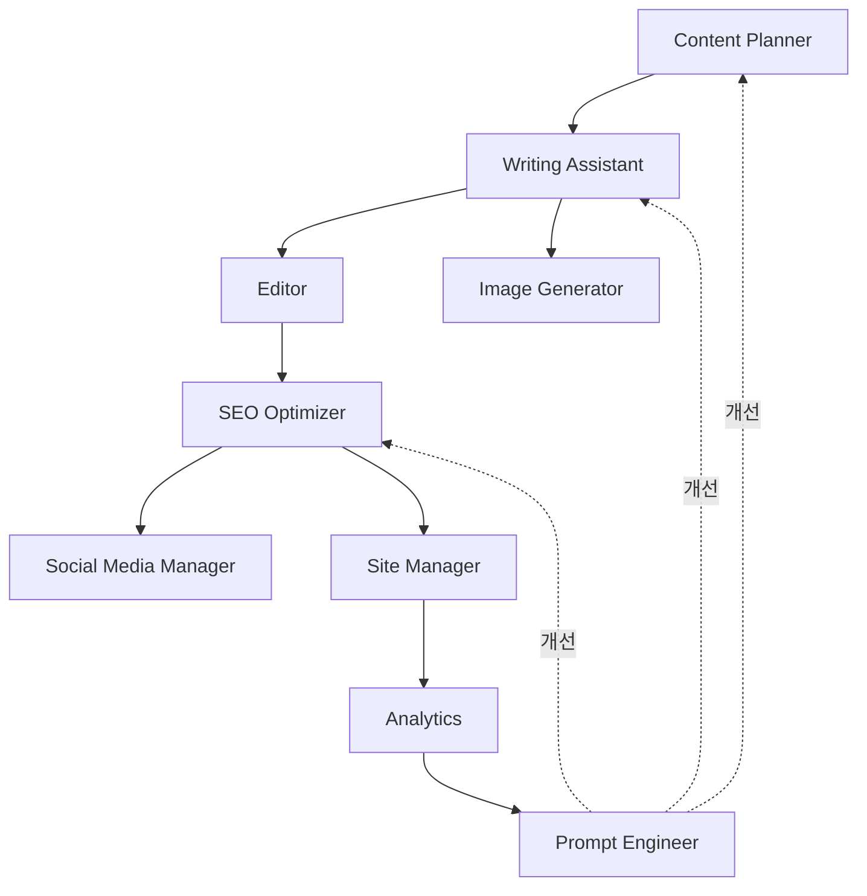
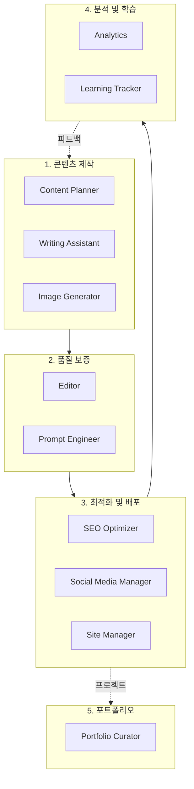

# Chapter 7: 11 에이전트 아키텍처 개요

## 이 챕터에서 배울 내용

멀티 에이전트 시스템의 전체 구조를 이해하고, 왜 단일 AI가 아닌 여러 전문 에이전트가 필요한지 알아봅니다. 11개의 에이전트가 어떻게 협력하여 블로그 자동화를 완성하는지, 그리고 5개의 클러스터로 구성된 아키텍처를 실전에서 어떻게 활용하는지 배웁니다.

## Recipe 7.1: 왜 멀티 에이전트인가?

### 문제 (Problem)

하나의 범용 AI로 모든 작업을 처리하려고 하면 다음과 같은 문제가 발생합니다:

1. **컨텍스트 오버로드**: 하나의 프롬프트에 너무 많은 지시사항을 담으면 AI가 혼란스러워합니다
2. **일관성 부족**: 매번 다른 품질의 결과물이 나옵니다
3. **전문성 부족**: 글쓰기와 SEO 최적화는 서로 다른 전문 영역입니다
4. **디버깅 어려움**: 어느 부분에서 문제가 생겼는지 파악하기 어렵습니다
5. **재사용 불가능**: 한 번 작성한 프롬프트를 다른 작업에 적용하기 어렵습니다

실제 예시를 보겠습니다:

```
❌ 나쁜 접근: 하나의 거대한 프롬프트

"블로그 글을 써줘. 주제는 AI야. 그리고 SEO 최적화도 해줘.
이미지도 만들고, 소셜 미디어 공유 문구도 작성해줘.
문법 검토도 하고, 링크도 확인해줘."

결과: AI가 무엇부터 해야 할지 모르고,
각 작업의 품질이 떨어집니다.
```

### 해결책 (Solution)

**전문화된 에이전트 시스템**을 구축합니다. 각 에이전트는 하나의 명확한 역할만 수행하며, 서로 협력하여 전체 워크플로우를 완성합니다.

#### 단계별 구현

**Step 1: 역할 분리 원칙 정의**

Unix 철학의 "한 가지 일을 완벽하게 (Do One Thing Well)" 원칙을 적용합니다:

```markdown
각 에이전트는:
1. 명확한 하나의 책임만 가집니다
2. 입력과 출력이 명확합니다
3. 독립적으로 테스트 가능합니다
4. 다른 에이전트와 느슨하게 결합됩니다
```

**Step 2: 에이전트 간 통신 인터페이스 정의**

```typescript
// 에이전트 인터페이스 예시
interface Agent {
  name: string;
  role: string;
  input: AgentInput;
  output: AgentOutput;
  dependencies?: string[]; // 의존하는 다른 에이전트
}

interface AgentInput {
  type: string;
  schema: object;
  example: any;
}

interface AgentOutput {
  type: string;
  schema: object;
  example: any;
}
```

**Step 3: 워크플로우 오케스트레이션**

```typescript
// 멀티 에이전트 워크플로우
async function createBlogPost(topic: string) {
  // 1. 콘텐츠 기획
  const outline = await contentPlanner.plan(topic);

  // 2. 초안 작성 (outline을 입력으로 받음)
  const draft = await writingAssistant.write(outline);

  // 3. 이미지 생성 (draft의 제목을 입력으로 받음)
  const image = await imageGenerator.generate(draft.title);

  // 4. 편집 및 검토 (draft를 입력으로 받음)
  const edited = await editor.review(draft);

  // 5. SEO 최적화 (edited를 입력으로 받음)
  const optimized = await seoOptimizer.optimize(edited);

  // 6. 최종 발행
  return {
    content: optimized,
    image: image,
    metadata: optimized.metadata
  };
}
```

### 코드/예시 (Code)

실제 에이전트 파일 구조:

```bash
.claude/agents/
├── content-planner.md        # 1. 콘텐츠 전략
├── writing-assistant.md       # 2. 글쓰기
├── image-generator.md         # 3. 이미지 생성
├── editor.md                  # 4. 편집
├── seo-optimizer.md           # 5. SEO 최적화
├── social-media-manager.md    # 6. 소셜 미디어
├── site-manager.md            # 7. 사이트 관리
├── analytics.md               # 8. 분석
├── portfolio-curator.md       # 9. 포트폴리오
├── learning-tracker.md        # 10. 학습 추적
└── prompt-engineer.md         # 11. 프롬프트 최적화
```

각 에이전트의 기본 구조:

```markdown
<!-- .claude/agents/writing-assistant.md -->
# Writing Assistant Agent

## 역할 (Role)
전문 기술 블로거로서 고품질 블로그 포스트를 작성합니다.

## 입력 (Input)
- 주제 (topic): string
- 개요 (outline): Outline object
- 타겟 독자 (audience): string
- 길이 (length): number (단어 수)

## 출력 (Output)
- 제목 (title): string (60자 이내)
- 본문 (content): markdown
- 메타데이터 (metadata): object

## 작업 흐름 (Workflow)
1. 개요 분석
2. 도입부 작성 (문제 제기)
3. 본문 작성 (해결책 + 예시)
4. 결론 작성 (Call-to-Action)
5. 메타데이터 생성

## 품질 기준 (Quality Standards)
- 첫 문단에서 독자 관심 유발
- 각 섹션에 실행 가능한 팁
- 코드 예제에 주석 포함
- 명확한 Call-to-Action
```

### 설명 (Explanation)

#### 왜 멀티 에이전트가 더 효과적인가?

**1. 인지 부하 감소 (Reduced Cognitive Load)**

각 에이전트는 하나의 작업에만 집중하므로, 프롬프트가 단순하고 명확합니다:

```
❌ 복잡한 프롬프트 (1,000 토큰):
"블로그 글을 쓰고, SEO 최적화하고, 이미지 생성..."

✅ 단순한 프롬프트 (200 토큰):
Writing Assistant: "이 개요로 2,500단어 블로그 작성"
SEO Optimizer: "이 글의 메타태그 최적화"
```

**2. 전문성 향상 (Improved Specialization)**

각 에이전트는 자신의 도메인에 특화된 지식과 기법을 사용합니다:

```markdown
Writing Assistant:
- 스토리텔링 기법
- 문장 구조 최적화
- 독자 참여 전략

SEO Optimizer:
- 키워드 밀도 계산
- 메타태그 최적화
- 내부 링크 전략
```

**3. 재사용성 (Reusability)**

한 번 만든 에이전트는 다양한 워크플로우에서 재사용 가능합니다:

```typescript
// 워크플로우 1: 일반 블로그 포스트
await contentPlanner.plan();
await writingAssistant.write();
await editor.review();

// 워크플로우 2: 긴급 뉴스 포스트 (기획 단계 생략)
await writingAssistant.write({ urgency: "high" });
await editor.review({ quick: true });

// 워크플로우 3: SEO 업데이트만
await seoOptimizer.optimize();
```

**4. 병렬 처리 (Parallel Processing)**

독립적인 작업은 동시에 실행 가능합니다:

```typescript
// 순차 실행 (느림): 6분
await imageGenerator.generate();  // 2분
await seoOptimizer.optimize();    // 2분
await socialMedia.schedule();     // 2분

// 병렬 실행 (빠름): 2분
await Promise.all([
  imageGenerator.generate(),
  seoOptimizer.optimize(),
  socialMedia.schedule()
]);
```

### 변형 (Variations)

#### 변형 1: 마이크로 에이전트 (더 세분화)

더욱 작은 단위로 분리:

```
Writing Assistant를 세분화:
├── IntroWriter: 도입부 전문
├── BodyWriter: 본문 전문
├── ConclusionWriter: 결론 전문
└── CodeExampleGenerator: 코드 예제 전문
```

**장점**: 더 높은 품질
**단점**: 복잡도 증가, 오케스트레이션 어려움

#### 변형 2: 하이브리드 접근 (부분 통합)

관련된 작업은 하나의 에이전트로 통합:

```
ContentCreator (통합 에이전트):
├── 기획
├── 작성
└── 편집
```

**장점**: 간단한 구조
**단점**: 각 작업의 품질 저하 가능성

#### 변형 3: 동적 에이전트 (필요시 생성)

작업에 따라 에이전트를 동적으로 생성:

```typescript
// 기본 에이전트만 항상 실행
const coreAgents = [contentPlanner, writingAssistant];

// 필요시 추가 에이전트 생성
if (needsTranslation) {
  agents.push(new TranslationAgent());
}

if (needsVideo) {
  agents.push(new VideoGeneratorAgent());
}
```

**장점**: 리소스 효율적
**단점**: 구현 복잡도 증가

---

## Recipe 7.2: 11 에이전트 역할 개요

### 문제 (Problem)

11개의 에이전트가 있다면, 각각이 무엇을 하는지, 언제 사용하는지 명확히 이해해야 합니다. 그렇지 않으면:

- 잘못된 에이전트를 호출하여 시간 낭비
- 에이전트 간 역할 중복으로 혼란 발생
- 필요한 에이전트를 빠뜨려 품질 저하

### 해결책 (Solution)

각 에이전트의 **역할, 입력, 출력, 사용 시나리오**를 명확히 정의합니다.

### 코드/예시 (Code)

#### 1. Content Planner (콘텐츠 기획자)

```markdown
**역할**: 콘텐츠 전략 수립 및 주제 발굴

**입력**:
- 주제 키워드 또는 트렌드 영역

**출력**:
- 블로그 개요 (목차 구조)
- 타겟 키워드 리스트
- 예상 독자층 프로필

**사용 시나리오**:
- 새 블로그 포스트 기획
- 콘텐츠 캘린더 생성
- 트렌드 분석

**실제 예시**:
```

```bash
# 호출
/agent content-planner "2025 AI 트렌드"

# 출력
## 추천 주제
1. "Claude Code로 개발 생산성 3배 높이기"
   - 타겟: 주니어〜시니어 개발자
   - 검색량: 중간, 경쟁도: 낮음
   - 키워드: claude code, ai coding, 생산성

2. "MCP로 AI 워크플로우 자동화"
   - 타겟: DevOps, 자동화에 관심 있는 개발자
   - 검색량: 낮음, 경쟁도: 매우 낮음 (기회!)
   - 키워드: mcp, model context protocol, automation

## 개요 (첫 번째 주제)
1. 도입: 개발자의 반복 작업 문제
2. Claude Code 소개 및 핵심 기능
3. 실전 예제 5가지
4. 생산성 측정 방법
5. 결론 및 시작 가이드
```

#### 2. Writing Assistant (글쓰기 도우미)

```markdown
**역할**: 고품질 블로그 포스트 작성

**입력**:
- 주제 또는 개요
- 타겟 길이 (단어 수)
- 톤 & 스타일 (예: 전문적, 친근함)

**출력**:
- 완성된 블로그 포스트 (Markdown)
- Frontmatter (제목, 설명, 날짜, 태그)

**사용 시나리오**:
- 새 포스트 작성
- 기존 글 리라이팅
- 다국어 번역 (현지화)

**실제 예시**:
```

```bash
/agent writing-assistant --topic "Claude Code 실전 가이드" --length 2500 --tone professional-friendly

# 출력: src/content/blog/ko/claude-code-guide.md
---
title: "Claude Code로 개발 생산성 3배 높이기"
description: "AI 페어 프로그래밍의 새로운 표준, Claude Code 실전 활용법"
pubDate: "2025-12-19"
tags: ["claude-code", "ai", "productivity", "tutorial"]
---

# Claude Code로 개발 생산성 3배 높이기

## 개발자의 하루를 바꾸는 AI 도구

여러분은 하루에 몇 시간을 코드 작성에 쓰시나요?
그리고 그 중 몇 시간이 실제로 "창의적인" 작업인가요?

[2,500단어 본문...]
```

#### 3. Image Generator (이미지 생성기)

```markdown
**역할**: 블로그 히어로 이미지 생성

**입력**:
- 블로그 제목 또는 주제
- 이미지 스타일 (선택사항)

**출력**:
- 최적화된 히어로 이미지 (1920x1080)
- 파일 경로

**사용 시나리오**:
- 새 포스트의 히어로 이미지
- 소셜 미디어 공유 이미지 (OG image)

**실제 예시**:
```

```typescript
// .claude/agents/image-generator.md 호출
const image = await imageGenerator.generate({
  topic: "Claude Code 실전 가이드",
  style: "modern-tech"
});

// 출력
{
  path: "src/assets/blog/2025-12-19-claude-code-guide.png",
  dimensions: { width: 1920, height: 1080 },
  prompt: "Modern tech illustration featuring Claude AI and code editor,
           flat design, blue and green color palette, high contrast"
}
```

#### 4. Editor (편집자)

```markdown
**역할**: 문법, 스타일, 기술 정확성 검토

**입력**:
- 작성된 블로그 포스트 (Markdown)

**출력**:
- 검토 보고서 (오류 목록, 개선 제안)
- 수정된 버전 (선택사항)

**사용 시나리오**:
- 포스트 발행 전 최종 검토
- 기존 글 품질 개선

**실제 예시**:
```

```markdown
# Editor 검토 보고서

## 문법 오류 (2건)
1. Line 45: "개발자 들" → "개발자들" (띄어쓰기)
2. Line 120: "Claude code" → "Claude Code" (대소문자)

## 스타일 제안 (3건)
1. Line 30: 문단이 너무 김 (8문장) → 2개 문단으로 분리 권장
2. Line 89: 전문 용어 "MCP" 첫 등장 시 풀네임 추가 권장
3. Line 200: 결론 부분에 구체적인 Call-to-Action 추가 권장

## 기술 정확성 (1건)
1. Line 150: Claude Code 버전 정보 최신화 필요
   - 현재: "Claude Code 1.0"
   - 수정: "Claude Code 1.5"

## 메타데이터 검토
✅ Title: 58자 (권장: 60자 이내)
✅ Description: 152자 (권장: 150-160자)
⚠️ Tags: 4개 (권장: 5-8개) - 2개 추가 권장
```

#### 5. SEO Optimizer (검색 최적화 전문가)

```markdown
**역할**: 검색 엔진 최적화

**입력**:
- 블로그 포스트
- 타겟 키워드 (선택사항)

**출력**:
- 최적화된 메타태그
- 내부 링크 제안
- SEO 스코어 보고서

**사용 시나리오**:
- 새 포스트 발행 전
- 기존 포스트 SEO 개선
- 사이트맵 갱신

**실제 예시**:
```

```yaml
# SEO 최적화 결과

## 메타태그
title: "Claude Code 실전 가이드 - 개발 생산성 3배 높이는 5가지 방법"
  # 키워드 "Claude Code", "생산성" 포함, 59자

description: "AI 페어 프로그래밍 도구 Claude Code의 실전 활용법. 설치부터 고급 기법까지, 실무에서 바로 써먹는 5가지 팁과 예제 코드 포함."
  # 행동 유도 ("실무에서 바로 써먹는"), 154자

keywords:
  - claude code
  - ai coding assistant
  - 개발 생산성
  - ai pair programming
  - anthropic

## 내부 링크 제안 (3개)
1. "AI 에이전트란?" → /blog/ai-agent-basics (관련도: 높음)
2. "프롬프트 엔지니어링 기초" → /blog/prompt-engineering-101 (관련도: 중간)
3. "MCP 통합 가이드" → /blog/mcp-integration (관련도: 높음)

## SEO 스코어: 92/100
✅ Title 최적화
✅ Description 최적화
✅ Heading 구조 (H1-H6 계층)
✅ 이미지 Alt 텍스트
✅ 내부 링크 (3개)
⚠️ 외부 링크 부족 (1개, 권장: 3개 이상)
```

#### 6. Social Media Manager (소셜 미디어 관리자)

```markdown
**역할**: 소셜 미디어 공유 자동화

**입력**:
- 블로그 포스트 URL
- 타겟 플랫폼 (Twitter, LinkedIn 등)

**출력**:
- 플랫폼별 공유 문구
- 해시태그 제안
- 최적 발행 시간

**사용 시나리오**:
- 새 포스트 발행 시 자동 공유
- 인기 포스트 재공유
```

```markdown
# 소셜 미디어 공유 계획

## Twitter
📝 "AI로 개발 생산성 3배 올리는 방법 👨‍💻

Claude Code 실전 가이드 작성했습니다:
✅ 5가지 핵심 팁
✅ 실전 예제 코드
✅ Before/After 비교

개발자라면 꼭 보세요 👇
[링크]

#ClaudeCode #AI #개발생산성"

해시태그: #ClaudeCode #AI #DevTools #Productivity
최적 발행 시간: 오전 10시 (개발자 활동 시간대)

## LinkedIn
📝 "AI 페어 프로그래밍의 새로운 표준: Claude Code

최근 3개월간 Claude Code를 실무에 적용한 경험을 정리했습니다.

주요 내용:
• 반복 작업 자동화로 하루 2시간 절약
• 코드 품질 30% 향상
• 5가지 실전 활용 패턴

개발 생산성에 관심 있는 분들께 도움이 되길 바랍니다.

[전문 보기: 링크]

#SoftwareDevelopment #AI #Productivity #ClaudeCode"
```

#### 7. Site Manager (사이트 관리자)

```markdown
**역할**: Astro 빌드, 배포, 성능 최적화

**입력**:
- 빌드 명령 (build, preview, deploy)

**출력**:
- 빌드 성공/실패 보고서
- 성능 메트릭
- 배포 URL

**사용 시나리오**:
- 새 포스트 발행
- 사이트 업데이트
- 성능 모니터링
```

```bash
# Site Manager 실행 로그

[1/6] 타입 체크...
✅ TypeScript 검증 통과

[2/6] Content Collections 검증...
✅ 모든 블로그 포스트 스키마 준수

[3/6] 빌드...
✅ 127 페이지 생성 (3.2초)

[4/6] 이미지 최적화...
✅ 43개 이미지 → WebP 변환 (2.1MB → 456KB, 78% 절감)

[5/6] 사이트맵 생성...
✅ sitemap-index.xml 생성

[6/6] 배포...
✅ Vercel 배포 완료

성과:
📊 Lighthouse 스코어: 98/100
⚡ First Contentful Paint: 0.8초
🎨 Largest Contentful Paint: 1.2초
🔗 배포 URL: https://jangwook.net/blog/claude-code-guide
```

#### 8. Analytics (분석가)

```markdown
**역할**: 실시간 트래픽 분석 및 즉석 인사이트

**입력**:
- 분석 기간
- 분석 대상 (특정 포스트 또는 전체)

**출력**:
- 비공식 분석 결과 (대화형)
- 즉각적인 인사이트

**사용 시나리오**:
- "오늘 가장 많이 조회된 포스트는?"
- "지난 주 트래픽 추이는?"
- 즉석 질문에 대한 빠른 답변
```

```markdown
# Analytics 즉석 분석 (비공식)

Q: "오늘 조회수가 가장 높은 포스트는?"

A: 오늘 (2025-12-19) 기준 TOP 3:

1. "Claude Code 실전 가이드" - 347 조회
   - 어제 대비 +215% 증가
   - 주요 유입: Twitter (60%), 검색 (30%)

2. "AI 에이전트 아키텍처" - 203 조회
   - 안정적 (일평균 200)

3. "프롬프트 엔지니어링 101" - 156 조회
   - 어제 대비 -15% 감소
```

#### 9. Portfolio Curator (포트폴리오 큐레이터)

```markdown
**역할**: 프로젝트 포트폴리오 관리

**입력**:
- 새 프로젝트 정보

**출력**:
- 포트폴리오 페이지 업데이트
- 프로젝트 설명 자동 생성

**사용 시나리오**:
- 새 프로젝트 추가
- 기존 프로젝트 업데이트
- 포트폴리오 최적화
```

#### 10. Learning Tracker (학습 추적자)

```markdown
**역할**: 학습 목표 및 기술 트렌드 추적

**입력**:
- 학습 주제 또는 목표

**출력**:
- 학습 로드맵
- 진행 상황 추적
- 추천 리소스

**사용 시나리오**:
- 새로운 기술 학습 계획
- 진행 상황 점검
- 블로그 주제 발굴 (학습한 내용 → 블로그)
```

#### 11. Prompt Engineer (프롬프트 최적화 전문가)

```markdown
**역할**: 다른 모든 에이전트의 프롬프트 개선

**입력**:
- 개선할 에이전트 이름
- 현재 프롬프트
- 문제점

**출력**:
- 개선된 프롬프트
- A/B 테스트 결과
- 성능 비교

**사용 시나리오**:
- 에이전트 품질 저하 시
- 새로운 사용 사례 추가 시
- 정기적인 최적화 (월 1회)

**실제 예시**:
```

```markdown
# Prompt Engineer: Writing Assistant 개선

## Before (기존 프롬프트)
"블로그 글을 써줘. 전문적이고 친근하게."

문제점:
- 너무 모호함
- 출력 형식 불명확
- 품질 기준 없음

## After (개선된 프롬프트)
```

````markdown
당신은 10년 경력의 기술 블로거입니다.

**주제**: {topic}
**타겟 독자**: 주니어〜시니어 개발자
**길이**: 2,500-3,000 단어

**구조**:

1. 도입부 (200단어)
   - 문제 제기 질문으로 시작
   - 독자의 공감 유도
2. 본문 (2,000단어)
   - 핵심 개념 설명
   - Before/After 예제 최소 5개
   - 코드는 주석 포함, 실행 가능해야 함
3. 결론 (300단어)
   - 핵심 요약 3가지
   - 실천 가능한 액션 아이템

**톤**: 존댓말, 전문적이지만 친근함
**스타일**: 실용적, 예제 중심

**출력 형식**:

```yaml
---
title: [60자 이내, 주요 키워드 포함]
description: [150-160자, 행동 유도 문구 포함]
pubDate: [YYYY-MM-DD]
tags: [5-8개]
---

[본문 Markdown]
```
````

```

## A/B 테스트 결과
- 품질 점수: 65/100 → 92/100 (+27점)
- 수정 필요 횟수: 평균 3회 → 0.5회 (-83%)
- 출력 일관성: 60% → 95% (+35%p)
```

### 설명 (Explanation)

#### 에이전트 선택 가이드

**상황별 에이전트 매핑**:

| 상황 | 사용할 에이전트 | 조합 |
|------|----------------|------|
| 새 블로그 작성 | Content Planner → Writing Assistant → Editor → SEO Optimizer | 4개 |
| 기존 글 SEO 개선 | SEO Optimizer | 1개 |
| 소셜 미디어 공유 | Social Media Manager | 1개 |
| 사이트 배포 | Site Manager | 1개 |
| 성능 분석 | Analytics | 1개 |
| 프롬프트 개선 | Prompt Engineer | 1개 |

#### 에이전트 간 의존성



- **실선 화살표**: 데이터 흐름 (출력이 다음 입력)
- **점선 화살표**: 피드백 루프 (성능 개선)

### 변형 (Variations)

#### 변형 1: 최소 에이전트 세트 (3개)

예산이나 복잡도 제약이 있다면:

```
1. Content Creator (기획 + 작성 통합)
2. Quality Checker (편집 + SEO 통합)
3. Publisher (배포 + 소셜 미디어 통합)
```

#### 변형 2: 확장 에이전트 세트 (15개+)

더 전문화가 필요하다면:

```
기존 11개 +
12. Translation Agent (전문 번역)
13. Video Generator (영상 콘텐츠)
14. Newsletter Composer (뉴스레터)
15. Community Manager (댓글 관리)
16. Backlink Hunter (백링크 발굴)
```

---

## Recipe 7.3: 에이전트 간 통신 구조

### 문제 (Problem)

11개의 에이전트가 서로 어떻게 대화하고 데이터를 주고받는지 명확하지 않으면:

- 데이터가 누락되거나 변형됩니다
- 에이전트 호출 순서가 엉킵니다
- 오류 발생 시 디버깅이 불가능합니다
- 워크플로우 확장이 어렵습니다

### 해결책 (Solution)

**표준화된 통신 프로토콜**을 정의합니다. 모든 에이전트는 동일한 입출력 형식을 따릅니다.

#### 단계별 구현

**Step 1: 데이터 스키마 정의**

```typescript
// 공통 인터페이스
interface AgentMessage {
  id: string;              // 고유 메시지 ID
  timestamp: Date;         // 생성 시각
  sender: string;          // 발신 에이전트
  receiver: string;        // 수신 에이전트
  type: MessageType;       // 메시지 유형
  payload: any;            // 실제 데이터
  metadata?: {             // 선택적 메타데이터
    priority?: 'low' | 'normal' | 'high';
    retry?: number;
    timeout?: number;
  };
}

enum MessageType {
  REQUEST = 'request',     // 작업 요청
  RESPONSE = 'response',   // 작업 결과
  ERROR = 'error',         // 오류 보고
  NOTIFICATION = 'notification' // 알림
}
```

**Step 2: 메시지 버스 구현**

```typescript
// 중앙 메시지 버스
class AgentMessageBus {
  private subscribers: Map<string, Function[]> = new Map();

  // 메시지 발행
  publish(message: AgentMessage): void {
    const receivers = this.subscribers.get(message.receiver) || [];
    receivers.forEach(handler => handler(message));
  }

  // 구독 등록
  subscribe(agentName: string, handler: Function): void {
    const handlers = this.subscribers.get(agentName) || [];
    handlers.push(handler);
    this.subscribers.set(agentName, handlers);
  }

  // 요청-응답 패턴
  async request(sender: string, receiver: string, payload: any): Promise<any> {
    return new Promise((resolve, reject) => {
      const messageId = generateId();

      // 응답 대기
      const responseHandler = (msg: AgentMessage) => {
        if (msg.id === messageId) {
          if (msg.type === MessageType.RESPONSE) {
            resolve(msg.payload);
          } else if (msg.type === MessageType.ERROR) {
            reject(msg.payload);
          }
        }
      };

      this.subscribe(sender, responseHandler);

      // 요청 발행
      this.publish({
        id: messageId,
        timestamp: new Date(),
        sender,
        receiver,
        type: MessageType.REQUEST,
        payload
      });
    });
  }
}
```

**Step 3: 에이전트 베이스 클래스**

```typescript
abstract class BaseAgent {
  constructor(
    protected name: string,
    protected bus: AgentMessageBus
  ) {
    // 메시지 구독
    bus.subscribe(name, (msg) => this.handleMessage(msg));
  }

  // 메시지 처리 (하위 클래스에서 구현)
  protected abstract async process(payload: any): Promise<any>;

  // 메시지 수신 처리
  private async handleMessage(message: AgentMessage): Promise<void> {
    try {
      const result = await this.process(message.payload);

      // 응답 발행
      this.bus.publish({
        id: message.id,
        timestamp: new Date(),
        sender: this.name,
        receiver: message.sender,
        type: MessageType.RESPONSE,
        payload: result
      });
    } catch (error) {
      // 오류 발행
      this.bus.publish({
        id: message.id,
        timestamp: new Date(),
        sender: this.name,
        receiver: message.sender,
        type: MessageType.ERROR,
        payload: { error: error.message }
      });
    }
  }

  // 다른 에이전트 호출
  protected async call(receiver: string, payload: any): Promise<any> {
    return this.bus.request(this.name, receiver, payload);
  }
}
```

### 코드/예시 (Code)

#### 실제 에이전트 구현 예시

```typescript
// Writing Assistant 에이전트
class WritingAssistant extends BaseAgent {
  constructor(bus: AgentMessageBus) {
    super('writing-assistant', bus);
  }

  protected async process(payload: any): Promise<any> {
    const { topic, outline, length } = payload;

    // 1. 콘텐츠 생성
    const content = await this.generateContent(topic, outline, length);

    // 2. 이미지 요청 (Image Generator 호출)
    const image = await this.call('image-generator', {
      topic: content.title
    });

    // 3. 결과 반환
    return {
      title: content.title,
      content: content.body,
      metadata: content.metadata,
      heroImage: image.path
    };
  }

  private async generateContent(topic: string, outline: any, length: number) {
    // 실제 LLM 호출 로직
    // ...
  }
}
```

#### 워크플로우 실행 예시

```typescript
// 메시지 버스 생성
const bus = new AgentMessageBus();

// 에이전트 초기화
const contentPlanner = new ContentPlanner(bus);
const writingAssistant = new WritingAssistant(bus);
const editor = new Editor(bus);
const seoOptimizer = new SEOOptimizer(bus);

// 블로그 포스트 생성 워크플로우
async function createBlogPost(topic: string) {
  // 1. 콘텐츠 기획
  const outline = await bus.request('orchestrator', 'content-planner', {
    topic
  });

  // 2. 초안 작성
  const draft = await bus.request('orchestrator', 'writing-assistant', {
    topic,
    outline,
    length: 2500
  });

  // 3. 편집
  const edited = await bus.request('orchestrator', 'editor', {
    content: draft.content
  });

  // 4. SEO 최적화
  const optimized = await bus.request('orchestrator', 'seo-optimizer', {
    content: edited.content,
    metadata: draft.metadata
  });

  return optimized;
}

// 실행
const result = await createBlogPost("Claude Code 실전 가이드");
console.log(result);
```

#### 메시지 흐름 예시

```json
// 1. Content Planner에게 요청
{
  "id": "msg-001",
  "timestamp": "2025-12-19T10:00:00Z",
  "sender": "orchestrator",
  "receiver": "content-planner",
  "type": "request",
  "payload": {
    "topic": "Claude Code 실전 가이드"
  }
}

// 2. Content Planner 응답
{
  "id": "msg-001",
  "timestamp": "2025-12-19T10:00:15Z",
  "sender": "content-planner",
  "receiver": "orchestrator",
  "type": "response",
  "payload": {
    "outline": {
      "title": "Claude Code 실전 가이드",
      "sections": [
        { "heading": "도입", "points": [...] },
        { "heading": "핵심 기능", "points": [...] },
        { "heading": "실전 예제", "points": [...] }
      ],
      "targetKeywords": ["claude code", "ai coding", "productivity"]
    }
  }
}

// 3. Writing Assistant에게 요청 (이전 응답을 입력으로)
{
  "id": "msg-002",
  "timestamp": "2025-12-19T10:00:16Z",
  "sender": "orchestrator",
  "receiver": "writing-assistant",
  "type": "request",
  "payload": {
    "topic": "Claude Code 실전 가이드",
    "outline": { /* 위 응답 데이터 */ },
    "length": 2500
  }
}
```

### 설명 (Explanation)

#### 통신 패턴

**1. 동기 요청-응답 (Request-Response)**

가장 일반적인 패턴:

```typescript
// 호출자는 응답을 기다림
const result = await bus.request('caller', 'worker', { data });
```

**장점**:

- 간단하고 직관적
- 데이터 흐름이 명확

**단점**:

- 순차 실행으로 느릴 수 있음

**2. 비동기 발행-구독 (Publish-Subscribe)**

느슨한 결합을 위한 패턴:

```typescript
// 발행자: 응답을 기다리지 않음
bus.publish({
  sender: 'publisher',
  receiver: '*', // 모든 구독자
  type: MessageType.NOTIFICATION,
  payload: { event: 'post-published', postId: '123' }
});

// 구독자들
bus.subscribe('social-media-manager', handlePostPublished);
bus.subscribe('analytics', handlePostPublished);
```

**장점**:

- 병렬 처리 가능
- 확장성 좋음

**단점**:

- 데이터 흐름 추적 어려움

**3. 파이프라인 (Pipeline)**

순차적 데이터 변환:

```typescript
const pipeline = [
  'content-planner',
  'writing-assistant',
  'editor',
  'seo-optimizer'
];

let data = { topic: "주제" };

for (const agent of pipeline) {
  data = await bus.request('orchestrator', agent, data);
}
```

**장점**:

- 데이터 변환 과정이 명확
- 각 단계 독립적 테스트 가능

**단점**:

- 순차 실행으로 느림

#### 오류 처리

```typescript
class RobustAgent extends BaseAgent {
  protected async process(payload: any): Promise<any> {
    const maxRetries = 3;
    let attempt = 0;

    while (attempt < maxRetries) {
      try {
        return await this.doWork(payload);
      } catch (error) {
        attempt++;

        if (attempt >= maxRetries) {
          // 최종 실패: 오류 전파
          throw error;
        }

        // 재시도 대기 (지수 백오프)
        await sleep(Math.pow(2, attempt) * 1000);
      }
    }
  }

  private async doWork(payload: any): Promise<any> {
    // 실제 작업 로직
  }
}
```

### 변형 (Variations)

#### 변형 1: 이벤트 소싱 (Event Sourcing)

모든 메시지를 저장하여 재현 가능:

```typescript
class EventSourcingBus extends AgentMessageBus {
  private events: AgentMessage[] = [];

  publish(message: AgentMessage): void {
    // 이벤트 저장
    this.events.push(message);

    // 기존 로직
    super.publish(message);
  }

  // 특정 시점으로 되돌리기
  replay(fromTimestamp: Date): void {
    const replayEvents = this.events.filter(e => e.timestamp >= fromTimestamp);
    replayEvents.forEach(e => super.publish(e));
  }
}
```

#### 변형 2: 우선순위 큐

중요한 메시지 우선 처리:

```typescript
class PriorityBus extends AgentMessageBus {
  private queues: {
    high: AgentMessage[],
    normal: AgentMessage[],
    low: AgentMessage[]
  } = { high: [], normal: [], low: [] };

  publish(message: AgentMessage): void {
    const priority = message.metadata?.priority || 'normal';
    this.queues[priority].push(message);
    this.processNext();
  }

  private processNext(): void {
    const message =
      this.queues.high.shift() ||
      this.queues.normal.shift() ||
      this.queues.low.shift();

    if (message) {
      super.publish(message);
    }
  }
}
```

---

## Recipe 7.4: 5 클러스터 구조

### 문제 (Problem)

11개의 에이전트를 평면적으로 관리하면:

- 어떤 에이전트를 먼저 호출해야 할지 혼란
- 관련된 에이전트를 찾기 어려움
- 워크플로우 설계가 복잡해짐
- 팀원 간 협업 시 역할 분담이 불명확

### 해결책 (Solution)

**5개의 논리적 클러스터**로 에이전트를 그룹화합니다. 각 클러스터는 특정 단계를 책임집니다.

### 코드/예시 (Code)

#### 클러스터 1: 콘텐츠 제작 (Content Creation)

**목적**: 아이디어 → 완성된 글

**에이전트**:

1. Content Planner
2. Writing Assistant
3. Image Generator

**워크플로우**:

```typescript
async function contentCreationCluster(topic: string) {
  // 1. 기획
  const outline = await contentPlanner.plan(topic);

  // 2. 작성 & 이미지 생성 (병렬)
  const [draft, heroImage] = await Promise.all([
    writingAssistant.write(outline),
    imageGenerator.generate(outline.title)
  ]);

  return {
    content: draft,
    image: heroImage,
    outline
  };
}
```

**입력**: 주제 (string)
**출력**: 초안 + 이미지 + 개요

---

#### 클러스터 2: 품질 보증 (Quality Assurance)

**목적**: 초안 → 검증된 고품질 콘텐츠

**에이전트**:

1. Editor
2. Prompt Engineer (에이전트 품질 관리)

**워크플로우**:

```typescript
async function qualityAssuranceCluster(draft: BlogPost) {
  // 1. 편집 검토
  const reviewed = await editor.review(draft);

  // 2. 품질 점수 확인
  if (reviewed.qualityScore < 80) {
    // 품질 미달: 프롬프트 개선 필요
    const improvedPrompt = await promptEngineer.improve({
      agent: 'writing-assistant',
      currentPrompt: writingAssistant.getPrompt(),
      issue: reviewed.issues
    });

    // Writing Assistant 프롬프트 업데이트
    writingAssistant.updatePrompt(improvedPrompt);

    // 재작성 (선택사항)
    // return writingAssistant.write(...);
  }

  return reviewed;
}
```

**입력**: 초안
**출력**: 검토된 콘텐츠 + 품질 보고서

---

#### 클러스터 3: 최적화 및 배포 (Optimization & Deployment)

**목적**: 검증된 콘텐츠 → 발행

**에이전트**:

1. SEO Optimizer
2. Social Media Manager
3. Site Manager

**워크플로우**:

```typescript
async function optimizationDeploymentCluster(content: BlogPost) {
  // 1. SEO 최적화
  const optimized = await seoOptimizer.optimize(content);

  // 2. 빌드 & 배포
  const deployment = await siteManager.deploy(optimized);

  // 3. 소셜 미디어 공유 (배포 후)
  await socialMediaManager.share({
    url: deployment.url,
    title: optimized.title,
    description: optimized.description
  });

  return {
    url: deployment.url,
    seoScore: optimized.seoScore,
    socialPosts: socialMediaManager.getScheduledPosts()
  };
}
```

**입력**: 검증된 콘텐츠
**출력**: 배포 URL + SEO 스코어 + 소셜 미디어 계획

---

#### 클러스터 4: 분석 및 학습 (Analytics & Learning)

**목적**: 성과 측정 → 개선 인사이트

**에이전트**:

1. Analytics
2. Learning Tracker

**워크플로우**:

```typescript
async function analyticsLearningCluster(postUrl: string) {
  // 1. 성과 추적 (발행 후 7일)
  await sleep(7 * 24 * 60 * 60 * 1000); // 7일 대기

  const metrics = await analytics.analyze(postUrl);

  // 2. 학습 포인트 추출
  const learnings = await learningTracker.extract({
    topic: metrics.topic,
    performance: metrics,
    insights: [
      `조회수: ${metrics.views}`,
      `체류 시간: ${metrics.avgTimeOnPage}초`,
      `이탈률: ${metrics.bounceRate}%`
    ]
  });

  // 3. 향후 콘텐츠 전략 업데이트
  if (metrics.views > 1000) {
    await contentPlanner.addToStrategy({
      topic: metrics.topic,
      reason: '높은 조회수 달성',
      suggestedFollowUps: learnings.nextTopics
    });
  }

  return {
    metrics,
    learnings,
    recommendations: learnings.recommendations
  };
}
```

**입력**: 포스트 URL
**출력**: 성과 지표 + 학습 내용 + 추천 사항

---

#### 클러스터 5: 포트폴리오 관리 (Portfolio Management)

**목적**: 개인 브랜드 구축

**에이전트**:

1. Portfolio Curator

**워크플로우**:

```typescript
async function portfolioManagementCluster(project: Project) {
  // 1. 프로젝트 추가
  const portfolio = await portfolioCurator.add(project);

  // 2. 자동 설명 생성
  const description = await portfolioCurator.generateDescription(project);

  // 3. 블로그 포스트 생성 (선택)
  if (project.isBlogWorthy) {
    await contentPlanner.plan({
      topic: `${project.name} 프로젝트 회고`,
      type: 'case-study'
    });
  }

  return portfolio;
}
```

**입력**: 프로젝트 정보
**출력**: 업데이트된 포트폴리오

---

### 클러스터 간 관계



### 설명 (Explanation)

#### 클러스터 설계 원칙

**1. 단일 책임 (Single Responsibility)**

각 클러스터는 하나의 명확한 목표:

```
클러스터 1: 만들기 (Create)
클러스터 2: 검증하기 (Verify)
클러스터 3: 발행하기 (Publish)
클러스터 4: 배우기 (Learn)
클러스터 5: 쌓기 (Build)
```

**2. 순차적 실행 (Sequential Execution)**

대부분의 워크플로우는 1 → 2 → 3 → 4 순서:

```typescript
const result = await pipe(
  contentCreationCluster,
  qualityAssuranceCluster,
  optimizationDeploymentCluster,
  analyticsLearningCluster
)(topic);
```

**3. 느슨한 결합 (Loose Coupling)**

클러스터 간 인터페이스만 약속:

```typescript
interface ClusterOutput {
  data: any;
  metadata: {
    cluster: string;
    timestamp: Date;
    quality: number;
  };
}
```

#### 클러스터 활용 패턴

**패턴 1: 전체 워크플로우 (Full Pipeline)**

```typescript
async function fullBlogWorkflow(topic: string) {
  // 1. 콘텐츠 제작
  const created = await contentCreationCluster(topic);

  // 2. 품질 보증
  const verified = await qualityAssuranceCluster(created.content);

  // 3. 최적화 및 배포
  const deployed = await optimizationDeploymentCluster(verified);

  // 4. 분석 (비동기 - 7일 후)
  analyticsLearningCluster(deployed.url); // await 없음

  return deployed;
}
```

**패턴 2: 부분 워크플로우 (Partial Pipeline)**

기존 글 SEO 개선만:

```typescript
async function seoOnlyWorkflow(existingPost: BlogPost) {
  // 클러스터 3만 실행
  return optimizationDeploymentCluster(existingPost);
}
```

**패턴 3: 병렬 클러스터 (Parallel Clusters)**

독립적인 작업은 동시 실행:

```typescript
async function parallelWorkflow(topic: string) {
  const created = await contentCreationCluster(topic);

  // 품질 보증과 포트폴리오 업데이트 병렬 실행
  const [verified, portfolio] = await Promise.all([
    qualityAssuranceCluster(created.content),
    portfolioManagementCluster({ name: topic, type: 'blog' })
  ]);

  return { verified, portfolio };
}
```

### 변형 (Variations)

#### 변형 1: 마이크로 클러스터 (더 세분화)

클러스터 1을 세분화:

```
클러스터 1A: 아이디어 발굴
  - Content Planner

클러스터 1B: 콘텐츠 생성
  - Writing Assistant
  - Image Generator
```

#### 변형 2: 메가 클러스터 (통합)

클러스터 1+2 통합:

```
클러스터 A: 콘텐츠 완성
  - Content Planner
  - Writing Assistant
  - Image Generator
  - Editor
```

#### 변형 3: 동적 클러스터 (조건부)

조건에 따라 클러스터 구성 변경:

```typescript
async function dynamicWorkflow(topic: string, options: WorkflowOptions) {
  const clusters = [contentCreationCluster];

  if (options.needsQA) {
    clusters.push(qualityAssuranceCluster);
  }

  if (options.publish) {
    clusters.push(optimizationDeploymentCluster);
  }

  // 동적으로 구성된 파이프라인 실행
  return executePipeline(clusters, topic);
}
```

---

## 챕터 요약

### 핵심 개념

1. **멀티 에이전트의 필요성**
   - 전문화를 통한 품질 향상
   - 모듈화를 통한 재사용성
   - 병렬 처리를 통한 속도 개선

2. **11개 에이전트 역할**
   - 각 에이전트는 명확한 하나의 책임
   - 입력/출력 인터페이스 표준화
   - 독립적 테스트 및 개선 가능

3. **에이전트 간 통신**
   - 표준 메시지 프로토콜
   - 요청-응답, 발행-구독 패턴
   - 오류 처리 및 재시도 메커니즘

4. **5 클러스터 구조**
   - 논리적 그룹화로 복잡도 관리
   - 순차적 워크플로우 설계
   - 클러스터 간 느슨한 결합

### 실전 적용 가이드

**1단계: 최소 시스템 (3개 에이전트)**

```
- Content Creator (기획 + 작성)
- Quality Checker (편집)
- Publisher (배포)
```

**2단계: 표준 시스템 (7개 에이전트)**

```
+ Writing Assistant (분리)
+ SEO Optimizer
+ Image Generator
+ Analytics
```

**3단계: 완전 시스템 (11개 에이전트)**

```
+ Social Media Manager
+ Portfolio Curator
+ Learning Tracker
+ Prompt Engineer
```

### 다음 챕터 예고

**Chapter 8: 핵심 에이전트 상세 구현**에서는 가장 중요한 5개 에이전트 (Content Planner, Writing Assistant, Editor, SEO Optimizer, Prompt Engineer)의 실제 프롬프트와 구현 방법을 배웁니다.

---

**마무리 팁**

멀티 에이전트 시스템은 처음에는 복잡해 보이지만, **단계적으로 구축**하면 누구나 만들 수 있습니다:

1. **하나의 에이전트로 시작**: Writing Assistant만 먼저
2. **점진적 추가**: 필요할 때마다 에이전트 추가
3. **지속적 개선**: Prompt Engineer로 품질 향상

오늘부터 바로 시작할 수 있습니다. 첫 번째 에이전트를 만들어보세요!
