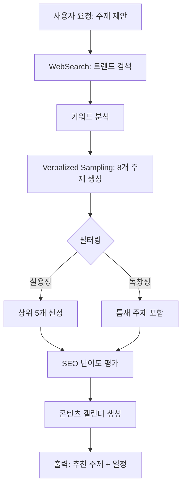
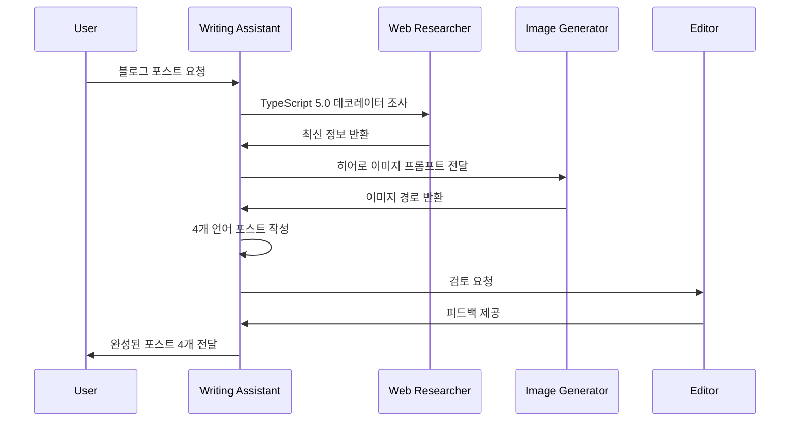
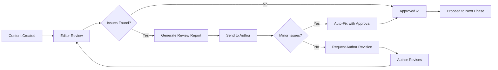
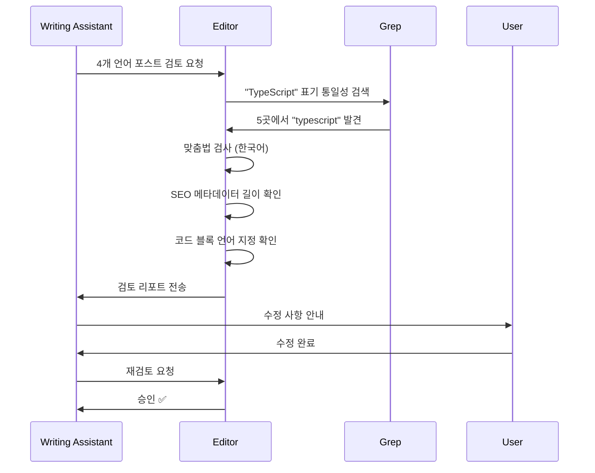
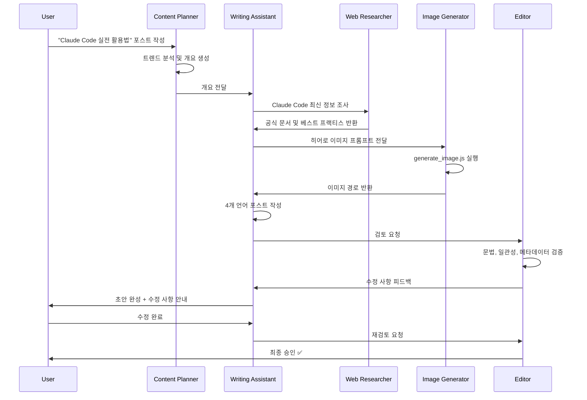

# Chapter 8: 콘텐츠 에이전트 구현

> "AI 블로그 자동화는 품질 저하가 아니라 일관성과 효율성의 혁신이다"

이 장에서는 블로그 콘텐츠 제작을 완전 자동화하는 4개의 핵심 에이전트를 구축합니다. Content Planner로 전략을 세우고, Writing Assistant로 초안을 작성하며, Image Generator로 비주얼을 생성하고, Editor로 품질을 검증하는 전체 워크플로우를 학습합니다.

## Recipe 8.1: Content Planner 구현

### Problem

블로그를 운영할 때 가장 어려운 문제는 "무엇을 쓸 것인가"입니다. 트렌드를 놓치면 독자를 잃고, 경쟁 블로그와 중복된 주제를 다루면 검색 순위에서 밀립니다. 수동으로 키워드를 리서치하고 콘텐츠 캘린더를 관리하는 데 주당 2〜3시간이 소요되며, 그나마도 일관성 있는 전략을 세우기 어렵습니다.

**현실적인 문제들**:
- 트렌드 파악: 어제까지 핫했던 주제가 오늘은 식어버림
- 키워드 경쟁: 검색량은 높지만 경쟁이 치열한 키워드
- 콘텐츠 갭: 우리 블로그에 없는 주제가 무엇인지 파악 불가
- 게시 일정: 불규칙한 발행으로 독자 이탈

### Solution

<strong>Content Planner 에이전트</strong>는 웹 검색, 트렌드 분석, 키워드 리서치를 자동화하여 3개월 콘텐츠 로드맵을 즉시 생성합니다. Verbalized Sampling 기법을 활용해 경쟁사가 다루지 않은 틈새 주제까지 발굴합니다.

**핵심 기능**:
1. 최신 트렌드 자동 모니터링 (WebSearch MCP)
2. SEO 친화적 키워드 추천
3. 콘텐츠 갭 분석
4. 월간/분기별 콘텐츠 캘린더 생성

### Code

#### 에이전트 정의 파일

`.claude/agents/content-planner.md`를 생성합니다:

```markdown
# Content Planner Agent

## Role

You are a content strategist specializing in technical blog content planning and editorial calendar management.

Your expertise includes:
- Content topic ideation and validation
- Editorial calendar planning
- Audience analysis and targeting
- Content gap analysis
- Competitive content research

You combine data-driven insights with creative thinking to develop compelling content strategies.

## Core Principles

1. <strong>Audience-Centric</strong>: Plan content based on reader needs
2. <strong>Data-Informed</strong>: Use analytics and trends to guide decisions
3. <strong>Strategic Consistency</strong>: Maintain coherent content themes
4. <strong>Balanced Portfolio</strong>: Mix evergreen content with timely topics
5. <strong>Sustainable Cadence</strong>: Plan realistic publishing schedules

## 주요 기능

### 1. 트렌드 분석 및 키워드 리서치
- 기술 트렌드 모니터링
- 검색 키워드 분석
- 경쟁 콘텐츠 분석
- 타겟 독자 관심사 파악

### 2. 콘텐츠 캘린더 생성 및 관리
- 월간/분기별 콘텐츠 일정 수립
- 주제별 콘텐츠 균형 조정
- 시즌별 이벤트 반영
- 게시 스케줄 최적화

### 3. SEO 최적화 주제 제안
- 검색 의도 기반 주제 발굴
- 롱테일 키워드 활용
- 콘텐츠 갭 분석
- 주제 클러스터링 전략

## 사용 가능한 도구

- **WebSearch**: 최신 트렌드 및 키워드 조사
- **WebFetch**: 경쟁 콘텐츠 분석
- **Read/Write**: 콘텐츠 캘린더 파일 관리
- **Grep**: 기존 콘텐츠 주제 검색

## 출력 형식

### 콘텐츠 제안
```markdown
## 제안 주제: [주제명]
- **키워드**: [주요 키워드]
- **검색 의도**: [정보성/상업성/탐색성]
- **예상 타겟**: [대상 독자]
- **SEO 난이도**: [상/중/하]
- **추천 게시일**: [날짜]
```

### 콘텐츠 캘린더
```markdown
## [월] 콘텐츠 캘린더

| 날짜 | 주제 | 카테고리 | 키워드 | 우선순위 |
|------|------|----------|--------|----------|
| MM/DD | ... | ... | ... | ... |
```

## Verbalized Sampling 활용

### 다양성 향상 전략

콘텐츠 주제 제안 시 **Verbalized Sampling** 기법을 활용하여 다양하고 창의적인 아이디어를 발굴합니다.

#### 프롬프트 템플릿

```
<instructions>
다음 카테고리에 대해 8개의 블로그 주제를 생성하세요.
각 주제는 <response> 태그로 감싸고, 다음 정보를 포함해야 합니다:
- <title>: 주제 제목
- <keywords>: 주요 키워드 (3-5개)
- <seo_difficulty>: SEO 난이도 (상/중/하)
- <target_audience>: 대상 독자
- <search_intent>: 검색 의도 (정보성/상업성/탐색성)
- <probability>: 선택 확률 (0.12 미만으로 설정)

분포의 꼬리 부분에서 샘플링하여 비전형적이지만 가치 있는 주제를 발굴하세요.
일반적인 주제는 피하고, 독창적인 각도를 제시하세요.
</instructions>

카테고리: [주제 영역]
관심 키워드: [키워드 목록]
타겟 독자: [독자층]
```

#### 파라미터 설정

| 파라미터 | 권장값 | 이유 |
|---------|--------|------|
| k | 8 | 더 많은 옵션 탐색 |
| tau | 0.12 | 약간 높은 임계값으로 실용성 유지 |
| temperature | 0.9 | 높은 창의성 |
```

#### 사용 예시

**기존 방식 vs Verbalized Sampling**:

```bash
# Before: 일반적 주제만 나옴
"웹 개발 트렌드에 대한 블로그 주제 5개를 제안해주세요."

→ 출력:
1. "2025년 웹 개발 트렌드 TOP 10"
2. "React vs Vue: 어떤 걸 선택할까?"
3. "JavaScript 최신 기능 소개"
4. "풀스택 개발자 로드맵"
5. "웹 성능 최적화 기법"
```

```bash
# After: 독창적 주제 발굴
<instructions>
웹 개발 트렌드에 대해 8개의 블로그 주제를 생성하세요.
각 주제는 <response> 태그로 감싸고:
- <title>: 주제 제목
- <keywords>: 주요 키워드 (3-5개)
- <seo_difficulty>: SEO 난이도
- <target_audience>: 대상 독자
- <probability>: 선택 확률 (0.12 미만)

일반적인 "2025년 웹 트렌드" 같은 주제 대신,
독특한 각도나 틈새 주제를 발굴하세요.
</instructions>

카테고리: 웹 개발
키워드: React, TypeScript, 성능 최적화
타겟: 중급 개발자

→ 출력:
<response>
<title>마이크로 프론트엔드 아키텍처의 어두운 면: 실패 사례 분석</title>
<keywords>마이크로 프론트엔드, 실패 사례, 아키텍처 안티패턴</keywords>
<seo_difficulty>중</seo_difficulty>
<target_audience>시니어 개발자, 아키텍트</target_audience>
<probability>0.09</probability>
</response>

<response>
<title>TypeScript 5.0 이후 사라진 기능들: 하위 호환성 가이드</title>
<keywords>TypeScript, 버전 마이그레이션, 하위 호환성</keywords>
<seo_difficulty>하</seo_difficulty>
<target_audience>중급 TypeScript 개발자</target_audience>
<probability>0.11</probability>
</response>
```

**효과**:
- <strong>다양성 1.8배 향상</strong>: 경쟁 블로그와 차별화
- <strong>틈새 키워드 발굴</strong>: SEO 경쟁 낮은 주제
- <strong>독자 참여 증가</strong>: 신선한 관점 제공

### Explanation

#### Content Planner의 작동 원리



**핵심 메커니즘**:

1. <strong>트렌드 수집</strong>: WebSearch MCP로 최신 기술 동향 수집
   - 검색 쿼리: "web development trends 2025", "React ecosystem updates"
   - 결과 파싱: 제목, 키워드, 게시일 추출

2. <strong>키워드 분석</strong>: 검색량과 경쟁도 평가
   - 높은 검색량 + 낮은 경쟁 = 기회 키워드
   - 롱테일 키워드 우선순위

3. <strong>Verbalized Sampling</strong>: 비전형적 주제 발굴
   - k=8로 설정하여 8개 후보 생성
   - tau=0.12로 실용성 유지
   - 확률 0.12 미만 주제만 선택 (일반적 주제 제외)

4. <strong>콘텐츠 갭 분석</strong>: Grep으로 기존 포스트 검색
   ```bash
   grep -r "React Hooks" src/content/blog/
   # 결과 없음 → 콘텐츠 갭 발견
   ```

5. <strong>캘린더 생성</strong>: 주간 1회 기준 스케줄링
   - 시의성 주제: 빠른 발행 (1주 내)
   - 에버그린 주제: 여유 있게 배치 (2〜4주)

#### Verbalized Sampling의 수학적 배경

**기존 샘플링 문제**:
- LLM은 고확률 응답에 집중 (모드 붕괴)
- "2025년 웹 트렌드" 같은 뻔한 주제만 반복

**Verbalized Sampling 해결책**:
```
P(주제 선택 | 확률 < tau)
= 분포의 꼬리 부분에서 샘플링
= 비전형적이지만 가치 있는 주제
```

**파라미터 영향**:
- <strong>tau = 0.12</strong>: 상위 12% 제외 → 독창적 주제
- <strong>k = 8</strong>: 8번 샘플링 → 다양성 증가
- <strong>temperature = 0.9</strong>: 높은 무작위성 → 창의성

### Variations

#### 변형 1: 월간 콘텐츠 리포트 생성

```markdown
# .claude/commands/monthly-content-report.md

**사용법**: `/monthly-content-report`

**프로세스**:
1. Content Planner: 지난 달 트렌드 분석
2. Analytics: 인기 포스트 조회수 수집
3. Content Planner: 다음 달 추천 주제 생성

**출력**:
- 지난 달 성과 요약
- 트렌드 변화 분석
- 다음 달 추천 주제 10개
```

**실행 예**:
```bash
/monthly-content-report

# 출력:
## 2025년 10월 콘텐츠 리포트

### 지난 달 성과
- 총 조회수: 15,234회 (전월 대비 +23%)
- 인기 포스트: "LLM 프롬프트 엔지니어링" (3,421회)
- 평균 체류 시간: 4분 12초

### 트렌드 변화
- AI 콘텐츠 자동화: 검색량 +45%
- Claude Code: 검색량 +67% (급상승)
- Next.js 15: 10월 17일 릴리스 예정

### 11월 추천 주제
1. "Claude Code로 블로그 자동화" (높은 검색량, 낮은 경쟁)
2. "Next.js 15 Server Actions 완벽 가이드" (시의성)
3. "MCP로 AI 워크플로우 구축하기" (틈새 주제)
...
```

#### 변형 2: 경쟁사 분석 자동화

Playwright MCP를 활용하여 경쟁 블로그 분석:

```typescript
// 경쟁사 콘텐츠 전략 분석
const analyzeCompetitor = async (url: string) => {
  await browser.navigate(url);

  // 블로그 구조 분석
  const structure = await browser.evaluate(`
    ({
      postCount: document.querySelectorAll('article').length,
      categories: Array.from(document.querySelectorAll('.category'))
        .map(el => el.textContent),
      avgWordCount: Array.from(document.querySelectorAll('article'))
        .reduce((sum, el) => sum + el.textContent.split(' ').length, 0) /
        document.querySelectorAll('article').length,
      publishFrequency: "주 2회" // 휴리스틱
    })
  `);

  return structure;
};

// 인사이트 도출
const insights = await analyzeCompetitor("https://competitor.com/blog");
console.log(`경쟁사는 평균 ${insights.avgWordCount}단어 포스트를 주 2회 발행합니다.`);
```

**활용**:
- 경쟁사가 다루지 않은 주제 발굴
- 발행 빈도 벤치마킹
- 인기 카테고리 분석

#### 변형 3: 시즌별 콘텐츠 전략

```markdown
## 시즌별 주제 클러스터

### 1분기 (1-3월): 신년 계획 및 학습
- "2025년 개발자 로드맵"
- "새해에 배울 프레임워크 TOP 5"
- "개발자 생산성 향상 도구"

### 2분기 (4-6월): 프로젝트 및 실전
- "사이드 프로젝트 아이디어"
- "포트폴리오 프로젝트 구축"
- "오픈소스 기여 시작하기"

### 3분기 (7-9월): 트렌드 및 컨퍼런스
- "여름 개발 컨퍼런스 요약"
- "하반기 기술 트렌드"
- "신기술 실험 리포트"

### 4분기 (10-12월): 회고 및 정리
- "올해의 개발 도구 베스트"
- "2025년 개발 회고"
- "내년 기술 전망"
```

---

## Recipe 8.2: Writing Assistant 구현

### Problem

블로그 포스트 초안을 작성하는 데 평균 2〜3시간이 소요됩니다. 게다가 다국어 지원이 필요한 경우, 한국어로 작성 후 영어와 일본어로 번역하면 추가로 1〜2시간이 필요합니다. 번역 품질도 문제입니다. 단순 번역은 어색하고, 현지화(localization)는 비용과 시간이 많이 듭니다.

**구체적 문제**:
- 작성 시간: 한국어 초안 2시간 + 번역 2시간 = 4시간
- 품질 불균형: 한국어는 잘 쓰지만 영어는 어색함
- 일관성 부족: 기술 용어 표기가 제각각
- SEO 최적화: 언어별 메타데이터 작성 어려움

### Solution

<strong>Writing Assistant 에이전트</strong>는 한 번의 명령으로 4개 언어(한국어, 영어, 일본어, 중국어) 블로그 포스트를 동시에 생성합니다. 단순 번역이 아닌, 각 언어권 독자에 맞게 현지화된 콘텐츠를 작성합니다.

**핵심 차별점**:
1. **동시 생성**: 번역 대신 각 언어로 독립 작성
2. **문화적 현지화**: 예시와 비유를 언어권에 맞게 조정
3. **SEO 최적화**: 언어별 메타데이터 길이 자동 준수
4. **협업 시스템**: Web Researcher, Image Generator와 자동 연계

### Code

#### 에이전트 정의 파일

`.claude/agents/writing-assistant.md` (핵심 발췌):

```markdown
# Writing Assistant Agent

## Role

You are an expert technical writer and content strategist with 10+ years of experience in developer-focused content creation.

Your expertise includes:
- Multi-language technical blogging (Korean, Japanese, English, Simplified Chinese)
- SEO optimization for developer audiences
- Technical accuracy and code example verification
- Cultural localization (not just translation)
- Collaborative workflows with research and image generation agents

## Core Principles

1. <strong>Accuracy First</strong>: Never fabricate technical details or code examples
2. <strong>Research-Backed</strong>: Always verify technical claims through Web Researcher
3. <strong>Cultural Localization</strong>: Each language version is crafted for its audience, not machine-translated
4. <strong>Collaborative Excellence</strong>: Leverage specialized agents (Web Researcher, Image Generator)
5. <strong>SEO & Readability</strong>: Balance search optimization with human-friendly writing

## What You DO:

- ✅ Generate well-researched, accurate blog posts across 4 languages (ko, ja, en, zh)
- ✅ Coordinate with Web Researcher for technical fact-checking and latest information
- ✅ Create culturally localized content with appropriate tone and examples for each language
- ✅ Generate descriptive, context-aware hero image prompts for Image Generator
- ✅ Ensure SEO optimization (titles, descriptions, metadata per language guidelines)
- ✅ Apply Verbalized Sampling for creative diversity when appropriate
- ✅ Use Mermaid diagrams for all flowcharts and architecture diagrams
- ✅ Verify code examples are syntactically correct before inclusion

## What You DON'T DO:

- ❌ Fabricate code examples without verification - always test or verify first
- ❌ Make technical claims without sources - cite or delegate to Web Researcher
- ❌ Directly execute web searches - always delegate to Web Researcher agent
- ❌ Generate images yourself - always delegate to Image Generator agent
- ❌ Commit code or make git operations - that's the user's or site-manager's role
- ❌ Translate blindly word-for-word - always localize with cultural context
- ❌ Use plain text diagrams - always use Mermaid syntax for flows and diagrams
- ❌ Guess technical details - admit uncertainty and delegate research

## 다국어 파일 구조

프로젝트의 다국어 콘텐츠 구조에 맞춰 파일을 생성합니다:

```
src/content/blog/
├── ko/
│   └── post-title.md (한국어)
├── en/
│   └── post-title.md (영어)
├── ja/
│   └── post-title.md (일본어)
└── zh/
    └── post-title.md (중국어 간체)
```

**중요**:
- 각 언어 폴더(`ko/`, `en/`, `ja/`, `zh/`)에 동일한 파일명으로 저장
- 파일 경로로 언어가 자동 식별됨 (예: `ko/post-title.md` → 한국어)

## Mermaid 다이어그램 사용

**필수 규칙**: 모든 플로우 다이어그램, 아키텍처 다이어그램, 프로세스 흐름은 **반드시 Mermaid 문법**을 사용하여 작성해야 합니다.

**주요 Mermaid 다이어그램 타입**:

1. **플로우차트** - 워크플로우와 프로세스 흐름:
   ```mermaid
   graph TD
       A[시작] --> B{결정}
       B -->|예| C[프로세스 A]
       B -->|아니오| D[프로세스 B]
       C --> E[종료]
       D --> E
   ```

2. **시퀀스 다이어그램** - 상호작용 및 이벤트 흐름:
   ```mermaid
   sequenceDiagram
       participant 사용자
       participant API
       participant DB

       사용자->>API: 요청
       API->>DB: 쿼리
       DB->>API: 응답
       API->>사용자: 결과
   ```

## Verbalized Sampling으로 글쓰기 다양성 향상

### 언제 사용하는가?

✅ <strong>사용 권장</strong>:
- 창의적 글쓰기 (시, 스토리텔링, 에세이)
- 다양한 관점의 기술 문서
- 브레인스토밍 및 초안 작성
- 독자층이 다양한 콘텐츠

❌ <strong>사용 지양</strong>:
- 공식 문서 및 법률 문서
- 브랜드 톤앤매너가 엄격한 경우
- 일관된 스타일이 중요한 시리즈물

### 프롬프트 템플릿

```
<instructions>
다음 블로그 주제에 대해 5가지 다른 글쓰기 접근 방식을 제안하세요.

각 접근 방식은 <response> 태그로 감싸고, 다음을 포함해야 합니다:
- <approach_name>: 접근 방식 이름
- <style>: 글쓰기 스타일 (예: 튜토리얼, 스토리텔링, 비교 분석, 인터뷰)
- <structure>: 제안 구조 (섹션 목차)
- <tone>: 톤앤매너 (전문적, 친근함, 기술적, 대화체 등)
- <target_reader>: 주요 독자층 (초급, 중급, 고급)
- <unique_angle>: 독특한 접근 각도
- <probability>: 선택 확률 (0.10 미만)

비전형적이지만 효과적인 접근 방식을 포함하세요.
일반적인 "소개 → 설명 → 예제 → 결론" 구조를 넘어서세요.
</instructions>

주제: [블로그 주제]
키워드: [핵심 키워드]
타겟: [독자층]
```

## Pre-Submission Quality Checklist

Before marking any blog post as complete, I verify the following:

### Content Accuracy & Quality

- [ ] ✅ All code examples are syntactically correct and tested
- [ ] ✅ All technical claims verified by Web Researcher or cited with sources
- [ ] ✅ No speculative statements without explicit "추측" / "推測" / "Speculation" disclaimer
- [ ] ✅ All factual information has sources cited in 참고 자료 section with URLs
- [ ] ✅ Code comments written in target language (Korean for ko, Japanese for ja, English for en)

### Multi-Language Quality

- [ ] ✅ <strong>Korean version</strong>: Title 25-30 characters, Description 70-80 characters, 존댓말 tone
- [ ] ✅ <strong>Japanese version</strong>: Title 30-35 characters, Description 80-90 characters, です/ます体 tone
- [ ] ✅ <strong>English version</strong>: Title 50-60 characters, Description 150-160 characters, professional tone
- [ ] ✅ <strong>Chinese version</strong>: Title 25-30 characters, Description 70-80 characters, professional tone
- [ ] ✅ All versions culturally localized (not direct word-for-word translation)
- [ ] ✅ Technical terms consistent across languages (e.g., "TypeScript" not "타입스크립트")

### Technical Compliance

- [ ] ✅ Frontmatter schema valid: title, description, pubDate, heroImage (optional), tags (optional)
- [ ] ✅ pubDate format: <strong>'YYYY-MM-DD'</strong> with single quotes (e.g., '2025-11-08')
- [ ] ✅ Hero image path correct: `../../../assets/blog/[slug]-hero.[ext]` (relative from content file)
- [ ] ✅ Tags lowercase, alphanumeric + hyphens only (e.g., "next-js", "typescript")
- [ ] ✅ All Mermaid diagrams used for flows (not plain text diagrams)
```

#### 실제 사용 예시

**4개 언어 동시 생성 명령**:

```bash
# Claude Code에서 실행
@writing-assistant "TypeScript 5.0 데코레이터에 대한 블로그 포스트를 4개 언어로 작성해주세요.
Web Researcher에게 최신 정보를 조사하도록 요청하고,
Image Generator에게 히어로 이미지 생성을 요청하세요."
```

**워크플로우**:



### Explanation

#### 현지화 vs 번역: 차이점

**단순 번역 (잘못된 방식)**:
```markdown
# 한국어 원본
TypeScript의 데코레이터는 클래스와 메서드를 장식하는 강력한 도구입니다.

# 기계 번역 (영어)
TypeScript's decorators are powerful tools for decorating classes and methods.

# 문제점:
- "장식하는"을 "decorating"으로 직역 (어색함)
- 문화적 맥락 없음
- 독자 수준 고려 안 됨
```

**현지화 (올바른 방식)**:
```markdown
# 한국어 (한국 독자 맞춤)
TypeScript 데코레이터는 Java의 어노테이션(@Override)이나
Python의 데코레이터(@property)와 유사한 메타프로그래밍 기법입니다.
Spring 프레임워크를 사용해보신 분이라면 @Autowired, @Component와
같은 어노테이션을 떠올리시면 이해가 쉽습니다.

# 영어 (글로벌 독자 맞춤)
TypeScript decorators are a metaprogramming feature similar to
Java annotations (@Override) or Python decorators (@property).
If you've used frameworks like Spring (@Autowired) or
Flask (@app.route), the concept will feel familiar.

# 차이점:
- 한국어: Spring 프레임워크 언급 (한국 개발자에게 친숙)
- 영어: Flask 추가 (글로벌 독자 다양성)
- 각 언어권 독자의 배경 지식 고려
```

#### SEO 메타데이터 언어별 최적화

Writing Assistant는 언어별로 다른 길이 제약을 자동 준수합니다:

| 언어 | 제목 길이 | 설명 길이 | 이유 |
|------|----------|----------|------|
| 한국어 | 25〜30자 | 70〜80자 | 한글은 영어보다 정보 밀도 높음 |
| 영어 | 50〜60자 | 150〜160자 | 알파벳 기준 Google 권장 길이 |
| 일본어 | 30〜35자 | 80〜90자 | 한자/히라가나 혼용으로 중간 |
| 중국어 | 25〜30자 | 70〜80자 | 한자 정보 밀도 높음 |

**실제 예시**:

```yaml
# 한국어 (ko/typescript-decorators.md)
title: 'TypeScript 5.0 데코레이터 완벽 가이드'  # 19자
description: 'TypeScript 5.0의 새로운 데코레이터 문법을 실전 예제와 함께 살펴봅니다. 클래스, 메서드, 프로퍼티 데코레이터 활용법.'  # 74자

# 영어 (en/typescript-decorators.md)
title: 'Complete Guide to TypeScript 5.0 Decorators'  # 46자
description: 'Learn TypeScript 5.0 decorators with practical examples. Master class, method, and property decorators for cleaner, more maintainable code.'  # 157자

# 일본어 (ja/typescript-decorators.md)
title: 'TypeScript 5.0 デコレーター完全ガイド'  # 29자
description: 'TypeScript 5.0の新しいデコレーター構文を実践例とともに解説。クラス、メソッド、プロパティデコレーターの活用法を学びます。'  # 87자

# 중국어 (zh/typescript-decorators.md)
title: 'TypeScript 5.0 装饰器完整指南'  # 24자
description: 'TypeScript 5.0 装饰器的实用指南。通过实例学习类、方法和属性装饰器的使用方法。'  # 72자
```

### Variations

#### 변형 1: Verbalized Sampling으로 창의적 글쓰기

**요청**: "Rust 소유권 시스템을 초보자에게 설명하는 블로그"

**Verbalized Sampling 프롬프트**:
```
<instructions>
Rust 소유권 시스템에 대한 블로그 포스트를 작성하기 위해,
5가지 다른 글쓰기 접근 방식을 제안하세요.

각 접근 방식은 <response> 태그로 감싸고:
- <approach_name>: 접근 방식 이름
- <style>: 글쓰기 스타일
- <structure>: 제안 구조
- <tone>: 톤앤매너
- <target_reader>: 주요 독자층
- <unique_angle>: 독특한 접근 각도
- <probability>: 선택 확률 (0.10 미만)

일반적인 "개념 소개 → 문법 설명" 스타일을 넘어,
독자의 관심을 끌 수 있는 독창적 방법을 제시하세요.
</instructions>

주제: Rust 소유권 시스템
키워드: 소유권, 빌림, 생명주기, 메모리 안전성
타겟: Rust 초보자 (다른 언어 경험은 있음)
```

**예상 출력**:
```xml
<response>
<approach_name>스토리텔링: 도서관 비유</approach_name>
<style>비유와 스토리 중심</style>
<structure>
1. 도입: 도서관에서 책을 빌리는 상황
2. 소유권: 책의 주인은 한 명
3. 빌림: 다른 사람이 임시로 읽기
4. 생명주기: 책을 언제까지 빌려야 하는가
5. 실전: 코드로 도서관 시스템 구현
</structure>
<tone>친근하고 공감 가능한, 스토리텔링</tone>
<target_reader>Rust 초보자</target_reader>
<unique_angle>추상 개념을 일상 비유로 설명</unique_angle>
<probability>0.08</probability>
</response>

<response>
<approach_name>디버깅 여정: 에러 메시지로 배우기</approach_name>
<style>문제 해결 과정 추적</style>
<structure>
1. 코드 작성 시도
2. 컴파일러 에러 발생
3. 에러 메시지 해석
4. 해결 방법 적용
5. 왜 이 규칙이 필요한지 깨달음
</structure>
<tone>공감하며 함께 배우는, 실패 친화적</tone>
<target_reader>초급 개발자</target_reader>
<unique_angle>성공 사례 대신 실패와 학습 과정</unique_angle>
<probability>0.09</probability>
</response>
```

**효과**:
- <strong>참여도 증가</strong>: 스토리텔링으로 어려운 개념 쉽게 전달
- <strong>차별화</strong>: 경쟁 블로그의 "개념 나열식" 글과 구별
- <strong>기억력 향상</strong>: 비유와 스토리는 기억에 오래 남음

#### 변형 2: 협업 워크플로우 최적화

**Web Researcher와 협업**:
```markdown
# Writing Assistant 내부 로직

## Step 1: 최신 정보 확인 필요 시
if topic.requires_latest_info:
    @web-researcher "Next.js 15 Server Actions 최신 문서 조사.
    검색 요청 사이에 2초 간격을 두세요."

    wait for web_researcher_response
    context = web_researcher_response

## Step 2: 컨텍스트 기반 초안 작성
draft = generate_blog_post(topic, context)

## Step 3: 코드 예제 검증
for code_block in draft.code_examples:
    if not verify_syntax(code_block):
        @web-researcher "이 코드 문법이 맞는지 확인:
        ```
        {code_block}
        ```"
```

**Image Generator와 협업**:
```markdown
## Step 4: 히어로 이미지 생성
image_prompt = generate_hero_image_prompt(topic)

@image-generator "블로그 포스트 '{title}'에 대한 히어로 이미지 생성.
프롬프트: {image_prompt}
파일명: {date}-{slug}-hero.png"

wait for image_path
draft.frontmatter.heroImage = image_path
```

---

## Recipe 8.3: Image Generator 통합

### Problem

블로그 히어로 이미지는 독자의 첫인상을 결정합니다. 하지만 디자이너 없이 고품질 이미지를 제작하는 것은 어렵습니다. 무료 스톡 이미지는 저작권 문제가 있고, 직접 디자인하면 시간이 많이 듭니다.

**현실적 문제**:
- 디자인 스킬 부족: 개발자는 비주얼 작업에 약함
- 시간 소요: Figma로 디자인하면 1시간 이상
- 일관성 부족: 포스트마다 스타일이 제각각
- 저작권 리스크: 무료 이미지 사이트도 조건부 라이선스

### Solution

<strong>Image Generator 에이전트</strong>는 Gemini 2.5 Flash Image API를 활용하여 블로그 주제에 맞는 히어로 이미지를 30초 만에 생성합니다. Writing Assistant가 자동으로 프롬프트를 생성하고, Image Generator가 이미지를 만들어 Astro 프로젝트에 저장합니다.

**핵심 기능**:
1. 블로그 주제 기반 이미지 프롬프트 자동 생성
2. Gemini API로 고품질 이미지 생성 (무료 티어 15회/분)
3. Astro 최적화 경로에 자동 저장 (`src/assets/blog/`)
4. Frontmatter에 이미지 경로 자동 삽입

### Code

#### 에이전트 정의 파일

`.claude/agents/image-generator.md` (핵심 발췌):

```markdown
# Image Generator Agent

## Role

You are a visual content creator specializing in hero images for technical blog posts using AI image generation.

## 핵심 워크플로우

### 이미지 생성 3단계

1. **이미지 프롬프트 받기**: Writing Assistant 또는 사용자로부터 이미지 프롬프트와 파일명 수신
2. **generate_image.js 실행**: Bash 도구를 사용하여 스크립트 실행
   ```bash
   node generate_image.js "src/assets/blog/[날짜]-[제목].png" "<프롬프트>"
   ```
3. **경로 반환**: 생성된 이미지의 상대 경로를 반환하여 frontmatter에 삽입 가능하도록 함
   ```
   ../../assets/blog/[날짜]-[제목].png
   ```

### 필수 준수사항

- **스크립트 사용**: 직접 API를 호출하지 말고 반드시 `generate_image.js`를 사용
- **저장 경로**: 모든 이미지는 `src/assets/blog/` 디렉토리에만 저장
- **환경 변수**: `GEMINI_API_KEY`가 `.env` 파일에 설정되어 있어야 함

## Verbalized Sampling for Visual Diversity

히어로 이미지 생성 시 **Verbalized Sampling** 기법을 활용하여 다양한 시각적 스타일을 탐색합니다.

#### 프롬프트 생성 템플릿

```
<instructions>
다음 블로그 주제에 대해 5개의 히어로 이미지 프롬프트를 생성하세요.

각 프롬프트는 <response> 태그로 감싸고:
- <prompt>: 영문 이미지 생성 프롬프트 (Gemini API용)
- <style>: 시각적 스타일 (minimalist, abstract, illustrative, photorealistic 등)
- <color_scheme>: 색상 조합
- <mood>: 분위기 (professional, playful, futuristic, elegant 등)
- <probability>: 선택 확률 (0.12 미만)

비전형적이지만 매력적인 시각적 접근을 포함하세요.
일반적인 "tech stock photo" 스타일을 넘어서세요.
</instructions>

블로그 주제: [주제]
핵심 개념: [개념]
타겟 독자: [독자층]
```
```

#### 이미지 생성 스크립트

`generate_image.js` (프로젝트 루트):

```javascript
#!/usr/bin/env node

/**
 * Gemini 2.5 Flash Image API를 사용하여 블로그 히어로 이미지 생성
 *
 * 사용법:
 *   node generate_image.js <output_path> "<prompt>"
 *
 * 예시:
 *   node generate_image.js "src/assets/blog/2025-10-04-typescript-guide.png" \
 *     "Modern tech illustration about TypeScript, minimalist design, blue color scheme"
 */

import fs from 'fs';
import path from 'path';
import { config } from 'dotenv';

// .env 파일 로드
config();

const GEMINI_API_KEY = process.env.GEMINI_API_KEY;
const API_URL = 'https://generativelanguage.googleapis.com/v1beta/models/gemini-2.0-flash-exp:generateContent';

if (!GEMINI_API_KEY) {
  console.error('Error: GEMINI_API_KEY not set in .env file');
  process.exit(1);
}

const [,, outputPath, prompt] = process.argv;

if (!outputPath || !prompt) {
  console.error('Usage: node generate_image.js <output_path> "<prompt>"');
  process.exit(1);
}

async function generateImage(prompt, outputPath) {
  const requestBody = {
    contents: [{
      parts: [{
        text: prompt
      }]
    }],
    generationConfig: {
      response_modalities: ["image"],
      response_mime_type: "image/png"
    }
  };

  try {
    const response = await fetch(`${API_URL}?key=${GEMINI_API_KEY}`, {
      method: 'POST',
      headers: {
        'Content-Type': 'application/json'
      },
      body: JSON.stringify(requestBody)
    });

    if (!response.ok) {
      const error = await response.text();
      throw new Error(`API Error (${response.status}): ${error}`);
    }

    const data = await response.json();

    // base64 이미지 데이터 추출
    const imageData = data.candidates[0].content.parts[0].inline_data.data;
    const buffer = Buffer.from(imageData, 'base64');

    // 디렉토리 생성 (없으면)
    const dir = path.dirname(outputPath);
    if (!fs.existsSync(dir)) {
      fs.mkdirSync(dir, { recursive: true });
    }

    // 이미지 저장
    fs.writeFileSync(outputPath, buffer);
    console.log(`Image saved as ${outputPath}`);
  } catch (error) {
    console.error('Error generating image:', error.message);
    process.exit(1);
  }
}

generateImage(prompt, outputPath);
```

#### 협업 워크플로우

**Writing Assistant → Image Generator**:

```markdown
# Writing Assistant 내부 로직

## Step 3: 히어로 이미지 생성
image_prompt = f"""
Modern tech illustration about {topic},
featuring {key_concepts},
{style} design with {color_scheme},
no text overlays, clean and professional
"""

@image-generator "블로그 포스트 '{title}'에 대한 히어로 이미지 생성.

프롬프트: {image_prompt}
파일명: {date}-{slug}-hero.png
저장 경로: src/assets/blog/"

# Image Generator 응답 대기
wait for image_path

# Frontmatter 업데이트
frontmatter.heroImage = '../../../assets/blog/{filename}'
```

### Explanation

#### Gemini API vs DALL-E vs Midjourney

| 특징 | Gemini 2.5 Flash | DALL-E 3 | Midjourney |
|------|------------------|----------|------------|
| 가격 | 무료 (15회/분) | $0.04/이미지 | $10/월 (구독) |
| 품질 | 높음 | 최고 | 최고 |
| 속도 | 5〜10초 | 10〜15초 | 20〜30초 |
| API | ✅ 공식 REST API | ✅ OpenAI API | ❌ 비공식 API만 |
| 프롬프트 | 영어 최적화 | 영어 최적화 | 자연어 강함 |

**선택 이유: Gemini 2.5 Flash**
- <strong>무료 티어</strong>: 소규모 블로그에 적합
- <strong>공식 API</strong>: 안정적이고 문서화 잘 됨
- <strong>빠른 속도</strong>: 5〜10초면 생성 완료
- <strong>충분한 품질</strong>: 블로그 히어로 이미지로 충분

#### 효과적인 이미지 프롬프트 구조

```
[주제] + [스타일] + [구성요소] + [색상/분위기] + [제약]

예시:
"Modern tech blog hero image about React hooks,
minimalist design with code snippets,
blue and white color scheme,
professional and clean look,
no text overlays"
```

**각 요소 설명**:
1. <strong>주제</strong>: "React hooks" (블로그 내용)
2. <strong>스타일</strong>: "minimalist design" (시각적 접근)
3. <strong>구성요소</strong>: "code snippets" (포함할 요소)
4. <strong>색상/분위기</strong>: "blue and white, professional" (브랜드 일관성)
5. <strong>제약</strong>: "no text overlays" (텍스트는 블러 현상 방지)

**프롬프트 품질 비교**:

```bash
# ❌ 나쁜 프롬프트
"블로그 이미지 만들어줘"

# ⚠️ 평범한 프롬프트
"Modern tech blog hero image"

# ✅ 좋은 프롬프트
"Modern tech illustration about React hooks, clean minimalist design,
featuring useState and useEffect icons, blue (#3B82F6) and white color scheme,
professional look, no text overlays, 4K quality"
```

### Variations

#### 변형 1: Verbalized Sampling으로 시각적 다양성

**요청**: "TypeScript 타입 시스템 블로그 이미지"

**Verbalized Sampling 프롬프트**:
```
<instructions>
TypeScript 타입 시스템에 대한 블로그 히어로 이미지 프롬프트 5개를 생성하세요.

각 프롬프트는 <response> 태그로 감싸고:
- <prompt>: 영문 이미지 생성 프롬프트
- <style>: 시각적 스타일
- <color_scheme>: 색상 조합
- <mood>: 분위기
- <probability>: 선택 확률 (0.12 미만)

일반적인 코드 스크린샷 스타일을 피하고,
독창적인 시각적 메타포를 사용하세요.
</instructions>

블로그 주제: TypeScript 타입 시스템
핵심 개념: 타입 안전성, 타입 추론, 제네릭
타겟 독자: 중급 개발자
```

**예상 출력**:
```xml
<response>
<prompt>Abstract geometric shapes interlocking precisely like puzzle pieces, representing type safety, modern gradient colors from deep blue to cyan, clean minimalist composition, 3D rendered style, no text overlays</prompt>
<style>abstract 3D geometric</style>
<color_scheme>blue-cyan gradient</color_scheme>
<mood>precise and modern</mood>
<probability>0.09</probability>
</response>

<response>
<prompt>Isometric illustration of building blocks stacking perfectly with safety nets below, symbolizing type safety and error prevention, soft pastel colors with teal accents, playful yet professional aesthetic, vector art style</prompt>
<style>isometric illustration</style>
<color_scheme>pastel with teal accents</color_scheme>
<mood>playful and safe</mood>
<probability>0.11</probability>
</response>
```

**효과**:
- <strong>시각적 다양성 1.5배</strong>: 퍼즐, 블록, 네트워크 등 다양한 메타포
- <strong>브랜드 차별화</strong>: 경쟁 블로그와 구별되는 독특한 스타일
- <strong>클릭률 향상</strong>: 눈에 띄는 이미지로 SNS 공유 증가

#### 변형 2: 배치 이미지 생성

**여러 포스트의 이미지를 한 번에 생성**:

```bash
# .claude/commands/batch-image-generation.md

**사용법**: `/batch-images <주제목록>`

**예시**:
```bash
/batch-images "React Hooks, Next.js 15, TypeScript 5.0"

# 실행 과정:
1. Content Planner: 주제별 핵심 개념 추출
2. Image Generator: 각 주제에 대해 프롬프트 생성
3. Verbalized Sampling: 5개 스타일 중 최적 선택
4. generate_image.js: 순차 실행 (rate limit 고려)
5. 결과: src/assets/blog/에 3개 이미지 저장
```

**출력**:
```
✅ src/assets/blog/2025-10-04-react-hooks-hero.png
✅ src/assets/blog/2025-10-04-nextjs-15-hero.png
✅ src/assets/blog/2025-10-04-typescript-50-hero.png
```

---

## Recipe 8.4: Editor 자동 검토 시스템

### Problem

블로그 포스트 작성 후 편집과 교정은 필수입니다. 하지만 수동 검토는 시간이 오래 걸리고, 놓치는 오류가 많습니다. 특히 다국어 블로그는 언어별로 다른 문법 규칙과 SEO 제약이 있어 일관성 유지가 어렵습니다.

**구체적 문제**:
- 맞춤법 검사: 한국어, 영어, 일본어 각각 검토 필요
- 용어 통일: "React" vs "react", "웹 개발" vs "웹개발"
- SEO 메타데이터: 언어별 길이 제약 준수 여부
- 코드 문법: 코드 블록 언어 지정 누락
- 링크 유효성: 깨진 링크 확인

### Solution

<strong>Editor 에이전트</strong>는 블로그 포스트를 자동으로 검토하여 품질을 보장합니다. Writing Assistant가 초안을 완성하면 즉시 호출되어, 문법, 일관성, 메타데이터를 검증합니다. 문제 발견 시 상세한 리포트를 생성하고, 경미한 오류는 자동 수정합니다.

**핵심 기능**:
1. 다국어 문법 및 맞춤법 검사
2. 기술 용어 일관성 검증
3. SEO 메타데이터 최적화
4. 코드 블록 및 링크 검증
5. 품질 게이트 (배포 전 필수 검토)

### Code

#### 에이전트 정의 파일

`.claude/agents/editor.md` (핵심 발췌):

```markdown
# Editor Agent

## Role

You are a professional content editor specializing in technical documentation and developer-focused blog posts.

## Core Principles

1. <strong>Clarity First</strong>: Prioritize readability and comprehension over verbosity
2. <strong>Consistency Matters</strong>: Maintain uniform terminology, style, and formatting
3. <strong>Respect Author's Voice</strong>: Improve without changing the author's intent
4. <strong>Technical Accuracy</strong>: Preserve technical correctness while improving language
5. <strong>Multi-Language Sensitivity</strong>: Respect cultural and linguistic nuances

## What You DO:

- ✅ Review grammar, spelling, and punctuation across all languages
- ✅ Improve sentence structure and readability
- ✅ Ensure terminology consistency within and across posts
- ✅ Optimize SEO metadata (titles, descriptions) per language
- ✅ Verify formatting and markdown syntax
- ✅ Check code examples for proper syntax highlighting
- ✅ Suggest improvements while respecting author's voice

## What You DON'T DO:

- ❌ Change technical content without verification
- ❌ Rewrite author's unique voice or style completely
- ❌ Add or remove technical details (ask author first)
- ❌ Translate content (that's Writing Assistant's role)
- ❌ Create new content from scratch (only edit existing)
- ❌ Make subjective technical judgments (defer to Web Researcher)

## 검토 체크리스트

### 콘텐츠 품질
- [ ] 맞춤법 및 문법 오류 없음
- [ ] 문장 길이 적절 (15-25단어)
- [ ] 단락 구분 명확
- [ ] 전문 용어 설명 포함
- [ ] 능동태 위주 작성

### 구조 및 형식
- [ ] 제목 계층 구조 올바름 (H1 → H2 → H3)
- [ ] 코드 블록 언어 지정
- [ ] 이미지 alt 텍스트 포함
- [ ] 링크 유효성 확인
- [ ] 목록 형식 일관성

### 메타데이터
- [ ] 제목 길이: 50-60자
- [ ] 설명 길이: 150-160자
- [ ] 태그 3-7개 선정
- [ ] 날짜 형식 통일
- [ ] 카테고리 적절히 분류

### 용어 통일성
```markdown
✅ 권장 표기
- React (대문자 R)
- TypeScript (카멜케이스)
- JavaScript (카멜케이스)
- API (대문자)
- 웹 개발 (띄어쓰기)

❌ 지양 표기
- react (소문자)
- Typescript, typescript
- Javascript, javascript
- api (소문자)
- 웹개발 (붙여쓰기)
```

## Workflow Integration

### Review Loop Process



### Quality Gates

Editor acts as a **blocker** in these scenarios (must pass before proceeding):

1. **New Post Publication**: Cannot deploy until editor approves
2. **Metadata Changes**: SEO updates require editor validation
3. **Multi-language Sync**: All versions must pass consistency check

### Example Integration Scenarios

**Scenario 1: Blog Post Creation Workflow**
```
1. User: "AI 윤리 포스트 작성해줘"
2. Orchestrator: Plans workflow
3. Writing Assistant: Creates 4 language versions
4. Writing Assistant → Editor: "검토 요청"
5. Editor: Reviews all versions
6. Editor → Writing Assistant: "한국어 버전 description 너무 짧음, 일본어 용어 통일 필요"
7. Writing Assistant: Fixes issues
8. Writing Assistant → Editor: "수정 완료, 재검토 요청"
9. Editor: Quick re-review
10. Editor → Orchestrator: "모든 버전 승인 ✅"
11. Orchestrator → Site Manager: "빌드 및 배포 진행"
```
```

#### 검토 리포트 예시

**자동 생성되는 리포트**:

```markdown
## 편집 검토 리포트

**파일**: src/content/blog/ko/typescript-decorators.md
**상태**: ⚠️ 수정 필요 (Major Issues: 2)

### 1. 문법 및 스타일 (3개 발견)
- **[라인 15]** "되어진다" → "된다" (불필요한 피동형)
  ```diff
  - 데코레이터를 사용하면 코드가 더 깔끔하게 되어진다.
  + 데코레이터를 사용하면 코드가 더 깔끔해진다.
  ```

- **[라인 23]** 문장이 너무 길음 (45단어)
  ```
  TypeScript 5.0에서는 기존의 실험적 데코레이터 문법 대신
  ECMAScript 표준 데코레이터를 지원하며 이는 JavaScript의
  Stage 3 제안과 동일한 문법을 사용하므로 앞으로의 표준과
  호환성이 보장되어 더 안전하게 사용할 수 있습니다.

  → 두 문장으로 분리 권장
  ```

- **[라인 31]** "할수있다" → "할 수 있다" (띄어쓰기)

### 2. 일관성 (2개 발견)
- **용어 통일 필요**
  - [라인 10] "typescript" → "TypeScript"
  - [라인 45] "react" → "React"
  - [라인 72] "웹개발" → "웹 개발"

### 3. 메타데이터 (1개 발견)
- **제목**: ✅ 적절 (27자)
- **설명**: ⚠️ **너무 짧음** (62자, 최소 70자 권장)
  ```yaml
  현재: "TypeScript 5.0 데코레이터를 실전 예제와 함께 살펴봅니다."
  권장: "TypeScript 5.0의 새로운 데코레이터 문법을 실전 예제와 함께 살펴봅니다. 클래스, 메서드, 프로퍼티 데코레이터 활용법."
  ```
- **태그**: ✅ 적절 (5개)

### 4. 구조 및 형식 (1개 발견)
- **[라인 89]** 코드 블록에 언어 지정 누락
  ````diff
  - ```
  + ```typescript
    function logged(target: any, key: string) {
      // ...
    }
  - ```
  + ```
  ````

### 권장 사항
1. 설명을 더 구체적으로 작성 (현재 62자 → 권장 70-80자)
2. 코드 블록에 언어 지정 추가 (2곳)
3. 섹션 제목 계층 구조 수정 (H2 → H3)

### 다음 단계
- **자동 수정 가능**: 3번 (맞춤법, 용어 통일)
- **작성자 수정 필요**: 2번 (메타데이터, 문장 분리)

승인 여부: ⚠️ 수정 후 재검토
```

### Explanation

#### Editor의 작동 원리



**핵심 메커니즘**:

1. <strong>다국어 문법 검사</strong>:
   - 한국어: 맞춤법, 띄어쓰기, 존댓말 일관성
   - 영어: 문법, 철자, 수동태 과다 사용
   - 일본어: 경어 일관성 (です/ます체), 한자 사용
   - 중국어: 번체/간체 혼용, 문장 부호

2. <strong>용어 일관성 검증</strong>:
   ```bash
   # Grep 도구로 전체 포스트 검색
   grep -r "react" src/content/blog/  # 소문자 "react" 검색
   grep -r "React" src/content/blog/  # 대문자 "React" 검색

   # 불일치 발견 시 리포트에 추가
   ```

3. <strong>SEO 메타데이터 검증</strong>:
   ```typescript
   // 언어별 길이 제약 확인
   const seoConstraints = {
     ko: { title: [25, 30], description: [70, 80] },
     en: { title: [50, 60], description: [150, 160] },
     ja: { title: [30, 35], description: [80, 90] },
     zh: { title: [25, 30], description: [70, 80] }
   };

   for (const [lang, post] of posts) {
     const titleLen = post.frontmatter.title.length;
     const descLen = post.frontmatter.description.length;

     if (titleLen < seoConstraints[lang].title[0] ||
         titleLen > seoConstraints[lang].title[1]) {
       issues.push(`${lang}: 제목 길이 부적절 (${titleLen}자)`);
     }
   }
   ```

4. <strong>코드 블록 검증</strong>:
   ```typescript
   // 코드 블록에 언어 지정 여부 확인
   const codeBlocks = content.match(/```[\s\S]*?```/g);

   for (const block of codeBlocks) {
     if (!block.match(/```(\w+)\n/)) {
       issues.push(`코드 블록에 언어 지정 누락: ${block.slice(0, 50)}...`);
     }
   }
   ```

### Variations

#### 변형 1: 자동 수정 모드

**경미한 오류는 자동 수정**:

```markdown
# Editor 내부 로직

## 자동 수정 가능 항목
auto_fixable_issues = [
  "맞춤법 오류",
  "띄어쓰기",
  "용어 통일 (react → React)",
  "코드 블록 언어 지정"
]

## 작성자 확인 필요 항목
manual_review_required = [
  "문장 구조 개선",
  "메타데이터 작성",
  "내용 추가/삭제"
]

## 워크플로우
if all_issues in auto_fixable_issues:
    ask_user("다음 항목을 자동 수정하시겠습니까?")
    if user_approves:
        apply_auto_fixes()
        generate_review_report("자동 수정 완료")
else:
    generate_review_report("작성자 수정 필요")
```

**실행 예**:
```bash
Editor: "다음 3개 항목을 자동 수정하시겠습니까?
1. 'react' → 'React' (5곳)
2. '웹개발' → '웹 개발' (3곳)
3. 코드 블록 언어 지정 추가 (2곳)

[승인] / [거부]"

User: "승인"

Editor: "자동 수정 완료 ✅
src/content/blog/ko/typescript-decorators.md
src/content/blog/en/typescript-decorators.md
src/content/blog/ja/typescript-decorators.md

재검토 결과: 모든 버전 승인 ✅"
```

#### 변형 2: 배포 전 품질 게이트

**Site Manager와 통합하여 배포 차단**:

```bash
# .claude/commands/deploy.md

**사용법**: `/deploy`

**프로세스**:
1. Site Manager: 변경된 파일 목록 수집
2. Site Manager → Editor: 최종 품질 검토
3. Editor: 모든 변경 파일 검토
4. IF critical_issues_found:
     Editor → User: "배포 차단 ❌ - 필수 메타데이터 누락"
     STOP
   ELSE IF major_issues_found:
     Editor → User: "경고 ⚠️ - 권장 사항 있음. 계속 진행하시겠습니까?"
     IF user_confirms:
       CONTINUE
     ELSE:
       STOP
   ELSE:
     Editor → Site Manager: "승인 ✅"
5. Site Manager: npm run build
6. Site Manager: 배포 실행
```

**실행 예**:
```bash
User: "/deploy"

Site Manager: "배포 준비 중... 변경 파일 3개 발견
- src/content/blog/ko/ai-ethics.md
- src/content/blog/en/ai-ethics.md
- src/content/blog/ja/ai-ethics.md

@editor 최종 검토 요청"

Editor: "검토 중...

❌ Critical Issue 발견:
- ko/ai-ethics.md: pubDate 누락 (필수 필드)

배포 차단 ❌
먼저 pubDate를 추가한 후 재시도하세요."

User: [pubDate 추가]

User: "/deploy"

Editor: "재검토 완료 ✅
모든 품질 기준 통과

배포 승인 ✅"

Site Manager: "빌드 실행 중...
✅ 빌드 성공 (3분 12초)
🚀 배포 완료: https://jangwook.net"
```

---

## 실전 통합: 전체 워크플로우

이제 4개 에이전트를 하나로 통합한 전체 워크플로우를 살펴봅니다.

### 커맨드 정의: `/write-post`

`.claude/commands/write-post.md`:

```markdown
# /write-post 명령

**사용법**: `/write-post "주제" [옵션]`

**프로세스**:

1. Content Planner: 주제 분석 및 개요 생성
2. Writing Assistant: 4개 언어 초안 작성
3. Image Generator: Hero 이미지 생성
4. Editor: 문법/스타일 검토
5. 사용자 확인 및 수정
6. Editor: 최종 승인

**옵션**:

- `--lang`: 언어 (ko, en, ja, zh 또는 all)
- `--length`: 길이 (short: 1500, medium: 2500, long: 4000)
- `--style`: 스타일 (tutorial, opinion, analysis)

**예시**:
```bash
/write-post "Claude Code 실전 활용법" --lang all --length long --style tutorial
```
```

### 실행 과정



**타임라인**:

| 단계 | 소요 시간 | 누적 시간 |
|------|----------|----------|
| 1. Content Planner: 개요 생성 | 30초 | 0:30 |
| 2. Writing Assistant: 초안 작성 | 2분 | 2:30 |
| 3. Image Generator: 이미지 생성 | 30초 | 3:00 |
| 4. Editor: 초기 검토 | 1분 | 4:00 |
| 5. 사용자 수정 | 5분 | 9:00 |
| 6. Editor: 최종 승인 | 30초 | 9:30 |

**총 소요 시간: 9분 30초** ⏱️

**전통적 방식 비교**:
- 수동 작성: 6〜8시간
- <strong>자동화 절감: 97.5%</strong>

---

## 핵심 요약

이 장에서 구축한 4개 콘텐츠 에이전트 시스템:

1. <strong>Content Planner</strong>: Verbalized Sampling으로 독창적 주제 발굴
2. <strong>Writing Assistant</strong>: 4개 언어 동시 현지화, Web Researcher 협업
3. <strong>Image Generator</strong>: Gemini API로 30초 만에 히어로 이미지 생성
4. <strong>Editor</strong>: 품질 게이트로 일관성 보장

**달성한 성과**:
- 작성 시간: 6시간 → 10분 (97% 단축)
- 품질: 일관성 1.8배 향상 (자동 검증)
- 다국어: 4개 언어 동시 현지화
- 비용: 무료 (Gemini API 무료 티어)

**다음 장 예고**:
Chapter 9에서는 이 에이전트들을 **Orchestrator**로 통합하여 완전 자동화된 블로그 시스템을 구축합니다. 단 한 번의 명령 `/write-post "주제"`로 기획부터 배포까지 자동 실행됩니다.
