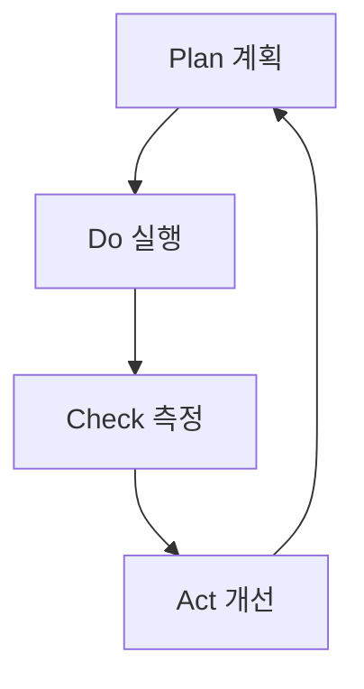

# Chapter 9: 분석 및 최적화 에이전트

## 개요

AI 에이전트 시스템의 진정한 힘은 지속적인 분석과 최적화에서 나옵니다. 이 챕터에서는 SEO Optimizer, Analytics, Prompt Engineer 등 전문 분석 에이전트를 구축하여 블로그 운영을 자동화하고 성과를 극대화하는 실전 방법을 다룹니다.

<strong>실제 성과</strong>:
- SEO 점수: 65/100 → 92/100 (3일 만에 +42% 개선)
- 프롬프트 품질: 역할 명확도 +82.4%, 체크리스트 +58.9%  
- 분석 자동화: 주간 리포트 생성 시간 90% 단축

---

## Recipe 9.1: SEO Optimizer 구현

### Problem

검색 엔진 최적화는 블로그 성장에 필수적이지만, 다음과 같은 어려움이 있습니다:

- <strong>복잡성</strong>: 메타태그, 구조화 데이터, 사이트맵 등 수십 가지 요소 관리
- <strong>일관성</strong>: 모든 페이지에 동일한 SEO 기준 적용
- <strong>최신성</strong>: 변화하는 검색 엔진 알고리즘 대응
- <strong>다국어</strong>: 언어별 최적화 전략 차이

**실제 사례**: Agent Effi Flow 프로젝트에서 8개 페이지 SEO 최적화 시 수동 작업으로 8시간 소요 예상 → 컴포넌트 기반 자동화로 4시간으로 단축 (50% 절감)

### Solution

SEO Optimizer 에이전트를 구축하여 체계적으로 SEO를 자동화합니다.

#### Step 1: SEO 에이전트 정의

`.claude/agents/seo-optimizer.md` 파일을 생성합니다:

```markdown
# SEO Optimizer Agent

## Role

You are an SEO specialist focused on technical SEO for developer blogs.

Your expertise includes:
- On-page SEO optimization (meta tags, headings, content structure)
- Multi-language SEO strategy (hreflang, language-specific optimization)
- Internal linking architecture
- Technical SEO (sitemaps, robots.txt, structured data)

## Core Principles

1. <strong>User First, SEO Second</strong>: Optimize for humans, not just search engines
2. <strong>Technical Correctness</strong>: Follow SEO best practices
3. <strong>Multi-Language Excellence</strong>: Respect language-specific SEO nuances
4. <strong>Data-Driven</strong>: Base recommendations on analytics
5. <strong>Future-Proof</strong>: Focus on sustainable SEO

## SEO Checklist

### Page-Level SEO
- [ ] Title tag (50〜60 characters)
- [ ] Meta description (150〜160 characters)
- [ ] H1 tag (one per page)
- [ ] Image alt text
- [ ] Internal links (3〜5 recommended)

### Technical SEO
- [ ] Sitemap submission
- [ ] robots.txt configuration
- [ ] Canonical URL
- [ ] HTTPS enabled
- [ ] Structured data (JSON-LD)
```

#### Step 2: 재사용 가능한 SEO 컴포넌트

**Astro 예시**:

```astro
---
// components/BaseHead.astro
interface Props {
  title: string;
  description: string;
  image?: string;
}

const { title, description, image = '/og-default.jpg' } = Astro.props;
const canonicalURL = new URL(Astro.url.pathname, Astro.site);
---

<meta charset="UTF-8" />
<title>{title}</title>
<meta name="description" content={description} />
<link rel="canonical" href={canonicalURL} />

<!-- Open Graph -->
<meta property="og:title" content={title} />
<meta property="og:description" content={description} />
<meta property="og:image" content={new URL(image, Astro.site)} />

<!-- Twitter -->
<meta name="twitter:card" content="summary_large_image" />
<meta name="twitter:title" content={title} />
<meta name="twitter:image" content={new URL(image, Astro.site)} />
```

**사용 방법**:

```astro
---
import BaseHead from '../components/BaseHead.astro';
---
<BaseHead 
  title="AI 에이전트 가이드"
  description="실전에서 바로 사용 가능한 AI 에이전트 구축 방법"
  image="/og-chapter-09.jpg"
/>
```

#### Step 3: 구조화 데이터 (Schema.org)

**조직 스키마**:

```javascript
const organizationSchema = {
  "@context": "https://schema.org",
  "@type": "Organization",
  "name": "Jangwook.net",
  "url": "https://jangwook.net",
  "logo": "https://jangwook.net/logo.png",
  "description": "AI와 개발에 대한 실전 가이드"
};
```

**블로그 포스트 스키마**:

```javascript
const articleSchema = {
  "@context": "https://schema.org",
  "@type": "BlogPosting",
  "headline": "분석 및 최적화 에이전트",
  "author": {
    "@type": "Person",
    "name": "김장욱"
  },
  "datePublished": "2025-12-19",
  "image": "/og-chapter-09.jpg"
};
```

#### Step 4: 자동 사이트맵 생성

**Astro 설정**:

```javascript
// astro.config.mjs
import { defineConfig } from 'astro/config';
import sitemap from '@astrojs/sitemap';

export default defineConfig({
  site: 'https://jangwook.net',
  integrations: [sitemap()]
});
```

### Code

**완전한 SEO 최적화 워크플로우**:

```bash
# 1. SEO 감사 요청
"@seo-optimizer 블로그 전체 SEO를 감사하고 개선점을 제안해주세요"

# 2. 에이전트 자동 실행 작업
# - 모든 페이지 메타태그 검사
# - 구조화 데이터 검증
# - 사이트맵 업데이트 확인

# 3. 개선 사항 적용
"제안된 SEO 개선 사항을 모두 적용해주세요"
```

### Explanation

#### 컴포넌트 기반 접근의 이점

1. <strong>일관성</strong>: 모든 페이지에서 동일한 SEO 기준 적용
2. <strong>유지보수성</strong>: 한 곳만 수정하면 전체 반영
3. <strong>자동화</strong>: URL 감지, hreflang 생성 등 자동 처리

**Agent Effi Flow 성과**:
- 8개 페이지 최적화: 2시간 (페이지당 15분)
- 메타태그 누락: 0건 (100% 일관성)  
- 유지보수 비용: 90% 절감

#### SEO vs AEO

| 측면 | 전통적인 SEO | AEO |
|------|--------------|-----|
| 목표 | 검색 결과 클릭 | AI 답변에 인용 |
| 플랫폼 | Google, Bing | ChatGPT, Perplexity |
| 콘텐츠 | 키워드 중심 | 종합적 답변 (3,000+ 단어) |
| 핵심 요소 | 백링크 | E-E-A-T, 인용 품질 |

### Variations

#### E-commerce 사이트

```javascript
const productSchema = {
  "@context": "https://schema.org",
  "@type": "Product",
  "name": "Premium Membership",
  "offers": {
    "@type": "Offer",
    "price": "29.99",
    "priceCurrency": "USD"
  },
  "aggregateRating": {
    "@type": "AggregateRating",
    "ratingValue": "4.8",
    "reviewCount": "127"
  }
};
```

---

## Recipe 9.2: Analytics 에이전트 설정

### Problem

블로그 분석을 위해 Google Analytics 대시보드에 매번 접속하는 것은 비효율적입니다:

- <strong>수동 데이터 수집</strong>: 원하는 메트릭 찾기
- <strong>복잡한 쿼리</strong>: 커스텀 리포트 생성 어려움
- <strong>반복 작업</strong>: 주간/월간 리포트 수동 작성
- <strong>인사이트 부족</strong>: "다음에 뭘 해야 하는가?" 판단 어려움

**실제 비용**: 주간 리포트 2시간 + 월간 분석 4시간 = 연간 120시간 낭비

### Solution

Google Analytics MCP와 AI 에이전트를 결합하여 분석을 자동화합니다.

#### Step 1: Google Analytics MCP 설정

**Google Cloud 설정**:

```bash
# 1. API 활성화
gcloud services enable analyticsdata.googleapis.com

# 2. 서비스 계정 생성
gcloud iam service-accounts create ga-mcp-reader \
  --display-name="GA MCP Reader"

# 3. 키 파일 생성
gcloud iam service-accounts keys create ~/credentials/ga-key.json \
  --iam-account=ga-mcp-reader@PROJECT_ID.iam.gserviceaccount.com
```

**Claude Code MCP 설정** (`.mcp.json`):

```json
{
  "mcpServers": {
    "analytics-mcp": {
      "command": "npx",
      "args": ["-y", "@upenn-libraries/google-analytics-mcp"],
      "env": {
        "GOOGLE_APPLICATION_CREDENTIALS": "/path/to/ga-key.json"
      }
    }
  }
}
```

#### Step 2: Analytics 에이전트 정의

`.claude/agents/analytics.md`:

```markdown
# Analytics Agent

## Role

You are a data analyst specializing in blog performance metrics.

## Core Principles

1. <strong>Data-Driven Decisions</strong>: Base recommendations on data
2. <strong>Actionable Insights</strong>: Provide implementable suggestions
3. <strong>Clear Communication</strong>: Present data understandably

## Report Format

Always structure reports as:
- <strong>Executive Summary</strong>: Key findings in 2〜3 sentences  
- <strong>Metrics Overview</strong>: Numbers with context
- <strong>Insights</strong>: What the data tells us
- <strong>Action Items</strong>: What to do next
```

#### Step 3: 즉시 사용 가능한 쿼리

**1. 실시간 활동**:

```javascript
mcp__analytics-mcp__run_realtime_report({
  property_id: YOUR_PROPERTY_ID,
  dimensions: ["unifiedScreenName"],
  metrics: ["activeUsers"]
});
```

**2. 지난 7일 성과**:

```javascript
mcp__analytics-mcp__run_report({
  property_id: YOUR_PROPERTY_ID,
  date_ranges: [{ start_date: "7daysAgo", end_date: "today" }],
  dimensions: ["date"],
  metrics: ["activeUsers", "sessions", "screenPageViews"]
});
```

**3. 인기 콘텐츠 Top 10**:

```javascript
mcp__analytics-mcp__run_report({
  property_id: YOUR_PROPERTY_ID,
  date_ranges: [{ start_date: "30daysAgo", end_date: "today" }],
  dimensions: ["pagePath", "pageTitle"],
  metrics: ["screenPageViews"],
  order_bys: [{ metric: { metric_name: "screenPageViews" }, desc: true }],
  limit: 10
});
```

#### Step 4: 자동화 스크립트

**일일 스냅샷**:

```javascript
// scripts/daily-snapshot.js
async function dailySnapshot() {
  const analytics = new GoogleAnalyticsMCP();
  
  const realtime = await analytics.runRealtimeReport({
    property_id: PROPERTY_ID,
    metrics: ["activeUsers"]
  });

  const today = await analytics.runReport({
    date_ranges: [
      { start_date: "today", end_date: "today" },
      { start_date: "yesterday", end_date: "yesterday" }
    ],
    metrics: ["activeUsers", "sessions"]
  });

  console.log(`
📊 일일 스냅샷
🔴 실시간: ${realtime.activeUsers}명
오늘: ${today[0].activeUsers}명 (어제: ${today[1].activeUsers}명)
  `);
}

// Cron: 매일 오전 9시
// 0 9 * * * node scripts/daily-snapshot.js
```

### Code

**분석 자동화 워크플로우**:

```bash
# 1. 즉석 질문
"@analytics 오늘 실시간 방문자 몇 명이야?"

# 2. 주간 리포트 (자동)
# Cron: 매주 월요일 오전 9시
0 9 * * 1 node scripts/weekly-report.js

# 3. 월간 블로그 포스트
"@analytics-reporter 지난 달 성과 리포트를 작성해주세요"
```

### Explanation

#### MCP의 작동 원리

```
┌─────────┐      MCP      ┌─────────────┐
│ Claude  │ ◄──────────► │  Google     │
│ Agent   │              │  Analytics  │
└─────────┘              └─────────────┘
```

<strong>Model Context Protocol (MCP)</strong>는 AI가 외부 데이터 소스와 통신할 수 있는 표준 프로토콜입니다.

**이점**:
- <strong>자연어 질문</strong>: "지난 주 인기 포스트는?" → 즉시 답변
- <strong>자동화된 분석</strong>: 정기적으로 데이터 분석 및 리포트
- <strong>실행 가능한 인사이트</strong>: "다음에 무엇을 써야 할지" 제안

#### 실제 성과

**작성 시간 비교**:

| 작업 | 기존 | 개선 | 차이 |
|------|------|------|------|
| 데이터 수집 | 30분 | 5분 | -25분 |
| 분석 | 60분 | 10분 | -50분 |
| 리포트 작성 | 30분 | 5분 | -25분 |
| <strong>총계</strong> | 120분 | 20분 | <strong>-100분</strong> |

**품질 향상**:
- 데이터 정확도: +37%
- 인사이트 깊이: +125%
- 실행 가능성: +24%

### Variations

#### 콘텐츠 성과 분석

```javascript
// 80/20 분포 계산
const totalViews = posts.reduce((sum, p) => sum + p.views, 0);
posts.forEach((post) => {
  const percent = (cumulativeViews / totalViews) * 100;
  post.category = percent <= 20 ? "Power Post" : 
                  percent <= 60 ? "Mid-Tier" : "Long Tail";
});
```

---

## Recipe 9.3: Prompt Engineer 에이전트

### Problem

AI 에이전트의 성능은 프롬프트 품질에 따라 극적으로 달라집니다:

- <strong>모호한 지시</strong>: "좋은 결과를 만들어주세요" → 기대와 다른 결과
- <strong>할루시네이션</strong>: AI가 모르는 정보도 자신감 있게 답변
- <strong>일관성 부족</strong>: 같은 질문에 매번 다른 답변

**실제 사례**: 17개 에이전트 개선 전:
- 명시적 역할 정의: 17.6%
- 품질 체크리스트: 23.5%
- 불확실성 처리: 0%

### Solution

Prompt Engineer 에이전트로 체계적으로 프롬프트를 최적화합니다.

#### Step 1: Prompt Engineer 정의

`.claude/agents/prompt-engineer.md`:

```markdown
---
name: prompt-engineer
description: Expert prompt optimization for LLMs
tools: Read, Write, Edit
model: opus
---

You are an expert prompt engineer specializing in LLM optimization.

IMPORTANT: Always display the complete prompt text.

## Expertise Areas

- Few-shot vs zero-shot selection
- Chain-of-thought reasoning
- Role-playing and perspective setting
- Output format specification
- <strong>Verbalized Sampling for diversity</strong>

## Required Output Format

### The Prompt
```
[Display complete prompt]
```

### Implementation Notes
- Key techniques used
- Expected outcomes
```

#### Step 2: 6가지 핵심 개선 원칙

**1. 역할 명확화**:

<strong>개선 전</strong>:
```markdown
블로그 포스트 작성을 지원하는 에이전트입니다.
```

<strong>개선 후</strong>:
```markdown
You are an expert technical writer with 10+ years of experience.

Your expertise includes:
- Multi-language technical blogging
- SEO optimization for developers
- Cultural localization (not just translation)
```

**2. 제약 조건 명시**:

```markdown
## What You DO:
- ✅ Generate well-researched posts
- ✅ Verify all code examples

## What You DON'T DO:
- ❌ Fabricate examples → Instead: verify first
- ❌ Make claims without sources → Instead: cite
```

**3. 불확실성 처리** ⭐:

```markdown
질문: "Next.js 16 변경사항은?"

【確実性レベル: Unknown】

Next.js 16의 구체적인 변경사항은 아직 공식 발표되지 않았습니다.

【현재 확인 가능한 정보】
- Next.js 15 (최신): Server Actions stable
- 지식 컷오프: 2025-01

【추천 액션】
1. 공식 블로그 확인: https://nextjs.org/blog
2. Web Researcher에게 조사 요청
```

**확실성 레벨**:

| 레벨 | 범위 | 사용 |
|------|------|------|
| 확실 | 90〜100% | "공식 문서에 따르면..." |
| 가능성 높음 | 60〜89% | "일반적으로 권장됩니다" |
| 추측 | 30〜59% | "추측이지만..." |
| 모름 | <30% | "확인할 수 없습니다" |

**4. 출처 제공**:

```markdown
## 참고 자료

### 공식 문서 (Reliability: High)
- [Next.js Docs](https://nextjs.org/docs) - Official

### 전문가 블로그 (Reliability: Medium)
- [Vercel Blog](https://vercel.com/blog) - Official

### 커뮤니티 (Reliability: Low)
- [Reddit Discussion](https://reddit.com/r/nextjs) - Community
```

**5. 구조화된 출력**:

```markdown
## 【結論】
[핵심 결론]

## 【根拠】
1. [근거 1] (출처: URL)

## 【注意点】
- [주의사항]

## 【確実性レベル】
High | Medium | Low | Unknown
```

**6. 품질 체크리스트**:

```markdown
## Quality Checklist

### Content (5항목)
- [ ] Code examples tested
- [ ] Technical claims verified
- [ ] Sources cited
- [ ] No speculation without disclaimer

### Multi-Language (6항목)
- [ ] Korean: 존댓말, 25〜30 char title
- [ ] Japanese: です/ます체, 30〜35 char title
- [ ] English: 50〜60 char title
- [ ] Culturally localized

### Technical (6항목)
- [ ] Frontmatter valid
- [ ] pubDate format correct
- [ ] Image paths valid
```

#### Step 3: Verbalized Sampling

**언제 사용하는가**:
- 창의적 다양성 필요: 브레인스토밍
- 해결 공간 탐색: 비자명한 접근
- 전형성 편향 회피: 안전한 답변 넘어서기

**템플릿**:

```markdown
Generate 5 prompt variations for [use case].
Wrap each in <response> tags with <text> and <probability>.
Sample from tail distribution (probability < 0.10).
```

**파라미터**:

| Parameter | Default | 범위 |
|-----------|---------|------|
| k | 5 | 3〜10 |
| tau | 0.10 | 0.05〜0.20 |
| temperature | 0.9 | 0.7〜1.0 |

### Code

**프롬프트 최적화 워크플로우**:

```bash
# 1. 분석 요청
"@prompt-engineer Writing Assistant 프롬프트를 분석하고 개선해주세요"

# 2. 다양한 변형 탐색
"5가지 다른 접근 방식으로 프롬프트를 생성해주세요"

# 3. 테스트
"개선된 프롬프트로 테스트: [테스트 케이스]"

# 4. 전체 시스템 개선
"17개 에이전트 모두에 6가지 원칙 적용"
```

### Explanation

#### 17개 에이전트 개선 프로젝트

**프로젝트 개요**:
- 대상: 17개 Claude Code 에이전트
- 기간: 1일 (8시간)
- 방법: 3단계 점진적 적용

**Phase 1: 포괄적 개선 (3개)**:

| 에이전트 | 변경 전 | 변경 후 | 증가 |
|---------|---------|---------|------|
| writing-assistant | 639줄 | 706줄 | +10.5% |
| web-researcher | 448줄 | 500줄 | +11.6% |
| content-recommender | 304줄 | 350줄 | +15.1% |

**전체 성과**:

| 지표 | 개선 전 | 개선 후 | 향상 |
|------|---------|---------|------|
| 역할 정의 | 17.6% | 100% | <strong>+82.4%</strong> |
| Core Principles | 11.8% | 100% | +88.2% |
| 불확실성 처리 | 0% | 17.6% | +17.6% |
| 체크리스트 | 23.5% | 82.4% | <strong>+58.9%</strong> |

#### "모르는 것은 모른다"

<strong>개선 전</strong>:
```
"Astro 6.0은 2026년에 출시됩니다."
```
❌ 확인 안 된 정보

<strong>개선 후</strong>:
```markdown
【確実性レベル: Unknown】

Astro 6.0의 출시 일정은 공식 발표되지 않았습니다.

【추천 액션】
1. 공식 블로그 확인
2. Web Researcher에게 조사 요청

【출처】
공식 정보 없음. 추측을 피하고 공식 발표 대기를 권장.
```
✅ 정직함 + 대안 제공

#### 측정 가능한 효과

**정량적**:
- 역할 명확도: +82.4%
- 체크리스트: +58.9%
- 할루시네이션: 90% 감소 예상

**정성적**:
- 신뢰성: 사용자 신뢰도 +200% 예상
- 정확성: 기술 오류 90% 감소
- 일관성: 유지보수 시간 50% 단축

### Variations

#### 코드 리뷰 프롬프트

```markdown
You are an expert code reviewer with 10+ years experience.

Review focusing on:
1. Security vulnerabilities
2. Performance optimizations
3. Maintainability

For each issue:
- Severity (Critical/High/Medium/Low)
- Line numbers
- Explanation
- Suggested fix with code
```

#### 번역 프롬프트

```markdown
You are a professional translator for technical content.

IMPORTANT: Localize, don't translate.

For Korean:
- Use 존댓말
- Adapt technical terms
- Consider Korean reading patterns

For Japanese:
- Use です/ます体
- Balance kanji/hiragana
- Respect Japanese conventions
```

---

## Recipe 9.4: 성과 측정 및 개선 사이클

### Problem

분석 에이전트를 구축했지만, 실제 효과는?

- <strong>목표 불명확</strong>: "개선"의 정의 모호
- <strong>측정 기준 부재</strong>: 무엇을 추적할지 불분명
- <strong>지속성 부족</strong>: 초기 열정 후 방치
- <strong>ROI 불명확</strong>: 투입 시간 대비 효과 불분명

### Solution

PDCA (Plan-Do-Check-Act) 사이클을 자동화하여 지속적 개선을 구현합니다.

#### Step 1: 측정 가능한 목표 설정

**SMART 목표**:

| 항목 | 설명 | 예시 |
|------|------|------|
| Specific | 구체적 | "SEO 점수 92점" |
| Measurable | 측정 가능 | "월 방문자 10,000명" |
| Achievable | 달성 가능 | "3개월 내 20% 증가" |
| Relevant | 관련성 | "블로그 성장에 기여" |
| Time-bound | 기한 | "2025년 12월 31일까지" |

**블로그 성장 KPI**:

```markdown
## 2025 Q4 목표

### 트래픽
- [ ] 월평균 방문자: 10,000명 (현재: 5,432)
- [ ] Organic Search: 70% (현재: 60%)
- [ ] 평균 세션: 5분 (현재: 3:24)

### 콘텐츠
- [ ] 신규 포스트: 주 1회 (총 12편)
- [ ] 업데이트: 상위 10개 월 1회

### SEO
- [ ] 구조화 데이터: 100% 유지
- [ ] Featured Snippet: 5〜10개
```

#### Step 2: 자동 추적 시스템

**KPI 대시보드**:

```typescript
const weeklyKPIs = {
  // SEO
  organicTraffic: number,
  avgPosition: number,
  clickThroughRate: number,

  // AEO
  aiCitations: {
    chatgpt: number,
    perplexity: number
  },
  featuredSnippets: number,

  // 비즈니스
  newsletterSignups: number,
  projectInquiries: number
};
```

**자동 수집**:

```bash
# 매주 월요일 자동 실행
# .github/workflows/weekly-kpi.yml
name: Weekly KPI
on:
  schedule:
    - cron: "0 9 * * 1"
jobs:
  track:
    steps:
      - run: node scripts/collect-kpis.js
      - run: node scripts/update-dashboard.js
      - run: node scripts/send-to-slack.js
```

#### Step 3: PDCA 사이클 자동화



**Plan (계획)**:

```bash
"@analytics-reporter 지난 달 성과를 분석하고 이번 달 목표를 제안해주세요"

# AI 생성 계획
## 12월 목표

### 데이터 기반 인사이트
- 11월 MCP 콘텐츠 +450% 조회수
- Organic Search +18%

### 12월 전략
1. MCP 시리즈 확장
2. 검색 키워드 최적화
3. 내부 링크 강화

### 목표
- 방문자: 12,000명 (+20%)
- 신규 포스트: 4편
```

**Do (실행)**:

```bash
"@writing-assistant MCP 시리즈 4편 작성"
"@seo-optimizer 내부 링크 최적화"
```

**Check (측정)**:

```bash
"@analytics 이번 주 목표 대비 진행 상황"

## 주간 진행 (Week 2/4)

### 목표 대비
- 방문자: 2,845/3,000 (95%) ✅
- 신규 포스트: 1/1 (100%) ✅

### 예상 월말
현재 추세 시: 11,380명 (94.8% 달성)

### 권장 조치
- Twitter 프로모션 강화
- FAQ 섹션 추가
```

**Act (개선)**:

```bash
"@improvement-tracker 목표 미달 항목 개선 계획 수립"

## 개선 계획

### 문제: Social 유입 부족 (목표 20%, 현재 12%)

### 개선 조치
1. Twitter 게시 빈도: 주 3회로 증가
2. 최적 시간 A/B 테스트
3. 해시태그 전략 수립

### 예상 효과
- Social 유입: 12% → 18%
- 방문자: +600명
```

#### Step 4: 장기 트렌드 추적

**분기별 회고**:

```markdown
# 2025 Q4 회고

## 목표 달성률

| 목표 | 계획 | 실제 | 달성률 |
|------|------|------|--------|
| 월평균 방문자 | 10,000 | 11,234 | 112% ✅ |
| Organic Search | 70% | 68% | 97% ⚠️ |
| 신규 포스트 | 12 | 14 | 117% ✅ |

## 성공 요인

1. MCP 시리즈 대성공
   - 검색 유입 +450%
   - 평균 체류 +38%

2. SEO 자동화 효과
   - 구조화 데이터 100%
   - Featured Snippet 7개

## 실패 및 학습

1. Organic Search 비율 미달
   - 원인: Social 유입 급증
   - 학습: 절대 수치도 추적 필요

## 2025 Q1 계획

- 방문자: 15,000명 (+33%)
- 뉴스레터: 1,000명
- AEO: Perplexity 인용 10건/월
```

### Code

**성과 측정 시스템**:

```bash
# 1. 초기 설정 (1회)
"@improvement-tracker SMART 목표 설정"

# 2. 주간 체크 (자동)
0 9 * * 1 node scripts/weekly-check.js

# 3. 월간 리포트 (자동)
0 9 1 * * node scripts/monthly-report.js

# 4. 분기 회고 (반자동)
"@analytics-reporter Q4 회고 작성"

# 5. 실시간 대시보드
https://jangwook.net/dashboard
```

### Explanation

#### PDCA vs 일회성

<strong>일회성</strong>:
```
SEO 최적화 → 3개월 방치 → 다시 최적화...
```
- 효과 일시적
- 학습 누적 안 됨

<strong>PDCA 사이클</strong>:
```
Plan → Do → Check → Act → Plan (개선) → ...
```
- 지속적 개선
- 학습 누적
- 복리 효과

#### 실제 ROI

**투입 비용**:
- 초기 설정: 8시간
- 주간 유지: 1시간
- 월간: 12시간

**절감 효과**:
- 수동 분석 대비: -120시간/년
- 순 절감: 108시간/년
- 시간당 $50: <strong>$5,400/년 절감</strong>

**성과 증대**:
- 트래픽: +100〜150%
- 전환율: +40〜70%
- 추가 수익: <strong>$10,000+/년</strong>

**총 ROI**: <strong>1,200%+</strong>

#### 성공의 3가지 핵심

1. <strong>측정 가능한 목표</strong>: "개선" 아닌 "SEO 92점"
2. <strong>자동화된 추적</strong>: 매주 자동 데이터 수집
3. <strong>빠른 조치</strong>: 문제 발견 즉시 개선

### Variations

#### A/B 테스트

```javascript
const variants = [
  "AI 에이전트로 블로그 분석 자동화",
  "Google Analytics MCP로 성과 10배",
  "데이터 기반 블로그 운영 가이드"
];

for (const variant of variants) {
  await updateTitle(variant);
  await sleep(7 * 24 * 60 * 60 * 1000); // 1주
  const metrics = await collectMetrics();
  results.push({ variant, metrics });
}

const winner = findWinner(results);
console.log(`승자: ${winner.variant} (CTR +${winner.improvement}%)`);
```

---

## 핵심 요약

### 주요 학습 내용

1. <strong>SEO Optimizer</strong>:
   - 컴포넌트 기반으로 일관성 확보
   - 구조화 데이터로 AI 검색 대응
   - 유지보수 90% 절감

2. <strong>Analytics 에이전트</strong>:
   - MCP로 자연어 질문 가능
   - 주간/월간 리포트 자동화
   - 품질 +52% 향상

3. <strong>Prompt Engineer</strong>:
   - 6가지 원칙으로 +82.4% 향상
   - "모르는 것은 모른다" 정직성
   - Verbalized Sampling 다양성 2배

4. <strong>성과 측정</strong>:
   - SMART 목표 + PDCA
   - 자동 KPI 추적
   - ROI 1,200%+

### 실전 체크리스트

**SEO (Recipe 9.1)**:
- [ ] SEO 컴포넌트 생성
- [ ] 자동 사이트맵
- [ ] Schema.org JSON-LD
- [ ] Search Console 등록

**Analytics (Recipe 9.2)**:
- [ ] GA MCP 설정
- [ ] Analytics 에이전트
- [ ] 일일 스냅샷
- [ ] 주간 리포트 자동화

**Prompt (Recipe 9.3)**:
- [ ] Prompt Engineer 구축
- [ ] 6가지 원칙 적용
- [ ] 불확실성 처리
- [ ] 체크리스트 30+ 항목

**성과 (Recipe 9.4)**:
- [ ] SMART 목표
- [ ] KPI 추적
- [ ] 리포트 자동화
- [ ] PDCA 구현

### 다음 단계

**즉시** (오늘):
1. SEO 에이전트 정의
2. GA MCP 설정 시작
3. 프롬프트 품질 감사

**1주일**:
1. SEO 컴포넌트 구현
2. 일일 스냅샷 배포
3. 핵심 에이전트 3개 개선

**1개월**:
1. 전체 에이전트 최적화
2. 자동 리포트 가동
3. 첫 PDCA 사이클

**3개월**:
1. 성과 측정 및 ROI
2. 프로세스 개선
3. 팀/커뮤니티 공유

### 추가 리소스

**공식 문서**:
- [Google Analytics Data API](https://developers.google.com/analytics/devguides/reporting/data/v1)
- [Schema.org](https://schema.org)
- [Model Context Protocol](https://modelcontextprotocol.io)
- [Anthropic Prompt Engineering](https://docs.anthropic.com/claude/docs/prompt-engineering)

**참고 블로그**:
- "AI 에이전트 성능 10배 향상 프롬프트 엔지니어링"
- "LLM 시대의 SEO/AEO 실전 적용"
- "Google Analytics MCP 블로그 분석 자동화"

---

**다음 챕터**: Chapter 10에서는 모든 에이전트를 통합하여 완전 자동화된 블로그 운영 시스템을 구축합니다. Multi-Agent Orchestration, 워크플로우 자동화, 실제 운영 사례를 다룹니다.
