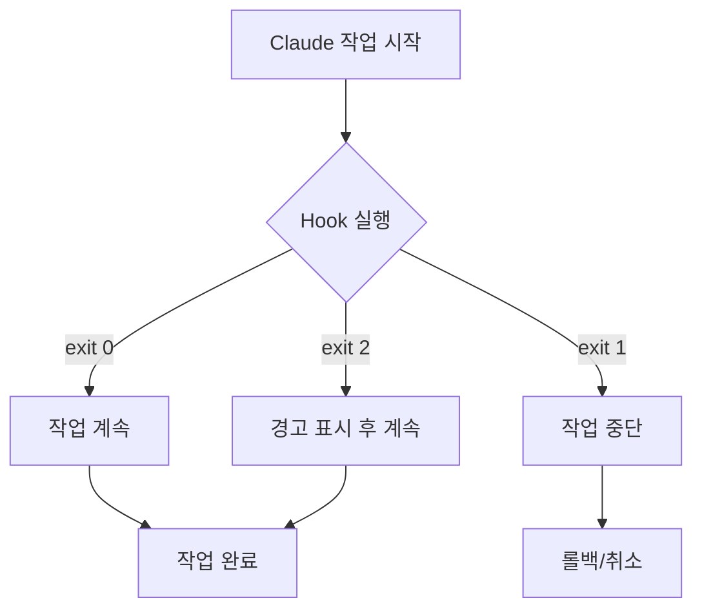
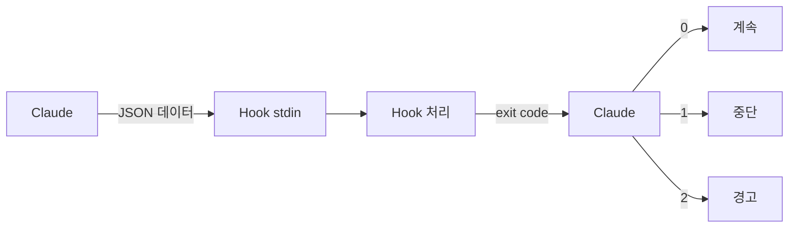
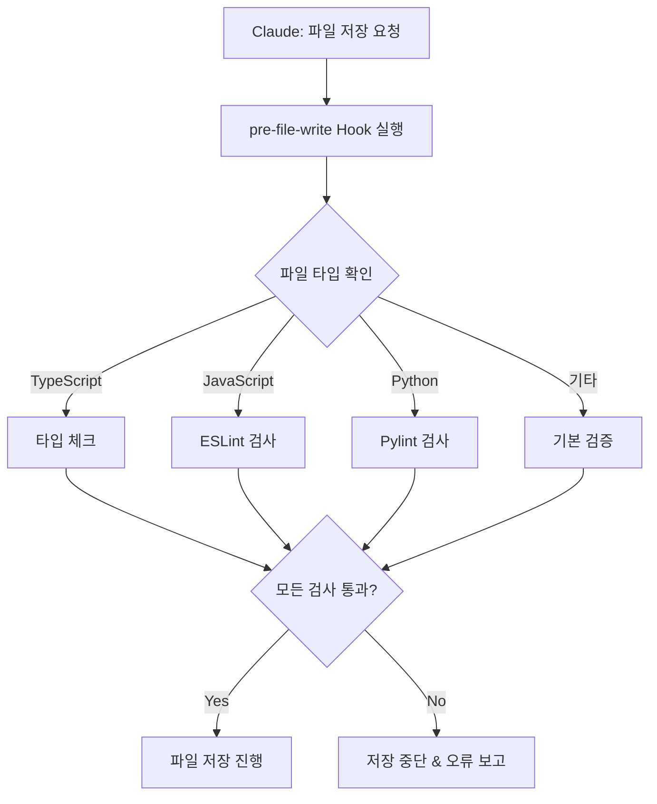
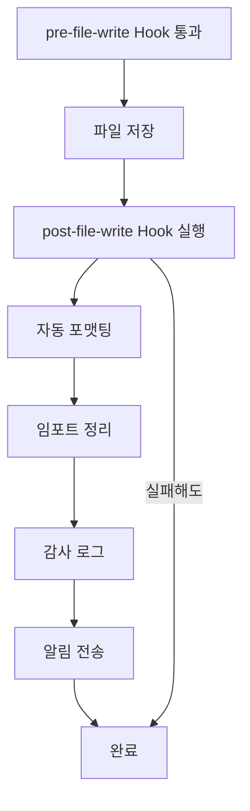
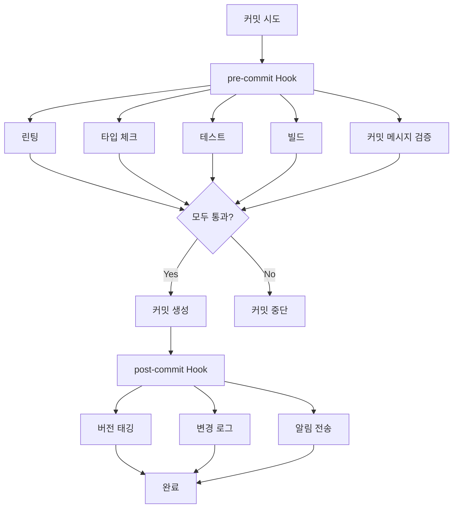
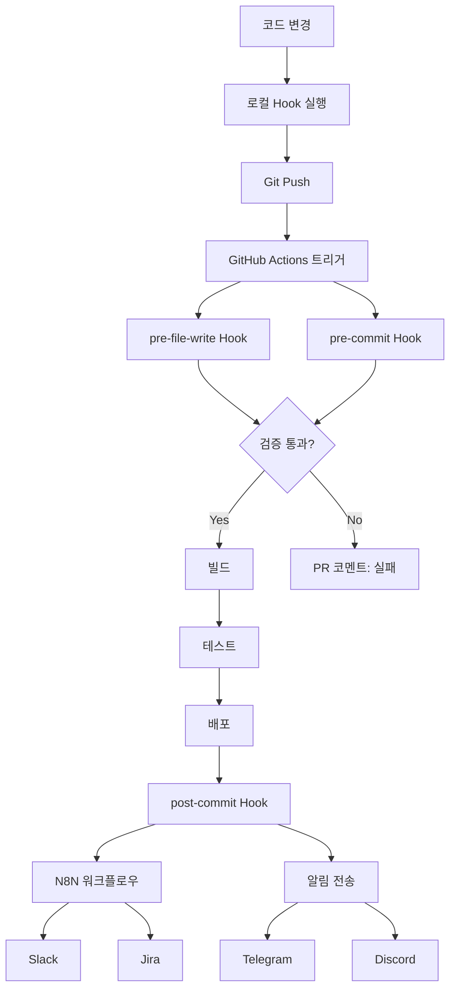

# Chapter 10: Hook 기반 자동화

## 개요

Claude Code의 Hook 시스템은 AI 기반 코딩 워크플로우에 일관성과 품질을 보장하는 강력한 자동화 메커니즘입니다. Git hook과 유사한 개념이지만, Claude의 AI 워크플로우에 특화되어 있어 파일 작성, 커밋, 테스트 등 다양한 단계에서 자동 검증과 처리를 수행할 수 있습니다.

이 챕터에서는 Hook 시스템의 기본 개념부터 실무 적용까지, 5가지 레시피를 통해 단계적으로 학습합니다.

### 학습 목표

- Hook 시스템의 동작 원리와 구조 이해
- 각 Hook 타입의 특성과 활용 방법 습득
- 코드 품질 자동 검증 시스템 구축
- CI/CD 파이프라인과의 통합 방법 학습
- 엔터프라이즈급 자동화 워크플로우 설계

---

## Recipe 10.1: Hook 시스템 개요

### 문제 (Problem)

AI 코딩 어시스턴트가 생성한 코드의 품질과 일관성을 어떻게 보장할 수 있을까요? Claude가 파일을 저장하거나 커밋할 때마다 수동으로 검증하는 것은 비효율적입니다.

### 해결책 (Solution)

Claude Code의 Hook 시스템을 활용하면 워크플로우의 특정 시점에 자동으로 검증 로직을 실행할 수 있습니다. 다음 단계로 Hook 시스템을 구축합니다.

#### 1단계: Hook 디렉토리 구조 생성

```bash
# Hook 디렉토리 생성
mkdir -p .claude/hooks
mkdir -p .claude/logs
mkdir -p .claude/cache

# 기본 디렉토리 구조
# .claude/
# └── hooks/
#     ├── pre-file-write.sh      # 파일 저장 전 실행
#     ├── post-file-write.sh     # 파일 저장 후 실행
#     ├── pre-commit.sh          # 커밋 전 실행
#     └── post-commit.sh         # 커밋 후 실행
```

#### 2단계: 첫 번째 Hook 작성

가장 간단한 Hook부터 시작합니다. 민감한 파일을 보호하는 pre-file-write Hook입니다.

```bash
#!/bin/bash
# .claude/hooks/pre-file-write.sh

# Hook 입력 데이터는 stdin으로 JSON 형식으로 전달됨
input=$(cat)

# 파일 경로 추출 (jq 사용)
file_path=$(echo "$input" | jq -r '.file_path')

echo "Checking file: $file_path"

# 민감한 파일 보호
if [[ "$file_path" == *".env"* ]] || [[ "$file_path" == *"credentials"* ]]; then
    echo "Error: Cannot modify sensitive files (.env, credentials)"
    exit 1  # 작업 중단
fi

# 성공
echo "✅ File check passed"
exit 0
```

#### 3단계: 실행 권한 부여

Hook 스크립트는 실행 가능해야 합니다.

```bash
# 개별 Hook에 실행 권한 부여
chmod +x .claude/hooks/pre-file-write.sh

# 모든 Hook에 한 번에 실행 권한 부여
chmod +x .claude/hooks/*.sh
```

#### 4단계: Hook 테스트

직접 Hook을 실행하여 동작을 확인합니다.

```bash
# 테스트 입력 데이터 생성
echo '{
  "file_path": "src/components/Button.tsx",
  "operation": "write",
  "content": "// test content"
}' | .claude/hooks/pre-file-write.sh

# 출력:
# Checking file: src/components/Button.tsx
# ✅ File check passed

# 민감한 파일로 테스트
echo '{
  "file_path": ".env",
  "operation": "write",
  "content": "API_KEY=secret"
}' | .claude/hooks/pre-file-write.sh

# 출력:
# Checking file: .env
# Error: Cannot modify sensitive files (.env, credentials)
# (exit code: 1)
```

### 코드/예시 (Code)

Hook의 입력 데이터 구조를 이해하는 것이 중요합니다. Claude는 다음 JSON 형식으로 Hook에 정보를 전달합니다.

```json
{
  "file_path": "src/components/Button.tsx",
  "operation": "write",
  "content": "export const Button = () => { ... }",
  "metadata": {
    "timestamp": "2025-10-29T10:30:00Z",
    "user": "developer@example.com",
    "session_id": "abc-123-xyz"
  }
}
```

Python으로 작성한 Hook 예시:

```python
#!/usr/bin/env python3
# .claude/hooks/pre-file-write.py

import sys
import json

def main():
    # stdin에서 JSON 입력 읽기
    input_data = json.loads(sys.stdin.read())

    file_path = input_data.get('file_path', '')
    print(f"Checking file: {file_path}")

    # 민감한 파일 보호
    sensitive_patterns = ['.env', 'credentials', 'secrets']

    for pattern in sensitive_patterns:
        if pattern in file_path:
            print(f"Error: Cannot modify sensitive file containing '{pattern}'")
            sys.exit(1)  # 작업 중단

    print("✅ File check passed")
    sys.exit(0)  # 성공

if __name__ == '__main__':
    main()
```

### 설명 (Explanation)

#### Hook 실행 메커니즘

Hook은 종료 코드(exit code)로 Claude의 동작을 제어합니다.

```bash
# 성공 - 작업 계속
exit 0

# 실패 - 작업 중단
exit 1

# 경고 - 작업 계속하되 경고 표시
exit 2
```



#### Hook 실행 시점

각 Hook 타입은 다른 시점에 실행됩니다.

| Hook 타입 | 실행 시점 | 주요 용도 |
|-----------|----------|----------|
| **pre-file-write** | 파일 저장 전 | 검증, 보안 체크 |
| **post-file-write** | 파일 저장 후 | 포맷팅, 로깅 |
| **pre-commit** | 커밋 전 | 테스트, 린팅 |
| **post-commit** | 커밋 후 | 알림, 배포 |

#### 데이터 흐름



### 변형 (Variations)

#### 변형 1: 디버그 모드가 있는 Hook

```bash
#!/bin/bash
# .claude/hooks/pre-file-write.sh

# 디버그 모드 활성화 (환경 변수)
DEBUG=${HOOK_DEBUG:-false}

if [ "$DEBUG" = "true" ]; then
    set -x  # 모든 명령 출력
fi

input=$(cat)

# 디버그 로그 저장
if [ "$DEBUG" = "true" ]; then
    echo "$input" > .claude/logs/hook-input.json
fi

file_path=$(echo "$input" | jq -r '.file_path')
echo "Checking file: $file_path"

# 검증 로직...

exit 0
```

사용:

```bash
# 디버그 모드로 실행
HOOK_DEBUG=true echo '{"file_path": "test.ts"}' | .claude/hooks/pre-file-write.sh
```

#### 변형 2: 다중 검사를 수행하는 Hook

```bash
#!/bin/bash
# .claude/hooks/pre-file-write.sh

input=$(cat)
file_path=$(echo "$input" | jq -r '.file_path')

echo "Running multiple checks on: $file_path"

# 검사 배열
declare -a checks=(
    "Sensitive file check"
    "File size check"
    "Path validation"
)

# 1. 민감한 파일 체크
echo "🔒 ${checks[0]}..."
if [[ "$file_path" == *".env"* ]]; then
    echo "❌ Failed: Sensitive file"
    exit 1
fi

# 2. 파일 크기 체크 (예: 1MB 제한)
echo "📏 ${checks[1]}..."
content=$(echo "$input" | jq -r '.content')
content_size=${#content}

if [ $content_size -gt 1048576 ]; then
    echo "❌ Failed: File too large (${content_size} bytes > 1MB)"
    exit 1
fi

# 3. 경로 검증 (경로 순회 공격 방지)
echo "🛡️  ${checks[2]}..."
if [[ "$file_path" =~ \.\. ]]; then
    echo "❌ Failed: Path traversal detected"
    exit 1
fi

echo "✅ All checks passed"
exit 0
```

#### 변형 3: Node.js로 작성한 Hook

```javascript
#!/usr/bin/env node
// .claude/hooks/pre-file-write.js

const readline = require('readline');

async function main() {
    // stdin에서 JSON 읽기
    const rl = readline.createInterface({
        input: process.stdin,
        output: process.stdout,
        terminal: false
    });

    let inputData = '';

    rl.on('line', (line) => {
        inputData += line;
    });

    rl.on('close', () => {
        try {
            const data = JSON.parse(inputData);
            const filePath = data.file_path || '';

            console.log(`Checking file: ${filePath}`);

            // 민감한 파일 체크
            const sensitivePatterns = ['.env', 'credentials', 'secrets'];

            for (const pattern of sensitivePatterns) {
                if (filePath.includes(pattern)) {
                    console.error(`Error: Cannot modify sensitive file containing '${pattern}'`);
                    process.exit(1);
                }
            }

            console.log('✅ File check passed');
            process.exit(0);

        } catch (error) {
            console.error('Error parsing input:', error.message);
            process.exit(1);
        }
    });
}

main();
```

실행 권한 부여:

```bash
chmod +x .claude/hooks/pre-file-write.js
```

---

## Recipe 10.2: pre-file-write Hook

### 문제 (Problem)

Claude가 파일을 저장하기 전에 코드 품질, 보안, 규칙 준수를 자동으로 검증하고 싶습니다. 수동 검토는 시간이 오래 걸리고 실수하기 쉽습니다.

### 해결책 (Solution)

pre-file-write Hook을 사용하여 파일 저장 전 자동 검증을 수행합니다. 이 Hook은 파일이 디스크에 기록되기 전에 실행되므로, 문제가 있으면 저장 자체를 중단할 수 있습니다.

#### 1단계: TypeScript 타입 체크 Hook

```bash
#!/bin/bash
# .claude/hooks/pre-file-write.sh

input=$(cat)
file_path=$(echo "$input" | jq -r '.file_path')

# TypeScript/TSX 파일만 검사
if [[ "$file_path" != *.ts ]] && [[ "$file_path" != *.tsx ]]; then
    exit 0  # 다른 파일은 통과
fi

echo "🔍 Running TypeScript type check on $file_path..."

# 타입 체크 실행
npx tsc --noEmit "$file_path" 2>&1 | tee /tmp/tsc-output.txt

# 타입 체크 결과 확인
if [ ${PIPESTATUS[0]} -ne 0 ]; then
    echo ""
    echo "❌ Type check failed:"
    cat /tmp/tsc-output.txt
    exit 1  # 작업 중단
fi

echo "✅ Type check passed"
exit 0
```

#### 2단계: ESLint 린팅 Hook

```python
#!/usr/bin/env python3
# .claude/hooks/eslint-check.py

import sys
import json
import subprocess

def main():
    # 입력 데이터 읽기
    input_data = json.loads(sys.stdin.read())
    file_path = input_data.get('file_path', '')

    # JavaScript/TypeScript 파일만 검사
    valid_extensions = ['.js', '.ts', '.jsx', '.tsx']
    if not any(file_path.endswith(ext) for ext in valid_extensions):
        sys.exit(0)  # 다른 파일은 통과

    print(f"✨ Running ESLint on {file_path}...")

    # ESLint 실행 (JSON 형식 출력)
    result = subprocess.run(
        ['npx', 'eslint', file_path, '--format', 'json'],
        capture_output=True,
        text=True
    )

    if result.returncode != 0:
        try:
            lint_results = json.loads(result.stdout)

            # 에러 및 경고 출력
            print("\n❌ ESLint failed:\n")

            for file_result in lint_results:
                for message in file_result.get('messages', []):
                    severity = '🔴 Error' if message['severity'] == 2 else '🟡 Warning'
                    print(f"{severity}: {message['message']}")
                    print(f"   Location: line {message['line']}, col {message['column']}")
                    print(f"   Rule: {message.get('ruleId', 'unknown')}\n")

        except json.JSONDecodeError:
            print(result.stdout)

        sys.exit(1)  # 작업 중단

    print("✅ ESLint passed")
    sys.exit(0)

if __name__ == '__main__':
    main()
```

#### 3단계: 보안 스캔 Hook

```bash
#!/bin/bash
# .claude/hooks/security-scan.sh

input=$(cat)
file_path=$(echo "$input" | jq -r '.file_path')
content=$(echo "$input" | jq -r '.content')

echo "🔒 Running security scan on $file_path..."

# 1. 하드코딩된 시크릿 탐지
echo "Checking for hardcoded secrets..."

# API 키 패턴
if echo "$content" | grep -qiE 'api[_-]?key\s*=\s*["\047][a-zA-Z0-9]{20,}'; then
    echo "❌ Potential API key found in code"
    exit 1
fi

# AWS 키 패턴
if echo "$content" | grep -qE 'AKIA[0-9A-Z]{16}'; then
    echo "❌ Potential AWS access key found in code"
    exit 1
fi

# 패스워드 하드코딩
if echo "$content" | grep -qiE 'password\s*=\s*["\047][^"\047]{8,}'; then
    echo "❌ Hardcoded password detected"
    exit 1
fi

# 2. Semgrep 보안 스캔 (설치된 경우)
if command -v semgrep &> /dev/null; then
    echo "Running Semgrep security scan..."

    # 임시 파일에 콘텐츠 저장
    temp_file=$(mktemp)
    echo "$content" > "$temp_file"

    # Semgrep 실행
    semgrep --config=auto "$temp_file" --quiet

    if [ $? -ne 0 ]; then
        rm "$temp_file"
        echo "❌ Semgrep security issues found"
        exit 1
    fi

    rm "$temp_file"
fi

echo "✅ Security scan passed"
exit 0
```

#### 4단계: 종합 검증 Hook

```bash
#!/bin/bash
# .claude/hooks/pre-file-write.sh

set -e  # 에러 발생 시 즉시 중단

input=$(cat)
file_path=$(echo "$input" | jq -r '.file_path')

echo "🚀 Running comprehensive checks on $file_path"
echo "━━━━━━━━━━━━━━━━━━━━━━━━━━━━━━━━"

# 검사 단계 배열
declare -a checks=(
    "Security scan"
    "Type checking"
    "Linting"
    "Code style"
)

failed=0

# 1. 보안 스캔
echo "🔒 ${checks[0]}..."
if .claude/hooks/security-scan.sh <<< "$input"; then
    echo "  ✅ Passed"
else
    echo "  ❌ Failed"
    failed=1
fi

# 2. 타입 체크 (TypeScript 파일만)
if [[ "$file_path" =~ \.(ts|tsx)$ ]]; then
    echo "📝 ${checks[1]}..."
    if npx tsc --noEmit "$file_path" 2>/dev/null; then
        echo "  ✅ Passed"
    else
        echo "  ❌ Failed"
        failed=1
    fi
fi

# 3. 린팅 (JS/TS 파일만)
if [[ "$file_path" =~ \.(js|ts|jsx|tsx)$ ]]; then
    echo "✨ ${checks[2]}..."
    if npx eslint "$file_path" 2>/dev/null; then
        echo "  ✅ Passed"
    else
        echo "  ❌ Failed"
        failed=1
    fi
fi

# 4. 코드 스타일 (Prettier)
if [[ "$file_path" =~ \.(js|ts|jsx|tsx|json|css|scss)$ ]]; then
    echo "🎨 ${checks[3]}..."
    if npx prettier --check "$file_path" 2>/dev/null; then
        echo "  ✅ Passed"
    else
        echo "  ⚠️  Formatting issues (will auto-fix in post-write)"
    fi
fi

echo "━━━━━━━━━━━━━━━━━━━━━━━━━━━━━━━━"

if [ $failed -eq 1 ]; then
    echo "❌ Some checks failed. Please fix the issues."
    exit 1
fi

echo "✅ All checks passed"
exit 0
```

### 코드/예시 (Code)

#### 실전 예제: React 컴포넌트 검증

```bash
#!/bin/bash
# .claude/hooks/react-component-check.sh

input=$(cat)
file_path=$(echo "$input" | jq -r '.file_path')
content=$(echo "$input" | jq -r '.content')

# React 컴포넌트 파일만 검사
if [[ ! "$file_path" =~ \.(jsx|tsx)$ ]]; then
    exit 0
fi

echo "⚛️  Validating React component: $file_path"

# 1. PropTypes/TypeScript Props 확인
if [[ "$file_path" == *.jsx ]]; then
    if ! echo "$content" | grep -q "PropTypes"; then
        echo "⚠️  Warning: No PropTypes defined (consider using TypeScript)"
    fi
fi

# 2. Key prop 검증 (map 사용 시)
if echo "$content" | grep -q ".map("; then
    if ! echo "$content" | grep -q 'key='; then
        echo "❌ Error: Missing 'key' prop in mapped elements"
        exit 1
    fi
fi

# 3. useEffect 의존성 배열 확인
if echo "$content" | grep -q "useEffect("; then
    # ESLint의 exhaustive-deps 규칙으로 검증
    if ! npx eslint "$file_path" --rule 'react-hooks/exhaustive-deps: error' 2>/dev/null; then
        echo "❌ Error: useEffect dependency issues"
        exit 1
    fi
fi

# 4. 접근성 검사
if ! echo "$content" | grep -qE '(aria-|role=)'; then
    echo "⚠️  Warning: Consider adding ARIA attributes for accessibility"
fi

echo "✅ React component validation passed"
exit 0
```

#### Python 파일 검증 예제

```python
#!/usr/bin/env python3
# .claude/hooks/python-check.py

import sys
import json
import subprocess
import tempfile
import os

def main():
    input_data = json.loads(sys.stdin.read())
    file_path = input_data.get('file_path', '')
    content = input_data.get('content', '')

    # Python 파일만 검사
    if not file_path.endswith('.py'):
        sys.exit(0)

    print(f"🐍 Validating Python file: {file_path}")

    # 임시 파일에 콘텐츠 저장
    with tempfile.NamedTemporaryFile(mode='w', suffix='.py', delete=False) as f:
        f.write(content)
        temp_file = f.name

    try:
        failed = False

        # 1. 문법 체크 (컴파일)
        print("  📝 Syntax check...")
        try:
            with open(temp_file, 'r') as f:
                compile(f.read(), temp_file, 'exec')
            print("    ✅ Syntax valid")
        except SyntaxError as e:
            print(f"    ❌ Syntax error: {e}")
            failed = True

        # 2. Black 포맷 체크
        print("  🎨 Code style check (Black)...")
        result = subprocess.run(
            ['black', '--check', temp_file],
            capture_output=True
        )
        if result.returncode == 0:
            print("    ✅ Code style valid")
        else:
            print("    ⚠️  Code style issues (will auto-fix in post-write)")

        # 3. Pylint 검사
        print("  ✨ Linting (Pylint)...")
        result = subprocess.run(
            ['pylint', temp_file, '--score=yes'],
            capture_output=True,
            text=True
        )

        # Pylint 점수 추출
        for line in result.stdout.split('\n'):
            if 'Your code has been rated at' in line:
                print(f"    {line.strip()}")

        if result.returncode != 0:
            # Pylint는 엄격하므로 경고만
            print("    ⚠️  Linting issues found (non-blocking)")

        # 4. Type hints 확인 (mypy)
        print("  📊 Type checking (mypy)...")
        result = subprocess.run(
            ['mypy', temp_file],
            capture_output=True,
            text=True
        )
        if result.returncode == 0:
            print("    ✅ Type hints valid")
        else:
            print("    ⚠️  Type hint issues (consider adding type annotations)")

        if failed:
            print("\n❌ Python validation failed")
            sys.exit(1)

        print("\n✅ Python validation passed")
        sys.exit(0)

    finally:
        # 임시 파일 삭제
        os.unlink(temp_file)

if __name__ == '__main__':
    main()
```

### 설명 (Explanation)

#### pre-file-write Hook의 실행 흐름



#### 검증 레벨 설계

pre-file-write Hook은 3단계 검증 레벨로 설계하는 것이 좋습니다.

1. <strong>블로킹 검증</strong> (exit 1): 반드시 통과해야 함
   - 보안 취약점
   - 문법 오류
   - 타입 오류

2. <strong>경고 검증</strong> (exit 2): 경고만 표시
   - 코드 스타일 위반
   - 린팅 경고
   - 누락된 문서화

3. <strong>정보 제공</strong> (exit 0): 항상 통과
   - 복잡도 측정
   - 코드 메트릭
   - 추천 사항

### 변형 (Variations)

#### 변형 1: 점진적 검증 (Progressive Validation)

```bash
#!/bin/bash
# .claude/hooks/progressive-validation.sh

input=$(cat)
file_path=$(echo "$input" | jq -r '.file_path')

# 검증 레벨 설정 (환경 변수)
VALIDATION_LEVEL=${VALIDATION_LEVEL:-strict}

echo "🔍 Running validation (level: $VALIDATION_LEVEL)"

case "$VALIDATION_LEVEL" in
    loose)
        # 레벨 1: 정보만 제공
        echo "  ℹ️  Loose validation - informational only"
        .claude/hooks/info-only-checks.sh <<< "$input" || true
        exit 0
        ;;

    normal)
        # 레벨 2: 경고 표시
        echo "  ⚠️  Normal validation - warnings enabled"
        .claude/hooks/warning-checks.sh <<< "$input"
        exit 2  # 경고 코드
        ;;

    strict)
        # 레벨 3: 엄격한 검증
        echo "  🔒 Strict validation - blocking errors"
        .claude/hooks/strict-checks.sh <<< "$input"

        if [ $? -ne 0 ]; then
            exit 1  # 블로킹
        fi
        exit 0
        ;;

    *)
        echo "Unknown validation level: $VALIDATION_LEVEL"
        exit 1
        ;;
esac
```

사용:

```bash
# 느슨한 검증으로 개발 시작
VALIDATION_LEVEL=loose claude code

# 커밋 전에는 엄격한 검증
VALIDATION_LEVEL=strict claude code
```

#### 변형 2: 캐시를 활용한 성능 최적화

```bash
#!/bin/bash
# .claude/hooks/cached-validation.sh

input=$(cat)
file_path=$(echo "$input" | jq -r '.file_path')
content=$(echo "$input" | jq -r '.content')

# 콘텐츠 해시 생성
content_hash=$(echo "$content" | sha256sum | cut -d' ' -f1)
cache_dir=".claude/cache/validation"
cache_file="$cache_dir/$content_hash"

mkdir -p "$cache_dir"

# 캐시 확인 (5분 이내)
if [ -f "$cache_file" ]; then
    cache_age=$(($(date +%s) - $(stat -f%m "$cache_file" 2>/dev/null || stat -c%Y "$cache_file")))

    if [ $cache_age -lt 300 ]; then
        echo "✅ Using cached validation result (age: ${cache_age}s)"
        cache_result=$(cat "$cache_file")

        if [ "$cache_result" = "pass" ]; then
            exit 0
        else
            exit 1
        fi
    fi
fi

# 실제 검증 수행
echo "🔍 Running fresh validation..."

if npx eslint "$file_path" 2>/dev/null && npx tsc --noEmit "$file_path" 2>/dev/null; then
    echo "pass" > "$cache_file"
    echo "✅ Validation passed (cached for future)"
    exit 0
else
    echo "fail" > "$cache_file"
    echo "❌ Validation failed"
    exit 1
fi
```

#### 변형 3: 병렬 검증으로 속도 향상

```bash
#!/bin/bash
# .claude/hooks/parallel-validation.sh

input=$(cat)
file_path=$(echo "$input" | jq -r '.file_path')

echo "🚀 Running parallel validation on $file_path"

# 임시 결과 파일
tmp_dir=$(mktemp -d)
trap "rm -rf $tmp_dir" EXIT

# 병렬로 검증 실행
(
    # 검증 1: ESLint
    if npx eslint "$file_path" 2>/dev/null; then
        echo "pass" > "$tmp_dir/eslint"
    else
        echo "fail" > "$tmp_dir/eslint"
    fi
) &

(
    # 검증 2: TypeScript
    if npx tsc --noEmit "$file_path" 2>/dev/null; then
        echo "pass" > "$tmp_dir/tsc"
    else
        echo "fail" > "$tmp_dir/tsc"
    fi
) &

(
    # 검증 3: Prettier
    if npx prettier --check "$file_path" 2>/dev/null; then
        echo "pass" > "$tmp_dir/prettier"
    else
        echo "fail" > "$tmp_dir/prettier"
    fi
) &

# 모든 백그라운드 작업 대기
wait

# 결과 확인
failed=0

if [ "$(cat $tmp_dir/eslint)" = "fail" ]; then
    echo "❌ ESLint failed"
    failed=1
fi

if [ "$(cat $tmp_dir/tsc)" = "fail" ]; then
    echo "❌ TypeScript check failed"
    failed=1
fi

if [ "$(cat $tmp_dir/prettier)" = "fail" ]; then
    echo "⚠️  Prettier formatting issues"
fi

if [ $failed -eq 1 ]; then
    exit 1
fi

echo "✅ All parallel checks passed"
exit 0
```

---

## Recipe 10.3: post-file-write Hook

### 문제 (Problem)

파일이 저장된 후에 자동으로 포맷팅을 적용하고, 로그를 남기고, 관련 작업을 트리거하고 싶습니다. pre-file-write Hook은 저장 전 검증에는 좋지만, 저장 후 처리는 할 수 없습니다.

### 해결책 (Solution)

post-file-write Hook을 사용하여 파일 저장 후 자동 처리를 수행합니다. 이 Hook은 파일이 디스크에 이미 저장된 후 실행되므로, 파일을 수정하거나 부가 작업을 수행하는 데 적합합니다.

#### 1단계: 자동 포맷팅 Hook

```bash
#!/bin/bash
# .claude/hooks/post-file-write.sh

input=$(cat)
file_path=$(echo "$input" | jq -r '.file_path')

echo "🎨 Auto-formatting $file_path..."

# 파일 확장자별 포맷터 적용
case "$file_path" in
    *.js|*.ts|*.jsx|*.tsx|*.json|*.css|*.scss|*.md)
        npx prettier --write "$file_path" 2>/dev/null
        if [ $? -eq 0 ]; then
            echo "  ✅ Formatted with Prettier"
        fi
        ;;

    *.py)
        black "$file_path" 2>/dev/null
        if [ $? -eq 0 ]; then
            echo "  ✅ Formatted with Black"
        fi
        ;;

    *.go)
        gofmt -w "$file_path" 2>/dev/null
        if [ $? -eq 0 ]; then
            echo "  ✅ Formatted with gofmt"
        fi
        ;;

    *.rs)
        rustfmt "$file_path" 2>/dev/null
        if [ $? -eq 0 ]; then
            echo "  ✅ Formatted with rustfmt"
        fi
        ;;

    *)
        echo "  ℹ️  No formatter configured for this file type"
        ;;
esac

exit 0  # 항상 성공 (포맷팅 실패해도 파일은 저장됨)
```

#### 2단계: 감사 로그 Hook

```python
#!/usr/bin/env python3
# .claude/hooks/audit-trail.py

import sys
import json
import hashlib
import os
from datetime import datetime
from pathlib import Path

AUDIT_LOG = '.claude/audit/trail.jsonl'

def main():
    # 입력 데이터
    input_data = json.loads(sys.stdin.read())
    file_path = input_data.get('file_path', '')
    content = input_data.get('content', '')

    # 감사 로그 디렉토리 생성
    Path(AUDIT_LOG).parent.mkdir(parents=True, exist_ok=True)

    # 콘텐츠 해시 생성 (변경 추적)
    content_hash = hashlib.sha256(content.encode('utf-8')).hexdigest()

    # 파일 크기
    file_size = len(content.encode('utf-8'))

    # 감사 엔트리
    audit_entry = {
        'timestamp': datetime.utcnow().isoformat() + 'Z',
        'operation': input_data.get('operation', 'write'),
        'file_path': file_path,
        'file_size': file_size,
        'content_hash': content_hash,
        'user': os.environ.get('USER', 'unknown'),
        'hostname': os.environ.get('HOSTNAME', 'unknown'),
        'session_id': input_data.get('metadata', {}).get('session_id', 'unknown')
    }

    # JSONL 형식으로 로그 추가 (한 줄에 하나의 JSON)
    with open(AUDIT_LOG, 'a') as f:
        f.write(json.dumps(audit_entry) + '\n')

    print(f"✅ Audit trail recorded: {audit_entry['timestamp']}")
    print(f"   File: {file_path}")
    print(f"   Hash: {content_hash[:16]}...")
    print(f"   Size: {file_size} bytes")

    sys.exit(0)

if __name__ == '__main__':
    main()
```

#### 3단계: 자동 임포트 정리

```bash
#!/bin/bash
# .claude/hooks/organize-imports.sh

input=$(cat)
file_path=$(echo "$input" | jq -r '.file_path')

# TypeScript/JavaScript 파일만 처리
if [[ ! "$file_path" =~ \.(ts|tsx|js|jsx)$ ]]; then
    exit 0
fi

echo "📦 Organizing imports in $file_path..."

# ESLint로 임포트 정리 (--fix 옵션)
npx eslint "$file_path" \
    --fix \
    --rule 'import/order: error' \
    --rule 'unused-imports/no-unused-imports: error' \
    2>/dev/null

if [ $? -eq 0 ]; then
    echo "  ✅ Imports organized"
else
    echo "  ⚠️  Could not organize imports (may not have eslint-plugin-import)"
fi

exit 0
```

#### 4단계: 문서 자동 생성

```python
#!/usr/bin/env python3
# .claude/hooks/generate-docs.py

import sys
import json
import subprocess
import os

def main():
    input_data = json.loads(sys.stdin.read())
    file_path = input_data.get('file_path', '')

    # TypeScript 파일만 처리
    if not (file_path.endswith('.ts') or file_path.endswith('.tsx')):
        sys.exit(0)

    print(f"📚 Generating documentation for {file_path}...")

    # TypeDoc으로 문서 생성
    docs_dir = '.claude/docs'
    os.makedirs(docs_dir, exist_ok=True)

    result = subprocess.run(
        ['npx', 'typedoc', file_path, '--out', docs_dir],
        capture_output=True,
        text=True
    )

    if result.returncode == 0:
        print(f"  ✅ Documentation generated at {docs_dir}")
    else:
        print("  ℹ️  TypeDoc not configured (skipping)")

    sys.exit(0)

if __name__ == '__main__':
    main()
```

### 코드/예시 (Code)

#### 종합 post-file-write Hook

```bash
#!/bin/bash
# .claude/hooks/post-file-write.sh

set -e

input=$(cat)
file_path=$(echo "$input" | jq -r '.file_path')

echo "🔄 Post-write processing for $file_path"
echo "━━━━━━━━━━━━━━━━━━━━━━━━━━━━━━━━"

# 1. 자동 포맷팅
echo "🎨 Auto-formatting..."
if [[ "$file_path" =~ \.(js|ts|jsx|tsx|json|css|scss)$ ]]; then
    npx prettier --write "$file_path" 2>/dev/null && echo "  ✅ Formatted"
fi

# 2. 임포트 정리
if [[ "$file_path" =~ \.(ts|tsx|js|jsx)$ ]]; then
    echo "📦 Organizing imports..."
    npx eslint "$file_path" --fix --quiet 2>/dev/null && echo "  ✅ Imports organized"
fi

# 3. 감사 로그
echo "📝 Audit trail..."
python3 .claude/hooks/audit-trail.py <<< "$input"

# 4. Git staging (옵션)
if [ "${AUTO_GIT_ADD:-false}" = "true" ]; then
    echo "📌 Auto-staging file..."
    git add "$file_path" 2>/dev/null && echo "  ✅ Staged for commit"
fi

echo "━━━━━━━━━━━━━━━━━━━━━━━━━━━━━━━━"
echo "✅ Post-write processing completed"

exit 0
```

#### 알림 전송 Hook

```python
#!/usr/bin/env python3
# .claude/hooks/notify.py

import sys
import json
import os
import requests

def send_slack_notification(message):
    """Slack 웹훅으로 알림 전송"""
    webhook_url = os.environ.get('SLACK_WEBHOOK_URL')

    if not webhook_url:
        return

    payload = {
        'text': message,
        'username': 'Claude Code Bot',
        'icon_emoji': ':robot_face:'
    }

    try:
        requests.post(webhook_url, json=payload, timeout=5)
    except Exception as e:
        print(f"Warning: Failed to send Slack notification: {e}")

def send_telegram_notification(message):
    """Telegram 봇으로 알림 전송"""
    bot_token = os.environ.get('TELEGRAM_BOT_TOKEN')
    chat_id = os.environ.get('TELEGRAM_CHAT_ID')

    if not bot_token or not chat_id:
        return

    url = f"https://api.telegram.org/bot{bot_token}/sendMessage"
    payload = {
        'chat_id': chat_id,
        'text': message,
        'parse_mode': 'Markdown'
    }

    try:
        requests.post(url, json=payload, timeout=5)
    except Exception as e:
        print(f"Warning: Failed to send Telegram notification: {e}")

def main():
    input_data = json.loads(sys.stdin.read())
    file_path = input_data.get('file_path', 'unknown')
    file_size = len(input_data.get('content', ''))

    message = f"""
📝 *File Updated*

**File:** `{file_path}`
**Size:** {file_size:,} bytes
**User:** {os.environ.get('USER', 'unknown')}
**Time:** {input_data.get('metadata', {}).get('timestamp', 'N/A')}
"""

    print("🔔 Sending notifications...")

    # Slack 알림
    send_slack_notification(message)
    print("  ✅ Slack notified")

    # Telegram 알림
    send_telegram_notification(message)
    print("  ✅ Telegram notified")

    sys.exit(0)

if __name__ == '__main__':
    main()
```

### 설명 (Explanation)

#### post-file-write Hook의 특징

post-file-write Hook은 pre-file-write Hook과 다른 특징이 있습니다.

| 특성 | pre-file-write | post-file-write |
|------|----------------|-----------------|
| **실행 시점** | 파일 저장 전 | 파일 저장 후 |
| **주요 목적** | 검증, 차단 | 처리, 보강 |
| **파일 수정** | 불가능 (아직 저장 안 됨) | 가능 (이미 저장됨) |
| **실패 시** | 저장 중단 | 경고만 (저장은 완료) |
| **일반적 용도** | 타입 체크, 보안 스캔 | 포맷팅, 로깅 |

#### 실행 흐름



post-file-write Hook은 실패해도 파일 저장은 이미 완료되었으므로 롤백되지 않습니다.

### 변형 (Variations)

#### 변형 1: 조건부 자동 커밋

```bash
#!/bin/bash
# .claude/hooks/auto-commit.sh

input=$(cat)
file_path=$(echo "$input" | jq -r '.file_path')

# 자동 커밋 대상 파일 패턴
auto_commit_patterns=(
    "docs/*.md"
    "README.md"
    ".claude/guidelines/*.md"
)

# 패턴 매칭 확인
should_auto_commit=false

for pattern in "${auto_commit_patterns[@]}"; do
    if [[ "$file_path" == $pattern ]]; then
        should_auto_commit=true
        break
    fi
done

if [ "$should_auto_commit" = "true" ]; then
    echo "📌 Auto-committing $file_path..."

    git add "$file_path"
    git commit -m "docs: update $file_path [auto-commit]" --no-verify

    echo "  ✅ Auto-committed"
fi

exit 0
```

#### 변형 2: 백업 생성

```bash
#!/bin/bash
# .claude/hooks/create-backup.sh

input=$(cat)
file_path=$(echo "$input" | jq -r '.file_path')

# 중요 파일만 백업
important_patterns=(
    "src/config/*"
    "*.env.example"
    "package.json"
)

should_backup=false

for pattern in "${important_patterns[@]}"; do
    if [[ "$file_path" == $pattern ]]; then
        should_backup=true
        break
    fi
done

if [ "$should_backup" = "true" ]; then
    echo "💾 Creating backup of $file_path..."

    backup_dir=".claude/backups/$(date +%Y-%m-%d)"
    mkdir -p "$backup_dir"

    # 타임스탬프가 포함된 백업 파일명
    backup_file="$backup_dir/$(basename $file_path).$(date +%H%M%S).bak"

    cp "$file_path" "$backup_file"
    echo "  ✅ Backup created: $backup_file"
fi

exit 0
```

#### 변형 3: 의존성 자동 업데이트

```bash
#!/bin/bash
# .claude/hooks/auto-deps-update.sh

input=$(cat)
file_path=$(echo "$input" | jq -r '.file_path')

# package.json 수정 시 의존성 자동 설치
if [[ "$file_path" == "package.json" ]]; then
    echo "📦 package.json changed, updating dependencies..."

    # package-lock.json 변경 확인
    if ! git diff --quiet package-lock.json 2>/dev/null; then
        echo "  ℹ️  Running npm install..."
        npm install
        echo "  ✅ Dependencies updated"
    fi
fi

# requirements.txt 수정 시 (Python)
if [[ "$file_path" == "requirements.txt" ]]; then
    echo "🐍 requirements.txt changed, updating Python packages..."
    pip install -r requirements.txt
    echo "  ✅ Python packages updated"
fi

exit 0
```

---

## Recipe 10.4: pre-commit & post-commit Hook

### 문제 (Problem)

Git 커밋을 생성하기 전에 모든 변경 사항을 종합적으로 검증하고, 커밋 후에는 자동으로 태그를 추가하거나 배포를 트리거하고 싶습니다.

### 해결책 (Solution)

pre-commit과 post-commit Hook을 사용하여 커밋 전후의 작업을 자동화합니다.

#### 1단계: pre-commit Hook (전체 테스트 실행)

```bash
#!/bin/bash
# .claude/hooks/pre-commit.sh

set -e

input=$(cat)

echo "🚦 Pre-commit validation"
echo "━━━━━━━━━━━━━━━━━━━━━━━━━━━━━━━━"

# 1. 린팅
echo "✨ Running linter..."
npm run lint

# 2. 타입 체크
echo "📝 Type checking..."
npm run typecheck

# 3. 단위 테스트
echo "🧪 Running unit tests..."
npm run test

# 4. 빌드 테스트
echo "🏗️  Build test..."
npm run build

# 5. 커밋 메시지 검증
commit_msg=$(echo "$input" | jq -r '.commit_message // ""')

if [ -n "$commit_msg" ]; then
    echo "💬 Validating commit message..."

    # Conventional Commits 형식 검증
    if ! echo "$commit_msg" | grep -qE '^(feat|fix|docs|style|refactor|perf|test|chore)(\(.+\))?: .+'; then
        echo "❌ Commit message must follow Conventional Commits format"
        echo "   Examples:"
        echo "   - feat: add new feature"
        echo "   - fix(auth): resolve login issue"
        echo "   - docs: update README"
        exit 1
    fi

    echo "  ✅ Commit message valid"
fi

echo "━━━━━━━━━━━━━━━━━━━━━━━━━━━━━━━━"
echo "✅ Pre-commit validation passed"

exit 0
```

#### 2단계: post-commit Hook (자동 태깅)

```bash
#!/bin/bash
# .claude/hooks/post-commit.sh

input=$(cat)
commit_hash=$(git rev-parse HEAD)
commit_msg=$(git log -1 --pretty=%B)

echo "🎉 Post-commit processing"
echo "━━━━━━━━━━━━━━━━━━━━━━━━━━━━━━━━"
echo "Commit: $commit_hash"
echo "Message: $commit_msg"
echo ""

# 1. 버전 태그 자동 생성
if echo "$commit_msg" | grep -q "^feat:"; then
    echo "🏷️  Feature commit detected, considering version bump..."

    # package.json에서 현재 버전 읽기
    current_version=$(jq -r '.version' package.json)
    echo "  Current version: $current_version"

    # 마이너 버전 증가 (예: 1.2.3 -> 1.3.0)
    new_version=$(echo "$current_version" | awk -F. '{print $1"."$2+1".0"}')
    echo "  Suggested version: $new_version"

    # 자동 태그 생성 (선택적)
    if [ "${AUTO_VERSION_TAG:-false}" = "true" ]; then
        git tag -a "v$new_version" -m "Release $new_version"
        echo "  ✅ Tag created: v$new_version"
    fi
fi

# 2. 변경 로그 업데이트
echo "📝 Updating changelog..."

changelog_file="CHANGELOG.md"
today=$(date +%Y-%m-%d)

# CHANGELOG.md에 새 항목 추가
if [ -f "$changelog_file" ]; then
    # 임시 파일에 새 항목 작성
    temp_changelog=$(mktemp)

    {
        echo "## [$today] - Commit $commit_hash"
        echo ""
        echo "- $commit_msg"
        echo ""
        cat "$changelog_file"
    } > "$temp_changelog"

    mv "$temp_changelog" "$changelog_file"
    echo "  ✅ Changelog updated"
fi

# 3. 알림 전송
if [ -n "${SLACK_WEBHOOK_URL:-}" ]; then
    echo "🔔 Sending notification..."

    curl -X POST "$SLACK_WEBHOOK_URL" \
        -H 'Content-Type: application/json' \
        -d "{
            \"text\": \"✅ New commit: $commit_msg\",
            \"username\": \"Git Bot\",
            \"icon_emoji\": \":git:\"
        }" \
        --silent > /dev/null

    echo "  ✅ Notification sent"
fi

echo "━━━━━━━━━━━━━━━━━━━━━━━━━━━━━━━━"
echo "✅ Post-commit processing completed"

exit 0
```

#### 3단계: 커밋 메시지 검증 (고급)

```python
#!/usr/bin/env python3
# .claude/hooks/validate-commit-msg.py

import sys
import json
import re

def main():
    input_data = json.loads(sys.stdin.read())
    commit_msg = input_data.get('commit_message', '')

    if not commit_msg:
        print("Warning: No commit message provided")
        sys.exit(0)

    print("💬 Validating commit message...")

    # Conventional Commits 형식
    # <type>(<scope>): <subject>
    pattern = r'^(feat|fix|docs|style|refactor|perf|test|chore|ci|build|revert)(\(.+\))?: .{1,72}'

    if not re.match(pattern, commit_msg):
        print("\n❌ Invalid commit message format\n")
        print("Required format: <type>(<scope>): <subject>")
        print("\nAllowed types:")
        print("  - feat:     A new feature")
        print("  - fix:      A bug fix")
        print("  - docs:     Documentation only changes")
        print("  - style:    Code style changes (formatting, etc)")
        print("  - refactor: Code refactoring")
        print("  - perf:     Performance improvements")
        print("  - test:     Adding or updating tests")
        print("  - chore:    Maintenance tasks")
        print("  - ci:       CI configuration changes")
        print("  - build:    Build system changes")
        print("  - revert:   Revert a previous commit")
        print("\nExamples:")
        print("  ✅ feat: add user authentication")
        print("  ✅ fix(api): resolve CORS issue")
        print("  ✅ docs: update installation guide")
        print(f"\nYour message: {commit_msg}")
        sys.exit(1)

    # 메시지 길이 검증
    if len(commit_msg) > 100:
        print("⚠️  Warning: Commit message is quite long (>100 chars)")
        print("   Consider keeping it concise")

    # 금지어 검증
    forbidden_words = ['WIP', 'TODO', 'FIXME', 'XXX']
    for word in forbidden_words:
        if word in commit_msg.upper():
            print(f"❌ Commit message contains forbidden word: {word}")
            print("   Please resolve before committing")
            sys.exit(1)

    print("✅ Commit message validated")
    sys.exit(0)

if __name__ == '__main__':
    main()
```

### 코드/예시 (Code)

#### 전체 커밋 워크플로우



#### 실전 예제: SOX/SOC2 감사 추적

```python
#!/usr/bin/env python3
# .claude/hooks/audit-commit.py

import sys
import json
import hashlib
import os
from datetime import datetime
from pathlib import Path

AUDIT_LOG = '.claude/audit/commits.jsonl'

def main():
    input_data = json.loads(sys.stdin.read())

    # Git 커밋 정보
    commit_hash = os.popen('git rev-parse HEAD').read().strip()
    commit_msg = os.popen('git log -1 --pretty=%B').read().strip()
    author = os.popen('git log -1 --pretty=%an').read().strip()
    author_email = os.popen('git log -1 --pretty=%ae').read().strip()

    # 변경된 파일 목록
    changed_files = os.popen('git diff-tree --no-commit-id --name-only -r HEAD').read().strip().split('\n')

    # 감사 로그 디렉토리
    Path(AUDIT_LOG).parent.mkdir(parents=True, exist_ok=True)

    # 감사 엔트리
    audit_entry = {
        'timestamp': datetime.utcnow().isoformat() + 'Z',
        'event_type': 'commit',
        'commit_hash': commit_hash,
        'commit_message': commit_msg,
        'author': {
            'name': author,
            'email': author_email
        },
        'changed_files': changed_files,
        'files_count': len(changed_files),
        'environment': {
            'user': os.environ.get('USER', 'unknown'),
            'hostname': os.environ.get('HOSTNAME', 'unknown'),
            'pwd': os.getcwd()
        },
        'compliance': {
            'sox': True,
            'soc2': True,
            'retention_years': 7
        }
    }

    # JSONL 로그 추가
    with open(AUDIT_LOG, 'a') as f:
        f.write(json.dumps(audit_entry) + '\n')

    print("✅ Audit trail recorded for compliance")
    print(f"   Commit: {commit_hash[:8]}")
    print(f"   Files changed: {len(changed_files)}")
    print(f"   Log: {AUDIT_LOG}")

    sys.exit(0)

if __name__ == '__main__':
    main()
```

### 설명 (Explanation)

#### pre-commit vs post-commit

| 측면 | pre-commit | post-commit |
|------|------------|-------------|
| **목적** | 품질 보장, 커밋 차단 | 후처리, 알림, 배포 |
| **실패 시** | 커밋 중단 | 커밋은 유지, 경고만 |
| **실행 순서** | 커밋 전 | 커밋 후 |
| **일반 용도** | 테스트, 린팅, 검증 | 태깅, 로깅, 알림 |
| **Git 접근** | 변경 사항 검사 가능 | 커밋 해시 사용 가능 |

#### 커밋 메시지 표준

Conventional Commits 형식을 따르면 자동화가 쉬워집니다.

```
<type>(<scope>): <subject>

<body>

<footer>
```

예시:

```
feat(auth): add OAuth2 login support

Implemented Google and GitHub OAuth providers.
Updated authentication middleware to handle tokens.

Closes #123
```

### 변형 (Variations)

#### 변형 1: 자동 버전 관리

```bash
#!/bin/bash
# .claude/hooks/auto-version.sh

commit_msg=$(git log -1 --pretty=%B)

echo "🔢 Automatic versioning..."

# 현재 버전 읽기
current_version=$(jq -r '.version' package.json)
IFS='.' read -ra version_parts <<< "$current_version"

major=${version_parts[0]}
minor=${version_parts[1]}
patch=${version_parts[2]}

# 커밋 메시지에 따라 버전 증가
if echo "$commit_msg" | grep -q "^feat!:"; then
    # Breaking change -> major 증가
    major=$((major + 1))
    minor=0
    patch=0
    echo "  📈 Major version bump (breaking change)"
elif echo "$commit_msg" | grep -q "^feat:"; then
    # Feature -> minor 증가
    minor=$((minor + 1))
    patch=0
    echo "  📈 Minor version bump (new feature)"
elif echo "$commit_msg" | grep -q "^fix:"; then
    # Bug fix -> patch 증가
    patch=$((patch + 1))
    echo "  📈 Patch version bump (bug fix)"
else
    echo "  ℹ️  No version bump needed"
    exit 0
fi

new_version="$major.$minor.$patch"

# package.json 업데이트
jq ".version = \"$new_version\"" package.json > package.json.tmp
mv package.json.tmp package.json

# 변경 사항 커밋
git add package.json
git commit --amend --no-edit --no-verify

# Git 태그 생성
git tag -a "v$new_version" -m "Release v$new_version"

echo "  ✅ Version updated: $current_version -> $new_version"
echo "  🏷️  Tag created: v$new_version"

exit 0
```

#### 변형 2: 자동 배포 트리거

```bash
#!/bin/bash
# .claude/hooks/auto-deploy.sh

commit_msg=$(git log -1 --pretty=%B)
branch=$(git rev-parse --abbrev-ref HEAD)

echo "🚀 Checking deployment triggers..."

# main 브랜치에 푸시된 경우만 배포
if [ "$branch" != "main" ]; then
    echo "  ℹ️  Not on main branch, skipping deployment"
    exit 0
fi

# 배포 조건 확인
should_deploy=false

if echo "$commit_msg" | grep -q "^feat:"; then
    should_deploy=true
    echo "  📦 Feature commit detected"
elif echo "$commit_msg" | grep -q "^fix:"; then
    should_deploy=true
    echo "  🐛 Bug fix commit detected"
fi

if [ "$should_deploy" = "true" ]; then
    echo "  🚀 Triggering deployment..."

    # GitHub Actions 워크플로우 트리거
    if [ -n "${GITHUB_TOKEN:-}" ]; then
        curl -X POST \
            -H "Authorization: token $GITHUB_TOKEN" \
            -H "Accept: application/vnd.github.v3+json" \
            "https://api.github.com/repos/$GITHUB_REPOSITORY/actions/workflows/deploy.yml/dispatches" \
            -d '{"ref":"main"}'

        echo "  ✅ Deployment triggered"
    else
        echo "  ⚠️  GITHUB_TOKEN not set, manual deployment required"
    fi
fi

exit 0
```

#### 변형 3: 변경 영향 분석

```python
#!/usr/bin/env python3
# .claude/hooks/change-impact-analysis.py

import sys
import os
import json

def main():
    # 변경된 파일 목록
    changed_files = os.popen(
        'git diff-tree --no-commit-id --name-only -r HEAD'
    ).read().strip().split('\n')

    print("🔍 Change Impact Analysis")
    print("━━━━━━━━━━━━━━━━━━━━━━━━━━━━━━━━")

    impacts = {
        'frontend': 0,
        'backend': 0,
        'database': 0,
        'config': 0,
        'docs': 0,
        'tests': 0
    }

    # 파일별 영향 분류
    for file in changed_files:
        if not file:
            continue

        if file.startswith('src/components/') or file.startswith('src/pages/'):
            impacts['frontend'] += 1
        elif file.startswith('src/api/') or file.startswith('src/services/'):
            impacts['backend'] += 1
        elif 'schema' in file or 'migration' in file:
            impacts['database'] += 1
        elif file.endswith('.config.js') or file.endswith('.json'):
            impacts['config'] += 1
        elif 'README' in file or file.endswith('.md'):
            impacts['docs'] += 1
        elif 'test' in file or 'spec' in file:
            impacts['tests'] += 1

    # 결과 출력
    for category, count in impacts.items():
        if count > 0:
            print(f"  {category.capitalize()}: {count} file(s)")

    # 고위험 변경 감지
    high_risk = False

    if impacts['database'] > 0:
        print("\n⚠️  High Risk: Database schema changes detected")
        print("   Ensure migration scripts are tested")
        high_risk = True

    if impacts['config'] > 2:
        print("\n⚠️  High Risk: Multiple configuration changes")
        print("   Review environment-specific settings")
        high_risk = True

    if impacts['backend'] > 10:
        print("\n⚠️  High Risk: Extensive backend changes")
        print("   Consider breaking into smaller commits")
        high_risk = True

    if high_risk:
        print("\n📋 Recommended actions:")
        print("  - Run full integration tests")
        print("  - Review with senior developer")
        print("  - Test in staging environment first")

    print("━━━━━━━━━━━━━━━━━━━━━━━━━━━━━━━━")
    print("✅ Impact analysis completed")

    sys.exit(0)

if __name__ == '__main__':
    main()
```

---

## Recipe 10.5: CI/CD 파이프라인 통합

### 문제 (Problem)

로컬에서는 Hook이 잘 작동하지만, CI/CD 환경에서도 동일한 검증을 수행하고 싶습니다. 또한 빌드 파이프라인, 자동 배포, 알림 시스템과 통합하고 싶습니다.

### 해결책 (Solution)

Claude Code Hook을 CI/CD 파이프라인에 통합하여 로컬과 동일한 검증을 자동화합니다.

#### 1단계: GitHub Actions 통합

```yaml
# .github/workflows/claude-hooks.yml
name: Claude Code Hooks Validation

on:
  pull_request:
    types: [opened, synchronize, reopened]
  push:
    branches:
      - main
      - develop

jobs:
  run-hooks:
    runs-on: ubuntu-latest

    steps:
      - name: Checkout code
        uses: actions/checkout@v4
        with:
          fetch-depth: 0  # 전체 히스토리 필요

      - name: Setup Node.js
        uses: actions/setup-node@v4
        with:
          node-version: '20'
          cache: 'npm'

      - name: Setup Python
        uses: actions/setup-python@v4
        with:
          python-version: '3.11'

      - name: Install dependencies
        run: |
          npm ci
          pip install -r requirements.txt

      - name: Make hooks executable
        run: chmod +x .claude/hooks/*.sh .claude/hooks/*.py

      - name: Run pre-file-write hooks
        run: |
          echo "Running pre-file-write hooks on changed files..."

          for file in $(git diff --name-only ${{ github.event.pull_request.base.sha }} ${{ github.sha }}); do
            if [ -f "$file" ]; then
              echo "Checking: $file"

              # Hook 입력 데이터 생성
              input_json=$(jq -n \
                --arg file "$file" \
                --arg content "$(cat $file)" \
                '{file_path: $file, operation: "write", content: $content}')

              # pre-file-write Hook 실행
              if [ -f ".claude/hooks/pre-file-write.sh" ]; then
                echo "$input_json" | .claude/hooks/pre-file-write.sh
              fi
            fi
          done

      - name: Run pre-commit hooks
        run: |
          echo "Running pre-commit hooks..."

          if [ -f ".claude/hooks/pre-commit.sh" ]; then
            echo '{"operation": "commit"}' | .claude/hooks/pre-commit.sh
          fi

      - name: Upload audit logs
        if: always()
        uses: actions/upload-artifact@v3
        with:
          name: audit-logs
          path: .claude/audit/

      - name: Comment PR with results
        if: github.event_name == 'pull_request'
        uses: actions/github-script@v6
        with:
          script: |
            const fs = require('fs');

            let comment = '## Claude Code Hook Validation Results\n\n';
            comment += '✅ All hooks passed successfully!\n\n';
            comment += '### Checks performed:\n';
            comment += '- Pre-file-write validation\n';
            comment += '- Pre-commit validation\n';
            comment += '- Security scan\n';
            comment += '- Code quality checks\n';

            github.rest.issues.createComment({
              issue_number: context.issue.number,
              owner: context.repo.owner,
              repo: context.repo.repo,
              body: comment
            });
```

#### 2단계: N8N 워크플로우 통합

```bash
#!/bin/bash
# .claude/hooks/n8n-integration.sh

input=$(cat)
file_path=$(echo "$input" | jq -r '.file_path')

# N8N webhook URL (환경 변수 또는 시크릿)
N8N_WEBHOOK_URL="${N8N_WEBHOOK_URL:-}"

if [ -z "$N8N_WEBHOOK_URL" ]; then
    echo "ℹ️  N8N webhook not configured, skipping"
    exit 0
fi

echo "📤 Sending event to N8N workflow..."

# 이벤트 페이로드 생성
payload=$(cat <<EOF
{
  "event": "file_written",
  "file_path": "$file_path",
  "timestamp": "$(date -u +%Y-%m-%dT%H:%M:%SZ)",
  "user": "${USER:-unknown}",
  "branch": "$(git rev-parse --abbrev-ref HEAD 2>/dev/null || echo 'unknown')",
  "commit": "$(git rev-parse HEAD 2>/dev/null || echo 'none')",
  "metadata": {
    "project": "$(basename $(pwd))",
    "environment": "${CI:-local}"
  }
}
EOF
)

# N8N으로 전송
response=$(curl -X POST "$N8N_WEBHOOK_URL" \
  -H "Content-Type: application/json" \
  -d "$payload" \
  --silent \
  --write-out "\n%{http_code}")

http_code=$(echo "$response" | tail -n1)

if [ "$http_code" -eq 200 ] || [ "$http_code" -eq 201 ]; then
    echo "  ✅ N8N workflow triggered"
else
    echo "  ⚠️  N8N webhook failed (HTTP $http_code)"
fi

exit 0
```

N8N 워크플로우 예시 (JSON 설정):

```json
{
  "name": "Claude Code Hook Handler",
  "nodes": [
    {
      "parameters": {
        "path": "claude-hook",
        "responseMode": "lastNode"
      },
      "name": "Webhook",
      "type": "n8n-nodes-base.webhook",
      "position": [250, 300]
    },
    {
      "parameters": {
        "conditions": {
          "string": [
            {
              "value1": "={{$json.file_path}}",
              "operation": "contains",
              "value2": "src/"
            }
          ]
        }
      },
      "name": "Filter Source Files",
      "type": "n8n-nodes-base.if",
      "position": [450, 300]
    },
    {
      "parameters": {
        "channel": "#dev-notifications",
        "text": "📝 File updated: {{$json.file_path}}\nBy: {{$json.user}}\nBranch: {{$json.branch}}"
      },
      "name": "Notify Slack",
      "type": "n8n-nodes-base.slack",
      "position": [650, 200]
    },
    {
      "parameters": {
        "operation": "create",
        "issueKey": "{{$json.project_key}}",
        "fields": {
          "summary": "Code change: {{$json.file_path}}",
          "description": "Automated alert from Claude Code"
        }
      },
      "name": "Create Jira Ticket",
      "type": "n8n-nodes-base.jira",
      "position": [650, 400]
    }
  ],
  "connections": {
    "Webhook": {
      "main": [[{"node": "Filter Source Files"}]]
    },
    "Filter Source Files": {
      "main": [
        [{"node": "Notify Slack"}],
        [{"node": "Create Jira Ticket"}]
      ]
    }
  }
}
```

#### 3단계: Docker 컨테이너에서 Hook 실행

```dockerfile
# Dockerfile.hooks
FROM node:20-alpine

# Python 및 도구 설치
RUN apk add --no-cache \
    python3 \
    py3-pip \
    git \
    bash \
    jq \
    curl

# 작업 디렉토리
WORKDIR /workspace

# 의존성 복사 및 설치
COPY package*.json ./
RUN npm ci

COPY requirements.txt ./
RUN pip3 install -r requirements.txt

# Hook 스크립트 복사
COPY .claude/hooks /workspace/.claude/hooks
RUN chmod +x /workspace/.claude/hooks/*.sh

# Hook 실행 스크립트
COPY scripts/run-hooks.sh /usr/local/bin/
RUN chmod +x /usr/local/bin/run-hooks.sh

ENTRYPOINT ["run-hooks.sh"]
```

실행 스크립트:

```bash
#!/bin/bash
# scripts/run-hooks.sh

set -e

HOOK_TYPE=${1:-pre-file-write}
INPUT_FILE=${2:-/dev/stdin}

echo "🪝 Running $HOOK_TYPE hook in container"

# 입력 데이터 읽기
if [ "$INPUT_FILE" = "/dev/stdin" ]; then
    input=$(cat)
else
    input=$(cat "$INPUT_FILE")
fi

# Hook 실행
hook_script="/workspace/.claude/hooks/${HOOK_TYPE}.sh"

if [ -f "$hook_script" ]; then
    echo "$input" | "$hook_script"
else
    echo "Error: Hook not found: $hook_script"
    exit 1
fi
```

사용:

```bash
# Docker 이미지 빌드
docker build -f Dockerfile.hooks -t claude-hooks:latest .

# Hook 실행
echo '{"file_path": "src/app.ts", "content": "..."}' | \
  docker run --rm -i claude-hooks:latest pre-file-write
```

#### 4단계: 알림 통합 (Slack, Telegram, Discord)

```python
#!/usr/bin/env python3
# .claude/hooks/multi-channel-notify.py

import sys
import json
import os
import requests
from datetime import datetime

def send_slack(webhook_url, message, color='good'):
    """Slack 알림 전송"""
    payload = {
        'attachments': [{
            'color': color,
            'text': message,
            'footer': 'Claude Code Bot',
            'ts': int(datetime.now().timestamp())
        }]
    }

    try:
        response = requests.post(webhook_url, json=payload, timeout=5)
        return response.status_code == 200
    except:
        return False

def send_telegram(bot_token, chat_id, message):
    """Telegram 알림 전송"""
    url = f"https://api.telegram.org/bot{bot_token}/sendMessage"
    payload = {
        'chat_id': chat_id,
        'text': message,
        'parse_mode': 'Markdown'
    }

    try:
        response = requests.post(url, json=payload, timeout=5)
        return response.status_code == 200
    except:
        return False

def send_discord(webhook_url, message):
    """Discord 알림 전송"""
    payload = {
        'content': message,
        'username': 'Claude Code Bot'
    }

    try:
        response = requests.post(webhook_url, json=payload, timeout=5)
        return response.status_code in [200, 204]
    except:
        return False

def main():
    input_data = json.loads(sys.stdin.read())

    file_path = input_data.get('file_path', 'unknown')
    operation = input_data.get('operation', 'unknown')
    user = os.environ.get('USER', 'unknown')

    # 메시지 생성
    message = f"""
🔔 **Claude Code Event**

**Operation:** {operation}
**File:** `{file_path}`
**User:** {user}
**Time:** {datetime.now().strftime('%Y-%m-%d %H:%M:%S')}
"""

    print("📢 Sending multi-channel notifications...")

    success_count = 0

    # Slack
    slack_webhook = os.environ.get('SLACK_WEBHOOK_URL')
    if slack_webhook:
        if send_slack(slack_webhook, message):
            print("  ✅ Slack notified")
            success_count += 1
        else:
            print("  ❌ Slack failed")

    # Telegram
    telegram_token = os.environ.get('TELEGRAM_BOT_TOKEN')
    telegram_chat = os.environ.get('TELEGRAM_CHAT_ID')
    if telegram_token and telegram_chat:
        if send_telegram(telegram_token, telegram_chat, message):
            print("  ✅ Telegram notified")
            success_count += 1
        else:
            print("  ❌ Telegram failed")

    # Discord
    discord_webhook = os.environ.get('DISCORD_WEBHOOK_URL')
    if discord_webhook:
        if send_discord(discord_webhook, message):
            print("  ✅ Discord notified")
            success_count += 1
        else:
            print("  ❌ Discord failed")

    print(f"\n📊 Notifications sent: {success_count}")

    sys.exit(0)

if __name__ == '__main__':
    main()
```

### 코드/예시 (Code)

#### 전체 CI/CD 파이프라인 아키텍처



#### 환경 변수 관리

```bash
# .env.example
# CI/CD 환경 변수 템플릿

# GitHub
GITHUB_TOKEN=ghp_xxxxxxxxxxxxxxxxxxxx
GITHUB_REPOSITORY=username/repo

# Slack
SLACK_WEBHOOK_URL=https://hooks.slack.com/services/xxx/yyy/zzz

# Telegram
TELEGRAM_BOT_TOKEN=123456789:ABCdefGHIjklMNOpqrsTUVwxyz
TELEGRAM_CHAT_ID=-1001234567890

# Discord
DISCORD_WEBHOOK_URL=https://discord.com/api/webhooks/xxx/yyy

# N8N
N8N_WEBHOOK_URL=https://n8n.example.com/webhook/claude-hook

# Hook 설정
VALIDATION_LEVEL=strict  # loose, normal, strict
AUTO_VERSION_TAG=true
AUTO_GIT_ADD=false
HOOK_DEBUG=false
```

GitHub Actions에서 시크릿 설정:

```yaml
# .github/workflows/claude-hooks.yml
env:
  SLACK_WEBHOOK_URL: ${{ secrets.SLACK_WEBHOOK_URL }}
  TELEGRAM_BOT_TOKEN: ${{ secrets.TELEGRAM_BOT_TOKEN }}
  TELEGRAM_CHAT_ID: ${{ secrets.TELEGRAM_CHAT_ID }}
  VALIDATION_LEVEL: strict
```

### 설명 (Explanation)

#### CI/CD 통합의 이점

1. <strong>일관성</strong>: 로컬과 CI에서 동일한 검증
2. <strong>자동화</strong>: 수동 검토 최소화
3. <strong>투명성</strong>: 모든 변경 사항 추적
4. <strong>확장성</strong>: 팀 전체에 쉽게 적용

#### Hook 재사용 전략

```
프로젝트 A
├── .claude/hooks/
│   ├── common/          # 공통 Hook (Git submodule)
│   │   ├── lint.sh
│   │   ├── security.sh
│   │   └── audit.py
│   └── custom/          # 프로젝트 전용
│       └── specific.sh

프로젝트 B
├── .claude/hooks/
│   ├── common/          # 동일한 공통 Hook
│   │   └── (Git submodule)
│   └── custom/
│       └── other.sh
```

공통 Hook 저장소:

```bash
# 공통 Hook을 별도 저장소로 관리
git submodule add https://github.com/your-org/claude-hooks-common .claude/hooks/common

# 프로젝트별 Hook에서 공통 Hook 호출
#!/bin/bash
# .claude/hooks/pre-file-write.sh

# 공통 Hook 실행
.claude/hooks/common/lint.sh
.claude/hooks/common/security.sh

# 프로젝트 전용 검증
.claude/hooks/custom/specific.sh
```

### 변형 (Variations)

#### 변형 1: GitLab CI 통합

```yaml
# .gitlab-ci.yml
stages:
  - validate
  - build
  - deploy

claude-hooks:
  stage: validate
  image: node:20
  before_script:
    - apt-get update && apt-get install -y python3 python3-pip jq
    - npm ci
    - pip3 install -r requirements.txt
    - chmod +x .claude/hooks/*.sh
  script:
    - |
      echo "Running Claude Code hooks..."

      # 변경된 파일에 Hook 실행
      git diff --name-only $CI_MERGE_REQUEST_DIFF_BASE_SHA $CI_COMMIT_SHA | while read file; do
        if [ -f "$file" ]; then
          echo "Validating: $file"
          input_json=$(jq -n --arg file "$file" --arg content "$(cat $file)" '{file_path: $file, content: $content}')
          echo "$input_json" | .claude/hooks/pre-file-write.sh
        fi
      done

      # pre-commit Hook 실행
      echo '{}' | .claude/hooks/pre-commit.sh
  artifacts:
    paths:
      - .claude/audit/
    expire_in: 30 days
  only:
    - merge_requests
```

#### 변형 2: Jenkins Pipeline

```groovy
// Jenkinsfile
pipeline {
    agent any

    environment {
        SLACK_WEBHOOK_URL = credentials('slack-webhook')
        VALIDATION_LEVEL = 'strict'
    }

    stages {
        stage('Setup') {
            steps {
                sh 'npm ci'
                sh 'pip3 install -r requirements.txt'
                sh 'chmod +x .claude/hooks/*.sh'
            }
        }

        stage('Run Hooks') {
            steps {
                script {
                    def changedFiles = sh(
                        script: 'git diff --name-only HEAD~1 HEAD',
                        returnStdout: true
                    ).trim().split('\n')

                    changedFiles.each { file ->
                        if (fileExists(file)) {
                            echo "Validating: ${file}"

                            def inputJson = readJSON text: """
                            {
                                "file_path": "${file}",
                                "content": "${readFile(file)}"
                            }
                            """

                            sh """
                                echo '${inputJson}' | .claude/hooks/pre-file-write.sh
                            """
                        }
                    }
                }
            }
        }

        stage('Build') {
            steps {
                sh 'npm run build'
            }
        }
    }

    post {
        always {
            archiveArtifacts artifacts: '.claude/audit/**', allowEmptyArchive: true
        }
        success {
            sh '.claude/hooks/post-commit.sh'
        }
    }
}
```

#### 변형 3: 스마트 알림 (조건부)

```python
#!/usr/bin/env python3
# .claude/hooks/smart-notify.py

import sys
import json
import os

def should_notify(input_data):
    """알림이 필요한지 판단"""
    file_path = input_data.get('file_path', '')

    # 중요 파일만 알림
    important_patterns = [
        'src/config/',
        'package.json',
        '.env.example',
        'schema.sql'
    ]

    for pattern in important_patterns:
        if pattern in file_path:
            return True

    # 근무 시간 확인 (09:00 - 18:00)
    from datetime import datetime
    now = datetime.now()
    if not (9 <= now.hour < 18):
        return False  # 근무 시간 외에는 알림 안 함

    # 주말 확인
    if now.weekday() >= 5:  # 토, 일
        return False

    return False

def main():
    input_data = json.loads(sys.stdin.read())

    if should_notify(input_data):
        print("📢 Important change - sending notification")

        # 실제 알림 전송
        os.system('python3 .claude/hooks/multi-channel-notify.py <<< "$input_data"')
    else:
        print("ℹ️  Change logged (no notification)")

    sys.exit(0)

if __name__ == '__main__':
    main()
```

---

## 결론

Claude Code의 Hook 시스템을 마스터하면 AI 기반 코딩 워크플로우에 강력한 자동화와 품질 보장 메커니즘을 구축할 수 있습니다.

### 핵심 요약

1. <strong>Hook 시스템 개요</strong> (Recipe 10.1)
   - Hook은 워크플로우 특정 시점에 실행되는 스크립트
   - 종료 코드(0, 1, 2)로 Claude 동작 제어
   - JSON 형식으로 컨텍스트 정보 전달

2. <strong>pre-file-write Hook</strong> (Recipe 10.2)
   - 파일 저장 전 검증 (타입 체크, 린팅, 보안)
   - 문제 발견 시 저장 중단 가능
   - 3단계 검증 레벨 (블로킹, 경고, 정보)

3. <strong>post-file-write Hook</strong> (Recipe 10.3)
   - 파일 저장 후 자동 처리 (포맷팅, 로깅, 알림)
   - 파일 수정 및 부가 작업 수행
   - 실패해도 저장은 유지

4. <strong>pre-commit & post-commit Hook</strong> (Recipe 10.4)
   - 커밋 전 종합 검증 (테스트, 빌드, 메시지)
   - 커밋 후 자동 태깅, 로깅, 배포 트리거
   - Conventional Commits 형식 강제

5. <strong>CI/CD 통합</strong> (Recipe 10.5)
   - GitHub Actions, GitLab CI, Jenkins 연동
   - N8N 워크플로우 자동화
   - 멀티 채널 알림 (Slack, Telegram, Discord)

### 실무 적용 로드맵

#### Phase 1: 기본 Hook 설정 (1주차)
```bash
# 1. 디렉토리 구조 생성
mkdir -p .claude/hooks .claude/logs .claude/audit

# 2. 기본 pre-file-write Hook (민감한 파일 보호)
# 3. 기본 post-file-write Hook (자동 포맷팅)
```

#### Phase 2: 검증 강화 (2-3주차)
```bash
# 1. 타입 체크 및 린팅 추가
# 2. 보안 스캔 통합
# 3. 감사 로그 시스템 구축
```

#### Phase 3: CI/CD 통합 (4주차)
```bash
# 1. GitHub Actions 워크플로우 생성
# 2. N8N 자동화 설정
# 3. 알림 시스템 구축
```

#### Phase 4: 최적화 및 확장 (5주차 이후)
```bash
# 1. 캐싱으로 성능 개선
# 2. 병렬 실행 적용
# 3. 팀 전체 적용 및 모니터링
```

### 다음 단계

- Chapter 11에서는 Claude Code의 고급 커스터마이징과 확장 기법을 다룹니다.
- 서브에이전트 시스템, 커스텀 도구 개발, MCP 서버 구축을 학습합니다.
- Hook 시스템과 결합하여 완전 자동화된 AI 개발 환경을 구축합니다.

### 참고 자료

- [Claude Code Hooks Implementation Guide](https://medium.com/@richardhightower/claude-code-hooks-implementation-guide-audit-system-03763748700f)
- [Complete Guide: Creating Claude Code Hooks](https://suiteinsider.com/complete-guide-creating-claude-code-hooks/)
- [GitHub Actions Documentation](https://docs.github.com/en/actions)
- [Conventional Commits](https://www.conventionalcommits.org/)
- [Semgrep Security Rules](https://semgrep.dev/explore)

---

**다음 챕터 예고**: Chapter 11 - 고급 커스터마이징과 확장

Hook 시스템의 기초를 마스터했다면, 이제 Claude Code를 완전히 자신의 워크플로우에 맞게 커스터마이징할 차례입니다. 다음 챕터에서는 서브에이전트 개발, 커스텀 도구 작성, MCP 서버 구축 등 고급 주제를 다룹니다.
