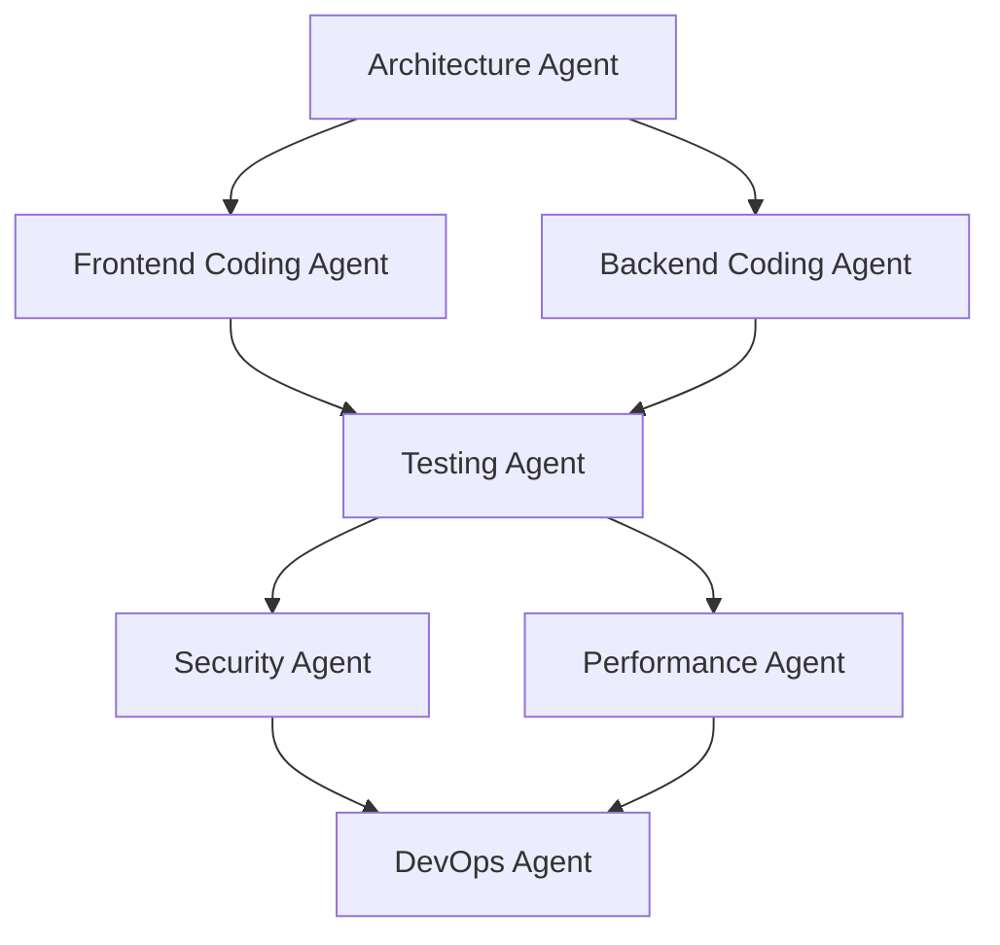

# Chapter 11: 에이전트 협업 패턴

## 개요

멀티 에이전트 시스템에서 가장 중요한 것은 에이전트 간 효과적인 협업 설계입니다. 단일 에이전트가 모든 작업을 처리하던 시대에서, 여러 전문 에이전트가 협업하는 시스템으로 진화하면서, 에이전트 간 작업을 어떻게 분배하고 조율할 것인가가 핵심 과제가 되었습니다.

이 장에서는 실전에서 검증된 4가지 협업 패턴을 cookbook 스타일로 제시합니다. 각 레시피는 독립적으로 읽을 수 있으며, 해결하려는 문제, 구체적인 해결 방법, 실제 코드 예시, 작동 원리, 그리고 응용 방법을 포함합니다.

### 이 장에서 다루는 내용

- **Recipe 11.1: 순차 실행 패턴 (Sequential)** - 작업을 단계별로 이어가는 방법
- **Recipe 11.2: 병렬 실행 패턴 (Parallel)** - 여러 작업을 동시에 수행하는 방법
- **Recipe 11.3: 핸드오프 패턴 (Handoff)** - 상황에 따라 전문가에게 작업을 넘기는 방법
- **Recipe 11.4: 오케스트레이터 패턴 (Orchestrator)** - 중앙에서 전체 흐름을 조율하는 방법

---

## Recipe 11.1: 순차 실행 패턴 (Sequential)

### 문제 (Problem)

풀스택 애플리케이션을 구축할 때, 각 단계가 이전 단계의 출력에 의존하는 경우가 많습니다. 예를 들어:

- 코딩 에이전트는 아키텍처 에이전트의 설계를 받아야 구현 가능
- 테스팅 에이전트는 코드가 작성된 후에 테스트 작성 가능
- 보안 에이전트는 코드가 완성되어야 취약점 스캐닝 가능
- DevOps 에이전트는 모든 검증이 끝나야 배포 가능

각 에이전트가 제 역할을 하되, 올바른 순서로 실행되도록 보장해야 합니다.

### 해결책 (Solution)

순차 실행 패턴은 **파이프라인 방식**으로 에이전트를 연결합니다. 각 에이전트의 출력이 다음 에이전트의 입력이 되며, 전체 흐름은 하나의 선형 체인을 형성합니다.

#### 단계별 구현 방법

**1단계: 작업 흐름 정의**

```
요구사항 → Architecture → Coding → Testing → Security → DevOps → 배포
```

**2단계: 공유 상태 (Shared State) 설계**

모든 에이전트가 읽고 쓸 수 있는 상태 객체를 정의합니다.

```typescript
// 공유 상태 정의
interface AppState {
  requirements: string;           // 초기 요구사항
  architecture?: {                // Architecture Agent 출력
    stack: string[];
    database: string;
    components: Record<string, string[]>;
  };
  code?: {                        // Coding Agent 출력
    files: Map<string, string>;
    dependencies: string[];
  };
  tests?: {                       // Testing Agent 출력
    coverage: number;
    results: TestResult[];
  };
  securityReport?: {              // Security Agent 출력
    vulnerabilities: Vulnerability[];
    recommendations: string[];
  };
  deploymentConfig?: {            // DevOps Agent 출력
    target: string;
    healthCheckUrl: string;
  };
}
```

**3단계: 각 에이전트를 함수로 구현**

각 에이전트는 상태를 받아 업데이트하는 순수 함수입니다.

```typescript
// Architecture Agent
async function architectureAgent(state: AppState): Promise<AppState> {
  const { requirements } = state;

  console.log('🏗️ Architecture Agent: Designing system...');

  const architecture = {
    stack: ['Node.js', 'TypeScript', 'PostgreSQL', 'Redis'],
    database: 'postgresql',
    components: {
      domain: ['User', 'Todo'],
      application: ['UserService', 'TodoService'],
      infrastructure: ['UserRepository', 'TodoRepository'],
      presentation: ['UserController', 'TodoController']
    }
  };

  return { ...state, architecture };
}

// Coding Agent
async function codingAgent(state: AppState): Promise<AppState> {
  const { architecture } = state;

  if (!architecture) {
    throw new Error('Architecture not defined');
  }

  console.log('💻 Coding Agent: Implementing components...');

  const files = new Map<string, string>();

  // 도메인 레이어 생성
  files.set('src/domain/todo.entity.ts', `
export class Todo {
  constructor(
    public readonly id: string,
    public readonly userId: string,
    public title: string,
    public completed: boolean,
    public readonly createdAt: Date
  ) {}

  static create(userId: string, title: string): Todo {
    return new Todo(
      crypto.randomUUID(),
      userId,
      title,
      false,
      new Date()
    );
  }

  toggle(): void {
    this.completed = !this.completed;
  }
}
  `);

  // 애플리케이션 레이어 생성
  files.set('src/application/todo.service.ts', `
export class TodoService {
  constructor(private repository: TodoRepository) {}

  async create(userId: string, title: string): Promise<Todo> {
    const todo = Todo.create(userId, title);
    await this.repository.save(todo);
    return todo;
  }

  async findByUserId(userId: string): Promise<Todo[]> {
    return this.repository.findByUserId(userId);
  }

  async toggle(id: string): Promise<Todo> {
    const todo = await this.repository.findById(id);
    if (!todo) throw new Error('Todo not found');
    todo.toggle();
    await this.repository.save(todo);
    return todo;
  }
}
  `);

  const code = {
    files,
    dependencies: ['express', 'pg', 'redis', 'joi']
  };

  return { ...state, code };
}

// Testing Agent
async function testingAgent(state: AppState): Promise<AppState> {
  const { code } = state;

  if (!code) {
    throw new Error('Code not generated');
  }

  console.log('🧪 Testing Agent: Writing tests...');

  // 테스트 파일 생성
  const testFile = `
describe('TodoService', () => {
  it('should create todo', async () => {
    const service = new TodoService(mockRepository);
    const todo = await service.create('user-1', 'Buy milk');
    expect(todo.title).toBe('Buy milk');
    expect(todo.completed).toBe(false);
  });

  it('should toggle todo completion', async () => {
    const service = new TodoService(mockRepository);
    const todo = await service.toggle('todo-1');
    expect(todo.completed).toBe(true);
  });
});
  `;

  code.files.set('src/application/todo.service.test.ts', testFile);

  const tests = {
    coverage: 92.5,
    results: [
      { suite: 'TodoService', passed: 2, failed: 0 }
    ]
  };

  return { ...state, tests };
}

// Security Agent
async function securityAgent(state: AppState): Promise<AppState> {
  const { code } = state;

  if (!code) {
    throw new Error('Code not generated');
  }

  console.log('🔒 Security Agent: Scanning for vulnerabilities...');

  const vulnerabilities: Vulnerability[] = [];
  const recommendations: string[] = [
    'Add input validation with Joi schemas',
    'Use parameterized queries to prevent SQL injection',
    'Implement rate limiting for API endpoints',
    'Add CORS whitelist configuration'
  ];

  const securityReport = {
    vulnerabilities,
    recommendations
  };

  return { ...state, securityReport };
}

// DevOps Agent
async function devopsAgent(state: AppState): Promise<AppState> {
  const { tests, securityReport } = state;

  if (!tests || !securityReport) {
    throw new Error('Prerequisites not met');
  }

  console.log('🚀 DevOps Agent: Preparing deployment...');

  const deploymentConfig = {
    target: 'AWS ECS Fargate',
    healthCheckUrl: 'https://api.example.com/health'
  };

  return { ...state, deploymentConfig };
}
```

**4단계: 순차 실행 파이프라인 구성**

```typescript
async function sequentialPipeline(requirements: string): Promise<AppState> {
  let state: AppState = { requirements };

  // 순차적으로 각 에이전트 실행
  state = await architectureAgent(state);
  state = await codingAgent(state);
  state = await testingAgent(state);
  state = await securityAgent(state);
  state = await devopsAgent(state);

  return state;
}

// 실행
const result = await sequentialPipeline(
  'Build a REST API for todo management with user authentication'
);

console.log('✅ Pipeline completed');
console.log(`Generated ${result.code?.files.size} files`);
console.log(`Test coverage: ${result.tests?.coverage}%`);
console.log(`Security recommendations: ${result.securityReport?.recommendations.length}`);
```

### 코드 예시 (Code)

LangGraph를 사용한 프로덕션급 구현:

```python
from langgraph.graph import StateGraph, END
from typing import TypedDict

# 상태 정의
class AppState(TypedDict):
    requirements: str
    architecture: dict
    code: dict
    tests: dict
    security_report: dict
    deployment_config: dict

# 에이전트 함수들
def architecture_agent(state: AppState) -> AppState:
    print("🏗️ Architecture Agent: Designing system...")
    state["architecture"] = {
        "stack": ["Node.js", "TypeScript", "PostgreSQL"],
        "database": "postgresql",
        "components": ["domain", "application", "infrastructure", "presentation"]
    }
    return state

def coding_agent(state: AppState) -> AppState:
    print("💻 Coding Agent: Implementing components...")
    state["code"] = {
        "files": ["todo.entity.ts", "todo.service.ts", "todo.controller.ts"],
        "dependencies": ["express", "pg", "joi"]
    }
    return state

def testing_agent(state: AppState) -> AppState:
    print("🧪 Testing Agent: Writing tests...")
    state["tests"] = {
        "coverage": 92.5,
        "results": [{"suite": "TodoService", "passed": 2, "failed": 0}]
    }
    return state

def security_agent(state: AppState) -> AppState:
    print("🔒 Security Agent: Scanning...")
    state["security_report"] = {
        "vulnerabilities": [],
        "recommendations": ["Add input validation", "Use parameterized queries"]
    }
    return state

def devops_agent(state: AppState) -> AppState:
    print("🚀 DevOps Agent: Preparing deployment...")
    state["deployment_config"] = {
        "target": "AWS ECS",
        "health_check": "https://api.example.com/health"
    }
    return state

# 그래프 생성
workflow = StateGraph(AppState)

# 노드 추가 (각 노드 = 에이전트)
workflow.add_node("architect", architecture_agent)
workflow.add_node("coder", coding_agent)
workflow.add_node("tester", testing_agent)
workflow.add_node("security", security_agent)
workflow.add_node("devops", devops_agent)

# 순차 실행 엣지 추가
workflow.add_edge("architect", "coder")
workflow.add_edge("coder", "tester")
workflow.add_edge("tester", "security")
workflow.add_edge("security", "devops")
workflow.add_edge("devops", END)

# 시작점 설정
workflow.set_entry_point("architect")

# 컴파일 및 실행
app = workflow.compile()
result = app.invoke({
    "requirements": "Build a REST API for todo management"
})

print(f"✅ Pipeline completed")
print(f"Generated files: {result['code']['files']}")
print(f"Test coverage: {result['tests']['coverage']}%")
```

### 설명 (Explanation)

순차 실행 패턴의 핵심 원리:

1. **상태 중심 설계 (State-Centric Design)**
   - 모든 에이전트는 동일한 상태 객체를 공유
   - 각 에이전트는 상태를 읽고, 자신의 출력을 상태에 추가
   - 불변성 유지 (각 단계는 새 상태 객체 반환)

2. **의존성 순서 보장 (Dependency Order)**
   - 각 에이전트는 이전 에이전트의 출력에 의존
   - 순서가 바뀌면 실패 (예: 코드 없이 테스트 불가)
   - 명시적 의존성 체크 (`if (!code) throw Error`)

3. **선형 데이터 플로우 (Linear Data Flow)**
   - 데이터는 한 방향으로만 흐름 (A → B → C → D → E)
   - 역방향 피드백 없음 (간단하지만 제한적)
   - 디버깅 용이 (각 단계의 출력 추적 가능)

4. **에러 전파 (Error Propagation)**
   - 한 에이전트 실패 시 전체 파이프라인 중단
   - 명확한 실패 지점 식별
   - 재시도는 실패한 단계부터 가능

### 변형 (Variations)

#### Variation 1: 조건부 분기 (Conditional Branching)

일부 단계는 조건에 따라 스킵할 수 있습니다.

```typescript
async function conditionalPipeline(requirements: string): Promise<AppState> {
  let state: AppState = { requirements };

  state = await architectureAgent(state);
  state = await codingAgent(state);
  state = await testingAgent(state);

  // 테스트 커버리지가 90% 이상일 때만 보안 스캔
  if (state.tests && state.tests.coverage >= 90) {
    state = await securityAgent(state);
  } else {
    console.log('⚠️ Skipping security scan (low test coverage)');
  }

  state = await devopsAgent(state);

  return state;
}
```

#### Variation 2: 재시도 메커니즘 (Retry Mechanism)

실패한 에이전트를 자동으로 재시도합니다.

```typescript
async function executeWithRetry<T>(
  agent: (state: T) => Promise<T>,
  state: T,
  maxRetries: number = 3
): Promise<T> {
  for (let attempt = 1; attempt <= maxRetries; attempt++) {
    try {
      return await agent(state);
    } catch (error) {
      console.warn(`Attempt ${attempt} failed:`, error.message);

      if (attempt === maxRetries) {
        throw new Error(`Agent failed after ${maxRetries} attempts`);
      }

      // 지수 백오프
      await new Promise(resolve => setTimeout(resolve, 1000 * Math.pow(2, attempt)));
    }
  }

  throw new Error('Unreachable');
}

// 사용
async function robustPipeline(requirements: string): Promise<AppState> {
  let state: AppState = { requirements };

  state = await executeWithRetry(architectureAgent, state);
  state = await executeWithRetry(codingAgent, state);
  state = await executeWithRetry(testingAgent, state);
  state = await executeWithRetry(securityAgent, state);
  state = await executeWithRetry(devopsAgent, state);

  return state;
}
```

#### Variation 3: 중간 결과 저장 (Checkpointing)

각 단계의 출력을 저장하여, 실패 시 처음부터 다시 시작하지 않습니다.

```typescript
import fs from 'fs/promises';

async function checkpointedPipeline(requirements: string): Promise<AppState> {
  const checkpointFile = './pipeline-checkpoint.json';

  // 이전 체크포인트 로드
  let state: AppState = { requirements };
  try {
    const saved = await fs.readFile(checkpointFile, 'utf-8');
    state = JSON.parse(saved);
    console.log('📂 Resuming from checkpoint');
  } catch {
    console.log('🆕 Starting fresh pipeline');
  }

  // 각 단계 실행 및 저장
  if (!state.architecture) {
    state = await architectureAgent(state);
    await fs.writeFile(checkpointFile, JSON.stringify(state, null, 2));
  }

  if (!state.code) {
    state = await codingAgent(state);
    await fs.writeFile(checkpointFile, JSON.stringify(state, null, 2));
  }

  if (!state.tests) {
    state = await testingAgent(state);
    await fs.writeFile(checkpointFile, JSON.stringify(state, null, 2));
  }

  if (!state.securityReport) {
    state = await securityAgent(state);
    await fs.writeFile(checkpointFile, JSON.stringify(state, null, 2));
  }

  if (!state.deploymentConfig) {
    state = await devopsAgent(state);
    await fs.writeFile(checkpointFile, JSON.stringify(state, null, 2));
  }

  // 완료 시 체크포인트 삭제
  await fs.unlink(checkpointFile);

  return state;
}
```

---

## Recipe 11.2: 병렬 실행 패턴 (Parallel)

### 문제 (Problem)

순차 실행 패턴은 간단하지만, 시간이 오래 걸립니다. 예를 들어:

- Frontend 코딩과 Backend 코딩은 아키텍처만 정해지면 동시에 진행 가능
- 여러 모듈의 테스트는 서로 독립적이므로 병렬 실행 가능
- 보안 스캔과 성능 테스트는 동시에 수행 가능

**순차 실행 시간**:
```
Architecture (5분) → Frontend (15분) → Backend (15분) → Test (10분) = 총 45분
```

**병렬 실행 시간**:
```
Architecture (5분) → [Frontend (15분) | Backend (15분)] → Test (10분) = 총 30분
```

33% 시간 단축 가능합니다.

### 해결책 (Solution)

병렬 실행 패턴은 **독립적인 작업을 동시에 실행**합니다. DAG (Directed Acyclic Graph)로 의존성을 표현하고, 의존성이 없는 노드는 병렬로 실행합니다.

#### 단계별 구현 방법

**1단계: 작업 의존성 그래프 설계**



**2단계: 병렬 실행 엔진 구현**

```typescript
interface TaskNode {
  id: string;
  agent: (state: AppState) => Promise<AppState>;
  dependencies: string[];  // 이 노드가 의존하는 다른 노드 ID
}

async function parallelExecutor(
  nodes: TaskNode[],
  initialState: AppState
): Promise<AppState> {
  let state = initialState;
  const completed = new Set<string>();
  const nodeMap = new Map(nodes.map(n => [n.id, n]));

  while (completed.size < nodes.length) {
    // 실행 가능한 노드 찾기 (모든 의존성이 완료된 노드)
    const ready = nodes.filter(node =>
      !completed.has(node.id) &&
      node.dependencies.every(dep => completed.has(dep))
    );

    if (ready.length === 0) {
      throw new Error('Deadlock detected: no tasks can proceed');
    }

    console.log(`🔄 Running ${ready.length} tasks in parallel: ${ready.map(n => n.id).join(', ')}`);

    // 병렬 실행
    const results = await Promise.all(
      ready.map(node => node.agent(state))
    );

    // 결과 병합 (각 에이전트가 상태의 다른 부분을 수정)
    for (const result of results) {
      state = { ...state, ...result };
    }

    // 완료 표시
    ready.forEach(node => completed.add(node.id));
  }

  return state;
}
```

**3단계: 작업 노드 정의**

```typescript
const tasks: TaskNode[] = [
  {
    id: 'architecture',
    agent: architectureAgent,
    dependencies: []
  },
  {
    id: 'frontend',
    agent: async (state) => {
      console.log('🎨 Frontend Coding Agent: Building UI...');
      return {
        ...state,
        frontend: {
          files: ['App.tsx', 'TodoList.tsx', 'TodoItem.tsx'],
          framework: 'React'
        }
      };
    },
    dependencies: ['architecture']
  },
  {
    id: 'backend',
    agent: async (state) => {
      console.log('⚙️ Backend Coding Agent: Building API...');
      return {
        ...state,
        backend: {
          files: ['todo.controller.ts', 'todo.service.ts'],
          framework: 'Express'
        }
      };
    },
    dependencies: ['architecture']
  },
  {
    id: 'testing',
    agent: async (state) => {
      console.log('🧪 Testing Agent: Running tests...');
      return {
        ...state,
        tests: {
          coverage: 95,
          passed: 48,
          failed: 0
        }
      };
    },
    dependencies: ['frontend', 'backend']
  },
  {
    id: 'security',
    agent: async (state) => {
      console.log('🔒 Security Agent: Scanning...');
      await new Promise(resolve => setTimeout(resolve, 2000)); // 시뮬레이션
      return {
        ...state,
        security: { vulnerabilities: 0 }
      };
    },
    dependencies: ['testing']
  },
  {
    id: 'performance',
    agent: async (state) => {
      console.log('⚡ Performance Agent: Benchmarking...');
      await new Promise(resolve => setTimeout(resolve, 2000)); // 시뮬레이션
      return {
        ...state,
        performance: { responseTime: 125 }
      };
    },
    dependencies: ['testing']
  },
  {
    id: 'devops',
    agent: async (state) => {
      console.log('🚀 DevOps Agent: Deploying...');
      return {
        ...state,
        deployment: { status: 'success' }
      };
    },
    dependencies: ['security', 'performance']
  }
];
```

**4단계: 실행**

```typescript
const result = await parallelExecutor(tasks, {
  requirements: 'Build a todo app with React frontend and Node.js backend'
});

console.log('✅ All tasks completed');
console.log(`Frontend files: ${result.frontend?.files.join(', ')}`);
console.log(`Backend files: ${result.backend?.files.join(', ')}`);
console.log(`Test coverage: ${result.tests?.coverage}%`);
```

### 코드 예시 (Code)

LangGraph를 사용한 병렬 실행 구현:

```python
from langgraph.graph import StateGraph, END
from typing import TypedDict, Annotated
import operator

# 상태 정의 (병합 가능하도록 Annotated 사용)
class AppState(TypedDict):
    requirements: str
    architecture: dict
    frontend: Annotated[dict, operator.add]
    backend: Annotated[dict, operator.add]
    tests: dict
    security: dict
    performance: dict
    deployment: dict

# 에이전트 함수들
def architecture_agent(state: AppState) -> dict:
    print("🏗️ Architecture Agent")
    return {"architecture": {"stack": ["React", "Node.js", "PostgreSQL"]}}

def frontend_agent(state: AppState) -> dict:
    print("🎨 Frontend Coding Agent")
    import time
    time.sleep(2)  # 시뮬레이션
    return {"frontend": {"files": ["App.tsx", "TodoList.tsx"]}}

def backend_agent(state: AppState) -> dict:
    print("⚙️ Backend Coding Agent")
    import time
    time.sleep(2)  # 시뮬레이션
    return {"backend": {"files": ["todo.controller.ts", "todo.service.ts"]}}

def testing_agent(state: AppState) -> dict:
    print("🧪 Testing Agent")
    return {"tests": {"coverage": 95, "passed": 48}}

def security_agent(state: AppState) -> dict:
    print("🔒 Security Agent")
    import time
    time.sleep(1)
    return {"security": {"vulnerabilities": 0}}

def performance_agent(state: AppState) -> dict:
    print("⚡ Performance Agent")
    import time
    time.sleep(1)
    return {"performance": {"responseTime": 125}}

def devops_agent(state: AppState) -> dict:
    print("🚀 DevOps Agent")
    return {"deployment": {"status": "success"}}

# 그래프 생성
workflow = StateGraph(AppState)

# 노드 추가
workflow.add_node("architecture", architecture_agent)
workflow.add_node("frontend", frontend_agent)
workflow.add_node("backend", backend_agent)
workflow.add_node("testing", testing_agent)
workflow.add_node("security", security_agent)
workflow.add_node("performance", performance_agent)
workflow.add_node("devops", devops_agent)

# 엣지 추가 (의존성 정의)
workflow.add_edge("architecture", "frontend")
workflow.add_edge("architecture", "backend")
workflow.add_edge("frontend", "testing")
workflow.add_edge("backend", "testing")
workflow.add_edge("testing", "security")
workflow.add_edge("testing", "performance")
workflow.add_edge("security", "devops")
workflow.add_edge("performance", "devops")
workflow.add_edge("devops", END)

workflow.set_entry_point("architecture")

# 실행
app = workflow.compile()
result = app.invoke({"requirements": "Build a todo app"})

print("✅ Completed")
print(f"Frontend: {result['frontend']}")
print(f"Backend: {result['backend']}")
```

### 설명 (Explanation)

병렬 실행 패턴의 핵심 원리:

1. **의존성 기반 스케줄링 (Dependency-Based Scheduling)**
   - 각 작업의 의존성을 명시적으로 선언
   - 의존성이 충족된 작업만 실행 큐에 추가
   - 동적으로 다음 실행 가능한 작업 결정

2. **Promise.all을 통한 병렬 실행**
   - JavaScript의 비동기 특성 활용
   - 동시에 여러 에이전트 실행
   - 모든 에이전트가 완료될 때까지 대기

3. **상태 병합 전략 (State Merging)**
   - 각 에이전트는 상태의 독립적인 부분을 수정
   - 충돌 방지 (서로 다른 키 업데이트)
   - 병합 시 스프레드 연산자로 결합

4. **데드락 감지 (Deadlock Detection)**
   - 실행 가능한 작업이 없으면 데드락
   - 순환 의존성이 있으면 무한 대기
   - 조기 감지 및 에러 발생

### 변형 (Variations)

#### Variation 1: 제한된 동시성 (Concurrency Limit)

너무 많은 작업이 동시에 실행되면 리소스 고갈. 동시 실행 수를 제한합니다.

```typescript
async function parallelExecutorWithLimit(
  nodes: TaskNode[],
  initialState: AppState,
  maxConcurrency: number = 3
): Promise<AppState> {
  let state = initialState;
  const completed = new Set<string>();

  while (completed.size < nodes.length) {
    const ready = nodes.filter(node =>
      !completed.has(node.id) &&
      node.dependencies.every(dep => completed.has(dep))
    );

    if (ready.length === 0) {
      throw new Error('Deadlock detected');
    }

    // 최대 동시성 제한
    const batch = ready.slice(0, maxConcurrency);
    console.log(`🔄 Running ${batch.length} tasks (max: ${maxConcurrency})`);

    const results = await Promise.all(
      batch.map(node => node.agent(state))
    );

    for (const result of results) {
      state = { ...state, ...result };
    }

    batch.forEach(node => completed.add(node.id));
  }

  return state;
}
```

#### Variation 2: 우선순위 기반 실행 (Priority-Based Execution)

중요한 작업을 먼저 실행합니다.

```typescript
interface PriorityTaskNode extends TaskNode {
  priority: number;  // 높을수록 우선
}

async function priorityParallelExecutor(
  nodes: PriorityTaskNode[],
  initialState: AppState
): Promise<AppState> {
  let state = initialState;
  const completed = new Set<string>();

  while (completed.size < nodes.length) {
    const ready = nodes
      .filter(node =>
        !completed.has(node.id) &&
        node.dependencies.every(dep => completed.has(dep))
      )
      .sort((a, b) => b.priority - a.priority);  // 우선순위 내림차순

    if (ready.length === 0) break;

    console.log(`🔄 Running: ${ready.map(n => `${n.id}(P${n.priority})`).join(', ')}`);

    const results = await Promise.all(
      ready.map(node => node.agent(state))
    );

    for (const result of results) {
      state = { ...state, ...result };
    }

    ready.forEach(node => completed.add(node.id));
  }

  return state;
}

// 사용
const priorityTasks: PriorityTaskNode[] = [
  { id: 'architecture', agent: architectureAgent, dependencies: [], priority: 100 },
  { id: 'frontend', agent: frontendAgent, dependencies: ['architecture'], priority: 80 },
  { id: 'backend', agent: backendAgent, dependencies: ['architecture'], priority: 90 },  // 백엔드 우선
  { id: 'testing', agent: testingAgent, dependencies: ['frontend', 'backend'], priority: 70 }
];
```

#### Variation 3: 동적 작업 추가 (Dynamic Task Addition)

실행 중에 새로운 작업을 추가할 수 있습니다.

```typescript
class DynamicParallelExecutor {
  private nodes: TaskNode[] = [];
  private completed = new Set<string>();
  private state: AppState;

  constructor(initialState: AppState) {
    this.state = initialState;
  }

  addTask(node: TaskNode): void {
    this.nodes.push(node);
  }

  async execute(): Promise<AppState> {
    while (this.completed.size < this.nodes.length) {
      const ready = this.nodes.filter(node =>
        !this.completed.has(node.id) &&
        node.dependencies.every(dep => this.completed.has(dep))
      );

      if (ready.length === 0 && this.completed.size < this.nodes.length) {
        // 대기 중 (새 작업 추가 가능)
        await new Promise(resolve => setTimeout(resolve, 1000));
        continue;
      }

      const results = await Promise.all(
        ready.map(node => node.agent(this.state))
      );

      for (const result of results) {
        this.state = { ...this.state, ...result };
      }

      ready.forEach(node => this.completed.add(node.id));
    }

    return this.state;
  }
}

// 사용
const executor = new DynamicParallelExecutor({ requirements: 'Build app' });

executor.addTask({ id: 'arch', agent: architectureAgent, dependencies: [] });
executor.addTask({ id: 'code', agent: codingAgent, dependencies: ['arch'] });

// 실행 중에 새 작업 추가 가능
setTimeout(() => {
  executor.addTask({ id: 'extra', agent: extraAgent, dependencies: ['code'] });
}, 5000);

const result = await executor.execute();
```

---

## Recipe 11.3: 핸드오프 패턴 (Handoff)

### 문제 (Problem)

복잡한 요청을 처리하다 보면, 하나의 에이전트가 모든 것을 처리하기 어려운 상황이 발생합니다:

- 일반 질문 → FAQ Agent
- 기술적 문제 → Technical Support Agent
- 버그 리포트 → Engineering Agent
- 결제 문제 → Billing Agent

고객이 "로그인이 안 돼요"라고 하면, 먼저 FAQ를 확인하고, 해결 안 되면 기술 지원팀에 넘기고, 그래도 안 되면 엔지니어링팀으로 에스컬레이션해야 합니다.

### 해결책 (Solution)

핸드오프 패턴은 **상황에 따라 전문 에이전트에게 작업을 넘깁니다**. 각 에이전트는 자신이 처리할 수 있는지 판단하고, 필요하면 다른 에이전트에게 핸드오프합니다.

#### 단계별 구현 방법

**1단계: 에이전트 인터페이스 정의**

```typescript
interface HandoffAgent {
  name: string;
  canHandle: (request: UserRequest) => Promise<boolean>;
  handle: (request: UserRequest) => Promise<HandoffResult>;
}

interface UserRequest {
  userId: string;
  message: string;
  context: Record<string, any>;
}

interface HandoffResult {
  handled: boolean;
  response?: string;
  handoffTo?: string;  // 다음 에이전트 이름
  metadata?: Record<string, any>;
}
```

**2단계: 각 전문 에이전트 구현**

```typescript
// FAQ Agent: 간단한 질문 처리
const faqAgent: HandoffAgent = {
  name: 'FAQ',

  async canHandle(request: UserRequest): Promise<boolean> {
    const faqKeywords = ['password reset', 'how to', 'what is', 'where is'];
    return faqKeywords.some(kw => request.message.toLowerCase().includes(kw));
  },

  async handle(request: UserRequest): Promise<HandoffResult> {
    console.log('📚 FAQ Agent: Checking knowledge base...');

    // 간단한 FAQ 검색
    if (request.message.includes('password reset')) {
      return {
        handled: true,
        response: 'To reset your password, go to Settings > Security > Reset Password.'
      };
    }

    // 처리 불가능 → Technical Support로 핸드오프
    return {
      handled: false,
      handoffTo: 'Technical Support',
      metadata: { reason: 'FAQ not found' }
    };
  }
};

// Technical Support Agent: 기술 문제 해결
const technicalSupportAgent: HandoffAgent = {
  name: 'Technical Support',

  async canHandle(request: UserRequest): Promise<boolean> {
    const techKeywords = ['error', 'bug', 'not working', 'crash', 'slow'];
    return techKeywords.some(kw => request.message.toLowerCase().includes(kw));
  },

  async handle(request: UserRequest): Promise<HandoffResult> {
    console.log('🔧 Technical Support Agent: Diagnosing issue...');

    // 로그 분석, 진단 수행
    const diagnostics = await runDiagnostics(request.userId);

    if (diagnostics.canFix) {
      return {
        handled: true,
        response: `Issue resolved: ${diagnostics.solution}`
      };
    }

    // 심각한 버그 → Engineering Team으로 에스컬레이션
    return {
      handled: false,
      handoffTo: 'Engineering',
      metadata: {
        diagnostics,
        severity: 'high'
      }
    };
  }
};

// Engineering Agent: 코드 수정 필요한 버그 처리
const engineeringAgent: HandoffAgent = {
  name: 'Engineering',

  async canHandle(request: UserRequest): Promise<boolean> {
    return request.context.severity === 'high';
  },

  async handle(request: UserRequest): Promise<HandoffResult> {
    console.log('👨‍💻 Engineering Agent: Creating bug ticket...');

    const ticket = await createJiraTicket({
      title: `User reported: ${request.message}`,
      severity: request.context.severity,
      userId: request.userId,
      diagnostics: request.context.diagnostics
    });

    return {
      handled: true,
      response: `Bug ticket created: ${ticket.id}. Our engineers will investigate.`,
      metadata: { ticketId: ticket.id }
    };
  }
};

async function runDiagnostics(userId: string) {
  // 시뮬레이션
  return { canFix: false, solution: null };
}

async function createJiraTicket(data: any) {
  // 시뮬레이션
  return { id: 'TICKET-1234' };
}
```

**3단계: 핸드오프 조율자 (Handoff Coordinator) 구현**

```typescript
class HandoffCoordinator {
  private agents: Map<string, HandoffAgent> = new Map();

  registerAgent(agent: HandoffAgent): void {
    this.agents.set(agent.name, agent);
  }

  async route(request: UserRequest, startAgent: string = 'FAQ'): Promise<string> {
    let currentAgentName = startAgent;
    let hops = 0;
    const maxHops = 10;  // 무한 루프 방지

    const trail: string[] = [currentAgentName];

    while (hops < maxHops) {
      const agent = this.agents.get(currentAgentName);

      if (!agent) {
        throw new Error(`Agent not found: ${currentAgentName}`);
      }

      console.log(`\n📍 Current agent: ${agent.name}`);

      // 에이전트가 처리할 수 있는지 확인
      const canHandle = await agent.canHandle(request);

      if (!canHandle) {
        console.log(`❌ ${agent.name} cannot handle this request`);
        // TODO: 다음 에이전트 결정 로직
        break;
      }

      // 처리 시도
      const result = await agent.handle(request);

      if (result.handled) {
        console.log(`✅ ${agent.name} handled the request`);
        console.log(`Trail: ${trail.join(' → ')}`);
        return result.response!;
      }

      // 핸드오프
      if (result.handoffTo) {
        console.log(`🔄 Handing off to: ${result.handoffTo}`);
        currentAgentName = result.handoffTo;
        trail.push(currentAgentName);

        // 컨텍스트 업데이트
        request.context = { ...request.context, ...result.metadata };

        hops++;
      } else {
        console.log(`⚠️ ${agent.name} could not handle and has no handoff target`);
        break;
      }
    }

    if (hops >= maxHops) {
      throw new Error('Max handoff hops exceeded');
    }

    return 'Sorry, we could not resolve your issue. Please contact support@example.com';
  }
}
```

**4단계: 사용**

```typescript
const coordinator = new HandoffCoordinator();
coordinator.registerAgent(faqAgent);
coordinator.registerAgent(technicalSupportAgent);
coordinator.registerAgent(engineeringAgent);

// 시나리오 1: FAQ로 해결
const response1 = await coordinator.route({
  userId: 'user-123',
  message: 'How do I reset my password?',
  context: {}
});
console.log('Response:', response1);
// Output:
// 📍 Current agent: FAQ
// ✅ FAQ handled the request
// Trail: FAQ
// Response: To reset your password, go to Settings > Security > Reset Password.

// 시나리오 2: Technical Support로 핸드오프
const response2 = await coordinator.route({
  userId: 'user-456',
  message: 'I am getting an error when logging in',
  context: {}
});
console.log('Response:', response2);
// Output:
// 📍 Current agent: FAQ
// 🔄 Handing off to: Technical Support
// 📍 Current agent: Technical Support
// 🔄 Handing off to: Engineering
// 📍 Current agent: Engineering
// ✅ Engineering handled the request
// Trail: FAQ → Technical Support → Engineering
// Response: Bug ticket created: TICKET-1234. Our engineers will investigate.
```

### 코드 예시 (Code)

LangGraph의 조건부 엣지를 사용한 핸드오프 구현:

```python
from langgraph.graph import StateGraph, END
from typing import TypedDict, Literal

class SupportState(TypedDict):
    user_message: str
    response: str
    handled: bool
    trail: list[str]

def faq_agent(state: SupportState) -> SupportState:
    print("📚 FAQ Agent")
    state["trail"].append("FAQ")

    if "password" in state["user_message"].lower():
        state["response"] = "Reset password: Settings > Security"
        state["handled"] = True

    return state

def tech_support_agent(state: SupportState) -> SupportState:
    print("🔧 Technical Support Agent")
    state["trail"].append("Tech Support")

    if "error" in state["user_message"].lower():
        # 간단한 문제는 해결
        state["response"] = "Try clearing cache and cookies"
        state["handled"] = True

    return state

def engineering_agent(state: SupportState) -> SupportState:
    print("👨‍💻 Engineering Agent")
    state["trail"].append("Engineering")

    state["response"] = "Bug ticket created: TICKET-1234"
    state["handled"] = True

    return state

def route_request(state: SupportState) -> Literal["faq", "tech_support", "engineering", "end"]:
    """현재 상태에 따라 다음 에이전트 결정"""
    if state["handled"]:
        return "end"

    trail = state["trail"]

    if len(trail) == 0:
        return "faq"
    elif "FAQ" in trail and not state["handled"]:
        return "tech_support"
    elif "Tech Support" in trail and not state["handled"]:
        return "engineering"
    else:
        return "end"

# 그래프 생성
workflow = StateGraph(SupportState)

workflow.add_node("faq", faq_agent)
workflow.add_node("tech_support", tech_support_agent)
workflow.add_node("engineering", engineering_agent)

# 조건부 라우팅
workflow.add_conditional_edges(
    "faq",
    route_request,
    {
        "tech_support": "tech_support",
        "end": END
    }
)

workflow.add_conditional_edges(
    "tech_support",
    route_request,
    {
        "engineering": "engineering",
        "end": END
    }
)

workflow.add_edge("engineering", END)

workflow.set_entry_point("faq")

# 실행
app = workflow.compile()
result = app.invoke({
    "user_message": "I'm getting a login error",
    "response": "",
    "handled": False,
    "trail": []
})

print(f"Trail: {' → '.join(result['trail'])}")
print(f"Response: {result['response']}")
```

### 설명 (Explanation)

핸드오프 패턴의 핵심 원리:

1. **에이전트 자율성 (Agent Autonomy)**
   - 각 에이전트는 자신이 처리할 수 있는지 스스로 판단
   - `canHandle()` 메서드로 능력 범위 명시
   - 명시적 핸드오프 대상 지정

2. **컨텍스트 전달 (Context Propagation)**
   - 핸드오프 시 이전 에이전트의 작업 결과 전달
   - `metadata` 필드로 추가 정보 전달
   - 다음 에이전트가 이전 작업을 반복하지 않도록

3. **순환 방지 (Cycle Prevention)**
   - `maxHops` 제한으로 무한 루프 방지
   - 에이전트 방문 기록 (`trail`) 추적
   - 같은 에이전트 재방문 감지 가능

4. **우아한 실패 (Graceful Failure)**
   - 모든 에이전트가 실패해도 시스템 크래시 없음
   - 기본 응답 제공
   - Human-in-the-Loop로 에스컬레이션

### 변형 (Variations)

#### Variation 1: 지능형 라우팅 (Intelligent Routing)

LLM을 사용해 다음 에이전트를 결정합니다.

```typescript
async function intelligentRoute(
  request: UserRequest,
  availableAgents: string[]
): Promise<string> {
  const prompt = `
Given the user's request: "${request.message}"
And available agents: ${availableAgents.join(', ')}

Which agent should handle this? Respond with only the agent name.
  `;

  const response = await llm.complete(prompt);
  const nextAgent = response.trim();

  if (!availableAgents.includes(nextAgent)) {
    throw new Error(`LLM returned invalid agent: ${nextAgent}`);
  }

  return nextAgent;
}

// 사용
class IntelligentHandoffCoordinator {
  async route(request: UserRequest): Promise<string> {
    let currentAgentName = 'FAQ';

    while (true) {
      const agent = this.agents.get(currentAgentName)!;
      const result = await agent.handle(request);

      if (result.handled) {
        return result.response!;
      }

      // LLM이 다음 에이전트 결정
      const availableAgents = Array.from(this.agents.keys());
      currentAgentName = await intelligentRoute(request, availableAgents);
    }
  }
}
```

#### Variation 2: 양방향 핸드오프 (Bidirectional Handoff)

에이전트가 이전 에이전트로 돌아갈 수 있습니다.

```typescript
interface BidirectionalHandoffResult extends HandoffResult {
  handoffBack?: boolean;  // 이전 에이전트로 돌아가기
}

class BidirectionalCoordinator {
  async route(request: UserRequest): Promise<string> {
    const trail: string[] = ['FAQ'];
    let currentIndex = 0;

    while (currentIndex >= 0 && currentIndex < trail.length) {
      const agentName = trail[currentIndex];
      const agent = this.agents.get(agentName)!;
      const result = await agent.handle(request) as BidirectionalHandoffResult;

      if (result.handled) {
        return result.response!;
      }

      if (result.handoffBack && currentIndex > 0) {
        // 이전 에이전트로 돌아가기
        currentIndex--;
      } else if (result.handoffTo) {
        // 다음 에이전트로 진행
        trail.push(result.handoffTo);
        currentIndex++;
      } else {
        break;
      }
    }

    return 'Could not resolve';
  }
}
```

#### Variation 3: 동시 다중 핸드오프 (Concurrent Multi-Handoff)

여러 에이전트에게 동시에 핸드오프하여 최상의 응답 선택.

```typescript
async function concurrentHandoff(
  request: UserRequest,
  agents: HandoffAgent[]
): Promise<string> {
  console.log(`🔀 Sending request to ${agents.length} agents simultaneously`);

  const results = await Promise.all(
    agents.map(async agent => {
      const canHandle = await agent.canHandle(request);
      if (!canHandle) return null;

      const result = await agent.handle(request);
      return result.handled ? result : null;
    })
  );

  const validResults = results.filter(r => r !== null);

  if (validResults.length === 0) {
    return 'No agent could handle this request';
  }

  // 가장 신뢰도 높은 응답 선택
  const best = validResults.reduce((prev, curr) => {
    const prevScore = prev.metadata?.confidence || 0;
    const currScore = curr.metadata?.confidence || 0;
    return currScore > prevScore ? curr : prev;
  });

  return best.response!;
}
```

---

## Recipe 11.4: 오케스트레이터 패턴 (Orchestrator)

### 문제 (Problem)

복잡한 멀티 에이전트 시스템에서:

- 각 에이전트가 언제 실행되어야 하는지 조율
- 전체 진행 상황 추적 및 모니터링
- 에러 발생 시 복구 또는 재시도
- 중간 결과를 다른 에이전트에게 전달

개별 에이전트는 자신의 작업에만 집중하고, **전체 흐름을 관리하는 중앙 조율자**가 필요합니다.

### 해결책 (Solution)

오케스트레이터 패턴은 **Manager Agent가 전체 워크플로우를 조율**합니다. 각 전문 에이전트는 도구처럼 사용되며, Manager가 어떤 에이전트를 언제 호출할지 결정합니다.

#### 단계별 구현 방법

**1단계: Manager Agent 설계**

```typescript
interface ManagerDecision {
  action: 'call_agent' | 'complete' | 'retry' | 'escalate';
  agent?: string;
  reasoning: string;
}

class ManagerAgent {
  private agents: Map<string, HandoffAgent> = new Map();
  private executionLog: string[] = [];

  registerAgent(agent: HandoffAgent): void {
    this.agents.set(agent.name, agent);
  }

  async orchestrate(userRequest: UserRequest): Promise<string> {
    console.log('🎯 Manager Agent: Analyzing request...');

    let state = {
      request: userRequest,
      completed: false,
      attempts: 0
    };

    while (!state.completed && state.attempts < 10) {
      // Manager가 다음 행동 결정
      const decision = await this.decide(state);

      console.log(`\n📋 Decision: ${decision.action}`);
      console.log(`💭 Reasoning: ${decision.reasoning}`);

      this.executionLog.push(`${decision.action}: ${decision.reasoning}`);

      switch (decision.action) {
        case 'call_agent':
          const result = await this.callAgent(decision.agent!, userRequest);
          if (result.handled) {
            state.completed = true;
            return result.response!;
          }
          break;

        case 'complete':
          state.completed = true;
          return 'Task completed successfully';

        case 'retry':
          console.log('🔄 Retrying previous step...');
          break;

        case 'escalate':
          return await this.escalateToHuman(userRequest);
      }

      state.attempts++;
    }

    throw new Error('Manager failed to complete task');
  }

  private async decide(state: any): Promise<ManagerDecision> {
    // LLM을 사용해 다음 행동 결정
    const prompt = `
You are a Manager Agent orchestrating a multi-agent system.

Current state:
- User request: "${state.request.message}"
- Attempts: ${state.attempts}
- Completed: ${state.completed}

Available agents: ${Array.from(this.agents.keys()).join(', ')}

What should you do next? Respond in JSON format:
{
  "action": "call_agent" | "complete" | "retry" | "escalate",
  "agent": "agent name if action is call_agent",
  "reasoning": "why you chose this action"
}
    `;

    const response = await llm.complete(prompt);
    return JSON.parse(response);
  }

  private async callAgent(
    agentName: string,
    request: UserRequest
  ): Promise<HandoffResult> {
    console.log(`📞 Calling ${agentName}...`);

    const agent = this.agents.get(agentName);
    if (!agent) {
      throw new Error(`Agent not found: ${agentName}`);
    }

    return await agent.handle(request);
  }

  private async escalateToHuman(request: UserRequest): Promise<string> {
    console.log('🚨 Escalating to human...');

    // 실제로는 Slack, 이메일 등으로 알림
    return 'Your request has been escalated to our support team.';
  }

  getExecutionLog(): string[] {
    return this.executionLog;
  }
}
```

**2단계: 전문 에이전트 등록**

```typescript
const manager = new ManagerAgent();

// 5개 전문 에이전트 등록
manager.registerAgent({
  name: 'Architecture',
  async canHandle(req) {
    return req.message.includes('design') || req.message.includes('architecture');
  },
  async handle(req) {
    console.log('🏗️ Architecture Agent: Designing system...');
    return {
      handled: true,
      response: 'System architecture designed: Microservices with PostgreSQL'
    };
  }
});

manager.registerAgent({
  name: 'Coding',
  async canHandle(req) {
    return req.message.includes('code') || req.message.includes('implement');
  },
  async handle(req) {
    console.log('💻 Coding Agent: Writing code...');
    return {
      handled: true,
      response: 'Code implementation completed: 15 files created'
    };
  }
});

manager.registerAgent({
  name: 'Testing',
  async canHandle(req) {
    return req.message.includes('test');
  },
  async handle(req) {
    console.log('🧪 Testing Agent: Running tests...');
    return {
      handled: true,
      response: 'All tests passed: 48/48, coverage 95%'
    };
  }
});

manager.registerAgent({
  name: 'Security',
  async canHandle(req) {
    return req.message.includes('security') || req.message.includes('vulnerability');
  },
  async handle(req) {
    console.log('🔒 Security Agent: Scanning...');
    return {
      handled: true,
      response: 'Security scan completed: 0 vulnerabilities found'
    };
  }
});

manager.registerAgent({
  name: 'DevOps',
  async canHandle(req) {
    return req.message.includes('deploy');
  },
  async handle(req) {
    console.log('🚀 DevOps Agent: Deploying...');
    return {
      handled: true,
      response: 'Deployment successful: https://app.example.com'
    };
  }
});
```

**3단계: 실행**

```typescript
const response = await manager.orchestrate({
  userId: 'user-123',
  message: 'Build and deploy a REST API for user management',
  context: {}
});

console.log('\n✅ Final response:', response);
console.log('\n📊 Execution log:');
manager.getExecutionLog().forEach((log, i) => {
  console.log(`  ${i + 1}. ${log}`);
});
```

**예상 출력**:
```
🎯 Manager Agent: Analyzing request...

📋 Decision: call_agent
💭 Reasoning: User wants to build an API, so I'll start with architecture design

📞 Calling Architecture...
🏗️ Architecture Agent: Designing system...

📋 Decision: call_agent
💭 Reasoning: Architecture is ready, now implement the code

📞 Calling Coding...
💻 Coding Agent: Writing code...

📋 Decision: call_agent
💭 Reasoning: Code is ready, run tests to ensure quality

📞 Calling Testing...
🧪 Testing Agent: Running tests...

📋 Decision: call_agent
💭 Reasoning: Tests passed, perform security scan

📞 Calling Security...
🔒 Security Agent: Scanning...

📋 Decision: call_agent
💭 Reasoning: All checks passed, deploy to production

📞 Calling DevOps...
🚀 DevOps Agent: Deploying...

✅ Final response: Deployment successful: https://app.example.com

📊 Execution log:
  1. call_agent: User wants to build an API, so I'll start with architecture design
  2. call_agent: Architecture is ready, now implement the code
  3. call_agent: Code is ready, run tests to ensure quality
  4. call_agent: Tests passed, perform security scan
  5. call_agent: All checks passed, deploy to production
```

### 코드 예시 (Code)

LangGraph의 ReAct (Reasoning + Acting) 패턴 구현:

```python
from langgraph.graph import StateGraph, END
from langgraph.prebuilt import ToolExecutor, ToolInvocation
from typing import TypedDict, List

class OrchestratorState(TypedDict):
    user_request: str
    agent_outputs: dict
    next_action: str
    reasoning: str
    completed: bool

# 에이전트들을 도구로 정의
def architecture_tool(request: str) -> str:
    print("🏗️ Architecture Agent")
    return "Architecture designed: Microservices + PostgreSQL"

def coding_tool(architecture: str) -> str:
    print("💻 Coding Agent")
    return "Code implemented: 15 files created"

def testing_tool(code: str) -> str:
    print("🧪 Testing Agent")
    return "Tests passed: 48/48, coverage 95%"

def security_tool(code: str) -> str:
    print("🔒 Security Agent")
    return "Security scan: 0 vulnerabilities"

def devops_tool(tested_code: str) -> str:
    print("🚀 DevOps Agent")
    return "Deployed: https://app.example.com"

# Manager Agent
def manager_agent(state: OrchestratorState) -> OrchestratorState:
    """Manager가 다음 행동 결정"""
    user_request = state["user_request"]
    outputs = state["agent_outputs"]

    # 간단한 규칙 기반 결정 (실제로는 LLM 사용)
    if "architecture" not in outputs:
        return {
            **state,
            "next_action": "architecture",
            "reasoning": "Need to design architecture first"
        }
    elif "code" not in outputs:
        return {
            **state,
            "next_action": "coding",
            "reasoning": "Architecture ready, implement code"
        }
    elif "tests" not in outputs:
        return {
            **state,
            "next_action": "testing",
            "reasoning": "Code ready, run tests"
        }
    elif "security" not in outputs:
        return {
            **state,
            "next_action": "security",
            "reasoning": "Tests passed, check security"
        }
    elif "deployment" not in outputs:
        return {
            **state,
            "next_action": "devops",
            "reasoning": "All checks passed, deploy"
        }
    else:
        return {
            **state,
            "next_action": "complete",
            "reasoning": "All tasks completed",
            "completed": True
        }

# 에이전트 실행
def execute_agent(state: OrchestratorState) -> OrchestratorState:
    """Manager의 결정에 따라 에이전트 실행"""
    action = state["next_action"]
    outputs = state["agent_outputs"].copy()

    print(f"\n📋 Decision: {action}")
    print(f"💭 Reasoning: {state['reasoning']}")

    if action == "architecture":
        outputs["architecture"] = architecture_tool(state["user_request"])
    elif action == "coding":
        outputs["code"] = coding_tool(outputs["architecture"])
    elif action == "testing":
        outputs["tests"] = testing_tool(outputs["code"])
    elif action == "security":
        outputs["security"] = security_tool(outputs["code"])
    elif action == "devops":
        outputs["deployment"] = devops_tool(outputs["tests"])

    return {
        **state,
        "agent_outputs": outputs
    }

def should_continue(state: OrchestratorState) -> str:
    """완료 여부 확인"""
    return "end" if state.get("completed", False) else "continue"

# 그래프 생성
workflow = StateGraph(OrchestratorState)

workflow.add_node("manager", manager_agent)
workflow.add_node("executor", execute_agent)

workflow.add_edge("executor", "manager")

workflow.add_conditional_edges(
    "manager",
    should_continue,
    {
        "continue": "executor",
        "end": END
    }
)

workflow.set_entry_point("manager")

# 실행
app = workflow.compile()
result = app.invoke({
    "user_request": "Build and deploy a REST API",
    "agent_outputs": {},
    "next_action": "",
    "reasoning": "",
    "completed": False
})

print("\n✅ Completed")
print(f"Outputs: {result['agent_outputs']}")
```

### 설명 (Explanation)

오케스트레이터 패턴의 핵심 원리:

1. **중앙 집중식 조율 (Centralized Coordination)**
   - Manager Agent가 전체 워크플로우 제어
   - 각 전문 에이전트는 Manager의 지시를 받아 실행
   - 명확한 책임 분리 (조율 vs 실행)

2. **동적 계획 (Dynamic Planning)**
   - Manager는 현재 상태를 보고 다음 행동 결정
   - 고정된 순서가 아닌 상황에 따른 적응
   - LLM을 사용한 지능형 의사결정

3. **관찰 가능성 (Observability)**
   - 전체 실행 로그 추적 (`executionLog`)
   - 각 단계의 추론 과정 기록
   - 디버깅 및 감사 용이

4. **에러 복구 (Error Recovery)**
   - Manager가 에러 감지 시 재시도 또는 대체 경로 선택
   - Human-in-the-Loop 에스컬레이션
   - 우아한 실패 처리

### 변형 (Variations)

#### Variation 1: 계층적 오케스트레이션 (Hierarchical Orchestration)

Manager 아래에 Sub-Manager가 있는 구조.

```typescript
class SubManager extends ManagerAgent {
  constructor(private domain: string) {
    super();
  }

  async orchestrate(request: UserRequest): Promise<string> {
    console.log(`📁 ${this.domain} SubManager: Handling subdomain...`);
    return super.orchestrate(request);
  }
}

class RootManager extends ManagerAgent {
  private subManagers: Map<string, SubManager> = new Map();

  registerSubManager(domain: string, manager: SubManager): void {
    this.subManagers.set(domain, manager);
  }

  async orchestrate(request: UserRequest): Promise<string> {
    console.log('🌐 Root Manager: Delegating to subdomain...');

    // LLM이 어떤 subdomain인지 결정
    const domain = await this.identifyDomain(request);

    const subManager = this.subManagers.get(domain);
    if (!subManager) {
      throw new Error(`No SubManager for domain: ${domain}`);
    }

    return await subManager.orchestrate(request);
  }

  private async identifyDomain(request: UserRequest): Promise<string> {
    // 간단한 키워드 매칭 (실제로는 LLM 사용)
    if (request.message.includes('frontend')) return 'Frontend';
    if (request.message.includes('backend')) return 'Backend';
    if (request.message.includes('infra')) return 'Infrastructure';
    return 'General';
  }
}

// 사용
const rootManager = new RootManager();

const frontendManager = new SubManager('Frontend');
frontendManager.registerAgent(reactAgent);
frontendManager.registerAgent(vueAgent);

const backendManager = new SubManager('Backend');
backendManager.registerAgent(nodejsAgent);
backendManager.registerAgent(pythonAgent);

rootManager.registerSubManager('Frontend', frontendManager);
rootManager.registerSubManager('Backend', backendManager);

const response = await rootManager.orchestrate({
  userId: 'user-123',
  message: 'Build a React frontend with TypeScript',
  context: {}
});
```

#### Variation 2: 이벤트 기반 오케스트레이션 (Event-Driven Orchestration)

Manager가 이벤트를 발행하고 에이전트가 구독합니다.

```typescript
import { EventEmitter } from 'events';

class EventDrivenManager extends EventEmitter {
  private agents: Map<string, HandoffAgent> = new Map();

  registerAgent(agent: HandoffAgent, events: string[]): void {
    this.agents.set(agent.name, agent);

    // 에이전트가 관심 있는 이벤트 구독
    events.forEach(event => {
      this.on(event, async (data) => {
        console.log(`📡 ${agent.name} received event: ${event}`);
        await agent.handle(data);
      });
    });
  }

  async orchestrate(request: UserRequest): Promise<void> {
    console.log('🎬 Manager: Starting workflow...');

    // 이벤트 순서대로 발행
    this.emit('architecture:start', request);
    await this.waitForEvent('architecture:complete');

    this.emit('coding:start', request);
    await this.waitForEvent('coding:complete');

    // 병렬 이벤트
    this.emit('testing:start', request);
    this.emit('security:start', request);
    await Promise.all([
      this.waitForEvent('testing:complete'),
      this.waitForEvent('security:complete')
    ]);

    this.emit('deployment:start', request);
    await this.waitForEvent('deployment:complete');

    console.log('✅ Workflow completed');
  }

  private waitForEvent(eventName: string): Promise<void> {
    return new Promise(resolve => {
      this.once(eventName, () => resolve());
    });
  }
}

// 사용
const manager = new EventDrivenManager();

manager.registerAgent(architectureAgent, ['architecture:start']);
manager.registerAgent(codingAgent, ['coding:start']);
manager.registerAgent(testingAgent, ['testing:start']);
manager.registerAgent(securityAgent, ['security:start']);
manager.registerAgent(devopsAgent, ['deployment:start']);

// 각 에이전트는 작업 완료 시 이벤트 발행
architectureAgent.handle = async (req) => {
  console.log('🏗️ Architecture Agent working...');
  await new Promise(resolve => setTimeout(resolve, 1000));
  manager.emit('architecture:complete');
  return { handled: true };
};

await manager.orchestrate(userRequest);
```

#### Variation 3: 적응형 오케스트레이션 (Adaptive Orchestration)

Manager가 과거 실행 결과를 학습하여 워크플로우 최적화.

```typescript
interface ExecutionMetrics {
  agentName: string;
  duration: number;
  success: boolean;
  errorRate: number;
}

class AdaptiveManager extends ManagerAgent {
  private metrics: ExecutionMetrics[] = [];

  async orchestrate(request: UserRequest): Promise<string> {
    const startTime = Date.now();

    try {
      const result = await super.orchestrate(request);

      // 성공 메트릭 기록
      this.recordMetrics({
        agentName: 'Manager',
        duration: Date.now() - startTime,
        success: true,
        errorRate: 0
      });

      return result;
    } catch (error) {
      // 실패 메트릭 기록
      this.recordMetrics({
        agentName: 'Manager',
        duration: Date.now() - startTime,
        success: false,
        errorRate: 1
      });

      throw error;
    }
  }

  private recordMetrics(metrics: ExecutionMetrics): void {
    this.metrics.push(metrics);

    // 최근 100개 실행만 유지
    if (this.metrics.length > 100) {
      this.metrics.shift();
    }
  }

  private async decide(state: any): Promise<ManagerDecision> {
    // 과거 메트릭 분석
    const recentFailures = this.metrics
      .slice(-10)
      .filter(m => !m.success);

    if (recentFailures.length > 5) {
      // 최근 실패율이 높으면 보수적 전략
      console.log('⚠️ High failure rate detected, using conservative strategy');
      return {
        action: 'escalate',
        reasoning: 'Recent high failure rate, escalating to human'
      };
    }

    // 평균 실행 시간 분석
    const avgDuration = this.metrics.reduce((sum, m) => sum + m.duration, 0) / this.metrics.length;

    if (state.attempts > 0 && Date.now() - state.startTime > avgDuration * 2) {
      // 평균보다 2배 오래 걸리면 재시도
      console.log('⏱️ Taking longer than usual, retrying...');
      return {
        action: 'retry',
        reasoning: 'Execution time exceeds average, retrying'
      };
    }

    // 정상 실행
    return await super.decide(state);
  }
}
```

---

## 패턴 비교 및 선택 가이드

### 각 패턴의 특징

| 패턴 | 복잡도 | 실행 속도 | 유연성 | 디버깅 | 적합한 경우 |
|------|-------|----------|-------|--------|------------|
| 순차 실행 | 낮음 | 느림 | 낮음 | 쉬움 | 단순한 파이프라인, 순서 중요 |
| 병렬 실행 | 중간 | 빠름 | 중간 | 중간 | 독립적 작업, 성능 중요 |
| 핸드오프 | 중간 | 중간 | 높음 | 중간 | 전문 영역 분리, 동적 라우팅 |
| 오케스트레이터 | 높음 | 중간 | 매우 높음 | 어려움 | 복잡한 워크플로우, 동적 계획 |

### 선택 기준

**순차 실행 패턴을 선택하세요**:
- 작업 순서가 고정되어 있음
- 각 단계가 이전 단계에 명확히 의존
- 시스템이 간단하고 변경이 드뭄
- 예: 블로그 포스트 생성 (작성 → 검토 → 발행)

**병렬 실행 패턴을 선택하세요**:
- 여러 작업이 서로 독립적
- 실행 시간 단축이 중요
- 리소스가 충분함 (CPU, 메모리, API 할당량)
- 예: 멀티모듈 프로젝트 빌드 (각 모듈 병렬 컴파일)

**핸드오프 패턴을 선택하세요**:
- 요청의 복잡도를 미리 알 수 없음
- 전문 영역이 명확히 구분됨
- 에스컬레이션이 필요함
- 예: 고객 지원 시스템 (FAQ → Tech Support → Engineering)

**오케스트레이터 패턴을 선택하세요**:
- 워크플로우가 복잡하고 동적
- 조건부 분기가 많음
- 전체 진행 상황 추적 필요
- 예: 풀스택 애플리케이션 개발 (요구사항에 따라 다른 경로)

### 패턴 조합

실제 시스템에서는 여러 패턴을 조합합니다:

```typescript
// 오케스트레이터 + 병렬 실행
class HybridManager extends ManagerAgent {
  async orchestrate(request: UserRequest): Promise<string> {
    // 순차: Architecture
    const architecture = await this.callAgent('Architecture', request);

    // 병렬: Frontend + Backend
    const [frontend, backend] = await Promise.all([
      this.callAgent('Frontend', request),
      this.callAgent('Backend', request)
    ]);

    // 순차: Testing (Frontend + Backend 완료 후)
    const tests = await this.callAgent('Testing', request);

    // 병렬: Security + Performance
    const [security, performance] = await Promise.all([
      this.callAgent('Security', request),
      this.callAgent('Performance', request)
    ]);

    // 핸드오프: 보안 취약점 발견 시 Engineering에 핸드오프
    if (security.metadata.vulnerabilities > 0) {
      return await this.handoffTo('Engineering', security.metadata);
    }

    // 순차: Deploy
    const deployment = await this.callAgent('DevOps', request);

    return deployment.response!;
  }
}
```

---

## 실전 예제: Todo 앱 구축

4가지 패턴을 모두 사용하여 Todo 앱을 구축해봅시다.

### 요구사항

```
사용자 인증이 있는 Todo 관리 앱 구축
- 프론트엔드: React + TypeScript
- 백엔드: Node.js + Express + PostgreSQL
- 테스트 커버리지 90% 이상
- 보안 스캔 통과
- AWS에 배포
```

### 구현

```typescript
// 1. 순차 실행: 기본 골격
const sequentialSteps = [
  architectureAgent,    // 설계
  databaseSchemaAgent,  // DB 스키마
];

// 2. 병렬 실행: Frontend + Backend
const parallelTasks = [
  {
    id: 'frontend',
    agent: frontendCodingAgent,
    dependencies: ['database']
  },
  {
    id: 'backend',
    agent: backendCodingAgent,
    dependencies: ['database']
  }
];

// 3. 핸드오프: 테스트 결과에 따라
async function testingHandoff(testResults: TestResults) {
  if (testResults.coverage < 90) {
    // 코딩 에이전트에게 핸드오프 (테스트 추가)
    return await handoffTo('Coding', {
      task: 'Add more tests to reach 90% coverage'
    });
  }

  if (testResults.failed > 0) {
    // 디버깅 에이전트에게 핸드오프
    return await handoffTo('Debugging', {
      failures: testResults.failures
    });
  }

  // 다음 단계로
  return { handled: true };
}

// 4. 오케스트레이터: 전체 조율
class TodoAppManager extends ManagerAgent {
  async build(): Promise<string> {
    // Step 1: Architecture (순차)
    console.log('Step 1: Architecture Design');
    const architecture = await this.callAgent('Architecture', {
      message: 'Design full-stack todo app',
      context: {}
    });

    // Step 2: Database Schema (순차)
    console.log('Step 2: Database Schema');
    const database = await this.callAgent('Database', {
      message: 'Create PostgreSQL schema for todos and users',
      context: { architecture }
    });

    // Step 3: Frontend + Backend (병렬)
    console.log('Step 3: Coding (Parallel)');
    const [frontend, backend] = await Promise.all([
      this.callAgent('Frontend', {
        message: 'Build React components',
        context: { architecture, database }
      }),
      this.callAgent('Backend', {
        message: 'Build Express API',
        context: { architecture, database }
      })
    ]);

    // Step 4: Testing (순차)
    console.log('Step 4: Testing');
    let testResults = await this.callAgent('Testing', {
      message: 'Run all tests',
      context: { frontend, backend }
    });

    // Step 5: Test Coverage Check (핸드오프)
    console.log('Step 5: Test Coverage Check');
    while (testResults.metadata.coverage < 90) {
      console.log(`Coverage: ${testResults.metadata.coverage}%, adding tests...`);
      testResults = await testingHandoff(testResults.metadata);
    }

    // Step 6: Security + Performance (병렬)
    console.log('Step 6: Security & Performance (Parallel)');
    const [security, performance] = await Promise.all([
      this.callAgent('Security', {
        message: 'Scan for vulnerabilities',
        context: { backend }
      }),
      this.callAgent('Performance', {
        message: 'Run performance tests',
        context: { frontend, backend }
      })
    ]);

    // Step 7: Security Issues Check (핸드오프)
    if (security.metadata.vulnerabilities > 0) {
      console.log('🚨 Security issues found, handing off to Engineering');
      const fixes = await this.handoffTo('Engineering', security.metadata);

      // 재스캔
      return await this.callAgent('Security', {
        message: 'Rescan after fixes',
        context: { fixes }
      });
    }

    // Step 8: Deployment (순차)
    console.log('Step 8: Deployment');
    const deployment = await this.callAgent('DevOps', {
      message: 'Deploy to AWS',
      context: { frontend, backend, tests: testResults }
    });

    return `✅ Todo app deployed: ${deployment.metadata.url}`;
  }
}

// 실행
const manager = new TodoAppManager();

// 에이전트 등록
manager.registerAgent(architectureAgent);
manager.registerAgent(databaseSchemaAgent);
manager.registerAgent(frontendCodingAgent);
manager.registerAgent(backendCodingAgent);
manager.registerAgent(testingAgent);
manager.registerAgent(securityAgent);
manager.registerAgent(performanceAgent);
manager.registerAgent(engineeringAgent);
manager.registerAgent(devopsAgent);

const result = await manager.build();
console.log(result);
```

**실행 결과**:
```
Step 1: Architecture Design
🏗️ Architecture Agent: Designing system...

Step 2: Database Schema
🗄️ Database Agent: Creating schema...

Step 3: Coding (Parallel)
🎨 Frontend Agent: Building React components...
⚙️ Backend Agent: Building Express API...

Step 4: Testing
🧪 Testing Agent: Running tests...

Step 5: Test Coverage Check
Coverage: 87%, adding tests...
Coverage: 91%, sufficient!

Step 6: Security & Performance (Parallel)
🔒 Security Agent: Scanning...
⚡ Performance Agent: Benchmarking...

Step 7: Security check passed (0 vulnerabilities)

Step 8: Deployment
🚀 DevOps Agent: Deploying to AWS...

✅ Todo app deployed: https://todo.example.com
```

---

## Best Practices

### 1. 명확한 에이전트 경계

각 에이전트의 책임을 명확히 정의하세요.

```typescript
// ✅ 좋은 예: 단일 책임
const codingAgent = {
  name: 'Coding',
  responsibility: 'Code implementation only',
  canHandle: (req) => req.message.includes('code')
};

const testingAgent = {
  name: 'Testing',
  responsibility: 'Test writing and execution only',
  canHandle: (req) => req.message.includes('test')
};

// ❌ 나쁜 예: 다중 책임
const superAgent = {
  name: 'Super',
  responsibility: 'Code + Test + Deploy + Monitor',  // 너무 많음!
  canHandle: (req) => true  // 모든 것 처리
};
```

### 2. 상태 불변성 유지

각 에이전트는 새로운 상태 객체를 반환하세요.

```typescript
// ✅ 좋은 예: 불변성 유지
async function agent(state: AppState): Promise<AppState> {
  return { ...state, newField: 'value' };  // 새 객체 반환
}

// ❌ 나쁜 예: 상태 직접 수정
async function badAgent(state: AppState): Promise<AppState> {
  state.newField = 'value';  // 원본 수정 (부작용)
  return state;
}
```

### 3. 에러 처리 전략

모든 에이전트에서 일관된 에러 처리를 하세요.

```typescript
async function safeAgent(state: AppState): Promise<AppState> {
  try {
    const result = await performTask();
    return { ...state, result };
  } catch (error) {
    console.error(`Agent failed: ${error.message}`);

    // 에러 정보를 상태에 추가
    return {
      ...state,
      error: {
        agent: 'MyAgent',
        message: error.message,
        timestamp: new Date()
      }
    };
  }
}
```

### 4. 타임아웃 설정

무한 대기를 방지하세요.

```typescript
async function withTimeout<T>(
  promise: Promise<T>,
  timeoutMs: number
): Promise<T> {
  return Promise.race([
    promise,
    new Promise<T>((_, reject) =>
      setTimeout(() => reject(new Error('Timeout')), timeoutMs)
    )
  ]);
}

// 사용
const result = await withTimeout(
  codingAgent(state),
  30000  // 30초 타임아웃
);
```

### 5. 진행 상황 추적

사용자에게 진행 상황을 보여주세요.

```typescript
class ProgressTracker {
  private total: number;
  private completed: number = 0;

  constructor(total: number) {
    this.total = total;
  }

  update(agentName: string): void {
    this.completed++;
    const percentage = Math.round((this.completed / this.total) * 100);
    console.log(`\n[${percentage}%] ${agentName} completed (${this.completed}/${this.total})`);
  }
}

// 사용
const tracker = new ProgressTracker(5);

await architectureAgent(state);
tracker.update('Architecture');

await codingAgent(state);
tracker.update('Coding');

// ...
```

---

## 요약

이 장에서는 4가지 핵심 에이전트 협업 패턴을 배웠습니다:

1. **순차 실행 (Sequential)**: 간단하고 예측 가능. 순서가 중요한 파이프라인에 적합.

2. **병렬 실행 (Parallel)**: 빠른 실행. 독립적인 작업을 동시에 수행할 때 사용.

3. **핸드오프 (Handoff)**: 유연한 라우팅. 전문 영역이 구분되고 동적 라우팅이 필요할 때 사용.

4. **오케스트레이터 (Orchestrator)**: 복잡한 워크플로우 관리. Manager Agent가 전체를 조율.

**선택 가이드**:
- 간단한 작업: 순차 실행
- 성능 중요: 병렬 실행
- 동적 라우팅: 핸드오프
- 복잡한 시스템: 오케스트레이터

**실전에서는 패턴을 조합**하여 사용합니다. 오케스트레이터가 전체를 관리하고, 일부 구간에서 병렬 실행을 하며, 필요시 핸드오프로 전문가에게 넘기는 하이브리드 방식이 가장 효과적입니다.

다음 장에서는 이러한 패턴을 실제 프로덕션 환경에 배포하는 방법을 다룹니다.
