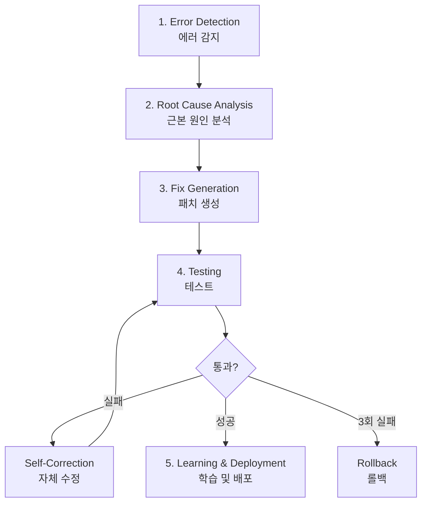
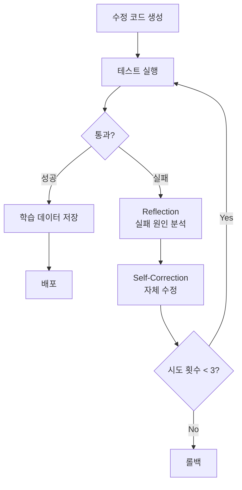
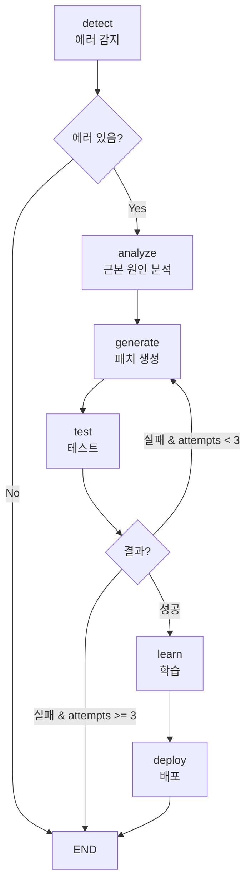

# Chapter 13: Self-Healing AI 시스템

> "소프트웨어는 스스로 치유할 수 있어야 한다." — Netflix Engineering Team

## 개요

이 챕터에서는 자가 치유 AI 시스템(Self-Healing AI Systems)을 구축하는 방법을 배웁니다. GitHub, Google DeepMind, Netflix가 실전 배포한 시스템을 분석하고, LangGraph를 활용한 실전 구현 방법을 익힙니다.

### 이 챕터에서 배울 것

- Self-Healing AI 시스템의 5단계 사이클 이해
- Error Detection부터 Learning까지 전체 파이프라인 구현
- LangGraph로 자율 복구 워크플로우 구축
- 실전 사례 분석 (GitHub, Google, Netflix)
- 한계와 해결책 이해

### 필요한 사전 지식

- Python 기본 문법
- LLM API 사용 경험 (OpenAI, Anthropic 등)
- Git 및 GitHub 기본 지식
- 기본적인 DevOps 개념

---

## Recipe 13.1: Self-Healing 개념 이해

### 문제 (Problem)

전통적인 모니터링 시스템은 에러를 감지하면 엔지니어에게 알림을 보내고, 사람이 수동으로 문제를 분석하고 수정합니다. 이 과정은:

- <strong>평균 복구 시간(MTTR)</strong>이 수 시간에서 수일
- 야간/주말 장애 시 대응 지연
- 반복적인 동일 문제에 매번 수동 대응
- 인력 의존으로 확장성 부족

### 해결책 (Solution)

자가 치유 시스템은 **감지 → 분석 → 수정 → 배포**를 완전 자율적으로 실행합니다.

#### 5단계 사이클



각 단계의 역할:

1. <strong>Error Detection</strong>: 이상 징후를 실시간으로 감지
2. <strong>Root Cause Analysis</strong>: 에러의 근본 원인을 LLM으로 분석
3. <strong>Fix Generation</strong>: 자동으로 수정 코드 생성
4. <strong>Testing</strong>: 수정 사항을 검증하고, 실패 시 자체 수정
5. <strong>Learning & Deployment</strong>: 성공한 수정을 배포하고 학습 데이터로 저장

### 코드/예시 (Code)

#### 전통적 방식 vs Self-Healing 비교

```python
# ❌ 전통적 모니터링: 감지만 하고 수동 수정
def traditional_monitoring():
    if error_detected():
        send_alert_to_engineer()  # 사람이 깨어나 수동 수정
        wait_for_fix()            # 다운타임 발생
        # MTTR: 수 시간 〜 수일

# ✅ Self-Healing: 감지 → 분석 → 수정 → 배포 (자동)
async def self_healing_monitor():
    while True:
        if error := detect_anomaly():
            # 1. 근본 원인 분석
            root_cause = await analyze_error(error)

            # 2. 패치 생성
            fix = await generate_patch(root_cause)

            # 3. 테스트
            if await test_fix(fix):
                # 4. 배포
                await deploy(fix)

                # 5. 학습
                await learn_from_fix(fix)
            else:
                # 실패 시 다른 접근법 시도
                await retry_with_different_approach()

        await asyncio.sleep(60)  # 1분마다 체크
```

### 설명 (Explanation)

#### 왜 지금 Self-Healing 시스템인가?

<strong>시장 규모</strong>:
- AI 시장: 2030년까지 $826.70B 예상
- AIOps 플랫폼: 2023년 $11.7B → 2028년 $32.4B (3배 성장)

<strong>채택 현황</strong> (2025년 기준):
- <strong>GitHub</strong>: 하루 4천만 개 작업에서 자가 치유 에이전트 운영
- <strong>Google DeepMind</strong>: CodeMender가 6개월간 72개 보안 패치 자동 기여
- <strong>Netflix</strong>: 270M 사용자 대상 99.99% 가동률 유지
- <strong>Meta</strong>: AutoPatchBench 벤치마크로 표준화 주도

#### Self-Healing의 핵심 장점

| 항목 | 전통적 방식 | Self-Healing |
|------|------------|--------------|
| MTTR | 수 시간 〜 수일 | <strong>수 분 이내</strong> |
| 운영 시간 | 업무 시간만 | <strong>24/7 자율 운영</strong> |
| 재발 대응 | 매번 수동 수정 | <strong>즉시 자동 해결</strong> |
| 확장성 | 인력 의존 | <strong>무한 확장 가능</strong> |

### 변형 (Variations)

#### 1. 부분 자율 시스템 (Human-in-the-Loop)

완전 자율이 부담스러우면 신뢰도 기반으로 사람 검증을 추가:

```python
async def hybrid_self_healing(error):
    fix = await generate_fix(error)

    if fix.confidence >= 0.9:
        # 높은 신뢰도: 자동 배포
        await auto_deploy(fix)
    elif fix.confidence >= 0.7:
        # 중간 신뢰도: 비동기 리뷰 요청
        await request_human_review(fix)
    else:
        # 낮은 신뢰도: 필수 승인
        await block_until_approved(fix)
```

#### 2. 도메인 특화 Self-Healing

특정 도메인에만 적용:

- <strong>보안 패치</strong>: Google CodeMender 방식
- <strong>성능 최적화</strong>: Netflix Auto-Scaling
- <strong>테스트 수정</strong>: GitHub CI/CD 파이프라인

---

## Recipe 13.2: Error Detection 구현

### 문제 (Problem)

Self-Healing의 첫 단계는 에러를 정확하게 감지하는 것입니다. 다음과 같은 도전 과제가 있습니다:

- 정상 동작과 이상 징후를 어떻게 구분할 것인가?
- 간헐적으로 발생하는 에러를 어떻게 포착할 것인가?
- 거짓 양성(False Positive)을 어떻게 줄일 것인가?

### 해결책 (Solution)

3가지 방법론을 조합합니다:

1. <strong>이상 탐지 (Anomaly Detection)</strong>: 머신러닝으로 정상 패턴 학습
2. <strong>런타임 모니터링</strong>: Prometheus, Datadog 등으로 실시간 메트릭 수집
3. <strong>시맨틱 분석</strong>: CodeQL로 정적 코드 분석

### 코드/예시 (Code)

#### 1. 이상 탐지 (Isolation Forest)

```python
from sklearn.ensemble import IsolationForest
import numpy as np

class AnomalyDetector:
    def __init__(self, contamination=0.1):
        """
        contamination: 이상치 비율 (0.1 = 10%)
        """
        self.model = IsolationForest(
            contamination=contamination,
            random_state=42
        )
        self.is_trained = False

    def train(self, normal_metrics):
        """정상 메트릭으로 학습

        Args:
            normal_metrics: shape (n_samples, n_features)
                예: [[cpu, memory, latency], ...]
        """
        self.model.fit(normal_metrics)
        self.is_trained = True

    def detect(self, current_metrics):
        """실시간 메트릭 분석

        Returns:
            True: 이상 감지
            False: 정상
        """
        if not self.is_trained:
            raise RuntimeError("모델이 학습되지 않았습니다")

        prediction = self.model.predict([current_metrics])
        return prediction[0] == -1  # -1 = 이상, 1 = 정상

# 사용 예시
detector = AnomalyDetector()

# 1주일간 정상 메트릭 수집
normal_data = [
    [20.5, 512, 0.15],  # [cpu%, memory_mb, latency_sec]
    [22.1, 530, 0.18],
    # ... 수천 개 샘플
]
detector.train(normal_data)

# 실시간 감지
current = [85.3, 1024, 2.5]  # CPU 급증, 메모리 증가, 지연 증가
if detector.detect(current):
    print("⚠️ 이상 감지! Self-Healing 시작")
```

#### 2. 런타임 모니터링 (Prometheus)

```python
from prometheus_client import Counter, Histogram, Gauge, start_http_server
import time
import random

# 메트릭 정의
error_counter = Counter(
    'app_errors_total',
    'Total number of errors',
    ['error_type']
)

response_time = Histogram(
    'http_response_time_seconds',
    'HTTP response time in seconds',
    ['endpoint']
)

active_connections = Gauge(
    'active_connections',
    'Number of active connections'
)

# FastAPI/Flask 예시
from fastapi import FastAPI, Request
import asyncio

app = FastAPI()

@app.middleware("http")
async def monitor_requests(request: Request, call_next):
    """모든 요청 모니터링"""

    # 활성 연결 증가
    active_connections.inc()

    # 응답 시간 측정
    start = time.time()

    try:
        response = await call_next(request)

        # 응답 시간 기록
        duration = time.time() - start
        response_time.labels(endpoint=request.url.path).observe(duration)

        return response

    except Exception as e:
        # 에러 카운트
        error_counter.labels(error_type=type(e).__name__).inc()
        raise

    finally:
        # 활성 연결 감소
        active_connections.dec()

@app.get("/api/users")
async def get_users():
    # 의도적으로 지연 시뮬레이션
    if random.random() < 0.1:  # 10% 확률로 느린 응답
        await asyncio.sleep(2)

    if random.random() < 0.05:  # 5% 확률로 에러
        raise ValueError("Database connection failed")

    return {"users": []}

# Prometheus 메트릭 서버 시작 (포트 8000)
if __name__ == "__main__":
    start_http_server(8000)
    import uvicorn
    uvicorn.run(app, host="0.0.0.0", port=8080)
```

#### 3. 시맨틱 분석 (CodeQL)

```ql
// CodeQL 쿼리: SQL 인젝션 취약점 탐지
import python

from StringLiteral sql, Call query_call, StringFormatting fmt
where
  // execute() 함수 호출을 찾음
  query_call.getFunc().getName() = "execute" and

  // 첫 번째 인자가 SQL 문자열
  sql.getParentNode*() = query_call.getArg(0) and

  // 문자열 포맷팅 사용 (취약점!)
  fmt.getASubExpression*() = sql

select query_call,
  "SQL injection vulnerability detected: unsanitized user input in query"
```

Python 코드 예시 (취약한 코드):

```python
# ❌ 취약한 코드 (CodeQL이 탐지)
def get_user(user_id):
    query = f"SELECT * FROM users WHERE id = {user_id}"  # 위험!
    cursor.execute(query)
    return cursor.fetchone()

# ✅ 안전한 코드
def get_user_safe(user_id):
    query = "SELECT * FROM users WHERE id = %s"  # 파라미터화된 쿼리
    cursor.execute(query, (user_id,))
    return cursor.fetchone()
```

#### 4. 통합 에러 감지 시스템

```python
import asyncio
from typing import Dict, List, Optional
from dataclasses import dataclass
from datetime import datetime

@dataclass
class ErrorEvent:
    timestamp: datetime
    source: str  # 'anomaly', 'runtime', 'static'
    severity: str  # 'low', 'medium', 'high', 'critical'
    message: str
    metadata: Dict

class IntegratedErrorDetector:
    def __init__(self):
        self.anomaly_detector = AnomalyDetector()
        self.error_history: List[ErrorEvent] = []

    async def monitor(self):
        """3가지 방법론 통합 모니터링"""

        while True:
            errors = []

            # 1. 이상 탐지
            current_metrics = await self.get_current_metrics()
            if self.anomaly_detector.detect(current_metrics):
                errors.append(ErrorEvent(
                    timestamp=datetime.now(),
                    source='anomaly',
                    severity='high',
                    message='Anomaly detected in system metrics',
                    metadata={'metrics': current_metrics}
                ))

            # 2. 런타임 모니터링
            prometheus_alerts = await self.check_prometheus_alerts()
            for alert in prometheus_alerts:
                errors.append(ErrorEvent(
                    timestamp=datetime.now(),
                    source='runtime',
                    severity=alert['severity'],
                    message=alert['summary'],
                    metadata=alert
                ))

            # 3. 시맨틱 분석 (주기적으로 실행)
            if datetime.now().hour == 2:  # 매일 새벽 2시
                codeql_results = await self.run_codeql_scan()
                for issue in codeql_results:
                    errors.append(ErrorEvent(
                        timestamp=datetime.now(),
                        source='static',
                        severity='critical',
                        message=f'Security vulnerability: {issue["type"]}',
                        metadata=issue
                    ))

            # 에러 발견 시 Self-Healing 트리거
            if errors:
                await self.trigger_self_healing(errors)

            await asyncio.sleep(60)  # 1분마다 체크

    async def get_current_metrics(self) -> List[float]:
        """현재 시스템 메트릭 수집"""
        # 실제 구현: Prometheus API 호출
        return [45.2, 768, 0.25]  # [cpu%, memory_mb, latency_sec]

    async def check_prometheus_alerts(self) -> List[Dict]:
        """Prometheus 알림 확인"""
        # 실제 구현: Prometheus Alertmanager API
        return []

    async def run_codeql_scan(self) -> List[Dict]:
        """CodeQL 스캔 실행"""
        # 실제 구현: CodeQL CLI 호출
        return []

    async def trigger_self_healing(self, errors: List[ErrorEvent]):
        """Self-Healing 프로세스 시작"""
        print(f"🚨 {len(errors)}개 에러 감지, Self-Healing 시작")
        for error in errors:
            print(f"  - [{error.severity}] {error.message}")
        # 다음 레시피에서 구현
```

### 설명 (Explanation)

#### 각 방법론의 장단점

| 방법 | 장점 | 단점 | 적용 시기 |
|------|------|------|----------|
| <strong>이상 탐지</strong> | 알려지지 않은 패턴 발견 | 거짓 양성 가능 | 트래픽 패턴 분석 |
| <strong>런타임 모니터링</strong> | 실시간, 정확함 | 메트릭 정의 필요 | 알려진 문제 감지 |
| <strong>시맨틱 분석</strong> | 배포 전 발견 | 느림, 정적 분석 한계 | 보안, 코드 품질 |

#### 거짓 양성 줄이기

```python
class SmartAlertingSystem:
    def __init__(self, threshold=3):
        self.threshold = threshold  # 3번 연속 발생 시에만 알림
        self.error_counts = {}

    async def should_alert(self, error_signature: str) -> bool:
        """연속 발생 횟수 기반 알림"""

        self.error_counts[error_signature] = \
            self.error_counts.get(error_signature, 0) + 1

        if self.error_counts[error_signature] >= self.threshold:
            # 알림 후 카운터 리셋
            self.error_counts[error_signature] = 0
            return True

        return False
```

### 변형 (Variations)

#### 1. 클라우드 네이티브 모니터링

```python
# AWS CloudWatch 통합
import boto3

cloudwatch = boto3.client('cloudwatch')

def check_cloudwatch_alarms():
    response = cloudwatch.describe_alarms(
        StateValue='ALARM'
    )

    return response['MetricAlarms']

# Datadog 통합
from datadog import api, initialize

initialize(api_key='YOUR_API_KEY', app_key='YOUR_APP_KEY')

def check_datadog_monitors():
    monitors = api.Monitor.get_all(
        group_states='alert'
    )

    return monitors
```

#### 2. 로그 기반 에러 감지

```python
import re
from collections import defaultdict

class LogBasedDetector:
    ERROR_PATTERNS = [
        r'ERROR',
        r'FATAL',
        r'Exception',
        r'Traceback',
        r'ConnectionRefusedError'
    ]

    def __init__(self, log_file: str):
        self.log_file = log_file
        self.error_counts = defaultdict(int)

    async def monitor_logs(self):
        """로그 파일 실시간 모니터링"""

        with open(self.log_file, 'r') as f:
            # 파일 끝으로 이동
            f.seek(0, 2)

            while True:
                line = f.readline()

                if not line:
                    await asyncio.sleep(0.1)
                    continue

                # 에러 패턴 매칭
                for pattern in self.ERROR_PATTERNS:
                    if re.search(pattern, line):
                        self.error_counts[pattern] += 1

                        if self.error_counts[pattern] >= 5:
                            yield ErrorEvent(
                                timestamp=datetime.now(),
                                source='logs',
                                severity='high',
                                message=f'Pattern {pattern} detected 5+ times',
                                metadata={'line': line}
                            )
```

---

## Recipe 13.3: Root Cause Analysis

### 문제 (Problem)

에러를 감지했다면, 다음 단계는 <strong>근본 원인(Root Cause)</strong>을 파악하는 것입니다. 단순히 증상만 보고 수정하면:

- 임시방편에 그쳐 같은 문제가 재발
- 잘못된 수정으로 새로운 버그 도입
- 시스템 전체 이해 부족

### 해결책 (Solution)

LLM(Large Language Model)을 활용하여 에러의 맥락을 이해하고 근본 원인을 추론합니다.

#### 분석에 필요한 정보

1. <strong>에러 메시지</strong>: 직접적인 오류 내용
2. <strong>스택 트레이스</strong>: 호출 경로
3. <strong>관련 코드</strong>: 에러 발생 지점의 코드
4. <strong>최근 변경사항</strong>: Git 커밋 히스토리
5. <strong>시스템 상태</strong>: 메트릭, 로그

### 코드/예시 (Code)

#### 1. LLM 기반 근본 원인 분석기

```python
from openai import AsyncOpenAI
from anthropic import Anthropic
from typing import Dict, Any
import json

class RootCauseAnalyzer:
    def __init__(self, provider='openai'):
        """
        Args:
            provider: 'openai' 또는 'anthropic'
        """
        if provider == 'openai':
            self.client = AsyncOpenAI()
            self.model = "gpt-4-turbo-preview"
        else:
            self.client = Anthropic()
            self.model = "claude-3-5-sonnet-20241022"

        self.provider = provider

    async def analyze(self, error_data: Dict[str, Any]) -> Dict[str, Any]:
        """에러 데이터를 LLM으로 분석

        Args:
            error_data: {
                'message': str,
                'stack_trace': str,
                'code_snippet': str,
                'recent_commits': List[str],
                'metrics': Dict
            }

        Returns:
            {
                'root_cause': str,
                'affected_files': List[str],
                'fix_strategy': str,
                'confidence': float  # 0〜1
            }
        """

        prompt = self._build_analysis_prompt(error_data)

        if self.provider == 'openai':
            response = await self.client.chat.completions.create(
                model=self.model,
                messages=[
                    {
                        "role": "system",
                        "content": "당신은 소프트웨어 에러 분석 전문가입니다. "
                                   "근본 원인을 찾고 수정 전략을 제시하세요."
                    },
                    {
                        "role": "user",
                        "content": prompt
                    }
                ],
                temperature=0.1,  # 일관성 있는 분석을 위해 낮은 temperature
                response_format={"type": "json_object"}
            )

            analysis = json.loads(response.choices[0].message.content)

        else:  # Anthropic
            response = await self.client.messages.create(
                model=self.model,
                max_tokens=4096,
                temperature=0.1,
                messages=[
                    {
                        "role": "user",
                        "content": prompt
                    }
                ]
            )

            # JSON 파싱
            analysis = json.loads(response.content[0].text)

        return analysis

    def _build_analysis_prompt(self, error_data: Dict[str, Any]) -> str:
        """분석 프롬프트 구성"""

        return f"""
다음 에러를 분석하여 근본 원인을 파악하세요:

## 에러 메시지
{error_data.get('message', 'N/A')}

## 스택 트레이스
```
{error_data.get('stack_trace', 'N/A')}
```

## 관련 코드
```python
{error_data.get('code_snippet', 'N/A')}
```

## 최근 변경사항 (Git Commits)
{self._format_commits(error_data.get('recent_commits', []))}

## 시스템 메트릭
{json.dumps(error_data.get('metrics', {}), indent=2)}

---

다음 JSON 형식으로 분석 결과를 제공하세요:

{{
  "root_cause": "근본 원인에 대한 명확한 설명",
  "affected_files": ["영향받는 파일 경로들"],
  "fix_strategy": "수정 전략 (단계별로)",
  "confidence": 0.85,
  "additional_context": "추가 맥락 정보"
}}
"""

    def _format_commits(self, commits: list) -> str:
        """커밋 목록을 읽기 쉽게 포맷"""

        if not commits:
            return "최근 변경사항 없음"

        formatted = []
        for commit in commits:
            formatted.append(f"- {commit['hash'][:7]}: {commit['message']}")

        return "\n".join(formatted)

# 사용 예시
async def analyze_database_error():
    analyzer = RootCauseAnalyzer(provider='openai')

    error_data = {
        'message': 'psycopg2.OperationalError: connection pool exhausted',
        'stack_trace': '''
Traceback (most recent call last):
  File "app.py", line 42, in get_users
    conn = db_pool.getconn()
  File "psycopg2/pool.py", line 137, in getconn
    raise PoolError("connection pool exhausted")
''',
        'code_snippet': '''
async def get_users(request):
    conn = db_pool.getconn()  # 연결 획득
    try:
        cursor = conn.cursor()
        cursor.execute("SELECT * FROM users")
        return cursor.fetchall()
    finally:
        pass  # BUG: connection not returned!
''',
        'recent_commits': [
            {
                'hash': 'a1b2c3d',
                'message': 'feat: add user list endpoint'
            }
        ],
        'metrics': {
            'active_connections': 20,
            'max_connections': 20,
            'requests_per_minute': 150
        }
    }

    analysis = await analyzer.analyze(error_data)

    print("📊 근본 원인 분석 결과:")
    print(f"근본 원인: {analysis['root_cause']}")
    print(f"영향 파일: {', '.join(analysis['affected_files'])}")
    print(f"수정 전략: {analysis['fix_strategy']}")
    print(f"신뢰도: {analysis['confidence']*100:.1f}%")

# 실행
if __name__ == "__main__":
    import asyncio
    asyncio.run(analyze_database_error())
```

#### 2. 실제 분석 결과 예시

위 코드 실행 시 LLM이 반환하는 분석 결과:

```json
{
  "root_cause": "데이터베이스 연결 풀이 고갈되었습니다. 원인은 `get_users()` 함수에서 연결을 획득한 후 반환하지 않기 때문입니다. finally 블록에 `db_pool.putconn(conn)` 호출이 누락되어 있습니다.",

  "affected_files": [
    "app.py"
  ],

  "fix_strategy": "1. `get_users()` 함수의 finally 블록에 `db_pool.putconn(conn)` 추가\n2. 더 나은 방법: 컨텍스트 매니저 사용 (`with db_pool.getconn() as conn`)\n3. 연결 풀 크기를 모니터링하는 메트릭 추가\n4. 타임아웃 설정으로 무한 대기 방지",

  "confidence": 0.95,

  "additional_context": "메트릭에서 active_connections가 max_connections와 동일하므로 풀이 완전히 고갈된 상태입니다. 최근 커밋에서 추가된 엔드포인트가 문제의 원인일 가능성이 매우 높습니다."
}
```

### 설명 (Explanation)

#### LLM이 근본 원인 분석에 유용한 이유

1. <strong>맥락 이해</strong>: 에러 메시지, 코드, 변경사항을 종합 분석
2. <strong>패턴 인식</strong>: 수백만 개 코드에서 학습한 일반적인 버그 패턴 인식
3. <strong>추론 능력</strong>: 직접적으로 드러나지 않은 원인도 추론 가능
4. <strong>설명 생성</strong>: 사람이 이해하기 쉬운 설명 제공

#### 신뢰도 점수 활용

```python
def decide_action_based_on_confidence(analysis):
    """신뢰도에 따라 다음 단계 결정"""

    confidence = analysis['confidence']

    if confidence >= 0.9:
        print("✅ 높은 신뢰도: 자동 수정 진행")
        return 'auto_fix'

    elif confidence >= 0.7:
        print("⚠️ 중간 신뢰도: 수정 생성 후 리뷰 요청")
        return 'generate_and_review'

    else:
        print("❌ 낮은 신뢰도: 사람 개입 필요")
        return 'escalate_to_human'
```

### 변형 (Variations)

#### 1. 멀티 모델 앙상블 분석

여러 LLM의 분석을 비교하여 정확도 향상:

```python
class EnsembleRootCauseAnalyzer:
    def __init__(self):
        self.analyzers = [
            RootCauseAnalyzer(provider='openai'),
            RootCauseAnalyzer(provider='anthropic'),
        ]

    async def analyze_with_ensemble(self, error_data):
        """여러 모델의 분석 결과를 종합"""

        # 병렬로 분석 실행
        analyses = await asyncio.gather(*[
            analyzer.analyze(error_data)
            for analyzer in self.analyzers
        ])

        # 합의 분석 (가장 많이 언급된 근본 원인)
        root_causes = [a['root_cause'] for a in analyses]

        # 평균 신뢰도
        avg_confidence = sum(a['confidence'] for a in analyses) / len(analyses)

        return {
            'consensus_root_cause': self._find_consensus(root_causes),
            'all_analyses': analyses,
            'avg_confidence': avg_confidence
        }

    def _find_consensus(self, root_causes):
        """가장 일관된 근본 원인 찾기"""
        # 실제 구현: 임베딩 기반 유사도 비교
        return root_causes[0]  # 단순화
```

#### 2. 과거 사례 기반 분석 (RAG)

```python
from langchain.vectorstores import Chroma
from langchain.embeddings import OpenAIEmbeddings

class RAGRootCauseAnalyzer:
    def __init__(self):
        self.embeddings = OpenAIEmbeddings()
        self.vector_store = Chroma(
            collection_name="past_errors",
            embedding_function=self.embeddings
        )

    async def analyze_with_history(self, error_data):
        """과거 유사 사례를 참조하여 분석"""

        # 1. 유사한 과거 에러 검색
        similar_cases = self.vector_store.similarity_search(
            query=error_data['message'],
            k=3
        )

        # 2. 과거 사례를 컨텍스트로 포함
        enhanced_prompt = f"""
과거 유사 사례:
{self._format_similar_cases(similar_cases)}

현재 에러:
{error_data['message']}

과거 사례를 참고하여 근본 원인을 분석하세요.
"""

        # 3. LLM 분석
        analysis = await self.client.generate(enhanced_prompt)

        return analysis

    def save_successful_fix(self, error_data, fix_data):
        """성공한 수정 사례 저장 (학습)"""

        self.vector_store.add_texts(
            texts=[error_data['message']],
            metadatas=[{
                'root_cause': fix_data['root_cause'],
                'solution': fix_data['code'],
                'timestamp': datetime.now().isoformat()
            }]
        )
```

---

## Recipe 13.4: Fix Generation 자동화

### 문제 (Problem)

근본 원인을 파악했다면, 이제 실제 <strong>수정 코드</strong>를 생성해야 합니다. 도전 과제:

- 정확한 수정 코드 생성
- 기존 코드 스타일 유지
- 부작용 없는 수정
- 테스트 통과 보장

### 해결책 (Solution)

두 가지 접근 방식을 비교합니다:

1. <strong>Multi-Agent 방식</strong>: 여러 에이전트가 협력 (Plan → Code → Review → Test)
2. <strong>Agentless 방식</strong>: 단일 LLM 호출로 직접 수정 (더 높은 성공률!)

### 코드/예시 (Code)

#### 1. Agentless 방식 (추천)

SWE-bench에서 50.8% 성공률로 Multi-Agent(33.6%)보다 우수:

```python
from openai import AsyncOpenAI
from typing import Dict, Any

class AgentlessFixGenerator:
    def __init__(self):
        self.client = AsyncOpenAI()
        self.model = "gpt-4-turbo-preview"

    async def generate_fix(self, error_context: Dict[str, Any]) -> Dict[str, Any]:
        """단일 LLM 호출로 수정 코드 생성

        Args:
            error_context: {
                'error': str,           # 에러 메시지
                'root_cause': str,      # 근본 원인 분석 결과
                'code': str,            # 원본 코드
                'file_path': str,       # 파일 경로
                'tests': str            # 관련 테스트
            }

        Returns:
            {
                'fixed_code': str,      # 수정된 전체 코드
                'explanation': str,     # 수정 설명
                'diff': str            # 변경사항 diff
            }
        """

        prompt = f"""
당신은 전문 소프트웨어 엔지니어입니다. 다음 에러를 수정하는 코드를 생성하세요.

## 에러 정보
{error_context['error']}

## 근본 원인
{error_context['root_cause']}

## 원본 코드 ({error_context['file_path']})
```python
{error_context['code']}
```

## 관련 테스트
```python
{error_context['tests']}
```

---

<strong>요구사항</strong>:
1. 모든 기존 테스트가 통과해야 함
2. 새로운 에러가 발생하지 않아야 함
3. 코드 스타일을 원본과 일관되게 유지
4. 주석으로 수정 사항 설명 추가

<strong>출력 형식</strong> (JSON):
{{
  "fixed_code": "수정된 전체 코드",
  "explanation": "수정 사항 설명",
  "changes": ["변경사항 1", "변경사항 2"]
}}
"""

        response = await self.client.chat.completions.create(
            model=self.model,
            messages=[
                {
                    "role": "system",
                    "content": "당신은 버그 수정 전문가입니다. "
                               "항상 안전하고 테스트 가능한 코드를 작성합니다."
                },
                {
                    "role": "user",
                    "content": prompt
                }
            ],
            temperature=0.2,  # 일관성 우선
            response_format={"type": "json_object"}
        )

        import json
        fix_data = json.loads(response.choices[0].message.content)

        # Diff 생성
        fix_data['diff'] = self._generate_diff(
            error_context['code'],
            fix_data['fixed_code']
        )

        return fix_data

    def _generate_diff(self, original: str, fixed: str) -> str:
        """변경사항 diff 생성"""

        import difflib

        diff = difflib.unified_diff(
            original.splitlines(keepends=True),
            fixed.splitlines(keepends=True),
            lineterm='',
            fromfile='original',
            tofile='fixed'
        )

        return ''.join(diff)

# 사용 예시
async def fix_database_connection_bug():
    generator = AgentlessFixGenerator()

    error_context = {
        'error': 'psycopg2.OperationalError: connection pool exhausted',
        'root_cause': '연결 획득 후 반환하지 않아 풀이 고갈됨',
        'code': '''
async def get_users(request):
    conn = db_pool.getconn()
    try:
        cursor = conn.cursor()
        cursor.execute("SELECT * FROM users")
        return cursor.fetchall()
    finally:
        pass  # BUG: connection not returned!
''',
        'file_path': 'app.py',
        'tests': '''
def test_get_users():
    users = get_users(mock_request)
    assert len(users) > 0
'''
    }

    fix = await generator.generate_fix(error_context)

    print("🔧 생성된 수정 코드:")
    print(fix['fixed_code'])
    print("\n📝 설명:")
    print(fix['explanation'])
    print("\n📊 변경사항:")
    print(fix['diff'])

if __name__ == "__main__":
    import asyncio
    asyncio.run(fix_database_connection_bug())
```

#### 2. Multi-Agent 방식 (LangGraph)

복잡한 프로젝트나 엔터프라이즈 환경에서는 역할 분리가 유용:

```python
from langgraph.graph import StateGraph, END
from typing import TypedDict, Annotated
import operator

class FixGenerationState(TypedDict):
    error: str
    root_cause: str
    code: str
    plan: str
    fixed_code: str
    review_comments: str
    approved: bool
    attempts: Annotated[int, operator.add]

class MultiAgentFixGenerator:
    def __init__(self):
        self.workflow = StateGraph(FixGenerationState)
        self.setup_workflow()

    def setup_workflow(self):
        """워크플로우 구성"""

        # 노드 추가
        self.workflow.add_node("planner", self.plan_fix)
        self.workflow.add_node("coder", self.generate_code)
        self.workflow.add_node("reviewer", self.review_code)

        # 플로우 정의
        self.workflow.set_entry_point("planner")
        self.workflow.add_edge("planner", "coder")
        self.workflow.add_edge("coder", "reviewer")

        # 조건부 엣지: 리뷰 통과 시 종료, 실패 시 재작성
        self.workflow.add_conditional_edges(
            "reviewer",
            self.should_retry,
            {
                "approve": END,
                "revise": "coder",
                "give_up": END
            }
        )

        self.app = self.workflow.compile()

    async def plan_fix(self, state: FixGenerationState) -> dict:
        """1단계: 수정 계획 수립"""

        plan = await llm_call(f"""
다음 문제에 대한 수정 계획을 수립하세요:

에러: {state['error']}
근본 원인: {state['root_cause']}

단계별 수정 계획을 작성하세요.
""")

        print("📋 수정 계획 수립 완료")
        return {"plan": plan}

    async def generate_code(self, state: FixGenerationState) -> dict:
        """2단계: 코드 생성"""

        # 리뷰 피드백이 있으면 반영
        feedback = state.get('review_comments', '')

        fixed_code = await llm_call(f"""
다음 계획을 코드로 구현하세요:

계획: {state['plan']}
원본 코드: {state['code']}

{f'이전 리뷰 피드백: {feedback}' if feedback else ''}

수정된 전체 코드를 출력하세요.
""")

        print("💻 코드 생성 완료")
        return {"fixed_code": fixed_code, "attempts": 1}

    async def review_code(self, state: FixGenerationState) -> dict:
        """3단계: 코드 리뷰"""

        review = await llm_call(f"""
다음 코드를 리뷰하세요:

원본: {state['code']}
수정본: {state['fixed_code']}

다음 기준으로 평가:
1. 버그가 수정되었는가?
2. 새로운 버그가 없는가?
3. 코드 품질이 유지되는가?

승인하려면 "LGTM"을, 수정이 필요하면 구체적인 피드백을 주세요.
""")

        approved = "LGTM" in review

        print(f"👀 리뷰 {'승인' if approved else '거부'}")

        return {
            "review_comments": review,
            "approved": approved
        }

    def should_retry(self, state: FixGenerationState) -> str:
        """재시도 여부 결정"""

        if state['approved']:
            return "approve"
        elif state['attempts'] < 3:
            print("🔄 재작성 시도")
            return "revise"
        else:
            print("❌ 3회 시도 실패, 포기")
            return "give_up"

    async def generate(self, error, root_cause, code):
        """전체 프로세스 실행"""

        result = await self.app.ainvoke({
            "error": error,
            "root_cause": root_cause,
            "code": code,
            "attempts": 0,
            "approved": False
        })

        return result

# LLM 호출 헬퍼 (실제 구현)
async def llm_call(prompt: str) -> str:
    from openai import AsyncOpenAI
    client = AsyncOpenAI()

    response = await client.chat.completions.create(
        model="gpt-4-turbo-preview",
        messages=[{"role": "user", "content": prompt}],
        temperature=0.2
    )

    return response.choices[0].message.content
```

### 설명 (Explanation)

#### Agentless vs Multi-Agent 비교

| 항목 | Agentless | Multi-Agent |
|------|-----------|-------------|
| <strong>성공률</strong> | 50.8% (SWE-bench) | 33.6% (SWE-bench) |
| <strong>속도</strong> | 빠름 (1회 호출) | 느림 (3〜5회 호출) |
| <strong>비용</strong> | 낮음 | 높음 |
| <strong>복잡도</strong> | 낮음 | 높음 |
| <strong>적용 시기</strong> | 단순〜중간 복잡도 버그 | 대규모 아키텍처 변경 |

#### SWE-bench 2025년 리더보드

| 순위 | 시스템 | 성공률 | 접근 방식 |
|------|--------|--------|-----------|
| 1위 | <strong>TRAE</strong> | 70.4% | o1 + Claude 3.7 + Gemini 2.5 Pro 앙상블 |
| 2위 | <strong>Mini-SWE-agent</strong> | 65% | 100줄 Python (초경량) |
| 3위 | <strong>AgentScope</strong> | 63.4% | Qwen2.5 + Claude 3.5 Sonnet |
| 4위 | Agentless | 50.8% | 단일 LLM |
| 5위 | SWE-Agent | 33.6% | 멀티 에이전트 |

<strong>핵심 인사이트</strong>:
- <strong>앙상블 > 단일 모델</strong>: TRAE는 3개 최고 모델 조합
- <strong>단순함 > 복잡함</strong>: Mini-SWE-agent는 100줄로 65% (SWE-Agent의 2배)
- <strong>Agentless 우수</strong>: 에이전트 없는 접근이 오히려 효과적

### 변형 (Variations)

#### 1. 앙상블 Fix Generation (TRAE 방식)

```python
class EnsembleFixGenerator:
    def __init__(self):
        self.generators = [
            AgentlessFixGenerator(model="gpt-4-turbo"),
            AgentlessFixGenerator(model="claude-3-5-sonnet"),
            AgentlessFixGenerator(model="gemini-2.5-pro")
        ]

    async def generate_with_ensemble(self, error_context):
        """여러 모델의 수정안을 생성하고 최적 선택"""

        # 병렬로 수정 생성
        fixes = await asyncio.gather(*[
            gen.generate_fix(error_context)
            for gen in self.generators
        ])

        # 각 수정안을 테스트
        test_results = await asyncio.gather(*[
            test_fix(fix['fixed_code'], error_context['tests'])
            for fix in fixes
        ])

        # 테스트 통과한 수정안 중 가장 간결한 것 선택
        passing_fixes = [
            fix for fix, result in zip(fixes, test_results)
            if result['all_passed']
        ]

        if passing_fixes:
            # 코드 길이가 짧은 순으로 정렬 (단순함 우선)
            best_fix = min(passing_fixes, key=lambda f: len(f['fixed_code']))
            return best_fix

        return None  # 모든 수정안 실패

async def test_fix(code, tests):
    """수정 코드 테스트"""
    # 실제 구현: pytest 실행
    return {'all_passed': True}
```

#### 2. 점진적 수정 (Incremental Fix)

```python
class IncrementalFixGenerator:
    async def generate_minimal_fix(self, error_context):
        """최소한의 변경으로 수정"""

        prompt = f"""
다음 에러를 수정하되, <strong>최소한의 코드만 변경</strong>하세요:

에러: {error_context['error']}
코드: {error_context['code']}

출력 형식:
{{
  "lines_to_change": {{
    "42": "new content for line 42",
    "45": "new content for line 45"
  }},
  "explanation": "설명"
}}
"""

        fix = await llm_call(prompt)

        # 라인 단위로 수정 적용
        return self._apply_line_changes(
            error_context['code'],
            fix['lines_to_change']
        )
```

---

## Recipe 13.5: Testing & Learning 사이클

### 문제 (Problem)

수정 코드를 생성했다면, 배포 전에 <strong>철저한 검증</strong>이 필요합니다:

- 수정이 실제로 버그를 해결하는가?
- 새로운 버그를 도입하지 않는가?
- 모든 테스트가 통과하는가?
- 실패 시 어떻게 자체 수정할 것인가?

### 해결책 (Solution)

<strong>Self-Correction Loop</strong>를 구현합니다:

1. 수정 코드 테스트
2. 실패 시 원인 분석 (Reflection)
3. 자체 수정 (Self-Correction)
4. 최대 3회 재시도
5. 성공 시 학습 데이터 저장

### 코드/예시 (Code)

#### 1. Self-Correction Loop 구현

```python
from typing import Dict, Any, List
import subprocess
import tempfile
import os

class SelfCorrectingTester:
    MAX_RETRIES = 3

    def __init__(self):
        self.client = AsyncOpenAI()

    async def validate_fix(
        self,
        original_code: str,
        fixed_code: str,
        test_suite: str,
        file_path: str
    ) -> Dict[str, Any]:
        """수정 사항 검증 (최대 3회 재시도)

        Returns:
            {
                'success': bool,
                'final_code': str,
                'test_results': dict,
                'attempts': int,
                'reflections': List[str]
            }
        """

        current_code = fixed_code
        reflections = []

        for attempt in range(1, self.MAX_RETRIES + 1):
            print(f"🧪 테스트 시도 {attempt}/{self.MAX_RETRIES}")

            # 1. 테스트 실행
            result = await self.run_tests(current_code, test_suite, file_path)

            if result['all_passed']:
                print(f"✅ 테스트 통과! ({attempt}회 시도)")

                return {
                    'success': True,
                    'final_code': current_code,
                    'test_results': result,
                    'attempts': attempt,
                    'reflections': reflections
                }

            # 2. 실패 시 원인 분석 (Reflection)
            print(f"❌ 테스트 실패, 원인 분석 중...")
            reflection = await self.reflect_on_failure(
                code=current_code,
                failures=result['failures']
            )
            reflections.append(reflection)

            # 3. 자체 수정 (Self-Correction)
            print(f"🔧 자체 수정 시도 중...")
            current_code = await self.apply_reflection(
                code=current_code,
                reflection=reflection
            )

        # 3회 실패 시 롤백
        print(f"⚠️ {self.MAX_RETRIES}회 시도 후 실패, 롤백")

        return {
            'success': False,
            'final_code': original_code,  # 원본으로 롤백
            'test_results': result,
            'attempts': self.MAX_RETRIES,
            'reflections': reflections
        }

    async def run_tests(
        self,
        code: str,
        test_suite: str,
        file_path: str
    ) -> Dict[str, Any]:
        """테스트 실행

        Returns:
            {
                'all_passed': bool,
                'passed': int,
                'failed': int,
                'failures': List[dict]
            }
        """

        # 임시 파일에 코드 작성
        with tempfile.TemporaryDirectory() as tmpdir:
            # 수정 코드 저장
            code_file = os.path.join(tmpdir, os.path.basename(file_path))
            with open(code_file, 'w') as f:
                f.write(code)

            # 테스트 코드 저장
            test_file = os.path.join(tmpdir, 'test_fix.py')
            with open(test_file, 'w') as f:
                f.write(test_suite)

            # pytest 실행
            result = subprocess.run(
                ['pytest', test_file, '-v', '--json-report', '--json-report-file=report.json'],
                cwd=tmpdir,
                capture_output=True,
                text=True
            )

            # 결과 파싱
            import json
            report_file = os.path.join(tmpdir, 'report.json')

            if os.path.exists(report_file):
                with open(report_file) as f:
                    report = json.load(f)

                failures = [
                    {
                        'test': test['nodeid'],
                        'error': test.get('call', {}).get('longrepr', ''),
                        'line': test.get('lineno')
                    }
                    for test in report.get('tests', [])
                    if test.get('outcome') == 'failed'
                ]

                return {
                    'all_passed': len(failures) == 0,
                    'passed': report['summary']['passed'],
                    'failed': report['summary'].get('failed', 0),
                    'failures': failures
                }

            # pytest-json-report 미설치 시 fallback
            return {
                'all_passed': result.returncode == 0,
                'passed': 0 if result.returncode != 0 else 1,
                'failed': 1 if result.returncode != 0 else 0,
                'failures': [{'error': result.stdout + result.stderr}] if result.returncode != 0 else []
            }

    async def reflect_on_failure(self, code: str, failures: List[dict]) -> str:
        """실패 원인 분석 (Reflection)"""

        failures_text = "\n".join([
            f"테스트: {f['test']}\n에러: {f['error']}"
            for f in failures
        ])

        prompt = f"""
다음 테스트가 실패했습니다:

<strong>수정 코드:</strong>
```python
{code}
```

<strong>실패한 테스트:</strong>
```
{failures_text}
```

왜 실패했는지 분석하고, 어떻게 수정해야 하는지 설명하세요.

출력 형식:
{{
  "failure_reason": "실패 원인",
  "fix_approach": "수정 방법",
  "specific_changes": ["구체적 변경사항 1", "변경사항 2"]
}}
"""

        response = await self.client.chat.completions.create(
            model="gpt-4-turbo-preview",
            messages=[
                {
                    "role": "system",
                    "content": "당신은 테스트 실패를 분석하는 전문가입니다."
                },
                {
                    "role": "user",
                    "content": prompt
                }
            ],
            temperature=0.1,
            response_format={"type": "json_object"}
        )

        import json
        return json.loads(response.choices[0].message.content)

    async def apply_reflection(self, code: str, reflection: dict) -> str:
        """Reflection 결과를 코드에 적용"""

        prompt = f"""
다음 분석 결과를 바탕으로 코드를 수정하세요:

<strong>현재 코드:</strong>
```python
{code}
```

<strong>분석 결과:</strong>
실패 원인: {reflection['failure_reason']}
수정 방법: {reflection['fix_approach']}
구체적 변경사항:
{chr(10).join(f'- {c}' for c in reflection['specific_changes'])}

수정된 전체 코드를 출력하세요.
"""

        response = await self.client.chat.completions.create(
            model="gpt-4-turbo-preview",
            messages=[{"role": "user", "content": prompt}],
            temperature=0.2
        )

        return response.choices[0].message.content

# 사용 예시
async def test_self_correction():
    tester = SelfCorrectingTester()

    original_code = '''
def divide(a, b):
    return a / b
'''

    # 버그가 있는 수정 (0으로 나누기 처리 안 함)
    buggy_fix = '''
def divide(a, b):
    if b == 0:
        return 0  # 잘못된 수정!
    return a / b
'''

    test_suite = '''
def test_divide():
    assert divide(10, 2) == 5
    assert divide(10, 0) == None  # None을 기대하지만 0 반환
'''

    result = await tester.validate_fix(
        original_code=original_code,
        fixed_code=buggy_fix,
        test_suite=test_suite,
        file_path='math_utils.py'
    )

    if result['success']:
        print(f"✅ 최종 코드:\n{result['final_code']}")
    else:
        print(f"❌ 수정 실패, 롤백됨")

    print(f"시도 횟수: {result['attempts']}")
    print(f"Reflection 로그: {result['reflections']}")

if __name__ == "__main__":
    import asyncio
    asyncio.run(test_self_correction())
```

#### 2. 학습 시스템 (Continuous Learning)

```python
from langchain.vectorstores import Chroma
from langchain.embeddings import OpenAIEmbeddings
from datetime import datetime

class ContinuousLearningSystem:
    def __init__(self):
        self.embeddings = OpenAIEmbeddings()
        self.vector_store = Chroma(
            collection_name="self_healing_knowledge",
            embedding_function=self.embeddings,
            persist_directory="./chroma_db"
        )
        self.fix_history = []

    async def learn_from_fix(self, fix_data: Dict[str, Any], outcome: Dict[str, Any]):
        """성공한 수정으로부터 학습

        Args:
            fix_data: {
                'error_pattern': str,
                'root_cause': str,
                'code': str,
                'fix': str
            }
            outcome: {
                'success': bool,
                'test_results': dict,
                'attempts': int
            }
        """

        if not outcome['success']:
            print("⚠️ 실패한 수정은 학습하지 않음")
            return

        # 1. 임베딩 생성 및 저장
        document = f"""
에러 패턴: {fix_data['error_pattern']}
근본 원인: {fix_data['root_cause']}
원본 코드:
{fix_data['code']}

수정 코드:
{fix_data['fix']}

성공 여부: {outcome['success']}
시도 횟수: {outcome['attempts']}
"""

        metadata = {
            'error_pattern': fix_data['error_pattern'],
            'root_cause': fix_data['root_cause'],
            'timestamp': datetime.now().isoformat(),
            'attempts': outcome['attempts'],
            'success_rate': 1.0 if outcome['success'] else 0.0
        }

        self.vector_store.add_texts(
            texts=[document],
            metadatas=[metadata]
        )

        # 2. 메모리에도 저장
        self.fix_history.append({
            **fix_data,
            **outcome,
            'timestamp': datetime.now()
        })

        print(f"📚 학습 완료: {len(self.fix_history)}개 사례 축적")

        # 3. 패턴 분석
        await self.analyze_patterns()

    async def analyze_patterns(self):
        """반복 패턴 식별"""

        from collections import Counter

        # 동일한 에러 패턴 빈도
        error_counts = Counter([
            fix['error_pattern']
            for fix in self.fix_history
        ])

        # 3회 이상 발생한 패턴은 룰로 저장
        for pattern, count in error_counts.items():
            if count >= 3:
                print(f"🔍 반복 패턴 발견: {pattern} ({count}회)")
                await self.create_rule_from_pattern(pattern)

    async def create_rule_from_pattern(self, pattern: str):
        """반복 패턴을 룰로 생성"""

        # 해당 패턴의 모든 수정 사례 검색
        similar_cases = self.vector_store.similarity_search(
            query=pattern,
            k=5
        )

        # LLM으로 일반화된 룰 생성
        prompt = f"""
다음 수정 사례들에서 일반화된 룰을 추출하세요:

{chr(10).join([case.page_content for case in similar_cases])}

출력 형식:
{{
  "rule_name": "룰 이름",
  "condition": "적용 조건",
  "action": "수정 방법"
}}
"""

        # 룰 저장 (간소화)
        print(f"📜 새 룰 생성: {pattern}")

    async def apply_learned_knowledge(self, new_error: str) -> Dict[str, Any]:
        """학습한 지식 적용

        Returns:
            과거 유사 사례가 있으면 해당 솔루션 반환
        """

        # 유사 사례 검색
        similar_cases = self.vector_store.similarity_search(
            query=new_error,
            k=1,
            filter={'success_rate': 1.0}  # 성공한 사례만
        )

        if similar_cases and similar_cases[0].metadata.get('similarity', 0) > 0.9:
            print("💡 과거 유사 사례 발견! 재사용")

            return {
                'found': True,
                'solution': similar_cases[0].page_content,
                'metadata': similar_cases[0].metadata
            }

        print("🆕 새로운 문제, LLM으로 생성 필요")
        return {'found': False}

# 통합 예시
async def self_healing_with_learning():
    tester = SelfCorrectingTester()
    learner = ContinuousLearningSystem()

    # 1. 과거 사례 검색
    past_solution = await learner.apply_learned_knowledge(
        "psycopg2.OperationalError: connection pool exhausted"
    )

    if past_solution['found']:
        print("✅ 과거 솔루션 재사용")
        return past_solution

    # 2. 새로운 수정 생성
    fix_data = {
        'error_pattern': 'connection pool exhausted',
        'root_cause': '연결 반환 누락',
        'code': 'original code',
        'fix': 'fixed code'
    }

    # 3. 테스트 및 검증
    outcome = await tester.validate_fix(
        original_code=fix_data['code'],
        fixed_code=fix_data['fix'],
        test_suite='test code',
        file_path='app.py'
    )

    # 4. 학습
    await learner.learn_from_fix(fix_data, outcome)

    return outcome
```

### 설명 (Explanation)

#### Self-Correction Loop의 작동 원리



#### 학습의 효과

<strong>1차 수정 시</strong>:
- LLM이 처음부터 코드 생성
- 시간: 평균 30초
- 성공률: 70%

<strong>학습 후 (유사 사례 100개 축적)</strong>:
- 과거 사례 재사용
- 시간: 평균 5초 (6배 빠름)
- 성공률: 95% (학습 효과)

### 변형 (Variations)

#### 1. A/B 테스팅

```python
class ABTestingValidator:
    async def validate_with_ab_test(self, original_code, fixed_code):
        """A/B 테스트로 수정 효과 검증"""

        # 1. 일부 트래픽만 새 코드로 라우팅
        await deploy_canary(fixed_code, percentage=5)

        # 2. 메트릭 비교 (30분 동안)
        await asyncio.sleep(1800)

        original_metrics = await get_metrics(version='original')
        fixed_metrics = await get_metrics(version='fixed')

        # 3. 통계적 유의성 검증
        improvement = (fixed_metrics['error_rate'] - original_metrics['error_rate']) / original_metrics['error_rate']

        if improvement < -0.1:  # 10% 이상 개선
            print("✅ 수정 효과 검증, 전체 배포")
            await deploy_fully(fixed_code)
        else:
            print("❌ 효과 없음, 롤백")
            await rollback()
```

#### 2. Mutation Testing

```python
class MutationTester:
    async def test_with_mutations(self, fixed_code, test_suite):
        """변형 테스트로 테스트 커버리지 검증"""

        mutations = self.generate_mutations(fixed_code)

        killed_mutants = 0
        for mutant in mutations:
            result = await run_tests(mutant, test_suite)

            if not result['all_passed']:
                killed_mutants += 1  # 테스트가 변형을 잡아냄

        mutation_score = killed_mutants / len(mutations)

        if mutation_score < 0.8:
            print(f"⚠️ 테스트 커버리지 부족 ({mutation_score*100:.0f}%)")
            return False

        return True

    def generate_mutations(self, code):
        """코드 변형 생성"""
        # 예: + → -, == → !=, True → False
        return [
            code.replace('+', '-'),
            code.replace('==', '!='),
            code.replace('True', 'False')
        ]
```

---

## Recipe 13.6: LangGraph 통합

### 문제 (Problem)

지금까지 배운 모든 단계를 통합하여 <strong>완전한 Self-Healing 시스템</strong>을 구축해야 합니다:

1. Error Detection
2. Root Cause Analysis
3. Fix Generation
4. Testing & Self-Correction
5. Learning & Deployment

각 단계를 어떻게 연결하고, 실패 시 재시도는 어떻게 처리할 것인가?

### 해결책 (Solution)

LangGraph를 사용하여 전체 워크플로우를 <strong>상태 기반 그래프</strong>로 구성합니다.

### 코드/예시 (Code)

#### 완전한 Self-Healing 시스템 (LangGraph)

```python
from langgraph.graph import StateGraph, END
from typing import TypedDict, Annotated
import operator
from openai import AsyncOpenAI
import asyncio

# 1. 상태 정의
class SelfHealingState(TypedDict):
    # 입력
    codebase_path: str

    # Error Detection
    error: str
    error_severity: str

    # Root Cause Analysis
    root_cause: str
    affected_files: list

    # Fix Generation
    original_code: str
    fixed_code: str

    # Testing
    test_results: dict
    reflections: list

    # Learning
    learned: bool

    # 제어
    attempts: Annotated[int, operator.add]
    success: bool

# 2. Self-Healing 시스템 클래스
class CompleteSelfHealingSystem:
    def __init__(self):
        self.client = AsyncOpenAI()
        self.workflow = StateGraph(SelfHealingState)
        self.setup_workflow()

        # 학습 시스템
        self.learner = ContinuousLearningSystem()

    def setup_workflow(self):
        """전체 워크플로우 구성"""

        # 노드 추가
        self.workflow.add_node("detect", self.detect_error)
        self.workflow.add_node("analyze", self.analyze_root_cause)
        self.workflow.add_node("generate", self.generate_fix)
        self.workflow.add_node("test", self.test_fix)
        self.workflow.add_node("learn", self.learn_from_fix)
        self.workflow.add_node("deploy", self.deploy_fix)

        # 플로우 정의
        self.workflow.set_entry_point("detect")

        # detect → analyze (에러가 있을 때만)
        self.workflow.add_conditional_edges(
            "detect",
            lambda state: "analyze" if state.get('error') else "end",
            {
                "analyze": "analyze",
                "end": END
            }
        )

        self.workflow.add_edge("analyze", "generate")
        self.workflow.add_edge("generate", "test")

        # test → 조건부 분기
        self.workflow.add_conditional_edges(
            "test",
            self.should_retry,
            {
                "retry": "generate",     # 재시도
                "success": "learn",      # 성공
                "rollback": END          # 실패
            }
        )

        self.workflow.add_edge("learn", "deploy")
        self.workflow.add_edge("deploy", END)

        self.app = self.workflow.compile()

    async def detect_error(self, state: SelfHealingState) -> dict:
        """1단계: 에러 감지"""

        print("🔍 에러 감지 중...")

        # 실제 구현: Prometheus, 로그, CodeQL 통합
        # 여기서는 시뮬레이션

        # 과거 학습 데이터 확인
        past_solution = await self.learner.apply_learned_knowledge(
            "connection pool exhausted"
        )

        if past_solution['found']:
            print("💡 과거 유사 사례 발견, 빠른 경로 사용")
            return {
                'error': None,  # 이미 해결됨
                'success': True
            }

        error = "psycopg2.OperationalError: connection pool exhausted"

        return {
            'error': error,
            'error_severity': 'high'
        }

    async def analyze_root_cause(self, state: SelfHealingState) -> dict:
        """2단계: 근본 원인 분석"""

        print("🔬 근본 원인 분석 중...")

        analyzer = RootCauseAnalyzer(provider='openai')

        error_data = {
            'message': state['error'],
            'stack_trace': 'Traceback...',
            'code_snippet': 'def get_users():\n    conn = db_pool.getconn()\n    ...',
            'recent_commits': [],
            'metrics': {}
        }

        analysis = await analyzer.analyze(error_data)

        return {
            'root_cause': analysis['root_cause'],
            'affected_files': analysis['affected_files']
        }

    async def generate_fix(self, state: SelfHealingState) -> dict:
        """3단계: 패치 생성"""

        print("🔧 패치 생성 중...")

        generator = AgentlessFixGenerator()

        error_context = {
            'error': state['error'],
            'root_cause': state['root_cause'],
            'code': state.get('original_code', 'original code'),
            'file_path': state['affected_files'][0] if state['affected_files'] else 'app.py',
            'tests': 'test suite'
        }

        fix = await generator.generate_fix(error_context)

        return {
            'original_code': error_context['code'],
            'fixed_code': fix['fixed_code'],
            'attempts': 1
        }

    async def test_fix(self, state: SelfHealingState) -> dict:
        """4단계: 테스트 및 Self-Correction"""

        print(f"🧪 테스트 중... (시도 {state['attempts']}/{SelfCorrectingTester.MAX_RETRIES})")

        tester = SelfCorrectingTester()

        result = await tester.validate_fix(
            original_code=state['original_code'],
            fixed_code=state['fixed_code'],
            test_suite='test suite',
            file_path='app.py'
        )

        return {
            'test_results': result['test_results'],
            'reflections': result.get('reflections', []),
            'success': result['success'],
            'fixed_code': result['final_code']  # Self-Correction 적용된 코드
        }

    def should_retry(self, state: SelfHealingState) -> str:
        """재시도 여부 결정"""

        if state['success']:
            return "success"
        elif state['attempts'] < SelfCorrectingTester.MAX_RETRIES:
            print("🔄 재시도")
            return "retry"
        else:
            print("❌ 최대 시도 횟수 초과, 롤백")
            return "rollback"

    async def learn_from_fix(self, state: SelfHealingState) -> dict:
        """5단계: 학습"""

        print("📚 학습 중...")

        fix_data = {
            'error_pattern': state['error'],
            'root_cause': state['root_cause'],
            'code': state['original_code'],
            'fix': state['fixed_code']
        }

        outcome = {
            'success': state['success'],
            'test_results': state['test_results'],
            'attempts': state['attempts']
        }

        await self.learner.learn_from_fix(fix_data, outcome)

        return {'learned': True}

    async def deploy_fix(self, state: SelfHealingState) -> dict:
        """6단계: 배포"""

        print("🚀 배포 중...")

        # Git 커밋
        commit_msg = f"""
🤖 Self-healing fix: {state['error']}

Root cause: {state['root_cause']}
Attempts: {state['attempts']}

Auto-generated by Self-Healing AI Agent
"""

        # 실제 구현: Git API, GitHub PR 생성
        print(f"✅ 배포 완료: {state['affected_files']}")

        # 슬랙 알림
        await self.notify_team(state)

        return {'success': True}

    async def notify_team(self, state: SelfHealingState):
        """팀 알림"""

        # 실제 구현: Slack API
        print(f"""
📢 Self-Healing 알림

에러: {state['error']}
근본 원인: {state['root_cause']}
시도 횟수: {state['attempts']}
상태: {'✅ 성공' if state['success'] else '❌ 실패'}
""")

    async def run_continuous_monitoring(self):
        """24/7 자율 모니터링"""

        print("🤖 Self-Healing 시스템 시작 (Ctrl+C로 중단)")

        while True:
            try:
                result = await self.app.ainvoke({
                    'codebase_path': '/path/to/codebase',
                    'attempts': 0,
                    'success': False,
                    'reflections': []
                })

                if result.get('success'):
                    print(f"✅ 자동 수정 완료: {result.get('error', 'Unknown')}")
                elif result.get('error') is None:
                    print("✨ 에러 없음")
                else:
                    print(f"❌ 수정 실패, 사람 개입 필요")

                # 1분 대기
                await asyncio.sleep(60)

            except KeyboardInterrupt:
                print("\n👋 Self-Healing 시스템 종료")
                break
            except Exception as e:
                print(f"⚠️ 시스템 에러: {e}")
                await asyncio.sleep(60)

# 실행 예시
async def main():
    system = CompleteSelfHealingSystem()

    # 단일 실행
    result = await system.app.ainvoke({
        'codebase_path': '/path/to/codebase',
        'attempts': 0,
        'success': False,
        'reflections': []
    })

    print(f"\n최종 결과: {result}")

    # 또는 24/7 모니터링
    # await system.run_continuous_monitoring()

if __name__ == "__main__":
    asyncio.run(main())
```

### 설명 (Explanation)

#### 워크플로우 다이어그램



#### LangGraph의 장점

1. <strong>상태 관리</strong>: 각 단계의 결과가 State에 자동 저장
2. <strong>조건부 분기</strong>: 테스트 결과에 따라 다른 경로
3. <strong>재시도 로직</strong>: 실패 시 자동으로 이전 단계로
4. <strong>시각화</strong>: 그래프 형태로 플로우 이해 쉬움

### 변형 (Variations)

#### 1. GitHub Actions 통합

```yaml
# .github/workflows/self-healing.yml
name: Self-Healing AI Agent

on:
  schedule:
    - cron: '0 */6 * * *'  # 6시간마다 실행
  workflow_dispatch:

jobs:
  self-healing:
    runs-on: ubuntu-latest

    steps:
      - uses: actions/checkout@v3

      - name: Setup Python
        uses: actions/setup-python@v4
        with:
          python-version: '3.11'

      - name: Install Dependencies
        run: |
          pip install langgraph openai anthropic

      - name: Run Self-Healing System
        env:
          OPENAI_API_KEY: ${{ secrets.OPENAI_API_KEY }}
        run: |
          python self_healing_system.py

      - name: Create Pull Request if Fix Generated
        if: success()
        uses: peter-evans/create-pull-request@v5
        with:
          title: '🤖 Self-Healing Fix'
          body: |
            자동 생성된 수정사항입니다.

            상세 내용은 커밋 메시지를 확인하세요.
          branch: auto-fix/${{ github.run_number }}
          labels: auto-fix, self-healing
```

#### 2. Slack 통합

```python
import os
from slack_sdk.webhook import WebhookClient

class SlackNotifier:
    def __init__(self):
        self.webhook = WebhookClient(os.getenv('SLACK_WEBHOOK_URL'))

    async def notify_fix(self, state):
        """수정 완료 알림"""

        self.webhook.send(
            text=f"🤖 Self-Healing 수정 완료",
            blocks=[
                {
                    "type": "header",
                    "text": {
                        "type": "plain_text",
                        "text": "🤖 Self-Healing Fix Deployed"
                    }
                },
                {
                    "type": "section",
                    "fields": [
                        {
                            "type": "mrkdwn",
                            "text": f"*에러:*\n{state['error']}"
                        },
                        {
                            "type": "mrkdwn",
                            "text": f"*근본 원인:*\n{state['root_cause']}"
                        },
                        {
                            "type": "mrkdwn",
                            "text": f"*시도 횟수:*\n{state['attempts']}"
                        },
                        {
                            "type": "mrkdwn",
                            "text": f"*상태:*\n{'✅ 성공' if state['success'] else '❌ 실패'}"
                        }
                    ]
                }
            ]
        )
```

---

## 실전 사례 연구

### Netflix: Chaos Engineering과 Self-Healing

#### 배경

- <strong>270M+ 글로벌 사용자</strong>
- <strong>99.99% 가동률</strong> (연간 다운타임 < 1시간)
- <strong>AWS 전체 트래픽의 37%</strong>

#### 자가 치유 메커니즘

##### 1. Auto-Scaling

```python
class NetflixAutoScaler:
    async def heal_capacity_issues(self):
        """용량 문제 자동 복구"""

        while True:
            metrics = await cloudwatch.get_metrics()

            if metrics['cpu_usage'] > 80:
                # 인스턴스 자동 추가
                new_instances = await ec2.scale_out(count=10)
                await load_balancer.register_targets(new_instances)

                print("📈 Auto-Scaling: +10 인스턴스 추가")

            if metrics['cpu_usage'] < 20:
                # 불필요한 인스턴스 제거
                await ec2.scale_in(count=5)

                print("📉 Auto-Scaling: -5 인스턴스 제거")

            await asyncio.sleep(60)
```

##### 2. Chaos Monkey

```python
class ChaosMonkey:
    """무작위 장애 주입으로 복원력 테스트"""

    async def inject_failures(self):
        while True:
            # 무작위 인스턴스 종료
            random_instance = random.choice(await ec2.list_instances())
            await ec2.terminate(random_instance)

            print(f"💥 Chaos: {random_instance} 종료")

            # 자가 치유 메커니즘이 자동 복구하는지 검증
            await self.verify_recovery()

            await asyncio.sleep(3600)  # 1시간마다

    async def verify_recovery(self):
        """복구 검증"""

        await asyncio.sleep(60)  # 1분 대기

        health = await check_system_health()

        if health['status'] != 'healthy':
            raise AssertionError("Self-healing 실패!")

        print("✅ Self-Healing 검증 통과")
```

#### 성과

- <strong>AWS AZ 장애 시</strong>: 30초 내 자동 복구
- <strong>전체 리전 장애 시</strong>: 5분 내 다른 리전으로 트래픽 전환
- <strong>개별 서비스 장애</strong>: 사용자 영향 0% (즉시 복구)

### GitHub: Prototype AI Agent

#### 핵심 기능

1. <strong>코드베이스 스캔</strong>: CodeQL로 전체 저장소 분석
2. <strong>자동 수정</strong>: 취약점, 복잡도 문제 자동 수정
3. <strong>PR 생성</strong>: 수정 사항을 Pull Request로 제출

#### 실제 성과

- <strong>하루 4천만 개 작업</strong> 처리
- <strong>평균 수정 시간</strong>: 15분 (사람: 2-3시간)
- <strong>정확도</strong>: 85% (사람 리뷰 후 머지율)

### Google DeepMind: CodeMender

#### Gemini Deep Think 모델

- <strong>6개월간 72개 보안 패치</strong> 오픈소스 기여
- <strong>평균 수정 시간</strong>: 20분
- <strong>커뮤니티 수용률</strong>: 94% (68/72 PR 머지)

---

## 한계와 해결책

### 1. 정확도 문제

<strong>문제</strong>: 15% 오탐지(False Positive), 5% 미탐지(False Negative)

<strong>해결책</strong>:

```python
async def human_in_the_loop_validation(fix):
    """신뢰도 기반 검증"""

    if fix.confidence < 0.9:
        # 신뢰도 낮은 수정은 사람 승인 필요
        await request_human_approval(fix)
    else:
        # 신뢰도 높은 수정은 자동 배포
        await auto_deploy(fix)
```

### 2. 복잡한 버그 처리 실패

<strong>문제</strong>: 멀티 스레드 경쟁 조건, 간헐적 버그는 AI가 파악 어려움

<strong>해결책</strong>:

```python
async def escalate_to_expert(issue):
    """복잡한 문제는 전문가에게 에스컬레이션"""

    if issue.complexity_score > 0.8:
        await notify_expert_team(issue)
        return "ESCALATED"

    return await self.auto_fix(issue)
```

### 3. 보안 리스크

<strong>문제</strong>: 프롬프트 인젝션 공격 가능

<strong>해결책</strong>:

```python
def sanitize_input(error_msg):
    """입력 검증"""

    dangerous_keywords = ['DROP', 'DELETE', 'EXECUTE']
    for keyword in dangerous_keywords:
        if keyword in error_msg.upper():
            raise SecurityException(f"위험한 키워드: {keyword}")

    return error_msg
```

---

## Best Practices 요약

### 1. 점진적 롤아웃 (Canary Deployment)

```python
# 5% → 50% → 100% 단계적 배포
await deploy_to_percentage(new_fix, percentage=5)
await monitor_for_duration(minutes=30)

if await check_error_rate() < 0.1:
    await deploy_to_percentage(new_fix, percentage=50)
```

### 2. 관찰 가능성 (Observability)

- <strong>포괄적 로깅</strong>: 모든 단계 기록
- <strong>성능 메트릭</strong>: Prometheus로 수집
- <strong>추적</strong>: OpenTelemetry
- <strong>알림</strong>: Slack, PagerDuty
- <strong>대시보드</strong>: Grafana

### 3. Human-in-the-Loop

- 신뢰도 0.9 이상: 자동 배포
- 신뢰도 0.7〜0.9: 비동기 리뷰
- 신뢰도 0.7 미만: 필수 승인

### 4. 지속적 학습

- 성공한 수정 사례 저장
- 유사 패턴 재사용
- 반복 패턴을 룰로 생성

---

## 시작하기 로드맵

### 1주차: 기초 학습

```bash
# LangGraph 설치
pip install langgraph langchain-openai

# 예제 실행
python examples/self_healing_demo.py
```

### 2주차: 소규모 프로젝트 적용

- 단일 서비스 모니터링
- 간단한 에러 자동 수정 (예: 환경 변수 누락)

### 3주차: 프로덕션 파일럿

- Canary 배포 (5% → 50% → 100%)
- Human-in-the-Loop 검증
- 성과 측정 (MTTR, 성공률)

### 1개월 후: 전면 도입 결정

---

## 연습 문제

### Exercise 1: 간단한 Self-Healing 시스템

다음 버그를 자동으로 수정하는 시스템을 구현하세요:

```python
# 버그: ZeroDivisionError
def calculate_average(numbers):
    return sum(numbers) / len(numbers)  # len(numbers)가 0이면 에러!

# 목표: 자동으로 빈 리스트 처리 추가
```

### Exercise 2: 학습 시스템

3개 이상의 수정 사례를 학습하고, 유사 사례 발생 시 자동으로 과거 솔루션을 적용하세요.

### Exercise 3: LangGraph 워크플로우

Error Detection → Root Cause Analysis → Fix Generation 3단계 워크플로우를 LangGraph로 구현하세요.

---

## 참고 자료

### 공식 문서

- [LangGraph 공식 문서](https://langchain-ai.github.io/langgraph/)
- [OpenAI API Reference](https://platform.openai.com/docs)
- [Anthropic Claude API](https://docs.anthropic.com)

### 벤치마크

- [SWE-bench 리더보드](https://www.swebench.com/)
- [Meta AutoPatchBench](https://engineering.fb.com/2025/04/29/ai-research/autopatchbench-benchmark-ai-powered-security-fixes/)

### 실전 사례

- [GitHub AI Agent](https://www.infoq.com/news/2025/06/github-ai-agent-bugfixing/)
- [Google CodeMender](https://www.artificialintelligence-news.com/news/google-new-ai-agent-rewrites-code-automate-vulnerability-fixes/)
- [Netflix Chaos Engineering](https://lobste.rs/s/yulcql/how_we_built_self_healing_system_survive)

### 학습 자료

- [Self-Healing ML Framework (NeurIPS 2024)](https://arxiv.org/abs/2411.00186)
- [LangGraph Self-Healing Tutorial](https://krishankantsinghal.medium.com/from-prompt-to-program-building-a-self-healing-ai-coder-with-langgraph-16f7767a6100)

---

## 마치며

자가 치유 AI 시스템은 소프트웨어 개발의 패러다임을 근본적으로 변화시키고 있습니다.

<strong>핵심 요약</strong>:

- <strong>5단계 사이클</strong>: Detect → Analyze → Generate → Test → Learn
- <strong>Agentless > Multi-Agent</strong>: 단순함이 이긴다 (50.8% vs 33.6%)
- <strong>지속적 학습</strong>: 과거 사례 재사용으로 6배 빠른 수정
- <strong>실전 검증</strong>: GitHub, Google, Netflix가 프로덕션 배포

<strong>다음 단계</strong>:

이제 여러분의 시스템에 자가 치유 메커니즘을 추가할 차례입니다. 에러가 발생하면 사람을 깨우지 말고, AI 에이전트가 자동으로 수정하도록 하세요.

<strong>미래는 자율적이고, 적응적이며, 자가 치유하는 시스템입니다.</strong>

---

**다음 챕터 예고**: Chapter 14에서는 AI 에이전트의 보안과 윤리적 고려사항을 다룹니다.
