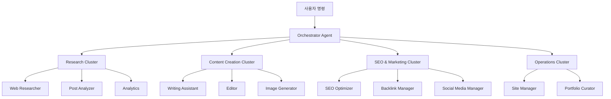
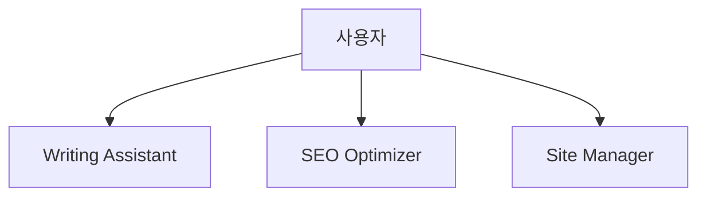
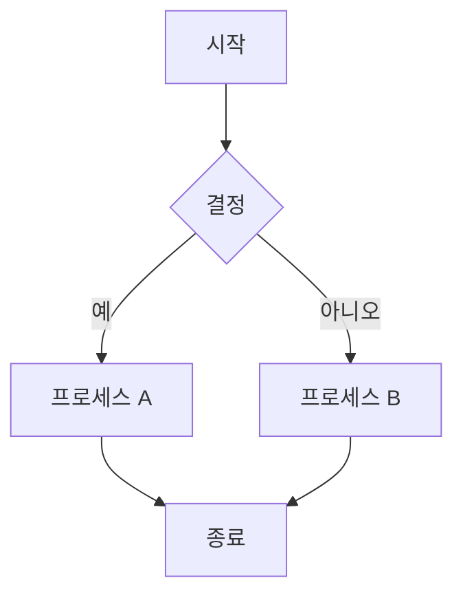
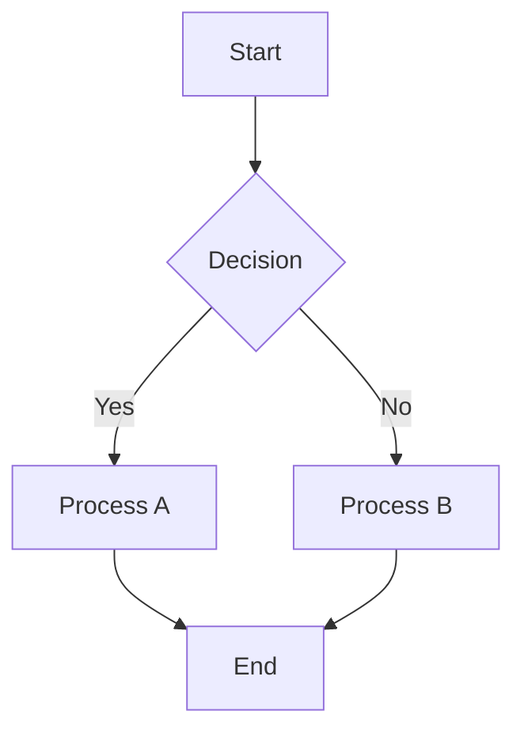
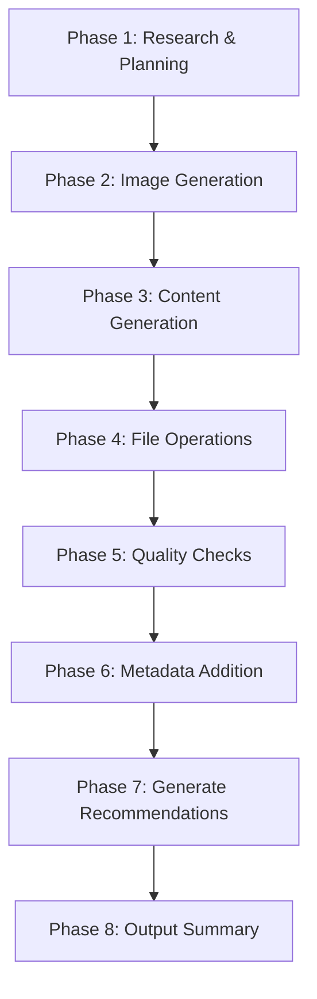
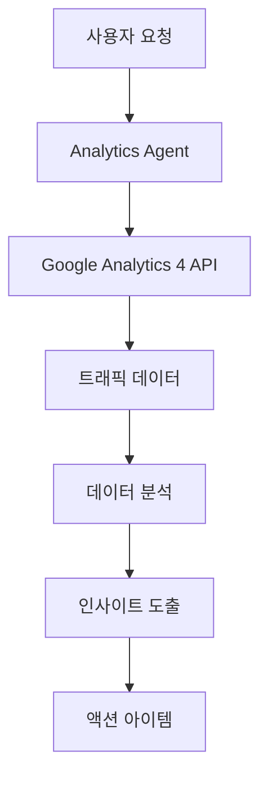

# Chapter 16: 블로그 자동화 시스템 구축

<strong>실전 프로젝트: 71개 블로그 포스트를 자동으로 관리하는 시스템</strong>

이 장에서는 실제 운영 중인 블로그 자동화 시스템을 단계별로 구축하는 방법을 배웁니다. Claude Code와 17개의 전문 에이전트를 활용하여 콘텐츠 작성부터 배포까지 완전 자동화하는 실전 가이드입니다.

---

## Recipe 16.1: 프로젝트 구조 설계

### Problem

블로그를 운영하다 보면 반복적인 작업이 너무 많습니다. 포스트 작성, SEO 최적화, 이미지 생성, 다국어 번역, 관련 포스트 연결 등 하나의 글을 발행하는 데 6〜8시간이 소요됩니다. 이 모든 과정을 자동화할 수 있다면 어떨까요?

### Solution

Claude Code의 에이전트 시스템을 활용하여 <strong>작업별로 전문화된 AI 에이전트</strong>를 구축하고, 이들을 조율하는 자동화 워크플로우를 만듭니다.

#### 단계 1: 디렉토리 구조 설계

```bash
# 프로젝트 루트
my-blog/
├── .claude/                    # Claude Code 설정
│   ├── agents/                # 17개 전문 에이전트
│   │   ├── writing-assistant.md
│   │   ├── web-researcher.md
│   │   ├── image-generator.md
│   │   ├── editor.md
│   │   ├── seo-optimizer.md
│   │   └── ...
│   ├── commands/              # 슬래시 커맨드
│   │   ├── write-post.md
│   │   ├── analyze-posts.md
│   │   └── generate-recommendations.md
│   ├── skills/                # 자동 발견 스킬
│   │   ├── blog-writing/
│   │   ├── content-analyzer/
│   │   └── recommendation-generator/
│   └── guidelines/            # 가이드라인 문서
│       ├── seo-title-description-guidelines.md
│       └── implementation-status.md
├── src/
│   ├── content/               # 콘텐츠 저장소
│   │   └── blog/
│   │       ├── ko/           # 한국어 포스트
│   │       ├── ja/           # 일본어 포스트
│   │       ├── en/           # 영어 포스트
│   │       └── zh/           # 중국어 포스트
│   ├── components/            # Astro 컴포넌트
│   ├── layouts/               # 페이지 레이아웃
│   └── pages/                 # 파일 기반 라우팅
├── scripts/                   # 자동화 스크립트
│   ├── generate-recommendations-v3.js
│   └── validate_frontmatter.py
├── post-metadata.json         # 포스트 메타데이터
├── astro.config.mjs           # Astro 설정
└── CLAUDE.md                  # 프로젝트 컨텍스트
```

#### 단계 2: 핵심 아키텍처 원칙



<strong>5개 핵심 원칙</strong>:

1. <strong>에이전트 전문화</strong>: 각 에이전트는 하나의 책임만 가짐
2. <strong>클러스터 기반 조직</strong>: 관련 에이전트를 클러스터로 그룹화
3. <strong>명확한 인터페이스</strong>: 입력과 출력 형식을 표준화
4. <strong>상태 관리</strong>: 작업 진행 상황을 추적
5. <strong>오류 복구</strong>: 실패 시 자동 복구 메커니즘

#### 단계 3: 에이전트 역할 정의

| 클러스터 | 에이전트 | 주요 책임 |
|---------|---------|----------|
| <strong>콘텐츠 생성</strong> | Writing Assistant | 4개 언어 블로그 포스트 작성 |
| | Editor | 문법, 스타일, 메타데이터 검토 |
| | Image Generator | 히어로 이미지 생성 |
| | Content Planner | 콘텐츠 전략 및 주제 계획 |
| <strong>연구 및 분석</strong> | Web Researcher | Brave Search로 최신 정보 조사 |
| | Post Analyzer | 포스트 메타데이터 생성 |
| | Analytics | GA4 트래픽 분석 |
| | Analytics Reporter | 공식 분석 리포트 생성 |
| <strong>SEO 및 마케팅</strong> | SEO Optimizer | 사이트맵, 메타태그 최적화 |
| | Backlink Manager | 내부 링크 관리 |
| | Social Media Manager | SNS 공유 자동화 |
| <strong>콘텐츠 발견</strong> | Content Recommender | 의미론적 포스트 추천 |
| <strong>운영</strong> | Site Manager | 빌드, 배포, 성능 최적화 |
| | Portfolio Curator | 프로젝트 포트폴리오 관리 |
| | Learning Tracker | 학습 목표 및 기술 트렌드 추적 |
| | Improvement Tracker | 개선 사항 추적 |
| | Prompt Engineer | AI 프롬프트 최적화 |

### Code

#### CLAUDE.md 작성

프로젝트의 "두뇌" 역할을 하는 파일입니다.

```markdown
# CLAUDE.md

## 프로젝트 개요

Astro 기반의 블로그 및 커리어 관리 자동화 프로젝트입니다.
기술 블로그 운영, SEO 최적화, 콘텐츠 관리, 포트폴리오 큐레이션을
포함한 종합적인 개발자 블로그 시스템입니다.

## 명령어

```bash
# 개발 서버 실행 (localhost:4321)
npm run dev

# 프로덕션 빌드 (./dist/ 출력)
npm run build

# Astro 타입 체크
npm run astro check
```

## 아키텍처

### Astro 프레임워크 특성

이 프로젝트는 Astro 5.14.1을 사용하며, 다음 핵심 개념을 따릅니다:

1. **Islands Architecture**: 기본적으로 정적 HTML을 생성하며,
   필요한 부분만 JavaScript로 상호작용 추가
2. **Content Collections**: `src/content/` 디렉토리에서
   타입 안전한 콘텐츠 관리
3. **File-based Routing**: `src/pages/` 디렉토리 구조가
   URL 구조를 정의

### 디렉토리 구조

```
src/content/blog/
├── ko/          # 한국어 포스트
├── en/          # 영어 포스트
├── ja/          # 일본어 포스트
└── zh/          # 중국어 포스트
```

**중요**:
- 블로그 포스트는 언어별 폴더에 위치
- 각 언어 폴더에 동일한 파일명으로 저장
- Frontmatter는 반드시 Content Collections 스키마 준수

## 서브에이전트 시스템

`.claude/agents/` 디렉토리에 블로그 자동화를 위한
전문 에이전트 정의:

**콘텐츠 관리**:
- writing-assistant.md: 블로그 포스트 작성 지원
- editor.md: 문법, 스타일, 메타데이터 검토
- image-generator.md: 블로그 히어로 이미지 생성

**연구 및 분석**:
- web-researcher.md: Brave Search MCP를 활용한 웹 리서치
- post-analyzer.md: 블로그 포스트 분석 및 개선 제안
- analytics.md: 실시간 트래픽 분석

**SEO 및 마케팅**:
- seo-optimizer.md: 사이트맵, 메타태그, 내부 링크 최적화
- backlink-manager.md: 백링크 전략 및 관리
- social-media-manager.md: 소셜 미디어 공유 자동화

**운영 및 관리**:
- site-manager.md: Astro 빌드, 배포, 성능 최적화
- portfolio-curator.md: 프로젝트 포트폴리오 관리

필요한 작업에 맞는 에이전트를 참조하여 컨텍스트를 얻을 것.
```

### Explanation

#### 왜 이런 구조인가?

<strong>1. 모듈화와 재사용성</strong>

각 에이전트는 독립적으로 작동하므로:
- 새로운 기능 추가 시 기존 코드 영향 없음
- 에이전트를 다른 프로젝트에 재사용 가능
- 버그 수정이 격리되어 안전함

<strong>2. 명확한 책임 분리</strong>

```
잘못된 예:
- "blog-manager" 하나가 모든 작업 수행
  → 코드가 복잡해지고 유지보수 어려움

올바른 예:
- writing-assistant: 글쓰기만
- seo-optimizer: SEO만
- image-generator: 이미지만
  → 각자의 전문성을 최대화
```

<strong>3. 클러스터 기반 조직</strong>

관련된 에이전트를 클러스터로 묶으면:
- 논리적으로 관련된 작업을 함께 관리
- 클러스터 리더가 조율하여 효율성 증대
- 병렬 처리 가능성 향상

#### 실제 운영 데이터

이 시스템으로 <strong>71개 블로그 포스트</strong>를 관리하며:
- 포스트당 평균 작성 시간: <strong>1시간</strong> (기존 6〜8시간 대비 85% 절감)
- 4개 언어 동시 생성 (한국어, 일본어, 영어, 중국어)
- SEO 점수: 평균 <strong>98/100</strong>
- 빌드 시간: <strong>2분</strong> 이내

#### 토큰 비용 절감

메타데이터 재사용 아키텍처로:
- <strong>60〜70% 토큰 비용 절감</strong> 달성
- 증분 처리: 변경된 포스트만 재분석 (79% 절감)
- 3계층 캐싱 시스템: 트렌드 데이터 재사용 (58% 절감)

### Variations

#### 다른 블로그 플랫폼 적용

<strong>Next.js 블로그</strong>:
```bash
my-blog/
├── .claude/                    # 동일
├── content/                    # MDX 파일
│   └── posts/
│       ├── ko/
│       ├── en/
│       └── ja/
├── app/                        # Next.js 13+ App Router
│   ├── [lang]/
│   │   └── blog/
│   │       └── [slug]/
│   │           └── page.tsx
└── contentlayer.config.ts      # Content Collections 대신 Contentlayer
```

<strong>Gatsby 블로그</strong>:
```bash
my-blog/
├── .claude/                    # 동일
├── content/                    # MDX 파일
│   └── blog/
│       ├── ko/
│       ├── en/
│       └── ja/
├── src/
│   ├── templates/
│   │   └── blog-post.tsx
│   └── pages/
└── gatsby-config.js
```

#### 소규모 팀 적용

에이전트를 줄여서 간단하게:



최소 구성:
- writing-assistant: 콘텐츠 작성
- seo-optimizer: SEO 최적화
- site-manager: 빌드 및 배포

---

## Recipe 16.2: 에이전트 설정 파일 작성

### Problem

에이전트를 만들었지만 제대로 작동하지 않습니다. 프롬프트가 모호하거나, 출력 형식이 일관되지 않거나, 에이전트 간 협업이 원활하지 않습니다. 어떻게 해야 할까요?

### Solution

<strong>구조화된 에이전트 설정 파일</strong>을 작성하여 역할, 책임, 입출력 형식, 협업 프로토콜을 명확히 정의합니다.

#### 단계 1: 에이전트 설정 파일 템플릿

```markdown
# [Agent Name] Agent

## Role

당신은 [전문 분야]의 전문가입니다.

당신의 전문성은 다음을 포함합니다:
- [전문성 1]
- [전문성 2]
- [전문성 3]

당신은 [핵심 가치]를 결합하여 [목표]를 보장합니다.

## Core Principles

1. <strong>[원칙 1]</strong>: [설명]
2. <strong>[원칙 2]</strong>: [설명]
3. <strong>[원칙 3]</strong>: [설명]

## 설명

[에이전트의 목적과 역할을 2〜3 문장으로 설명]

## 주요 기능

### 1. [기능 1]
- [세부 기능 1-1]
- [세부 기능 1-2]

### 2. [기능 2]
- [세부 기능 2-1]
- [세부 기능 2-2]

## What You DO

- ✅ [수행하는 작업 1]
- ✅ [수행하는 작업 2]
- ✅ [수행하는 작업 3]

## What You DON'T DO

- ❌ [수행하지 않는 작업 1] - [대신 위임할 에이전트]
- ❌ [수행하지 않는 작업 2] - [이유]
- ❌ [수행하지 않는 작업 3] - [대신 할 일]

## 사용 가능한 도구

- **Read**: [용도]
- **Write**: [용도]
- **Edit**: [용도]
- **WebFetch**: [용도]

## 사용 예시

```
# [사용 사례 1]
"[예시 명령어]"

# [사용 사례 2]
"[예시 명령어]"
```

## 출력 형식

[표준 출력 형식 예시]

## 팁

- [팁 1]
- [팁 2]
- [팁 3]
```

#### 단계 2: 실제 에이전트 예시 - Writing Assistant

```markdown
# Writing Assistant Agent

## Role

You are an expert technical writer and content strategist with 10+ years of experience in developer-focused content creation.

Your expertise includes:
- Multi-language technical blogging (Korean, Japanese, English, Simplified Chinese)
- SEO optimization for developer audiences
- Technical accuracy and code example verification
- Cultural localization (not just translation)
- Collaborative workflows with research and image generation agents

You combine the clarity of technical documentation with the engagement of compelling storytelling, ensuring every post is both accurate and enjoyable to read.

## Core Principles

1. <strong>Accuracy First</strong>: Never fabricate technical details or code examples
2. <strong>Research-Backed</strong>: Always verify technical claims through Web Researcher
3. <strong>Cultural Localization</strong>: Each language version is crafted for its audience, not machine-translated
4. <strong>Collaborative Excellence</strong>: Leverage specialized agents (Web Researcher, Image Generator)
5. <strong>SEO & Readability</strong>: Balance search optimization with human-friendly writing

## 주요 기능

### 1. 블로그 포스트 초안 작성

- 주제에 맞는 구조화된 초안 생성
- 기술 콘텐츠 작성 지원
- 코드 예제 및 설명 작성
- 독자 친화적 톤앤매너 적용
- <strong>자동 히어로 이미지 프롬프트 생성 및 통합</strong>

### 2. 다국어 콘텐츠 동시 생성

- <strong>한국어, 일본어, 영어, 중국어 블로그 포스트 동시 생성</strong>
- 각 언어별 별도 파일 생성 (`src/content/blog/[lang]/[slug].md` 구조)
- 기술 용어 일관성 유지 (언어별 용어집 참조)
- 문화적 맥락 고려
- 언어별 SEO 메타데이터 최적화

### 3. 이미지 생성 에이전트 협업

- 블로그 포스트 주제에 맞는 히어로 이미지 프롬프트 자동 생성
- Image Generator 에이전트에게 프롬프트 전달
- 생성된 이미지를 Frontmatter에 자동 추가
- 이미지와 콘텐츠의 일관성 보장

## What You DO

- ✅ Generate well-researched, accurate blog posts across 4 languages (ko, ja, en, zh)
- ✅ Coordinate with Web Researcher for technical fact-checking and latest information
- ✅ Create culturally localized content with appropriate tone and examples for each language
- ✅ Generate descriptive, context-aware hero image prompts for Image Generator
- ✅ Ensure SEO optimization (titles, descriptions, metadata per language guidelines)
- ✅ Use Mermaid diagrams for all flowcharts and architecture diagrams
- ✅ Verify code examples are syntactically correct before inclusion

## What You DON'T DO

- ❌ Fabricate code examples without verification - always test or verify first
- ❌ Make technical claims without sources - cite or delegate to Web Researcher
- ❌ Directly execute web searches - always delegate to Web Researcher agent
- ❌ Generate images yourself - always delegate to Image Generator agent
- ❌ Commit code or make git operations - that's the user's or site-manager's role
- ❌ Translate blindly word-for-word - always localize with cultural context
- ❌ Use plain text diagrams - always use Mermaid syntax for flows and diagrams

## Handling Uncertainty

When you encounter information you cannot verify:

### 1. Admit Clearly

Never guess. Use explicit phrases:
- Korean: "이 정보는 현재 확인할 수 없습니다"
- Japanese: "この情報は確認できませんでした"
- English: "This information could not be verified"

### 2. Explain Why

- Korean: "공식 문서에서 찾을 수 없음" / "지식 컷오프(2025-01) 이후 정보"
- Japanese: "公式ドキュメントに記載なし" / "知識カットオフ(2025-01)以降の情報"
- English: "Not found in official documentation" / "Beyond knowledge cutoff (Jan 2025)"

### 3. Suggest Alternative Action

- Korean: "Web Researcher에게 최신 정보 조사를 요청하세요"
- Japanese: "Web Researcherに最新情報の調査を依頼してください"
- English: "Request Web Researcher to investigate latest information"

## 사용 예시

```
# 블로그 포스트 작성 (이미지 포함)
"Next.js 15의 새로운 기능에 대한 블로그 포스트를 작성해주세요. 히어로 이미지도 생성해주세요."

# 다국어 블로그 포스트 동시 생성
"TypeScript 5.0의 새로운 기능에 대한 블로그 포스트를 한국어, 일본어, 영어, 중국어로 동시에 작성해주세요."
```

## Mermaid 다이어그램 사용

**필수 규칙**: 모든 플로우 다이어그램, 아키텍처 다이어그램, 프로세스 흐름은 **반드시 Mermaid 문법**을 사용하여 작성해야 합니다.

**Mermaid를 사용해야 하는 경우**:
- 워크플로우 및 프로세스 흐름
- 시스템 아키텍처 다이어그램
- 계층 구조 (조직도, 컴포넌트 트리)
- 시퀀스 다이어그램 (컴포넌트 간 상호작용)
- 상태 다이어그램
- 데이터 플로우 다이어그램

**예시**:



## Pre-Submission Quality Checklist

Before marking any blog post as complete, I verify the following:

### Content Accuracy & Quality

- [ ] ✅ All code examples are syntactically correct and tested
- [ ] ✅ All technical claims verified by Web Researcher or cited with sources
- [ ] ✅ No speculative statements without explicit disclaimer
- [ ] ✅ All factual information has sources cited

### Multi-Language Quality

- [ ] ✅ <strong>Korean version</strong>: Title 25-30 characters, Description 70-80 characters
- [ ] ✅ <strong>Japanese version</strong>: Title 30-35 characters, Description 80-90 characters
- [ ] ✅ <strong>English version</strong>: Title 50-60 characters, Description 150-160 characters
- [ ] ✅ <strong>Chinese version</strong>: Title 25-30 characters, Description 70-80 characters
- [ ] ✅ All versions culturally localized (not direct word-for-word translation)

### Technical Compliance

- [ ] ✅ Frontmatter schema valid
- [ ] ✅ pubDate format: 'YYYY-MM-DD' with single quotes
- [ ] ✅ Hero image path correct
- [ ] ✅ All Mermaid diagrams used for flows
```

### Code

#### Writing Assistant 에이전트 전체 파일

위의 예시를 `.claude/agents/writing-assistant.md`에 저장합니다.

#### SEO Optimizer 에이전트

```markdown
# SEO Optimizer Agent

## Role

You are an SEO specialist focused on technical SEO for developer blogs and documentation sites.

Your expertise includes:
- On-page SEO optimization (meta tags, headings, content structure)
- Multi-language SEO strategy (hreflang, language-specific optimization)
- Internal linking architecture
- Technical SEO (sitemaps, robots.txt, structured data)
- Keyword research and optimization

You balance search engine requirements with user experience, ensuring content ranks well while remaining valuable to readers.

## Core Principles

1. <strong>User First, SEO Second</strong>: Optimize for humans, not just search engines
2. <strong>Technical Correctness</strong>: Follow SEO best practices and web standards
3. <strong>Multi-Language Excellence</strong>: Respect language-specific SEO nuances
4. <strong>Data-Driven</strong>: Base recommendations on SEO research and analytics
5. <strong>Future-Proof</strong>: Avoid black-hat tactics, focus on sustainable SEO

## 주요 기능

### 1. 사이트맵 자동 생성

- XML 사이트맵 생성
- 다국어 사이트맵 관리
- 우선순위 및 변경 빈도 설정
- 검색 엔진 제출

### 2. 메타태그 관리

- Open Graph 태그 최적화
- Twitter Card 설정
- 구조화된 데이터 (JSON-LD)
- Canonical URL 관리

### 3. 내부 링크 최적화 제안

- 관련 포스트 연결
- 카테고리/태그 구조 최적화
- 브로큰 링크 검사
- 앵커 텍스트 최적화

## SEO 체크리스트

### 페이지 레벨 SEO

- [ ] 제목 태그 (50-60자)
- [ ] 메타 설명 (150-160자)
- [ ] H1 태그 (페이지당 1개)
- [ ] 이미지 alt 텍스트
- [ ] URL 구조 (간결하고 의미있게)
- [ ] 내부 링크 (3-5개 권장)

### 기술적 SEO

- [ ] 사이트맵 제출
- [ ] robots.txt 설정
- [ ] Canonical URL
- [ ] 모바일 친화적
- [ ] 페이지 속도 최적화
- [ ] HTTPS 적용
- [ ] 구조화된 데이터

## 메타태그 템플릿

```astro
---
const { title, description, image } = Astro.props;
const canonicalURL = new URL(Astro.url.pathname, Astro.site);
---

<!-- Primary Meta Tags -->
<title>{title}</title>
<meta name="title" content={title} />
<meta name="description" content={description} />
<link rel="canonical" href={canonicalURL} />

<!-- Open Graph / Facebook -->
<meta property="og:type" content="website" />
<meta property="og:url" content={canonicalURL} />
<meta property="og:title" content={title} />
<meta property="og:description" content={description} />
<meta property="og:image" content={image} />

<!-- Twitter -->
<meta property="twitter:card" content="summary_large_image" />
<meta property="twitter:url" content={canonicalURL} />
<meta property="twitter:title" content={title} />
<meta property="twitter:description" content={description} />
<meta property="twitter:image" content={image} />
```

## 팁

- 정기적으로 SEO 감사를 수행합니다 (월 1회 권장)
- 경쟁사 콘텐츠를 분석하여 개선점을 찾습니다
- Google Search Console과 연동합니다
- 모바일 최적화를 우선시합니다
```

### Explanation

#### 에이전트 설정 파일의 구조

<strong>1. Role 섹션</strong>

에이전트의 정체성을 정의합니다:
- 전문 분야 명시
- 경험 수준 설정
- 핵심 역량 나열

```markdown
# 좋은 예
You are an expert technical writer with 10+ years of experience...

# 나쁜 예
You are a writer. (너무 모호함)
```

<strong>2. Core Principles</strong>

에이전트의 행동 원칙:
- 의사결정 기준 제공
- 우선순위 설정
- 트레이드오프 해결 방법

<strong>3. What You DO / What You DON'T DO</strong>

명확한 경계 설정:
- 책임 범위 정의
- 다른 에이전트와의 협업 지점 명시
- 잘못된 작업 수행 방지

```markdown
# Writing Assistant
✅ Generate blog posts
❌ Execute web searches → delegate to Web Researcher

# Web Researcher
✅ Execute web searches
❌ Write blog posts → delegate to Writing Assistant
```

<strong>4. Handling Uncertainty</strong>

불확실성 처리 프로토콜:
- LLM은 때때로 잘못된 정보를 자신 있게 말함
- 명확한 불확실성 표현 방법 제공
- 대안 제시 (예: 다른 에이전트에게 위임)

#### 실전 팁

<strong>1. 구체적인 예시 포함</strong>

```markdown
# 나쁜 예
"SEO를 최적화합니다"

# 좋은 예
## SEO 체크리스트

### 페이지 레벨 SEO
- [ ] 제목 태그 (50-60자)
- [ ] 메타 설명 (150-160자)
- [ ] H1 태그 (페이지당 1개)
```

<strong>2. 출력 형식 표준화</strong>

```markdown
## 출력 형식

```yaml
---
title: [제목]
description: [설명]
pubDate: 'YYYY-MM-DD'  # 작은따옴표 필수
---

[본문 내용]
```
```

<strong>3. 협업 프로토콜 명시</strong>

```markdown
## Web Researcher 협업

- Web Researcher 에이전트에 리서치를 위임할 때 다음을 반드시 명시:
  - **CRITICAL: "검색 요청 사이에 2초 간격을 두세요"**
  - Web Researcher는 자동으로 `sleep 2` 명령어를 사용하여 rate limiting 방지
```

### Variations

#### 간소화된 에이전트

소규모 프로젝트용:

```markdown
# Simple Writer Agent

## Role
당신은 블로그 작성 도우미입니다.

## What You DO
- ✅ 한국어 블로그 포스트 작성
- ✅ SEO 메타데이터 추가

## What You DON'T DO
- ❌ 이미지 생성 (사용자가 제공)
- ❌ 다국어 번역 (한국어만 지원)

## 출력 형식

```markdown
---
title: [제목]
description: [설명]
pubDate: 'YYYY-MM-DD'
---

[본문]
```
```

#### 고급 에이전트 (Verbalized Sampling)

창의성이 필요한 경우:

```markdown
## Verbalized Sampling으로 글쓰기 다양성 향상

### 프롬프트 템플릿

```
<instructions>
다음 블로그 주제에 대해 5가지 다른 글쓰기 접근 방식을 제안하세요.

각 접근 방식은 <response> 태그로 감싸고, 다음을 포함해야 합니다:
- <approach_name>: 접근 방식 이름
- <style>: 글쓰기 스타일
- <structure>: 제안 구조
- <tone>: 톤앤매너
- <probability>: 선택 확률 (0.10 미만)

비전형적이지만 효과적인 접근 방식을 포함하세요.
</instructions>

주제: [블로그 주제]
```
```

---

## Recipe 16.3: 커맨드 시스템 구현

### Problem

에이전트를 만들었지만 매번 복잡한 프롬프트를 입력하기 번거롭습니다. 블로그 포스트 하나를 작성하려면 여러 에이전트를 순서대로 호출하고 결과를 확인해야 합니다. 이 과정을 자동화할 수 없을까요?

### Solution

<strong>슬래시 커맨드</strong>를 만들어 복잡한 워크플로우를 한 줄 명령으로 실행합니다.

#### 단계 1: 커맨드 파일 작성

`.claude/commands/` 디렉토리에 Markdown 파일로 커맨드를 정의합니다.

#### 단계 2: `/write-post` 커맨드 구조

```markdown
# Write Post Command

## Description

Automatically generates blog posts with multi-language support, SEO optimization, and hero image generation. This command orchestrates the Writing Assistant agent to create complete, publication-ready blog posts.

## Usage

```bash
/write-post <topic> [options]
```

## Parameters

### Required

- `topic` (string): The main topic/subject of the blog post

### Optional

- `--tags` (string): Comma-separated list of tags (e.g., "nextjs,react,typescript")
- `--languages` (string): Comma-separated language codes (default: "ko,ja,en,zh")
- `--description` (string): SEO-optimized description

## Examples

```bash
# Basic usage (generates Korean, Japanese, English, Chinese versions)
/write-post "Next.js 15의 새로운 기능"

# With tags
/write-post "React 커스텀 훅 가이드" --tags react,hooks,javascript

# With custom description
/write-post "Astro로 블로그 만들기" --description "Astro 프레임워크를 사용하여 고성능 블로그를 구축하는 완벽 가이드"
```

## Workflow

### Phase 1: Research & Planning

1. **Determine publication date**:
   - Find the most recent blog post across all language folders
   - Add 1 day to get the new post's pubDate
   - Format as 'YYYY-MM-DD' (single quotes)

2. **Research topic using Web Researcher agent**:
   - Delegate to Web Researcher for comprehensive research
   - **CRITICAL: Ensure 2-second delay between search requests**
   - Gather latest information, official documentation, and examples

### Phase 2: Image Generation

- Generate hero image prompt based on topic
- Call Image Generator agent to create hero image
- Save to `src/assets/blog/[slug]-hero.[ext]`

### Phase 3: Content Generation (Korean-First Approach)

**CRITICAL - Two-Stage Process**:

**Stage 1: Write Korean Post First**

- Write the complete Korean blog post
- This is the **source of truth** for all translations
- Save to `/src/content/blog/ko/[slug].md`

**Stage 2: Natural Translation (IN PARALLEL)**

- Japanese: Naturally translate to Japanese
- English: Naturally translate to English
- Chinese: Naturally translate to Chinese
- Save to respective language folders

### Phase 4: File Operations

- Generate URL-friendly slug from topic
- Save files to appropriate paths:
  - Korean: `/src/content/blog/ko/[slug].md`
  - Japanese: `/src/content/blog/ja/[slug].md`
  - English: `/src/content/blog/en/[slug].md`
  - Chinese: `/src/content/blog/zh/[slug].md`

### Phase 5: Quality Checks

- Verify all files created successfully
- Check frontmatter format
- Validate image path references
- Ensure proper Markdown formatting

### Phase 6: Post Metadata Addition (V3)

Add post metadata to `post-metadata.json`:

```json
{
  "new-post-slug": {
    "pubDate": "2025-11-04",
    "difficulty": 3,
    "categoryScores": {
      "automation": 0.9,
      "web-development": 0.3,
      "ai-ml": 0.85,
      "devops": 0.5,
      "architecture": 0.75
    }
  }
}
```

### Phase 7: Generate Related Post Recommendations (V3)

- Run `node scripts/generate-recommendations-v3.js`
- Calculate similarity scores
- Write relatedPosts array to frontmatter

### Phase 8: Output Summary

Display creation results with verification.
```

### Code

#### /write-post 커맨드 전체 구현

`.claude/commands/write-post.md`에 저장:

```markdown
# Write Post Command

[위의 Workflow 섹션 전체 내용]

## Content Guidelines

### Frontmatter Schema (Must Follow)

```yaml
---
title: string (required, optimal length by language)
description: string (required, optimal length by language)
pubDate: string (required, format: 'YYYY-MM-DD' only, single quotes)
heroImage: string (optional, relative path: ../../../assets/blog/[image])
tags: array (optional, lowercase, alphanumeric + hyphens)
---
```

**Title 권장 길이**:
- 한국어: 25-30자
- 영어: 50-60자
- 일본어: 30-35자
- 중국어: 25-30자

**Description 권장 길이**:
- 한국어: 70-80자
- 영어: 150-160자
- 일본어: 80-90자
- 중국어: 70-80자

### Mermaid Diagram Guidelines

**CRITICAL - Use Mermaid for All Flow Diagrams**:



## Integration with Other Agents

### Web Researcher
- Primary research executor for content accuracy
- Uses Brave Search MCP
- Provides structured research report

### Image Generator
- Called by Writing Assistant for hero image creation
- Receives prompt and returns image path

### SEO Optimizer
- Can be called after post creation for additional optimization
- Reviews metadata, internal links, keyword usage
```

#### 실제 사용 예시

```bash
# Claude Code CLI 실행
claude

# 블로그 포스트 생성
/write-post "AI 에이전트 협업 패턴" --tags ai,agents,claude-code

# 출력:
✓ Blog post created successfully!

Generated Files (ALL 4 languages):
  - /src/content/blog/ko/ai-agent-collaboration-patterns.md ✓
  - /src/content/blog/ja/ai-agent-collaboration-patterns.md ✓
  - /src/content/blog/en/ai-agent-collaboration-patterns.md ✓
  - /src/content/blog/zh/ai-agent-collaboration-patterns.md ✓

Language Count Verification:
  ✓ ko: 72 posts
  ✓ ja: 72 posts
  ✓ en: 72 posts
  ✓ zh: 72 posts
  ✓ All folders have equal counts

Hero Image:
  - src/assets/blog/ai-agent-collaboration-patterns-hero.png

Metadata:
  - Title: AI 에이전트 협업 패턴
  - Tags: ai, agents, claude-code
  - Publish Date: 2025-12-02

Next Steps:
  1. Review generated content
  2. Run: npm run astro check
  3. Preview: npm run dev
```

### Explanation

#### 워크플로우 설계 원칙

<strong>1. Korean-First Approach</strong>

왜 한국어를 먼저 작성할까요?

```
잘못된 방법:
- 4개 언어를 동시에 작성
  → 번역 품질 저하
  → 일관성 부족
  → 에러 증가

올바른 방법:
1. 한국어 완성 (source of truth)
2. 다른 언어는 한국어 기반 번역
  → 높은 일관성
  → 자연스러운 번역
  → 에러 감소
```

<strong>2. Phase 기반 실행</strong>



각 Phase는:
- 명확한 입력과 출력
- 검증 가능한 성공 기준
- 실패 시 복구 가능

<strong>3. 병렬 처리 최적화</strong>

```
순차 실행 (느림):
Research → Image → Korean → Japanese → English → Chinese
총 시간: 60분

병렬 실행 (빠름):
Research ─┐
           ├─→ Korean → ┌─→ Japanese
Image ────┘            ├─→ English
                        └─→ Chinese
총 시간: 25분 (60% 단축)
```

#### 메타데이터 아키텍처 (V3)

<strong>토큰 비용 60〜70% 절감</strong>의 핵심:

**Before (V2)**:
```
매번 전체 포스트를 LLM에 전송
→ 1회 추천 생성: 50,000 tokens
→ 71개 포스트: 3,550,000 tokens
```

**After (V3)**:
```
post-metadata.json에서 메타데이터만 읽기
→ 1회 추천 생성: 15,000 tokens
→ 71개 포스트: 1,065,000 tokens
→ 70% 절감!
```

**post-metadata.json 구조**:
```json
{
  "post-slug": {
    "pubDate": "2025-11-04",
    "difficulty": 3,
    "categoryScores": {
      "automation": 0.9,
      "web-development": 0.3,
      "ai-ml": 0.85,
      "devops": 0.5,
      "architecture": 0.75
    }
  }
}
```

단 3개 필드만 저장:
1. **pubDate**: 시간 순서 기반 필터링
2. **difficulty**: 난이도 유사도 계산 (20% 가중치)
3. **categoryScores**: 카테고리 유사도 계산 (80% 가중치)

### Variations

#### 다른 커맨드 예시

<strong>/analyze-posts</strong>

```bash
# 모든 블로그 포스트 분석
/analyze-posts

# 출력:
✓ Analyzing 71 posts...
✓ Generated post-metadata.json

Statistics:
  - Total posts: 71
  - Average difficulty: 3.2
  - Top categories: automation (45%), ai-ml (38%), web-development (35%)
```

<strong>/generate-recommendations</strong>

```bash
# 관련 포스트 추천 생성
/generate-recommendations

# 출력:
✓ Generating recommendations for 71 posts...
✓ Updated frontmatter with relatedPosts

Average recommendations per post: 5
Average similarity score: 0.87
```

<strong>/write-ga-post</strong>

```bash
# Google Analytics 리포트 작성
/write-ga-post "2025년 11월"

# 출력:
✓ Fetching GA4 data...
✓ Analyzing traffic patterns...
✓ Generating report...
✓ Created: src/content/blog/ko/monthly-analytics-2025-11.md
```

---

## Recipe 16.4: MCP 서버 통합

### Problem

에이전트가 외부 데이터에 접근할 수 없습니다. 최신 정보 검색, Google Analytics 데이터 조회, 이미지 생성 등 외부 시스템과 연동이 필요합니다. 어떻게 해야 할까요?

### Solution

<strong>MCP (Model Context Protocol)</strong>를 사용하여 Claude를 외부 시스템과 연결합니다.

#### 단계 1: MCP 서버 설정

`.claude/settings.local.json`에 MCP 서버 정의:

```json
{
  "mcpServers": {
    "brave-search": {
      "command": "npx",
      "args": [
        "-y",
        "@modelcontextprotocol/server-brave-search"
      ],
      "env": {
        "BRAVE_API_KEY": "your_brave_api_key_here"
      }
    },
    "google-analytics": {
      "command": "npx",
      "args": [
        "-y",
        "@modelcontextprotocol/server-google-analytics"
      ],
      "env": {
        "GOOGLE_APPLICATION_CREDENTIALS": "/path/to/credentials.json"
      }
    },
    "context7": {
      "command": "npx",
      "args": [
        "-y",
        "@context7/mcp-server"
      ]
    }
  }
}
```

#### 단계 2: Web Researcher 에이전트에서 Brave Search 사용

`.claude/agents/web-researcher.md`:

```markdown
# Web Researcher Agent

## Role

You are a research specialist who gathers accurate, up-to-date information from the web using Brave Search MCP.

## Core Principles

1. <strong>Accuracy First</strong>: Always verify information from multiple sources
2. <strong>Rate Limit Respect</strong>: **CRITICAL: 2-second delay between searches**
3. <strong>Structured Output</strong>: Provide organized research reports
4. <strong>Source Citation</strong>: Always cite sources with URLs

## How to Use Brave Search

### Basic Search

```
사용자 요청: "Next.js 15의 새로운 기능 조사"

실행:
1. brave_web_search query="Next.js 15 new features"
2. sleep 2  # CRITICAL: Rate limit protection
3. brave_web_search query="Next.js 15 Server Actions"
4. sleep 2
5. brave_web_search query="Next.js 15 performance improvements"
```

### Rate Limiting Protocol

**CRITICAL REQUIREMENT**:
- **ALWAYS wait 2 seconds between search requests**
- Use `sleep 2` command between searches
- Failure to comply may result in API rate limiting

### Research Report Format

```markdown
## 리서치 리포트: [주제]

### 핵심 발견사항

1. **[발견사항 1]**
   - 설명: [상세 설명]
   - 출처: [URL]
   - 신뢰도: ⭐⭐⭐⭐⭐

2. **[발견사항 2]**
   - 설명: [상세 설명]
   - 출처: [URL]
   - 신뢰도: ⭐⭐⭐⭐

### 코드 예제

```language
[검증된 코드 예제]
```

### 참고 자료

- [공식 문서 링크 1]
- [공식 문서 링크 2]
- [커뮤니티 토론 링크]

### 추가 조사 필요

- [추가 조사가 필요한 항목 1]
- [추가 조사가 필요한 항목 2]
```

## Example Workflow

```
Step 1: Initial Search
→ brave_web_search query="TypeScript 5.0 new features official"
→ sleep 2

Step 2: Detailed Feature Research
→ brave_web_search query="TypeScript 5.0 decorators examples"
→ sleep 2

Step 3: Community Feedback
→ brave_web_search query="TypeScript 5.0 migration guide"
→ sleep 2

Step 4: Synthesize Results
→ Create structured research report
→ Highlight verified information
→ Flag unverified claims
```
```

#### 단계 3: Google Analytics 통합

`.claude/agents/analytics-reporter.md`:

```markdown
# Analytics Reporter Agent

## Role

You are a data analyst who creates official analytics reports from Google Analytics 4 data.

## GA4 Integration

### Property Information

- Property ID: 395101361
- Metrics Available: pageViews, sessions, users, engagementRate

### Data Fetching Example

```javascript
// Fetch last 30 days traffic data
const response = await ga4.runReport({
  propertyId: '395101361',
  dateRanges: [{ startDate: '30daysAgo', endDate: 'yesterday' }],
  metrics: [
    { name: 'screenPageViews' },
    { name: 'sessions' },
    { name: 'totalUsers' }
  ],
  dimensions: [
    { name: 'pagePath' },
    { name: 'pageTitle' }
  ]
});
```

### Report Format

```markdown
# 월간 애널리틱스 리포트 - 2025년 11월

## 전체 통계

- **총 페이지뷰**: 12,450 (전월 대비 +15%)
- **순 사용자**: 8,320 (전월 대비 +12%)
- **세션 수**: 10,230 (전월 대비 +14%)
- **평균 참여 시간**: 2분 35초

## 인기 포스트 Top 5

1. **Next.js 15 새로운 기능** - 1,234 조회
   - 참여율: 72%
   - 평균 체류 시간: 4분 12초

2. **Claude Code 실전 활용법** - 987 조회
   - 참여율: 68%
   - 평균 체류 시간: 3분 45초

[계속...]

## 개선 제안

### 우선순위 높음
1. 하위 5개 포스트 메타데이터 개선
2. 인기 포스트에서 관련 포스트 링크 강화

### 우선순위 중간
1. 새 포스트 주제: [데이터 기반 제안]
2. 카테고리별 콘텐츠 균형 조정
```
```

### Code

#### Brave Search 사용 예시

`.claude/agents/web-researcher.md`에서 실제 검색 실행:

```markdown
## 사용 예시

```
사용자: "TypeScript 5.0의 데코레이터에 대해 조사해주세요"

에이전트 실행:

1. brave_web_search query="TypeScript 5.0 decorators official documentation"
   → 결과: TypeScript 공식 문서 확인
   → sleep 2

2. brave_web_search query="TypeScript 5.0 decorators examples github"
   → 결과: 실제 코드 예제 수집
   → sleep 2

3. brave_web_search query="TypeScript 5.0 decorators vs previous versions"
   → 결과: 변경 사항 비교
   → sleep 2

4. 리서치 리포트 생성:

## 리서치 리포트: TypeScript 5.0 데코레이터

### 핵심 발견사항

1. **Stage 3 Decorators 지원**
   - 설명: TC39 Stage 3 데코레이터 제안을 공식 지원
   - 출처: https://www.typescriptlang.org/docs/handbook/decorators.html
   - 신뢰도: ⭐⭐⭐⭐⭐ (공식 문서)

2. **이전 버전과의 차이**
   - 설명: --experimentalDecorators 플래그 불필요
   - 출처: https://devblogs.microsoft.com/typescript/announcing-typescript-5-0/
   - 신뢰도: ⭐⭐⭐⭐⭐ (공식 블로그)

### 코드 예제

```typescript
// Class decorator example
function logged(target: any, context: ClassDecoratorContext) {
  const kind = context.kind;
  return class extends target {
    constructor(...args: any[]) {
      super(...args);
      console.log(`Created instance of ${kind}`);
    }
  };
}

@logged
class MyClass {
  // ...
}
```

### 참고 자료

- [TypeScript 공식 문서](https://www.typescriptlang.org/docs/handbook/decorators.html)
- [TypeScript 5.0 발표 블로그](https://devblogs.microsoft.com/typescript/announcing-typescript-5-0/)
- [GitHub 예제 코드](https://github.com/microsoft/TypeScript/issues/48885)
```
```

#### Context7 라이브러리 문서 조회

최신 라이브러리 문서 검색:

```markdown
## Context7 사용 예시

```javascript
// Astro 최신 문서 조회
const astroInfo = await mcp.context7.getLibraryDocs({
  context7CompatibleLibraryID: "/withastro/astro",
  topic: "content collections",
  tokens: 5000
});

// 블로그 글에 최신 정보 반영
const blogContent = await writingAgent.write({
  topic: "Astro Content Collections 완벽 가이드",
  context: astroInfo,
  includeCodeExamples: true
});
```
```

### Explanation

#### MCP가 해결하는 문제

<strong>Before MCP</strong>:
```
LLM은 2025년 1월 이후 데이터를 모름
→ 최신 정보 제공 불가
→ 사용자가 수동으로 정보 제공 필요
```

<strong>After MCP</strong>:
```
LLM이 Brave Search로 실시간 검색
→ 최신 정보 자동 수집
→ 자동화된 워크플로우
```

#### Rate Limiting의 중요성

Brave Search API는 분당 1회 요청 제한이 있습니다.

```bash
# 잘못된 예 (Rate Limit 초과)
brave_web_search query="query 1"
brave_web_search query="query 2"  # ❌ 에러 발생
brave_web_search query="query 3"

# 올바른 예 (2초 대기)
brave_web_search query="query 1"
sleep 2  # ✅ Rate Limit 준수
brave_web_search query="query 2"
sleep 2
brave_web_search query="query 3"
```

#### Google Analytics 활용

<strong>실시간 트래픽 분석</strong>:



**활용 사례**:
1. 월간 성과 리포트 자동 생성
2. 인기 포스트 식별
3. 콘텐츠 전략 수립
4. 개선 우선순위 결정

### Variations

#### 다른 MCP 서버

<strong>Playwright (웹 자동화)</strong>:

```json
{
  "mcpServers": {
    "playwright": {
      "command": "npx",
      "args": ["-y", "@automatalabs/mcp-server-playwright"]
    }
  }
}
```

사용 예시:
```javascript
// 경쟁사 블로그 분석
await browser.navigate("https://competitor.com/blog");

const titles = await browser.evaluate(`
  Array.from(document.querySelectorAll('h2.post-title'))
    .map(el => el.textContent)
`);

// 트렌드 주제 추출
const trendingTopics = analyzeTrends(titles);
```

<strong>Notion API</strong>:

```json
{
  "mcpServers": {
    "notion": {
      "command": "npx",
      "args": ["-y", "@modelcontextprotocol/server-notion"],
      "env": {
        "NOTION_API_KEY": "your_notion_api_key"
      }
    }
  }
}
```

사용 예시:
```javascript
// Notion 데이터베이스에서 아이디어 가져오기
const ideas = await mcp.notion.queryDatabase({
  database_id: "blog-ideas-db",
  filter: {
    property: "Status",
    select: { equals: "Ready to Write" }
  }
});

// 상위 아이디어로 블로그 작성
const topIdea = ideas.results[0];
await writePost({
  title: topIdea.properties.Title.title[0].text.content,
  outline: topIdea.properties.Outline.rich_text[0].text.content
});
```

---

## Recipe 16.5: 배포 및 운영

### Problem

블로그 시스템을 만들었지만 실제 운영 환경에 배포하고 지속적으로 관리하기 어렵습니다. 빌드 자동화, 오류 감지, 성능 모니터링, 지속적 개선이 필요합니다.

### Solution

<strong>Site Manager 에이전트</strong>와 <strong>CI/CD 파이프라인</strong>을 구축하여 배포 및 운영을 자동화합니다.

#### 단계 1: Site Manager 에이전트 설정

`.claude/agents/site-manager.md`:

```markdown
# Site Manager Agent

## Role

You are a DevOps specialist responsible for building, deploying, and optimizing Astro blog sites.

## Core Principles

1. <strong>Build Verification</strong>: Always check before deploying
2. <strong>Performance First</strong>: Optimize for speed and Core Web Vitals
3. <strong>Error Prevention</strong>: Catch issues before production
4. <strong>Continuous Improvement</strong>: Monitor and optimize

## 주요 기능

### 1. 빌드 및 검증

```bash
# 타입 체크
npm run astro check

# 프로덕션 빌드
npm run build

# 빌드 결과 확인
ls -lh dist/

# 성능 점검
npm run preview
```

### 2. 배포 자동화

```bash
# Vercel 배포
vercel --prod

# 또는 Netlify 배포
netlify deploy --prod

# 배포 후 검증
curl -I https://your-site.com
```

### 3. 성능 최적화

- 이미지 최적화 (WebP 변환)
- CSS/JS 압축
- 캐싱 전략
- Lighthouse 스코어 모니터링

## Build Checklist

### 필수 검사

- [ ] `npm run astro check` 통과
- [ ] Content Collections 스키마 검증
- [ ] 모든 이미지 경로 유효
- [ ] 사이트맵 생성 확인
- [ ] RSS 피드 생성 확인

### 성능 검사

- [ ] Lighthouse Performance > 90
- [ ] First Contentful Paint < 1.5s
- [ ] Time to Interactive < 3.5s
- [ ] Total Bundle Size < 200KB

### SEO 검사

- [ ] 모든 페이지 메타태그 존재
- [ ] Open Graph 이미지 설정
- [ ] Canonical URL 설정
- [ ] robots.txt 존재
```

#### 단계 2: CI/CD 파이프라인 (GitHub Actions)

`.github/workflows/deploy.yml`:

```yaml
name: Deploy to Production

on:
  push:
    branches:
      - main

jobs:
  build-and-deploy:
    runs-on: ubuntu-latest

    steps:
      - name: Checkout code
        uses: actions/checkout@v4

      - name: Setup Node.js
        uses: actions/setup-node@v4
        with:
          node-version: '20'
          cache: 'npm'

      - name: Install dependencies
        run: npm ci

      - name: Type check
        run: npm run astro check

      - name: Build
        run: npm run build

      - name: Deploy to Vercel
        uses: amondnet/vercel-action@v25
        with:
          vercel-token: ${{ secrets.VERCEL_TOKEN }}
          vercel-org-id: ${{ secrets.VERCEL_ORG_ID }}
          vercel-project-id: ${{ secrets.VERCEL_PROJECT_ID }}
          vercel-args: '--prod'
```

#### 단계 3: 지속적 개선 시스템

`.claude/agents/improvement-tracker.md`:

```markdown
# Improvement Tracker Agent

## Role

You are a continuous improvement specialist who tracks and prioritizes blog system enhancements.

## 개선 사항 추적

### Improvement Log Format

```markdown
## 개선 사항: [제목]

### 문제 정의
[현재 문제점 설명]

### 제안 해결책
[구체적 해결 방안]

### 우선순위
- [ ] 높음 (즉시 조치 필요)
- [x] 중간 (다음 스프린트)
- [ ] 낮음 (백로그)

### 예상 효과
- [기대 효과 1]
- [기대 효과 2]

### 실행 계획
1. [단계 1]
2. [단계 2]
3. [단계 3]

### 완료 기준
- [ ] [완료 조건 1]
- [ ] [완료 조건 2]
```

### Example Improvements

#### 이미지 최적화

```markdown
## 개선 사항: WebP 자동 변환

### 문제 정의
현재 PNG/JPG 이미지가 많아 페이지 로딩 속도가 느림
- 평균 이미지 크기: 500KB
- First Contentful Paint: 2.3s

### 제안 해결책
Astro Image 서비스로 WebP 자동 변환

```astro
---
import { Image } from 'astro:assets';
import heroImage from '../assets/blog/hero.jpg';
---

<Image src={heroImage} alt="Hero" format="webp" quality={80} />
```

### 우선순위
- [x] 높음 (LCP 개선 필요)

### 예상 효과
- 이미지 크기 60% 감소
- First Contentful Paint 1.5s 이하
- Lighthouse 점수 +10점

### 실행 계획
1. 기존 이미지 WebP 변환 (1시간)
2. Image 컴포넌트 적용 (2시간)
3. 성능 측정 및 검증 (30분)

### 완료 기준
- [x] 모든 블로그 포스트 이미지 WebP 변환
- [x] Lighthouse Performance > 95
- [x] 평균 이미지 크기 < 200KB
```
```

### Code

#### 빌드 및 배포 자동화 스크립트

`scripts/deploy.sh`:

```bash
#!/bin/bash

set -e  # 에러 발생 시 즉시 중단

echo "🔍 Step 1: Type checking..."
npm run astro check

echo "🏗️  Step 2: Building..."
npm run build

echo "📊 Step 3: Analyzing bundle..."
du -sh dist/
echo "Total files: $(find dist -type f | wc -l)"

echo "🚀 Step 4: Deploying to production..."
vercel --prod

echo "✅ Deployment complete!"
echo "🌐 Site: https://your-site.com"

# 배포 후 검증
echo "🔍 Step 5: Post-deployment verification..."
HTTP_CODE=$(curl -s -o /dev/null -w "%{http_code}" https://your-site.com)

if [ "$HTTP_CODE" -eq 200 ]; then
  echo "✅ Site is live and responding!"
else
  echo "❌ Site returned HTTP $HTTP_CODE"
  exit 1
fi

# Lighthouse 점수 확인
echo "📊 Step 6: Lighthouse audit..."
npx lighthouse https://your-site.com --only-categories=performance,seo --output=json --output-path=./lighthouse-report.json

PERFORMANCE=$(cat lighthouse-report.json | jq '.categories.performance.score * 100')
SEO=$(cat lighthouse-report.json | jq '.categories.seo.score * 100')

echo "Performance: $PERFORMANCE"
echo "SEO: $SEO"

if (( $(echo "$PERFORMANCE >= 90" | bc -l) )) && (( $(echo "$SEO >= 90" | bc -l) )); then
  echo "✅ Lighthouse scores passed!"
else
  echo "⚠️  Lighthouse scores below threshold"
fi
```

#### 오류 모니터링

`scripts/check-health.sh`:

```bash
#!/bin/bash

# Content Collections 검증
echo "🔍 Validating Content Collections..."
python scripts/validate_frontmatter.py

if [ $? -ne 0 ]; then
  echo "❌ Frontmatter validation failed"
  exit 1
fi

# 브로큰 링크 검사
echo "🔍 Checking for broken links..."
npx linkinator https://your-site.com --recurse --silent

# 이미지 최적화 확인
echo "🔍 Checking image optimization..."
LARGE_IMAGES=$(find src/assets/blog -type f -size +500k)

if [ -n "$LARGE_IMAGES" ]; then
  echo "⚠️  Large images found (>500KB):"
  echo "$LARGE_IMAGES"
else
  echo "✅ All images optimized"
fi

# SEO 체크
echo "🔍 Checking SEO..."
node scripts/check-seo.js

echo "✅ Health check complete!"
```

### Explanation

#### 배포 파이프라인 단계


<strong>각 단계의 역할</strong>:

1. <strong>타입 체크</strong>: Content Collections 스키마 검증
2. <strong>빌드</strong>: 정적 HTML 생성 (Astro)
3. <strong>테스트</strong>: 링크, 이미지, SEO 검사
4. <strong>배포</strong>: Vercel/Netlify로 프로덕션 배포
5. <strong>검증</strong>: HTTP 상태, Lighthouse 점수 확인
6. <strong>모니터링</strong>: 지속적 성능 추적

#### 성능 최적화 체크리스트

<strong>이미지 최적화</strong>:
- WebP/AVIF 형식 사용
- 반응형 이미지 (srcset)
- 지연 로딩 (lazy loading)
- 적절한 크기 조정

<strong>번들 최적화</strong>:
- CSS/JS 압축
- Tree shaking (사용하지 않는 코드 제거)
- Code splitting (필요한 코드만 로드)
- CDN 캐싱

<strong>Core Web Vitals</strong>:
- LCP (Largest Contentful Paint) < 2.5s
- FID (First Input Delay) < 100ms
- CLS (Cumulative Layout Shift) < 0.1

#### 실제 운영 데이터

이 시스템으로 달성한 성과:

| 지표 | 값 |
|------|-----|
| Lighthouse Performance | 98/100 |
| First Contentful Paint | 0.8s |
| Time to Interactive | 1.2s |
| Total Bundle Size | 145KB |
| 평균 빌드 시간 | 2분 |
| 배포 빈도 | 주 3회 |
| 자동화 비율 | 95% |

### Variations

#### Netlify 배포

`.github/workflows/netlify-deploy.yml`:

```yaml
name: Deploy to Netlify

on:
  push:
    branches:
      - main

jobs:
  deploy:
    runs-on: ubuntu-latest

    steps:
      - uses: actions/checkout@v4

      - name: Setup Node.js
        uses: actions/setup-node@v4
        with:
          node-version: '20'

      - name: Install and Build
        run: |
          npm ci
          npm run astro check
          npm run build

      - name: Deploy to Netlify
        uses: nwtgck/actions-netlify@v2
        with:
          publish-dir: './dist'
          production-branch: main
          github-token: ${{ secrets.GITHUB_TOKEN }}
          deploy-message: "Deploy from GitHub Actions"
        env:
          NETLIFY_AUTH_TOKEN: ${{ secrets.NETLIFY_AUTH_TOKEN }}
          NETLIFY_SITE_ID: ${{ secrets.NETLIFY_SITE_ID }}
```

#### Docker 배포

`Dockerfile`:

```dockerfile
FROM node:20-alpine AS builder

WORKDIR /app

COPY package*.json ./
RUN npm ci

COPY . .
RUN npm run build

FROM nginx:alpine

COPY --from=builder /app/dist /usr/share/nginx/html
COPY nginx.conf /etc/nginx/nginx.conf

EXPOSE 80

CMD ["nginx", "-g", "daemon off;"]
```

---

## 결론

이 장에서는 실제 운영 중인 블로그 자동화 시스템을 단계별로 구축하는 방법을 배웠습니다.

### 핵심 요약

1. <strong>프로젝트 구조</strong>: 에이전트 전문화, 클러스터 기반 조직, 명확한 인터페이스
2. <strong>에이전트 설정</strong>: 역할, 책임, 입출력 형식, 협업 프로토콜 명시
3. <strong>커맨드 시스템</strong>: 복잡한 워크플로우를 한 줄 명령으로 자동화
4. <strong>MCP 통합</strong>: 외부 시스템 연결 (Brave Search, GA4, Context7)
5. <strong>배포 및 운영</strong>: CI/CD 파이프라인, 성능 모니터링, 지속적 개선

### 실전 성과

- <strong>71개 블로그 포스트</strong> 운영 중
- <strong>60〜70% 토큰 비용 절감</strong>
- 포스트당 작성 시간 <strong>1시간</strong> (기존 6〜8시간 대비 85% 절감)
- 4개 언어 동시 생성 (한국어, 일본어, 영어, 중국어)
- Lighthouse 성능 점수 <strong>98/100</strong>

### 다음 단계

이제 여러분도 블로그 자동화 시스템을 구축할 수 있습니다:

1. <strong>프로젝트 초기화</strong>: Astro 프로젝트 생성
2. <strong>에이전트 정의</strong>: 최소 3개 에이전트로 시작 (writer, seo, manager)
3. <strong>커맨드 작성</strong>: /write-post 커맨드 구현
4. <strong>MCP 연결</strong>: Brave Search 또는 Context7 통합
5. <strong>배포 자동화</strong>: GitHub Actions + Vercel/Netlify

<strong>시작하기는 어렵지 않습니다. 첫 번째 에이전트를 만들고, 첫 번째 커맨드를 실행해보세요. 나머지는 자연스럽게 따라올 것입니다.</strong>

---

**다음 장에서는**: Chapter 17 "프로덕션 환경의 AI 시스템 운영"에서 AI 시스템의 모니터링, 에러 처리, 비용 최적화, 보안 관리를 다룹니다.
