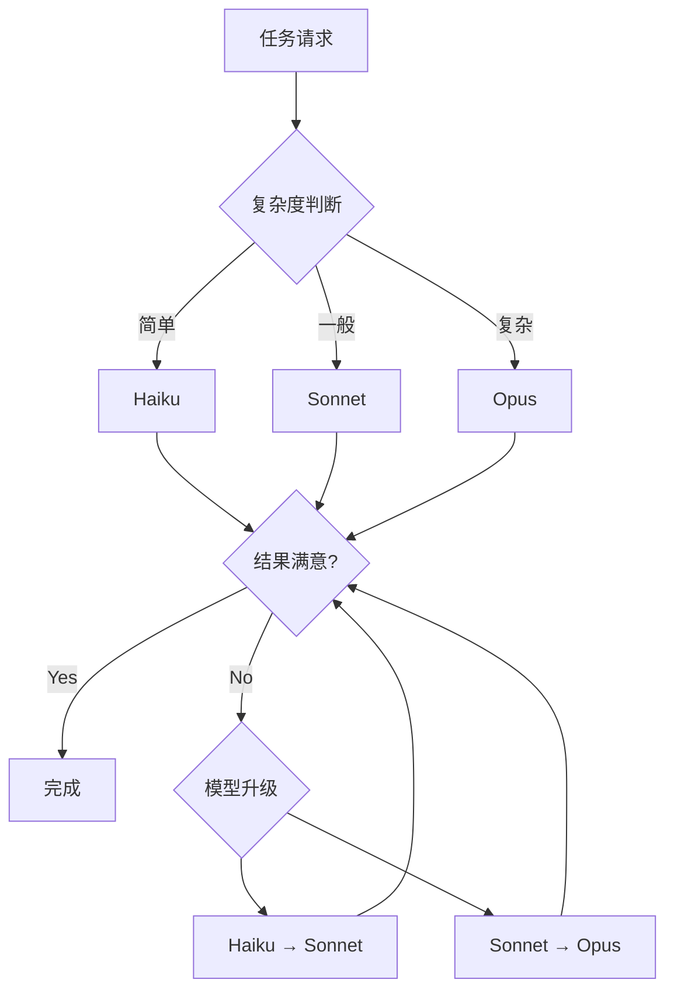

# 附录 B: 性能优化技巧

要有效使用 Claude Code,仅仅了解功能是不够的。需要优化 token 使用量、响应时间和成本的策略,以最大化生产力并降低运营成本。本附录介绍了经过实战验证的性能优化技术。

## B.1: token 使用量优化

token 是与 Claude Code 成本直接相关的核心资源。高效的 token 管理不仅可以降低成本,还能提高响应质量。

### B.1.1: 上下文管理

**问题**: 随着对话变长,累积的上下文会过度消耗 token,响应时间变慢,有时核心信息会被掩埋。

**优化**: 在适当的时机使用 `/clear` 命令重置上下文,并将重要信息文档化以永久保存。

**预期影响**:
- token 使用量减少 60〜80%
- 响应时间改善 40〜50%
- 响应准确度提高(消除噪声)

**代码示例**:

```bash
# 错误示例: 上下文溢出
[100 条之前的消息]
User: "之前说的那个函数名是什么来着?"
Claude: [检查所有 100 条消息,浪费 token]

# 正确示例: 文档化 + 上下文重置
User: "请将重要内容记录到 CLAUDE.md"
Claude: [文档编写完成]
User: "/clear"
User: "读取 CLAUDE.md 并继续工作"
Claude: [只加载必要的上下文,高效响应]
```

**最佳实践**:

1. <strong>上下文重置时机</strong>:
   - 主题切换时(例: 错误修复 → 新功能开发)
   - 对话累积超过 20〜30 条消息时
   - 响应变慢或不准确时

2. <strong>保存重要信息</strong>:
   ```markdown
   <!-- 记录到 CLAUDE.md 或项目文档 -->
   ## 当前工作状态
   - API 端点: `/api/v2/users`
   - 认证方式: JWT (Bearer token)
   - 错误处理: try-catch + 日志

   ## 下一步工作
   1. 实现分页
   2. 添加排序功能
   3. 集成过滤 API
   ```

3. <strong>选择性上下文加载</strong>:
   ```bash
   # 只读取必要的文件,而不是整个历史
   User: "仅参考 src/api/users.ts 和 README.md 进行工作"
   ```

### B.1.2: 编写高效的提示

**问题**: 冗长或模糊的提示会消耗不必要的 token,并导致 Claude 多次提问,增加整体对话成本。

**优化**: 编写简洁而具体的提示,一次性获得准确的结果。

**预期影响**:
- 提示 token 减少 30〜50%
- 返工次数减少 70%
- 整体对话 token 节省 40〜60%

**代码示例**:

````markdown
# 低效提示(500 token)
```
我目前在做一个 React 项目,想实现用户认证功能。
但我不太清楚该怎么做。应该使用 JWT 还是有其他方法?
后端是 Node.js,前端应该如何连接?
还要注意安全问题,应该注意哪些方面?
顺便说一下,这个项目是公司用的...
```

# 高效提示(150 token)
```
在 React + Node.js 项目中实现基于 JWT 的认证:

1. 环境:
   - Frontend: React 18, React Router v6
   - Backend: Express 4.x, MongoDB
   - 要求: 登录、token 刷新、受保护路由

2. 实现文件:
   - `src/api/auth.ts` (API 客户端)
   - `src/contexts/AuthContext.tsx` (状态管理)
   - `src/components/ProtectedRoute.tsx` (路由守卫)

3. 安全要求:
   - 使用 HttpOnly cookie
   - CSRF 防护
   - token 过期 15 分钟,刷新 7 天

按此结构实现。
```
````

**最佳实践**:

1. <strong>应用 5W1H 原则</strong>:
   - <strong>What</strong>: 要创建什么
   - <strong>Where</strong>: 在哪个文件/文件夹
   - <strong>Why</strong>: 为什么需要(上下文)
   - <strong>How</strong>: 用什么方式(技术栈)
   - <strong>When</strong>: 何时执行(触发器)
   - <strong>Who</strong>: 谁使用(目标用户)

2. <strong>层次化信息结构</strong>:
   ```markdown
   # 第 1 层: 核心要求(必需)
   创建用户仪表板页面

   # 第 2 层: 技术栈(必需)
   Next.js 14 App Router, TypeScript, Tailwind CSS

   # 第 3 层: 详细要求(可选)
   - 响应式网格布局(移动: 1 列,平板: 2 列,桌面: 3 列)
   - 支持暗黑模式
   - 骨架屏加载

   # 第 4 层: 约束条件(可选)
   - 包大小 <200KB
   - First Contentful Paint <1.5s
   ```

3. <strong>使用示例代码</strong>:
   ```markdown
   # 提示
   "按照此模式创建 Product 组件"

   # 附件: User 组件示例
   [粘贴现有代码]
   ```

### B.1.3: 移除不必要的信息

**问题**: 读取包含调试日志、注释、重复代码等不必要信息的文件会浪费 token。

**优化**: 提供仅包含核心信息的摘要,或仅提取特定部分。

**预期影响**:
- 文件读取 token 减少 50〜70%
- 响应准确度提高(消除噪声)
- 在大型项目中特别有效

**代码示例**:

```bash
# 低效: 读取整个文件(5000 token)
User: "读取 src/utils/helpers.ts 并找出错误"
[文件内容: 500 行,注释 200 行,调试代码 100 行]

# 高效: 仅提取必要部分(1000 token)
User: "仅从 src/utils/helpers.ts 提取 formatDate 函数并找出错误"

# 或使用 grep 预先过滤
User: "显示 helpers.ts 中以 'export function' 开头的行"
```

**最佳实践**:

1. <strong>使用 Grep 进行选择性读取</strong>:
   ```bash
   # 仅提取函数签名
   grep -n "^export function" src/utils/helpers.ts

   # 仅提取 TODO 注释
   grep -n "TODO\|FIXME" src/**/*.ts

   # 仅提取类型定义
   grep -n "^export (type|interface)" src/types/*.ts
   ```

2. <strong>生成文件摘要</strong>:
   ```markdown
   <!-- docs/api-summary.md -->
   # API 端点摘要

   ## 用户管理
   - GET /api/users - 查询用户列表
   - POST /api/users - 创建用户
   - PUT /api/users/:id - 更新用户

   ## 认证
   - POST /auth/login - 登录
   - POST /auth/refresh - 刷新 token
   ```

3. <strong>注释移除脚本</strong>:
   ```javascript
   // strip-comments.js
   const fs = require('fs');

   function stripComments(code) {
     return code
       .replace(/\/\*[\s\S]*?\*\//g, '') // 块注释
       .replace(/\/\/.*/g, '')            // 行注释
       .replace(/^\s*[\r\n]/gm, '');     // 空行
   }

   const original = fs.readFileSync('src/app.ts', 'utf8');
   const stripped = stripComments(original);
   fs.writeFileSync('temp/app-stripped.ts', stripped);
   ```

### B.1.4: 元数据优先架构

**问题**: 分析博客文章或文档集合时,每次读取整个文件会导致 token 消耗激增。

**优化**: 生成仅提取元数据的 JSON 文件并重用。

**预期影响**:
- token 使用量减少 90% 以上
- 响应时间改善 95%
- 重复任务的成本几乎为零

**代码示例**:

```javascript
// scripts/extract-metadata.js
const fs = require('fs');
const path = require('path');
const matter = require('gray-matter');

function extractMetadata(dir) {
  const files = fs.readdirSync(dir);
  const metadata = [];

  files.forEach(file => {
    if (file.endsWith('.md')) {
      const content = fs.readFileSync(path.join(dir, file), 'utf8');
      const { data } = matter(content);

      metadata.push({
        slug: file.replace('.md', ''),
        title: data.title,
        description: data.description,
        tags: data.tags || [],
        pubDate: data.pubDate,
        wordCount: content.split(/\s+/).length
      });
    }
  });

  return metadata;
}

const posts = extractMetadata('src/content/blog/ko');
fs.writeFileSync(
  'post-metadata.json',
  JSON.stringify(posts, null, 2)
);
```

**使用示例**:

```bash
# 低效(50,000 token)
User: "读取所有博客文章并进行 SEO 分析"
[100 篇文章 × 500 token = 50,000 token]

# 高效(2,000 token)
User: "读取 post-metadata.json 并进行 SEO 分析"
[仅包含元数据,100 篇 × 20 token = 2,000 token]
```

## B.2: 响应时间改善

快速响应是维持开发流程和最大化生产力的关键。

### B.2.1: 分块策略

**问题**: 一次性请求大文件处理或复杂任务会导致响应缓慢或超时。

**优化**: 将任务分成小单位顺序处理。

**预期影响**:
- 超时错误减少 90%
- 可以确认中间结果(便于调试)
- 可以并行处理(缩短整体时间)

**代码示例**:

```bash
# 低效: 一次性处理所有
User: "用 ESLint 检查 src/ 文件夹中的所有 TypeScript 文件,
      修复错误,运行测试,并更新文档"
[很可能发生超时]

# 高效: 分步处理
# Step 1
User: "显示 src/ 文件夹中的 TypeScript 文件列表"
Claude: [提供文件列表]

# Step 2
User: "仅对 src/components/*.tsx 文件运行 ESLint"
Claude: [提供错误列表]

# Step 3
User: "仅修复 Button.tsx 和 Input.tsx 的错误"
Claude: [修复完成]

# Step 4
User: "运行已修复文件的测试"
Claude: [测试结果]
```

**最佳实践**:

1. <strong>文件级分块</strong>:
   ```bash
   # 错误示例
   "重构所有组件"

   # 正确示例
   "重构 Header.tsx" → "重构 Footer.tsx" → ...
   ```

2. <strong>功能级分块</strong>:
   ```bash
   # 将复杂功能分为 3 个步骤
   1. "定义 User 模型架构"
   2. "实现 User CRUD API"
   3. "编写 User API 测试代码"
   ```

3. <strong>基于优先级的分块</strong>:
   ```markdown
   ## 阶段 1: 核心功能(关键)
   - 登录/登出
   - 数据 CRUD

   ## 阶段 2: 附加功能(重要)
   - 搜索/过滤
   - 排序/分页

   ## 阶段 3: 优化(建议)
   - 缓存
   - 性能改进
   ```

### B.2.2: 使用缓存

**问题**: 重复请求相同信息会浪费时间和 token。

**优化**: 将常用信息文档化或存储在变量中以便重用。

**预期影响**:
- 重复任务时间缩短 80%
- token 使用量减少 70%
- 一致性提高(保证相同信息)

**代码示例**:

```markdown
# 在项目根目录创建缓存文档
<!-- CONTEXT.md -->
# 项目上下文(常引用的信息)

## 技术栈
- Frontend: React 18.2, TypeScript 5.0, Vite 4.3
- Backend: Node.js 20, Express 4.18, PostgreSQL 15
- Testing: Vitest, React Testing Library
- Deployment: Vercel (Frontend), Railway (Backend)

## 编码规则
- 函数名: camelCase
- 组件: PascalCase
- 常量: UPPER_SNAKE_CASE
- 文件名: kebab-case
- 最大行长度: 100 字符
- 缩进: 2 spaces

## API 端点
- Base URL: `https://api.example.com/v1`
- Auth: Bearer token in Authorization header
- Error format: `{ error: { code, message, details } }`

## 环境变量
```bash
# .env.example
DATABASE_URL=postgresql://...
JWT_SECRET=...
API_KEY=...
```
```

**使用方法**:

```bash
# 第一次任务
User: "读取 CONTEXT.md 并编写新的 API 端点"

# 后续任务(缓存效果)
User: "按照 CONTEXT.md 标准编写下一个端点"
[CONTEXT.md 内容存储在提示缓存中,节省 token]
```

### B.2.3: 并行处理

**问题**: 顺序处理独立任务会增加整体时间。

**优化**: 同时请求没有依赖关系的任务。

**预期影响**:
- 整体任务时间缩短 50〜70%
- 等待时间最小化
- 资源利用优化

**代码示例**:

```bash
# 低效: 顺序处理(需要 6 分钟)
User: "编写 Header 组件"
[等待 2 分钟]
User: "编写 Footer 组件"
[等待 2 分钟]
User: "编写 Sidebar 组件"
[等待 2 分钟]

# 高效: 并行处理(需要 2 分钟)
User: """
请独立编写以下 3 个组件:
1. Header.tsx - 导航栏
2. Footer.tsx - 页脚链接
3. Sidebar.tsx - 侧边菜单

每个组件相互独立,可以同时工作。
"""
[Claude 内部并行处理,2 分钟内全部完成]
```

**最佳实践**:

1. <strong>识别独立任务</strong>:
   ```markdown
   ## 可以并行处理(相互独立)
   - [ ] 优化 logo 图像
   - [ ] 设计 404 页面
   - [ ] 编写电子邮件模板

   ## 需要顺序处理(有依赖关系)
   1. 数据库架构设计
   2. ORM 模型定义(依赖于 1)
   3. API 端点实现(依赖于 2)
   ```

2. <strong>Bash 工具的并行执行</strong>:
   ```bash
   # Claude Code 可以并行运行独立的 Bash 命令
   User: """
   请运行以下命令:
   - npm run lint
   - npm run test
   - npm run build

   它们各自独立,可以同时运行。
   """
   ```

3. <strong>分块 + 并行组合</strong>:
   ```bash
   # 阶段 1: 并行处理
   User: "同时编写组件 A、B、C"

   # 阶段 2: 集成(顺序处理)
   User: "将已编写的组件集成到 App.tsx"
   ```

## B.3: 成本削减策略

Claude Code 的成本因 token 使用量和模型选择而有很大差异。

### B.3.1: 模型选择标准

**问题**: 对所有任务使用最高性能模型(Opus)会导致成本激增。

**优化**: 根据任务复杂度选择合适的模型。

**预期影响**:
- 成本削减 50〜80%
- 在相同预算下执行 2〜5 倍更多任务
- ROI 最大化

**模型比较**:

| 模型 | 成本 (Input/Output) | 适合的任务 | 不适合的任务 |
|------|-------------------|-----------|-------------|
| <strong>Opus 4.5</strong> | $$$ / $$$$$ | 复杂架构设计、算法优化、大规模重构 | 简单 CRUD、代码格式化、文档编写 |
| <strong>Sonnet 4.5</strong> | $$ / $$$ | 一般开发工作、错误修复、API 集成、测试编写 | 极其复杂的问题、需要高度创造力的任务 |
| <strong>Haiku 4.0</strong> | $ / $$ | 代码格式化、简单修改、文档更新、日志分析 | 复杂逻辑、新功能开发 |

**代码示例**:

```yaml
# .claude/settings.local.json
{
  "model": "claude-sonnet-4.5",  # 默认模型(性价比最优)
  "tasks": {
    "simple": {
      "model": "claude-haiku-4.0",  # 简单任务
      "patterns": [
        "formatting",
        "linting",
        "documentation",
        "simple fixes"
      ]
    },
    "complex": {
      "model": "claude-opus-4.5",   # 复杂任务
      "patterns": [
        "architecture",
        "algorithm",
        "optimization",
        "refactoring"
      ]
    }
  }
}
```

**决策树**:



### B.3.2: 批处理

**问题**: 单独请求类似任务会因重复加载上下文而浪费 token。

**优化**: 将类似任务打包一次性处理。

**预期影响**:
- token 使用量减少 40〜60%
- 任务处理时间缩短 30〜50%
- 一致性提高

**代码示例**:

```bash
# 低效: 单独处理(10,000 token)
User: "向 users.ts 添加类型"
[上下文加载 + 任务 = 2,000 token]

User: "向 posts.ts 添加类型"
[上下文加载 + 任务 = 2,000 token]

User: "向 comments.ts 添加类型"
[上下文加载 + 任务 = 2,000 token]

... (总共 5 个文件 = 10,000 token)

# 高效: 批处理(4,000 token)
User: """
向以下文件添加 TypeScript 类型:
- src/models/users.ts
- src/models/posts.ts
- src/models/comments.ts
- src/models/likes.ts
- src/models/follows.ts

通用模式:
- Zod 架构定义
- TypeScript 类型提取
- API 响应类型添加
"""
[上下文加载 1 次 + 任务 × 5 = 4,000 token]
```

**最佳实践**:

1. <strong>使用任务模板</strong>:
   ````markdown
   # template/crud-api.md
   ```markdown
   ## CRUD API 生成模板

   ### 要求
   - 模型名: [MODEL_NAME]
   - 端点: /api/[RESOURCE]
   - 字段: [FIELD_LIST]

   ### 生成文件
   1. `models/[model].ts` - Zod 架构
   2. `routes/[resource].ts` - Express 路由器
   3. `controllers/[resource].ts` - 业务逻辑
   4. `tests/[resource].test.ts` - 集成测试
   ```
   ````

2. <strong>批处理脚本</strong>:
   ```javascript
   // scripts/batch-process.js
   const tasks = [
     { file: 'User.ts', operation: 'add-validation' },
     { file: 'Post.ts', operation: 'add-validation' },
     { file: 'Comment.ts', operation: 'add-validation' }
   ];

   const prompt = `
   向以下文件添加 Zod 验证:
   ${tasks.map(t => `- ${t.file}`).join('\n')}

   通用规则:
   - 必填字段添加 .min(1)
   - 电子邮件使用 .email() 验证
   - 日期使用 .datetime()
   `;

   console.log(prompt);
   ```

### B.3.3: token 预算管理

**问题**: 项目进行中如果不跟踪 token 使用量,可能会超出预算。

**优化**: 监控 token 使用量并设置预算限制。

**预期影响**:
- 防止预算超支
- 提高成本可预测性
- 优化资源分配

**代码示例**:

```javascript
// scripts/token-tracker.js
const fs = require('fs');

class TokenTracker {
  constructor(budgetLimit = 1000000) {
    this.budgetLimit = budgetLimit;
    this.usage = this.loadUsage();
  }

  loadUsage() {
    try {
      return JSON.parse(fs.readFileSync('.token-usage.json', 'utf8'));
    } catch {
      return { total: 0, byTask: {}, history: [] };
    }
  }

  saveUsage() {
    fs.writeFileSync('.token-usage.json', JSON.stringify(this.usage, null, 2));
  }

  recordUsage(task, inputTokens, outputTokens) {
    const total = inputTokens + outputTokens;
    this.usage.total += total;

    if (!this.usage.byTask[task]) {
      this.usage.byTask[task] = 0;
    }
    this.usage.byTask[task] += total;

    this.usage.history.push({
      timestamp: new Date().toISOString(),
      task,
      inputTokens,
      outputTokens,
      total
    });

    this.saveUsage();
    this.checkBudget();
  }

  checkBudget() {
    const remaining = this.budgetLimit - this.usage.total;
    const percentage = (this.usage.total / this.budgetLimit * 100).toFixed(1);

    console.log(`token 使用量: ${this.usage.total.toLocaleString()} / ${this.budgetLimit.toLocaleString()} (${percentage}%)`);
    console.log(`剩余预算: ${remaining.toLocaleString()} token`);

    if (percentage >= 90) {
      console.warn('⚠️  已使用预算的 90% 以上!');
    } else if (percentage >= 75) {
      console.warn('⚠️  已使用预算的 75% 以上');
    }
  }

  getTopTasks(limit = 5) {
    return Object.entries(this.usage.byTask)
      .sort(([,a], [,b]) => b - a)
      .slice(0, limit)
      .map(([task, tokens]) => ({ task, tokens }));
  }

  getReport() {
    return {
      总使用量: this.usage.total,
      预算限额: this.budgetLimit,
      使用率: `${(this.usage.total / this.budgetLimit * 100).toFixed(1)}%`,
      主要任务: this.getTopTasks(),
      最近使用记录: this.usage.history.slice(-10)
    };
  }
}

// 使用示例
const tracker = new TokenTracker(1000000);

// 任务后记录
tracker.recordUsage('blog-post-writing', 5000, 8000);
tracker.recordUsage('code-refactoring', 3000, 4000);

// 输出报告
console.log(JSON.stringify(tracker.getReport(), null, 2));
```

**预算分配策略**:

```markdown
## 月度 token 预算: 1,000,000 token

### 按类别分配
- 开发工作(50%): 500,000 token
  - 新功能开发: 300,000
  - 错误修复: 100,000
  - 重构: 100,000

- 文档化(20%): 200,000 token
  - 博客文章: 120,000
  - API 文档: 50,000
  - README/指南: 30,000

- 学习和实验(20%): 200,000 token
  - 探索新技术: 100,000
  - 原型: 100,000

- 预留(10%): 100,000 token
  - 紧急任务
  - 意外问题解决

### 每周检查点
- Week 1: 使用 25% (250,000)
- Week 2: 使用 50% (500,000)
- Week 3: 使用 75% (750,000)
- Week 4: 使用 100% (1,000,000)

### 警报标准
- 达到 75%: 注意(检查剩余时间)
- 达到 90%: 警告(推迟非必要任务)
- 达到 95%: 危险(仅执行紧急任务)
```

## B.4: 综合优化检查清单

用于性能优化的实战检查清单。

### 任务开始前

- [ ] 根据任务复杂度选择模型(Haiku/Sonnet/Opus)
- [ ] 计划将类似任务打包批处理
- [ ] 仅选择必要的上下文(CLAUDE.md、相关文件)
- [ ] 准备清晰简洁的提示

### 任务中

- [ ] 对话超过 20〜30 条消息时考虑使用 `/clear`
- [ ] 立即将重要信息文档化(CLAUDE.md、CONTEXT.md)
- [ ] 大型任务分块逐步处理
- [ ] 请求并行处理独立任务
- [ ] 删除不必要的注释/日志后提供文件

### 任务后

- [ ] 记录 token 使用量(token-tracker.js)
- [ ] 将可重用模式模板化
- [ ] 提取元数据(博客文章等)
- [ ] 识别并改进优化点

### 定期检查(每周/每月)

- [ ] 检查 token 预算使用率
- [ ] 分析 token 消耗最高的任务
- [ ] 识别并改进低效模式
- [ ] 更新缓存文档(CONTEXT.md)
- [ ] 重新调整模型选择标准

## B.5: 性能优化案例研究

### 案例 1: 博客文章管理系统

**优化前**:
- 分析 100 篇文章: 50,000 token
- 生成推荐系统: 80,000 token
- 总成本: $6.50 (Opus 标准)
- 耗时: 25 分钟

**优化后**:
- 编写元数据提取脚本: 5,000 token (1 次)
- 基于元数据的分析: 2,000 token
- 生成推荐系统(增量处理): 8,000 token
- 总成本: $0.75 (Sonnet 标准)
- 耗时: 5 分钟

**优化技术**:
1. 元数据优先架构
2. 增量处理(仅处理已更改的文章)
3. 模型降级(Opus → Sonnet)
4. 内容哈希比较(防止重复处理)

### 案例 2: 大规模代码库重构

**优化前**:
- 顺序处理 200 个文件: 150 分钟
- token 使用量: 300,000
- 成本: $24

**优化后**:
- 文件分组(每批 10 个): 30 分钟
- 并行处理(独立组): 15 分钟
- token 使用量: 120,000
- 成本: $9.60

**优化技术**:
1. 批处理(每次 10 个文件)
2. 并行处理(无依赖关系的组)
3. 基于模板的一致性(上下文重用)
4. 使用 Grep 预过滤

## 结论

性能优化提供的价值不仅仅是降低成本:

1. <strong>提高生产力</strong>: 通过快速响应维持开发流程
2. <strong>质量改进</strong>: 通过消除噪声提高准确度
3. <strong>确保可扩展性</strong>: 在相同预算下执行更多任务
4. <strong>可持续性</strong>: 长期稳定运营

将本附录介绍的技术应用到项目中,可以最大化 Claude Code 的 ROI,体验真正的 AI 协作开发效率。

---

**下一步**: 附录 C 涵盖故障排查指南和 FAQ。
