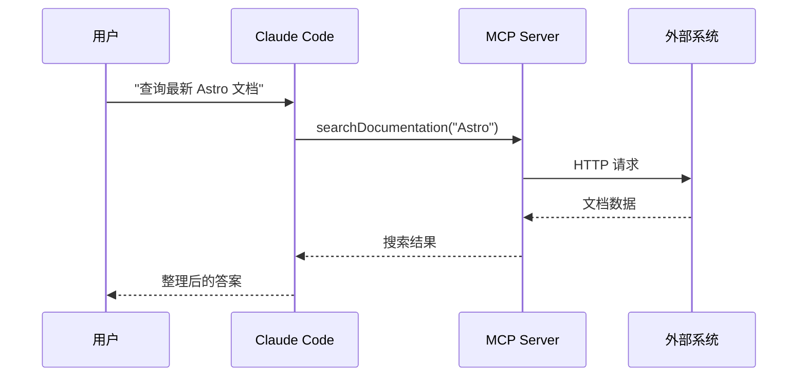
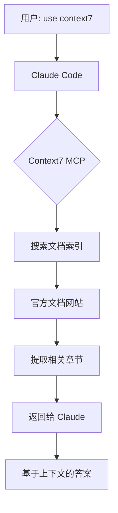
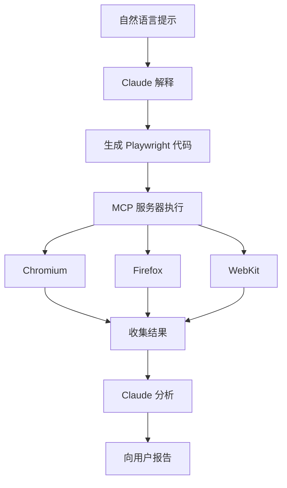
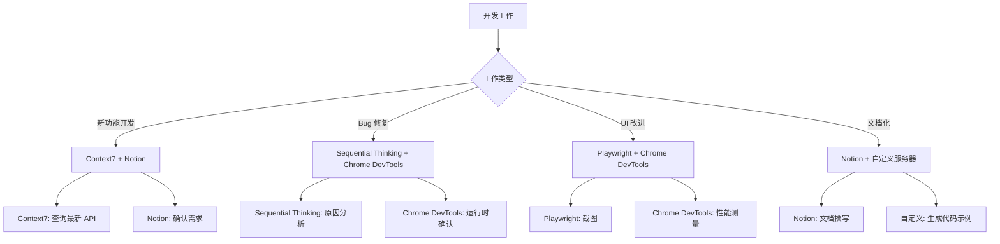

# Chapter 5: MCP 服务器集成

Model Context Protocol(MCP)是一种扩展 AI 代理能力的创新协议。在本章中,您将学习如何利用 MCP 服务器将 Claude Code 的上下文扩展到实时数据、外部系统和专业工具。

## Recipe 5.1: 什么是 MCP 服务器

### 问题 (Problem)

大型语言模型(LLM)被困在其训练数据的时间点。Claude 的知识仅限于 2025 年 1 月之前的数据,无法了解之后发布的库更新或最新技术信息。此外,与外部系统(如文件系统访问、数据库查询、浏览器控制)的交互也受到限制。

开发者经常面临以下情况:

- "我想使用 Astro 5.0 的新功能,但 Claude 说不知道"
- "我希望能查看实时数据库架构来生成代码"
- "我想自动测试网页并截图"
- "我想自动创建和管理 GitHub 问题"

### 解决方案 (Solution)

Model Context Protocol(MCP)是 AI 代理与外部工具和数据源通信的标准协议。Anthropic 于 2024 年 11 月发布的这一协议,使 LLM 能够扩展上下文,访问实时信息并控制外部系统。

**MCP 的核心概念**:

1. **Server(服务器)**: 提供特定功能的外部进程(例如:数据库服务器、浏览器自动化服务器)
2. **Client(客户端)**: 与 MCP 服务器通信的 AI 代理(Claude Code)
3. **Resources(资源)**: 服务器提供的数据或功能(例如:文档搜索、代码分析)
4. **Tools(工具)**: Claude 可以调用的具体函数

**MCP 服务器配置方法**:

Claude Code 在 `~/.claude/settings.json` 文件中配置 MCP 服务器。

```json
{
  "mcpServers": {
    "服务器名称": {
      "command": "执行命令",
      "args": ["参数1", "参数2"],
      "env": {
        "环境变量": "值"
      }
    }
  }
}
```

### 代码/示例 (Code)

让我们看一个最简单的 MCP 服务器配置示例。Context7 服务器是一个用于搜索最新库文档的服务器。

```json
{
  "mcpServers": {
    "context7": {
      "command": "npx",
      "args": ["-y", "@upstash/context7-mcp"]
    }
  }
}
```

此配置的含义:
- **服务器名称**: `context7`(Claude 用此名称识别服务器)
- **执行命令**: `npx`(Node.js 包执行工具)
- **参数**: `-y @upstash/context7-mcp`(自动安装并运行)

配置后重启 Claude Code,服务器将自动加载。现在可以这样使用:

```
提示: "告诉我 Astro 5.0 的 Content Collections 配置方法。use context7"
```

Claude 会自动调用 Context7 服务器搜索最新 Astro 文档,并提供准确的信息。

### 解释 (Explanation)

**MCP 解决的问题**:

1. **防止幻觉(Hallucination)**: LLM 不再猜测未知信息,而是查询实际数据源。
2. **扩展上下文**: 突破训练数据限制,访问实时信息。
3. **工具集成**: 控制浏览器、数据库、API 等外部系统。
4. **标准化**: 使用相同协议连接各种工具,保持一致性。

**MCP 的工作原理**:



当 Claude 调用 MCP 服务器时,服务器会与外部系统(API、数据库、浏览器等)通信,并将结果返回给 Claude。Claude 利用这些结果作为上下文,向用户提供准确的答案。

**MCP vs 传统插件系统**:

| 特性 | MCP | 传统插件 |
|------|-----|----------|
| 标准化 | 单一协议 | 各平台不同 |
| 安全性 | 沙箱隔离 | 直接集成风险 |
| 可扩展性 | 无限添加服务器 | 平台限制 |
| 可重用性 | 可与其他 AI 客户端共享 | 平台依赖 |

### 变体 (Variations)

**本地 vs 远程服务器**:

大多数 MCP 服务器在本地运行,但也可以使用远程服务器。

```json
{
  "mcpServers": {
    "remote-server": {
      "command": "node",
      "args": ["mcp-client.js"],
      "env": {
        "SERVER_URL": "https://api.example.com/mcp"
      }
    }
  }
}
```

**基于 Docker 的服务器**:

具有复杂依赖关系的服务器可以使用 Docker 运行。

```json
{
  "mcpServers": {
    "sequentialthinking": {
      "command": "docker",
      "args": [
        "run",
        "-i",
        "--rm",
        "mcp/sequentialthinking"
      ]
    }
  }
}
```

**条件式服务器激活**:

要为不同项目激活不同的服务器,请使用 `.claude/settings.local.json`。

```json
{
  "mcpServers": {
    "project-specific-server": {
      "command": "npx",
      "args": ["-y", "my-custom-mcp-server"]
    }
  }
}
```

---

## Recipe 5.2: 使用 Context7 查询最新文档

### 问题 (Problem)

开发者生活在不断变化的技术生态系统中。库每月更新,新功能不断添加,现有 API 也会发生变化。由于 Claude 的训练数据截止于 2025 年 1 月,它无法了解之后发布的更新或新库。

例如:
- 如果 Astro 5.0 在 2025 年 2 月发布,Claude 就不知道。
- 想使用 React 19 的新钩子(Hooks),但不知道准确的 API。
- 无法了解 Next.js 15 的 App Router 变更。

在这种情况下,Claude 只能进行猜测(hallucination)或回答"我的训练数据中没有这些信息"。

### 解决方案 (Solution)

Context7 是一个实时搜索最新库官方文档的 MCP 服务器。Upstash 提供的这个服务器索引了主要框架和库的官方文档,Claude 可以在需要时进行搜索。

**Context7 安装和配置**:

1. 打开 `~/.claude/settings.json`
2. 在 `mcpServers` 部分添加 Context7

```json
{
  "mcpServers": {
    "context7": {
      "command": "npx",
      "args": ["-y", "@upstash/context7-mcp"]
    }
  }
}
```

3. 重启 Claude Code
4. 确认 Context7 服务器是否自动加载

### 代码/示例 (Code)

**基本用法**:

在提示中包含 "use context7",Claude 会自动调用 Context7。

```
提示 1: "告诉我 Astro 5.0 的 Content Collections 配置方法。use context7"

Claude 的操作:
1. 向 Context7 服务器发送 "Astro Content Collections" 搜索请求
2. 从最新 Astro 官方文档提取相关信息
3. 利用搜索结果作为上下文生成准确答案
```

**实际使用示例 1: 学习新库**:

```
提示: "告诉我如何在 Vercel AI SDK 3.0 中实现流式响应。use context7"

示例答案:
"我从 Context7 查询了 Vercel AI SDK 官方文档。

AI SDK 3.0 使用 `streamText()` 函数:

\`\`\`typescript
import { streamText } from 'ai';

const result = await streamText({
  model: openai('gpt-4'),
  prompt: 'Write a poem',
});

for await (const chunk of result.textStream) {
  console.log(chunk);
}
\`\`\`

主要变更:
- v2 的 `stream: true` 选项已被移除
- `streamText()` 返回异步迭代器
- 通过 `textStream` 属性访问实时文本块"
```

**实际使用示例 2: API 迁移**:

```
提示: "从 Next.js 14 迁移到 15 时,App Router 的主要变更是什么?use context7"

Claude 的操作:
1. 从 Context7 查询 Next.js 15 迁移指南
2. 提取 App Router 相关的 Breaking Changes
3. 与代码示例一起整理

示例答案:
"我从 Context7 确认了 Next.js 15 官方文档。

主要变更:

1. **`fetch()` 默认行为变更**
   - 之前: 自动缓存(force-cache)
   - 现在: 默认 no-store

\`\`\`typescript
// Next.js 14
fetch('https://api.example.com/data')  // 自动缓存

// Next.js 15
fetch('https://api.example.com/data', { cache: 'force-cache' })  // 显式缓存
\`\`\`

2. **`cookies()` 和 `headers()` 异步化**
   - 现在返回 Promise

\`\`\`typescript
// Next.js 14
const cookieStore = cookies()

// Next.js 15
const cookieStore = await cookies()
\`\`\`

迁移检查清单:
- [ ] 为所有 fetch() 调用指定缓存策略
- [ ] 为 cookies()、headers() 调用添加 await
- [ ] 重新审查动态渲染策略"
```

### 解释 (Explanation)

**Context7 提供的价值**:

1. **防止幻觉**: Claude 不再猜测,而是查询实际文档。
2. **保证最新信息**: 官方文档始终保持最新状态。
3. **准确的代码示例**: 使用官方文档中经过验证的示例。
4. **版本管理**: 可以明确查询特定版本的文档。

**支持的主要库**:

Context7 索引了以下库的官方文档:

- **框架**: React、Vue、Svelte、Angular、Astro、Next.js、Nuxt、SvelteKit
- **后端**: Express、Fastify、NestJS、Hono
- **数据库**: Prisma、Drizzle、TypeORM
- **实用工具**: Lodash、date-fns、Zod
- **AI/ML**: LangChain、Vercel AI SDK、OpenAI SDK

**工作原理**:



Context7 定期抓取官方文档网站以更新索引。收到搜索请求时,通过向量相似度搜索提取最相关的文档章节。

### 变体 (Variations)

**查询特定版本**:

```
提示: "告诉我 React 18 的 useTransition 钩子使用方法。use context7"
```

Claude 会自动识别版本信息并查询该版本的文档。

**比较多个库**:

```
提示: "比较 Prisma 和 Drizzle 的事务处理方式。use context7"
```

Context7 同时查询两个库的文档,提供比较分析。

**查询框架集成模式**:

```
提示: "告诉我将 Tailwind CSS 集成到 Astro 项目的官方方法。use context7"
```

交叉引用两个库的集成指南,提供准确的配置方法。

**故障排除**:

如果 Context7 不工作:

```bash
# 1. 清除 npx 缓存
rm -rf ~/.npm/_npx

# 2. 手动安装包
npm install -g @upstash/context7-mcp

# 3. 在 settings.json 中使用全局包
{
  "context7": {
    "command": "context7-mcp"
  }
}
```

---

## Recipe 5.3: 使用 Playwright 进行 Web 自动化

### 问题 (Problem)

Web 应用程序开发中有许多重复的手动工作:

- 每次开发新功能时都要在浏览器中手动测试
- 为了检查多种分辨率下的布局,需要反复调整大小
- 为了截图,需要打开开发者工具并保存
- 在多种浏览器(Chrome、Firefox、Safari)中确认兼容性

这些工作耗时且容易出错。此外,要编写 E2E 测试,需要学习 Playwright 或 Cypress 等工具。

### 解决方案 (Solution)

使用 Playwright MCP 服务器,Claude 可以直接控制浏览器。用自然语言描述测试场景,Claude 会自动生成并执行 Playwright 代码。

**Playwright MCP 安装**:

```json
{
  "mcpServers": {
    "playwright": {
      "command": "npx",
      "args": ["@anthropic-ai/mcp-server-playwright@latest"]
    }
  }
}
```

### 代码/示例 (Code)

**示例 1: 自动截取页面截图**:

```
提示: "打开 localhost:4321 页面并截取整页截图。文件名为 homepage.png"

Claude 的操作:
1. 启动 Playwright 浏览器
2. 访问指定 URL
3. 等待页面加载完成
4. 保存整页截图
```

生成的 Playwright 代码:

```typescript
import { chromium } from 'playwright';

async function captureScreenshot() {
  const browser = await chromium.launch();
  const page = await browser.newPage();

  await page.goto('http://localhost:4321');
  await page.waitForLoadState('networkidle');

  await page.screenshot({
    path: 'homepage.png',
    fullPage: true
  });

  await browser.close();
}

captureScreenshot();
```

**示例 2: 响应式布局测试**:

```
提示: "在移动端(375x667)、平板(768x1024)、桌面(1920x1080)分辨率下截取博客页面截图"

Claude 的操作:
1. 以三种视口大小打开页面
2. 在每种分辨率下保存截图
3. 在文件名中包含分辨率信息
```

生成的代码:

```typescript
import { chromium } from 'playwright';

const viewports = [
  { name: 'mobile', width: 375, height: 667 },
  { name: 'tablet', width: 768, height: 1024 },
  { name: 'desktop', width: 1920, height: 1080 }
];

async function testResponsive() {
  const browser = await chromium.launch();

  for (const viewport of viewports) {
    const page = await browser.newPage({
      viewport: { width: viewport.width, height: viewport.height }
    });

    await page.goto('http://localhost:4321/blog');
    await page.waitForLoadState('networkidle');

    await page.screenshot({
      path: `blog-${viewport.name}.png`,
      fullPage: true
    });

    await page.close();
  }

  await browser.close();
}

testResponsive();
```

**示例 3: E2E 用户场景测试**:

```
提示: "编写测试博客搜索功能的 E2E 测试:
1. 访问首页
2. 在搜索框中输入 'MCP'
3. 确认搜索结果是否有 3 个以上
4. 点击第一个结果
5. 确认页面标题中是否包含 'MCP'"

Claude 的操作:
1. 逐步分析用户场景
2. 为每个步骤映射 Playwright 操作
3. 生成包含断言的测试代码
```

生成的代码:

```typescript
import { test, expect } from '@playwright/test';

test('博客搜索功能测试', async ({ page }) => {
  // 1. 访问首页
  await page.goto('http://localhost:4321');

  // 2. 在搜索框中输入 'MCP'
  await page.fill('input[type="search"]', 'MCP');
  await page.press('input[type="search"]', 'Enter');

  // 3. 确认搜索结果是否有 3 个以上
  await page.waitForSelector('.search-result');
  const results = await page.locator('.search-result').count();
  expect(results).toBeGreaterThanOrEqual(3);

  // 4. 点击第一个结果
  await page.locator('.search-result').first().click();

  // 5. 确认页面标题中是否包含 'MCP'
  await expect(page).toHaveTitle(/MCP/);
});
```

### 解释 (Explanation)

**Playwright MCP 的核心功能**:

1. **浏览器控制**: 支持 Chromium、Firefox、WebKit 三种浏览器引擎
2. **自动等待**: 自动等待元素出现
3. **截图**: 截取整页或特定元素的截图
4. **网络监控**: 跟踪 API 调用和资源加载
5. **跨浏览器测试**: 在多个浏览器中运行相同的测试

**Playwright MCP vs Chrome DevTools MCP**:

| 功能 | Playwright MCP | Chrome DevTools MCP |
|------|----------------|---------------------|
| 主要用途 | 自动化、E2E 测试 | 性能分析、调试 |
| 浏览器 | Chromium、Firefox、WebKit | 仅 Chrome |
| 截图 | 整页、按元素 | 仅视口 |
| 网络 | 可拦截请求 | 仅监控 |
| 运行模式 | Headless/Headed | Headed(调试端口) |

**工作原理**:



### 变体 (Variations)

**深色模式截图**:

```
提示: "将页面切换到深色模式并截图"

生成代码:
await page.emulateMedia({ colorScheme: 'dark' });
await page.screenshot({ path: 'dark-mode.png' });
```

**网络速度模拟**:

```
提示: "在 3G 网络环境下测试页面加载并测量完成时间"

生成代码:
const context = await browser.newContext({
  ...devices['Slow 3G']
});
const page = await context.newPage();
const start = Date.now();
await page.goto('http://localhost:4321');
await page.waitForLoadState('networkidle');
const duration = Date.now() - start;
console.log(`加载时间: ${duration}ms`);
```

**生成 PDF**:

```
提示: "将博客文章保存为 PDF"

生成代码:
await page.goto('http://localhost:4321/blog/post-title');
await page.pdf({
  path: 'blog-post.pdf',
  format: 'A4',
  printBackground: true
});
```

**仅截取特定元素**:

```
提示: "仅截取页面中的 .hero-section 元素"

生成代码:
const element = await page.locator('.hero-section');
await element.screenshot({ path: 'hero.png' });
```

---

## Recipe 5.4: Notion API 集成

### 问题 (Problem)

许多开发者使用 Notion 进行想法管理、项目规划和文档编写。但 Notion 和开发环境是分离的:

- 在 Notion 中记录博客想法,稍后需要复制到代码中
- 在 Notion 中管理项目 TODO,但无法与代码工作同步
- 在 Notion 中编写技术文档,但需要复制粘贴到代码注释或 README

这种手动同步耗时且容易出错。

### 解决方案 (Solution)

使用 Notion MCP 服务器,Claude 可以直接读写 Notion 数据库。这样可以自动同步 Notion 和代码库。

**Notion MCP 配置**:

1. 获取 Notion API 密钥:
   - 访问 [https://www.notion.so/my-integrations](https://www.notion.so/my-integrations)
   - 点击 "New integration"
   - 输入名称(例如: "Claude Code Integration")
   - 点击 "Submit"
   - 复制 "Internal Integration Token"

2. 将集成连接到 Notion 数据库:
   - 在 Notion 中打开数据库页面
   - 点击右上角 "..." 菜单
   - 选择 "Connections" → "Claude Code Integration"

3. MCP 服务器配置:

```json
{
  "mcpServers": {
    "notion": {
      "command": "npx",
      "args": ["-y", "@anthropic-ai/mcp-server-notion"],
      "env": {
        "NOTION_API_KEY": "secret_your_api_key_here"
      }
    }
  }
}
```

### 代码/示例 (Code)

**示例 1: 查询博客想法**:

假设 Notion 中有一个 "Blog Ideas" 数据库:

| Title | Status | Tags | Created |
|-------|--------|------|---------|
| MCP 服务器使用方法 | Draft | claude-code, productivity | 2025-11-20 |
| Playwright 自动化 | To Write | testing, automation | 2025-11-21 |

```
提示: "从 Notion 的 'Blog Ideas' 数据库中获取 Status 为 'To Write' 的项目"

Claude 的操作:
1. 通过 Notion API 查询数据库
2. 应用 Status 过滤器
3. 整理并显示结果
```

Claude 的响应:

```markdown
我从 Notion 查询了待撰写的博客想法:

1. **Playwright 自动化**
   - Tags: testing, automation
   - Created: 2025-11-21

要以此主题写博客文章吗?
```

**示例 2: 将博客文章自动添加到 Notion**:

```
提示: "将刚才撰写的 'MCP 服务器集成' 博客文章添加到 Notion 的 'Published Posts' 数据库。
状态设为 'Published',日期设为今天"

Claude 的操作:
1. 解析当前撰写的博客元数据(title、description、tags)
2. 通过 Notion API 创建新页面
3. 设置属性值(Status、Published Date、Tags)
```

生成的 Notion API 调用:

```typescript
import { Client } from '@notionhq/client';

const notion = new Client({ auth: process.env.NOTION_API_KEY });

await notion.pages.create({
  parent: { database_id: 'your_database_id' },
  properties: {
    Title: {
      title: [
        {
          text: { content: 'MCP 服务器集成' }
        }
      ]
    },
    Status: {
      select: { name: 'Published' }
    },
    'Published Date': {
      date: { start: '2025-11-23' }
    },
    Tags: {
      multi_select: [
        { name: 'mcp' },
        { name: 'claude-code' },
        { name: 'productivity' }
      ]
    }
  }
});
```

**示例 3: TODO 同步**:

```
提示: "从 Notion 的 'Development Tasks' 数据库中获取
'MCP Integration' 项目的未完成任务,
并以 Markdown 检查清单的形式添加到项目的 TODO.md 文件中"

Claude 的操作:
1. 通过 Notion API 查询任务(项目过滤器 + 未完成过滤器)
2. 转换为 Markdown 检查清单格式
3. 添加到 TODO.md 文件
```

生成的 TODO.md:

```markdown
# Development Tasks

## MCP Integration

- [ ] 编写 Context7 服务器配置文档
- [ ] 添加 Playwright 示例
- [ ] 测试 Notion API 集成
- [ ] 审查安全配置
```

### 解释 (Explanation)

**Notion MCP 的核心功能**:

1. **数据库查询**: 支持过滤、排序、分页
2. **页面创建/更新**: 添加新项目或修改现有项目
3. **属性管理**: 支持所有属性类型(Title、Select、Multi-select、Date、Number 等)
4. **读取块(Blocks)**: 查询页面内容块
5. **搜索**: 全工作区搜索

**权限管理**:

Notion MCP 可以在 `.claude/settings.local.json` 中进行细粒度权限控制:

```json
{
  "toolAllowlist": {
    "notion": {
      "API-post-search": "allow",        // 允许搜索
      "API-get-self": "allow",           // 允许查询用户信息
      "API-get-block-children": "allow", // 允许读取块
      "API-post-pages": "ask",           // 创建页面时请求确认
      "API-patch-pages": "ask"           // 修改页面时请求确认
    }
  }
}
```

**安全考虑**:

1. **API 密钥管理**: 不要在 settings.json 中硬编码,使用环境变量
2. **最小权限原则**: 仅连接必要的数据库
3. **只读模式**: 如果不需要写权限,仅允许读取
4. **本地配置**: 将敏感配置保存在 `.claude/settings.local.json`(排除在版本控制之外)

### 变体 (Variations)

**自动更新项目元数据**:

```
提示: "读取当前项目的 package.json 版本,
并在 Notion 的 'Projects' 数据库中更新此项目的 Version 字段"

Claude 的操作:
1. 读取 package.json
2. 提取 version 字段
3. 在 Notion 中搜索项目页面
4. 更新 Version 属性
```

**自动生成学习笔记**:

```
提示: "分析今天的代码变更,
并在 Notion 的 'Learning Log' 数据库中
添加一条'今天学到的内容'项目"

Claude 的操作:
1. 通过 git diff 分析变更
2. 提取主要学习要点
3. 在 Notion 中创建新页面
4. 包含代码片段进行整理
```

**同步发布说明**:

```
提示: "将 CHANGELOG.md 的最新版本内容
同步到 Notion 的 'Release Notes' 数据库"

Claude 的操作:
1. 解析 CHANGELOG.md
2. 提取最新版本章节
3. 在 Notion 中创建新发布页面
4. 将变更转换为 Notion 块
```

---

## Recipe 5.5: 构建自定义 MCP 服务器

### 问题 (Problem)

现有的 MCP 服务器涵盖了一般用例,但每个项目都有独特的需求:

- 需要访问内部 API 或数据库
- 需要处理特定文件格式或协议
- 需要现有服务器中没有的新功能

例如,如果要将 Claude 连接到公司使用的 JIRA、Slack 或内部数据库,就需要创建自定义 MCP 服务器。

### 解决方案 (Solution)

可以使用 MCP SDK 创建自定义服务器。Anthropic 提供了 TypeScript 和 Python 的 SDK,简化了服务器开发。

**简单的 MCP 服务器结构**:

```typescript
import { Server } from '@modelcontextprotocol/sdk/server/index.js';
import { StdioServerTransport } from '@modelcontextprotocol/sdk/server/stdio.js';

const server = new Server({
  name: 'my-custom-server',
  version: '1.0.0',
});

// 注册 Tool
server.setRequestHandler(ListToolsRequestSchema, async () => {
  return {
    tools: [
      {
        name: 'my_tool',
        description: 'My custom tool',
        inputSchema: {
          type: 'object',
          properties: {
            query: { type: 'string' }
          }
        }
      }
    ]
  };
});

// 执行 Tool
server.setRequestHandler(CallToolRequestSchema, async (request) => {
  if (request.params.name === 'my_tool') {
    const result = await myCustomLogic(request.params.arguments.query);
    return { content: [{ type: 'text', text: result }] };
  }
});

// 启动服务器
const transport = new StdioServerTransport();
await server.connect(transport);
```

### 代码/示例 (Code)

**示例 1: Markdown 链接验证服务器**:

让我们创建一个检查博客文章中所有链接是否有效的 MCP 服务器。

**项目结构**:

```
markdown-link-checker/
├── package.json
├── src/
│   └── index.ts
└── README.md
```

**package.json**:

```json
{
  "name": "markdown-link-checker-mcp",
  "version": "1.0.0",
  "type": "module",
  "bin": {
    "markdown-link-checker-mcp": "./dist/index.js"
  },
  "dependencies": {
    "@modelcontextprotocol/sdk": "^0.5.0",
    "markdown-link-check": "^3.12.1"
  },
  "devDependencies": {
    "@types/node": "^20.0.0",
    "typescript": "^5.0.0"
  },
  "scripts": {
    "build": "tsc",
    "start": "node dist/index.js"
  }
}
```

**src/index.ts**:

```typescript
import { Server } from '@modelcontextprotocol/sdk/server/index.js';
import { StdioServerTransport } from '@modelcontextprotocol/sdk/server/stdio.js';
import {
  CallToolRequestSchema,
  ListToolsRequestSchema,
} from '@modelcontextprotocol/sdk/types.js';
import markdownLinkCheck from 'markdown-link-check';
import { readFile } from 'fs/promises';

const server = new Server({
  name: 'markdown-link-checker',
  version: '1.0.0',
});

server.setRequestHandler(ListToolsRequestSchema, async () => {
  return {
    tools: [
      {
        name: 'check_markdown_links',
        description: '验证 Markdown 文件中所有链接的有效性',
        inputSchema: {
          type: 'object',
          properties: {
            filePath: {
              type: 'string',
              description: '要检查的 Markdown 文件路径'
            }
          },
          required: ['filePath']
        }
      }
    ]
  };
});

server.setRequestHandler(CallToolRequestSchema, async (request) => {
  if (request.params.name === 'check_markdown_links') {
    const { filePath } = request.params.arguments as { filePath: string };

    try {
      const content = await readFile(filePath, 'utf-8');

      return new Promise((resolve) => {
        markdownLinkCheck(content, (err, results) => {
          if (err) {
            resolve({
              content: [{
                type: 'text',
                text: `错误: ${err.message}`
              }]
            });
            return;
          }

          const deadLinks = results.filter(r => r.status === 'dead');
          const aliveLinks = results.filter(r => r.status === 'alive');

          const report = `
链接检查完成: ${filePath}

✅ 有效链接: ${aliveLinks.length}个
❌ 失效链接: ${deadLinks.length}个

${deadLinks.length > 0 ? '失效链接列表:\n' + deadLinks.map(l =>
  `- ${l.link} (${l.statusCode})`
).join('\n') : '所有链接均有效。'}
          `.trim();

          resolve({
            content: [{ type: 'text', text: report }]
          });
        });
      });
    } catch (error) {
      return {
        content: [{
          type: 'text',
          text: `文件读取失败: ${error.message}`
        }]
      };
    }
  }

  throw new Error(`Unknown tool: ${request.params.name}`);
});

async function main() {
  const transport = new StdioServerTransport();
  await server.connect(transport);
  console.error('Markdown Link Checker MCP 服务器已启动');
}

main().catch((error) => {
  console.error('服务器错误:', error);
  process.exit(1);
});
```

**构建和安装**:

```bash
# 1. 构建项目
npm install
npm run build

# 2. 全局安装
npm link

# 3. Claude Code 配置 (~/.claude/settings.json)
{
  "mcpServers": {
    "markdown-link-checker": {
      "command": "markdown-link-checker-mcp"
    }
  }
}
```

**使用方法**:

```
提示: "检查 src/content/blog/ko/mcp-servers-toolkit-introduction.md 文件中
所有链接是否有效"

Claude 的响应:
"Markdown Link Checker 服务器检查结果:

✅ 有效链接: 12个
❌ 失效链接: 2个

失效链接列表:
- https://docs.example.com/old-page (404)
- https://api.deprecated.com (500)

要更新这些链接吗?"
```

**示例 2: 数据库查询服务器**:

可以安全查询 PostgreSQL 数据库的 MCP 服务器:

```typescript
import { Server } from '@modelcontextprotocol/sdk/server/index.js';
import { StdioServerTransport } from '@modelcontextprotocol/sdk/server/stdio.js';
import {
  CallToolRequestSchema,
  ListToolsRequestSchema,
} from '@modelcontextprotocol/sdk/types.js';
import pg from 'pg';

const { Pool } = pg;

const pool = new Pool({
  host: process.env.DB_HOST,
  database: process.env.DB_NAME,
  user: process.env.DB_USER,
  password: process.env.DB_PASSWORD,
  port: parseInt(process.env.DB_PORT || '5432'),
});

const server = new Server({
  name: 'postgres-query',
  version: '1.0.0',
});

// 允许的只读查询模式
const ALLOWED_QUERIES = /^SELECT\s+/i;

server.setRequestHandler(ListToolsRequestSchema, async () => {
  return {
    tools: [
      {
        name: 'query_database',
        description: '在 PostgreSQL 数据库中执行只读查询',
        inputSchema: {
          type: 'object',
          properties: {
            query: {
              type: 'string',
              description: 'SQL SELECT 查询'
            },
            limit: {
              type: 'number',
              description: '结果行数限制(默认: 100)',
              default: 100
            }
          },
          required: ['query']
        }
      }
    ]
  };
});

server.setRequestHandler(CallToolRequestSchema, async (request) => {
  if (request.params.name === 'query_database') {
    const { query, limit = 100 } = request.params.arguments as {
      query: string;
      limit?: number;
    };

    // 安全性: 仅允许 SELECT 查询
    if (!ALLOWED_QUERIES.test(query)) {
      return {
        content: [{
          type: 'text',
          text: '错误: 仅允许 SELECT 查询。'
        }]
      };
    }

    // 添加 LIMIT
    const safeQuery = query.trim().replace(/;$/, '') + ` LIMIT ${limit}`;

    try {
      const result = await pool.query(safeQuery);

      // 将结果格式化为 Markdown 表格
      const headers = Object.keys(result.rows[0] || {});
      const table = `
| ${headers.join(' | ')} |
| ${headers.map(() => '---').join(' | ')} |
${result.rows.map(row =>
  `| ${headers.map(h => row[h]).join(' | ')} |`
).join('\n')}

共 ${result.rowCount}行
      `.trim();

      return {
        content: [{ type: 'text', text: table }]
      };
    } catch (error) {
      return {
        content: [{
          type: 'text',
          text: `查询错误: ${error.message}`
        }]
      };
    }
  }

  throw new Error(`Unknown tool: ${request.params.name}`);
});

async function main() {
  const transport = new StdioServerTransport();
  await server.connect(transport);
  console.error('PostgreSQL Query MCP 服务器已启动');
}

main().catch((error) => {
  console.error('服务器错误:', error);
  process.exit(1);
});
```

**配置文件 (~/.claude/settings.json)**:

```json
{
  "mcpServers": {
    "postgres-query": {
      "command": "node",
      "args": ["/path/to/postgres-query-mcp/dist/index.js"],
      "env": {
        "DB_HOST": "localhost",
        "DB_NAME": "myapp",
        "DB_USER": "readonly_user",
        "DB_PASSWORD": "secure_password",
        "DB_PORT": "5432"
      }
    }
  }
}
```

**使用示例**:

```
提示: "从 users 表中查询最近 7 天注册的用户数"

Claude 的操作:
1. 将提示转换为 SQL 查询
2. 调用 PostgreSQL Query MCP 服务器
3. 用自然语言总结结果

生成的查询:
SELECT COUNT(*) as new_users
FROM users
WHERE created_at >= NOW() - INTERVAL '7 days'

结果:
"最近 7 天有 247 位新用户注册。"
```

### 解释 (Explanation)

**MCP 服务器的核心组件**:

1. **Server(服务器)**: 实现 MCP 协议的主对象
2. **Transport(传输)**: 通信方式(主要是 stdio,也可以是 SSE)
3. **Tools(工具)**: Claude 可以调用的函数列表
4. **Resources(资源)**: 服务器提供的数据源(可选)
5. **Request Handlers(请求处理器)**: Tool 执行逻辑

**安全考虑**:

1. **输入验证**: 不要信任用户输入,始终进行验证
2. **权限限制**: 分离只读操作和写入操作
3. **速率限制**: 防止过度请求
4. **环境变量**: 使用环境变量管理 API 密钥、数据库密码等
5. **错误处理**: 注意不要在错误消息中包含敏感信息

**MCP SDK 主要类型**:

```typescript
// Tool 定义
interface Tool {
  name: string;
  description: string;
  inputSchema: {
    type: 'object';
    properties: Record<string, any>;
    required?: string[];
  };
}

// Tool 执行结果
interface CallToolResult {
  content: Array<{
    type: 'text' | 'image' | 'resource';
    text?: string;
    data?: string;
    mimeType?: string;
  }>;
}

// 服务器元数据
interface ServerInfo {
  name: string;
  version: string;
}
```

### 变体 (Variations)

**Resource Provider(只读数据)**:

可以用 Resource 而非 Tool 提供静态数据。

```typescript
import { ListResourcesRequestSchema, ReadResourceRequestSchema } from '@modelcontextprotocol/sdk/types.js';

// 可用资源列表
server.setRequestHandler(ListResourcesRequestSchema, async () => {
  return {
    resources: [
      {
        uri: 'config://app-settings',
        name: '应用程序设置',
        mimeType: 'application/json'
      }
    ]
  };
});

// 读取资源
server.setRequestHandler(ReadResourceRequestSchema, async (request) => {
  if (request.params.uri === 'config://app-settings') {
    const config = await loadAppSettings();
    return {
      contents: [{
        uri: request.params.uri,
        mimeType: 'application/json',
        text: JSON.stringify(config, null, 2)
      }]
    };
  }
});
```

**SSE Transport(Web 服务器)**:

使用 HTTP SSE 而非 stdio 部署为远程服务器:

```typescript
import { Server } from '@modelcontextprotocol/sdk/server/index.js';
import { SSEServerTransport } from '@modelcontextprotocol/sdk/server/sse.js';
import express from 'express';

const app = express();
const server = new Server({ name: 'remote-mcp', version: '1.0.0' });

// ... 注册 Tool ...

app.get('/sse', async (req, res) => {
  const transport = new SSEServerTransport('/message', res);
  await server.connect(transport);
});

app.post('/message', async (req, res) => {
  // 处理消息
});

app.listen(3000, () => {
  console.log('MCP 服务器已启动: http://localhost:3000');
});
```

**异步处理和流式传输**:

处理大量数据时使用流式响应:

```typescript
server.setRequestHandler(CallToolRequestSchema, async (request) => {
  if (request.params.name === 'analyze_large_file') {
    const { filePath } = request.params.arguments as { filePath: string };

    // 逐步返回进度
    const chunks: string[] = [];

    for await (const line of readFileByLines(filePath)) {
      const analysis = await analyzeLine(line);
      chunks.push(analysis);

      // 每 100 行发送中间结果(实际使用 MCP 的 notification 机制)
      if (chunks.length % 100 === 0) {
        // 进度通知
      }
    }

    return {
      content: [{
        type: 'text',
        text: chunks.join('\n')
      }]
    };
  }
});
```

---

## 总结与下一步

在本章中,我们学习了如何利用 MCP 服务器扩展 Claude Code 的能力:

1. **MCP 基本概念**: 将 LLM 上下文扩展到实时数据的协议
2. **Context7**: 通过查询最新库文档防止幻觉
3. **Playwright**: 浏览器自动化、E2E 测试、截图
4. **Notion API**: 想法管理与代码库同步
5. **自定义服务器**: 为项目独特需求开发 MCP 服务器

### 推荐学习路径

**初级**:
1. 配置和使用 Context7(最快见效)
2. 使用 Playwright 进行简单截图
3. Notion 只读集成

**中级**:
1. 编写 Playwright E2E 测试
2. 使用 Notion 写入功能(TODO 同步)
3. 组合多个 MCP 服务器工作流

**高级**:
1. 开发自定义 MCP 服务器
2. 集成内部系统(数据库、API)
3. 实现 Resource Provider

### 实战应用技巧

**MCP 服务器选择标准**:

| 情况 | 推荐服务器 | 原因 |
|------|----------|------|
| 使用最新库 | Context7 | 基于官方文档的准确信息 |
| Web UI 开发 | Playwright | 响应式测试、截图 |
| 性能优化 | Chrome DevTools | Core Web Vitals 测量 |
| 想法管理 | Notion | 与代码库同步 |
| 解决复杂问题 | Sequential Thinking | 结构化分步思考 |

**组合使用模式**:



### 下一章预览

在第 6 章中,我们将介绍如何在团队环境中使用 Claude Code:
- 构建子代理(Sub-agent)系统
- 代码审查自动化
- 团队知识库管理
- CI/CD 流水线集成

MCP 服务器是所有这些自动化的基础。使用 Context7 共享最新技术信息,使用 Notion 同步团队文档,使用自定义服务器集成内部工具。

---

**练习题**:

1. 配置 Context7 并查询您当前项目中使用的主要库的最新文档。

2. 使用 Playwright MCP 请求 Claude 截取您正在开发的 Web 应用程序三个主要页面的截图。

3. (可选)创建一个 Notion 数据库,记录博客想法,然后通过 Claude 进行查询。

4. (挑战)创建一个简单的自定义 MCP 服务器。例如:分析项目 package.json 依赖关系以查找过时包的服务器。

**参考资料**:
- MCP 官方文档: https://modelcontextprotocol.io
- Anthropic MCP GitHub: https://github.com/anthropics/anthropic-mcp
- MCP SDK Reference: https://github.com/anthropics/anthropic-mcp/tree/main/sdk
- Community MCP Servers: https://github.com/anthropics/anthropic-mcp/tree/main/servers
