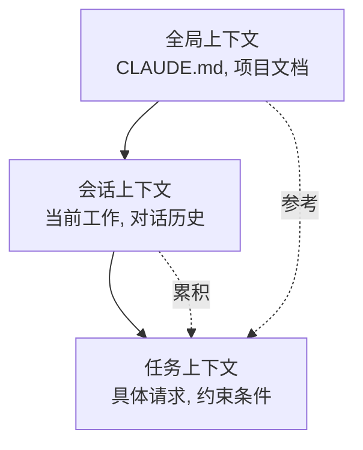

# Chapter 6: 编写高效的提示词

与Claude Code的有效沟通是项目成功的关键。本章以实战配方(Recipe)的形式,提供能够最大化AI协作效率的提示词编写技巧。

## Recipe 6.1: 提示词基本结构

### 问题 (Problem)

向AI请求时,如果只是简单地说"帮我写一篇博客文章",往往会得到与预期不符的结果。如何编写结构化的提示词才能获得理想的输出?

### 解决方案 (Solution)

高效的提示词由以下4个要素构成:

1. **角色定义 (Role)**: 明确从谁的视角来完成任务
2. **上下文 (Context)**: 提供任务所需的背景信息
3. **任务规格 (Task)**: 具体的任务内容和目标
4. **约束条件 (Constraints)**: 格式、篇幅、风格等限制

#### 分步指南

**Step 1: 角色定义**

为AI赋予特定专家的人设(Persona)。

```markdown
You are an expert technical writer with 10+ years of experience in
developer-focused content creation.
```

**Step 2: 提供上下文**

明确任务所需的背景信息。

```markdown
I'm creating a blog post about Claude Code for Korean developers who are
new to AI-assisted coding. The target audience is intermediate developers
familiar with TypeScript and Git.
```

**Step 3: 任务规格**

具体说明你想要什么。

```markdown
Write a technical blog post about "Getting Started with Claude Code" that:
- Explains the basic concepts
- Provides step-by-step installation guide
- Includes 3-5 practical examples
- Demonstrates best practices
```

**Step 4: 约束条件**

明确格式和要求。

```markdown
Requirements:
- Length: 2000-2500 words
- Format: Markdown with code examples
- Style: Professional but approachable (use 存댓말 in Korean)
- Include at least 2 Mermaid diagrams
- All code examples must be syntactically correct
```

### 代码/示例 (Code)

#### 错误的提示词 (Before)

```
帮我写一篇博客文章
```

**结果**: 没有方向性的、泛泛而谈的内容

#### 改进后的提示词 (After)

```markdown
## Role
You are an expert technical writer specializing in developer tools and
AI-assisted coding.

## Context
I'm writing for Korean developers (intermediate level) who want to learn
Claude Code. They already use VS Code and GitHub Copilot, so they
understand AI coding assistants.

## Task
Write a blog post: "Claude Code vs GitHub Copilot: 5 Key Differences"

Content requirements:
1. Introduction (200 words)
   - Brief overview of both tools
   - Why this comparison matters
2. Main content (1500 words)
   - 5 key differences with concrete examples
   - Pros/cons for each difference
3. Conclusion (300 words)
   - When to use which tool
   - Recommendation based on use case

## Constraints
- Length: 2000 words (Korean)
- Format: Markdown
- Style: 존댓말, professional
- Include: 2-3 code examples, 1 comparison table, 1 Mermaid diagram
- SEO: Include keywords "Claude Code", "GitHub Copilot", "AI 코딩 도구"
```

**结果**: 结构化的、有针对性的、实用的内容

### 说明 (Explanation)

#### 为什么这个结构有效?

1. **角色定义的力量**: 为AI赋予专家人设会显著提升输出质量。"expert technical writer"这个身份决定了回答的语气、深度和专业性。

2. **上下文的重要性**: 没有背景信息,AI只能生成通用内容。"Korean developers"、"intermediate level"、"already use GitHub Copilot"这类信息能让内容更有针对性。

3. **明确的任务规格**: 比起模糊的"写博客",具体指定结构(Introduction, Main, Conclusion)和各部分的篇幅能得到符合预期的结果。

4. **用约束条件保证质量**: 明确篇幅、格式、风格可以减少返工。

#### 心理学机制

像Claude这样的大型语言模型(LLM)通过**上下文学习(In-Context Learning)**工作。提示词中的上下文越丰富:

- 预测越准确
- 输出方差(variance)越小
- 一致性越好

### 变体 (Variations)

#### Variation 1: 代码审查请求

```markdown
## Role
You are a senior software engineer specializing in TypeScript and clean code.

## Context
I'm reviewing a Pull Request for a React component that manages authentication state.
The code works but I want to ensure it follows best practices.

## Task
Review the following code and provide:
1. Code quality assessment (1-10 score)
2. 3-5 specific improvement suggestions
3. Refactored version (if needed)

## Constraints
- Focus on: type safety, readability, performance
- Format: Markdown with annotated code
- Include rationale for each suggestion
```

#### Variation 2: 调试支持

```markdown
## Role
You are an expert debugger with deep knowledge of Node.js and async programming.

## Context
My Express.js API intermittently returns 500 errors under high load.
Error logs show "Promise rejection not handled" but I can't identify the source.

## Task
1. Analyze the error pattern
2. Identify potential root causes (ranked by likelihood)
3. Suggest debugging steps
4. Provide a fix if possible

## Constraints
- Explain in Korean (technical terms can be English)
- Include code examples for proposed fixes
- Consider: async/await patterns, error handling, connection pooling
```

#### Variation 3: 架构设计

```markdown
## Role
You are a solutions architect with expertise in scalable web applications.

## Context
I'm building a blog platform that needs to:
- Handle 10,000+ posts
- Support multi-language (Korean, English, Japanese)
- Optimize for SEO
- Generate static sites (Astro framework)

## Task
Design a content architecture that addresses:
1. Directory structure for multi-language content
2. Metadata schema for SEO and recommendations
3. Build optimization strategy
4. Content relationship management

## Constraints
- Use Astro Content Collections
- Provide Mermaid diagrams for architecture
- Include TypeScript type definitions
- Explain trade-offs for each decision
```

---

## Recipe 6.2: 提供上下文的技巧

### 问题 (Problem)

AI不理解项目的结构或当前状况,给出了不恰当的建议。例如,忽略了已在使用的技术栈,或生成了不符合项目规范的代码。

### 解决方案 (Solution)

有效的上下文提供分为3个步骤:

1. **项目上下文**: 技术栈、架构、规则
2. **任务上下文**: 当前状况、之前的工作、依赖关系
3. **约束上下文**: 必须遵守的规则

#### 分步指南

**Step 1: 提供项目上下文**

让AI参考CLAUDE.md等项目文档。

```markdown
## Project Context

This is an Astro 5.14.1 static blog with:
- Content Collections for type-safe content management
- Multi-language support (ko, en, ja, zh)
- Tailwind CSS for styling
- TypeScript in strict mode

Key conventions:
- Blog posts in: src/content/blog/<lang>/filename.md
- All dates: 'YYYY-MM-DD' format (single quotes)
- Images: src/assets/blog/ (optimized by Astro)
```

**Step 2: 提供任务上下文**

明确当前在做什么、正在处理哪些文件。

```markdown
## Current Work

I'm adding a new blog post about "Effective Prompt Engineering".

Already completed:
- Created ko/prompt-engineering.md with frontmatter
- Added hero image: prompt-engineering-hero.jpg

Need to complete:
- Japanese version (ja/prompt-engineering.md)
- English version (en/prompt-engineering.md)
- Verify all 3 versions have consistent metadata
```

**Step 3: 提供约束上下文**

明确绝对不能违反的规则。

```markdown
## Constraints (MUST FOLLOW)

1. pubDate format: 'YYYY-MM-DD' (NOT "MMM DD YYYY")
2. All 3 language versions must have identical:
   - File names (except language folder)
   - heroImage path
   - pubDate
3. Korean: 존댓말, 25-30 char title
4. Japanese: です/ます体, 30-35 char title
5. English: 50-60 char title
```

### 代码/示例 (Code)

#### 上下文不足的提示词 (Before)

```
帮我创建多语言博客文章
```

**问题点**:
- 不清楚是哪些语言
- 不知道项目结构
- 不知道文件位置
- 不知道格式规则

**结果**: 生成的文件不符合项目规范

#### 上下文丰富的提示词 (After)

```markdown
## Project Context
Astro blog with Content Collections, multi-language (ko/ja/en/zh).

File structure:
src/content/blog/
├── ko/post-name.md
├── ja/post-name.md
├── en/post-name.md
└── zh/post-name.md

## Current Work
Creating new post: "prompt-engineering-best-practices"

Already done:
- Korean version (ko/prompt-engineering-best-practices.md)
- Hero image uploaded: src/assets/blog/prompt-engineering-hero.jpg

## Task
Create Japanese and English versions with:
1. Same file name in respective language folders
2. Culturally localized content (NOT direct translation)
3. Consistent metadata

## Constraints
Required frontmatter:
```yaml
---
title: "..." # ja: 30-35 char, en: 50-60 char
description: "..." # ja: 80-90 char, en: 150-160 char
pubDate: '2025-11-12' # MUST be single quotes, YYYY-MM-DD
heroImage: ../../../assets/blog/prompt-engineering-hero.jpg # SAME path
tags: ["prompt-engineering", "ai-agents", "claude-code"]
---
```

Japanese style: です/ます体, professional
English style: Professional but approachable
```

**结果**: 符合项目规范的、一致的多语言内容

### 说明 (Explanation)

#### 上下文决定质量的原因

1. **消除歧义**: "多语言"的含义(语言种类、文件结构、命名规则)变得清晰。

2. **防止错误**: 提前提供日期格式、路径规则等技术约束可以减少返工。

3. **保证一致性**: 明确整个项目的规则,AI会遵循现有模式。

#### 上下文的层次结构



- **全局上下文**: 不变的项目规则(记录在CLAUDE.md中)
- **会话上下文**: 当前对话中积累的信息
- **任务上下文**: 当前需要的具体信息

### 变体 (Variations)

#### Variation 1: 通过文件引用提供上下文

```markdown
## Context from Files

Please read the following files to understand the project structure:

1. /src/content.config.ts - Content Collections schema
2. /src/content/blog/ko/existing-post.md - Example post format
3. /CLAUDE.md - Project conventions

Then create a new blog post following the same patterns.
```

**优点**: AI能看到实际代码并学习模式。

#### Variation 2: 引用之前的工作

```markdown
## Context from Previous Work

In our last conversation, we:
1. Created 3 sub-agents for content workflow
2. Defined role boundaries with DO/DON'T sections
3. Added quality checklists

Now let's apply the same pattern to the SEO optimizer agent.
```

**优点**: 保持跨会话的连续性。

#### Variation 3: 提供错误上下文

```markdown
## Error Context

Build failed with:
```
Error: Invalid frontmatter in blog/ko/post.md
Expected pubDate format: Date, received: string
```

Current frontmatter:
```yaml
pubDate: "Nov 12 2025"
```

Expected format (from content.config.ts):
```typescript
pubDate: z.coerce.date()  // Auto-converts 'YYYY-MM-DD' string to Date
```

Please fix the frontmatter to match the schema.
```

**优点**: 同时提供错误原因和解决方案,可以精准修复

---

## Recipe 6.3: 消除歧义策略

### 问题 (Problem)

AI误解了请求或用多种方式解释,产生了与预期不同的结果。例如说"改进代码"时,想要的是性能优化,却只得到了可读性改进。

### 解决方案 (Solution)

消除歧义的4种技巧:

1. **明确具体目标**: "想要什么"要精确
2. **可衡量的标准**: "要多好"要量化
3. **提供示例**: "要这样"的参考
4. **明确排除项**: "不要这样做"

#### 分步指南

**Step 1: 明确具体目标**

将一般性请求转换为具体目标。

```markdown
Before: "改进代码"
After: "提高TypeScript类型安全性并添加null检查"

Before: "写一篇博客文章"
After: "面向中级开发者,结合实战案例讲解Claude Code的提示词工程技巧的教程"
```

**Step 2: 提供可衡量的标准**

将定性标准转换为定量标准。

```markdown
Before: "写得简短一点"
After: "用200-250词总结"

Before: "SEO要好"
After: "在标题和首段包含目标关键词'提示词工程',
       meta description控制在150-160字"
```

**Step 3: 提供示例**

展示期望格式的参考。

```markdown
## Desired Output Example

Like this existing post:
/src/content/blog/ko/claude-code-best-practices.md

Which has:
- Clear section hierarchy (##, ###)
- Code examples with syntax highlighting
- Mermaid diagram for architecture
- Practical tips in bullet points

Generate a similar structure for the new topic.
```

**Step 4: 明确排除项**

明确不应该做什么。

```markdown
## What NOT to do:

❌ Don't change the existing API
❌ Don't add new dependencies
❌ Don't refactor unrelated code
✅ Only optimize the calculateTotal() function
```

### 代码/示例 (Code)

#### 模糊的提示词 (Before)

```
帮我重构
```

**问题点**:
- 不清楚要改进什么(性能?可读性?结构?)
- 范围不明确(哪些文件?哪部分?)
- 没有标准(到什么程度?)

**结果**: 改变了不想改的部分,或与意图不符的改进

#### 明确的提示词 (After)

```markdown
## Task: Refactor for Type Safety

### Scope
File: src/utils/blog.ts
Functions: getRelatedPosts(), filterByLanguage()

### Goals
1. Replace 'any' types with specific TypeScript types
2. Add runtime type guards for API responses
3. Handle edge cases (empty arrays, null values)

### Constraints
- ❌ Don't change function signatures (breaking change)
- ❌ Don't add new dependencies
- ✅ Keep existing tests passing
- ✅ Add JSDoc comments for new types

### Success Criteria
- No 'any' types remaining
- TypeScript strict mode passes
- All existing tests pass
- No new runtime errors

### Example
Current code:
```typescript
function getRelatedPosts(post: any): any[] {
  return post.relatedPosts || [];
}
```

Desired code:
```typescript
/**
 * Retrieves related posts with type safety
 * @param post - Blog post with optional related posts
 * @returns Array of related posts (empty if none)
 */
function getRelatedPosts(post: BlogPost): RelatedPost[] {
  if (!post.relatedPosts || !Array.isArray(post.relatedPosts)) {
    return [];
  }
  return post.relatedPosts.filter(isValidRelatedPost);
}
```
```

**结果**: 范围和目标明确,改进精准

### 说明 (Explanation)

#### 歧义的代价

研究表明模糊的提示词会导致:
- 返工率增加60%
- 平均需要2-3次迭代
- 总工作时间增加200%

#### 明确性的心理学

AI通过**最大似然估计(Maximum Likelihood Estimation)**工作。模糊的输入会在多种可能解释中随机选择一个。明确的输入缩小了可能性空间,提高了获得期望结果的概率。

```mermaid
graph TD
    Vague[模糊的提示词<br/>"改进一下"] --> Multiple[多种可能解释]
    Multiple --> Performance[性能优化 30%]
    Multiple --> Readability[可读性改进 30%]
    Multiple --> Structure[结构改进 30%]
    Multiple --> Other[其他 10%]

    Clear[明确的提示词<br/>"提高类型安全性"] --> Single[单一明确解释]
    Single --> TypeSafety[类型安全性 90%]
```

#### 5W1H技巧

将新闻学的5W1H应用到提示词:

- **Who**: 为谁做这个任务?(目标读者、用户)
- **What**: 具体想要什么?(具体产出)
- **When**: 什么时候?什么时间点的信息?(期限、版本)
- **Where**: 应用在哪里?(文件、函数、章节)
- **Why**: 为什么需要?(目的、背景)
- **How**: 应该怎么做?(方法、约束)

### 变体 (Variations)

#### Variation 1: 提供选项消除歧义

```markdown
## Clarification Needed

I want to improve the blog post recommendation system.
Which approach do you recommend?

Option A: TF-IDF based keyword matching (fast, simple)
Option B: Claude LLM semantic similarity (accurate, slower)
Option C: Hybrid approach (balanced)

Please explain trade-offs and recommend one based on:
- Target: 100+ posts, 4 languages
- Priority: Recommendation quality > speed
- Resources: API calls acceptable
```

**优点**: 提供选项后AI会对每个选项进行比较分析。

#### Variation 2: 逐步澄清

```markdown
## Step-by-step Clarification

Step 1: Analyze the current architecture
- Read: src/content.config.ts
- Identify: Current schema limitations

Step 2: Propose improvements
- Suggest: 3 specific schema enhancements
- Explain: Why each is needed

Step 3: Implement
- Only after I approve Step 2
- Make changes incrementally

This ensures we align before implementation.
```

**优点**: 分步方法使方向调整更容易。

#### Variation 3: 提供反例

```markdown
## What I DON'T Want

Bad example 1 (too generic):
```yaml
title: "提示词工程"
description: "如何写提示词"
```

Bad example 2 (too long):
```yaml
title: "AI时代软件开发者的提示词工程完全指南与实战技巧大全"
```

Good example (balanced):
```yaml
title: "实战提示词工程: Claude Code应用指南"
description: "让AI代理性能提升10倍的提示词编写技巧与实际应用案例"
```

Generate metadata following the "Good example" pattern.
```

**优点**: 展示错误示例可以让AI学习应避免的模式。

---

## Recipe 6.4: 对话流程管理

### 问题 (Problem)

与Claude Code的对话变长后,上下文变模糊,AI忘记了之前的工作或提出不一致的建议。不知道何时应该开始新对话,如何保持上下文。

### 解决方案 (Solution)

有效的对话流程管理4步骤:

1. **对话开始**: 设定明确的目标和范围
2. **中间检查点**: 确认进展并对齐
3. **上下文总结**: 定期重新确认关键信息
4. **对话结束/重启**: 在适当时机使用/clear

#### 分步指南

**Step 1: 对话开始时声明目标**

每次会话开始时设定明确目标。

```markdown
## Session Goal

Today's objective: Implement multi-language content recommendation system

Tasks:
1. Design metadata schema for recommendations
2. Create recommendation generation script
3. Update RelatedPosts component
4. Test with existing blog posts

Exit criteria: All 3 language versions have working recommendations
```

**Step 2: 设置中间检查点**

在工作中间设置对齐检查点。

```markdown
## Checkpoint: Before Implementation

Let's verify the design before coding:

✅ Completed:
- Schema designed (relatedPosts with score, reason)
- Example metadata created

⏸️ Review needed:
- Does the schema support 4 languages? (ko, ja, en, zh)
- Should we include similarity algorithm details?

❓ Questions:
- How many related posts per post? (I suggest 3-5)
- Should we version the recommendations?

Please confirm the design looks good before I proceed with implementation.
```

**Step 3: 定期总结上下文**

对话变长时总结关键信息。

```markdown
## Context Summary (10 messages in)

What we've done:
1. Created schema for relatedPosts
2. Implemented recommendation script using Claude API
3. Generated recommendations for 50 posts

Current status:
- Working: Korean and English recommendations
- Issue: Japanese recommendations have encoding errors
- Blocked: Need to fix character encoding before proceeding

Next step: Fix UTF-8 encoding in recommendation script
```

**Step 4: 在适当时机使用/clear**

需要重启对话的信号:

- 工作主题完全改变时
- AI提出与之前上下文冲突的建议时
- 对话超过30+条消息太长时
- 重要工作完成并开始新任务时

```markdown
## Before /clear

Session complete!

✅ Achieved:
- Multi-language recommendation system implemented
- 50 posts with working recommendations
- Component updated and tested

📝 Important for next session:
- Recommendations stored in: content/recommendations.json
- Schema documented in: content.config.ts
- Component at: src/components/RelatedPosts.astro

/clear

## After /clear (New Session)

New session goal: Implement SEO optimization for blog posts

(Start fresh with clear objective)
```

### 代码/示例 (Code)

#### 混乱的对话流程 (Before)

```
Message 1: "帮我做博客推荐系统"
Message 2: "不用TF-IDF,用Claude API吧"
Message 3: "还是向量数据库更好?"
Message 15: "顺便把图片也优化了"
Message 20: "再回到推荐系统..."
Message 25: "啊,这样不行啊。从头再来..."
```

**问题点**:
- 目标不断变化
- 旧工作和新工作混在一起
- AI感到困惑

#### 结构化的对话流程 (After)

```markdown
=== Session 1: Design Phase ===

Message 1:
## Session Goal: Design recommendation system

Objective: Choose the best approach for blog post recommendations

Tasks:
1. Compare TF-IDF vs Claude API vs Vector DB
2. Choose one based on project constraints
3. Design schema for selected approach

Let's start with comparison.

---

Message 5:
## Checkpoint: Design Decision

Based on the comparison, I choose: Claude API semantic similarity

Rationale:
- Quality > Speed (acceptable for static generation)
- 100 posts = manageable API costs
- Matches project's AI-first approach

Proceed with Claude API schema design.

---

Message 10:
## Session Complete

✅ Achieved:
- Comparison complete
- Claude API approach chosen
- Schema designed and documented

📝 Next session: Implementation

/clear

=== Session 2: Implementation Phase ===

Message 1:
## Session Goal: Implement Claude API recommendations

Context from previous session:
- Chosen approach: Claude API semantic similarity
- Schema: documented in previous session notes
- Target: 100 posts, 4 languages

Tasks:
1. Create recommendation generation script
2. Test with 5 sample posts
3. Generate for all posts
4. Validate output

Let's implement the script.
```

**效果**:
- 每个会话都有明确目标
- 可以追踪进展
- 上下文切换干净利落

### 说明 (Explanation)

#### 对话流程为什么重要

像Claude这样的LLM会考虑**上下文窗口(Context Window)**内的所有消息。对话越长:

1. **Token使用增加**: 每次请求都传送整个对话历史
2. **积累不相关信息**: 早期消息的无关信息影响最新响应
3. **一致性下降**: 早期决定和最新决定可能冲突

#### 有效的对话模式

```mermaid
graph TD
    Start[会话开始] --> Goal[声明目标]
    Goal --> Work1[任务 1]
    Work1 --> Check1[检查点 1]
    Check1 --> Align{对齐?}
    Align -->|Yes| Work2[任务 2]
    Align -->|No| Adjust[调整方向]
    Adjust --> Work1
    Work2 --> Check2[检查点 2]
    Check2 --> Complete{完成?}
    Complete -->|Yes| Summary[总结]
    Complete -->|No| Work2
    Summary --> Clear[/clear]
    Clear --> Start
```

#### 检查点的价值

检查点提供:
- **对齐机会**: 确认方向是否正确
- **回滚点**: 方向错误时可以返回的地方
- **进度追踪**: 可视化已完成多少

### 变体 (Variations)

#### Variation 1: 分支对话

需要做复杂决策时将对话分支。

```markdown
## Main Thread: Recommendation System

Current decision point: Algorithm selection

Let me explore 2 branches in separate conversations:

Branch A: /clear → "Evaluate TF-IDF approach for recommendations..."
Branch B: /clear → "Evaluate Claude API approach for recommendations..."

After both explorations, I'll return to main thread with decision.
```

**优点**: 可以独立深入探索多个选项。

#### Variation 2: 不用/clear重新对齐

用明确总结代替/clear重新对齐上下文:

```markdown
## Context Realignment (instead of /clear)

We've discussed many things. Let me clarify what's actually decided:

✅ Decided and implemented:
- Recommendation schema: relatedPosts with score/reason
- Algorithm: Claude API semantic similarity

❌ Discussed but NOT implemented:
- Vector database (too complex for MVP)
- Real-time recommendations (static generation only)

🎯 Current focus:
- Generate recommendations for all existing posts
- Ignore previous discussions about alternative approaches

Please proceed with generation only.
```

**优点**: 保持上下文的同时只过滤不必要的信息。

#### Variation 3: 基于Todo的流程管理

利用TodoWrite工具进行结构化推进:

```markdown
## Session with Todo Tracking

Please create a todo list for this session:

Session Goal: Multi-language recommendation system

Tasks:
1. Design schema (pending)
2. Implement generation script (pending)
3. Test with 5 posts (pending)
4. Generate for all posts (pending)
5. Validate output (pending)

As we complete each task:
- Mark it as completed
- Update me on progress
- Ask for confirmation before next task

This keeps us aligned throughout the session.
```

**优点**: 进度可视化追踪,每个步骤都有确认机会。

---

## 实战综合案例: 博客文章写作项目

本节展示如何综合运用前面学到的4个配方,完成一个实际的博客文章写作项目。

### 场景

围绕"提示词工程"主题,用韩语、日语、英语3种语言编写博客文章,并实现相关文章推荐。

### Session 1: 规划与调研

```markdown
## Session Goal: Research and Planning

Objective: Research prompt engineering techniques and plan blog post structure

Tasks:
1. Research latest prompt engineering best practices (2025)
2. Identify key techniques applicable to Claude Code
3. Create blog post outline for 3 languages
4. Define success metrics

---

## Role
You are a technical content strategist specializing in AI/ML topics.

## Context
Project: Astro blog (www.jangwook.net)
Target audience: Korean developers (intermediate) interested in AI-assisted coding
Existing posts: 50+ technical posts, established voice

## Task
Research prompt engineering techniques from 2025 and create a comprehensive blog post outline.

Focus areas:
1. Role definition and persona
2. Uncertainty handling (most important)
3. Structured output
4. Quality checklists

## Constraints
- Target length: 2000-2500 words per language
- Must include real examples from the project
- SEO keywords: "프롬프트 엔지니어링", "Claude Code", "AI 에이전트"
- Coordinate with Web Researcher agent for latest information

---

[AI responses with research findings]

---

## Checkpoint: Outline Review

Based on the research, here's the proposed outline:

1. 概述 (200 words)
   - AI代理性能与提示词的关系
   - 核心成果预览
2. 6项核心原则 (1500 words)
   - 角色明确化
   - 约束条件明示
   - 不确定性处理 ⭐
   - 来源提供
   - 结构化输出
   - 质量检查清单
3. 实战案例 (500 words)
   - 17个代理改进项目
4. 结论 (200 words)

Does this structure work? Any additions/changes?

[Confirm and proceed]

---

## Session Complete

✅ Achieved:
- Research completed
- Outline approved
- Key examples identified

📝 Next session: Write Korean version

/clear
```

### Session 2: 韩语版本编写

```markdown
## Session Goal: Write Korean version

Context from previous session:
- Approved outline (saved in notes)
- Research findings (documented)
- Target: 2000-2500 words

---

## Role
You are an expert technical writer with 10+ years of experience in Korean developer content.

## Context
Writing for: Korean developers interested in AI coding tools
Style: 존댓말, professional but approachable
Project conventions:
- File: src/content/blog/ko/prompt-engineering-agent-improvements.md
- pubDate format: 'YYYY-MM-DD'
- Hero image: src/assets/blog/prompt-engineering-hero.jpg

## Task
Write the complete Korean blog post following the approved outline.

Requirements:
1. Title: 25-30 characters
2. Description: 70-80 characters
3. Content: 2000-2500 words
4. Include: 3 Mermaid diagrams, 5+ code examples
5. Use approved outline structure

## Quality Checklist
Before submission:
- [ ] All technical claims verified
- [ ] Code examples syntactically correct
- [ ] Mermaid diagrams render properly
- [ ] SEO keywords in title + first paragraph
- [ ] Frontmatter schema valid

Please write the complete post.

---

[AI generates Korean version]

---

## Checkpoint: Quality Check

Let me verify the post against the checklist:

✅ Title: 28 chars (AI 에이전트 성능을 10배 향상시키는...)
✅ Description: 76 chars
✅ Word count: 2347 words
✅ Mermaid diagrams: 4 (more than required)
✅ Code examples: 8
⚠️ Issue: pubDate format is "Nov 12 2025" but should be 'YYYY-MM-DD'

Please fix the pubDate format to '2025-11-12'

---

[AI fixes]

---

✅ All items verified. Korean version complete!

📝 Next session: Japanese version

/clear
```

### Session 3: 日语版本编写

```markdown
## Session Goal: Write Japanese version

Context from previous session:
- Korean version completed and validated
- File: src/content/blog/ko/prompt-engineering-agent-improvements.md
- Same outline, culturally localized for Japanese audience

---

## Role
You are an expert technical writer specializing in Japanese developer content.

## Context
Creating Japanese version of existing Korean post.
Target: Japanese developers interested in AI
Style: です/ます体, professional

IMPORTANT: This is cultural localization, NOT direct translation.
- Adapt examples for Japanese context
- Use appropriate technical term translations
- Maintain professional Japanese tone

## Task
Write Japanese version with:

Required metadata (MUST match Korean version):
- pubDate: '2025-11-12' (SAME as Korean)
- heroImage: ../../../assets/blog/prompt-engineering-hero.jpg (SAME path)
- File name: ja/prompt-engineering-agent-improvements.md (SAME name)

Japanese-specific requirements:
- Title: 30-35 characters
- Description: 80-90 characters
- Use です/ます体 consistently
- Technical terms: use katakana where standard (例: プロンプト, コンテキスト)

## Quality Checklist
- [ ] Cultural localization (not literal translation)
- [ ] Metadata matches Korean version
- [ ] Japanese grammar/style correct
- [ ] Technical terms consistent

---

[AI generates Japanese version]

---

## Checkpoint: Cross-language Validation

Verifying consistency across languages:

| Field | Korean | Japanese | Match? |
|-------|--------|----------|--------|
| pubDate | '2025-11-12' | '2025-11-12' | ✅ |
| heroImage | ...hero.jpg | ...hero.jpg | ✅ |
| File name | ko/prompt... | ja/prompt... | ✅ |
| Tags | [3 tags] | [3 tags] | ✅ |

✅ All metadata consistent!

📝 Next session: English version and final validation

/clear
```

### Session 4: 英语版本及最终验证

```markdown
## Session Goal: English version + Final validation

Tasks:
1. Write English version
2. Validate all 3 language versions
3. Generate recommendations
4. Build and verify

---

## Role
You are an expert technical writer for international developer audiences.

## Task
Write English version following same pattern as Korean/Japanese versions.

(Similar structure as previous sessions)

---

[After English version is complete]

---

## Final Validation

Let's verify all 3 versions are consistent and complete:

```bash
# Check all 3 files exist
ls src/content/blog/ko/prompt-engineering-agent-improvements.md
ls src/content/blog/ja/prompt-engineering-agent-improvements.md
ls src/content/blog/en/prompt-engineering-agent-improvements.md

# Verify frontmatter consistency
# (AI would check pubDate, heroImage, tags in all 3)
```

✅ All 3 files exist
✅ Metadata consistent
✅ Quality checks passed

---

## Generate Recommendations

Now let's generate related post recommendations using the content-analyzer skill:

```
/skill content-analyzer

Analyze the new post and generate recommendations for all 3 language versions.
```

---

## Build Verification

```bash
npm run astro check  # Type validation
npm run build        # Production build
```

✅ Build successful!

---

## Session Complete

✅ Final Results:
- 3 language versions completed (ko, ja, en)
- All metadata validated
- Recommendations generated
- Build verified

📊 Statistics:
- Total words: ~6500 (across 3 languages)
- Diagrams: 4 Mermaid
- Code examples: 8
- Session time: 4 sessions (~2 hours total)

Project complete! 🎉
```

### 学习要点

这个综合案例运用的技巧:

1. **Recipe 6.1 (基本结构)**: 每个会话都明确Role, Context, Task, Constraints
2. **Recipe 6.2 (上下文)**: 将前一会话的信息传递到下一会话
3. **Recipe 6.3 (消除歧义)**: 具体标准(词数、字数、格式)
4. **Recipe 6.4 (流程管理)**: 会话分离、检查点、/clear的运用

---

## 提示词质量自我诊断清单

最后,提供一个可以自我评估提示词质量的检查清单。

### Level 1: 基础 (Must Have)

- [ ] **明确的任务定义**: 能用一句话说明想要什么
- [ ] **角色明示**: 为AI赋予了什么专家角色
- [ ] **基本上下文**: 至少提供了项目背景
- [ ] **格式指定**: 明确了输出格式(Markdown, code, 篇幅)

### Level 2: 中级 (Should Have)

- [ ] **具体目标**: 可衡量的成功标准
- [ ] **约束条件**: 明确了不应该做的事
- [ ] **提供示例**: 期望输出的参考示例
- [ ] **优先级**: 明确了多个需求的优先级
- [ ] **上下文层次**: 区分了全局/会话/任务上下文

### Level 3: 高级 (Nice to Have)

- [ ] **不确定性处理**: 明确了不知道时该怎么做
- [ ] **质量检查清单**: 提供了完成前的验证项
- [ ] **协作协议**: 与其他代理的协作方式
- [ ] **错误处理**: 问题发生时的应对方法
- [ ] **迭代策略**: 首次尝试失败时的改进方向

### 分数解读

- **10-12个**: 高级提示词工程师水平
- **7-9个**: 中级,能获得一致的质量结果
- **4-6个**: 基础,简单任务可行但复杂任务会返工
- **0-3个**: 初级,需要改进提示词

---

## 核心总结

### 4个配方的要点

1. **Recipe 6.1: 基本结构**
   - Role, Context, Task, Constraints
   - 所有提示词的基础框架

2. **Recipe 6.2: 提供上下文**
   - 项目/任务/约束上下文3层
   - 上下文越丰富准确度越高

3. **Recipe 6.3: 消除歧义**
   - 具体目标、可衡量标准、示例、排除项
   - 用5W1H保证明确性

4. **Recipe 6.4: 流程管理**
   - 目标声明、检查点、总结、/clear
   - 结构化管理长期任务

### 最重要的原则

<strong>"不知道就是不知道"</strong> - 要求AI诚实表达不确定性,自己也避免模糊的请求,这是可信协作的基础。

### 实践指南

1. **从小处开始**: 不要试图一次应用所有技巧,从明确Role开始。

2. **使用模板**: 为常用任务(写博客、代码审查等)创建提示词模板。

3. **迭代改进**: 首次尝试不完美也没关系。看到结果后改进提示词。

4. **文档化上下文**: 将项目规则记录在CLAUDE.md中以便复用。

5. **反馈循环**: 记录哪些提示词产生了好结果并形成模式。

---

## 下一步

基于Chapter 6学到的提示词编写技巧,Chapter 7将讲解应用到实际项目的实战工作流程:

- 多代理编排(Multi-agent Orchestration)
- 大规模重构项目
- 自动化流水线构建
- 持续改进循环

提示词是工具。如何使用这个工具决定了AI时代开发者的生产力。
