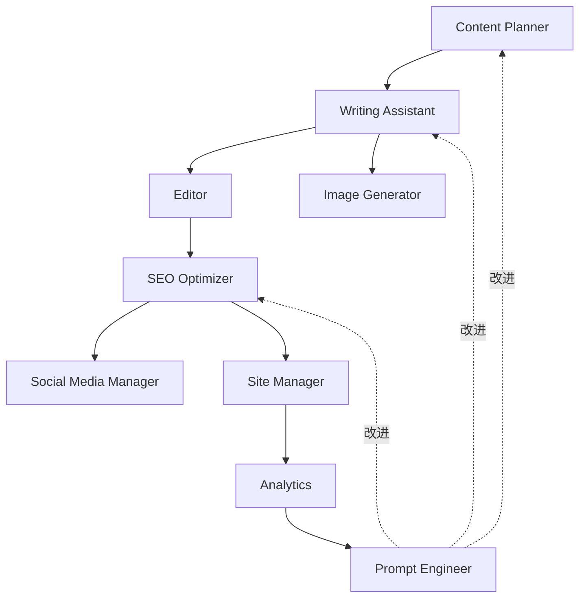
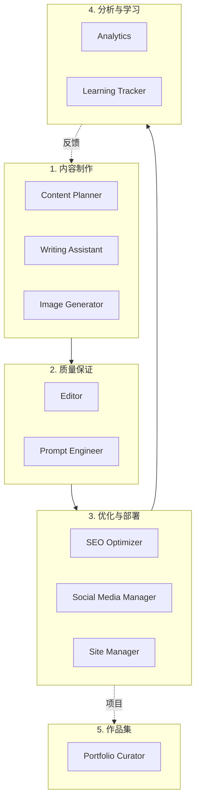

# Chapter 7: 11 智能体架构概述

## 本章学习内容

理解多智能体系统的整体结构,了解为什么需要多个专业智能体而不是单一 AI。学习 11 个智能体如何协作完成博客自动化,以及如何在实战中运用由 5 个集群组成的架构。

## Recipe 7.1: 为什么需要多智能体?

### 问题 (Problem)

使用单一通用 AI 处理所有任务会遇到以下问题:

1. **上下文过载**: 一个提示词包含太多指令会让 AI 感到困惑
2. **缺乏一致性**: 每次生成的结果质量参差不齐
3. **缺乏专业性**: 写作和 SEO 优化是不同的专业领域
4. **调试困难**: 难以找出问题出现在哪个环节
5. **无法复用**: 难以将已编写的提示词应用到其他任务

让我们看一个实际例子:

```
❌ 不好的做法: 一个庞大的提示词

"请写一篇博客文章。主题是 AI。还要进行 SEO 优化。
生成图片,编写社交媒体分享文案。
检查语法,验证链接。"

结果: AI 不知道从何开始,
每项任务的质量都下降。
```

### 解决方案 (Solution)

构建**专业化的智能体系统**。每个智能体只执行一个明确的角色,相互协作完成整个工作流程。

#### 分步实施

**Step 1: 定义角色分离原则**

应用 Unix 哲学的"专注做好一件事 (Do One Thing Well)"原则:

```markdown
每个智能体:
1. 只有一个明确的职责
2. 输入和输出明确
3. 可独立测试
4. 与其他智能体松耦合
```

**Step 2: 定义智能体间通信接口**

```typescript
// 智能体接口示例
interface Agent {
  name: string;
  role: string;
  input: AgentInput;
  output: AgentOutput;
  dependencies?: string[]; // 依赖的其他智能体
}

interface AgentInput {
  type: string;
  schema: object;
  example: any;
}

interface AgentOutput {
  type: string;
  schema: object;
  example: any;
}
```

**Step 3: 工作流编排**

```typescript
// 多智能体工作流
async function createBlogPost(topic: string) {
  // 1. 内容策划
  const outline = await contentPlanner.plan(topic);

  // 2. 起草文章 (接收 outline 作为输入)
  const draft = await writingAssistant.write(outline);

  // 3. 生成图片 (接收 draft 的标题作为输入)
  const image = await imageGenerator.generate(draft.title);

  // 4. 编辑审核 (接收 draft 作为输入)
  const edited = await editor.review(draft);

  // 5. SEO 优化 (接收 edited 作为输入)
  const optimized = await seoOptimizer.optimize(edited);

  // 6. 最终发布
  return {
    content: optimized,
    image: image,
    metadata: optimized.metadata
  };
}
```

### 代码/示例 (Code)

实际智能体文件结构:

```bash
.claude/agents/
├── content-planner.md        # 1. 内容策略
├── writing-assistant.md       # 2. 写作
├── image-generator.md         # 3. 图片生成
├── editor.md                  # 4. 编辑
├── seo-optimizer.md           # 5. SEO 优化
├── social-media-manager.md    # 6. 社交媒体
├── site-manager.md            # 7. 网站管理
├── analytics.md               # 8. 分析
├── portfolio-curator.md       # 9. 作品集
├── learning-tracker.md        # 10. 学习追踪
└── prompt-engineer.md         # 11. 提示词优化
```

每个智能体的基本结构:

```markdown
<!-- .claude/agents/writing-assistant.md -->
# Writing Assistant Agent

## 角色 (Role)
作为专业技术博客作者,撰写高质量博客文章。

## 输入 (Input)
- 主题 (topic): string
- 大纲 (outline): Outline object
- 目标读者 (audience): string
- 长度 (length): number (字数)

## 输出 (Output)
- 标题 (title): string (60字以内)
- 正文 (content): markdown
- 元数据 (metadata): object

## 工作流程 (Workflow)
1. 分析大纲
2. 撰写引言 (提出问题)
3. 撰写正文 (解决方案 + 示例)
4. 撰写结论 (Call-to-Action)
5. 生成元数据

## 质量标准 (Quality Standards)
- 第一段要吸引读者兴趣
- 每个部分包含可操作的建议
- 代码示例包含注释
- 明确的 Call-to-Action
```

### 说明 (Explanation)

#### 为什么多智能体更有效?

**1. 降低认知负担 (Reduced Cognitive Load)**

每个智能体只专注于一项任务,因此提示词简单明确:

```
❌ 复杂提示词 (1,000 tokens):
"写博客文章,进行 SEO 优化,生成图片..."

✅ 简单提示词 (200 tokens):
Writing Assistant: "用这个大纲写一篇 2,500 字的博客"
SEO Optimizer: "优化这篇文章的元标签"
```

**2. 提升专业性 (Improved Specialization)**

每个智能体使用其专业领域的知识和技术:

```markdown
Writing Assistant:
- 叙事技巧
- 句子结构优化
- 读者参与策略

SEO Optimizer:
- 关键词密度计算
- 元标签优化
- 内部链接策略
```

**3. 可复用性 (Reusability)**

创建一次的智能体可在多种工作流中复用:

```typescript
// 工作流 1: 常规博客文章
await contentPlanner.plan();
await writingAssistant.write();
await editor.review();

// 工作流 2: 紧急新闻文章 (跳过策划阶段)
await writingAssistant.write({ urgency: "high" });
await editor.review({ quick: true });

// 工作流 3: 仅 SEO 更新
await seoOptimizer.optimize();
```

**4. 并行处理 (Parallel Processing)**

独立任务可同时执行:

```typescript
// 顺序执行 (慢): 6分钟
await imageGenerator.generate();  // 2分钟
await seoOptimizer.optimize();    // 2分钟
await socialMedia.schedule();     // 2分钟

// 并行执行 (快): 2分钟
await Promise.all([
  imageGenerator.generate(),
  seoOptimizer.optimize(),
  socialMedia.schedule()
]);
```

### 变体 (Variations)

#### 变体 1: 微智能体 (更细粒度)

进一步细分:

```
将 Writing Assistant 细分:
├── IntroWriter: 专注引言
├── BodyWriter: 专注正文
├── ConclusionWriter: 专注结论
└── CodeExampleGenerator: 专注代码示例
```

**优点**: 更高质量
**缺点**: 增加复杂度,编排困难

#### 变体 2: 混合方法 (部分整合)

将相关任务整合到一个智能体:

```
ContentCreator (整合智能体):
├── 策划
├── 撰写
└── 编辑
```

**优点**: 结构简单
**缺点**: 可能降低各任务质量

#### 变体 3: 动态智能体 (按需创建)

根据任务动态创建智能体:

```typescript
// 仅保持核心智能体常驻
const coreAgents = [contentPlanner, writingAssistant];

// 按需添加其他智能体
if (needsTranslation) {
  agents.push(new TranslationAgent());
}

if (needsVideo) {
  agents.push(new VideoGeneratorAgent());
}
```

**优点**: 资源高效
**缺点**: 实现复杂度增加

---

## Recipe 7.2: 11 个智能体角色概述

### 问题 (Problem)

如果有 11 个智能体,必须明确了解每个智能体的功能和使用时机。否则:

- 调用错误的智能体浪费时间
- 智能体间角色重复导致混乱
- 遗漏必要的智能体导致质量下降

### 解决方案 (Solution)

明确定义每个智能体的**角色、输入、输出、使用场景**。

### 代码/示例 (Code)

#### 1. Content Planner (内容策划师)

```markdown
**角色**: 制定内容策略并发掘主题

**输入**:
- 主题关键词或趋势领域

**输出**:
- 博客大纲 (目录结构)
- 目标关键词列表
- 预期读者群画像

**使用场景**:
- 新博客文章策划
- 内容日历生成
- 趋势分析

**实际示例**:
```

```bash
# 调用
/agent content-planner "2025 AI 趋势"

# 输出
## 推荐主题
1. "用 Claude Code 将开发生产力提升 3 倍"
   - 目标: 初级〜高级开发者
   - 搜索量: 中等, 竞争度: 低
   - 关键词: claude code, ai coding, 生产力

2. "使用 MCP 实现 AI 工作流自动化"
   - 目标: DevOps, 对自动化感兴趣的开发者
   - 搜索量: 低, 竞争度: 很低 (机会!)
   - 关键词: mcp, model context protocol, automation

## 大纲 (第一个主题)
1. 引言: 开发者重复工作的痛点
2. Claude Code 介绍及核心功能
3. 5 个实战案例
4. 生产力测量方法
5. 结论及入门指南
```

#### 2. Writing Assistant (写作助手)

```markdown
**角色**: 撰写高质量博客文章

**输入**:
- 主题或大纲
- 目标长度 (字数)
- 语气和风格 (如: 专业、亲和)

**输出**:
- 完成的博客文章 (Markdown)
- Frontmatter (标题、描述、日期、标签)

**使用场景**:
- 撰写新文章
- 改写现有文章
- 多语言翻译 (本地化)

**实际示例**:
```

```bash
/agent writing-assistant --topic "Claude Code 实战指南" --length 2500 --tone professional-friendly

# 输出: src/content/blog/ko/claude-code-guide.md
---
title: "用 Claude Code 将开发生产力提升 3 倍"
description: "AI 配对编程的新标准,Claude Code 实战应用"
pubDate: "2025-12-19"
tags: ["claude-code", "ai", "productivity", "tutorial"]
---

# 用 Claude Code 将开发生产力提升 3 倍

## 改变开发者日常的 AI 工具

你每天花多少时间写代码?
其中有多少时间是真正"创造性"的工作?

[2,500字正文...]
```

#### 3. Image Generator (图片生成器)

```markdown
**角色**: 生成博客主图

**输入**:
- 博客标题或主题
- 图片风格 (可选)

**输出**:
- 优化的主图 (1920x1080)
- 文件路径

**使用场景**:
- 新文章的主图
- 社交媒体分享图 (OG image)

**实际示例**:
```

```typescript
// 调用 .claude/agents/image-generator.md
const image = await imageGenerator.generate({
  topic: "Claude Code 实战指南",
  style: "modern-tech"
});

// 输出
{
  path: "src/assets/blog/2025-12-19-claude-code-guide.png",
  dimensions: { width: 1920, height: 1080 },
  prompt: "Modern tech illustration featuring Claude AI and code editor,
           flat design, blue and green color palette, high contrast"
}
```

#### 4. Editor (编辑)

```markdown
**角色**: 检查语法、风格、技术准确性

**输入**:
- 已撰写的博客文章 (Markdown)

**输出**:
- 审核报告 (错误列表、改进建议)
- 修订版本 (可选)

**使用场景**:
- 发布前最终审核
- 改进现有文章质量

**实际示例**:
```

```markdown
# Editor 审核报告

## 语法错误 (2项)
1. Line 45: "开发者 们" → "开发者们" (空格)
2. Line 120: "Claude code" → "Claude Code" (大小写)

## 风格建议 (3项)
1. Line 30: 段落过长 (8句) → 建议分成 2 段
2. Line 89: 专业术语 "MCP" 首次出现时建议添加全称
3. Line 200: 结论部分建议添加具体的 Call-to-Action

## 技术准确性 (1项)
1. Line 150: Claude Code 版本信息需要更新
   - 当前: "Claude Code 1.0"
   - 修正: "Claude Code 1.5"

## 元数据审核
✅ Title: 58字 (推荐: 60字以内)
✅ Description: 152字 (推荐: 150-160字)
⚠️ Tags: 4个 (推荐: 5-8个) - 建议增加 2个
```

#### 5. SEO Optimizer (搜索优化专家)

```markdown
**角色**: 搜索引擎优化

**输入**:
- 博客文章
- 目标关键词 (可选)

**输出**:
- 优化的元标签
- 内部链接建议
- SEO 评分报告

**使用场景**:
- 新文章发布前
- 改进现有文章 SEO
- 更新网站地图

**实际示例**:
```

```yaml
# SEO 优化结果

## 元标签
title: "Claude Code 实战指南 - 5种提升开发生产力 3 倍的方法"
  # 包含关键词 "Claude Code", "生产力", 59字

description: "AI 配对编程工具 Claude Code 的实战应用。从安装到高级技巧,包含 5 个实用技巧和示例代码,可直接应用于实际工作。"
  # 行动导向 ("可直接应用于实际工作"), 154字

keywords:
  - claude code
  - ai coding assistant
  - 开发生产力
  - ai pair programming
  - anthropic

## 内部链接建议 (3个)
1. "什么是 AI 智能体?" → /blog/ai-agent-basics (相关度: 高)
2. "提示工程基础" → /blog/prompt-engineering-101 (相关度: 中)
3. "MCP 集成指南" → /blog/mcp-integration (相关度: 高)

## SEO 评分: 92/100
✅ Title 优化
✅ Description 优化
✅ Heading 结构 (H1-H6 层次)
✅ 图片 Alt 文本
✅ 内部链接 (3个)
⚠️ 外部链接不足 (1个, 推荐: 3个以上)
```

#### 6. Social Media Manager (社交媒体管理员)

```markdown
**角色**: 社交媒体分享自动化

**输入**:
- 博客文章 URL
- 目标平台 (Twitter, LinkedIn 等)

**输出**:
- 各平台分享文案
- 话题标签建议
- 最佳发布时间

**使用场景**:
- 新文章发布时自动分享
- 热门文章再次分享
```

```markdown
# 社交媒体分享计划

## Twitter
📝 "用 AI 将开发生产力提升 3 倍的方法 👨‍💻

撰写了 Claude Code 实战指南:
✅ 5 个核心技巧
✅ 实战示例代码
✅ Before/After 对比

开发者必看 👇
[链接]

#ClaudeCode #AI #开发生产力"

话题标签: #ClaudeCode #AI #DevTools #Productivity
最佳发布时间: 上午 10 点 (开发者活跃时段)

## LinkedIn
📝 "AI 配对编程的新标准: Claude Code

总结了最近 3 个月在实际工作中应用 Claude Code 的经验。

主要内容:
• 通过自动化重复任务每天节省 2 小时
• 代码质量提升 30%
• 5 种实战应用模式

希望对关注开发生产力的朋友有帮助。

[查看全文: 链接]

#SoftwareDevelopment #AI #Productivity #ClaudeCode"
```

#### 7. Site Manager (网站管理员)

```markdown
**角色**: Astro 构建、部署、性能优化

**输入**:
- 构建命令 (build, preview, deploy)

**输出**:
- 构建成功/失败报告
- 性能指标
- 部署 URL

**使用场景**:
- 新文章发布
- 网站更新
- 性能监控
```

```bash
# Site Manager 执行日志

[1/6] 类型检查...
✅ TypeScript 验证通过

[2/6] Content Collections 验证...
✅ 所有博客文章符合 schema

[3/6] 构建...
✅ 127 页面生成 (3.2秒)

[4/6] 图片优化...
✅ 43 张图片 → WebP 转换 (2.1MB → 456KB, 节省 78%)

[5/6] 生成网站地图...
✅ sitemap-index.xml 生成

[6/6] 部署...
✅ Vercel 部署完成

成果:
📊 Lighthouse 评分: 98/100
⚡ First Contentful Paint: 0.8秒
🎨 Largest Contentful Paint: 1.2秒
🔗 部署 URL: https://jangwook.net/blog/claude-code-guide
```

#### 8. Analytics (分析师)

```markdown
**角色**: 实时流量分析及即时洞察

**输入**:
- 分析时段
- 分析对象 (特定文章或全部)

**输出**:
- 非正式分析结果 (对话式)
- 即时洞察

**使用场景**:
- "今天浏览量最高的文章?"
- "上周流量趋势?"
- 即时问题的快速回答
```

```markdown
# Analytics 即时分析 (非正式)

Q: "今天浏览量最高的文章?"

A: 截至今天 (2025-12-19) TOP 3:

1. "Claude Code 实战指南" - 347 次浏览
   - 较昨天增长 +215%
   - 主要来源: Twitter (60%), 搜索 (30%)

2. "AI 智能体架构" - 203 次浏览
   - 稳定 (日均 200)

3. "提示工程 101" - 156 次浏览
   - 较昨天下降 -15%
```

#### 9. Portfolio Curator (作品集策展人)

```markdown
**角色**: 项目作品集管理

**输入**:
- 新项目信息

**输出**:
- 作品集页面更新
- 项目描述自动生成

**使用场景**:
- 添加新项目
- 更新现有项目
- 优化作品集
```

#### 10. Learning Tracker (学习追踪器)

```markdown
**角色**: 学习目标及技术趋势追踪

**输入**:
- 学习主题或目标

**输出**:
- 学习路线图
- 进度追踪
- 推荐资源

**使用场景**:
- 新技术学习计划
- 进度检查
- 发掘博客主题 (学习内容 → 博客)
```

#### 11. Prompt Engineer (提示词优化专家)

```markdown
**角色**: 改进其他所有智能体的提示词

**输入**:
- 需改进的智能体名称
- 当前提示词
- 问题描述

**输出**:
- 改进的提示词
- A/B 测试结果
- 性能对比

**使用场景**:
- 智能体质量下降时
- 添加新用例时
- 定期优化 (每月 1 次)

**实际示例**:
```

```markdown
# Prompt Engineer: Writing Assistant 改进

## Before (现有提示词)
"请写博客文章。要专业且亲和。"

问题点:
- 过于模糊
- 输出格式不明确
- 无质量标准

## After (改进的提示词)
```

````markdown
你是一位有 10 年经验的技术博客作者。

**主题**: {topic}
**目标读者**: 初级〜高级开发者
**长度**: 2,500-3,000 字

**结构**:

1. 引言 (200字)
   - 以提问开头
   - 引起读者共鸣
2. 正文 (2,000字)
   - 核心概念说明
   - 最少 5 个 Before/After 示例
   - 代码需包含注释,可运行
3. 结论 (300字)
   - 3 点核心总结
   - 可执行的行动项

**语气**: 礼貌、专业但亲和
**风格**: 实用、示例导向

**输出格式**:

```yaml
---
title: [60字以内, 包含主要关键词]
description: [150-160字, 包含行动导向语句]
pubDate: [YYYY-MM-DD]
tags: [5-8个]
---

[正文 Markdown]
```
````

```

## A/B 测试结果
- 质量评分: 65/100 → 92/100 (+27分)
- 需修改次数: 平均 3次 → 0.5次 (-83%)
- 输出一致性: 60% → 95% (+35%p)
```

### 说明 (Explanation)

#### 智能体选择指南

**按场景匹配智能体**:

| 场景 | 使用的智能体 | 组合 |
|------|----------------|------|
| 撰写新博客 | Content Planner → Writing Assistant → Editor → SEO Optimizer | 4个 |
| 改进现有文章 SEO | SEO Optimizer | 1个 |
| 社交媒体分享 | Social Media Manager | 1个 |
| 网站部署 | Site Manager | 1个 |
| 性能分析 | Analytics | 1个 |
| 提示词改进 | Prompt Engineer | 1个 |

#### 智能体间依赖关系



- **实线箭头**: 数据流 (输出作为下一个输入)
- **虚线箭头**: 反馈循环 (性能改进)

### 变体 (Variations)

#### 变体 1: 最小智能体集 (3个)

如果有预算或复杂度限制:

```
1. Content Creator (策划 + 撰写 整合)
2. Quality Checker (编辑 + SEO 整合)
3. Publisher (部署 + 社交媒体 整合)
```

#### 变体 2: 扩展智能体集 (15个+)

如需更专业化:

```
现有 11个 +
12. Translation Agent (专业翻译)
13. Video Generator (视频内容)
14. Newsletter Composer (新闻通讯)
15. Community Manager (评论管理)
16. Backlink Hunter (反向链接发掘)
```

---

## Recipe 7.3: 智能体间通信结构

### 问题 (Problem)

如果 11 个智能体之间如何对话和交换数据不明确,会导致:

- 数据丢失或变形
- 智能体调用顺序混乱
- 发生错误时无法调试
- 难以扩展工作流

### 解决方案 (Solution)

定义**标准化的通信协议**。所有智能体遵循相同的输入输出格式。

#### 分步实施

**Step 1: 定义数据模式**

```typescript
// 通用接口
interface AgentMessage {
  id: string;              // 唯一消息 ID
  timestamp: Date;         // 创建时间
  sender: string;          // 发送智能体
  receiver: string;        // 接收智能体
  type: MessageType;       // 消息类型
  payload: any;            // 实际数据
  metadata?: {             // 可选元数据
    priority?: 'low' | 'normal' | 'high';
    retry?: number;
    timeout?: number;
  };
}

enum MessageType {
  REQUEST = 'request',     // 任务请求
  RESPONSE = 'response',   // 任务结果
  ERROR = 'error',         // 错误报告
  NOTIFICATION = 'notification' // 通知
}
```

**Step 2: 实现消息总线**

```typescript
// 中央消息总线
class AgentMessageBus {
  private subscribers: Map<string, Function[]> = new Map();

  // 发布消息
  publish(message: AgentMessage): void {
    const receivers = this.subscribers.get(message.receiver) || [];
    receivers.forEach(handler => handler(message));
  }

  // 注册订阅
  subscribe(agentName: string, handler: Function): void {
    const handlers = this.subscribers.get(agentName) || [];
    handlers.push(handler);
    this.subscribers.set(agentName, handlers);
  }

  // 请求-响应模式
  async request(sender: string, receiver: string, payload: any): Promise<any> {
    return new Promise((resolve, reject) => {
      const messageId = generateId();

      // 等待响应
      const responseHandler = (msg: AgentMessage) => {
        if (msg.id === messageId) {
          if (msg.type === MessageType.RESPONSE) {
            resolve(msg.payload);
          } else if (msg.type === MessageType.ERROR) {
            reject(msg.payload);
          }
        }
      };

      this.subscribe(sender, responseHandler);

      // 发布请求
      this.publish({
        id: messageId,
        timestamp: new Date(),
        sender,
        receiver,
        type: MessageType.REQUEST,
        payload
      });
    });
  }
}
```

**Step 3: 智能体基类**

```typescript
abstract class BaseAgent {
  constructor(
    protected name: string,
    protected bus: AgentMessageBus
  ) {
    // 订阅消息
    bus.subscribe(name, (msg) => this.handleMessage(msg));
  }

  // 消息处理 (子类实现)
  protected abstract async process(payload: any): Promise<any>;

  // 消息接收处理
  private async handleMessage(message: AgentMessage): Promise<void> {
    try {
      const result = await this.process(message.payload);

      // 发布响应
      this.bus.publish({
        id: message.id,
        timestamp: new Date(),
        sender: this.name,
        receiver: message.sender,
        type: MessageType.RESPONSE,
        payload: result
      });
    } catch (error) {
      // 发布错误
      this.bus.publish({
        id: message.id,
        timestamp: new Date(),
        sender: this.name,
        receiver: message.sender,
        type: MessageType.ERROR,
        payload: { error: error.message }
      });
    }
  }

  // 调用其他智能体
  protected async call(receiver: string, payload: any): Promise<any> {
    return this.bus.request(this.name, receiver, payload);
  }
}
```

### 代码/示例 (Code)

#### 实际智能体实现示例

```typescript
// Writing Assistant 智能体
class WritingAssistant extends BaseAgent {
  constructor(bus: AgentMessageBus) {
    super('writing-assistant', bus);
  }

  protected async process(payload: any): Promise<any> {
    const { topic, outline, length } = payload;

    // 1. 生成内容
    const content = await this.generateContent(topic, outline, length);

    // 2. 请求图片 (调用 Image Generator)
    const image = await this.call('image-generator', {
      topic: content.title
    });

    // 3. 返回结果
    return {
      title: content.title,
      content: content.body,
      metadata: content.metadata,
      heroImage: image.path
    };
  }

  private async generateContent(topic: string, outline: any, length: number) {
    // 实际 LLM 调用逻辑
    // ...
  }
}
```

#### 工作流执行示例

```typescript
// 创建消息总线
const bus = new AgentMessageBus();

// 初始化智能体
const contentPlanner = new ContentPlanner(bus);
const writingAssistant = new WritingAssistant(bus);
const editor = new Editor(bus);
const seoOptimizer = new SEOOptimizer(bus);

// 博客文章生成工作流
async function createBlogPost(topic: string) {
  // 1. 内容策划
  const outline = await bus.request('orchestrator', 'content-planner', {
    topic
  });

  // 2. 撰写草稿
  const draft = await bus.request('orchestrator', 'writing-assistant', {
    topic,
    outline,
    length: 2500
  });

  // 3. 编辑
  const edited = await bus.request('orchestrator', 'editor', {
    content: draft.content
  });

  // 4. SEO 优化
  const optimized = await bus.request('orchestrator', 'seo-optimizer', {
    content: edited.content,
    metadata: draft.metadata
  });

  return optimized;
}

// 执行
const result = await createBlogPost("Claude Code 实战指南");
console.log(result);
```

#### 消息流示例

```json
// 1. 向 Content Planner 发送请求
{
  "id": "msg-001",
  "timestamp": "2025-12-19T10:00:00Z",
  "sender": "orchestrator",
  "receiver": "content-planner",
  "type": "request",
  "payload": {
    "topic": "Claude Code 实战指南"
  }
}

// 2. Content Planner 响应
{
  "id": "msg-001",
  "timestamp": "2025-12-19T10:00:15Z",
  "sender": "content-planner",
  "receiver": "orchestrator",
  "type": "response",
  "payload": {
    "outline": {
      "title": "Claude Code 实战指南",
      "sections": [
        { "heading": "引言", "points": [...] },
        { "heading": "核心功能", "points": [...] },
        { "heading": "实战案例", "points": [...] }
      ],
      "targetKeywords": ["claude code", "ai coding", "productivity"]
    }
  }
}

// 3. 向 Writing Assistant 发送请求 (使用之前的响应作为输入)
{
  "id": "msg-002",
  "timestamp": "2025-12-19T10:00:16Z",
  "sender": "orchestrator",
  "receiver": "writing-assistant",
  "type": "request",
  "payload": {
    "topic": "Claude Code 实战指南",
    "outline": { /* 上述响应数据 */ },
    "length": 2500
  }
}
```

### 说明 (Explanation)

#### 通信模式

**1. 同步请求-响应 (Request-Response)**

最常见的模式:

```typescript
// 调用者等待响应
const result = await bus.request('caller', 'worker', { data });
```

**优点**:
- 简单直观
- 数据流清晰

**缺点**:
- 顺序执行可能较慢

**2. 异步发布-订阅 (Publish-Subscribe)**

松耦合模式:

```typescript
// 发布者: 不等待响应
bus.publish({
  sender: 'publisher',
  receiver: '*', // 所有订阅者
  type: MessageType.NOTIFICATION,
  payload: { event: 'post-published', postId: '123' }
});

// 订阅者
bus.subscribe('social-media-manager', handlePostPublished);
bus.subscribe('analytics', handlePostPublished);
```

**优点**:
- 可并行处理
- 扩展性好

**缺点**:
- 难以追踪数据流

**3. 管道 (Pipeline)**

顺序数据转换:

```typescript
const pipeline = [
  'content-planner',
  'writing-assistant',
  'editor',
  'seo-optimizer'
];

let data = { topic: "主题" };

for (const agent of pipeline) {
  data = await bus.request('orchestrator', agent, data);
}
```

**优点**:
- 数据转换过程清晰
- 各阶段可独立测试

**缺点**:
- 顺序执行较慢

#### 错误处理

```typescript
class RobustAgent extends BaseAgent {
  protected async process(payload: any): Promise<any> {
    const maxRetries = 3;
    let attempt = 0;

    while (attempt < maxRetries) {
      try {
        return await this.doWork(payload);
      } catch (error) {
        attempt++;

        if (attempt >= maxRetries) {
          // 最终失败: 传播错误
          throw error;
        }

        // 重试等待 (指数退避)
        await sleep(Math.pow(2, attempt) * 1000);
      }
    }
  }

  private async doWork(payload: any): Promise<any> {
    // 实际工作逻辑
  }
}
```

### 变体 (Variations)

#### 变体 1: 事件溯源 (Event Sourcing)

保存所有消息以实现可重现:

```typescript
class EventSourcingBus extends AgentMessageBus {
  private events: AgentMessage[] = [];

  publish(message: AgentMessage): void {
    // 保存事件
    this.events.push(message);

    // 现有逻辑
    super.publish(message);
  }

  // 回溯到特定时间点
  replay(fromTimestamp: Date): void {
    const replayEvents = this.events.filter(e => e.timestamp >= fromTimestamp);
    replayEvents.forEach(e => super.publish(e));
  }
}
```

#### 变体 2: 优先级队列

优先处理重要消息:

```typescript
class PriorityBus extends AgentMessageBus {
  private queues: {
    high: AgentMessage[],
    normal: AgentMessage[],
    low: AgentMessage[]
  } = { high: [], normal: [], low: [] };

  publish(message: AgentMessage): void {
    const priority = message.metadata?.priority || 'normal';
    this.queues[priority].push(message);
    this.processNext();
  }

  private processNext(): void {
    const message =
      this.queues.high.shift() ||
      this.queues.normal.shift() ||
      this.queues.low.shift();

    if (message) {
      super.publish(message);
    }
  }
}
```

---

## Recipe 7.4: 5 集群结构

### 问题 (Problem)

平面管理 11 个智能体会导致:

- 不清楚应先调用哪个智能体
- 难以找到相关智能体
- 工作流设计复杂
- 团队协作时角色分工不明确

### 解决方案 (Solution)

将智能体划分为**5 个逻辑集群**。每个集群负责特定阶段。

### 代码/示例 (Code)

#### 集群 1: 内容制作 (Content Creation)

**目的**: 创意 → 完成的文章

**智能体**:
1. Content Planner
2. Writing Assistant
3. Image Generator

**工作流**:

```typescript
async function contentCreationCluster(topic: string) {
  // 1. 策划
  const outline = await contentPlanner.plan(topic);

  // 2. 撰写 & 生成图片 (并行)
  const [draft, heroImage] = await Promise.all([
    writingAssistant.write(outline),
    imageGenerator.generate(outline.title)
  ]);

  return {
    content: draft,
    image: heroImage,
    outline
  };
}
```

**输入**: 主题 (string)
**输出**: 草稿 + 图片 + 大纲

---

#### 集群 2: 质量保证 (Quality Assurance)

**目的**: 草稿 → 经验证的高质量内容

**智能体**:
1. Editor
2. Prompt Engineer (智能体质量管理)

**工作流**:

```typescript
async function qualityAssuranceCluster(draft: BlogPost) {
  // 1. 编辑审核
  const reviewed = await editor.review(draft);

  // 2. 检查质量评分
  if (reviewed.qualityScore < 80) {
    // 质量不达标: 需改进提示词
    const improvedPrompt = await promptEngineer.improve({
      agent: 'writing-assistant',
      currentPrompt: writingAssistant.getPrompt(),
      issue: reviewed.issues
    });

    // 更新 Writing Assistant 提示词
    writingAssistant.updatePrompt(improvedPrompt);

    // 重写 (可选)
    // return writingAssistant.write(...);
  }

  return reviewed;
}
```

**输入**: 草稿
**输出**: 审核内容 + 质量报告

---

#### 集群 3: 优化与部署 (Optimization & Deployment)

**目的**: 经验证的内容 → 发布

**智能体**:
1. SEO Optimizer
2. Social Media Manager
3. Site Manager

**工作流**:

```typescript
async function optimizationDeploymentCluster(content: BlogPost) {
  // 1. SEO 优化
  const optimized = await seoOptimizer.optimize(content);

  // 2. 构建 & 部署
  const deployment = await siteManager.deploy(optimized);

  // 3. 社交媒体分享 (部署后)
  await socialMediaManager.share({
    url: deployment.url,
    title: optimized.title,
    description: optimized.description
  });

  return {
    url: deployment.url,
    seoScore: optimized.seoScore,
    socialPosts: socialMediaManager.getScheduledPosts()
  };
}
```

**输入**: 经验证的内容
**输出**: 部署 URL + SEO 评分 + 社交媒体计划

---

#### 集群 4: 分析与学习 (Analytics & Learning)

**目的**: 绩效测量 → 改进洞察

**智能体**:
1. Analytics
2. Learning Tracker

**工作流**:

```typescript
async function analyticsLearningCluster(postUrl: string) {
  // 1. 绩效追踪 (发布后 7 天)
  await sleep(7 * 24 * 60 * 60 * 1000); // 等待 7 天

  const metrics = await analytics.analyze(postUrl);

  // 2. 提取学习要点
  const learnings = await learningTracker.extract({
    topic: metrics.topic,
    performance: metrics,
    insights: [
      `浏览量: ${metrics.views}`,
      `停留时间: ${metrics.avgTimeOnPage}秒`,
      `跳出率: ${metrics.bounceRate}%`
    ]
  });

  // 3. 更新未来内容策略
  if (metrics.views > 1000) {
    await contentPlanner.addToStrategy({
      topic: metrics.topic,
      reason: '达到高浏览量',
      suggestedFollowUps: learnings.nextTopics
    });
  }

  return {
    metrics,
    learnings,
    recommendations: learnings.recommendations
  };
}
```

**输入**: 文章 URL
**输出**: 绩效指标 + 学习内容 + 建议

---

#### 集群 5: 作品集管理 (Portfolio Management)

**目的**: 个人品牌建设

**智能体**:
1. Portfolio Curator

**工作流**:

```typescript
async function portfolioManagementCluster(project: Project) {
  // 1. 添加项目
  const portfolio = await portfolioCurator.add(project);

  // 2. 自动生成描述
  const description = await portfolioCurator.generateDescription(project);

  // 3. 生成博客文章 (可选)
  if (project.isBlogWorthy) {
    await contentPlanner.plan({
      topic: `${project.name} 项目回顾`,
      type: 'case-study'
    });
  }

  return portfolio;
}
```

**输入**: 项目信息
**输出**: 更新的作品集

---

### 集群间关系



### 说明 (Explanation)

#### 集群设计原则

**1. 单一职责 (Single Responsibility)**

每个集群有一个明确的目标:

```
集群 1: 创建 (Create)
集群 2: 验证 (Verify)
集群 3: 发布 (Publish)
集群 4: 学习 (Learn)
集群 5: 积累 (Build)
```

**2. 顺序执行 (Sequential Execution)**

大多数工作流按 1 → 2 → 3 → 4 顺序:

```typescript
const result = await pipe(
  contentCreationCluster,
  qualityAssuranceCluster,
  optimizationDeploymentCluster,
  analyticsLearningCluster
)(topic);
```

**3. 松耦合 (Loose Coupling)**

集群间仅约定接口:

```typescript
interface ClusterOutput {
  data: any;
  metadata: {
    cluster: string;
    timestamp: Date;
    quality: number;
  };
}
```

#### 集群应用模式

**模式 1: 完整工作流 (Full Pipeline)**

```typescript
async function fullBlogWorkflow(topic: string) {
  // 1. 内容制作
  const created = await contentCreationCluster(topic);

  // 2. 质量保证
  const verified = await qualityAssuranceCluster(created.content);

  // 3. 优化与部署
  const deployed = await optimizationDeploymentCluster(verified);

  // 4. 分析 (异步 - 7天后)
  analyticsLearningCluster(deployed.url); // 无 await

  return deployed;
}
```

**模式 2: 部分工作流 (Partial Pipeline)**

仅改进现有文章 SEO:

```typescript
async function seoOnlyWorkflow(existingPost: BlogPost) {
  // 仅执行集群 3
  return optimizationDeploymentCluster(existingPost);
}
```

**模式 3: 并行集群 (Parallel Clusters)**

独立任务同时执行:

```typescript
async function parallelWorkflow(topic: string) {
  const created = await contentCreationCluster(topic);

  // 质量保证和作品集更新并行执行
  const [verified, portfolio] = await Promise.all([
    qualityAssuranceCluster(created.content),
    portfolioManagementCluster({ name: topic, type: 'blog' })
  ]);

  return { verified, portfolio };
}
```

### 变体 (Variations)

#### 变体 1: 微集群 (更细粒度)

细分集群 1:

```
集群 1A: 创意发掘
  - Content Planner

集群 1B: 内容生成
  - Writing Assistant
  - Image Generator
```

#### 变体 2: 大集群 (整合)

整合集群 1+2:

```
集群 A: 内容完成
  - Content Planner
  - Writing Assistant
  - Image Generator
  - Editor
```

#### 变体 3: 动态集群 (条件式)

根据条件改变集群配置:

```typescript
async function dynamicWorkflow(topic: string, options: WorkflowOptions) {
  const clusters = [contentCreationCluster];

  if (options.needsQA) {
    clusters.push(qualityAssuranceCluster);
  }

  if (options.publish) {
    clusters.push(optimizationDeploymentCluster);
  }

  // 执行动态配置的管道
  return executePipeline(clusters, topic);
}
```

---

## 本章总结

### 核心概念

1. **多智能体的必要性**
   - 通过专业化提高质量
   - 通过模块化实现复用性
   - 通过并行处理提升速度

2. **11 个智能体角色**
   - 每个智能体有明确的单一职责
   - 标准化输入/输出接口
   - 可独立测试和改进

3. **智能体间通信**
   - 标准消息协议
   - 请求-响应、发布-订阅模式
   - 错误处理和重试机制

4. **5 集群结构**
   - 通过逻辑分组管理复杂度
   - 顺序工作流设计
   - 集群间松耦合

### 实战应用指南

**第 1 阶段: 最小系统 (3个智能体)**

```
- Content Creator (策划 + 撰写)
- Quality Checker (编辑)
- Publisher (部署)
```

**第 2 阶段: 标准系统 (7个智能体)**

```
+ Writing Assistant (分离)
+ SEO Optimizer
+ Image Generator
+ Analytics
```

**第 3 阶段: 完整系统 (11个智能体)**

```
+ Social Media Manager
+ Portfolio Curator
+ Learning Tracker
+ Prompt Engineer
```

### 下一章预告

**Chapter 8: 核心智能体详细实现**将学习最重要的 5 个智能体 (Content Planner, Writing Assistant, Editor, SEO Optimizer, Prompt Engineer) 的实际提示词和实现方法。

---

**结语提示**

多智能体系统初看可能很复杂,但如果**分阶段构建**,任何人都能做到:

1. **从单个智能体开始**: 先只做 Writing Assistant
2. **逐步添加**: 需要时再添加智能体
3. **持续改进**: 用 Prompt Engineer 提升质量

今天就可以开始。创建你的第一个智能体吧!
