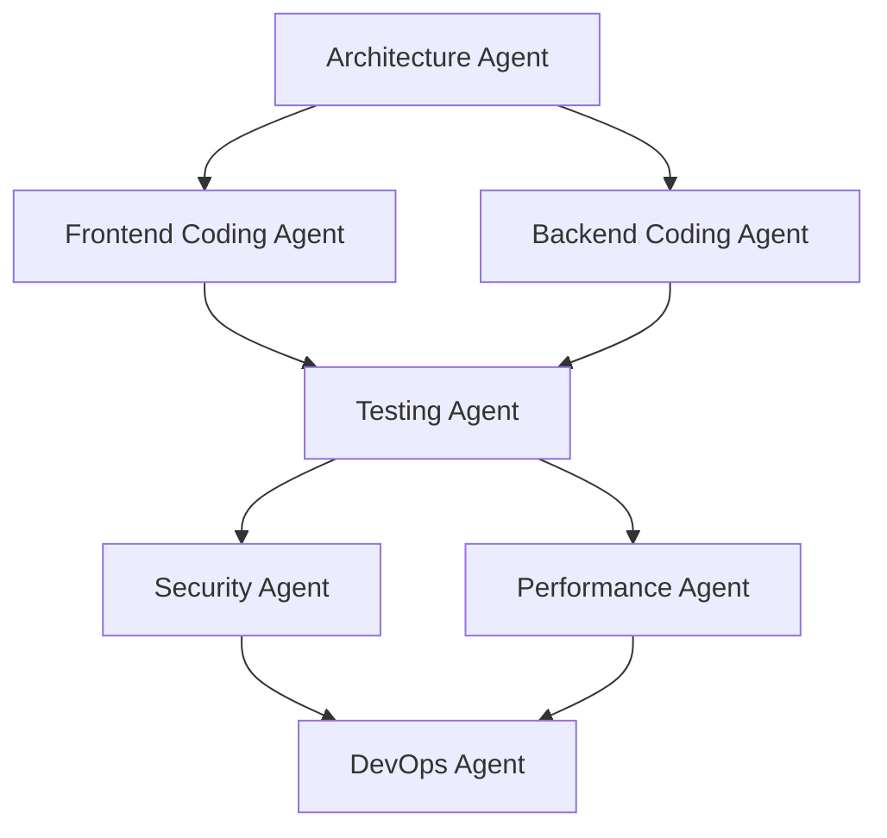

# Chapter 11: 代理协作模式

## 概述

在多代理系统中,最重要的是设计代理之间的有效协作。从单个代理处理所有任务的时代,演变到多个专业代理协作的系统,如何分配和协调代理之间的工作成为核心挑战。

本章以cookbook风格提供在实践中验证的4种协作模式。每个配方都可以独立阅读,包含要解决的问题、具体解决方法、实际代码示例、工作原理以及应用方法。

### 本章涵盖的内容

- **Recipe 11.1: 顺序执行模式(Sequential)** - 如何按步骤推进任务
- **Recipe 11.2: 并行执行模式(Parallel)** - 如何同时执行多个任务
- **Recipe 11.3: 交接模式(Handoff)** - 如何根据情况将工作转交给专家
- **Recipe 11.4: 编排器模式(Orchestrator)** - 如何从中央协调整体流程

---

## Recipe 11.1: 顺序执行模式(Sequential)

### 问题(Problem)

构建全栈应用程序时,各个阶段通常依赖于前一阶段的输出。例如:

- 编码代理需要接收架构代理的设计才能实现
- 测试代理需要在代码编写后才能编写测试
- 安全代理需要在代码完成后才能扫描漏洞
- DevOps代理需要在所有验证结束后才能部署

需要确保每个代理发挥其作用,但要按正确的顺序执行。

### 解决方案(Solution)

顺序执行模式以**流水线方式**连接代理。每个代理的输出成为下一个代理的输入,整个流程形成一个线性链。

#### 分步实现方法

**步骤1: 定义任务流程**

```
需求 → Architecture → Coding → Testing → Security → DevOps → 部署
```

**步骤2: 设计共享状态(Shared State)**

定义所有代理都可以读写的状态对象。

```typescript
// 共享状态定义
interface AppState {
  requirements: string;           // 初始需求
  architecture?: {                // Architecture Agent输出
    stack: string[];
    database: string;
    components: Record<string, string[]>;
  };
  code?: {                        // Coding Agent输出
    files: Map<string, string>;
    dependencies: string[];
  };
  tests?: {                       // Testing Agent输出
    coverage: number;
    results: TestResult[];
  };
  securityReport?: {              // Security Agent输出
    vulnerabilities: Vulnerability[];
    recommendations: string[];
  };
  deploymentConfig?: {            // DevOps Agent输出
    target: string;
    healthCheckUrl: string;
  };
}
```

**步骤3: 将每个代理实现为函数**

每个代理都是接收状态并更新状态的纯函数。

```typescript
// Architecture Agent
async function architectureAgent(state: AppState): Promise<AppState> {
  const { requirements } = state;

  console.log('🏗️ Architecture Agent: Designing system...');

  const architecture = {
    stack: ['Node.js', 'TypeScript', 'PostgreSQL', 'Redis'],
    database: 'postgresql',
    components: {
      domain: ['User', 'Todo'],
      application: ['UserService', 'TodoService'],
      infrastructure: ['UserRepository', 'TodoRepository'],
      presentation: ['UserController', 'TodoController']
    }
  };

  return { ...state, architecture };
}

// Coding Agent
async function codingAgent(state: AppState): Promise<AppState> {
  const { architecture } = state;

  if (!architecture) {
    throw new Error('Architecture not defined');
  }

  console.log('💻 Coding Agent: Implementing components...');

  const files = new Map<string, string>();

  // 创建领域层
  files.set('src/domain/todo.entity.ts', `
export class Todo {
  constructor(
    public readonly id: string,
    public readonly userId: string,
    public title: string,
    public completed: boolean,
    public readonly createdAt: Date
  ) {}

  static create(userId: string, title: string): Todo {
    return new Todo(
      crypto.randomUUID(),
      userId,
      title,
      false,
      new Date()
    );
  }

  toggle(): void {
    this.completed = !this.completed;
  }
}
  `);

  // 创建应用层
  files.set('src/application/todo.service.ts', `
export class TodoService {
  constructor(private repository: TodoRepository) {}

  async create(userId: string, title: string): Promise<Todo> {
    const todo = Todo.create(userId, title);
    await this.repository.save(todo);
    return todo;
  }

  async findByUserId(userId: string): Promise<Todo[]> {
    return this.repository.findByUserId(userId);
  }

  async toggle(id: string): Promise<Todo> {
    const todo = await this.repository.findById(id);
    if (!todo) throw new Error('Todo not found');
    todo.toggle();
    await this.repository.save(todo);
    return todo;
  }
}
  `);

  const code = {
    files,
    dependencies: ['express', 'pg', 'redis', 'joi']
  };

  return { ...state, code };
}

// Testing Agent
async function testingAgent(state: AppState): Promise<AppState> {
  const { code } = state;

  if (!code) {
    throw new Error('Code not generated');
  }

  console.log('🧪 Testing Agent: Writing tests...');

  // 生成测试文件
  const testFile = `
describe('TodoService', () => {
  it('should create todo', async () => {
    const service = new TodoService(mockRepository);
    const todo = await service.create('user-1', 'Buy milk');
    expect(todo.title).toBe('Buy milk');
    expect(todo.completed).toBe(false);
  });

  it('should toggle todo completion', async () => {
    const service = new TodoService(mockRepository);
    const todo = await service.toggle('todo-1');
    expect(todo.completed).toBe(true);
  });
});
  `;

  code.files.set('src/application/todo.service.test.ts', testFile);

  const tests = {
    coverage: 92.5,
    results: [
      { suite: 'TodoService', passed: 2, failed: 0 }
    ]
  };

  return { ...state, tests };
}

// Security Agent
async function securityAgent(state: AppState): Promise<AppState> {
  const { code } = state;

  if (!code) {
    throw new Error('Code not generated');
  }

  console.log('🔒 Security Agent: Scanning for vulnerabilities...');

  const vulnerabilities: Vulnerability[] = [];
  const recommendations: string[] = [
    'Add input validation with Joi schemas',
    'Use parameterized queries to prevent SQL injection',
    'Implement rate limiting for API endpoints',
    'Add CORS whitelist configuration'
  ];

  const securityReport = {
    vulnerabilities,
    recommendations
  };

  return { ...state, securityReport };
}

// DevOps Agent
async function devopsAgent(state: AppState): Promise<AppState> {
  const { tests, securityReport } = state;

  if (!tests || !securityReport) {
    throw new Error('Prerequisites not met');
  }

  console.log('🚀 DevOps Agent: Preparing deployment...');

  const deploymentConfig = {
    target: 'AWS ECS Fargate',
    healthCheckUrl: 'https://api.example.com/health'
  };

  return { ...state, deploymentConfig };
}
```

**步骤4: 构建顺序执行流水线**

```typescript
async function sequentialPipeline(requirements: string): Promise<AppState> {
  let state: AppState = { requirements };

  // 依次执行每个代理
  state = await architectureAgent(state);
  state = await codingAgent(state);
  state = await testingAgent(state);
  state = await securityAgent(state);
  state = await devopsAgent(state);

  return state;
}

// 执行
const result = await sequentialPipeline(
  'Build a REST API for todo management with user authentication'
);

console.log('✅ Pipeline completed');
console.log(`Generated ${result.code?.files.size} files`);
console.log(`Test coverage: ${result.tests?.coverage}%`);
console.log(`Security recommendations: ${result.securityReport?.recommendations.length}`);
```

### 代码示例(Code)

使用LangGraph实现生产级实现:

```python
from langgraph.graph import StateGraph, END
from typing import TypedDict

# 状态定义
class AppState(TypedDict):
    requirements: str
    architecture: dict
    code: dict
    tests: dict
    security_report: dict
    deployment_config: dict

# 代理函数
def architecture_agent(state: AppState) -> AppState:
    print("🏗️ Architecture Agent: Designing system...")
    state["architecture"] = {
        "stack": ["Node.js", "TypeScript", "PostgreSQL"],
        "database": "postgresql",
        "components": ["domain", "application", "infrastructure", "presentation"]
    }
    return state

def coding_agent(state: AppState) -> AppState:
    print("💻 Coding Agent: Implementing components...")
    state["code"] = {
        "files": ["todo.entity.ts", "todo.service.ts", "todo.controller.ts"],
        "dependencies": ["express", "pg", "joi"]
    }
    return state

def testing_agent(state: AppState) -> AppState:
    print("🧪 Testing Agent: Writing tests...")
    state["tests"] = {
        "coverage": 92.5,
        "results": [{"suite": "TodoService", "passed": 2, "failed": 0}]
    }
    return state

def security_agent(state: AppState) -> AppState:
    print("🔒 Security Agent: Scanning...")
    state["security_report"] = {
        "vulnerabilities": [],
        "recommendations": ["Add input validation", "Use parameterized queries"]
    }
    return state

def devops_agent(state: AppState) -> AppState:
    print("🚀 DevOps Agent: Preparing deployment...")
    state["deployment_config"] = {
        "target": "AWS ECS",
        "health_check": "https://api.example.com/health"
    }
    return state

# 创建图
workflow = StateGraph(AppState)

# 添加节点(每个节点 = 代理)
workflow.add_node("architect", architecture_agent)
workflow.add_node("coder", coding_agent)
workflow.add_node("tester", testing_agent)
workflow.add_node("security", security_agent)
workflow.add_node("devops", devops_agent)

# 添加顺序执行边
workflow.add_edge("architect", "coder")
workflow.add_edge("coder", "tester")
workflow.add_edge("tester", "security")
workflow.add_edge("security", "devops")
workflow.add_edge("devops", END)

# 设置起点
workflow.set_entry_point("architect")

# 编译并执行
app = workflow.compile()
result = app.invoke({
    "requirements": "Build a REST API for todo management"
})

print(f"✅ Pipeline completed")
print(f"Generated files: {result['code']['files']}")
print(f"Test coverage: {result['tests']['coverage']}%")
```

### 说明(Explanation)

顺序执行模式的核心原理:

1. **以状态为中心的设计(State-Centric Design)**
   - 所有代理共享相同的状态对象
   - 每个代理读取状态,并将其输出添加到状态中
   - 保持不变性(每个步骤返回新的状态对象)

2. **保证依赖顺序(Dependency Order)**
   - 每个代理依赖于前一个代理的输出
   - 如果顺序改变会失败(例如没有代码就无法测试)
   - 显式依赖检查(`if (!code) throw Error`)

3. **线性数据流(Linear Data Flow)**
   - 数据只向一个方向流动(A → B → C → D → E)
   - 没有反向反馈(简单但有限制)
   - 易于调试(可以跟踪每个步骤的输出)

4. **错误传播(Error Propagation)**
   - 一个代理失败时整个流水线中断
   - 明确识别失败点
   - 可以从失败的步骤重试

### 变体(Variations)

#### 变体1: 条件分支(Conditional Branching)

某些步骤可以根据条件跳过。

```typescript
async function conditionalPipeline(requirements: string): Promise<AppState> {
  let state: AppState = { requirements };

  state = await architectureAgent(state);
  state = await codingAgent(state);
  state = await testingAgent(state);

  // 只有当测试覆盖率达到90%以上时才进行安全扫描
  if (state.tests && state.tests.coverage >= 90) {
    state = await securityAgent(state);
  } else {
    console.log('⚠️ Skipping security scan (low test coverage)');
  }

  state = await devopsAgent(state);

  return state;
}
```

#### 变体2: 重试机制(Retry Mechanism)

自动重试失败的代理。

```typescript
async function executeWithRetry<T>(
  agent: (state: T) => Promise<T>,
  state: T,
  maxRetries: number = 3
): Promise<T> {
  for (let attempt = 1; attempt <= maxRetries; attempt++) {
    try {
      return await agent(state);
    } catch (error) {
      console.warn(`Attempt ${attempt} failed:`, error.message);

      if (attempt === maxRetries) {
        throw new Error(`Agent failed after ${maxRetries} attempts`);
      }

      // 指数退避
      await new Promise(resolve => setTimeout(resolve, 1000 * Math.pow(2, attempt)));
    }
  }

  throw new Error('Unreachable');
}

// 使用
async function robustPipeline(requirements: string): Promise<AppState> {
  let state: AppState = { requirements };

  state = await executeWithRetry(architectureAgent, state);
  state = await executeWithRetry(codingAgent, state);
  state = await executeWithRetry(testingAgent, state);
  state = await executeWithRetry(securityAgent, state);
  state = await executeWithRetry(devopsAgent, state);

  return state;
}
```

#### 变体3: 保存中间结果(Checkpointing)

保存每个步骤的输出,失败时不需要从头开始。

```typescript
import fs from 'fs/promises';

async function checkpointedPipeline(requirements: string): Promise<AppState> {
  const checkpointFile = './pipeline-checkpoint.json';

  // 加载之前的检查点
  let state: AppState = { requirements };
  try {
    const saved = await fs.readFile(checkpointFile, 'utf-8');
    state = JSON.parse(saved);
    console.log('📂 Resuming from checkpoint');
  } catch {
    console.log('🆕 Starting fresh pipeline');
  }

  // 执行并保存每个步骤
  if (!state.architecture) {
    state = await architectureAgent(state);
    await fs.writeFile(checkpointFile, JSON.stringify(state, null, 2));
  }

  if (!state.code) {
    state = await codingAgent(state);
    await fs.writeFile(checkpointFile, JSON.stringify(state, null, 2));
  }

  if (!state.tests) {
    state = await testingAgent(state);
    await fs.writeFile(checkpointFile, JSON.stringify(state, null, 2));
  }

  if (!state.securityReport) {
    state = await securityAgent(state);
    await fs.writeFile(checkpointFile, JSON.stringify(state, null, 2));
  }

  if (!state.deploymentConfig) {
    state = await devopsAgent(state);
    await fs.writeFile(checkpointFile, JSON.stringify(state, null, 2));
  }

  // 完成时删除检查点
  await fs.unlink(checkpointFile);

  return state;
}
```

---

## Recipe 11.2: 并行执行模式(Parallel)

### 问题(Problem)

顺序执行模式虽然简单,但耗时较长。例如:

- Frontend编码和Backend编码在架构确定后可以同时进行
- 多个模块的测试相互独立,可以并行执行
- 安全扫描和性能测试可以同时进行

**顺序执行时间**:
```
Architecture(5分钟) → Frontend(15分钟) → Backend(15分钟) → Test(10分钟) = 总计45分钟
```

**并行执行时间**:
```
Architecture(5分钟) → [Frontend(15分钟) | Backend(15分钟)] → Test(10分钟) = 总计30分钟
```

可以缩短33%的时间。

### 解决方案(Solution)

并行执行模式**同时执行独立的任务**。用DAG(有向无环图)表示依赖关系,没有依赖关系的节点并行执行。

#### 分步实现方法

**步骤1: 设计任务依赖图**



**步骤2: 实现并行执行引擎**

```typescript
interface TaskNode {
  id: string;
  agent: (state: AppState) => Promise<AppState>;
  dependencies: string[];  // 此节点依赖的其他节点ID
}

async function parallelExecutor(
  nodes: TaskNode[],
  initialState: AppState
): Promise<AppState> {
  let state = initialState;
  const completed = new Set<string>();
  const nodeMap = new Map(nodes.map(n => [n.id, n]));

  while (completed.size < nodes.length) {
    // 查找可执行的节点(所有依赖项都已完成的节点)
    const ready = nodes.filter(node =>
      !completed.has(node.id) &&
      node.dependencies.every(dep => completed.has(dep))
    );

    if (ready.length === 0) {
      throw new Error('Deadlock detected: no tasks can proceed');
    }

    console.log(`🔄 Running ${ready.length} tasks in parallel: ${ready.map(n => n.id).join(', ')}`);

    // 并行执行
    const results = await Promise.all(
      ready.map(node => node.agent(state))
    );

    // 合并结果(每个代理修改状态的不同部分)
    for (const result of results) {
      state = { ...state, ...result };
    }

    // 标记完成
    ready.forEach(node => completed.add(node.id));
  }

  return state;
}
```

**步骤3: 定义任务节点**

```typescript
const tasks: TaskNode[] = [
  {
    id: 'architecture',
    agent: architectureAgent,
    dependencies: []
  },
  {
    id: 'frontend',
    agent: async (state) => {
      console.log('🎨 Frontend Coding Agent: Building UI...');
      return {
        ...state,
        frontend: {
          files: ['App.tsx', 'TodoList.tsx', 'TodoItem.tsx'],
          framework: 'React'
        }
      };
    },
    dependencies: ['architecture']
  },
  {
    id: 'backend',
    agent: async (state) => {
      console.log('⚙️ Backend Coding Agent: Building API...');
      return {
        ...state,
        backend: {
          files: ['todo.controller.ts', 'todo.service.ts'],
          framework: 'Express'
        }
      };
    },
    dependencies: ['architecture']
  },
  {
    id: 'testing',
    agent: async (state) => {
      console.log('🧪 Testing Agent: Running tests...');
      return {
        ...state,
        tests: {
          coverage: 95,
          passed: 48,
          failed: 0
        }
      };
    },
    dependencies: ['frontend', 'backend']
  },
  {
    id: 'security',
    agent: async (state) => {
      console.log('🔒 Security Agent: Scanning...');
      await new Promise(resolve => setTimeout(resolve, 2000)); // 模拟
      return {
        ...state,
        security: { vulnerabilities: 0 }
      };
    },
    dependencies: ['testing']
  },
  {
    id: 'performance',
    agent: async (state) => {
      console.log('⚡ Performance Agent: Benchmarking...');
      await new Promise(resolve => setTimeout(resolve, 2000)); // 模拟
      return {
        ...state,
        performance: { responseTime: 125 }
      };
    },
    dependencies: ['testing']
  },
  {
    id: 'devops',
    agent: async (state) => {
      console.log('🚀 DevOps Agent: Deploying...');
      return {
        ...state,
        deployment: { status: 'success' }
      };
    },
    dependencies: ['security', 'performance']
  }
];
```

**步骤4: 执行**

```typescript
const result = await parallelExecutor(tasks, {
  requirements: 'Build a todo app with React frontend and Node.js backend'
});

console.log('✅ All tasks completed');
console.log(`Frontend files: ${result.frontend?.files.join(', ')}`);
console.log(`Backend files: ${result.backend?.files.join(', ')}`);
console.log(`Test coverage: ${result.tests?.coverage}%`);
```

### 代码示例(Code)

使用LangGraph实现并行执行:

```python
from langgraph.graph import StateGraph, END
from typing import TypedDict, Annotated
import operator

# 状态定义(使用Annotated使其可合并)
class AppState(TypedDict):
    requirements: str
    architecture: dict
    frontend: Annotated[dict, operator.add]
    backend: Annotated[dict, operator.add]
    tests: dict
    security: dict
    performance: dict
    deployment: dict

# 代理函数
def architecture_agent(state: AppState) -> dict:
    print("🏗️ Architecture Agent")
    return {"architecture": {"stack": ["React", "Node.js", "PostgreSQL"]}}

def frontend_agent(state: AppState) -> dict:
    print("🎨 Frontend Coding Agent")
    import time
    time.sleep(2)  # 模拟
    return {"frontend": {"files": ["App.tsx", "TodoList.tsx"]}}

def backend_agent(state: AppState) -> dict:
    print("⚙️ Backend Coding Agent")
    import time
    time.sleep(2)  # 模拟
    return {"backend": {"files": ["todo.controller.ts", "todo.service.ts"]}}

def testing_agent(state: AppState) -> dict:
    print("🧪 Testing Agent")
    return {"tests": {"coverage": 95, "passed": 48}}

def security_agent(state: AppState) -> dict:
    print("🔒 Security Agent")
    import time
    time.sleep(1)
    return {"security": {"vulnerabilities": 0}}

def performance_agent(state: AppState) -> dict:
    print("⚡ Performance Agent")
    import time
    time.sleep(1)
    return {"performance": {"responseTime": 125}}

def devops_agent(state: AppState) -> dict:
    print("🚀 DevOps Agent")
    return {"deployment": {"status": "success"}}

# 创建图
workflow = StateGraph(AppState)

# 添加节点
workflow.add_node("architecture", architecture_agent)
workflow.add_node("frontend", frontend_agent)
workflow.add_node("backend", backend_agent)
workflow.add_node("testing", testing_agent)
workflow.add_node("security", security_agent)
workflow.add_node("performance", performance_agent)
workflow.add_node("devops", devops_agent)

# 添加边(定义依赖关系)
workflow.add_edge("architecture", "frontend")
workflow.add_edge("architecture", "backend")
workflow.add_edge("frontend", "testing")
workflow.add_edge("backend", "testing")
workflow.add_edge("testing", "security")
workflow.add_edge("testing", "performance")
workflow.add_edge("security", "devops")
workflow.add_edge("performance", "devops")
workflow.add_edge("devops", END)

workflow.set_entry_point("architecture")

# 执行
app = workflow.compile()
result = app.invoke({"requirements": "Build a todo app"})

print("✅ Completed")
print(f"Frontend: {result['frontend']}")
print(f"Backend: {result['backend']}")
```

### 说明(Explanation)

并行执行模式的核心原理:

1. **基于依赖的调度(Dependency-Based Scheduling)**
   - 明确声明每个任务的依赖关系
   - 只有满足依赖关系的任务才会添加到执行队列
   - 动态确定下一个可执行的任务

2. **通过Promise.all并行执行**
   - 利用JavaScript的异步特性
   - 同时执行多个代理
   - 等待所有代理完成

3. **状态合并策略(State Merging)**
   - 每个代理修改状态的独立部分
   - 避免冲突(更新不同的键)
   - 使用扩展运算符合并

4. **死锁检测(Deadlock Detection)**
   - 如果没有可执行的任务则为死锁
   - 如果存在循环依赖则会无限等待
   - 及早检测并报错

### 变体(Variations)

#### 变体1: 限制并发(Concurrency Limit)

太多任务同时执行会导致资源耗尽。限制并发执行数量。

```typescript
async function parallelExecutorWithLimit(
  nodes: TaskNode[],
  initialState: AppState,
  maxConcurrency: number = 3
): Promise<AppState> {
  let state = initialState;
  const completed = new Set<string>();

  while (completed.size < nodes.length) {
    const ready = nodes.filter(node =>
      !completed.has(node.id) &&
      node.dependencies.every(dep => completed.has(dep))
    );

    if (ready.length === 0) {
      throw new Error('Deadlock detected');
    }

    // 限制最大并发数
    const batch = ready.slice(0, maxConcurrency);
    console.log(`🔄 Running ${batch.length} tasks (max: ${maxConcurrency})`);

    const results = await Promise.all(
      batch.map(node => node.agent(state))
    );

    for (const result of results) {
      state = { ...state, ...result };
    }

    batch.forEach(node => completed.add(node.id));
  }

  return state;
}
```

#### 变体2: 基于优先级的执行(Priority-Based Execution)

优先执行重要的任务。

```typescript
interface PriorityTaskNode extends TaskNode {
  priority: number;  // 越高越优先
}

async function priorityParallelExecutor(
  nodes: PriorityTaskNode[],
  initialState: AppState
): Promise<AppState> {
  let state = initialState;
  const completed = new Set<string>();

  while (completed.size < nodes.length) {
    const ready = nodes
      .filter(node =>
        !completed.has(node.id) &&
        node.dependencies.every(dep => completed.has(dep))
      )
      .sort((a, b) => b.priority - a.priority);  // 优先级降序

    if (ready.length === 0) break;

    console.log(`🔄 Running: ${ready.map(n => `${n.id}(P${n.priority})`).join(', ')}`);

    const results = await Promise.all(
      ready.map(node => node.agent(state))
    );

    for (const result of results) {
      state = { ...state, ...result };
    }

    ready.forEach(node => completed.add(node.id));
  }

  return state;
}

// 使用
const priorityTasks: PriorityTaskNode[] = [
  { id: 'architecture', agent: architectureAgent, dependencies: [], priority: 100 },
  { id: 'frontend', agent: frontendAgent, dependencies: ['architecture'], priority: 80 },
  { id: 'backend', agent: backendAgent, dependencies: ['architecture'], priority: 90 },  // 后端优先
  { id: 'testing', agent: testingAgent, dependencies: ['frontend', 'backend'], priority: 70 }
];
```

#### 变体3: 动态任务添加(Dynamic Task Addition)

在执行过程中可以添加新任务。

```typescript
class DynamicParallelExecutor {
  private nodes: TaskNode[] = [];
  private completed = new Set<string>();
  private state: AppState;

  constructor(initialState: AppState) {
    this.state = initialState;
  }

  addTask(node: TaskNode): void {
    this.nodes.push(node);
  }

  async execute(): Promise<AppState> {
    while (this.completed.size < this.nodes.length) {
      const ready = this.nodes.filter(node =>
        !this.completed.has(node.id) &&
        node.dependencies.every(dep => this.completed.has(dep))
      );

      if (ready.length === 0 && this.completed.size < this.nodes.length) {
        // 等待中(可以添加新任务)
        await new Promise(resolve => setTimeout(resolve, 1000));
        continue;
      }

      const results = await Promise.all(
        ready.map(node => node.agent(this.state))
      );

      for (const result of results) {
        this.state = { ...this.state, ...result };
      }

      ready.forEach(node => this.completed.add(node.id));
    }

    return this.state;
  }
}

// 使用
const executor = new DynamicParallelExecutor({ requirements: 'Build app' });

executor.addTask({ id: 'arch', agent: architectureAgent, dependencies: [] });
executor.addTask({ id: 'code', agent: codingAgent, dependencies: ['arch'] });

// 执行过程中可以添加新任务
setTimeout(() => {
  executor.addTask({ id: 'extra', agent: extraAgent, dependencies: ['code'] });
}, 5000);

const result = await executor.execute();
```

---

## Recipe 11.3: 交接模式(Handoff)

### 问题(Problem)

处理复杂请求时,一个代理很难处理所有事情:

- 一般问题 → FAQ Agent
- 技术问题 → Technical Support Agent
- Bug报告 → Engineering Agent
- 付款问题 → Billing Agent

如果客户说"无法登录",首先检查FAQ,如果无法解决则转交给技术支持团队,如果还不行则升级到工程团队。

### 解决方案(Solution)

交接模式**根据情况将工作转交给专业代理**。每个代理判断自己是否能处理,如有必要则交接给其他代理。

#### 分步实现方法

**步骤1: 定义代理接口**

```typescript
interface HandoffAgent {
  name: string;
  canHandle: (request: UserRequest) => Promise<boolean>;
  handle: (request: UserRequest) => Promise<HandoffResult>;
}

interface UserRequest {
  userId: string;
  message: string;
  context: Record<string, any>;
}

interface HandoffResult {
  handled: boolean;
  response?: string;
  handoffTo?: string;  // 下一个代理名称
  metadata?: Record<string, any>;
}
```

**步骤2: 实现各专业代理**

```typescript
// FAQ Agent: 处理简单问题
const faqAgent: HandoffAgent = {
  name: 'FAQ',

  async canHandle(request: UserRequest): Promise<boolean> {
    const faqKeywords = ['password reset', 'how to', 'what is', 'where is'];
    return faqKeywords.some(kw => request.message.toLowerCase().includes(kw));
  },

  async handle(request: UserRequest): Promise<HandoffResult> {
    console.log('📚 FAQ Agent: Checking knowledge base...');

    // 简单的FAQ搜索
    if (request.message.includes('password reset')) {
      return {
        handled: true,
        response: 'To reset your password, go to Settings > Security > Reset Password.'
      };
    }

    // 无法处理 → 交接给Technical Support
    return {
      handled: false,
      handoffTo: 'Technical Support',
      metadata: { reason: 'FAQ not found' }
    };
  }
};

// Technical Support Agent: 解决技术问题
const technicalSupportAgent: HandoffAgent = {
  name: 'Technical Support',

  async canHandle(request: UserRequest): Promise<boolean> {
    const techKeywords = ['error', 'bug', 'not working', 'crash', 'slow'];
    return techKeywords.some(kw => request.message.toLowerCase().includes(kw));
  },

  async handle(request: UserRequest): Promise<HandoffResult> {
    console.log('🔧 Technical Support Agent: Diagnosing issue...');

    // 分析日志,进行诊断
    const diagnostics = await runDiagnostics(request.userId);

    if (diagnostics.canFix) {
      return {
        handled: true,
        response: `Issue resolved: ${diagnostics.solution}`
      };
    }

    // 严重bug → 升级到Engineering Team
    return {
      handled: false,
      handoffTo: 'Engineering',
      metadata: {
        diagnostics,
        severity: 'high'
      }
    };
  }
};

// Engineering Agent: 处理需要代码修改的bug
const engineeringAgent: HandoffAgent = {
  name: 'Engineering',

  async canHandle(request: UserRequest): Promise<boolean> {
    return request.context.severity === 'high';
  },

  async handle(request: UserRequest): Promise<HandoffResult> {
    console.log('👨‍💻 Engineering Agent: Creating bug ticket...');

    const ticket = await createJiraTicket({
      title: `User reported: ${request.message}`,
      severity: request.context.severity,
      userId: request.userId,
      diagnostics: request.context.diagnostics
    });

    return {
      handled: true,
      response: `Bug ticket created: ${ticket.id}. Our engineers will investigate.`,
      metadata: { ticketId: ticket.id }
    };
  }
};

async function runDiagnostics(userId: string) {
  // 模拟
  return { canFix: false, solution: null };
}

async function createJiraTicket(data: any) {
  // 模拟
  return { id: 'TICKET-1234' };
}
```

**步骤3: 实现交接协调器(Handoff Coordinator)**

```typescript
class HandoffCoordinator {
  private agents: Map<string, HandoffAgent> = new Map();

  registerAgent(agent: HandoffAgent): void {
    this.agents.set(agent.name, agent);
  }

  async route(request: UserRequest, startAgent: string = 'FAQ'): Promise<string> {
    let currentAgentName = startAgent;
    let hops = 0;
    const maxHops = 10;  // 防止无限循环

    const trail: string[] = [currentAgentName];

    while (hops < maxHops) {
      const agent = this.agents.get(currentAgentName);

      if (!agent) {
        throw new Error(`Agent not found: ${currentAgentName}`);
      }

      console.log(`\n📍 Current agent: ${agent.name}`);

      // 检查代理是否能处理
      const canHandle = await agent.canHandle(request);

      if (!canHandle) {
        console.log(`❌ ${agent.name} cannot handle this request`);
        // TODO: 确定下一个代理的逻辑
        break;
      }

      // 尝试处理
      const result = await agent.handle(request);

      if (result.handled) {
        console.log(`✅ ${agent.name} handled the request`);
        console.log(`Trail: ${trail.join(' → ')}`);
        return result.response!;
      }

      // 交接
      if (result.handoffTo) {
        console.log(`🔄 Handing off to: ${result.handoffTo}`);
        currentAgentName = result.handoffTo;
        trail.push(currentAgentName);

        // 更新上下文
        request.context = { ...request.context, ...result.metadata };

        hops++;
      } else {
        console.log(`⚠️ ${agent.name} could not handle and has no handoff target`);
        break;
      }
    }

    if (hops >= maxHops) {
      throw new Error('Max handoff hops exceeded');
    }

    return 'Sorry, we could not resolve your issue. Please contact support@example.com';
  }
}
```

**步骤4: 使用**

```typescript
const coordinator = new HandoffCoordinator();
coordinator.registerAgent(faqAgent);
coordinator.registerAgent(technicalSupportAgent);
coordinator.registerAgent(engineeringAgent);

// 场景1: 由FAQ解决
const response1 = await coordinator.route({
  userId: 'user-123',
  message: 'How do I reset my password?',
  context: {}
});
console.log('Response:', response1);
// Output:
// 📍 Current agent: FAQ
// ✅ FAQ handled the request
// Trail: FAQ
// Response: To reset your password, go to Settings > Security > Reset Password.

// 场景2: 交接到Technical Support
const response2 = await coordinator.route({
  userId: 'user-456',
  message: 'I am getting an error when logging in',
  context: {}
});
console.log('Response:', response2);
// Output:
// 📍 Current agent: FAQ
// 🔄 Handing off to: Technical Support
// 📍 Current agent: Technical Support
// 🔄 Handing off to: Engineering
// 📍 Current agent: Engineering
// ✅ Engineering handled the request
// Trail: FAQ → Technical Support → Engineering
// Response: Bug ticket created: TICKET-1234. Our engineers will investigate.
```

### 代码示例(Code)

使用LangGraph的条件边实现交接:

```python
from langgraph.graph import StateGraph, END
from typing import TypedDict, Literal

class SupportState(TypedDict):
    user_message: str
    response: str
    handled: bool
    trail: list[str]

def faq_agent(state: SupportState) -> SupportState:
    print("📚 FAQ Agent")
    state["trail"].append("FAQ")

    if "password" in state["user_message"].lower():
        state["response"] = "Reset password: Settings > Security"
        state["handled"] = True

    return state

def tech_support_agent(state: SupportState) -> SupportState:
    print("🔧 Technical Support Agent")
    state["trail"].append("Tech Support")

    if "error" in state["user_message"].lower():
        # 解决简单问题
        state["response"] = "Try clearing cache and cookies"
        state["handled"] = True

    return state

def engineering_agent(state: SupportState) -> SupportState:
    print("👨‍💻 Engineering Agent")
    state["trail"].append("Engineering")

    state["response"] = "Bug ticket created: TICKET-1234"
    state["handled"] = True

    return state

def route_request(state: SupportState) -> Literal["faq", "tech_support", "engineering", "end"]:
    """根据当前状态确定下一个代理"""
    if state["handled"]:
        return "end"

    trail = state["trail"]

    if len(trail) == 0:
        return "faq"
    elif "FAQ" in trail and not state["handled"]:
        return "tech_support"
    elif "Tech Support" in trail and not state["handled"]:
        return "engineering"
    else:
        return "end"

# 创建图
workflow = StateGraph(SupportState)

workflow.add_node("faq", faq_agent)
workflow.add_node("tech_support", tech_support_agent)
workflow.add_node("engineering", engineering_agent)

# 条件路由
workflow.add_conditional_edges(
    "faq",
    route_request,
    {
        "tech_support": "tech_support",
        "end": END
    }
)

workflow.add_conditional_edges(
    "tech_support",
    route_request,
    {
        "engineering": "engineering",
        "end": END
    }
)

workflow.add_edge("engineering", END)

workflow.set_entry_point("faq")

# 执行
app = workflow.compile()
result = app.invoke({
    "user_message": "I'm getting a login error",
    "response": "",
    "handled": False,
    "trail": []
})

print(f"Trail: {' → '.join(result['trail'])}")
print(f"Response: {result['response']}")
```

### 说明(Explanation)

交接模式的核心原理:

1. **代理自主性(Agent Autonomy)**
   - 每个代理自己判断是否能处理
   - 通过`canHandle()`方法明确能力范围
   - 明确指定交接目标

2. **上下文传递(Context Propagation)**
   - 交接时传递前一个代理的工作结果
   - 通过`metadata`字段传递附加信息
   - 使下一个代理不重复之前的工作

3. **循环防止(Cycle Prevention)**
   - 通过`maxHops`限制防止无限循环
   - 跟踪代理访问记录(`trail`)
   - 可以检测相同代理的重复访问

4. **优雅失败(Graceful Failure)**
   - 即使所有代理都失败,系统也不会崩溃
   - 提供默认响应
   - 升级到Human-in-the-Loop

### 变体(Variations)

#### 变体1: 智能路由(Intelligent Routing)

使用LLM确定下一个代理。

```typescript
async function intelligentRoute(
  request: UserRequest,
  availableAgents: string[]
): Promise<string> {
  const prompt = `
Given the user's request: "${request.message}"
And available agents: ${availableAgents.join(', ')}

Which agent should handle this? Respond with only the agent name.
  `;

  const response = await llm.complete(prompt);
  const nextAgent = response.trim();

  if (!availableAgents.includes(nextAgent)) {
    throw new Error(`LLM returned invalid agent: ${nextAgent}`);
  }

  return nextAgent;
}

// 使用
class IntelligentHandoffCoordinator {
  async route(request: UserRequest): Promise<string> {
    let currentAgentName = 'FAQ';

    while (true) {
      const agent = this.agents.get(currentAgentName)!;
      const result = await agent.handle(request);

      if (result.handled) {
        return result.response!;
      }

      // LLM确定下一个代理
      const availableAgents = Array.from(this.agents.keys());
      currentAgentName = await intelligentRoute(request, availableAgents);
    }
  }
}
```

#### 变体2: 双向交接(Bidirectional Handoff)

代理可以返回到前一个代理。

```typescript
interface BidirectionalHandoffResult extends HandoffResult {
  handoffBack?: boolean;  // 返回到前一个代理
}

class BidirectionalCoordinator {
  async route(request: UserRequest): Promise<string> {
    const trail: string[] = ['FAQ'];
    let currentIndex = 0;

    while (currentIndex >= 0 && currentIndex < trail.length) {
      const agentName = trail[currentIndex];
      const agent = this.agents.get(agentName)!;
      const result = await agent.handle(request) as BidirectionalHandoffResult;

      if (result.handled) {
        return result.response!;
      }

      if (result.handoffBack && currentIndex > 0) {
        // 返回到前一个代理
        currentIndex--;
      } else if (result.handoffTo) {
        // 前进到下一个代理
        trail.push(result.handoffTo);
        currentIndex++;
      } else {
        break;
      }
    }

    return 'Could not resolve';
  }
}
```

#### 变体3: 并发多重交接(Concurrent Multi-Handoff)

同时交接给多个代理并选择最佳响应。

```typescript
async function concurrentHandoff(
  request: UserRequest,
  agents: HandoffAgent[]
): Promise<string> {
  console.log(`🔀 Sending request to ${agents.length} agents simultaneously`);

  const results = await Promise.all(
    agents.map(async agent => {
      const canHandle = await agent.canHandle(request);
      if (!canHandle) return null;

      const result = await agent.handle(request);
      return result.handled ? result : null;
    })
  );

  const validResults = results.filter(r => r !== null);

  if (validResults.length === 0) {
    return 'No agent could handle this request';
  }

  // 选择置信度最高的响应
  const best = validResults.reduce((prev, curr) => {
    const prevScore = prev.metadata?.confidence || 0;
    const currScore = curr.metadata?.confidence || 0;
    return currScore > prevScore ? curr : prev;
  });

  return best.response!;
}
```

---

## Recipe 11.4: 编排器模式(Orchestrator)

### 问题(Problem)

在复杂的多代理系统中:

- 协调各代理何时执行
- 跟踪和监控整体进度
- 发生错误时恢复或重试
- 将中间结果传递给其他代理

各个代理只专注于自己的工作,需要**管理整体流程的中央协调者**。

### 解决方案(Solution)

编排器模式中**Manager Agent协调整个工作流程**。各专业代理像工具一样使用,Manager决定何时调用哪个代理。

#### 分步实现方法

**步骤1: 设计Manager Agent**

```typescript
interface ManagerDecision {
  action: 'call_agent' | 'complete' | 'retry' | 'escalate';
  agent?: string;
  reasoning: string;
}

class ManagerAgent {
  private agents: Map<string, HandoffAgent> = new Map();
  private executionLog: string[] = [];

  registerAgent(agent: HandoffAgent): void {
    this.agents.set(agent.name, agent);
  }

  async orchestrate(userRequest: UserRequest): Promise<string> {
    console.log('🎯 Manager Agent: Analyzing request...');

    let state = {
      request: userRequest,
      completed: false,
      attempts: 0
    };

    while (!state.completed && state.attempts < 10) {
      // Manager决定下一步行动
      const decision = await this.decide(state);

      console.log(`\n📋 Decision: ${decision.action}`);
      console.log(`💭 Reasoning: ${decision.reasoning}`);

      this.executionLog.push(`${decision.action}: ${decision.reasoning}`);

      switch (decision.action) {
        case 'call_agent':
          const result = await this.callAgent(decision.agent!, userRequest);
          if (result.handled) {
            state.completed = true;
            return result.response!;
          }
          break;

        case 'complete':
          state.completed = true;
          return 'Task completed successfully';

        case 'retry':
          console.log('🔄 Retrying previous step...');
          break;

        case 'escalate':
          return await this.escalateToHuman(userRequest);
      }

      state.attempts++;
    }

    throw new Error('Manager failed to complete task');
  }

  private async decide(state: any): Promise<ManagerDecision> {
    // 使用LLM决定下一步行动
    const prompt = `
You are a Manager Agent orchestrating a multi-agent system.

Current state:
- User request: "${state.request.message}"
- Attempts: ${state.attempts}
- Completed: ${state.completed}

Available agents: ${Array.from(this.agents.keys()).join(', ')}

What should you do next? Respond in JSON format:
{
  "action": "call_agent" | "complete" | "retry" | "escalate",
  "agent": "agent name if action is call_agent",
  "reasoning": "why you chose this action"
}
    `;

    const response = await llm.complete(prompt);
    return JSON.parse(response);
  }

  private async callAgent(
    agentName: string,
    request: UserRequest
  ): Promise<HandoffResult> {
    console.log(`📞 Calling ${agentName}...`);

    const agent = this.agents.get(agentName);
    if (!agent) {
      throw new Error(`Agent not found: ${agentName}`);
    }

    return await agent.handle(request);
  }

  private async escalateToHuman(request: UserRequest): Promise<string> {
    console.log('🚨 Escalating to human...');

    // 实际上通过Slack、电子邮件等通知
    return 'Your request has been escalated to our support team.';
  }

  getExecutionLog(): string[] {
    return this.executionLog;
  }
}
```

**步骤2: 注册专业代理**

```typescript
const manager = new ManagerAgent();

// 注册5个专业代理
manager.registerAgent({
  name: 'Architecture',
  async canHandle(req) {
    return req.message.includes('design') || req.message.includes('architecture');
  },
  async handle(req) {
    console.log('🏗️ Architecture Agent: Designing system...');
    return {
      handled: true,
      response: 'System architecture designed: Microservices with PostgreSQL'
    };
  }
});

manager.registerAgent({
  name: 'Coding',
  async canHandle(req) {
    return req.message.includes('code') || req.message.includes('implement');
  },
  async handle(req) {
    console.log('💻 Coding Agent: Writing code...');
    return {
      handled: true,
      response: 'Code implementation completed: 15 files created'
    };
  }
});

manager.registerAgent({
  name: 'Testing',
  async canHandle(req) {
    return req.message.includes('test');
  },
  async handle(req) {
    console.log('🧪 Testing Agent: Running tests...');
    return {
      handled: true,
      response: 'All tests passed: 48/48, coverage 95%'
    };
  }
});

manager.registerAgent({
  name: 'Security',
  async canHandle(req) {
    return req.message.includes('security') || req.message.includes('vulnerability');
  },
  async handle(req) {
    console.log('🔒 Security Agent: Scanning...');
    return {
      handled: true,
      response: 'Security scan completed: 0 vulnerabilities found'
    };
  }
});

manager.registerAgent({
  name: 'DevOps',
  async canHandle(req) {
    return req.message.includes('deploy');
  },
  async handle(req) {
    console.log('🚀 DevOps Agent: Deploying...');
    return {
      handled: true,
      response: 'Deployment successful: https://app.example.com'
    };
  }
});
```

**步骤3: 执行**

```typescript
const response = await manager.orchestrate({
  userId: 'user-123',
  message: 'Build and deploy a REST API for user management',
  context: {}
});

console.log('\n✅ Final response:', response);
console.log('\n📊 Execution log:');
manager.getExecutionLog().forEach((log, i) => {
  console.log(`  ${i + 1}. ${log}`);
});
```

**预期输出**:
```
🎯 Manager Agent: Analyzing request...

📋 Decision: call_agent
💭 Reasoning: User wants to build an API, so I'll start with architecture design

📞 Calling Architecture...
🏗️ Architecture Agent: Designing system...

📋 Decision: call_agent
💭 Reasoning: Architecture is ready, now implement the code

📞 Calling Coding...
💻 Coding Agent: Writing code...

📋 Decision: call_agent
💭 Reasoning: Code is ready, run tests to ensure quality

📞 Calling Testing...
🧪 Testing Agent: Running tests...

📋 Decision: call_agent
💭 Reasoning: Tests passed, perform security scan

📞 Calling Security...
🔒 Security Agent: Scanning...

📋 Decision: call_agent
💭 Reasoning: All checks passed, deploy to production

📞 Calling DevOps...
🚀 DevOps Agent: Deploying...

✅ Final response: Deployment successful: https://app.example.com

📊 Execution log:
  1. call_agent: User wants to build an API, so I'll start with architecture design
  2. call_agent: Architecture is ready, now implement the code
  3. call_agent: Code is ready, run tests to ensure quality
  4. call_agent: Tests passed, perform security scan
  5. call_agent: All checks passed, deploy to production
```

### 代码示例(Code)

LangGraph的ReAct(Reasoning + Acting)模式实现:

```python
from langgraph.graph import StateGraph, END
from langgraph.prebuilt import ToolExecutor, ToolInvocation
from typing import TypedDict, List

class OrchestratorState(TypedDict):
    user_request: str
    agent_outputs: dict
    next_action: str
    reasoning: str
    completed: bool

# 将代理定义为工具
def architecture_tool(request: str) -> str:
    print("🏗️ Architecture Agent")
    return "Architecture designed: Microservices + PostgreSQL"

def coding_tool(architecture: str) -> str:
    print("💻 Coding Agent")
    return "Code implemented: 15 files created"

def testing_tool(code: str) -> str:
    print("🧪 Testing Agent")
    return "Tests passed: 48/48, coverage 95%"

def security_tool(code: str) -> str:
    print("🔒 Security Agent")
    return "Security scan: 0 vulnerabilities"

def devops_tool(tested_code: str) -> str:
    print("🚀 DevOps Agent")
    return "Deployed: https://app.example.com"

# Manager Agent
def manager_agent(state: OrchestratorState) -> OrchestratorState:
    """Manager决定下一步行动"""
    user_request = state["user_request"]
    outputs = state["agent_outputs"]

    # 简单的基于规则的决策(实际使用LLM)
    if "architecture" not in outputs:
        return {
            **state,
            "next_action": "architecture",
            "reasoning": "Need to design architecture first"
        }
    elif "code" not in outputs:
        return {
            **state,
            "next_action": "coding",
            "reasoning": "Architecture ready, implement code"
        }
    elif "tests" not in outputs:
        return {
            **state,
            "next_action": "testing",
            "reasoning": "Code ready, run tests"
        }
    elif "security" not in outputs:
        return {
            **state,
            "next_action": "security",
            "reasoning": "Tests passed, check security"
        }
    elif "deployment" not in outputs:
        return {
            **state,
            "next_action": "devops",
            "reasoning": "All checks passed, deploy"
        }
    else:
        return {
            **state,
            "next_action": "complete",
            "reasoning": "All tasks completed",
            "completed": True
        }

# 执行代理
def execute_agent(state: OrchestratorState) -> OrchestratorState:
    """根据Manager的决策执行代理"""
    action = state["next_action"]
    outputs = state["agent_outputs"].copy()

    print(f"\n📋 Decision: {action}")
    print(f"💭 Reasoning: {state['reasoning']}")

    if action == "architecture":
        outputs["architecture"] = architecture_tool(state["user_request"])
    elif action == "coding":
        outputs["code"] = coding_tool(outputs["architecture"])
    elif action == "testing":
        outputs["tests"] = testing_tool(outputs["code"])
    elif action == "security":
        outputs["security"] = security_tool(outputs["code"])
    elif action == "devops":
        outputs["deployment"] = devops_tool(outputs["tests"])

    return {
        **state,
        "agent_outputs": outputs
    }

def should_continue(state: OrchestratorState) -> str:
    """检查是否完成"""
    return "end" if state.get("completed", False) else "continue"

# 创建图
workflow = StateGraph(OrchestratorState)

workflow.add_node("manager", manager_agent)
workflow.add_node("executor", execute_agent)

workflow.add_edge("executor", "manager")

workflow.add_conditional_edges(
    "manager",
    should_continue,
    {
        "continue": "executor",
        "end": END
    }
)

workflow.set_entry_point("manager")

# 执行
app = workflow.compile()
result = app.invoke({
    "user_request": "Build and deploy a REST API",
    "agent_outputs": {},
    "next_action": "",
    "reasoning": "",
    "completed": False
})

print("\n✅ Completed")
print(f"Outputs: {result['agent_outputs']}")
```

### 说明(Explanation)

编排器模式的核心原理:

1. **集中协调(Centralized Coordination)**
   - Manager Agent控制整个工作流程
   - 各专业代理接收Manager的指令执行
   - 明确的职责分离(协调 vs 执行)

2. **动态规划(Dynamic Planning)**
   - Manager根据当前状态决定下一步行动
   - 不是固定顺序而是根据情况适应
   - 使用LLM进行智能决策

3. **可观察性(Observability)**
   - 跟踪整个执行日志(`executionLog`)
   - 记录每个步骤的推理过程
   - 便于调试和审计

4. **错误恢复(Error Recovery)**
   - Manager在检测到错误时选择重试或替代路径
   - Human-in-the-Loop升级
   - 优雅的失败处理

### 变体(Variations)

#### 变体1: 分层编排(Hierarchical Orchestration)

Manager下有Sub-Manager的结构。

```typescript
class SubManager extends ManagerAgent {
  constructor(private domain: string) {
    super();
  }

  async orchestrate(request: UserRequest): Promise<string> {
    console.log(`📁 ${this.domain} SubManager: Handling subdomain...`);
    return super.orchestrate(request);
  }
}

class RootManager extends ManagerAgent {
  private subManagers: Map<string, SubManager> = new Map();

  registerSubManager(domain: string, manager: SubManager): void {
    this.subManagers.set(domain, manager);
  }

  async orchestrate(request: UserRequest): Promise<string> {
    console.log('🌐 Root Manager: Delegating to subdomain...');

    // LLM确定哪个subdomain
    const domain = await this.identifyDomain(request);

    const subManager = this.subManagers.get(domain);
    if (!subManager) {
      throw new Error(`No SubManager for domain: ${domain}`);
    }

    return await subManager.orchestrate(request);
  }

  private async identifyDomain(request: UserRequest): Promise<string> {
    // 简单的关键字匹配(实际使用LLM)
    if (request.message.includes('frontend')) return 'Frontend';
    if (request.message.includes('backend')) return 'Backend';
    if (request.message.includes('infra')) return 'Infrastructure';
    return 'General';
  }
}

// 使用
const rootManager = new RootManager();

const frontendManager = new SubManager('Frontend');
frontendManager.registerAgent(reactAgent);
frontendManager.registerAgent(vueAgent);

const backendManager = new SubManager('Backend');
backendManager.registerAgent(nodejsAgent);
backendManager.registerAgent(pythonAgent);

rootManager.registerSubManager('Frontend', frontendManager);
rootManager.registerSubManager('Backend', backendManager);

const response = await rootManager.orchestrate({
  userId: 'user-123',
  message: 'Build a React frontend with TypeScript',
  context: {}
});
```

#### 变体2: 事件驱动编排(Event-Driven Orchestration)

Manager发布事件,代理订阅。

```typescript
import { EventEmitter } from 'events';

class EventDrivenManager extends EventEmitter {
  private agents: Map<string, HandoffAgent> = new Map();

  registerAgent(agent: HandoffAgent, events: string[]): void {
    this.agents.set(agent.name, agent);

    // 代理订阅感兴趣的事件
    events.forEach(event => {
      this.on(event, async (data) => {
        console.log(`📡 ${agent.name} received event: ${event}`);
        await agent.handle(data);
      });
    });
  }

  async orchestrate(request: UserRequest): Promise<void> {
    console.log('🎬 Manager: Starting workflow...');

    // 按顺序发布事件
    this.emit('architecture:start', request);
    await this.waitForEvent('architecture:complete');

    this.emit('coding:start', request);
    await this.waitForEvent('coding:complete');

    // 并行事件
    this.emit('testing:start', request);
    this.emit('security:start', request);
    await Promise.all([
      this.waitForEvent('testing:complete'),
      this.waitForEvent('security:complete')
    ]);

    this.emit('deployment:start', request);
    await this.waitForEvent('deployment:complete');

    console.log('✅ Workflow completed');
  }

  private waitForEvent(eventName: string): Promise<void> {
    return new Promise(resolve => {
      this.once(eventName, () => resolve());
    });
  }
}

// 使用
const manager = new EventDrivenManager();

manager.registerAgent(architectureAgent, ['architecture:start']);
manager.registerAgent(codingAgent, ['coding:start']);
manager.registerAgent(testingAgent, ['testing:start']);
manager.registerAgent(securityAgent, ['security:start']);
manager.registerAgent(devopsAgent, ['deployment:start']);

// 各代理在完成工作时发布事件
architectureAgent.handle = async (req) => {
  console.log('🏗️ Architecture Agent working...');
  await new Promise(resolve => setTimeout(resolve, 1000));
  manager.emit('architecture:complete');
  return { handled: true };
};

await manager.orchestrate(userRequest);
```

#### 变体3: 自适应编排(Adaptive Orchestration)

Manager学习过去的执行结果来优化工作流程。

```typescript
interface ExecutionMetrics {
  agentName: string;
  duration: number;
  success: boolean;
  errorRate: number;
}

class AdaptiveManager extends ManagerAgent {
  private metrics: ExecutionMetrics[] = [];

  async orchestrate(request: UserRequest): Promise<string> {
    const startTime = Date.now();

    try {
      const result = await super.orchestrate(request);

      // 记录成功指标
      this.recordMetrics({
        agentName: 'Manager',
        duration: Date.now() - startTime,
        success: true,
        errorRate: 0
      });

      return result;
    } catch (error) {
      // 记录失败指标
      this.recordMetrics({
        agentName: 'Manager',
        duration: Date.now() - startTime,
        success: false,
        errorRate: 1
      });

      throw error;
    }
  }

  private recordMetrics(metrics: ExecutionMetrics): void {
    this.metrics.push(metrics);

    // 只保留最近100次执行
    if (this.metrics.length > 100) {
      this.metrics.shift();
    }
  }

  private async decide(state: any): Promise<ManagerDecision> {
    // 分析过去的指标
    const recentFailures = this.metrics
      .slice(-10)
      .filter(m => !m.success);

    if (recentFailures.length > 5) {
      // 最近失败率高则使用保守策略
      console.log('⚠️ High failure rate detected, using conservative strategy');
      return {
        action: 'escalate',
        reasoning: 'Recent high failure rate, escalating to human'
      };
    }

    // 分析平均执行时间
    const avgDuration = this.metrics.reduce((sum, m) => sum + m.duration, 0) / this.metrics.length;

    if (state.attempts > 0 && Date.now() - state.startTime > avgDuration * 2) {
      // 如果比平均时间长2倍则重试
      console.log('⏱️ Taking longer than usual, retrying...');
      return {
        action: 'retry',
        reasoning: 'Execution time exceeds average, retrying'
      };
    }

    // 正常执行
    return await super.decide(state);
  }
}
```

---

## 模式比较和选择指南

### 各模式的特点

| 模式 | 复杂度 | 执行速度 | 灵活性 | 调试 | 适合的情况 |
|------|-------|----------|-------|--------|------------|
| 顺序执行 | 低 | 慢 | 低 | 容易 | 简单流水线,顺序重要 |
| 并行执行 | 中 | 快 | 中 | 中等 | 独立任务,性能重要 |
| 交接 | 中 | 中 | 高 | 中等 | 专业领域分离,动态路由 |
| 编排器 | 高 | 中 | 非常高 | 困难 | 复杂工作流程,动态规划 |

### 选择标准

**选择顺序执行模式**:
- 任务顺序固定
- 各步骤明确依赖前一步骤
- 系统简单且很少变更
- 例如: 博客文章生成(撰写 → 审查 → 发布)

**选择并行执行模式**:
- 多个任务相互独立
- 缩短执行时间很重要
- 资源充足(CPU、内存、API配额)
- 例如: 多模块项目构建(各模块并行编译)

**选择交接模式**:
- 无法提前知道请求的复杂度
- 专业领域明确区分
- 需要升级
- 例如: 客户支持系统(FAQ → 技术支持 → 工程)

**选择编排器模式**:
- 工作流程复杂且动态
- 条件分支多
- 需要跟踪整体进度
- 例如: 全栈应用程序开发(根据需求采用不同路径)

### 模式组合

实际系统中会组合多种模式:

```typescript
// 编排器 + 并行执行
class HybridManager extends ManagerAgent {
  async orchestrate(request: UserRequest): Promise<string> {
    // 顺序: Architecture
    const architecture = await this.callAgent('Architecture', request);

    // 并行: Frontend + Backend
    const [frontend, backend] = await Promise.all([
      this.callAgent('Frontend', request),
      this.callAgent('Backend', request)
    ]);

    // 顺序: Testing(Frontend + Backend完成后)
    const tests = await this.callAgent('Testing', request);

    // 并行: Security + Performance
    const [security, performance] = await Promise.all([
      this.callAgent('Security', request),
      this.callAgent('Performance', request)
    ]);

    // 交接: 发现安全漏洞时交接给Engineering
    if (security.metadata.vulnerabilities > 0) {
      return await this.handoffTo('Engineering', security.metadata);
    }

    // 顺序: Deploy
    const deployment = await this.callAgent('DevOps', request);

    return deployment.response!;
  }
}
```

---

## 实战示例: Todo应用构建

使用所有4种模式构建Todo应用。

### 需求

```
构建具有用户认证的Todo管理应用
- 前端: React + TypeScript
- 后端: Node.js + Express + PostgreSQL
- 测试覆盖率90%以上
- 通过安全扫描
- 部署到AWS
```

### 实现

```typescript
// 1. 顺序执行: 基本骨架
const sequentialSteps = [
  architectureAgent,    // 设计
  databaseSchemaAgent,  // DB模式
];

// 2. 并行执行: Frontend + Backend
const parallelTasks = [
  {
    id: 'frontend',
    agent: frontendCodingAgent,
    dependencies: ['database']
  },
  {
    id: 'backend',
    agent: backendCodingAgent,
    dependencies: ['database']
  }
];

// 3. 交接: 根据测试结果
async function testingHandoff(testResults: TestResults) {
  if (testResults.coverage < 90) {
    // 交接给编码代理(添加测试)
    return await handoffTo('Coding', {
      task: 'Add more tests to reach 90% coverage'
    });
  }

  if (testResults.failed > 0) {
    // 交接给调试代理
    return await handoffTo('Debugging', {
      failures: testResults.failures
    });
  }

  // 下一步
  return { handled: true };
}

// 4. 编排器: 整体协调
class TodoAppManager extends ManagerAgent {
  async build(): Promise<string> {
    // Step 1: Architecture(顺序)
    console.log('Step 1: Architecture Design');
    const architecture = await this.callAgent('Architecture', {
      message: 'Design full-stack todo app',
      context: {}
    });

    // Step 2: Database Schema(顺序)
    console.log('Step 2: Database Schema');
    const database = await this.callAgent('Database', {
      message: 'Create PostgreSQL schema for todos and users',
      context: { architecture }
    });

    // Step 3: Frontend + Backend(并行)
    console.log('Step 3: Coding (Parallel)');
    const [frontend, backend] = await Promise.all([
      this.callAgent('Frontend', {
        message: 'Build React components',
        context: { architecture, database }
      }),
      this.callAgent('Backend', {
        message: 'Build Express API',
        context: { architecture, database }
      })
    ]);

    // Step 4: Testing(顺序)
    console.log('Step 4: Testing');
    let testResults = await this.callAgent('Testing', {
      message: 'Run all tests',
      context: { frontend, backend }
    });

    // Step 5: Test Coverage Check(交接)
    console.log('Step 5: Test Coverage Check');
    while (testResults.metadata.coverage < 90) {
      console.log(`Coverage: ${testResults.metadata.coverage}%, adding tests...`);
      testResults = await testingHandoff(testResults.metadata);
    }

    // Step 6: Security + Performance(并行)
    console.log('Step 6: Security & Performance (Parallel)');
    const [security, performance] = await Promise.all([
      this.callAgent('Security', {
        message: 'Scan for vulnerabilities',
        context: { backend }
      }),
      this.callAgent('Performance', {
        message: 'Run performance tests',
        context: { frontend, backend }
      })
    ]);

    // Step 7: Security Issues Check(交接)
    if (security.metadata.vulnerabilities > 0) {
      console.log('🚨 Security issues found, handing off to Engineering');
      const fixes = await this.handoffTo('Engineering', security.metadata);

      // 重新扫描
      return await this.callAgent('Security', {
        message: 'Rescan after fixes',
        context: { fixes }
      });
    }

    // Step 8: Deployment(顺序)
    console.log('Step 8: Deployment');
    const deployment = await this.callAgent('DevOps', {
      message: 'Deploy to AWS',
      context: { frontend, backend, tests: testResults }
    });

    return `✅ Todo app deployed: ${deployment.metadata.url}`;
  }
}

// 执行
const manager = new TodoAppManager();

// 注册代理
manager.registerAgent(architectureAgent);
manager.registerAgent(databaseSchemaAgent);
manager.registerAgent(frontendCodingAgent);
manager.registerAgent(backendCodingAgent);
manager.registerAgent(testingAgent);
manager.registerAgent(securityAgent);
manager.registerAgent(performanceAgent);
manager.registerAgent(engineeringAgent);
manager.registerAgent(devopsAgent);

const result = await manager.build();
console.log(result);
```

**执行结果**:
```
Step 1: Architecture Design
🏗️ Architecture Agent: Designing system...

Step 2: Database Schema
🗄️ Database Agent: Creating schema...

Step 3: Coding (Parallel)
🎨 Frontend Agent: Building React components...
⚙️ Backend Agent: Building Express API...

Step 4: Testing
🧪 Testing Agent: Running tests...

Step 5: Test Coverage Check
Coverage: 87%, adding tests...
Coverage: 91%, sufficient!

Step 6: Security & Performance (Parallel)
🔒 Security Agent: Scanning...
⚡ Performance Agent: Benchmarking...

Step 7: Security check passed (0 vulnerabilities)

Step 8: Deployment
🚀 DevOps Agent: Deploying to AWS...

✅ Todo app deployed: https://todo.example.com
```

---

## Best Practices

### 1. 明确的代理边界

明确定义每个代理的职责。

```typescript
// ✅ 好的例子: 单一职责
const codingAgent = {
  name: 'Coding',
  responsibility: 'Code implementation only',
  canHandle: (req) => req.message.includes('code')
};

const testingAgent = {
  name: 'Testing',
  responsibility: 'Test writing and execution only',
  canHandle: (req) => req.message.includes('test')
};

// ❌ 坏的例子: 多重职责
const superAgent = {
  name: 'Super',
  responsibility: 'Code + Test + Deploy + Monitor',  // 太多了!
  canHandle: (req) => true  // 处理所有事情
};
```

### 2. 保持状态不变性

每个代理应返回新的状态对象。

```typescript
// ✅ 好的例子: 保持不变性
async function agent(state: AppState): Promise<AppState> {
  return { ...state, newField: 'value' };  // 返回新对象
}

// ❌ 坏的例子: 直接修改状态
async function badAgent(state: AppState): Promise<AppState> {
  state.newField = 'value';  // 修改原对象(副作用)
  return state;
}
```

### 3. 错误处理策略

在所有代理中使用一致的错误处理。

```typescript
async function safeAgent(state: AppState): Promise<AppState> {
  try {
    const result = await performTask();
    return { ...state, result };
  } catch (error) {
    console.error(`Agent failed: ${error.message}`);

    // 将错误信息添加到状态
    return {
      ...state,
      error: {
        agent: 'MyAgent',
        message: error.message,
        timestamp: new Date()
      }
    };
  }
}
```

### 4. 超时设置

防止无限等待。

```typescript
async function withTimeout<T>(
  promise: Promise<T>,
  timeoutMs: number
): Promise<T> {
  return Promise.race([
    promise,
    new Promise<T>((_, reject) =>
      setTimeout(() => reject(new Error('Timeout')), timeoutMs)
    )
  ]);
}

// 使用
const result = await withTimeout(
  codingAgent(state),
  30000  // 30秒超时
);
```

### 5. 跟踪进度

向用户显示进度。

```typescript
class ProgressTracker {
  private total: number;
  private completed: number = 0;

  constructor(total: number) {
    this.total = total;
  }

  update(agentName: string): void {
    this.completed++;
    const percentage = Math.round((this.completed / this.total) * 100);
    console.log(`\n[${percentage}%] ${agentName} completed (${this.completed}/${this.total})`);
  }
}

// 使用
const tracker = new ProgressTracker(5);

await architectureAgent(state);
tracker.update('Architecture');

await codingAgent(state);
tracker.update('Coding');

// ...
```

---

## 总结

本章学习了4种核心代理协作模式:

1. **顺序执行(Sequential)**: 简单且可预测。适用于顺序重要的流水线。

2. **并行执行(Parallel)**: 快速执行。在同时执行独立任务时使用。

3. **交接(Handoff)**: 灵活的路由。在专业领域区分和需要动态路由时使用。

4. **编排器(Orchestrator)**: 复杂工作流程管理。Manager Agent协调整体。

**选择指南**:
- 简单任务: 顺序执行
- 性能重要: 并行执行
- 动态路由: 交接
- 复杂系统: 编排器

**实践中组合模式**。编排器管理整体,在部分区间并行执行,必要时通过交接转交给专家的混合方式最有效。

下一章将讨论如何将这些模式部署到实际生产环境。
