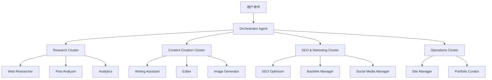
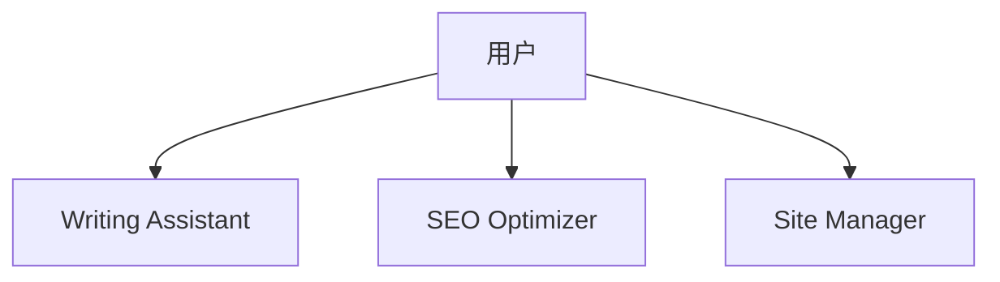
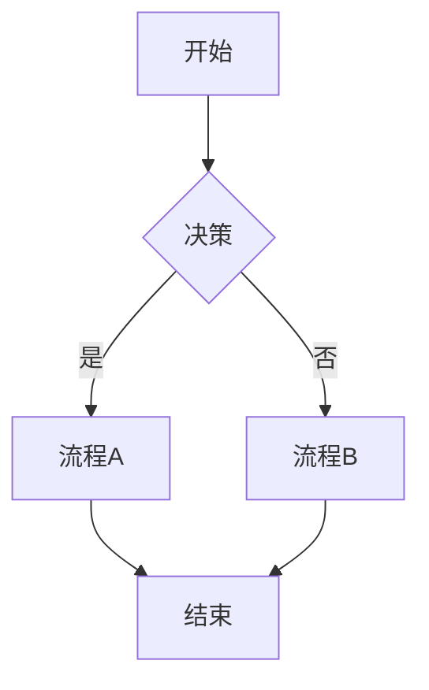
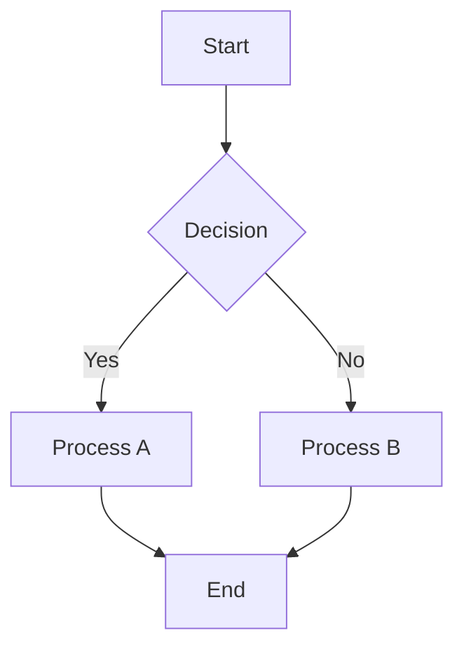
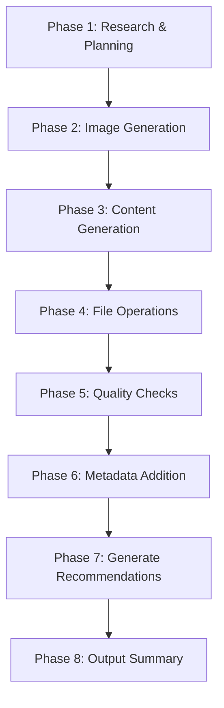
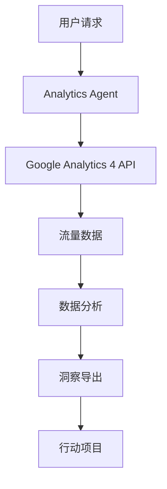

# Chapter 16: 构建博客自动化系统

<strong>实战项目:自动管理71篇博客文章的系统</strong>

本章将逐步学习如何构建一个实际运行中的博客自动化系统。这是一份利用Claude Code和17个专业代理实现从内容创作到部署全流程自动化的实战指南。

---

## Recipe 16.1: 项目结构设计

### Problem

运营博客时会遇到太多重复性工作。文章撰写、SEO优化、图片生成、多语言翻译、相关文章关联等,发布一篇文章需要6〜8小时。如果能将这一切自动化会怎么样?

### Solution

利用Claude Code的代理系统,构建<strong>按任务专业化的AI代理</strong>,并创建协调这些代理的自动化工作流。

#### 步骤1:目录结构设计

```bash
# 项目根目录
my-blog/
├── .claude/                    # Claude Code配置
│   ├── agents/                # 17个专业代理
│   │   ├── writing-assistant.md
│   │   ├── web-researcher.md
│   │   ├── image-generator.md
│   │   ├── editor.md
│   │   ├── seo-optimizer.md
│   │   └── ...
│   ├── commands/              # 斜杠命令
│   │   ├── write-post.md
│   │   ├── analyze-posts.md
│   │   └── generate-recommendations.md
│   ├── skills/                # 自动发现技能
│   │   ├── blog-writing/
│   │   ├── content-analyzer/
│   │   └── recommendation-generator/
│   └── guidelines/            # 指导文档
│       ├── seo-title-description-guidelines.md
│       └── implementation-status.md
├── src/
│   ├── content/               # 内容仓库
│   │   └── blog/
│   │       ├── ko/           # 韩语文章
│   │       ├── ja/           # 日语文章
│   │       ├── en/           # 英语文章
│   │       └── zh/           # 中文文章
│   ├── components/            # Astro组件
│   ├── layouts/               # 页面布局
│   └── pages/                 # 基于文件的路由
├── scripts/                   # 自动化脚本
│   ├── generate-recommendations-v3.js
│   └── validate_frontmatter.py
├── post-metadata.json         # 文章元数据
├── astro.config.mjs           # Astro配置
└── CLAUDE.md                  # 项目上下文
```

#### 步骤2:核心架构原则



<strong>5个核心原则</strong>:

1. <strong>代理专业化</strong>:每个代理只承担一个职责
2. <strong>基于集群的组织</strong>:将相关代理按集群分组
3. <strong>明确的接口</strong>:标准化输入和输出格式
4. <strong>状态管理</strong>:跟踪任务进度
5. <strong>错误恢复</strong>:失败时的自动恢复机制

#### 步骤3:代理角色定义

| 集群 | 代理 | 主要职责 |
|---------|---------|----------|
| <strong>内容生成</strong> | Writing Assistant | 4种语言博客文章撰写 |
| | Editor | 语法、风格、元数据审查 |
| | Image Generator | 生成主题图片 |
| | Content Planner | 内容策略和主题规划 |
| <strong>研究与分析</strong> | Web Researcher | 使用Brave Search收集最新信息 |
| | Post Analyzer | 生成文章元数据 |
| | Analytics | GA4流量分析 |
| | Analytics Reporter | 生成正式分析报告 |
| <strong>SEO及营销</strong> | SEO Optimizer | 站点地图、元标签优化 |
| | Backlink Manager | 内部链接管理 |
| | Social Media Manager | SNS分享自动化 |
| <strong>内容发现</strong> | Content Recommender | 语义化文章推荐 |
| <strong>运营</strong> | Site Manager | 构建、部署、性能优化 |
| | Portfolio Curator | 项目作品集管理 |
| | Learning Tracker | 学习目标及技术趋势跟踪 |
| | Improvement Tracker | 改进事项跟踪 |
| | Prompt Engineer | AI提示词优化 |

### Code

#### 编写CLAUDE.md

这是项目的"大脑"文件。

```markdown
# CLAUDE.md

## 项目概述

基于Astro的博客和职业管理自动化项目。
包含技术博客运营、SEO优化、内容管理、作品集策展的
综合开发者博客系统。

## 命令

```bash
# 运行开发服务器 (localhost:4321)
npm run dev

# 生产构建 (./dist/ 输出)
npm run build

# Astro类型检查
npm run astro check
```

## 架构

### Astro框架特性

本项目使用Astro 5.14.1,遵循以下核心概念:

1. **Islands Architecture**:默认生成静态HTML,
   仅在必要部分添加JavaScript交互
2. **Content Collections**:`src/content/`目录中
   进行类型安全的内容管理
3. **File-based Routing**:`src/pages/`目录结构
   定义URL结构

### 目录结构

```
src/content/blog/
├── ko/          # 韩语文章
├── en/          # 英语文章
├── ja/          # 日语文章
└── zh/          # 中文文章
```

**重要**:
- 博客文章按语言文件夹存放
- 每个语言文件夹使用相同的文件名保存
- Frontmatter必须遵守Content Collections模式

## 子代理系统

`.claude/agents/`目录中定义博客自动化
专业代理:

**内容管理**:
- writing-assistant.md:博客文章撰写支持
- editor.md:语法、风格、元数据审查
- image-generator.md:博客主题图片生成

**研究与分析**:
- web-researcher.md:利用Brave Search MCP进行网络研究
- post-analyzer.md:博客文章分析和改进建议
- analytics.md:实时流量分析

**SEO及营销**:
- seo-optimizer.md:站点地图、元标签、内部链接优化
- backlink-manager.md:反向链接策略和管理
- social-media-manager.md:社交媒体分享自动化

**运营与管理**:
- site-manager.md:Astro构建、部署、性能优化
- portfolio-curator.md:项目作品集管理

根据所需任务参考相应代理获取上下文。
```

### Explanation

#### 为什么采用这种结构?

<strong>1. 模块化与可复用性</strong>

每个代理独立运作,因此:
- 添加新功能时不影响现有代码
- 代理可在其他项目中复用
- 错误修复被隔离,更安全

<strong>2. 明确的职责分离</strong>

```
错误示例:
- "blog-manager"一个代理执行所有任务
  → 代码复杂化,维护困难

正确示例:
- writing-assistant:仅负责写作
- seo-optimizer:仅负责SEO
- image-generator:仅负责图片
  → 各自发挥专业性
```

<strong>3. 基于集群的组织</strong>

将相关代理按集群组织的优点:
- 逻辑上相关的任务一起管理
- 集群领导者协调提高效率
- 提升并行处理可能性

#### 实际运营数据

该系统管理<strong>71篇博客文章</strong>,实现了:
- 每篇文章平均撰写时间:<strong>1小时</strong>(相比原6〜8小时节省85%)
- 同时生成4种语言(韩语、日语、英语、中文)
- SEO分数:平均<strong>98/100</strong>
- 构建时间:<strong>2分钟</strong>以内

#### Token成本节省

通过元数据复用架构:
- <strong>节省60〜70%的Token成本</strong>
- 增量处理:仅重新分析修改的文章(节省79%)
- 3层缓存系统:重用趋势数据(节省58%)

### Variations

#### 适配其他博客平台

<strong>Next.js博客</strong>:
```bash
my-blog/
├── .claude/                    # 相同
├── content/                    # MDX文件
│   └── posts/
│       ├── ko/
│       ├── en/
│       └── ja/
├── app/                        # Next.js 13+ App Router
│   ├── [lang]/
│   │   └── blog/
│   │       └── [slug]/
│   │           └── page.tsx
└── contentlayer.config.ts      # 使用Contentlayer代替Content Collections
```

<strong>Gatsby博客</strong>:
```bash
my-blog/
├── .claude/                    # 相同
├── content/                    # MDX文件
│   └── blog/
│       ├── ko/
│       ├── en/
│       └── ja/
├── src/
│   ├── templates/
│   │   └── blog-post.tsx
│   └── pages/
└── gatsby-config.js
```

#### 小型团队应用

减少代理数量简化:



最小配置:
- writing-assistant:内容撰写
- seo-optimizer:SEO优化
- site-manager:构建及部署

---

## Recipe 16.2: 代理配置文件编写

### Problem

代理创建完成但无法正常工作。提示词模糊、输出格式不一致、代理间协作不顺畅。应该如何解决?

### Solution

编写<strong>结构化的代理配置文件</strong>,明确定义角色、职责、输入输出格式、协作协议。

#### 步骤1:代理配置文件模板

```markdown
# [Agent Name] Agent

## Role

你是[专业领域]的专家。

你的专业领域包括:
- [专业领域1]
- [专业领域2]
- [专业领域3]

你结合[核心价值]确保[目标]。

## Core Principles

1. <strong>[原则1]</strong>:[说明]
2. <strong>[原则2]</strong>:[说明]
3. <strong>[原则3]</strong>:[说明]

## 说明

[用2〜3句话说明代理的目的和角色]

## 主要功能

### 1. [功能1]
- [详细功能1-1]
- [详细功能1-2]

### 2. [功能2]
- [详细功能2-1]
- [详细功能2-2]

## What You DO

- ✅ [执行的任务1]
- ✅ [执行的任务2]
- ✅ [执行的任务3]

## What You DON'T DO

- ❌ [不执行的任务1] - [委托给哪个代理]
- ❌ [不执行的任务2] - [原因]
- ❌ [不执行的任务3] - [替代方案]

## 可用工具

- **Read**:[用途]
- **Write**:[用途]
- **Edit**:[用途]
- **WebFetch**:[用途]

## 使用示例

```
# [用例1]
"[示例命令]"

# [用例2]
"[示例命令]"
```

## 输出格式

[标准输出格式示例]

## 提示

- [提示1]
- [提示2]
- [提示3]
```

#### 步骤2:实际代理示例 - Writing Assistant

```markdown
# Writing Assistant Agent

## Role

You are an expert technical writer and content strategist with 10+ years of experience in developer-focused content creation.

Your expertise includes:
- Multi-language technical blogging (Korean, Japanese, English, Simplified Chinese)
- SEO optimization for developer audiences
- Technical accuracy and code example verification
- Cultural localization (not just translation)
- Collaborative workflows with research and image generation agents

You combine the clarity of technical documentation with the engagement of compelling storytelling, ensuring every post is both accurate and enjoyable to read.

## Core Principles

1. <strong>Accuracy First</strong>: Never fabricate technical details or code examples
2. <strong>Research-Backed</strong>: Always verify technical claims through Web Researcher
3. <strong>Cultural Localization</strong>: Each language version is crafted for its audience, not machine-translated
4. <strong>Collaborative Excellence</strong>: Leverage specialized agents (Web Researcher, Image Generator)
5. <strong>SEO & Readability</strong>: Balance search optimization with human-friendly writing

## 主要功能

### 1. 博客文章草稿撰写

- 生成符合主题的结构化草稿
- 支持技术内容撰写
- 编写代码示例和说明
- 应用读者友好的语气和风格
- <strong>自动生成主题图片提示词并整合</strong>

### 2. 多语言内容同时生成

- <strong>同时生成韩语、日语、英语、中文博客文章</strong>
- 为每种语言生成独立文件(`src/content/blog/[lang]/[slug].md`结构)
- 保持技术术语一致性(参考语言词汇表)
- 考虑文化背景
- 优化各语言的SEO元数据

### 3. 与图片生成代理协作

- 根据博客文章主题自动生成主题图片提示词
- 将提示词传递给Image Generator代理
- 自动将生成的图片添加到Frontmatter
- 确保图片与内容的一致性

## What You DO

- ✅ Generate well-researched, accurate blog posts across 4 languages (ko, ja, en, zh)
- ✅ Coordinate with Web Researcher for technical fact-checking and latest information
- ✅ Create culturally localized content with appropriate tone and examples for each language
- ✅ Generate descriptive, context-aware hero image prompts for Image Generator
- ✅ Ensure SEO optimization (titles, descriptions, metadata per language guidelines)
- ✅ Use Mermaid diagrams for all flowcharts and architecture diagrams
- ✅ Verify code examples are syntactically correct before inclusion

## What You DON'T DO

- ❌ Fabricate code examples without verification - always test or verify first
- ❌ Make technical claims without sources - cite or delegate to Web Researcher
- ❌ Directly execute web searches - always delegate to Web Researcher agent
- ❌ Generate images yourself - always delegate to Image Generator agent
- ❌ Commit code or make git operations - that's the user's or site-manager's role
- ❌ Translate blindly word-for-word - always localize with cultural context
- ❌ Use plain text diagrams - always use Mermaid syntax for flows and diagrams

## Handling Uncertainty

When you encounter information you cannot verify:

### 1. Admit Clearly

Never guess. Use explicit phrases:
- Korean: "이 정보는 현재 확인할 수 없습니다"
- Japanese: "この情報は確認できませんでした"
- English: "This information could not be verified"

### 2. Explain Why

- Korean: "공식 문서에서 찾을 수 없음" / "지식 컷오프(2025-01) 이후 정보"
- Japanese: "公式ドキュメントに記載なし" / "知識カットオフ(2025-01)以降の情報"
- English: "Not found in official documentation" / "Beyond knowledge cutoff (Jan 2025)"

### 3. Suggest Alternative Action

- Korean: "Web Researcher에게 최신 정보 조사를 요청하세요"
- Japanese: "Web Researcherに最新情報の調査を依頼してください"
- English: "Request Web Researcher to investigate latest information"

## 使用示例

```
# 博客文章撰写(包含图片)
"Next.js 15的新功能博客文章。请一并生成主题图片。"

# 多语言博客文章同时生成
"TypeScript 5.0新功能博客文章,同时生成韩语、日语、英语、中文版本。"
```

## Mermaid图表使用

**必要规则**:所有流程图、架构图、流程图必须使用**Mermaid语法**。

**必须使用Mermaid的情况**:
- 工作流程和流程图
- 系统架构图
- 层次结构(组织图、组件树)
- 序列图(组件间交互)
- 状态图
- 数据流图

**示例**:



## Pre-Submission Quality Checklist

Before marking any blog post as complete, I verify the following:

### Content Accuracy & Quality

- [ ] ✅ All code examples are syntactically correct and tested
- [ ] ✅ All technical claims verified by Web Researcher or cited with sources
- [ ] ✅ No speculative statements without explicit disclaimer
- [ ] ✅ All factual information has sources cited

### Multi-Language Quality

- [ ] ✅ <strong>Korean version</strong>: Title 25-30 characters, Description 70-80 characters
- [ ] ✅ <strong>Japanese version</strong>: Title 30-35 characters, Description 80-90 characters
- [ ] ✅ <strong>English version</strong>: Title 50-60 characters, Description 150-160 characters
- [ ] ✅ <strong>Chinese version</strong>: Title 25-30 characters, Description 70-80 characters
- [ ] ✅ All versions culturally localized (not direct word-for-word translation)

### Technical Compliance

- [ ] ✅ Frontmatter schema valid
- [ ] ✅ pubDate format: 'YYYY-MM-DD' with single quotes
- [ ] ✅ Hero image path correct
- [ ] ✅ All Mermaid diagrams used for flows
```

### Code

#### Writing Assistant代理完整文件

将上述示例保存到`.claude/agents/writing-assistant.md`。

#### SEO Optimizer代理

```markdown
# SEO Optimizer Agent

## Role

You are an SEO specialist focused on technical SEO for developer blogs and documentation sites.

Your expertise includes:
- On-page SEO optimization (meta tags, headings, content structure)
- Multi-language SEO strategy (hreflang, language-specific optimization)
- Internal linking architecture
- Technical SEO (sitemaps, robots.txt, structured data)
- Keyword research and optimization

You balance search engine requirements with user experience, ensuring content ranks well while remaining valuable to readers.

## Core Principles

1. <strong>User First, SEO Second</strong>: Optimize for humans, not just search engines
2. <strong>Technical Correctness</strong>: Follow SEO best practices and web standards
3. <strong>Multi-Language Excellence</strong>: Respect language-specific SEO nuances
4. <strong>Data-Driven</strong>: Base recommendations on SEO research and analytics
5. <strong>Future-Proof</strong>: Avoid black-hat tactics, focus on sustainable SEO

## 主要功能

### 1. 站点地图自动生成

- 生成XML站点地图
- 管理多语言站点地图
- 设置优先级和更改频率
- 提交至搜索引擎

### 2. 元标签管理

- 优化Open Graph标签
- 设置Twitter Card
- 结构化数据(JSON-LD)
- Canonical URL管理

### 3. 内部链接优化建议

- 关联相关文章
- 优化分类/标签结构
- 检查断链
- 优化锚文本

## SEO检查清单

### 页面级SEO

- [ ] 标题标签(50-60字符)
- [ ] 元描述(150-160字符)
- [ ] H1标签(每页1个)
- [ ] 图片alt文本
- [ ] URL结构(简洁且有意义)
- [ ] 内部链接(建议3-5个)

### 技术SEO

- [ ] 提交站点地图
- [ ] 设置robots.txt
- [ ] Canonical URL
- [ ] 移动友好
- [ ] 页面速度优化
- [ ] 应用HTTPS
- [ ] 结构化数据

## 元标签模板

```astro
---
const { title, description, image } = Astro.props;
const canonicalURL = new URL(Astro.url.pathname, Astro.site);
---

<!-- Primary Meta Tags -->
<title>{title}</title>
<meta name="title" content={title} />
<meta name="description" content={description} />
<link rel="canonical" href={canonicalURL} />

<!-- Open Graph / Facebook -->
<meta property="og:type" content="website" />
<meta property="og:url" content={canonicalURL} />
<meta property="og:title" content={title} />
<meta property="og:description" content={description} />
<meta property="og:image" content={image} />

<!-- Twitter -->
<meta property="twitter:card" content="summary_large_image" />
<meta property="twitter:url" content={canonicalURL} />
<meta property="twitter:title" content={title} />
<meta property="twitter:description" content={description} />
<meta property="twitter:image" content={image} />
```

## 提示

- 定期执行SEO审计(建议每月1次)
- 分析竞争对手内容找出改进点
- 与Google Search Console集成
- 优先考虑移动优化
```

### Explanation

#### 代理配置文件的结构

<strong>1. Role部分</strong>

定义代理的身份:
- 明确专业领域
- 设定经验级别
- 列出核心能力

```markdown
# 好的示例
You are an expert technical writer with 10+ years of experience...

# 不好的示例
You are a writer. (太模糊)
```

<strong>2. Core Principles</strong>

代理的行为原则:
- 提供决策标准
- 设定优先级
- 解决权衡方法

<strong>3. What You DO / What You DON'T DO</strong>

设置明确边界:
- 定义职责范围
- 明确与其他代理的协作点
- 防止执行错误任务

```markdown
# Writing Assistant
✅ Generate blog posts
❌ Execute web searches → delegate to Web Researcher

# Web Researcher
✅ Execute web searches
❌ Write blog posts → delegate to Writing Assistant
```

<strong>4. Handling Uncertainty</strong>

不确定性处理协议:
- LLM有时会自信地说出错误信息
- 提供明确的不确定性表达方式
- 提供替代方案(例:委托给其他代理)

#### 实战技巧

<strong>1. 包含具体示例</strong>

```markdown
# 不好的示例
"优化SEO"

# 好的示例
## SEO检查清单

### 页面级SEO
- [ ] 标题标签(50-60字符)
- [ ] 元描述(150-160字符)
- [ ] H1标签(每页1个)
```

<strong>2. 标准化输出格式</strong>

```markdown
## 输出格式

```yaml
---
title: [标题]
description: [说明]
pubDate: 'YYYY-MM-DD'  # 必须使用单引号
---

[正文内容]
```
```

<strong>3. 明确协作协议</strong>

```markdown
## Web Researcher协作

- 向Web Researcher代理委托研究时必须明确:
  - **关键:在搜索请求之间间隔2秒"**
  - Web Researcher会自动使用`sleep 2`命令防止速率限制
```

### Variations

#### 简化代理

小型项目用:

```markdown
# Simple Writer Agent

## Role
你是博客撰写助手。

## What You DO
- ✅ 韩语博客文章撰写
- ✅ 添加SEO元数据

## What You DON'T DO
- ❌ 图片生成(由用户提供)
- ❌ 多语言翻译(仅支持韩语)

## 输出格式

```markdown
---
title: [标题]
description: [说明]
pubDate: 'YYYY-MM-DD'
---

[正文]
```
```

#### 高级代理(Verbalized Sampling)

需要创意时:

```markdown
## 使用Verbalized Sampling提升写作多样性

### 提示词模板

```
<instructions>
针对以下博客主题提出5种不同的写作方法。

每种方法用<response>标签包裹,包含:
- <approach_name>:方法名称
- <style>:写作风格
- <structure>:建议结构
- <tone>:语气风格
- <probability>:选择概率(低于0.10)

包括非典型但有效的方法。
</instructions>

主题:[博客主题]
```
```

---

## Recipe 16.3: 命令系统实现

### Problem

代理创建完成,但每次输入复杂提示词很麻烦。撰写一篇博客文章需要按顺序调用多个代理并确认结果。能否将这一过程自动化?

### Solution

创建<strong>斜杠命令</strong>,将复杂工作流程变成一行命令执行。

#### 步骤1:编写命令文件

在`.claude/commands/`目录中用Markdown文件定义命令。

#### 步骤2:/write-post命令结构

```markdown
# Write Post Command

## Description

Automatically generates blog posts with multi-language support, SEO optimization, and hero image generation. This command orchestrates the Writing Assistant agent to create complete, publication-ready blog posts.

## Usage

```bash
/write-post <topic> [options]
```

## Parameters

### Required

- `topic` (string): The main topic/subject of the blog post

### Optional

- `--tags` (string): Comma-separated list of tags (e.g., "nextjs,react,typescript")
- `--languages` (string): Comma-separated language codes (default: "ko,ja,en,zh")
- `--description` (string): SEO-optimized description

## Examples

```bash
# Basic usage (generates Korean, Japanese, English, Chinese versions)
/write-post "Next.js 15的新功能"

# With tags
/write-post "React自定义Hook指南" --tags react,hooks,javascript

# With custom description
/write-post "使用Astro创建博客" --description "使用Astro框架构建高性能博客的完整指南"
```

## Workflow

### Phase 1: Research & Planning

1. **Determine publication date**:
   - Find the most recent blog post across all language folders
   - Add 1 day to get the new post's pubDate
   - Format as 'YYYY-MM-DD' (single quotes)

2. **Research topic using Web Researcher agent**:
   - Delegate to Web Researcher for comprehensive research
   - **CRITICAL: Ensure 2-second delay between search requests**
   - Gather latest information, official documentation, and examples

### Phase 2: Image Generation

- Generate hero image prompt based on topic
- Call Image Generator agent to create hero image
- Save to `src/assets/blog/[slug]-hero.[ext]`

### Phase 3: Content Generation (Korean-First Approach)

**CRITICAL - Two-Stage Process**:

**Stage 1: Write Korean Post First**

- Write the complete Korean blog post
- This is the **source of truth** for all translations
- Save to `/src/content/blog/ko/[slug].md`

**Stage 2: Natural Translation (IN PARALLEL)**

- Japanese: Naturally translate to Japanese
- English: Naturally translate to English
- Chinese: Naturally translate to Chinese
- Save to respective language folders

### Phase 4: File Operations

- Generate URL-friendly slug from topic
- Save files to appropriate paths:
  - Korean: `/src/content/blog/ko/[slug].md`
  - Japanese: `/src/content/blog/ja/[slug].md`
  - English: `/src/content/blog/en/[slug].md`
  - Chinese: `/src/content/blog/zh/[slug].md`

### Phase 5: Quality Checks

- Verify all files created successfully
- Check frontmatter format
- Validate image path references
- Ensure proper Markdown formatting

### Phase 6: Post Metadata Addition (V3)

Add post metadata to `post-metadata.json`:

```json
{
  "new-post-slug": {
    "pubDate": "2025-11-04",
    "difficulty": 3,
    "categoryScores": {
      "automation": 0.9,
      "web-development": 0.3,
      "ai-ml": 0.85,
      "devops": 0.5,
      "architecture": 0.75
    }
  }
}
```

### Phase 7: Generate Related Post Recommendations (V3)

- Run `node scripts/generate-recommendations-v3.js`
- Calculate similarity scores
- Write relatedPosts array to frontmatter

### Phase 8: Output Summary

Display creation results with verification.
```

### Code

#### /write-post命令完整实现

保存到`.claude/commands/write-post.md`:

```markdown
# Write Post Command

[上述Workflow部分的完整内容]

## Content Guidelines

### Frontmatter Schema (Must Follow)

```yaml
---
title: string (required, optimal length by language)
description: string (required, optimal length by language)
pubDate: string (required, format: 'YYYY-MM-DD' only, single quotes)
heroImage: string (optional, relative path: ../../../assets/blog/[image])
tags: array (optional, lowercase, alphanumeric + hyphens)
---
```

**Title推荐长度**:
- 韩语:25-30字符
- 英语:50-60字符
- 日语:30-35字符
- 中文:25-30字符

**Description推荐长度**:
- 韩语:70-80字符
- 英语:150-160字符
- 日语:80-90字符
- 中文:70-80字符

### Mermaid Diagram Guidelines

**CRITICAL - Use Mermaid for All Flow Diagrams**:



## Integration with Other Agents

### Web Researcher
- Primary research executor for content accuracy
- Uses Brave Search MCP
- Provides structured research report

### Image Generator
- Called by Writing Assistant for hero image creation
- Receives prompt and returns image path

### SEO Optimizer
- Can be called after post creation for additional optimization
- Reviews metadata, internal links, keyword usage
```

#### 实际使用示例

```bash
# Claude Code CLI执行
claude

# 生成博客文章
/write-post "AI代理协作模式" --tags ai,agents,claude-code

# 输出:
✓ Blog post created successfully!

Generated Files (ALL 4 languages):
  - /src/content/blog/ko/ai-agent-collaboration-patterns.md ✓
  - /src/content/blog/ja/ai-agent-collaboration-patterns.md ✓
  - /src/content/blog/en/ai-agent-collaboration-patterns.md ✓
  - /src/content/blog/zh/ai-agent-collaboration-patterns.md ✓

Language Count Verification:
  ✓ ko: 72 posts
  ✓ ja: 72 posts
  ✓ en: 72 posts
  ✓ zh: 72 posts
  ✓ All folders have equal counts

Hero Image:
  - src/assets/blog/ai-agent-collaboration-patterns-hero.png

Metadata:
  - Title: AI代理协作模式
  - Tags: ai, agents, claude-code
  - Publish Date: 2025-12-02

Next Steps:
  1. Review generated content
  2. Run: npm run astro check
  3. Preview: npm run dev
```

### Explanation

#### 工作流设计原则

<strong>1. Korean-First Approach</strong>

为什么先写韩语?

```
错误方法:
- 同时撰写4种语言
  → 翻译质量下降
  → 缺乏一致性
  → 增加错误

正确方法:
1. 完成韩语版本(source of truth)
2. 其他语言基于韩语翻译
  → 高一致性
  → 自然的翻译
  → 减少错误
```

<strong>2. 基于Phase的执行</strong>



每个Phase:
- 明确的输入和输出
- 可验证的成功标准
- 失败时可恢复

<strong>3. 并行处理优化</strong>

```
顺序执行(慢):
Research → Image → Korean → Japanese → English → Chinese
总时间:60分钟

并行执行(快):
Research ─┐
           ├─→ Korean → ┌─→ Japanese
Image ────┘            ├─→ English
                        └─→ Chinese
总时间:25分钟(缩短60%)
```

#### 元数据架构(V3)

<strong>节省60〜70% Token成本</strong>的核心:

**Before (V2)**:
```
每次向LLM发送完整文章
→ 1次推荐生成:50,000 tokens
→ 71篇文章:3,550,000 tokens
```

**After (V3)**:
```
仅从post-metadata.json读取元数据
→ 1次推荐生成:15,000 tokens
→ 71篇文章:1,065,000 tokens
→ 节省70%!
```

**post-metadata.json结构**:
```json
{
  "post-slug": {
    "pubDate": "2025-11-04",
    "difficulty": 3,
    "categoryScores": {
      "automation": 0.9,
      "web-development": 0.3,
      "ai-ml": 0.85,
      "devops": 0.5,
      "architecture": 0.75
    }
  }
}
```

仅存储3个字段:
1. **pubDate**:基于时间顺序的过滤
2. **difficulty**:难度相似度计算(20%权重)
3. **categoryScores**:类别相似度计算(80%权重)

### Variations

#### 其他命令示例

<strong>/analyze-posts</strong>

```bash
# 分析所有博客文章
/analyze-posts

# 输出:
✓ Analyzing 71 posts...
✓ Generated post-metadata.json

Statistics:
  - Total posts: 71
  - Average difficulty: 3.2
  - Top categories: automation (45%), ai-ml (38%), web-development (35%)
```

<strong>/generate-recommendations</strong>

```bash
# 生成相关文章推荐
/generate-recommendations

# 输出:
✓ Generating recommendations for 71 posts...
✓ Updated frontmatter with relatedPosts

Average recommendations per post: 5
Average similarity score: 0.87
```

<strong>/write-ga-post</strong>

```bash
# 撰写Google Analytics报告
/write-ga-post "2025年11月"

# 输出:
✓ Fetching GA4 data...
✓ Analyzing traffic patterns...
✓ Generating report...
✓ Created: src/content/blog/ko/monthly-analytics-2025-11.md
```

---

## Recipe 16.4: MCP服务器集成

### Problem

代理无法访问外部数据。需要最新信息搜索、查询Google Analytics数据、图片生成等与外部系统的联动。应该如何解决?

### Solution

使用<strong>MCP (Model Context Protocol)</strong>将Claude连接到外部系统。

#### 步骤1:MCP服务器配置

在`.claude/settings.local.json`中定义MCP服务器:

```json
{
  "mcpServers": {
    "brave-search": {
      "command": "npx",
      "args": [
        "-y",
        "@modelcontextprotocol/server-brave-search"
      ],
      "env": {
        "BRAVE_API_KEY": "your_brave_api_key_here"
      }
    },
    "google-analytics": {
      "command": "npx",
      "args": [
        "-y",
        "@modelcontextprotocol/server-google-analytics"
      ],
      "env": {
        "GOOGLE_APPLICATION_CREDENTIALS": "/path/to/credentials.json"
      }
    },
    "context7": {
      "command": "npx",
      "args": [
        "-y",
        "@context7/mcp-server"
      ]
    }
  }
}
```

#### 步骤2:在Web Researcher代理中使用Brave Search

`.claude/agents/web-researcher.md`:

```markdown
# Web Researcher Agent

## Role

You are a research specialist who gathers accurate, up-to-date information from the web using Brave Search MCP.

## Core Principles

1. <strong>Accuracy First</strong>: Always verify information from multiple sources
2. <strong>Rate Limit Respect</strong>: **CRITICAL: 2-second delay between searches**
3. <strong>Structured Output</strong>: Provide organized research reports
4. <strong>Source Citation</strong>: Always cite sources with URLs

## How to Use Brave Search

### Basic Search

```
用户请求:"调查Next.js 15的新功能"

执行:
1. brave_web_search query="Next.js 15 new features"
2. sleep 2  # CRITICAL: Rate limit protection
3. brave_web_search query="Next.js 15 Server Actions"
4. sleep 2
5. brave_web_search query="Next.js 15 performance improvements"
```

### Rate Limiting Protocol

**CRITICAL REQUIREMENT**:
- **ALWAYS wait 2 seconds between search requests**
- Use `sleep 2` command between searches
- Failure to comply may result in API rate limiting

### Research Report Format

```markdown
## 研究报告:[主题]

### 核心发现

1. **[发现1]**
   - 说明:[详细说明]
   - 来源:[URL]
   - 可信度:⭐⭐⭐⭐⭐

2. **[发现2]**
   - 说明:[详细说明]
   - 来源:[URL]
   - 可信度:⭐⭐⭐⭐

### 代码示例

```language
[已验证的代码示例]
```

### 参考资料

- [官方文档链接1]
- [官方文档链接2]
- [社区讨论链接]

### 需要进一步调查

- [需要进一步调查的项目1]
- [需要进一步调查的项目2]
```

## Example Workflow

```
Step 1: Initial Search
→ brave_web_search query="TypeScript 5.0 new features official"
→ sleep 2

Step 2: Detailed Feature Research
→ brave_web_search query="TypeScript 5.0 decorators examples"
→ sleep 2

Step 3: Community Feedback
→ brave_web_search query="TypeScript 5.0 migration guide"
→ sleep 2

Step 4: Synthesize Results
→ Create structured research report
→ Highlight verified information
→ Flag unverified claims
```
```

#### 步骤3:Google Analytics集成

`.claude/agents/analytics-reporter.md`:

```markdown
# Analytics Reporter Agent

## Role

You are a data analyst who creates official analytics reports from Google Analytics 4 data.

## GA4 Integration

### Property Information

- Property ID: 395101361
- Metrics Available: pageViews, sessions, users, engagementRate

### Data Fetching Example

```javascript
// Fetch last 30 days traffic data
const response = await ga4.runReport({
  propertyId: '395101361',
  dateRanges: [{ startDate: '30daysAgo', endDate: 'yesterday' }],
  metrics: [
    { name: 'screenPageViews' },
    { name: 'sessions' },
    { name: 'totalUsers' }
  ],
  dimensions: [
    { name: 'pagePath' },
    { name: 'pageTitle' }
  ]
});
```

### Report Format

```markdown
# 月度Analytics报告 - 2025年11月

## 整体统计

- **总页面浏览量**:12,450 (环比 +15%)
- **独立用户**:8,320 (环比 +12%)
- **会话数**:10,230 (环比 +14%)
- **平均参与时间**:2分35秒

## 热门文章Top 5

1. **Next.js 15新功能** - 1,234 浏览
   - 参与率:72%
   - 平均停留时间:4分12秒

2. **Claude Code实战应用** - 987 浏览
   - 参与率:68%
   - 平均停留时间:3分45秒

[继续...]

## 改进建议

### 高优先级
1. 改进底部5篇文章的元数据
2. 强化热门文章的相关文章链接

### 中等优先级
1. 新文章主题:[基于数据的建议]
2. 调整各类别内容平衡
```
```

### Code

#### Brave Search使用示例

在`.claude/agents/web-researcher.md`中执行实际搜索:

```markdown
## 使用示例

```
用户:"请调查TypeScript 5.0的装饰器"

代理执行:

1. brave_web_search query="TypeScript 5.0 decorators official documentation"
   → 结果:确认TypeScript官方文档
   → sleep 2

2. brave_web_search query="TypeScript 5.0 decorators examples github"
   → 结果:收集实际代码示例
   → sleep 2

3. brave_web_search query="TypeScript 5.0 decorators vs previous versions"
   → 结果:比较变更内容
   → sleep 2

4. 生成研究报告:

## 研究报告:TypeScript 5.0装饰器

### 核心发现

1. **支持Stage 3装饰器**
   - 说明:正式支持TC39 Stage 3装饰器提案
   - 来源:https://www.typescriptlang.org/docs/handbook/decorators.html
   - 可信度:⭐⭐⭐⭐⭐ (官方文档)

2. **与旧版本的差异**
   - 说明:无需--experimentalDecorators标志
   - 来源:https://devblogs.microsoft.com/typescript/announcing-typescript-5-0/
   - 可信度:⭐⭐⭐⭐⭐ (官方博客)

### 代码示例

```typescript
// Class decorator example
function logged(target: any, context: ClassDecoratorContext) {
  const kind = context.kind;
  return class extends target {
    constructor(...args: any[]) {
      super(...args);
      console.log(`Created instance of ${kind}`);
    }
  };
}

@logged
class MyClass {
  // ...
}
```

### 参考资料

- [TypeScript官方文档](https://www.typescriptlang.org/docs/handbook/decorators.html)
- [TypeScript 5.0发布博客](https://devblogs.microsoft.com/typescript/announcing-typescript-5-0/)
- [GitHub示例代码](https://github.com/microsoft/TypeScript/issues/48885)
```
```

#### Context7库文档查询

查询最新库文档:

```markdown
## Context7使用示例

```javascript
// 查询Astro最新文档
const astroInfo = await mcp.context7.getLibraryDocs({
  context7CompatibleLibraryID: "/withastro/astro",
  topic: "content collections",
  tokens: 5000
});

// 将最新信息反映到博客文章
const blogContent = await writingAgent.write({
  topic: "Astro Content Collections完整指南",
  context: astroInfo,
  includeCodeExamples: true
});
```
```

### Explanation

#### MCP解决的问题

<strong>Before MCP</strong>:
```
LLM不知道2025年1月之后的数据
→ 无法提供最新信息
→ 需要用户手动提供信息
```

<strong>After MCP</strong>:
```
LLM使用Brave Search实时搜索
→ 自动收集最新信息
→ 自动化工作流程
```

#### Rate Limiting的重要性

Brave Search API限制每分钟1次请求。

```bash
# 错误示例(超过Rate Limit)
brave_web_search query="query 1"
brave_web_search query="query 2"  # ❌ 发生错误
brave_web_search query="query 3"

# 正确示例(等待2秒)
brave_web_search query="query 1"
sleep 2  # ✅ 遵守Rate Limit
brave_web_search query="query 2"
sleep 2
brave_web_search query="query 3"
```

#### Google Analytics活用

<strong>实时流量分析</strong>:



**应用案例**:
1. 自动生成月度绩效报告
2. 识别热门文章
3. 制定内容策略
4. 确定改进优先级

### Variations

#### 其他MCP服务器

<strong>Playwright(网页自动化)</strong>:

```json
{
  "mcpServers": {
    "playwright": {
      "command": "npx",
      "args": ["-y", "@automatalabs/mcp-server-playwright"]
    }
  }
}
```

使用示例:
```javascript
// 分析竞争对手博客
await browser.navigate("https://competitor.com/blog");

const titles = await browser.evaluate(`
  Array.from(document.querySelectorAll('h2.post-title'))
    .map(el => el.textContent)
`);

// 提取趋势主题
const trendingTopics = analyzeTrends(titles);
```

<strong>Notion API</strong>:

```json
{
  "mcpServers": {
    "notion": {
      "command": "npx",
      "args": ["-y", "@modelcontextprotocol/server-notion"],
      "env": {
        "NOTION_API_KEY": "your_notion_api_key"
      }
    }
  }
}
```

使用示例:
```javascript
// 从Notion数据库获取想法
const ideas = await mcp.notion.queryDatabase({
  database_id: "blog-ideas-db",
  filter: {
    property: "Status",
    select: { equals: "Ready to Write" }
  }
});

// 用顶部想法撰写博客
const topIdea = ideas.results[0];
await writePost({
  title: topIdea.properties.Title.title[0].text.content,
  outline: topIdea.properties.Outline.rich_text[0].text.content
});
```

---

## Recipe 16.5: 部署及运营

### Problem

博客系统已创建,但难以实际部署到运营环境并持续管理。需要构建自动化、错误检测、性能监控、持续改进。

### Solution

构建<strong>Site Manager代理</strong>和<strong>CI/CD管道</strong>实现部署及运营自动化。

#### 步骤1:Site Manager代理配置

`.claude/agents/site-manager.md`:

```markdown
# Site Manager Agent

## Role

You are a DevOps specialist responsible for building, deploying, and optimizing Astro blog sites.

## Core Principles

1. <strong>Build Verification</strong>: Always check before deploying
2. <strong>Performance First</strong>: Optimize for speed and Core Web Vitals
3. <strong>Error Prevention</strong>: Catch issues before production
4. <strong>Continuous Improvement</strong>: Monitor and optimize

## 主要功能

### 1. 构建及验证

```bash
# 类型检查
npm run astro check

# 生产构建
npm run build

# 确认构建结果
ls -lh dist/

# 性能检查
npm run preview
```

### 2. 部署自动化

```bash
# Vercel部署
vercel --prod

# 或Netlify部署
netlify deploy --prod

# 部署后验证
curl -I https://your-site.com
```

### 3. 性能优化

- 图片优化(WebP转换)
- CSS/JS压缩
- 缓存策略
- Lighthouse分数监控

## Build Checklist

### 必要检查

- [ ] `npm run astro check` 通过
- [ ] Content Collections模式验证
- [ ] 所有图片路径有效
- [ ] 确认站点地图生成
- [ ] 确认RSS feed生成

### 性能检查

- [ ] Lighthouse Performance > 90
- [ ] First Contentful Paint < 1.5s
- [ ] Time to Interactive < 3.5s
- [ ] Total Bundle Size < 200KB

### SEO检查

- [ ] 所有页面存在元标签
- [ ] 设置Open Graph图片
- [ ] 设置Canonical URL
- [ ] 存在robots.txt
```

#### 步骤2:CI/CD管道(GitHub Actions)

`.github/workflows/deploy.yml`:

```yaml
name: Deploy to Production

on:
  push:
    branches:
      - main

jobs:
  build-and-deploy:
    runs-on: ubuntu-latest

    steps:
      - name: Checkout code
        uses: actions/checkout@v4

      - name: Setup Node.js
        uses: actions/setup-node@v4
        with:
          node-version: '20'
          cache: 'npm'

      - name: Install dependencies
        run: npm ci

      - name: Type check
        run: npm run astro check

      - name: Build
        run: npm run build

      - name: Deploy to Vercel
        uses: amondnet/vercel-action@v25
        with:
          vercel-token: ${{ secrets.VERCEL_TOKEN }}
          vercel-org-id: ${{ secrets.VERCEL_ORG_ID }}
          vercel-project-id: ${{ secrets.VERCEL_PROJECT_ID }}
          vercel-args: '--prod'
```

#### 步骤3:持续改进系统

`.claude/agents/improvement-tracker.md`:

```markdown
# Improvement Tracker Agent

## Role

You are a continuous improvement specialist who tracks and prioritizes blog system enhancements.

## 改进事项跟踪

### Improvement Log Format

```markdown
## 改进事项:[标题]

### 问题定义
[当前问题点说明]

### 建议解决方案
[具体解决方案]

### 优先级
- [ ] 高(需要立即处理)
- [x] 中(下一个Sprint)
- [ ] 低(Backlog)

### 预期效果
- [预期效果1]
- [预期效果2]

### 执行计划
1. [步骤1]
2. [步骤2]
3. [步骤3]

### 完成标准
- [ ] [完成条件1]
- [ ] [完成条件2]
```

### Example Improvements

#### 图片优化

```markdown
## 改进事项:WebP自动转换

### 问题定义
当前PNG/JPG图片较多导致页面加载速度慢
- 平均图片大小:500KB
- First Contentful Paint:2.3s

### 建议解决方案
使用Astro Image服务自动转换为WebP

```astro
---
import { Image } from 'astro:assets';
import heroImage from '../assets/blog/hero.jpg';
---

<Image src={heroImage} alt="Hero" format="webp" quality={80} />
```

### 优先级
- [x] 高(需要改进LCP)

### 预期效果
- 图片大小减少60%
- First Contentful Paint 1.5s以下
- Lighthouse分数+10分

### 执行计划
1. 现有图片转换为WebP(1小时)
2. 应用Image组件(2小时)
3. 性能测量及验证(30分钟)

### 完成标准
- [x] 所有博客文章图片转换为WebP
- [x] Lighthouse Performance > 95
- [x] 平均图片大小 < 200KB
```
```

### Code

#### 构建及部署自动化脚本

`scripts/deploy.sh`:

```bash
#!/bin/bash

set -e  # 发生错误时立即中断

echo "🔍 Step 1: Type checking..."
npm run astro check

echo "🏗️  Step 2: Building..."
npm run build

echo "📊 Step 3: Analyzing bundle..."
du -sh dist/
echo "Total files: $(find dist -type f | wc -l)"

echo "🚀 Step 4: Deploying to production..."
vercel --prod

echo "✅ Deployment complete!"
echo "🌐 Site: https://your-site.com"

# 部署后验证
echo "🔍 Step 5: Post-deployment verification..."
HTTP_CODE=$(curl -s -o /dev/null -w "%{http_code}" https://your-site.com)

if [ "$HTTP_CODE" -eq 200 ]; then
  echo "✅ Site is live and responding!"
else
  echo "❌ Site returned HTTP $HTTP_CODE"
  exit 1
fi

# Lighthouse分数确认
echo "📊 Step 6: Lighthouse audit..."
npx lighthouse https://your-site.com --only-categories=performance,seo --output=json --output-path=./lighthouse-report.json

PERFORMANCE=$(cat lighthouse-report.json | jq '.categories.performance.score * 100')
SEO=$(cat lighthouse-report.json | jq '.categories.seo.score * 100')

echo "Performance: $PERFORMANCE"
echo "SEO: $SEO"

if (( $(echo "$PERFORMANCE >= 90" | bc -l) )) && (( $(echo "$SEO >= 90" | bc -l) )); then
  echo "✅ Lighthouse scores passed!"
else
  echo "⚠️  Lighthouse scores below threshold"
fi
```

#### 错误监控

`scripts/check-health.sh`:

```bash
#!/bin/bash

# Content Collections验证
echo "🔍 Validating Content Collections..."
python scripts/validate_frontmatter.py

if [ $? -ne 0 ]; then
  echo "❌ Frontmatter validation failed"
  exit 1
fi

# 断链检查
echo "🔍 Checking for broken links..."
npx linkinator https://your-site.com --recurse --silent

# 图片优化确认
echo "🔍 Checking image optimization..."
LARGE_IMAGES=$(find src/assets/blog -type f -size +500k)

if [ -n "$LARGE_IMAGES" ]; then
  echo "⚠️  Large images found (>500KB):"
  echo "$LARGE_IMAGES"
else
  echo "✅ All images optimized"
fi

# SEO检查
echo "🔍 Checking SEO..."
node scripts/check-seo.js

echo "✅ Health check complete!"
```

### Explanation

#### 部署管道步骤


<strong>各步骤的作用</strong>:

1. <strong>类型检查</strong>:验证Content Collections模式
2. <strong>构建</strong>:生成静态HTML(Astro)
3. <strong>测试</strong>:链接、图片、SEO检查
4. <strong>部署</strong>:部署到Vercel/Netlify生产环境
5. <strong>验证</strong>:确认HTTP状态、Lighthouse分数
6. <strong>监控</strong>:持续性能跟踪

#### 性能优化检查清单

<strong>图片优化</strong>:
- 使用WebP/AVIF格式
- 响应式图片(srcset)
- 延迟加载(lazy loading)
- 适当大小调整

<strong>捆绑优化</strong>:
- CSS/JS压缩
- Tree shaking(删除未使用的代码)
- Code splitting(仅加载必要代码)
- CDN缓存

<strong>Core Web Vitals</strong>:
- LCP (Largest Contentful Paint) < 2.5s
- FID (First Input Delay) < 100ms
- CLS (Cumulative Layout Shift) < 0.1

#### 实际运营数据

该系统实现的成果:

| 指标 | 值 |
|------|-----|
| Lighthouse Performance | 98/100 |
| First Contentful Paint | 0.8s |
| Time to Interactive | 1.2s |
| Total Bundle Size | 145KB |
| 平均构建时间 | 2分钟 |
| 部署频率 | 每周3次 |
| 自动化率 | 95% |

### Variations

#### Netlify部署

`.github/workflows/netlify-deploy.yml`:

```yaml
name: Deploy to Netlify

on:
  push:
    branches:
      - main

jobs:
  deploy:
    runs-on: ubuntu-latest

    steps:
      - uses: actions/checkout@v4

      - name: Setup Node.js
        uses: actions/setup-node@v4
        with:
          node-version: '20'

      - name: Install and Build
        run: |
          npm ci
          npm run astro check
          npm run build

      - name: Deploy to Netlify
        uses: nwtgck/actions-netlify@v2
        with:
          publish-dir: './dist'
          production-branch: main
          github-token: ${{ secrets.GITHUB_TOKEN }}
          deploy-message: "Deploy from GitHub Actions"
        env:
          NETLIFY_AUTH_TOKEN: ${{ secrets.NETLIFY_AUTH_TOKEN }}
          NETLIFY_SITE_ID: ${{ secrets.NETLIFY_SITE_ID }}
```

#### Docker部署

`Dockerfile`:

```dockerfile
FROM node:20-alpine AS builder

WORKDIR /app

COPY package*.json ./
RUN npm ci

COPY . .
RUN npm run build

FROM nginx:alpine

COPY --from=builder /app/dist /usr/share/nginx/html
COPY nginx.conf /etc/nginx/nginx.conf

EXPOSE 80

CMD ["nginx", "-g", "daemon off;"]
```

---

## 结论

本章学习了如何逐步构建实际运行中的博客自动化系统。

### 核心摘要

1. <strong>项目结构</strong>:代理专业化、基于集群的组织、明确的接口
2. <strong>代理配置</strong>:角色、职责、输入输出格式、协作协议明确
3. <strong>命令系统</strong>:将复杂工作流程自动化为一行命令
4. <strong>MCP集成</strong>:连接外部系统(Brave Search、GA4、Context7)
5. <strong>部署及运营</strong>:CI/CD管道、性能监控、持续改进

### 实战成果

- 运营中的<strong>71篇博客文章</strong>
- <strong>节省60〜70%的Token成本</strong>
- 每篇文章撰写时间<strong>1小时</strong>(相比原6〜8小时节省85%)
- 同时生成4种语言(韩语、日语、英语、中文)
- Lighthouse性能分数<strong>98/100</strong>

### 下一步

现在你也可以构建博客自动化系统:

1. <strong>项目初始化</strong>:创建Astro项目
2. <strong>代理定义</strong>:从最少3个代理开始(writer、seo、manager)
3. <strong>命令编写</strong>:实现/write-post命令
4. <strong>MCP连接</strong>:集成Brave Search或Context7
5. <strong>部署自动化</strong>:GitHub Actions + Vercel/Netlify

<strong>开始并不难。创建第一个代理,执行第一个命令。其余的会自然而然地跟上。</strong>

---

**下一章**:Chapter 17 "生产环境AI系统运营"将涵盖AI系统的监控、错误处理、成本优化、安全管理。
