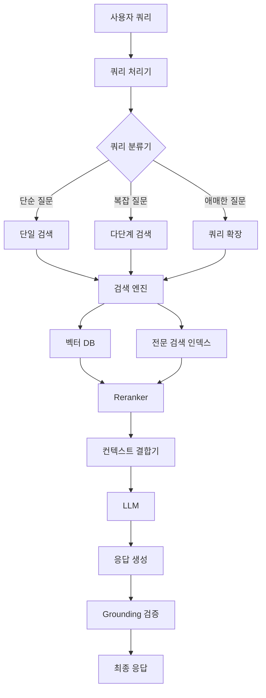

# 조사 결과: Part 4 - 컨텍스트 엔지니어링과 RAG

## 1. DeNA 스터디 자료 요약

### 1.1 컨텍스트 엔지니어링의 필요성

DeNA의 LLM 스터디 자료는 컨텍스트 엔지니어링이 필요한 근본적인 이유를 다음과 같이 제시합니다:

**LLM의 본질적 한계**:
- **컨텍스트 윈도우 제한**: 입력 토큰 상한이 존재하며, 무한정 확장 불가
- **성능 저하 문제**: "정보를 너무 많이 넣으면 지시를 무시하거나 성능이 악화됨" (Lost in the Middle 현상)
- **증가하는 사용자 정보**: 무수히 많은 사용자 데이터를 어떻게 저장하고 검색할지에 대한 전략적 결정 필요

**핵심 인사이트**: <strong>LLM은 단순한 응답 인터페이스일 뿐이며, 실제 구현의 중심은 데이터 저장과 검색 설계에 있다</strong>

### 1.2 RAG 전체 아키텍처

DeNA 자료에서 제시하는 RAG 아키텍처 흐름:

```
사용자 입력
    ↓
쿼리 처리 (Query Expansion)
    ↓
복수 검색 경로 (전문 검색 + 벡터 검색)
    ↓
결과 통합 및 Reranking
    ↓
LLM 응답 생성 (Grounding 적용)
```

**중요한 관점**: <strong>"LLM은 응답 인터페이스에 불과하다"</strong>는 지적은 구현의 무게 중심이 검색 시스템에 있음을 시사합니다.

### 1.3 쿼리 확장 (Query Expansion)

DeNA 자료는 두 가지 주요 접근법을 소개합니다:

#### 1.3.1 문맥 보완형 (Contextual Completion)

**목적**: 애매한 후속 질문을 명확하게 변환

**예시**:
- 사용자: "그것을 지나면 어떻게 돼?"
- 변환 후: "경비 정산 마감일을 넘긴 경우의 페널티와 대응 방법은?"

**원리**: 이전 대화 맥락과 결합하여 완전한 쿼리로 재구성

#### 1.3.2 병렬 확장형 (Parallel Expansion)

**목적**: 다양한 표현으로 검색 범위 확대

**예시**:
- 원 질문: "PC가 무거울 때 대처법은?"
- 확장 쿼리:
  - "PC 동작 느림"
  - "메모리 부족 해소 방법"
  - "CPU 사용률 높음"

**효과**: 동의어와 관련 표현을 병렬로 검색하여 재현율(recall) 향상

### 1.4 하이브리드 검색 전략

#### 전문 검색 (Full-text Search)
- **장점**: 문자열 완전 일치로 정확성 높음, 인덱스로 고속 처리
- **단점**: 동의어 표현에 대응 불가

#### 벡터 검색 (Vector Search)
- **원리**: 텍스트를 고차원 벡터 공간에 투영 (Embedding)
- **핵심 개념**: <strong>"similar meaning = nearby vectors"</strong>
- **장점**: 의미적으로 관련된 후보를 수백만 건에서 고속 추출
- **단점**: 정확한 키워드 매치가 필요한 경우 약함

**하이브리드 접근**:
IBM의 BlendedRAG 연구 결과, <strong>벡터 검색 + 희소 벡터 검색 + 전문 검색의 결합이 최적의 재현율을 달성</strong>합니다.

### 1.5 Reranking

**필요성**: 검색 결과 후보가 많을 때, 더욱 정밀한 필터링 필요

**방법**: 고정밀도 Reranking 모델(Cross-encoder, ColBERT 등)을 적용하여 LLM에 전달할 정보를 최적화

**효과**: 정밀도(precision) 향상 및 컨텍스트 윈도우 효율적 활용

### 1.6 Grounding (환각 방지)

**정의**: LLM에 "이 데이터에 기반하여 답변하라"고 명확히 지시

**구현 방법**:
- 검색된 문서의 인용 출처를 LLM 응답에 명시
- 근거 없는 정보 생성 방지
- 사실성(factuality) 향상

### 1.7 개인화 (Personalization) 전략

DeNA 자료의 컨텍스트 엔지니어링 설계 포인트:

**데이터 저장 시 가공**:
- 사용자 속성별 분류
- 우선순위 태깅
- 메타데이터 강화

**검색 시 필터링**:
- 사용자 고유 데이터만 반환
- 권한 기반 접근 제어
- 컨텍스트 기반 동적 필터링

**사례별 설계**:
- 업계/서비스 특성에 따른 최적화
- 도메인 지식 통합

### 1.8 실무 구현 주의사항

DeNA 자료가 강조하는 핵심 원칙:

1. <strong>프롬프트 튜닝 우선</strong>: 대부분의 기업은 프롬프트 최적화만으로 충분하며, 파인튜닝 필요성은 제한적
2. <strong>데이터 품질이 전부</strong>: 검색 정확도가 성패를 좌우하며, LLM은 단순 인터페이스
3. <strong>반복적 개선</strong>:
   - 검색 키워드 전략 조정
   - Embedding 모델 선택 실험
   - Reranking 파라미터 튜닝

---

## 2. 심화 조사 내용

### 2.1 컨텍스트 엔지니어링 심층 분석

#### 정의와 범위

컨텍스트 엔지니어링은 <strong>LLM에게 제공할 외부 정보의 수집, 저장, 검색, 최적화 전 과정을 설계하는 시스템 엔지니어링</strong>입니다.

**3계층 설계 프레임워크**:

1. <strong>저장 계층 (Storage Layer)</strong>
   - 데이터 구조 설계 (관계형, 문서형, 그래프형)
   - 메타데이터 스키마 정의
   - 버전 관리 및 업데이트 전략

2. <strong>검색 계층 (Retrieval Layer)</strong>
   - 인덱싱 전략 (전문 검색, 벡터 검색, 하이브리드)
   - 쿼리 최적화 (확장, 재작성, 분해)
   - 캐싱 및 성능 튜닝

3. <strong>통합 계층 (Integration Layer)</strong>
   - 컨텍스트 결합 및 순위화
   - 토큰 예산 관리
   - 동적 컨텍스트 구성

#### 설계 원칙

**원칙 1: 최소 충분성 (Minimal Sufficiency)**
- LLM에게 필요한 최소한의 정보만 제공
- 토큰 비용 절감 및 성능 저하 방지

**원칙 2: 관련성 우선 (Relevance First)**
- 정확도(precision)보다 재현율(recall)을 먼저 확보
- 단계적 필터링으로 점진적 정밀화

**원칙 3: 적응성 (Adaptability)**
- 쿼리 복잡도에 따라 검색 전략 동적 조정
- 사용자 컨텍스트 반영

#### 구현 전략

**전략 1: 계층적 검색 (Hierarchical Retrieval)**
```
1단계: 대략적 필터링 (BM25, 벡터 검색) → 수백 개 후보
2단계: 정밀 Reranking (Cross-encoder) → 수십 개 후보
3단계: LLM 기반 최종 선택 → 5〜10개 컨텍스트
```

**전략 2: 다중 경로 검색 (Multi-path Retrieval)**
- 병렬로 여러 검색 방법 실행
- 결과를 점수 기반으로 통합
- 상호 보완적 강점 활용

**전략 3: 동적 컨텍스트 구성**
- 쿼리 복잡도 분석
- 필요 시 추가 검색 라운드 수행
- 실시간 컨텍스트 윈도우 최적화

### 2.2 RAG 아키텍처 상세 분석

#### 2.2.1 기본 구성 요소

**구성 요소 맵**:



#### 2.2.2 프로세스 흐름

**4단계 표준 파이프라인**:

**1단계: 쿼리 인코딩 (Query Encoding)**
- 사용자 입력을 임베딩 벡터로 변환
- 쿼리 확장 또는 재작성 수행
- 의도 분류 (검색 필요 여부 판단)

**2단계: 문서 검색 (Document Retrieval)**
- ANN(Approximate Nearest Neighbor) 알고리즘으로 후보 추출
- 하이브리드 검색: 벡터 검색 + BM25 결합
- Top-K 후보 선정 (일반적으로 K=20〜100)

**3단계: 컨텍스트 결합 (Context Assembly)**
- Reranking으로 Top-K를 Top-N으로 축소 (N=3〜10)
- 토큰 제한 고려하여 청크 크기 조정
- 메타데이터 및 인용 정보 추가

**4단계: 응답 생성 (Response Generation)**
- LLM에 컨텍스트 + 프롬프트 전달
- Grounding 지시: "제공된 정보만 사용"
- 인용 출처 포함하여 응답 생성

#### 2.2.3 고급 최적화 기법

**청크 크기 최적화 (Chunk Size Optimization)**:
- 연구 결과: 128〜512 토큰이 최적 범위
- 너무 작으면 맥락 손실, 너무 크면 노이즈 증가
- 도메인별 실험적 결정 필요

**검색 보폭 (Retrieval Stride)**:
- 겹치는 청크(overlapping chunks) 사용
- 문장 경계 보존
- 50% 오버랩이 일반적

**Focus Mode (문장 수준 추출)**:
- 관련성 높은 문장만 선택적 추출
- 노이즈 최소화
- 토큰 효율성 극대화

### 2.3 검색 전략 심화

#### 2.3.1 쿼리 확장 고급 기법

**1. LLM 기반 쿼리 재작성**

DeNA 자료의 문맥 보완형을 확장한 접근:

```
원 쿼리: "그건 어떻게 해?"
→ LLM 프롬프트: "이전 대화: [대화 히스토리]. 사용자의 '그건 어떻게 해?'를 완전한 질문으로 재작성하세요."
→ 재작성: "Kubernetes에서 Pod를 재시작하는 방법은?"
```

**2. 다중 가설 생성 (Multi-Hypothesis Generation)**

하나의 쿼리를 여러 각도로 해석:

```
원 쿼리: "Python이 느려요"
→ 가설 1: "Python 코드 성능 최적화 방법"
→ 가설 2: "Python 인터프리터 설정 문제"
→ 가설 3: "Python 라이브러리 병목 현상"
```

각 가설로 독립적 검색 수행 후 결과 통합

**3. HyDE (Hypothetical Document Embeddings)**

LLM으로 "이상적인 답변"을 먼저 생성한 후, 그 답변과 유사한 문서 검색:

```
1. 쿼리: "RAG에서 환각을 줄이는 방법은?"
2. LLM: "RAG에서 환각을 줄이려면 Grounding을 강화하고..."
3. 가상 답변의 임베딩으로 검색
4. 실제 문서 중 유사한 것 반환
```

#### 2.3.2 하이브리드 검색 아키텍처

**BM25 + Dense Retrieval 결합**

**BM25 (Best Matching 25)**:
- 30년 된 전통적 알고리즘이지만 RAG 시대에 부활
- 용어 빈도(TF)와 역문서 빈도(IDF) 기반
- 정확한 키워드 매칭에 강함

**Dense Retrieval (BERT 기반 임베딩)**:
- 의미적 유사성 포착
- 동의어 및 패러프레이즈 처리
- 장문맥 이해

**결합 공식**:
```
최종 점수 = α × BM25_score + (1-α) × Cosine_similarity
```

일반적으로 α = 0.3〜0.5가 최적

**희소 벡터 검색 추가 (SPLADE)**:
- 신경망 기반 희소 표현 학습
- BM25의 키워드 매칭 + Dense의 의미 이해 결합
- 해석 가능성 유지

**3중 하이브리드 (BlendedRAG)**:
```
최종 후보 = Top_K(BM25) ∪ Top_K(Dense) ∪ Top_K(SPLADE)
→ Reranking으로 최종 Top_N 선정
```

### 2.4 Embedding과 Reranking 상세 분석

#### 2.4.1 Embedding 모델 비교 (2024〜2025)

**OpenAI text-embedding-3**:
- **장점**: 높은 범용성, 다국어 지원 우수
- **특징**: 차원 축소 가능 (3072 → 256)
- **용도**: 일반적인 RAG 애플리케이션

**Cohere Embed v3**:
- **장점**: 검색 특화 설계, 압축률 우수
- **특징**: 멀티모달 지원 (텍스트 + 이미지 통합 임베딩 곧 출시 예정)
- **용도**: 대규모 문서 검색

**BGE (BAAI General Embedding)**:
- **장점**: 오픈소스, 경량 모델 옵션
- **특징**: 중국어 성능 탁월, 미세 조정 가능
- **용도**: 비용 민감 환경, 온프레미스 배포

**2024〜2025 트렌드**:
- **멀티모달 임베딩** 부상: 텍스트 + 이미지 통합 임베딩
- **장문맥 임베딩**: 8K 토큰 이상 처리 가능
- **도메인 특화 모델**: 의료, 법률 등 전문 분야 최적화 모델 증가

#### 2.4.2 Reranking 전략 심화

**1. Cross-Encoder 방식**

**원리**:
- 쿼리와 문서를 함께 입력으로 처리
- 토큰 수준 상호작용 포착
- 단일 관련성 점수 출력

**장점**:
- 최고 정확도
- 미묘한 의미 차이 포착

**단점**:
- 계산 비용 높음 (쿼리-문서 쌍마다 전체 transformer 추론)
- 대규모 검색에 부적합

**최적 사용법**:
```
1단계 검색: 100,000개 문서 → 100개 후보 (Dense Retrieval)
2단계 Reranking: 100개 → 10개 (Cross-Encoder)
```

**2. ColBERT (Contextualized Late Interaction over BERT)**

**핵심 메커니즘**: <strong>Late Interaction</strong>

**프로세스**:
1. 쿼리와 문서를 각각 독립적으로 인코딩 (병렬 처리 가능)
2. 각 토큰에 대해 다중 임베딩 생성
3. 검색 시 쿼리 토큰과 문서 토큰 간 유사도 계산
4. 각 쿼리 토큰의 최대 유사도를 합산하여 최종 점수 산출

**수식**:
```
Score(q, d) = Σ max(cos(q_i, d_j)) for all query tokens q_i
              j
```

**장점**:
- Cross-Encoder 수준의 정확도
- 사전 계산 가능 (문서 임베딩)
- 검색 속도 빠름

**적용 사례**:
- 대규모 RAG 시스템 (수백만 문서)
- 실시간 검색 요구사항

**3. BGE-Reranker 계열**

**특징**:
- BAAI에서 개발한 오픈소스 Cross-Encoder
- 경량 모델 옵션 (base: 278M, large: 560M 파라미터)
- 중국어, 영어 이중 언어 지원

**성능**:
- MTEB 벤치마크에서 상위권
- 추론 속도와 정확도의 균형

**통합 예시** (Python):
```python
from transformers import AutoModelForSequenceClassification, AutoTokenizer

model = AutoModelForSequenceClassification.from_pretrained('BAAI/bge-reranker-large')
tokenizer = AutoTokenizer.from_pretrained('BAAI/bge-reranker-large')

pairs = [[query, doc] for doc in candidate_docs]
inputs = tokenizer(pairs, padding=True, truncation=True, return_tensors='pt', max_length=512)
scores = model(**inputs).logits.view(-1).float()
```

**4. LLM 기반 Reranking (2024 후반 트렌드)**

**방법**:
- LLM에게 문서 목록과 쿼리 제공
- "가장 관련성 높은 순서로 재정렬하시오" 프롬프트
- Listwise 접근 (전체 리스트를 한 번에 평가)

**장점**:
- 복잡한 관련성 판단 가능
- 별도 모델 불필요

**단점**:
- 비용 높음 (LLM API 호출)
- 레이턴시 증가

**Hybrid Approach**:
```
1단계: Dense Retrieval → 100개
2단계: ColBERT Reranking → 20개
3단계: LLM Listwise Reranking → 최종 5개
```

#### 2.4.3 텐서 기반 Reranking 심화

**ColBERT 이후의 발전**:

**ColBERTv2**:
- 압축된 임베딩 (32차원 → 8차원 quantization)
- 인덱스 크기 75% 감소
- 검색 속도 2배 향상

**ColPali (2024)**:
- 이미지를 1024개 패치로 분할
- 각 패치에 대해 임베딩 생성
- 텍스트-이미지 교차 검색 지원

**적용 분야**:
- 다중모달 RAG
- PDF 문서 검색 (이미지 포함)
- 시각적 질의응답

### 2.5 Grounding (환각 방지) 전략

#### 2.5.1 Grounding의 중요성

**환각(Hallucination)의 원인**:
- 학습 데이터의 패턴 과일반화
- 불확실한 경우에도 그럴듯한 답변 생성 경향
- 컨텍스트와 학습 지식의 충돌

**Grounding의 정의**:
<strong>외부 데이터를 명시적 근거로 삼아 LLM의 응답을 사실에 기반하도록 제약하는 기법</strong>

#### 2.5.2 Grounding 구현 전략

**전략 1: 명시적 지시 (Explicit Instruction)**

프롬프트 예시:
```
당신은 제공된 문서에만 기반하여 답변해야 합니다.
제공된 정보에 없는 내용은 "제공된 정보에는 해당 내용이 없습니다"라고 답변하세요.

[검색된 문서]
{retrieved_documents}

질문: {user_query}
```

**전략 2: 인용 요구 (Citation Requirement)**

프롬프트 예시:
```
답변할 때 반드시 출처를 명시하세요. 형식: [출처_번호]

예: "RAG는 검색 증강 생성 기법입니다[1]."
```

**전략 3: 불확실성 표현 강제**

```
정보가 불충분하거나 확실하지 않은 경우,
"제공된 정보로는 명확히 답변하기 어렵습니다"라고 답변하세요.
절대 추측하지 마세요.
```

**전략 4: Self-RAG 메커니즘**

Self-RAG 논문에서 제안한 "반영 토큰(Reflection Tokens)" 활용:

```
[Retrieval] → 검색 필요 여부 판단
[IsRelevant] → 검색 결과 관련성 평가
[IsSupportive] → 생성 답변이 문서로 뒷받침되는지 검증
[IsUseful] → 최종 답변의 유용성 평가
```

각 단계에서 LLM이 자기 비판 수행

**전략 5: CRAG (Corrective RAG)**

부정확한 검색을 식별하고 수정:

```
1. 초기 검색 수행
2. 경량 평가기로 검색 품질 판단
3. 품질이 낮으면 웹 검색으로 보강
4. 수정된 컨텍스트로 응답 생성
```

#### 2.5.3 검증 및 모니터링

**응답 검증 파이프라인**:
```
LLM 응답 생성
    ↓
문장 단위 분해
    ↓
각 문장에 대해:
  - 검색 문서에서 뒷받침 증거 찾기
  - 뒷받침되지 않으면 플래그
    ↓
신뢰도 점수 계산
    ↓
임계값 이하면 재생성 또는 경고
```

**실시간 모니터링 지표**:
- Faithfulness: 응답이 검색 문서에 얼마나 충실한가
- Answer Relevance: 응답이 질문에 얼마나 관련 있는가
- Context Precision: 검색된 컨텍스트의 정밀도
- Context Recall: 필요한 정보를 얼마나 검색했는가

### 2.6 최신 RAG 트렌드 (2024〜2025)

#### 2.6.1 GraphRAG (Microsoft)

**핵심 개념**:
<strong>텍스트 데이터를 지식 그래프로 구조화하여 엔티티 간 관계를 명시적으로 모델링</strong>

**작동 원리**:

1. <strong>그래프 생성</strong>:
   ```
   텍스트 문서
       ↓ (LLM 기반 정보 추출)
   엔티티 추출 (인물, 조직, 개념 등)
       ↓
   관계 추출 (works_at, founded, related_to 등)
       ↓
   지식 그래프 구축
   ```

2. <strong>커뮤니티 탐지</strong>:
   - 그래프를 여러 커뮤니티로 클러스터링
   - 각 커뮤니티에 대한 요약 생성
   - 계층적 구조 형성

3. <strong>쿼리 응답</strong>:
   ```
   사용자 질문
       ↓
   관련 커뮤니티 식별
       ↓
   커뮤니티 요약 + 상세 엔티티 정보
       ↓
   LLM 응답 생성
   ```

**GraphRAG vs 전통적 RAG**:

| 측면 | 전통적 RAG | GraphRAG |
|------|-----------|----------|
| 데이터 구조 | 평면 텍스트 청크 | 그래프 (노드 + 엣지) |
| 검색 방법 | 벡터 유사도 | 그래프 탐색 + 벡터 검색 |
| 맥락 이해 | 로컬 (청크 내) | 글로벌 (엔티티 관계망) |
| 복잡 질문 | 약함 | 강함 |
| 구축 비용 | 낮음 | 높음 (LLM 호출 다수) |

**적용 사례**:
- <strong>금융 사기 탐지</strong>: 거래 엔티티 간 숨겨진 관계 발견
- <strong>산업 자산 관리</strong>: 장비 간 의존성 및 영향 분석
- <strong>제약 연구</strong>: 약물-단백질-질병 관계 매핑

**KG-Retriever (2024 후반)**:
- 다층 그래프 인덱스 구조
- 다양한 입도(granularity)의 검색 지원
- 계층적 검색: 커뮤니티 → 엔티티 → 텍스트

**Mixture-of-PageRanks**:
- 개인화된 PageRank 알고리즘 적용
- 시간 기반 관련성 정보 통합
- 최신 정보 우선 순위화

#### 2.6.2 Agentic RAG

**정의**:
<strong>AI 에이전트가 자율적으로 검색 전략을 결정하고 다단계 추론을 수행하는 능동적 RAG 시스템</strong>

**전통적 RAG vs Agentic RAG**:

```
# 전통적 RAG (수동적)
질문 → 검색 → 응답 (단일 라운드)

# Agentic RAG (능동적)
질문
  ↓
에이전트: "이 질문은 복잡하니 분해가 필요하다"
  ↓
하위 질문 1 검색 → 중간 결과 1
  ↓
에이전트: "추가 정보 필요"
  ↓
하위 질문 2 검색 (웹 검색 도구 사용) → 중간 결과 2
  ↓
에이전트: "계산기 도구로 검증 필요"
  ↓
계산 수행 → 검증 결과
  ↓
모든 정보 통합하여 최종 응답
```

**핵심 특징**:

1. <strong>자율적 의사결정</strong>:
   - 어떤 정보가 필요한지 스스로 판단
   - 검색 전략 동적 선택

2. <strong>다중 도구 활용</strong>:
   - 벡터 검색, 웹 검색, API 호출
   - 계산기, 코드 실행 환경
   - 다양한 데이터 소스 통합

3. <strong>다단계 추론</strong>:
   - 복잡한 질문을 하위 작업으로 분해
   - 중간 결과를 바탕으로 다음 단계 계획
   - 반복적 검색 및 검증

**구현 프레임워크**:

**LangGraph 기반 Agentic RAG**:
```python
# 의사 코드
class AgenticRAG:
    def __init__(self):
        self.tools = [vector_search, web_search, calculator, code_executor]
        self.planner = LLM("gpt-4")

    def answer(self, query):
        plan = self.planner.create_plan(query)
        results = []

        for step in plan:
            if step.needs_search:
                tool = self.select_tool(step.requirement)
                result = tool.execute(step.query)
                results.append(result)

            if step.needs_verification:
                verified = self.verify(result, step.criteria)
                if not verified:
                    results.append(self.corrective_action(step))

        return self.synthesize(query, results)
```

**적용 사례**:
- <strong>고객 지원</strong>: 다중 데이터베이스 조회 및 정책 확인
- <strong>금융 분석</strong>: 실시간 데이터 수집 및 계산 수행
- <strong>의료 진단 지원</strong>: 증상-질병-치료 다단계 추론

**2025년 전망**:
- Agentic RAG가 RAG의 주류 패러다임으로 부상
- 도메인 특화 에이전트 증가
- 자율성 및 신뢰성 개선

#### 2.6.3 Long RAG

**배경**:
- LLM 컨텍스트 윈도우 확장 (Claude 3: 200K, GPT-4 Turbo: 128K)
- 짧은 청크의 한계: 맥락 손실

**핵심 아이디어**:
<strong>긴 문서 섹션을 통째로 검색하여 맥락 연속성 유지</strong>

**구현 전략**:

1. <strong>계층적 청킹</strong>:
   ```
   문서
     ↓
   장(Chapter) 수준 청크 (2K〜5K 토큰)
     ↓
   섹션 수준 청크 (500〜1K 토큰)
     ↓
   단락 수준 청크 (128〜256 토큰)
   ```

2. <strong>적응형 청크 선택</strong>:
   - 질문 복잡도에 따라 청크 크기 동적 조정
   - 단순 질문 → 짧은 청크
   - 복잡 질문 → 긴 청크

3. <strong>컨텍스트 압축</strong>:
   - LLM으로 긴 문서 요약
   - 핵심 정보만 추출하여 전달

**장점**:
- 맥락 손실 최소화
- 다단계 추론 지원
- 문서 전체 구조 이해

**단점**:
- 토큰 비용 증가
- 추론 레이턴시 증가
- "Lost in the Middle" 문제 잔존

**최적 사용 시나리오**:
- 법률 문서 분석 (계약서, 판례)
- 학술 논문 리뷰
- 기술 매뉴얼 검색

#### 2.6.4 다중모달 RAG (Multimodal RAG)

**2024〜2025 급부상 트렌드**

**정의**:
<strong>텍스트뿐만 아니라 이미지, 표, 차트 등을 통합하여 검색하고 이해하는 RAG</strong>

**핵심 기술**:

1. <strong>VLM (Vision-Language Model) 통합</strong>:
   - GPT-4V, Claude 3, Gemini Pro Vision
   - 이미지를 "보고" 텍스트로 설명 생성
   - 텍스트와 이미지를 함께 임베딩

2. <strong>ColPali 아키�ecture</strong>:
   - PDF 페이지를 이미지로 처리
   - 1024개 패치로 분할하여 임베딩
   - 텍스트 쿼리로 이미지 검색 가능

3. <strong>Unstructured 라이브러리**:
   - PDF, DOCX, HTML 등에서 구조 추출
   - 표, 차트, 이미지 자동 파싱
   - 각 요소별 임베딩 생성

**구현 예시**:
```python
from unstructured.partition.pdf import partition_pdf

# PDF에서 요소 추출
elements = partition_pdf("document.pdf", strategy="hi_res")

for element in elements:
    if element.category == "Table":
        # 표를 구조화된 데이터로 변환
        structured_table = element.to_dataframe()
        embedding = embed(structured_table.to_string())
    elif element.category == "Image":
        # VLM으로 이미지 설명 생성
        description = vlm.describe(element.image)
        embedding = embed(description)
    else:
        # 일반 텍스트
        embedding = embed(element.text)
```

**적용 사례**:
- <strong>의료 영상 검색</strong>: X-ray, MRI 이미지 + 의료 기록
- <strong>재무 보고서 분석</strong>: 차트, 표, 텍스트 통합 이해
- <strong>기술 문서 검색</strong>: 회로도, 다이어그램 포함 매뉴얼

**2025년 전망**:
- VLM 성능 향상으로 다중모달 RAG 확산
- 비디오 RAG (프레임 단위 분석) 등장
- 음성 RAG (오디오 검색) 통합

---

## 3. 참고 자료 및 출처

### DeNA 공식 자료
- [DeNA LLM 스터디 2025년 12월 - 후반 세션](https://dena.github.io/llm-study20251201/)

### 2025년 RAG 종합 가이드
- [The 2025 Guide to Retrieval-Augmented Generation (RAG) - Eden AI](https://www.edenai.co/post/the-2025-guide-to-retrieval-augmented-generation-rag)
- [Retrieval-Augmented Generation (RAG): 2025 Definitive Guide - Chitika](https://www.chitika.com/retrieval-augmented-generation-rag-the-definitive-guide-2025/)

### 학술 연구
- [Enhancing Retrieval-Augmented Generation: A Study of Best Practices - arXiv:2501.07391](https://arxiv.org/abs/2501.07391)
- [Retrieval-Augmented Generation: A Comprehensive Survey - arXiv](https://arxiv.org/html/2506.00054v1)

### RAG 진화 및 트렌드
- [The Rise and Evolution of RAG in 2024: A Year in Review - RAGFlow](https://ragflow.io/blog/the-rise-and-evolution-of-rag-in-2024-a-year-in-review)
- [2025's Ultimate Guide to RAG Retrieval - Medium](https://medium.com/@mehulpratapsingh/2025s-ultimate-guide-to-rag-retrieval-how-to-pick-the-right-method-and-why-your-ai-s-success-2cedcda99f8a)

### 프로덕션 구현
- [Building Production-Ready RAG Systems: Best Practices and Latest Tools - Medium](https://medium.com/@meeran03/building-production-ready-rag-systems-best-practices-and-latest-tools-581cae9518e7)
- [Mastering RAG Evaluation: Best Practices & Tools for 2025 - Orq.ai](https://orq.ai/blog/rag-evaluation)

### 컨퍼런스 및 강연
- [Retrieval-Augmented Generation (RAG) Patterns and Best Practices - QCon London 2024](https://qconlondon.com/presentation/apr2024/retrieval-augmented-generation-rag-patterns-and-best-practices)
- [RAG: The 2025 Best-Practice Stack, Prototype to Production - Toronto Machine Learning Society](https://m.youtube.com/watch?v=YhLSDKvV4f4)
- [RAG in 2025: State of the Art and the Road Forward - Data Council](https://www.youtube.com/watch?v=EUxkKELGChM)

### 실무 가이드
- [Practical Tips for Retrieval-Augmented Generation (RAG) - Stack Overflow](https://stackoverflow.blog/2024/08/15/practical-tips-for-retrieval-augmented-generation-rag/)
- [Agentforce RAG: Best Practices for Better Agents - Salesforce](https://www.salesforce.com/plus/experience/tdx_london_2025/series/tdx_2025_london_highlights/episode/episode-s1e5)

### Embedding 및 Reranking
- Gemini CLI 검색 결과: "Embedding models comparison 2024 2025" (OpenAI, Cohere, BGE)
- Gemini CLI 검색 결과: "Reranking strategies RAG 2024" (ColBERT, Cross-encoder, BGE-reranker)

### GraphRAG 및 Agentic RAG
- Gemini CLI 검색 결과: "GraphRAG Microsoft Agentic RAG 2024 2025 trends"
- Microsoft Research GraphRAG 공식 발표

---

## 4. 블로그 포스트용 핵심 인사이트

### 4.1 실무 적용 포인트

#### 인사이트 1: LLM은 인터페이스, 진짜 경쟁력은 검색 시스템

<strong>"LLM은 응답 인터페이스에 불과하다"</strong>는 DeNA의 지적은 실무에서 가장 중요한 교훈입니다.

**실천 방안**:
- RAG 시스템 구축 시 80%의 노력을 검색 품질 향상에 투자
- 프롬프트 엔지니어링보다 데이터 품질 개선 우선
- 검색 파이프라인 각 단계의 정량적 평가 지표 수립

**예시**:
```
잘못된 우선순위: LLM 프롬프트 100번 수정
올바른 우선순위:
  1. 검색 재현율 측정 (현재: 60% → 목표: 85%)
  2. Reranking 정밀도 개선 (Top-10 정확도 70% → 90%)
  3. 그 다음 프롬프트 최적화
```

#### 인사이트 2: 하이브리드 검색은 필수, 선택 아님

2024년 연구들이 공통적으로 입증한 사실: <strong>벡터 검색만으로는 부족하며, BM25 + Dense + Sparse의 3중 결합이 최적</strong>

**실무 구현 팁**:
```python
# 간단한 하이브리드 검색 구현
def hybrid_search(query, k=10):
    # 각 방법으로 후보 추출
    bm25_results = bm25_search(query, k=20)
    dense_results = vector_search(query, k=20)

    # 정규화 및 결합
    scores = {}
    for doc, score in bm25_results:
        scores[doc] = 0.3 * normalize(score)
    for doc, score in dense_results:
        scores[doc] = scores.get(doc, 0) + 0.7 * normalize(score)

    # 상위 K개 반환
    return sorted(scores.items(), key=lambda x: x[1], reverse=True)[:k]
```

**비용 대비 효과**:
- 구현 복잡도: 낮음 (대부분의 벡터 DB가 하이브리드 지원)
- 성능 향상: 15〜30% (도메인별 차이)
- 추가 비용: 거의 없음

#### 인사이트 3: Reranking 없는 RAG는 반쪽짜리

**단계별 검색 정밀도**:
```
Dense Retrieval (Top-100): 정밀도 40%
+ Reranking (Top-10): 정밀도 80%
→ 2배 향상
```

**실무 권장 파이프라인**:
```
1단계: 하이브리드 검색 → 50〜100개 후보
2단계: ColBERT Reranking → 10〜20개
3단계: (선택) LLM 최종 선택 → 3〜5개
```

**비용 고려사항**:
- ColBERT: 오픈소스, 빠름, 정확도 우수 (추천)
- Cross-Encoder: 가장 정확하지만 느림 (고위험 도메인만)
- LLM Reranking: 비싸지만 최고 품질 (최종 단계에만 선택적 사용)

#### 인사이트 4: Grounding은 선택이 아닌 필수

**환각 방지 체크리스트**:
- ✅ "제공된 정보만 사용" 명시적 지시
- ✅ 인용 출처 강제 (응답에 [출처_번호] 포함)
- ✅ 불확실성 표현 허용 ("제공된 정보로는 답변 불가")
- ✅ 응답 검증 파이프라인 (Faithfulness 점수 측정)

**프롬프트 템플릿 예시**:
```
당신은 제공된 문서[1-5]에만 기반하여 답변하는 AI입니다.

규칙:
1. 모든 주장에 출처를 명시하세요. 예: "RAG는 검색과 생성을 결합합니다[1]."
2. 제공된 정보에 없는 내용은 절대 추측하지 마세요.
3. 불확실한 경우 "제공된 문서로는 명확히 답변하기 어렵습니다"라고 하세요.

[문서 1]
{doc1}

[문서 2]
{doc2}

...

질문: {query}
답변:
```

#### 인사이트 5: 2025년은 Agentic RAG의 해

**전통적 RAG의 한계**:
- 단일 라운드 검색 (One-shot)
- 복잡한 질문에 취약
- 다중 데이터 소스 통합 어려움

**Agentic RAG의 가치**:
- 자율적 다단계 추론
- 동적 도구 선택 (벡터 검색, 웹 검색, 계산기 등)
- 중간 결과 기반 적응적 전략 조정

**점진적 도입 전략**:
```
Phase 1: 기본 RAG 구축 (벡터 검색 + 프롬프팅)
Phase 2: 하이브리드 검색 + Reranking 추가
Phase 3: 쿼리 분류 및 라우팅 (단순 vs 복잡)
Phase 4: 복잡 질문에 대해 Agentic RAG 적용
```

#### 인사이트 6: GraphRAG는 특정 도메인에서 게임 체인저

**GraphRAG를 고려해야 할 시나리오**:
- ✅ 엔티티 간 관계가 중요한 도메인 (금융, 법률, 의료)
- ✅ "X와 Y의 간접적 연관성은?" 같은 다단계 추론 질문 빈번
- ✅ 지식 그래프 구축 비용 감당 가능

**GraphRAG를 피해야 할 시나리오**:
- ❌ 단순 문서 검색 (전통적 RAG로 충분)
- ❌ 실시간 성능 필수 (그래프 검색은 느림)
- ❌ 비용 민감 환경 (LLM 호출 많음)

**ROI 계산**:
```
그래프 구축 비용: $500 (100K 문서, LLM 호출)
복잡 질문 정확도 향상: 40% → 80%
→ 고위험 의사결정 시스템에서는 투자 가치 있음
```

#### 인사이트 7: 다중모달 RAG의 부상

**2025년 트렌드**:
- PDF의 표, 차트, 이미지를 통합 검색
- VLM (Vision-Language Model) 발전으로 구현 장벽 낮아짐
- ColPali 같은 효율적 다중모달 임베딩 등장

**실무 적용**:
```
사용 사례: 기술 매뉴얼 검색
- 텍스트: "이 회로의 전압 사양은?"
- 이미지: 회로도 검색
- 표: 사양 테이블 추출
→ 통합 답변: "회로도 [Fig 3.2]에 따르면, 입력 전압은 [Table 2]의 12V DC입니다."
```

**도입 단계**:
1. 텍스트 RAG 안정화
2. Unstructured 라이브러리로 표/이미지 파싱
3. VLM API (GPT-4V, Claude 3)로 이미지 설명 생성
4. 다중모달 임베딩 (Cohere Embed v3 등) 적용

### 4.2 한국 기업을 위한 특별 고려사항

#### 다국어 지원

**한국어 RAG 최적화**:
- BGE 모델: 중국어 우수, 한국어도 준수
- OpenAI text-embedding-3: 다국어 균형 우수
- 한국어 전용 모델: KoBERT, KoSimCSE (도메인 특화 시 파인튜닝)

**실무 팁**:
```python
# 다국어 환경에서 쿼리 확장
def multilingual_query_expansion(query, lang='ko'):
    if lang == 'ko':
        # 한국어 동의어 추가
        synonyms = korean_synonym_dict.get(query, [])
        expanded = [query] + synonyms
    return expanded
```

#### 비용 최적화

**한국 스타트업/중소기업을 위한 현실적 선택**:
```
제한된 예산:
  1. 오픈소스 임베딩 (BGE, Sentence-Transformers)
  2. 자체 호스팅 벡터 DB (Milvus, Qdrant)
  3. ColBERT Reranking (오픈소스)
  4. LLM API는 필수 부분만 (OpenAI, Claude)

충분한 예산:
  1. 상용 임베딩 (Cohere, OpenAI)
  2. 관리형 벡터 DB (Pinecone, Weaviate Cloud)
  3. LLM API 적극 활용
  4. Agentic RAG까지 확장
```

#### 규제 및 보안

**개인정보보호법 준수**:
- 외부 LLM API 사용 시 데이터 유출 위험
- 온프레미스 또는 VPC 배포 고려
- 민감 정보 마스킹 전처리

**구현 예시**:
```python
def sanitize_for_rag(text):
    # 주민등록번호, 계좌번호 등 마스킹
    text = re.sub(r'\d{6}-\d{7}', '[주민번호]', text)
    text = re.sub(r'\d{3}-\d{2}-\d{5}', '[계좌번호]', text)
    return text
```

### 4.3 측정 가능한 성공 지표

#### RAG 시스템 KPI

**검색 품질**:
- **재현율 (Recall@K)**: Top-K에 정답 문서 포함 비율 (목표: 90%+)
- **정밀도 (Precision@K)**: Top-K 중 관련 문서 비율 (목표: 70%+)
- **MRR (Mean Reciprocal Rank)**: 첫 번째 정답 문서의 평균 역순위 (목표: 0.8+)

**생성 품질**:
- **Faithfulness**: 응답이 검색 문서에 기반한 비율 (목표: 95%+)
- **Answer Relevance**: 응답이 질문에 관련된 비율 (목표: 90%+)
- **Context Utilization**: 검색 문서를 실제로 사용한 비율 (목표: 80%+)

**시스템 성능**:
- **레이턴시**: 전체 응답 생성 시간 (목표: <3초)
- **처리량**: 초당 처리 가능 쿼리 수 (목표: >10 QPS)
- **비용**: 쿼리당 비용 (목표: <$0.05)

**비즈니스 메트릭**:
- 사용자 만족도 (응답 평가 점수)
- 재질문 비율 (낮을수록 좋음)
- 작업 완료율 (고객 지원 케이스 등)

### 4.4 시작하기 위한 로드맵

#### 3개월 RAG 구축 로드맵

**1개월차: 기반 구축**
- Week 1: 데이터 수집 및 전처리
- Week 2: 벡터 DB 선정 및 구축 (Qdrant, Milvus 등)
- Week 3: 기본 검색 파이프라인 (Dense Retrieval)
- Week 4: LLM 통합 및 프롬프트 초안

**2개월차: 품질 향상**
- Week 5: 하이브리드 검색 추가 (BM25 + Dense)
- Week 6: Reranking 구현 (ColBERT 또는 BGE-reranker)
- Week 7: Grounding 강화 (인용, 검증 파이프라인)
- Week 8: 평가 프레임워크 구축 (RAGAs, LangSmith 등)

**3개월차: 고도화 및 최적화**
- Week 9: 쿼리 확장 기법 적용
- Week 10: 성능 튜닝 (청크 크기, Top-K 파라미터)
- Week 11: 모니터링 대시보드 구축
- Week 12: 프로덕션 배포 준비 (부하 테스트, 장애 대응)

**장기 로드맵 (6개월〜1년)**:
- Agentic RAG로 확장 (복잡 질문 처리)
- GraphRAG 도입 (특정 도메인)
- 다중모달 RAG (이미지, 표 지원)
- 지속적 개선 (A/B 테스트, 피드백 루프)

---

## 결론

DeNA의 LLM 스터디 Part 4는 <strong>컨텍스트 엔지니어링이 RAG 시스템의 핵심</strong>임을 명확히 보여줍니다. 2024〜2025년의 RAG 진화는 단순한 벡터 검색을 넘어 하이브리드 검색, 고급 Reranking, GraphRAG, Agentic RAG로 확장되고 있습니다.

**핵심 메시지**:
1. <strong>LLM은 도구일 뿐, 진짜 경쟁력은 데이터 검색 시스템</strong>
2. <strong>하이브리드 검색과 Reranking은 선택이 아닌 필수</strong>
3. <strong>Grounding으로 환각을 방지하는 것이 신뢰성의 핵심</strong>
4. <strong>2025년은 Agentic RAG와 다중모달 RAG의 해</strong>

실무자들은 기본 RAG부터 시작하여 단계적으로 고도화하되, 항상 <strong>측정 가능한 지표</strong>를 기반으로 개선해야 합니다. 최신 트렌드를 맹목적으로 따르기보다는, 자신의 도메인과 비즈니스 요구사항에 맞는 전략을 선택하는 것이 성공의 열쇠입니다.
