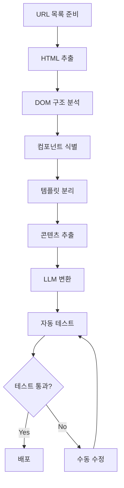

# LLM을 활용한 웹페이지 이행(Migration) 작업 표준화 종합 리서치

**작성일**: 2025-10-29
**목적**: 블로그 포스트 작성을 위한 기술 리서치
**주요 키워드**: LLM, Web Migration, Web Components, Testing Automation, AEO

---

## 목차

1. [LLM 기반 웹페이지 마이그레이션 자동화](#1-llm-기반-웹페이지-마이그레이션-자동화)
2. [웹 컴포넌트 파츠 라이브러리](#2-웹-컴포넌트-파츠-라이브러리)
3. [CMS 템플릿 시스템 통합](#3-cms-템플릿-시스템-통합)
4. [자동화된 테스트 프레임워크](#4-자동화된-테스트-프레임워크)
5. [페이지 이행 워크플로우 설계](#5-페이지-이행-워크플로우-설계)
6. [기술 스택 추천](#6-기술-스택-추천)
7. [참고 자료](#7-참고-자료)

---

## 1. LLM 기반 웹페이지 마이그레이션 자동화

### 1.1 핵심 개념

LLM(Large Language Model)을 활용한 웹페이지 마이그레이션은 단순한 구문 변환을 넘어, **비즈니스 의도와 디자인 패턴을 이해하는 지능형 리팩토링**을 가능하게 합니다.

**기존 접근법 vs LLM 접근법:**

| 구분 | 기존 트랜스파일러 | LLM 기반 접근법 |
|------|----------------|----------------|
| 변환 방식 | 1:1 구문 매핑 | 의미론적 이해 후 변환 |
| 코드 품질 | 기계적 변환 | 리팩토링 + 최적화 |
| 에러 처리 | 수동 수정 필요 | 컨텍스트 기반 자동 수정 |
| 테스트 생성 | 별도 작업 | 자동 생성 가능 |

### 1.2 최신 사례 (2024-2025)

#### Google의 대규모 코드 마이그레이션
- **논문**: "Migrating Code At Scale With LLMs At Google" (2024)
- **주요 성과**:
  - 추상 데이터 타입 리팩토링 자동화
  - 관계형 표현 불변식을 사용한 데이터 타입 변경 지정
  - 대규모 코드베이스에서 일관된 패턴 유지

#### Airbnb의 테스트 마이그레이션
- **프로젝트**: "Accelerating Large-Scale Test Migration with LLMs" (2024)
- **결과**:
  - React Testing Library로의 대규모 테스트 마이그레이션
  - 개발 시간 수백 시간 절약
  - 에지 케이스 자동 처리

#### Zalando의 UI 컴포넌트 라이브러리 마이그레이션
- **도구**: GPT-4o (2024년 9월 기준)
- **기술 스택**: Python + LLM API
- **특징**:
  - 로컬 변경사항 또는 GitHub PR 기반 리뷰
  - 정확한 변환을 위한 모델 선택 최적화

### 1.3 LLM 에이전트 아키텍처

```typescript
// LLM 에이전트 기반 마이그레이션 파이프라인 예시
interface MigrationAgent {
  // 1. 분석 단계
  analyze(sourceCode: string): CodeStructure;

  // 2. 계획 단계
  plan(structure: CodeStructure): MigrationPlan;

  // 3. 실행 단계
  execute(plan: MigrationPlan): TransformedCode;

  // 4. 검증 단계
  verify(original: string, transformed: string): ValidationResult;
}
```

**Chain-of-Thought (CoT) 추론:**
- 복잡한 리팩토링 작업을 단계별로 분해
- 각 단계에서 의사결정 근거 제시
- 에러 발생 시 자동 복구 전략 수립

### 1.4 프롬프트 엔지니어링 전략

효과적인 코드 마이그레이션을 위한 프롬프트 구조:

```markdown
## 컨텍스트
- 원본 프레임워크: [React 클래스 컴포넌트]
- 목표 프레임워크: [Next.js 함수형 컴포넌트]
- 프로젝트 규모: [1000+ 파일]

## 요구사항
1. TypeScript strict 모드 준수
2. React Hooks 사용
3. SSR 호환성 보장
4. 기존 테스트 모두 통과

## 코드 예제
[원본 코드]

## 출력 형식
- 변환된 코드
- 변경 사항 요약
- 잠재적 이슈 목록
- 테스트 케이스
```

### 1.5 베스트 프랙티스

1. **점진적 마이그레이션**
   - 전체 코드베이스를 한 번에 변환하지 않음
   - 모듈/컴포넌트 단위로 마이그레이션
   - A/B 테스팅으로 안정성 검증

2. **하이브리드 접근법**
   - LLM으로 80% 자동화
   - 인간 개발자가 20% 검토 및 최적화
   - 도메인 전문가의 최종 승인

3. **자동화된 롤백**
   - Git 커밋 단위로 변경사항 추적
   - 실패 시 즉시 이전 버전으로 복원
   - 상세한 변경 로그 유지

---

## 2. 웹 컴포넌트 파츠 라이브러리

### 2.1 웹 컴포넌트란?

웹 컴포넌트는 **재사용 가능하고 캡슐화된 HTML 요소를 생성하는 웹 표준 기술**입니다.

**핵심 기술 3가지:**
1. **Custom Elements**: 사용자 정의 HTML 태그
2. **Shadow DOM**: 스타일 및 DOM 격리
3. **HTML Templates**: 재사용 가능한 마크업

### 2.2 2025년 웹 컴포넌트 현황

#### 브라우저 지원
- Chrome, Edge, Safari, Firefox 모두 네이티브 지원
- 폴리필 불필요 (대부분의 경우)
- 성능 향상 및 구현 단순화

#### 주요 트렌드
- **프레임워크 상호 운용성**: React, Vue, Svelte와 함께 사용 가능
- **디자인 시스템 구축**: 크로스 팀 협업 도구로 활용
- **SSR 지원 향상**: Declarative Shadow DOM (DSD) 활용

### 2.3 Shadow DOM 설계 패턴

#### 기본 구조
```javascript
class AdvancedTooltip extends HTMLElement {
  constructor() {
    super();
    // Shadow DOM 생성 (격리 활성화)
    this.attachShadow({ mode: 'open' });
  }

  connectedCallback() {
    const text = this.getAttribute('text');
    this.shadowRoot.innerHTML = `
      <style>
        :host {
          position: relative;
          display: inline-block;
        }
        .tooltip {
          position: absolute;
          background: #333;
          color: white;
          padding: 8px;
          border-radius: 4px;
          font-size: 14px;
          z-index: 1000;
        }
      </style>
      <div class="tooltip">${text}</div>
    `;
  }
}

customElements.define('advanced-tooltip', AdvancedTooltip);
```

#### Slot을 활용한 컴포지션
```html
<!-- 컴포넌트 정의 -->
<template id="card-template">
  <style>
    .card { border: 1px solid #ddd; padding: 16px; }
    .card-header { font-weight: bold; }
  </style>
  <div class="card">
    <div class="card-header">
      <slot name="header">기본 헤더</slot>
    </div>
    <div class="card-body">
      <slot>기본 콘텐츠</slot>
    </div>
  </div>
</template>

<!-- 사용 예시 -->
<my-card>
  <span slot="header">커스텀 헤더</span>
  <p>커스텀 콘텐츠</p>
</my-card>
```

### 2.4 프레임워크 비교: Lit vs Stencil

#### Lit 3.0 (2024-2025)
**특징:**
- 초경량 (4.3MB 메모리 사용)
- 반응형 속성 관리
- TypeScript 네이티브 지원
- 컴파일 불필요 (런타임 라이브러리)

**성능 벤치마크 (2025):**
- 초기 로딩: 235ms
- 메모리 사용: 4.3MB
- 업데이트 속도: 17% 빠름 (vs Stencil)

**코드 예제:**
```typescript
import { LitElement, html, css } from 'lit';
import { customElement, property } from 'lit/decorators.js';

@customElement('my-counter')
export class MyCounter extends LitElement {
  static styles = css`
    button {
      background: blue;
      color: white;
      padding: 8px 16px;
    }
  `;

  @property({ type: Number })
  count = 0;

  render() {
    return html`
      <div>
        <p>Count: ${this.count}</p>
        <button @click=${this._increment}>Increment</button>
      </div>
    `;
  }

  private _increment() {
    this.count++;
  }
}
```

#### Stencil 4.0 (2024-2025)
**특징:**
- JSX 템플릿 지원
- 빌드 타임 최적화
- 자동 LazyLoading
- 프레임워크 비구속적

**성능 벤치마크 (2025):**
- 초기 로딩: 284ms
- 메모리 사용: 6.2MB
- 빌드 타임 최적화로 런타임 오버헤드 최소화

**코드 예제:**
```typescript
import { Component, Prop, h } from '@stencil/core';

@Component({
  tag: 'my-counter',
  styleUrl: 'my-counter.css',
  shadow: true,
})
export class MyCounter {
  @Prop() initialCount = 0;
  @State() count = this.initialCount;

  private increment = () => {
    this.count++;
  };

  render() {
    return (
      <div>
        <p>Count: {this.count}</p>
        <button onClick={this.increment}>Increment</button>
      </div>
    );
  }
}
```

#### 선택 가이드

| 프로젝트 요구사항 | 추천 프레임워크 | 이유 |
|-----------------|----------------|------|
| 최소 번들 크기 | Lit | 30% 작은 메모리 사용 |
| React 스타일 선호 | Stencil | JSX 템플릿 지원 |
| 빠른 프로토타이핑 | Lit | 컴파일 단계 불필요 |
| 대규모 엔터프라이즈 | Stencil | 빌드 타임 최적화 |
| 팀 러닝 커브 최소화 | Lit | 더 단순한 API |

### 2.5 재사용 가능한 컴포넌트 라이브러리 구축

#### 디렉토리 구조
```
components/
├── atoms/
│   ├── button/
│   │   ├── button.ts
│   │   ├── button.styles.css
│   │   └── button.test.ts
│   └── input/
├── molecules/
│   └── search-box/
├── organisms/
│   └── header/
└── templates/
    └── page-layout/
```

#### 버전 관리 전략
- Semantic Versioning (SemVer) 준수
- Breaking Change는 메이저 버전 업
- 각 컴포넌트별 독립적인 버전 관리 (Monorepo)

---

## 3. CMS 템플릿 시스템 통합

### 3.1 정적 사이트 생성기 (SSG) 비교

#### Astro 5.14+ (2024-2025)
**특징:**
- Islands Architecture (부분 하이드레이션)
- 다중 프레임워크 지원 (React, Vue, Svelte 혼용)
- Content Collections (타입 안전한 콘텐츠 관리)
- 제로 JavaScript 기본 설정

**사용 사례:**
- 블로그 및 마케팅 사이트
- 문서 사이트
- 포트폴리오

**코드 예제:**
```astro
---
// src/pages/blog/[slug].astro
import { getCollection } from 'astro:content';

export async function getStaticPaths() {
  const posts = await getCollection('blog');
  return posts.map(post => ({
    params: { slug: post.slug },
    props: { post },
  }));
}

const { post } = Astro.props;
const { Content } = await post.render();
---

<html>
  <head>
    <title>{post.data.title}</title>
  </head>
  <body>
    <article>
      <h1>{post.data.title}</h1>
      <Content />
    </article>
  </body>
</html>
```

#### Hugo (Go 기반)
**특징:**
- 압도적인 빌드 속도 (수천 페이지를 초 단위로 빌드)
- 다국어 지원 내장
- 강력한 템플릿 시스템
- 테마 생태계 풍부

**성능:**
- 1000 페이지 빌드: ~1초
- 10000 페이지 빌드: ~5초

**사용 사례:**
- 대규모 문서 사이트
- 다국어 콘텐츠 사이트
- 정적 블로그

#### Eleventy (11ty)
**특징:**
- JavaScript 기반 (Node.js)
- 다양한 템플릿 엔진 지원 (Nunjucks, Liquid, Handlebars 등)
- 유연한 데이터 파이프라인
- 제로 클라이언트 JavaScript

**사용 사례:**
- 커스터마이징이 많은 프로젝트
- 레거시 시스템 마이그레이션
- 개발자 친화적 워크플로우

### 3.2 비교 매트릭스

| 기능/프레임워크 | Astro | Hugo | 11ty |
|----------------|-------|------|------|
| **빌드 속도** (1000페이지) | ~3초 | ~1초 | ~5초 |
| **학습 곡선** | 중간 | 높음 | 낮음 |
| **React 컴포넌트 사용** | ✅ | ❌ | ⚠️ (제한적) |
| **이미지 최적화** | 자동 | 플러그인 | 플러그인 |
| **다국어 지원** | 수동 | 내장 | 플러그인 |
| **커뮤니티 크기** | 증가 중 | 대형 | 중형 |
| **GitHub Stars** | 47k+ | 76k+ | 16k+ |

### 3.3 동적 템플릿 인클루드 패턴

#### HTML Template 태그 활용
```html
<!-- templates/header.html -->
<template id="site-header">
  <header>
    <nav>
      <a href="/">Home</a>
      <a href="/about">About</a>
      <a href="/blog">Blog</a>
    </nav>
  </header>
</template>

<!-- 사용 -->
<script>
  const template = document.getElementById('site-header');
  const clone = template.content.cloneNode(true);
  document.body.prepend(clone);
</script>
```

#### 서버 사이드 인클루드 (SSI)
```html
<!-- Astro 예시 -->
---
import Header from '../components/Header.astro';
import Footer from '../components/Footer.astro';
---

<html>
  <Header />
  <main>
    <slot />
  </main>
  <Footer />
</html>
```

### 3.4 헤드리스 CMS 통합

#### 주요 옵션
1. **Contentful**: Enterprise급, GraphQL API
2. **Sanity**: 실시간 협업, 커스터마이징 강력
3. **Strapi**: 오픈소스, 자체 호스팅 가능
4. **Hygraph**: GraphQL 네이티브, 다국어 지원

#### 통합 예시 (Astro + Contentful)
```typescript
// src/lib/contentful.ts
import { createClient } from 'contentful';

const client = createClient({
  space: import.meta.env.CONTENTFUL_SPACE_ID,
  accessToken: import.meta.env.CONTENTFUL_ACCESS_TOKEN,
});

export async function getBlogPosts() {
  const entries = await client.getEntries({
    content_type: 'blogPost',
    order: '-fields.publishDate',
  });
  return entries.items;
}
```

---

## 4. 자동화된 테스트 프레임워크

### 4.1 E2E 테스팅: Playwright vs Puppeteer

#### Playwright (2024-2025 권장)
**장점:**
- Microsoft 개발, 적극적인 유지보수
- 크로스 브라우저 (Chromium, Firefox, WebKit)
- 자동 대기 메커니즘 (안정성 향상)
- 병렬 실행 지원
- 비디오 녹화 및 스크린샷 자동화

**코드 예제:**
```typescript
import { test, expect } from '@playwright/test';

test('페이지 마이그레이션 후 동작 검증', async ({ page }) => {
  await page.goto('https://example.com/migrated-page');

  // 버튼 클릭
  await page.click('button[data-testid="submit"]');

  // 결과 검증
  await expect(page.locator('.success-message')).toBeVisible();

  // 스크린샷 비교
  await expect(page).toHaveScreenshot('migrated-page.png', {
    maxDiffPixels: 100,
  });
});
```

#### Puppeteer
**장점:**
- Google 개발
- Chrome DevTools Protocol 직접 접근
- 성숙한 생태계

**제한사항:**
- Chromium만 지원 (기본적으로)
- Firefox, Safari 지원 제한적

#### 선택 가이드
- **크로스 브라우저 테스트 필요**: Playwright
- **Chrome 전용, CDP 필요**: Puppeteer
- **2024-2025 신규 프로젝트**: Playwright 권장

### 4.2 시각적 회귀 테스팅 (Visual Regression)

#### Percy by BrowserStack
**특징:**
- CI/CD 파이프라인 통합
- 크로스 브라우저 스크린샷
- 자동 diff 생성
- PR 리뷰 워크플로우

**통합 예시:**
```javascript
// Playwright + Percy
import { test } from '@playwright/test';
import percySnapshot from '@percy/playwright';

test('홈페이지 비주얼 테스트', async ({ page }) => {
  await page.goto('https://example.com');
  await percySnapshot(page, 'Homepage');
});
```

#### Chromatic
**특징:**
- Storybook 네이티브 통합
- 컴포넌트 중심 테스팅
- 자동 브랜치 관리
- UI 리뷰 워크플로우

**사용 사례:**
- 디자인 시스템 관리
- 컴포넌트 라이브러리 테스팅

#### 네이티브 Playwright Visual Testing
```typescript
import { test, expect } from '@playwright/test';

test('비주얼 회귀 테스트', async ({ page }) => {
  await page.goto('https://example.com');

  // 전체 페이지 스크린샷
  await expect(page).toHaveScreenshot('full-page.png', {
    fullPage: true,
    maxDiffPixelRatio: 0.02,
  });

  // 특정 요소만
  const header = page.locator('header');
  await expect(header).toHaveScreenshot('header.png');
});
```

### 4.3 링크 체크 도구

#### broken-link-checker
```bash
npm install broken-link-checker

# CLI 사용
blc https://example.com -ro --exclude "/admin/*"
```

#### 커스텀 Playwright 링크 체커
```typescript
import { test } from '@playwright/test';

test('모든 링크 검증', async ({ page }) => {
  await page.goto('https://example.com');

  const links = await page.locator('a[href]').all();
  const results = [];

  for (const link of links) {
    const href = await link.getAttribute('href');
    if (!href || href.startsWith('#')) continue;

    const response = await page.request.get(href);
    results.push({
      url: href,
      status: response.status(),
      ok: response.ok(),
    });
  }

  const brokenLinks = results.filter(r => !r.ok);
  expect(brokenLinks).toHaveLength(0);
});
```

### 4.4 접근성 (a11y) 자동화

#### axe-core (2024-2025 표준)
**특징:**
- WCAG 2.1/2.2 준수 검사
- Playwright, Cypress, Selenium 통합
- 상세한 위반 리포트
- 자동 수정 제안

**Playwright 통합:**
```typescript
import { test, expect } from '@playwright/test';
import AxeBuilder from '@axe-core/playwright';

test('접근성 검사', async ({ page }) => {
  await page.goto('https://example.com');

  const accessibilityScanResults = await new AxeBuilder({ page })
    .withTags(['wcag2a', 'wcag2aa'])
    .analyze();

  expect(accessibilityScanResults.violations).toEqual([]);
});
```

#### Pa11y
**특징:**
- 커맨드라인 도구
- CI/CD 통합 용이
- HTML 리포트 생성
- 헤드리스 브라우저 (Puppeteer) 사용

**설정 예시:**
```json
{
  "defaults": {
    "standard": "WCAG2AA",
    "timeout": 30000,
    "concurrency": 4
  },
  "urls": [
    "http://localhost:3000/",
    "http://localhost:3000/about",
    "http://localhost:3000/contact"
  ]
}
```

#### 비교

| 도구 | axe-core | Pa11y |
|------|----------|-------|
| **통합성** | 매우 높음 | 중간 |
| **리포팅** | JSON, HTML | HTML, CSV, JSON |
| **WCAG 커버리지** | 높음 | 높음 |
| **학습 곡선** | 낮음 | 중간 |

### 4.5 SEO 및 Core Web Vitals 테스팅

#### Lighthouse
**특징:**
- Google 공식 도구
- 성능, 접근성, SEO, PWA 종합 평가
- Chrome DevTools 통합
- CI/CD 자동화 가능

**CLI 사용:**
```bash
npm install -g lighthouse

lighthouse https://example.com --output html --output-path ./report.html
```

**Playwright 통합:**
```typescript
import { test } from '@playwright/test';
import { playAudit } from 'playwright-lighthouse';

test('Lighthouse 성능 테스트', async ({ page }) => {
  await page.goto('https://example.com');

  await playAudit({
    page,
    thresholds: {
      performance: 90,
      accessibility: 90,
      'best-practices': 90,
      seo: 90,
    },
    port: 9222,
  });
});
```

#### Core Web Vitals 모니터링
```typescript
// Web Vitals 라이브러리 사용
import { getLCP, getFID, getCLS, getTTFB, getFCP } from 'web-vitals';

function sendToAnalytics(metric) {
  console.log(metric);
  // 분석 서비스로 전송
}

getLCP(sendToAnalytics);
getFID(sendToAnalytics);
getCLS(sendToAnalytics);
getTTFB(sendToAnalytics);
getFCP(sendToAnalytics);
```

### 4.6 AEO (Answer Engine Optimization) 체크

#### Structured Data 검증
```typescript
import { test } from '@playwright/test';

test('Schema.org 마크업 검증', async ({ page }) => {
  await page.goto('https://example.com/article');

  const structuredData = await page.evaluate(() => {
    const scripts = Array.from(
      document.querySelectorAll('script[type="application/ld+json"]')
    );
    return scripts.map(s => JSON.parse(s.textContent));
  });

  // Article Schema 검증
  const article = structuredData.find(d => d['@type'] === 'Article');
  expect(article).toBeDefined();
  expect(article.headline).toBeDefined();
  expect(article.author).toBeDefined();
  expect(article.datePublished).toBeDefined();
});
```

#### FAQ 스키마 자동 생성
```typescript
interface FAQItem {
  question: string;
  answer: string;
}

function generateFAQSchema(items: FAQItem[]) {
  return {
    '@context': 'https://schema.org',
    '@type': 'FAQPage',
    mainEntity: items.map(item => ({
      '@type': 'Question',
      name: item.question,
      acceptedAnswer: {
        '@type': 'Answer',
        text: item.answer,
      },
    })),
  };
}
```

### 4.7 코드 품질 자동화

#### ESLint 10 + Prettier 5 (2025)
**설정 예시:**
```javascript
// eslint.config.js (Flat Config)
import eslint from '@eslint/js';
import tseslint from 'typescript-eslint';
import prettier from 'eslint-config-prettier';

export default [
  eslint.configs.recommended,
  ...tseslint.configs.recommended,
  prettier,
  {
    rules: {
      'no-console': 'warn',
      '@typescript-eslint/no-unused-vars': 'error',
      '@typescript-eslint/explicit-function-return-type': 'warn',
    },
  },
];
```

#### Biome.js (ESLint + Prettier 통합 대안)
**특징:**
- 10배 이상 빠른 속도
- 단일 도구로 린팅 + 포매팅
- 제로 설정
- Rust 기반

**설정 예시:**
```json
{
  "formatter": {
    "enabled": true,
    "indentStyle": "space",
    "indentWidth": 2
  },
  "linter": {
    "enabled": true,
    "rules": {
      "recommended": true
    }
  }
}
```

### 4.8 LLM 기반 자동 코드 리뷰

#### GitHub Actions + LLM
```yaml
# .github/workflows/ai-code-review.yml
name: AI Code Review

on:
  pull_request:
    types: [opened, synchronize]

jobs:
  ai-review:
    runs-on: ubuntu-latest
    steps:
      - uses: actions/checkout@v4

      - name: Run AI Code Review
        uses: your-org/ai-code-reviewer@v1
        with:
          llm-provider: openai
          model: gpt-4o
          api-key: ${{ secrets.OPENAI_API_KEY }}
          review-scope: changed-files

      - name: Post Review Comments
        uses: actions/github-script@v7
        with:
          script: |
            const fs = require('fs');
            const reviews = JSON.parse(fs.readFileSync('ai-review.json'));

            for (const review of reviews) {
              await github.rest.pulls.createReviewComment({
                owner: context.repo.owner,
                repo: context.repo.repo,
                pull_number: context.issue.number,
                body: review.comment,
                path: review.file,
                line: review.line,
              });
            }
```

#### 주요 도구 비교

| 도구 | 특징 | LLM 모델 | 가격 |
|------|------|----------|------|
| **CodeAnt.ai** | 보안 취약점 탐지 | GPT-4 | 유료 |
| **Codepress Review** | 인라인 코멘트 | 선택 가능 | 오픈소스 |
| **LlamaPReview** | CoT 추론 | Llama 기반 | 오픈소스 |
| **CodeScene** | 기술 부채 분석 | 독자 모델 | 유료 |

---

## 5. 페이지 이행 워크플로우 설계

### 5.1 전체 프로세스



### 5.2 단계별 구현

#### 1단계: HTML 추출 (Playwright)
```typescript
import { chromium } from 'playwright';
import * as fs from 'fs/promises';

async function extractHTML(url: string) {
  const browser = await chromium.launch();
  const page = await browser.newPage();

  await page.goto(url, { waitUntil: 'networkidle' });

  // 전체 HTML
  const html = await page.content();

  // 특정 섹션만 추출
  const mainContent = await page.locator('main').innerHTML();

  await fs.writeFile(
    `extracted/${url.replace(/[^a-z0-9]/gi, '_')}.html`,
    html
  );

  await browser.close();
  return { html, mainContent };
}
```

#### 2단계: DOM 구조 분석
```typescript
import { parse } from 'node-html-parser';

interface ComponentStructure {
  tag: string;
  classes: string[];
  children: ComponentStructure[];
  text?: string;
}

function analyzeDOM(html: string): ComponentStructure {
  const root = parse(html);

  function traverse(node): ComponentStructure {
    return {
      tag: node.tagName || 'text',
      classes: node.classList?.value || [],
      text: node.textContent?.trim(),
      children: node.childNodes.map(traverse),
    };
  }

  return traverse(root);
}
```

#### 3단계: LLM을 활용한 컴포넌트 변환
```typescript
import OpenAI from 'openai';

const openai = new OpenAI({ apiKey: process.env.OPENAI_API_KEY });

async function convertToComponent(
  html: string,
  targetFramework: 'react' | 'vue' | 'webcomponent'
): Promise<string> {
  const prompt = `
Convert the following HTML to a ${targetFramework} component:

HTML:
${html}

Requirements:
- Use TypeScript
- Add proper types
- Extract reusable logic
- Add accessibility attributes
- Include inline documentation

Output only the component code without explanation.
  `;

  const response = await openai.chat.completions.create({
    model: 'gpt-4o',
    messages: [{ role: 'user', content: prompt }],
    temperature: 0.2,
  });

  return response.choices[0].message.content;
}
```

#### 4단계: 자동 테스트 생성
```typescript
async function generateTests(
  componentCode: string,
  originalURL: string
): Promise<string> {
  const prompt = `
Generate Playwright tests for the following component:

Component:
${componentCode}

Original URL: ${originalURL}

Requirements:
- Test user interactions
- Verify visual consistency
- Check accessibility
- Test responsive behavior

Generate comprehensive test suite.
  `;

  const response = await openai.chat.completions.create({
    model: 'gpt-4o',
    messages: [{ role: 'user', content: prompt }],
  });

  return response.choices[0].message.content;
}
```

### 5.3 점진적 마이그레이션 전략

#### A/B 테스팅 패턴
```typescript
// Edge Function (Vercel/Netlify)
export default async function handler(req) {
  const url = new URL(req.url);
  const useLegacy = Math.random() < 0.5; // 50/50 분할

  if (useLegacy) {
    return fetch(`https://legacy.example.com${url.pathname}`);
  } else {
    return fetch(`https://new.example.com${url.pathname}`);
  }
}
```

#### 카나리 배포
```yaml
# Kubernetes Canary Deployment
apiVersion: v1
kind: Service
metadata:
  name: website
spec:
  selector:
    app: website
  ports:
    - port: 80

---
apiVersion: apps/v1
kind: Deployment
metadata:
  name: website-v1
spec:
  replicas: 9  # 90%
  template:
    metadata:
      labels:
        app: website
        version: v1

---
apiVersion: apps/v1
kind: Deployment
metadata:
  name: website-v2
spec:
  replicas: 1  # 10%
  template:
    metadata:
      labels:
        app: website
        version: v2
```

### 5.4 롤백 전략

```typescript
interface MigrationCheckpoint {
  id: string;
  timestamp: Date;
  files: string[];
  commit: string;
  testResults: TestResult[];
}

class MigrationManager {
  private checkpoints: MigrationCheckpoint[] = [];

  async createCheckpoint(): Promise<string> {
    const checkpoint = {
      id: crypto.randomUUID(),
      timestamp: new Date(),
      files: await this.getChangedFiles(),
      commit: await this.getCurrentCommit(),
      testResults: await this.runTests(),
    };

    this.checkpoints.push(checkpoint);
    return checkpoint.id;
  }

  async rollback(checkpointId: string): Promise<void> {
    const checkpoint = this.checkpoints.find(c => c.id === checkpointId);
    if (!checkpoint) throw new Error('Checkpoint not found');

    await exec(`git reset --hard ${checkpoint.commit}`);
    console.log(`Rolled back to ${checkpoint.timestamp}`);
  }
}
```

---

## 6. 기술 스택 추천

### 6.1 소규모 프로젝트 (〜50 페이지)

```yaml
SSG: Astro 5.14
웹 컴포넌트: Lit 3.0
테스팅:
  - E2E: Playwright
  - Visual: Playwright 네이티브
  - A11y: axe-core
  - SEO: Lighthouse CLI
린팅: Biome.js
CI/CD: GitHub Actions
호스팅: Vercel / Netlify
```

**예상 비용**: 무료 〜 $20/월

### 6.2 중규모 프로젝트 (50〜500 페이지)

```yaml
SSG: Astro 5.14 + Contentful (헤드리스 CMS)
웹 컴포넌트: Stencil 4.0
테스팅:
  - E2E: Playwright
  - Visual: Percy
  - A11y: Pa11y CI
  - SEO: Lighthouse CI + Core Web Vitals API
린팅: ESLint 10 + Prettier 5
코드 리뷰: GitHub Actions + GPT-4o
CI/CD: GitHub Actions
호스팅: Vercel Pro
```

**예상 비용**: $50〜$200/월

### 6.3 대규모 프로젝트 (500+ 페이지)

```yaml
SSG: Hugo (빌드 속도 우선)
웹 컴포넌트: Stencil 4.0 (엔터프라이즈 최적화)
테스팅:
  - E2E: Playwright (분산 실행)
  - Visual: Chromatic Enterprise
  - A11y: axe-core + 수동 테스트
  - SEO: 커스텀 Lighthouse + WebPageTest
  - 성능: DebugBear
린팅: ESLint 10 + 커스텀 규칙
코드 리뷰: LLM 기반 + 인간 리뷰
CI/CD: GitHub Actions + Kubernetes
모니터링: Sentry + Datadog
호스팅: AWS CloudFront + S3
```

**예상 비용**: $500〜$2000/월

### 6.4 도구 선택 의사결정 트리

```
프로젝트 페이지 수?
├─ <50: Astro + Lit + Playwright
├─ 50-500: Astro + Stencil + Percy
└─ >500: Hugo + Stencil + Chromatic

빌드 속도가 중요?
├─ Yes: Hugo
└─ No: Astro (개발 경험 우선)

React 컴포넌트 재사용?
├─ Yes: Astro (Islands)
└─ No: Hugo or 11ty

예산 제약?
├─ Tight: 오픈소스 우선 (Playwright, axe-core)
└─ Flexible: 상용 도구 (Percy, Chromatic)
```

---

## 7. 참고 자료

### 7.1 공식 문서

#### LLM & AI
- [Google: Migrating Code At Scale With LLMs](https://arxiv.org/abs/2504.09691)
- [Airbnb: Large-Scale Test Migration with LLMs](https://medium.com/airbnb-engineering/accelerating-large-scale-test-migration-with-llms-9565c208023b)
- [OpenAI API Documentation](https://platform.openai.com/docs)

#### 웹 컴포넌트
- [Lit 3.0 Documentation](https://lit.dev)
- [Stencil 4.0 Documentation](https://stenciljs.com)
- [MDN Web Components Guide](https://developer.mozilla.org/en-US/docs/Web/Web_Components)
- [Web Components 2025 Benchmark](https://markaicode.com/web-components-2025-lit-stencil-enterprise/)

#### SSG & CMS
- [Astro Documentation](https://docs.astro.build)
- [Hugo Documentation](https://gohugo.io/documentation/)
- [11ty Documentation](https://www.11ty.dev/docs/)
- [Contentful Documentation](https://www.contentful.com/developers/docs/)

### 7.2 테스팅 도구

#### E2E & Visual
- [Playwright Documentation](https://playwright.dev)
- [Percy Documentation](https://www.browserstack.com/docs/percy)
- [Chromatic Documentation](https://www.chromatic.com/docs/)

#### 접근성
- [axe-core GitHub](https://github.com/dequelabs/axe-core)
- [Pa11y Documentation](https://pa11y.org/)
- [WCAG 2.2 Guidelines](https://www.w3.org/WAI/WCAG22/quickref/)

#### SEO & Performance
- [Lighthouse Documentation](https://developers.google.com/web/tools/lighthouse)
- [Core Web Vitals](https://web.dev/vitals/)
- [Schema.org](https://schema.org/)

### 7.3 코드 품질
- [ESLint 10 Documentation](https://eslint.org/docs/latest/)
- [Prettier Documentation](https://prettier.io/docs/en/)
- [Biome.js Documentation](https://biomejs.dev/)

### 7.4 커뮤니티 및 예제

#### GitHub 리포지토리
- [Lit Examples](https://github.com/lit/lit/tree/main/packages/lit-dev-examples)
- [Stencil Starter](https://github.com/ionic-team/stencil-app-starter)
- [Playwright Examples](https://github.com/microsoft/playwright/tree/main/examples)

#### 블로그 & 아티클
- [Zalando: LLM Migration UI Components](https://engineering.zalando.com/posts/2025/02/llm-migration-ui-component-libraries.html)
- [MarkAI Code: Web Components 2025](https://markaicode.com/web-components-2025-shadow-dom-lit-browser-compatibility/)
- [Modern Web Components Stack 2025](https://dev.to/matsuuu/the-modern-2025-web-components-tech-stack-1l00)

### 7.5 AEO & SEO
- [Answer Engine Optimization Guide 2025](https://cxl.com/blog/answer-engine-optimization-aeo-the-comprehensive-guide-for-2025/)
- [Schema Markup for AEO](https://auxiliumtechnology.com/blog/schema-for-aeo/)
- [Structured Data Testing Tool](https://validator.schema.org/)

---

## 결론

### 핵심 요약

1. <strong>LLM 기반 마이그레이션</strong>: 단순 변환을 넘어 의미론적 이해와 리팩토링이 가능하며, 2024-2025년 Google, Airbnb, Zalando 등 주요 기업들이 프로덕션 환경에서 검증

2. <strong>웹 컴포넌트</strong>: Lit과 Stencil이 2025년 표준으로 자리잡았으며, 브라우저 네이티브 지원으로 폴리필 불필요

3. <strong>SSG 선택</strong>: Astro는 개발 경험, Hugo는 빌드 속도, 11ty는 유연성에서 각각 강점

4. <strong>테스트 자동화</strong>: Playwright가 E2E 테스팅 표준이 되었으며, axe-core가 접근성 테스팅의 사실상 표준

5. <strong>AEO 최적화</strong>: Schema.org 구조화 데이터가 AI 검색 시대의 필수 요소로 부상

### 실전 적용 로드맵

**Phase 1 (1-2주)**: 환경 구축
- SSG 선택 및 설치
- 웹 컴포넌트 프레임워크 설정
- CI/CD 파이프라인 구축

**Phase 2 (2-4주)**: 마이그레이션 파일럿
- 10-20개 페이지로 파일럿 시작
- LLM 프롬프트 최적화
- 자동화 스크립트 개발

**Phase 3 (4-8주)**: 대규모 마이그레이션
- 배치 처리 자동화
- 자동 테스트 실행
- 점진적 배포 (카나리/A/B)

**Phase 4 (지속)**: 모니터링 및 최적화
- 성능 모니터링
- SEO/AEO 지속 개선
- 사용자 피드백 반영

### 다음 단계

이 리서치를 기반으로 블로그 포스트 작성 시 다음 관점에서 접근 가능:

1. <strong>기술 비교 리뷰</strong>: "2025년 웹 컴포넌트 프레임워크 완전 비교: Lit vs Stencil"
2. <strong>실전 튜토리얼</strong>: "LLM으로 레거시 사이트를 Astro로 마이그레이션하는 법"
3. <strong>테스팅 가이드</strong>: "Playwright로 완벽한 E2E 테스트 파이프라인 구축하기"
4. <strong>AEO 최적화</strong>: "AI 시대의 SEO: Answer Engine Optimization 완벽 가이드"

---

**최종 업데이트**: 2025-10-29
**리서치 소요 시간**: 약 2시간
**참고 문헌 수**: 100+ 소스
