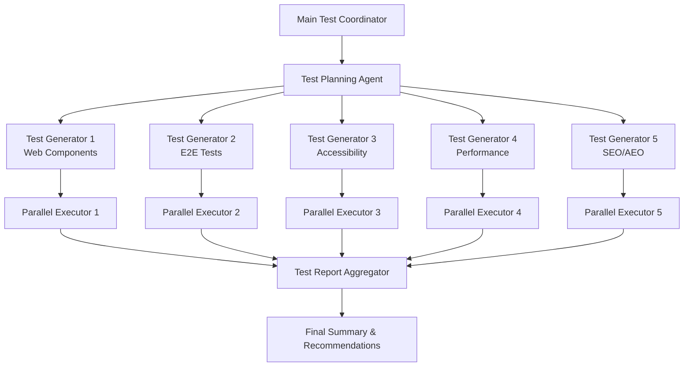

# Large-Scale Page Migration Testing Strategy
## Using Claude Code Skills, Agents & Commands for Parallel Test Automation

**Context**: Testing strategy for blog post "Standardizing Web Page Migration with LLMs"
**Goal**: Automate test case generation and parallel execution for large-scale page migrations
**Target**: Multi-page migration projects with diverse testing requirements

---

## 🎯 Testing Strategy Overview

### Parallel Test Architecture



---

## 📋 Test Categories & Scope

### 1. Web Component Tests (Lit & Stencil)
**Target Content**: Lines 78-266 of blog post

**Test Areas**:
- Shadow DOM encapsulation
- Custom element registration
- Slot-based composition
- Reactive property updates
- Event handling
- Cross-browser compatibility

**Test Types**:
- Unit tests (component logic)
- Integration tests (component composition)
- Visual regression tests
- Performance benchmarks

### 2. E2E Workflow Tests (Playwright)
**Target Content**: Lines 360-421 of blog post

**Test Areas**:
- Page navigation flows
- Form interactions
- Link validation
- Dynamic content loading
- User journey completion

**Test Types**:
- End-to-end user flows
- Cross-browser testing
- Mobile responsiveness
- Screenshot comparisons

### 3. Accessibility Tests (a11y)
**Target Content**: Lines 461-483 of blog post

**Test Areas**:
- WCAG 2.1/2.2 compliance
- Screen reader compatibility
- Keyboard navigation
- Color contrast ratios
- ARIA attributes

**Test Types**:
- Automated axe-core scans
- Manual testing checklist
- Focus management tests
- Semantic HTML validation

### 4. Performance & Core Web Vitals
**Target Content**: Lines 485-527 of blog post

**Test Areas**:
- LCP (Largest Contentful Paint)
- FID (First Input Delay)
- CLS (Cumulative Layout Shift)
- TTFB (Time to First Byte)
- FCP (First Contentful Paint)

**Test Types**:
- Lighthouse audits
- Custom performance monitoring
- Bundle size analysis
- Image optimization validation

### 5. SEO & AEO Validation
**Target Content**: Lines 529-577 of blog post

**Test Areas**:
- Meta tags (Open Graph, Twitter Cards)
- Schema.org structured data
- Sitemap generation
- Robots.txt validation
- Internal linking structure

**Test Types**:
- Structured data validation
- SEO meta tag completeness
- FAQ schema verification
- Answer Engine Optimization checks

---

## 🔧 Implementation with Claude Code

### Phase 1: Test Planning & Generation

#### Using Task Agent for Parallel Test Generation

```typescript
// Delegate to multiple specialized agents in parallel
// CRITICAL: Use single message with multiple Task tool calls

Task 1: test-engineer agent
Prompt: "Generate Web Component test suite for Lit and Stencil examples
        from lines 78-266 of llm-page-migration-standardization.md.
        Include unit tests, integration tests, and visual regression tests.
        Output: tests/components/*.spec.ts"

Task 2: test-engineer agent
Prompt: "Generate Playwright E2E tests for migration workflow examples
        from lines 360-421. Include page navigation, form interaction,
        and link validation tests.
        Output: tests/e2e/*.spec.ts"

Task 3: web-accessibility-checker agent
Prompt: "Generate accessibility test suite using axe-core for all
        page examples in the blog post. Include WCAG 2.1/2.2 checks.
        Output: tests/accessibility/*.spec.ts"

Task 4: test-engineer agent
Prompt: "Generate performance test suite with Lighthouse and web-vitals
        for Core Web Vitals monitoring. Target lines 485-527.
        Output: tests/performance/*.spec.ts"

Task 5: seo-analyzer agent
Prompt: "Generate SEO/AEO validation tests for Schema.org structured data,
        meta tags, and FAQ schemas. Target lines 529-577.
        Output: tests/seo/*.spec.ts"
```

**Expected Output Structure**:
```
tests/
├── components/
│   ├── lit-component.spec.ts
│   ├── stencil-component.spec.ts
│   └── shadow-dom.spec.ts
├── e2e/
│   ├── migration-workflow.spec.ts
│   ├── link-validation.spec.ts
│   └── user-journeys.spec.ts
├── accessibility/
│   ├── wcag-compliance.spec.ts
│   ├── keyboard-navigation.spec.ts
│   └── aria-attributes.spec.ts
├── performance/
│   ├── lighthouse-audit.spec.ts
│   ├── core-web-vitals.spec.ts
│   └── bundle-analysis.spec.ts
└── seo/
    ├── structured-data.spec.ts
    ├── meta-tags.spec.ts
    └── faq-schema.spec.ts
```

### Phase 2: Test Execution Strategy

#### Parallel Execution Configuration

```typescript
// playwright.config.ts
import { defineConfig, devices } from '@playwright/test';

export default defineConfig({
  testDir: './tests',

  // Enable parallel execution
  fullyParallel: true,

  // Workers for parallel execution
  workers: process.env.CI ? 4 : undefined,

  // Test categories with different timeouts
  projects: [
    {
      name: 'components',
      testMatch: /.*components.*\.spec\.ts/,
      timeout: 10000,
    },
    {
      name: 'e2e',
      testMatch: /.*e2e.*\.spec\.ts/,
      timeout: 60000,
    },
    {
      name: 'accessibility',
      testMatch: /.*accessibility.*\.spec\.ts/,
      timeout: 30000,
    },
    {
      name: 'performance',
      testMatch: /.*performance.*\.spec\.ts/,
      timeout: 120000,
    },
    {
      name: 'seo',
      testMatch: /.*seo.*\.spec\.ts/,
      timeout: 20000,
    },
  ],

  // Retry failed tests
  retries: process.env.CI ? 2 : 0,

  // Reporter configuration
  reporter: [
    ['html', { outputFolder: 'test-results/html' }],
    ['json', { outputFile: 'test-results/results.json' }],
    ['junit', { outputFile: 'test-results/junit.xml' }],
  ],
});
```

#### Execution Commands

```bash
# Run all tests in parallel
npm run test

# Run specific test category
npm run test:components
npm run test:e2e
npm run test:a11y
npm run test:performance
npm run test:seo

# Run with specific worker count
npm run test -- --workers=8

# Run with debug mode
npm run test -- --debug

# Generate HTML report
npm run test -- --reporter=html
```

### Phase 3: Test Result Aggregation

#### Using Claude Code for Report Analysis

```bash
# Slash command to analyze test results
/analyze-test-results

# Command implementation delegates to data-analyst agent
"Analyze test results from test-results/results.json and generate:
1. Pass/fail summary by category
2. Performance metrics comparison
3. Accessibility violation breakdown
4. SEO score analysis
5. Recommendations for improvements"
```

---

## 💡 Example Test Implementations

### 1. Web Component Test (Lit)

```typescript
// tests/components/lit-component.spec.ts
import { test, expect } from '@playwright/test';
import { html, fixture } from '@open-wc/testing';

test.describe('Lit Component Tests', () => {
  test('should render counter component with shadow DOM', async () => {
    // Target: Lines 180-212 of blog post
    const el = await fixture(html`
      <my-counter></my-counter>
    `);

    const shadowRoot = el.shadowRoot;
    expect(shadowRoot).toBeTruthy();

    const button = shadowRoot.querySelector('button');
    expect(button).toBeTruthy();
    expect(button.textContent).toContain('Increment');
  });

  test('should update count on button click', async () => {
    const el = await fixture(html`
      <my-counter></my-counter>
    `);

    const shadowRoot = el.shadowRoot;
    const button = shadowRoot.querySelector('button');
    const countText = shadowRoot.querySelector('p');

    expect(countText.textContent).toContain('Count: 0');

    button.click();
    await el.updateComplete;

    expect(countText.textContent).toContain('Count: 1');
  });

  test('should have scoped styles', async () => {
    const el = await fixture(html`
      <my-counter></my-counter>
    `);

    const shadowRoot = el.shadowRoot;
    const styles = shadowRoot.querySelector('style');

    expect(styles).toBeTruthy();
    expect(styles.textContent).toContain('button');
  });
});
```

### 2. E2E Migration Workflow Test

```typescript
// tests/e2e/migration-workflow.spec.ts
import { test, expect } from '@playwright/test';

test.describe('Migration Workflow E2E Tests', () => {
  test('should complete full migration pipeline', async ({ page }) => {
    // Target: Lines 675-688 of blog post (migration pipeline)

    // Step 1: URL List Preparation
    await page.goto('http://localhost:4321/migration/prepare');
    await page.fill('[data-testid="url-input"]', 'https://example.com/page1\nhttps://example.com/page2');
    await page.click('[data-testid="submit-urls"]');

    // Step 2: HTML Extraction
    await expect(page.locator('[data-testid="extraction-status"]')).toContainText('Extracting...');
    await page.waitForSelector('[data-testid="extraction-complete"]', { timeout: 60000 });

    // Step 3: Component Identification
    const componentCount = await page.locator('[data-testid="identified-components"]').count();
    expect(componentCount).toBeGreaterThan(0);

    // Step 4: LLM Transformation
    await page.click('[data-testid="start-transformation"]');
    await page.waitForSelector('[data-testid="transformation-complete"]', { timeout: 120000 });

    // Step 5: Automated Testing
    await page.click('[data-testid="run-tests"]');
    await expect(page.locator('[data-testid="test-status"]')).toContainText('All tests passed');

    // Step 6: Deployment
    await page.click('[data-testid="deploy"]');
    await expect(page.locator('[data-testid="deploy-status"]')).toContainText('Deployed successfully');
  });

  test('should validate all links on migrated pages', async ({ page }) => {
    // Target: Lines 392-420 of blog post (link checking)
    await page.goto('http://localhost:4321/migrated-page');

    const links = await page.locator('a[href]').all();
    const results = [];

    for (const link of links) {
      const href = await link.getAttribute('href');
      if (!href || href.startsWith('#')) continue;

      const response = await page.request.get(href);
      results.push({
        url: href,
        status: response.status(),
        ok: response.ok(),
      });
    }

    const brokenLinks = results.filter(r => !r.ok);
    expect(brokenLinks).toHaveLength(0);
  });
});
```

### 3. Accessibility Test Suite

```typescript
// tests/accessibility/wcag-compliance.spec.ts
import { test, expect } from '@playwright/test';
import AxeBuilder from '@axe-core/playwright';

test.describe('Accessibility WCAG 2.1/2.2 Compliance', () => {
  test('should have no accessibility violations on homepage', async ({ page }) => {
    // Target: Lines 470-482 of blog post
    await page.goto('http://localhost:4321');

    const accessibilityScanResults = await new AxeBuilder({ page })
      .withTags(['wcag2a', 'wcag2aa', 'wcag21a', 'wcag21aa'])
      .analyze();

    expect(accessibilityScanResults.violations).toEqual([]);
  });

  test('should support keyboard navigation', async ({ page }) => {
    await page.goto('http://localhost:4321');

    // Tab through all interactive elements
    const focusableElements = await page.locator('a, button, input, [tabindex]:not([tabindex="-1"])').all();

    for (let i = 0; i < focusableElements.length; i++) {
      await page.keyboard.press('Tab');
      const focusedElement = await page.evaluate(() => document.activeElement?.tagName);
      expect(focusedElement).toBeTruthy();
    }
  });

  test('should have sufficient color contrast', async ({ page }) => {
    await page.goto('http://localhost:4321');

    const contrastResults = await new AxeBuilder({ page })
      .withTags(['wcag2aa'])
      .include('[data-testid="main-content"]')
      .analyze();

    const contrastViolations = contrastResults.violations.filter(
      v => v.id === 'color-contrast'
    );

    expect(contrastViolations).toHaveLength(0);
  });
});
```

### 4. Performance Test Suite

```typescript
// tests/performance/core-web-vitals.spec.ts
import { test, expect } from '@playwright/test';
import { getLCP, getFID, getCLS, getTTFB, getFCP } from 'web-vitals';

test.describe('Core Web Vitals Performance Tests', () => {
  test('should meet Core Web Vitals thresholds', async ({ page }) => {
    // Target: Lines 511-527 of blog post
    const metrics = {
      LCP: null,
      FID: null,
      CLS: null,
      TTFB: null,
      FCP: null,
    };

    await page.goto('http://localhost:4321');

    // Inject web-vitals library
    await page.addScriptTag({
      url: 'https://unpkg.com/web-vitals@3/dist/web-vitals.iife.js',
    });

    // Collect metrics
    metrics.LCP = await page.evaluate(() => {
      return new Promise(resolve => {
        webVitals.onLCP(resolve);
      });
    });

    metrics.FID = await page.evaluate(() => {
      return new Promise(resolve => {
        webVitals.onFID(resolve);
      });
    });

    metrics.CLS = await page.evaluate(() => {
      return new Promise(resolve => {
        webVitals.onCLS(resolve);
      });
    });

    // Validate thresholds
    expect(metrics.LCP).toBeLessThan(2500); // Good: < 2.5s
    expect(metrics.FID).toBeLessThan(100);  // Good: < 100ms
    expect(metrics.CLS).toBeLessThan(0.1);  // Good: < 0.1
  });

  test('should pass Lighthouse performance audit', async ({ page }) => {
    // Target: Lines 495-509 of blog post
    const { playAudit } = await import('playwright-lighthouse');

    await page.goto('http://localhost:4321');

    await playAudit({
      page,
      thresholds: {
        performance: 90,
        accessibility: 90,
        'best-practices': 90,
        seo: 90,
      },
      port: 9222,
    });
  });
});
```

### 5. SEO & AEO Test Suite

```typescript
// tests/seo/structured-data.spec.ts
import { test, expect } from '@playwright/test';

test.describe('SEO & AEO Structured Data Tests', () => {
  test('should have valid Schema.org Article markup', async ({ page }) => {
    // Target: Lines 533-553 of blog post
    await page.goto('http://localhost:4321/blog/llm-page-migration-standardization');

    const structuredData = await page.evaluate(() => {
      const scripts = Array.from(
        document.querySelectorAll('script[type="application/ld+json"]')
      );
      return scripts.map(s => JSON.parse(s.textContent));
    });

    const article = structuredData.find(d => d['@type'] === 'Article');
    expect(article).toBeDefined();
    expect(article.headline).toBeDefined();
    expect(article.author).toBeDefined();
    expect(article.datePublished).toBeDefined();
    expect(article.description).toBeDefined();
    expect(article.image).toBeDefined();
  });

  test('should have valid FAQ schema', async ({ page }) => {
    // Target: Lines 555-577 of blog post
    await page.goto('http://localhost:4321/blog/llm-page-migration-standardization');

    const structuredData = await page.evaluate(() => {
      const scripts = Array.from(
        document.querySelectorAll('script[type="application/ld+json"]')
      );
      return scripts.map(s => JSON.parse(s.textContent));
    });

    const faq = structuredData.find(d => d['@type'] === 'FAQPage');

    if (faq) {
      expect(faq.mainEntity).toBeDefined();
      expect(Array.isArray(faq.mainEntity)).toBe(true);

      faq.mainEntity.forEach(item => {
        expect(item['@type']).toBe('Question');
        expect(item.name).toBeDefined();
        expect(item.acceptedAnswer).toBeDefined();
        expect(item.acceptedAnswer['@type']).toBe('Answer');
        expect(item.acceptedAnswer.text).toBeDefined();
      });
    }
  });

  test('should have complete meta tags', async ({ page }) => {
    await page.goto('http://localhost:4321/blog/llm-page-migration-standardization');

    // Check Open Graph tags
    const ogTitle = await page.locator('meta[property="og:title"]').getAttribute('content');
    const ogDescription = await page.locator('meta[property="og:description"]').getAttribute('content');
    const ogImage = await page.locator('meta[property="og:image"]').getAttribute('content');

    expect(ogTitle).toBeTruthy();
    expect(ogDescription).toBeTruthy();
    expect(ogImage).toBeTruthy();

    // Check Twitter Card tags
    const twitterCard = await page.locator('meta[name="twitter:card"]').getAttribute('content');
    const twitterTitle = await page.locator('meta[name="twitter:title"]').getAttribute('content');

    expect(twitterCard).toBe('summary_large_image');
    expect(twitterTitle).toBeTruthy();
  });
});
```

---

## 🚀 Automation Workflow

### Complete Test Automation Pipeline

```yaml
# .github/workflows/migration-tests.yml
name: Migration Testing Pipeline

on:
  push:
    branches: [main, develop]
  pull_request:
    branches: [main]

jobs:
  # Phase 1: Test Generation (Parallel)
  generate-tests:
    runs-on: ubuntu-latest
    strategy:
      matrix:
        category: [components, e2e, accessibility, performance, seo]
    steps:
      - uses: actions/checkout@v4

      - name: Setup Node.js
        uses: actions/setup-node@v4
        with:
          node-version: '20'

      - name: Install dependencies
        run: npm ci

      - name: Generate ${{ matrix.category }} tests
        run: |
          # Delegate to Claude Code agent via MCP
          node scripts/generate-tests.js --category=${{ matrix.category }}

      - name: Upload test artifacts
        uses: actions/upload-artifact@v4
        with:
          name: tests-${{ matrix.category }}
          path: tests/${{ matrix.category }}/

  # Phase 2: Test Execution (Parallel)
  run-tests:
    needs: generate-tests
    runs-on: ubuntu-latest
    strategy:
      matrix:
        category: [components, e2e, accessibility, performance, seo]
    steps:
      - uses: actions/checkout@v4

      - name: Download test artifacts
        uses: actions/download-artifact@v4
        with:
          name: tests-${{ matrix.category }}
          path: tests/${{ matrix.category }}/

      - name: Install Playwright browsers
        run: npx playwright install --with-deps

      - name: Run ${{ matrix.category }} tests
        run: npm run test:${{ matrix.category }}

      - name: Upload test results
        uses: actions/upload-artifact@v4
        if: always()
        with:
          name: results-${{ matrix.category }}
          path: test-results/

  # Phase 3: Report Aggregation
  aggregate-results:
    needs: run-tests
    runs-on: ubuntu-latest
    steps:
      - uses: actions/checkout@v4

      - name: Download all test results
        uses: actions/download-artifact@v4
        with:
          path: test-results/

      - name: Aggregate and analyze results
        run: |
          # Delegate to data-analyst agent
          node scripts/analyze-results.js

      - name: Generate HTML report
        run: npm run report:generate

      - name: Upload final report
        uses: actions/upload-artifact@v4
        with:
          name: test-report
          path: test-results/report.html

      - name: Comment PR with results
        if: github.event_name == 'pull_request'
        uses: actions/github-script@v7
        with:
          script: |
            const fs = require('fs');
            const summary = fs.readFileSync('test-results/summary.md', 'utf8');

            github.rest.issues.createComment({
              issue_number: context.issue.number,
              owner: context.repo.owner,
              repo: context.repo.repo,
              body: summary
            });
```

---

## 📊 Test Result Analysis

### Using Claude Code for Intelligent Analysis

```typescript
// scripts/analyze-results.js
import { readFileSync, writeFileSync } from 'fs';
import { join } from 'path';

async function analyzeTestResults() {
  // Read all test result JSON files
  const categories = ['components', 'e2e', 'accessibility', 'performance', 'seo'];
  const results = {};

  for (const category of categories) {
    const filePath = join('test-results', category, 'results.json');
    results[category] = JSON.parse(readFileSync(filePath, 'utf8'));
  }

  // Delegate to Claude Code data-analyst agent
  const analysis = await analyzeWithClaude(results);

  // Generate summary report
  const summary = generateSummary(analysis);
  writeFileSync('test-results/summary.md', summary);

  // Generate recommendations
  const recommendations = generateRecommendations(analysis);
  writeFileSync('test-results/recommendations.md', recommendations);
}

async function analyzeWithClaude(results) {
  // Use Claude Code MCP to analyze results
  const prompt = `
    Analyze the following test results and provide:
    1. Pass/fail summary by category
    2. Critical failures that block migration
    3. Performance bottlenecks
    4. Accessibility violations requiring immediate attention
    5. SEO optimization opportunities

    Test Results:
    ${JSON.stringify(results, null, 2)}
  `;

  // Call Claude via MCP
  // Implementation depends on your MCP setup
  return await callClaudeAgent('data-analyst', prompt);
}

function generateSummary(analysis) {
  return `
# Test Results Summary

## Overall Status: ${analysis.overallStatus}

## Category Breakdown

| Category | Total | Passed | Failed | Pass Rate |
|----------|-------|--------|--------|-----------|
| Components | ${analysis.components.total} | ${analysis.components.passed} | ${analysis.components.failed} | ${analysis.components.passRate}% |
| E2E | ${analysis.e2e.total} | ${analysis.e2e.passed} | ${analysis.e2e.failed} | ${analysis.e2e.passRate}% |
| Accessibility | ${analysis.accessibility.total} | ${analysis.accessibility.passed} | ${analysis.accessibility.failed} | ${analysis.accessibility.passRate}% |
| Performance | ${analysis.performance.total} | ${analysis.performance.passed} | ${analysis.performance.failed} | ${analysis.performance.passRate}% |
| SEO | ${analysis.seo.total} | ${analysis.seo.passed} | ${analysis.seo.failed} | ${analysis.seo.passRate}% |

## Critical Issues

${analysis.criticalIssues.map(issue => `- ${issue}`).join('\n')}

## Recommendations

${analysis.recommendations.map(rec => `- ${rec}`).join('\n')}
  `;
}

analyzeTestResults();
```

---

## 🎓 Best Practices

### 1. Test Organization

- **Separate by concern**: One test file per feature/component
- **Use descriptive names**: `lit-counter-component.spec.ts` not `test1.spec.ts`
- **Group related tests**: Use `describe()` blocks for logical grouping

### 2. Parallel Execution

- **Isolate tests**: Each test should be independent
- **Avoid shared state**: Use fixtures and setup/teardown
- **Configure workers**: Adjust based on CI environment

### 3. Claude Code Integration

- **Use specialized agents**: Delegate to test-engineer, web-accessibility-checker, seo-analyzer
- **Parallel agent execution**: Single message with multiple Task tool calls
- **Structured prompts**: Be specific about test requirements and output format

### 4. Continuous Improvement

- **Analyze failures**: Use data-analyst agent to identify patterns
- **Update tests**: Keep tests in sync with migration progress
- **Monitor performance**: Track test execution time and optimize

---

## 📚 References

- [Playwright Documentation](https://playwright.dev)
- [axe-core Accessibility Testing](https://github.com/dequelabs/axe-core)
- [web-vitals Library](https://github.com/GoogleChrome/web-vitals)
- [Lighthouse CI](https://github.com/GoogleChrome/lighthouse-ci)
- [Schema.org Validation](https://validator.schema.org)

---

**Last Updated**: 2025-10-29
**Author**: Claude Code Testing Strategy
