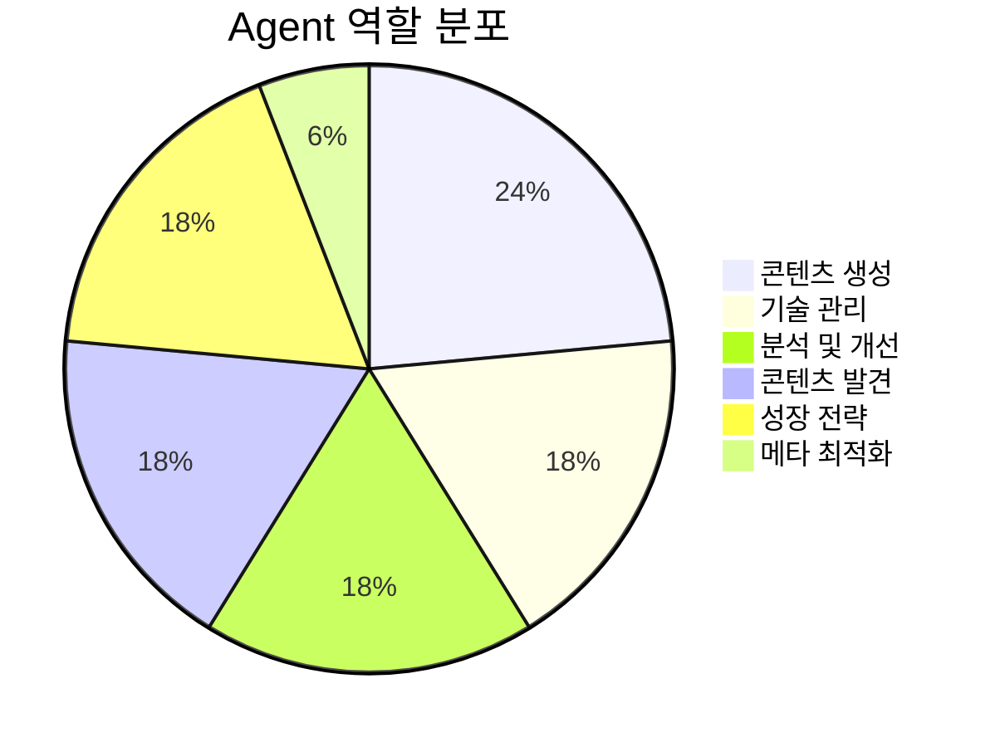
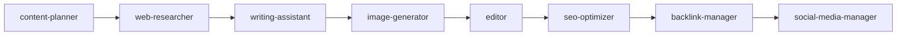
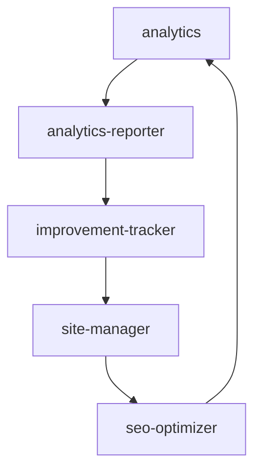
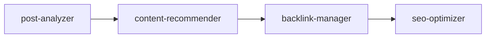

# Agents 분석 보고서

**작성일**: 2025-11-09
**분석 대상**: `.claude/agents/` 디렉토리 (17개 파일)
**총 라인 수**: ~5,900 라인

---

## 목차

1. [개요](#개요)
2. [카테고리별 분류](#카테고리별-분류)
3. [상세 분석](#상세-분석)
4. [협업 패턴](#협업-패턴)
5. [기술 스택 및 통합](#기술-스택-및-통합)
6. [베스트 프랙티스 준수 평가](#베스트-프랙티스-준수-평가)
7. [핵심 발견 사항](#핵심-발견-사항)

---

## 개요

### 통계 요약

| 항목 | 값 |
|------|-----|
| 총 Agent 수 | 17개 |
| 총 라인 수 | ~5,900 라인 |
| 평균 라인 수 | ~347 라인/파일 |
| 최대 파일 크기 | writing-assistant.md (705 라인) |
| 최소 파일 크기 | editor.md (160 라인) |
| 마지막 수정 | 2025-11-08 |

### Agent 역할 분포



---

## 카테고리별 분류

### 1. 콘텐츠 생성 (Content Creation)

#### 1.1 web-researcher
**파일**: `.claude/agents/web-researcher.md` (497 라인)

**역할**: Brave Search MCP를 활용한 전문 리서치 에이전트

**주요 기능**:
- 웹에서 최신 정보 수집 (뉴스, 비디오, 이미지 검색)
- 공식 문서에서 기술 검증
- 인용 및 출처 평가를 포함한 구조화된 리포팅
- 다국어 리서치 (한국어, 일본어, 영어)
- 트렌드 분석 및 심층 연구

**사용 도구**:
- Brave Search MCP (web/news/video/image search)
- Context7 MCP (라이브러리 문서)
- Bash (sleep 명령어로 속도 제한)

**협업 관계**:
- writing-assistant (콘텐츠 작성 지원)
- content-planner (주제 검증)

**특이사항**:
- ⚠️ **필수 제약**: 연속 Brave Search API 호출 사이에 2초 지연 (`sleep 2`) 필수 (속도 제한 방지)

---

#### 1.2 writing-assistant
**파일**: `.claude/agents/writing-assistant.md` (705 라인)

**역할**: 10년 이상 경력의 전문 기술 작가 및 콘텐츠 전략가

**주요 기능**:
- 다국어 기술 블로깅 (한국어, 일본어, 영어)
- 개발자 대상 SEO 최적화
- 기술 정확성 및 코드 예제 검증
- 문화적 현지화 (단순 번역이 아님)
- 리서치 및 이미지 생성 에이전트와 협업 워크플로우

**사용 도구**:
- Read/Write/Edit (콘텐츠 파일)
- Grep/Glob (콘텐츠 검색)
- Bash (빌드 및 미리보기)

**협업 관계**:
- web-researcher (사실 확인)
- image-generator (히어로 이미지 생성)
- editor (콘텐츠 검토)

**핵심 원칙**:
1. <strong>정확성 우선</strong>: 기술 세부사항이나 코드 예제를 날조하지 않음
2. <strong>연구 기반</strong>: Web Researcher를 통해 기술적 주장 검증
3. <strong>문화적 현지화</strong>: 각 언어 버전은 해당 청중을 위해 제작됨
4. <strong>협업 우수성</strong>: 전문 에이전트 활용
5. <strong>SEO & 가독성</strong>: 검색 최적화와 사용자 친화성 균형

---

#### 1.3 editor
**파일**: `.claude/agents/editor.md` (160 라인)

**역할**: 기술 문서 및 다국어 블로그 포스트 전문 콘텐츠 편집자

**주요 기능**:
- 문법, 스타일, 가독성 최적화
- 다국어 편집 (한국어, 일본어, 영어)
- 기술 용어 일관성 검사
- SEO 메타데이터 최적화
- 브랜드 보이스 및 톤 일관성 유지

**사용 도구**:
- Read (콘텐츠 파일)
- Edit (콘텐츠 수정)
- Grep (용어 검색)
- Glob (다중 파일 검토)

**협업 관계**:
- writing-assistant (초안 검토)
- seo-optimizer (메타데이터 최적화)

---

#### 1.4 content-planner
**파일**: `.claude/agents/content-planner.md` (199 라인)

**역할**: 기술 블로그 콘텐츠 기획 및 편집 캘린더 관리 전문 콘텐츠 전략가

**주요 기능**:
- 콘텐츠 주제 아이디어 발굴 및 검증
- 편집 캘린더 기획 (주간/월간/분기별)
- SEO 최적화된 주제 제안 및 키워드 리서치
- Verbalized Sampling을 통한 다양한 주제 발견 (1.8배 개선)
- 경쟁 콘텐츠 및 트렌드 분석

**사용 도구**:
- WebSearch (트렌드 리서치)
- WebFetch (경쟁 분석)
- Read/Write (캘린더 관리)
- Grep (기존 콘텐츠 검색)

**협업 관계**:
- web-researcher (주제 검증)
- analytics (성과 기반 계획)
- seo-optimizer (SEO 전략)

**특이사항**:
- Verbalized Sampling 기법 사용 (k=8, tau=0.12) - 창의적 주제 다양성 확보

---

### 2. 기술 관리 (Technical Management)

#### 2.1 site-manager
**파일**: `.claude/agents/site-manager.md` (215 라인)

**역할**: Astro 정적 사이트 관리 및 배포 자동화 전문 기술 사이트 관리자

**주요 기능**:
- Astro 빌드 자동화 및 CI/CD 파이프라인
- 성능 모니터링 (Core Web Vitals, 빌드 시간)
- 이미지 최적화 및 리소스 관리
- 배포 워크플로우 및 버전 관리
- 기술적 문제 해결 및 유지보수

**사용 도구**:
- Bash (npm 명령어, 빌드 스크립트)
- Read/Write (설정 파일)
- Glob (리소스 탐색)
- WebFetch (배포 상태 확인)

**협업 관계**:
- improvement-tracker (개선 사항 추적)
- seo-optimizer (사이트맵 생성)

---

#### 2.2 image-generator
**파일**: `.claude/agents/image-generator.md` (476 라인)

**역할**: Gemini 2.5 Flash Image API를 사용한 비주얼 콘텐츠 제작자

**주요 기능**:
- 블로그 포스트용 히어로 이미지 자동 생성
- 시각적 다양성을 위한 Verbalized Sampling을 활용한 프롬프트 엔지니어링
- 웹 성능을 위한 이미지 최적화
- writing-assistant 워크플로우와 통합
- `src/assets/blog/`에 체계적인 이미지 자산 관리

**사용 도구**:
- Bash (generate_image.js 스크립트 실행)
- Write/Read (설정 파일)
- Gemini API (generate_image.js를 통해)

**협업 관계**:
- writing-assistant (자동 이미지 생성)

**특이사항**:
- `GEMINI_API_KEY` 환경 변수가 필요한 `generate_image.js` 스크립트 사용
- 모든 이미지는 `src/assets/blog/`에 저장

**사용 예시**:
```bash
node generate_image.js src/assets/blog/hero-image.jpg "Modern tech blog with TypeScript theme"
```

---

#### 2.3 seo-optimizer
**파일**: `.claude/agents/seo-optimizer.md` (189 라인)

**역할**: 개발자 블로그 및 문서 사이트의 기술 SEO 전문가

**주요 기능**:
- 온페이지 SEO 최적화 (메타 태그, 제목, 콘텐츠 구조)
- 다국어 SEO 전략 (hreflang, 언어별 최적화)
- 내부 링크 아키텍처
- 기술 SEO (사이트맵, robots.txt, 구조화된 데이터)
- 키워드 리서치 및 최적화

**사용 도구**:
- Read/Write (사이트맵 및 설정 파일)
- Edit (메타태그 수정)
- Grep (링크 및 메타데이터 검색)
- Glob (모든 콘텐츠 파일 스캔)
- WebFetch (SEO 베스트 프랙티스 조사)

**협업 관계**:
- writing-assistant (메타데이터 최적화)
- backlink-manager (내부 링크 전략)

**핵심 원칙**:
1. <strong>사용자 우선, SEO 차선</strong>: 검색 엔진이 아닌 사람을 위한 최적화
2. <strong>기술적 정확성</strong>: SEO 베스트 프랙티스 및 웹 표준 준수
3. <strong>다국어 우수성</strong>: 언어별 SEO 뉘앙스 존중
4. <strong>데이터 기반</strong>: SEO 연구 및 분석을 기반으로 한 권장 사항
5. <strong>미래 지향적</strong>: 블랙햇 전술 회피, 지속 가능한 SEO 집중

---

### 3. 분석 및 개선 (Analytics & Improvement)

#### 3.1 analytics
**파일**: `.claude/agents/analytics.md` (239 라인)

**역할**: 블로그 성능 지표 및 성장 분석 전문 데이터 분석가

**주요 기능**:
- 트래픽 분석 및 사용자 행동 추적
- 콘텐츠 성능 측정
- 전환 최적화
- 데이터 시각화 및 리포팅
- 트렌드 식별 및 예측

**사용 도구**:
- Read (분석 데이터)
- Write (리포트)
- Bash (분석 스크립트)
- WebFetch (외부 분석 데이터)

**협업 관계**:
- analytics-reporter (리포트 생성)
- content-planner (성과 기반 계획)
- improvement-tracker (개선 추적)

---

#### 3.2 analytics-reporter
**파일**: `.claude/agents/analytics-reporter.md` (306 라인)

**역할**: 블로그 포스트 형식의 종합 블로그 분석 리포트 생성 전문 데이터 분석가 및 기술 작가

**주요 기능**:
- MCP 도구를 사용한 GA4 데이터 수집 (8개 필수 쿼리)
- 이전/이후 비교를 통한 데이터 기반 인사이트
- 실행 가능한 권장 사항 및 구체적인 액션 플랜
- KPI 추적을 포함한 전문 블로그 포스트 형식
- 다기간 비교 (주간 대비, 월간 대비)

**사용 도구**:
- Google Analytics 4 MCP
- Read (참고 리포트)
- Write (블로그 포스트 생성)

**협업 관계**:
- improvement-tracker (액션 아이템 추적)
- analytics (데이터 소스)

**특이사항**:
- Property ID: 395101361
- 내부 리포트가 아닌 공개 블로그 포스트 생성

---

#### 3.3 improvement-tracker
**파일**: `.claude/agents/improvement-tracker.md` (417 라인)

**역할**: 블로그 개선 사항 추적 및 사이트 진화 문서화 전문 프로젝트 매니저

**주요 기능**:
- 액션 플랜을 구조화된 추적이 가능한 TODO로 변환
- 상태 업데이트를 통한 진행 모니터링
- ROI 계산을 통한 이전/이후 영향 측정
- 종합 개선 이력 유지
- 시각적 타임라인 및 영향 대시보드 생성

**사용 도구**:
- Read/Write (추적 파일)
- Edit (상태 업데이트)
- Bash (자동화된 추적)

**협업 관계**:
- analytics-reporter (액션 아이템 수신)
- site-manager (기술 개선)
- seo-optimizer (SEO 개선)

**특이사항**:
- `improvement-tracking/` 디렉토리 관리
  - `active-todos.md`
  - `completed-todos.md`
  - `improvement-history.md`
- `src/pages/improvement-history.astro` 업데이트

---

### 4. 콘텐츠 발견 (Content Discovery)

#### 4.1 post-analyzer
**파일**: `.claude/agents/post-analyzer.md` (316 라인)

**역할**: 추천 시스템을 위한 블로그 포스트 구조화된 메타데이터 추출 전문 콘텐츠 분석 에이전트

**주요 기능**:
- 블로그 포스트 심층 콘텐츠 분석 (markdown/MDX)
- 메타데이터 추출 (요약, 주제, 기술 스택, 난이도, 카테고리 점수)
- 포스트 언어로 200자 요약 생성
- 5개 카테고리 관련성 점수화 (automation, web-dev, ai-ml, devops, architecture)
- 추천 시스템 데이터 품질 보증

**사용 도구**:
- Read (블로그 포스트 콘텐츠)
- Write (메타데이터 JSON 출력)

**협업 관계**:
- content-recommender (메타데이터 제공)

**특이사항**:
- 마크다운 펜스 없이 유효한 JSON만 출력
- `/analyze-posts` 커맨드에서 사용됨

**출력 형식**:
```json
{
  "summary": "200자 이내 요약",
  "topics": ["주제1", "주제2"],
  "techStack": ["기술1", "기술2"],
  "difficulty": "beginner|intermediate|advanced",
  "categoryScores": {
    "automation": 0.8,
    "web-dev": 0.6,
    ...
  }
}
```

---

#### 4.2 content-recommender
**파일**: `.claude/agents/content-recommender.md` (462 라인)

**역할**: 의미론적 이해를 사용한 블로그 포스트 유사성 분석 및 지능형 콘텐츠 추천 전문 에이전트

**주요 기능**:
- 다차원 분석 (주제 유사성, 기술 스택, 난이도, 목적, 보완 관계)
- 의미론적 이해 (키워드 매칭을 넘어 진정한 의미와 맥락 이해)
- 다국어 지원 (한국어, 영어, 일본어 콘텐츠 동등하게 처리)
- 설명 가능한 추천 (왜 포스트가 관련되는지 명확한 이유 제공)

**분석 프레임워크** (가중치):
1. **주제 유사성** (40%): 핵심 주제, 공유 개념, 문제 도메인, 기술 중복
2. **기술 스택** (25%): 주요 기술, 도구 및 플랫폼, 생태계 정렬
3. **난이도** (15%): 초급, 중급, 고급 (동일하거나 다음 난이도 선호)
4. **목적 정렬** (10%): 튜토리얼, 분석, 참고, 사례 연구
5. **보완 관계** (10%): 시리즈 감지, 기초→고급, 문제→해결

**사용 도구**:
- Read (블로그 포스트)
- Write (추천 JSON)

**협업 관계**:
- post-analyzer (메타데이터 소스)

**특이사항**:
- **중요한 시간적 제약**: 제공된 후보 목록에서만 추천 (cutoff date 필터링됨)
- 각 소스 포스트당 정확히 5개 추천 (임계값 0.3 이상)

---

#### 4.3 backlink-manager
**파일**: `.claude/agents/backlink-manager.md` (294 라인)

**역할**: 내부 링크 구조 및 상호 참조 관리 전문 콘텐츠 상호 연결 전문가

**주요 기능**:
- 새 포스트 게시 시 자동 미리보기→링크 변환
- 탐색 섹션이 있는 시리즈 포스트 관리
- 역방향 백링크 추적 (관련 포스트 섹션)
- 다국어 링크 일관성 (ko/en/ja)
- SEO를 위한 링크 그래프 최적화

**사용 도구**:
- Read (기존 포스트)
- Edit (링크 변환)
- Grep (미리보기 패턴 검색)
- Glob (모든 블로그 포스트)

**협업 관계**:
- writing-assistant (포스트 작성 워크플로우)
- seo-optimizer (내부 링크 전략)

**특이사항**:
- `/write-post` 워크플로우의 최종 단계로 통합
- 패턴 검색: '다음 글 예고:', 'Coming Next:', '次回予告:'

---

### 5. 성장 전략 (Growth Strategy)

#### 5.1 portfolio-curator
**파일**: `.claude/agents/portfolio-curator.md` (346 라인)

**역할**: 개발자 포트폴리오 관리 및 전문 브랜딩 전문 커리어 전략가

**주요 기능**:
- 프로젝트 문서화 및 쇼케이스
- 숙련도 레벨을 포함한 기술 스킬 제시
- 메트릭을 포함한 성과 강조
- 전문 내러티브 제작
- 분기별 포트폴리오 업데이트

**사용 도구**:
- Read (프로젝트 파일)
- Write (포트폴리오 페이지)
- Edit (포트폴리오 업데이트)
- Grep (프로젝트 검색)
- Bash (Git 히스토리 분석)

**협업 관계**:
- learning-tracker (기술 성장 추적)
- analytics (프로젝트 영향 측정)

---

#### 5.2 learning-tracker
**파일**: `.claude/agents/learning-tracker.md` (402 라인)

**역할**: 기술 스킬 습득 및 지식 관리 전문 개인 개발 코치

**주요 기능**:
- SMART 학습 목표 설정 및 추적
- 새로운 기술 트렌드 모니터링 (GitHub 트렌딩, 컨퍼런스)
- 학습 리소스 큐레이션 (강좌, 튜토리얼, 책)
- 진행 추적 및 책임
- 스킬 갭 분석 및 성장 측정

**사용 도구**:
- Read/Write (학습 로그)
- WebSearch (기술 트렌드)
- WebFetch (리소스 수집)
- Grep (학습 히스토리 검색)

**협업 관계**:
- web-researcher (트렌드 검증)
- content-planner (학습 기반 콘텐츠 계획)
- portfolio-curator (기술 전시)

---

#### 5.3 social-media-manager
**파일**: `.claude/agents/social-media-manager.md` (276 라인)

**역할**: 플랫폼 간 기술 블로그 콘텐츠 확대 전문 소셜 미디어 전략가

**주요 기능**:
- 플랫폼별 스니펫 생성 (Twitter/X, LinkedIn, Facebook, Instagram)
- 최적 타이밍을 고려한 자동 블로그 포스트 공유
- 커뮤니티 참여 모니터링
- 해시태그 전략 및 최적화
- 한국 플랫폼 교차 게시 (Tistory, Brunch)

**사용 도구**:
- Read (블로그 포스트)
- Write (소셜 스니펫)
- WebFetch (트렌드, 해시태그)
- Bash (자동화 스크립트)

**협업 관계**:
- content-planner (게시 일정)
- analytics (소셜 성과 추적)

---

### 6. 메타 최적화 (Meta Optimization)

#### 6.1 prompt-engineer
**파일**: `.claude/agents/prompt-engineer.md` (228 라인)

**역할**: LLM 및 AI 시스템을 위한 전문 프롬프트 최적화, 프롬프트 패턴 및 기법 마스터

**주요 기능**:
- 프롬프트 최적화 (few-shot, zero-shot, chain-of-thought)
- 다양성을 위한 Verbalized Sampling (1.6-2.1배 개선)
- 모델별 최적화 (Claude, GPT, 오픈 모델)
- 프롬프트 체이닝 및 파이프라인
- Constitutional AI 원칙 적용

**사용 도구**:
- Read (기존 프롬프트)
- Write (새 프롬프트)
- Edit (프롬프트 개선)

**협업 관계**:
- 모든 에이전트 (프롬프트 최적화가 필요한)

**특이사항**:
- 항상 완전한 프롬프트 텍스트를 표시, 설명만 하지 않음
- Opus 모델 사용
- Verbalized Sampling 전문 (k=3-10, tau=0.05-0.20)

---

## 협업 패턴

### 주요 워크플로우

#### 1. 콘텐츠 제작 파이프라인



**설명**:
1. content-planner: 주제 선정 및 계획
2. web-researcher: 최신 정보 리서치
3. writing-assistant: 다국어 콘텐츠 작성
4. image-generator: 히어로 이미지 생성
5. editor: 콘텐츠 검토 및 편집
6. seo-optimizer: 메타데이터 최적화
7. backlink-manager: 내부 링크 추가
8. social-media-manager: 소셜 미디어 배포

---

#### 2. 분석 및 개선 루프



**설명**:
1. analytics: 데이터 수집 및 분석
2. analytics-reporter: 인사이트 리포트 생성
3. improvement-tracker: 액션 아이템 추적
4. site-manager: 기술적 개선 구현
5. seo-optimizer: SEO 최적화 적용
6. analytics: 영향 측정 (루프)

---

#### 3. 콘텐츠 발견 시스템



**설명**:
1. post-analyzer: 포스트 메타데이터 추출
2. content-recommender: 의미론적 추천 생성
3. backlink-manager: 내부 링크 생성
4. seo-optimizer: 링크 구조 최적화

---

### 협업 매트릭스

| Agent | 주요 협업 대상 | 협업 유형 |
|-------|----------------|-----------|
| writing-assistant | web-researcher, image-generator, editor | 순차적 |
| web-researcher | writing-assistant, content-planner | 요청-응답 |
| content-recommender | post-analyzer | 데이터 파이프라인 |
| analytics-reporter | improvement-tracker | 액션 아이템 전달 |
| backlink-manager | writing-assistant, seo-optimizer | 통합 워크플로우 |
| prompt-engineer | 모든 에이전트 | 메타 최적화 |

---

## 기술 스택 및 통합

### MCP 서버 사용

| MCP 서버 | 사용 Agent | 용도 |
|----------|------------|------|
| **Brave Search MCP** | web-researcher | 웹/뉴스/비디오/이미지 검색 |
| **Google Analytics 4 MCP** | analytics-reporter | GA4 데이터 수집 (8개 쿼리) |
| **Context7 MCP** | web-researcher | 라이브러리 공식 문서 |
| **Gemini API** | image-generator | 히어로 이미지 생성 |

### 핵심 커맨드 통합

| 커맨드 | 사용 Agent | 설명 |
|--------|------------|------|
| `/write-post` | writing-assistant, image-generator, backlink-manager | 블로그 포스트 작성 전체 워크플로우 |
| `/analyze-posts` | post-analyzer | 포스트 메타데이터 분석 |
| `/generate-recommendations` | content-recommender | 의미론적 추천 생성 |

### 특수 기법

#### 1. Verbalized Sampling
**사용 Agent**:
- image-generator (이미지 프롬프트 다양성)
- content-planner (주제 다양성, 1.8배 개선)
- prompt-engineer (프롬프트 최적화, 1.6-2.1배 개선)

**파라미터**:
- k: 3-10 (샘플 수)
- tau: 0.05-0.20 (온도)

**효과**: 창의적 다양성 1.5-2.1배 향상

---

#### 2. Rate Limiting
**사용 Agent**: web-researcher

**제약**:
```bash
# Brave Search API 호출 사이에 필수
sleep 2
```

**이유**: API 속도 제한 방지

---

#### 3. Multi-Language Support
**지원 Agent**:
- writing-assistant (ko/en/ja 동시 작성)
- content-recommender (다국어 추천 이유)
- seo-optimizer (언어별 SEO)
- editor (다국어 편집)

**특징**: 단순 번역이 아닌 문화적 현지화

---

## 베스트 프랙티스 준수 평가

### ✅ 준수 사항

1. **명확한 역할 정의**: 모든 Agent가 "Role" 섹션으로 시작
2. **구조화된 문서**: 일관된 섹션 구조 (역할, 기능, 도구, 협업)
3. **협업 명시**: 다른 Agent와의 관계를 명확히 기술
4. **다국어 지원**: 한국어 설명 + 영어 원칙 혼용
5. **도구 제한 명시**: 사용 가능한 도구 목록 제공
6. **특수 제약 문서화**: rate limiting, API 키 등 명시

### ⚠️ 개선 가능 사항

1. **파일 크기 편차**: 160라인(editor) ~ 705라인(writing-assistant)
   - 권장: 간결성 유지 (Claude Code Best Practices)
   - 제안: 긴 Agent는 별도 참고 문서로 분리

2. **중복 가능성**:
   - analytics vs analytics-reporter (역할 중복?)
   - 제안: 명확한 책임 구분 필요

3. **명명 일관성**:
   - 대부분 하이픈 사용 (good)
   - 일부 설명이 영어/한국어 혼용
   - 제안: 일관된 언어 정책 수립

4. **버전 관리 부재**:
   - Agent 변경 이력 없음
   - 제안: 주요 변경사항 문서화

---

## 핵심 발견 사항

### 강점

1. **전문화된 에이전트 라이브러리**: 17개의 잘 정의된 전문 에이전트
2. **명확한 협업 구조**: 에이전트 간 워크플로우가 체계적
3. **최신 기술 적용**: Verbalized Sampling, MCP 서버 통합
4. **다국어 우선 설계**: 한국어, 영어, 일본어 동등 지원
5. **실용적 통합**: 실제 `/write-post` 등 커맨드와 연계

### 약점

1. **문서 길이 불균형**: 일부 Agent가 과도하게 길어 컨텍스트 비효율적
2. **중복 가능성**: 유사 역할 Agent 간 명확한 구분 필요
3. **의존성 문서 부족**: 어떤 Agent가 필수/선택인지 불명확
4. **테스트 가이드 없음**: Agent 동작 검증 방법 부재

### 기회

1. **자동화 확대**: 더 많은 워크플로우 자동화 가능
2. **에이전트 체이닝**: 복잡한 작업을 위한 자동 체인 구성
3. **성능 메트릭**: Agent 효율성 측정 및 최적화
4. **커뮤니티 공유**: 우수 사례를 오픈소스로 공개

### 위협

1. **유지보수 부담**: 17개 Agent의 일관성 유지 어려움
2. **컨텍스트 오버헤드**: 너무 많은 Agent가 성능 저하 가능
3. **MCP 의존성**: MCP 서버 장애 시 영향 범위 큼
4. **API 비용**: Brave Search, Gemini API 비용 증가 가능성

---

## 추천 사항

### 즉시 적용 가능 (Quick Wins)

1. **긴 Agent 분리**: writing-assistant, web-researcher 등을 핵심 + 참고 문서로 분리
2. **README 추가**: `.claude/agents/README.md`에 전체 개요 및 사용 가이드 작성
3. **템플릿 표준화**: 새 Agent 추가 시 사용할 템플릿 생성

### 단기 개선 (1-2주)

1. **중복 분석**: analytics vs analytics-reporter 역할 재정의
2. **의존성 맵**: Agent 간 필수/선택 관계 문서화
3. **테스트 가이드**: 각 Agent 동작 검증 방법 작성
4. **메트릭 추가**: Agent 호출 빈도, 성공률 측정

### 장기 개선 (1-2개월)

1. **Agent 버전 관리**: 변경 이력 및 deprecation 정책
2. **자동화 확대**: Agent 체이닝 및 자동 워크플로우
3. **성능 최적화**: 컨텍스트 크기 최적화, 불필요한 Agent 제거
4. **커뮤니티 기여**: 우수 사례를 블로그 포스트 및 오픈소스로 공유

---

**작성 완료**: 2025-11-09
**다음 단계**: SKILLS.md 작성
