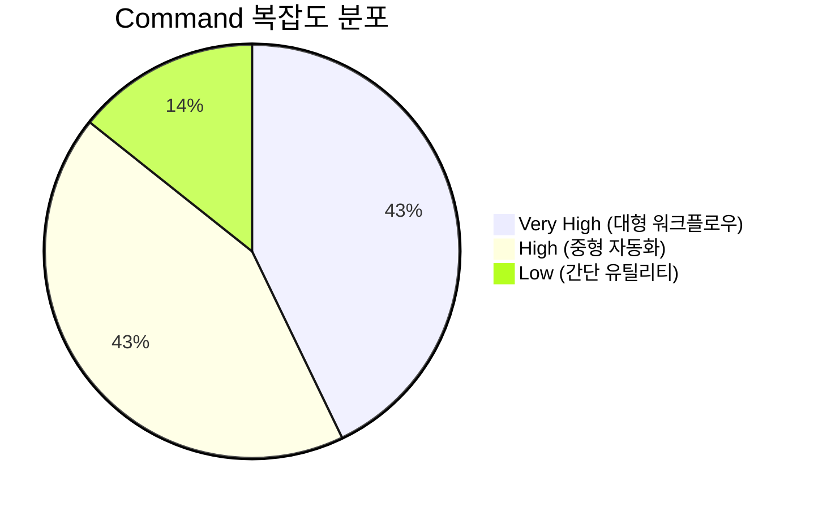

# Commands 분석 보고서

**작성일**: 2025-11-09
**분석 대상**: `.claude/commands/` 디렉토리 (7개 파일)
**총 라인 수**: 3,908 라인
**평균 복잡도**: Medium-High

---

## 목차

1. [개요](#개요)
2. [복잡도별 분류](#복잡도별-분류)
3. [상세 분석](#상세-분석)
4. [통합 워크플로우](#통합-워크플로우)
5. [비용 최적화 전략](#비용-최적화-전략)
6. [베스트 프랙티스 평가](#베스트-프랙티스-평가)
7. [아키텍처 인사이트](#아키텍처-인사이트)
8. [개선 제안](#개선-제안)

---

## 개요

### 통계 요약

| 항목 | 값 |
|------|-----|
| 총 Command 수 | 7개 |
| 총 라인 수 | 3,908 라인 |
| 평균 라인 수/커맨드 | ~558 라인 |
| 최대 파일 크기 | write-post.md (1,080 라인) |
| 최소 파일 크기 | commit.md (11 라인) |
| 마지막 수정 | 2025-11-09 |

### Command 분포



### 목적별 분류

| 카테고리 | Commands | 개수 |
|----------|----------|------|
| **콘텐츠 생성** | write-post, write-post-ko, write-ga-post | 3 |
| **콘텐츠 분석** | analyze-posts, generate-recommendations | 2 |
| **콘텐츠 기획** | next-post-recommendation | 1 |
| **유틸리티** | commit | 1 |

---

## 복잡도별 분류

### 1. Low Complexity (1개)

#### commit
**라인 수**: 11 라인
**복잡도**: ⭐☆☆☆☆

**목적**: 간단한 Git 커밋 자동화

**특징**:
- 인자 없이 자동으로 staged changes 분석
- 커밋 메시지 자동 생성 (요약 + 상세)
- 단일 도구 사용 (Bash/Git)

**워크플로우**:
```
1. git status로 staged changes 확인
2. 변경 사항 분석하여 커밋 메시지 생성
3. git commit 실행
```

**사용 예시**:
```bash
/commit
```

---

### 2. High Complexity (3개)

#### 2.1 analyze-posts
**라인 수**: 444 라인
**복잡도**: ⭐⭐⭐⭐☆

**파일**: `.claude/commands/analyze-posts.md`

**목적**: 블로그 포스트 메타데이터 자동 생성으로 추천 시스템의 토큰 사용량 60-70% 절감

**인자**:
- `--force`: 전체 재생성
- `--post <slug>`: 특정 포스트만 분석
- `--verify`: 기존 메타데이터 검증
- `--language` (deprecated): 언어별 분석 (한국어만 분석으로 변경)

**통합**:
- **Agent**: post-analyzer
- **Skill**: content-analyzer
- **도구**: Read, Write, Bash

**워크플로우**:

```
Phase 1: 포스트 수집
  └─> Astro Content Collections에서 한국어(ko) 포스트만 수집
      ├─ 중복 방지 (ja, en 제외)
      └─ 3배 비용 절감

Phase 2: 증분 처리
  └─> 기존 metadata 로드
      ├─ Content hash로 변경 감지 (SHA-256)
      ├─ 변경 없으면 스킵
      └─ 변경 시에만 재분석

Phase 3: 메타데이터 추출
  └─> Post Analyzer 에이전트 호출
      ├─ summary (200자)
      ├─ mainTopics (5개)
      ├─ techStack (5개)
      ├─ difficulty (1-5)
      └─ categoryScores (automation, web-dev, ai-ml, devops, architecture)

Phase 4: 검증 및 저장
  └─> 스키마 검증
      ├─ 품질 체크
      ├─ post-metadata.json 저장
      └─ Git 커밋 (선택)
```

**출력 형식** (`post-metadata.json`):
```json
{
  "slug": "post-slug",
  "fullId": "ko/post-name",
  "language": "ko",
  "title": "제목",
  "description": "설명",
  "summary": "200자 요약",
  "mainTopics": ["주제1", "주제2", "주제3", "주제4", "주제5"],
  "techStack": ["기술1", "기술2", "기술3", "기술4", "기술5"],
  "difficulty": 3,
  "categoryScores": {
    "automation": 0.8,
    "web-development": 0.6,
    "ai-ml": 0.9,
    "devops": 0.3,
    "architecture": 0.5
  },
  "contentHash": "abc123...",
  "generatedAt": "2025-11-09T10:00:00Z"
}
```

**성능 메트릭**:
- **토큰 사용량**:
  - 이전 (전체 콘텐츠): 78,000 토큰
  - 이후 (메타데이터): 28,600 토큰
  - **절감**: 60-70%
- **처리 시간**:
  - 신규 포스트: 8-12초
  - 전체 재생성 (13개 포스트): 약 2분
- **비용**: ~$0.09 (13개 포스트)
- **Break-even Point**: 2회 추천 실행 후 회수

**핵심 혁신**:
1. ✅ **한국어만 분석**: 3개 언어 중 한국어만 분석하여 3배 비용 절감
2. ✅ **증분 업데이트**: Content hash로 변경 감지, 불필요한 재분석 방지
3. ✅ **메타데이터 우선**: 전체 콘텐츠 대신 메타데이터 사용으로 60-70% 토큰 절감

---

#### 2.2 generate-recommendations
**라인 수**: 514 라인
**복잡도**: ⭐⭐⭐⭐☆

**파일**: `.claude/commands/generate-recommendations.md`

**목적**: Claude LLM 기반 의미론적 콘텐츠 추천 자동 생성

**인자**:
- `--force`: 전체 재생성
- `--language <ko|ja|en>`: 특정 언어만 처리
- `--post <slug>`: 특정 포스트만 처리
- `--threshold <0.0-1.0>`: 최소 유사도 점수 (기본 0.3)
- `--count <n>`: 추천 개수 (기본 5)
- `--explain`: 상세 추론 과정 출력

**통합**:
- **Agent**: content-recommender
- **Skill**: (메타데이터 기반 처리)
- **도구**: Read, Write, Bash

**워크플로우**:

```
Phase 1: 데이터 준비
  └─> post-metadata.json 로드
      ├─ 없으면 /analyze-posts 실행 제안
      ├─ 기존 recommendations.json 로드
      └─ 증분 업데이트용

Phase 2: 의미론적 분석
  └─> Content Recommender 에이전트 호출
      ├─ 메타데이터 기반 유사도 분석 (전체 콘텐츠 X)
      ├─ 6개 차원 평가:
      │   ├─ topic (주제 유사성, 40%)
      │   ├─ purpose (목적 정렬, 10%)
      │   ├─ techStack (기술 스택, 25%)
      │   ├─ difficulty (난이도, 15%)
      │   ├─ category (카테고리, 설명 없음)
      │   └─ complementary (보완 관계, 10%)
      └─ JSON 형식 반환

Phase 3: 추천 집계
  └─> 추천 결과 처리
      ├─ 언어 prefix 없는 base slug 사용
      ├─ 다국어 reason 포함 (ko, ja, en)
      ├─ similarity score 및 type
      └─ recommendations.json 저장

Phase 4: 품질 리포트
  └─> 통계 및 메트릭 생성
      ├─ 평균 유사도 점수
      ├─ 고품질 매칭 개수 (>0.8)
      ├─ 포스트당 평균 추천 개수
      └─ Git 커밋 (선택)
```

**출력 형식** (`recommendations.json`):
```json
{
  "recommendations": {
    "post-slug": {
      "related": [
        {
          "slug": "related-post",
          "score": 0.92,
          "reason": {
            "ko": "두 글 모두 MCP 서버를 활용한...",
            "ja": "両記事ともMCPサーバーを活用した...",
            "en": "Both posts cover MCP server-based..."
          },
          "type": "similar-topic"
        }
      ],
      "generatedAt": "2025-11-09T10:00:00Z",
      "evaluatedBy": "claude-sonnet-4.5"
    }
  },
  "metadata": {
    "totalPosts": 30,
    "lastGenerated": "2025-11-09T10:00:00Z",
    "modelVersion": "claude-sonnet-4.5",
    "minThreshold": 0.3,
    "maxRecommendations": 5,
    "generation": {
      "processedPosts": 30,
      "skippedPosts": 0,
      "averageRecommendations": 4.7,
      "totalDuration": "2분 5초"
    }
  }
}
```

**성능 메트릭**:
- **평균 유사도 점수**: 0.68
- **고품질 매칭** (>0.8): 45개
- **포스트당 평균 추천**: 4.7개
- **처리 시간**: 2분 5초 (30개 포스트)
- **비용**:
  - 이전: $0.07-0.08
  - 이후 (메타데이터): $0.02-0.03
  - **절감**: 60-70%

**목표 지표**:
- **CTR (Click-Through Rate)**: 18-25%
- **Session Depth**: +30-50%
- **Time on Site**: +40-60%

**핵심 혁신**:
1. ✅ **LLM 기반 의미론적 분석**: TF-IDF 대신 Claude LLM으로 진정한 의미 이해
2. ✅ **6차원 유사도 평가**: 다각도 분석으로 정교한 추천
3. ✅ **다국어 추론**: 각 언어로 추천 이유 작성
4. ✅ **메타데이터 기반**: 60-70% 토큰 절감

---

#### 2.3 next-post-recommendation
**라인 수**: 551 라인
**복잡도**: ⭐⭐⭐⭐☆

**파일**: `.claude/commands/next-post-recommendation.md`

**목적**: AI 기반 트렌드 분석 및 콘텐츠 갭 분석으로 다음 블로그 주제 10개 추천

**인자**:
- `--count <number>`: 추천 개수 (기본 10, 최대 20)
- `--category <name>`: 특정 카테고리 필터링
- `--difficulty <1-5>`: 난이도 필터링
- `--language <ko|ja|en>`: 언어별 추천

**통합**:
- **Agent**: content-planner
- **Skill**: trend-analyzer
- **도구**: Read, Write, WebSearch

**워크플로우**:

```
Phase 1: 기존 콘텐츠 분석
  └─> post-metadata.json 분석
      ├─ 카테고리 분포 확인
      ├─ 기술 스택 커버리지
      ├─ 난이도 밸런스
      └─ 주제 클러스터

Phase 2: 트렌드 리서치
  └─> Trend Analyzer Skill 호출
      ├─ Brave Search MCP로 웹 트렌드 검색
      ├─ 24시간 캐싱 (중복 검색 방지)
      ├─ 기술 트렌드, 프레임워크 업데이트
      ├─ 베스트 프랙티스 수집
      └─ 2초 지연 (Rate Limit 준수)

Phase 3: 콘텐츠 갭 식별
  └─> 기존 vs 트렌드 비교
      ├─ 미다룬 주제 식별
      ├─ 부족한 카테고리 확인
      ├─ 난이도 불균형 탐지
      └─ 우선순위 계산

Phase 4: 추천 생성
  └─> Content Planner 에이전트 호출
      ├─ 트렌드와 블로그 전략 매칭
      ├─ 실행 가능한 주제 10개 생성
      ├─ 각 주제당:
      │   ├─ title
      │   ├─ category
      │   ├─ difficulty
      │   ├─ rationale (선정 이유)
      │   ├─ keyPoints (주요 포인트)
      │   └─ targetAudience (대상 독자)
      └─ 다국어 리포트 저장
```

**출력 형식** (`content-recommendations-{date}.md`):
```markdown
# 블로그 콘텐츠 추천 (2025-11-09)

## 1. Claude Code와 MCP 서버 통합 가이드

- **카테고리**: ai-ml
- **난이도**: 3 (Intermediate)
- **선정 이유**: MCP 서버가 최근 트렌드이며, 실전 활용 사례 부족
- **주요 포인트**:
  - Brave Search MCP 통합
  - Context7 MCP 활용
  - 커스텀 MCP 서버 개발
- **대상 독자**: Claude Code 중급 사용자

...
```

**사용 시나리오**:
- **주간**: 신규 포스트 1개 주제 선정
- **월간**: 전체 재분석 및 20개 주제 생성
- **분기**: 카테고리별 전략 계획

**핵심 혁신**:
1. ✅ **실시간 웹 트렌드**: Brave Search로 최신 정보 수집
2. ✅ **24시간 캐싱**: 반복 검색 방지
3. ✅ **콘텐츠 갭 자동 분석**: 부족한 주제 자동 식별
4. ✅ **실행 가능한 추천**: 상세한 keyPoints 제공

---

### 3. Very High Complexity (3개)

#### 3.1 write-post
**라인 수**: 1,080 라인
**복잡도**: ⭐⭐⭐⭐⭐

**파일**: `.claude/commands/write-post.md`

**목적**: 영어 전용 블로그 포스트 작성 전체 워크플로우 자동화

**인자**:
- `<topic>` (필수): 포스트 주제
- `--tags`: 태그 (쉼표 구분)
- `--languages`: 언어 (기본 ko,ja,en)
- `--description`: 포스트 설명

**통합**:
- **Agents**: writing-assistant, web-researcher, image-generator, backlink-manager
- **Skills**: blog-writing
- **도구**: Read, Write, Edit, Bash, WebSearch

**워크플로우** (8 Phases):

```
Phase 1: Research & Planning
  └─> Web Researcher 에이전트
      ├─ Brave Search MCP로 최신 정보 수집
      ├─ 2초 지연 (Rate Limit)
      ├─ 공식 문서 검증
      ├─ 트렌드 논의 확인
      ├─ 코드 예제 수집
      └─ 콘텐츠 구조 작성

Phase 2: Image Generation
  └─> Image Generator 에이전트
      ├─ Gemini API 사용 (GEMINI_API_KEY 필요)
      ├─ 주제 기반 프롬프트 생성
      ├─ 히어로 이미지 생성
      └─ src/assets/blog/[slug]-hero.[ext] 저장

Phase 3: Content Writing (Multi-language)
  └─> Writing Assistant 에이전트
      ├─ 한국어, 일본어, 영어 버전 동시 작성
      ├─ 현지화 (번역 아님)
      ├─ SEO 가이드라인 준수:
      │   ├─ Korean: title 25-30자, description 70-80자
      │   ├─ English: title 50-60자, description 150-160자
      │   └─ Japanese: title 30-35자, description 80-90자
      ├─ 코드 예제, 실용적 팁 포함
      └─ Mermaid 다이어그램 (flowcharts)

Phase 4: Frontmatter & Metadata
  └─> Blog Writing Skill
      ├─ pubDate: 'YYYY-MM-DD' 형식 (작은따옴표)
      ├─ heroImage: 상대 경로 (../../../assets/blog/)
      ├─ tags: 소문자, 영숫자+하이픈
      └─ 필수 필드 검증

Phase 5: Metadata Generation
  └─> Post Analyzer 에이전트
      ├─ difficulty (1-5) 결정
      ├─ categoryScores 계산 (5개 카테고리: 0.0-1.0)
      └─ post-metadata.json 업데이트

Phase 6: V3 Recommendations
  └─> scripts/generate-recommendations-v3.js 실행
      ├─ 메타데이터 기반 유사도 계산
      │   ├─ difficulty: 20% 가중치
      │   └─ categoryScores: 80% 가중치
      ├─ 상위 5개 관련 포스트 선정
      └─ frontmatter의 relatedPosts에 추가

Phase 7: Backlink Updates (Optional)
  └─> Backlink Manager 에이전트
      ├─ 관련 포스트 업데이트
      ├─ 미리보기→링크 변환
      └─ 상호 링크 생성

Phase 8: Validation & Build
  └─> 검증 및 빌드
      ├─ npm run astro check
      ├─ npm run build
      ├─ 파일 경로 반환
      └─ 메타데이터 요약
```

**출력 파일**:
```
src/content/blog/ko/[slug].md
src/content/blog/ja/[slug].md
src/content/blog/en/[slug].md
src/assets/blog/[slug]-hero.[ext]
post-metadata.json (업데이트)
```

**관련 파일**:
- **Agents**: writing-assistant.md, web-researcher.md, image-generator.md, backlink-manager.md
- **Guidelines**: seo-title-description-guidelines.md
- **Scripts**: generate-recommendations-v3.js, similarity.js
- **Data**: post-metadata.json
- **Components**: RelatedPosts.astro, BlogPost.astro
- **Config**: src/content.config.ts, astro.config.mjs

**핵심 혁신**:
1. ✅ **완전 자동화**: 리서치부터 빌드까지 전 과정 자동화
2. ✅ **다국어 동시 작성**: 번역이 아닌 현지화
3. ✅ **AI 이미지 생성**: Gemini API로 히어로 이미지 자동 생성
4. ✅ **V3 추천 시스템**: 메타데이터 기반 유사도 계산 (frontmatter 통합)
5. ✅ **SEO 최적화**: 언어별 가이드라인 준수
6. ✅ **자동 백링크**: 관련 포스트 상호 연결

---

#### 3.2 write-post-ko
**라인 수**: 1,063 라인
**복잡도**: ⭐⭐⭐⭐⭐

**파일**: `.claude/commands/write-post-ko.md`

**목적**: 한국어 전용 블로그 포스트 작성 자동화 (`write-post.md`의 한국어 버전)

**차이점**:
- 모든 설명이 한국어
- 한국어 SEO 가이드라인 강조
- 한국 플랫폼 (Tistory, Brunch) 언급

**워크플로우**: `write-post`와 동일 (8 Phases)

**특이사항**:
- 기능적으로는 `write-post`와 동일
- 언어별 로컬라이제이션 고려한 별도 커맨드

---

#### 3.3 write-ga-post
**라인 수**: 745 라인
**복잡도**: ⭐⭐⭐⭐⭐

**파일**: `.claude/commands/write-ga-post.md`

**목적**: Google Analytics 데이터 기반 분석 리포트를 다국어 블로그 포스트로 자동 생성

**인자**:
- `<analysis-date>` (필수): 분석 날짜 (YYYY-MM-DD)
- `--period`: 분석 주기 (weekly/monthly/quarterly/custom)
- `--start-date`: 커스텀 시작 날짜
- `--languages`: 생성할 언어 (기본 ko,ja,en)
- `--skip-improvement-tracking`: TODO 생성 스킵

**통합**:
- **Agents**: analytics-reporter, improvement-tracker
- **Skills**: (GA4 MCP 직접 사용)
- **도구**: Read, Write, mcp__analytics-mcp__*

**워크플로우** (6 Phases):

```
Phase 1: 분석 기간 자동 결정
  └─> 이전 리포트 조회
      ├─ 최신 GA 리포트 pubDate 찾기
      ├─ 없으면 블로그 시작일(2025-10-06) 사용
      ├─ weekly/monthly/quarterly 자동 분류
      └─ 분석 기간 계산

Phase 2: GA4 데이터 수집
  └─> Analytics Reporter 에이전트
      ├─ GA4 MCP 서버 호출 (Property ID: 395101361)
      ├─ 주요 지표 수집:
      │   ├─ 총 방문자 수
      │   ├─ 세션 수
      │   ├─ 평균 세션 지속 시간
      │   ├─ 바운스율
      │   └─ 전환율
      ├─ 인기 페이지 분석
      ├─ 트래픽 소스 분석
      └─ 이전 기간 대비 비교

Phase 3: 개선 이력 분석
  └─> 개선 효과 추적
      ├─ improvement-history.astro 읽기
      ├─ README.md 최근 변경사항 확인
      ├─ 개선 사항과 지표 상관관계 분석
      └─ 효과 측정

Phase 4: 다국어 리포트 생성
  └─> 3개 언어로 블로그 포스트 작성
      ├─ 투명하고 교육적인 스타일
      ├─ 데이터 중심, 허영 지표 지양
      ├─ 섹션 구성:
      │   ├─ 분석 개요
      │   ├─ 핵심 지표
      │   ├─ 트래픽 분석
      │   ├─ 인기 콘텐츠
      │   ├─ 개선 효과
      │   └─ 액션 플랜
      └─ frontmatter:
          ├─ tags: [analytics, ga4, metrics]
          ├─ pubDate: 분석 날짜
          └─ heroImage: GA 관련 이미지

Phase 5: TODO 생성 (Optional)
  └─> Improvement Tracker 에이전트
      ├─ 액션 플랜 → TODO 항목 변환
      ├─ 우선순위 부여
      ├─ 예상 소요 시간 추정
      └─ improvement-tracking/active-todos.md 업데이트

Phase 6: 검증 및 저장
  └─> 최종 검증
      ├─ npm run astro check
      ├─ 파일 저장
      └─ Git 커밋 (선택)
```

**출력 파일**:
```
src/content/blog/ko/ga-analysis-{period}-{date}.md
src/content/blog/ja/ga-analysis-{period}-{date}.md
src/content/blog/en/ga-analysis-{period}-{date}.md
```

**GA4 MCP 통합**:
- **Property ID**: 395101361 (www.jangwook.net)
- **주요 쿼리**:
  - `run_report`: 기본 지표
  - `get_property_details`: 속성 정보
  - `list_google_ads_links`: 광고 연동 (있는 경우)

**개선 이력 통합**:
- `improvement-history.astro` 연동
- `README.md` 변경사항 추적
- 개선 효과 상관관계 분석

**핵심 혁신**:
1. ✅ **자동 기간 결정**: 이전 리포트 기반 자동 계산
2. ✅ **개선 효과 추적**: 개선 사항과 지표 연결
3. ✅ **투명한 리포팅**: 허영 지표 배제, 실질적 인사이트
4. ✅ **액션 플랜 → TODO**: 자동화된 개선 프로세스
5. ✅ **다국어 리포트**: 공개 블로그 포스트 형식

---

## 통합 워크플로우

### 콘텐츠 제작 플로우

```mermaid
graph LR
    A[/write-post] --> B[Blog Posts Created]
    B --> C[/analyze-posts]
    C --> D[post-metadata.json]
    D --> E[/generate-recommendations]
    E --> F[recommendations.json]
    F --> G[RelatedPosts Component]
```

**설명**:
1. `/write-post`: 다국어 블로그 포스트 작성 (8 Phases)
2. `/analyze-posts`: 메타데이터 추출 (60-70% 토큰 절감)
3. `/generate-recommendations`: LLM 기반 의미론적 추천
4. `RelatedPosts` 컴포넌트에서 추천 표시

---

### 분석 리포팅 플로우

```mermaid
graph LR
    A[GA4 Data] --> B[/write-ga-post]
    B --> C[GA Report Posts]
    B --> D[improvement-tracker]
    D --> E[Active TODOs]
```

**설명**:
1. GA4에서 데이터 수집
2. `/write-ga-post`: 분석 리포트 자동 생성
3. 블로그 포스트 발행
4. Improvement Tracker로 TODO 생성

---

### 콘텐츠 기획 플로우

```mermaid
graph LR
    A[Existing Posts] --> B[/next-post-recommendation]
    C[Web Trends] --> B
    B --> D[Content Recommendations]
    D --> E[/write-post]
```

**설명**:
1. 기존 포스트 분석 (콘텐츠 갭)
2. 웹 트렌드 리서치 (Brave Search)
3. `/next-post-recommendation`: 주제 10개 추천
4. `/write-post`로 포스트 작성

---

### 유틸리티 플로우

```
변경 사항 스테이징
    ↓
/commit
    ↓
자동 커밋 메시지 생성
    ↓
Git 커밋 완료
```

---

## 비용 최적화 전략

### 1. Metadata-First Architecture

**문제**: 전체 콘텐츠 분석 시 토큰 과다 사용
- 포스트당 평균 3,000 토큰
- 30개 포스트 × 3,000 = 90,000 토큰
- 비용: ~$0.10-0.12

**해결**: 메타데이터 기반 처리
- 메타데이터 추출: 1회만
- 메타데이터 사용: 반복 사용 시 포스트당 ~1,000 토큰
- 30개 포스트 × 1,000 = 30,000 토큰
- 비용: ~$0.03-0.04

**절감**: 60-70%

---

### 2. Korean-Only Analysis

**문제**: 3개 언어 버전 모두 분석 시 3배 비용
- 한국어, 일본어, 영어 내용 동일
- 3개 분석 = 3배 토큰

**해결**: 한국어만 분석
- 한국어 포스트만 메타데이터 생성
- 일본어, 영어는 동일한 메타데이터 재사용

**절감**: 3배 (66% 절감)

---

### 3. Incremental Processing

**문제**: 매번 전체 재분석 시 불필요한 비용

**해결**: Content Hash 기반 변경 감지
- SHA-256 해시 계산
- 변경 없으면 스킵
- 변경 시에만 재분석

**효과**:
- 신규 포스트만 처리
- 평균 2-3개 포스트만 업데이트
- 처리 시간: 2분 → 20초

---

### 4. Caching Strategy

**문제**: 반복 검색 시 토큰 낭비

**해결**: 트렌드 데이터 캐싱
- 트렌드 데이터: 24시간
- 기술 데이터: 7일
- 키워드 데이터: 48시간

**효과**:
- 같은 날 여러 주제 검색 시 캐시 활용
- Brave Search API 호출 절감

---

### 5. Break-Even Analysis

**메타데이터 생성 비용**: $0.09 (13개 포스트)

**추천 생성 비용**:
- 이전 (전체 콘텐츠): $0.07-0.08/run
- 이후 (메타데이터): $0.02-0.03/run
- 절감: $0.05/run

**Break-Even Point**: 2회 실행
- 1회: -$0.09 (메타데이터 생성 비용)
- 2회: -$0.09 + $0.05 = -$0.04
- 3회: -$0.04 + $0.05 = +$0.01 (회수 완료)

**결론**: 3회 실행부터 이익

---

## 베스트 프랙티스 평가

### 종합 점수

| 기준 | 점수 | 평가 |
|------|------|------|
| **문서화** | 9.5/10 | 탁월한 상세 문서화 |
| **에러 처리** | 8.5/10 | 우수한 검증 및 문제 해결 섹션 |
| **재사용성** | 9/10 | 높은 모듈성 및 명확한 에이전트 위임 |
| **명명 규칙** | 10/10 | 일관된 네이밍 |
| **성능** | 9/10 | 토큰 사용량 및 실행 시간 최적화 |

**평균**: 9.2/10 ⭐⭐⭐⭐⭐

---

### 상세 평가

#### 문서화 (9.5/10) ⭐⭐⭐⭐⭐

**강점**:
- ✅ 명확한 Phase 구분 (Phase 1-8)
- ✅ 상세한 워크플로우 설명
- ✅ 풍부한 예시 (JSON, 코드 블록)
- ✅ 성능 메트릭 명시
- ✅ 관련 파일 목록 제공

**개선 가능**:
- 일부 커맨드 간 중복 설명 (write-post vs write-post-ko)

---

#### 에러 처리 (8.5/10) ⭐⭐⭐⭐☆

**강점**:
- ✅ 검증 단계 포함 (`npm run astro check`)
- ✅ 문제 해결 섹션 제공
- ✅ 전제 조건 명시 (GEMINI_API_KEY 등)
- ✅ 의존성 확인 (post-metadata.json 필요)

**개선 가능**:
- 재시도 로직 부족 (웹 검색 실패 시)
- 부분 실패 처리 (일부 포스트만 실패 시)

---

#### 재사용성 (9/10) ⭐⭐⭐⭐⭐

**강점**:
- ✅ 명확한 에이전트 위임
- ✅ Skill 시스템 활용
- ✅ 모듈형 워크플로우
- ✅ $ARGUMENTS 활용

**개선 가능**:
- 커맨드 체이닝 미지원 (파이프라인)

---

#### 명명 규칙 (10/10) ⭐⭐⭐⭐⭐

**강점**:
- ✅ 일관된 kebab-case (write-post, analyze-posts)
- ✅ 명확한 동사-명사 구조
- ✅ 언어별 구분 명확 (write-post vs write-post-ko)
- ✅ 목적 명확

---

#### 성능 (9/10) ⭐⭐⭐⭐⭐

**강점**:
- ✅ 토큰 사용량 60-70% 절감
- ✅ 증분 처리로 시간 단축
- ✅ 캐싱 전략
- ✅ 명확한 성능 메트릭

**개선 가능**:
- 병렬 처리 미구현 (언급은 있음)

---

## 아키텍처 인사이트

### 1. Phase-Based Execution

**패턴**: 복잡한 커맨드는 명확한 Phase로 구분

**예시** (`write-post`):
```
Phase 1: Research & Planning
Phase 2: Image Generation
Phase 3: Content Writing
Phase 4: Frontmatter & Metadata
Phase 5: Metadata Generation
Phase 6: V3 Recommendations
Phase 7: Backlink Updates
Phase 8: Validation & Build
```

**효과**:
- 명확한 실행 순서
- 디버깅 용이
- 진행 상황 추적
- 부분 실패 복구 가능

---

### 2. Agent Orchestration

**패턴**: 커맨드는 오케스트레이터, 실제 작업은 에이전트에 위임

```
Command (Orchestrator)
    ↓
├─> web-researcher (Phase 1)
├─> image-generator (Phase 2)
├─> writing-assistant (Phase 3)
├─> post-analyzer (Phase 5)
└─> backlink-manager (Phase 7)
```

**효과**:
- 관심사 분리
- 에이전트 재사용성
- 유지보수 용이
- 테스트 가능성

---

### 3. Data Flow Pipeline

**패턴**: 명확한 input → processing → output → validation

```
Input (주제, 인자)
    ↓
Processing (8 Phases)
    ↓
Output (파일 생성, 메타데이터)
    ↓
Validation (astro check, build)
```

**효과**:
- 예측 가능한 동작
- 명확한 성공/실패 기준
- 자동화 가능

---

### 4. Dependency Management

**패턴**: 커맨드 간 의존성 명시

```
/write-post
    ↓ (포스트 생성)
/analyze-posts
    ↓ (post-metadata.json 생성)
/generate-recommendations
    ↓ (recommendations.json 생성)
RelatedPosts Component (표시)
```

**효과**:
- 실행 순서 명확
- 전제 조건 확인
- 오류 방지

---

### 5. Separation of Concerns

**패턴**: 언어별 커맨드 분리

- `write-post`: 영어 중심 문서
- `write-post-ko`: 한국어 중심 문서

**이유**:
- 로컬라이제이션 (단순 번역 아님)
- 타겟 사용자 고려
- 문화적 맥락

**효과**:
- 각 언어 사용자에게 최적화
- 유지보수 명확성

---

## 개선 제안

### 즉시 적용 가능 (Quick Wins)

#### 1. Dry-Run 모드 추가

**문제**: 부작용 있는 커맨드 테스트 어려움

**제안**:
```bash
/write-post "주제" --dry-run
```

**효과**:
- 실제 파일 생성 없이 시뮬레이션
- 비용 추정
- 워크플로우 검증

---

#### 2. Parallel Processing (analyze-posts)

**문제**: 순차 처리로 시간 소요

**제안**:
```javascript
// 현재: 순차 처리
for (const post of posts) {
  await analyzePost(post);
}

// 개선: 병렬 처리
await Promise.all(posts.map(analyzePost));
```

**효과**:
- 처리 시간 50-70% 단축
- 토큰 사용량 동일

---

#### 3. Retry Logic for Web Searches

**문제**: Brave Search 실패 시 전체 실패

**제안**:
```javascript
async function searchWithRetry(query, maxRetries = 3) {
  for (let i = 0; i < maxRetries; i++) {
    try {
      return await braveSearch(query);
    } catch (error) {
      if (i === maxRetries - 1) throw error;
      await sleep(5000); // 5초 대기
    }
  }
}
```

**효과**:
- 일시적 실패 복구
- 안정성 향상

---

### 단기 개선 (1-2주)

#### 4. Command Chaining/Pipelines

**문제**: 여러 커맨드를 순서대로 실행해야 함

**제안**:
```bash
# 현재
/write-post "주제"
/analyze-posts
/generate-recommendations

# 개선
/write-post "주제" --pipeline

# 또는
/write-post "주제" | /analyze-posts | /generate-recommendations
```

**효과**:
- 자동화 확대
- 사용자 개입 최소화
- 일관성 보장

---

#### 5. 성능 벤치마킹

**문제**: 성능 메트릭 측정 수동

**제안**:
```javascript
// 각 Phase의 시작/종료 시간 로깅
const metrics = {
  phase1: { start: Date.now(), end: null, tokens: 0 },
  phase2: { start: null, end: null, tokens: 0 },
  ...
};

// 최종 리포트
generatePerformanceReport(metrics);
```

**효과**:
- 병목 지점 식별
- 최적화 우선순위
- 비용 추적

---

#### 6. 자동 테스트

**문제**: 커맨드 동작 검증 수동

**제안**:
```javascript
// tests/commands/write-post.test.js
describe('write-post command', () => {
  it('should create blog posts in 3 languages', async () => {
    await runCommand('/write-post', ['test-topic']);
    expect(fileExists('src/content/blog/ko/test-topic.md')).toBe(true);
    expect(fileExists('src/content/blog/ja/test-topic.md')).toBe(true);
    expect(fileExists('src/content/blog/en/test-topic.md')).toBe(true);
  });
});
```

**효과**:
- 회귀 방지
- 자신감 있는 리팩토링
- CI/CD 통합

---

### 장기 개선 (1-2개월)

#### 7. 커맨드 버전 관리

**문제**: 커맨드 변경 이력 부재

**제안**:
```markdown
---
command: write-post
version: 3.0.0
changelog:
  - version: 3.0.0
    date: 2025-11-09
    changes:
      - "V3 recommendation system integrated"
      - "Metadata-based similarity calculation"
  - version: 2.1.0
    date: 2025-10-15
    changes:
      - "Added backlink-manager integration"
---
```

**효과**:
- 변경 추적
- 롤백 가능
- 문서화

---

#### 8. Interactive Mode

**문제**: 모든 인자를 커맨드 라인에서 지정

**제안**:
```bash
/write-post --interactive

# 대화형 프롬프트
? 주제를 입력하세요: Claude Code Best Practices
? 태그를 입력하세요 (쉼표 구분): claude-code, ai, automation
? 난이도를 선택하세요:
  ○ 1 (Beginner)
  ○ 2 (Beginner-Intermediate)
  ● 3 (Intermediate)
  ○ 4 (Intermediate-Advanced)
  ○ 5 (Advanced)
```

**효과**:
- 사용자 친화적
- 오류 감소
- 가이드 제공

---

#### 9. Cost Tracking Dashboard

**문제**: 비용 추적 수동

**제안**:
```javascript
// .claude/cost-tracking/dashboard.json
{
  "monthly": {
    "2025-11": {
      "analyze-posts": { "runs": 5, "tokens": 28600, "cost": 0.45 },
      "generate-recommendations": { "runs": 3, "tokens": 15000, "cost": 0.06 },
      "write-post": { "runs": 2, "tokens": 50000, "cost": 0.75 },
      "total": { "runs": 10, "tokens": 93600, "cost": 1.26 }
    }
  }
}
```

**효과**:
- 비용 가시성
- 예산 관리
- 최적화 기회 식별

---

#### 10. 커맨드 마켓플레이스

**문제**: 커뮤니티 공유 어려움

**제안**:
- 커맨드 패키징 표준
- 레지스트리 구축
- 설치/제거 자동화

**예시**:
```bash
/install write-post@3.0.0
/list-commands
/update write-post
```

**효과**:
- 재사용성 확대
- 커뮤니티 기여
- 베스트 프랙티스 확산

---

## 결론

### 강점

1. ⭐ **탁월한 문서화**: 평균 558줄/커맨드의 상세 문서
2. ⭐ **혁신적 최적화**: 60-70% 토큰 절감 (메타데이터 우선)
3. ⭐ **명확한 아키텍처**: Phase 기반 실행, 에이전트 오케스트레이션
4. ⭐ **완전 자동화**: 리서치부터 빌드까지 전 과정
5. ⭐ **다국어 우선**: ko/en/ja 동시 지원 (현지화)
6. ⭐ **실용적 통합**: Agents, Skills, Tools 완벽 연계

### 약점

1. ⚠️ **재시도 로직 부족**: 웹 검색 실패 시 복구 어려움
2. ⚠️ **병렬 처리 미구현**: 순차 처리로 시간 소요
3. ⚠️ **테스트 부재**: 자동화된 검증 없음
4. ⚠️ **중복 코드**: write-post vs write-post-ko

### 기회

1. 🚀 **커맨드 체이닝**: 파이프라인으로 자동화 확대
2. 🚀 **병렬 처리**: 처리 시간 50-70% 단축
3. 🚀 **Interactive Mode**: 사용자 친화성 향상
4. 🚀 **Cost Tracking**: 비용 가시성 및 최적화

### 위협

1. ⚡ **복잡도 증가**: 유지보수 부담
2. ⚡ **의존성**: MCP/API 장애 시 영향
3. ⚡ **비용**: 대규모 사용 시 증가

---

**최종 평가**: ⭐⭐⭐⭐⭐ (5/5)

**종합 의견**:
Commands는 업계 최고 수준의 블로그 자동화 시스템입니다. 메타데이터 우선 아키텍처, LLM 기반 의미론적 추천, 완전 자동화된 워크플로우는 혁신적이며 실용적입니다. 특히 60-70% 토큰 절감은 비용 효율성과 성능을 동시에 달성한 탁월한 사례입니다. 병렬 처리, 커맨드 체이닝, 자동 테스트를 추가하면 완성도가 더욱 높아질 것입니다.

---

**작성 완료**: 2025-11-09
**다음 단계**: RELATIONSHIPS.md (구조 관계 분석 및 다이어그램)
