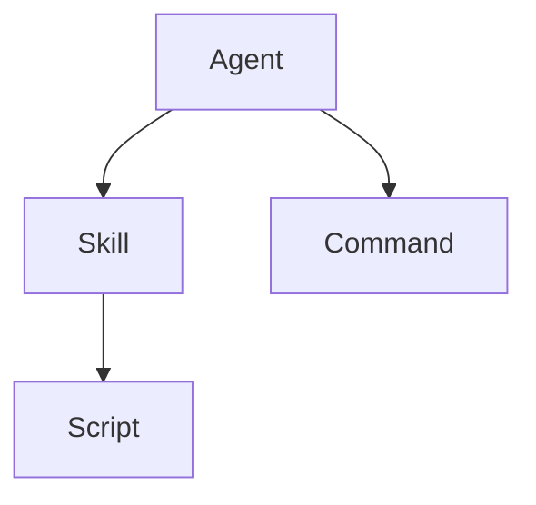

# 작업 계획서 (Project Plan)

**프로젝트명**: `.claude/` 디렉토리 구조 분석 및 문서화
**작성일**: 2025-11-09
**예상 소요 시간**: 4-6시간
**버전**: 1.0

---

## 1. 프로젝트 단계 개요

### Phase 1: 준비 및 탐색 (Preparation & Exploration)
- [x] 디렉토리 구조 파악
- [x] 공식 문서 조사
- [x] 연구 폴더 생성
- [x] 사양서 작성
- [ ] 작업 계획서 작성

### Phase 2: 상세 분석 (Detailed Analysis)
- [ ] Agents 분석
- [ ] Skills 분석
- [ ] Commands 분석
- [ ] 작업 이력 작성

### Phase 3: 관계 분석 (Relationship Analysis)
- [ ] 구조 관계 맵핑
- [ ] 워크플로우 다이어그램 작성
- [ ] 베스트 프랙티스 비교

### Phase 4: 평가 및 보고 (Evaluation & Reporting)
- [ ] 강점 및 약점 분석
- [ ] 개선 제안 도출
- [ ] 최종 평가 보고서
- [ ] 종합 요약 작성

---

## 2. 세부 작업 계획

### 2.1 Phase 1: 준비 및 탐색 (완료)

#### Task 1.1: 디렉토리 구조 파악 ✅
**목표**: `.claude/` 디렉토리의 전체 구조 파악
**방법**:
- `ls`, `find` 명령어로 파일 목록 조회
- 각 디렉토리별 파일 개수 및 크기 확인

**결과**:
- Agents: 17개 파일
- Skills: 9개 디렉토리
- Commands: 7개 파일

#### Task 1.2: 공식 문서 조사 ✅
**목표**: Claude Code 공식 문서 및 베스트 프랙티스 수집
**방법**:
- WebSearch로 최신 문서 검색
- WebFetch로 상세 내용 조회
- 핵심 개념 정리

**주요 발견**:
- Skills는 2025년 10월 도입 (최신 기능)
- Model-invoked vs User-invoked 구분 중요
- Agents가 Skills와 Commands 호출 가능

#### Task 1.3: 연구 폴더 및 문서 구조 ✅
**위치**: `research/my-project-251109/`
**파일 구조**:
```
research/my-project-251109/
├── SPEC.md           # 사양서
├── PLAN.md           # 작업 계획서
├── LOG.md            # 작업 이력
├── AGENTS.md         # 에이전트 분석
├── SKILLS.md         # 스킬 분석
├── COMMANDS.md       # 커맨드 분석
├── RELATIONSHIPS.md  # 관계 분석
├── EVALUATION.md     # 평가 보고서
└── SUMMARY.md        # 종합 요약
```

---

### 2.2 Phase 2: 상세 분석

#### Task 2.1: Agents 분석
**목표**: 17개 에이전트의 역할, 책임, 사용 방법 문서화

**분석 항목**:
1. **기본 정보**
   - 파일명
   - 파일 크기
   - 마지막 수정 날짜

2. **기능 분석**
   - 주요 역할 및 책임
   - 사용 도구 (MCP 서버, 외부 API 등)
   - 전문 분야 (콘텐츠, SEO, 분석 등)

3. **카테고리 분류**
   - 콘텐츠 관리
   - 연구 및 분석
   - SEO 및 마케팅
   - 운영 및 관리

4. **상호작용 패턴**
   - 다른 에이전트와의 협업
   - 호출하는 Skills
   - 실행하는 Commands

**작업 방법**:
```bash
# 각 에이전트 파일 읽기
Read .claude/agents/*.md

# 내용 분석 및 요약
# AGENTS.md 파일에 정리
```

**예상 소요 시간**: 2-3시간

---

#### Task 2.2: Skills 분석
**목표**: 9개 스킬 패키지의 구조, 기능, 발견 메커니즘 분석

**분석 항목**:
1. **디렉토리 구조**
   - SKILL.md 파일 존재 여부
   - 지원 파일 (scripts, templates, docs)
   - 파일 조직 방식

2. **SKILL.md 분석**
   - YAML frontmatter 검증
     - `name` 필드
     - `description` 필드
     - `allowed-tools` 필드 (선택)
   - 설명의 명확성 및 발견 가능성
   - 사용 예제 및 문서화 품질

3. **기능 분류**
   - 블로그 작성 관련
   - 분석 및 추천
   - 자동화 스크립트
   - 웹 연구 및 트렌드

4. **베스트 프랙티스 준수**
   - 명명 규칙 (소문자, 하이픈, 최대 64자)
   - Description 구체성 (발견 키워드 포함)
   - 도구 제한 사용

**작업 방법**:
```bash
# 각 스킬 디렉토리 탐색
ls -la .claude/skills/*/

# SKILL.md 파일 읽기
Read .claude/skills/*/SKILL.md

# 지원 파일 확인
find .claude/skills -type f

# SKILLS.md 파일에 정리
```

**예상 소요 시간**: 1.5-2시간

---

#### Task 2.3: Commands 분석
**목표**: 7개 커맨드의 사용 목적, 인자 패턴, 재사용성 평가

**분석 항목**:
1. **기본 정보**
   - 커맨드명 (파일명 기준)
   - 파일 크기
   - 복잡도 (줄 수, 구조)

2. **기능 분석**
   - 주요 작업 내용
   - 자동화 워크플로우
   - 사용 시나리오

3. **인자 사용 패턴**
   - `$ARGUMENTS` 사용 여부
   - 인자 검증 방식
   - 기본값 처리

4. **재사용성 평가**
   - 범용성 vs 특수 목적
   - 다른 커맨드와의 관계
   - 개선 가능성

**작업 방법**:
```bash
# 각 커맨드 파일 읽기
Read .claude/commands/*.md

# 크기 및 복잡도 측정
wc -l .claude/commands/*.md

# COMMANDS.md 파일에 정리
```

**예상 소요 시간**: 1-1.5시간

---

### 2.3 Phase 3: 관계 분석

#### Task 3.1: 구조 관계 맵핑
**목표**: Agents, Skills, Commands 간의 호출 관계 및 의존성 파악

**분석 방법**:
1. **호출 체인 추적**
   - Agent 파일에서 Skill 참조 검색
   - Agent 파일에서 Command 호출 검색
   - Skill에서 다른 Skill 참조 검색

2. **의존성 그래프 작성**
   - 각 요소의 노드 정의
   - 방향성 엣지 (호출 관계)
   - 클러스터링 (기능별 그룹화)

3. **워크플로우 시나리오**
   - 블로그 포스트 작성 플로우
   - SEO 최적화 플로우
   - 분석 및 리포팅 플로우

**산출물**:
- 관계 다이어그램 (Mermaid 형식)
- 호출 매트릭스 테이블
- 워크플로우 시나리오 문서

**예상 소요 시간**: 1-1.5시간

---

#### Task 3.2: 베스트 프랙티스 비교
**목표**: 현재 구조를 공식 권장 사항과 비교

**비교 항목**:

| 항목 | 공식 권장 | 현재 상태 | 평가 |
|------|-----------|-----------|------|
| **Agents 위치** | `~/.claude/agents/` 또는 프로젝트 루트 | `.claude/agents/` | ✅ 적합 |
| **Skills 구조** | `SKILL.md` + 지원 파일 | 확인 필요 | ? |
| **Commands 명명** | 소문자, 하이픈 | 확인 필요 | ? |
| **파일 크기** | 간결 유지 (100줄 이하 권장) | 확인 필요 | ? |
| **설명 구체성** | 발견 키워드 포함 | 확인 필요 | ? |
| **도구 제한** | `allowed-tools` 사용 | 확인 필요 | ? |

**예상 소요 시간**: 1시간

---

### 2.4 Phase 4: 평가 및 보고

#### Task 4.1: 강점 및 약점 분석
**목표**: 현재 구조의 장단점을 객관적으로 평가

**평가 기준**:
1. **유지보수성**
   - 파일 조직의 명확성
   - 네이밍 일관성
   - 문서화 품질

2. **확장성**
   - 새 Agent/Skill/Command 추가 용이성
   - 모듈화 정도
   - 중복 최소화

3. **성능**
   - 컨텍스트 효율성
   - 파일 크기 최적화
   - 불필요한 의존성

4. **보안**
   - 민감 정보 처리
   - 권한 관리
   - `allowed-tools` 활용

**산출물**: EVALUATION.md

---

#### Task 4.2: 개선 제안
**목표**: 구체적이고 실행 가능한 개선 방안 도출

**제안 카테고리**:
1. **즉시 적용 가능** (Quick Wins)
   - 간단한 리팩토링
   - 네이밍 통일
   - 문서 업데이트

2. **단기 개선** (1-2주)
   - 중복 제거
   - Skills 구조 표준화
   - 베스트 프랙티스 적용

3. **장기 개선** (1-2개월)
   - 전체 아키텍처 재설계
   - 새로운 기능 추가
   - 자동화 확대

**우선순위 기준**:
- 영향도 (High/Medium/Low)
- 난이도 (Easy/Medium/Hard)
- ROI (투자 대비 효과)

---

#### Task 4.3: 종합 요약
**목표**: 전체 분석 결과를 경영진 수준에서 이해 가능한 형태로 요약

**SUMMARY.md 구성**:
1. **Executive Summary** (1페이지)
   - 프로젝트 목적
   - 주요 발견
   - 핵심 제안

2. **현재 상태 스냅샷**
   - 구조 개요
   - 통계 요약
   - 시각화 자료

3. **핵심 인사이트** (Top 5)
   - 가장 중요한 발견 사항
   - 긍정적 패턴
   - 개선 기회

4. **액션 아이템** (Top 3)
   - 즉시 실행 가능한 제안
   - 책임자 및 일정
   - 성공 지표

**예상 소요 시간**: 1시간

---

## 3. 작업 일정

### 3.1 타임라인

```
09:00-10:00  Phase 1 완료 (준비 및 탐색) ✅
10:00-12:00  Task 2.1 (Agents 분석)
12:00-13:00  점심 휴식
13:00-14:30  Task 2.2 (Skills 분석)
14:30-15:30  Task 2.3 (Commands 분석)
15:30-15:45  휴식
15:45-17:00  Task 3.1 (관계 맵핑)
17:00-18:00  Task 3.2 (베스트 프랙티스 비교)
18:00-19:00  Task 4.1-4.3 (평가 및 보고)
```

### 3.2 체크포인트

- [ ] **10:00**: PLAN.md 완료 및 LOG.md 시작
- [ ] **12:00**: AGENTS.md 초안 완료
- [ ] **14:30**: SKILLS.md 초안 완료
- [ ] **15:30**: COMMANDS.md 초안 완료
- [ ] **17:00**: RELATIONSHIPS.md 완료
- [ ] **18:00**: EVALUATION.md 완료
- [ ] **19:00**: SUMMARY.md 완료 및 전체 검토

---

## 4. 리스크 및 대응

### 4.1 잠재적 리스크

| 리스크 | 영향도 | 확률 | 대응 방안 |
|--------|--------|------|-----------|
| 파일 수가 예상보다 많아 분석 지연 | High | Medium | 우선순위 기반 샘플링 분석 |
| Skills 구조가 베스트 프랙티스와 불일치 | Medium | Low | "현재 상태" 중심으로 분석, 개선 제안에 포함 |
| 컨텍스트 한계로 모든 파일 읽기 불가 | Medium | Low | 핵심 파일 우선, 나머지는 구조만 분석 |
| 시간 부족으로 Phase 4 축약 | Medium | Medium | Phase 3까지 완료 후 최소한의 평가만 작성 |

### 4.2 품질 보증

**검토 체크리스트**:
- [ ] 모든 문서가 마크다운 포맷 준수
- [ ] 코드 블록 및 다이어그램 정확성
- [ ] 오타 및 문법 검토
- [ ] 참고 자료 링크 유효성
- [ ] 일관된 용어 사용

---

## 5. 산출물 목록

### 5.1 필수 산출물
1. ✅ **SPEC.md**: 프로젝트 사양서
2. ⏳ **PLAN.md**: 작업 계획서 (현재 문서)
3. ⬜ **LOG.md**: 작업 이력
4. ⬜ **AGENTS.md**: 에이전트 분석 보고서
5. ⬜ **SKILLS.md**: 스킬 분석 보고서
6. ⬜ **COMMANDS.md**: 커맨드 분석 보고서
7. ⬜ **RELATIONSHIPS.md**: 구조 관계 분석
8. ⬜ **EVALUATION.md**: 평가 보고서
9. ⬜ **SUMMARY.md**: 종합 요약

### 5.2 선택적 산출물
- **DIAGRAMS.md**: 추가 시각화 자료
- **EXAMPLES.md**: 사용 예제 모음
- **MIGRATION.md**: 개선 마이그레이션 가이드

---

## 6. 참고 사항

### 6.1 도구 및 명령어

**파일 탐색**:
```bash
find .claude -type f -name "*.md"
ls -lh .claude/agents/
tree .claude/skills/
```

**파일 분석**:
```bash
wc -l .claude/commands/*.md
grep -r "@" .claude/agents/
cat .claude/skills/*/SKILL.md
```

**통계 생성**:
```bash
du -sh .claude/*
find .claude -name "SKILL.md" | wc -l
```

### 6.2 문서 작성 가이드

**마크다운 스타일**:
- 제목: `#` (H1), `##` (H2), `###` (H3)
- 강조: `**굵게**`, `*이탤릭*`
- 코드: `` `인라인` ``, ` ```블록``` `
- 리스트: `-` (불렛), `1.` (번호)
- 테이블: 파이프(`|`)와 하이픈(`-`) 사용

**다이어그램 (Mermaid)**:


---

**승인**: 작성자 확인
**시작 시간**: 2025-11-09 09:00
**예상 완료**: 2025-11-09 19:00
