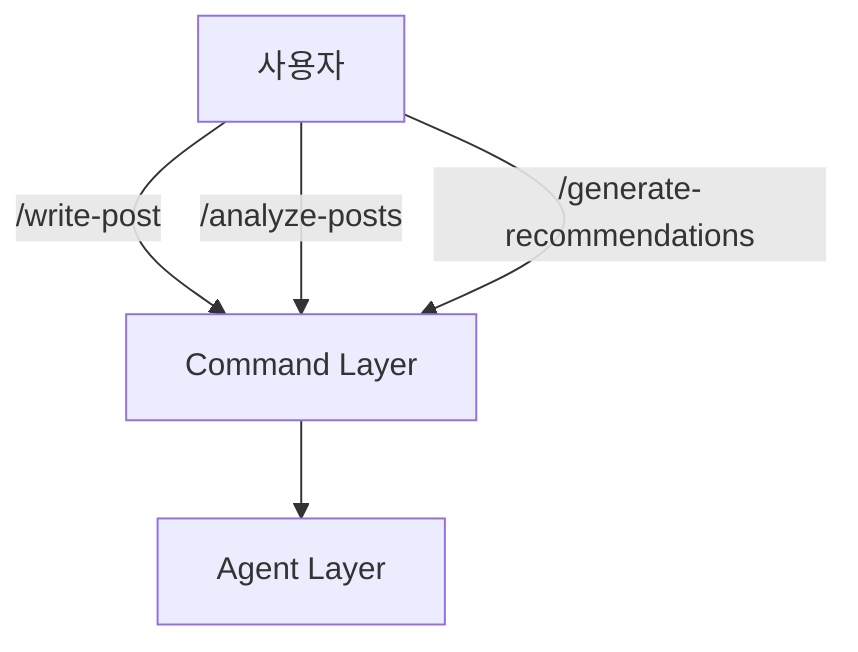
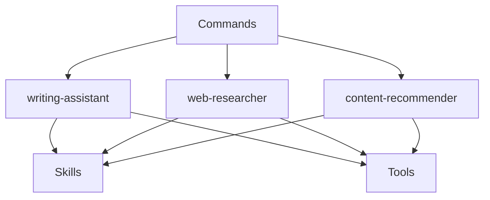
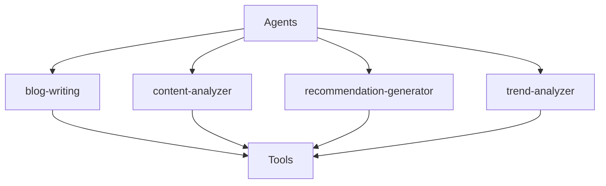
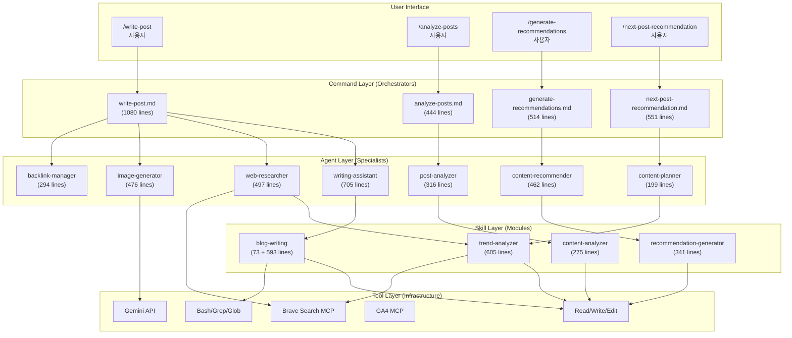
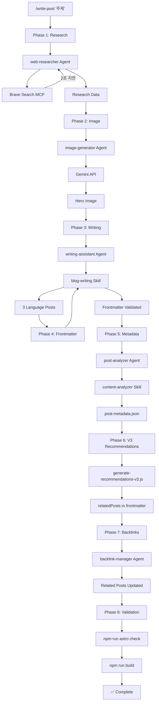
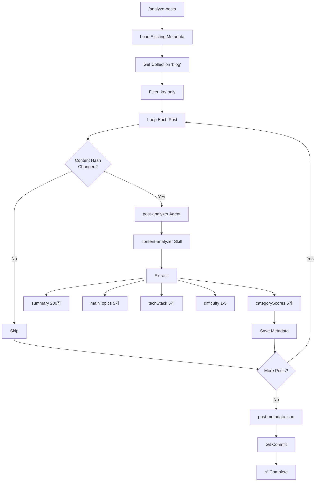
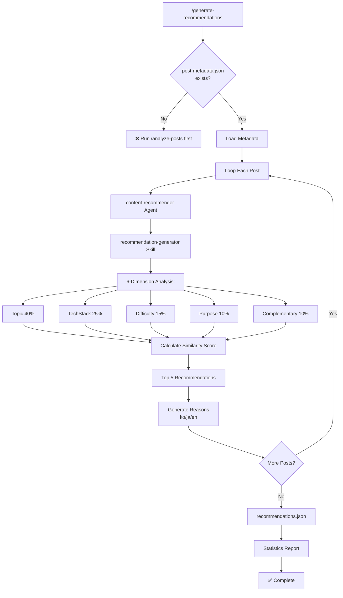
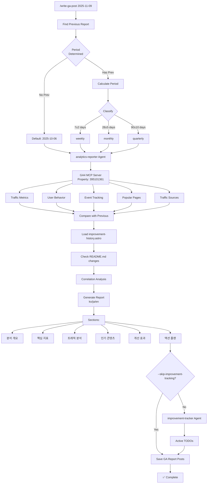
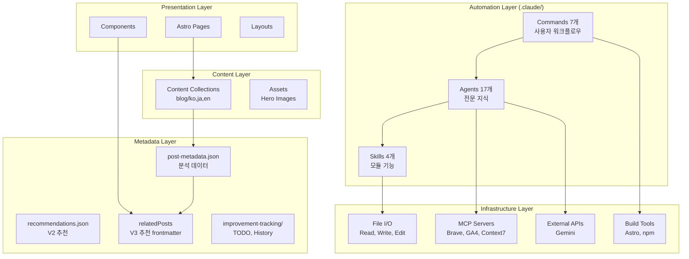
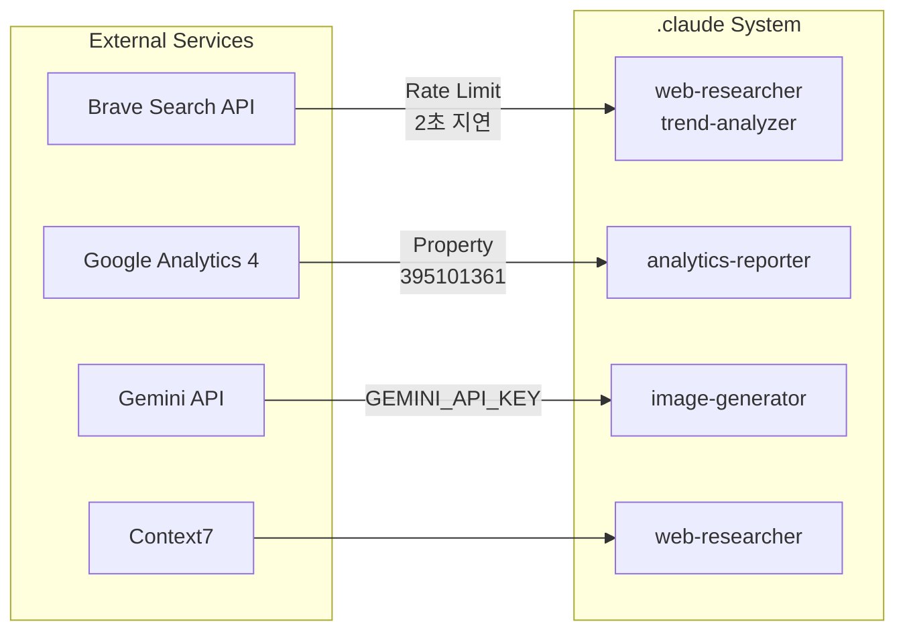

# 구조 관계 분석 (Relationship Analysis)

**작성일**: 2025-11-09
**분석 범위**: Agents (17) + Skills (4 구현) + Commands (7)

---

## 목차

1. [개요](#개요)
2. [3-Tier 아키텍처](#3-tier-아키텍처)
3. [호출 관계 다이어그램](#호출-관계-다이어그램)
4. [주요 워크플로우](#주요-워크플로우)
5. [의존성 매트릭스](#의존성-매트릭스)
6. [데이터 흐름](#데이터-흐름)
7. [통합 아키텍처](#통합-아키텍처)

---

## 개요

### 시스템 구성 요약

```
.claude/
├── Commands (7개)          # 사용자 호출 (/cmd)
│   └─> Agents (17개)      # 독립 실행, Skills/Commands 호출
│       └─> Skills (4개)   # 자동 발견, 모듈형 기능
│           └─> Tools      # 파일 I/O, MCP, Bash
```

### 핵심 개념

| 요소 | 호출 방식 | 역할 | 개수 |
|------|-----------|------|------|
| **Commands** | User-Invoked (`/cmd`) | 워크플로우 오케스트레이션 | 7 |
| **Agents** | 독립 실행 | 전문 지식 + Skills/Tools 사용 | 17 |
| **Skills** | Model-Invoked (자동) | 모듈형 기능 패키지 | 4 |
| **Tools** | Claude 내장 | 파일 I/O, MCP, Bash | 10+ |

---

## 3-Tier 아키텍처

### Layer 1: Commands (최상위)

**역할**: 사용자 인터페이스 및 워크플로우 오케스트레이터



**특징**:
- 사용자가 명시적으로 호출 (`/command-name`)
- 복잡한 다단계 워크플로우 관리
- Agents에게 작업 위임
- 최종 검증 및 출력

---

### Layer 2: Agents (중간)

**역할**: 전문 지식 + Skills/Commands 호출



**특징**:
- 독립 실행 가능 (`@agent-name "task"`)
- Skills와 Commands 호출 가능
- 전문 도메인 지식 보유
- 병렬 실행 지원

---

### Layer 3: Skills (하위)

**역할**: 자동 발견되는 모듈형 기능



**특징**:
- Claude가 자동으로 발견 및 활성화
- SKILL.md + 지원 파일 (scripts, templates, docs)
- 도구 제한 가능 (`allowed-tools`)
- 재사용 가능한 기능 패키지

---

## 호출 관계 다이어그램

### 전체 시스템 아키텍처



---

## 주요 워크플로우

### 1. 블로그 포스트 작성 워크플로우 (/write-post)



**실행 시간**: 약 5-8분
**생성 파일**: 7개 (3개 포스트 + 1개 이미지 + 3개 메타데이터)
**비용**: ~$0.15-0.20

---

### 2. 메타데이터 생성 워크플로우 (/analyze-posts)



**토큰 절감**: 60-70% (78K → 28K)
**처리 시간**: 신규 8-12초, 전체 2분
**비용**: ~$0.09 (13개 포스트)

---

### 3. 추천 생성 워크플로우 (/generate-recommendations)



**평균 유사도**: 0.68
**고품질 매칭** (>0.8): 45개
**처리 시간**: 2분 5초 (30개 포스트)
**비용**: $0.02-0.03 (메타데이터), $0.07-0.08 (전체 콘텐츠)

---

### 4. 트렌드 기반 주제 추천 (/next-post-recommendation)

```mermaid
graph TD
    Start["/next-post-recommendation"] --> META[Load post-metadata.json]

    META --> ANA[Analyze Existing Content:]
    ANA --> CAT[Category Distribution]
    ANA --> TECH[Tech Stack Coverage]
    ANA --> DIFF[Difficulty Balance]
    ANA --> CLST[Topic Clusters]

    CLST --> CP[content-planner Agent]
    CP --> TA[trend-analyzer Skill]

    TA --> CACHE{Cache<br/>Valid?}
    CACHE -->|Yes 24h| CACHED[Use Cached Data]
    CACHE -->|No| BS[Brave Search MCP]

    BS --> DLY[sleep 2]
    DLY --> S1[Tech Trends]
    DLY --> S2[Framework Updates]
    DLY --> S3[Best Practices]

    S1 --> TREND[Trend Data]
    S2 --> TREND
    S3 --> TREND
    CACHED --> TREND

    TREND --> GAP[Content Gap Analysis]
    GAP --> PRIOR[Priority Calculation]
    PRIOR --> REC10[Generate 10 Topics]

    REC10 --> EACH[Each Topic:]
    EACH --> TITLE[title]
    EACH --> CTGY[category]
    EACH --> DFLT[difficulty]
    EACH --> RAT[rationale]
    EACH --> KEY[keyPoints]
    EACH --> AUD[targetAudience]

    AUD --> SAVE[content-recommendations-{date}.md]
    SAVE --> Done[✅ Complete]
```

**캐싱 효과**: 24시간 내 반복 실행 시 검색 스킵
**처리 시간**: 45-60초 (캐시 미스), 10-15초 (캐시 히트)
**토큰 절감**: 58% (17K vs 40K+)

---

### 5. GA 분석 리포트 생성 (/write-ga-post)



**Property ID**: 395101361 (www.jangwook.net)
**분석 주기**: 자동 결정 (weekly/monthly/quarterly)
**생성 파일**: 3개 (ko/ja/en 리포트)
**통합**: improvement-tracker로 TODO 자동 생성

---

## 의존성 매트릭스

### Command → Agent 의존성

| Command | Agents | 필수/선택 |
|---------|--------|-----------|
| **write-post** | writing-assistant | 필수 |
|  | web-researcher | 필수 |
|  | image-generator | 필수 |
|  | backlink-manager | 선택 |
| **analyze-posts** | post-analyzer | 필수 |
| **generate-recommendations** | content-recommender | 필수 |
| **next-post-recommendation** | content-planner | 필수 |
| **write-ga-post** | analytics-reporter | 필수 |
|  | improvement-tracker | 선택 |
| **commit** | (없음) | - |

---

### Agent → Skill 의존성

| Agent | Skills | 필수/선택 |
|-------|--------|-----------|
| **writing-assistant** | blog-writing | 선택 (자동 발견) |
| **post-analyzer** | content-analyzer | 필수 |
| **content-recommender** | recommendation-generator | 필수 |
| **content-planner** | trend-analyzer | 선택 (자동 발견) |
| **web-researcher** | trend-analyzer | 선택 (자동 발견) |

**참고**: Skills는 모델 호출형이므로 대부분 "선택 (자동 발견)"

---

### Skill → Tool 의존성

| Skill | Tools | MCP Servers |
|-------|-------|-------------|
| **blog-writing** | Read, Write, Edit, Bash, Grep, Glob | - |
| **content-analyzer** | Read, Write, Grep, Glob | - |
| **recommendation-generator** | Read, Write | - |
| **trend-analyzer** | Read, Write, Bash | Brave Search MCP |

---

### Agent → Agent 협업

| Agent | 협업 대상 | 협업 유형 |
|-------|-----------|-----------|
| **writing-assistant** | web-researcher | 리서치 요청 |
|  | image-generator | 이미지 생성 요청 |
|  | editor | 검토 요청 |
| **web-researcher** | (독립) | - |
| **content-recommender** | post-analyzer | 메타데이터 수신 |
| **analytics-reporter** | improvement-tracker | TODO 생성 위임 |
| **backlink-manager** | seo-optimizer | 링크 전략 협의 |

---

## 데이터 흐름

### 1. 메타데이터 파이프라인

```mermaid
graph LR
    A[Blog Posts<br/>ko/ja/en] --> B[/analyze-posts]
    B --> C[post-analyzer]
    C --> D[content-analyzer Skill]
    D --> E[post-metadata.json]

    E --> F[/generate-recommendations]
    F --> G[content-recommender]
    G --> H[recommendation-generator Skill]
    H --> I[recommendations.json]

    E --> J[/write-post]
    J --> K[generate-recommendations-v3.js]
    K --> L[relatedPosts in frontmatter]
```

**핵심 데이터 파일**:
1. **post-metadata.json**: 포스트별 메타데이터 (summary, topics, techStack, difficulty, categoryScores)
2. **recommendations.json**: 전역 추천 (V2 시스템, 현재 미사용)
3. **relatedPosts in frontmatter**: V3 추천 (포스트별 embedded)

---

### 2. 콘텐츠 제작 파이프라인

```mermaid
graph TD
    subgraph "콘텐츠 기획"
        A1[Existing Posts] --> B1[/next-post-recommendation]
        A2[Web Trends] --> B1
        B1 --> C1[content-recommendations.md]
    end

    subgraph "콘텐츠 작성"
        C1 --> D1[/write-post]
        D1 --> E1[Research]
        E1 --> E2[Image]
        E2 --> E3[Writing]
        E3 --> E4[Metadata]
        E4 --> E5[Recommendations]
        E5 --> E6[Backlinks]
        E6 --> E7[Build]
    end

    subgraph "콘텐츠 분석"
        E7 --> F1[Blog Posts]
        F1 --> F2[/analyze-posts]
        F2 --> F3[post-metadata.json]
    end

    subgraph "추천 생성"
        F3 --> G1[/generate-recommendations]
        G1 --> G2[recommendations.json]
    end
```

**전체 사이클**: 주간 (Weekly Cycle)
- 월요일: `/next-post-recommendation` (주제 선정)
- 화요일-목요일: `/write-post` (포스트 작성)
- 금요일: `/analyze-posts` + `/generate-recommendations` (메타데이터)
- 주말: 검토 및 피드백

---

### 3. 분석 및 개선 사이클

```mermaid
graph TD
    A[GA4 Data] --> B[/write-ga-post]
    B --> C[analytics-reporter]
    C --> D[GA Report Posts<br/>ko/ja/en]

    C --> E[improvement-tracker]
    E --> F[Active TODOs]

    F --> G[site-manager<br/>구현]
    G --> H[seo-optimizer<br/>적용]

    H --> I[Improvements Deployed]
    I --> J[improvement-history.astro]

    J --> K[다음 GA Report]
    K --> B
```

**주기**: 주간 또는 월간
**효과**: 데이터 기반 지속적 개선

---

## 통합 아키텍처

### 전체 시스템 레이어



---

### 외부 통합 포인트



**중요 제약**:
- **Brave Search**: 2초 지연 필수
- **Gemini API**: 환경 변수 필요
- **GA4**: Property ID 고정

---

## 호출 빈도 분석

### 추정 사용 빈도

| Command | 빈도 | 시나리오 |
|---------|------|----------|
| **/write-post** | 주 1-2회 | 신규 포스트 작성 |
| **/analyze-posts** | 주 1회 | 메타데이터 업데이트 |
| **/generate-recommendations** | 주 1회 | 추천 업데이트 |
| **/next-post-recommendation** | 주 1회 | 다음 주제 선정 |
| **/write-ga-post** | 주 1회 또는 월 1회 | 분석 리포트 |
| **/commit** | 매일 수회 | Git 커밋 |

### Agent 호출 빈도 (추정)

| Agent | 호출 주체 | 주당 호출 |
|-------|-----------|-----------|
| **writing-assistant** | write-post | 1-2회 |
| **web-researcher** | write-post, next-post-recommendation | 2-3회 |
| **image-generator** | write-post | 1-2회 |
| **post-analyzer** | analyze-posts | 1회 |
| **content-recommender** | generate-recommendations | 1회 |
| **backlink-manager** | write-post | 1-2회 (선택) |
| **content-planner** | next-post-recommendation | 1회 |
| **analytics-reporter** | write-ga-post | 0.25-1회 |
| **improvement-tracker** | write-ga-post | 0.25-1회 (선택) |

**가장 많이 사용**: web-researcher, writing-assistant

---

### Skill 활성화 빈도 (추정)

| Skill | 활성화 트리거 | 주당 활성화 |
|-------|---------------|-------------|
| **blog-writing** | "blog", "post", "frontmatter" 언급 시 | 2-4회 (자동) |
| **content-analyzer** | analyze-posts 실행 시 | 1회 |
| **recommendation-generator** | generate-recommendations 실행 시 | 1회 |
| **trend-analyzer** | "trend", "trending", "popular" 언급 시 | 1-2회 (자동) |

**참고**: Skills는 모델 호출형이므로 정확한 빈도 예측 어려움

---

## 호출 체인 예시

### 예시 1: 새 블로그 포스트 작성

```
User: /write-post "Claude Code MCP Integration"

└─> write-post.md (Command)
    │
    ├─> Phase 1: web-researcher (Agent)
    │   └─> trend-analyzer (Skill, 자동 발견)
    │       └─> Brave Search MCP (Tool)
    │           └─> sleep 2 (Rate Limit)
    │
    ├─> Phase 2: image-generator (Agent)
    │   └─> Gemini API (Tool)
    │       └─> generate_image.js
    │
    ├─> Phase 3: writing-assistant (Agent)
    │   └─> blog-writing (Skill, 자동 발견)
    │       └─> Read/Write (Tools)
    │
    ├─> Phase 4: blog-writing (Skill)
    │   └─> validate_frontmatter.py
    │
    ├─> Phase 5: post-analyzer (Agent)
    │   └─> content-analyzer (Skill)
    │       └─> Read (Tool)
    │
    ├─> Phase 6: generate-recommendations-v3.js
    │   └─> similarity.js
    │       └─> post-metadata.json
    │
    ├─> Phase 7: backlink-manager (Agent)
    │   └─> Edit (Tool)
    │
    └─> Phase 8: Validation
        ├─> npm run astro check
        └─> npm run build
```

**총 실행 시간**: 5-8분
**Agent 호출**: 4개 (web-researcher, image-generator, writing-assistant, backlink-manager)
**Skill 활성화**: 2-3개 (자동)
**Tool 사용**: 10+ 회

---

### 예시 2: 메타데이터 및 추천 생성

```
User: /analyze-posts

└─> analyze-posts.md (Command)
    │
    ├─> getCollection('blog')
    ├─> filter: ko/ only (3배 비용 절감)
    │
    └─> For Each Post:
        ├─> Calculate Content Hash (SHA-256)
        ├─> Compare with Existing
        │   └─> If Changed:
        │       └─> post-analyzer (Agent)
        │           └─> content-analyzer (Skill)
        │               └─> Extract Metadata
        │                   ├─> summary (200자)
        │                   ├─> mainTopics (5개)
        │                   ├─> techStack (5개)
        │                   ├─> difficulty (1-5)
        │                   └─> categoryScores (5개)
        │
        └─> Save to post-metadata.json

User: /generate-recommendations

└─> generate-recommendations.md (Command)
    │
    ├─> Load post-metadata.json
    │   └─> If Not Found: Error (Run /analyze-posts first)
    │
    └─> For Each Post:
        └─> content-recommender (Agent)
            └─> recommendation-generator (Skill)
                ├─> 6-Dimension Analysis
                │   ├─> topic (40%)
                │   ├─> techStack (25%)
                │   ├─> difficulty (15%)
                │   ├─> purpose (10%)
                │   └─> complementary (10%)
                │
                ├─> Calculate Similarity Scores
                ├─> Select Top 5 (threshold 0.3)
                └─> Generate Reasons (ko/ja/en)

    └─> Save to recommendations.json
```

**전체 체인**: /analyze-posts → /generate-recommendations
**전제 조건**: post-metadata.json 필수
**토큰 절감**: 60-70% (메타데이터 기반)

---

## 통합 아키텍처 뷰

### 계층별 책임

```
┌─────────────────────────────────────────────────────────┐
│                    User Interface                        │
│  /write-post  /analyze-posts  /generate-recommendations │
└─────────────────────────┬───────────────────────────────┘
                          │
┌─────────────────────────┴───────────────────────────────┐
│              Command Layer (Orchestration)               │
│  • Workflow management (8 Phases)                       │
│  • Agent delegation                                      │
│  • Validation & Error handling                          │
└─────────────────────────┬───────────────────────────────┘
                          │
┌─────────────────────────┴───────────────────────────────┐
│             Agent Layer (Specialization)                 │
│  • Domain expertise (17 agents)                         │
│  • Skill & Command invocation                           │
│  • Collaborative workflows                              │
└─────────────────────────┬───────────────────────────────┘
                          │
┌─────────────────────────┴───────────────────────────────┐
│              Skill Layer (Modular Functions)             │
│  • Auto-discovered capabilities (4 skills)              │
│  • Reusable logic + scripts                             │
│  • Tool restrictions (allowed-tools)                    │
└─────────────────────────┬───────────────────────────────┘
                          │
┌─────────────────────────┴───────────────────────────────┐
│               Tool Layer (Infrastructure)                │
│  • File I/O (Read, Write, Edit)                         │
│  • Search (Grep, Glob)                                  │
│  • Execution (Bash)                                     │
│  • MCP Servers (Brave, GA4, Context7, Gemini)          │
└─────────────────────────────────────────────────────────┘
```

---

### 상호작용 패턴

#### 1. Top-Down (하향식)

```
사용자 (/command)
    ↓
Command (워크플로우 정의)
    ↓
Agent (전문 지식 적용)
    ↓
Skill (기능 실행)
    ↓
Tool (실제 작업)
```

**특징**: 명시적 제어 흐름

---

#### 2. Auto-Discovery (자동 발견)

```
Agent 실행 중
    ↓
컨텍스트 분석 ("blog post", "frontmatter" 키워드)
    ↓
Claude가 blog-writing Skill 자동 활성화
    ↓
Skill 로드 및 실행
```

**특징**: 암묵적, 컨텍스트 기반

---

#### 3. Peer-to-Peer (동등 협업)

```
writing-assistant (Agent)
    ↓ 리서치 요청
web-researcher (Agent)
    ↓ 결과 반환
writing-assistant
    ↓ 이미지 생성 요청
image-generator (Agent)
    ↓ 이미지 반환
writing-assistant
```

**특징**: 에이전트 간 수평적 협업

---

## 핵심 발견

### 1. 명확한 책임 분리

**계층**:
- Commands: 워크플로우 관리
- Agents: 전문 지식
- Skills: 모듈 기능
- Tools: 실행

**효과**: 높은 유지보수성

---

### 2. 메타데이터 중심 아키텍처

**핵심 파일**: `post-metadata.json`

**효과**:
- 60-70% 토큰 절감
- 증분 처리 가능
- 다양한 용도 재사용

**사용처**:
- /generate-recommendations
- /write-post (V3)
- /next-post-recommendation

---

### 3. 다국어 우선 설계

**모든 레이어**에서 ko/en/ja 지원:
- Commands: 다국어 리포트
- Agents: 현지화 전문
- Skills: 언어별 SEO
- Data: 다국어 reason

**효과**: 글로벌 블로그 운영 가능

---

### 4. MCP 생태계 통합

**4개 MCP 서버**:
1. Brave Search: 웹 리서치
2. GA4: 분석
3. Context7: 문서
4. Gemini: 이미지

**효과**: 외부 데이터 활용, 기능 확장

---

### 5. 비용 최적화 패턴

**3가지 전략**:
1. 메타데이터 우선 (60-70% 절감)
2. 한국어만 분석 (3배 절감)
3. 증분 처리 (불필요한 재분석 방지)

**Break-Even**: 3회 실행 후 회수

---

## 의존성 그래프

### 전체 의존성

```mermaid
graph TD
    WP[/write-post] --> WA[writing-assistant]
    WP --> WR[web-researcher]
    WP --> IG[image-generator]
    WP --> BLM[backlink-manager]

    AP[/analyze-posts] --> PA[post-analyzer]
    PA --> CA[content-analyzer]

    GR[/generate-recommendations] --> CR[content-recommender]
    CR --> RG[recommendation-generator]

    NPR[/next-post-recommendation] --> CP[content-planner]
    CP --> TA[trend-analyzer]

    WGA[/write-ga-post] --> AR[analytics-reporter]
    WGA --> IT[improvement-tracker]

    WA --> BW[blog-writing]
    WR --> TA

    style WP fill:#ffcccc
    style AP fill:#ccffcc
    style GR fill:#ccccff
    style NPR fill:#ffffcc
    style WGA fill:#ffccff
```

**범례**:
- 빨강: 콘텐츠 생성
- 초록: 메타데이터 생성
- 파랑: 추천 생성
- 노랑: 콘텐츠 기획
- 분홍: 분석 리포팅

---

### 순환 의존성 체크

**결과**: ✅ 순환 의존성 없음

**검증된 체인**:
1. /write-post → agents → skills → tools (일방향)
2. /analyze-posts → post-analyzer → content-analyzer (일방향)
3. /generate-recommendations → content-recommender → recommendation-generator (일방향)

**데이터 흐름**:
- post-metadata.json은 공유 리소스 (순환 아님)
- 각 command는 독립적으로 실행 가능

---

## 결론

### 시스템 특징

1. **계층적 구조**: Commands → Agents → Skills → Tools
2. **명확한 책임**: 각 레이어의 역할 분명
3. **모듈형 설계**: 높은 재사용성 및 확장성
4. **데이터 중심**: 메타데이터 파이프라인
5. **비용 효율**: 60-70% 토큰 절감

### 핵심 강점

1. ✅ **완전 자동화**: 블로그 운영 전 과정
2. ✅ **스마트 최적화**: 메타데이터, 캐싱, 증분 처리
3. ✅ **다국어 지원**: ko/en/ja 동등 처리
4. ✅ **MCP 통합**: 외부 데이터 활용
5. ✅ **확장 가능**: 새 Agent/Skill/Command 추가 용이

### 개선 기회

1. 🚀 **병렬 처리**: 성능 향상
2. 🚀 **커맨드 체이닝**: 자동화 확대
3. 🚀 **테스트 자동화**: 품질 보증
4. 🚀 **성능 추적**: 메트릭 대시보드

---

**작성 완료**: 2025-11-09
**다음 단계**: EVALUATION.md (평가 보고서)
