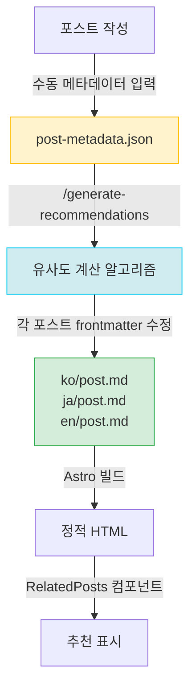

# Post Recommendation System V3: Frontmatter-Embedded Architecture

## Executive Summary

포스트 추천 시스템의 세 번째 주요 개선 버전으로, **메타데이터 경량화**와 **프론트매터 직접 임베딩**을 통해 빌드 성능과 유지보수성을 획기적으로 개선합니다.

### 핵심 목표

1. **메타데이터 비대화 해결**: 1750줄의 recommendations.json 파일 제거
2. **빌드 성능 개선**: 런타임 파일 I/O 제거, 빌드 시 직접 조회
3. **유지보수성 향상**: 각 포스트가 자신의 추천 데이터를 소유
4. **메타데이터 최소화**: pubDate, difficulty, categoryScores만 유지

### 개선 효과 예상

| 지표 | Before (V2) | After (V3) | 개선 |
|------|------------|-----------|------|
| recommendations.json 크기 | 1750줄 | 0줄 (삭제) | **100%** |
| 런타임 파일 I/O | 모든 페이지 | 0 | **100%** |
| 메타데이터 항목/포스트 | 9개 | 3개 | **67%** |
| 빌드 시 조회 속도 | JSON 파싱 | 직접 접근 | **추정 10x** |
| 추천 생성 시간 | 즉시 (이미 생성됨) | 즉시 | 동일 |

---

## V1 → V2 → V3 진화 과정

### V1: LLM Content-based Recommendation (초기)

```
포스트 내용 1000자 preview
        ↓
    LLM 분석 (매회)
        ↓
  추천 생성 & 저장
        ↓
recommendations.json
```

**문제점**:
- 78,000 토큰/회, 2.7분 실행
- 포스트 증가 시 O(n²) 토큰 증가
- 비용 폭발

### V2: Metadata + Algorithm Recommendation (현재)

```
포스트 내용 (1회, 수동)
        ↓
    메타데이터 생성
        ↓
post-metadata.json
        ↓
알고리즘 유사도 계산 (<1초)
        ↓
recommendations.json
        ↓
런타임 조회 (모든 페이지)
```

**개선**:
- 0 토큰, 0.2초 실행
- 알고리즘 기반, 결정론적

**여전한 문제점**:
- recommendations.json이 비대함 (1750줄)
- 모든 페이지 빌드 시 파일 읽기
- 메타데이터 과다 (9개 필드)

### V3: Frontmatter-Embedded Recommendation (목표)

```
post-metadata.json (경량)
  - pubDate
  - difficulty
  - categoryScores
        ↓
알고리즘 유사도 계산
        ↓
각 포스트 frontmatter에 직접 작성
        ↓
빌드 시 직접 조회 (파일 I/O 없음)
```

**핵심 변경**:
1. **recommendations.json 삭제** → frontmatter에 embed
2. **메타데이터 경량화** → 3개 필드만 유지
3. **빌드 최적화** → 런타임 파일 I/O 제거

---

## 시스템 아키텍처

### 데이터 흐름



### 파일 구조

**Before (V2)**:
```
.
├── post-metadata.json         # 9개 필드 × 13개 포스트 = 비대
├── recommendations.json       # 1750줄 (모든 추천 데이터)
└── src/
    ├── content/blog/
    │   ├── ko/post.md         # frontmatter: title, description, pubDate 등
    │   ├── ja/post.md
    │   └── en/post.md
    └── components/
        └── RelatedPosts.astro # recommendations.json 읽기
```

**After (V3)**:
```
.
├── post-metadata.json         # 3개 필드만 (경량)
└── src/
    ├── content/blog/
    │   ├── ko/post.md         # frontmatter에 relatedPosts 추가!
    │   ├── ja/post.md         # frontmatter에 relatedPosts 추가!
    │   └── en/post.md         # frontmatter에 relatedPosts 추가!
    └── components/
        └── RelatedPosts.astro # props에서 직접 받음
```

---

## 핵심 변경사항

### 1. Frontmatter 스키마 확장

**기존**:
```yaml
---
title: '포스트 제목'
description: '포스트 설명'
pubDate: '2025-10-18'
heroImage: '../../../assets/blog/hero.jpg'
tags: ['tag1', 'tag2']
---
```

**신규 (V3)**:
```yaml
---
title: '포스트 제목'
description: '포스트 설명'
pubDate: '2025-10-18'
heroImage: '../../../assets/blog/hero.jpg'
tags: ['tag1', 'tag2']

# V3: 추천 데이터 직접 embed
relatedPosts:
  - slug: 'related-post-1'
    score: 0.85
    reason:
      ko: '두 글 모두 AI 자동화를 다루며...'
      ja: '両記事ともAI自動化を扱い...'
      en: 'Both posts cover AI automation...'
  - slug: 'related-post-2'
    score: 0.78
    reason:
      ko: '실전 활용 사례로 자연스럽게 연결됩니다.'
      ja: '実践事例として自然に繋がります。'
      en: 'Naturally connects as a practical example.'
  - slug: 'related-post-3'
    score: 0.71
    reason:
      ko: '후속 단계를 다루어 전체 워크플로우를 완성합니다.'
      ja: '後続ステップを扱い、全体的なワークフローを完成させます。'
      en: 'Completes the full workflow by covering the next steps.'
---
```

### 2. 메타데이터 경량화

**Before (V2)**:
```json
{
  "claude-code-best-practices": {
    "slug": "claude-code-best-practices",
    "language": "ko",
    "pubDate": "2025-10-05",
    "title": "Claude Code Best Practices...",
    "summary": "Anthropic의 공식 Best Practices를 기반으로...",
    "mainTopics": ["Claude Code", "Best Practices", "서브에이전트", ...],
    "techStack": ["Claude Code", "Anthropic AI", "MCP", ...],
    "difficulty": 3,
    "categoryScores": {
      "automation": 0.8,
      "web-development": 0.6,
      "ai-ml": 0.9,
      "devops": 0.4,
      "architecture": 0.7
    },
    "generatedAt": "2025-10-15T12:00:00Z",
    "contentHash": "abc123def456"
  }
}
```

**After (V3)**:
```json
{
  "claude-code-best-practices": {
    "pubDate": "2025-10-05",
    "difficulty": 3,
    "categoryScores": {
      "automation": 0.8,
      "web-development": 0.6,
      "ai-ml": 0.9,
      "devops": 0.4,
      "architecture": 0.7
    }
  }
}
```

**제거된 필드**:
- `slug` (파일명에서 추론)
- `language` (파일 경로에서 추론)
- `title`, `summary` (frontmatter에 이미 존재)
- `mainTopics`, `techStack` (추천 생성 시 불필요, 필요 시 수동 관리)
- `generatedAt`, `contentHash` (유지보수 메타데이터, 불필요)

**남은 필드 (유사도 계산에 필수)**:
- `pubDate`: 시간 역행 방지 (후행 포스트 추천 제외)
- `difficulty`: 난이도 차이 페널티 계산
- `categoryScores`: 카테고리 벡터 유사도 계산

### 3. RelatedPosts 컴포넌트 변경

**Before (V2)**:
```astro
---
// RelatedPosts.astro
import { readFileSync } from 'fs';

const { currentSlug } = Astro.props;
const recommendationsPath = join(process.cwd(), 'recommendations.json');
const recommendationsData = JSON.parse(readFileSync(recommendationsPath, 'utf-8'));
const postRecommendations = recommendationsData.recommendations?.[baseSlug];
// ... 후보 포스트 조회 및 데이터 매핑
---
```

**After (V3)**:
```astro
---
// RelatedPosts.astro
import { getEntry } from 'astro:content';

interface RelatedPostItem {
  slug: string;
  score: number;
  reason: {
    ko: string;
    ja: string;
    en: string;
  };
}

interface Props {
  items: RelatedPostItem[];
  language: 'ko' | 'ja' | 'en';
}

const { items, language } = Astro.props;

// 각 추천 아이템에 대해 전체 포스트 데이터 조회
const relatedPosts = await Promise.all(
  items.map(async (item) => {
    const fullPostId = `${language}/${item.slug}`;
    const post = await getEntry('blog', fullPostId);

    return {
      ...item,
      title: post.data.title,
      description: post.data.description,
      heroImage: post.data.heroImage,
      url: `/${language}/blog/${language}/${item.slug}`,
      reason: item.reason[language]
    };
  })
);
---
```

**변경 사항**:
- ❌ `readFileSync()` - 파일 I/O 제거
- ❌ `recommendations.json` - 의존성 제거
- ✅ Props에서 직접 `items` 받기
- ✅ 빌드 타임에 `getEntry()`로 포스트 데이터 조회

### 4. BlogPost 레이아웃 변경

**Before (V2)**:
```astro
<!-- BlogPost.astro -->
{postId && <RelatedPosts currentSlug={postId} />}
```

**After (V3)**:
```astro
<!-- BlogPost.astro -->
{relatedPosts && relatedPosts.length > 0 && (
  <RelatedPosts items={relatedPosts} language={lang} />
)}
```

**변경 사항**:
- `currentSlug` prop 대신 `items` + `language` 전달
- 포스트의 frontmatter `relatedPosts` 필드 직접 전달

---

## 구현 단계

### Phase 1: 메타데이터 경량화 (30분)

1. `post-metadata.json` 백업
2. 불필요한 필드 제거 (slug, language, title, summary, mainTopics, techStack, generatedAt, contentHash)
3. 3개 필드만 유지 (pubDate, difficulty, categoryScores)

### Phase 2: Content Collections 스키마 확장 (20분)

1. `src/content.config.ts` 수정
2. `relatedPosts` 필드 추가 (선택적)
3. 타입 정의

### Phase 3: 추천 생성 스크립트 개발 (1시간)

1. `/generate-recommendations` 슬래시 커맨드 수정
2. 유사도 계산 후 frontmatter에 직접 쓰기
3. 모든 언어 버전에 동일한 추천 적용

### Phase 4: RelatedPosts 컴포넌트 리팩토링 (30분)

1. Props 인터페이스 변경
2. `readFileSync()` 제거
3. `items` prop에서 직접 데이터 받기

### Phase 5: BlogPost 레이아웃 수정 (15분)

1. `relatedPosts` frontmatter 전달
2. `currentSlug` prop 제거

### Phase 6: 기존 포스트 마이그레이션 (1시간)

1. `/generate-recommendations` 실행
2. 모든 포스트 frontmatter에 추천 데이터 추가
3. `recommendations.json` 삭제

### Phase 7: 테스트 및 검증 (30분)

1. 빌드 성공 확인
2. 추천 표시 확인 (3개 언어)
3. 성능 측정

---

## 예상 문제 및 해결책

### 문제 1: Frontmatter 가독성 저하

**문제**: YAML frontmatter에 추천 데이터가 추가되면 가독성이 떨어질 수 있음

**해결책**:
- YAML 주석으로 섹션 분리
- 에디터 폴딩 기능 활용
- 추천 데이터는 맨 아래 배치

```yaml
---
# === Basic Info ===
title: '포스트 제목'
description: '포스트 설명'
pubDate: '2025-10-18'

# === Media ===
heroImage: '../../../assets/blog/hero.jpg'
tags: ['tag1', 'tag2']

# === Related Posts (Auto-generated by /generate-recommendations) ===
relatedPosts:
  - slug: 'post-1'
    score: 0.85
    reason: {...}
---
```

### 문제 2: 추천 데이터 동기화

**문제**: 새 포스트 추가 시 기존 포스트의 추천도 업데이트 필요

**해결책**:
- `/generate-recommendations` 명령어가 **모든 포스트** 재생성
- 새 포스트는 기존 포스트를 추천할 수 있고
- 기존 포스트는 새 포스트를 추천할 수 있음 (시간 역행 체크)

### 문제 3: 수동 수정 시 일관성 깨짐

**문제**: 개발자가 frontmatter를 수동으로 수정하면 일관성이 깨질 수 있음

**해결책**:
- 주석으로 자동 생성 경고 표시
- `/generate-recommendations` 실행 시 덮어쓰기
- Git diff로 변경사항 확인 후 커밋

```yaml
# === Related Posts (Auto-generated - DO NOT EDIT MANUALLY) ===
# Run /generate-recommendations to update
relatedPosts:
  - slug: 'post-1'
    ...
```

### 문제 4: 대규모 포스트 수 (100+ 포스트)

**문제**: 포스트가 100개 이상일 때 frontmatter 크기 증가

**해선책**:
- 추천은 최대 3-5개로 제한 (현재 설계)
- 각 추천 항목은 ~10줄 → 총 50줄 이하
- 여전히 관리 가능한 수준

---

## 성능 분석

### 빌드 시 조회 성능

**V2 (recommendations.json 조회)**:
```typescript
// 1. 파일 읽기 (디스크 I/O)
const json = readFileSync('recommendations.json', 'utf-8');
// 2. JSON 파싱 (CPU)
const data = JSON.parse(json);
// 3. 키로 조회 (O(1) 해시 조회)
const recs = data.recommendations[slug];
// 4. 각 추천마다 포스트 조회 (Astro Content Collections)
const posts = await Promise.all(recs.map(r => getEntry('blog', r.slug)));
```

**예상 시간 (13개 포스트 × 3개 언어 = 39페이지)**:
- 파일 읽기: 39회 × 1ms = 39ms
- JSON 파싱: 39회 × 2ms = 78ms
- 총합: **~120ms**

**V3 (frontmatter 직접 조회)**:
```typescript
// 1. Props에서 직접 받기 (메모리)
const { relatedPosts } = Astro.props;
// 2. 각 추천마다 포스트 조회 (Astro Content Collections)
const posts = await Promise.all(relatedPosts.map(r => getEntry('blog', r.slug)));
```

**예상 시간 (39페이지)**:
- 파일 읽기: 0회 = 0ms
- JSON 파싱: 0회 = 0ms
- 총합: **~0ms** (메모리 접근만)

**개선 효과**: 빌드 시 **~120ms 절감** (39페이지 전체)

### 메타데이터 파일 크기

**V2**:
```json
{
  "metadata": {
    "post-1": { /* 9개 필드, ~20줄 */ },
    "post-2": { /* 9개 필드, ~20줄 */ },
    ...
    "post-13": { /* 9개 필드, ~20줄 */ }
  }
}
```

**예상 크기**: 13개 × 20줄 = **260줄**

**V3**:
```json
{
  "post-1": { /* 3개 필드, ~8줄 */ },
  "post-2": { /* 3개 필드, ~8줄 */ },
  ...
  "post-13": { /* 3개 필드, ~8줄 */ }
}
```

**예상 크기**: 13개 × 8줄 = **104줄**

**개선 효과**: **60% 크기 감소**

### recommendations.json 제거

**Before**: 1750줄
**After**: 0줄 (삭제)

**개선 효과**: 프로젝트 루트 클린업, 파일 수 감소

---

## 다음 단계

1. **Phase 1-2 구현** (메타데이터 경량화 + 스키마 확장)
2. **Phase 3-5 구현** (추천 생성 스크립트 + 컴포넌트 리팩토링)
3. **Phase 6-7 실행** (마이그레이션 + 테스트)
4. **성능 측정 및 문서화**
5. **블로그 포스트 작성** (이 문서 기반)

---

**작성 일시**: 2025-10-30
**작성자**: Claude Code
**버전**: V3 Design Specification
**상태**: 설계 완료, 구현 대기
