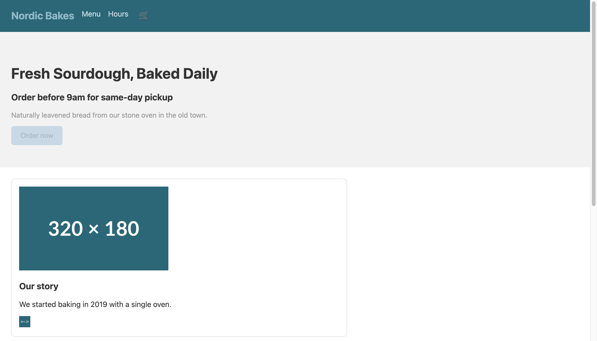
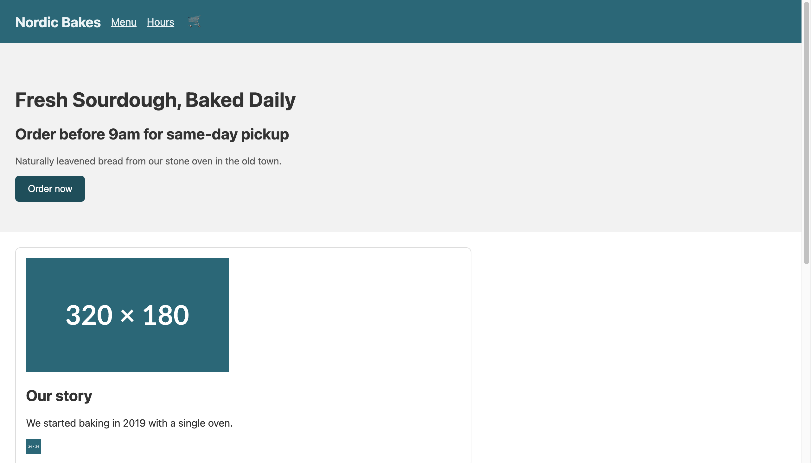

I ran the same HTML through the audit twice. First score: 55. Second score: 100. What changed in between was about twenty lines of code. Accessibility usually gets treated as a "later, if there's budget" concern, but once you actually open the markup, a lot of it turns out to be small fixes like these.

So this time I measured instead of asserting. I built a bakery landing page with common accessibility mistakes baked in on purpose, ran the Lighthouse accessibility audit in Chrome DevTools to get a score and a violation list, then fixed the violations one by one and re-measured. Every number and log below came out of that sandbox.

## Why a web developer should measure accessibility now

Accessibility (a11y) is no longer just a screen-reader-and-keyboard concern. More consumers now read your page as an accessibility tree rather than through human eyes. Screen readers always did, and now AI search crawlers and browsing agents read similar structural information too. In this very audit, fixing accessibility also pushed Lighthouse's Agentic Browsing score from 50 to 100. Get the semantic markup right and both human users and machine consumers get scored at once.

This runs along the same line as my [structured-data post arguing that the markup crawlers read is the real battleground](/en/blog/en/localbusiness-structured-data-server-side-vs-js-2026). Looking good on screen and being understood by machines are two different things. Accessibility is that "machine-readable layer" seen from the human user's side.

One thing up front. **A Lighthouse accessibility score of 100 does not mean "WCAG compliant."** As the web.dev docs make clear, this score counts only what axe-core can check automatically, and automated checks catch just a subset of problems. Later I will show you the real defects that survived at 100.

## The setup: a landing page broken on purpose

The subject is a single static HTML file in a throwaway directory outside the repo. It is a fake bakery, "Nordic Bakes," with an ordinary layout: header nav, hero, image card, reservation form, footer. Into it I planted the accessibility mistakes you actually run into in production.

- No `lang` attribute on `<html>`
- No `alt` on the hero image or the icon image inside a link
- Faint text and buttons on a light background (insufficient contrast)
- An `<h3>` right after the `<h1>`, breaking heading order
- A link wrapping only an image (an `<a>` with no text, just an image)
- `user-scalable=no, maximum-scale=1` in the viewport meta (zoom blocked)
- And two things automated tools tend to miss: a label-less `<textarea>`, and a "Send request" control that looks like a button but is really a `<div onclick>`

I served it locally with `python3 -m http.server`, pointed Chrome at the URL, and ran the Lighthouse audit in `navigation` mode (desktop).



It looks fine to the eye. The problems all sit below the surface, in the markup.

## First measurement: 55, with six violations

Here is the first result.

```text
URL: http://localhost:8765/before.html  (desktop, navigation)
Accessibility:      55
Best Practices:     100
SEO:                82
Agentic Browsing:   50
Passed: 32   Failed: 8
```

Pulling the failed audits in the accessibility category out of the report JSON gives this.

| Audit | Violation | Nodes affected |
|---|---|---|
| `html-has-lang` | `<html>` has no `[lang]` attribute | 1 |
| `image-alt` | Images have no `[alt]` | 2 |
| `color-contrast` | Foreground/background contrast too low | 4 |
| `heading-order` | Headings do not descend sequentially | 1 |
| `link-name` | Link has no discernible name | 1 |
| `meta-viewport` | `user-scalable="no"` / `maximum-scale<5` | 1 |

All six are the kind you can judge from markup alone, exactly what automated checks are good at. And all six are concrete barriers for real users. Without `lang`, a screen reader cannot decide which language voice engine to read with. Without `alt`, an image is read as just "image" or a file name. Blocking zoom stops low-vision users from enlarging the screen.

## Fixing them one by one, shown as code diffs

The fixes are not hard. The point is to put meaning, not decoration, into the code.

**1) Declare the document language.** A one-character problem.

```html
<!-- before -->
<html>
<!-- after -->
<html lang="en">
```

**2) Image alternative text.** Give informative images their content, and give purely decorative ones an empty `alt=""`. Both images here carry meaning, so I filled them with descriptions.

```html
<!-- before -->

<a href="/story"></a>
<!-- after -->

<a href="/story"></a>
```

The second fix resolves not only `image-alt` but `link-name` too. When a link holds only an image with no text, the moment its alt is filled that alt becomes the link's accessible name. Fixing one violation and having another disappear with it is a common pattern in accessibility work.

**3) Color contrast.** The before CTA button was faint gray text (`#aab8c2`) on a light blue background (`#c8d8e4`), far under AA (4.5:1 for body, 3:1 for large text). I just darkened the colors.

```css
/* before */
.cta { background:#c8d8e4; color:#aab8c2; }
.hero p { color:#9a9a9a; }
/* after */
.cta { background:#1f4e5a; color:#ffffff; }   /* large jump in contrast */
.hero p { color:#595959; }                     /* passes AA over #f2f2f2 */
```

**4) Heading order.** In before, an `<h3>` followed the `<h1>` directly. Screen-reader users skim headings to grasp page structure, so skipping a level sounds like a table of contents with a rung missing. I kept the visual size in CSS and lowered the markup level to `<h2>` as the logic demands.

```html
<!-- before -->
<h1>Fresh Sourdough, Baked Daily</h1>
<h3>Order before 9am for same-day pickup</h3>
<!-- after -->
<h1>Fresh Sourdough, Baked Daily</h1>
<h2>Order before 9am for same-day pickup</h2>
```

**5) Allow zoom.** I removed the zoom-blocking attributes from the viewport meta. Blocking zoom is a classic anti-pattern developers slip in under the banner of "prevent layout breakage."

```html
<!-- before -->
<meta name="viewport" content="width=device-width, initial-scale=1,
      user-scalable=no, maximum-scale=1">
<!-- after -->
<meta name="viewport" content="width=device-width, initial-scale=1">
```

On top of that I changed the nav from a `<div>` to `<nav aria-label="Primary">` and added `aria-label="Open cart"` to the icon button (🛒). Those did not show up directly in the score, but they genuinely improve the screen-reader experience.

## Second measurement: 100, and one SEO line left over

I re-audited the after page with the same procedure.

```text
URL: http://localhost:8765/after.html  (desktop, navigation)
Accessibility:      100    (was 55)
Best Practices:     100
SEO:                91     (was 82)
Agentic Browsing:   100    (was 50)
Passed: 46   Failed: 1
```



Accessibility hit 100 with zero violations. The one remaining failure was not accessibility but `meta-description` in the SEO category (no description meta tag). That was outside this experiment's scope, so I left it. Worth noticing: Agentic Browsing jumped from 50 to 100 alongside. Semantic elements (`nav`, a proper heading hierarchy, named controls) are exactly what a browsing agent uses to parse page structure too. One set of accessibility fixes lifted three categories at once.

## What the automated tool missed while awarding 100

This is the part I most want to land. **The 100-point page still had real accessibility defects.**

Remember the two traps I planted in the before page: a label-less `<textarea>`, and a "Send request" control styled like a button but actually a `<div onclick="submitForm()">`. I checked the scores of the relevant audits directly in the report JSON.

```text
label                          => score: 1   (passed)
button-name                    => score: 1   (passed)
focusable-controls             => score: null (manual-only)
interactive-element-affordance => score: null (manual-only)
```

The label-less textarea **passed** the `label` audit. The fake-button div **passed** the `button-name` audit, because the tool does not even recognize the div as a button. A "buttons have a name" rule does not apply to something that is not a button. And `focusable-controls`, the audit that would catch this div's real problem (you can neither focus nor activate it from the keyboard), is classified as manual, so it never enters the score.

Put plainly: a div with only an onclick clicks with a mouse but is a nonexistent button for keyboard users. A `<div>` is not focusable by default and does not respond to Enter or Space. The right fix is a `<button type="submit">`, or, only when truly unavoidable, `role="button"` plus `tabindex="0"` plus key handlers, all together. On the after page I simply switched to a real `<button>`.

Honestly, I think this is the biggest trap in accessibility scoring. A 100 means "no automatically detectable problems," not "a usable page." Chase the score and you end up optimizing defects into the corners the tool cannot see.

## So here is what a developer should do right away (checklist)

The working order I took away from this experiment.

- **Put automated audits in CI, but do not mistake a pass for final sign-off.** Wire Lighthouse CI or `axe-core` into the build to guard against regressions. Machine-judgeable violations like `lang`, `alt`, contrast, headings, and link names get caught entirely at this layer.
- **Even at 100, run one keyboard pass by hand.** Check that Tab reaches and activates every interactive element and that focus order matches visual order. Fake controls like `<div onclick>` are caught only here.
- **Always give icon-only buttons an accessible name**, whether via `aria-label` or visually hidden text. A button holding only a 🛒 is read as plain "button."
- **Measure contrast when the design is locked**, not later. Fixing it afterward means reworking the whole brand palette. AA is 4.5:1 for body, 3:1 for large text.
- **Set heading levels by document structure, not size.** Want it bigger? Enlarge it in CSS. Do not put an `h3` directly under an `h1`.
- **Do not block zoom.** `user-scalable=no` and a small `maximum-scale` shut out low-vision users.

The core of that order is the division of labor between automated and manual. Automated tools cheaply block repeatable, mechanical violations; humans check the thing tools cannot see in principle, whether it is actually usable. Do only one and you are half done. And either way, before you trust someone else's benchmark, the first move is to pull before/after numbers in your own environment, the way I did when I [treated my own site as the thing to measure](/en/blog/en/multilingual-llm-token-tax-experiment).

If you want an existing site checked with real scores and a keyboard pass, or want contrast and semantic structure nailed down at the design-system stage, I take on consulting and reviews personally. Reach me through the contact path on my profile. This is not a pitch, just someone who works this layer taking a look alongside you.
